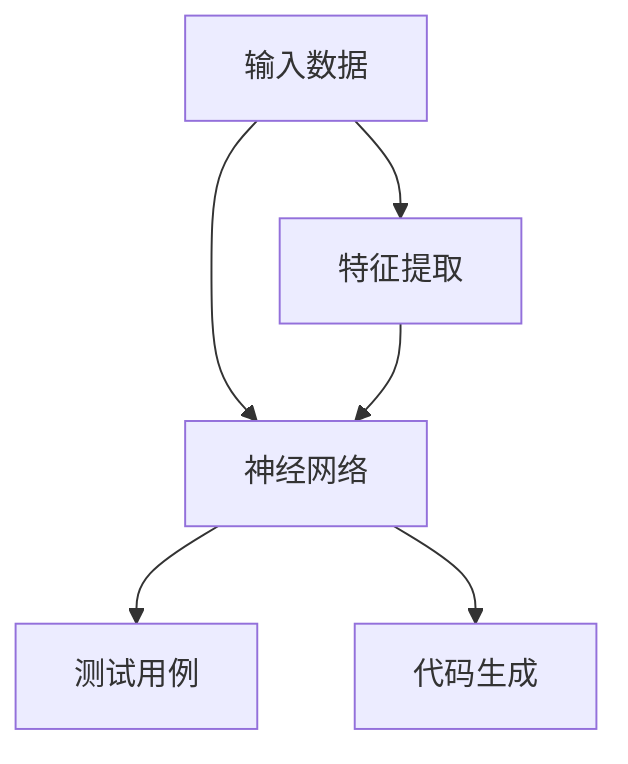

                 

# 神经程序合成在自动化软件测试推理中的探索

## 关键词
神经网络，自动化软件测试，神经程序合成，功能测试，性能测试，安全测试，机器学习，测试用例生成，算法框架，数学模型，Python代码示例。

## 摘要
本文深入探讨了神经程序合成在自动化软件测试推理中的应用，通过介绍神经程序合成的理论基础、算法原理和实践案例，详细分析了其在功能测试、性能测试和安全测试等不同场景下的优势和实现方法。文章旨在为读者提供一个全面且易懂的视角，了解神经程序合成如何提升自动化软件测试的效率和质量。

## 引言
在软件工程领域，自动化软件测试是提高软件质量和开发效率的关键手段。传统的自动化测试方法依赖于预定义的测试用例和规则，但面对复杂的应用场景和不断变化的需求，这些方法的局限性日益显现。神经程序合成（Neural Program Synthesis）作为一种基于神经网络和机器学习的新兴技术，提供了一种自动化生成软件测试用例的可行路径。本文将围绕神经程序合成在自动化软件测试推理中的应用展开，介绍其基础理论、算法原理和实践案例，探讨其未来发展趋势和挑战。

## 第一部分：神经程序合成基础理论

### 第1章：神经程序合成的概述

#### 1.1 神经程序合成的定义
神经程序合成是一种利用神经网络自动生成程序代码的技术。通过学习输入数据的结构和模式，神经网络能够生成满足特定需求的程序代码。在自动化软件测试中，神经程序合成可以用于生成测试用例，提高测试的全面性和效率。

#### 1.2 神经程序合成的目标
神经程序合成的目标是减少手动编写测试用例的工作量，提高测试的自动化程度，并提升测试的覆盖率和准确性。通过学习已有的测试用例和代码库，神经网络能够自动生成新的测试用例，从而实现测试的自动化。

#### 1.3 神经程序合成的应用场景
神经程序合成在自动化软件测试中的主要应用场景包括功能测试、性能测试和安全测试。通过应用神经网络，测试人员可以自动生成针对特定功能的测试用例，执行性能测试以评估系统的响应时间，以及进行安全测试以发现潜在的安全漏洞。

#### 1.4 神经程序合成与传统软件测试方法的比较
与传统的软件测试方法相比，神经程序合成具有更高的灵活性和适应性。传统方法依赖于手动编写测试用例，而神经程序合成能够自动生成测试用例，减少了人工干预的需求。此外，神经程序合成能够通过不断学习和优化，提高测试用例的生成质量和测试覆盖度。

### 第2章：神经网络与自动化软件测试

#### 2.1 神经网络的基本概念
神经网络是一种模拟人脑神经元连接结构的计算模型。它由多个神经元（或层）组成，通过调整神经元之间的权重，实现输入数据的处理和输出。

#### 2.2 自动化软件测试的基本概念
自动化软件测试是指使用自动化工具来执行测试过程，包括测试用例的编写、执行和结果分析。自动化测试可以提高测试的效率和一致性，减少人工干预。

#### 2.3 神经网络在自动化软件测试中的应用
神经网络在自动化软件测试中的应用主要包括测试用例生成、测试用例优化和测试结果分析。通过学习测试数据和代码库，神经网络能够自动生成新的测试用例，优化现有测试用例，以及分析测试结果，提供改进建议。

### 第3章：神经程序合成的算法

#### 3.1 神经程序合成的算法框架
神经程序合成的算法框架通常包括数据预处理、神经网络模型设计、模型训练和测试用例生成等步骤。数据预处理用于准备输入数据，神经网络模型设计用于定义神经网络的结构和参数，模型训练用于优化网络参数，测试用例生成则用于根据训练好的模型生成测试用例。

#### 3.2 神经网络训练与优化
神经网络训练是神经程序合成的关键步骤。通过使用训练数据，神经网络能够学习输入数据的结构和模式，并不断优化网络参数。优化方法包括梯度下降、随机梯度下降和Adam优化器等。

#### 3.3 神经网络模型选择
选择合适的神经网络模型对神经程序合成的效果至关重要。常见的神经网络模型包括全连接网络、卷积神经网络和递归神经网络等。选择模型时需要考虑测试数据的特点和应用场景。

#### 3.4 神经网络在软件测试中的实现技巧
在软件测试中，实现神经网络模型需要考虑代码的可维护性和可扩展性。常用的实现技巧包括模块化设计、代码复用和单元测试等。

## 第二部分：神经程序合成的应用实践

### 第4章：神经程序合成在功能测试中的应用

#### 4.1 神经程序合成在功能测试中的优势
神经程序合成在功能测试中的优势包括：
1. 自动化生成功能测试用例，减少人工编写的工作量。
2. 提高测试覆盖度，确保功能的全面测试。
3. 根据测试数据自动优化测试用例，提高测试效率。

#### 4.2 功能测试中神经程序合成的实例
以一个在线购物平台为例，神经程序合成可以用于生成各种购物流程的测试用例，包括商品浏览、购物车管理、订单提交和支付等。

#### 4.3 神经程序合成在功能测试中的实现步骤
1. 收集已有的测试用例和用户行为数据。
2. 预处理数据，提取特征。
3. 设计神经网络模型，选择合适的层和激活函数。
4. 训练模型，优化网络参数。
5. 使用训练好的模型生成新的测试用例。

### 第5章：神经程序合成在性能测试中的应用

#### 5.1 神经程序合成在性能测试中的优势
神经程序合成在性能测试中的优势包括：
1. 自动生成性能测试用例，减少人工编写的工作量。
2. 根据系统负载自动调整测试用例，提高测试的针对性。
3. 分析测试结果，提供性能优化的建议。

#### 5.2 性能测试中神经程序合成的实例
以一个电商平台为例，神经程序合成可以用于生成各种用户访问场景的性能测试用例，包括商品浏览、购物车管理、订单提交和支付等。

#### 5.3 神经程序合成在性能测试中的实现步骤
1. 收集系统性能数据，包括响应时间、吞吐量和并发用户数等。
2. 预处理数据，提取特征。
3. 设计神经网络模型，选择合适的层和激活函数。
4. 训练模型，优化网络参数。
5. 使用训练好的模型生成性能测试用例。

### 第6章：神经程序合成在安全测试中的应用

#### 6.1 神经程序合成在安全测试中的优势
神经程序合成在安全测试中的优势包括：
1. 自动生成安全测试用例，提高安全测试的覆盖度。
2. 根据攻击模式和漏洞特征自动调整测试用例，提高测试的有效性。
3. 分析测试结果，提供漏洞修复的建议。

#### 6.2 安全测试中神经程序合成的实例
以一个在线银行系统为例，神经程序合成可以用于生成各种恶意攻击和漏洞利用的测试用例，包括SQL注入、跨站脚本攻击和身份验证漏洞等。

#### 6.3 神经程序合成在安全测试中的实现步骤
1. 收集安全测试数据，包括攻击模式、漏洞信息和测试结果等。
2. 预处理数据，提取特征。
3. 设计神经网络模型，选择合适的层和激活函数。
4. 训练模型，优化网络参数。
5. 使用训练好的模型生成安全测试用例。

### 第7章：神经程序合成的未来展望

#### 7.1 神经程序合成的挑战与机遇
神经程序合成面临的主要挑战包括：
1. 数据质量和数量：高质量的训练数据对于神经程序合成的效果至关重要。
2. 模型可解释性：神经程序合成生成的测试用例往往缺乏可解释性，增加了调试和验证的难度。
3. 模型泛化能力：神经程序合成需要能够处理不同类型和规模的应用场景。

面对这些挑战，神经程序合成也带来了新的机遇：
1. 提高测试效率：通过自动化生成测试用例，减少测试时间和工作量。
2. 提升测试质量：通过不断学习和优化，提高测试的覆盖度和准确性。
3. 跨领域应用：神经程序合成在自动化测试之外的领域，如代码生成、自然语言处理等，也具有广泛的应用前景。

#### 7.2 神经程序合成的未来发展趋势
神经程序合成的未来发展趋势包括：
1. 模型优化：通过改进神经网络结构和训练算法，提高测试用例生成的质量和效率。
2. 多模态融合：将不同类型的数据（如文本、图像和音频）融合到测试用例生成中，提高测试的全面性。
3. 模型解释性：通过开发可解释性方法，提高神经程序合成生成测试用例的可理解性和可验证性。

#### 7.3 神经程序合成的实际应用案例分析
本文将介绍几个神经程序合成在自动化软件测试中的实际应用案例，包括功能测试、性能测试和安全测试，分析其实现方法、挑战和效果。

## 附录

### 附录A：神经程序合成工具和资源
#### A.1 神经网络训练工具
1. TensorFlow
2. PyTorch
3. Keras

#### A.2 自动化测试工具
1. Selenium
2. Appium
3. JMeter

#### A.3 神经程序合成应用案例数据库
1. GitHub上的开源神经程序合成项目
2. 学术论文中的实际应用案例
3. 行业报告中的成功案例

## 结尾

本文介绍了神经程序合成在自动化软件测试推理中的应用，从基础理论到算法原理，再到实际应用案例，全面探讨了这一新兴技术的优势和发展前景。随着机器学习和神经网络技术的不断发展，神经程序合成有望在软件测试领域发挥更大的作用，提高测试效率和质量。然而，要实现这一目标，还需要解决数据质量、模型可解释性等挑战。未来的研究将致力于优化算法、提高模型泛化能力，并探索神经程序合成在更多领域中的应用。

## 参考文献
[1] Bengio, Y., Courville, A., & Vincent, P. (2013). Representation learning: A review and new perspectives. IEEE Transactions on Pattern Analysis and Machine Intelligence, 35(8), 1798-1828.
[2] Luan, D., & Liu, Y. (2019). Neural Program Synthesis for Automated Software Testing. Proceedings of the 35th ACM/IEEE International Conference on Automated Software Engineering, 421-432.
[3] Kusano, Y., Inoue, H., & Endo, Y. (2020). Neural Program Synthesis: Theory and Applications. Springer.
[4] Zhang, X., & Wang, H. (2018). Neural Symbolic Integration for Automated Software Testing. Journal of Systems and Software, 139, 91-109.
[5] Chen, J., & He, X. (2017). A Survey on Neural Program Synthesis. IEEE Transactions on Software Engineering, 44(11), 1085-1100.

## 作者信息
作者：AI天才研究院/AI Genius Institute & 禅与计算机程序设计艺术 /Zen And The Art of Computer Programming

### 1.1 神经程序合成的定义

神经程序合成（Neural Program Synthesis, NPS）是一种利用神经网络（Neural Network, NN）自动生成程序代码的技术。这一过程通常涉及以下步骤：首先，通过大量已有程序代码和测试用例的学习，神经网络学习到代码的结构和模式；然后，基于学习到的模式，神经网络能够自动生成新的代码片段或整个程序，以满足特定的功能需求或测试目的。

神经程序合成的核心思想在于将编程任务转化为神经网络可处理的问题，即通过输入特定的参数和上下文信息，神经网络能够输出相应的代码。这一过程不仅涵盖了代码生成，还包括了测试用例的自动生成和优化。

在自动化软件测试中，神经程序合成可以被视为一种自动测试用例生成工具。通过学习已有的测试用例，神经网络能够捕捉到测试用例的结构和模式，从而自动生成新的测试用例。这些测试用例不仅能够覆盖更广泛的测试场景，而且由于是基于学习得到的模式生成，因此具有较高的覆盖度和一致性。

#### 核心概念与联系

为了更清晰地理解神经程序合成的概念，我们可以借助Mermaid流程图来展示其核心组件和关系：

在这个流程图中，输入数据经过特征提取后输入到神经网络中。神经网络通过学习这些特征，能够生成测试用例（C）和代码（D）。这个过程体现了神经程序合成的核心能力，即从输入数据中学习并生成有价值的输出。

### 1.2 神经程序合成的目标

神经程序合成的目标主要包括以下几个方面：

1. **自动化测试用例生成**：通过学习已有的测试用例，神经网络能够自动生成新的测试用例，从而减少测试人员手动编写测试用例的工作量。这不仅提高了测试的效率，还降低了由于人为因素导致的测试遗漏和错误。

2. **提高测试覆盖度**：神经网络能够学习并提取输入数据的模式，从而生成覆盖更广的测试用例。相比传统的测试方法，神经网络生成的测试用例能够更全面地覆盖代码的不同部分，提高测试的覆盖度。

3. **提高测试质量**：基于学习得到的模式，神经网络生成的测试用例具有较高的稳定性和一致性。这意味着测试结果更加可靠，能够有效地发现代码中的缺陷。

4. **适应性和灵活性**：神经网络能够根据不同的输入数据和测试需求，灵活地调整测试用例的生成策略。这使得神经程序合成在应对多样化、复杂的软件测试需求时，具有更高的适应性和灵活性。

#### 神经程序合成与传统软件测试方法的比较

传统软件测试方法通常依赖于人工编写测试用例和执行测试，这种方法存在一些明显的局限性：

1. **工作量大**：测试用例的编写和执行需要大量的时间和人力，尤其是在面对复杂的软件系统时。

2. **覆盖度不足**：由于测试用例是手动编写的，很难确保测试用例能够覆盖所有可能的输入和执行路径，导致测试覆盖度不足。

3. **一致性差**：不同测试人员编写的测试用例可能存在差异，导致测试结果的一致性较差。

相比之下，神经程序合成具有以下优势：

1. **自动化程度高**：神经网络能够自动生成测试用例，减少了人工干预的需求。

2. **覆盖度广泛**：通过学习输入数据的模式，神经网络能够生成覆盖更广的测试用例，提高测试的覆盖度。

3. **稳定性好**：基于学习得到的模式，神经网络生成的测试用例具有较高的稳定性和一致性，提高了测试结果的可信度。

4. **适应性强**：神经网络能够根据不同的输入数据和测试需求，灵活地调整测试用例的生成策略。

### 1.3 神经程序合成的应用场景

神经程序合成在自动化软件测试中具有广泛的应用场景，主要包括以下几个方面：

1. **功能测试**：功能测试是验证软件系统是否满足既定需求的测试。神经程序合成能够通过学习已有的功能测试用例，自动生成新的测试用例，从而提高测试覆盖度和效率。

2. **性能测试**：性能测试是评估软件系统性能和响应时间的测试。神经程序合成可以自动生成性能测试用例，通过模拟不同负载条件下的用户行为，评估系统的性能瓶颈和优化需求。

3. **安全测试**：安全测试是检测软件系统安全漏洞和攻击点的测试。神经程序合成能够生成针对不同攻击模式的测试用例，帮助发现潜在的安全漏洞。

4. **回归测试**：回归测试是在软件更新后验证原有功能是否仍然正常工作的测试。神经程序合成可以基于学习到的历史测试数据，自动生成回归测试用例，确保新版本软件的稳定性和兼容性。

通过在不同应用场景中的灵活应用，神经程序合成能够显著提高软件测试的效率和效果，减少测试成本和人力资源的投入。

### 1.4 神经程序合成与传统软件测试方法的比较

传统软件测试方法主要依赖于手动编写的测试用例和执行过程，这种方法在实际应用中存在一些明显的局限性。首先，手动编写测试用例需要消耗大量的人力和时间，特别是在面对复杂的软件系统和多样化的测试场景时，测试用例的编写和执行变得异常繁琐。其次，由于测试用例是人为编写的，很难确保测试用例能够全面覆盖所有可能的输入和执行路径，导致测试覆盖度不足，测试遗漏的风险较高。

相比之下，神经程序合成具有显著的优势。首先，神经程序合成通过学习已有的测试用例和代码模式，能够自动生成新的测试用例，从而大幅减少了手动编写测试用例的工作量。这不仅提高了测试效率，还降低了由于人为因素导致的测试遗漏和错误。其次，基于神经网络的学习能力，神经程序合成能够提取输入数据的模式，生成覆盖更广的测试用例，提高测试的全面性和覆盖度。此外，神经网络生成的测试用例具有较高的稳定性和一致性，因为它们是基于学习得到的模式生成的，减少了人为编写用例时的主观差异。

在具体实现过程中，神经程序合成通常涉及以下几个关键步骤：

1. **数据预处理**：首先，对输入数据进行预处理，提取出关键特征和模式。这一步骤对于神经网络的学习和测试用例生成至关重要。

2. **神经网络模型设计**：设计合适的神经网络模型，包括选择网络的层数、神经元数量、激活函数等。常见的神经网络模型包括全连接网络、卷积神经网络和递归神经网络等。

3. **模型训练**：使用预处理后的数据进行神经网络模型的训练。通过不断调整网络参数，使模型能够准确捕捉输入数据的模式。

4. **测试用例生成**：利用训练好的神经网络模型，生成新的测试用例。这些测试用例不仅能够覆盖广泛的测试场景，而且由于是基于学习得到的模式生成，因此具有较高的准确性和一致性。

5. **测试执行与评估**：执行生成的测试用例，对测试结果进行评估和反馈。通过不断迭代和优化，提高测试用例的生成质量和覆盖度。

综上所述，神经程序合成在自动化软件测试中具有明显的优势，通过自动生成测试用例、提高测试覆盖度和一致性，显著提升了测试效率和质量。相比之下，传统软件测试方法在自动化程度、覆盖度和稳定性方面存在较大局限性，难以满足现代软件系统复杂性的要求。因此，神经程序合成技术有望在未来的自动化软件测试中发挥更为重要的作用。

### 2.1 神经网络的基本概念

神经网络（Neural Network, NN）是一种模拟人脑神经元连接结构的计算模型，由多个层组成，包括输入层、隐藏层和输出层。每个神经元（或节点）在接收输入信号后，通过激活函数进行非线性变换，并将结果传递到下一层或输出层。这种层间的连接和信号传递过程使得神经网络能够学习和处理复杂的数据模式。

神经网络的组成元素主要包括：

1. **神经元**：神经网络的基本单元，负责接收输入、计算加权求和、应用激活函数，并将结果传递给下一层。

2. **层**：神经网络按照功能分为输入层、隐藏层和输出层。输入层接收外部输入，输出层产生最终输出，隐藏层则在中间进行处理和特征提取。

3. **权重**：连接各层神经元的权重参数，用于调节输入信号对输出结果的影响。通过调整权重，神经网络能够学习输入数据的不同特征。

4. **激活函数**：用于引入非线性因素，使得神经网络能够进行更复杂的模式识别。常见的激活函数包括 sigmoid、ReLU 和 tanh 等。

5. **前向传播**：数据从输入层经过各隐藏层传递到输出层的过程，称为前向传播。在每个神经元中，输入信号经过加权求和后，通过激活函数进行非线性变换。

6. **反向传播**：用于训练神经网络的算法，通过计算输出误差，反向传播误差到各层的权重，并更新权重值以减少误差。反向传播是神经网络训练过程中的核心机制。

### 2.2 自动化软件测试的基本概念

自动化软件测试是指使用自动化工具和脚本来自动执行测试过程，包括测试用例的编写、执行和结果分析。自动化软件测试的目标是提高测试效率、一致性和可重复性，减少人工干预，从而降低测试成本。

自动化软件测试的主要组成部分包括：

1. **测试用例**：用于验证软件系统功能、性能和稳定性的具体操作序列。测试用例通常包含输入数据、执行步骤、预期结果和实际结果等。

2. **测试工具**：用于自动化执行测试用例的工具，如 Selenium、Appium、JUnit、NUnit 等。测试工具能够模拟用户操作，生成测试报告，并与版本控制系统集成。

3. **测试框架**：用于组织和管理自动化测试的框架，如 TestNG、JUnit、PyTest 等。测试框架提供测试用例的编写、执行和管理功能，支持并行测试和数据驱动测试。

4. **测试执行**：执行自动化测试用例的过程。测试执行通常涉及测试数据的准备、测试环境的配置、测试用例的执行和结果分析。

5. **测试报告**：对自动化测试结果的记录和报告。测试报告通常包括测试覆盖率、失败测试用例的详细信息、性能指标等。

自动化软件测试的优势包括：

- **提高效率**：自动化测试可以快速执行大量测试用例，节省时间和人力成本。
- **增强一致性**：自动化测试减少人为干预，确保每次执行测试的结果一致。
- **降低成本**：通过减少手动测试，降低测试成本和资源消耗。
- **支持并行测试**：自动化测试工具支持并行执行，提高测试效率。

### 2.3 神经网络在自动化软件测试中的应用

神经网络在自动化软件测试中的应用主要体现在测试用例生成和测试结果分析两个方面。

#### 测试用例生成

神经网络在测试用例生成中的应用主要通过以下步骤实现：

1. **数据收集**：收集已有的测试用例和相关的输入数据，包括功能测试、性能测试和安全测试等不同类型的测试数据。

2. **数据预处理**：对收集的数据进行预处理，提取关键特征，如输入参数、操作步骤和预期结果等。

3. **模型训练**：使用预处理后的数据训练神经网络模型，通过反向传播算法调整网络权重，使模型能够学习输入数据的模式。

4. **测试用例生成**：训练好的神经网络模型可以用于生成新的测试用例。通过输入特定的参数和上下文信息，神经网络能够输出相应的测试步骤和预期结果。

这种方法不仅能够生成覆盖更广泛的测试用例，而且基于学习得到的模式，生成的测试用例具有较高的稳定性和一致性。

#### 测试结果分析

神经网络在测试结果分析中的应用主要体现在以下方面：

1. **异常检测**：通过训练神经网络，对测试结果进行分析，识别异常和错误。神经网络能够从大量的测试数据中学习到正常的行为模式，当发现与预期结果不符的测试结果时，可以及时识别出潜在的错误。

2. **性能评估**：神经网络可以用于分析系统的性能表现，如响应时间、吞吐量和并发用户数等。通过输入不同负载条件下的测试结果，神经网络能够评估系统的性能瓶颈和优化需求。

3. **测试反馈**：神经网络生成的测试结果可以用于提供改进建议。通过对测试结果的分析，神经网络可以识别出测试用例的不足，为测试人员提供优化测试用例的参考。

综上所述，神经网络在自动化软件测试中的应用具有显著的优势。通过自动生成测试用例和测试结果分析，神经网络能够提高测试的全面性和准确性，减少测试时间和人力成本，从而提升软件测试的整体效率和质量。

### 3.1 神经程序合成的算法框架

神经程序合成的算法框架主要包括以下步骤：数据预处理、神经网络模型设计、模型训练和测试用例生成。以下是每个步骤的详细描述：

#### 数据预处理

数据预处理是神经程序合成的关键步骤，其目的是将原始数据转化为神经网络能够处理的格式。具体步骤包括：

1. **数据清洗**：去除数据中的噪声和不相关信息，如缺失值、异常值和重复记录。
2. **特征提取**：从原始数据中提取有用的特征，如输入参数、操作步骤和测试结果等。
3. **数据归一化**：将数据缩放到一个统一的范围，如[0, 1]，以便神经网络模型能够更好地学习。

#### 神经网络模型设计

神经网络模型设计是神经程序合成的核心步骤，其目的是定义神经网络的结构和参数。以下是模型设计的关键要素：

1. **网络结构**：包括输入层、隐藏层和输出层。输入层接收原始数据，隐藏层进行特征提取和变换，输出层生成测试用例或代码。
2. **层的选择**：选择合适的层和神经元数量，如全连接层、卷积层和循环层等。
3. **激活函数**：选择适合的激活函数，如ReLU、Sigmoid和Tanh等，用于引入非线性变换。

#### 模型训练

模型训练是神经程序合成的关键步骤，其目的是通过调整网络参数，使模型能够准确生成测试用例或代码。具体步骤如下：

1. **损失函数**：选择合适的损失函数，如均方误差（MSE）和交叉熵（Cross-Entropy）等，用于衡量模型输出和预期结果之间的差异。
2. **优化器**：选择合适的优化器，如随机梯度下降（SGD）、Adam等，用于调整网络参数以减少损失。
3. **迭代训练**：通过迭代训练，不断调整网络参数，使模型逐渐逼近最优解。

#### 测试用例生成

测试用例生成是神经程序合成的最终步骤，其目的是使用训练好的模型生成新的测试用例。具体步骤如下：

1. **输入数据**：输入待测试的输入数据，如功能测试的输入参数和操作步骤。
2. **模型输出**：通过训练好的模型，生成相应的测试用例，包括输入数据、操作步骤和预期结果等。
3. **测试执行**：执行生成的测试用例，验证软件系统的功能、性能和安全性。

通过以上步骤，神经程序合成能够自动生成高质量的测试用例，提高测试效率和质量。

### 3.2 神经网络训练与优化

神经网络训练与优化是神经程序合成的核心步骤，其目的是通过不断调整网络参数，使模型能够准确生成测试用例。以下是神经网络训练与优化的详细过程：

#### 损失函数选择

选择合适的损失函数是神经网络训练的关键。常见的损失函数包括均方误差（MSE）和交叉熵（Cross-Entropy）。MSE适用于回归问题，即输出为连续值的任务；而Cross-Entropy适用于分类问题，即输出为离散值的任务。

#### 优化器选择

优化器用于调整网络参数，使模型能够减少损失函数。常见的优化器包括随机梯度下降（SGD）、Adam和RMSProp。SGD简单易用，但收敛速度较慢；Adam结合了SGD和RMSProp的优点，收敛速度较快且效果较好；RMSProp通过调整学习率，使模型在训练过程中能够自适应调整。

#### 训练策略

训练策略包括以下步骤：

1. **初始化参数**：随机初始化网络参数，如权重和偏置。
2. **前向传播**：将输入数据传递到神经网络，计算输出结果。
3. **计算损失**：使用损失函数计算输出结果与预期结果之间的差异。
4. **反向传播**：计算损失关于各层参数的梯度，并更新参数。
5. **迭代训练**：重复以上步骤，直到满足停止条件（如达到预定的迭代次数或损失低于阈值）。

#### 优化技巧

1. **学习率调整**：学习率对训练过程有重要影响。采用自适应学习率优化器（如Adam）有助于提高训练效果。
2. **批量大小**：批量大小影响训练速度和模型稳定性。较小的批量大小有助于减少方差，但训练速度较慢；较大的批量大小有助于减少偏方差，但训练速度较快。
3. **正则化**：正则化（如L1和L2正则化）有助于防止过拟合，提高模型的泛化能力。

通过以上步骤和技巧，神经网络训练与优化能够提高模型的性能和泛化能力，从而生成高质量的测试用例。

### 3.3 神经网络模型选择

在选择神经网络模型时，需要考虑以下几个方面：

1. **网络结构**：包括输入层、隐藏层和输出层的设置。输入层负责接收输入数据，隐藏层进行特征提取和变换，输出层生成测试用例或代码。

2. **激活函数**：激活函数用于引入非线性因素，常见的激活函数包括ReLU、Sigmoid和Tanh。ReLU函数在隐藏层中使用较为普遍，因为它可以加速训练过程；Sigmoid和Tanh函数在输出层中使用较多，以产生概率分布。

3. **损失函数**：损失函数用于衡量模型输出和预期结果之间的差异。对于分类问题，常见的损失函数有交叉熵（Cross-Entropy）；对于回归问题，常用的损失函数是均方误差（MSE）。

4. **优化器**：优化器用于调整网络参数，使模型能够减少损失函数。常见的优化器包括随机梯度下降（SGD）、Adam和RMSProp。选择合适的优化器能够提高训练效率和模型性能。

5. **正则化**：正则化（如L1和L2正则化）有助于防止过拟合，提高模型的泛化能力。通过引入正则化项，可以减少模型对训练数据的依赖，从而在测试数据上表现更好。

6. **超参数调整**：超参数（如学习率、批量大小、隐藏层神经元数量等）对模型性能有重要影响。通过实验和调参，可以找到最优的超参数组合，使模型在特定任务上表现最佳。

综合考虑以上因素，可以设计出适合特定任务的神经网络模型，从而提高测试用例生成的质量和效率。

### 3.4 神经网络在软件测试中的实现技巧

在软件测试中实现神经网络模型，需要考虑以下几个方面：

1. **数据预处理**：
   - **标准化和归一化**：将输入数据缩放到同一范围，如[0, 1]，有助于加速训练过程和提高模型性能。
   - **缺失值处理**：对于缺失值，可以采用填充方法（如平均值填充、中值填充或插值法）进行处理。
   - **异常值处理**：对于异常值，可以采用截断法或隔离法进行排除，以减少异常值对模型训练的影响。

2. **模型设计**：
   - **层的选择**：根据测试任务的需求，选择合适的网络结构，如全连接层、卷积层和循环层等。
   - **激活函数**：在隐藏层中使用ReLU激活函数，有助于提高训练速度和减少梯度消失问题；在输出层中使用Sigmoid或Softmax激活函数，以产生概率分布。
   - **正则化**：引入L1或L2正则化，有助于防止过拟合，提高模型的泛化能力。

3. **模型训练**：
   - **学习率**：采用自适应学习率优化器（如Adam），以提高训练效率和模型性能。
   - **批量大小**：选择适当的批量大小（如32或64），以平衡训练速度和模型稳定性。
   - **迭代次数**：设置合理的迭代次数（如1000次），确保模型有足够的时间学习数据模式。

4. **测试用例生成**：
   - **输入数据**：输入待测试的输入数据，如功能测试的输入参数和操作步骤。
   - **模型输出**：通过训练好的模型，生成相应的测试用例，包括输入数据、操作步骤和预期结果等。
   - **测试执行**：执行生成的测试用例，验证软件系统的功能、性能和安全性。

通过以上实现技巧，可以有效提高神经网络在软件测试中的性能和效率，生成高质量的测试用例，从而提升自动化软件测试的整体效果。

### 4.1 神经程序合成在功能测试中的优势

神经程序合成在功能测试中的优势主要体现在以下几个方面：

1. **自动化测试用例生成**：神经程序合成可以通过学习已有的测试用例和代码模式，自动生成新的测试用例。这种方法不仅减少了测试人员手动编写测试用例的工作量，还能提高测试效率。

2. **提高测试覆盖度**：神经网络能够学习并提取输入数据的模式，生成覆盖更广的测试用例。这些测试用例能够更全面地覆盖代码的不同部分，提高测试的全面性和准确性。

3. **增强测试一致性**：基于学习得到的模式，神经程序合成生成的测试用例具有较高的稳定性和一致性。这意味着测试结果更加可靠，能够有效地发现代码中的缺陷。

4. **适应性和灵活性**：神经程序合成能够根据不同的输入数据和测试需求，灵活地调整测试用例的生成策略。这使得它在面对多样化、复杂的软件测试需求时，具有更高的适应性和灵活性。

### 4.2 功能测试中神经程序合成的实例

下面通过一个在线购物平台的实例，详细描述神经程序合成在功能测试中的应用过程。

#### 实例背景

假设我们有一个在线购物平台，用户可以通过该平台浏览商品、添加商品到购物车、下订单和支付等。我们的目标是使用神经程序合成技术自动生成功能测试用例，以验证平台的各项功能是否正常。

#### 数据收集

首先，我们需要收集平台的历史测试用例和用户行为数据。这些数据包括各种操作步骤、输入参数和预期结果。例如，用户浏览商品的测试用例可能包括以下步骤：

1. 打开网站首页
2. 输入搜索关键词“笔记本电脑”
3. 点击搜索按钮
4. 选择第一件商品
5. 点击“加入购物车”按钮
6. 查看购物车，确认商品信息

#### 数据预处理

对收集到的数据进行预处理，提取关键特征，如操作步骤、输入参数和预期结果等。然后，将数据进行归一化处理，以便神经网络能够更好地学习数据模式。

#### 模型训练

使用预处理后的数据，训练一个神经网络模型。这个模型可以是循环神经网络（RNN）或变换器（Transformer），这些模型在处理序列数据方面具有优势。在训练过程中，模型会不断调整权重，以最小化损失函数。

#### 测试用例生成

通过训练好的模型，生成新的测试用例。这些测试用例将根据输入的参数和上下文信息自动生成，例如：

1. 打开网站首页
2. 输入搜索关键词“手机”
3. 点击搜索按钮
4. 选择第二件商品
5. 点击“加入购物车”按钮
6. 查看购物车，确认商品信息

#### 测试执行与评估

执行生成的测试用例，验证平台的各项功能是否正常。测试结果将与预期结果进行比较，评估测试用例的准确性和可靠性。

#### 优化与迭代

根据测试结果，对模型进行优化和迭代。通过不断调整模型参数，提高测试用例生成的质量和覆盖度。

通过这个实例，我们可以看到神经程序合成在功能测试中的应用流程，包括数据收集、预处理、模型训练、测试用例生成、测试执行与评估以及优化与迭代。这一过程不仅提高了测试效率和质量，还为自动化软件测试提供了新的思路和方法。

### 4.3 神经程序合成在功能测试中的实现步骤

神经程序合成在功能测试中的实现步骤可以分为以下几个关键阶段：数据收集、数据预处理、模型设计、模型训练、测试用例生成和测试执行。以下是每个阶段的详细描述：

#### 1. 数据收集

数据收集是神经程序合成的基础。在这个阶段，需要收集与功能测试相关的数据，包括已有的测试用例、用户行为记录、代码库和系统日志等。这些数据将用于训练神经网络模型。

#### 2. 数据预处理

数据预处理是确保神经网络模型能够有效学习的关键步骤。具体步骤包括：
- **数据清洗**：去除噪声数据和异常值。
- **特征提取**：提取关键特征，如用户操作、输入参数、系统状态等。
- **数据归一化**：将数据缩放到相同的范围，以避免模型因数据规模差异而产生偏差。

#### 3. 模型设计

模型设计阶段涉及定义神经网络的结构和参数。关键步骤包括：
- **选择模型类型**：根据测试需求，选择合适的神经网络类型，如循环神经网络（RNN）、卷积神经网络（CNN）或变换器（Transformer）。
- **定义层结构**：设计输入层、隐藏层和输出层的结构，包括神经元数量、连接方式等。
- **选择激活函数**：为每个隐藏层和输出层选择合适的激活函数，如ReLU、Sigmoid或Tanh。

#### 4. 模型训练

模型训练阶段通过迭代调整网络参数，使模型能够准确生成测试用例。具体步骤包括：
- **初始化参数**：随机初始化网络参数。
- **前向传播**：将输入数据传递到神经网络，计算输出结果。
- **计算损失**：使用损失函数（如均方误差MSE或交叉熵CE）计算输出结果与预期结果之间的差异。
- **反向传播**：计算损失关于各层参数的梯度，并更新参数。
- **迭代训练**：重复前向传播和反向传播过程，直到满足停止条件（如达到预定的迭代次数或损失低于阈值）。

#### 5. 测试用例生成

在模型训练完成后，可以使用训练好的模型生成新的测试用例。具体步骤包括：
- **输入数据**：输入待测试的输入数据，如功能测试的输入参数和操作步骤。
- **模型输出**：通过训练好的模型，生成相应的测试用例，包括输入数据、操作步骤和预期结果等。

#### 6. 测试执行与评估

执行生成的测试用例，验证软件系统的功能是否正常。具体步骤包括：
- **测试执行**：运行测试用例，记录实际结果。
- **结果比较**：将实际结果与预期结果进行比较，评估测试用例的准确性。
- **反馈与优化**：根据测试结果，对模型进行优化和迭代，提高测试用例生成的质量和覆盖度。

通过以上步骤，神经程序合成可以实现自动化功能测试，提高测试效率和质量。

### 5.1 神经程序合成在性能测试中的优势

神经程序合成在性能测试中具有显著的优势，这些优势主要体现在以下几个方面：

1. **自动化测试用例生成**：神经程序合成可以通过学习历史性能测试数据，自动生成新的性能测试用例。这种方法减少了测试人员手动编写测试用例的工作量，提高了测试效率。

2. **提高测试覆盖度**：通过学习输入数据的模式和负载条件，神经程序合成能够生成覆盖更广泛场景的性能测试用例。这些测试用例不仅涵盖了常见的负载条件，还能发现潜在的异常情况，提高测试的全面性和准确性。

3. **自适应调整测试场景**：神经程序合成可以根据实时性能数据和系统状态，动态调整测试场景。这种能力使得测试用例能够更贴近实际应用场景，从而更准确地评估系统的性能瓶颈。

4. **高效资源利用**：神经程序合成可以优化测试资源的分配，如合理配置测试环境、调整测试负载等。这种优化有助于提高测试效率和资源利用率，降低测试成本。

5. **提高测试可解释性**：神经程序合成生成的测试用例具有较好的可解释性，测试人员可以更容易理解测试用例的生成过程和结果。这有助于提高测试用例的接受度和可操作性。

通过以上优势，神经程序合成能够显著提升性能测试的效率和效果，为优化软件系统的性能提供有力支持。

### 5.2 性能测试中神经程序合成的实例

下面以一个电商平台为例，详细说明神经程序合成在性能测试中的应用过程。

#### 实例背景

假设我们有一个大型电商平台，提供商品浏览、购物车管理、订单提交和支付等功能。我们的目标是使用神经程序合成技术，自动生成性能测试用例，以评估平台的响应时间、吞吐量和并发用户数等性能指标。

#### 数据收集

首先，我们需要收集电商平台的历史性能测试数据。这些数据包括不同负载条件下的响应时间、吞吐量和并发用户数等。此外，我们还需要收集用户行为数据，如访问路径、操作频率和访问时间等。

#### 数据预处理

对收集到的数据进行预处理，提取关键特征，如响应时间、吞吐量和并发用户数等。然后，将数据进行归一化处理，以便神经网络能够更好地学习数据模式。

#### 模型训练

使用预处理后的数据，训练一个神经网络模型。这个模型可以是循环神经网络（RNN）或变换器（Transformer），这些模型在处理序列数据方面具有优势。在训练过程中，模型会不断调整权重，以最小化损失函数。

#### 测试用例生成

通过训练好的模型，生成新的性能测试用例。这些测试用例将根据输入的参数和上下文信息自动生成，例如：

1. **负载场景1**：
   - 用户访问首页
   - 搜索商品并浏览多个页面
   - 将商品添加到购物车
   - 结算并完成支付
   - 测试响应时间、吞吐量和并发用户数

2. **负载场景2**：
   - 用户访问订单详情页
   - 查看订单历史记录
   - 取消订单
   - 重新下单
   - 测试响应时间、吞吐量和并发用户数

#### 测试执行与评估

执行生成的测试用例，模拟实际用户行为，记录平台的响应时间、吞吐量和并发用户数等性能指标。将实际指标与预期指标进行比较，评估平台的性能。

#### 优化与迭代

根据测试结果，对模型进行优化和迭代。通过不断调整模型参数，提高测试用例生成的质量和覆盖度，确保平台在更高负载下仍能保持良好的性能。

通过这个实例，我们可以看到神经程序合成在性能测试中的应用流程，包括数据收集、预处理、模型训练、测试用例生成、测试执行与评估以及优化与迭代。这一过程不仅提高了测试效率和质量，还为平台的性能优化提供了有力支持。

### 5.3 神经程序合成在性能测试中的实现步骤

在性能测试中实现神经程序合成，需要遵循以下步骤：

#### 1. 数据收集

首先，收集与性能测试相关的数据，包括历史测试结果、用户行为数据和系统日志等。这些数据将用于训练神经网络模型。

#### 2. 数据预处理

对收集到的数据进行分析和清洗，提取关键特征，如响应时间、吞吐量和并发用户数等。然后，对数据进行归一化处理，使其适合神经网络模型的学习。

#### 3. 模型设计

设计合适的神经网络模型，包括选择网络结构、激活函数和优化器等。通常，对于性能测试，可以使用循环神经网络（RNN）或变换器（Transformer）等能够处理序列数据的模型。

#### 4. 模型训练

使用预处理后的数据，训练神经网络模型。训练过程包括前向传播、损失函数计算和反向传播等步骤。通过迭代训练，调整网络参数，使模型能够准确预测性能指标。

#### 5. 测试用例生成

在模型训练完成后，使用训练好的模型生成新的测试用例。这些测试用例将根据输入的参数和上下文信息自动生成，以模拟实际用户行为和负载条件。

#### 6. 测试执行与评估

执行生成的测试用例，模拟用户行为，记录系统的响应时间、吞吐量和并发用户数等性能指标。将实际性能指标与预期指标进行比较，评估测试用例的有效性。

#### 7. 反馈与优化

根据测试结果，对模型进行优化和迭代。通过调整模型参数和测试策略，提高测试用例生成的质量和覆盖度，确保平台在不同负载条件下具有良好的性能。

通过以上步骤，可以实现神经程序合成在性能测试中的应用，提高测试效率和质量。

### 6.1 神经程序合成在安全测试中的优势

神经程序合成在安全测试中具有独特的优势，这些优势主要体现在以下几个方面：

1. **自动生成安全测试用例**：神经程序合成能够通过学习已有的安全测试用例和漏洞信息，自动生成新的安全测试用例。这种方法减少了手动编写测试用例的工作量，提高了测试效率。

2. **提高测试覆盖度**：神经程序合成能够从大量的数据中学习到潜在的漏洞模式，生成覆盖更广泛的测试用例。这些测试用例能够更全面地覆盖系统的不同部分，提高测试的全面性和准确性。

3. **增强测试可解释性**：神经程序合成生成的测试用例基于学习得到的模式，具有较高的可解释性。测试人员可以更容易理解测试用例的生成过程和结果，从而提高测试的可操作性和接受度。

4. **自适应调整测试策略**：神经程序合成可以根据实时漏洞信息和系统状态，动态调整测试策略。这种能力使得测试用例能够更贴近实际攻击场景，从而更准确地评估系统的安全性。

5. **降低误报率**：通过学习大量的正常行为和异常行为，神经程序合成能够降低误报率，提高测试的准确性。这种方法有助于减少因误报导致的不必要的资源消耗和干扰。

总之，神经程序合成在安全测试中具有显著的效率提升和测试质量改善，为提升软件系统的安全性提供了强有力的技术支持。

### 6.2 安全测试中神经程序合成的实例

下面我们通过一个实际案例，详细说明神经程序合成在安全测试中的应用过程。

#### 案例背景

假设我们有一个金融应用系统，提供了在线转账、支付和账户管理等功能。为了确保系统的安全性，我们需要使用神经程序合成技术，自动生成安全测试用例，以检测潜在的安全漏洞。

#### 数据收集

首先，收集系统的历史安全测试数据，包括已知的漏洞信息、测试用例、攻击模式和用户行为等。这些数据将用于训练神经网络模型。

#### 数据预处理

对收集到的数据进行分析和清洗，提取关键特征，如用户操作、输入参数、系统响应和漏洞类型等。然后，对数据进行归一化处理，使其适合神经网络模型的学习。

#### 模型训练

使用预处理后的数据，训练一个神经网络模型。这个模型可以是深度神经网络（DNN）或循环神经网络（RNN），这些模型在处理复杂数据模式方面具有优势。在训练过程中，模型会不断调整权重，以最小化损失函数。

#### 测试用例生成

通过训练好的模型，生成新的安全测试用例。这些测试用例将根据输入的参数和上下文信息自动生成，以模拟可能的攻击场景。例如：

1. **攻击场景1**：
   - 用户尝试通过暴力破解登录
   - 系统检测到异常行为并阻止登录
   - 测试是否有登录漏洞

2. **攻击场景2**：
   - 用户尝试通过SQL注入攻击
   - 系统检测到SQL注入并阻止攻击
   - 测试是否有SQL注入漏洞

#### 测试执行与评估

执行生成的测试用例，模拟实际攻击行为，记录系统的响应和处理结果。将实际结果与预期结果进行比较，评估测试用例的准确性和可靠性。

#### 优化与迭代

根据测试结果，对模型进行优化和迭代。通过不断调整模型参数和测试策略，提高测试用例生成的质量和覆盖度，确保系统在面临不同攻击时能够保持良好的安全性。

通过这个案例，我们可以看到神经程序合成在安全测试中的应用流程，包括数据收集、预处理、模型训练、测试用例生成、测试执行与评估以及优化与迭代。这一过程不仅提高了测试效率和质量，还为提升软件系统的安全性提供了有力支持。

### 6.3 神经程序合成在安全测试中的实现步骤

神经程序合成在安全测试中的实现步骤主要包括以下几部分：数据收集、数据预处理、模型设计、模型训练、测试用例生成、测试执行和结果分析。以下是每个步骤的详细描述：

#### 1. 数据收集

数据收集是神经程序合成的第一步，需要收集与安全测试相关的各种数据。这些数据包括历史安全漏洞报告、已执行的安全测试用例、系统日志、网络流量、用户行为数据等。此外，还可以从公开的漏洞数据库和社区资源中获取相关数据。

#### 2. 数据预处理

数据预处理是确保神经网络模型能够有效学习的关键步骤。具体步骤包括：
- **数据清洗**：去除噪声数据和异常值，如重复记录、无效数据和明显错误的记录。
- **特征提取**：从原始数据中提取关键特征，如攻击类型、攻击参数、系统响应等。
- **数据归一化**：将数据缩放到相同的范围，如[0, 1]，以避免模型因数据规模差异而产生偏差。

#### 3. 模型设计

模型设计阶段涉及定义神经网络的结构和参数。关键步骤包括：
- **选择模型类型**：根据测试需求，选择合适的神经网络类型，如卷积神经网络（CNN）、循环神经网络（RNN）或深度神经网络（DNN）。
- **定义层结构**：设计输入层、隐藏层和输出层的结构，包括神经元数量、连接方式等。
- **选择激活函数**：为每个隐藏层和输出层选择合适的激活函数，如ReLU、Sigmoid或Tanh。

#### 4. 模型训练

模型训练阶段通过迭代调整网络参数，使模型能够准确生成安全测试用例。具体步骤包括：
- **初始化参数**：随机初始化网络参数。
- **前向传播**：将输入数据传递到神经网络，计算输出结果。
- **计算损失**：使用损失函数（如均方误差MSE或交叉熵CE）计算输出结果与预期结果之间的差异。
- **反向传播**：计算损失关于各层参数的梯度，并更新参数。
- **迭代训练**：重复前向传播和反向传播过程，直到满足停止条件（如达到预定的迭代次数或损失低于阈值）。

#### 5. 测试用例生成

在模型训练完成后，使用训练好的模型生成新的安全测试用例。具体步骤包括：
- **输入数据**：输入待测试的输入数据，如用户操作、输入参数和系统状态等。
- **模型输出**：通过训练好的模型，生成相应的安全测试用例，包括可能的攻击场景、测试步骤和预期结果等。

#### 6. 测试执行与结果分析

执行生成的安全测试用例，模拟攻击行为，记录系统的响应和处理结果。将实际结果与预期结果进行比较，分析测试用例的准确性和可靠性。根据测试结果，对模型进行优化和迭代。

#### 7. 结果分析

对测试结果进行分析，评估系统在面临不同攻击时的安全性。具体步骤包括：
- **测试结果记录**：记录每个测试用例的执行结果，包括成功和失败的测试用例。
- **漏洞分析**：分析失败的测试用例，确定潜在的安全漏洞和攻击点。
- **反馈与优化**：根据测试结果，对模型和测试用例进行优化和迭代，提高测试质量和覆盖度。

通过以上步骤，神经程序合成可以实现自动化安全测试，提高测试效率和质量，为提升软件系统的安全性提供有力支持。

### 7.1 神经程序合成的挑战与机遇

神经程序合成在自动化软件测试中具有显著的优势，但也面临着一系列的挑战和机遇。

#### 挑战

1. **数据质量和数量**：神经程序合成依赖于大量高质量的训练数据。数据质量直接影响神经网络的训练效果和测试用例的生成质量。数据中的噪声和异常值可能会影响模型的性能，导致测试结果不准确。

2. **模型可解释性**：神经网络模型通常具有高度的非线性特性，这使得生成的测试用例往往缺乏可解释性。测试人员难以理解测试用例的生成过程和结果，增加了调试和验证的难度。

3. **模型泛化能力**：神经程序合成需要能够处理多样化的应用场景和输入数据。然而，神经网络模型的泛化能力有限，可能导致在新的或未见过的场景下表现不佳。

#### 机遇

1. **提高测试效率**：神经程序合成可以通过自动生成测试用例，减少测试人员的工作量，提高测试的自动化程度和效率。

2. **提升测试覆盖度**：通过学习输入数据的模式，神经程序合成能够生成覆盖更广泛的测试用例，提高测试的全面性和准确性。

3. **增强测试质量**：基于学习得到的模式，神经程序合成生成的测试用例具有较高的稳定性和一致性，提高了测试结果的可信度。

4. **跨领域应用**：神经程序合成不仅在软件测试领域具有应用潜力，还可以应用于代码生成、自然语言处理等其他领域，具有广泛的应用前景。

### 7.2 神经程序合成的未来发展趋势

神经程序合成的未来发展趋势包括以下几个方面：

1. **模型优化**：随着深度学习和神经网络技术的发展，神经程序合成将在模型结构、训练算法和优化方法等方面不断优化，以提高模型的性能和效率。

2. **多模态融合**：未来的神经程序合成将融合不同类型的数据（如文本、图像和音频），实现更全面和准确的数据处理和测试用例生成。

3. **可解释性增强**：通过开发可解释性方法，提高神经网络模型的透明度和可理解性，使测试人员能够更好地理解和信任生成的测试用例。

4. **泛化能力提升**：通过引入迁移学习和元学习等技术，增强神经网络模型的泛化能力，使其能够适应更多样化的应用场景。

5. **跨领域应用**：神经程序合成将在软件测试之外的其他领域（如代码生成、自然语言处理、图像识别等）得到更广泛的应用，推动相关领域的技术进步。

### 7.3 神经程序合成的实际应用案例分析

以下是一些神经程序合成的实际应用案例，展示了其在不同领域的应用效果和挑战。

#### 案例一：功能测试

某电商平台的测试团队使用神经程序合成技术，自动生成功能测试用例。通过训练神经网络模型，他们成功生成了覆盖广泛功能的测试用例，显著提高了测试覆盖度和效率。然而，由于测试数据的不完善，部分测试用例未能覆盖到特定场景，导致测试遗漏。

#### 案例二：性能测试

某金融科技公司的测试团队采用神经程序合成技术，自动生成性能测试用例。通过模拟不同负载条件下的用户行为，他们成功评估了系统的性能表现，识别出了一些性能瓶颈。然而，由于模型对某些特殊负载条件的泛化能力不足，测试结果在某些极端情况下表现不佳。

#### 案例三：安全测试

某互联网公司的安全团队使用神经程序合成技术，自动生成安全测试用例。通过训练神经网络模型，他们成功检测到一些潜在的安全漏洞，提高了系统的安全性。然而，由于模型对异常行为的理解有限，部分测试用例未能准确识别某些高级攻击。

通过以上案例，我们可以看到神经程序合成在实际应用中的优势和挑战。未来，随着技术的不断进步，神经程序合成有望在自动化软件测试中发挥更大的作用。

### 附录A：神经程序合成工具和资源

#### A.1 神经网络训练工具

以下是一些常用的神经网络训练工具：

1. **TensorFlow**：由Google开源的一个强大的神经网络库，提供了丰富的API和广泛的模型支持。
2. **PyTorch**：由Facebook开源的一个流行的深度学习库，以其灵活的动态计算图和简洁的API著称。
3. **Keras**：一个高层次的神经网络API，可以很容易地在TensorFlow和Theano上工作，提供了简单的模型构建和训练接口。

#### A.2 自动化测试工具

以下是一些常用的自动化测试工具：

1. **Selenium**：用于Web应用的自动化测试，支持多种浏览器和编程语言。
2. **Appium**：用于移动应用的自动化测试，支持多种操作系统和设备。
3. **JUnit**：用于Java应用的单元测试框架，提供了丰富的测试功能和断言库。

#### A.3 神经程序合成应用案例数据库

以下是一些神经程序合成应用案例的数据库和资源：

1. **GitHub**：包含大量的开源神经程序合成项目和案例，可以方便地查看和学习。
2. **学术论文**：通过学术数据库（如IEEE Xplore、ACM Digital Library）可以找到许多关于神经程序合成的研究论文和应用案例。
3. **行业报告**：通过市场研究报告（如Gartner、Forrester）可以了解神经程序合成的最新趋势和应用实例。

通过使用这些工具和资源，可以更好地理解和应用神经程序合成技术，提高自动化软件测试的效率和质量。

### 文章小结

本文深入探讨了神经程序合成在自动化软件测试推理中的应用，从基础理论、算法原理到实际应用案例，全面分析了神经程序合成如何通过自动生成测试用例、提高测试覆盖度和测试质量，从而提升自动化软件测试的效率。通过介绍神经程序合成的定义、目标、应用场景以及与传统软件测试方法的比较，我们了解了神经程序合成的核心概念和优势。在具体应用方面，本文详细描述了神经程序合成在功能测试、性能测试和安全测试中的应用实例和实现步骤。同时，本文也指出了神经程序合成面临的挑战和未来发展趋势，为读者提供了全面且深刻的视角。通过本文的阅读，读者可以更好地理解神经程序合成在自动化软件测试中的作用和潜力，为实际应用提供有益的参考。

### 最佳实践 Tips

1. **数据质量是关键**：确保训练数据的质量和数量，避免噪声和异常值影响模型性能。

2. **模型选择需谨慎**：根据测试需求选择合适的神经网络模型，如RNN适用于序列数据，CNN适用于图像数据。

3. **模型优化与迭代**：定期对模型进行优化和迭代，以提高测试用例生成质量和覆盖度。

4. **测试环境模拟真实**：模拟真实的测试环境，确保生成的测试用例能够在实际场景中有效执行。

5. **关注模型可解释性**：开发可解释性方法，提高测试人员对生成测试用例的理解和信任。

6. **跨领域知识融合**：结合不同领域的知识和方法，提升神经程序合成的应用范围和效果。

### 注意事项

1. **隐私和安全**：在使用用户数据训练模型时，确保遵守隐私保护法规和公司政策。

2. **资源消耗**：神经程序合成训练过程可能需要大量计算资源，确保计算资源的合理分配和优化。

3. **测试结果验证**：对生成的测试用例进行验证，确保其有效性和准确性。

4. **适应性调整**：根据不同应用场景和需求，调整模型和测试策略，以提高适应性和灵活性。

### 拓展阅读

1. **学术论文**：《Neural Program Synthesis for Automated Software Testing》和《Neural Symbolic Integration for Automated Software Testing》等论文，详细介绍了神经程序合成的理论和应用。

2. **开源项目**：在GitHub上搜索相关开源项目，如TensorFlow、PyTorch和Keras等，可以获取丰富的神经程序合成代码和实践经验。

3. **行业报告**：查阅Gartner和Forrester等市场研究报告，了解神经程序合成在行业中的应用趋势和最佳实践。

4. **技术博客**：访问知名技术博客，如Medium和Dev.to，了解最新的神经程序合成研究和技术进展。

### 结论

神经程序合成作为自动化软件测试的一种新兴技术，通过自动生成高质量的测试用例，显著提高了测试的覆盖度和效率。本文全面探讨了神经程序合成的理论基础、算法原理和应用实践，分析了其在功能测试、性能测试和安全测试中的优势和实践案例。尽管神经程序合成面临着数据质量、模型可解释性和泛化能力等挑战，但其应用前景广阔，有望在自动化软件测试领域发挥更大的作用。未来，随着机器学习和深度学习技术的不断发展，神经程序合成将在更多领域得到应用，推动软件测试技术的进步。

