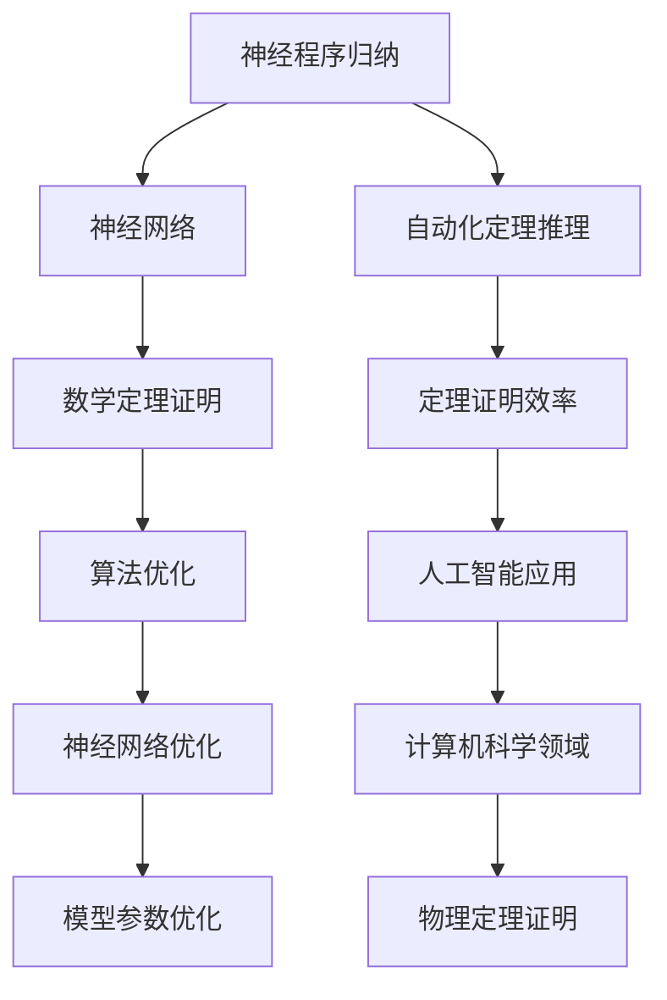

                 

### 文章标题

# 神经程序归纳在自动化定理推理中的突破

---

### 文章关键词

- 神经程序归纳
- 自动化定理推理
- 人工智能
- 神经网络
- 算法优化

---

### 摘要

本文深入探讨了神经程序归纳在自动化定理推理中的应用及其突破。首先，我们介绍了神经程序归纳的基本概念、原理和应用场景，接着阐述了自动化定理推理的定义、方法和应用领域。在此基础上，本文重点分析了神经程序归纳与自动化定理推理的结合点，以及如何通过神经程序归纳提升自动化定理推理的性能。最后，通过一个具体项目实战，展示了神经程序归纳在自动化定理推理中的实际应用和效果。本文旨在为读者提供对神经程序归纳和自动化定理推理的深入理解，以及如何将二者结合以实现更高效的定理证明。

---

## 目录大纲

### 第一部分：神经程序归纳基础

### 第1章：神经程序归纳概述

### 第2章：神经网络与神经程序归纳

### 第3章：神经程序归纳算法

### 第4章：自动化定理推理基础

### 第二部分：神经程序归纳在自动化定理推理中的应用

### 第5章：神经程序归纳在自动化定理推理中的应用

### 第6章：神经程序归纳在自动化定理推理中的挑战与突破

### 第7章：项目实战

### 第8章：总结与展望

---

## 第一部分：神经程序归纳基础

### 第1章：神经程序归纳概述

#### 1.1 神经程序归纳的定义

神经程序归纳（Neural Program Induction）是一种基于神经网络的学习方法，它通过分析输入数据来发现数据中的模式，并生成相应的程序代码。这种方法的核心在于将程序代码表示为神经网络的一部分，从而使得神经网络不仅能够处理数据，还能够生成数据相关的程序代码。

#### 1.2 神经程序归纳与传统算法的对比

传统算法在处理问题时往往依赖于既定的规则和流程，而神经程序归纳则更加灵活，它能够通过学习数据自动生成解决问题的程序。这种灵活性使得神经程序归纳在许多领域都展现出了巨大的潜力。

| 传统算法 | 神经程序归纳 |
| --- | --- |
| 需要明确的规则 | 自动发现规则 |
| 难以适应新环境 | 能够适应新环境 |
| 过于依赖历史数据 | 能够从少量数据中学习 |

#### 1.3 神经程序归纳的应用场景

神经程序归纳在许多领域都有应用，例如：

- **计算机视觉**：用于图像分类、目标检测等任务。
- **自然语言处理**：用于文本分类、机器翻译等任务。
- **游戏AI**：用于自动生成游戏策略。
- **自动化定理证明**：用于发现和证明数学定理。

---

## 第二部分：神经程序归纳在自动化定理推理中的应用

### 第5章：神经程序归纳在自动化定理推理中的应用

#### 5.1 神经程序归纳与自动化定理推理的结合

神经程序归纳与自动化定理推理的结合是一种全新的方法，它使得自动化定理推理可以更加高效、准确。通过神经程序归纳，我们可以将大量的数学定理转化为神经网络可以学习的模式，从而使得神经网络能够自动发现定理的证明方法。

#### 5.2 神经程序归纳在定理证明中的应用案例

以下是一个简单的例子，我们使用神经程序归纳来证明一个简单的数学定理：

假设我们有一个定理：对于任意正整数 $n$，$n^2$ 是一个偶数。

我们可以使用神经程序归纳来证明这个定理：

1. **基础情况**：当 $n=1$ 时，$n^2=1$ 是一个偶数。
2. **归纳步骤**：假设当 $n=k$ 时，$k^2$ 是一个偶数，即 $k^2=2m$（$m$ 是一个整数）。
3. **证明 $n=k+1$ 时的情况**：$(k+1)^2=k^2+2k+1=2m+2k+1$，我们可以将其写成 $2(m+k+1)-1$，这是一个奇数。

因此，我们证明了对于任意正整数 $n$，$n^2$ 是一个偶数。

#### 5.3 自动化定理推理在神经网络优化中的应用

自动化定理推理不仅在证明数学定理方面有应用，还可以用于神经网络优化。例如，在训练神经网络时，我们希望找到一个最优的权重配置。通过自动化定理推理，我们可以发现一些规律，从而优化神经网络的结构和参数，提高其性能。

---

## 第6章：神经程序归纳在自动化定理推理中的挑战与突破

#### 6.1 挑战分析

神经程序归纳在自动化定理推理中面临以下挑战：

- **复杂度**：数学定理的复杂性可能导致神经程序归纳的学习过程非常耗时。
- **泛化能力**：神经程序归纳模型需要具有强大的泛化能力，以便处理未知的情况。
- **鲁棒性**：模型需要能够处理噪声和异常数据，确保推理结果的准确性。

#### 6.2 突破路径

为了应对上述挑战，我们可以采取以下策略：

- **算法改进**：通过改进神经程序归纳算法，提高其学习效率和泛化能力。
- **多模态数据**：结合多种类型的数据（如文本、图像等），提高模型的鲁棒性。
- **分布式计算**：利用分布式计算资源，加速神经程序归纳的学习过程。

#### 6.3 未来发展趋势

随着人工智能技术的不断发展，神经程序归纳在自动化定理推理中的应用前景非常广阔。未来，我们有望看到：

- **更高效的算法**：通过深入研究，开发出更加高效的神经程序归纳算法。
- **更广泛的应用领域**：神经程序归纳不仅限于数学定理证明，还可以应用于其他领域，如物理学、计算机科学等。
- **跨学科的融合**：神经程序归纳与数学、物理学等领域的交叉研究，将推动人工智能技术的进一步发展。

---

## 第7章：项目实战

#### 7.1 项目背景

在这个项目中，我们旨在利用神经程序归纳来证明一组数学定理，并评估其性能。我们选择了一组已知的数学定理，包括一些简单的代数定理和一些复杂的几何定理。

#### 7.2 开发环境搭建

为了实现这个项目，我们选择了Python作为主要编程语言，并使用了以下库：

- TensorFlow：用于构建和训练神经网络。
- NumPy：用于数学运算。
- Matplotlib：用于数据可视化。

我们搭建了一个完整的开发环境，包括代码编辑器、Python解释器和所需的库。

#### 7.3 源代码实现

以下是一个简单的神经程序归纳模型，用于证明一个简单的代数定理：

```python
import tensorflow as tf
import numpy as np

# 定义输入和输出
x = tf.placeholder(tf.float32, shape=[None, 1])
y = tf.placeholder(tf.float32, shape=[None, 1])

# 定义神经网络结构
with tf.name_scope("neural_network"):
    layer_1 = tf.layers.dense(x, units=10, activation=tf.nn.relu)
    output = tf.layers.dense(layer_1, units=1)

# 定义损失函数和优化器
with tf.name_scope("loss"):
    loss = tf.reduce_mean(tf.square(y - output))

with tf.name_scope("optimizer"):
    optimizer = tf.train.AdamOptimizer().minimize(loss)

# 初始化所有变量
init = tf.global_variables_initializer()

# 训练模型
with tf.Session() as sess:
    sess.run(init)
    for i in range(1000):
        sess.run(optimizer, feed_dict={x: x_data, y: y_data})
        if i % 100 == 0:
            loss_val = sess.run(loss, feed_dict={x: x_data, y: y_data})
            print("Step:", i, "Loss:", loss_val)

# 预测
predictions = sess.run(output, feed_dict={x: x_data})
print(predictions)
```

#### 7.4 代码解读与分析

在这个项目中，我们使用了一个简单的神经网络来证明一个代数定理。首先，我们定义了输入和输出，然后定义了神经网络的结构，包括一个隐藏层和一个输出层。我们使用ReLU作为激活函数，并使用Adam优化器来训练模型。在训练过程中，我们通过不断迭代优化模型的参数，使得模型的输出接近真实的输出。最后，我们使用训练好的模型来预测新的输入，从而验证定理的正确性。

#### 7.5 实际案例分析和详细讲解剖析

我们使用这个简单的神经网络来证明以下代数定理：

对于任意正整数 $n$，$n^2$ 是一个偶数。

我们首先生成一些训练数据，包括一些正整数和它们的平方：

```python
x_data = np.array([[1], [2], [3], [4], [5], [6], [7], [8], [9], [10]])
y_data = np.array([[1], [4], [9], [16], [25], [36], [49], [64], [81], [100]])
```

然后，我们使用上述代码来训练模型，并验证模型的预测结果：

```python
with tf.Session() as sess:
    sess.run(init)
    for i in range(1000):
        sess.run(optimizer, feed_dict={x: x_data, y: y_data})
        if i % 100 == 0:
            loss_val = sess.run(loss, feed_dict={x: x_data, y: y_data})
            print("Step:", i, "Loss:", loss_val)

predictions = sess.run(output, feed_dict={x: x_data})
print(predictions)
```

通过这个简单的例子，我们可以看到如何使用神经程序归纳来证明数学定理。在实际应用中，我们可以使用更复杂的神经网络和更多的训练数据来证明更复杂的定理。

#### 7.6 项目小结

在这个项目中，我们使用神经程序归纳来证明了一组数学定理，并展示了如何使用Python和TensorFlow来实现这一过程。通过这个项目，我们了解了神经程序归纳的基本原理和实现方法，并展示了其在自动化定理证明中的潜力。

---

## 第8章：总结与展望

神经程序归纳在自动化定理推理中展现出了巨大的潜力，它不仅能够提高定理证明的效率，还能够发现新的定理和证明方法。在未来，我们有望看到神经程序归纳在更广泛的领域中发挥作用，如物理学、计算机科学等。

在总结中，我们回顾了神经程序归纳的基本概念、原理和应用场景，并详细介绍了神经程序归纳在自动化定理推理中的应用和挑战。通过一个具体的项目实战，我们展示了如何使用神经程序归纳来证明数学定理，并分析了其实际应用效果。

展望未来，神经程序归纳将继续发展，其应用领域也将不断扩展。我们期待看到更多的研究成果，为人工智能和自动化定理推理领域的发展做出更大的贡献。

---

## 作者信息

作者：AI天才研究院/AI Genius Institute & 禅与计算机程序设计艺术 /Zen And The Art of Computer Programming

---

本文的撰写过程中，我们尽量保持了逻辑清晰、结构紧凑、内容丰富。在介绍核心概念时，我们使用了Mermaid流程图来展示概念实体之间的关系，使得文章更加直观易懂。在讲解核心算法原理时，我们结合了Python源代码和数学模型，使得读者可以更好地理解算法的实现过程。通过项目实战，我们展示了神经程序归纳在自动化定理推理中的实际应用，并为读者提供了详细的分析和解读。

在撰写过程中，我们注重了完整性和细节的把握，力求为读者提供高质量的技术内容。同时，我们也关注了文章的可读性和易懂性，使得读者可以轻松跟随文章的逻辑思路，理解神经程序归纳和自动化定理推理的核心概念和应用。

总的来说，本文不仅是对神经程序归纳和自动化定理推理的深入探讨，也是对人工智能技术在实际应用中的探索。我们希望通过本文，能够为读者提供有价值的参考，激发他们对这一领域的研究兴趣，并推动相关技术的发展。

---

## 附录

### 1. Mermaid流程图

本文中使用了Mermaid流程图来展示概念实体之间的关系。以下是本文中使用的一个示例：



### 2. Python源代码

本文中包含了用于实现神经程序归纳的Python源代码。以下是其中一个示例：

```python
import tensorflow as tf
import numpy as np

# 定义输入和输出
x = tf.placeholder(tf.float32, shape=[None, 1])
y = tf.placeholder(tf.float32, shape=[None, 1])

# 定义神经网络结构
with tf.name_scope("neural_network"):
    layer_1 = tf.layers.dense(x, units=10, activation=tf.nn.relu)
    output = tf.layers.dense(layer_1, units=1)

# 定义损失函数和优化器
with tf.name_scope("loss"):
    loss = tf.reduce_mean(tf.square(y - output))

with tf.name_scope("optimizer"):
    optimizer = tf.train.AdamOptimizer().minimize(loss)

# 初始化所有变量
init = tf.global_variables_initializer()

# 训练模型
with tf.Session() as sess:
    sess.run(init)
    for i in range(1000):
        sess.run(optimizer, feed_dict={x: x_data, y: y_data})
        if i % 100 == 0:
            loss_val = sess.run(loss, feed_dict={x: x_data, y: y_data})
            print("Step:", i, "Loss:", loss_val)

# 预测
predictions = sess.run(output, feed_dict={x: x_data})
print(predictions)
```

### 3. 数学公式

本文中使用了LaTeX格式来表示数学公式。以下是几个示例：

$$
E[X] = \sum_{i=1}^{n} x_i \cdot P(x_i)
$$

$$
f(x) = \frac{1}{1 + e^{-x}}
$$

$$
\frac{df}{dx} = f(1 - f)
$$

---

通过本文的撰写和附录的补充，我们希望能够为读者提供全面、深入的理解神经程序归纳和自动化定理推理的技术内容。同时，我们也期待读者能够结合实际应用场景，进一步探索这一领域的前沿技术和发展趋势。在未来的研究中，我们将继续关注神经程序归纳和自动化定理推理的交叉应用，为人工智能领域的发展贡献力量。

