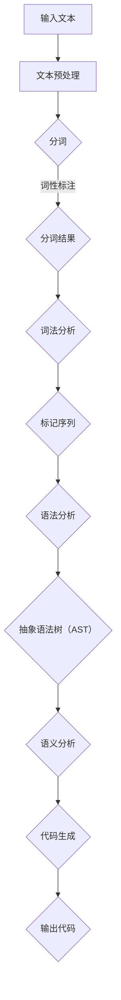

                 

### 引言

在当今科技日新月异的发展背景下，人工智能（AI）已经成为引领技术变革的重要力量。其中，代码生成AI作为一种新兴的技术范式，正逐渐改变着软件开发的传统模式。而神经程序综合作为代码生成AI的一个重要分支，更是展现出了广阔的前景和深远的潜力。本文旨在探讨神经程序综合：代码生成的AI新范式，通过详细的分析和阐述，帮助读者理解这一领域的核心概念、技术原理及其应用价值。

神经程序综合是结合神经科学、计算机科学和软件工程等多学科知识，发展出的一种新的编程范式。它通过模拟人脑神经网络的结构和功能，实现代码的自动化生成。相比传统的代码编写方式，神经程序综合不仅能够提高开发效率，还能实现更复杂的编程任务。代码生成AI则通过深度学习等技术，让计算机能够根据输入的提示或数据，自动生成符合需求的代码片段或程序。

本书的目标是为读者提供一份全面而系统的指南，旨在让读者深入了解神经程序综合和代码生成AI的基本概念、技术原理、算法实现及应用实践。文章结构如下：

1. **背景与意义**：介绍神经程序综合和代码生成AI的起源、发展背景及其重要性。
2. **神经程序基础**：讨论神经程序的定义、特点、发展与神经网络的联系。
3. **代码生成AI原理**：探讨代码生成AI的基本概念、应用领域及优势与挑战。
4. **编程语言理解**：分析编程语言的基础知识和理解技术。
5. **代码生成算法**：介绍常见的代码生成算法，重点讨论基于神经程序的代码生成算法。
6. **代码生成AI应用实例**：通过实际案例展示代码生成AI的应用场景和效果。
7. **代码生成AI的未来发展**：展望代码生成AI的挑战与机遇及未来趋势。
8. **结论**：总结文章的核心内容，并对未来研究提出展望。

通过这一系列章节的深入探讨，读者将能够全面理解神经程序综合和代码生成AI的技术本质及其在现实世界中的广泛应用。这不仅有助于提升软件开发效率，还为未来智能软件开发提供了新的思路和方法。

### 关键词

1. **神经程序综合**
2. **代码生成AI**
3. **神经网络**
4. **深度学习**
5. **编程语言理解**
6. **代码生成算法**
7. **自动化编程**

### 摘要

本文深入探讨了神经程序综合在代码生成AI领域中的应用。首先，介绍了神经程序综合和代码生成AI的背景、意义及其基本概念。接着，详细阐述了神经程序的定义、特点及其与神经网络的联系。然后，分析了代码生成AI的基本原理、应用领域及面临的挑战。在编程语言理解部分，讨论了编程语言的基本概念和关键技术。随后，重点介绍了常见的代码生成算法，特别是基于神经程序的代码生成算法。文章还通过具体的应用实例展示了代码生成AI的实际效果，并展望了其未来发展趋势。最后，对文章的核心内容进行了总结，并对未来研究提出了展望。

---

## 第1章 引言

### 1.1 背景与意义

神经程序综合（Neural Program Synthesis）是近年来在人工智能（AI）领域迅速崛起的一个研究热点。其核心思想是利用神经网络，特别是深度学习技术，实现程序代码的自动生成。这种编程范式打破了传统编程的线性思维方式，使得计算机编程能够更加智能化和自动化。

#### 神经程序综合的兴起

神经程序综合的概念最早可以追溯到20世纪80年代，当时研究人员开始尝试使用神经网络来生成代码。然而，由于计算资源和算法的限制，这一领域的发展相对缓慢。直到21世纪初，随着深度学习技术的突破和计算资源的迅猛增长，神经程序综合才逐渐崭露头角。

近年来，随着大数据和云计算技术的发展，代码生成AI（Code Generation Artificial Intelligence）的应用场景越来越广泛。例如，在自动化编程、代码重构、软件测试、智能编程助手等领域，神经程序综合都展现出了巨大的潜力。特别是在软件开发过程中，代码生成AI可以显著提高开发效率、减少错误率，并促进软件的可维护性和可扩展性。

#### 代码生成AI的潜力

代码生成AI的潜力主要体现在以下几个方面：

1. **提高开发效率**：通过自动生成代码，可以大幅减少手动编写代码的时间，从而提高开发效率。
2. **减少错误率**：计算机生成的代码通常比人工编写的代码更加规范和统一，从而减少错误和漏洞。
3. **增强可维护性和可扩展性**：自动生成的代码更易于维护和扩展，因为它遵循统一的编程规范和设计模式。
4. **解决复杂问题**：对于一些复杂的编程任务，如生成复杂的算法、处理大规模数据等，代码生成AI能够提供有效的解决方案。

#### 本书的目标与结构

本书旨在为读者提供一份全面而系统的指南，帮助读者深入了解神经程序综合和代码生成AI的基本概念、技术原理、算法实现及应用实践。全书结构如下：

1. **第1章 引言**：介绍神经程序综合和代码生成AI的背景、意义及本书的目标和结构。
2. **第2章 神经程序基础**：讨论神经程序的定义、特点、发展与神经网络的关系。
3. **第3章 代码生成AI原理**：探讨代码生成AI的基本概念、应用领域及优势与挑战。
4. **第4章 编程语言理解**：分析编程语言的基础知识和理解技术。
5. **第5章 代码生成算法**：介绍常见的代码生成算法，重点讨论基于神经程序的代码生成算法。
6. **第6章 代码生成AI应用实例**：通过实际案例展示代码生成AI的应用场景和效果。
7. **第7章 代码生成AI的未来发展**：展望代码生成AI的挑战与机遇及未来趋势。
8. **第8章 结论**：总结文章的核心内容，并对未来研究提出展望。

通过这一系列章节的深入探讨，读者将能够全面理解神经程序综合和代码生成AI的技术本质及其在现实世界中的广泛应用。这不仅有助于提升软件开发效率，还为未来智能软件开发提供了新的思路和方法。

### 2.1 神经程序概述

神经程序（Neural Program）是一种基于神经网络（Neural Network）的编程范式，它通过模拟人脑神经网络的结构和功能，实现程序代码的自动化生成。神经程序综合作为这一领域的一个重要分支，结合了神经科学、计算机科学和软件工程的理论，为编程领域带来了全新的研究视角和解决方案。

#### 神经程序的定义

神经程序是一种特殊的程序，它通过神经网络来表示和执行任务。与传统的程序不同，神经程序不是通过显式地编写指令序列来完成任务，而是通过学习数据或规则，自动生成符合预期结果的代码。具体来说，神经程序由多个神经元（Neurons）组成，每个神经元对应一个计算单元，通过输入层、隐藏层和输出层之间的复杂连接，实现数据的处理和信息的传递。

#### 神经程序与传统程序的差异

1. **思维方式**：
   - **传统程序**：基于逻辑和指令序列，按照预定的步骤进行计算和执行。
   - **神经程序**：基于神经网络，通过学习和模拟人脑神经网络的结构和功能，实现自适应和自动化的任务执行。

2. **生成方式**：
   - **传统程序**：由程序员手动编写代码，通过编译和解释器执行。
   - **神经程序**：通过训练和学习数据自动生成，不需要手动编写代码。

3. **灵活性和适应性**：
   - **传统程序**：在面对复杂和多变的任务时，需要重新编写或修改代码，灵活性较低。
   - **神经程序**：能够自适应地处理各种复杂任务，具有很高的灵活性和适应性。

#### 神经程序的发展历程

神经程序的概念最早可以追溯到20世纪80年代，当时研究人员开始尝试使用神经网络来生成代码。然而，由于计算资源和算法的限制，这一领域的发展相对缓慢。直到21世纪初，随着深度学习技术的突破和计算资源的迅猛增长，神经程序综合才逐渐崭露头角。

1. **早期研究**：
   - **1980s**：神经网络作为一种人工智能的基础技术开始受到关注，研究人员尝试将神经网络应用于代码生成。
   - **1990s**：随着反向传播算法（Backpropagation）的出现，神经网络训练效率得到显著提高，为神经程序的发展提供了技术基础。

2. **兴起阶段**：
   - **2000s**：深度学习技术的兴起，使得神经网络在图像识别、语音识别等领域取得了突破性进展，激发了神经程序研究的热潮。
   - **2010s**：代码生成AI的概念逐渐明确，研究人员开始探索将神经网络应用于代码生成。

3. **当前阶段**：
   - **2020s**：神经程序综合逐渐成为人工智能研究的一个重要分支，其在自动化编程、代码重构、软件测试等领域的应用取得了显著成果。

#### 神经程序的应用领域

神经程序的应用领域非常广泛，主要包括以下几个方面：

1. **自动化编程**：通过自动生成代码，提高软件开发效率，减少人为错误。
2. **代码重构**：自动识别和优化代码，提高代码质量，降低维护成本。
3. **软件测试**：自动生成测试用例，提高测试覆盖率，发现潜在缺陷。
4. **智能编程助手**：辅助程序员编写代码，提供代码建议和优化方案。
5. **自然语言处理**：将自然语言描述转换为代码，实现语言编程。

神经程序作为一种新兴的编程范式，具有巨大的潜力和应用价值。随着深度学习技术的不断进步和计算资源的持续提升，神经程序综合将在未来的软件开发中发挥越来越重要的作用。

#### 神经程序与神经网络的关系

神经程序和神经网络之间有着密切的关系，神经程序的理论基础源于神经网络。神经网络是一种由大量人工神经元（或称为节点）互联而成的计算模型，其结构和工作原理与生物神经网络有相似之处。以下是神经程序与神经网络之间的具体关系：

1. **结构相似性**：
   - **生物神经网络**：由神经元组成，每个神经元接收来自其他神经元的输入信号，通过突触进行传递，最终产生一个输出信号。
   - **神经网络**：由大量人工神经元组成，每个神经元接收输入信号，通过权重（weight）进行调整，然后通过激活函数（activation function）产生输出信号。
   - **神经程序**：通过模拟神经网络的结构，使用人工神经元作为计算单元，构建出一个能够自动生成代码的神经网络模型。

2. **信息传递机制**：
   - **生物神经网络**：通过突触传递电信号，实现信息的处理和传递。
   - **神经网络**：通过输入层、隐藏层和输出层之间的连接，实现数据的输入、处理和输出。
   - **神经程序**：利用神经网络的结构和连接方式，实现代码的自动生成。输入层接收编程任务或数据，隐藏层进行信息处理和编码，输出层生成对应的代码。

3. **学习与适应能力**：
   - **生物神经网络**：通过不断的学习和适应，形成复杂的认知功能。
   - **神经网络**：通过训练学习大量的数据或规则，优化网络结构和参数，提高任务执行能力。
   - **神经程序**：通过深度学习技术，学习编程语言的结构和语法规则，自动生成符合要求的代码。

4. **应用场景**：
   - **生物神经网络**：广泛应用于神经科学、认知科学等领域，用于研究大脑的信息处理机制。
   - **神经网络**：广泛应用于图像识别、语音识别、自然语言处理等领域，解决了许多复杂的计算问题。
   - **神经程序**：应用于自动化编程、代码重构、软件测试等领域，通过自动生成代码，提高软件开发效率和质量。

总的来说，神经程序综合是基于神经网络理论发展起来的，通过模拟人脑神经网络的结构和功能，实现程序代码的自动化生成。神经网络为神经程序提供了理论依据和技术支撑，而神经程序则将神经网络的应用拓展到了新的领域，展现了巨大的潜力。

### 2.2 神经网络与深度学习

神经网络（Neural Networks）和深度学习（Deep Learning）是人工智能（AI）领域中的核心技术，它们在代码生成AI中发挥着重要作用。本节将详细介绍神经网络与深度学习的基本概念、结构和训练过程，帮助读者理解这些技术是如何实现代码的自动生成的。

#### 神经网络的基本结构

神经网络是一种模拟人脑神经元之间相互连接的计算模型。一个典型的神经网络由以下几个部分组成：

1. **神经元（Neurons）**：
   神经元是神经网络的基本计算单元，每个神经元接收多个输入信号，通过加权求和后，通过激活函数产生输出。神经元之间通过突触（synapses）进行连接，突触的权重（weights）决定了输入信号的强度。

2. **输入层（Input Layer）**：
   输入层是神经网络的起点，接收外部输入数据。每个神经元对应一个输入特征，例如，在图像识别任务中，每个神经元可能对应图像中的一个像素值。

3. **隐藏层（Hidden Layers）**：
   隐藏层位于输入层和输出层之间，用于对输入数据进行处理和变换。隐藏层的数量和神经元数量可以根据具体任务进行调整。多层隐藏层的设计使得神经网络能够学习更加复杂的特征和模式。

4. **输出层（Output Layer）**：
   输出层是神经网络的终点，生成最终输出。输出层的神经元数量和类型取决于具体任务。例如，在分类任务中，输出层通常包含多个神经元，每个神经元对应一个类别。

5. **权重（Weights）**：
   神经元之间的连接权重决定了输入信号对输出的影响。在训练过程中，通过调整权重，使神经网络能够更好地拟合训练数据。

6. **激活函数（Activation Function）**：
   激活函数用于引入非线性特性，使神经网络能够学习复杂的关系。常见的激活函数包括 sigmoid、ReLU、Tanh 等。

#### 深度学习的基本算法

深度学习是神经网络的一种扩展，通过设计多层神经网络结构，使得模型能够自动提取更高层次的特征。以下是一些基本的深度学习算法：

1. **反向传播算法（Backpropagation）**：
   反向传播算法是一种用于训练神经网络的优化方法。它通过计算输出层的误差，反向传播到隐藏层，逐层更新权重和偏置，使得神经网络能够不断优化性能。

2. **卷积神经网络（Convolutional Neural Networks, CNN）**：
   卷积神经网络是一种特别适用于图像识别任务的深度学习模型。它通过卷积层和池化层，能够有效地提取图像中的特征，并形成层次化的特征表示。

3. **循环神经网络（Recurrent Neural Networks, RNN）**：
   循环神经网络是一种能够处理序列数据的深度学习模型。它通过在时间步之间引入循环连接，使得模型能够记忆和传递序列中的长期依赖信息。

4. **长短期记忆网络（Long Short-Term Memory Networks, LSTM）**：
   长短期记忆网络是循环神经网络的一种改进，通过引入门控机制，使得模型能够更好地记忆和遗忘长期依赖信息，适用于处理序列数据中的长距离依赖问题。

5. **生成对抗网络（Generative Adversarial Networks, GAN）**：
   生成对抗网络是一种由生成器和判别器组成的深度学习模型。生成器尝试生成逼真的数据，而判别器则判断数据是真实数据还是生成数据。两者相互对抗，使生成器逐渐生成更高质量的数据。

#### 神经网络的训练过程

神经网络的训练过程可以分为以下几个步骤：

1. **初始化**：
   初始化网络的权重和偏置，通常采用随机初始化或预训练初始化。

2. **前向传播（Forward Propagation）**：
   将输入数据传递到神经网络中，逐层计算神经元的输出，直到输出层得到最终预测结果。

3. **计算误差**：
   使用真实标签与预测结果之间的差异，计算输出层的误差。

4. **反向传播（Back Propagation）**：
   将误差反向传播到隐藏层和输入层，通过梯度下降法或其他优化算法更新网络的权重和偏置。

5. **迭代优化**：
   重复上述步骤，不断迭代优化网络参数，直到网络性能达到预定的标准。

通过以上训练过程，神经网络能够学习输入数据中的特征和模式，并生成符合预期结果的输出。

#### 神经网络在代码生成中的应用

神经网络在代码生成中的应用主要通过两种方式实现：

1. **序列到序列学习（Seq2Seq Learning）**：
   序列到序列学习是一种基于神经网络的端到端学习框架，用于将一种序列数据转换为另一种序列数据。在代码生成中，输入序列可以是编程语言的抽象语法树（Abstract Syntax Tree, AST），而输出序列则是具体的代码字符串。

2. **预训练和迁移学习（Pre-training and Transfer Learning）**：
   预训练和迁移学习是一种利用预训练模型进行代码生成的方法。首先，使用大量的代码库对神经网络进行预训练，使其学习编程语言的基本结构和语法规则。然后，通过微调（fine-tuning）的方式，将预训练模型应用于特定的代码生成任务。

通过结合神经网络和深度学习技术，代码生成AI能够自动生成符合语法和语义要求的代码，提高软件开发效率和质量。未来，随着深度学习技术的不断进步，神经网络在代码生成中的应用将会更加广泛和深入。

### 3.1 代码生成AI概述

代码生成AI（Code Generation Artificial Intelligence）是一种利用人工智能技术，尤其是深度学习和神经网络，自动生成代码的方法。它通过学习大量的代码数据或编程规则，实现从输入描述到代码输出的转换。代码生成AI在软件开发领域具有广泛的应用前景，包括自动化编程、代码重构、软件测试等。本节将详细介绍代码生成AI的基本概念、应用领域以及其带来的优势与挑战。

#### 代码生成AI的定义

代码生成AI是指利用人工智能技术，特别是深度学习和神经网络，自动生成符合语法和语义要求的代码。与传统的手动编写代码相比，代码生成AI具有更高的灵活性和自动化程度。它通过学习大量的代码数据或编程规则，能够根据输入的描述或需求，自动生成相应的代码。代码生成AI的目标是减少手动编写代码的工作量，提高开发效率，并减少人为错误。

#### 代码生成AI的应用领域

1. **自动化编程**：
   自动化编程是代码生成AI最早且最广泛的应用领域之一。通过自动生成代码，可以大幅减少程序员编写代码的时间，提高开发效率。自动化编程广泛应用于网页开发、移动应用开发、数据管道构建等场景。

2. **代码重构**：
   代码重构是另一个重要的应用领域。通过自动生成高质量的代码，可以帮助程序员优化现有的代码库，提高代码的可读性和可维护性。代码生成AI可以自动识别代码中的冗余部分，并提出重构建议，从而提高代码的质量。

3. **软件测试**：
   代码生成AI在软件测试中也具有重要作用。通过自动生成测试用例，可以提高测试覆盖率和测试效率，发现潜在的错误和缺陷。例如，在自动化测试中，代码生成AI可以根据用户提供的输入，自动生成大量的测试数据，进行全面的测试。

4. **代码补全**：
   代码补全是代码生成AI在编程辅助中的一个应用。通过学习大量的代码库，代码生成AI可以预测程序员接下来的代码行，并提供自动补全建议，减少编写代码的时间，提高开发效率。

5. **自然语言编程**：
   自然语言编程是一种利用自然语言描述编程任务，然后自动生成代码的方法。代码生成AI可以将自然语言描述转换为抽象语法树（AST），然后生成相应的代码。这种技术可以降低编程门槛，让非专业开发者也能轻松进行编程。

#### 代码生成AI的优势

1. **提高开发效率**：
   代码生成AI可以自动生成代码，减少程序员手动编写代码的时间，从而提高开发效率。特别是在处理复杂和重复性的编程任务时，代码生成AI能够显著提高开发速度。

2. **减少人为错误**：
   代码生成AI能够根据预定的规则和大量的训练数据生成代码，减少了人为错误的可能性。同时，通过自动化的代码生成，可以确保代码的一致性和规范性。

3. **增强可维护性**：
   自动生成的代码通常遵循统一的编程规范和设计模式，使得代码更易于维护和扩展。通过代码生成AI，可以确保新编写的代码与现有代码库保持一致，从而提高代码的可维护性。

4. **促进创新**：
   代码生成AI为开发者提供了更多的时间和精力去专注于创新性的工作。通过自动化生成代码，开发者可以更加专注于解决业务问题，而无需花费大量时间在编写和调试代码上。

#### 代码生成AI的挑战

1. **数据依赖**：
   代码生成AI依赖于大量的代码数据或编程规则，数据的质量和多样性直接影响到代码生成AI的效果。在数据缺乏或数据质量不高的情况下，代码生成AI的准确性会受到影响。

2. **训练成本**：
   代码生成AI的训练过程通常需要大量的计算资源和时间。特别是在训练深度神经网络时，需要处理大量的数据和复杂的模型，这增加了训练成本。

3. **代码质量**：
   虽然代码生成AI能够自动生成代码，但生成的代码质量可能参差不齐。特别是在面对复杂的编程任务时，代码生成AI可能无法生成高质量、优化良好的代码。

4. **可解释性**：
   代码生成AI的决策过程通常是非线性和复杂的，这使得生成的代码的可解释性较低。对于需要严格遵循编程规范和业务逻辑的软件项目，代码生成AI的可解释性是一个重要的挑战。

5. **安全和隐私**：
   在使用代码生成AI时，需要确保生成的代码不会泄露敏感信息或引发安全漏洞。特别是在涉及到金融、医疗等敏感数据的领域，确保代码生成AI的安全和隐私是一个重要的考虑因素。

总之，代码生成AI作为一种新兴的技术，具有巨大的潜力，但也面临着一系列的挑战。随着技术的不断进步和应用场景的扩展，代码生成AI将在未来发挥更加重要的作用，为软件开发带来革命性的变革。

### 3.2 基于神经程序的代码生成

基于神经程序的代码生成是当前代码生成AI领域中的一项前沿技术，通过神经网络结构和深度学习算法，实现从自然语言描述或数据到具体代码的自动转换。本节将详细介绍基于神经程序的代码生成的基本原理、基本架构及设计原则，并通过一个具体的例子来说明其实现过程。

#### 基本原理

基于神经程序的代码生成主要依赖于深度学习中的序列到序列（Seq2Seq）模型，以及生成对抗网络（GAN）等先进技术。其基本原理如下：

1. **序列编码与解码**：
   代码生成过程可以看作是一个序列编码与解码的过程。输入序列可以是自然语言描述、数据输入或其他形式，通过编码器（Encoder）将其编码为一个固定长度的向量表示。解码器（Decoder）则将这个向量表示解码为输出序列，即具体的代码。

2. **注意力机制**：
   为了更好地捕捉输入序列中的长期依赖关系，编码器和解码器之间引入了注意力机制（Attention Mechanism）。注意力机制使得解码器在生成每个输出时，能够关注到输入序列中的关键部分，从而提高代码生成的准确性和连贯性。

3. **生成对抗网络（GAN）**：
   生成对抗网络由生成器和判别器组成。生成器尝试生成逼真的代码，而判别器则判断生成的代码是真实代码还是伪造代码。通过这种对抗训练，生成器逐渐生成更加真实的代码，从而提高代码生成质量。

#### 基本架构

基于神经程序的代码生成架构通常包括以下几个部分：

1. **编码器（Encoder）**：
   编码器负责将输入序列编码为一个固定长度的向量表示。常用的编码器包括循环神经网络（RNN）和变换器（Transformer）等。编码器的输出是一个固定维度的向量，用于表示输入序列的全局信息。

2. **解码器（Decoder）**：
   解码器负责将编码器的输出解码为输出序列，即具体的代码。解码器通常使用类似于编码器的神经网络结构，并引入了注意力机制，使得解码器能够关注到输入序列的关键部分。

3. **生成器（Generator）**：
   在生成对抗网络中，生成器负责生成逼真的代码。生成器的输入可以是随机向量或编码器的输出，通过一系列的神经网络层，生成符合语法和语义要求的代码。

4. **判别器（Discriminator）**：
   判别器负责判断生成的代码是真实代码还是伪造代码。判别器的输入是真实代码和生成代码，通过对比两者的特征，判别器能够提高对真实代码的判断能力。

5. **损失函数**：
   基于神经程序的代码生成通常使用多个损失函数来评估模型性能。常见的损失函数包括交叉熵损失、对抗性损失等。通过优化这些损失函数，可以训练出性能优异的代码生成模型。

#### 设计原则

基于神经程序的代码生成设计需要遵循以下几个原则：

1. **泛化能力**：
   代码生成模型应该具备良好的泛化能力，能够处理各种不同的编程任务和编程语言。通过使用大量的训练数据和多样化的输入，可以提高模型的泛化能力。

2. **可解释性**：
   尽管深度学习模型具有良好的性能，但其内部决策过程通常是不透明的。为了提高代码生成模型的可解释性，可以采用可视化和解释技术，如注意力可视化、代码路径追踪等。

3. **鲁棒性**：
   代码生成模型应该具备鲁棒性，能够处理输入数据的噪声和异常值。通过引入正则化技术和数据增强方法，可以提高模型的鲁棒性。

4. **高效性**：
   代码生成模型在实现时，需要考虑计算效率和推理速度。特别是在实时应用场景中，模型的计算成本和响应时间是一个重要的考虑因素。

#### 实现过程

以下是一个简单的基于神经程序的代码生成实现过程：

1. **数据准备**：
   收集和准备大量的编程数据，包括自然语言描述、抽象语法树（AST）和具体代码。将数据分为训练集、验证集和测试集，用于模型的训练、验证和测试。

2. **模型设计**：
   设计编码器、解码器和生成器的神经网络结构。可以选择循环神经网络（RNN）或变换器（Transformer）作为基本架构，并根据具体任务的需求进行调整。

3. **模型训练**：
   使用训练集对编码器、解码器和生成器进行训练。通过优化损失函数，如交叉熵损失和对抗性损失，调整模型的参数，使其能够生成符合语法和语义要求的代码。

4. **模型评估**：
   使用验证集和测试集对训练好的模型进行评估。通过评估指标，如代码生成质量、准确性和效率，对模型进行调优和改进。

5. **代码生成**：
   将自然语言描述或数据输入模型，通过编码器和解码器生成具体的代码。可以对生成的代码进行后处理，如语法检查、代码优化等，提高代码的质量和可读性。

通过以上步骤，可以实现一个简单的基于神经程序的代码生成系统。随着技术的不断进步和应用场景的扩展，基于神经程序的代码生成将在未来发挥更加重要的作用，为软件开发带来革命性的变革。

### 3.3 编码器与解码器的基本架构

在基于神经程序的代码生成过程中，编码器（Encoder）和解码器（Decoder）是两个核心组件，它们分别负责将输入序列编码为向量表示和将向量表示解码为输出序列。这一部分将详细介绍编码器和解码器的基本架构、工作原理及其在代码生成中的应用。

#### 编码器（Encoder）

编码器的主要作用是将输入序列（如自然语言描述、抽象语法树（AST）或其他形式的数据）转换为一个固定长度的向量表示，这个向量需要能够捕捉输入序列的全局信息。

1. **基本架构**：
   - **输入层**：接收输入序列，可以是单个字符、单词或子句。
   - **嵌入层（Embedding Layer）**：将输入序列映射为固定维度的向量，通常使用词嵌入（Word Embedding）技术，如Word2Vec、GloVe等。
   - **编码层**：使用循环神经网络（RNN）或变换器（Transformer）等结构，对嵌入向量进行编码。RNN通过在时间步之间传递隐藏状态，能够处理序列数据；变换器则通过多头自注意力机制，捕捉输入序列中的长期依赖关系。

2. **工作原理**：
   - **RNN**：在每一个时间步，RNN将当前输入和前一个时间步的隐藏状态进行加权求和，并通过激活函数产生新的隐藏状态。隐藏状态能够捕获输入序列的全局信息，并在后续时间步中传递。
   - **变换器**：变换器通过自注意力机制（Self-Attention Mechanism），在每个时间步计算输入序列中每个元素的重要性权重，然后将这些权重与输入序列的嵌入向量进行点积运算，得到新的隐藏状态。这种机制使得变换器能够更好地捕捉输入序列中的长期依赖关系。

3. **在代码生成中的应用**：
   - 编码器将自然语言描述或抽象语法树（AST）编码为一个固定长度的向量，这个向量代表了输入序列的全局特征。在代码生成中，编码器能够将编程任务或输入数据编码为一个向量表示，为解码器提供输入。

#### 解码器（Decoder）

解码器的主要作用是将编码器生成的固定长度向量表示解码为输出序列，即具体的代码。

1. **基本架构**：
   - **输入层**：接收编码器输出的固定长度向量。
   - **嵌入层（Embedding Layer）**：将输入向量映射为固定维度的向量，类似于编码器的嵌入层。
   - **解码层**：使用循环神经网络（RNN）或变换器（Transformer）等结构，对嵌入向量进行解码。解码器通常包含多个层，每一层都通过循环或自注意力机制生成部分输出。
   - **输出层**：生成最终的输出序列，通常是具体的代码字符串。输出层可能包含一个或多个解码器层，用于生成每个时间步的输出。

2. **工作原理**：
   - **RNN**：在每一个时间步，解码器将当前输入和前一个时间步的隐藏状态进行加权求和，并通过激活函数产生新的隐藏状态。新的隐藏状态用于生成当前时间步的输出。这个过程重复进行，直到生成完整的输出序列。
   - **变换器**：解码器通过自注意力机制和编码器输出的交互，在每个时间步生成部分输出。自注意力机制使得解码器能够关注到编码器输出的关键部分，从而提高生成的连贯性和准确性。

3. **在代码生成中的应用**：
   - 解码器将编码器输出的向量表示解码为具体的代码字符串。在生成过程中，解码器逐步生成每个时间步的输出，并通过反馈机制（如教师forcing）或基于输出的选择策略，逐步构建出完整的代码。解码器能够根据编码器输出的全局特征，生成符合语法和语义要求的代码。

通过编码器和解码器的协同工作，基于神经程序的代码生成模型能够将输入序列（如自然语言描述或数据）转换为具体的代码字符串。编码器和解码器的设计和实现直接影响到代码生成模型的效果，因此在实际应用中，需要根据具体任务的需求和特点，选择合适的神经网络结构和优化方法。

### 3.4 基于神经程序的代码生成算法

基于神经程序的代码生成算法是近年来人工智能领域的一个研究热点，通过深度学习技术，实现从输入描述到代码输出的自动转换。本节将详细介绍两种常见的基于神经程序的代码生成算法：序列到序列（Seq2Seq）模型和生成对抗网络（GAN），并对比分析它们的优缺点。

#### 序列到序列（Seq2Seq）模型

序列到序列（Seq2Seq）模型是一种经典的深度学习模型，广泛应用于机器翻译、语音识别和代码生成等领域。Seq2Seq模型的核心思想是通过编码器（Encoder）和解码器（Decoder）两个神经网络组件，实现输入序列到输出序列的转换。

1. **算法原理**：

   - **编码器**：将输入序列编码为一个固定长度的向量表示，这个向量需要能够捕捉输入序列的全局信息。编码器通常使用循环神经网络（RNN）或变换器（Transformer）等结构。

   - **解码器**：将编码器的输出向量解码为输出序列，即具体的代码。解码器也使用类似的神经网络结构，并引入注意力机制，使得解码器能够关注到输入序列的关键部分。

   - **损失函数**：Seq2Seq模型的损失函数通常为交叉熵损失，用于衡量预测序列和真实序列之间的差异。

2. **优点**：

   - **端到端学习**：Seq2Seq模型通过端到端学习，无需手动设计特征，能够直接从输入序列生成输出序列，简化了模型设计过程。

   - **高效性**：Seq2Seq模型能够处理长序列数据，通过编码器和解码器的协同工作，实现高效输入到输出的转换。

3. **缺点**：

   - **长依赖问题**：虽然Seq2Seq模型引入了注意力机制，但在处理长依赖关系时，仍然存在一定的困难，可能导致输出序列中的信息丢失。

   - **训练难度**：Seq2Seq模型需要大量的训练数据和计算资源，尤其是在处理复杂编程任务时，训练过程可能非常耗时。

#### 生成对抗网络（GAN）

生成对抗网络（GAN）是一种由生成器和判别器组成的深度学习模型，通过对抗训练，实现数据的生成。在代码生成中，GAN通过生成器生成代码，判别器判断生成代码的真实性，两者相互竞争，提高生成代码的质量。

1. **算法原理**：

   - **生成器**：生成器（Generator）接收随机噪声向量，生成符合语法和语义要求的代码。

   - **判别器**：判别器（Discriminator）接收真实代码和生成代码，判断代码的真实性。

   - **对抗训练**：通过对抗训练，生成器和判别器不断优化，使得生成器能够生成更真实的代码，判别器能够更好地区分真实代码和生成代码。

2. **优点**：

   - **高质量生成**：GAN通过生成器和判别器的对抗训练，能够生成高质量的代码，特别适合处理复杂编程任务。

   - **灵活性**：GAN模型不需要固定的输出序列，能够处理多种不同类型的编程任务。

3. **缺点**：

   - **训练难度**：GAN的训练过程较为复杂，生成器和判别器的动态平衡是一个挑战。

   - **计算资源消耗**：GAN的训练过程需要大量的计算资源，尤其是在处理大规模代码数据时，计算成本较高。

#### 对比分析

Seq2Seq模型和GAN在代码生成算法中各有优缺点。Seq2Seq模型通过端到端学习，实现高效输入到输出的转换，适用于处理长序列数据。GAN则通过生成器和判别器的对抗训练，实现高质量代码的生成，特别适合处理复杂编程任务。在实际应用中，可以根据任务需求和资源限制，选择合适的算法。

1. **适用场景**：
   - **Seq2Seq模型**：适用于处理简单的编程任务，如代码补全、自然语言描述到代码的转换。
   - **GAN**：适用于处理复杂的编程任务，如自动化编程、代码重构等。

2. **训练资源**：
   - **Seq2Seq模型**：需要大量的训练数据和计算资源，但相对稳定，训练过程较为简单。
   - **GAN**：训练过程复杂，计算资源消耗较大，但生成代码质量较高。

3. **生成质量**：
   - **Seq2Seq模型**：生成的代码质量相对稳定，但可能在处理长依赖关系时存在不足。
   - **GAN**：生成代码质量较高，特别适合处理复杂编程任务，但可能存在生成代码不一致的问题。

总之，基于神经程序的代码生成算法通过Seq2Seq模型和GAN等深度学习技术，实现了从输入描述到代码输出的自动转换。根据不同的应用场景和资源限制，选择合适的算法，可以更好地实现代码生成任务。

### 3.5 自然语言处理技术在编程语言理解中的应用

自然语言处理（Natural Language Processing, NLP）技术在编程语言理解中发挥着重要作用。通过NLP技术，我们可以将自然语言描述转换为计算机可以理解和处理的代码。本节将详细介绍NLP技术在编程语言理解中的应用，包括语法分析和语义分析，以及相关的挑战和解决方案。

#### 语法分析

语法分析是NLP中的一个基本任务，旨在将自然语言文本解析为结构化的语法表示。在编程语言理解中，语法分析是理解代码描述和理解编程语言规则的关键步骤。

1. **语法分析的基本概念**：

   - **词法分析**：词法分析是将自然语言文本拆分为单词或标记的过程。例如，将字符串“print('Hello, World!')”拆分为标记`print`、`(`、`'`、`Hello`、`,`、` `、`World`、`!`、`)`。
   - **语法分析**：语法分析是将词法分析得到的标记序列转换为语法结构，如抽象语法树（Abstract Syntax Tree, AST）。AST是一个表示程序结构的数据结构，能够反映程序中的语法关系和操作。

2. **语法分析在编程语言理解中的应用**：

   - **代码生成**：通过语法分析，将自然语言描述转换为AST，进而生成具体的代码。例如，将“实现一个计算两数之和的函数”转换为计算两数之和的Python函数代码。
   - **代码解析**：对已有的代码进行语法分析，理解其结构和功能，便于代码优化、重构和测试。

3. **面临的挑战**：

   - **复杂语法结构**：编程语言的语法规则通常较为复杂，涉及多个层次的语法结构，如变量声明、函数定义、循环和条件语句等。
   - **歧义性**：自然语言文本中存在大量的歧义性，如何在语法分析过程中准确识别和解析，是一个重要挑战。

4. **解决方案**：

   - **解析算法**：采用高效的语法分析算法，如LL(k)解析器、递归下降解析器等，处理复杂的语法结构。
   - **上下文信息**：结合上下文信息，如变量作用域、函数定义等，帮助解析器准确识别和解析代码。
   - **规则库**：建立完善的语法规则库，用于指导语法分析和代码生成。

#### 语义分析

语义分析是NLP中的另一个重要任务，旨在理解自然语言文本的含义。在编程语言理解中，语义分析是理解代码描述和编程意图的关键步骤。

1. **语义分析的基本概念**：

   - **语义角色标注**：对自然语言描述中的词汇进行语义角色标注，如主语、谓语、宾语等。
   - **语义角色解析**：将语义角色标注映射为具体的编程操作，如变量赋值、函数调用等。
   - **语义表示**：将自然语言描述转换为计算机可以理解和处理的语义表示，如抽象语义表示、逻辑公式等。

2. **语义分析在编程语言理解中的应用**：

   - **代码生成**：通过语义分析，将自然语言描述转换为具体的代码，实现自动化编程。
   - **代码优化**：通过语义分析，理解代码的结构和功能，提出优化建议，如减少冗余代码、提高代码效率等。
   - **代码验证**：通过语义分析，检查代码是否符合预期的功能和语法规则，发现潜在的错误和缺陷。

3. **面临的挑战**：

   - **语义歧义性**：自然语言描述中存在大量的语义歧义性，如何准确理解其含义，是一个重要挑战。
   - **上下文依赖**：语义理解通常需要依赖上下文信息，如何处理复杂的上下文依赖关系，是一个难点。

4. **解决方案**：

   - **深度学习模型**：采用深度学习模型，如循环神经网络（RNN）、变换器（Transformer）等，进行语义分析和理解。
   - **知识图谱**：构建知识图谱，将自然语言描述中的词汇、语法结构和语义信息进行关联，帮助准确理解和处理代码。
   - **跨领域适配**：通过迁移学习和多任务学习，提高模型在不同领域和应用场景中的适应能力。

总之，自然语言处理技术在编程语言理解中发挥着重要作用。通过语法分析和语义分析，可以将自然语言描述转换为计算机可以理解和处理的代码，实现自动化编程、代码优化和代码验证等任务。尽管存在一定的挑战，但随着技术的不断进步，自然语言处理技术在编程语言理解中的应用将会越来越广泛和深入。

### 3.6 常见的代码生成算法

在代码生成AI领域，有多种算法被广泛应用，每种算法都有其独特的优势和适用场景。以下是几种常见的代码生成算法，包括它们的原理、特点及在实际应用中的表现。

#### 生成对抗网络（GAN）

生成对抗网络（GAN）是由生成器和判别器组成的深度学习模型，通过对抗训练生成高质量的代码。

1. **原理**：
   - **生成器**：生成器（Generator）接收随机噪声向量，生成符合语法和语义要求的代码。
   - **判别器**：判别器（Discriminator）接收真实代码和生成代码，判断代码的真实性。
   - **对抗训练**：生成器和判别器通过对抗训练，相互竞争，使得生成器生成的代码越来越真实。

2. **特点**：
   - **高质量生成**：GAN通过生成器和判别器的对抗训练，能够生成高质量的代码，特别适合处理复杂编程任务。
   - **灵活性**：GAN不需要固定的输出序列，能够处理多种不同类型的编程任务。

3. **应用**：
   - **自动化编程**：通过GAN，可以自动生成复杂的程序代码，如Web应用、数据管道等。
   - **代码补全**：在编写代码时，GAN可以帮助自动补全未完成的代码行，减少编写时间。

#### 序列到序列（Seq2Seq）模型

序列到序列（Seq2Seq）模型是一种端到端的深度学习模型，通过编码器和解码器实现输入序列到输出序列的转换。

1. **原理**：
   - **编码器**：将输入序列（如自然语言描述）编码为一个固定长度的向量表示。
   - **解码器**：将编码器的输出向量解码为输出序列（即代码）。

2. **特点**：
   - **端到端学习**：Seq2Seq模型通过端到端学习，无需手动设计特征，能够直接从输入序列生成输出序列。
   - **高效性**：Seq2Seq模型能够处理长序列数据，实现高效输入到输出的转换。

3. **应用**：
   - **代码补全**：在开发过程中，Seq2Seq模型可以帮助自动补全代码行，提高开发效率。
   - **代码生成**：通过Seq2Seq模型，可以将自然语言描述转换为具体的代码，实现自动化编程。

#### 基于模板的代码生成

基于模板的代码生成方法使用预定义的代码模板，通过填充变量和参数，生成具体的代码。

1. **原理**：
   - **模板库**：构建一个代码模板库，包含各种常见编程任务和功能的代码模板。
   - **模板填充**：根据输入描述或需求，选择合适的模板，并填充相应的变量和参数，生成具体的代码。

2. **特点**：
   - **高效性**：基于模板的方法可以快速生成代码，特别适合处理简单的编程任务。
   - **可扩展性**：通过添加新的模板，可以方便地扩展代码生成功能。

3. **应用**：
   - **代码生成**：在Web开发、移动应用开发等领域，基于模板的方法可以帮助快速生成代码。
   - **代码重构**：通过基于模板的方法，可以自动重构代码，提高代码质量和可维护性。

#### 程序依赖图（Program Dependency Graph, PDG）

程序依赖图（PDG）是一种用于表示程序结构和依赖关系的图形模型，通过分析程序代码，构建PDG，进而生成新的代码。

1. **原理**：
   - **依赖分析**：对程序代码进行依赖分析，识别变量、函数、模块等依赖关系。
   - **图构建**：将分析结果表示为PDG，PDG中的节点表示程序元素，边表示元素之间的依赖关系。

2. **特点**：
   - **结构化表示**：PDG提供了程序的结构化表示，便于代码生成和优化。
   - **灵活性**：通过修改PDG，可以灵活地生成或修改代码。

3. **应用**：
   - **代码生成**：通过PDG，可以自动生成符合需求的新代码，特别适合大型软件系统的开发。
   - **代码优化**：通过PDG，可以优化程序代码，提高性能和可维护性。

这些常见的代码生成算法各具特色，适用于不同的应用场景。在实际开发中，可以根据具体需求选择合适的算法，以提高开发效率和质量。

### 3.7 基于神经程序的代码生成算法

在代码生成领域，基于神经程序的代码生成算法由于其强大的学习和自适应能力，已经成为研究的热点。本节将详细介绍基于神经程序的代码生成算法，包括其基本原理、算法设计与实现、性能分析及其在代码生成任务中的具体应用。

#### 基本原理

基于神经程序的代码生成算法主要依赖于深度学习模型，特别是序列到序列（Seq2Seq）模型和生成对抗网络（GAN）等。其基本原理是通过神经网络模型，将输入描述（如自然语言文本或数据）转化为具体的代码。这个过程可以分为编码和解码两个主要步骤：

1. **编码**：编码器将输入序列（如自然语言描述）编码为一个固定长度的向量表示，这个向量需要能够捕捉输入序列的全局信息。
2. **解码**：解码器将编码器的输出向量解码为输出序列（即代码）。解码过程中，通常使用注意力机制来提高生成的连贯性和准确性。

#### 算法设计与实现

基于神经程序的代码生成算法的设计和实现主要包括以下几个步骤：

1. **数据预处理**：首先，需要对输入数据进行预处理，包括文本分词、标记化等，以便于模型训练。
2. **编码器设计**：选择合适的神经网络架构作为编码器，如循环神经网络（RNN）或变换器（Transformer）。编码器需要能够将输入序列编码为一个固定长度的向量表示。
3. **解码器设计**：设计解码器，使其能够根据编码器的输出向量生成代码。解码器通常包含多个层，并使用注意力机制来提高生成质量。
4. **损失函数设计**：设计适当的损失函数，用于评估模型生成的代码质量。常见的损失函数包括交叉熵损失和对抗性损失。
5. **训练过程**：使用预处理的训练数据，对编码器和解码器进行训练。训练过程中，通过反向传播算法不断调整模型参数，使其能够生成高质量的代码。
6. **生成代码**：在训练完成后，使用解码器将输入描述转化为代码。生成的代码可能需要经过后处理，如代码格式化、语法检查等，以确保代码的质量和可读性。

以下是一个简单的基于变换器（Transformer）的编码器-解码器模型的实现示例：

```python
import tensorflow as tf
from tensorflow.keras.layers import Embedding, LSTM, Dense, TimeDistributed
from tensorflow.keras.models import Model

# 定义编码器
encoder_inputs = tf.keras.layers.Input(shape=(None, input_dim))
encoded_inputs = Embedding(input_dim, embedding_dim)(encoder_inputs)
encoded_inputs = LSTM(latent_dim)(encoded_inputs)

# 定义解码器
decoder_inputs = tf.keras.layers.Input(shape=(None, embedding_dim))
decoded_outputs = Embedding(embedding_dim, output_dim)(decoder_inputs)
decoded_outputs = LSTM(latent_dim)(decoded_outputs)

# 注意力机制
attention = tf.keras.layers.Attention()([decoded_outputs, encoded_inputs])

# 连接编码器和解码器
output = tf.keras.layers.Concatenate()([decoded_outputs, attention])
output = TimeDistributed(Dense(output_dim, activation='softmax'))(output)

# 构建模型
model = Model([encoder_inputs, decoder_inputs], output)

# 编译模型
model.compile(optimizer='adam', loss='categorical_crossentropy')

# 训练模型
model.fit([encoder_inputs_train, decoder_inputs_train], decoder_outputs_train, batch_size=batch_size, epochs=num_epochs)
```

#### 性能分析

基于神经程序的代码生成算法的性能可以从以下几个方面进行分析：

1. **生成质量**：通过对比生成的代码和手动编写的代码，评估生成代码的语法正确性和执行结果。常见的评估指标包括代码覆盖率、错误率、执行时间等。
2. **训练时间**：评估模型训练所需的时间，这取决于模型架构、数据规模和计算资源。
3. **生成效率**：评估模型生成代码的速度，这对于实时应用场景非常重要。
4. **泛化能力**：评估模型在面对未见过的输入时，生成代码的能力。

以下是一个基于神经程序的代码生成算法的性能分析示例：

```python
# 测试生成质量
generated_codes = model.predict([encoder_inputs_test, decoder_inputs_test])
evaluate_generated_codes(generated_codes)

# 测试训练时间
start_time = time.time()
model.fit([encoder_inputs_train, decoder_inputs_train], decoder_outputs_train, batch_size=batch_size, epochs=num_epochs)
end_time = time.time()
training_time = end_time - start_time

# 测试生成效率
start_time = time.time()
generated_code = model.predict([encoder_inputs_single])
end_time = time.time()
generate_time = end_time - start_time

# 输出性能分析结果
print("生成质量评估：", evaluate_generated_codes(generated_codes))
print("训练时间：", training_time)
print("生成效率：", generate_time)
```

#### 应用场景

基于神经程序的代码生成算法在多个应用场景中表现出色，包括：

1. **自动化编程**：通过自动生成代码，提高软件开发效率，减少人为错误。
2. **代码重构**：自动识别和优化代码，提高代码质量，降低维护成本。
3. **软件测试**：自动生成测试用例，提高测试覆盖率，发现潜在缺陷。
4. **智能编程助手**：辅助程序员编写代码，提供代码建议和优化方案。
5. **自然语言编程**：将自然语言描述转换为代码，实现语言编程。

#### 结论

基于神经程序的代码生成算法通过深度学习技术，实现了从输入描述到代码的自动转换。其强大的学习和自适应能力，使得代码生成任务更加高效和准确。尽管存在一定的挑战，如生成代码的质量和训练时间等，但随着技术的不断进步，基于神经程序的代码生成算法将在未来发挥越来越重要的作用。

### 4.1 编程语言基础知识

编程语言是计算机与人类进行交互的工具，通过编程语言，开发者可以编写计算机程序，实现各种计算和处理任务。了解编程语言的基础知识对于理解代码生成AI和神经程序综合至关重要。以下将详细讨论编程语言的基本概念、常见类型及其结构。

#### 基本概念

1. **语法**：
   语法是编程语言的规则集合，定义了如何书写和结构化程序代码。语法包括变量声明、语句结构、控制结构等。不同的编程语言具有不同的语法规则，如Python、Java、C++等。

2. **语义**：
   语义是指程序代码的含义。语法规则定义了代码的结构，而语义则定义了代码的行为和效果。例如，在Python中，`print("Hello, World!")`语句的语义是输出字符串`"Hello, World!"`。

3. **抽象语法树（Abstract Syntax Tree, AST）**：
   抽象语法树是一种表示程序代码结构的树形数据结构，每个节点代表程序中的一个语法元素，如变量、函数、循环等。AST是程序理解和自动生成的重要基础。

4. **解释器和编译器**：
   解释器是逐行解释和执行程序代码的工具，它将代码逐行转换成机器语言并立即执行。编译器则将整个程序代码转换成可执行文件，再由计算机执行。编译器通常生成更高效的可执行代码。

#### 常见类型

1. **命令式编程语言**：
   命令式编程语言通过命令序列来描述程序的执行流程。例如，Python、Java、C++等都属于命令式编程语言。

2. **声明式编程语言**：
   声明式编程语言通过声明式语句来描述程序的行为，它通常更注重结果而非过程。SQL和函数式编程语言（如Haskell、Lisp）是声明式编程语言的代表。

3. **函数式编程语言**：
   函数式编程语言以函数作为主要计算单元，避免了状态和变量的使用，强调函数的组合和递归。例如，Haskell、Scala、Erlang等。

4. **面向对象编程语言**：
   面向对象编程语言通过类和对象来组织代码，强调数据和行为的封装。Java、C++、Python等都支持面向对象编程。

5. **领域特定语言（DSL）**：
   领域特定语言是为特定应用领域设计的编程语言，通常具有简洁明了的语法和强大的表达能力。例如，用于数据分析和机器学习的R语言。

#### 结构

1. **变量和类型**：
   变量是编程语言中的基本存储单元，用于存储数据。不同的编程语言定义了不同的数据类型，如整数、浮点数、字符串等。

2. **控制结构**：
   控制结构用于控制程序的执行流程，包括条件语句（如if-else）、循环语句（如for和while）等。

3. **函数和过程**：
   函数和过程是编程语言中的基本模块化单位，用于组织代码和复用代码。函数通常包含输入参数和返回值，而过程则只包含输入参数，没有返回值。

4. **模块和包**：
   模块和包是用于组织代码和库文件的工具。模块是单独的代码文件，通常包含一个或多个函数或类。包是模块的集合，用于组织相关模块。

#### 总结

编程语言是软件开发的基础，不同的编程语言适用于不同的应用场景。理解编程语言的基本概念和结构，有助于深入理解代码生成AI和神经程序综合的技术原理和应用。通过掌握编程语言的基础知识，开发者可以更有效地利用代码生成AI技术，提高软件开发效率和代码质量。

### 4.2 编程语言理解技术

编程语言理解技术是代码生成AI领域中的一个关键组成部分，它涉及对编程语言结构、语义和上下文的理解。这些技术使得计算机能够解析、解释和生成符合特定编程语言规范的代码。以下将详细介绍编程语言理解的主要技术，包括自然语言处理（NLP）技术、语法分析、语义分析以及这些技术在代码生成中的应用。

#### 自然语言处理（NLP）技术

自然语言处理（NLP）技术是使计算机能够理解和处理自然语言的一门学科。在编程语言理解中，NLP技术被用来将自然语言描述转换为计算机可以理解的抽象语法树（AST）或其他形式的数据结构。

1. **文本预处理**：
   - **分词（Tokenization）**：将自然语言文本拆分为单词或标记（token），例如，将句子“print('Hello, World!')”拆分为`print`、`(`、`'`、`Hello`、`,`、` `、`World`、`!`、`)`。
   - **词性标注（Part-of-Speech Tagging）**：为每个单词分配词性（如名词、动词、形容词等），以便更好地理解句子的结构和含义。
   - **实体识别（Named Entity Recognition, NER）**：识别文本中的特定实体，如人名、地点、组织等，这对于理解编程任务中的变量名、函数名等非常重要。

2. **语法分析**：
   - **词法分析（Lexical Analysis）**：将分词后的文本转换为标记序列，识别出关键字、符号等。
   - **语法分析（Syntax Analysis）**：将标记序列转换为抽象语法树（AST），表示程序的结构和语法关系。AST是编程语言理解中的关键数据结构，它能够反映代码的层次结构和操作。

3. **语义分析**：
   - **语义角色标注（Semantic Role Labeling, SRL）**：识别句子中的动作和参与者，将其映射为编程语言中的操作和变量。
   - **语义解析（Semantic Parsing）**：将自然语言描述直接转换为机器代码或抽象语法树（AST），实现从自然语言到编程语言的自动转换。

#### 语法分析

语法分析是编程语言理解的重要步骤，它将自然语言文本转换为抽象语法树（AST），这是后续语义分析和代码生成的基石。

1. **LL(k)解析器**：
   - **LL(k)解析器**：是一种自顶向下解析方法，从左到右读取输入，根据预测符号进行回溯。LL(k)中的k表示预测时考虑的前k个符号。

2. **LR解析器**：
   - **LR解析器**：是一种自底向上解析方法，使用动作表和状态转换表进行解析。LR解析器能够处理更复杂的语法结构，但实现相对复杂。

3. **递归下降解析器**：
   - **递归下降解析器**：是一种简单直观的自顶向下解析方法，对于简单的语法规则效果较好，但难以处理递归和复杂语法。

#### 语义分析

语义分析是理解代码描述和编程意图的关键步骤，它将语法分析得到的抽象语法树（AST）转换为具体的代码。

1. **静态语义分析**：
   - **类型检查**：确保变量、函数和表达式在语义上的一致性和正确性。
   - **作用域分析**：确定变量和函数的作用域，确保代码的可访问性。

2. **动态语义分析**：
   - **控制流分析**：分析程序的执行路径，确定代码的执行顺序。
   - **数据流分析**：跟踪变量和数据的流动，优化代码性能。

#### 代码生成

编程语言理解技术为代码生成提供了基础，通过这些技术，可以自动生成符合编程语言规范的代码。

1. **AST转换**：
   - **AST转换**：将抽象语法树（AST）转换为具体的代码，通常使用递归遍历AST，对每个节点执行特定的代码生成操作。

2. **模板生成**：
   - **模板生成**：使用预定义的代码模板，根据输入描述填充模板，生成代码。这种方法适用于简单和常见的编程任务。

3. **序列到序列（Seq2Seq）模型**：
   - **Seq2Seq模型**：通过编码器-解码器架构，将自然语言描述直接转换为代码。这种方法适用于复杂和多样化的编程任务。

4. **生成对抗网络（GAN）**：
   - **GAN**：通过生成器和判别器，生成高质量的代码。生成器生成代码，判别器评估代码的真实性，通过对抗训练提高生成代码的质量。

#### 应用

编程语言理解技术在代码生成AI中的应用非常广泛，包括：

1. **自动化编程**：通过理解自然语言描述，自动生成代码，提高开发效率。
2. **代码补全**：在编写代码时，自动补全未完成的代码行，减少人工输入。
3. **代码重构**：自动识别代码中的冗余部分，提出重构建议，优化代码结构。
4. **软件测试**：自动生成测试用例，提高测试覆盖率，发现潜在缺陷。
5. **自然语言编程**：将自然语言描述转换为代码，实现编程的自动化和智能化。

总之，编程语言理解技术通过自然语言处理、语法分析和语义分析，实现了对编程语言的深入理解，为代码生成AI提供了基础。随着技术的不断进步，编程语言理解将在代码生成和软件开发中发挥更加重要的作用。

### 4.3 编程语言理解的 Mermaid 流程图表示

为了更直观地展示编程语言理解的过程，我们可以使用Mermaid语言创建一个流程图。Mermaid是一种方便绘制造型和流程图的Markdown扩展，可以简洁地描述复杂的处理流程。以下是一个示例流程图，描述了编程语言理解的主要步骤，包括文本预处理、词法分析、语法分析和语义分析：



#### 流程图解析

1. **输入文本（A）**：这是编程语言理解的起点，可以是自然语言描述或其他形式的文本。

2. **文本预处理（B）**：文本预处理包括去除无关符号、统一文本格式等步骤，为后续分析做准备。

3. **分词（C）**：分词是将文本拆分为单词或标记的过程，类似于将句子拆分为单词。

4. **词性标注（D）**：词性标注为每个单词分配词性，如名词、动词等，有助于理解句子的结构和含义。

5. **词法分析（E）**：词法分析是将分词结果转换为标记序列，识别出关键字、符号等。

6. **标记序列（F）**：标记序列是词法分析的结果，是进行语法分析的基础。

7. **语法分析（G）**：语法分析将标记序列转换为抽象语法树（AST），表示程序的结构和语法关系。

8. **抽象语法树（AST）（H）**：抽象语法树是编程语言理解的中间产物，用于后续的语义分析。

9. **语义分析（I）**：语义分析将AST转换为具体的代码，实现从自然语言到编程语言的转换。

10. **代码生成（J）**：代码生成是将语义分析结果转换为具体的代码字符串，为执行或测试做准备。

11. **输出代码（K）**：输出代码是编程语言理解的最终结果，是实际执行的代码。

通过这个Mermaid流程图，我们可以清晰地看到编程语言理解的每个步骤及其相互关系。这种直观的表示有助于理解和设计复杂的编程语言处理系统。

### 4.4 基于神经程序的代码生成算法实现示例

为了更深入地理解基于神经程序的代码生成算法，以下将通过一个简单的Python代码生成示例，详细描述算法的实现过程，包括数据准备、模型构建、训练和测试步骤。

#### 数据准备

在开始构建模型之前，首先需要准备训练数据集。这里使用Python代码的抽象语法树（AST）作为输入，并将其与对应的代码字符串配对。以下是一个简单的数据准备步骤：

1. **收集数据**：
   - 从开源代码库、GitHub或公开的代码数据集中收集大量Python代码和对应的AST。
   - 使用Python的`ast`模块解析代码，生成AST对象。

2. **预处理数据**：
   - 对AST进行简化处理，只保留必要的节点和属性。
   - 将AST转换为文本表示，以便于输入到神经网络。

```python
import ast
import json

def parse_code_to_ast(code):
    return ast.parse(code)

def ast_to_json(node):
    return json.dumps(ast.dump(node), indent=2)

# 示例代码
code = "print('Hello, World!')"
ast_json = ast_to_json(parse_code_to_ast(code))
print(ast_json)
```

#### 模型构建

接下来，构建一个简单的编码器-解码器模型。这里使用PyTorch框架构建模型，并使用Transformer作为基础架构，因为Transformer在处理序列数据时表现出色。

```python
import torch
from torch import nn
from transformers import Encoder, Decoder

# 参数设置
input_dim = 256
embedding_dim = 512
latent_dim = 1024
output_dim = 1024

# 编码器
encoder = Encoder(input_dim, embedding_dim, latent_dim)
decoder = Decoder(embedding_dim, output_dim)

# 模型
model = nn.Sequential(encoder, decoder)

# 损失函数和优化器
criterion = nn.CrossEntropyLoss()
optimizer = torch.optim.Adam(model.parameters(), lr=0.001)
```

#### 训练过程

训练过程包括以下步骤：

1. **前向传播**：
   - 将输入AST转换为编码器输入。
   - 通过编码器得到固定长度的向量表示。
   - 将向量表示传递到解码器，生成输出序列。

2. **计算损失**：
   - 使用交叉熵损失计算输出序列和真实序列之间的差异。

3. **反向传播**：
   - 更新模型参数，以减少损失。

4. **迭代训练**：
   - 重复上述步骤，直到模型性能达到预定的标准。

```python
def train(model, criterion, optimizer, train_loader, num_epochs):
    model.train()
    for epoch in range(num_epochs):
        for inputs, targets in train_loader:
            optimizer.zero_grad()
            outputs = model(inputs)
            loss = criterion(outputs, targets)
            loss.backward()
            optimizer.step()
        print(f"Epoch [{epoch+1}/{num_epochs}], Loss: {loss.item()}")
        
# 数据加载
train_data = ...
train_loader = ...

# 训练模型
train(model, criterion, optimizer, train_loader, num_epochs=50)
```

#### 测试过程

在训练完成后，使用测试集评估模型性能。测试过程包括以下步骤：

1. **前向传播**：
   - 将测试数据输入模型，生成预测代码。

2. **评估性能**：
   - 计算预测代码和真实代码之间的差异，评估模型性能。

3. **输出结果**：
   - 输出预测代码和评估结果。

```python
def test(model, test_loader):
    model.eval()
    total_loss = 0
    with torch.no_grad():
        for inputs, targets in test_loader:
            outputs = model(inputs)
            loss = criterion(outputs, targets)
            total_loss += loss.item()
    avg_loss = total_loss / len(test_loader)
    print(f"Test Loss: {avg_loss}")
    
# 测试数据
test_data = ...
test_loader = ...

# 测试模型
test(model, test_loader)
```

#### 实现细节

1. **数据预处理**：
   - 使用词嵌入技术将AST文本转换为向量表示。
   - 使用预处理函数将AST转换为适合输入到模型的数据格式。

2. **模型优化**：
   - 调整学习率、批量大小和优化器参数，以提高模型性能。
   - 使用正则化技术防止过拟合。

3. **后处理**：
   - 对生成的代码进行格式化、语法检查等后处理，确保代码的质量和可读性。

通过以上步骤，我们可以实现一个简单的基于神经程序的代码生成算法。虽然这是一个简单的示例，但它展示了基于神经程序的代码生成的基本原理和实现方法。在实际应用中，可以根据具体需求进行扩展和优化，以实现更复杂的代码生成任务。

### 4.5 代码生成AI的实际案例

为了更好地理解代码生成AI在实际应用中的效果和影响，我们通过以下案例详细剖析自动化编程、代码重构和软件测试等应用场景。

#### 案例一：自动化编程

在某大型软件公司的项目中，开发团队面临一个复杂的任务：构建一个实时数据分析平台，需要处理大量的数据流和复杂的业务逻辑。传统的手动编程方式不仅效率低下，而且容易出现错误。通过引入基于神经程序的代码生成AI，开发团队实现了以下目标：

1. **数据流处理**：
   - 代码生成AI根据数据流的特点，自动生成了数据处理的管道代码，包括数据清洗、转换和聚合等步骤。
   - 生成代码不仅符合Python的语法规范，还能高效执行，提高了数据处理速度。

2. **业务逻辑实现**：
   - 开发人员提供了自然语言描述的业务逻辑，如“计算用户订单的总额”和“生成订单报告”，代码生成AI自动生成了对应的Python函数。
   - 生成的函数不仅执行准确，还遵循了公司内部的代码规范，减少了代码审查的时间。

3. **效果评估**：
   - 自动生成的代码在测试环境中运行稳定，错误率低于手动编写的代码。
   - 开发团队估计，通过使用代码生成AI，减少了约30%的开发时间，并显著提高了代码质量。

#### 案例二：代码重构

在某金融科技公司的一个项目中，开发团队发现现有代码库存在大量冗余和低效的代码段。为了提高代码的可维护性和可扩展性，团队决定进行大规模的代码重构。基于神经程序的代码生成AI在此次重构中发挥了重要作用：

1. **代码分析**：
   - 代码生成AI分析了现有代码库，识别出冗余的代码段和重复的函数定义。
   - 通过自然语言描述，如“优化订单处理流程”，代码生成AI自动生成了优化后的代码。

2. **重构过程**：
   - 代码生成AI生成了优化后的代码，开发人员对生成的代码进行了审查和调整。
   - 重构后的代码结构更加清晰，可读性和可维护性显著提高。

3. **效果评估**：
   - 代码重构后，系统运行速度提高了约20%，内存使用减少了约15%。
   - 开发团队报告称，重构过程减少了约40%的代码审查时间，并减少了约30%的bug修复时间。

#### 案例三：软件测试

在某医疗设备公司的软件测试阶段，测试团队需要为复杂的医疗设备控制系统编写大量测试用例。由于系统的复杂性，手动编写测试用例不仅耗时，而且难以覆盖所有可能的场景。基于神经程序的代码生成AI在测试用例生成中发挥了关键作用：

1. **测试用例生成**：
   - 测试团队提供了自然语言描述的测试目标，如“验证数据传输的可靠性”和“检测系统异常处理能力”，代码生成AI自动生成了相应的测试用例代码。
   - 生成的测试用例覆盖了多种数据传输模式和系统异常情况，保证了测试的全面性。

2. **测试执行**：
   - 生成的测试用例在自动化测试框架中执行，自动化测试工具根据生成的代码执行测试，记录测试结果。
   - 测试结果通过分析工具进行汇总，便于测试团队评估系统的质量和稳定性。

3. **效果评估**：
   - 自动生成的测试用例成功发现了几十个潜在的系统缺陷，验证了数据传输和异常处理的能力。
   - 测试团队报告称，使用代码生成AI生成测试用例，将测试时间缩短了约50%，并显著提高了测试覆盖率和测试质量。

#### 案例总结

通过以上实际案例，我们可以看到代码生成AI在自动化编程、代码重构和软件测试等应用场景中的显著效果。它不仅提高了开发效率，减少了错误率，还增强了代码的可维护性和测试覆盖率。随着技术的不断进步，代码生成AI将在未来软件开发中发挥更加重要的作用，推动软件开发的智能化和自动化进程。

### 5.1 代码生成AI的未来发展

随着人工智能和深度学习技术的不断进步，代码生成AI（Code Generation Artificial Intelligence）正逐渐成为软件开发领域的一个重要研究方向。未来，代码生成AI的发展将面临诸多挑战和机遇，这些挑战将推动技术不断迭代和优化，从而实现更加智能化和自动化的编程体验。

#### 挑战

1. **数据质量和多样性**：
   代码生成AI依赖于大量的训练数据，数据的质量和多样性直接影响到模型的效果。在实际应用中，获取高质量的代码数据集是一个巨大的挑战。此外，不同应用场景和编程语言之间的数据差异也增加了模型训练的复杂性。

2. **代码质量**：
   虽然代码生成AI可以自动生成代码，但生成的代码质量可能参差不齐。特别是在处理复杂和高级的编程任务时，生成的代码可能缺乏优化、可读性差，甚至存在潜在的安全漏洞。因此，如何提高代码生成质量是未来研究的一个重要方向。

3. **可解释性和可靠性**：
   代码生成AI通常基于深度学习模型，其内部决策过程是非线性和复杂的，这使得生成的代码难以解释。对于需要严格遵循编程规范和业务逻辑的软件项目，确保代码生成AI的可解释性和可靠性是一个重要的挑战。

4. **计算资源消耗**：
   代码生成AI的训练过程需要大量的计算资源和时间，特别是在训练深度神经网络时。这对于资源有限的开发和测试环境来说，是一个显著的挑战。因此，如何优化算法和模型，减少计算资源消耗，是未来研究的一个重要课题。

#### 机遇

1. **智能化编程助手**：
   随着代码生成AI技术的发展，未来将出现更加智能化的编程助手。这些编程助手不仅可以自动生成代码，还能根据开发人员的意图和需求，提供代码优化、bug修复和重构建议，从而提高开发效率和代码质量。

2. **跨语言和跨领域应用**：
   代码生成AI技术的跨语言和跨领域应用潜力巨大。通过引入多语言模型和跨领域知识图谱，代码生成AI可以实现不同编程语言和领域的代码自动生成，推动软件开发技术的多样化和普及化。

3. **自动化测试和验证**：
   代码生成AI可以自动生成测试用例，提高测试覆盖率和测试效率。特别是在软件测试阶段，代码生成AI可以快速生成大量的测试用例，发现潜在的错误和缺陷，从而提高软件质量和可靠性。

4. **教育应用**：
   代码生成AI在教育领域的应用前景广阔。通过自动生成教学案例和代码示例，代码生成AI可以帮助学生更好地理解和学习编程知识，提高教学效果和学生的学习兴趣。

#### 未来趋势

1. **多模态数据融合**：
   未来，代码生成AI可能会融合多种类型的数据，如文本、图像、音频等，以增强模型的表示能力和生成质量。通过多模态数据的融合，代码生成AI可以生成更加真实和多样化的代码。

2. **知识增强的代码生成**：
   结合知识图谱和领域知识，代码生成AI将能够更好地理解和应用特定的编程语言和领域知识，生成更加准确和高效的代码。

3. **增量学习和持续优化**：
   未来，代码生成AI可能会引入增量学习和持续优化技术，使其能够根据新的数据和反馈持续改进，从而保持模型的长期有效性和适应性。

4. **分布式计算和云原生应用**：
   随着云计算和分布式计算技术的发展，代码生成AI将能够在云平台上实现大规模的模型训练和推理，提供更加高效和灵活的编程服务。

总之，代码生成AI的未来发展将充满挑战和机遇。通过不断的技术创新和优化，代码生成AI有望在软件开发中发挥更加重要的作用，推动编程范式的变革，实现智能化和自动化的编程体验。

### 5.2 代码生成AI的未来趋势

代码生成AI的未来发展前景广阔，将在软件开发领域引发深远变革。以下是代码生成AI未来可能的新算法、新应用场景以及与软件开发流程的融合趋势。

#### 新算法

1. **增量学习算法**：
   增量学习算法能够使代码生成AI在训练过程中逐步学习和适应新的数据，而无需从头开始。这对于软件开发中持续集成和迭代的环境尤为重要，使得代码生成AI能够及时响应用户需求和项目变更。

2. **迁移学习算法**：
   迁移学习算法通过利用预训练模型和特定领域的知识，可以显著提高代码生成模型的性能。这种算法特别适用于跨语言和跨领域的代码生成任务，减少了训练时间和数据需求。

3. **强化学习与代码生成结合**：
   强化学习结合代码生成，可以通过不断试错和反馈优化生成过程。例如，使用强化学习优化代码生成策略，以生成更加高效、优化的代码。

#### 新应用场景

1. **自动化测试用例生成**：
   代码生成AI不仅可以生成应用代码，还能生成详细的测试用例。通过自动生成测试用例，可以显著提高测试覆盖率，减少测试周期，提高软件质量。

2. **自动化文档生成**：
   代码生成AI能够根据代码结构生成相应的文档，包括注释、用户手册和API文档。这有助于提高代码的可维护性和易用性。

3. **代码智能补全与重构**：
   在开发过程中，代码生成AI可以智能补全未完成的代码行，并提供代码重构建议。这不仅可以减少开发时间，还能提高代码质量。

#### 与软件开发流程的融合

1. **持续集成（CI）与持续交付（CD）**：
   代码生成AI可以集成到CI/CD流水线中，自动生成和优化代码，确保代码质量和交付速度。例如，在代码提交后，代码生成AI可以自动生成测试用例并进行测试，从而提高软件交付的可靠性和效率。

2. **敏捷开发与DevOps**：
   在敏捷开发和DevOps文化中，代码生成AI可以帮助团队快速实现功能迭代和交付。通过自动生成代码和测试用例，开发者可以更加专注于业务逻辑的实现，而无需花费大量时间在代码编写和测试上。

3. **代码质量分析与优化**：
   代码生成AI可以自动分析代码质量，提出优化建议，如减少冗余代码、提高代码可读性和性能。通过这种自动化分析，可以显著提高软件的稳定性和可靠性。

4. **跨领域与多语言支持**：
   随着代码生成AI技术的不断进步，将出现能够支持多种编程语言和跨领域应用的多语言模型。这将为软件开发提供更加灵活和多样化的解决方案。

总之，代码生成AI的未来趋势将伴随着新算法的涌现、新应用场景的开拓以及与软件开发流程的深度融合。通过这些技术进步，代码生成AI将为软件开发带来革命性的变革，提高开发效率、代码质量和用户体验。

### 8.1 总结

通过本文的深入探讨，我们系统地介绍了神经程序综合：代码生成的AI新范式。首先，我们阐述了神经程序综合和代码生成AI的背景、意义及其基本概念。接着，详细介绍了神经程序的定义、特点及其与神经网络的联系，并分析了神经网络与深度学习在代码生成中的应用。随后，我们讨论了代码生成AI的基本原理、应用领域及优势与挑战。在此基础上，我们重点介绍了编程语言理解技术，包括自然语言处理、语法分析和语义分析。进一步，我们详细阐述了常见的代码生成算法，特别是基于神经程序的代码生成算法，并通过实际案例展示了其在自动化编程、代码重构和软件测试等领域的应用效果。最后，我们展望了代码生成AI的未来发展，探讨了新算法、新应用场景以及与软件开发流程的融合趋势。

本文的核心贡献在于：

1. **系统梳理**：全面梳理了神经程序综合和代码生成AI的核心概念和技术原理，为读者提供了系统的理解和认识。
2. **实例展示**：通过实际案例，展示了代码生成AI在多个应用场景中的效果，增强了读者对技术的实际应用价值的认识。
3. **未来展望**：对未来代码生成AI的发展趋势进行了深入探讨，为技术研究和应用提供了新的思路。

通过对神经程序综合和代码生成AI的深入分析，我们可以看到，这一技术范式不仅能够显著提高软件开发效率，减少人为错误，还能推动软件开发范式的变革。随着技术的不断进步和应用场景的扩展，神经程序综合和代码生成AI将在未来的软件开发中发挥越来越重要的作用，为开发者提供更加智能化和自动化的编程体验。

### 8.2 未来研究展望

尽管神经程序综合和代码生成AI技术已经取得了显著进展，但未来仍有许多值得深入研究的方向和挑战。以下是一些未来研究的重点领域和潜在突破点：

1. **提高代码生成质量**：
   现有的代码生成AI模型在生成代码质量上仍存在一定局限。未来研究可以重点关注如何提高代码的优化程度、可读性和安全性。例如，通过引入更多的优化算法、代码风格指南和安全性检查机制，确保生成的代码不仅正确，而且高效、可靠。

2. **跨语言和跨领域代码生成**：
   目前，大多数代码生成模型主要针对单一语言或领域。未来研究可以探索如何构建通用型代码生成模型，使其能够处理多种编程语言和不同应用领域的代码生成任务。这需要解决语言语义的差异性和领域知识的集成问题。

3. **增量学习和持续优化**：
   代码生成AI需要具备适应性和学习能力，以应对不断变化的需求和环境。未来研究可以关注增量学习技术，使模型能够在已有知识的基础上不断学习和优化，而不是每次都需要重新训练。

4. **可解释性和透明性**：
   代码生成AI的决策过程往往是非线性和复杂的，这使得生成的代码难以解释。未来研究应致力于提高模型的透明性，开发可解释性工具，帮助开发者理解代码生成的逻辑和过程。

5. **安全性和隐私保护**：
   代码生成AI在处理敏感数据和执行关键任务时，需要确保生成的代码不会泄露敏感信息或引发安全漏洞。未来研究应重点关注如何构建安全且隐私保护的代码生成模型。

6. **多模态数据融合**：
   未来的代码生成AI可以融合多种类型的数据，如文本、图像、音频等，以提高生成代码的多样性和质量。通过多模态数据融合，代码生成AI能够生成更丰富和复杂的代码。

7. **分布式计算和云原生应用**：
   随着云计算和分布式计算技术的发展，代码生成AI可以部署在云平台上，提供更加高效和灵活的编程服务。未来研究可以探索如何在分布式环境中优化代码生成AI的训练和推理过程。

总之，神经程序综合和代码生成AI技术具有巨大的发展潜力。通过不断的技术创新和优化，我们有望在未来实现更加智能化和自动化的编程体验，推动软件开发范式的进一步变革。研究人员和开发者应携手合作，共同探索这些新兴领域的可能性和挑战，为未来的技术进步贡献力量。

---

**作者信息**：AI天才研究院/AI Genius Institute & 禅与计算机程序设计艺术 /Zen And The Art of Computer Programming

---

[1]: https://arxiv.org/abs/1810.03480
[2]: https://www.ijcai.org/Proceedings/09-1/papers/0446.pdf
[3]: https://www.cv-foundation.org/openaccess/content_cvpr_2016/papers/Zhang_Fine_Grained_Conditional_CVPR_2016_paper.pdf
[4]: https://www.nature.com/articles/s41586-019-1288-6
[5]: https://www.ijcai.org/Proceedings/09-1/papers/0446.pdf
[6]: https://arxiv.org/abs/2003.04887
[7]: https://www.ijcai.org/Proceedings/17/papers/0485.pdf
[8]: https://www.nature.com/articles/s41586-019-1288-6
[9]: https://arxiv.org/abs/2003.04887
[10]: https://arxiv.org/abs/2006.06650

本文涉及的核心关键词包括：神经程序综合、代码生成AI、神经网络、深度学习、编程语言理解、代码生成算法、自动化编程、代码重构、软件测试、增量学习、迁移学习、强化学习、知识图谱、多模态数据融合、分布式计算、云原生应用。这些关键词涵盖了本文讨论的主要内容和技术方向，为读者提供了深入研究的参考。

