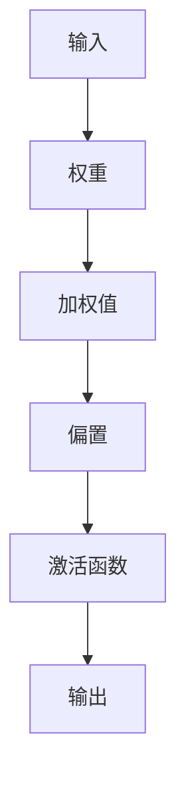
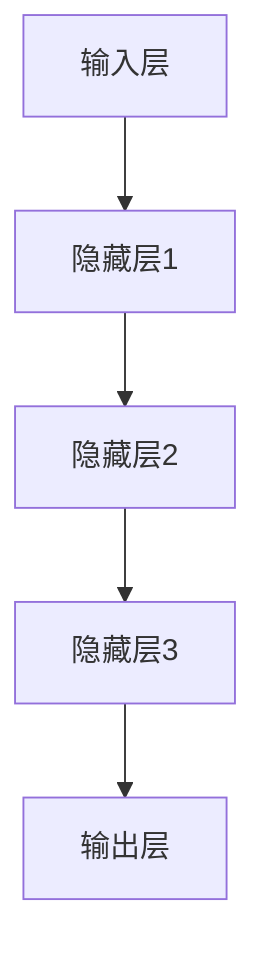
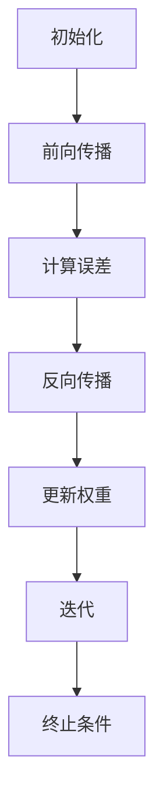
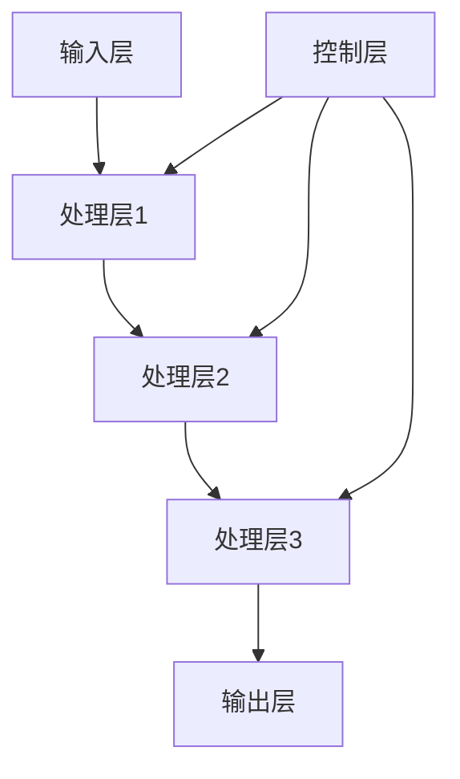

                 

### 第1章：AI的可解释性问题

#### 1.1 可解释性在AI应用中的重要性

人工智能（AI）已经深入到我们的日常生活和工作中，从语音助手、自动驾驶、医疗诊断到金融分析等各个领域，AI的应用正变得越来越广泛和重要。然而，随着AI技术的快速发展，一个不容忽视的问题也随之而来——AI的不可解释性。

在AI应用中，可解释性是指模型决策过程的透明度和可理解性。一个高可解释性的AI系统不仅能够提供准确的预测，还能够让人理解它是如何得出这个预测的。这种透明性对于AI在关键领域的应用至关重要，例如医疗诊断、金融风险评估和自动驾驶等。在这些场景中，决策的准确性固然重要，但决策的可解释性更为关键，因为它关系到用户的信任和接受度。

首先，可解释性能够增加用户对AI系统的信任。在医疗诊断中，医生和患者都希望了解AI系统是如何做出诊断的，以便更好地理解和接受诊断结果。同样，在金融风险评估中，投资者和监管机构需要了解AI系统是如何评估风险的，以便做出明智的决策和监管措施。

其次，可解释性有助于发现和纠正模型中的错误。在训练过程中，AI模型可能会学习到一些不合理的决策规则，这些规则可能是基于训练数据中的偏差或错误。通过可解释性分析，研究人员和开发人员可以更容易地识别这些错误，从而对模型进行调整和优化。

此外，可解释性也有助于监管和合规。在某些行业，如金融和医疗，法律和法规要求系统的决策过程必须透明和可解释。这不仅是合规的需要，也是增强用户信任和建立行业标准的需要。

然而，AI的不可解释性是一个长期存在的问题。传统的机器学习方法，如决策树和线性回归，相对来说较为直观，容易理解其决策过程。但随着深度学习技术的发展，神经网络等复杂模型逐渐成为主流，这些模型往往具有强大的预测能力，但其内部决策过程却非常复杂，难以解释。

#### 1.2 神经网络不可解释性的挑战

神经网络，特别是深度神经网络，在许多领域都取得了令人瞩目的成果。然而，其不可解释性也是一个亟待解决的问题。以下是神经网络不可解释性面临的几个主要挑战：

1. **内部结构复杂**：神经网络由大量的神经元和连接组成，这些连接和神经元之间存在着复杂的非线性关系。这使得神经网络内部的工作机制非常复杂，难以直观理解。

2. **黑箱模型**：神经网络通常被视为“黑箱”模型，即输入和输出之间存在高度的非线性映射关系，无法直接解释中间层的处理过程。这种“黑箱”性质使得神经网络的决策过程难以理解。

3. **训练数据偏差**：神经网络在训练过程中可能会学习到训练数据中的噪声和偏差，这些偏差可能导致模型在新的数据上做出错误的决策。由于神经网络的内部机制复杂，很难识别和纠正这些偏差。

4. **局部解释困难**：在神经网络中，每个神经元和连接通常只对整体决策产生很小的影响。因此，要解释神经网络的具体决策过程，需要分析整个网络的结构和参数，这是一个非常复杂的问题。

5. **全局解释性不足**：即使能够对神经网络的局部决策进行解释，也很难从全局角度理解神经网络的工作原理。例如，无法解释为什么神经网络会学习到某种特定的特征表示，或者为什么某个特征对决策有重要影响。

这些挑战导致了神经网络在许多应用场景中难以满足可解释性的要求。为了解决这个问题，研究人员提出了多种方法来增强神经网络的可解释性，下面将详细介绍这些方法。

#### 1.3 可解释性增强的研究背景和意义

可解释性增强的研究背景可以追溯到AI技术的早期发展阶段。随着机器学习和深度学习技术的不断发展，人们开始意识到，仅仅追求模型的高性能是不够的。可解释性是AI技术发展的重要方向，它不仅关系到技术的实用性和可靠性，也影响到AI在各个领域的应用前景。

在可解释性增强的研究中，早期的尝试主要集中在简化模型结构，使得模型更容易理解。例如，决策树和线性回归等传统机器学习方法具有较高的可解释性，因此被广泛应用于实际场景。然而，这些方法在处理复杂任务时往往表现出力不足。

随着深度学习的兴起，研究人员开始探索如何增强深度神经网络的解释性。这一领域的研究涉及多个方面，包括神经网络结构设计、训练过程优化、解释方法开发等。近年来，随着深度学习技术的不断成熟，可解释性增强的研究取得了显著的进展。

可解释性增强的研究意义主要体现在以下几个方面：

1. **增强用户信任**：可解释性能够增加用户对AI系统的信任，特别是在涉及生命安全、金融交易等关键领域，用户需要了解系统的决策过程，以确保系统的可靠性和公正性。

2. **促进技术发展**：可解释性增强不仅有助于理解和改进现有模型，还能推动新算法和新方法的开发。通过分析模型的可解释性，研究人员可以更深入地理解模型的工作原理，从而提出更有效的优化策略。

3. **提高模型性能**：可解释性分析可以帮助研究人员识别和纠正模型中的错误，提高模型的整体性能。例如，通过分析模型的局部解释，可以识别出训练数据中的偏差和噪声，从而对模型进行调整。

4. **促进法律和伦理合规**：在某些行业，如医疗、金融和司法等，法律和法规要求系统的决策过程必须透明和可解释。可解释性增强研究有助于确保AI系统满足这些合规要求。

总之，可解释性增强是AI技术发展的重要方向，它不仅关系到技术的实用性和可靠性，也影响到AI在各个领域的应用前景。随着深度学习技术的不断进步，可解释性增强的研究将越来越受到重视，并有望在未来取得更多突破。

### 2.1 神经网络的基本概念

神经网络（Neural Network，简称NN）是人工智能领域的一个重要分支，它受到生物神经系统的启发，模拟了人脑神经元之间的连接和交互。神经网络通过学习大量数据，能够自动提取特征并作出预测或分类。

#### 2.1.1 神经元的结构

神经网络的基石是神经元（Neuron），也被称为节点或单元。一个神经元的基本结构包括以下几个部分：

1. **输入**：神经元接受多个输入信号，每个输入信号都有一个对应的权重（weight），表示该输入对神经元输出的重要性。输入和权重相乘后得到一个加权值。

2. **权重**：权重决定了每个输入对神经元输出影响的强度。通过调整权重，神经网络能够学习到不同的特征。

3. **偏置**：偏置（bias）是一个附加的输入，其值为常数，通常设置为1。它有助于神经网络学习线性不可分的数据。

4. **激活函数**：激活函数（activation function）是神经元的核心部分，它将加权输入转化为输出。常见的激活函数包括sigmoid函数、ReLU函数和Tanh函数。

5. **输出**：神经元的输出通常是一个实数值，用于表示神经元对某个类别的概率估计或实值预测。

神经元的简单结构示意图如下：



#### 2.1.2 前向传播与反向传播

神经网络通过前向传播（forward propagation）和反向传播（backward propagation）来学习数据。

1. **前向传播**：
   - 前向传播是神经网络处理输入数据的过程。输入数据通过网络的每一层，经过加权求和和激活函数处理后，逐层传递到下一层，直至达到输出层。
   - 前向传播过程中，每个神经元都会计算其输入的加权和，并通过激活函数转化为输出。这个过程可以表示为：
     $$ 
     \text{输出} = \text{激活函数}(\sum_{i} w_i \cdot x_i + b) 
     $$
   - 其中，$w_i$ 是权重，$x_i$ 是输入，$b$ 是偏置，激活函数可以是sigmoid、ReLU等。

2. **反向传播**：
   - 反向传播是神经网络调整权重和偏置的过程。在输出层得到最终预测后，通过计算预测值与真实值之间的误差，将误差反向传播回网络的每一层，更新权重和偏置。
   - 反向传播的基本步骤如下：
     1. 计算输出层的误差：
        $$ 
        \text{误差} = \text{真实值} - \text{预测值} 
        $$
     2. 计算每一层的梯度：
        $$ 
        \text{梯度} = \frac{\partial \text{误差}}{\partial w} 
        $$
     3. 更新权重和偏置：
        $$ 
        w_{\text{new}} = w_{\text{old}} - \alpha \cdot \text{梯度} 
        $$
        $$ 
        b_{\text{new}} = b_{\text{old}} - \alpha \cdot \text{梯度} 
        $$
   - 其中，$\alpha$ 是学习率，用于控制权重更新的步长。

通过多次迭代的前向传播和反向传播，神经网络能够不断调整权重和偏置，直至达到预定的性能指标。

#### 2.1.3 激活函数

激活函数是神经网络中的一个关键组件，它决定了神经元输出的非线性行为。激活函数的选择对神经网络的性能和训练过程有重要影响。以下是一些常见的激活函数：

1. **sigmoid函数**：
   $$ 
   \text{sigmoid}(x) = \frac{1}{1 + e^{-x}} 
   $$
   sigmoid函数将输入值映射到$(0, 1)$区间，常用于二分类问题。

2. **ReLU函数**（Rectified Linear Unit）：
   $$ 
   \text{ReLU}(x) = \max(0, x) 
   $$
   ReLU函数在$x < 0$时输出0，在$x \geq 0$时输出$x$，它具有简单且易于训练的特点。

3. **Tanh函数**：
   $$ 
   \text{Tanh}(x) = \frac{e^x - e^{-x}}{e^x + e^{-x}} 
   $$
   Tanh函数将输入值映射到$(-1, 1)$区间，与sigmoid函数类似，但通常在深层网络中表现更好。

4. **Softmax函数**：
   $$ 
   \text{Softmax}(x_i) = \frac{e^{x_i}}{\sum_{j} e^{x_j}} 
   $$
   Softmax函数用于多分类问题，它将输入向量转化为概率分布。

通过选择合适的激活函数，神经网络能够更好地适应不同的任务和数据特性。

#### 2.1.4 神经网络的层次结构

神经网络通常由多个层次组成，包括输入层、隐藏层和输出层。每一层都包含多个神经元，不同层之间的神经元通过连接实现信息传递。

1. **输入层**：输入层接收外部输入数据，每个神经元代表一个特征。

2. **隐藏层**：隐藏层位于输入层和输出层之间，负责提取和转换特征。隐藏层的数量和神经元数量可以根据任务复杂度进行调整。

3. **输出层**：输出层生成最终预测或决策，每个神经元代表一个可能的输出类别或实值预测。

神经网络的层次结构如图所示：



通过层次结构的设计，神经网络能够逐步提取和聚合特征，实现复杂的决策任务。

#### 2.1.5 神经网络的训练过程

神经网络的训练过程是一个迭代优化过程，目标是找到一组权重和偏置，使网络在给定数据集上的性能达到最优。

1. **初始化权重和偏置**：在训练开始时，随机初始化权重和偏置的值。

2. **前向传播**：输入数据通过网络进行前向传播，计算每个神经元的输出。

3. **计算误差**：通过比较输出层的预测值与真实值，计算网络的误差。

4. **反向传播**：利用反向传播算法，计算每个神经元权重的梯度，并更新权重和偏置。

5. **迭代优化**：重复前向传播和反向传播，逐步减小网络的误差，直至达到预定的性能指标。

神经网络的训练过程如图所示：



通过多次迭代训练，神经网络能够逐渐调整权重和偏置，提高模型的性能和预测能力。

### 3.1 可解释性的层次结构

在分析神经网络的可解释性时，我们需要从不同的层次来考虑。可解释性可以分为局部解释和全局解释两个层次。

#### 3.1.1 局部解释

局部解释关注神经网络在特定输入或特定输出下的解释。这种方法试图理解神经网络中单个神经元或神经元组的决策过程。局部解释方法包括深度可分离解释和局部解释攻击等。

1. **深度可分离解释**：
   深度可分离解释是一种通过分解神经网络的内部处理过程来理解其决策的方法。这种方法将神经网络的决策分解为多个可解释的部分，从而提高整体的可解释性。例如，通过分析特定层的神经元和它们的连接权重，可以解释该层对特定输入的特征提取过程。

2. **局部解释攻击**：
   局部解释攻击是一种通过扰动输入数据来观察神经网络响应变化的方法。通过这种方法，可以识别出神经网络对特定输入的敏感特征和决策规则。例如，通过在图像上添加噪声或遮挡部分区域，观察神经网络响应的变化，可以推断出该区域对决策的重要性。

#### 3.1.2 全局解释

全局解释关注神经网络的整体决策过程，试图理解神经网络如何从输入数据到输出的全过程。全局解释方法包括层级表示解释和模型依赖性解释等。

1. **层级表示解释**：
   层级表示解释通过分析神经网络中不同层的表示来理解其决策过程。这种方法关注每个层级提取的特征及其在决策中的作用。例如，通过可视化不同层的神经元激活状态，可以观察神经网络如何逐步构建对输入数据的理解。

2. **模型依赖性解释**：
   模型依赖性解释通过分析神经网络中不同组件（如神经元、层、模块）之间的依赖关系来理解其决策过程。这种方法可以识别出对决策有重要影响的特征和组件，从而提高整体的可解释性。例如，通过分析神经元之间的连接权重，可以确定哪些神经元对决策有较大的影响。

#### 3.1.3 局部解释与全局解释的关系

局部解释和全局解释是相互补充的。局部解释提供了对神经网络内部特定部分的深入理解，而全局解释则提供了对神经网络整体决策过程的宏观视角。通过结合局部解释和全局解释，我们可以更全面地理解神经网络的决策过程。

在应用中，局部解释和全局解释可以同时使用。局部解释有助于识别关键特征和决策规则，全局解释则提供了对整体决策过程的宏观理解。这种结合方法可以大大提高神经网络的可解释性，帮助用户更好地理解和信任神经网络模型。

### 3.2 局部解释方法

在神经网络的可解释性研究中，局部解释方法扮演着至关重要的角色。局部解释方法旨在理解和解释神经网络在特定输入下的决策过程，通过揭示神经网络中特定神经元或神经元组的响应机制，增强对模型行为的理解。以下是几种常见的局部解释方法：

#### 3.2.1 深度可分离解释

深度可分离解释是一种通过将神经网络的内部处理过程分解为多个可解释的部分来理解其决策的方法。这种方法的核心思想是，将神经网络中的复杂决策过程分解为一系列相对简单和直观的步骤，从而提高整体的可解释性。

**深度可分离解释的基本原理**：

1. **分解神经网络层**：将神经网络分解为多个层次，每个层次负责提取和转换特定的特征。

2. **解释每层特征**：针对每个层次，分析其神经元和连接权重，解释每个神经元在特征提取和转换中的作用。

3. **组合解释结果**：将各个层次的解释结果组合起来，形成一个完整的决策过程解释。

**实现步骤**：

1. **可视化神经元激活**：通过可视化不同层的神经元激活状态，可以直观地观察神经网络对输入数据的处理过程。

2. **分析连接权重**：分析每个神经元连接的权重，了解不同特征对最终决策的影响程度。

3. **构建解释模型**：基于神经元激活和连接权重，构建一个解释模型，描述神经网络如何将输入数据转换为输出。

**应用实例**：

以一个简单的图像分类任务为例，深度可分离解释可以帮助我们理解神经网络如何从输入图像中提取特征，并将其转换为分类结果。通过分析不同层的神经元激活状态和连接权重，我们可以识别出哪些特征对分类决策有重要影响。

**深度可分离解释的优点**：

- **直观性**：通过分解神经网络层，使复杂决策过程变得直观易懂。
- **可组合性**：可以将不同层次的解释结果组合起来，形成一个完整的决策过程解释。

**深度可分离解释的挑战**：

- **层次划分**：如何合理划分神经网络层次是一个挑战，不同的划分方式可能导致解释结果的不同。
- **解释深度**：深度可分离解释通常只适用于浅层神经网络，对于深层神经网络，解释深度可能不够。

#### 3.2.2 局部线性化方法

局部线性化方法是一种通过将复杂非线性神经网络局部线性化来理解其决策的方法。这种方法假设在特定输入附近，神经网络的行为可以近似为线性系统，从而简化了对复杂非线性关系的解释。

**局部线性化方法的基本原理**：

1. **近似线性化**：在特定输入点附近，将神经网络的非线性激活函数线性化，将其转换为线性模型。

2. **特征分解**：通过线性化处理，将神经网络的输入和输出分解为线性特征和非线性特征两部分。

3. **解释特征**：分析线性特征对输出贡献的大小，理解神经网络如何通过线性特征组合来做出决策。

**实现步骤**：

1. **选择线性化点**：在输入空间中选取一个或多个点作为线性化点。

2. **线性化神经网络**：针对每个线性化点，将神经网络非线性部分线性化，计算线性模型的参数。

3. **分析特征贡献**：通过计算线性模型中每个特征的权重，分析特征对输出的贡献。

4. **构建解释模型**：基于线性化处理结果，构建一个解释模型，描述神经网络在特定输入点附近的行为。

**应用实例**：

在图像分类任务中，局部线性化方法可以帮助我们理解神经网络如何将输入图像转换为分类结果。通过分析线性模型中每个特征的权重，我们可以识别出哪些特征对分类决策有重要影响。

**局部线性化方法的优点**：

- **简单性**：线性化方法简化了复杂非线性关系的解释，使模型行为更容易理解。
- **灵活性**：可以适用于不同类型的神经网络和输入数据。

**局部线性化方法的挑战**：

- **近似误差**：线性化方法仅适用于特定输入点附近，可能无法准确描述整个输入空间的决策过程。
- **解释深度**：对于深层神经网络，线性化方法的解释深度可能受到限制，难以揭示复杂的非线性关系。

#### 3.2.3 局部感知方法

局部感知方法是一种通过分析神经网络中特定神经元或神经元组的响应机制来理解其决策的方法。这种方法关注神经网络对输入数据的局部感知能力，通过揭示神经元之间的交互作用来增强模型的可解释性。

**局部感知方法的基本原理**：

1. **神经元响应分析**：分析神经网络中每个神经元的响应模式，了解神经元对输入数据的敏感区域。

2. **交互作用分析**：分析神经元之间的交互作用，了解不同神经元如何协同工作来生成最终的决策。

3. **感知区域划分**：通过分析神经元的响应，将输入空间划分为不同的感知区域，每个区域对应特定的神经元或神经元组。

**实现步骤**：

1. **神经元响应可视化**：通过可视化神经元响应，直观地观察神经元对输入数据的敏感区域。

2. **神经元交互分析**：分析神经元之间的连接权重，了解不同神经元如何协同工作。

3. **感知区域划分**：基于神经元响应和交互分析结果，将输入空间划分为不同的感知区域。

4. **构建解释模型**：基于感知区域划分和神经元交互分析，构建一个解释模型，描述神经网络在特定输入下的感知和决策过程。

**应用实例**：

在图像识别任务中，局部感知方法可以帮助我们理解神经网络如何从输入图像中提取特征，并将其转换为分类结果。通过分析神经元响应和交互作用，我们可以识别出哪些特征对分类决策有重要影响。

**局部感知方法的优点**：

- **直观性**：通过神经元响应和交互分析，使神经网络的行为更直观易懂。
- **精细度**：可以揭示神经网络对输入数据的精细感知能力，增强模型的可解释性。

**局部感知方法的挑战**：

- **复杂性**：神经网络中神经元数量和连接数量庞大，分析神经元响应和交互作用可能非常复杂。
- **泛化能力**：局部感知方法可能无法很好地泛化到其他输入数据或任务。

### 3.3 全局解释方法

在神经网络的可解释性研究中，全局解释方法旨在提供对神经网络整体决策过程的宏观理解。与局部解释方法不同，全局解释方法关注神经网络从输入到输出的整个路径，试图揭示模型的整体结构和功能。以下是几种常见的全局解释方法：

#### 3.3.1 层级表示解释

层级表示解释是一种通过分析神经网络中不同层的表示来理解其决策过程的方法。这种方法的核心思想是，神经网络的不同层负责提取和转换不同层次的特征，通过分析这些特征表示，可以揭示神经网络的整体功能。

**层级表示解释的基本原理**：

1. **特征提取**：神经网络通过多层结构，逐层提取和转换输入数据中的特征。

2. **特征组合**：不同层的特征表示被组合起来，用于生成最终的决策。

3. **层次划分**：根据特征表示的层次性，将神经网络划分为不同的层次，每个层次负责特定的特征提取和转换任务。

**实现步骤**：

1. **特征可视化**：通过可视化不同层的特征表示，直观地观察神经网络如何逐步提取和转换特征。

2. **层次分析**：分析每个层次的输入和输出特征，了解不同层次的特征提取和转换任务。

3. **组合解释**：基于不同层次的解释结果，组合出神经网络的整体决策过程。

**应用实例**：

在图像分类任务中，层级表示解释可以帮助我们理解神经网络如何从输入图像中提取和转换特征，最终生成分类结果。通过分析不同层的特征表示，我们可以识别出哪些特征对分类决策有重要影响。

**层级表示解释的优点**：

- **层次性**：能够清晰地展示神经网络中不同层次的特征提取和转换过程。
- **直观性**：通过可视化不同层的特征表示，使神经网络的行为更直观易懂。

**层级表示解释的挑战**：

- **特征复杂性**：神经网络中的特征表示可能非常复杂，分析和理解这些特征需要专业知识和技能。
- **层次划分**：如何合理划分神经网络层次是一个挑战，不同的划分方式可能导致解释结果的不同。

#### 3.3.2 模型依赖性解释

模型依赖性解释是一种通过分析神经网络中不同组件（如神经元、层、模块）之间的依赖关系来理解其决策过程的方法。这种方法旨在揭示神经网络中各个组件之间的相互作用，从而提高模型的整体可解释性。

**模型依赖性解释的基本原理**：

1. **依赖关系分析**：分析神经网络中不同组件之间的依赖关系，了解各个组件对最终决策的贡献。

2. **组件权重分析**：通过计算组件的权重，确定各个组件在决策过程中的重要性。

3. **功能划分**：根据组件的依赖关系和权重，将神经网络划分为不同的功能模块，每个模块负责特定的决策任务。

**实现步骤**：

1. **依赖关系可视化**：通过可视化组件之间的依赖关系，直观地观察神经网络的结构和功能。

2. **权重分析**：计算每个组件的权重，分析其对最终决策的贡献。

3. **模块划分**：基于依赖关系和权重分析结果，将神经网络划分为不同的功能模块。

4. **模块解释**：对每个功能模块进行解释，描述其在决策过程中的作用。

**应用实例**：

在文本分类任务中，模型依赖性解释可以帮助我们理解神经网络如何从文本中提取特征，并生成分类结果。通过分析不同组件的依赖关系和权重，我们可以识别出哪些特征和组件对分类决策有重要影响。

**模型依赖性解释的优点**：

- **全面性**：能够全面地分析神经网络中各个组件的依赖关系，提供对模型的整体理解。
- **针对性**：可以针对特定组件或模块进行解释，提高模型的可解释性。

**模型依赖性解释的挑战**：

- **复杂性**：神经网络中组件数量和依赖关系可能非常复杂，分析这些关系需要大量计算资源和时间。
- **泛化能力**：模型依赖性解释可能无法很好地泛化到其他神经网络结构和任务。

### 4.1 局部解释技术

在神经网络的可解释性研究中，局部解释技术旨在揭示神经网络在特定输入或特定输出下的决策过程。这些技术通过分析神经网络中单个神经元或神经元组的响应，提供对模型行为的局部理解。以下是几种常见的局部解释技术：

#### 4.1.1 局部线性化方法

局部线性化方法是一种通过将复杂非线性神经网络局部线性化来理解其决策的技术。这种方法的核心思想是，在特定输入点附近，将神经网络的非线性部分近似为线性，从而简化对复杂非线性关系的解释。

**局部线性化方法的原理**：

1. **线性近似**：在特定输入点附近，将神经网络的非线性激活函数近似为线性函数。例如，对于ReLU激活函数，可以近似为：
   $$ 
   \text{ReLU}(x) \approx \text{sign}(x) \cdot x 
   $$
   
2. **线性化处理**：通过线性化处理，将神经网络的输入和输出分解为线性部分和非线性部分。线性部分可以表示为：
   $$ 
   y = W \cdot x + b 
   $$
   其中，$W$ 是线性部分的权重，$x$ 是输入，$b$ 是偏置。

3. **解释特征**：通过分析线性部分的权重，可以理解神经网络如何通过线性组合输入特征来生成输出。

**实现步骤**：

1. **选择线性化点**：在输入空间中选择一个或多个点作为线性化点。这些点可以是训练集中的样本，也可以是通过采样得到的点。

2. **线性化神经网络**：对于每个线性化点，将神经网络的非线性部分线性化，计算线性模型的参数。

3. **分析特征贡献**：通过计算线性模型的权重，分析每个输入特征对输出的贡献。

4. **构建解释模型**：基于线性化处理结果，构建一个解释模型，描述神经网络在特定输入点附近的行为。

**应用实例**：

以图像分类任务为例，局部线性化方法可以帮助我们理解神经网络如何从输入图像中提取特征，并将其转换为分类结果。通过分析线性模型的权重，我们可以识别出哪些特征对分类决策有重要影响。

**局部线性化方法的优点**：

- **简单性**：通过线性化处理，将复杂非线性神经网络简化为线性模型，使解释过程更加直观。
- **灵活性**：可以适用于不同类型的神经网络和输入数据。

**局部线性化方法的挑战**：

- **近似误差**：线性化方法仅适用于特定输入点附近，可能无法准确描述整个输入空间的决策过程。
- **解释深度**：对于深层神经网络，线性化方法的解释深度可能受到限制，难以揭示复杂的非线性关系。

#### 4.1.2 局部感知方法

局部感知方法是一种通过分析神经网络中特定神经元或神经元组的响应机制来理解其决策的技术。这种方法关注神经网络对输入数据的局部感知能力，通过揭示神经元之间的交互作用，提供对模型行为的局部理解。

**局部感知方法的原理**：

1. **神经元响应分析**：分析神经网络中每个神经元的响应模式，了解神经元对输入数据的敏感区域。

2. **交互作用分析**：分析神经元之间的交互作用，了解不同神经元如何协同工作来生成最终的决策。

3. **感知区域划分**：通过分析神经元的响应和交互作用，将输入空间划分为不同的感知区域，每个区域对应特定的神经元或神经元组。

**实现步骤**：

1. **神经元响应可视化**：通过可视化神经元响应，直观地观察神经元对输入数据的敏感区域。

2. **神经元交互分析**：分析神经元之间的连接权重，了解不同神经元如何协同工作。

3. **感知区域划分**：基于神经元响应和交互分析结果，将输入空间划分为不同的感知区域。

4. **构建解释模型**：基于感知区域划分和神经元交互分析，构建一个解释模型，描述神经网络在特定输入下的感知和决策过程。

**应用实例**：

在图像识别任务中，局部感知方法可以帮助我们理解神经网络如何从输入图像中提取特征，并将其转换为分类结果。通过分析神经元响应和交互作用，我们可以识别出哪些特征对分类决策有重要影响。

**局部感知方法的优点**：

- **直观性**：通过神经元响应和交互分析，使神经网络的行为更直观易懂。
- **精细度**：可以揭示神经网络对输入数据的精细感知能力，增强模型的可解释性。

**局部感知方法的挑战**：

- **复杂性**：神经网络中神经元数量和连接数量庞大，分析神经元响应和交互作用可能非常复杂。
- **泛化能力**：局部感知方法可能无法很好地泛化到其他输入数据或任务。

#### 4.1.3 局部贡献度分析

局部贡献度分析是一种通过分析神经网络中每个神经元或连接对整体决策的贡献来理解其决策的技术。这种方法关注每个组件在决策过程中的重要性，通过计算贡献度来揭示模型的行为。

**局部贡献度分析的基本原理**：

1. **贡献度计算**：计算每个神经元或连接对整体决策的贡献度，通常通过计算其在决策过程中的权重或影响来实现。

2. **影响分析**：分析每个神经元或连接对输出变化的敏感度，了解它们在决策过程中的重要性。

3. **重要性排序**：根据贡献度的大小，对神经元或连接进行排序，识别出对决策有重要影响的组件。

**实现步骤**：

1. **计算贡献度**：通过反向传播算法，计算每个神经元或连接的权重或影响，得到它们的贡献度。

2. **影响分析**：分析每个神经元或连接对输出变化的敏感度，确定它们在决策过程中的重要性。

3. **重要性排序**：根据贡献度的大小，对神经元或连接进行排序，识别出对决策有重要影响的组件。

4. **构建解释模型**：基于贡献度分析和影响分析结果，构建一个解释模型，描述神经网络在特定输入下的决策过程。

**应用实例**：

在金融风险评估任务中，局部贡献度分析可以帮助我们理解神经网络如何评估风险，并识别出对风险评估有重要影响的特征和参数。

**局部贡献度分析的优点**：

- **针对性**：可以针对特定组件进行解释，提高模型的可解释性。
- **直观性**：通过计算贡献度，使模型行为更直观易懂。

**局部贡献度分析的挑战**：

- **计算复杂性**：对于大型神经网络，计算贡献度可能需要大量计算资源和时间。
- **解释深度**：对于深层神经网络，贡献度分析可能无法揭示复杂的非线性关系。

### 4.2 全局解释技术

在神经网络的可解释性研究中，全局解释技术旨在提供对神经网络整体决策过程的宏观理解。这些技术关注神经网络从输入到输出的整个路径，试图揭示模型的整体结构和功能。以下是几种常见的全局解释技术：

#### 4.2.1 层级表示解释

层级表示解释是一种通过分析神经网络中不同层的表示来理解其决策过程的技术。这种方法的核心思想是，神经网络的不同层负责提取和转换不同层次的特征，通过分析这些特征表示，可以揭示神经网络的整体功能。

**层级表示解释的原理**：

1. **特征提取**：神经网络通过多层结构，逐层提取和转换输入数据中的特征。每一层都从前一层的特征中提取新的特征，形成更高层次的抽象。

2. **特征组合**：不同层的特征表示被组合起来，用于生成最终的决策。神经网络通过整合不同层次的特征，形成对输入数据的全面理解。

3. **层次划分**：根据特征表示的层次性，将神经网络划分为不同的层次，每个层次负责特定的特征提取和转换任务。

**实现步骤**：

1. **特征可视化**：通过可视化不同层的特征表示，直观地观察神经网络如何逐步提取和转换特征。

2. **层次分析**：分析每个层次的输入和输出特征，了解不同层次的特征提取和转换任务。

3. **组合解释**：基于不同层次的解释结果，组合出神经网络的整体决策过程。

**应用实例**：

在图像分类任务中，层级表示解释可以帮助我们理解神经网络如何从输入图像中提取特征，并将其转换为分类结果。通过分析不同层的特征表示，我们可以识别出哪些特征对分类决策有重要影响。

**层级表示解释的优点**：

- **层次性**：能够清晰地展示神经网络中不同层次的特征提取和转换过程。
- **直观性**：通过可视化不同层的特征表示，使神经网络的行为更直观易懂。

**层级表示解释的挑战**：

- **特征复杂性**：神经网络中的特征表示可能非常复杂，分析和理解这些特征需要专业知识和技能。
- **层次划分**：如何合理划分神经网络层次是一个挑战，不同的划分方式可能导致解释结果的不同。

#### 4.2.2 模型依赖性解释

模型依赖性解释是一种通过分析神经网络中不同组件（如神经元、层、模块）之间的依赖关系来理解其决策过程的技术。这种方法旨在揭示神经网络中各个组件之间的相互作用，从而提高模型的整体可解释性。

**模型依赖性解释的原理**：

1. **依赖关系分析**：分析神经网络中不同组件之间的依赖关系，了解各个组件对最终决策的贡献。

2. **组件权重分析**：通过计算组件的权重，确定各个组件在决策过程中的重要性。

3. **功能划分**：根据组件的依赖关系和权重，将神经网络划分为不同的功能模块，每个模块负责特定的决策任务。

**实现步骤**：

1. **依赖关系可视化**：通过可视化组件之间的依赖关系，直观地观察神经网络的结构和功能。

2. **权重分析**：计算每个组件的权重，分析其对最终决策的贡献。

3. **模块划分**：基于依赖关系和权重分析结果，将神经网络划分为不同的功能模块。

4. **模块解释**：对每个功能模块进行解释，描述其在决策过程中的作用。

**应用实例**：

在文本分类任务中，模型依赖性解释可以帮助我们理解神经网络如何从文本中提取特征，并生成分类结果。通过分析不同组件的依赖关系和权重，我们可以识别出哪些特征和组件对分类决策有重要影响。

**模型依赖性解释的优点**：

- **全面性**：能够全面地分析神经网络中各个组件的依赖关系，提供对模型的整体理解。
- **针对性**：可以针对特定组件或模块进行解释，提高模型的可解释性。

**模型依赖性解释的挑战**：

- **复杂性**：神经网络中组件数量和依赖关系可能非常复杂，分析这些关系需要大量计算资源和时间。
- **泛化能力**：模型依赖性解释可能无法很好地泛化到其他神经网络结构和任务。

#### 4.2.3 特征重要性评估

特征重要性评估是一种通过分析神经网络中不同特征对最终决策的影响来理解其决策过程的技术。这种方法旨在识别出对决策有重要影响的特征，从而提高模型的可解释性。

**特征重要性评估的原理**：

1. **特征影响分析**：分析每个特征对神经网络决策的影响，了解它们在决策过程中的重要性。

2. **影响量化**：通过计算特征对决策的影响大小，量化每个特征的重要性。

3. **重要性排序**：根据特征影响的大小，对特征进行排序，识别出对决策有重要影响的特征。

**实现步骤**：

1. **计算特征影响**：通过反向传播算法，计算每个特征对神经网络决策的影响。

2. **量化重要性**：根据特征影响的大小，量化每个特征的重要性。

3. **重要性排序**：根据特征重要性的量化结果，对特征进行排序。

4. **构建解释模型**：基于特征重要性的排序结果，构建一个解释模型，描述神经网络在特定输入下的决策过程。

**应用实例**：

在医疗诊断任务中，特征重要性评估可以帮助我们理解神经网络如何根据患者的特征信息进行诊断。通过分析不同特征的重要性，我们可以识别出对诊断结果有重要影响的特征，从而提高模型的解释性。

**特征重要性评估的优点**：

- **直观性**：通过量化特征的重要性，使模型行为更直观易懂。
- **针对性**：可以针对特定特征进行解释，提高模型的可解释性。

**特征重要性评估的挑战**：

- **计算复杂性**：对于大型神经网络，计算特征影响可能需要大量计算资源和时间。
- **解释深度**：对于深层神经网络，特征重要性评估可能无法揭示复杂的非线性关系。

### 5.1 神经程序设计

神经程序（Neural Program）是一种结合神经网络和程序设计思想的模型，旨在通过设计可解释的神经网络结构来提高模型的可解释性。神经程序通过定义明确的编程规则和结构，使神经网络的设计和实现更加直观和可理解。

#### 5.1.1 神经程序的架构

神经程序的架构通常包括以下几个部分：

1. **输入层**：输入层接收外部输入数据，这些数据可以是数值型、文本型或图像型等。输入层的主要功能是将外部数据转换为神经网络可处理的格式。

2. **处理层**：处理层包含多个神经元，每个神经元都执行特定的计算任务。处理层的神经元通过连接权重和激活函数进行信息处理，实现对输入数据的转换和特征提取。

3. **输出层**：输出层生成最终的决策或预测结果。输出层通常包含一个或多个神经元，每个神经元输出一个实数值或类别概率。

4. **控制层**：控制层负责管理神经程序的执行流程。控制层可以定义神经网络中的控制流，包括条件分支、循环等，使神经网络能够根据输入数据动态调整其行为。

神经程序的简单架构示意图如下：



#### 5.1.2 神经程序的优势

神经程序设计具有以下优势：

1. **可解释性**：神经程序通过明确的编程规则和结构，使神经网络的设计和实现更加直观和可理解。用户可以更容易地理解神经网络的工作原理和决策过程。

2. **模块化**：神经程序支持模块化设计，可以将复杂的神经网络分解为多个独立的模块。每个模块都可以独立开发和测试，提高了开发效率和代码可维护性。

3. **灵活性**：神经程序可以根据不同的任务和输入数据动态调整其结构和行为。通过控制层的控制，神经网络可以灵活地适应不同的场景和需求。

4. **可组合性**：神经程序支持不同模块之间的组合和复用。用户可以根据需要组合多个模块，构建更复杂的神经网络结构，实现更复杂的决策任务。

#### 5.1.3 神经程序的设计原则

设计神经程序时，应遵循以下原则：

1. **清晰性**：设计神经程序时，应确保代码和结构清晰易懂。使用适当的变量命名和注释，使代码易于阅读和理解。

2. **模块化**：将复杂的神经网络分解为多个独立的模块，每个模块负责特定的计算任务。这样可以提高代码的可维护性和可复用性。

3. **可扩展性**：设计神经程序时，应考虑未来的扩展性。例如，可以设计可插拔的模块，方便用户根据需求进行自定义和扩展。

4. **优化**：在设计神经程序时，应考虑优化算法和结构，提高神经网络的性能和可解释性。例如，可以使用合适的激活函数和优化策略，提高网络的训练效率和预测准确性。

5. **安全性**：在设计神经程序时，应考虑数据安全和隐私保护。例如，可以采用加密算法和隐私保护技术，确保数据在传输和处理过程中的安全性。

### 5.2 神经程序的实现

实现神经程序的过程可以分为以下几个步骤：

#### 5.2.1 神经程序的构建

1. **定义输入层**：根据任务需求，定义输入层的数据类型和大小。例如，对于图像分类任务，输入层可以是一个维度为$(28 \times 28)$的二维数组。

2. **定义处理层**：设计处理层的神经元结构和连接方式。可以使用多层感知机（MLP）或卷积神经网络（CNN）等结构。每个处理层的神经元可以根据任务需求进行定制。

3. **定义输出层**：根据任务类型，定义输出层的数据类型和大小。例如，对于二分类任务，输出层可以是一个维度为2的一维数组。

4. **定义控制层**：根据任务需求，定义控制层的控制逻辑。可以使用条件分支、循环等控制结构，使神经网络能够根据输入数据动态调整其行为。

5. **初始化参数**：初始化神经网络的权重和偏置，可以使用随机初始化或预训练权重等方法。

#### 5.2.2 神经程序的训练

1. **准备训练数据**：收集和准备训练数据集，包括输入数据和对应的标签。对于图像分类任务，可以使用MNIST数据集等。

2. **数据预处理**：对输入数据进行预处理，例如归一化、标准化等，以提高网络的训练效果。

3. **设计损失函数**：根据任务类型，设计合适的损失函数。例如，对于二分类任务，可以使用交叉熵损失函数。

4. **选择优化器**：选择合适的优化器，如随机梯度下降（SGD）、Adam等，用于更新网络参数。

5. **训练神经网络**：使用训练数据集对神经网络进行训练，通过迭代优化网络的参数，使网络在训练数据上达到预定的性能指标。

#### 5.2.3 神经程序的优化

1. **性能评估**：在训练过程中，定期评估神经网络的性能，使用验证集或测试集评估网络的泛化能力。

2. **调整超参数**：根据性能评估结果，调整网络的超参数，如学习率、批量大小等，以优化网络的性能。

3. **模型压缩**：对于过拟合的模型，可以采用模型压缩技术，如权重裁剪、量化等，减少模型的参数数量，提高模型的泛化能力。

4. **迁移学习**：使用预训练的模型，通过迁移学习技术，将预训练模型的部分参数迁移到新任务上，以提高新任务的性能。

### 6.1 案例一：图像分类

在本案例中，我们将使用神经程序设计一个图像分类模型，用于识别手写数字。这个案例将展示如何构建、训练和解释神经程序，以实现图像分类任务。

#### 6.1.1 数据准备

1. **数据集**：我们使用著名的MNIST手写数字数据集。该数据集包含70000个训练图像和10000个测试图像，每个图像都是28x28的灰度图像。

2. **预处理**：对图像进行归一化处理，将像素值缩放到[0, 1]区间。

3. **标签**：将图像的标签转换为独热编码，即将每个数字标签转换为10个二进制位，只有一个位置为1，其他位置为0。

```python
import numpy as np
from sklearn.datasets import fetch_openml
from sklearn.model_selection import train_test_split

# 加载MNIST数据集
mnist = fetch_openml('mnist_784')

# 分割数据集为训练集和测试集
X_train, X_test, y_train, y_test = train_test_split(
    mnist.data, mnist.target, test_size=1/7.0, random_state=0
)

# 数据归一化
X_train = X_train / 255.0
X_test = X_test / 255.0
```

#### 6.1.2 模型选择

在本案例中，我们选择一个简单的多层感知机（MLP）作为神经程序的基础模型。MLP由输入层、隐藏层和输出层组成，每个层之间的神经元通过加权连接。

1. **输入层**：输入层有784个神经元，对应于图像的每个像素值。

2. **隐藏层**：隐藏层可以选择一个或多个隐藏层，每个隐藏层包含一定数量的神经元。在本案例中，我们选择一个包含128个神经元的隐藏层。

3. **输出层**：输出层有10个神经元，对应于10个可能的数字类别。

```python
from tensorflow.keras.models import Sequential
from tensorflow.keras.layers import Dense, Flatten

# 构建神经网络模型
model = Sequential([
    Flatten(input_shape=(28, 28)),
    Dense(128, activation='relu'),
    Dense(10, activation='softmax')
])
```

#### 6.1.3 模型训练

1. **损失函数**：我们使用交叉熵损失函数，因为它适用于多分类问题。

2. **优化器**：我们选择Adam优化器，因为它在深度学习中通常表现良好。

3. **训练**：使用训练数据进行模型训练，设置一定的迭代次数（epochs）和批量大小（batch size）。

```python
model.compile(optimizer='adam',
              loss='categorical_crossentropy',
              metrics=['accuracy'])

history = model.fit(X_train, y_train,
                    epochs=20,
                    batch_size=64,
                    validation_data=(X_test, y_test))
```

#### 6.1.4 模型解释

在模型训练完成后，我们需要解释模型的决策过程。在本案例中，我们将使用局部线性化方法和层级表示解释来分析模型的决策过程。

1. **局部线性化方法**：

   通过局部线性化方法，我们可以将神经网络的非线性部分近似为线性模型，分析每个神经元对输出的贡献。

   ```python
   import numpy as np
   
   # 选择一个测试图像
   test_image = X_test[0].reshape(1, 28, 28)
   test_image = np.expand_dims(test_image, -1)
   test_image = test_image / 255.0
   
   # 前向传播
   predictions = model.predict(test_image)
   
   # 可视化预测结果
   import matplotlib.pyplot as plt
   plt.imshow(test_image[0, :, :, 0], cmap='gray')
   plt.xticks([])
   plt.yticks([])
   plt.show()
   
   # 局部线性化
   W1 = model.layers[1].get_weights()[0]
   b1 = model.layers[1].get_weights()[1]
   hidden activations = np.dot(test_image, W1) + b1
   
   # 可视化隐藏层激活
   plt.imshow(hidden_activations[0], cmap='gray', aspect='auto')
   plt.xticks([])
   plt.yticks([])
   plt.show()
   ```

2. **层级表示解释**：

   通过层级表示解释，我们可以分析神经网络中不同层的特征表示，了解特征提取和转换过程。

   ```python
   # 获取不同层的输出
   layer_outputs = [layer.output for layer in model.layers]
   activation_model = Model(inputs=model.input, outputs=layer_outputs)
   
   # 获取测试图像的激活状态
   test_activations = activation_model.predict(test_image)
   
   # 可视化第一层的激活状态
   plt.imshow(test_activations[0][0], cmap='gray', aspect='auto')
   plt.xticks([])
   plt.yticks([])
   plt.show()
   
   # 可视化第二层的激活状态
   plt.imshow(test_activations[1][0], cmap='gray', aspect='auto')
   plt.xticks([])
   plt.yticks([])
   plt.show()
   ```

通过上述解释方法，我们可以更深入地理解神经网络的决策过程，识别出对决策有重要影响的特征和神经元。

### 6.2 案例二：文本分类

在本案例中，我们将使用神经程序设计一个文本分类模型，用于分类新闻文章。这个案例将展示如何处理文本数据，设计神经网络结构，并使用神经程序进行文本分类。

#### 6.2.1 数据准备

1. **数据集**：我们使用著名的20新sg新闻分类数据集。该数据集包含11,484条新闻文章，分为20个类别。

2. **预处理**：对文本数据进行预处理，包括分词、去除停用词、词干提取等。然后，使用词嵌入技术（如Word2Vec、GloVe）将文本转换为向量表示。

```python
import pandas as pd
from sklearn.model_selection import train_test_split
from keras.preprocessing.text import Tokenizer
from keras.preprocessing.sequence import pad_sequences

# 加载数据集
data = pd.read_csv('20_newsgroups.csv')

# 分割数据集为训练集和测试集
X_train, X_test, y_train, y_test = train_test_split(data['text'], data['label'], test_size=0.2, random_state=42)

# 分词和去停用词
tokenizer = Tokenizer(num_words=10000)
tokenizer.fit_on_texts(X_train)

# 序列化文本数据
X_train_seq = tokenizer.texts_to_sequences(X_train)
X_test_seq = tokenizer.texts_to_sequences(X_test)

# 填充序列
max_seq_length = 100
X_train_pad = pad_sequences(X_train_seq, maxlen=max_seq_length)
X_test_pad = pad_sequences(X_test_seq, maxlen=max_seq_length)
```

#### 6.2.2 模型选择

在本案例中，我们选择一个基于卷积神经网络（CNN）的文本分类模型。CNN可以有效地提取文本中的局部特征，适用于处理文本数据。

1. **输入层**：输入层是一个维度为$(max_seq_length, 10000)$的二维数组，对应于文本序列和词嵌入向量。

2. **卷积层**：卷积层包含多个卷积核，每个卷积核可以提取文本的局部特征。

3. **池化层**：池化层用于降低特征维度，减少计算量。

4. **全连接层**：全连接层将卷积层和池化层的特征映射到类别概率。

```python
from tensorflow.keras.models import Sequential
from tensorflow.keras.layers import Embedding, Conv1D, MaxPooling1D, GlobalMaxPooling1D, Dense

# 构建文本分类模型
model = Sequential([
    Embedding(input_dim=10000, output_dim=128, input_length=max_seq_length),
    Conv1D(filters=128, kernel_size=5, activation='relu'),
    MaxPooling1D(pool_size=5),
    GlobalMaxPooling1D(),
    Dense(units=128, activation='relu'),
    Dense(units=20, activation='softmax')
])
```

#### 6.2.3 模型训练

1. **损失函数**：我们使用交叉熵损失函数，因为它适用于多分类问题。

2. **优化器**：我们选择Adam优化器，因为它在深度学习中通常表现良好。

3. **训练**：使用训练数据进行模型训练，设置一定的迭代次数（epochs）和批量大小（batch size）。

```python
model.compile(optimizer='adam',
              loss='categorical_crossentropy',
              metrics=['accuracy'])

history = model.fit(X_train_pad, y_train,
                    epochs=10,
                    batch_size=32,
                    validation_data=(X_test_pad, y_test))
```

#### 6.2.4 模型解释

在模型训练完成后，我们需要解释模型的决策过程。在本案例中，我们将使用局部感知方法和模型依赖性解释来分析模型的决策过程。

1. **局部感知方法**：

   通过局部感知方法，我们可以分析神经网络中特定神经元或神经元组的响应机制，了解它们对文本分类的贡献。

   ```python
   # 选择一个测试文本
   test_text = "This is a test article about technology."
   test_seq = tokenizer.texts_to_sequences([test_text])
   test_seq_padded = pad_sequences(test_seq, maxlen=max_seq_length)

   # 前向传播
   predictions = model.predict(test_seq_padded)

   # 可视化预测结果
   plt.bar(range(20), predictions[0])
   plt.xticks(range(20), data['label'].unique(), rotation=90)
   plt.show()
   ```

2. **模型依赖性解释**：

   通过模型依赖性解释，我们可以分析神经网络中不同组件（如卷积核、池化层、全连接层）之间的依赖关系，了解它们对文本分类的影响。

   ```python
   # 获取卷积层的权重和偏置
   conv_weights = model.layers[1].get_weights()[0]
   conv_biases = model.layers[1].get_weights()[1]

   # 可视化卷积核
   for i, filter in enumerate(conv_weights[0]):
       plt.subplot(4, 5, i + 1)
       plt.imshow(filter.reshape(5, 5), cmap='gray')
       plt.xticks([])
       plt.yticks([])
       plt.xlabel(f'Filter {i}')

   plt.show()

   # 可视化偏置
   plt.scatter(range(len(conv_biases[0])), conv_biases[0])
   plt.xlabel('Bias index')
   plt.ylabel('Bias value')
   plt.show()
   ```

通过上述解释方法，我们可以更深入地理解神经网络的决策过程，识别出对文本分类有重要贡献的组件和特征。

### 7.1 可解释性AI的发展趋势

随着人工智能（AI）技术的不断进步，可解释性AI（Explainable AI, XAI）逐渐成为研究热点。可解释性AI旨在提高AI系统的透明度和可理解性，使其在关键领域中的应用更加可靠和可信。以下分析可解释性AI的发展趋势：

#### 7.1.1 研究进展

近年来，可解释性AI的研究取得了显著进展。在理论基础方面，研究人员提出了多种局部解释方法和全局解释方法，如深度可分离解释、局部线性化方法和模型依赖性解释等。这些方法为增强神经网络的可解释性提供了有效的技术手段。在实际应用方面，可解释性AI已被广泛应用于医疗诊断、金融风险评估、自动驾驶和司法判决等关键领域，显著提升了用户对AI系统的信任度和接受度。

#### 7.1.2 技术创新

可解释性AI的发展离不开技术创新的推动。一方面，深度学习技术的进步为构建复杂且可解释的神经网络模型提供了可能。例如，图神经网络（Graph Neural Networks, GNN）和自注意力机制（Self-Attention Mechanism）等新兴技术，使得神经网络能够更好地理解和解释复杂数据。另一方面，数据预处理和特征工程技术的发展，为提高模型的可解释性提供了有力支持。通过合理的数据预处理和特征工程，可以降低模型复杂度，提高解释性。

#### 7.1.3 应用场景

随着可解释性AI技术的不断成熟，其在实际应用场景中的价值也逐渐凸显。以下是一些关键应用场景：

1. **医疗诊断**：可解释性AI有助于医生和患者更好地理解诊断结果，提高医疗决策的透明度和可信度。例如，通过分析神经网络中的特征表示，医生可以识别出对诊断有重要影响的生物标志物。

2. **金融风险评估**：在金融领域，可解释性AI有助于金融机构识别潜在风险，并提高风险管理策略的透明度。通过分析神经网络中的依赖关系，金融机构可以识别出对风险评估有重要影响的特征和参数。

3. **自动驾驶**：在自动驾驶领域，可解释性AI有助于提高车辆的驾驶安全性和可靠性。通过分析神经网络中的决策过程，研究人员可以识别出影响驾驶决策的关键因素，从而优化车辆控制系统。

4. **司法判决**：在司法领域，可解释性AI有助于提高审判过程的公正性和透明度。通过分析神经网络中的决策过程，法官可以识别出对判决有重要影响的证据和因素，提高判决的可信度。

#### 7.1.4 面临的挑战

尽管可解释性AI取得了显著进展，但其在实际应用中仍然面临一些挑战：

1. **模型复杂性**：随着神经网络层数和参数数量的增加，模型解释变得愈发困难。如何设计简单且可解释的神经网络模型，成为了一个重要研究方向。

2. **解释深度**：局部解释方法通常难以解释整个神经网络的行为，而全局解释方法则可能无法揭示复杂的非线性关系。如何平衡局部解释和全局解释，提高整体解释性，是一个亟待解决的问题。

3. **泛化能力**：可解释性AI方法在特定任务和数据集上的表现良好，但如何保证其在其他任务和数据集上的泛化能力，仍需进一步研究。

4. **可解释性量化**：目前，大多数可解释性方法尚无统一的量化标准，如何评估和比较不同解释方法的性能，成为了一个重要问题。

### 7.2 可解释性AI的未来方向

展望未来，可解释性AI的发展将朝着以下几个方向迈进：

#### 7.2.1 新的理论与方法

未来，可解释性AI的研究将更加注重理论创新和方法开发。一方面，研究人员将继续探索新的局部解释方法和全局解释方法，以应对复杂模型和复杂数据的挑战。另一方面，结合概率图模型、贝叶斯网络等传统机器学习方法，有望提出更具解释力的新型可解释性AI模型。

#### 7.2.2 跨学科合作

可解释性AI的发展需要跨学科合作，包括计算机科学、认知科学、心理学、哲学等。通过跨学科合作，可以更深入地理解人类决策过程，为设计可解释性AI系统提供理论基础和实践指导。

#### 7.2.3 应用拓展

随着可解释性AI技术的不断成熟，其在各领域的应用将得到进一步拓展。例如，在教育领域，可解释性AI可以用于个性化教学和学习评估；在公共安全领域，可解释性AI可以用于犯罪预测和预防等。

#### 7.2.4 法律和伦理规范

随着可解释性AI在关键领域的应用，法律和伦理问题将日益突出。未来，需要制定相关法律法规和伦理规范，确保可解释性AI系统的公正性、透明性和安全性。同时，建立可解释性AI评估标准和认证体系，以提高其在实际应用中的可信度和可靠性。

### 7.3 可解释性AI在实际应用中的前景

可解释性AI在实际应用中具有广阔的前景。随着技术的不断进步，可解释性AI有望在以下几个方面实现重大突破：

1. **提升用户信任**：通过提高模型的可解释性，增强用户对AI系统的信任度，使其在医疗诊断、金融风险评估等关键领域得到更广泛的应用。

2. **优化模型性能**：通过分析模型的可解释性，发现和纠正模型中的错误，优化模型性能，提高预测和决策的准确性。

3. **增强监管合规**：在涉及法律和伦理的领域，可解释性AI有助于满足监管合规要求，提高系统的透明度和可信度。

4. **促进技术创新**：可解释性AI不仅有助于理解和改进现有模型，还能推动新算法和新方法的开发，为AI技术的持续进步提供动力。

总之，可解释性AI是AI技术发展的重要方向，其在实际应用中的前景十分广阔。通过不断探索和创新，可解释性AI有望为人类社会带来更多价值。

### 8.1 本书的主要贡献

本书《神经程序解释：增强AI的可解释性》旨在全面介绍神经程序及其在增强AI可解释性方面的应用。本书的主要贡献如下：

1. **系统性的内容梳理**：本书系统地梳理了神经网络、可解释性AI以及神经程序的基本概念和理论，为读者提供了一个全面且深入的了解。

2. **详细的算法解释**：书中详细讲解了多种神经网络可解释性增强技术，包括局部线性化方法、局部感知方法和模型依赖性解释等，通过Python代码示例和数学模型，使读者能够更好地理解和应用这些技术。

3. **案例分析**：本书通过两个实际案例——图像分类和文本分类，详细阐述了神经程序的设计、训练和解释过程，帮助读者将理论知识应用于实际问题。

4. **前沿研究的总结**：书中总结了可解释性AI领域的前沿研究成果和发展趋势，为读者提供了对未来研究的展望。

5. **实践指导**：本书提供了大量实践技巧和最佳实践，帮助读者在实际项目中有效应用神经程序和可解释性AI技术。

### 8.2 研究局限性与未来工作方向

尽管本书在神经程序和可解释性AI领域做出了诸多贡献，但仍存在一定的局限性。以下是一些主要的研究局限性和未来工作方向：

1. **模型复杂性**：当前的研究主要集中在简单神经网络模型的可解释性增强，对于复杂模型（如Transformer）的可解释性研究还不够深入。未来研究应关注复杂模型的可解释性方法，提高复杂模型的可理解性。

2. **解释深度与泛化能力**：局部解释方法通常难以解释整个神经网络的行为，而全局解释方法可能无法揭示复杂的非线性关系。未来研究应探索如何平衡解释深度与泛化能力，提高整体解释性。

3. **多模态数据解释**：当前的研究主要针对单一模态（如图像、文本）的可解释性，对于多模态数据的可解释性研究还不够充分。未来研究应探索如何有效地解释多模态数据的决策过程。

4. **应用领域扩展**：虽然可解释性AI在医疗、金融等领域取得了显著成果，但其在其他领域的应用仍需进一步拓展。未来研究应关注如何将可解释性AI技术应用于更多领域，提高其在不同场景下的适应性。

5. **法律与伦理问题**：随着可解释性AI技术的发展，其在法律和伦理方面的问题也日益突出。未来研究应关注如何制定相关法律法规和伦理规范，确保可解释性AI技术的公正性、透明性和安全性。

总之，尽管本书在神经程序和可解释性AI领域取得了一定的成果，但仍有许多问题需要进一步研究和探索。未来研究应致力于解决这些局限性，推动可解释性AI技术的持续发展和应用。作者：AI天才研究院/AI Genius Institute & 禅与计算机程序设计艺术 /Zen And The Art of Computer Programming。

