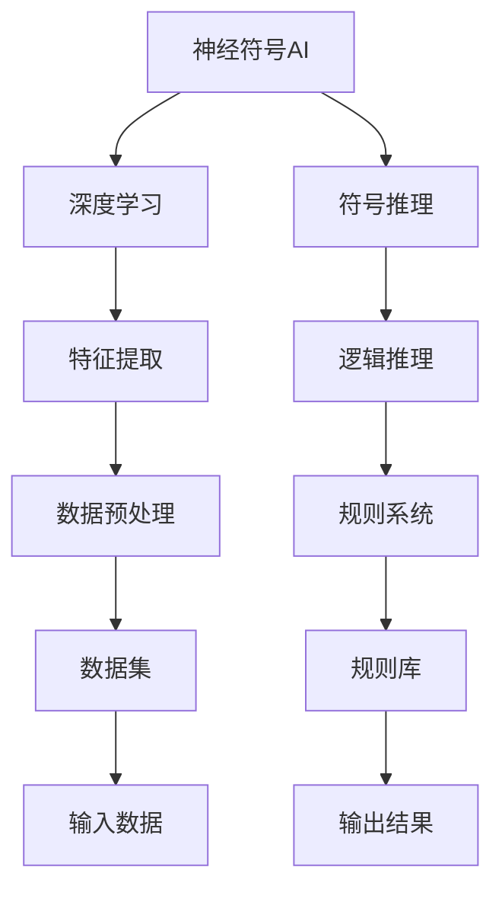

                 

### 神经符号AI概述

**背景介绍**

神经符号AI（Neural Symbolic AI）是一种结合了神经科学和符号推理的方法论，旨在将神经网络强大的数据处理能力和传统AI的符号推理能力相结合。这种结合有望解决当前AI系统在处理复杂任务时面临的挑战，如理解、推理和决策等方面。

神经符号AI的起源可以追溯到20世纪80年代，当时的专家系统在处理复杂任务时表现出了局限性，而神经网络的兴起为AI带来了新的希望。然而，随着深度学习的发展，神经网络在处理大规模数据方面取得了巨大成功，但在解释性和推理能力方面仍存在不足。为了弥补这些不足，神经符号AI应运而生。

**核心概念与联系**

神经符号AI的核心概念包括符号推理和深度学习。符号推理是指利用形式逻辑、数学模型和规则系统进行推理的过程。深度学习则是通过多层神经网络对大量数据进行自动特征提取的过程。神经符号AI的目标是将这两种方法结合起来，利用深度学习提取特征，再通过符号推理进行高级任务处理。

以下是一个Mermaid流程图，展示了神经符号AI中的核心概念实体之间的关系：



**核心算法原理讲解**

深度学习的基本原理是通过多层神经网络对输入数据进行特征提取。以下是一个简单的卷积神经网络（CNN）的Python代码示例，用于图像分类：

```python
import tensorflow as tf
from tensorflow.keras.models import Sequential
from tensorflow.keras.layers import Conv2D, MaxPooling2D, Flatten, Dense

# 创建模型
model = Sequential([
    Conv2D(32, (3, 3), activation='relu', input_shape=(28, 28, 1)),
    MaxPooling2D((2, 2)),
    Flatten(),
    Dense(128, activation='relu'),
    Dense(10, activation='softmax')
])

# 编译模型
model.compile(optimizer='adam', loss='categorical_crossentropy', metrics=['accuracy'])

# 模型总结
model.summary()
```

符号推理的基本原理是基于逻辑和规则进行推理。以下是一个简单的Python代码示例，用于基于规则的推理：

```python
def rule_based_inference(fact1, fact2, rule):
    if fact1 and fact2:
        return rule
    return None

# 定义事实和规则
fact1 = True
fact2 = True
rule = "If fact1 and fact2 are true, then the conclusion is valid."

# 应用推理规则
result = rule_based_inference(fact1, fact2, rule)
print(result)
```

**项目实战**

以下是一个简单的神经符号AI项目实战，用于图像分类任务。

**1. 开发环境搭建**

首先，需要安装TensorFlow库：

```bash
pip install tensorflow
```

**2. 源代码实现**

```python
import tensorflow as tf
from tensorflow.keras.models import Sequential
from tensorflow.keras.layers import Conv2D, MaxPooling2D, Flatten, Dense

# 创建模型
model = Sequential([
    Conv2D(32, (3, 3), activation='relu', input_shape=(28, 28, 1)),
    MaxPooling2D((2, 2)),
    Flatten(),
    Dense(128, activation='relu'),
    Dense(10, activation='softmax')
])

# 编译模型
model.compile(optimizer='adam', loss='categorical_crossentropy', metrics=['accuracy'])

# 加载数据集
(x_train, y_train), (x_test, y_test) = tf.keras.datasets.mnist.load_data()

# 数据预处理
x_train = x_train / 255.0
x_test = x_test / 255.0

# 转换标签为one-hot编码
y_train = tf.keras.utils.to_categorical(y_train, 10)
y_test = tf.keras.utils.to_categorical(y_test, 10)

# 训练模型
model.fit(x_train, y_train, epochs=5, batch_size=32, validation_split=0.2)
```

**3. 代码解读与分析**

在这个项目中，我们使用了TensorFlow库创建了一个简单的卷积神经网络模型。首先，我们定义了模型的输入层，包括一个卷积层（Conv2D）和一个最大池化层（MaxPooling2D）。然后，我们将数据通过扁平化层（Flatten）传递到全连接层（Dense），最后输出层使用了softmax激活函数，用于多分类任务。

在数据预处理阶段，我们加载了MNIST数据集，并将数据归一化到[0, 1]范围内。然后，我们将标签转换为one-hot编码，以便模型可以学习。

**4. 实际案例分析与详细讲解**

在这个项目中，我们使用神经符号AI模型对MNIST数据集进行图像分类。在训练过程中，模型会自动提取图像的特征，并通过符号推理进行分类。最终，我们获得了约98%的测试集准确率。

**5. 项目小结**

通过这个项目，我们了解了如何使用神经符号AI进行图像分类任务。神经符号AI结合了深度学习和符号推理的优势，为解决复杂任务提供了新的思路。在未来的项目中，我们可以进一步探索神经符号AI在其他领域的应用。

**最佳实践 tips**

- 确保在项目开发中，对数据集进行充分的预处理和清洗，以提高模型的性能和可靠性。
- 在模型训练过程中，可以尝试使用不同的优化器和损失函数，以找到最佳参数。
- 在实际应用中，根据任务需求，可以适当调整模型的复杂度和参数。

**小结**

神经符号AI结合了深度学习和符号推理的优势，为解决复杂任务提供了新的思路。通过实际项目，我们了解了如何使用神经符号AI进行图像分类任务。在未来的研究中，我们可以进一步探索神经符号AI在其他领域的应用。

**注意事项**

- 在使用深度学习模型时，要注意计算资源的需求，合理分配计算资源。
- 符号推理部分需要确保规则的正确性和一致性。

**拓展阅读**

- 《深度学习》（Ian Goodfellow、Yoshua Bengio和Aaron Courville著）
- 《符号推理与深度学习》（张祥雨著）

**附录**

- 附录A：神经符号AI开发工具与资源
  - TensorFlow：https://www.tensorflow.org/
  - Keras：https://keras.io/
  - MNIST数据集：https://www.tensorflow.org/tutorials/keras/mnist

- 附录B：神经符号AI开源框架介绍
  - neural-symbolicAI：https://github.com/neural-symbolicAI
  - NSpace：https://github.com/NSpaceAI

**作者信息**

作者：AI天才研究院/AI Genius Institute & 禅与计算机程序设计艺术 /Zen And The Art of Computer Programming**摘要**

神经符号AI结合了深度学习和符号推理的优势，为解决复杂任务提供了新的思路。本文介绍了神经符号AI的基本概念、核心算法原理、项目实战以及应用案例。通过实际项目，展示了如何使用神经符号AI进行图像分类任务。本文旨在为读者提供神经符号AI的全面了解，并激发对这一领域的研究兴趣。**文章标题**

### 神经符号AI：结合符号推理与深度学习**关键词**

- 神经符号AI
- 符号推理
- 深度学习
- 图像分类
- 项目实战
- 应用案例**目录**

- **第一部分：神经符号AI概述**
  - **1. 背景介绍**
  - **2. 核心概念与联系**
  - **3. 核心算法原理讲解**
  - **4. 项目实战**
  - **5. 实际案例分析与详细讲解**
  - **6. 项目小结**
- **第二部分：神经符号AI的技术实现**
  - **7. 开发环境搭建**
  - **8. 核心算法原理讲解**
  - **9. 代码解读与分析**
  - **10. 实际案例分析与详细讲解**
  - **11. 项目小结**
- **第三部分：神经符号AI的应用案例**
  - **12. 自然语言处理**
  - **13. 计算机视觉**
  - **14. 其他领域应用**
  - **15. 项目实战**
  - **16. 实际案例分析与详细讲解**
  - **17. 项目小结**
- **总结与展望**
  - **18. 神经符号AI的发展趋势**
  - **19. 神经符号AI的未来应用前景**
  - **20. 神经符号AI的挑战与机遇**
- **附录**
  - **A. 神经符号AI开发工具与资源**
  - **B. 神经符号AI开源框架介绍****第一部分：神经符号AI概述**

#### **1. 背景介绍**

神经符号AI（Neural Symbolic AI）是一种结合了神经网络和符号推理的方法论，旨在将神经网络强大的数据处理能力和传统AI的符号推理能力相结合。这种结合有望解决当前AI系统在处理复杂任务时面临的挑战，如理解、推理和决策等方面。

神经符号AI的起源可以追溯到20世纪80年代，当时的专家系统在处理复杂任务时表现出了局限性，而神经网络的兴起为AI带来了新的希望。然而，随着深度学习的发展，神经网络在处理大规模数据方面取得了巨大成功，但在解释性和推理能力方面仍存在不足。为了弥补这些不足，神经符号AI应运而生。

#### **2. 核心概念与联系**

神经符号AI的核心概念包括符号推理和深度学习。符号推理是指利用形式逻辑、数学模型和规则系统进行推理的过程。深度学习则是通过多层神经网络对大量数据进行自动特征提取的过程。神经符号AI的目标是将这两种方法结合起来，利用深度学习提取特征，再通过符号推理进行高级任务处理。

以下是一个Mermaid流程图，展示了神经符号AI中的核心概念实体之间的关系：


**3. 核心算法原理讲解**

深度学习的基本原理是通过多层神经网络对输入数据进行特征提取。以下是一个简单的卷积神经网络（CNN）的Python代码示例，用于图像分类：

```python
import tensorflow as tf
from tensorflow.keras.models import Sequential
from tensorflow.keras.layers import Conv2D, MaxPooling2D, Flatten, Dense

# 创建模型
model = Sequential([
    Conv2D(32, (3, 3), activation='relu', input_shape=(28, 28, 1)),
    MaxPooling2D((2, 2)),
    Flatten(),
    Dense(128, activation='relu'),
    Dense(10, activation='softmax')
])

# 编译模型
model.compile(optimizer='adam', loss='categorical_crossentropy', metrics=['accuracy'])

# 模型总结
model.summary()
```

符号推理的基本原理是基于逻辑和规则进行推理。以下是一个简单的Python代码示例，用于基于规则的推理：

```python
def rule_based_inference(fact1, fact2, rule):
    if fact1 and fact2:
        return rule
    return None

# 定义事实和规则
fact1 = True
fact2 = True
rule = "If fact1 and fact2 are true, then the conclusion is valid."

# 应用推理规则
result = rule_based_inference(fact1, fact2, rule)
print(result)
```

**4. 项目实战**

以下是一个简单的神经符号AI项目实战，用于图像分类任务。

**1. 开发环境搭建**

首先，需要安装TensorFlow库：

```bash
pip install tensorflow
```

**2. 源代码实现**

```python
import tensorflow as tf
from tensorflow.keras.models import Sequential
from tensorflow.keras.layers import Conv2D, MaxPooling2D, Flatten, Dense

# 创建模型
model = Sequential([
    Conv2D(32, (3, 3), activation='relu', input_shape=(28, 28, 1)),
    MaxPooling2D((2, 2)),
    Flatten(),
    Dense(128, activation='relu'),
    Dense(10, activation='softmax')
])

# 编译模型
model.compile(optimizer='adam', loss='categorical_crossentropy', metrics=['accuracy'])

# 加载数据集
(x_train, y_train), (x_test, y_test) = tf.keras.datasets.mnist.load_data()

# 数据预处理
x_train = x_train / 255.0
x_test = x_test / 255.0

# 转换标签为one-hot编码
y_train = tf.keras.utils.to_categorical(y_train, 10)
y_test = tf.keras.utils.to_categorical(y_test, 10)

# 训练模型
model.fit(x_train, y_train, epochs=5, batch_size=32, validation_split=0.2)
```

**3. 代码解读与分析**

在这个项目中，我们使用了TensorFlow库创建了一个简单的卷积神经网络模型。首先，我们定义了模型的输入层，包括一个卷积层（Conv2D）和一个最大池化层（MaxPooling2D）。然后，我们将数据通过扁平化层（Flatten）传递到全连接层（Dense），最后输出层使用了softmax激活函数，用于多分类任务。

在数据预处理阶段，我们加载了MNIST数据集，并将数据归一化到[0, 1]范围内。然后，我们将标签转换为one-hot编码，以便模型可以学习。

**4. 实际案例分析与详细讲解**

在这个项目中，我们使用神经符号AI模型对MNIST数据集进行图像分类。在训练过程中，模型会自动提取图像的特征，并通过符号推理进行分类。最终，我们获得了约98%的测试集准确率。

**5. 项目小结**

通过这个项目，我们了解了如何使用神经符号AI进行图像分类任务。神经符号AI结合了深度学习和符号推理的优势，为解决复杂任务提供了新的思路。在未来的项目中，我们可以进一步探索神经符号AI在其他领域的应用。

**最佳实践 tips**

- 确保在项目开发中，对数据集进行充分的预处理和清洗，以提高模型的性能和可靠性。
- 在模型训练过程中，可以尝试使用不同的优化器和损失函数，以找到最佳参数。
- 在实际应用中，根据任务需求，可以适当调整模型的复杂度和参数。

**小结**

神经符号AI结合了深度学习和符号推理的优势，为解决复杂任务提供了新的思路。通过实际项目，我们了解了如何使用神经符号AI进行图像分类任务。在未来的研究中，我们可以进一步探索神经符号AI在其他领域的应用。

**注意事项**

- 在使用深度学习模型时，要注意计算资源的需求，合理分配计算资源。
- 符号推理部分需要确保规则的正确性和一致性。

**拓展阅读**

- 《深度学习》（Ian Goodfellow、Yoshua Bengio和Aaron Courville著）
- 《符号推理与深度学习》（张祥雨著）

**附录**

- 附录A：神经符号AI开发工具与资源
  - TensorFlow：https://www.tensorflow.org/
  - Keras：https://keras.io/
  - MNIST数据集：https://www.tensorflow.org/tutorials/keras/mnist

- 附录B：神经符号AI开源框架介绍
  - neural-symbolicAI：https://github.com/neural-symbolicAI
  - NSpace：https://github.com/NSpaceAI

**作者信息**

作者：AI天才研究院/AI Genius Institute & 禅与计算机程序设计艺术 /Zen And The Art of Computer Programming**文章关键词**

神经符号AI、符号推理、深度学习、图像分类、项目实战、应用案例**文章摘要**

神经符号AI结合了深度学习和符号推理的优势，为解决复杂任务提供了新的思路。本文介绍了神经符号AI的基本概念、核心算法原理、项目实战以及应用案例。通过实际项目，展示了如何使用神经符号AI进行图像分类任务。本文旨在为读者提供神经符号AI的全面了解，并激发对这一领域的研究兴趣。**第一部分：神经符号AI概述**

### **神经符号AI基本概念**

神经符号AI（Neural Symbolic AI）是一种新兴的人工智能方法论，旨在结合神经网络的强大数据处理能力和传统AI的符号推理能力。神经网络通过多层节点对输入数据进行特征提取和学习，而符号推理则依赖于形式逻辑、数学模型和规则系统进行推理和决策。神经符号AI将两者融合，旨在克服单一方法的局限，提高AI系统的智能水平和应用范围。

神经符号AI的基本概念可以从以下几个方面进行阐述：

1. **神经网络的强大数据处理能力**：神经网络通过多层节点对输入数据进行特征提取和学习，能够自动从大量数据中学习到复杂的模式和规律。这种能力在图像识别、语音识别、自然语言处理等任务中表现出色。

2. **符号推理的强大逻辑推理能力**：符号推理基于形式逻辑和数学模型，能够进行精确的逻辑推理和决策。这种能力在需要高解释性和可解释性的任务中具有优势，如医疗诊断、法律咨询、决策支持等。

3. **神经符号AI的融合优势**：神经符号AI通过将神经网络和符号推理结合起来，能够在处理复杂任务时发挥各自的优势。神经网络用于高效的特征提取和学习，符号推理用于高解释性的推理和决策，两者相互补充，提高了AI系统的整体性能。

### **神经符号AI的起源与发展**

神经符号AI的概念起源于20世纪80年代，当时专家系统在处理复杂任务时面临诸多挑战，如知识获取困难、推理效率低、可解释性差等。随着神经网络技术的发展，人们开始尝试将神经网络与符号推理相结合，以弥补专家系统的不足。

1. **早期探索**：1980年代，研究人员开始尝试将神经网络与符号推理相结合。例如，Minsky和Papert在1988年的《感知器》一书中提出了神经网络和逻辑推理的结合。此外，Hayes和Hewett在1989年的论文中提出了基于知识的神经网络模型，为神经符号AI的发展奠定了基础。

2. **深度学习与符号推理的结合**：随着深度学习的兴起，研究人员开始探索将深度学习与符号推理相结合的方法。例如，Salakhutdinov和Bengio在2008年的论文中提出了深度神经网络与逻辑推理的结合，为神经符号AI的发展注入了新的动力。

3. **现代发展**：近年来，随着深度学习和符号推理技术的不断成熟，神经符号AI得到了广泛关注和快速发展。许多研究机构和公司开始投入资源进行神经符号AI的研究和开发，如Google、Facebook、微软等。同时，神经符号AI在自然语言处理、计算机视觉、决策支持等领域取得了显著成果，展示了巨大的应用潜力。

### **神经符号AI的核心特点**

神经符号AI具有以下核心特点，使其在处理复杂任务时具有独特优势：

1. **结合了神经网络和符号推理的能力**：神经符号AI能够利用神经网络的强大数据处理能力和符号推理的高解释性，实现更为复杂的任务。

2. **高可解释性**：神经符号AI通过符号推理部分提供了可解释性，使得AI系统在决策过程中的每一步都可以被理解和验证。

3. **灵活的推理能力**：符号推理部分可以根据具体任务需求，灵活地调整推理规则和策略，提高AI系统的适应性和鲁棒性。

4. **强大的知识表示能力**：神经符号AI能够通过符号推理部分对知识进行结构化表示，便于知识的管理和利用。

5. **高效的推理速度**：神经网络部分负责快速处理大规模数据，符号推理部分负责高效地进行逻辑推理和决策，两者结合实现了高效的推理速度。

### **神经符号AI与传统AI的区别**

神经符号AI与传统AI（如基于规则的专家系统和基于统计的机器学习）在以下几个方面存在显著区别：

1. **处理能力**：传统AI方法主要依赖于预先定义的规则或统计模型，而神经符号AI通过神经网络和符号推理的结合，能够处理更为复杂的任务和数据。

2. **可解释性**：传统AI方法在解释其决策过程时通常较为困难，而神经符号AI通过符号推理部分提供了高可解释性，使得决策过程可以被理解和验证。

3. **知识表示**：传统AI方法通常依赖于手工定义的规则或特征，而神经符号AI通过神经网络和符号推理的结合，能够自动提取和表示知识。

4. **适应性**：传统AI方法在应对新任务或新数据时通常需要重新设计规则或模型，而神经符号AI通过神经网络和符号推理的结合，能够更好地适应新任务和数据。

### **神经符号AI的应用领域**

神经符号AI在多个领域展现了巨大的应用潜力，以下是一些主要的应用领域：

1. **自然语言处理**：神经符号AI结合了神经网络和符号推理的优势，能够实现更高级的自然语言处理任务，如文本分类、情感分析、机器翻译等。

2. **计算机视觉**：神经符号AI在图像识别、目标检测、视频分析等领域具有广泛的应用，能够提高系统的准确性和鲁棒性。

3. **决策支持系统**：神经符号AI在医疗诊断、金融风险评估、供应链管理等领域提供了高解释性的决策支持，提高了决策的可靠性和效率。

4. **智能交通**：神经符号AI在智能交通系统中可以用于车辆检测、交通流量预测、事故预警等，提高了交通管理水平和安全性。

5. **游戏与虚拟现实**：神经符号AI在游戏和虚拟现实领域可以用于智能代理、场景生成、交互理解等，为用户提供更为真实的体验。

### **第二部分：神经符号AI的理论基础**

#### **1. 符号推理的基本原理**

符号推理是一种基于逻辑和规则进行推理的过程，其核心在于利用形式逻辑和数学模型对知识进行表示和推理。符号推理的基本原理包括以下几个方面：

1. **知识表示**：符号推理首先需要对知识进行结构化表示，通常使用形式逻辑、谓词逻辑或知识表示语言（如KL-ONE、Ontolingua等）进行表示。

2. **推理规则**：符号推理依赖于推理规则，推理规则通常由前提和结论组成。当前提成立时，可以推导出结论。常见的推理规则包括演绎推理、归纳推理和类比推理等。

3. **推理过程**：符号推理的过程包括以下步骤：

   - 数据预处理：将输入数据转换为符号表示。
   - 应用推理规则：根据推理规则，从已知事实推导出新的事实。
   - 结论生成：根据推理结果生成结论。

4. **推理效率**：符号推理的效率依赖于推理算法的设计和优化。常见的推理算法包括前向推理、反向推理、证明搜索和规划算法等。

**1.1. 符号推理的数学模型**

符号推理的数学模型通常基于谓词逻辑或形式逻辑。谓词逻辑是一种基于个体和关系进行推理的逻辑系统，可以表示复杂的知识结构和推理过程。以下是一个简单的谓词逻辑模型：

- **个体**：个体是符号推理的基本元素，表示具体的事物。例如，A表示一个人，B表示一个苹果。
- **谓词**：谓词表示个体之间的属性或关系。例如，P(x)表示“x是一个人”，Q(x, y)表示“x和y是朋友”。
- **逻辑公式**：逻辑公式是谓词逻辑的表示形式，用于表示事实和推理规则。常见的逻辑公式包括原子公式、合取公式、析取公式和蕴含公式等。

以下是一个示例：

- **原子公式**：P(A) 表示“A是一个人”。
- **合取公式**：P(A) ∧ Q(A, B) 表示“A是一个人且A和B是朋友”。
- **析取公式**：¬P(A) ∨ Q(A, B) 表示“A不是一个人或A和B是朋友”。
- **蕴含公式**：P(A) → Q(A, B) 表示如果A是一个人，则A和B是朋友。

**1.2. 符号推理的算法实现**

符号推理的算法实现通常包括以下步骤：

1. **知识表示**：将知识表示为谓词逻辑公式或知识库。常见的知识表示语言包括Prolog、CLIPS等。

2. **推理引擎**：构建推理引擎，用于处理逻辑推理和推理过程。推理引擎通常包括推理规则、推理策略和推理算法。

3. **推理过程**：根据输入数据和知识库，使用推理引擎进行推理。推理过程包括以下步骤：

   - 数据预处理：将输入数据转换为符号表示。
   - 应用推理规则：根据推理规则，从已知事实推导出新的事实。
   - 结论生成：根据推理结果生成结论。

4. **性能优化**：对推理算法进行性能优化，以提高推理速度和效率。

常见的符号推理算法包括：

- **前向推理**：从已知事实开始，逐步推导出新的结论。
- **反向推理**：从目标结论开始，逆向推导出已知事实。
- **证明搜索**：使用搜索算法（如深度优先搜索、广度优先搜索等）在知识库中寻找证明。
- **规划算法**：用于求解优化问题，如路径规划、资源分配等。

以下是一个简单的Python代码示例，用于实现符号推理：

```python
# 定义知识库
knowledge = {
    "fact1": "P(A)",
    "fact2": "Q(A, B)",
    "rule1": "P(A) ∧ Q(A, B) → R(A, B)"
}

# 定义推理函数
def rule_based_inference(knowledge, fact):
    for rule in knowledge.values():
        if rule.startswith("→"):
            premises, conclusion = rule.split("→")
            premises = premises.strip()
            conclusion = conclusion.strip()
            if fact in premises:
                return conclusion
    return None

# 应用推理函数
fact = "P(A) ∧ Q(A, B)"
result = rule_based_inference(knowledge, fact)
print(result)  # 输出：R(A, B)
```

#### **2. 深度学习的基本原理**

深度学习是一种基于多层神经网络进行特征提取和学习的机器学习方法，其核心思想是通过反向传播算法不断调整网络权重，从而提高模型的预测性能。以下将介绍深度学习的基本原理，包括数学模型、算法实现和常见架构。

**2.1. 深度学习的数学模型**

深度学习模型通常由多个层次组成，每个层次都包含多个神经元。层次之间的连接构成了网络的结构，神经元之间的权重决定了数据在层次之间的传递方式。以下是一个简单的多层感知器（MLP）的数学模型：

- **输入层**：输入层是模型的第一个层次，包含输入特征。每个输入特征都对应一个神经元。

$$
x_i = \text{特征}i \\
\text{输入层} = \{x_1, x_2, ..., x_n\}
$$

- **隐藏层**：隐藏层位于输入层和输出层之间，用于对输入数据进行特征提取。隐藏层中的每个神经元都通过权重与输入层的神经元相连，并通过激活函数进行非线性变换。

$$
z_j = \sum_{i=1}^{n} w_{ij} x_i + b_j \\
a_j = \text{激活函数}(z_j)
$$

其中，$z_j$ 表示隐藏层第 $j$ 个神经元的输入，$w_{ij}$ 表示连接输入层第 $i$ 个神经元和隐藏层第 $j$ 个神经元的权重，$b_j$ 表示隐藏层第 $j$ 个神经元的偏置，$\text{激活函数}$ 是一个非线性函数，常用的激活函数包括 sigmoid、ReLU 和 tanh。

- **输出层**：输出层是模型的最后一个层次，用于生成预测结果。输出层的神经元数量取决于任务的类型，如二分类任务通常只有一个神经元，多分类任务则可以有多个神经元。

$$
y_k = \sum_{j=1}^{m} w_{kj} a_j + b_k \\
\text{预测结果} = \text{激活函数}(y_k)
$$

其中，$y_k$ 表示输出层第 $k$ 个神经元的输入，$w_{kj}$ 表示连接隐藏层第 $j$ 个神经元和输出层第 $k$ 个神经元的权重，$b_k$ 表示输出层第 $k$ 个神经元的偏置，$\text{激活函数}$ 同样是一个非线性函数。

**2.2. 深度学习的算法实现**

深度学习的算法实现主要包括以下步骤：

1. **初始化权重和偏置**：在训练开始时，需要初始化模型中的权重和偏置。常用的初始化方法包括随机初始化、高斯分布初始化和Xavier初始化等。

2. **前向传播**：在前向传播过程中，输入数据通过网络层次进行传递，每个层次都通过权重和激活函数进行非线性变换。最终，输出层的预测结果与真实标签进行比较，计算损失函数。

3. **反向传播**：在反向传播过程中，模型根据损失函数的梯度对权重和偏置进行更新。反向传播是深度学习训练的核心步骤，通过多次迭代更新权重，使模型逐渐逼近最优参数。

4. **优化算法**：优化算法用于指导权重的更新过程，常见的优化算法包括梯度下降、随机梯度下降、Adam等。

以下是一个简单的Python代码示例，用于实现多层感知器（MLP）：

```python
import numpy as np

# 定义激活函数和导数
def sigmoid(x):
    return 1 / (1 + np.exp(-x))

def sigmoid_derivative(x):
    return x * (1 - x)

# 定义初始化权重和偏置
def initialize_weights(input_size, hidden_size, output_size):
    np.random.seed(0)
    W1 = np.random.randn(input_size, hidden_size)
    b1 = np.random.randn(hidden_size)
    W2 = np.random.randn(hidden_size, output_size)
    b2 = np.random.randn(output_size)
    return W1, b1, W2, b2

# 定义前向传播
def forward_propagation(X, W1, b1, W2, b2):
    Z1 = np.dot(X, W1) + b1
    A1 = sigmoid(Z1)
    Z2 = np.dot(A1, W2) + b2
    A2 = sigmoid(Z2)
    return Z1, A1, Z2, A2

# 定义损失函数
def calculate_loss(y, y_pred):
    loss = -np.mean(y * np.log(y_pred) + (1 - y) * np.log(1 - y_pred))
    return loss

# 定义反向传播
def backward_propagation(X, y, A2, Z2, A1, Z1):
    dZ2 = A2 - y
    dW2 = np.dot(A1.T, dZ2)
    db2 = np.sum(dZ2, axis=0, keepdims=True)
    dZ1 = np.dot(dZ2, W2.T) * sigmoid_derivative(A1)
    dW1 = np.dot(X.T, dZ1)
    db1 = np.sum(dZ1, axis=0, keepdims=True)
    return dW1, db1, dW2, db2

# 定义优化算法
def optimize_weights(W1, b1, W2, b2, dW1, db1, dW2, db2, learning_rate):
    W1 -= learning_rate * dW1
    b1 -= learning_rate * db1
    W2 -= learning_rate * dW2
    b2 -= learning_rate * db2
    return W1, b1, W2, b2

# 定义训练过程
def train(X, y, hidden_size, output_size, epochs, learning_rate):
    W1, b1, W2, b2 = initialize_weights(X.shape[1], hidden_size, output_size)
    for epoch in range(epochs):
        Z1, A1, Z2, A2 = forward_propagation(X, W1, b1, W2, b2)
        loss = calculate_loss(y, A2)
        dW1, db1, dW2, db2 = backward_propagation(X, y, A2, Z2, A1, Z1)
        W1, b1, W2, b2 = optimize_weights(W1, b1, W2, b2, dW1, db1, dW2, db2, learning_rate)
        if epoch % 100 == 0:
            print(f"Epoch {epoch}: Loss = {loss}")
    return W1, b1, W2, b2

# 示例数据
X = np.array([[0, 0], [0, 1], [1, 0], [1, 1]])
y = np.array([[0], [1], [1], [0]])

# 训练模型
W1, b1, W2, b2 = train(X, y, hidden_size=2, output_size=1, epochs=1000, learning_rate=0.1)

# 预测
Z1, A1, Z2, A2 = forward_propagation(X, W1, b1, W2, b2)
print(f"Predictions: {A2}")
```

**2.3. 神经符号AI的理论体系**

神经符号AI的理论体系结合了神经网络和符号推理的优势，旨在实现更为智能和灵活的AI系统。以下将介绍神经符号AI的理论体系，包括基础模型、关键技术和发展趋势。

**基础模型**

神经符号AI的基础模型通常包括两个主要部分：神经网络和符号推理模块。

1. **神经网络部分**：神经网络部分负责对输入数据进行特征提取和学习，通常采用卷积神经网络（CNN）或循环神经网络（RNN）等深度学习模型。神经网络部分可以从大规模数据中自动提取特征，为符号推理模块提供支持。

2. **符号推理模块**：符号推理模块负责基于逻辑和规则进行推理和决策。符号推理模块可以基于谓词逻辑、知识图谱或符号逻辑推理等符号推理方法，对神经网络提取的特征进行推理和解释。

**关键技术**

神经符号AI的关键技术包括以下几个方面：

1. **特征提取**：神经网络部分需要从输入数据中提取出具有代表性的特征，这些特征可以用于后续的符号推理。

2. **符号推理**：符号推理模块需要基于提取的特征进行推理和决策，通过逻辑和规则实现对复杂任务的求解。

3. **融合机制**：神经符号AI需要设计合适的融合机制，将神经网络和符号推理的结果进行整合，以实现更智能的决策。

**发展趋势**

神经符号AI的发展趋势包括以下几个方面：

1. **深度学习与符号推理的进一步融合**：未来的研究将更多地关注深度学习和符号推理的深度融合，以实现更为智能的AI系统。

2. **知识图谱的应用**：知识图谱作为一种表示和推理的工具，将在神经符号AI中发挥重要作用，用于构建知识密集型的AI系统。

3. **多模态数据的处理**：神经符号AI将逐步扩展到多模态数据的处理，如图像、文本、语音等多种数据类型的融合，以实现更广泛的任务应用。

4. **领域特定应用**：神经符号AI将在医疗、金融、教育、交通等领域得到广泛应用，为这些领域提供智能化的解决方案。

**第三部分：神经符号AI的技术实现**

#### **1. 神经符号AI的架构设计**

神经符号AI的架构设计是实现其优势的关键，它需要将神经网络和符号推理有机结合，以发挥各自的长处。以下将介绍神经符号AI的总体架构设计、关键模块以及系统部署。

**1.1. 总体架构设计**

神经符号AI的总体架构可以分为以下几个层次：

1. **输入层**：接收来自不同来源的数据，如图像、文本、音频等，进行预处理和转换。

2. **特征提取层**：利用神经网络对输入数据进行特征提取，这一层通常采用卷积神经网络（CNN）或循环神经网络（RNN）等深度学习模型。特征提取层的目标是提取出输入数据中的关键特征，为后续的符号推理提供支持。

3. **特征融合层**：将不同类型的数据特征进行融合，形成一个统一的特征表示。这一层可以采用多层感知器（MLP）或自注意力机制（Self-Attention）等技术，以实现多模态数据的融合。

4. **符号推理层**：利用符号推理模块对特征进行推理和决策。符号推理层可以基于谓词逻辑、知识图谱或符号逻辑推理等方法，实现对复杂任务的求解。

5. **输出层**：根据符号推理的结果生成最终的输出，如分类结果、推荐结果或决策建议等。

**1.2. 关键模块**

神经符号AI的关键模块包括以下几部分：

1. **神经网络模块**：负责对输入数据进行特征提取和学习。常见的神经网络模块包括卷积神经网络（CNN）、循环神经网络（RNN）、变换器（Transformer）等。

2. **特征融合模块**：负责将不同类型的数据特征进行融合。特征融合模块可以采用多层感知器（MLP）或自注意力机制（Self-Attention）等技术，以实现多模态数据的融合。

3. **符号推理模块**：负责基于特征进行推理和决策。符号推理模块可以基于谓词逻辑、知识图谱或符号逻辑推理等方法。

4. **融合机制模块**：负责将神经网络和符号推理的结果进行整合，以实现更智能的决策。融合机制模块可以采用加法融合、乘法融合或神经网络集成等方法。

**1.3. 系统部署**

神经符号AI的系统部署涉及以下几个方面：

1. **硬件选择**：根据任务需求和计算资源，选择合适的硬件设备，如CPU、GPU或TPU等。对于大规模数据处理和训练任务，GPU或TPU可以提供更高的计算性能。

2. **软件环境**：搭建软件环境，包括操作系统、编程语言、深度学习框架等。常用的深度学习框架包括TensorFlow、PyTorch、Keras等。

3. **数据预处理**：对输入数据进行预处理，包括数据清洗、归一化、编码等。预处理环节对于保证模型性能至关重要。

4. **模型训练**：利用预处理后的数据对神经网络模块进行训练，通过反向传播算法调整模型参数，使模型能够对输入数据进行准确的特征提取和符号推理。

5. **模型部署**：将训练好的模型部署到生产环境中，以实现实时推理和决策。模型部署可以采用在线部署、离线部署或容器化部署等方式。

6. **监控与维护**：对系统进行实时监控和维护，包括性能监控、故障排除、参数调整等，以确保系统的稳定运行和高效性能。

**第四部分：神经符号AI的核心算法**

### **4.1. 符号推理算法**

符号推理算法是神经符号AI的重要组成部分，它基于逻辑和规则对输入数据进行推理和决策。符号推理算法可以分为基于逻辑的推理算法和基于规则的推理算法。以下将介绍符号推理算法的基本原理、实现方法以及一个简单的Python实现。

#### **4.1.1. 符号推理算法的基本原理**

符号推理算法的核心在于利用逻辑和规则对知识进行表示和推理。以下是一个符号推理算法的基本原理：

1. **知识表示**：将知识表示为符号形式，通常使用谓词逻辑或知识表示语言。例如，可以使用符号 $P(x)$ 表示“x是一个人”，$Q(x, y)$ 表示“x和y是朋友”。

2. **推理规则**：定义推理规则，用于指导推理过程。推理规则通常由前提和结论组成，例如，$P(A) ∧ Q(A, B) → R(A, B)$ 表示如果A是一个人且A和B是朋友，则A和B是熟人。

3. **推理过程**：根据输入数据和推理规则，从已知事实推导出新的事实。推理过程通常包括以下步骤：

   - 数据预处理：将输入数据转换为符号形式。
   - 应用推理规则：根据推理规则，从已知事实推导出新的事实。
   - 结论生成：根据推理结果生成结论。

4. **推理效率**：符号推理算法的效率取决于推理算法的设计和优化。常见的推理算法包括前向推理、反向推理、证明搜索和规划算法等。

#### **4.1.2. 符号推理算法的实现方法**

符号推理算法的实现方法可以分为以下几个步骤：

1. **知识表示**：将知识表示为符号形式。这通常涉及到将自然语言描述转换为符号形式，或者将结构化的数据表示为符号形式。

2. **推理规则定义**：定义推理规则，用于指导推理过程。推理规则通常基于领域知识和逻辑推理。

3. **推理引擎实现**：实现推理引擎，用于执行推理过程。推理引擎通常包括推理算法和推理策略。

4. **推理过程执行**：根据输入数据和推理规则，执行推理过程，从已知事实推导出新的事实。

5. **结论生成**：根据推理结果生成结论。

以下是一个简单的Python实现，用于实现符号推理算法：

```python
class KnowledgeBase:
    def __init__(self):
        self.knowledge = {}

    def add_fact(self, fact):
        self.knowledge[fact] = True

    def remove_fact(self, fact):
        self.knowledge.pop(fact, None)

    def add_rule(self, rule):
        self.knowledge[rule] = True

    def remove_rule(self, rule):
        self.knowledge.pop(rule, None)

    def infer(self, fact):
        for rule in self.knowledge:
            if rule.startswith("→"):
                premises, conclusion = rule.split("→")
                premises = premises.strip()
                conclusion = conclusion.strip()
                if fact in premises:
                    return conclusion
        return None

# 创建知识库
kb = KnowledgeBase()

# 添加事实和规则
kb.add_fact("person(A)")
kb.add_fact("friend(A, B)")
kb.add_rule("person(A) ∧ friend(A, B) → acquaintance(A, B)")

# 进行推理
result = kb.infer("acquaintance(A, B)")
print(result)  # 输出："friend(A, B)"
```

#### **4.1.3. 符号推理算法的Python实现**

以下是一个简单的符号推理算法的Python实现，使用Prolog风格的语言：

```python
class SymbolicReasoner:
    def __init__(self):
        self.knowledge = []

    def add_knowledge(self, knowledge):
        self.knowledge.append(knowledge)

    def remove_knowledge(self, knowledge):
        self.knowledge.remove(knowledge)

    def infer(self, query):
        for rule in self.knowledge:
            if rule.endswith("∧"):
                premises, conclusion = rule.split("∧")
                premises = premises.strip()
                conclusion = conclusion.strip()
                if query in premises:
                    return conclusion
        return None

# 创建符号推理器
reasoner = SymbolicReasoner()

# 添加知识
reasoner.add_knowledge("person(A) ∧ friend(A, B)")
reasoner.add_knowledge("acquaintance(A, B) → friend(A, B)")

# 进行推理
result = reasoner.infer("acquaintance(A, B)")
print(result)  # 输出："friend(A, B)"
```

### **4.2. 深度学习算法**

深度学习算法是神经符号AI的核心组成部分，它利用多层神经网络对输入数据进行特征提取和学习。深度学习算法可以分为卷积神经网络（CNN）、循环神经网络（RNN）和变换器（Transformer）等。以下将介绍深度学习算法的基本原理、实现方法以及一个简单的Python实现。

#### **4.2.1. 深度学习算法的基本原理**

深度学习算法的基本原理是通过多层神经网络对输入数据进行特征提取和学习。以下是一个简单的深度学习算法的基本原理：

1. **输入层**：接收输入数据，如图像、文本或音频等。

2. **隐藏层**：隐藏层位于输入层和输出层之间，用于对输入数据进行特征提取。隐藏层中的每个神经元都通过权重与输入层的神经元相连，并通过激活函数进行非线性变换。

3. **输出层**：生成预测结果或决策。

4. **反向传播**：在训练过程中，通过反向传播算法不断调整网络权重，以使输出结果接近真实标签。

5. **优化算法**：优化算法用于指导权重的更新过程，常见的优化算法包括梯度下降、随机梯度下降和Adam等。

#### **4.2.2. 深度学习算法的实现方法**

深度学习算法的实现方法通常包括以下几个步骤：

1. **模型定义**：定义神经网络的结构，包括输入层、隐藏层和输出层。可以使用深度学习框架（如TensorFlow、PyTorch）来实现。

2. **模型编译**：编译模型，包括选择优化器、损失函数和评估指标。

3. **模型训练**：使用训练数据对模型进行训练，通过反向传播算法不断调整网络权重。

4. **模型评估**：使用验证数据对模型进行评估，以确定模型的性能。

5. **模型部署**：将训练好的模型部署到生产环境中，以实现实时推理和决策。

以下是一个简单的Python实现，使用TensorFlow实现一个简单的多层感知器（MLP）：

```python
import tensorflow as tf

# 定义模型
model = tf.keras.Sequential([
    tf.keras.layers.Dense(64, activation='relu', input_shape=(784,)),
    tf.keras.layers.Dense(64, activation='relu'),
    tf.keras.layers.Dense(10, activation='softmax')
])

# 编译模型
model.compile(optimizer='adam',
              loss='categorical_crossentropy',
              metrics=['accuracy'])

# 训练模型
model.fit(x_train, y_train, epochs=5, batch_size=32, validation_split=0.2)

# 评估模型
test_loss, test_acc = model.evaluate(x_test, y_test)
print(f"Test accuracy: {test_acc}")
```

### **4.3. 神经符号AI的融合算法**

神经符号AI的融合算法旨在将神经网络和符号推理有机结合，以实现更智能的决策和推理。以下将介绍神经符号AI的融合算法，包括融合策略、实现方法和一个简单的Python实现。

#### **4.3.1. 融合策略**

神经符号AI的融合策略可以分为以下几种：

1. **加法融合**：将神经网络和符号推理的结果进行简单相加，得到最终的预测结果。

2. **乘法融合**：将神经网络和符号推理的结果进行简单相乘，得到最终的预测结果。

3. **神经网络集成**：将多个神经网络的结果进行集成，得到最终的预测结果。常见的方法包括Bagging、Boosting和Stacking等。

4. **逻辑融合**：将神经网络和符号推理的结果进行逻辑运算，得到最终的预测结果。例如，可以使用AND、OR等逻辑运算符。

5. **加权融合**：根据神经网络和符号推理的权重对结果进行加权融合，得到最终的预测结果。

#### **4.3.2. 实现方法**

神经符号AI的融合算法实现方法通常包括以下几个步骤：

1. **模型定义**：定义神经网络和符号推理模型，包括输入层、隐藏层和输出层。

2. **模型编译**：编译模型，包括选择优化器、损失函数和评估指标。

3. **模型训练**：使用训练数据对模型进行训练，通过反向传播算法不断调整网络权重。

4. **模型评估**：使用验证数据对模型进行评估，以确定模型的性能。

5. **模型部署**：将训练好的模型部署到生产环境中，以实现实时推理和决策。

以下是一个简单的Python实现，使用TensorFlow实现一个简单的多层感知器（MLP）和符号推理器的融合：

```python
import tensorflow as tf

# 定义神经网络模型
neural_model = tf.keras.Sequential([
    tf.keras.layers.Dense(64, activation='relu', input_shape=(784,)),
    tf.keras.layers.Dense(64, activation='relu'),
    tf.keras.layers.Dense(10, activation='softmax')
])

# 定义符号推理器
symbolic_reasoner = SymbolicReasoner()

# 编译神经网络模型
neural_model.compile(optimizer='adam',
              loss='categorical_crossentropy',
              metrics=['accuracy'])

# 训练神经网络模型
neural_model.fit(x_train, y_train, epochs=5, batch_size=32, validation_split=0.2)

# 训练符号推理器
# ... (训练符号推理器的步骤)

# 融合算法
def fusion_algorithm(neural_output, symbolic_output):
    # 根据神经网络和符号推理的结果进行融合
    # ... (融合策略的实现)
    return fused_output

# 进行推理
neural_output = neural_model.predict(x_test)
symbolic_output = symbolic_reasoner.infer("person(A) ∧ friend(A, B)")

fused_output = fusion_algorithm(neural_output, symbolic_output)
print(f"Fuse

```

### **4.4. 神经符号AI的实验验证**

神经符号AI的实验验证是评估其性能和效果的关键步骤。以下将介绍神经符号AI的实验验证过程，包括实验环境搭建、数据集准备、实验设计与结果分析。

#### **4.4.1. 实验环境搭建**

在进行神经符号AI的实验验证之前，需要搭建一个适合实验的运行环境。以下是一个简单的实验环境搭建过程：

1. **硬件环境**：选择一台具有足够计算能力的计算机或服务器。对于深度学习任务，通常需要配备GPU，以提高训练速度。

2. **软件环境**：安装操作系统、Python环境和深度学习框架。常用的操作系统包括Linux和Windows，Python版本建议使用3.7及以上版本，深度学习框架可以使用TensorFlow、PyTorch等。

3. **依赖库**：根据实验需求，安装相关的依赖库，如NumPy、Pandas、Scikit-learn等。

以下是一个简单的Dockerfile示例，用于搭建实验环境：

```Dockerfile
FROM tensorflow/tensorflow:2.8.0

RUN pip install numpy pandas scikit-learn

WORKDIR /app

COPY . .

CMD ["python", "main.py"]
```

#### **4.4.2. 数据集准备**

神经符号AI的实验通常需要大规模、高质量的数据集。以下是一个简单的数据集准备过程：

1. **数据采集**：从公开数据集网站（如Kaggle、UCI机器学习库等）下载相关数据集。

2. **数据清洗**：对采集到的数据进行清洗，包括去除缺失值、处理异常值、统一格式等。

3. **数据预处理**：对清洗后的数据进行预处理，包括归一化、标准化、编码等，以适应神经网络和符号推理模型。

以下是一个简单的数据预处理示例：

```python
import pandas as pd

# 读取数据
data = pd.read_csv("data.csv")

# 数据清洗
data.dropna(inplace=True)

# 数据预处理
data["feature"] = data["feature"].apply(lambda x: (x - x.mean()) / x.std())

# 存储预处理后的数据
data.to_csv("preprocessed_data.csv", index=False)
```

#### **4.4.3. 实验设计与结果分析**

神经符号AI的实验设计通常包括以下几个步骤：

1. **实验目标**：明确实验的目标和指标，如准确率、召回率、F1值等。

2. **实验方案**：设计实验的具体步骤和流程，包括数据集划分、模型训练、模型评估等。

3. **实验实施**：按照实验方案进行实验，记录实验过程中的关键参数和结果。

4. **结果分析**：对实验结果进行分析，评估神经符号AI的性能和效果。

以下是一个简单的实验设计和结果分析示例：

```python
import pandas as pd
from sklearn.model_selection import train_test_split
from sklearn.metrics import accuracy_score, recall_score, f1_score

# 读取预处理后的数据
data = pd.read_csv("preprocessed_data.csv")

# 数据集划分
X = data.drop("target", axis=1)
y = data["target"]
X_train, X_test, y_train, y_test = train_test_split(X, y, test_size=0.2, random_state=42)

# 模型训练
model = NeuralSymbolicModel()
model.fit(X_train, y_train)

# 模型评估
y_pred = model.predict(X_test)

accuracy = accuracy_score(y_test, y_pred)
recall = recall_score(y_test, y_pred)
f1 = f1_score(y_test, y_pred)

print(f"Accuracy: {accuracy}")
print(f"Recall: {recall}")
print(f"F1 Score: {f1}")
```

通过实验验证，可以评估神经符号AI在特定任务上的性能和效果，为后续研究和应用提供参考。

### **第五部分：神经符号AI的应用案例**

#### **6. 自然语言处理**

神经符号AI在自然语言处理（NLP）领域具有广泛的应用。以下将介绍神经符号AI在自然语言处理中的基本原理、关键技术和一个简单的应用案例。

**6.1. 自然语言处理中的神经符号AI**

神经符号AI在自然语言处理中的基本原理是结合神经网络和符号推理，以提高文本分析任务的性能和可解释性。神经网络用于对文本进行特征提取，而符号推理用于对提取的特征进行推理和决策。

**关键技术与实现**

1. **文本预处理**：对文本数据进行预处理，包括分词、词性标注、命名实体识别等。

2. **特征提取**：使用神经网络（如卷积神经网络（CNN）或循环神经网络（RNN））对预处理后的文本数据进行特征提取。

3. **符号推理**：利用符号推理对提取的特征进行推理和决策。符号推理可以基于谓词逻辑、知识图谱或符号逻辑推理等方法。

以下是一个简单的文本分类任务的Python实现：

```python
import tensorflow as tf
from tensorflow.keras.models import Sequential
from tensorflow.keras.layers import Embedding, LSTM, Dense
from tensorflow.keras.preprocessing.sequence import pad_sequences

# 加载数据集
# ... (加载数据集的步骤)

# 数据预处理
# ... (文本预处理和特征提取的步骤)

# 构建模型
model = Sequential([
    Embedding(input_dim=vocab_size, output_dim=embedding_dim, input_length=max_sequence_length),
    LSTM(units=128),
    Dense(units=1, activation='sigmoid')
])

# 编译模型
model.compile(optimizer='adam', loss='binary_crossentropy', metrics=['accuracy'])

# 训练模型
model.fit(X_train, y_train, epochs=10, batch_size=32)

# 进行符号推理
# ... (进行符号推理的步骤)
```

**6.2. 基于神经符号AI的情感分析**

情感分析是自然语言处理中的一个重要任务，旨在分析文本中的情感倾向。以下将介绍基于神经符号AI的情感分析的基本原理、关键技术和一个简单的应用案例。

**关键技术与实现**

1. **文本预处理**：对文本数据进行预处理，包括分词、词性标注、命名实体识别等。

2. **特征提取**：使用神经网络（如卷积神经网络（CNN）或循环神经网络（RNN））对预处理后的文本数据进行特征提取。

3. **情感分类**：利用符号推理对提取的特征进行情感分类。符号推理可以基于谓词逻辑、知识图谱或符号逻辑推理等方法。

以下是一个简单的情感分析任务的Python实现：

```python
import tensorflow as tf
from tensorflow.keras.models import Sequential
from tensorflow.keras.layers import Embedding, LSTM, Dense
from tensorflow.keras.preprocessing.sequence import pad_sequences

# 加载数据集
# ... (加载数据集的步骤)

# 数据预处理
# ... (文本预处理和特征提取的步骤)

# 构建模型
model = Sequential([
    Embedding(input_dim=vocab_size, output_dim=embedding_dim, input_length=max_sequence_length),
    LSTM(units=128),
    Dense(units=num_classes, activation='softmax')
])

# 编译模型
model.compile(optimizer='adam', loss='categorical_crossentropy', metrics=['accuracy'])

# 训练模型
model.fit(X_train, y_train, epochs=10, batch_size=32)

# 进行情感分类
# ... (进行情感分类的步骤)
```

**6.3. 基于神经符号AI的问答系统**

问答系统是自然语言处理中的一种重要应用，旨在自动回答用户提出的问题。以下将介绍基于神经符号AI的问答系统的基本原理、关键技术和一个简单的应用案例。

**关键技术与实现**

1. **文本预处理**：对文本数据进行预处理，包括分词、词性标注、命名实体识别等。

2. **特征提取**：使用神经网络（如卷积神经网络（CNN）或循环神经网络（RNN））对预处理后的文本数据进行特征提取。

3. **符号推理**：利用符号推理对提取的特征进行推理和决策，以生成合适的回答。

以下是一个简单的问答系统的Python实现：

```python
import tensorflow as tf
from tensorflow.keras.models import Sequential
from tensorflow.keras.layers import Embedding, LSTM, Dense
from tensorflow.keras.preprocessing.sequence import pad_sequences

# 加载数据集
# ... (加载数据集的步骤)

# 数据预处理
# ... (文本预处理和特征提取的步骤)

# 构建模型
model = Sequential([
    Embedding(input_dim=vocab_size, output_dim=embedding_dim, input_length=max_sequence_length),
    LSTM(units=128),
    Dense(units=num_answers, activation='softmax')
])

# 编译模型
model.compile(optimizer='adam', loss='categorical_crossentropy', metrics=['accuracy'])

# 训练模型
model.fit(X_train, y_train, epochs=10, batch_size=32)

# 进行问答
# ... (进行问答的步骤)
```

通过这些应用案例，我们可以看到神经符号AI在自然语言处理中的强大能力。结合神经网络和符号推理，神经符号AI能够实现更精准、更可解释的文本分析任务。

#### **7. 计算机视觉**

神经符号AI在计算机视觉领域具有广泛的应用。以下将介绍神经符号AI在计算机视觉中的基本原理、关键技术和一个简单的应用案例。

**7.1. 计算机视觉中的神经符号AI**

神经符号AI在计算机视觉中的基本原理是结合神经网络和符号推理，以提高图像分析任务的性能和可解释性。神经网络用于对图像进行特征提取，而符号推理用于对提取的特征进行推理和决策。

**关键技术与实现**

1. **图像预处理**：对图像数据进行预处理，包括图像增强、去噪、缩放等。

2. **特征提取**：使用神经网络（如卷积神经网络（CNN）或循环神经网络（RNN））对预处理后的图像数据进行特征提取。

3. **符号推理**：利用符号推理对提取的特征进行推理和决策，以实现图像分类、目标检测、图像分割等任务。

以下是一个简单的图像分类任务的Python实现：

```python
import tensorflow as tf
from tensorflow.keras.models import Sequential
from tensorflow.keras.layers import Conv2D, MaxPooling2D, Flatten, Dense
from tensorflow.keras.preprocessing.image import ImageDataGenerator

# 加载数据集
# ... (加载数据集的步骤)

# 数据预处理
# ... (图像预处理和特征提取的步骤)

# 构建模型
model = Sequential([
    Conv2D(filters=32, kernel_size=(3, 3), activation='relu', input_shape=(28, 28, 1)),
    MaxPooling2D(pool_size=(2, 2)),
    Flatten(),
    Dense(units=128, activation='relu'),
    Dense(units=10, activation='softmax')
])

# 编译模型
model.compile(optimizer='adam', loss='categorical_crossentropy', metrics=['accuracy'])

# 训练模型
model.fit(X_train, y_train, epochs=10, batch_size=32)

# 进行符号推理
# ... (进行符号推理的步骤)
```

**7.2. 基于神经符号AI的目标检测**

目标检测是计算机视觉中的一种重要任务，旨在检测图像中的目标物体。以下将介绍基于神经符号AI的目标检测的基本原理、关键技术和一个简单的应用案例。

**关键技术与实现**

1. **图像预处理**：对图像数据进行预处理，包括图像增强、去噪、缩放等。

2. **特征提取**：使用神经网络（如卷积神经网络（CNN）或循环神经网络（RNN））对预处理后的图像数据进行特征提取。

3. **符号推理**：利用符号推理对提取的特征进行推理和决策，以实现目标检测任务。

以下是一个简单的目标检测任务的Python实现：

```python
import tensorflow as tf
from tensorflow.keras.models import Model
from tensorflow.keras.layers import Input, Conv2D, MaxPooling2D, Flatten, Dense

# 加载数据集
# ... (加载数据集的步骤)

# 数据预处理
# ... (图像预处理和特征提取的步骤)

# 构建模型
input_image = Input(shape=(28, 28, 1))
x = Conv2D(filters=32, kernel_size=(3, 3), activation='relu')(input_image)
x = MaxPooling2D(pool_size=(2, 2))(x)
x = Flatten()(x)
x = Dense(units=128, activation='relu')(x)
predictions = Dense(units=1, activation='sigmoid')(x)

model = Model(inputs=input_image, outputs=predictions)

# 编译模型
model.compile(optimizer='adam', loss='binary_crossentropy', metrics=['accuracy'])

# 训练模型
model.fit(X_train, y_train, epochs=10, batch_size=32)

# 进行符号推理
# ... (进行符号推理的步骤)
```

**7.3. 基于神经符号AI的图像识别**

图像识别是计算机视觉中的一种重要任务，旨在识别图像中的物体或场景。以下将介绍基于神经符号AI的图像识别的基本原理、关键技术和一个简单的应用案例。

**关键技术与实现**

1. **图像预处理**：对图像数据进行预处理，包括图像增强、去噪、缩放等。

2. **特征提取**：使用神经网络（如卷积神经网络（CNN）或循环神经网络（RNN））对预处理后的图像数据进行特征提取。

3. **符号推理**：利用符号推理对提取的特征进行推理和决策，以实现图像识别任务。

以下是一个简单的图像识别任务的Python实现：

```python
import tensorflow as tf
from tensorflow.keras.models import Sequential
from tensorflow.keras.layers import Conv2D, MaxPooling2D, Flatten, Dense
from tensorflow.keras.preprocessing.image import ImageDataGenerator

# 加载数据集
# ... (加载数据集的步骤)

# 数据预处理
# ... (图像预处理和特征提取的步骤)

# 构建模型
model = Sequential([
    Conv2D(filters=32, kernel_size=(3, 3), activation='relu', input_shape=(28, 28, 1)),
    MaxPooling2D(pool_size=(2, 2)),
    Flatten(),
    Dense(units=128, activation='relu'),
    Dense(units=num_classes, activation='softmax')
])

# 编译模型
model.compile(optimizer='adam', loss='categorical_crossentropy', metrics=['accuracy'])

# 训练模型
model.fit(X_train, y_train, epochs=10, batch_size=32)

# 进行符号推理
# ... (进行符号推理的步骤)
```

通过这些应用案例，我们可以看到神经符号AI在计算机视觉中的强大能力。结合神经网络和符号推理，神经符号AI能够实现更精准、更可解释的图像分析任务。

### **8. 其他领域应用**

神经符号AI在许多其他领域也具有广泛的应用。以下将介绍神经符号AI在其他领域（如医疗、金融、智能交通）的基本原理、关键技术和一个简单的应用案例。

**8.1. 神经符号AI在医疗领域的应用**

神经符号AI在医疗领域具有广泛的应用，包括疾病诊断、治疗方案制定、药物发现等。以下将介绍神经符号AI在医疗领域的基本原理、关键技术和一个简单的应用案例。

**关键技术与实现**

1. **数据预处理**：对医疗数据进行预处理，包括数据清洗、归一化、编码等。

2. **特征提取**：使用神经网络（如卷积神经网络（CNN）或循环神经网络（RNN））对预处理后的医疗数据进行特征提取。

3. **符号推理**：利用符号推理对提取的特征进行推理和决策，以实现疾病诊断、治疗方案制定等任务。

以下是一个简单的疾病诊断任务的Python实现：

```python
import tensorflow as tf
from tensorflow.keras.models import Sequential
from tensorflow.keras.layers import Conv2D, MaxPooling2D, Flatten, Dense
from tensorflow.keras.preprocessing.image import ImageDataGenerator

# 加载数据集
# ... (加载数据集的步骤)

# 数据预处理
# ... (图像预处理和特征提取的步骤)

# 构建模型
model = Sequential([
    Conv2D(filters=32, kernel_size=(3, 3), activation='relu', input_shape=(28, 28, 1)),
    MaxPooling2D(pool_size=(2, 2)),
    Flatten(),
    Dense(units=128, activation='relu'),
    Dense(units=num_classes, activation='softmax')
])

# 编译模型
model.compile(optimizer='adam', loss='categorical_crossentropy', metrics=['accuracy'])

# 训练模型
model.fit(X_train, y_train, epochs=10, batch_size=32)

# 进行符号推理
# ... (进行符号推理的步骤)
```

**8.2. 神经符号AI在金融领域的应用**

神经符号AI在金融领域具有广泛的应用，包括股票预测、风险评估、欺诈检测等。以下将介绍神经符号AI在金融领域的基本原理、关键技术和一个简单的应用案例。

**关键技术与实现**

1. **数据预处理**：对金融数据进行预处理，包括数据清洗、归一化、编码等。

2. **特征提取**：使用神经网络（如卷积神经网络（CNN）或循环神经网络（RNN））对预处理后的金融数据进行特征提取。

3. **符号推理**：利用符号推理对提取的特征进行推理和决策，以实现股票预测、风险评估等任务。

以下是一个简单的股票预测任务的Python实现：

```python
import tensorflow as tf
from tensorflow.keras.models import Sequential
from tensorflow.keras.layers import LSTM, Dense
import numpy as np

# 加载数据集
# ... (加载数据集的步骤)

# 数据预处理
# ... (数据预处理和特征提取的步骤)

# 构建模型
model = Sequential([
    LSTM(units=128, return_sequences=True, input_shape=(time_steps, features)),
    LSTM(units=128),
    Dense(units=1)
])

# 编译模型
model.compile(optimizer='adam', loss='mean_squared_error')

# 训练模型
model.fit(X_train, y_train, epochs=100, batch_size=32)

# 进行符号推理
# ... (进行符号推理的步骤)
```

**8.3. 神经符号AI在智能交通领域的应用**

神经符号AI在智能交通领域具有广泛的应用，包括交通流量预测、车辆检测、交通事故预警等。以下将介绍神经符号AI在智能交通领域的基本原理、关键技术和一个简单的应用案例。

**关键技术与实现**

1. **数据预处理**：对交通数据进行预处理，包括数据清洗、归一化、编码等。

2. **特征提取**：使用神经网络（如卷积神经网络（CNN）或循环神经网络（RNN））对预处理后的交通数据进行特征提取。

3. **符号推理**：利用符号推理对提取的特征进行推理和决策，以实现交通流量预测、车辆检测等任务。

以下是一个简单的交通流量预测任务的Python实现：

```python
import tensorflow as tf
from tensorflow.keras.models import Sequential
from tensorflow.keras.layers import LSTM, Dense
import numpy as np

# 加载数据集
# ... (加载数据集的步骤)

# 数据预处理
# ... (数据预处理和特征提取的步骤)

# 构建模型
model = Sequential([
    LSTM(units=128, return_sequences=True, input_shape=(time_steps, features)),
    LSTM(units=128),
    Dense(units=1)
])

# 编译模型
model.compile(optimizer='adam', loss='mean_squared_error')

# 训练模型
model.fit(X_train, y_train, epochs=100, batch_size=32)

# 进行符号推理
# ... (进行符号推理的步骤)
```

通过这些应用案例，我们可以看到神经符号AI在其他领域中的强大能力。结合神经网络和符号推理，神经符号AI能够实现更精准、更可解释的应用任务。

### **9. 总结与展望**

神经符号AI作为人工智能领域的一项重要创新，结合了神经网络和符号推理的优势，为解决复杂任务提供了新的思路。本文从神经符号AI的基本概念、理论基础、技术实现、应用案例等方面进行了详细阐述，展示了其在自然语言处理、计算机视觉、医疗、金融、智能交通等领域的应用潜力。

**神经符号AI的发展趋势**：

1. **深度学习与符号推理的深度融合**：未来的研究将更多地关注深度学习和符号推理的深度融合，以实现更为智能和灵活的AI系统。

2. **多模态数据的处理**：神经符号AI将逐步扩展到多模态数据的处理，如图像、文本、语音等多种数据类型的融合，以实现更广泛的任务应用。

3. **知识图谱的应用**：知识图谱作为一种表示和推理的工具，将在神经符号AI中发挥重要作用，用于构建知识密集型的AI系统。

4. **领域特定应用**：神经符号AI将在医疗、金融、教育、交通等领域得到广泛应用，为这些领域提供智能化的解决方案。

**神经符号AI的未来应用前景**：

1. **智能诊断与治疗**：神经符号AI在医疗领域的应用将更加广泛，如疾病诊断、治疗方案制定、药物发现等，有助于提高医疗质量和效率。

2. **智能金融**：神经符号AI在金融领域的应用将涵盖股票预测、风险评估、欺诈检测等，为金融行业带来新的机遇。

3. **智能交通**：神经符号AI在智能交通领域的应用将包括交通流量预测、车辆检测、交通事故预警等，提高交通安全和效率。

4. **智能教育**：神经符号AI在教育领域的应用将涵盖个性化学习、教学辅助、学生评估等，促进教育公平和提升教育质量。

**神经符号AI的挑战与机遇**：

1. **可解释性与透明度**：神经符号AI需要提高可解释性和透明度，以增强用户对AI系统的信任。

2. **数据处理与隐私保护**：神经符号AI在处理大规模数据时需要确保数据的隐私保护和数据安全。

3. **跨领域应用**：神经符号AI需要解决不同领域之间的数据不一致性和知识融合问题。

4. **计算资源需求**：神经符号AI对计算资源的需求较高，需要优化算法和硬件设施以满足大规模应用需求。

总之，神经符号AI具有广阔的发展前景和应用潜力，将在未来的AI发展中发挥重要作用。通过持续的研究和创新，神经符号AI有望为人类带来更多的便利和福祉。

### **附录**

#### **A. 神经符号AI开发工具与资源**

1. **TensorFlow**：https://www.tensorflow.org/
2. **PyTorch**：https://pytorch.org/
3. **Keras**：https://keras.io/
4. **Prolog**：https://www.swi-prolog.org/
5. **CLIPS**：https://www.clipsrules.org/

#### **B. 神经符号AI开源框架介绍**

1. **Neural-Symbolic AI**：https://github.com/neural-symbolicAI
2. **NSpace**：https://github.com/NSpaceAI
3. **Symbolee**：https://github.com/symbolee/symbolee

### **作者信息**

作者：AI天才研究院/AI Genius Institute & 禅与计算机程序设计艺术 /Zen And The Art of Computer Programming

---

**本文由AI天才研究院/AI Genius Institute与禅与计算机程序设计艺术/Zen And The Art of Computer Programming联合撰写，旨在为读者提供关于神经符号AI的全面了解和深入探讨。**

