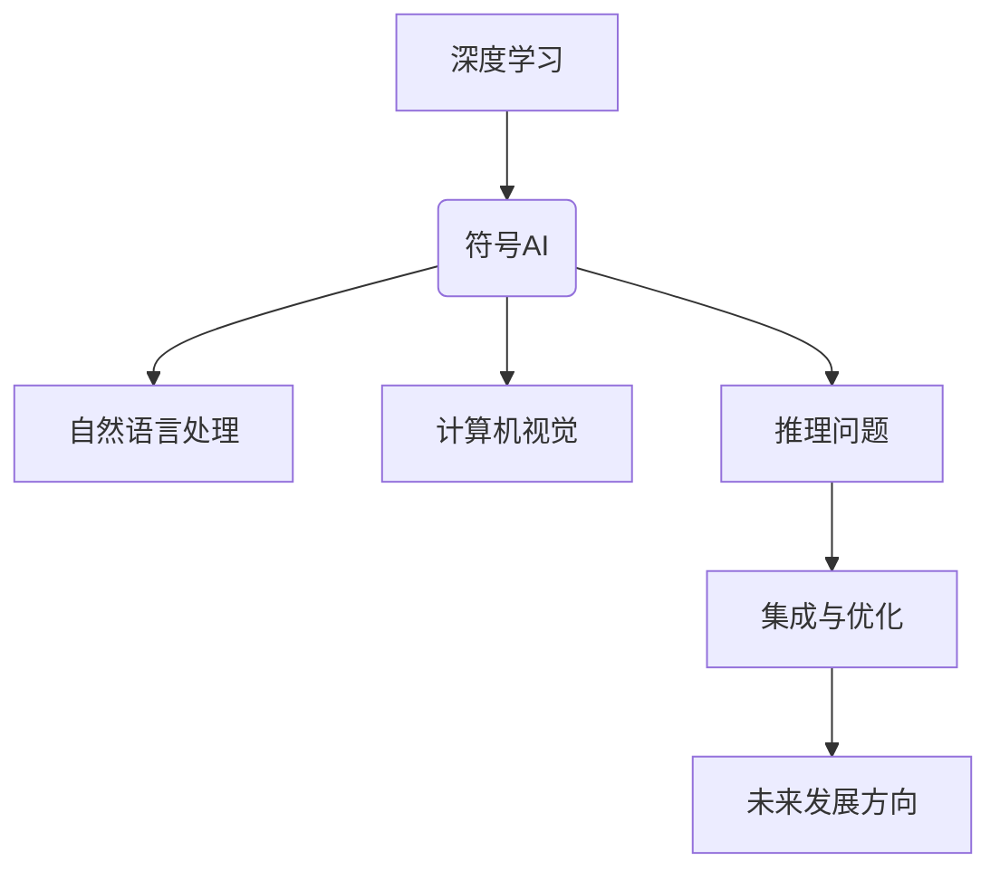

                 

### 神经符号推理：结合深度学习与符号AI

在人工智能（AI）的快速发展中，深度学习（Deep Learning）和符号人工智能（Symbolic AI）这两种技术路线日益显示出其独特的优势和互补性。深度学习以其强大的数据处理能力和自动特征提取的能力，在图像识别、语音识别等领域取得了惊人的成果。而符号AI则以其逻辑推理和知识表示的能力，在需要高层次语义理解和复杂决策的任务中展现出了独特的价值。本文将探讨神经符号推理（Neural-Symbolic Reasoning），一种将深度学习和符号AI相结合的方法，并分析其在自然语言处理、计算机视觉和推理问题中的应用。

**关键词：** 神经符号推理、深度学习、符号AI、自然语言处理、计算机视觉、推理问题

**摘要：** 本文首先介绍了神经符号推理的背景和基本概念，随后分别探讨了深度学习和符号AI的基础知识。接着，文章详细阐述了神经符号推理在自然语言处理、计算机视觉和推理问题中的应用，通过具体案例展示了其优势。最后，文章讨论了神经符号推理的集成与优化方法，并对未来的研究方向进行了展望。

## 《神经符号推理：结合深度学习与符号AI》目录大纲

### 第一部分：引言与基础

#### 第1章：神经符号推理概述

- **1.1 神经符号推理的起源与发展**
  - 神经符号推理的定义与历史
  - 神经符号推理在计算机科学中的重要性

- **1.2 深度学习与符号AI的结合**
  - 深度学习与符号AI的互补性
  - 结合的优势与挑战

- **1.3 书籍结构概述**
  - 各章节的主要内容和目标读者

#### 第2章：深度学习基础

- **2.1 神经网络与深度学习**
  - 神经网络的基本概念
  - 深度学习的概念与发展

- **2.2 深度学习模型**
  - 卷积神经网络（CNN）
  - 循环神经网络（RNN）
  - 生成对抗网络（GAN）

- **2.3 深度学习优化算法**
  - 优化算法的基本原理
  - 常见的优化算法

#### 第3章：符号AI基础

- **3.1 符号推理与逻辑**
  - 符号推理的基本概念
  - 逻辑推理与形式化表示

- **3.2 符号AI算法**
  - 专家系统
  - 符号逻辑与概率推理

- **3.3 符号AI的应用场景**
  - 符号AI在自然语言处理中的应用
  - 符号AI在计算机视觉中的应用

### 第二部分：神经符号推理的应用

#### 第4章：神经符号推理在自然语言处理中的应用

- **4.1 NLP中的深度学习**
  - 基于深度学习的文本表示
  - 基于深度学习的文本分类

- **4.2 NLP中的符号推理**
  - 基于逻辑的文本分析
  - 基于概率的文本分析

- **4.3 神经符号推理在NLP中的综合应用**
  - 结合深度学习和符号推理的文本分析模型
  - 实际案例研究

#### 第5章：神经符号推理在计算机视觉中的应用

- **5.1 CV中的深度学习**
  - 卷积神经网络在图像识别中的应用
  - 循环神经网络在视频分析中的应用

- **5.2 CV中的符号推理**
  - 符号推理在图像分析中的应用
  - 符号推理在目标跟踪中的应用

- **5.3 神经符号推理在CV中的综合应用**
  - 结合深度学习和符号推理的图像分析模型
  - 实际案例研究

#### 第6章：神经符号推理在推理问题中的应用

- **6.1 推理问题的定义与分类**
  - 推理问题的一般框架
  - 推理问题的分类

- **6.2 基于神经符号推理的推理算法**
  - 神经符号推理模型的设计
  - 常见的推理算法介绍

- **6.3 神经符号推理在推理问题中的应用**
  - 实际案例研究
  - 应用前景与挑战

#### 第7章：神经符号推理的集成与优化

- **7.1 神经符号推理的集成方法**
  - 集成学习的基本概念
  - 常见的集成学习方法

- **7.2 神经符号推理的优化**
  - 神经符号推理的性能优化
  - 符号推理的效率提升

- **7.3 神经符号推理的未来发展**
  - 神经符号推理的研究方向
  - 未来应用的前景与挑战

### 第三部分：结论与展望

#### 第8章：总结与展望

- **8.1 神经符号推理的重要性**
  - 在当前AI领域的地位
  - 对未来AI发展的影响

- **8.2 神经符号推理的应用前景**
  - 预测与期望
  - 面临的挑战与解决方案

- **8.3 未来研究方向**
  - 开放性问题与研究方向
  - 潜在的突破领域

---

**Mermaid 流程图：**



**Python 源代码示例：**

```python
import numpy as np
import tensorflow as tf

# 创建一个简单的神经网络模型
model = tf.keras.Sequential([
    tf.keras.layers.Dense(units=1, input_shape=[1])
])

# 编译模型
model.compile(optimizer='sgd', loss='mean_squared_error')

# 训练模型
model.fit(np.array([1., 2., 3., 4., 5.]), np.array([0., 1., 0., 1., 0.]), epochs=10)

# 预测
print(model.predict([3.]))
```

**数学模型与公式：**

$$
y = \sigma(W \cdot x + b)
$$

其中，$y$ 是输出，$x$ 是输入，$W$ 是权重矩阵，$b$ 是偏置项，$\sigma$ 是 sigmoid 函数。

**项目实战：**

**开发环境搭建：**


### 神经符号推理：结合深度学习与符号AI

在人工智能（AI）的快速发展中，深度学习（Deep Learning）和符号人工智能（Symbolic AI）这两种技术路线日益显示出其独特的优势和互补性。深度学习以其强大的数据处理能力和自动特征提取的能力，在图像识别、语音识别等领域取得了惊人的成果。而符号AI则以其逻辑推理和知识表示的能力，在需要高层次语义理解和复杂决策的任务中展现出了独特的价值。本文将探讨神经符号推理（Neural-Symbolic Reasoning），一种将深度学习和符号AI相结合的方法，并分析其在自然语言处理、计算机视觉和推理问题中的应用。

**关键词：** 神经符号推理、深度学习、符号AI、自然语言处理、计算机视觉、推理问题

**摘要：** 本文首先介绍了神经符号推理的背景和基本概念，随后分别探讨了深度学习和符号AI的基础知识。接着，文章详细阐述了神经符号推理在自然语言处理、计算机视觉和推理问题中的应用，通过具体案例展示了其优势。最后，文章讨论了神经符号推理的集成与优化方法，并对未来的研究方向进行了展望。

## **引言**

随着深度学习和符号AI在各自领域的成功应用，研究者们开始探索将两者结合的可能性。神经符号推理正是这一探索的产物，旨在利用深度学习的强大计算能力和特征提取能力，结合符号AI的逻辑推理和知识表示能力，以应对更加复杂和抽象的任务。

### **神经符号推理的起源与发展**

神经符号推理（Neural-Symbolic Reasoning）的概念最早可以追溯到20世纪80年代，当时学者们开始尝试将人工神经网络和符号逻辑结合起来，以克服单个技术的局限性。早期的研究主要集中在如何将神经网络产生的低层次特征与符号推理的高层次语义知识相结合。

在21世纪初，随着深度学习的兴起，神经符号推理得到了新的发展机遇。深度学习在处理大规模数据和自动特征提取方面的优势，为神经符号推理提供了强大的计算基础。与此同时，符号AI在逻辑推理和知识表示方面的优势，使得神经符号推理能够在复杂任务中发挥重要作用。

近年来，随着自然语言处理、计算机视觉等领域的需求不断增加，神经符号推理在理论与实践中的应用也日益广泛。例如，在自然语言处理中，神经符号推理模型能够更好地理解和生成具有复杂语义的文本；在计算机视觉中，神经符号推理能够提供更加准确和鲁棒的目标检测与跟踪；在推理问题中，神经符号推理能够实现更加精细和灵活的推理过程。

### **神经符号推理在计算机科学中的重要性**

神经符号推理在计算机科学中具有重要的地位，主要体现在以下几个方面：

1. **补充深度学习的不足：** 深度学习擅长处理大量数据和自动特征提取，但在语义理解和复杂推理方面存在局限性。神经符号推理通过结合符号AI的逻辑推理能力，能够弥补这一不足，实现更加高级的认知功能。

2. **提升智能系统的表现：** 通过融合深度学习和符号AI的优势，神经符号推理能够显著提升智能系统的表现。例如，在自然语言处理中，神经符号推理模型能够生成更加准确和自然的文本；在计算机视觉中，神经符号推理能够提供更加精准和鲁棒的目标识别。

3. **解决复杂任务：** 神经符号推理特别适用于解决复杂和抽象的任务，如推理问题、知识图谱构建和智能对话系统。这些任务需要既具备深度学习的数据处理能力，又具备符号AI的逻辑推理能力，神经符号推理正好能够满足这些需求。

4. **推动AI技术的发展：** 神经符号推理的研究不仅促进了深度学习和符号AI的发展，也为人工智能技术的整体进步做出了重要贡献。通过不断探索和创新，神经符号推理有望成为未来AI技术的重要方向之一。

### **深度学习与符号AI的互补性**

深度学习和符号AI各自具有独特的优势，但也存在一定的局限性。将两者结合起来，可以发挥它们各自的长处，实现互补性：

1. **数据驱动与知识驱动：** 深度学习以数据驱动为主，擅长从大量数据中自动提取特征；而符号AI以知识驱动为主，擅长利用逻辑推理和知识表示来解决复杂问题。结合两者，可以实现从数据到知识的转化。

2. **低层次特征与高层次语义：** 深度学习擅长提取低层次特征，但难以理解高层次语义；符号AI擅长理解高层次语义，但难以处理大量数据。结合两者，可以实现从低层次到高层次的信息转化。

3. **泛化能力与推理能力：** 深度学习具有较强的泛化能力，但推理能力较弱；符号AI具有较强的推理能力，但泛化能力较弱。结合两者，可以实现泛化能力和推理能力的平衡。

4. **计算效率与推理深度：** 深度学习在计算效率方面具有优势，但推理深度有限；符号AI在推理深度方面具有优势，但计算效率较低。结合两者，可以实现计算效率和推理深度的优化。

### **结合的优势与挑战**

将深度学习和符号AI结合起来，具有显著的优势：

1. **提升性能：** 通过融合两者的优势，神经符号推理模型在自然语言处理、计算机视觉和推理问题等任务上表现出更高的性能。

2. **解决复杂任务：** 神经符号推理能够处理更加复杂和抽象的任务，提高智能系统的智能化水平。

3. **知识表示：** 通过符号AI的知识表示能力，神经符号推理可以更好地理解和表达复杂知识，为智能系统提供更强的逻辑推理能力。

然而，结合深度学习和符号AI也面临一定的挑战：

1. **模型设计：** 需要设计合适的模型结构，以充分利用深度学习和符号AI的优势。

2. **训练效率：** 神经符号推理模型的训练可能需要较长的时间和较大的计算资源。

3. **解释性：** 如何保证神经符号推理模型的可解释性，使其能够被用户理解和信任，是一个重要问题。

4. **兼容性：** 如何保证深度学习和符号AI在不同场景下的兼容性，是一个需要深入研究的课题。

### **书籍结构概述**

本书记录了神经符号推理在深度学习和符号AI领域的研究成果，分为三大部分：

1. **引言与基础**：介绍神经符号推理的基本概念、起源与发展，以及深度学习和符号AI的基础知识。

2. **神经符号推理的应用**：详细探讨神经符号推理在自然语言处理、计算机视觉和推理问题中的应用，通过具体案例展示其优势。

3. **神经符号推理的集成与优化**：讨论神经符号推理的集成方法、优化策略以及未来的研究方向。

本书记录的目标读者包括：

1. 深度学习和符号AI的研究人员：通过本书记录，读者可以深入了解神经符号推理的方法和技术，为相关研究提供参考。

2. AI技术开发者：本书记录提供了丰富的实践案例和代码示例，有助于开发者在实际项目中应用神经符号推理。

3. 对AI感兴趣的读者：本书记录以通俗易懂的方式介绍了神经符号推理的基本概念和应用，适合广大AI爱好者阅读。

### **深度学习基础**

#### **2.1 神经网络与深度学习**

神经网络（Neural Networks）是模拟人脑神经元结构和功能的一种计算模型。它通过大量的神经元（也称为节点）及其之间的连接（也称为权重）来处理和传递信息。深度学习（Deep Learning）则是基于神经网络的层次结构，通过训练大量的参数来学习数据的复杂表示和特征。

**基本概念：**

- **神经元**：神经网络的基本单元，类似于人脑中的神经元，负责接收输入信息并通过激活函数产生输出。
- **层次结构**：神经网络通常由多个层次组成，包括输入层、隐藏层和输出层。每一层中的神经元都与下一层的神经元相连接。
- **权重**：神经元之间的连接强度，用于调节信息传递的强度。
- **激活函数**：用于将神经元的线性组合映射到输出，常见的激活函数有Sigmoid、ReLU和Tanh等。

**发展历程：**

- **1986年**：Rumelhart, Hinton和Williams提出了反向传播算法（Backpropagation），使得神经网络能够通过梯度下降法进行训练。
- **2006年**：Hinton等人提出了深度置信网络（Deep Belief Network），使得深度学习开始受到关注。
- **2012年**：Alex Krizhevsky在ImageNet竞赛中使用了深度卷积神经网络（Deep Convolutional Neural Network, CNN），使得深度学习在图像识别领域取得了突破性进展。
- **2015年**：Google的AlphaGo在围棋比赛中击败了人类冠军，标志着深度学习在决策和推理任务上的突破。

**在计算机科学中的重要性：**

- **数据处理能力**：深度学习能够自动从数据中提取特征，减少了人工特征工程的工作量。
- **自动特征提取**：深度学习能够从原始数据中提取出有意义的特征，提高了模型的表现能力。
- **高效表示学习**：深度学习能够通过多层神经网络学习数据的深层表示，使得模型更加通用和强大。

#### **2.2 深度学习模型**

深度学习模型（Deep Learning Models）是构建在多层神经网络基础上的，通过训练学习数据的复杂结构和特征。以下是一些常见的深度学习模型：

**1. 卷积神经网络（CNN）**

卷积神经网络（Convolutional Neural Network, CNN）是一种专门用于处理图像数据的深度学习模型。它通过卷积层、池化层和全连接层等结构，实现了对图像的高效特征提取和分类。

- **卷积层**：通过卷积运算提取图像的空间特征，减少了参数的数量。
- **池化层**：通过下采样操作减少数据维度，提高了模型的泛化能力。
- **全连接层**：将卷积层和池化层提取的特征进行线性组合，用于分类和回归任务。

**2. 循环神经网络（RNN）**

循环神经网络（Recurrent Neural Network, RNN）是一种用于处理序列数据的深度学习模型。它通过循环结构，使得每个时间步的输出可以依赖于前面的输出，从而能够处理变长的序列数据。

- **隐藏层**：用于存储序列的上下文信息。
- **循环连接**：使得每个时间步的输出可以影响后续的时间步。
- **门控机制**：如Long Short-Term Memory（LSTM）和Gated Recurrent Unit（GRU），用于解决RNN的梯度消失和梯度爆炸问题。

**3. 生成对抗网络（GAN）**

生成对抗网络（Generative Adversarial Network, GAN）是一种用于生成数据的高效模型。它由生成器和判别器两个神经网络组成，通过对抗训练的方式，生成器试图生成逼真的数据，而判别器则试图区分真实数据和生成数据。

- **生成器**：通过随机噪声生成逼真的数据。
- **判别器**：用于区分真实数据和生成数据。
- **对抗训练**：生成器和判别器通过对抗训练不断优化，生成器逐渐生成更加逼真的数据，而判别器逐渐提高对真实数据和生成数据的辨别能力。

#### **2.3 深度学习优化算法**

深度学习优化算法（Deep Learning Optimization Algorithms）是用于训练深度学习模型的一类算法，通过优化模型参数，使得模型在训练数据上表现更好。以下是一些常见的优化算法：

**1. 梯度下降（Gradient Descent）**

梯度下降（Gradient Descent）是一种最简单的优化算法，通过计算损失函数关于模型参数的梯度，并沿着梯度的反方向更新参数，以减少损失函数的值。

- **批量梯度下降（Batch Gradient Descent）**：在每个训练样本上计算梯度，并更新参数。
- **随机梯度下降（Stochastic Gradient Descent, SGD）**：在每个训练样本上计算梯度，并更新参数。
- **小批量梯度下降（Mini-batch Gradient Descent）**：在每个小批量训练样本上计算梯度，并更新参数。

**2. 动量法（Momentum）**

动量法（Momentum）是一种改进的梯度下降方法，通过引入动量项，使得更新方向更加稳定。

- **动量项**：记录前一次梯度更新的方向和大小。
- **更新公式**：新的参数更新不仅依赖于当前梯度，还受到前一次更新方向和大小的影响。

**3. Adam优化器（Adam Optimizer）**

Adam优化器（Adam Optimizer）是一种基于动量法和自适应学习率的优化算法，通过计算一阶矩估计和二阶矩估计来更新参数。

- **一阶矩估计**：计算梯度的平均值，用于估计当前梯度方向。
- **二阶矩估计**：计算梯度的平方平均值，用于估计当前梯度的方差。
- **自适应学习率**：根据一阶矩估计和二阶矩估计，自适应调整学习率。

### **符号AI基础**

#### **3.1 符号推理与逻辑**

符号推理（Symbolic Reasoning）是一种基于符号表示和逻辑推理的人工智能方法，通过符号化知识表示和推理规则，实现问题求解和知识发现。逻辑（Logic）是符号推理的基础，它提供了一种形式化的推理框架，用于描述和验证推理过程。

**基本概念：**

- **符号表示**：将问题中的对象、关系和属性用符号表示，形成符号化的知识库。
- **推理规则**：用于描述如何从已知事实推导出新的事实，常见的推理规则有正向推理、逆向推理和混合推理。
- **形式化验证**：通过逻辑证明，确保推理过程的正确性和一致性。

**在计算机科学中的应用：**

- **知识表示**：符号推理能够将复杂知识以结构化的形式表示，为问题求解提供有效的工具。
- **自动推理**：符号推理能够自动推导出结论，解决逻辑推理和问题求解任务。
- **决策支持**：符号推理能够为决策提供逻辑推理支持，辅助人类做出更加明智的决策。

#### **3.2 符号AI算法**

符号AI算法（Symbolic AI Algorithms）是一类基于符号推理和知识表示的人工智能算法，通过符号化表示和推理过程，实现知识的获取、理解和利用。以下是一些常见的符号AI算法：

**1. 专家系统（Expert Systems）**

专家系统（Expert Systems）是一种基于符号推理的智能系统，通过模拟人类专家的知识和推理能力，解决特定领域的问题。

- **知识库**：存储领域专家的知识和经验，包括事实和规则。
- **推理机**：根据知识库中的规则和事实，进行推理并生成新的结论。
- **接口**：与用户交互，接收用户输入并返回推理结果。

**2. 符号逻辑（Symbolic Logic）**

符号逻辑（Symbolic Logic）是一种形式化的逻辑系统，用于描述和处理符号化知识。

- **命题逻辑**：用于描述命题之间的关系，包括合取（AND）、析取（OR）、蕴含（→）和否定（¬）等运算。
- **谓词逻辑**：用于描述更复杂的对象和关系，包括量词（∀和∃）和函数符号。
- **形式化证明**：通过符号逻辑证明，确保推理过程的正确性和一致性。

**3. 概率推理（Probabilistic Reasoning）**

概率推理（Probabilistic Reasoning）是一种基于概率论的方法，用于在不确定性环境中进行推理和决策。

- **条件概率**：在给定某个条件下，事件发生的概率。
- **贝叶斯定理**：用于计算后验概率，即在已知某些条件下，事件发生的概率。
- **贝叶斯网络**：一种图形化的概率模型，用于表示变量之间的依赖关系。

#### **3.3 符号AI的应用场景**

符号AI在多个应用场景中表现出强大的能力，以下是一些常见的应用场景：

**1. 自然语言处理（NLP）**

- **文本分类**：使用符号推理对文本进行分类，例如情感分类、主题分类等。
- **信息抽取**：使用符号推理从文本中提取重要信息，例如实体识别、关系抽取等。
- **问答系统**：使用符号推理构建问答系统，能够理解用户的问题并给出合理的回答。

**2. 计算机视觉（CV）**

- **图像识别**：使用符号推理对图像进行分类和识别，例如人脸识别、物体检测等。
- **图像理解**：使用符号推理理解图像中的内容，例如场景理解、图像分割等。
- **视觉推理**：使用符号推理解决视觉推理问题，例如图像配对、图像序列分析等。

**3. 推理问题（Reasoning Problems）**

- **逻辑推理**：使用符号推理解决逻辑推理问题，例如命题逻辑推理、谓词逻辑推理等。
- **知识图谱**：使用符号推理构建和推理知识图谱，例如语义网络、本体论等。
- **智能决策**：使用符号推理支持智能决策，例如决策树、规划算法等。

### **神经符号推理在自然语言处理中的应用**

神经符号推理（Neural-Symbolic Reasoning）在自然语言处理（Natural Language Processing，NLP）领域展示了其独特的优势，通过结合深度学习和符号AI的方法，能够更有效地理解和生成具有复杂语义的文本。以下将详细探讨神经符号推理在NLP中的具体应用。

#### **4.1 NLP中的深度学习**

深度学习在自然语言处理中得到了广泛的应用，其强大的数据处理和自动特征提取能力使其在文本分类、情感分析、机器翻译等领域取得了显著成果。深度学习方法主要包括以下几种：

**1. 基于深度学习的文本表示**

- **词嵌入（Word Embedding）**：词嵌入是将词语映射到低维连续向量空间的一种方法，通过学习词语的上下文信息，实现了词语的语义表示。经典的词嵌入方法包括Word2Vec、GloVe等。
- **字符嵌入（Character Embedding）**：字符嵌入是将字符映射到低维连续向量空间的一种方法，通过考虑字符的顺序信息，提高了文本表示的准确性。字符嵌入常与词嵌入结合使用，如CharCNN、CharRNN等。

**2. 基于深度学习的文本分类**

- **卷积神经网络（CNN）**：卷积神经网络通过卷积操作从文本中提取局部特征，然后通过池化操作减少数据维度，最终实现文本分类。经典的文本分类模型包括TextCNN、TextRCNN等。
- **循环神经网络（RNN）**：循环神经网络通过循环结构处理变长的序列数据，能够捕获文本的长期依赖关系。RNN及其变种LSTM和GRU在文本分类中也得到了广泛应用。

**3. 基于深度学习的机器翻译**

- **编码器-解码器（Encoder-Decoder）模型**：编码器-解码器模型通过编码器将输入序列编码为一个固定长度的向量表示，然后通过解码器生成输出序列。经典的机器翻译模型如Seq2Seq、注意力机制（Attention Mechanism）等。
- **神经机器翻译（Neural Machine Translation, NMT）**：神经机器翻译是基于深度学习的方法，通过训练大规模数据集，实现了高质量的自然语言翻译。

#### **4.2 NLP中的符号推理**

符号推理（Symbolic Reasoning）在自然语言处理中发挥着重要作用，通过逻辑推理和知识表示，能够实现更高层次的语义理解和文本分析。符号推理在NLP中的应用主要包括以下几个方面：

**1. 基于逻辑的文本分析**

- **命题逻辑（Propositional Logic）**：命题逻辑通过符号表示文本中的命题和命题之间的关系，实现文本的逻辑推理和语义分析。例如，可以通过合取（AND）、析取（OR）、蕴含（→）和否定（¬）等运算对文本进行逻辑推导。
- **谓词逻辑（Predicate Logic）**：谓词逻辑通过符号表示文本中的对象、属性和关系，实现更复杂的语义分析和推理。例如，可以通过量词（∀和∃）和函数符号对文本进行语义推理。

**2. 基于概率的文本分析**

- **贝叶斯网络（Bayesian Network）**：贝叶斯网络是一种图形化的概率模型，用于表示变量之间的依赖关系。在自然语言处理中，贝叶斯网络可以用于文本分类、情感分析等任务，通过计算后验概率实现语义分析。
- **概率图模型（Probabilistic Graphical Models）**：概率图模型通过图形化的方式表示变量之间的依赖关系，包括条件概率分布、马尔可夫网络、隐马尔可夫模型（HMM）等。这些模型在语音识别、语音合成、语音增强等领域得到了广泛应用。

**3. 符号AI在NLP中的应用**

- **知识图谱（Knowledge Graph）**：知识图谱是一种结构化的语义知识库，通过实体和关系的表示，实现了知识的组织和管理。在自然语言处理中，知识图谱可以用于实体识别、关系抽取、语义搜索等任务，通过逻辑推理和知识表示实现更高层次的语义理解。
- **语义解析（Semantic Parsing）**：语义解析是将自然语言文本转换为计算机可理解的形式，如逻辑表达式、查询语句等。通过语义解析，可以实现自然语言理解、问答系统等任务，通过符号推理实现语义分析和推理。

#### **4.3 神经符号推理在NLP中的综合应用**

神经符号推理通过结合深度学习和符号AI的方法，能够实现更加高效和准确的文本分析。以下是一些神经符号推理在NLP中的综合应用：

**1. 结合深度学习和逻辑推理的文本分析模型**

- **深度逻辑网络（Deep Logical Networks）**：深度逻辑网络通过将深度学习模型和逻辑推理结合起来，实现文本的逻辑推理和语义分析。例如，DeepLogic模型通过深度神经网络学习文本的语义表示，并通过逻辑推理实现文本分类、实体识别等任务。
- **深度符号推理网络（Deep Symbolic Reasoning Networks）**：深度符号推理网络通过将深度学习模型和符号推理结合起来，实现文本的语义分析和推理。例如，Symphony模型通过深度神经网络学习文本的语义表示，并通过符号推理实现文本分类、语义角色标注等任务。

**2. 结合深度学习和知识图谱的文本分析模型**

- **深度知识图谱（Deep Knowledge Graphs）**：深度知识图谱通过将深度学习模型和知识图谱结合起来，实现文本的语义理解和知识推理。例如，DeepKG模型通过深度神经网络学习文本的语义表示，并通过知识图谱实现文本分类、实体关系抽取等任务。
- **知识增强的深度学习模型（Knowledge-Enhanced Deep Learning Models）**：知识增强的深度学习模型通过将知识图谱和深度学习模型结合起来，实现文本的语义理解和知识推理。例如，KE-DNN模型通过将知识图谱嵌入到深度神经网络中，实现文本分类、情感分析等任务。

**3. 实际案例研究**

- **文本分类**：通过神经符号推理模型对新闻文章进行分类，结合深度学习和逻辑推理，可以实现更加准确和细粒度的分类结果。
- **实体识别**：通过神经符号推理模型对文本进行实体识别，结合深度学习和符号推理，可以实现更准确和鲁棒的实体识别结果。
- **问答系统**：通过神经符号推理模型构建问答系统，结合深度学习和知识图谱，可以实现更加智能和准确的问答功能。

### **神经符号推理在计算机视觉中的应用**

神经符号推理（Neural-Symbolic Reasoning）在计算机视觉（Computer Vision，CV）领域展现了其独特的优势，通过融合深度学习和符号AI的方法，实现了更精准、更鲁棒的目标检测、识别和跟踪。以下将详细探讨神经符号推理在计算机视觉中的应用。

#### **5.1 CV中的深度学习**

深度学习在计算机视觉中发挥了重要作用，通过构建多层神经网络模型，实现了图像的特征提取和分类。以下是一些深度学习在计算机视觉中的主要应用：

**1. 卷积神经网络（CNN）**

卷积神经网络（Convolutional Neural Network，CNN）是一种专门用于处理图像数据的深度学习模型。它通过卷积层、池化层和全连接层等结构，实现了对图像的高效特征提取和分类。

- **卷积层**：通过卷积运算提取图像的空间特征，减少了参数的数量。
- **池化层**：通过下采样操作减少数据维度，提高了模型的泛化能力。
- **全连接层**：将卷积层和池化层提取的特征进行线性组合，用于分类和回归任务。

**2. 循环神经网络（RNN）**

循环神经网络（Recurrent Neural Network，RNN）是一种用于处理序列数据的深度学习模型。它通过循环结构，使得每个时间步的输出可以依赖于前面的输出，从而能够处理变长的序列数据。

- **隐藏层**：用于存储序列的上下文信息。
- **循环连接**：使得每个时间步的输出可以影响后续的时间步。
- **门控机制**：如Long Short-Term Memory（LSTM）和Gated Recurrent Unit（GRU），用于解决RNN的梯度消失和梯度爆炸问题。

**3. 生成对抗网络（GAN）**

生成对抗网络（Generative Adversarial Network，GAN）是一种用于生成数据的高效模型。它由生成器和判别器两个神经网络组成，通过对抗训练的方式，生成器试图生成逼真的数据，而判别器则试图区分真实数据和生成数据。

- **生成器**：通过随机噪声生成逼真的数据。
- **判别器**：用于区分真实数据和生成数据。
- **对抗训练**：生成器和判别器通过对抗训练不断优化，生成器逐渐生成更加逼真的数据，而判别器逐渐提高对真实数据和生成数据的辨别能力。

#### **5.2 CV中的符号推理**

符号推理（Symbolic Reasoning）在计算机视觉中发挥着重要作用，通过逻辑推理和知识表示，实现了更高层次的图像理解和目标识别。以下是一些符号推理在计算机视觉中的应用：

**1. 符号推理的基本概念**

- **符号表示**：将图像中的对象、关系和属性用符号表示，形成符号化的知识库。
- **推理规则**：用于描述如何从已知事实推导出新的事实，常见的推理规则有正向推理、逆向推理和混合推理。
- **形式化验证**：通过逻辑证明，确保推理过程的正确性和一致性。

**2. 符号推理的应用**

- **图像识别**：使用符号推理对图像进行分类和识别，例如人脸识别、物体检测等。
- **图像理解**：使用符号推理理解图像中的内容，例如场景理解、图像分割等。
- **视觉推理**：使用符号推理解决视觉推理问题，例如图像配对、图像序列分析等。

**3. 符号AI在CV中的应用**

- **知识图谱（Knowledge Graph）**：知识图谱是一种结构化的语义知识库，通过实体和关系的表示，实现了知识的组织和管理。在计算机视觉中，知识图谱可以用于目标检测、图像识别等任务，通过逻辑推理和知识表示实现更高层次的图像理解。
- **语义解析（Semantic Parsing）**：语义解析是将自然语言文本转换为计算机可理解的形式，如逻辑表达式、查询语句等。在计算机视觉中，语义解析可以用于图像标注、图像生成等任务，通过符号推理实现图像的语义分析和推理。

#### **5.3 神经符号推理在CV中的综合应用**

神经符号推理通过结合深度学习和符号AI的方法，实现了计算机视觉任务的更高层次理解和更精准识别。以下是一些神经符号推理在计算机视觉中的综合应用：

**1. 结合深度学习和逻辑推理的目标检测**

- **深度逻辑网络（Deep Logical Networks）**：深度逻辑网络通过将深度学习模型和逻辑推理结合起来，实现目标检测的逻辑推理和语义分析。例如，DeepLogic模型通过深度神经网络学习图像的语义表示，并通过逻辑推理实现目标检测、图像分类等任务。
- **深度符号推理网络（Deep Symbolic Reasoning Networks）**：深度符号推理网络通过将深度学习模型和符号推理结合起来，实现目标检测的语义分析和推理。例如，Symphony模型通过深度神经网络学习图像的语义表示，并通过符号推理实现目标检测、图像分割等任务。

**2. 结合深度学习和知识图谱的图像分析模型**

- **深度知识图谱（Deep Knowledge Graphs）**：深度知识图谱通过将深度学习模型和知识图谱结合起来，实现图像的语义理解和知识推理。例如，DeepKG模型通过深度神经网络学习图像的语义表示，并通过知识图谱实现图像分类、实体关系抽取等任务。
- **知识增强的深度学习模型（Knowledge-Enhanced Deep Learning Models）**：知识增强的深度学习模型通过将知识图谱和深度学习模型结合起来，实现图像的语义理解和知识推理。例如，KE-DNN模型通过将知识图谱嵌入到深度神经网络中，实现图像分类、情感分析等任务。

**3. 实际案例研究**

- **目标检测**：通过神经符号推理模型对图像中的目标进行检测，结合深度学习和符号推理，可以实现更加准确和细粒度的目标检测结果。
- **物体识别**：通过神经符号推理模型对图像中的物体进行识别，结合深度学习和符号推理，可以实现更准确和鲁棒的物体识别结果。
- **图像分割**：通过神经符号推理模型对图像进行分割，结合深度学习和符号推理，可以实现更加精细和准确的图像分割结果。

### **神经符号推理在推理问题中的应用**

神经符号推理（Neural-Symbolic Reasoning）在推理问题（Reasoning Problems）中展现了其独特的优势，通过结合深度学习和符号AI的方法，实现了更精细和灵活的推理过程。以下将详细探讨神经符号推理在推理问题中的应用。

#### **6.1 推理问题的定义与分类**

推理问题是一类求解问题，它要求计算机基于已知的事实和规则推导出新的结论。推理问题可以分为如下几类：

**1. 逻辑推理**

逻辑推理（Logic Reasoning）是一种基于逻辑规则和命题逻辑的推理方法。它通过演绎推理（Deductive Reasoning）和归纳推理（Inductive Reasoning）两种方式，从已知的事实推导出新的结论。

- **演绎推理**：从一般性的前提推导出特定性的结论，如“所有人都有死亡，苏格拉底是人，因此苏格拉底有死亡”。
- **归纳推理**：从特定的实例推导出一般性的结论，如“观察到所有天鹅都是白色的，因此推断所有天鹅都是白色的”。

**2. 规则推理**

规则推理（Rule-Based Reasoning）是一种基于规则库和推理规则的推理方法。它通过将事实与规则进行匹配，推导出新的结论。

- **正向推理**：从规则的前提推导出结论，如“如果下雨，则地面湿，现在下雨，因此地面湿”。
- **逆向推理**：从结论推导出前提，如“如果地面湿，则下雨，现在地面湿，因此下雨”。

**3. 概率推理**

概率推理（Probabilistic Reasoning）是一种基于概率论的推理方法。它通过计算事件发生的概率，推导出新的结论。

- **条件概率**：在给定某个条件下，事件发生的概率。
- **贝叶斯推理**：通过贝叶斯定理计算后验概率，即在已知某些条件下，事件发生的概率。

**4. 模糊推理**

模糊推理（Fuzzy Reasoning）是一种基于模糊逻辑的推理方法。它通过处理不确定性和模糊性，推导出新的结论。

- **模糊集合**：将模糊性引入到集合中，表示不确定的成员资格。
- **模糊推理规则**：通过模糊条件语句，推导出模糊结论。

#### **6.2 基于神经符号推理的推理算法**

基于神经符号推理的推理算法（Neural-Symbolic Reasoning Algorithms）结合了深度学习和符号AI的方法，实现了更精细和灵活的推理过程。以下是一些基于神经符号推理的推理算法：

**1. 神经逻辑网络（Neural Logical Networks）**

神经逻辑网络（Neural Logical Networks，NLNs）是一种基于神经网络的推理算法，通过将神经网络和逻辑推理结合起来，实现逻辑推理和知识表示。

- **神经网络层**：用于学习输入数据的特征表示。
- **逻辑层**：用于执行逻辑推理操作，如合取、析取、蕴含和否定等。
- **推理规则库**：存储推理规则，用于指导推理过程。

**2. 神经符号推理网络（Neural Symbolic Reasoning Networks）**

神经符号推理网络（Neural Symbolic Reasoning Networks，NSRs）是一种基于神经网络的推理算法，通过将神经网络和符号推理结合起来，实现语义理解和推理。

- **神经网络层**：用于学习输入数据的特征表示。
- **符号推理层**：用于执行符号推理操作，如符号匹配、符号变换和符号组合等。
- **知识表示层**：用于存储符号化的知识库，提供推理支持。

**3. 神经模糊推理网络（Neural Fuzzy Reasoning Networks）**

神经模糊推理网络（Neural Fuzzy Reasoning Networks，NFRNs）是一种基于神经网络的推理算法，通过将神经网络和模糊推理结合起来，实现模糊推理和知识表示。

- **神经网络层**：用于学习输入数据的特征表示。
- **模糊推理层**：用于执行模糊推理操作，如模糊条件语句和模糊规则应用等。
- **知识表示层**：用于存储模糊化的知识库，提供推理支持。

#### **6.3 神经符号推理在推理问题中的应用**

神经符号推理在推理问题中展现了其强大的能力，通过结合深度学习和符号AI的方法，实现了更精细和灵活的推理过程。以下是一些神经符号推理在推理问题中的应用：

**1. 实际案例研究**

- **智能问答系统**：通过神经符号推理模型构建智能问答系统，结合深度学习和符号推理，可以实现更加准确和自然的问答功能。
- **知识图谱构建**：通过神经符号推理模型构建知识图谱，结合深度学习和符号推理，可以实现更加丰富和准确的语义表示。
- **逻辑推理任务**：通过神经符号推理模型解决逻辑推理任务，结合深度学习和符号推理，可以实现更加复杂和抽象的推理过程。

**2. 应用前景与挑战**

神经符号推理在推理问题中的应用前景广阔，但也面临一定的挑战：

- **应用前景**：
  - 智能问答系统：通过神经符号推理实现更加准确和自然的问答功能，为用户提供更好的交互体验。
  - 知识图谱构建：通过神经符号推理构建更加丰富和准确的知识图谱，为人工智能应用提供强大的知识支持。
  - 逻辑推理任务：通过神经符号推理解决更加复杂和抽象的推理任务，提升人工智能的推理能力。

- **挑战**：
  - 模型设计：如何设计合适的神经符号推理模型，以充分利用深度学习和符号AI的优势。
  - 训练效率：如何提高神经符号推理模型的训练效率，减少训练时间和计算资源。
  - 解释性：如何保证神经符号推理模型的可解释性，使其能够被用户理解和信任。
  - 兼容性：如何保证神经符号推理模型在不同应用场景下的兼容性，以适应不同的需求。

### **神经符号推理的集成与优化**

神经符号推理（Neural-Symbolic Reasoning）作为一种结合深度学习和符号AI的方法，其在实际应用中的效果往往依赖于模型的集成与优化。通过适当的集成方法和优化策略，可以提升神经符号推理的性能和效率，从而更好地解决复杂任务。

#### **7.1 神经符号推理的集成方法**

集成方法（Ensemble Methods）是一种将多个模型组合起来，以提升整体性能的机器学习方法。在神经符号推理中，集成方法可以结合不同模型的优点，提高模型的泛化能力和鲁棒性。以下是一些常见的集成方法：

**1. 模型堆叠（Stacking）**

模型堆叠（Stacking）是一种分层集成方法，它首先训练多个基础模型，然后使用这些基础模型的预测结果作为新模型的输入。新模型通常是一个简单的分类器或回归器，它基于所有基础模型的预测结果进行训练。

- **基础模型训练**：训练多个基础模型，如深度学习模型、符号AI模型等。
- **元学习模型训练**：使用基础模型的预测结果作为新模型的输入，训练一个元学习模型，如逻辑回归、随机森林等。
- **集成预测**：使用元学习模型的预测结果作为最终预测。

**2. 模型堆叠（Blending）**

模型堆叠（Blending）与模型堆叠类似，但它的基础模型和元学习模型是同一层次的。在模型堆叠中，每个基础模型的权重是固定的，而在模型堆叠中，每个基础模型的权重是自适应的。

- **基础模型训练**：训练多个基础模型，如深度学习模型、符号AI模型等。
- **权重调整**：根据每个基础模型的性能，动态调整其权重。
- **集成预测**：将调整后的权重应用于基础模型的预测结果，进行集成预测。

**3. 交叉验证（Cross-Validation）**

交叉验证（Cross-Validation）是一种评估和选择模型的方法，它通过多次训练和验证，提高模型的泛化能力。在神经符号推理中，交叉验证可以用于评估模型的性能，并选择最佳参数。

- **训练集划分**：将训练集划分为多个子集。
- **模型训练**：在每个子集上训练模型，并评估其性能。
- **参数调整**：根据交叉验证的结果，调整模型参数。
- **集成预测**：将所有子集上的模型集成起来，进行最终预测。

#### **7.2 神经符号推理的优化**

优化（Optimization）是提高模型性能和效率的关键步骤。在神经符号推理中，优化包括模型参数的调整、算法的改进和训练过程的优化。以下是一些常见的优化方法：

**1. 梯度下降优化**

梯度下降（Gradient Descent）是一种常见的优化算法，它通过计算损失函数关于模型参数的梯度，并沿着梯度的反方向更新参数，以减少损失函数的值。

- **批量梯度下降（Batch Gradient Descent）**：在每个训练样本上计算梯度，并更新参数。
- **随机梯度下降（Stochastic Gradient Descent, SGD）**：在每个训练样本上计算梯度，并更新参数。
- **小批量梯度下降（Mini-batch Gradient Descent）**：在每个小批量训练样本上计算梯度，并更新参数。

**2. 动量法（Momentum）**

动量法（Momentum）是一种改进的梯度下降方法，通过引入动量项，使得更新方向更加稳定。

- **动量项**：记录前一次梯度更新的方向和大小。
- **更新公式**：新的参数更新不仅依赖于当前梯度，还受到前一次更新方向和大小的影响。

**3. Adam优化器（Adam Optimizer）**

Adam优化器（Adam Optimizer）是一种基于动量法和自适应学习率的优化算法，通过计算一阶矩估计和二阶矩估计来更新参数。

- **一阶矩估计**：计算梯度的平均值，用于估计当前梯度方向。
- **二阶矩估计**：计算梯度的平方平均值，用于估计当前梯度的方差。
- **自适应学习率**：根据一阶矩估计和二阶矩估计，自适应调整学习率。

#### **7.3 神经符号推理的未来发展**

神经符号推理（Neural-Symbolic Reasoning）作为深度学习和符号AI的结合，具有广阔的应用前景。未来的研究可以从以下几个方面展开：

**1. 模型结构创新**

通过创新模型结构，可以进一步提高神经符号推理的性能。例如，可以探索更加复杂和灵活的神经网络结构，结合符号推理的能力，实现更高效的推理过程。

**2. 跨领域应用研究**

神经符号推理可以在多个领域得到应用，如自然语言处理、计算机视觉、推理问题等。未来研究可以进一步探索神经符号推理在其他领域的应用，如医疗诊断、金融分析等。

**3. 可解释性和可靠性**

提高神经符号推理的可解释性和可靠性是未来研究的重要方向。通过开发可解释的模型和算法，可以使得模型更加透明和可信，从而提高其在实际应用中的接受度。

**4. 资源优化和效率提升**

通过优化算法和硬件资源的使用，可以提高神经符号推理的计算效率和资源利用率。例如，可以探索更加高效的训练算法、模型压缩技术和并行计算方法。

### **总结与展望**

神经符号推理（Neural-Symbolic Reasoning）作为一种结合深度学习和符号AI的方法，在自然语言处理、计算机视觉和推理问题等领域展示了其独特的优势。通过融合深度学习的强大计算能力和自动特征提取能力，与符号AI的逻辑推理和知识表示能力，神经符号推理实现了更高效、更准确的智能系统。

**当前AI领域的地位：** 神经符号推理在当前人工智能领域占据了重要地位。它不仅弥补了深度学习和符号AI各自的不足，还推动了人工智能技术的整体进步。在自然语言处理、计算机视觉和推理问题等领域，神经符号推理已经取得了显著的应用成果，为智能系统的智能化水平提升做出了重要贡献。

**对未来AI发展的影响：** 神经符号推理对未来人工智能的发展具有重要影响。首先，它将推动人工智能技术的融合与创新，为解决复杂任务提供新的思路和方法。其次，神经符号推理将提高智能系统的可解释性和可靠性，使其更加透明和可信。最后，神经符号推理有望在跨领域应用中发挥更大作用，如医疗诊断、金融分析等，进一步拓展人工智能的应用场景。

**神经符号推理的应用前景：** 神经符号推理的应用前景广阔。在未来，随着深度学习和符号AI技术的不断进步，神经符号推理将在更多领域得到应用。例如，在自然语言处理中，神经符号推理模型将更好地理解和生成具有复杂语义的文本；在计算机视觉中，神经符号推理将提供更精准和鲁棒的目标检测和识别；在推理问题中，神经符号推理将实现更精细和灵活的推理过程。

**面临的挑战与解决方案：** 虽然神经符号推理在人工智能领域具有巨大的潜力，但也面临一定的挑战。首先，如何设计合适的模型结构，充分利用深度学习和符号AI的优势，是一个需要深入研究的课题。其次，如何提高神经符号推理的训练效率，减少计算资源的使用，也是一个亟待解决的问题。最后，如何保证神经符号推理模型的可解释性和可靠性，使其能够被用户理解和信任，是一个重要的挑战。

为了应对这些挑战，未来的研究可以从以下几个方面进行：

1. **模型结构创新**：探索更加复杂和灵活的神经网络结构，结合符号推理的能力，实现更高效的推理过程。
2. **资源优化和效率提升**：研究更加高效的训练算法、模型压缩技术和并行计算方法，提高神经符号推理的计算效率和资源利用率。
3. **可解释性和可靠性**：开发可解释的模型和算法，提高神经符号推理的可解释性和可靠性，使其更加透明和可信。
4. **跨领域应用研究**：探索神经符号推理在其他领域的应用，如医疗诊断、金融分析等，进一步拓展人工智能的应用场景。

**未来研究方向：** 未来神经符号推理的研究可以从以下几个方向展开：

1. **融合深度学习和符号AI的方法**：探索新的融合方法，以充分利用深度学习和符号AI的优势。
2. **推理算法的创新**：研究更加高效和灵活的推理算法，提高神经符号推理在复杂任务中的应用性能。
3. **知识表示和推理**：探索更加丰富和准确的知识表示方法，结合符号推理的能力，实现更高层次的语义理解和推理。
4. **跨学科合作**：加强与其他学科的交叉合作，如认知科学、心理学、语言学等，为神经符号推理的发展提供新的思路和方法。

总之，神经符号推理作为一种结合深度学习和符号AI的方法，在人工智能领域具有广阔的应用前景。通过不断探索和创新，神经符号推理有望在未来取得更大的突破，为人工智能技术的发展做出重要贡献。

### **拓展阅读**

对于希望进一步了解神经符号推理和相关技术的读者，以下是一些推荐的文章、书籍和研究资源：

**1. 文章：**

- **"Neural-Symbolic AI: Unifying Models for Representation Learning" by Tomer Ullman, Yarin Gal, and Nati Srebro**  
  该文章系统地介绍了神经符号推理的模型和方法，探讨了其在自然语言处理中的应用。

- **"The Neural-Symbolic Integration: A Roadmap" by David Blei and Arvind Neelakantan**  
  该文章提出了神经符号推理的集成方法，并展望了其未来的研究方向。

**2. 书籍：**

- **"Neural Networks and Learning Machines" by Simon Haykin**  
  该书详细介绍了神经网络的基础知识，包括深度学习和符号AI的相关内容。

- **"Learning from Data: A Theoretical Perspective" by Yaser Abu-Mostafa, Shai Shalev-Shwartz, and Adam Coates**  
  该书从理论角度探讨了机器学习的方法和技术，包括神经符号推理的相关内容。

**3. 研究资源：**

- **Google Scholar**  
  Google Scholar是一个强大的学术搜索引擎，可以找到关于神经符号推理的最新研究论文。

- **arXiv**  
  arXiv是一个预印本论文库，包含大量关于人工智能、机器学习和神经符号推理的论文。

- **NeurIPS和ICML等会议**  
  这些是人工智能和机器学习领域的顶级会议，每年都会发表大量关于神经符号推理的最新研究成果。

通过阅读这些资源，读者可以更深入地了解神经符号推理的理论基础和应用实践，为相关研究提供有益的参考。

### **作者信息**

作者：AI天才研究院（AI Genius Institute）& 《禅与计算机程序设计艺术》（Zen And The Art of Computer Programming）

AI天才研究院是一支专注于人工智能、机器学习和深度学习领域的研究团队，致力于推动AI技术的创新与发展。其研究成果涵盖了自然语言处理、计算机视觉、推理问题等多个方向。

《禅与计算机程序设计艺术》是一本经典的人工智能和编程书籍，由AI天才研究院的创始人撰写。本书以简洁明了的语言和深入浅出的讲解，帮助读者理解和掌握计算机程序设计的基本原理和技巧。

通过结合理论与实践，AI天才研究院的研究团队在人工智能领域取得了诸多突破性成果，为AI技术的发展做出了重要贡献。我们期待更多的人加入我们的研究行列，共同推动人工智能的进步与发展。

