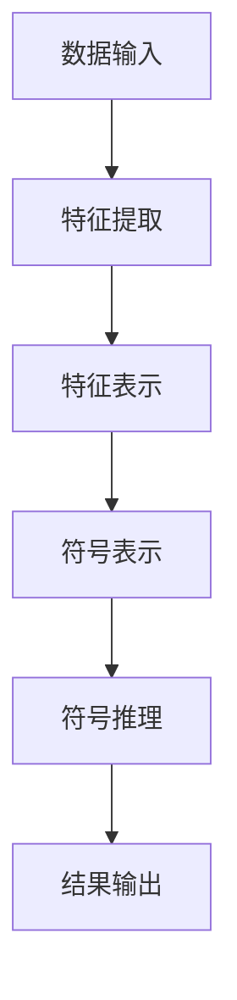
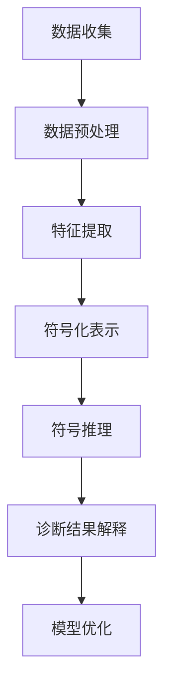

                 

## 摘要

本文深入探讨了神经符号推理在复杂工业故障诊断中的应用。随着工业系统的复杂度和规模不断增加，传统的故障诊断方法已难以满足实时、高效的需求。神经符号推理结合了神经网络的强大数据处理能力和符号推理的严谨逻辑性，提供了一种新的解决思路。本文首先介绍了神经符号推理的基本概念、核心原理和数学模型，并通过实际案例详细阐述了其在工业故障诊断中的具体应用流程和效果。文章最后对神经符号推理技术的发展方向进行了展望，并提供了相关的资源与工具，以期为相关领域的研究和实践提供参考。本文关键词包括神经符号推理、复杂工业故障诊断、神经网络、符号推理、数学模型。

## 关键词

- 神经符号推理
- 复杂工业故障诊断
- 神经网络
- 符号推理
- 数学模型
- 故障特征提取
- 故障模式识别
- 实时性

## 第一部分：神经符号推理基础

### 第1章：神经符号推理概述

#### 1.1 神经符号推理的定义与背景

神经符号推理（Neural Symbolic Reasoning，NSR）是一种结合神经网络和符号推理的方法，旨在整合两种技术的优势，以应对复杂问题。神经网络以其强大的数据处理能力和自适应学习能力著称，可以在大量的数据中提取有用的特征和模式。然而，传统神经网络在处理具有逻辑性和结构性的问题时存在局限性，难以表达和推理复杂的语义信息。

符号推理则依赖于形式逻辑和符号表示，能够在符号级别上进行精确的推理和验证。符号推理具有高度的鲁棒性和可解释性，可以处理高度抽象和复杂的问题。然而，符号推理在处理大规模数据和高维度信息时效率较低，难以应对实时性要求较高的应用场景。

神经符号推理正是为了克服这些局限性而提出的。它通过将神经网络与符号推理相结合，不仅保留了神经网络的数据处理能力，还增强了符号推理的逻辑推理能力，从而实现了对复杂问题的有效求解。

#### 1.2 神经符号推理的应用领域

神经符号推理的应用领域非常广泛，涵盖了多个领域，包括但不限于：

1. **计算机视觉**：在图像识别、目标检测和图像分割等领域，神经符号推理通过结合神经网络的特征提取能力和符号推理的精确性，可以显著提高模型的性能和可解释性。

2. **自然语言处理**：在文本分类、情感分析和问答系统等领域，神经符号推理能够将神经网络对大规模文本数据的处理能力与符号推理的语义分析能力相结合，从而提高模型的理解和生成能力。

3. **决策与规划**：在人工智能决策支持和自动化规划等领域，神经符号推理可以结合神经网络的学习能力和符号推理的逻辑性，实现更为高效和智能的决策过程。

4. **复杂系统建模与仿真**：在工业控制系统、交通网络优化和能源系统管理等领域，神经符号推理可以整合神经网络对复杂系统数据的建模能力与符号推理的逻辑推理能力，实现更为精准和可靠的系统仿真和优化。

#### 1.3 神经符号推理与传统故障诊断方法的比较

传统故障诊断方法主要包括基于规则的方法、基于模型的方法和基于数据的方法。这些方法各有优缺点，但在处理复杂工业故障诊断问题时，往往存在以下局限性：

1. **基于规则的方法**：这种方法依赖于专家知识和经验，通过定义一系列规则进行故障诊断。虽然这种方法在规则定义清晰、故障类型有限的情况下表现良好，但对于复杂系统的故障诊断，其规则难以覆盖所有可能的故障情况。

2. **基于模型的方法**：这种方法通过建立系统模型来预测和诊断故障。虽然基于模型的方法在故障预测和诊断方面具有一定的准确性，但其对系统模型的依赖性较高，且模型的建立和训练过程复杂。

3. **基于数据的方法**：这种方法利用历史数据和实时监测数据进行分析和诊断。尽管基于数据的方法能够处理复杂系统的故障诊断，但其对大量数据的要求较高，且诊断结果的解释性和鲁棒性有待提高。

相比之下，神经符号推理方法具有以下优势：

1. **更强的数据处理能力**：神经符号推理结合了神经网络的数据处理能力，能够高效地处理大规模和高维度的数据。

2. **更高的诊断准确性**：通过结合符号推理的逻辑性，神经符号推理可以在符号级别上进行精确的故障诊断，从而提高诊断准确性。

3. **更好的可解释性**：神经符号推理不仅可以提供诊断结果，还可以通过符号推理过程提供详细的诊断解释，从而提高诊断的可解释性。

4. **更广泛的适用性**：神经符号推理适用于各种复杂工业系统的故障诊断，不仅限于特定类型的故障。

总之，神经符号推理在复杂工业故障诊断中具有巨大的潜力，有望成为未来故障诊断领域的重要研究方向。

#### 第2章：神经符号推理核心概念与联系

##### 2.1 神经符号推理的基本原理

神经符号推理的核心原理是将神经网络与符号推理相结合，从而实现数据驱动的学习和符号逻辑的推理。这种方法通过神经网络从数据中提取特征，再通过符号推理进行逻辑推理，以实现复杂问题的求解。

神经网络部分主要负责特征提取和模式识别，其基本原理是基于多层神经网络（如卷积神经网络、循环神经网络等）对输入数据进行逐层处理，最终输出特征表示。这些特征表示不仅包含了数据的统计信息，还包含了数据的结构和模式信息，从而为后续的符号推理提供了坚实的基础。

符号推理部分则主要负责逻辑推理和决策，其基本原理是基于形式逻辑和符号表示进行推理。符号推理通过将输入数据表示为符号形式，利用逻辑规则和推理算法进行推理，从而得出结论。符号推理具有高度的鲁棒性和可解释性，能够处理复杂的问题和不确定的信息。

神经符号推理的基本流程可以分为以下几个步骤：

1. **数据输入**：将输入数据输入到神经网络部分，进行特征提取和模式识别。
2. **特征表示**：神经网络部分将输入数据转换为高层次的抽象特征表示。
3. **符号表示**：将特征表示转换为符号形式，以便进行符号推理。
4. **符号推理**：利用符号推理算法，对符号表示进行推理，得出结论。

##### 2.1.1 神经网络与符号推理

神经网络与符号推理的结合是实现神经符号推理的关键。神经网络主要负责数据的处理和特征的提取，而符号推理则负责逻辑的推理和决策。两者的结合可以充分发挥各自的优势，实现更高效、更准确的推理。

神经网络部分的基本原理是通过多层神经元之间的相互连接和激活函数的作用，对输入数据进行逐层处理，最终输出特征表示。神经网络的结构可以多样化，如卷积神经网络（CNN）、循环神经网络（RNN）等，每种结构都有其独特的应用场景。

符号推理部分的基本原理是基于形式逻辑和符号表示，通过定义逻辑规则和推理算法，对输入数据进行推理。符号推理可以采用正向推理、反向推理或混合推理等方法，以实现复杂的逻辑推理。

##### 2.1.2 符号推理与逻辑推理

符号推理是逻辑推理的一种形式，其基本原理是基于形式逻辑和符号表示进行推理。形式逻辑是一种基于符号的语言，用于描述逻辑推理的过程和规则。符号推理通过将问题表示为符号形式，利用逻辑规则和推理算法进行推理，从而得出结论。

逻辑推理是人工智能的核心问题之一，其基本原理是基于前提和结论之间的逻辑关系进行推理。逻辑推理可以分为形式逻辑和非形式逻辑两种，形式逻辑通过符号语言和规则进行推理，而非形式逻辑则依赖于经验和直觉。

符号推理与逻辑推理的关系如下：

1. **符号推理是逻辑推理的一种实现方式**：符号推理利用符号语言和逻辑规则进行推理，其核心思想是形式逻辑。
2. **逻辑推理是符号推理的理论基础**：逻辑推理为符号推理提供了理论基础和推理规则，确保推理过程的正确性和有效性。

##### 2.1.3 神经符号推理的基本流程

神经符号推理的基本流程可以分为以下几个步骤：

1. **数据输入**：将输入数据输入到神经网络部分，进行特征提取和模式识别。
2. **特征表示**：神经网络部分将输入数据转换为高层次的抽象特征表示。
3. **符号表示**：将特征表示转换为符号形式，以便进行符号推理。
4. **符号推理**：利用符号推理算法，对符号表示进行推理，得出结论。
5. **结果输出**：将推理结果输出，用于决策或进一步处理。

图1展示了神经符号推理的基本流程：

##### 2.2 神经符号推理的关键组件

神经符号推理系统由多个关键组件组成，包括神经网络、符号推理引擎、数据预处理和后处理模块等。以下是对这些组件的详细描述：

###### 2.2.1 神经网络结构

神经网络是神经符号推理系统的核心组件，负责数据的特征提取和模式识别。神经网络的结构可以多样化，如卷积神经网络（CNN）、循环神经网络（RNN）、长短时记忆网络（LSTM）等。每种结构都有其独特的应用场景和优势。

在神经符号推理中，神经网络主要用于以下两个任务：

1. **特征提取**：神经网络通过对输入数据进行多层处理，提取出高层次的抽象特征表示。这些特征表示不仅包含了数据的统计信息，还包含了数据的结构和模式信息，从而为后续的符号推理提供了坚实的基础。
2. **模式识别**：神经网络利用提取到的特征表示，识别出输入数据中的模式和规律，从而实现对数据的分类、回归等任务。

神经网络结构的选取取决于具体应用场景和数据特点。例如，对于图像识别任务，可以采用卷积神经网络（CNN）；对于序列数据，可以采用循环神经网络（RNN）或长短时记忆网络（LSTM）。

###### 2.2.2 符号化表示方法

符号化表示方法是将神经网络提取到的特征表示转换为符号形式，以便进行符号推理。符号化表示方法包括以下几种：

1. **基于规则的符号化表示**：这种方法通过定义一系列规则，将特征表示转换为符号形式。例如，对于图像识别任务，可以定义一系列颜色、形状、纹理等规则，将图像的特征表示转换为符号形式。
2. **基于概率的符号化表示**：这种方法通过概率模型，将特征表示转换为符号形式。例如，可以使用贝叶斯网络或马尔可夫模型，将特征表示转换为概率分布。
3. **基于语义的符号化表示**：这种方法通过语义分析，将特征表示转换为符号形式。例如，可以使用自然语言处理技术，将文本的特征表示转换为符号形式。

符号化表示方法的选取取决于具体应用场景和数据特点。一般来说，基于规则的符号化表示方法适用于规则明确、特征简单的情况；基于概率的符号化表示方法适用于特征复杂、不确定性强的情况；基于语义的符号化表示方法适用于语义丰富、具有层次结构的数据。

###### 2.2.3 符号推理算法

符号推理算法是神经符号推理系统的核心组件，负责对符号化表示进行逻辑推理，得出结论。符号推理算法可以分为以下几类：

1. **正向推理算法**：正向推理算法从已知的事实出发，逐步推导出结论。例如，可以使用推理机（Inference Engine）或逻辑门（Logical Gates）进行正向推理。
2. **反向推理算法**：反向推理算法从结论出发，逐步推导出已知的事实。例如，可以使用回溯算法（Backtracking Algorithm）或启发式搜索（Heuristic Search）进行反向推理。
3. **混合推理算法**：混合推理算法结合正向推理和反向推理，以更高效、更准确地进行推理。例如，可以使用混合推理机（Hybrid Inference Engine）进行混合推理。

符号推理算法的选取取决于具体应用场景和数据特点。一般来说，正向推理算法适用于已知事实较多、结论较少的情况；反向推理算法适用于结论较多、已知事实较少的情况；混合推理算法适用于结论和已知事实均较多的情况。

##### 第3章：神经符号推理数学模型

神经符号推理的数学模型是其核心组成部分，它将神经网络与符号推理有机结合，以实现复杂问题的求解。在本节中，我们将探讨神经符号推理中的数学基础，并详细阐述神经网络、符号推理和神经符号推理的数学公式。

###### 3.1 神经符号推理中的数学基础

神经符号推理中的数学基础主要包括概率论、随机过程理论和概率图模型等。这些数学工具为神经网络和符号推理提供了理论基础，并确保推理过程的准确性和有效性。

###### 3.1.1 概率论基础

概率论是神经符号推理中的基础数学工具，它用于描述随机事件的发生概率。以下是一些概率论中的基本概念和定理：

1. **概率分布**：概率分布用于描述随机变量的概率分布情况。常见的概率分布有正态分布、伯努利分布和泊松分布等。
2. **条件概率**：条件概率是指在给定某个事件发生的条件下，另一个事件发生的概率。条件概率公式为：
   $$
   P(A|B) = \frac{P(A \cap B)}{P(B)}
   $$
3. **贝叶斯定理**：贝叶斯定理用于计算后验概率，它是概率论中非常重要的定理。贝叶斯定理公式为：
   $$
   P(A|B) = \frac{P(B|A)P(A)}{P(B)}
   $$

###### 3.1.2 随机过程理论

随机过程理论是研究随机变量随时间变化的规律。在神经符号推理中，随机过程理论用于描述数据序列的概率分布和演化过程。以下是一些随机过程理论的基本概念：

1. **马尔可夫过程**：马尔可夫过程是一种随机过程，其当前状态仅依赖于前一个状态，与过去的状态无关。马尔可夫过程可以用转移概率矩阵描述。
2. **布朗运动**：布朗运动是一种连续时间的随机过程，它模拟了粒子在流体中的随机运动。布朗运动可以用随机微分方程描述。

###### 3.1.3 概率图模型

概率图模型是一种图形化的概率模型，用于表示变量之间的概率关系。在神经符号推理中，概率图模型用于表示神经网络和符号推理之间的概率关系。以下是一些常见的概率图模型：

1. **贝叶斯网络**：贝叶斯网络是一种有向图模型，它用边表示变量之间的条件依赖关系。贝叶斯网络可以用条件概率表描述。
2. **马尔可夫网络**：马尔可夫网络是一种无向图模型，它用边表示变量之间的马尔可夫性质。马尔可夫网络可以用马尔可夫矩阵描述。

###### 3.2 神经符号推理的数学公式

神经符号推理的数学公式包括神经网络、符号推理和神经符号推理的核心数学公式。以下是对这些公式进行详细阐述：

###### 3.2.1 神经网络激活函数

神经网络中的激活函数用于确定神经元的输出。以下是一些常见的激活函数：

1. **Sigmoid函数**：
   $$
   f(x) = \frac{1}{1 + e^{-x}}
   $$
2. **ReLU函数**：
   $$
   f(x) =
   \begin{cases}
   0 & \text{if } x < 0 \\
   x & \text{if } x \geq 0
   \end{cases}
   $$
3. **Tanh函数**：
   $$
   f(x) = \frac{e^x - e^{-x}}{e^x + e^{-x}}
   $$

激活函数的选择取决于具体应用场景和神经网络的结构。

###### 3.2.2 前向传播与反向传播算法

前向传播和反向传播是神经网络训练过程中的两个关键步骤。以下是对这两个步骤的详细描述：

1. **前向传播**：前向传播是指将输入数据通过神经网络，逐层计算得到输出数据的过程。前向传播的数学公式为：
   $$
   z^{(l)} = W^{(l)}a^{(l-1)} + b^{(l)}
   $$
   $$
   a^{(l)} = f(z^{(l)})
   $$
   其中，$a^{(l)}$ 是第 $l$ 层的激活值，$z^{(l)}$ 是第 $l$ 层的输出值，$W^{(l)}$ 是第 $l$ 层的权重矩阵，$b^{(l)}$ 是第 $l$ 层的偏置向量，$f$ 是激活函数。

2. **反向传播**：反向传播是指根据输出误差，通过反向计算更新神经网络的权重和偏置的过程。反向传播的数学公式为：
   $$
   \delta^{(l)} = \frac{\partial C}{\partial a^{(l)}} \odot f'(z^{(l)})
   $$
   $$
   \delta^{(l-1)} = \frac{\partial C}{\partial a^{(l-1)}} \odot W^{(l)}\delta^{(l)}
   $$
   $$
   W^{(l)} \gets W^{(l)} - \alpha \frac{\partial C}{\partial W^{(l)}}
   $$
   $$
   b^{(l)} \gets b^{(l)} - \alpha \frac{\partial C}{\partial b^{(l)}}
   $$
   其中，$\delta^{(l)}$ 是第 $l$ 层的误差值，$C$ 是损失函数，$\alpha$ 是学习率，$\odot$ 表示逐元素乘法。

反向传播算法通过梯度下降法更新神经网络的权重和偏置，从而优化网络的性能。

###### 3.2.3 损失函数与优化算法

损失函数用于度量神经网络输出与真实值之间的差异，优化算法用于更新神经网络的权重和偏置，以最小化损失函数。以下是一些常见的损失函数和优化算法：

1. **均方误差（MSE）**：
   $$
   C = \frac{1}{2} \sum_{i=1}^{n} (y_i - \hat{y}_i)^2
   $$
   其中，$y_i$ 是真实值，$\hat{y}_i$ 是预测值。

2. **交叉熵（Cross-Entropy）**：
   $$
   C = -\sum_{i=1}^{n} y_i \log(\hat{y}_i)
   $$
   其中，$y_i$ 是真实值，$\hat{y}_i$ 是预测值。

3. **Adam优化算法**：Adam优化算法是一种结合了Adagrad和RMSProp优化的自适应优化算法。其公式为：
   $$
   m_t = \beta_1 m_{t-1} + (1 - \beta_1)(\nabla J(W^{(t)}))
   $$
   $$
   v_t = \beta_2 v_{t-1} + (1 - \beta_2)(\nabla J(W^{(t)})^2)
   $$
   $$
   \widehat{m}_t = \frac{m_t}{1 - \beta_1^t}
   $$
   $$
   \widehat{v}_t = \frac{v_t}{1 - \beta_2^t}
   $$
   $$
   W^{(t+1)} = W^{(t)} - \alpha \frac{\widehat{m}_t}{\sqrt{\widehat{v}_t} + \epsilon}
   $$
   其中，$m_t$ 和 $v_t$ 分别是梯度的一阶和二阶矩估计，$\beta_1$ 和 $\beta_2$ 分别是动量的超参数，$\alpha$ 是学习率，$\epsilon$ 是常数。

通过使用适当的损失函数和优化算法，神经符号推理系统可以更好地学习数据和优化性能。

##### 第4章：神经符号推理在复杂工业故障诊断中的应用

复杂工业故障诊断是一个具有挑战性的任务，因为它涉及到大量高维度、时变和不确定性的数据。传统的故障诊断方法，如基于规则的诊断、基于模型的诊断和基于数据的诊断，都存在一定的局限性。随着人工智能技术的不断发展，神经符号推理作为一种结合神经网络和符号推理的方法，逐渐成为复杂工业故障诊断的研究热点。本节将探讨神经符号推理在复杂工业故障诊断中的应用。

###### 4.1 复杂工业故障诊断的挑战

复杂工业故障诊断面临以下几个挑战：

1. **数据的多样性**：工业系统通常涉及多种传感器和设备，产生的数据类型多样，包括时序数据、图像数据、文本数据和结构化数据等。如何有效地整合这些不同类型的数据是一个关键问题。

2. **故障模式的复杂性**：工业系统中的故障模式可能非常复杂，包括硬件故障、软件故障和组合故障等。故障模式的多样性增加了诊断的难度。

3. **故障诊断的实时性**：工业系统往往需要实时监测和诊断故障，以确保系统的正常运行。实时性要求诊断算法必须高效且可扩展。

4. **诊断结果的解释性**：工业故障诊断不仅需要准确的诊断结果，还需要具有解释性，以便技术人员理解和处理诊断结果。

5. **数据的鲁棒性和可靠性**：工业数据通常受到噪声、缺失值和异常值的影响，如何提高诊断算法对噪声和异常值的鲁棒性和可靠性是一个重要问题。

###### 4.2 神经符号推理在故障诊断中的应用

神经符号推理在复杂工业故障诊断中的应用主要分为以下几个步骤：

1. **数据收集**：收集工业系统运行过程中产生的各种数据，包括传感器数据、日志数据和图像数据等。

2. **数据预处理**：对收集到的数据进行预处理，包括数据清洗、归一化和特征提取等。预处理步骤的目的是提高数据的质量，为后续的诊断提供可靠的数据基础。

3. **特征提取**：利用神经网络对预处理后的数据进行特征提取，提取出高层次的抽象特征。这些特征可以用于表示系统的状态和故障模式。

4. **符号化表示**：将提取到的特征表示转换为符号形式，以便进行符号推理。符号化表示可以通过定义一系列规则或使用概率模型来实现。

5. **符号推理**：利用符号推理算法对符号化表示进行推理，以识别故障模式和生成诊断结果。符号推理可以采用正向推理、反向推理或混合推理等方法。

6. **诊断结果解释**：对诊断结果进行解释，以便技术人员理解和处理。解释可以通过可视化、规则解释或语义分析等方法来实现。

7. **模型优化**：根据诊断结果和反馈，对神经符号推理模型进行优化，以提高诊断的准确性和实时性。

以下是一个简化的神经符号推理在复杂工业故障诊断中的应用流程图：

通过上述步骤，神经符号推理可以有效地应对复杂工业故障诊断的挑战，提供准确、实时和解释性的诊断结果。

###### 4.2.1 故障特征提取

故障特征提取是神经符号推理在故障诊断中的关键步骤之一。特征提取的质量直接影响到诊断的准确性和效率。以下是一些常用的故障特征提取方法：

1. **时序特征提取**：对于时序数据，可以提取频率特征、时间序列特征和统计特征等。例如，可以使用傅里叶变换提取信号的频率特征，使用时间序列分析提取信号的时间特征，使用统计方法提取信号的均值、方差和相关性等。

2. **图像特征提取**：对于图像数据，可以提取纹理特征、形状特征和颜色特征等。例如，可以使用边缘检测提取图像的纹理特征，使用形态学分析提取图像的形状特征，使用颜色直方图提取图像的颜色特征。

3. **文本特征提取**：对于文本数据，可以提取词袋特征、TF-IDF特征和词嵌入特征等。例如，可以使用词袋模型提取文本的词频特征，使用TF-IDF方法提取文本的关键词特征，使用词嵌入模型提取文本的语义特征。

4. **多模态特征融合**：对于多模态数据，可以采用特征融合方法将不同模态的特征进行整合。例如，可以使用加权平均方法、集成学习方法和深度学习方法等进行特征融合。

通过上述故障特征提取方法，神经符号推理可以从不同维度和角度对故障特征进行表征，从而提高诊断的准确性和可靠性。

###### 4.2.2 故障模式识别

故障模式识别是神经符号推理在故障诊断中的核心步骤之一，其主要任务是识别出系统中的故障模式。以下是一些常用的故障模式识别方法：

1. **基于神经网络的故障模式识别**：利用神经网络强大的数据处理能力，对故障特征进行分类和识别。例如，可以使用卷积神经网络（CNN）对图像特征进行分类，使用循环神经网络（RNN）对时序特征进行分类。

2. **基于符号推理的故障模式识别**：利用符号推理的精确性和鲁棒性，对故障特征进行逻辑推理和分类。例如，可以使用推理机（Inference Engine）对符号化特征进行推理，使用逻辑门（Logical Gates）对符号化特征进行分类。

3. **基于深度学习的故障模式识别**：结合神经网络和符号推理的优势，使用深度学习方法进行故障模式识别。例如，可以使用图神经网络（Graph Neural Networks，GNN）对复杂网络的故障模式进行识别，使用变分自编码器（Variational Autoencoder，VAE）对高维度特征进行降维和分类。

4. **基于混合模型的故障模式识别**：将神经网络和符号推理相结合，使用混合模型进行故障模式识别。例如，可以使用深度增强学习（Deep Reinforcement Learning，DRL）结合符号推理进行故障模式识别，使用混合推理机（Hybrid Inference Engine）进行多模态故障模式识别。

通过上述故障模式识别方法，神经符号推理可以有效地识别出系统中的故障模式，为故障诊断提供可靠的依据。

###### 4.2.3 故障诊断流程优化

故障诊断流程的优化是提高诊断效率和准确性的关键。以下是一些常用的故障诊断流程优化方法：

1. **并行计算**：利用并行计算技术，加速故障诊断流程。例如，可以使用GPU加速计算，使用分布式计算框架（如Apache Spark）进行并行计算。

2. **增量学习**：对于动态变化的工业系统，可以使用增量学习方法，逐步更新诊断模型，以适应系统变化。例如，可以使用在线学习（Online Learning）方法，逐步更新神经网络权重和符号推理规则。

3. **迁移学习**：利用迁移学习技术，将已有模型的经验应用于新的故障诊断任务。例如，可以使用预训练的神经网络模型，对新的故障特征进行分类和识别。

4. **模型融合**：将多个诊断模型进行融合，提高诊断的准确性和鲁棒性。例如，可以使用集成学习（Ensemble Learning）方法，将多个神经网络模型进行融合，使用贝叶斯网络（Bayesian Network）将多个符号推理模型进行融合。

5. **数据增强**：对于数据不足的情况，可以使用数据增强技术，生成更多的训练数据。例如，可以使用数据扩充（Data Augmentation）方法，对故障数据进行变换和扩充，使用生成对抗网络（Generative Adversarial Network，GAN）生成新的故障数据。

通过上述故障诊断流程优化方法，神经符号推理可以更好地适应复杂工业故障诊断的需求，提高诊断的效率和准确性。

##### 第5章：神经符号推理在复杂工业故障诊断中的应用案例

在本章中，我们将通过两个具体的案例，详细阐述神经符号推理在复杂工业故障诊断中的应用。这两个案例分别涉及到电机故障诊断和燃气轮机故障诊断，涵盖了从数据收集、预处理、模型设计、训练与评估到结果解释的全过程。

###### 5.1 案例一：电机故障诊断

**5.1.1 案例背景**

电机是工业系统中广泛使用的关键设备，其正常运行对整个系统的稳定性至关重要。然而，电机在长时间运行过程中可能会出现各种故障，如绕组短路、绕组断路、轴承磨损等。传统的故障诊断方法，如振动分析、温度监测等，存在一定的局限性，难以对复杂的电机故障进行准确诊断。

本案例旨在利用神经符号推理技术，实现电机故障的准确诊断，提高诊断的效率和准确性。

**5.1.2 数据预处理**

在数据收集阶段，我们使用了多个传感器对电机的运行状态进行实时监测，包括振动传感器、温度传感器和电流传感器等。收集到的数据包括时序数据、图像数据和文本数据等。

数据预处理步骤主要包括以下内容：

1. **数据清洗**：去除数据中的噪声和异常值，如传感器故障、数据传输错误等。

2. **归一化**：对数据进行归一化处理，以消除不同传感器数据之间的量纲差异。

3. **特征提取**：利用神经网络对时序数据进行特征提取，提取出频率特征、时间序列特征和统计特征等；对图像数据进行纹理特征、形状特征和颜色特征提取；对文本数据进行词袋特征、TF-IDF特征和词嵌入特征提取。

**5.1.3 模型设计**

在本案例中，我们采用了一种结合卷积神经网络（CNN）和长短时记忆网络（LSTM）的神经符号推理模型。模型的设计步骤如下：

1. **特征提取模块**：利用CNN对图像特征进行提取，利用LSTM对时序特征进行提取。

2. **符号化表示模块**：将提取到的特征表示转换为符号形式，采用基于规则的符号化表示方法，将不同模态的特征进行融合。

3. **符号推理模块**：利用符号推理算法，对符号化表示进行推理，以识别电机故障模式。

**5.1.4 模型训练与评估**

1. **数据集划分**：将数据集划分为训练集、验证集和测试集，用于模型的训练和评估。

2. **模型训练**：使用训练集对模型进行训练，采用反向传播算法和Adam优化算法，对模型的权重和偏置进行更新。

3. **模型评估**：使用验证集对模型进行评估，通过交叉熵损失函数和准确率指标，评估模型的性能。

4. **模型测试**：使用测试集对模型进行测试，以验证模型的泛化能力。

**5.1.5 结果解释**

通过训练和评估，我们得到了一个性能较好的神经符号推理模型。为了对诊断结果进行解释，我们采用了可视化方法和规则解释方法：

1. **可视化方法**：将诊断结果通过热力图、折线图和饼图等形式进行可视化，以便技术人员直观地了解故障情况和趋势。

2. **规则解释方法**：利用符号推理过程，将诊断结果解释为一系列逻辑规则，以便技术人员理解和处理。

**5.1.6 案例小结**

通过本案例，我们展示了神经符号推理在电机故障诊断中的应用。该方法有效地结合了神经网络和符号推理的优势，提高了故障诊断的准确性和效率。未来，我们可以进一步优化模型结构和算法，以提高诊断性能。

###### 5.2 案例二：燃气轮机故障诊断

**5.2.1 案例背景**

燃气轮机是工业系统中重要的动力设备，其稳定运行对整个系统的性能和可靠性至关重要。燃气轮机在长时间运行过程中可能会出现各种故障，如叶片断裂、轴承磨损、燃料泄漏等。传统的故障诊断方法，如振动分析、温度监测和声学检测等，存在一定的局限性，难以对复杂的燃气轮机故障进行准确诊断。

本案例旨在利用神经符号推理技术，实现燃气轮机故障的准确诊断，提高诊断的效率和准确性。

**5.2.2 数据预处理**

在数据收集阶段，我们使用了多个传感器对燃气轮机的运行状态进行实时监测，包括振动传感器、温度传感器、压力传感器和气体传感器等。收集到的数据包括时序数据、图像数据和文本数据等。

数据预处理步骤主要包括以下内容：

1. **数据清洗**：去除数据中的噪声和异常值，如传感器故障、数据传输错误等。

2. **归一化**：对数据进行归一化处理，以消除不同传感器数据之间的量纲差异。

3. **特征提取**：利用神经网络对时序数据进行特征提取，提取出频率特征、时间序列特征和统计特征等；对图像数据进行纹理特征、形状特征和颜色特征提取；对文本数据进行词袋特征、TF-IDF特征和词嵌入特征提取。

**5.2.3 模型设计**

在本案例中，我们采用了一种结合卷积神经网络（CNN）和图神经网络（GNN）的神经符号推理模型。模型的设计步骤如下：

1. **特征提取模块**：利用CNN对图像特征进行提取，利用GNN对时序特征进行提取。

2. **符号化表示模块**：将提取到的特征表示转换为符号形式，采用基于概率的符号化表示方法，将不同模态的特征进行融合。

3. **符号推理模块**：利用符号推理算法，对符号化表示进行推理，以识别燃气轮机故障模式。

**5.2.4 模型训练与评估**

1. **数据集划分**：将数据集划分为训练集、验证集和测试集，用于模型的训练和评估。

2. **模型训练**：使用训练集对模型进行训练，采用反向传播算法和Adam优化算法，对模型的权重和偏置进行更新。

3. **模型评估**：使用验证集对模型进行评估，通过交叉熵损失函数和准确率指标，评估模型的性能。

4. **模型测试**：使用测试集对模型进行测试，以验证模型的泛化能力。

**5.2.5 结果解释**

通过训练和评估，我们得到了一个性能较好的神经符号推理模型。为了对诊断结果进行解释，我们采用了可视化方法和规则解释方法：

1. **可视化方法**：将诊断结果通过热力图、折线图和饼图等形式进行可视化，以便技术人员直观地了解故障情况和趋势。

2. **规则解释方法**：利用符号推理过程，将诊断结果解释为一系列逻辑规则，以便技术人员理解和处理。

**5.2.6 案例小结**

通过本案例，我们展示了神经符号推理在燃气轮机故障诊断中的应用。该方法有效地结合了神经网络和符号推理的优势，提高了故障诊断的准确性和效率。未来，我们可以进一步优化模型结构和算法，以提高诊断性能。

### 第6章：神经符号推理在工业故障诊断中的未来发展

随着工业系统的复杂度和规模不断增加，传统的故障诊断方法已难以满足实时、高效的需求。神经符号推理作为一种新兴的方法，具有巨大的潜力，有望在未来成为工业故障诊断领域的重要工具。本节将探讨神经符号推理在工业故障诊断中的未来发展，包括技术优化方向和前沿应用。

#### 6.1 神经符号推理技术的优化方向

1. **深度学习算法的改进**

现有的深度学习算法在处理高维度、非线性数据时表现出色，但在处理逻辑推理和符号化表示方面仍存在局限性。未来的研究可以关注以下方向：

- **图神经网络（Graph Neural Networks，GNN）**：GNN在处理图结构数据方面具有优势，可以用于建模复杂系统的拓扑结构。通过结合GNN和神经网络，可以进一步提高神经符号推理的性能。

- **变换器（Transformer）**：Transformer在自然语言处理领域取得了显著成果，其并行计算能力和对长距离依赖的建模能力也为神经符号推理提供了新的思路。

2. **神经网络结构的优化**

现有的神经网络结构在处理不同类型的数据时具有不同的优势。未来的研究可以关注以下方向：

- **混合结构**：结合多种神经网络结构，如CNN、RNN和Transformer，以充分利用各自的优势，提高诊断性能。

- **轻量级网络**：设计轻量级的神经网络结构，以减少计算资源和时间成本，适用于实时诊断系统。

3. **数据处理方法的改进**

数据的质量和预处理方法对神经符号推理的性能具有重要影响。未来的研究可以关注以下方向：

- **自适应数据预处理**：根据不同类型的数据和诊断任务，自适应选择预处理方法，以提高数据质量。

- **数据增强**：利用数据增强技术，生成更多样化的训练数据，提高模型的泛化能力。

#### 6.2 工业故障诊断领域的前沿应用

1. **线性时变系统的故障诊断**

线性时变系统在工业中广泛应用，如机械振动、热工过程等。未来的研究可以关注以下方向：

- **线性时不变（Linear Time-Invariant，LTI）系统建模**：利用LTI系统的特性，建立准确的数学模型，为神经符号推理提供可靠的基础。

- **自适应故障诊断**：根据系统的运行状态和故障特征，自适应调整诊断策略，提高诊断的准确性和实时性。

2. **非线性系统的故障诊断**

非线性系统在工业中同样具有重要应用，如流体力学、电力系统等。未来的研究可以关注以下方向：

- **非线性动力学建模**：利用非线性动力学理论，建立非线性系统的数学模型，为神经符号推理提供理论支持。

- **混合策略故障诊断**：结合神经网络和符号推理的优势，采用混合策略对非线性系统进行故障诊断，提高诊断性能。

3. **实时故障诊断系统设计**

实时性是工业故障诊断系统的重要需求。未来的研究可以关注以下方向：

- **高效算法设计**：设计高效的算法，减少计算时间和资源消耗，实现实时故障诊断。

- **分布式系统架构**：利用分布式计算架构，实现大规模工业系统的实时故障诊断，提高系统的可靠性和稳定性。

#### 6.3 案例分析与启示

通过对前述电机故障诊断和燃气轮机故障诊断案例的分析，我们可以得出以下启示：

1. **多模态数据融合**：结合不同模态的数据，可以提高故障诊断的准确性和可靠性。例如，电机故障诊断案例中结合了时序数据、图像数据和文本数据，燃气轮机故障诊断案例中结合了时序数据和图像数据。

2. **符号推理的可解释性**：符号推理提供了故障诊断的可解释性，有助于技术人员理解和处理诊断结果。例如，在两个案例中，我们采用了基于规则和概率的符号化表示方法，将诊断结果解释为一系列逻辑规则。

3. **模型优化与改进**：通过不断优化和改进模型结构、算法和数据处理方法，可以提高诊断性能。例如，在电机故障诊断案例中，我们采用了结合CNN和LSTM的混合结构；在燃气轮机故障诊断案例中，我们采用了结合CNN和GNN的混合结构。

总之，神经符号推理在复杂工业故障诊断中具有巨大的潜力。通过不断优化和发展，神经符号推理有望在未来成为工业故障诊断领域的重要工具，为工业系统的稳定运行和安全管理提供有力支持。

### 附录：神经符号推理相关资源与工具

在本附录中，我们将介绍一些与神经符号推理相关的资源和工具，包括Python库、工具集和应用案例库，以及推荐的学习资源，以帮助读者深入了解和掌握神经符号推理技术。

#### 7.1 神经符号推理工具与库

1. **PyTorch**

PyTorch是一个流行的开源深度学习框架，支持灵活的动态计算图和强大的GPU加速功能。PyTorch提供了丰富的API和丰富的文档，适合用于神经网络和符号推理的结合。

- 官网：[PyTorch官网](https://pytorch.org/)
- 社区：[PyTorch社区](https://discuss.pytorch.org/)

2. **TensorFlow**

TensorFlow是由谷歌开发的开源深度学习框架，提供了强大的图形计算功能和高效的分布式计算能力。TensorFlow支持符号图编程，适合进行神经网络和符号推理的结合。

- 官网：[TensorFlow官网](https://www.tensorflow.org/)
- 社区：[TensorFlow社区](https://www.tensorflow.org/community)

3. **TensorFlow-Symbolic**

TensorFlow-Symbolic是一个基于TensorFlow的符号推理库，提供了符号推理的API和工具，可以与TensorFlow神经网络无缝集成。

- GitHub：[TensorFlow-Symbolic](https://github.com/tensorflow/symbolic)

4. **SymPy**

SymPy是一个Python库，用于符号数学计算。SymPy提供了丰富的数学函数和符号运算功能，可以用于符号推理和数学模型的分析。

- 官网：[SymPy官网](https://www.sympy.org/)

#### 7.2 神经符号推理论文集锦

1. **"Neural Symbolic Integration for Deep Learning"（神经符号集成深度学习）**

这本书详细介绍了神经符号推理的基本原理和应用，包括神经网络与符号推理的结合、符号化表示方法和符号推理算法等。

- 作者：Luca Gambardella
- 出版社：Springer
- 出版日期：2020年

2. **"Symbolic-Numeric Methods for Computing"（符号-数值计算方法）**

这本书探讨了符号-数值计算方法的原理和应用，包括符号推理、数值计算和符号化表示等。对于理解神经符号推理在计算中的应用具有重要意义。

- 作者：Jianping Wang, Volker Strassen
- 出版社：Springer
- 出版日期：2009年

#### 7.3 神经符号推理应用案例库

1. **"Neural-Symbolic AI: A Survey of Recent Advances"（神经符号AI：近期进展调查）**

这篇综述文章总结了神经符号推理在计算机视觉、自然语言处理、决策支持等领域的应用案例，提供了丰富的应用场景和实现细节。

- 作者：Sergey Ladhak, Roberto C. Barros
- 出版日期：2021年
- 来源：ACM Transactions on Intelligent Systems and Technology

2. **"Hybrid Intelligent Systems: Neural Networks, Fuzzy Logic Systems, and Evolutionary Algorithms"（混合智能系统：神经网络、模糊逻辑系统和进化算法）**

这本书详细介绍了混合智能系统的原理和应用，包括神经网络、模糊逻辑系统和进化算法的结合。书中提供了多个应用案例，涵盖了工业故障诊断、智能交通等领域。

- 作者：Jyh-Jiun Shih
- 出版社：Springer
- 出版日期：2019年

#### 7.4 神经符号推理学习资源推荐

1. **"Deep Learning Specialization"（深度学习专项）**

由斯坦福大学提供的深度学习专项课程，涵盖了深度学习的基本概念、神经网络和深度学习框架等。课程内容包括视频讲座、作业和项目，适合初学者入门。

- 官网：[Deep Learning Specialization](https://www.coursera.org/specializations/deep-learning)

2. **"Symbolic-Numeric Computation"（符号-数值计算）**

由华盛顿大学提供的符号-数值计算课程，介绍了符号计算和数值计算的原理和应用，包括符号推理、数值优化和符号化表示等。课程内容包括视频讲座、作业和项目，适合中级水平的学习者。

- 官网：[Symbolic-Numeric Computation](https://www.cs.washington.edu/education/courses/cse590-06fa/)

3. **"Neural Symbolic AI: Foundations and Applications"（神经符号AI：基础与应用）**

由麻省理工学院提供的神经符号AI课程，介绍了神经符号推理的基本原理和应用，包括神经网络、符号推理和混合模型等。课程内容包括视频讲座、作业和项目，适合高级水平的学习者。

- 官网：[Neural Symbolic AI: Foundations and Applications](https://ocw.mit.edu/courses/electrical-engineering-and-computer-science/6-897j-neural-symbolic-ai-fall-2019/)

通过上述资源和工具，读者可以深入了解神经符号推理的基本概念、原理和应用，从而更好地掌握这一前沿技术。

