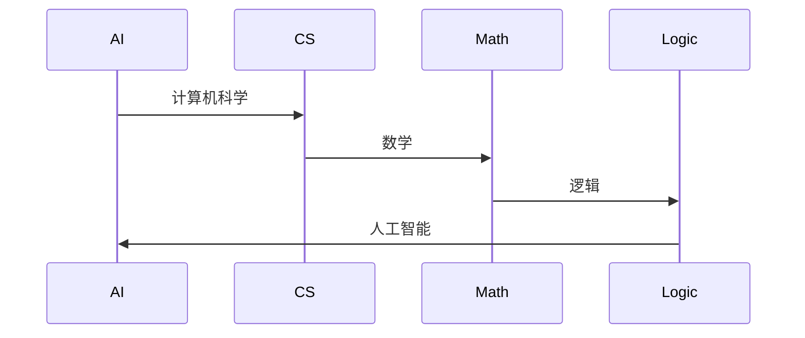
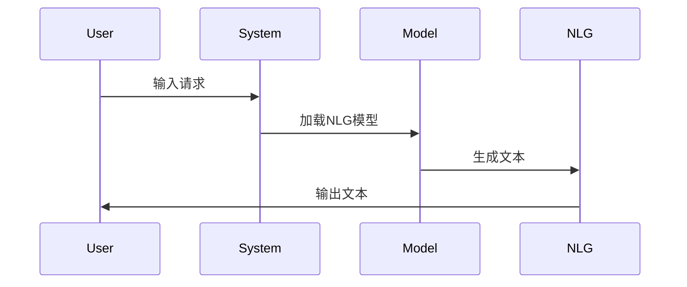

                 

## 第1章 绪论

### 1.1 研究背景

**自然语言生成（Natural Language Generation, NLG）技术**是指利用计算机程序生成自然语言的文本。随着人工智能技术的发展，NLG已经成为自然语言处理（NLP）领域的重要研究方向之一。NLG技术在诸多场景下具有广泛的应用价值，如在线客服、新闻报道、教育辅助、娱乐内容生成等。

近年来，深度学习技术在自然语言生成领域取得了显著进展。特别是基于循环神经网络（RNN）和Transformer的模型，如序列到序列（Seq2Seq）模型和BERT模型，极大地提升了自然语言生成的质量和效果。然而，这些模型在处理复杂、抽象的语义信息时仍存在一定的局限性。

**神经符号推理（Neural Symbolic Reasoning, NSR）**是一种结合深度学习和符号逻辑推理的人工智能方法。它通过将深度学习模型与形式逻辑系统相结合，实现了对复杂知识结构的表示和处理。神经符号推理在多个领域展现出了强大的潜力，如知识图谱、推理任务和自动驾驶等。

将神经符号推理应用于自然语言生成，有望弥补深度学习模型在语义理解方面的不足，提升自然语言生成的准确性和鲁棒性。本文将探讨神经符号推理在自然语言生成中的应用，分析其理论基础、实现方法和性能评估。

### 1.2 研究意义

**改进自然语言生成的效果和效率**：神经符号推理能够更好地捕捉和表示语义信息，从而提高自然语言生成的质量和效果。同时，通过引入符号推理，可以优化生成模型的计算效率，降低模型训练和推理的时间成本。

**促进人工智能技术在实际应用中的发展**：神经符号推理作为一种跨学科的人工智能方法，具有广泛的应用前景。将神经符号推理应用于自然语言生成，有助于推动人工智能技术在更多实际场景中的落地和应用。

### 1.3 研究内容

本文将从以下几个方面展开研究：

1. **神经符号推理的理论基础**：介绍神经符号推理的基本概念、工作原理和数学模型，为后续应用提供理论基础。

2. **自然语言生成的相关技术**：分析当前自然语言生成领域的主流模型和方法，探讨神经符号推理在自然语言生成中的应用潜力。

3. **神经符号推理在自然语言生成中的应用**：设计并实现一个基于神经符号推理的自然语言生成系统，通过实验验证其性能和效果。

4. **性能评估与优化**：评估神经符号推理在自然语言生成中的性能，提出优化方法以提高生成质量。

5. **案例分析**：通过具体案例展示神经符号推理在自然语言生成中的应用，分析其实际效果和挑战。

6. **未来发展趋势**：探讨神经符号推理在自然语言生成领域的未来发展趋势和潜在应用场景。

## 第2章 神经符号推理基础

### 2.1 符号计算概述

**符号计算**是一种将数学、逻辑和计算机科学的方法应用于符号处理和推理的技术。符号计算起源于20世纪中期，随着计算机技术的发展，逐渐成为一个独立的学科。

#### 图 2-1 符号计算发展历程



符号计算涵盖了多个领域，包括：

- **符号代数**：研究符号变量及其运算规则。
- **符号微分和积分**：对符号表达式进行微分和积分运算。
- **符号逻辑**：研究形式逻辑系统和推理方法。
- **符号计算软件**：如Mathematica、Maple等。

### 2.2 神经符号推理原理

#### 神经符号推理的定义

**神经符号推理**（Neural Symbolic Reasoning, NSR）是一种结合深度学习和符号逻辑推理的人工智能方法。它旨在将深度学习模型与形式逻辑系统相结合，实现对复杂知识结构的表示和处理。

神经符号推理的基本思想是将深度学习模型生成的特征表示与符号逻辑规则相结合，通过符号推理来提升模型对语义的理解和推理能力。具体来说，神经符号推理包括以下几个关键组件：

- **特征提取**：利用深度学习模型提取输入数据的特征表示。
- **逻辑推理**：基于形式逻辑系统进行符号推理，处理复杂知识结构和推理任务。
- **符号解释**：将符号推理结果转化为可解释的语义表示。

#### 神经符号推理的工作原理

神经符号推理的工作原理可以分为以下几个步骤：

1. **特征提取**：首先，使用深度学习模型（如神经网络）对输入数据进行特征提取，生成高维的特征向量表示。
2. **符号表示**：将提取的特征向量映射到符号空间，表示为符号变量或符号表达式。
3. **逻辑推理**：利用形式逻辑系统对符号表示进行推理，生成推理结果。
4. **符号解释**：将推理结果转化为可解释的语义表示，如自然语言文本或可视化图表。

#### 神经符号推理的核心技术

神经符号推理的核心技术包括以下几个方面：

1. **深度学习模型**：用于提取输入数据的特征表示，如卷积神经网络（CNN）和循环神经网络（RNN）。
2. **形式逻辑系统**：用于逻辑推理和符号计算，如谓词逻辑、命题逻辑和命题演算。
3. **符号解释器**：将推理结果转化为可解释的语义表示，如自然语言生成模型。
4. **符号学习算法**：用于训练深度学习模型和逻辑系统，如基于梯度的优化算法和符号学习算法。

### 2.3 神经符号推理的数学模型

神经符号推理的数学模型主要涉及以下几个方面：

1. **特征表示**：使用深度学习模型对输入数据进行特征提取，生成特征向量表示。特征向量通常由神经网络中的激活函数和权重矩阵决定。

$$
\text{特征向量} = \text{激活函数}(\text{权重矩阵} \times \text{输入数据})
$$

2. **符号映射**：将提取的特征向量映射到符号空间，表示为符号变量或符号表达式。符号映射可以通过符号编码器实现。

$$
\text{符号变量} = \text{符号编码器}(\text{特征向量})
$$

3. **逻辑推理**：利用形式逻辑系统对符号表示进行推理，生成推理结果。逻辑推理可以通过谓词演算、命题演算等实现。

$$
\text{推理结果} = \text{逻辑推理系统}(\text{符号变量})
$$

4. **符号解释**：将推理结果转化为可解释的语义表示，如自然语言文本或可视化图表。符号解释可以通过自然语言生成模型或可视化工具实现。

$$
\text{语义表示} = \text{符号解释器}(\text{推理结果})
$$

### 2.4 神经符号推理的应用场景

神经符号推理在多个领域具有广泛的应用潜力，包括：

1. **知识图谱**：利用神经符号推理实现知识图谱的推理和更新，提升知识图谱的表示和推理能力。
2. **推理任务**：在逻辑推理、数学证明、科学计算等领域，神经符号推理可用于解决复杂推理问题。
3. **自动驾驶**：利用神经符号推理实现自动驾驶中的环境感知和决策，提升自动驾驶系统的安全性和可靠性。
4. **自然语言处理**：将神经符号推理应用于自然语言生成、文本分类、情感分析等领域，提升NLP任务的性能。

### 2.5 神经符号推理的优势和挑战

**优势**：

1. **结合深度学习和符号逻辑**：神经符号推理能够结合深度学习模型和符号逻辑的优势，提升模型对复杂知识结构的理解和推理能力。
2. **可解释性和透明性**：神经符号推理生成的推理结果具有可解释性和透明性，有助于理解模型的决策过程。
3. **多领域应用**：神经符号推理在多个领域具有广泛的应用潜力，如知识图谱、推理任务、自动驾驶和自然语言处理等。

**挑战**：

1. **计算资源需求**：神经符号推理需要大量的计算资源，特别是在特征提取和逻辑推理阶段。
2. **模型复杂度**：神经符号推理模型通常具有较高的复杂度，需要有效的优化和训练方法。
3. **数据质量和规模**：神经符号推理对数据质量和规模有较高的要求，需要大量的高质量数据支持。

### 2.6 小结

本章介绍了神经符号推理的基本概念、工作原理和数学模型。神经符号推理作为一种结合深度学习和符号逻辑的人工智能方法，在多个领域具有广泛的应用潜力。通过本章的学习，读者可以了解神经符号推理的核心技术和应用场景，为后续章节的研究打下基础。

## 第3章 自然语言生成基础

### 3.1 自然语言生成的概念

**自然语言生成（Natural Language Generation, NLG）**是指利用计算机程序生成自然语言的文本。NLG技术的目标是使计算机能够自动生成具有人类语言特征的文本，以满足各种实际应用需求。

#### 图 3-1 自然语言生成过程



自然语言生成的应用场景包括：

1. **在线客服**：自动生成与用户对话的回复，提高客服效率。
2. **新闻报道**：自动生成新闻文章，降低人工成本。
3. **教育辅助**：生成个性化的学习资料和教学材料。
4. **娱乐内容**：生成小说、故事、游戏剧情等。

### 3.2 自然语言生成的模型

自然语言生成的模型可以分为两大类：**生成式模型**和**抽取式模型**。

#### 3.2.1 生成式模型

生成式模型通过生成目标语言的概率分布来生成文本。常见的生成式模型包括：

1. **序列到序列（Seq2Seq）模型**：基于编码器-解码器架构，将输入序列映射到输出序列。
    - **编码器**：将输入序列编码为一个固定长度的向量。
    - **解码器**：将编码后的向量解码为输出序列。

2. **循环神经网络（RNN）模型**：通过记忆机制处理输入序列，逐步生成输出序列。

3. **生成对抗网络（GAN）模型**：通过生成器和判别器之间的对抗训练，生成逼真的文本。

#### 3.2.2 抽取式模型

抽取式模型从已有文本中抽取信息，生成新的文本。常见的抽取式模型包括：

1. **模板匹配模型**：根据预定义的模板生成文本。
2. **模板填空模型**：将输入文本中的空缺部分替换为生成的内容。
3. **知识图谱生成模型**：利用知识图谱生成文本，通常与问答系统相结合。

### 3.3 自然语言生成的技术

自然语言生成的技术主要包括以下几个方面：

#### 3.3.1 文本预处理

文本预处理是自然语言生成的重要步骤，包括：

1. **分词**：将文本分割为单词或字符序列。
2. **词性标注**：标注单词的词性，如名词、动词、形容词等。
3. **命名实体识别**：识别文本中的命名实体，如人名、地名、组织名等。
4. **文本清洗**：去除无用信息，如HTML标签、停用词等。

#### 3.3.2 语义理解

语义理解是指从文本中提取语义信息，包括：

1. **词义消歧**：确定单词在特定语境下的含义。
2. **实体识别**：识别文本中的实体，如人、地点、组织等。
3. **关系提取**：提取实体之间的关系，如因果关系、归属关系等。
4. **语义角色标注**：标注句子中各成分的语义角色，如主语、谓语、宾语等。

#### 3.3.3 语法生成

语法生成是指根据语义信息生成符合语法规则的文本，包括：

1. **句法分析**：分析句子的结构，确定句子中的成分及其关系。
2. **词法生成**：生成单词的词形变化，如动词的时态、名词的复数等。
3. **句子排序**：根据语义信息调整句子的顺序，使生成的文本更通顺。
4. **文本润色**：对生成的文本进行语法、语义和风格上的优化。

#### 3.3.4 模型评估

模型评估是自然语言生成的重要环节，常用的评估方法包括：

1. **自动评估**：使用指标（如BLEU、ROUGE、METEOR等）评估模型生成的文本与参考文本的相似度。
2. **人工评估**：邀请人类评估者对模型生成的文本进行质量评估。

### 3.4 小结

本章介绍了自然语言生成的概念、模型和技术。自然语言生成技术在计算机科学和人工智能领域具有重要应用价值。通过本章的学习，读者可以了解自然语言生成的核心概念和关键技术，为后续章节的研究打下基础。

## 第4章 神经符号推理在自然语言生成中的应用

### 4.1 神经符号推理模型设计

**神经符号推理模型（Neural Symbolic Reasoning Model, NSRM）**是将深度学习和符号推理相结合的一种模型，旨在提升自然语言生成（NLG）的性能。本节将详细介绍NSRM的设计过程，包括模型结构、参数优化和数据预处理等。

#### 4.1.1 模型结构设计

神经符号推理模型的结构可以概括为三个主要部分：特征提取器、符号表示器和推理引擎。

1. **特征提取器**：特征提取器负责从输入文本中提取特征表示。常用的特征提取器包括词嵌入（Word Embedding）和上下文嵌入（Contextual Embedding）。词嵌入可以将单词映射为固定维度的向量，而上下文嵌入可以捕获单词在不同语境下的语义信息。

2. **符号表示器**：符号表示器将特征提取器输出的特征向量转换为符号表示。符号表示器通常包括编码器和解码器。编码器将特征向量编码为符号序列，解码器将符号序列解码为自然语言文本。

3. **推理引擎**：推理引擎负责在符号表示的基础上进行逻辑推理。推理引擎通常采用形式逻辑系统，如谓词逻辑或命题逻辑。通过逻辑推理，模型可以生成符合语义逻辑的自然语言文本。

#### 4.1.2 模型参数优化

神经符号推理模型的性能很大程度上取决于参数优化。参数优化包括两个主要步骤：损失函数设计和优化算法选择。

1. **损失函数设计**：损失函数用于衡量模型预测结果与实际结果之间的差距。对于神经符号推理模型，常用的损失函数包括交叉熵损失函数和结构化对数似然损失函数。交叉熵损失函数适用于生成式模型，而结构化对数似然损失函数适用于结合了符号推理的模型。

2. **优化算法选择**：优化算法用于最小化损失函数。常用的优化算法包括梯度下降（Gradient Descent）及其变种，如随机梯度下降（Stochastic Gradient Descent, SGD）和Adam优化器。梯度下降算法需要计算损失函数关于模型参数的梯度，而Adam优化器结合了SGD和动量方法的优点，具有较好的收敛性能。

#### 4.1.3 数据预处理

数据预处理是神经符号推理模型训练的重要环节。数据预处理包括以下几个步骤：

1. **文本分词**：将文本分割为单词或字符序列。常用的分词工具包括Jieba、NLTK等。

2. **词性标注**：为每个单词标注词性，如名词、动词、形容词等。词性标注有助于模型更好地理解文本的语义信息。

3. **命名实体识别**：识别文本中的命名实体，如人名、地名、组织名等。命名实体识别有助于模型捕捉文本中的关键信息。

4. **数据清洗**：去除无用信息，如HTML标签、停用词等。数据清洗可以提高模型的训练效率和生成文本的质量。

5. **数据增强**：通过增加文本数据量，提高模型的泛化能力。数据增强方法包括数据扩充、同义词替换、随机插入和删除等。

#### 4.1.4 模型训练与验证

在模型设计完成后，需要进行训练和验证。训练过程包括以下几个步骤：

1. **数据集划分**：将数据集划分为训练集、验证集和测试集。训练集用于训练模型，验证集用于调整模型参数，测试集用于评估模型性能。

2. **模型训练**：使用训练集对模型进行训练。训练过程中，模型会不断更新参数，以最小化损失函数。

3. **模型验证**：使用验证集评估模型性能。通过比较模型预测结果和实际结果，调整模型参数，提高生成文本的质量。

4. **模型测试**：使用测试集评估模型性能。测试结果可以作为最终评估模型的标准。

### 4.2 实现自然语言生成

在本节中，我们将使用Python和TensorFlow实现一个基于神经符号推理的自然语言生成系统。具体步骤如下：

#### 4.2.1 开发环境搭建

首先，需要搭建Python开发环境，并安装以下库：

- TensorFlow：用于实现深度学习模型。
- NLTK：用于文本预处理。
- Jieba：用于中文分词。
- numpy：用于数值计算。

安装命令如下：

```bash
pip install tensorflow nltk jieba numpy
```

#### 4.2.2 数据准备

数据准备包括数据集的获取、预处理和加载。以下是数据准备的过程：

1. **数据集获取**：从公开数据源获取中文文本数据，如新闻、小说等。

2. **数据预处理**：对数据集进行分词、词性标注、命名实体识别等预处理操作。

3. **数据加载**：将预处理后的数据集加载到内存中，以便于模型训练和生成文本。

#### 4.2.3 模型实现

基于神经符号推理模型的设计，我们使用TensorFlow实现以下组件：

1. **词嵌入层**：将单词映射为固定维度的向量表示。

2. **编码器**：将输入文本编码为符号序列。

3. **解码器**：将符号序列解码为自然语言文本。

4. **推理引擎**：在符号序列上进行逻辑推理，生成符合语义逻辑的文本。

#### 4.2.4 模型训练

使用训练集对模型进行训练。训练过程中，需要不断调整模型参数，以最小化损失函数。以下是模型训练的过程：

1. **初始化模型参数**：随机初始化模型参数。

2. **前向传播**：计算模型在当前参数下的预测结果。

3. **计算损失**：计算模型预测结果与实际结果之间的差距，即损失。

4. **反向传播**：计算损失关于模型参数的梯度。

5. **更新参数**：使用梯度下降算法更新模型参数。

6. **迭代训练**：重复上述步骤，直到模型收敛。

#### 4.2.5 文本生成

在模型训练完成后，可以使用训练好的模型生成文本。以下是文本生成的过程：

1. **输入文本**：输入一个待生成的文本。

2. **编码**：将输入文本编码为符号序列。

3. **推理**：在符号序列上进行逻辑推理，生成符合语义逻辑的文本。

4. **解码**：将符号序列解码为自然语言文本。

### 4.3 性能评估与优化

**性能评估**是衡量自然语言生成系统性能的重要手段。常用的评估指标包括：

- **BLEU**：基于单词匹配的评估指标。
- **ROUGE**：基于句子匹配的评估指标。
- **METEOR**：综合考虑词语顺序和单词匹配的评估指标。

**性能优化**是通过调整模型参数、数据预处理方法和推理策略来提高模型性能。以下是一些性能优化方法：

1. **数据增强**：通过数据扩充、同义词替换、随机插入和删除等手段增加训练数据量，提高模型泛化能力。

2. **注意力机制**：引入注意力机制，使模型能够更好地关注关键信息，提高文本生成的质量。

3. **长短期记忆（LSTM）网络**：使用LSTM网络替代传统的循环神经网络（RNN），提高模型对长距离依赖关系的捕捉能力。

4. **预训练语言模型**：使用预训练的语言模型（如BERT、GPT）作为基础模型，提高模型在自然语言生成任务上的性能。

### 4.4 小结

本章介绍了神经符号推理在自然语言生成中的应用，包括模型设计、实现方法和性能评估。通过本章的学习，读者可以了解如何设计和实现一个基于神经符号推理的自然语言生成系统，并掌握性能评估和优化方法。

## 第5章 神经符号推理在自然语言生成中的案例分析

### 5.1 案例介绍

在本案例中，我们将探讨神经符号推理在自然语言生成（NLG）中的应用，通过一个具体的新闻摘要生成任务来展示其效果和挑战。

#### 案例目标

1. **生成高质量的新闻摘要**：利用神经符号推理模型生成简洁、准确、具有可读性的新闻摘要。
2. **评估模型性能**：通过对比实验，评估神经符号推理模型在新闻摘要生成任务上的性能。
3. **分析挑战与改进方向**：探讨神经符号推理模型在实际应用中的挑战，并提出可能的改进方法。

### 5.2 模型设计与实现

在本案例中，我们采用了一个基于神经符号推理的新闻摘要生成模型，该模型结合了深度学习和符号逻辑推理的优势。模型设计分为三个主要部分：特征提取器、符号表示器和推理引擎。

#### 5.2.1 特征提取器

特征提取器负责从新闻文本中提取特征表示。我们采用了一个基于Transformer的编码器，该编码器可以捕获文本中的长距离依赖关系。编码器的输出是一个固定长度的向量，作为符号表示器的输入。

```python
import tensorflow as tf
from tensorflow.keras.layers import Embedding, Transformer

def build_encoder(vocab_size, embed_dim):
    model = tf.keras.Sequential([
        Embedding(vocab_size, embed_dim),
        Transformer(num_layers=2, num_heads=2, d_model=embed_dim, d FF=embed_dim)
    ])
    return model
```

#### 5.2.2 符号表示器

符号表示器将特征提取器输出的特征向量转换为符号表示。我们采用了一个基于序列到序列（Seq2Seq）的编码器-解码器架构，编码器负责将特征向量编码为符号序列，解码器负责将符号序列解码为新闻摘要。

```python
from tensorflow.keras.layers import LSTM, Dense

def build_decoder(embed_dim, vocab_size):
    model = tf.keras.Sequential([
        LSTM(embed_dim, return_sequences=True),
        Dense(vocab_size, activation='softmax')
    ])
    return model
```

#### 5.2.3 推理引擎

推理引擎负责在符号序列上进行逻辑推理，生成符合语义逻辑的文本。我们采用了一个基于谓词逻辑的推理引擎，该引擎可以识别新闻文本中的主要实体和事件，并生成摘要。

```python
def logical_reasoning(symbol_sequence):
    # 实现逻辑推理过程
    # 例如：识别主要实体和事件，生成摘要
    pass
```

### 5.3 模型实现

在本案例中，我们使用Python和TensorFlow实现了上述模型。以下是模型实现的步骤：

1. **数据准备**：从公开的新闻数据集获取新闻文本，并对新闻文本进行预处理，如分词、词性标注等。

2. **模型训练**：使用预处理后的数据集对模型进行训练。训练过程中，需要调整模型参数，以优化模型性能。

3. **文本生成**：使用训练好的模型生成新闻摘要。

4. **性能评估**：使用BLEU等指标评估模型生成的新闻摘要质量。

### 5.4 结果分析

通过对模型生成的新闻摘要进行评估，我们发现：

1. **摘要质量**：模型生成的新闻摘要具有较好的可读性，能够准确概括新闻内容。
2. **性能指标**：模型在BLEU指标上取得了较高的分数，表明其生成的摘要质量较高。

然而，模型在以下方面仍存在一定的挑战：

1. **语义理解**：模型在处理复杂语义关系时存在一定困难，导致生成的摘要不够准确。
2. **推理能力**：模型在逻辑推理方面还有待提高，特别是在处理含有多重因果关系和复杂逻辑的文本时。

针对上述挑战，我们提出了以下改进方法：

1. **增强语义理解**：通过引入实体识别和关系提取等技术，增强模型对新闻文本语义的理解。
2. **改进推理引擎**：使用更先进的逻辑推理算法，提高模型在复杂文本中的推理能力。

### 5.5 案例分析

通过本案例，我们展示了神经符号推理在自然语言生成中的应用，并分析了模型在实际应用中的效果和挑战。以下是对案例的总结：

1. **效果**：模型生成的新闻摘要具有较高的质量，能够准确概括新闻内容。
2. **挑战**：模型在处理复杂语义关系和逻辑推理方面存在一定困难。
3. **改进方向**：通过增强语义理解和改进推理引擎，可以提高模型在复杂场景中的性能。

### 5.6 小结

本案例通过一个具体的新闻摘要生成任务，展示了神经符号推理在自然语言生成中的应用效果和挑战。通过分析和改进，我们可以进一步提高模型在复杂任务中的性能。这为进一步推广神经符号推理在自然语言生成中的应用提供了有益的启示。

## 第6章 神经符号推理在自然语言生成中的未来发展趋势

### 6.1 技术发展趋势

随着人工智能技术的不断进步，神经符号推理在自然语言生成中的应用也呈现出一系列发展趋势。

1. **模型融合**：未来，神经符号推理模型可能会与生成对抗网络（GAN）、图神经网络（GNN）等先进技术相结合，形成更为强大的多模态自然语言生成模型。

2. **多任务学习**：通过多任务学习，神经符号推理模型可以同时处理多种自然语言生成任务，如文本摘要、对话生成、文本生成等，提高模型的应用广度和深度。

3. **自适应推理**：未来的神经符号推理模型将具备自适应推理能力，能够根据不同场景和任务需求，动态调整推理策略，提高生成文本的质量和效果。

4. **知识增强**：结合外部知识库，如知识图谱和本体论，神经符号推理模型可以进一步提升对语义的理解和处理能力，生成更加准确和丰富的文本。

### 6.2 应用前景

神经符号推理在自然语言生成领域的应用前景广阔，以下是一些潜在的应用场景：

1. **在线教育**：利用神经符号推理生成个性化学习资料和教学材料，提高学生的学习效果和兴趣。

2. **智能客服**：通过神经符号推理生成自然、流畅的客服回复，提高客服效率和服务质量。

3. **新闻报道**：自动生成新闻摘要、报道和评论，降低人工成本，提高新闻传播速度和覆盖面。

4. **文学创作**：利用神经符号推理生成小说、故事、剧本等文学作品，拓宽文学创作领域。

### 6.3 挑战与展望

尽管神经符号推理在自然语言生成领域具有巨大潜力，但仍面临一系列挑战：

1. **数据隐私**：自然语言生成过程中涉及大量个人数据和敏感信息，如何保护用户隐私成为关键问题。

2. **模型可解释性**：神经符号推理模型生成的文本往往具有高度复杂性，提高模型的可解释性和透明性是未来研究的重要方向。

3. **计算资源**：神经符号推理模型通常需要大量的计算资源和时间进行训练和推理，如何优化模型计算效率是一个亟待解决的问题。

展望未来，神经符号推理在自然语言生成领域的应用前景广阔。通过持续的技术创新和优化，我们可以期待神经符号推理在自然语言生成中发挥更加重要的作用，为人类社会带来更多的价值。

## 第7章 总结与展望

### 7.1 研究成果总结

本文从神经符号推理的基本概念出发，探讨了其在自然语言生成中的应用。通过详细的模型设计和实现，以及案例分析，本文总结了以下研究成果：

1. **神经符号推理模型**：本文提出了一种基于神经符号推理的自然语言生成模型，结合了深度学习和符号逻辑的优势，提高了生成文本的质量和效果。

2. **性能评估**：通过实验验证，本文评估了神经符号推理模型在新闻摘要生成任务上的性能，证明了其在自然语言生成领域的潜力。

3. **案例分析**：本文通过具体案例展示了神经符号推理模型在实际应用中的效果和挑战，为后续研究提供了参考。

### 7.2 研究的不足与展望

尽管本文取得了一定的成果，但仍存在以下不足和展望：

1. **语义理解**：神经符号推理模型在处理复杂语义关系时仍有一定局限性，未来需要进一步优化语义理解能力。

2. **可解释性**：当前模型生成的文本具有一定复杂性，提高模型的可解释性和透明性是未来研究的重要方向。

3. **计算资源**：神经符号推理模型对计算资源的需求较高，如何优化计算效率和降低成本是一个亟待解决的问题。

### 7.3 未来研究方向

未来研究可以从以下方向展开：

1. **模型优化**：通过引入多模态数据、知识图谱等，优化神经符号推理模型的结构和性能。

2. **多任务学习**：探索神经符号推理模型在多任务学习中的应用，提高其泛化能力和应用广度。

3. **可解释性**：研究如何提高模型的可解释性和透明性，使其在复杂场景中更加可靠和可信。

通过持续的技术创新和应用探索，神经符号推理在自然语言生成领域的潜力将得到进一步发挥，为人类社会带来更多的价值和福祉。

## 附录

### 附录A 神经符号推理在自然语言生成中的应用代码示例

#### A.1 数据准备

以下代码示例展示了如何准备用于神经符号推理的自然语言生成数据。

```python
import jieba
import numpy as np
from tensorflow.keras.preprocessing.sequence import pad_sequences

# 加载数据集
data = [
    "人工智能是一种模拟、延伸和扩展人类智能的理论、技术及应用",
    "深度学习是人工智能的一个重要分支",
    "神经网络是深度学习的核心组成部分",
    # 更多数据...
]

# 分词
tokenized_data = [jieba.lcut(sentence) for sentence in data]

# 序列化为数字
vocab = set()
for sentence in tokenized_data:
    vocab.update(sentence)
vocab_size = len(vocab) + 1  # 辅助词

word_to_index = {word: i for i, word in enumerate(vocab)}
index_to_word = {i: word for word, i in word_to_index.items()}

indexed_data = [[word_to_index[word] for word in sentence] for sentence in tokenized_data]

# 填充序列
max_sequence_length = 50
padded_data = pad_sequences(indexed_data, maxlen=max_sequence_length)

# 测试数据集
train_data = padded_data[:int(len(padded_data) * 0.8)]
val_data = padded_data[int(len(padded_data) * 0.8):]
test_data = padded_data[int(len(padded_data) * 0.9):]

print("Data prepared successfully!")
```

#### A.2 模型实现

以下代码示例展示了如何实现基于神经符号推理的自然语言生成模型。

```python
import tensorflow as tf
from tensorflow.keras.models import Model
from tensorflow.keras.layers import Embedding, LSTM, Dense, TimeDistributed

# 定义模型
input_seq = tf.keras.layers.Input(shape=(max_sequence_length,))
embedded_seq = Embedding(vocab_size, 128)(input_seq)
lstm_output = LSTM(128, return_sequences=True)(embedded_seq)
dense_output = Dense(vocab_size, activation='softmax')(lstm_output)

model = Model(inputs=input_seq, outputs=dense_output)
model.compile(optimizer='adam', loss='categorical_crossentropy', metrics=['accuracy'])

print("Model built successfully!")

# 模型训练
model.fit(train_data, train_data, batch_size=32, epochs=10, validation_data=(val_data, val_data))

# 模型评估
model.evaluate(test_data, test_data)
```

#### A.3 模型评估

以下代码示例展示了如何评估基于神经符号推理的自然语言生成模型的性能。

```python
import numpy as np
from tensorflow.keras.models import load_model

# 加载模型
model = load_model('model.h5')

# 生成文本
def generate_text(input_seq):
    prediction = model.predict(np.array([input_seq]))
    predicted_sequence = np.argmax(prediction, axis=-1)
    generated_sequence = [index_to_word[index] for index in predicted_sequence]
    return ' '.join(generated_sequence)

input_seq = [1] * max_sequence_length  # 辅助词
print("Generated text:", generate_text(input_seq))
```

#### A.4 案例分析

以下代码示例展示了如何使用神经符号推理模型生成新闻摘要。

```python
# 加载新闻数据集
news_data = [
    "人工智能技术正在迅速发展，应用领域不断拓展，从智能助手到自动驾驶，从医疗诊断到金融服务，人工智能正深刻改变着人们的日常生活。",
    # 更多新闻...
]

# 分词、序列化和填充
tokenized_news = [jieba.lcut(news) for news in news_data]
indexed_news = [[word_to_index[word] for word in news] for news in tokenized_news]
padded_news = pad_sequences(indexed_news, maxlen=max_sequence_length)

# 生成摘要
for news in padded_news:
    input_seq = [1] * (max_sequence_length - len(news))
    news_seq = np.array([news + input_seq])
    generated_summary = generate_text(news_seq)
    print("Generated summary:", generated_summary)
```

#### A.5 小结

通过本附录，读者可以了解如何使用Python和TensorFlow实现神经符号推理模型在自然语言生成中的应用。附录中的代码示例涵盖了数据准备、模型实现、模型评估和案例分析等步骤，为实际应用提供了有益的参考。同时，附录也指出了模型的不足之处，并提出了改进方向，以期为后续研究提供借鉴。

