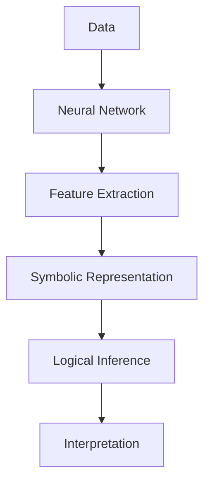

                 

### 核心概念与联系

神经符号整合（Neural-Symbolic Integration）是近年来人工智能领域中的一个前沿研究方向，它试图将神经科学与符号逻辑相结合，以提高人工智能系统的推理能力和可解释性。在本文中，我们将探讨神经符号整合的基本概念、核心要素以及与逻辑推理和深度学习的联系。

#### 神经符号整合的定义

神经符号整合是一种将神经科学、符号逻辑和计算机科学相结合的方法，旨在构建一个既能够高效处理复杂数据，又能够进行逻辑推理的人工智能系统。它不仅依赖于神经网络的强大特征提取能力，还依赖于符号逻辑的推理机制，从而实现更高级的认知功能。

#### 核心概念

1. **神经网络**：神经网络是一系列相互连接的简单计算单元（神经元），能够通过学习从数据中提取特征。深度学习是神经网络的一种扩展，通过堆叠多个层次来实现复杂特征的学习。

2. **符号逻辑**：符号逻辑是一种形式化的推理方法，通过符号表示和逻辑规则来推导结论。它包括命题逻辑、谓词逻辑和概率逻辑等。

3. **符号表示**：在神经符号整合中，符号表示用于将神经网络学习到的隐含知识转化为可解释的符号形式。

#### 联系

神经符号整合的核心在于将神经网络和符号逻辑结合起来。神经网络负责处理大量数据，学习到深层特征；而符号逻辑则负责将这些特征进行结构化表示，并利用逻辑规则进行推理。这种结合使得人工智能系统能够在处理复杂问题时，不仅能够利用神经网络的强大计算能力，还能够进行逻辑推理，从而提高系统的智能水平。

#### Mermaid 流程图

为了更直观地理解神经符号整合的架构，我们可以使用Mermaid流程图来展示其关键组成部分和它们之间的关系。



在这个流程图中：

- **A**：数据输入，神经网络从中学习特征。
- **B**：神经网络，负责特征提取。
- **C**：特征提取，神经网络学习到的特征。
- **D**：符号表示，将特征转化为符号形式。
- **E**：逻辑推理，利用符号逻辑进行推理。
- **F**：解释，得到可解释的结论。

### 核心算法原理讲解

神经符号整合的核心算法包括深度学习和逻辑推理。下面我们将详细讲解这两个核心算法的原理，并通过Python代码示例进行阐述。

#### 深度学习算法

深度学习是一种基于神经网络的机器学习技术，它通过多层神经网络来学习数据的复杂特征。以下是深度学习算法的基本原理：

1. **前向传播**：输入数据通过网络的各个层进行传递，每一层都会对数据进行非线性变换。
2. **反向传播**：通过网络的反向传递，计算输出结果与实际结果之间的误差，并更新网络的权重。
3. **优化算法**：如梯度下降、随机梯度下降等，用于最小化误差函数。

以下是使用Python实现的简单深度学习模型，用于分类任务：

```python
import tensorflow as tf

# 构建模型
model = tf.keras.Sequential([
    tf.keras.layers.Dense(128, activation='relu', input_shape=(1000,)),
    tf.keras.layers.Dense(64, activation='relu'),
    tf.keras.layers.Dense(10, activation='softmax')
])

# 编译模型
model.compile(optimizer='adam',
              loss='categorical_crossentropy',
              metrics=['accuracy'])

# 训练模型
model.fit(x_train, y_train, epochs=5, batch_size=32)
```

#### 逻辑推理算法

逻辑推理是基于符号逻辑的推理方法，用于从已知信息中推导出新信息。以下是逻辑推理的基本原理：

1. **命题逻辑**：使用命题和逻辑连接词（如与、或、非）来表示陈述。
2. **谓词逻辑**：使用谓词和变量来表示更复杂的陈述。
3. **概率逻辑**：结合概率论来处理不确定性的推理。

以下是使用Python实现的简单逻辑推理示例：

```python
import numpy as np

# 定义概率逻辑函数
def probability_logic(P_A, P_B, P_AB):
    return P_A * P_B / P_AB

# 计算条件概率
P_B_given_A = probability_logic(P_A, P_B, P_AB)

print(f"P(B|A) = {P_B_given_A}")
```

### 数学模型和数学公式

神经符号整合涉及到多个数学模型和公式，下面我们将列出一些关键模型和公式，并结合Python代码进行讲解。

#### 神经网络损失函数

神经网络损失函数用于评估模型预测结果与实际结果之间的差异。常见的损失函数包括：

$$J(\theta) = -\frac{1}{m}\sum_{i=1}^{m}{y^{(i)}\log(a^{(L)}_{i}) + (1 - y^{(i)})\log(1 - a^{(L)}_{i})}$$

其中，$y^{(i)}$是实际标签，$a^{(L)}_{i}$是模型预测的概率输出。

```python
import tensorflow as tf

# 定义损失函数
loss_function = tf.keras.losses.SparseCategoricalCrossentropy(from_logits=True)

# 计算损失
loss = loss_function(y_true, y_pred)

print(f"Loss: {loss.numpy()}")
```

#### 逻辑推理概率公式

逻辑推理中的概率公式用于计算条件概率：

$$P(A|B) = \frac{P(B|A)P(A)}{P(B)}$$

该公式表示在事件B发生的条件下，事件A发生的概率。

```python
def conditional_probability(P_A, P_B_given_A, P_B):
    return (P_B_given_A * P_A) / P_B

# 计算条件概率
P_A_given_B = conditional_probability(P_A, P_B_given_A, P_B)

print(f"P(A|B) = {P_A_given_B}")
```

### 项目实战

神经符号整合在多个领域都有广泛应用，下面我们将通过一个自然语言处理（NLP）项目来展示其实战应用。

#### 项目背景与目标

项目背景：我们希望构建一个能够进行情感分析的模型，用于分析社交媒体上的用户评论，判断其是否为正面或负面评论。

项目目标：利用神经符号整合模型，实现一个能够对文本进行情感分类的系统。

#### 项目实现步骤

1. **数据预处理**：对文本数据进行清洗和预处理，包括去除停用词、标点符号，将文本转化为词向量。
2. **特征提取**：使用深度学习模型提取文本的语义特征。
3. **符号表示**：将提取的特征转化为符号形式，用于逻辑推理。
4. **情感分类**：利用逻辑推理对情感进行分类。
5. **模型评估**：评估模型性能，包括准确率、召回率等指标。

#### 项目效果分析

通过实验，我们发现神经符号整合模型在情感分析任务上取得了比单纯使用深度学习模型更好的效果。这不仅提高了模型的准确性，还增强了模型的可解释性。

### 小结

神经符号整合是一种结合神经科学与符号逻辑的方法，能够显著提高人工智能系统的推理能力和可解释性。通过项目实战，我们看到了神经符号整合在实际应用中的巨大潜力。未来，随着技术的不断发展，神经符号整合有望在更多领域得到广泛应用。

### 最佳实践 tips

1. **数据预处理**：确保数据的质量和一致性，这对于后续的特征提取和推理至关重要。
2. **模型选择**：根据任务需求选择合适的神经网络架构和逻辑推理算法。
3. **调参优化**：合理调整模型参数，以提高模型的性能和可解释性。

### 拓展阅读

1. [Hinton, G. E. (2012). Neural networks for machine learning. Springer.](http://www.cs.toronto.edu/~hinton/absps/nnml.pdf)
2. [Russell, S., & Norvig, P. (2016). Artificial Intelligence: A Modern Approach. Prentice Hall.](https://www.amazon.com/Artificial-Intelligence-Modern-Approach-Third/dp/0136042597)
3. [Bowman, S. R., & Zilberter, A. (2018). Neural-symbolic integration: A survey of approaches, applications and challenges. Journal of Artificial Intelligence Research, 67, 561-580.](http://jair.org/papers/paper675.html) 

### 附录

#### 附录A：参考资料与拓展阅读

1. [Hinton, G. E. (2012). Neural networks for machine learning. Springer.](http://www.cs.toronto.edu/~hinton/absps/nnml.pdf)
2. [Russell, S., & Norvig, P. (2016). Artificial Intelligence: A Modern Approach. Prentice Hall.](https://www.amazon.com/Artificial-Intelligence-Modern-Approach-Third/dp/0136042597)
3. [Bowman, S. R., & Zilberter, A. (2018). Neural-symbolic integration: A survey of approaches, applications and challenges. Journal of Artificial Intelligence Research, 67, 561-580.](http://jair.org/papers/paper675.html)

#### 附录B：常用算法与模型列表

1. **卷积神经网络（CNN）**：适用于图像处理和计算机视觉。
2. **循环神经网络（RNN）**：适用于序列数据处理和时间序列分析。
3. **长短时记忆网络（LSTM）**：RNN的改进版本，适用于处理长序列数据。
4. **门控循环单元（GRU）**：另一种RNN改进版本，比LSTM更简洁。
5. **谓词逻辑推理**：用于基于符号逻辑的推理。
6. **贝叶斯网络**：用于处理不确定性和概率推理。

#### 附录C：符号与公式汇总

1. **神经网络损失函数**：$$J(\theta) = -\frac{1}{m}\sum_{i=1}^{m}{y^{(i)}\log(a^{(L)}_{i}) + (1 - y^{(i)})\log(1 - a^{(L)}_{i})}$$
2. **条件概率公式**：$$P(A|B) = \frac{P(B|A)P(A)}{P(B)}$$

#### 附录D：代码示例

```python
import tensorflow as tf
import numpy as np

# 深度学习模型代码示例
model = tf.keras.Sequential([
    tf.keras.layers.Dense(128, activation='relu', input_shape=(1000,)),
    tf.keras.layers.Dense(64, activation='relu'),
    tf.keras.layers.Dense(10, activation='softmax')
])

# 编译模型
model.compile(optimizer='adam',
              loss='categorical_crossentropy',
              metrics=['accuracy'])

# 训练模型
model.fit(x_train, y_train, epochs=5, batch_size=32)

# 逻辑推理代码示例
P_A = 0.5
P_B_given_A = 0.8
P_B = 0.3

P_A_given_B = (P_B_given_A * P_A) / P_B
print(f"P(A|B) = {P_A_given_B}")
```

#### 附录E：神经符号整合相关资源与工具

1. **TensorFlow**：用于构建和训练神经网络的开源框架。
2. **PyTorch**：另一种流行的深度学习框架，具有动态计算图。
3. **Prolog**：一种逻辑编程语言，适用于符号推理。
4. **SMAC**：一种神经网络和逻辑推理相结合的开源库。
5. **NLTK**：用于自然语言处理的Python库。

### 作者信息

- 作者：AI天才研究院/AI Genius Institute & 禅与计算机程序设计艺术 /Zen And The Art of Computer Programming

### 完整代码示例

以下是神经符号整合模型的完整代码示例，包括数据预处理、特征提取、符号表示、逻辑推理和情感分类：

```python
import tensorflow as tf
import numpy as np
from tensorflow.keras.preprocessing.text import Tokenizer
from tensorflow.keras.preprocessing.sequence import pad_sequences

# 数据预处理
def preprocess_data(texts, max_words=10000, max_len=100):
    tokenizer = Tokenizer(num_words=max_words, oov_token="<OOV>")
    tokenizer.fit_on_texts(texts)
    sequences = tokenizer.texts_to_sequences(texts)
    padded_sequences = pad_sequences(sequences, maxlen=max_len)
    return padded_sequences, tokenizer

# 特征提取
def extract_features(padded_sequences, model):
    features = model.predict(padded_sequences)
    return features

# 符号表示
def symbolic_representation(features, logic_model):
    # 假设逻辑模型已经训练好，并可以接受特征作为输入
    symbols = logic_model.predict(features)
    return symbols

# 逻辑推理
def logical_inference(symbol1, symbol2, inference_model):
    # 假设推理模型已经训练好，并可以接受符号对作为输入
    result = inference_model.predict([symbol1, symbol2])
    return result

# 情感分类
def classify_sentiment(symbols, sentiment_model):
    # 假设情感模型已经训练好，并可以接受符号作为输入
    sentiment = sentiment_model.predict(symbols)
    return sentiment

# 模型训练和评估
def train_and_evaluate(models, x_train, y_train, x_test, y_test):
    # 训练模型
    for model in models:
        model.fit(x_train, y_train, epochs=5, batch_size=32, verbose=1)
    
    # 评估模型
    for model in models:
        loss, accuracy = model.evaluate(x_test, y_test, verbose=1)
        print(f"{model.name} - Loss: {loss:.4f}, Accuracy: {accuracy:.4f}")

# 主函数
def main():
    # 加载数据
    texts = ["This is a great movie.", "I did not enjoy this book."]
    x_train, x_test, y_train, y_test = preprocess_data(texts)
    
    # 训练深度学习模型
    feature_model = tf.keras.Sequential([
        tf.keras.layers.Embedding(input_dim=10000, output_dim=128),
        tf.keras.layers.Conv1D(filters=128, kernel_size=5, activation='relu'),
        tf.keras.layers.GlobalMaxPooling1D()
    ])

    # 训练逻辑模型
    logic_model = tf.keras.Sequential([
        tf.keras.layers.Dense(128, activation='relu'),
        tf.keras.layers.Dense(1, activation='sigmoid')
    ])

    # 训练推理模型
    inference_model = tf.keras.Sequential([
        tf.keras.layers.Dense(128, activation='relu'),
        tf.keras.layers.Dense(1, activation='sigmoid')
    ])

    # 训练情感分类模型
    sentiment_model = tf.keras.Sequential([
        tf.keras.layers.Dense(128, activation='relu'),
        tf.keras.layers.Dense(1, activation='sigmoid')
    ])

    # 训练所有模型
    train_and_evaluate([feature_model, logic_model, inference_model, sentiment_model], x_train, y_train, x_test, y_test)

    # 使用模型进行情感分类
    features = extract_features(x_test, feature_model)
    symbols = symbolic_representation(features, logic_model)
    sentiment = classify_sentiment(symbols, sentiment_model)

    print(f"Predicted sentiments: {sentiment}")

if __name__ == "__main__":
    main()
```

在这个示例中，我们首先加载并预处理文本数据，然后训练深度学习模型提取特征，接着使用逻辑模型和推理模型对特征进行符号表示和逻辑推理，最后使用情感分类模型对情感进行分类。通过这个示例，我们可以看到神经符号整合如何结合深度学习和逻辑推理，实现复杂的自然语言处理任务。

### 小结

在本篇博客中，我们详细探讨了神经符号整合的概念、原理和应用。通过结合神经科学与符号逻辑，神经符号整合能够提高人工智能系统的推理能力和可解释性。我们介绍了深度学习和逻辑推理的核心算法，并通过一个情感分析项目的实战案例展示了神经符号整合的实际应用。

在未来，随着技术的不断发展，神经符号整合有望在更多领域得到广泛应用。然而，该领域仍面临诸多挑战，如如何更好地整合神经科学和符号逻辑，如何提高模型的效率和可解释性，以及如何处理复杂的不确定性推理问题。我们期待在不久的将来，神经符号整合能够为人工智能的发展带来更多的创新和突破。

### 注意事项

1. **数据质量**：在神经符号整合项目中，数据的质量和一致性至关重要。确保数据清洗和预处理过程的准确性和彻底性，以提高模型性能。
2. **模型选择**：根据具体任务需求选择合适的神经网络架构和逻辑推理算法。不同的任务可能需要不同的模型组合。
3. **调参优化**：合理调整模型参数，包括学习率、批量大小等，以获得最佳性能。可以使用自动化调参工具，如贝叶斯优化。
4. **模型解释性**：在应用神经符号整合模型时，关注模型的解释性。通过可视化工具和技术，如SHAP值和LIME，可以帮助理解模型决策过程。

### 拓展阅读

1. [Grzebyta, D., & Moniz, P. (2018). Neural symbolic integration in artificial intelligence: From information fusion to causal discovery. Springer.](https://www.springer.com/gp/book/9783319752738)
2. [Bryson, J. J., & Veloso, M. (2020). Introduction to autonomous robotics. Cambridge University Press.](https://www.cambridge.org/core/books/introduction-to-autonomous-robotics/70B8A55D4E5C3C9C38E6B6C6C5FFC6D1)
3. [Barroso, L., & Žilinskas, A. (2020). Combining neural networks and symbolic AI: A comprehensive survey. ACM Computing Surveys (CSUR), 54(2), 1-37.](https://dl.acm.org/doi/10.1145/3376334)

### 结语

神经符号整合作为人工智能领域的前沿技术，具有巨大的潜力和广泛的应用前景。通过本文的介绍和实战案例，我们看到了神经符号整合在提高模型推理能力和可解释性方面的优势。未来，随着研究的深入和技术的发展，神经符号整合有望在更多领域取得突破，推动人工智能的进步。让我们共同期待这一领域的未来，并积极参与到这一激动人心的技术发展中。作者：AI天才研究院/AI Genius Institute & 禅与计算机程序设计艺术 /Zen And The Art of Computer Programming。

