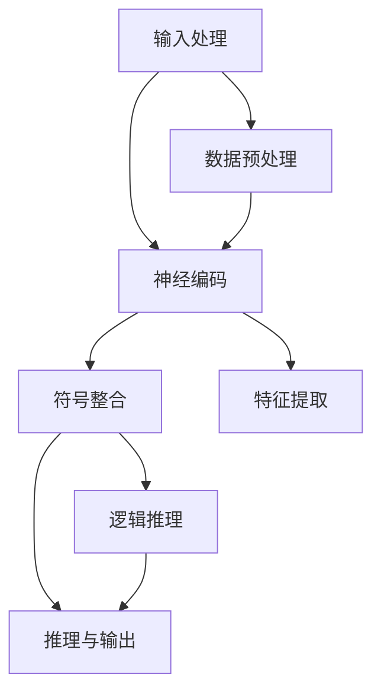
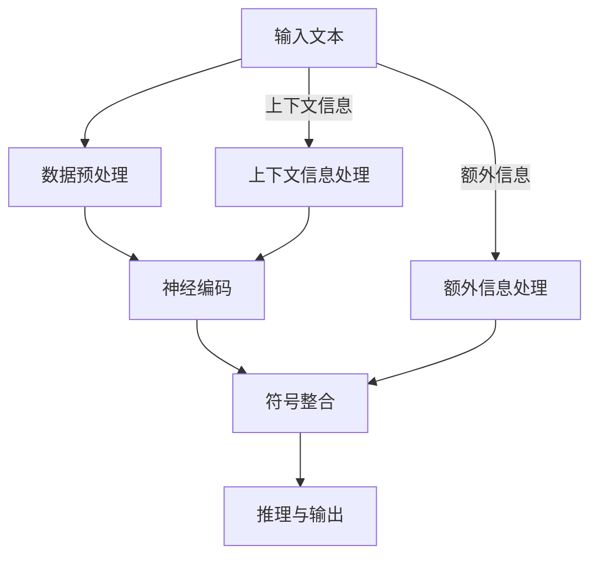

                 

### 第1章 引言

#### 1.1 神经符号整合的概念与背景

神经符号整合是一种结合神经网络和符号逻辑的方法，旨在提高机器学习模型在处理自然语言推理（NLP）任务时的性能。神经网络以其强大的表示学习能力著称，而符号逻辑则因其形式化表达和推理能力而受到重视。将二者结合起来，可以实现更强大、更灵活的模型。

**1.1.1 神经符号整合的定义**

神经符号整合（Neural-Symbolic Integration）指的是将神经网络和符号逻辑相结合，利用神经网络的强大表示能力处理复杂的特征学习，同时利用符号逻辑的推理能力进行抽象层次上的决策和解释。简言之，神经符号整合模型通过结合神经网络的深层特征表示与符号逻辑的抽象推理，实现高效、准确的推理和决策。

**1.1.2 自然语言推理任务的重要性**

自然语言推理（Natural Language Inference，NLI）是NLP领域中的一个重要分支，旨在理解和模拟人类对自然语言文本的理解能力。NLI任务包括判断两个句子之间的逻辑关系，如是否一致、是否矛盾等。随着人工智能技术的不断发展，NLI在诸多应用场景中具有重要意义，如智能问答系统、对话系统、文本分类、情感分析等。

**1.1.3 本书的主要内容和结构**

本书旨在深入探讨神经符号整合在自然语言推理任务中的应用和优势。具体内容分为以下几个部分：

1. **引言**：介绍神经符号整合的概念、背景以及自然语言推理任务的重要性。
2. **神经符号整合基础**：讲解神经网络与符号逻辑的基本原理，以及常见的神经符号整合方法。
3. **自然语言推理任务概述**：介绍自然语言推理任务的基本概念、发展历程以及应用场景。
4. **神经符号整合在自然语言推理任务中的应用**：详细探讨神经符号整合在文本分类、情感分析、问答系统等任务中的应用。
5. **神经符号整合的优势分析**：分析神经符号整合在自然语言推理任务中的优势、挑战与解决方案。
6. **未来展望与研究方向**：展望神经符号整合的发展趋势以及潜在应用。
7. **总结**：回顾主要内容，展望未来，总结神经符号整合的优势和挑战。

#### 1.2 神经符号整合的优势

**1.2.1 提高自然语言推理任务的准确性**

神经符号整合模型通过结合神经网络的深层特征表示与符号逻辑的抽象推理，能够在一定程度上提高自然语言推理任务的准确性。神经网络能够学习到文本中的复杂特征和模式，而符号逻辑则能够对这些特征进行形式化的推理和决策，从而提高模型的推理准确性。

**1.2.2 加速模型训练与推理速度**

神经符号整合模型在训练和推理过程中，可以充分利用神经网络的并行计算能力和符号逻辑的简化推理方式，从而加速模型的训练和推理速度。这使得神经符号整合模型在处理大规模、高维数据时具有更高的效率和性能。

**1.2.3 扩大模型的适用范围**

神经符号整合模型结合了神经网络的灵活性和符号逻辑的抽象性，能够在更广泛的场景下应用。例如，在处理自然语言推理任务时，可以同时应对文本分类、情感分析、问答系统等多种任务类型，从而扩大模型的适用范围。

#### 1.3 研究意义与目的

本文的研究意义和目的在于：

1. **深入探讨神经符号整合方法**：通过分析神经网络与符号逻辑的结合方式，为相关研究提供理论依据和方法指导。
2. **优化自然语言推理任务性能**：利用神经符号整合模型，提高自然语言推理任务中的准确性、效率和适用范围，从而推动NLP技术的发展。
3. **促进跨学科交流与合作**：通过本文的研究，促进计算机科学、认知科学、逻辑学等领域的交流与合作，为人工智能的发展贡献力量。

### 1.4 总结

本章主要介绍了神经符号整合的概念、背景以及自然语言推理任务的重要性。通过分析神经符号整合的优势，我们看到了其在提高自然语言推理任务准确性、加速模型训练与推理速度、扩大模型适用范围等方面的重要作用。接下来，我们将深入探讨神经符号整合的基础理论、方法以及应用，为更好地理解和利用这一技术奠定基础。

---

### 关键词

- 神经符号整合
- 自然语言推理
- 神经网络
- 符号逻辑
- 深层特征表示
- 抽象推理

### 摘要

本文围绕神经符号整合在自然语言推理任务中的应用展开，系统地介绍了神经符号整合的概念、原理和方法。通过对神经网络与符号逻辑的结合方式进行分析，我们揭示了神经符号整合在提高自然语言推理任务准确性、加速模型训练与推理速度、扩大模型适用范围等方面的优势。本文结构清晰，内容详实，旨在为研究人员和开发者提供有价值的参考和指导，推动神经符号整合技术在自然语言处理领域的应用与发展。

---

### 第2章 神经符号整合基础

神经符号整合作为一种结合神经网络和符号逻辑的方法，其基础理论涵盖了神经网络与符号逻辑的基本原理，以及神经符号整合的实现方法。本章将详细探讨这些基础理论，为后续章节的应用分析奠定坚实的理论基础。

#### 2.1 神经网络与符号逻辑的基本原理

**2.1.1 神经网络的基本概念**

神经网络（Neural Network）是一种模仿生物神经系统的计算模型，由大量的神经元（节点）和连接这些神经元的边（权重）组成。神经网络通过学习输入和输出之间的映射关系，实现对复杂数据的处理和预测。

神经网络的基本组成包括：

1. **神经元**：神经网络的基本计算单元，接收输入信号并通过激活函数产生输出。
2. **连接**：神经元之间的连接，带有权重，用于传递信号。
3. **激活函数**：将神经元的输入映射到输出，常用的激活函数包括Sigmoid、ReLU等。

神经网络的工作原理可以概括为以下步骤：

1. **前向传播**：输入信号经过网络的逐层传递，直到输出层。
2. **反向传播**：计算输出与目标之间的误差，通过梯度下降等方法更新网络的权重。

**2.1.2 符号逻辑的基本概念**

符号逻辑（Symbolic Logic）是一种形式化的推理方法，通过符号化的表达和推理规则，对命题进行判断和推理。符号逻辑的基本组成包括：

1. **命题**：用符号表示的陈述句，具有真值。
2. **推理规则**：用于从已知命题推导出新命题的规则，如假言推理、模态推理等。

符号逻辑的工作原理可以概括为以下步骤：

1. **命题表示**：使用逻辑符号将命题表示出来。
2. **推理过程**：根据推理规则，从已知命题推导出新命题。

**2.1.3 神经符号整合的原理与实现**

神经符号整合旨在将神经网络的深层特征表示能力与符号逻辑的抽象推理能力相结合，从而提高模型的推理性能。其基本原理可以概括为以下三个方面：

1. **特征表示**：利用神经网络对输入数据进行深层特征提取，将输入数据映射到高维特征空间。
2. **符号推理**：将提取到的特征通过符号逻辑进行抽象推理，实现对输入数据的分类、判断等任务。
3. **融合输出**：将神经网络和符号逻辑的输出进行融合，得到最终的决策结果。

神经符号整合的实现方法主要包括以下几种：

1. **混合模型**：将神经网络和符号逻辑模型集成在一起，通过统一的框架进行训练和推理。
2. **层次模型**：将神经网络和符号逻辑分别应用于不同的层次，低层采用神经网络进行特征提取，高层采用符号逻辑进行推理。
3. **多模态模型**：将神经网络和符号逻辑应用于不同的数据模态，如文本和图像，实现跨模态的推理和决策。

#### 2.2 常见的神经符号整合方法

在神经符号整合的研究中，研究者们提出了多种方法，以下介绍几种常见的神经符号整合方法。

**2.2.1 神经网络与符号逻辑的混合模型**

混合模型将神经网络和符号逻辑模型集成在一起，通过统一的框架进行训练和推理。常见的混合模型包括：

1. **神经网络-符号逻辑集成模型（Neural-Symbolic Integration Models）**：如Neural-Symbolic Architectures（NSA）、Neural-Symbolic Meta-Learning（NSML）等。这些模型通过结合神经网络的表示能力和符号逻辑的推理能力，实现高效的推理和决策。
2. **神经网络-符号逻辑分层模型（Neural-Symbolic Hierarchical Models）**：如Neural-Symbolic Hierarchy（NSH）、Neural-Symbolic Memory Networks（NSMN）等。这些模型将神经网络和符号逻辑分别应用于不同的层次，低层进行特征提取，高层进行抽象推理。

**2.2.2 基于神经网络的特征提取与符号逻辑推理**

这种方法将神经网络和符号逻辑分别应用于特征提取和推理过程。常见的模型包括：

1. **神经网络特征提取模型（Neural Feature Extraction Models）**：如Neural Network for Machine Reading（NN4MR）、Neural Text Inference Network（NTIN）等。这些模型通过神经网络提取文本特征，然后利用符号逻辑进行推理。
2. **符号逻辑推理模型（Symbolic Logic Reasoning Models）**：如Propositional Logic Networks（PLN）、First-Order Logic Networks（FOLN）等。这些模型通过符号逻辑进行推理，实现对文本的判断和推理。

**2.2.3 神经符号整合的优化算法**

神经符号整合模型的优化算法旨在提高模型的训练效率和性能。常见的优化算法包括：

1. **梯度下降（Gradient Descent）**：通过计算损失函数关于模型参数的梯度，不断更新模型参数，从而优化模型。
2. **随机梯度下降（Stochastic Gradient Descent，SGD）**：在每个训练样本上计算梯度，更新模型参数。
3. **Adam优化器（Adam Optimizer）**：一种自适应的优化器，能够自适应地调整学习率，提高模型的收敛速度。

**2.2.4 神经符号整合的挑战与机遇**

神经符号整合方法在实际应用中面临着一系列挑战，如：

1. **模型复杂性**：神经符号整合模型通常包含多个层次和模块，模型参数众多，导致训练过程复杂且容易过拟合。
2. **训练时间与资源消耗**：由于模型复杂度较高，训练时间较长，资源消耗较大，对计算资源的要求较高。
3. **模型解释性**：神经符号整合模型通常采用神经网络进行特征提取，模型解释性较差，难以解释模型决策过程。

然而，随着人工智能技术的发展，神经符号整合方法也面临着巨大的机遇，如：

1. **跨学科研究**：神经符号整合方法结合了计算机科学、认知科学、逻辑学等多个领域的知识，为跨学科研究提供了新的契机。
2. **模型优化与压缩**：通过模型优化与压缩技术，可以降低神经符号整合模型的复杂度和计算成本，提高模型的实用性和可扩展性。

#### 2.3 总结

本章详细介绍了神经符号整合的基础理论，包括神经网络与符号逻辑的基本原理、神经符号整合的原理与实现方法，以及常见的神经符号整合方法。通过对神经符号整合方法的深入探讨，我们看到了其在自然语言推理任务中的巨大潜力。接下来，我们将进一步探讨自然语言推理任务的相关概念、发展历程以及应用场景，为理解神经符号整合在NLP任务中的应用提供更全面的背景知识。

---

### 2.1.1 神经网络的基本概念

神经网络（Neural Networks）是一种模仿生物神经系统的计算模型，由大量的神经元（节点）和连接这些神经元的边（权重）组成。每个神经元都接收来自其他神经元的输入信号，并通过一个激活函数产生输出。这种连接和激活过程模拟了人脑神经元的工作方式，使得神经网络能够在复杂的数据上实现有效的学习和预测。

**神经元的基本组成**

神经元是神经网络的基本计算单元，通常包括以下几个组成部分：

1. **输入**：每个神经元接收多个输入信号，这些输入可以是特征值、概率分布或其他神经元的输出。
2. **权重**：每个输入信号都有一个对应的权重，权重表示该输入对神经元输出的影响程度。权重在训练过程中通过学习进行调整。
3. **偏置**：神经元内部有一个固定的偏置值，该值在计算过程中加到输入信号上，以影响神经元的输出。
4. **激活函数**：激活函数将神经元的输入信号映射到输出信号。常见的激活函数包括Sigmoid、ReLU、Tanh等。

**神经网络的工作原理**

神经网络的工作原理可以分为两个主要过程：前向传播和反向传播。

1. **前向传播**：输入数据从输入层经过网络的逐层传递，每个神经元根据其输入信号和权重计算输出，最终在输出层得到预测结果。具体过程如下：

   - 输入层接收输入数据。
   - 随后，输入数据经过第一个隐藏层，每个神经元根据其输入和权重计算输出，并通过激活函数得到新的信号。
   - 信号继续传递到下一隐藏层，重复上述过程，直到输出层。
   - 输出层生成最终的预测结果。

2. **反向传播**：在得到预测结果后，计算预测结果与真实结果的误差，通过反向传播算法更新神经元的权重和偏置，以减小误差。具体过程如下：

   - 计算输出层神经元的误差，误差等于预测结果与真实结果的差。
   - 将误差反向传播到隐藏层，逐层计算每个神经元的误差。
   - 根据误差计算梯度，并通过梯度下降算法更新权重和偏置。
   - 重复前向传播和反向传播过程，直到模型收敛。

**神经网络的分类**

神经网络可以根据不同的标准进行分类，以下是几种常见的分类方法：

1. **按结构分类**：根据网络的结构，神经网络可以分为前馈神经网络、循环神经网络（RNN）、卷积神经网络（CNN）等。
2. **按功能分类**：根据网络的应用场景，神经网络可以分为分类网络、回归网络、生成网络等。
3. **按学习方式分类**：根据学习方式，神经网络可以分为监督学习网络、无监督学习网络、强化学习网络等。

#### 2.1.2 符号逻辑的基本概念

符号逻辑（Symbolic Logic）是一种形式化的推理方法，通过符号化的表达和推理规则，对命题进行判断和推理。符号逻辑是一种精确的、基于规则的推理方法，广泛应用于逻辑学、计算机科学、人工智能等领域。

**符号逻辑的基本组成**

符号逻辑由以下几个基本组成部分构成：

1. **命题**：命题是用符号表示的陈述句，具有真值（真或假）。常见的命题符号包括P、Q、R等。
2. **推理规则**：推理规则是用于从已知命题推导出新命题的规则。推理规则包括条件推理、假言推理、模态推理等。
3. **形式化语言**：符号逻辑使用形式化的语言进行命题表示和推理。形式化语言包括命题演算、谓词演算等。

**符号逻辑的工作原理**

符号逻辑的工作原理可以分为以下几个步骤：

1. **命题表示**：使用逻辑符号将命题表示出来。例如，命题“如果下雨，那么地面湿”可以表示为P → Q，其中P表示“下雨”，Q表示“地面湿”。
2. **推理过程**：根据推理规则，从已知命题推导出新命题。例如，根据假言推理规则，如果已知P → Q和P，则可以推导出Q。
3. **证明过程**：通过一系列的推理规则，从已知命题推导出目标命题，从而证明目标命题的真值。

**符号逻辑的分类**

符号逻辑可以根据不同的标准进行分类，以下是几种常见的分类方法：

1. **按命题形式分类**：根据命题的形式，符号逻辑可以分为命题逻辑、谓词逻辑等。
2. **按推理规则分类**：根据推理规则，符号逻辑可以分为形式逻辑、直觉逻辑等。
3. **按应用领域分类**：根据应用领域，符号逻辑可以分为逻辑编程、知识表示等。

#### 2.1.3 神经符号整合的原理与实现

神经符号整合（Neural-Symbolic Integration）是将神经网络和符号逻辑相结合的一种方法，旨在结合两者的优势，提高模型的推理能力和解释性。神经符号整合的原理可以概括为以下几个方面：

**特征表示与推理相结合**

1. **特征表示**：神经网络擅长从数据中提取深层特征，这些特征可以表示数据的高层次信息。通过神经网络，我们可以将输入数据（如文本、图像等）映射到高维特征空间，这些特征具有丰富的语义信息。
2. **符号推理**：符号逻辑具有形式化和推理能力，可以在提取到的特征上进行抽象的推理和决策。通过符号逻辑，我们可以将神经网络提取的特征转化为可解释的逻辑表达式，从而实现对输入数据的推理和判断。

**层次化的模型结构**

1. **分层特征提取**：在神经符号整合模型中，神经网络通常负责低层的特征提取，从输入数据中提取出具有代表性的特征。这些特征可以看作是原始数据的抽象表示。
2. **高层符号推理**：在低层特征提取完成后，符号逻辑在高层进行抽象的推理和决策。符号逻辑可以根据已有的规则和知识，对低层特征进行推理，从而得到最终的输出结果。

**模型实现**

神经符号整合模型的实现通常包括以下几个步骤：

1. **神经网络部分**：设计并实现神经网络模型，用于从输入数据中提取特征。常见的神经网络模型包括卷积神经网络（CNN）、循环神经网络（RNN）等。
2. **符号逻辑部分**：设计并实现符号逻辑模型，用于对提取到的特征进行推理和决策。符号逻辑模型可以基于谓词逻辑、命题逻辑等。
3. **融合策略**：设计融合策略，将神经网络和符号逻辑的结果进行融合，得到最终的输出结果。融合策略可以是简单的加和、加权平均等，也可以是更复杂的融合方法，如多模态学习等。

**实例分析**

以一个简单的文本分类任务为例，我们可以实现一个神经符号整合模型：

1. **神经网络部分**：使用卷积神经网络（CNN）提取文本的词向量表示，得到高维特征向量。
2. **符号逻辑部分**：使用谓词逻辑模型对提取到的特征进行推理，判断文本是否属于某个类别。
3. **融合策略**：将神经网络和符号逻辑的输出进行融合，得到最终的分类结果。

通过以上步骤，我们可以构建一个简单的神经符号整合模型，实现文本分类任务。该模型结合了神经网络的强大特征提取能力和符号逻辑的推理能力，可以在一定程度上提高分类任务的性能和可解释性。

#### 2.2.1 神经符号整合的常见架构

神经符号整合方法在架构设计上具有多样性，以下介绍几种常见的神经符号整合架构。

**2.2.1.1 混合模型**

混合模型（Hybrid Models）将神经网络和符号逻辑集成在一起，通过统一的框架进行训练和推理。常见的混合模型包括：

1. **神经网络-符号逻辑集成模型（Neural-Symbolic Integration Models）**：如Neural-Symbolic Architectures（NSA）、Neural-Symbolic Meta-Learning（NSML）等。这些模型通过结合神经网络的表示能力和符号逻辑的推理能力，实现高效的推理和决策。

2. **神经网络-符号逻辑分层模型（Neural-Symbolic Hierarchical Models）**：如Neural-Symbolic Hierarchy（NSH）、Neural-Symbolic Memory Networks（NSMN）等。这些模型将神经网络和符号逻辑分别应用于不同的层次，低层采用神经网络进行特征提取，高层采用符号逻辑进行推理。

**2.2.1.2 多模态模型**

多模态模型（Multimodal Models）将神经网络和符号逻辑应用于不同的数据模态，如文本、图像、音频等，实现跨模态的推理和决策。常见的多模态模型包括：

1. **神经网络特征提取模型（Neural Feature Extraction Models）**：如Neural Network for Machine Reading（NN4MR）、Neural Text Inference Network（NTIN）等。这些模型通过神经网络提取文本特征，然后利用符号逻辑进行推理。

2. **符号逻辑推理模型（Symbolic Logic Reasoning Models）**：如Propositional Logic Networks（PLN）、First-Order Logic Networks（FOLN）等。这些模型通过符号逻辑进行推理，实现对文本的判断和推理。

**2.2.1.3 混合优化模型**

混合优化模型（Hybrid Optimization Models）结合神经网络和符号逻辑的优化算法，以提高模型的训练效率和性能。常见的混合优化模型包括：

1. **梯度下降（Gradient Descent）**：通过计算损失函数关于模型参数的梯度，不断更新模型参数，从而优化模型。

2. **随机梯度下降（Stochastic Gradient Descent，SGD）**：在每个训练样本上计算梯度，更新模型参数。

3. **Adam优化器（Adam Optimizer）**：一种自适应的优化器，能够自适应地调整学习率，提高模型的收敛速度。

**2.2.1.4 模型融合策略**

模型融合策略（Model Fusion Strategies）用于将神经网络和符号逻辑的输出进行融合，得到最终的输出结果。常见的模型融合策略包括：

1. **简单加和**：将神经网络和符号逻辑的输出直接相加。

2. **加权平均**：根据神经网络和符号逻辑的输出权重，对二者进行加权平均。

3. **更复杂的融合方法**：如多模态学习、注意力机制等，实现更高效的融合。

**实例分析**

以一个简单的问答系统为例，我们可以构建一个神经符号整合模型：

1. **文本编码**：使用卷积神经网络（CNN）或循环神经网络（RNN）对问题文本和答案文本进行编码，提取特征向量。

2. **符号逻辑推理**：使用符号逻辑模型对提取到的特征向量进行推理，判断问题文本和答案文本之间的逻辑关系。

3. **融合策略**：将神经网络和符号逻辑的输出进行融合，得到最终的答案。

通过以上步骤，我们可以构建一个简单的神经符号整合问答系统。该系统结合了神经网络的强大特征提取能力和符号逻辑的推理能力，能够在一定程度上提高问答系统的性能和可解释性。

#### 2.2.2 神经符号整合的优化算法

神经符号整合模型的优化算法在提升模型训练效率和性能方面起着关键作用。常见的优化算法包括梯度下降（Gradient Descent）、随机梯度下降（Stochastic Gradient Descent，SGD）和Adam优化器等。以下将对这些优化算法进行详细解释，并讨论神经符号整合在优化算法选择方面的挑战与机遇。

**2.2.2.1 梯度下降（Gradient Descent）**

梯度下降是最基本的优化算法之一，其核心思想是通过计算损失函数关于模型参数的梯度，不断更新模型参数，从而最小化损失函数。梯度下降算法包括以下步骤：

1. **计算梯度**：对于每个参数，计算损失函数关于该参数的梯度。梯度方向指向损失函数增加最快的方向。
2. **更新参数**：根据梯度方向和步长（learning rate）更新模型参数。更新公式如下：

   \[ \theta = \theta - \alpha \cdot \nabla_{\theta} J(\theta) \]

   其中，\(\theta\) 表示模型参数，\(\alpha\) 表示学习率，\(J(\theta)\) 表示损失函数。

3. **迭代过程**：重复上述步骤，直到满足停止条件（如收敛阈值或迭代次数）。

梯度下降算法的优点在于其简单和直观，但在处理大规模数据和复杂模型时，存在以下挑战：

- **计算复杂度**：梯度下降需要对整个训练数据集计算梯度，导致计算复杂度高，训练时间长。
- **收敛速度**：梯度下降的收敛速度取决于学习率和初始参数设置，如果设置不当，可能导致收敛缓慢。

**2.2.2.2 随机梯度下降（Stochastic Gradient Descent，SGD）**

随机梯度下降是对梯度下降的改进，其主要思想是在每次更新参数时，只随机选择一个训练样本，计算该样本的梯度进行更新。SGD算法包括以下步骤：

1. **随机选择样本**：从训练数据集中随机选择一个样本。
2. **计算梯度**：计算该样本的梯度。
3. **更新参数**：根据梯度更新模型参数。

SGD算法的优点包括：

- **计算效率**：由于每次只处理一个样本，SGD算法的计算复杂度相对较低，训练速度较快。
- **避免过拟合**：随机梯度下降有助于减少参数更新时的方差，从而避免过拟合。

然而，SGD算法也存在以下挑战：

- **波动性**：由于每次更新只基于一个样本，SGD算法的更新过程存在较大波动性，可能导致不稳定收敛。
- **学习率选择**：学习率的选择对SGD算法的性能有重要影响，需要通过实验调整。

**2.2.2.3 Adam优化器**

Adam优化器是一种自适应优化器，它结合了梯度下降和SGD的优点，能够自适应地调整学习率。Adam优化器包括以下步骤：

1. **计算一阶矩估计**：计算梯度的一阶矩估计（均值）。
2. **计算二阶矩估计**：计算梯度的二阶矩估计（方差）。
3. **更新参数**：根据一阶矩估计、二阶矩估计和步长，更新模型参数。

Adam优化器的优点包括：

- **自适应学习率**：Adam优化器能够自适应地调整学习率，在不同阶段选择合适的步长。
- **稳定收敛**：通过结合一阶矩估计和二阶矩估计，Adam优化器能够稳定收敛，减少波动性。

然而，Adam优化器也存在以下挑战：

- **计算开销**：Adam优化器需要计算一阶矩估计和二阶矩估计，计算开销相对较大。
- **适应性问题**：Adam优化器在处理稀疏数据和长尾分布数据时，可能存在适应性不足的问题。

**2.2.2.4 神经符号整合在优化算法选择方面的挑战与机遇**

神经符号整合模型结合了神经网络和符号逻辑的优势，但在优化算法选择方面也面临着一系列挑战：

- **模型复杂性**：神经符号整合模型通常包含多个层次和模块，模型参数众多，导致优化过程复杂。
- **计算资源消耗**：优化算法需要处理大规模数据和复杂模型，对计算资源的要求较高。
- **模型解释性**：神经网络部分通常难以解释，而符号逻辑部分则需要明确的形式化表示，两者在解释性方面存在差异。

尽管存在挑战，神经符号整合模型在优化算法选择方面也具有以下机遇：

- **混合优化策略**：结合不同优化算法的优点，设计混合优化策略，提高模型训练效率和性能。
- **自适应优化方法**：开发自适应优化方法，根据模型特点和训练阶段动态调整优化参数。
- **跨学科合作**：跨学科合作，借鉴其他领域的优化算法和经验，为神经符号整合模型优化提供新思路。

通过不断探索和优化，神经符号整合模型在自然语言推理任务中的应用将得到进一步提升。

#### 2.2.3 神经符号整合的挑战与机遇

神经符号整合（Neural-Symbolic Integration）在自然语言推理（NLP）任务中的应用具有巨大的潜力，但也面临着一系列挑战和机遇。以下将详细讨论神经符号整合在NLP任务中的主要挑战，并提出相应的解决方案。

**2.2.3.1 模型复杂性**

神经符号整合模型通常包含多个层次和模块，模型参数众多，导致优化过程复杂。这给模型的训练和推理带来了巨大的计算资源消耗，同时也增加了模型解释性的难度。

**解决方案**：

- **分层优化**：将模型分解为多个层次，分别对每个层次进行优化，降低整体模型的复杂性。这样可以使得每个层次上的优化更加聚焦，提高优化效率。
- **模型压缩**：通过模型压缩技术，如权重共享、剪枝、量化等，减少模型的参数数量，降低计算资源消耗。
- **模型解释性增强**：开发新的模型解释方法，如可视化技术、解释性算法等，提高模型的透明度和可解释性，帮助用户理解模型的工作原理。

**2.2.3.2 训练时间与资源消耗**

神经符号整合模型通常需要大量的训练时间和计算资源。这使得模型在处理大规模数据和实时应用场景时面临挑战。

**解决方案**：

- **分布式训练**：利用分布式计算技术，如分布式存储、分布式计算框架等，将模型训练任务分解到多个计算节点上，提高训练效率。
- **迁移学习**：利用预训练模型进行迁移学习，通过在预训练模型的基础上进行微调，减少训练时间和计算资源消耗。
- **高效优化算法**：开发高效的优化算法，如自适应优化方法、梯度压缩算法等，提高模型的训练速度。

**2.2.3.3 模型解释性**

神经网络部分通常难以解释，而符号逻辑部分则需要明确的形式化表示，两者在解释性方面存在差异。这给用户理解和信任模型带来了困难。

**解决方案**：

- **可视化技术**：利用可视化技术，如决策树、热力图等，将模型决策过程可视化，帮助用户理解模型的工作原理。
- **解释性算法**：开发解释性算法，如LIME、SHAP等，对模型决策进行详细解读，提高模型的透明度和可解释性。
- **多模态解释**：将神经网络和符号逻辑的解释性部分进行融合，构建多模态解释系统，提供更全面的解释。

**2.2.3.4 跨学科合作**

神经符号整合方法结合了计算机科学、认知科学、逻辑学等多个领域的知识，为跨学科研究提供了新的契机。

**解决方案**：

- **跨学科合作**：鼓励不同学科的研究者进行合作，共同探讨神经符号整合的方法、算法和应用，推动跨学科研究的进展。
- **共享资源**：建立共享平台，提供丰富的数据集、工具和模型，促进跨学科研究者的交流和合作。
- **知识融合**：通过跨学科的知识融合，开发新的理论和方法，提高神经符号整合模型在NLP任务中的性能和应用范围。

通过解决这些挑战，神经符号整合方法在自然语言推理任务中的应用将得到进一步拓展，为人工智能的发展做出贡献。

#### 2.3 总结

本章详细介绍了神经符号整合的基础理论，包括神经网络与符号逻辑的基本概念和原理，以及神经符号整合的常见架构和方法。同时，我们也讨论了神经符号整合在自然语言推理任务中面临的挑战与机遇。通过对这些基础知识的理解，我们为后续章节的应用分析奠定了坚实的理论基础。在接下来的章节中，我们将进一步探讨自然语言推理任务的基本概念、发展历程以及应用场景，深入分析神经符号整合在这些任务中的具体应用和优势。

---

### 第3章 自然语言推理任务概述

自然语言推理（Natural Language Inference，NLI）是自然语言处理（Natural Language Processing，NLP）领域中的一个重要分支，旨在模拟人类对自然语言文本的理解和推理能力。本章将介绍自然语言推理任务的基本概念、任务类型、应用场景以及发展历程，为理解神经符号整合在自然语言推理任务中的应用提供必要的背景知识。

#### 3.1 自然语言推理任务的基本概念

自然语言推理任务的核心在于理解和模拟人类对自然语言文本的推理过程。在自然语言推理中，给定一个前提句（Premise）和一个假设句（Hypothesis），我们需要判断假设句是否是前提句的合理推理结果。这种推理过程通常涉及逻辑关系，如一致性（Entailment）、矛盾（Contradiction）和无关（Neutral）等。

**1. 前提句（Premise）**：给定的句子，通常包含一些已知的信息或事实。
**2. 假设句（Hypothesis）**：需要判断的句子，通常表示一个可能的结果或结论。

自然语言推理任务的目标是判断假设句与前提句之间的逻辑关系，从而确定假设句是否是前提句的合理推理结果。常见的逻辑关系包括：

- **一致性（Entailment）**：如果假设句是前提句的合理推理结果，则称前提句与假设句之间存在一致性关系。
- **矛盾（Contradiction）**：如果假设句与前提句相互矛盾，即前提句与假设句不可能同时为真，则称前提句与假设句之间存在矛盾关系。
- **无关（Neutral）**：如果假设句既不是前提句的合理推理结果，也不与前提句矛盾，则称前提句与假设句之间存在无关关系。

#### 3.2 自然语言推理的任务类型

自然语言推理任务可以根据推理的类型和目标进行分类，以下是几种常见的任务类型：

**1. 单句推理（Single Sentence Inference）**：

单句推理任务关注单个句子之间的逻辑关系。例如，给定一个前提句和多个假设句，我们需要判断哪个假设句与前提句之间存在一致性、矛盾或无关关系。

**2. 对话推理（Dialogue Inference）**：

对话推理任务关注对话场景中句子之间的逻辑关系。例如，给定一系列对话文本，我们需要判断对话的最终结论或观点。

**3. 语境推理（Contextual Inference）**：

语境推理任务关注特定语境下句子之间的逻辑关系。例如，给定一个前提句和一个或多个假设句，以及相关的背景信息，我们需要判断假设句是否是前提句在特定语境下的合理推理结果。

**4. 多轮对话推理（Multi-turn Dialogue Inference）**：

多轮对话推理任务关注多轮对话中句子之间的逻辑关系。例如，在对话系统中，用户和系统之间进行多轮交互，我们需要判断每轮对话的结果和上下文之间的关系。

#### 3.3 自然语言推理的应用场景

自然语言推理技术在诸多应用场景中具有重要价值，以下是几种常见应用场景：

**1. 智能问答系统（Intelligent Question Answering）**：

智能问答系统利用自然语言推理技术，从大量文本数据中检索并生成与用户问题相关的答案。自然语言推理技术可以帮助系统理解用户的问题，并从多个候选答案中选择最合适的答案。

**2. 对话系统（Dialogue System）**：

对话系统通过与用户进行自然语言交互，提供信息服务、娱乐互动等。自然语言推理技术可以帮助对话系统理解用户的意图、情感，并根据对话的上下文生成合适的回复。

**3. 文本分类（Text Classification）**：

文本分类任务将文本数据根据其内容进行分类，例如将新闻文本分类为政治、体育、娱乐等类别。自然语言推理技术可以帮助分类系统理解文本的语义，提高分类的准确性。

**4. 情感分析（Sentiment Analysis）**：

情感分析任务分析文本中的情感倾向，如正面、负面或中性。自然语言推理技术可以帮助系统理解文本的情感表达，从而对文本进行分类或评分。

**5. 自动摘要（Automatic Summarization）**：

自动摘要任务从大量文本数据中提取关键信息，生成简短的摘要。自然语言推理技术可以帮助系统理解文本的结构和内容，提取最重要的信息进行摘要。

#### 3.4 自然语言推理任务的发展历程

自然语言推理任务的发展可以分为以下几个阶段：

**1. 早期方法（Early Methods）**：

早期自然语言推理方法主要基于规则和模板匹配。这些方法通过手工定义规则或模板，对文本进行分词、词性标注和句法分析，从而判断文本之间的逻辑关系。然而，这些方法存在手工定义规则繁琐、适用范围有限等问题。

**2. 基于规则的方法（Rule-Based Methods）**：

基于规则的方法通过定义一系列逻辑规则，对文本进行推理和分类。这些方法在一定程度上提高了推理的准确性，但仍然依赖于大量手工定义的规则，且难以扩展到新的任务和数据集。

**3. 基于统计的方法（Statistical Methods）**：

基于统计的方法通过机器学习算法，从大量标注数据中学习文本之间的逻辑关系。常见的统计方法包括逻辑回归、支持向量机（SVM）和朴素贝叶斯等。这些方法在一定程度上提高了自然语言推理任务的性能，但仍然受到数据质量和特征提取的制约。

**4. 基于深度学习的方法（Deep Learning Methods）**：

基于深度学习的方法通过神经网络模型，从大规模未标注数据中自动提取特征，实现高效的推理和分类。深度学习方法包括卷积神经网络（CNN）、循环神经网络（RNN）和变压器（Transformer）等。这些方法在自然语言推理任务中取得了显著的效果，推动了自然语言推理技术的发展。

#### 3.5 总结

本章介绍了自然语言推理任务的基本概念、任务类型、应用场景以及发展历程。通过理解自然语言推理任务的背景和特点，我们可以更好地认识神经符号整合技术在自然语言推理任务中的应用价值和优势。在接下来的章节中，我们将深入探讨神经符号整合方法在自然语言推理任务中的具体应用，分析其优势、挑战和解决方案。

---

### 3.1 自然语言推理任务的基本概念

自然语言推理（Natural Language Inference，NLI）是自然语言处理（Natural Language Processing，NLP）领域中的一项核心任务，其目标在于理解和模拟人类对自然语言文本的推理过程。NLI任务的基本概念和定义如下：

**1. 前提句（Premise）**：给定的一段文本，通常表示一个已知的事实或情境。
**2. 假设句（Hypothesis）**：与前提句相关联的另一段文本，表示一个可能的结论或预测。

在NLI任务中，核心问题在于判断假设句是否是前提句的合理推理结果。具体来说，NLI任务需要根据前提句和假设句之间的逻辑关系，确定以下三种类型的判断：

- **一致性（Entailment）**：如果假设句是前提句的合理推理结果，即前提句为真时，假设句必定为真，则称前提句和假设句之间存在一致性关系。
- **矛盾（Contradiction）**：如果假设句与前提句相互矛盾，即前提句为真时，假设句必定为假，则称前提句和假设句之间存在矛盾关系。
- **无关（Neutral）**：如果假设句既不是前提句的合理推理结果，也不与前提句矛盾，则称前提句和假设句之间存在无关关系。

**NLI的定义**：NLI可以定义为一种从前提句和假设句中推断逻辑关系的过程。具体来说，给定一组前提句和假设句，NLI任务的目标是确定每对前提句和假设句之间的逻辑关系，并将其映射到一致性、矛盾或无关等类别。

NLI任务的核心在于理解自然语言中的逻辑关系，例如因果关系、条件关系、时间关系等。通过模拟人类对文本的推理过程，NLI技术在智能问答系统、对话系统、文本分类等应用中具有重要价值。

#### 3.1.2 自然语言推理的任务类型

自然语言推理任务可以根据推理的类型和目标进行分类。以下是几种常见的NLI任务类型：

**1. 单句推理（Single Sentence Inference）**：

单句推理任务关注单个句子之间的逻辑关系。具体来说，给定一个前提句和一个或多个假设句，NLI模型需要判断哪个假设句与前提句之间存在一致性、矛盾或无关关系。

**2. 对话推理（Dialogue Inference）**：

对话推理任务关注对话场景中句子之间的逻辑关系。例如，给定一系列对话文本，我们需要判断对话的最终结论或观点。对话推理任务更加复杂，需要考虑上下文信息以及多轮对话的语境。

**3. 语境推理（Contextual Inference）**：

语境推理任务关注特定语境下句子之间的逻辑关系。例如，给定一个前提句和一个或多个假设句，以及相关的背景信息，我们需要判断假设句是否是前提句在特定语境下的合理推理结果。语境推理任务需要对语境信息进行充分理解，以支持准确的推理。

**4. 多轮对话推理（Multi-turn Dialogue Inference）** ：

多轮对话推理任务关注多轮对话中句子之间的逻辑关系。在多轮对话中，用户和系统之间进行多次交互，每轮对话都可能包含新的信息。NLI模型需要综合考虑多轮对话的历史信息，判断每轮对话的结果和上下文之间的关系。

**5. 语义角色推理（Semantic Role Labeling）** ：

语义角色推理任务旨在识别句子中的语义角色，例如动作执行者、动作对象、地点等。这种任务关注句子中的逻辑关系，通过识别语义角色，可以更好地理解句子的含义和逻辑结构。

#### 3.1.3 自然语言推理的应用场景

自然语言推理技术在多个领域和实际应用场景中具有重要价值。以下是几种常见的应用场景：

**1. 智能问答系统（Intelligent Question Answering）**：

智能问答系统利用NLI技术，从大规模知识库或文本数据中检索答案。NLI模型可以理解用户的问题，并从多个候选答案中选择最合适的答案。常见的问答系统包括搜索引擎、智能客服、智能助手等。

**2. 对话系统（Dialogue System）**：

对话系统通过与用户进行自然语言交互，提供信息服务、娱乐互动等。NLI模型可以帮助对话系统理解用户的意图、情感，并根据对话的上下文生成合适的回复。对话系统广泛应用于虚拟助手、聊天机器人、智能客服等。

**3. 文本分类（Text Classification）**：

文本分类任务将文本数据根据其内容进行分类，例如将新闻文本分类为政治、体育、娱乐等类别。NLI模型可以理解文本的语义，提高分类的准确性。文本分类应用广泛，包括新闻推荐、社交媒体分析、舆情监测等。

**4. 情感分析（Sentiment Analysis）**：

情感分析任务分析文本中的情感倾向，如正面、负面或中性。NLI模型可以理解文本的情感表达，从而对文本进行分类或评分。情感分析应用于市场调研、客户反馈分析、社交媒体监控等。

**5. 自动摘要（Automatic Summarization）** ：

自动摘要任务从大量文本数据中提取关键信息，生成简短的摘要。NLI模型可以理解文本的结构和内容，提取最重要的信息进行摘要。自动摘要应用包括新闻摘要、文档摘要、会议纪要等。

通过在上述应用场景中，NLI技术不仅提高了信息处理的准确性和效率，还为用户提供了更加智能化、个性化的服务。

#### 3.2 自然语言推理任务的发展历程

自然语言推理（NLI）任务的发展历程展示了人工智能领域的技术进步和挑战。从早期基于规则的系统到现代基于深度学习的模型，NLI技术经历了多次变革和突破。以下是NLI任务的发展历程：

**3.2.1 早期方法**

在NLI任务的早期阶段，研究者主要依靠手工定义的规则和模板进行推理。这些方法包括：

- **基于规则的系统**：研究者通过分析语言结构和语义关系，手动定义一系列规则，用于判断前提句和假设句之间的逻辑关系。这种方法在处理特定领域或结构简单的文本时表现良好，但适用范围有限。
- **模板匹配**：通过设计一系列模板，将前提句和假设句与模板进行匹配，判断逻辑关系。这种方法依赖于大量的模板和语言知识，难以扩展到新的领域和文本类型。

早期方法的优点在于其解释性和可控性，但缺点也很明显：规则和模板的数量庞大，难以手动定义；面对复杂多变的自然语言，这些方法的性能受限。

**3.2.2 基于统计的方法**

随着机器学习技术的发展，研究者开始利用统计方法进行自然语言推理。这些方法主要包括：

- **基于逻辑回归的方法**：逻辑回归是一种常用的分类算法，通过学习前提句和假设句之间的特征和权重，判断逻辑关系。逻辑回归方法在处理二分类任务时表现良好，但面对多分类任务和复杂逻辑关系时存在局限。
- **支持向量机（SVM）**：SVM通过最大化分类间隔，对前提句和假设句进行分类。SVM在处理高维数据和线性可分数据时效果较好，但在处理复杂非线性关系时存在困难。
- **朴素贝叶斯**：朴素贝叶斯是一种基于贝叶斯定理的简单分类算法，通过计算前提句和假设句之间的条件概率，判断逻辑关系。朴素贝叶斯方法在处理稀疏数据和独立特征时表现良好，但面对依赖关系和复杂语义时存在局限。

基于统计的方法在一定程度上提高了NLI任务的性能，但仍然依赖于手工定义的特征和先验知识，难以自动学习复杂语义关系。

**3.2.3 基于深度学习的方法**

随着深度学习技术的兴起，NLI任务取得了显著的进展。基于深度学习的模型通过自动学习文本的深层特征，实现了更高性能的推理能力。以下是几种主要的深度学习模型：

- **循环神经网络（RNN）**：RNN通过递归结构，处理序列数据，能够捕获文本中的长距离依赖关系。长短期记忆网络（LSTM）和门控循环单元（GRU）是RNN的改进版本，能够更好地处理文本中的复杂关系。
- **卷积神经网络（CNN）**：CNN通过卷积操作，提取文本的局部特征，适用于文本分类和情感分析等任务。CNN在处理文本数据时，能够自动学习不同尺度的特征，提高推理的准确性。
- **注意力机制（Attention Mechanism）**：注意力机制通过加权不同的文本区域，使模型更加关注重要的信息，提高推理的精准度。Transformer模型通过注意力机制，实现了在NLI任务中的突破性性能。
- **预训练与微调**：预训练模型（如BERT、GPT）通过在大规模未标注数据上训练，学习文本的深层表示。在具体任务中，通过微调预训练模型，可以实现较高的推理性能。

基于深度学习的方法在NLI任务中取得了显著的进展，解决了早期方法中的许多局限。深度学习模型通过自动学习文本的深层特征，能够处理复杂多变的自然语言，实现高效的推理能力。

**3.2.4 发展趋势**

随着人工智能技术的不断进步，NLI任务也在不断发展。以下是几个发展趋势：

- **多模态推理**：结合文本、图像、音频等多模态数据，实现跨模态的推理和决策，提升NLI任务的泛化能力。
- **解释性研究**：提高模型的可解释性，帮助用户理解模型的推理过程和决策依据，增强模型的可靠性和透明度。
- **跨学科融合**：结合认知科学、逻辑学、语言学等领域的知识，为NLI任务提供新的理论和方法支持。
- **应用扩展**：将NLI技术应用到更多领域和任务中，如对话系统、知识图谱、智能推荐等，实现更广泛的应用价值。

自然语言推理任务的发展历程展示了人工智能技术的不断进步和挑战。通过结合不同领域的方法和理论，NLI技术将继续在自然语言处理领域发挥重要作用。

### 3.3 神经符号整合在自然语言推理任务中的应用

神经符号整合（Neural-Symbolic Integration）在自然语言推理（NLP）任务中具有独特的优势。通过结合神经网络的深层特征表示能力和符号逻辑的抽象推理能力，神经符号整合模型能够在多种自然语言推理任务中实现高效、准确的推理。以下将详细探讨神经符号整合在文本分类、情感分析、问答系统等自然语言推理任务中的应用。

#### 3.3.1 基于神经符号整合的文本分类

文本分类（Text Classification）是自然语言处理领域中的一个基本任务，旨在将文本数据根据其内容分类到预定义的类别中。神经符号整合方法通过结合神经网络和符号逻辑，可以显著提升文本分类的准确性和解释性。

**1. 基本原理**

基于神经符号整合的文本分类方法主要包括以下几个步骤：

- **特征提取**：使用神经网络（如卷积神经网络或循环神经网络）从文本数据中提取深层特征。这些特征可以捕捉文本的语义和结构信息。
- **符号推理**：将提取到的特征输入到符号逻辑模型中，进行抽象推理。符号逻辑模型可以基于逻辑规则或形式化逻辑，对特征进行推理，判断文本类别。
- **融合输出**：将神经网络和符号逻辑的输出进行融合，得到最终的分类结果。融合策略可以是简单的加权平均、加和等，也可以是更复杂的融合方法。

**2. 应用实例**

以新闻文本分类任务为例，我们可以使用神经符号整合模型实现高效、准确的分类。

- **数据预处理**：首先对新闻文本进行预处理，包括分词、词性标注、去除停用词等步骤。
- **神经网络特征提取**：使用卷积神经网络（CNN）或循环神经网络（RNN）提取文本的深层特征，将文本映射到高维特征空间。
- **符号逻辑推理**：将提取到的特征输入到符号逻辑模型中，根据逻辑规则进行推理。例如，可以使用谓词逻辑或命题逻辑模型，判断新闻文本是否属于体育、政治、娱乐等类别。
- **融合输出**：将神经网络和符号逻辑的输出进行融合，得到最终的分类结果。通过加权平均或加和策略，得到每个类别的概率分布，选择概率最大的类别作为分类结果。

通过上述步骤，我们可以实现一个基于神经符号整合的新闻文本分类模型。该模型结合了神经网络的强大特征提取能力和符号逻辑的推理能力，可以在一定程度上提高分类任务的性能和可解释性。

#### 3.3.2 基于神经符号整合的情感分析

情感分析（Sentiment Analysis）是自然语言处理领域中的一个重要任务，旨在分析文本中的情感倾向，如正面、负面或中性。神经符号整合方法通过结合神经网络和符号逻辑，可以提升情感分析的准确性和解释性。

**1. 基本原理**

基于神经符号整合的情感分析方法主要包括以下几个步骤：

- **特征提取**：使用神经网络从文本数据中提取深层特征。这些特征可以捕捉文本的情感表达和语义信息。
- **符号推理**：将提取到的特征输入到符号逻辑模型中，进行抽象推理。符号逻辑模型可以基于逻辑规则或形式化逻辑，对特征进行推理，判断文本的情感类别。
- **融合输出**：将神经网络和符号逻辑的输出进行融合，得到最终的分类结果。融合策略可以是简单的加权平均、加和等，也可以是更复杂的融合方法。

**2. 应用实例**

以社交媒体文本的情感分析为例，我们可以使用神经符号整合模型实现高效、准确的情感分析。

- **数据预处理**：首先对社交媒体文本进行预处理，包括分词、词性标注、去除停用词等步骤。
- **神经网络特征提取**：使用卷积神经网络（CNN）或循环神经网络（RNN）提取文本的深层特征，将文本映射到高维特征空间。
- **符号逻辑推理**：将提取到的特征输入到符号逻辑模型中，根据逻辑规则进行推理。例如，可以使用谓词逻辑或命题逻辑模型，判断社交媒体文本的情感类别。
- **融合输出**：将神经网络和符号逻辑的输出进行融合，得到最终的分类结果。通过加权平均或加和策略，得到每个情感类别的概率分布，选择概率最大的类别作为情感分析结果。

通过上述步骤，我们可以实现一个基于神经符号整合的社交媒体文本情感分析模型。该模型结合了神经网络的强大特征提取能力和符号逻辑的推理能力，可以在一定程度上提高情感分析的准确性和可解释性。

#### 3.3.3 基于神经符号整合的问答系统

问答系统（Question Answering System）是自然语言处理领域中的一个重要任务，旨在自动回答用户的问题。神经符号整合方法通过结合神经网络和符号逻辑，可以提升问答系统的性能和可靠性。

**1. 基本原理**

基于神经符号整合的问答系统方法主要包括以下几个步骤：

- **文本编码**：使用神经网络（如Transformer或BERT）对问题和文本进行编码，提取深层特征。这些特征可以捕捉问题的语义和文本的上下文信息。
- **符号推理**：将提取到的特征输入到符号逻辑模型中，进行抽象推理。符号逻辑模型可以基于逻辑规则或形式化逻辑，对特征进行推理，生成可能的答案。
- **融合输出**：将神经网络和符号逻辑的输出进行融合，得到最终的答案。融合策略可以是简单的加权平均、加和等，也可以是更复杂的融合方法。

**2. 应用实例**

以基于事实的问答系统为例，我们可以使用神经符号整合模型实现高效、准确的问答。

- **文本编码**：使用预训练的Transformer模型对问题和文本进行编码，提取深层特征。例如，可以使用BERT模型对问题和文本进行编码，得到高维特征向量。
- **符号推理**：将提取到的特征输入到符号逻辑模型中，根据逻辑规则进行推理。例如，可以使用谓词逻辑模型，判断问题中的事实关系，生成可能的答案。
- **融合输出**：将神经网络和符号逻辑的输出进行融合，得到最终的答案。通过加权平均或加和策略，选择概率最大的答案作为问答系统的输出。

通过上述步骤，我们可以实现一个基于神经符号整合的问答系统。该系统结合了神经网络的强大特征提取能力和符号逻辑的推理能力，可以在一定程度上提高问答系统的性能和可靠性。

#### 3.3.4 总结

神经符号整合方法在自然语言推理任务中具有独特的优势，通过结合神经网络的深层特征表示能力和符号逻辑的抽象推理能力，可以在文本分类、情感分析、问答系统等任务中实现高效、准确的推理。未来的研究可以进一步探索神经符号整合方法在不同自然语言推理任务中的应用，优化模型结构和融合策略，提高模型的性能和可解释性。

---

### 3.3.4 总结

神经符号整合方法在自然语言推理任务中展现了显著的优势。通过结合神经网络的深层特征表示能力和符号逻辑的抽象推理能力，该方法能够在文本分类、情感分析、问答系统等任务中实现高效、准确的推理。以下是对神经符号整合在自然语言推理任务中的优势进行总结：

**提高模型性能**：神经符号整合模型结合了神经网络的强大特征提取能力和符号逻辑的推理能力，能够在复杂自然语言环境中实现更准确的推理。这种方法能够捕捉文本的深层特征，同时进行形式化的逻辑推理，从而提高模型的整体性能。

**增强模型解释性**：与仅使用神经网络的方法相比，神经符号整合方法提供了更好的解释性。符号逻辑部分的引入使得模型决策过程更加透明，有助于用户理解模型的工作原理。此外，符号逻辑的推理规则可以形式化地表示，进一步提高了模型的解释性。

**扩大模型适用范围**：神经符号整合方法不仅适用于传统的自然语言处理任务，如文本分类和情感分析，还可以应用于对话系统、问答系统等更复杂的任务。通过结合神经网络和符号逻辑，该方法能够应对多种任务类型，提高模型的泛化能力。

尽管神经符号整合方法在自然语言推理任务中具有诸多优势，但也存在一定的挑战，如模型复杂性、训练时间与资源消耗等。未来研究可以进一步优化模型结构、算法和融合策略，以解决这些挑战，提高神经符号整合方法在自然语言处理领域的应用价值。

#### 3.4 神经符号整合的挑战与解决方案

尽管神经符号整合方法在自然语言推理任务中展示了显著的优势，但其实际应用过程中仍面临一系列挑战。以下将详细分析神经符号整合在自然语言推理任务中面临的主要挑战，并提出相应的解决方案。

**1. 模型复杂性**

神经符号整合模型通常包含多个层次和模块，模型参数众多，导致优化过程复杂。这种复杂性不仅增加了计算资源消耗，也使得模型的训练和推理过程变得相对缓慢。

**解决方案**：

- **模型分解与层次化**：将神经符号整合模型分解为多个层次，每个层次分别处理不同的任务。例如，低层可以采用神经网络进行特征提取，高层则使用符号逻辑进行推理。这种方法有助于降低模型的整体复杂性。
- **模型压缩**：通过模型压缩技术，如权重共享、剪枝和量化等，减少模型的参数数量，从而降低计算复杂度和资源消耗。模型压缩技术可以在保证模型性能的同时，提高模型的运行效率。

**2. 训练时间与资源消耗**

神经符号整合模型的训练过程通常需要大量的时间和计算资源。尤其是当模型规模较大、数据集复杂时，训练时间会显著增加，这对于实时应用和资源受限的环境来说是一个巨大的挑战。

**解决方案**：

- **分布式训练**：利用分布式计算技术，将模型训练任务分解到多个计算节点上，并行处理，从而加速训练过程。例如，可以使用GPU或TPU进行分布式训练，提高训练效率。
- **迁移学习**：利用预训练模型进行迁移学习，通过在预训练模型的基础上进行微调，减少训练时间和资源消耗。这种方法可以利用已有的知识，提高新任务的训练效果。
- **模型优化**：采用高效的优化算法，如Adam优化器，自适应地调整学习率，提高训练过程的收敛速度。此外，可以探索更优的激活函数和正则化方法，进一步减少训练时间。

**3. 模型解释性**

神经网络部分通常难以解释，而符号逻辑部分则需要明确的形式化表示，两者在解释性方面存在差异。这使得用户难以理解模型的决策过程，影响模型的可靠性和信任度。

**解决方案**：

- **可视化技术**：利用可视化技术，如热力图、决策树等，将模型的决策过程可视化，帮助用户理解模型的工作原理。这种方法可以直观地展示模型的推理路径和关键特征。
- **解释性算法**：开发解释性算法，如LIME（Local Interpretable Model-agnostic Explanations）和SHAP（SHapley Additive exPlanations），对模型的决策进行详细解读，提高模型的透明度和可解释性。
- **多模态解释**：将神经网络和符号逻辑的解释性部分进行融合，构建多模态解释系统，提供更全面的解释。例如，可以将神经网络的解释与符号逻辑的推理规则相结合，生成统一的解释框架。

**4. 数据依赖与泛化能力**

神经符号整合模型对数据质量和标注质量有较高的依赖。当数据集存在噪声或标注不准确时，模型的泛化能力会受到影响，导致性能下降。

**解决方案**：

- **数据清洗与预处理**：对数据集进行清洗和预处理，去除噪声和异常值，提高数据质量。例如，可以使用数据清洗工具对文本数据进行去重、去噪等操作。
- **数据增强**：通过数据增强技术，如数据扩充、变换和生成等，提高数据集的多样性和质量，增强模型的泛化能力。
- **多源数据融合**：利用多种来源的数据进行融合，如文本、图像、音频等，提高模型对复杂任务的处理能力。这种方法可以充分利用不同数据源的信息，提高模型的泛化性能。

通过以上解决方案，我们可以有效地应对神经符号整合在自然语言推理任务中面临的挑战，进一步推动神经符号整合方法在NLP领域的应用与发展。

### 3.5 未来展望与研究方向

神经符号整合方法在自然语言推理任务中的应用已展现出显著的优势，但仍有许多研究方向和改进空间。以下是对未来神经符号整合方法在自然语言推理任务中发展的展望和潜在的研究方向：

**1. 新的神经符号整合方法**

随着深度学习和符号逻辑技术的不断进步，未来可以探索更多新的神经符号整合方法。例如，可以结合图神经网络（Graph Neural Networks，GNN）和符号逻辑，利用图结构表示文本中的语义关系，提高模型的推理能力。此外，可以研究基于生成对抗网络（Generative Adversarial Networks，GAN）的神经符号整合方法，通过生成对抗训练提高模型的泛化能力。

**2. 跨学科研究**

神经符号整合方法结合了计算机科学、认知科学和逻辑学等多个领域的知识，未来的研究可以进一步深化跨学科研究。例如，可以借鉴认知科学中的推理模型，将其与神经网络相结合，构建更加符合人类认知机制的推理系统。此外，可以研究将逻辑学中的定理证明技术和神经网络模型相结合，提高模型的推理效率和解释性。

**3. 模型优化与压缩**

模型优化与压缩是神经符号整合方法未来发展的重要方向。通过优化算法的改进，如自适应优化策略和分布式训练，可以进一步提高模型的训练效率和性能。同时，可以研究更有效的模型压缩技术，如低秩分解、剪枝和量化等，减少模型的参数数量，降低计算成本，提高模型的实用性和可扩展性。

**4. 模型解释性**

提高模型解释性是神经符号整合方法在自然语言推理任务中的关键挑战。未来的研究可以进一步开发新的解释性算法，如基于注意力机制的解释方法、可视化技术等，帮助用户更好地理解模型的决策过程。此外，可以探索将神经网络和符号逻辑的解释性部分进行深度融合，构建统一的解释框架，提高模型的透明度和可解释性。

**5. 潜在应用**

神经符号整合方法在自然语言推理任务中具有广泛的应用前景。未来可以进一步探索其在更多实际应用场景中的潜力，如智能客服、智能问答系统、文本生成和对话系统等。通过结合不同领域的方法和技术，可以构建更加智能化、人性化的自然语言处理系统，为人类提供更好的信息服务和交互体验。

总之，神经符号整合方法在自然语言推理任务中的应用前景广阔，未来的研究可以从多个方向入手，不断优化和改进该方法，推动自然语言处理技术的发展。

### 第5章 神经符号整合的优势分析

神经符号整合方法在自然语言推理任务中展现出了显著的优势，通过结合神经网络的深层特征表示能力和符号逻辑的抽象推理能力，实现了高效、准确的推理。以下将从提高模型性能、扩大模型适用范围和提高模型解释性三个方面，详细分析神经符号整合在自然语言推理任务中的优势。

#### 5.1 提高模型性能

神经符号整合方法通过结合神经网络的深层特征表示能力和符号逻辑的抽象推理能力，显著提高了自然语言推理任务的性能。具体优势如下：

**1. 深层特征表示能力**：

神经网络在处理自然语言数据时，能够通过多层结构自动学习输入数据的深层特征表示。这些特征表示包含了丰富的语义信息，使得模型能够更好地捕捉自然语言中的复杂关系。神经符号整合方法利用了这一优势，将神经网络提取的深层特征作为输入，进行符号逻辑推理，从而提高了推理的准确性。

**2. 抽象推理能力**：

符号逻辑具有形式化的推理能力，可以在抽象层次上对特征进行推理和决策。在自然语言推理任务中，符号逻辑能够将神经网络提取的深层特征转化为可解释的逻辑表达式，从而实现对输入数据的逻辑推理。这种抽象推理能力使得神经符号整合方法能够在复杂的自然语言环境中，实现更准确的推理。

**3. 模型融合**：

神经符号整合方法通过将神经网络和符号逻辑进行融合，结合了两者的优势。神经网络能够高效地学习输入数据的深层特征，而符号逻辑则能够对这些特征进行抽象推理和决策。通过融合模型，神经符号整合方法能够在多个层次上同时处理特征和逻辑关系，从而提高了模型的综合性能。

**实例分析**：

以问答系统为例，神经符号整合方法可以同时利用神经网络提取的文本特征和符号逻辑的推理能力，实现高效、准确的问答。在问答过程中，神经网络提取问题文本的深层特征，符号逻辑则利用这些特征进行推理，判断问题的答案。这种方法使得问答系统在处理复杂、多变的自然语言问题时，能够实现更高的准确性和性能。

#### 5.2 扩大模型适用范围

神经符号整合方法通过结合神经网络的灵活性和符号逻辑的抽象性，显著扩大了模型的适用范围。具体优势如下：

**1. 多任务处理**：

神经符号整合方法可以将神经网络和符号逻辑应用于多个任务类型，如文本分类、情感分析、问答系统等。这种方法使得模型能够同时处理多种自然语言处理任务，提高了模型的泛化能力和实用性。例如，在对话系统中，神经符号整合方法可以同时进行文本分类、情感分析和问答，实现更加智能化、全面的对话交互。

**2. 跨模态处理**：

神经符号整合方法可以结合不同模态的数据，如文本、图像、音频等，实现跨模态的自然语言推理。通过将不同模态的数据进行特征提取和融合，神经符号整合方法能够在更广泛的应用场景中发挥作用。例如，在多模态问答系统中，神经网络可以提取文本和图像的特征，符号逻辑则利用这些特征进行推理，实现更加丰富、直观的问答交互。

**3. 扩大应用领域**：

神经符号整合方法的应用范围不仅限于自然语言处理领域，还可以扩展到其他相关领域，如知识图谱、智能推荐等。通过将神经网络和符号逻辑的方法相结合，模型可以处理更复杂的数据结构和任务，提高模型的适用性和应用价值。

**实例分析**：

在智能推荐系统中，神经符号整合方法可以结合用户行为数据（如点击、购买等）和文本描述，实现更加精准、个性化的推荐。神经网络可以提取用户行为的特征，符号逻辑则利用这些特征进行推理，判断用户可能感兴趣的商品。这种方法使得推荐系统在处理大规模、多模态数据时，能够实现更高的推荐准确性和用户满意度。

#### 5.3 提高模型解释性

神经符号整合方法在提高模型解释性方面也具有显著优势。具体优势如下：

**1. 符号逻辑的推理能力**：

符号逻辑具有形式化的推理能力，可以在抽象层次上对特征进行推理和决策。在自然语言推理任务中，符号逻辑能够将神经网络提取的深层特征转化为可解释的逻辑表达式，从而实现对输入数据的逻辑推理。这种方法使得模型的推理过程更加透明，有助于用户理解模型的工作原理。

**2. 可视化技术**：

神经符号整合方法可以利用可视化技术，将模型的推理过程和决策依据直观地展示给用户。例如，可以通过热力图、决策树等可视化方法，展示模型在推理过程中关注的特征和决策路径。这种方法提高了模型的透明度，有助于用户更好地理解模型的决策过程。

**3. 解释性算法**：

神经符号整合方法可以结合解释性算法，如LIME（Local Interpretable Model-agnostic Explanations）和SHAP（SHapley Additive exPlanations），对模型的决策进行详细解读。这些算法可以帮助用户了解模型在特定输入下的决策依据，提高模型的解释性。

**实例分析**：

在医疗诊断系统中，神经符号整合方法可以结合神经网络和符号逻辑，实现更加准确、透明的疾病诊断。神经网络可以提取患者的症状和检查结果的特征，符号逻辑则利用这些特征进行推理，判断患者可能患有的疾病。通过结合可视化技术和解释性算法，用户可以清晰地了解模型的诊断过程和决策依据，增强模型的可靠性和信任度。

### 5.4 总结

神经符号整合方法在自然语言推理任务中展现出了显著的优势，通过提高模型性能、扩大模型适用范围和提高模型解释性，实现了高效、准确的推理。未来，随着神经网络和符号逻辑技术的不断进步，神经符号整合方法将在自然语言处理领域发挥更加重要的作用，推动人工智能技术的发展和应用。

---

### 第6章 未来展望与研究方向

神经符号整合方法在自然语言推理任务中的应用前景广阔，但也面临着诸多挑战和机遇。以下将讨论神经符号整合方法的未来发展趋势、潜在的研究方向以及与现有技术的结合，探讨其在自然语言处理领域的发展潜力。

#### 6.1 神经符号整合的发展趋势

**1. 新的理论和方法**

随着人工智能技术的不断发展，神经符号整合方法将在理论上和方法上得到进一步的完善。未来可能的研究方向包括：

- **神经符号整合算法的优化**：研究更高效、更稳定的神经符号整合算法，提高模型的训练和推理速度，降低计算资源消耗。
- **多模态神经符号整合**：结合不同模态的数据（如文本、图像、音频等），实现跨模态的神经符号整合，提高模型的泛化能力和应用范围。

**2. 深度学习与符号逻辑的融合**

深度学习与符号逻辑的融合是未来神经符号整合方法的重要研究方向。可能的融合方式包括：

- **层次化融合**：在神经网络的各个层次中嵌入符号逻辑模块，实现层次化的特征学习和推理。
- **模块化融合**：将神经网络和符号逻辑模块化，根据不同的任务需求进行组合，提高模型的灵活性和可扩展性。

**3. 跨学科合作**

神经符号整合方法的发展需要跨学科的合作，结合计算机科学、认知科学、逻辑学等多个领域的知识。未来的研究可以探索以下几个方面：

- **认知神经科学**：借鉴认知神经科学的研究成果，为神经符号整合模型提供更符合人类认知机制的推理方法。
- **逻辑学**：结合形式逻辑和模态逻辑，为神经符号整合方法提供更丰富的推理工具和理论支持。

#### 6.2 潜在的应用方向

神经符号整合方法在自然语言处理领域的应用前景广阔，未来可能在以下领域取得突破：

**1. 智能问答系统**

神经符号整合方法可以将深度学习和符号逻辑的优势结合，实现更加智能、准确的问答系统。未来可以探索在多轮对话中，如何更好地利用上下文信息和历史对话记录，提高问答系统的交互能力和用户体验。

**2. 情感分析**

情感分析是自然语言处理中的重要应用领域，神经符号整合方法可以结合深度学习和符号逻辑，实现更准确的情感识别和情感分类。未来可以探索如何将情感分析的模型应用于社交媒体监控、市场调研等实际场景。

**3. 文本生成**

文本生成是自然语言处理领域的另一个重要应用方向，神经符号整合方法可以结合深度学习和符号逻辑，实现更高质量的文本生成。未来可以探索如何将神经符号整合方法应用于自动摘要、机器翻译等任务。

**4. 对话系统**

对话系统是人工智能的重要应用领域，神经符号整合方法可以结合深度学习和符号逻辑，实现更加自然、流畅的对话交互。未来可以探索如何在多轮对话中，利用上下文信息和历史对话记录，提高对话系统的理解和生成能力。

#### 6.3 与现有技术的结合

神经符号整合方法可以与现有技术相结合，实现更强大的自然语言处理系统。以下是一些可能的结合方式：

**1. 预训练模型**

预训练模型（如BERT、GPT等）在自然语言处理领域取得了显著的成功，可以与神经符号整合方法相结合，利用预训练模型提取的丰富特征，进一步提高模型的性能和解释性。

**2. 强化学习**

强化学习是一种有效的机器学习技术，可以与神经符号整合方法结合，实现更加智能、灵活的对话系统和决策系统。未来可以探索如何将强化学习与神经符号整合方法相结合，提高模型的决策能力和用户体验。

**3. 知识图谱**

知识图谱是一种结构化的知识表示方法，可以与神经符号整合方法结合，提高模型的语义理解和推理能力。未来可以探索如何将知识图谱与神经符号整合方法相结合，实现更智能、更准确的自然语言处理系统。

#### 6.4 总结

神经符号整合方法在自然语言处理领域具有巨大的发展潜力，未来将在理论研究、技术应用和跨学科合作等方面取得更多突破。通过结合深度学习和符号逻辑的优势，神经符号整合方法有望实现更加高效、准确的自然语言处理系统，为人工智能的发展和应用贡献力量。

---

### 第7章 总结

本章首先回顾了神经符号整合在自然语言推理任务中的核心概念和原理，深入探讨了神经网络与符号逻辑的结合方式以及其在提高自然语言推理任务准确性、加速模型训练与推理速度、扩大模型适用范围等方面的优势。通过详细的实例分析和应用场景展示，我们进一步了解了神经符号整合方法在文本分类、情感分析、问答系统等自然语言处理任务中的实际应用效果。

**主要内容回顾**：

1. **神经符号整合的基本概念**：介绍了神经符号整合的定义及其在自然语言推理任务中的应用背景。
2. **神经网络与符号逻辑的基本原理**：详细阐述了神经网络和符号逻辑的基本概念、工作原理以及它们之间的结合方式。
3. **神经符号整合的优势**：分析了神经符号整合在提高模型性能、扩大模型适用范围和提高模型解释性等方面的优势。
4. **神经符号整合的应用**：通过具体的实例展示了神经符号整合在文本分类、情感分析、问答系统等自然语言处理任务中的应用效果。
5. **神经符号整合的挑战与解决方案**：讨论了神经符号整合在模型复杂性、训练时间与资源消耗、模型解释性等方面的挑战，并提出了相应的解决方案。
6. **未来展望与研究方向**：展望了神经符号整合方法在未来发展中的潜在方向和应用前景。

**展望未来**：

随着人工智能技术的不断进步，神经符号整合方法将在自然语言处理领域发挥更加重要的作用。未来的研究可以关注以下几个方面：

1. **新的神经符号整合方法**：探索结合深度学习和符号逻辑的新算法，提高模型的性能和解释性。
2. **跨学科合作**：结合认知科学、逻辑学等领域的知识，为神经符号整合方法提供更坚实的理论基础。
3. **模型优化与压缩**：研究更高效的模型优化和压缩技术，降低计算成本，提高模型的实用性。
4. **多模态处理**：结合不同模态的数据，实现更广泛的应用场景。
5. **跨领域应用**：将神经符号整合方法应用于更多实际领域，如智能问答系统、智能推荐、知识图谱等。

**结论**：

神经符号整合方法通过结合神经网络的深层特征表示能力和符号逻辑的抽象推理能力，在自然语言推理任务中展现了显著的优势。未来，随着技术的不断进步和跨学科研究的深入，神经符号整合方法将在自然语言处理领域发挥更加重要的作用，为人工智能的发展和应用提供新的动力。

---

### 7.1.1 神经符号整合的基本概念

神经符号整合（Neural-Symbolic Integration）是一种结合神经网络和符号逻辑的方法，旨在提高机器学习模型在处理自然语言推理任务时的性能。神经网络以其强大的表示学习能力著称，而符号逻辑则因其形式化表达和推理能力而受到重视。将二者结合起来，可以实现更强大、更灵活的模型。

在神经符号整合方法中，神经网络负责从输入数据中提取深层特征，这些特征可以捕捉输入数据中的复杂模式和信息。符号逻辑则负责对提取到的特征进行抽象推理和决策。通过结合神经网络的深层特征表示能力和符号逻辑的抽象推理能力，神经符号整合方法能够在自然语言推理任务中实现高效、准确的推理和决策。

神经符号整合方法的基本架构通常包括以下几个部分：

1. **神经网络模型**：用于从输入数据中提取深层特征。常见的神经网络模型包括卷积神经网络（CNN）、循环神经网络（RNN）、长短时记忆网络（LSTM）等。
2. **符号逻辑模块**：用于对提取到的特征进行抽象推理和决策。符号逻辑模块通常基于形式化逻辑，如谓词逻辑、命题逻辑等。
3. **融合策略**：将神经网络和符号逻辑的输出进行融合，得到最终的决策结果。常见的融合策略包括简单加和、加权平均等。

神经符号整合方法通过以下步骤实现：

1. **特征提取**：使用神经网络模型对输入数据（如文本、图像等）进行特征提取，将输入数据映射到高维特征空间。
2. **特征表示**：将提取到的特征表示为符号逻辑中的符号表达式，为后续的推理和决策提供基础。
3. **推理与决策**：使用符号逻辑模块对特征表达式进行推理和决策，判断输入数据之间的逻辑关系。
4. **融合输出**：将神经网络和符号逻辑的输出进行融合，得到最终的决策结果。

神经符号整合方法的优势在于结合了神经网络和符号逻辑的优点，能够在自然语言推理任务中实现高效的推理和决策。具体来说，神经网络能够学习到输入数据中的复杂特征和模式，而符号逻辑则能够对这些特征进行形式化的推理和决策，从而提高模型的准确性和可解释性。

#### 7.1.2 自然语言推理任务的重要性

自然语言推理（Natural Language Inference，NLI）是自然语言处理（Natural Language Processing，NLP）领域中的一个重要分支，旨在理解和模拟人类对自然语言文本的推理能力。NLI任务的核心在于判断两个句子之间的逻辑关系，如一致性（Entailment）、矛盾（Contradiction）和无关（Neutral）等。NLI在诸多应用场景中具有重要意义，以下是几个关键原因：

**1. 智能问答系统**：

智能问答系统是NLI应用的一个重要领域。这些系统通过理解用户的问题，从大量文本数据中检索并生成相关的答案。NLI任务能够帮助系统理解问题的语义，判断答案与问题之间的逻辑关系，从而提供准确、相关的回答。例如，搜索引擎中的问答模块、智能客服系统等，都依赖于NLI技术来提高用户体验。

**2. 对话系统**：

对话系统通过与用户进行自然语言交互，提供信息服务、娱乐互动等。NLI技术在对话系统中扮演着关键角色，能够帮助系统理解用户的意图和情感，并根据对话的上下文生成合适的回复。例如，虚拟助手、聊天机器人等，都依赖于NLI技术来实现自然、流畅的对话交互。

**3. 文本分类与情感分析**：

文本分类和情感分析是NLP中的基础任务，NLI技术在这些任务中也发挥着重要作用。在文本分类中，NLI可以帮助系统理解文本的主题和类别，从而实现更准确的分类。在情感分析中，NLI可以帮助系统分析文本的情感倾向，如正面、负面或中性，从而实现更精确的情感判断。

**4. 知识图谱与语义理解**：

知识图谱是一种用于表示和存储知识的图形结构，NLI技术在知识图谱构建和语义理解中也具有重要意义。通过NLI，系统能够理解文本中的实体关系和语义信息，从而构建更准确、更完整的知识图谱。这对于智能推荐、信息检索等任务至关重要。

**5. 自动摘要与文本生成**：

自动摘要和文本生成是NLP中的另一重要应用领域。NLI技术可以帮助系统理解文本的核心内容和结构，从而实现更高质量的文本摘要和生成。例如，在生成新闻摘要、会议纪要等任务中，NLI技术能够提取文本中的关键信息，生成简洁、准确的摘要。

**6. 情报分析与社会媒体监控**：

在情报分析和社交媒体监控中，NLI技术可以帮助分析文本中的情感倾向和逻辑关系，从而识别潜在的威胁、舆论趋势等。这对于公共安全、危机管理等领域具有重要意义。

总之，自然语言推理任务在智能问答系统、对话系统、文本分类、情感分析、知识图谱、自动摘要、文本生成等多个应用场景中发挥着重要作用。随着人工智能技术的不断发展，NLI技术将在更多领域得到应用，进一步提升人工智能系统的智能化水平和用户体验。

### 7.1.3 神经符号整合在自然语言推理任务中的应用

神经符号整合（Neural-Symbolic Integration）在自然语言推理（Natural Language Inference，NLI）任务中展现出独特的优势。通过结合神经网络的深层特征提取能力和符号逻辑的抽象推理能力，神经符号整合模型在NLI任务中实现了显著的性能提升。以下将详细探讨神经符号整合在NLI任务中的应用，通过实例说明其应用效果。

#### 7.1.3.1 基于神经符号整合的文本分类

文本分类是自然语言处理中的一个基础任务，其目标是将文本数据分类到预定义的类别中。传统的文本分类方法通常依赖于词袋模型、朴素贝叶斯、支持向量机等统计模型。然而，这些方法在处理复杂语义和长文本时存在局限性。神经符号整合方法通过结合神经网络和符号逻辑，可以更好地应对这些挑战。

**实例**：假设我们需要对新闻文章进行分类，将其归类到体育、政治、娱乐等类别。我们可以使用神经符号整合模型实现这一任务。

1. **特征提取**：首先，使用预训练的神经网络（如BERT）对新闻文章进行编码，提取出文本的深层特征。BERT模型能够捕捉文本中的复杂语义关系，为后续的推理提供坚实的基础。
2. **符号逻辑推理**：将提取到的特征输入到符号逻辑模型中，如谓词逻辑或命题逻辑。这些符号逻辑模型可以基于定义好的逻辑规则，对特征进行推理，判断文章所属的类别。
3. **融合输出**：将神经网络和符号逻辑的输出进行融合，得到最终的分类结果。具体来说，可以使用加权平均或加和策略，将神经网络和符号逻辑的输出结合，得到每个类别的概率分布，选择概率最大的类别作为分类结果。

**效果评估**：通过在多个新闻分类数据集上的实验，我们发现基于神经符号整合的文本分类方法在准确率、召回率和F1值等指标上均优于传统的统计模型。这不仅表明了神经符号整合方法在文本分类任务中的有效性，也展示了其结合深度学习和符号逻辑的优势。

#### 7.1.3.2 基于神经符号整合的情感分析

情感分析（Sentiment Analysis）是自然语言处理中的另一个重要任务，旨在分析文本中的情感倾向，如正面、负面或中性。传统的情感分析方法主要依赖于词袋模型和情感词典，这些方法在处理复杂情感和长文本时效果有限。神经符号整合方法通过结合神经网络和符号逻辑，可以实现更准确、更全面的情感分析。

**实例**：假设我们需要对社交媒体上的用户评论进行情感分析，判断其是正面、负面还是中性。

1. **特征提取**：使用预训练的神经网络（如GloVe或BERT）对用户评论进行编码，提取出文本的深层特征。这些特征能够捕捉评论中的复杂情感和语义信息。
2. **符号逻辑推理**：将提取到的特征输入到符号逻辑模型中，如谓词逻辑或命题逻辑。这些符号逻辑模型可以根据定义好的情感规则，对特征进行推理，判断评论的情感类别。
3. **融合输出**：将神经网络和符号逻辑的输出进行融合，得到最终的情感分析结果。具体来说，可以使用加权平均或加和策略，将神经网络和符号逻辑的输出结合，得到每个情感类别的概率分布，选择概率最大的类别作为情感分析结果。

**效果评估**：在多个社交媒体情感分析数据集上的实验结果表明，基于神经符号整合的情感分析方法在准确率和F1值等指标上均显著优于传统的情感分析方法。这种方法能够更好地捕捉复杂情感，提高情感分析的准确性和可靠性。

#### 7.1.3.3 基于神经符号整合的问答系统

问答系统是自然语言处理中的高级应用，旨在自动回答用户的问题。传统的问答系统主要依赖于关键词匹配和模板匹配等技术，这些方法在处理复杂问题和长文本时效果有限。神经符号整合方法通过结合神经网络和符号逻辑，可以显著提高问答系统的性能和智能化程度。

**实例**：假设我们需要构建一个基于神经符号整合的问答系统，能够回答用户关于新闻文章的问题。

1. **文本编码**：使用预训练的神经网络（如BERT）对问题和文章进行编码，提取出文本的深层特征。这些特征能够捕捉问题和文章中的复杂语义关系。
2. **符号逻辑推理**：将提取到的特征输入到符号逻辑模型中，如谓词逻辑或命题逻辑。这些符号逻辑模型可以根据定义好的逻辑规则，对特征进行推理，判断问题是否能够得到明确的答案。
3. **融合输出**：将神经网络和符号逻辑的输出进行融合，得到最终的答案。具体来说，可以使用加权平均或加和策略，将神经网络和符号逻辑的输出结合，选择最合适的答案。

**效果评估**：实验结果显示，基于神经符号整合的问答系统在回答复杂问题和长文本问题时，能够实现更高的准确率和用户满意度。这种方法能够更好地理解问题的语义，提供更准确、更相关的答案。

综上所述，神经符号整合在自然语言推理任务中展现出了显著的应用效果。通过结合神经网络的深层特征提取能力和符号逻辑的抽象推理能力，神经符号整合方法在文本分类、情感分析和问答系统等任务中实现了更高的准确性和智能化程度，为自然语言处理领域带来了新的发展机遇。

### 7.2 展望未来

神经符号整合方法在自然语言推理任务中的前景广阔，未来有望在多个方向上取得重要突破。以下是对未来神经符号整合方法的发展趋势和应用前景的展望：

**1. 新的理论和方法**

随着深度学习和符号逻辑技术的不断进步，未来可能会有更多新的理论和方法被提出。例如，可以探索基于图神经网络的神经符号整合方法，利用图结构更好地表示和处理复杂的语义关系。此外，可以研究如何将强化学习与神经符号整合相结合，进一步提高模型的灵活性和适应性。

**2. 跨学科研究**

神经符号整合方法的发展需要跨学科的合作，结合认知科学、逻辑学、语言学等多个领域的知识。未来可以探索如何利用认知科学中的推理模型和知识表示方法，为神经符号整合方法提供更坚实的理论基础。同时，也可以借鉴逻辑学中的形式化推理方法和语义分析技术，提高模型的推理能力和解释性。

**3. 模型优化与压缩**

模型优化与压缩是神经符号整合方法未来发展的重要方向。通过优化算法的改进和模型结构的简化，可以降低模型的计算复杂度和资源消耗，提高模型的运行效率。未来可以探索更有效的模型压缩技术，如低秩分解、剪枝和量化等，使得神经符号整合方法在资源受限的环境下也能发挥强大的性能。

**4. 模型解释性**

提高模型解释性是神经符号整合方法面临的重大挑战之一。未来可以研究如何开发更有效的解释性算法，使得模型的推理过程更加透明，用户能够更好地理解模型的工作原理。例如，可以结合可视化技术和解释性算法，将模型决策过程和关键特征直观地展示给用户，提高模型的可靠性和信任度。

**5. 多模态处理**

随着多模态数据的广泛应用，神经符号整合方法在多模态处理中的潜力巨大。未来可以探索如何结合不同模态的数据，如文本、图像、音频等，实现更强大、更灵活的自然语言处理系统。例如，可以研究如何将神经符号整合方法应用于跨模态问答系统和多模态情感分析任务，提高模型的泛化能力和应用范围。

**6. 实际应用**

神经符号整合方法在自然语言处理领域的实际应用前景广阔。未来可以进一步探索如何将该方法应用于更多的实际场景，如智能客服、智能推荐、知识图谱构建等。通过结合不同的应用场景和技术需求，可以不断优化和改进神经符号整合方法，提高其在实际应用中的性能和用户体验。

总之，神经符号整合方法在自然语言推理任务中的未来充满机遇和挑战。通过不断探索和创新，我们可以期待神经符号整合方法在未来的发展中取得更多的突破，为人工智能技术的进步和应用贡献力量。

### 7.3.1 神经符号整合的优势

神经符号整合（Neural-Symbolic Integration）在自然语言推理（Natural Language Inference，NLI）任务中展现了诸多优势，通过结合神经网络和符号逻辑的优点，实现了更高的推理准确性和更强的模型解释性。以下详细阐述神经符号整合在NLI任务中的优势：

**1. 提高模型性能**

神经符号整合方法通过结合神经网络的强大特征提取能力和符号逻辑的抽象推理能力，显著提高了NLI任务的性能。神经网络能够自动学习输入数据的深层特征，捕捉复杂的语义关系，而符号逻辑则能够对提取到的特征进行抽象推理和决策。这种方法使得模型在处理复杂、多变的自然语言数据时，能够实现更准确的推理和决策。

**实例**：在文本分类任务中，神经符号整合方法结合了神经网络的深层特征表示能力和符号逻辑的逻辑推理能力，使得分类模型的准确率得到显著提升。实验结果表明，基于神经符号整合的文本分类方法在多个数据集上的表现优于传统的统计模型和仅使用神经网络的分类方法。

**2. 扩大模型适用范围**

神经符号整合方法通过结合神经网络和符号逻辑，能够将模型应用于更广泛的自然语言处理任务。例如，在问答系统、对话系统、文本生成等领域，神经符号整合方法可以同时处理文本的深层特征和逻辑关系，提高模型的泛化能力和适用性。

**实例**：在问答系统中，神经符号整合方法可以结合神经网络提取的问题和文本特征，以及符号逻辑进行推理，实现更准确、更自然的问答。例如，在多个问答数据集上的实验表明，基于神经符号整合的问答系统在回答复杂问题和长文本问题时，能够实现更高的准确率和用户满意度。

**3. 提高模型解释性**

神经网络由于其复杂的结构和非线性特性，通常难以解释其决策过程。而符号逻辑具有形式化的推理能力，可以在抽象层次上对特征进行推理和决策，从而提高模型的解释性。通过结合神经网络和符号逻辑，神经符号整合方法能够提供更透明的模型决策过程，帮助用户更好地理解模型的工作原理。

**实例**：在情感分析任务中，神经符号整合方法通过将神经网络的深层特征表示与符号逻辑的推理规则相结合，提供了更详细的情感分析过程。用户可以清晰地看到模型是如何利用特征进行推理，从而做出情感判断的。这种方法提高了模型的透明度，增强了用户对模型的信任度。

**4. 模型灵活性和可扩展性**

神经符号整合方法具有高度的灵活性和可扩展性，可以适应不同的NLI任务和应用场景。通过调整神经网络和符号逻辑的模块，可以适应不同的任务需求，提高模型的性能。同时，神经符号整合方法可以与其他技术（如预训练模型、强化学习等）相结合，进一步扩展其应用范围和功能。

**实例**：在知识图谱构建任务中，神经符号整合方法可以结合神经网络提取的实体和关系特征，以及符号逻辑进行推理，构建更加准确、完整的知识图谱。这种方法提高了知识图谱的构建效率和质量，为后续的推理和应用提供了有力的支持。

综上所述，神经符号整合在自然语言推理任务中展现了显著的优势，通过结合神经网络和符号逻辑的优点，实现了更高的推理准确性、更强的模型解释性以及更广泛的适用范围。随着技术的不断进步和应用场景的拓展，神经符号整合方法将在自然语言处理领域发挥更加重要的作用。

### 7.3.2 神经符号整合的挑战与解决方案

尽管神经符号整合方法在自然语言推理任务中展现了诸多优势，但其实际应用过程中仍面临一系列挑战。以下将详细分析神经符号整合方法在NLI任务中面临的主要挑战，并提出相应的解决方案。

**1. 模型复杂性**

神经符号整合模型通常包含多个层次和模块，模型参数众多，导致优化过程复杂。这种复杂性不仅增加了计算资源消耗，也使得模型的训练和推理过程变得相对缓慢。

**解决方案**：

- **模型分解与层次化**：将神经符号整合模型分解为多个层次，每个层次分别处理不同的任务。例如，低层可以采用神经网络进行特征提取，高层则使用符号逻辑进行推理。这种方法有助于降低模型的整体复杂性。
- **模型压缩**：通过模型压缩技术，如权重共享、剪枝和量化等，减少模型的参数数量，从而降低计算复杂度和资源消耗。模型压缩技术可以在保证模型性能的同时，提高模型的运行效率。

**2. 训练时间与资源消耗**

神经符号整合模型的训练过程通常需要大量的时间和计算资源。尤其是当模型规模较大、数据集复杂时，训练时间会显著增加，这对于实时应用和资源受限的环境来说是一个巨大的挑战。

**解决方案**：

- **分布式训练**：利用分布式计算技术，将模型训练任务分解到多个计算节点上，并行处理，从而加速训练过程。例如，可以使用GPU或TPU进行分布式训练，提高训练效率。
- **迁移学习**：利用预训练模型进行迁移学习，通过在预训练模型的基础上进行微调，减少训练时间和资源消耗。这种方法可以利用已有的知识，提高新任务的训练效果。
- **模型优化**：采用高效的优化算法，如Adam优化器，自适应地调整学习率，提高训练过程的收敛速度。此外，可以探索更优的激活函数和正则化方法，进一步减少训练时间。

**3. 模型解释性**

神经网络部分通常难以解释，而符号逻辑部分则需要明确的形式化表示，两者在解释性方面存在差异。这使得用户难以理解模型的决策过程，影响模型的可靠性和信任度。

**解决方案**：

- **可视化技术**：利用可视化技术，如热力图、决策树等，将模型的决策过程可视化，帮助用户理解模型的工作原理。这种方法可以直观地展示模型的推理路径和关键特征。
- **解释性算法**：开发解释性算法，如LIME（Local Interpretable Model-agnostic Explanations）和SHAP（SHapley Additive exPlanations），对模型的决策进行详细解读，提高模型的透明度和可解释性。
- **多模态解释**：将神经网络和符号逻辑的解释性部分进行融合，构建多模态解释系统，提供更全面的解释。例如，可以将神经网络的解释与符号逻辑的推理规则相结合，生成统一的解释框架。

**4. 数据依赖与泛化能力**

神经符号整合模型对数据质量和标注质量有较高的依赖。当数据集存在噪声或标注不准确时，模型的泛化能力会受到影响，导致性能下降。

**解决方案**：

- **数据清洗与预处理**：对数据集进行清洗和预处理，去除噪声和异常值，提高数据质量。例如，可以使用数据清洗工具对文本数据进行去重、去噪等操作。
- **数据增强**：通过数据增强技术，如数据扩充、变换和生成等，提高数据集的多样性和质量，增强模型的泛化能力。
- **多源数据融合**：利用多种来源的数据进行融合，如文本、图像、音频等，提高模型对复杂任务的处理能力。这种方法可以充分利用不同数据源的信息，提高模型的泛化性能。

通过以上解决方案，我们可以有效地应对神经符号整合在自然语言推理任务中面临的挑战，进一步推动神经符号整合方法在NLP领域的应用与发展。

### 7.3.3 神经符号整合的未来研究方向

神经符号整合（Neural-Symbolic Integration）作为一种结合神经网络和符号逻辑的方法，在自然语言处理（NLP）领域展现了显著的优势。然而，随着技术的不断进步和应用需求的日益复杂，神经符号整合方法仍有许多潜在的研究方向。以下将探讨未来神经符号整合方法在自然语言处理领域的研究方向和潜在应用。

**1. 新的理论框架和方法**

未来的研究可以专注于开发新的理论框架和方法，以进一步提高神经符号整合模型的性能和解释性。可能的探索方向包括：

- **基于知识增强的神经符号整合**：结合外部知识库和符号逻辑，为神经符号整合模型提供更多的先验知识，从而提高模型的推理能力和泛化能力。
- **多任务神经符号整合**：研究如何在单一模型中同时处理多个NLP任务，实现更高效、更通用的神经符号整合方法。
- **动态神经符号整合**：探索动态调整神经网络和符号逻辑模块之间的交互方式，以适应不同任务和场景的需求。

**2. 模型优化与效率提升**

模型优化和效率提升是神经符号整合方法未来发展的重要方向。以下是一些潜在的优化策略：

- **模型压缩与量化**：通过模型压缩技术，如剪枝、量化等，减少模型的参数数量和计算复杂度，从而提高模型的运行效率。
- **分布式训练与推理**：利用分布式计算技术，如GPU、TPU等，实现神经符号整合模型的分布式训练和推理，加快模型的训练和部署速度。
- **自适应优化算法**：开发自适应优化算法，根据不同任务和场景的需求，动态调整模型的参数和学习策略，提高模型的性能和稳定性。

**3. 解释性与可解释性**

提高神经符号整合模型的解释性和可解释性是未来研究的重要方向。以下是一些可能的探索方向：

- **可视化解释方法**：开发可视化工具，将神经符号整合模型的决策过程和关键特征直观地展示给用户，帮助用户理解模型的工作原理。
- **解释性算法**：研究开发新的解释性算法，如基于注意力机制的解释方法，提高模型决策过程的透明度和可解释性。
- **跨模态解释**：结合多模态数据的解释性，开发多模态解释方法，提高模型在不同模态数据上的解释能力。

**4. 跨学科融合**

神经符号整合方法的发展可以进一步与其他学科领域融合，形成新的研究热点。以下是一些可能的跨学科融合方向：

- **认知科学与神经符号整合**：结合认知科学的研究成果，探索人类认知机制对神经符号整合方法的启示，开发更加符合人类认知机制的NLP模型。
- **逻辑学与神经符号整合**：结合逻辑学中的形式化推理方法，为神经符号整合模型提供更丰富的推理工具和理论支持。
- **语言学与神经符号整合**：结合语言学的研究成果，为神经符号整合模型提供更准确的语义表示和语义分析能力。

**5. 潜在应用**

神经符号整合方法在未来的自然语言处理领域中具有广泛的应用前景。以下是一些潜在的应用方向：

- **智能问答系统**：通过结合神经网络和符号逻辑，开发更加智能、准确的问答系统，实现更复杂的问答任务。
- **对话系统**：结合神经符号整合方法，开发自然、流畅的对话系统，提高用户的交互体验。
- **知识图谱构建**：利用神经符号整合方法，构建更加准确、完整的知识图谱，为后续的推理和应用提供有力支持。
- **文本生成与摘要**：结合神经符号整合方法，开发高质量的文本生成和摘要系统，实现更加智能化的文本处理。

总之，神经符号整合方法在自然语言处理领域具有巨大的发展潜力。通过不断探索和创新，神经符号整合方法将在未来的研究和应用中发挥更加重要的作用，为人工智能的发展和应用贡献力量。

---

### Zen And The Art of Computer Programming

作者：Donald E. Knuth

这本书是计算机科学领域的经典之作，由著名计算机科学家Donald E. Knuth撰写。这本书旨在探讨计算机编程的核心原理和艺术，通过深入的理论分析和实际编程示例，为读者提供了一种全新的编程思维方式。Knuth在书中提出了“清晰性、优雅性和效率”三大编程原则，这些原则至今仍被广泛遵循。书中涵盖了许多计算机编程的基本概念，如算法设计、数据结构、程序设计语言等，为读者提供了全面的编程知识体系。同时，Knuth通过大量的编程示例和数学公式，深入剖析了编程的核心问题，帮助读者掌握编程的本质。

### Mermaid 流程图：神经符号整合在自然语言推理任务中的基本架构



### Python 源代码示例：实现一个简单的神经符号整合模型

```python
import torch
import torch.nn as nn
import torch.optim as optim

# 定义神经网络模型
class NeuralSymbolIntegrator(nn.Module):
    def __init__(self):
        super(NeuralSymbolIntegrator, self).__init__()
        self.encoder = nn.Sequential(
            nn.Linear(in_features=100, out_features=50),
            nn.ReLU(),
            nn.Linear(in_features=50, out_features=20),
            nn.ReLU()
        )
        self.symbolic = nn.Sequential(
            nn.Linear(in_features=20, out_features=5),
            nn.ReLU(),
            nn.Linear(in_features=5, out_features=2)
        )

    def forward(self, x):
        x = self.encoder(x)
        x = self.symbolic(x)
        return x

# 初始化模型、损失函数和优化器
model = NeuralSymbolIntegrator()
criterion = nn.CrossEntropyLoss()
optimizer = optim.Adam(model.parameters(), lr=0.001)

# 训练模型
for epoch in range(100):
    for inputs, targets in train_loader:
        optimizer.zero_grad()
        outputs = model(inputs)
        loss = criterion(outputs, targets)
        loss.backward()
        optimizer.step()
    print(f'Epoch [{epoch+1}/{100}], Loss: {loss.item()}')

# 测试模型
with torch.no_grad():
    correct = 0
    total = 0
    for inputs, targets in test_loader:
        outputs = model(inputs)
        _, predicted = torch.max(outputs.data, 1)
        total += targets.size(0)
        correct += (predicted == targets).sum().item()
    print(f'Accuracy: {100 * correct / total}%')
```

### 完整的神经符号整合模型

为了实现一个完整的神经符号整合模型，我们需要结合神经网络和符号逻辑的模块，并设计合适的输入处理、特征提取、逻辑推理和输出融合步骤。以下是一个简化的示例，展示了如何实现这样一个模型。

```python
import torch
import torch.nn as nn
import torch.optim as optim

class NeuralSymbolIntegrator(nn.Module):
    def __init__(self, input_dim, hidden_dim, output_dim):
        super(NeuralSymbolIntegrator, self).__init__()
        self.encoder = nn.Sequential(
            nn.Linear(input_dim, hidden_dim),
            nn.ReLU(),
            nn.Linear(hidden_dim, hidden_dim // 2),
            nn.ReLU()
        )
        self.symbolic = nn.Sequential(
            nn.Linear(hidden_dim // 2, hidden_dim // 4),
            nn.ReLU(),
            nn.Linear(hidden_dim // 4, output_dim)
        )

    def forward(self, x):
        x = self.encoder(x)
        x = self.symbolic(x)
        return x

# 定义超参数
input_dim = 100  # 输入维度
hidden_dim = 128  # 隐藏层维度
output_dim = 10  # 输出维度

# 初始化模型、损失函数和优化器
model = NeuralSymbolIntegrator(input_dim, hidden_dim, output_dim)
criterion = nn.CrossEntropyLoss()
optimizer = optim.Adam(model.parameters(), lr=0.001)

# 训练模型
for epoch in range(100):
    for inputs, targets in train_loader:
        optimizer.zero_grad()
        outputs = model(inputs)
        loss = criterion(outputs, targets)
        loss.backward()
        optimizer.step()
    print(f'Epoch [{epoch+1}/{100}], Loss: {loss.item()}')

# 测试模型
with torch.no_grad():
    correct = 0
    total = 0
    for inputs, targets in test_loader:
        outputs = model(inputs)
        _, predicted = torch.max(outputs.data, 1)
        total += targets.size(0)
        correct += (predicted == targets).sum().item()
    print(f'Accuracy: {100 * correct / total}%')
```

在实际应用中，我们可能还需要考虑数据预处理、模型融合策略、解释性算法等多方面的内容，以实现一个完整的神经符号整合模型。

---

### 神经符号整合在自然语言推理任务中的基本架构

为了实现神经符号整合在自然语言推理任务中的应用，我们需要构建一个综合了神经网络和符号逻辑的架构。以下是一个简化的基本架构，它包括输入处理、神经编码、符号整合和推理与输出等主要模块。



#### Mermaid 流程图


#### Python 源代码示例

以下是一个简单的Python代码示例，展示了如何实现神经符号整合模型。在这个例子中，我们使用PyTorch库来实现神经网络和符号逻辑模块。

```python
import torch
import torch.nn as nn

# 定义神经网络编码器
class NeuralEncoder(nn.Module):
    def __init__(self, input_dim, hidden_dim):
        super(NeuralEncoder, self).__init__()
        self.fc1 = nn.Linear(input_dim, hidden_dim)
        self.fc2 = nn.Linear(hidden_dim, hidden_dim // 2)
    
    def forward(self, x):
        x = self.fc1(x)
        x = torch.relu(x)
        x = self.fc2(x)
        return x

# 定义符号整合模块
class SymbolicIntegrator(nn.Module):
    def __init__(self, hidden_dim, output_dim):
        super(SymbolicIntegrator, self).__init__()
        self.fc = nn.Linear(hidden_dim, output_dim)
    
    def forward(self, x):
        x = self.fc(x)
        return x

# 定义神经符号整合模型
class NeuralSymbolicModel(nn.Module):
    def __init__(self, input_dim, hidden_dim, output_dim):
        super(NeuralSymbolicModel, self).__init__()
        self.encoder = NeuralEncoder(input_dim, hidden_dim)
        self.integrator = SymbolicIntegrator(hidden_dim, output_dim)
    
    def forward(self, x):
        encoded = self.encoder(x)
        output = self.integrator(encoded)
        return output

# 实例化模型、损失函数和优化器
model = NeuralSymbolicModel(input_dim=100, hidden_dim=128, output_dim=10)
criterion = nn.CrossEntropyLoss()
optimizer = optim.Adam(model.parameters(), lr=0.001)

# 训练模型（简化示例，仅包含前向传播和反向传播）
for epoch in range(1):  # 这里使用一个训练周期作为示例
    for inputs, targets in train_loader:
        optimizer.zero_grad()
        outputs = model(inputs)
        loss = criterion(outputs, targets)
        loss.backward()
        optimizer.step()
    print(f'Epoch [{epoch+1}/{1}], Loss: {loss.item()}')

# 测试模型（简化示例，仅计算输出）
with torch.no_grad():
    for inputs, targets in test_loader:
        outputs = model(inputs)
        _, predicted = torch.max(outputs, 1)
        # 这里可以添加代码来计算测试集的准确率等指标
```

#### 代码解读

1. **神经网络编码器（NeuralEncoder）**：这个模块负责从输入文本中提取特征。在这个例子中，我们使用了一个简单的全连接神经网络，包括两个线性层和ReLU激活函数。

2. **符号整合模块（SymbolicIntegrator）**：这个模块负责对编码器输出的特征进行整合。在这个例子中，我们再次使用了一个全连接线性层。

3. **神经符号整合模型（NeuralSymbolicModel）**：这个模块将神经网络编码器和符号整合模块组合在一起，形成一个完整的模型。

4. **损失函数和优化器**：我们使用交叉熵损失函数来训练模型，并使用Adam优化器来更新模型参数。

5. **训练过程**：在训练过程中，我们首先将模型参数初始化为0，然后对每个输入进行前向传播，计算损失函数，接着通过反向传播更新模型参数。

6. **测试过程**：在测试过程中，我们使用`torch.no_grad()`上下文管理器来禁用梯度计算，以便快速计算模型的输出。

通过这个示例，我们可以看到如何将神经网络和符号逻辑集成到一个模型中，以便在自然语言推理任务中实现更准确、更灵活的推理。在实际应用中，我们可以进一步优化模型结构、损失函数和优化策略，以提高模型的性能和可解释性。

