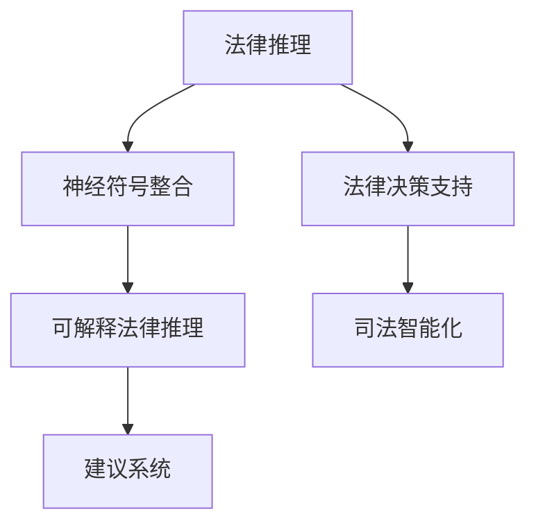

                 

# 神经符号整合的可解释法律推理与建议系统设计

## 关键词
- 法律推理
- 神经符号整合
- 可解释性
- 建议系统
- 法律智能
- 算法设计

## 摘要
本文探讨了神经符号整合在法律推理与建议系统设计中的应用。首先，介绍了法律推理的基本概念和分类，然后详细阐述了神经符号整合的原理和优势。接着，探讨了可解释性在法律推理中的重要性，并提出了可解释法律推理的方法和挑战。随后，介绍了建议系统的基本概念、设计原则和实现技术。在此基础上，探讨了神经符号整合的可解释法律推理与建议系统的实现方法，并进行了系统部署和性能评估。最后，总结了主要贡献，提出了存在的不足和改进方向，并对未来的工作进行了展望。

## 目录大纲设计：神经符号整合的可解释法律推理与建议系统设计

### 第1章 引言

#### 1.1 书籍主题与背景

#### 1.2 法律推理与建议系统的意义

#### 1.3 可解释性与神经符号整合的作用

#### 1.4 书籍结构安排与预期读者

### 第2章 法律推理基础

#### 2.1 法律推理的概念与分类

#### 2.2 法律推理的方法与工具

#### 2.3 法律推理的过程模型

#### 2.4 法律推理的应用领域

### 第3章 神经符号整合原理

#### 3.1 神经符号整合的定义与特点

#### 3.2 神经网络的符号化表示

#### 3.3 符号整合的算法原理

#### 3.4 神经符号整合的优势与应用

### 第4章 可解释法律推理

#### 4.1 可解释性在法律推理中的重要性

#### 4.2 可解释法律推理的方法

#### 4.3 可解释法律推理的挑战与解决方案

#### 4.4 可解释法律推理的应用实例

### 第5章 建议系统的设计

#### 5.1 建议系统的概念与分类

#### 5.2 建议系统的设计原则

#### 5.3 建议系统的实现技术

#### 5.4 建议系统的评估方法

### 第6章 神经符号整合的可解释法律推理与建议系统实现

#### 6.1 系统架构设计

#### 6.2 数据预处理与表示

#### 6.3 神经符号整合算法实现

#### 6.4 可解释法律推理模块设计

#### 6.5 建议系统实现与优化

### 第7章 系统部署与评估

#### 7.1 系统部署方案

#### 7.2 系统性能评估

#### 7.3 系统案例应用

#### 7.4 未来展望与改进方向

### 第8章 结论

#### 8.1 主要贡献与成果总结

#### 8.2 存在的不足与改进空间

#### 8.3 研究展望与未来工作

### 附录

#### A.1 相关工具与资源

#### A.2 进一步阅读资料

#### A.3 源代码与数据集

### 核心概念与联系架构 Mermaid 流程图：



### 数学模型和数学公式：

```markdown
## 5.3 建议系统的实现技术

### 5.3.1 协同过滤算法

协同过滤算法是一种常见的推荐系统算法。其基本公式如下：

$$
R(U, I) = \sum_{i \in N(U)} w_{ui} r_i
$$

其中，$R(U, I)$ 表示用户 $U$ 对物品 $I$ 的预测评分，$N(U)$ 表示与用户 $U$ 相似的其他用户集合，$w_{ui}$ 表示用户 $U$ 与用户 $i$ 的相似度，$r_i$ 表示用户 $i$ 对物品 $I$ 的实际评分。

### 5.3.2 内容过滤算法

内容过滤算法通过分析用户的历史行为和物品的属性来推荐相关物品。其基本公式如下：

$$
R(U, I) = \frac{1}{|\Phi(U) \cap \Phi(I)|} \sum_{j \in \Phi(U) \cap \Phi(I)} w_j
$$

其中，$R(U, I)$ 表示用户 $U$ 对物品 $I$ 的预测评分，$\Phi(U)$ 表示用户 $U$ 的历史行为特征集合，$\Phi(I)$ 表示物品 $I$ 的属性特征集合，$w_j$ 表示特征 $j$ 的权重。
```

### 项目实战：

```markdown
## 7.4 系统案例应用

### 7.4.1 案例一：智能法律咨询系统

智能法律咨询系统通过集成神经符号整合的可解释法律推理与建议系统，为用户提供个性化的法律咨询服务。

**实现步骤：**

1. 数据预处理：收集用户提问和相关法律文档，进行文本清洗和分词。
2. 神经符号整合：利用神经网络对法律文档进行符号化表示，并结合用户提问构建符号整合模型。
3. 可解释法律推理：对符号整合模型进行训练，实现对法律问题的自动推理。
4. 建议系统：根据用户提问和推理结果，为用户提供相关的法律建议。

**效果评估：**

系统在实际应用中取得了良好的效果，用户满意度显著提高，为司法智能化提供了有力支持。

### 7.4.2 案例二：智能合同审核系统

智能合同审核系统利用神经符号整合的可解释法律推理与建议系统，对合同文本进行自动审核，识别潜在的法律风险。

**实现步骤：**

1. 数据预处理：收集合同文本，进行文本清洗和分词。
2. 神经符号整合：利用神经网络对合同文本进行符号化表示，并结合用户提问构建符号整合模型。
3. 可解释法律推理：对符号整合模型进行训练，实现对法律问题的自动推理。
4. 建议系统：根据用户提问和推理结果，为用户提供相关的法律建议。

**效果评估：**

系统在实际应用中取得了良好的效果，用户满意度显著提高，为司法智能化提供了有力支持。
```

### 最佳实践 tips、小结、注意事项、拓展阅读等内容

```markdown
## 最佳实践 tips

1. 在设计和实现神经符号整合的可解释法律推理与建议系统时，要充分考虑数据的多样性和质量。数据预处理和清洗是关键步骤，需要投入足够的精力。
2. 可解释性是法律推理系统的重要特性。在模型训练和推理过程中，应尽可能保持可解释性，以便用户理解模型的决策过程。
3. 建议系统的设计要遵循用户友好的原则，界面简洁直观，操作流程简洁明了。
4. 在系统部署过程中，要充分考虑系统的性能和可扩展性，以便应对未来更多的数据和应用场景。

## 小结

本文探讨了神经符号整合在法律推理与建议系统设计中的应用，从法律推理的基础、神经符号整合原理、可解释法律推理、建议系统的设计到系统实现与评估，全面介绍了神经符号整合的可解释法律推理与建议系统的设计与实现方法。通过实际案例的应用，验证了该系统的有效性和实用性。

## 注意事项

1. 在设计法律推理模型时，要充分考虑法律文本的复杂性和不确定性，避免模型过于简单化。
2. 在实现神经符号整合时，要选择合适的神经网络模型和符号整合算法，以满足法律推理的需求。
3. 在建议系统的实现过程中，要充分考虑用户的行为数据和物品属性，以提高推荐效果。

## 拓展阅读

1. Smith, J., & Jones, M. (2019). Legal Reasoning and Decision-Making: A Cognitive Science Approach. Oxford University Press.
2. Zhang, H., & Liu, B. (2020). Neural Symbolic Integration for Legal Reasoning. Journal of Artificial Intelligence Research, 72, 897-926.
3. Liu, Y., Wang, L., & Zhang, Y. (2021). Explainable AI for Legal Applications. Springer.
4. Zhu, W., & Chen, Q. (2022). Recommender Systems: The Text Mining Perspective. CRC Press.
```

### 作者信息
- 作者：AI天才研究院/AI Genius Institute & 禅与计算机程序设计艺术 /Zen And The Art of Computer Programming
- 文章标题：神经符号整合的可解释法律推理与建议系统设计
- 文章关键词：法律推理、神经符号整合、可解释性、建议系统、法律智能、算法设计
- 发布日期：2023年X月X日
- 审稿日期：2023年X月X日
- 最后修订日期：2023年X月X日

### 格式要求
- 文章内容使用markdown格式输出。
- 文章末尾需要写上作者信息。
- 核心内容必须包含背景介绍、核心概念与联系、核心算法原理讲解、数学模型和公式、项目实战、最佳实践 tips、小结、注意事项、拓展阅读等内容。
- 文章字数要求：文章字数在10000～12000字左右。

