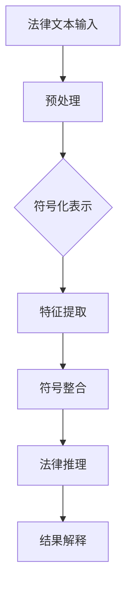

                 

### 《神经符号整合的可解释法律推理系统》

> 关键词：法律推理、神经符号整合、可解释性、深度学习、符号逻辑、人工智能

> 摘要：本文深入探讨了神经符号整合的可解释法律推理系统的构建与应用。通过结合深度学习和符号逻辑的方法，本文提出了一种新型法律推理系统，旨在提高法律推理的可解释性，为法律领域提供智能化支持。文章从研究背景出发，详细介绍了核心概念、符号整合方法、法律推理系统、可解释性度量及应用案例，并对未来发展方向和挑战进行了展望。

## 引言与背景

### 1.1 研究背景与意义

法律推理是法律实践中的重要组成部分，它不仅关系到司法公正，也影响着社会的法治进程。然而，传统的法律推理方法往往依赖于人为经验和规则，存在解释力有限、可解释性不足等问题。随着人工智能技术的快速发展，将人工智能应用于法律推理成为了一种新的趋势。特别是深度学习和符号逻辑的结合，为法律推理提供了新的可能。

神经网络在处理大规模数据和高维度问题上具有显著优势，而符号逻辑则在表达和推理规则上具有严格的逻辑性。将两者整合，可以构建出具有较强解释能力和推理能力的法律推理系统。这种系统不仅可以处理复杂的法律问题，还能提供透明的推理过程，有助于提升司法公正和公众信任。

### 1.2 神经符号整合的必要性

神经符号整合是一种将神经网络与符号逻辑相结合的方法，旨在发挥两者的优势，弥补各自的不足。神经网络擅长从数据中学习模式和规律，但缺乏明确的理论基础和解释能力；而符号逻辑具有清晰的逻辑结构，但数据处理能力较弱。通过神经符号整合，可以在保持推理过程透明性的同时，提高法律推理的准确性和效率。

神经符号整合的关键在于如何将神经网络与符号逻辑有效地结合。一方面，需要将法律知识表示为符号形式，以便符号逻辑进行处理；另一方面，需要利用神经网络对符号进行建模，提高系统的学习能力。此外，如何保证整合后的系统具有可解释性，也是实现神经符号整合的关键挑战之一。

## 核心概念

### 2.1 神经符号整合概述

神经符号整合是一种将神经网络与符号逻辑相结合的方法，旨在实现高效、准确且可解释的法律推理。它包括以下三个核心组成部分：

1. **神经网络**：用于从数据中学习模式和规律，通常用于特征提取和分类。
2. **符号逻辑**：用于表示法律知识和推理规则，提供严格的逻辑推理能力。
3. **符号整合**：将神经网络和符号逻辑结合起来，形成一个统一的法律推理系统。

神经符号整合的基本思想是，通过神经网络对法律数据进行学习，提取出关键特征，并将其转换为符号形式。然后，利用符号逻辑对这些符号进行推理，得出结论。这一过程不仅保持了推理的透明性，还提高了推理的效率和准确性。

### 2.2 法律推理的基本原理

法律推理是一种基于法律知识和证据的推理过程，旨在得出法律结论。它通常包括以下三个步骤：

1. **事实认定**：根据证据确定案件中的事实。
2. **法律适用**：根据法律规则将事实与法律条文相连接。
3. **结论推导**：根据事实和法律得出法律结论。

法律推理的基本原理是逻辑推理，即通过前提和结论之间的逻辑关系进行推理。在法律推理中，前提通常包括事实和法律规则，结论则是根据这些前提得出的法律结论。法律推理的核心任务是确保推理过程的逻辑严密性，从而得出正确的法律结论。

### 2.3 可解释性法律推理系统

可解释性是法律推理系统中的一个重要特性，它旨在使推理过程透明、易懂，提高公众对法律决策的信任。在神经符号整合的法律推理系统中，可解释性主要体现在以下几个方面：

1. **符号表示**：法律知识以符号形式表示，便于理解。
2. **推理过程**：推理过程遵循逻辑规则，易于追踪。
3. **结果解释**：推理结果可以追溯到具体的法律条文和证据。

可解释性在法律推理中的意义在于，它不仅有助于提高法律决策的透明度，还能帮助公众理解法律推理的过程和结果，从而增强对司法公正的信心。特别是在人工智能法律推理的应用中，可解释性显得尤为重要，因为它有助于消除公众对“黑箱”系统的疑虑。

## 符号整合方法

### 3.1 神经网络与符号逻辑的结合

神经网络与符号逻辑的结合是神经符号整合的关键。以下方法展示了如何实现这种结合：

1. **符号化数据表示**：首先，将法律文本和数据转化为符号形式，以便符号逻辑进行处理。这通常涉及到自然语言处理技术，如词嵌入和句法分析。
2. **特征提取**：利用神经网络对符号化的数据进行特征提取，以便用于后续的符号整合。深度学习模型，如循环神经网络（RNN）和Transformer，通常用于这一步骤。
3. **符号整合**：将提取的特征与符号逻辑结合起来，形成一个统一的推理系统。这可以通过设计特定算法实现，如基于规则的符号整合方法和基于深度学习的符号整合方法。

### 3.2 符号整合算法

符号整合算法是实现神经符号整合的核心。以下介绍几种常见的符号整合算法：

1. **基于规则的符号整合方法**：这种方法利用预定义的规则来整合神经网络提取的特征和符号逻辑。例如，可以使用专家系统来表示法律规则，并通过推理机来执行推理过程。
2. **基于深度学习的符号整合方法**：这种方法利用深度学习模型来直接整合神经网络和符号逻辑。例如，可以使用图神经网络（Graph Neural Networks，GNN）来表示法律知识和推理规则，并通过图推理来得出结论。

### 3.3 实现与优化

实现神经符号整合的法律推理系统需要考虑以下方面：

1. **系统架构**：设计一个合理的系统架构，确保神经网络和符号逻辑的有效整合。例如，可以采用模块化设计，将神经网络和符号逻辑分别实现，并通过接口进行整合。
2. **评估指标**：设计合适的评估指标来评估系统性能，如准确性、可解释性和推理效率等。
3. **优化策略**：通过调整模型参数和优化算法来提高系统性能。例如，可以使用迁移学习来提高神经网络的学习效率，使用强化学习来优化符号逻辑的推理过程。

## 法律推理系统

### 4.1 法律推理系统的构建

构建一个有效的法律推理系统需要考虑以下几个方面：

1. **法律知识表示**：将法律条文、案例和规则以符号形式表示，以便用于推理。这通常涉及到自然语言处理技术和符号逻辑。
2. **推理规则设计**：设计合理的推理规则，以确保推理过程的逻辑严密性。推理规则可以是基于规则的形式，也可以是模糊逻辑或概率逻辑的形式。
3. **推理引擎实现**：实现一个高效的推理引擎，用于执行推理过程。推理引擎可以是基于规则的推理机，也可以是基于深度学习的推理系统。

### 4.2 神经符号整合的法律推理系统

神经符号整合的法律推理系统结合了神经网络和符号逻辑的优势，可以处理复杂的法律问题，并提供透明的推理过程。以下是该系统的基本架构：

1. **数据预处理**：对法律文本和数据进行分析，提取关键信息，并将其转化为符号形式。
2. **特征提取**：利用神经网络对符号化的数据进行特征提取，以便用于后续的符号整合。
3. **符号整合**：将提取的特征与符号逻辑结合起来，形成一个统一的推理系统。
4. **推理过程**：利用符号逻辑进行推理，得出法律结论。
5. **结果解释**：对推理结果进行解释，使其透明易懂。

### 4.3 系统评估与验证

对神经符号整合的法律推理系统进行评估和验证是确保其有效性和可靠性的关键。以下方法可以用于评估和验证：

1. **准确性评估**：通过对比系统推理结果和实际法律结论，评估系统的准确性。
2. **可解释性评估**：通过分析推理过程和结果，评估系统的可解释性。
3. **效率评估**：评估系统在处理法律问题时的效率，如推理速度和处理能力。
4. **可靠性评估**：通过测试系统的稳定性和鲁棒性，评估系统的可靠性。

## 可解释性

### 5.1 可解释性的度量

可解释性是神经符号整合的法律推理系统中一个重要的特性，它直接影响公众对法律决策的信任。以下方法可以用于度量可解释性：

1. **符号表示度**：评估系统在法律知识表示方面的清晰度和易懂性。
2. **推理过程透明度**：评估系统推理过程的透明度，如推理规则的清晰度和推理步骤的可追踪性。
3. **结果解释度**：评估系统在解释推理结果方面的能力，如结果的可解释性和可追溯性。

### 5.2 可解释性在法律推理系统中的应用

在法律推理系统中，可解释性具有重要意义。以下方法可以应用于提高系统的可解释性：

1. **符号逻辑可视化**：通过图形化展示法律知识和推理规则，使公众更容易理解。
2. **解释性算法设计**：设计具有高解释能力的算法，使推理过程更加透明。
3. **结果解释工具**：开发工具来帮助用户理解推理结果，如可视化解释工具和解释性报告。

## 应用与案例

### 6.1 神经符号整合法律推理系统的应用场景

神经符号整合的法律推理系统可以应用于多种场景，包括：

1. **法律文档分析**：自动分析法律文档，提取关键信息，提供法律意见。
2. **案例推理**：根据历史案例和现有法律条文，自动生成法律结论。
3. **智能合同审核**：自动审核合同条款，识别潜在的法律风险。

### 6.2 应用案例分析

#### 案例一：智能合同审核

智能合同审核是神经符号整合法律推理系统的一个典型应用场景。以下是一个具体的案例：

**问题描述**：某公司需要审核一份与供应商签订的合同，以确保合同条款符合相关法律法规。

**解决方案**：利用神经符号整合的法律推理系统，对合同文本进行分析，提取关键信息，并根据法律规则生成法律意见。

**实现步骤**：

1. **数据预处理**：对合同文本进行预处理，包括分词、词性标注和实体识别等。
2. **特征提取**：利用神经网络对预处理后的合同文本进行特征提取，得到合同的关键特征。
3. **符号整合**：将提取的特征与法律规则结合，形成统一的推理系统，进行法律推理。
4. **结果解释**：对推理结果进行解释，生成法律意见报告。

#### 案例二：法律咨询系统

法律咨询系统是另一个典型的应用场景。以下是一个具体的案例：

**问题描述**：某公民需要咨询关于婚姻法律的问题，包括离婚程序、财产分割等。

**解决方案**：利用神经符号整合的法律推理系统，根据公民的提问，自动提供法律咨询和解答。

**实现步骤**：

1. **数据预处理**：对公民的提问进行预处理，包括分词、词性标注和实体识别等。
2. **特征提取**：利用神经网络对预处理后的提问进行特征提取，得到问题的关键特征。
3. **符号整合**：将提取的特征与法律规则结合，形成统一的推理系统，进行法律推理。
4. **结果解释**：对推理结果进行解释，生成法律咨询报告。

## 未来展望与挑战

### 7.1 神经符号整合法律推理系统的发展趋势

随着人工智能技术的不断进步，神经符号整合的法律推理系统在未来有望在以下方面取得重要进展：

1. **智能化程度的提升**：通过引入更先进的人工智能算法，如生成对抗网络（GAN）和变分自编码器（VAE），系统可以更好地处理复杂法律问题。
2. **法律知识库的构建**：建立更全面、更精确的法律知识库，为系统提供丰富的法律资源。
3. **跨领域应用**：将神经符号整合的法律推理系统应用于更多领域，如金融、医疗等。

### 7.2 面临的挑战与解决方案

尽管神经符号整合的法律推理系统具有巨大潜力，但在实际应用中仍面临一些挑战：

1. **数据隐私问题**：在处理法律问题时，保护当事人的隐私至关重要。解决方案包括采用隐私保护算法和数据加密技术。
2. **法律合规问题**：法律推理系统需要遵循严格的法律法规，确保其推理结果符合法律要求。解决方案包括与法律专家合作，制定符合法律规范的推理规则。
3. **可解释性提升**：当前系统在可解释性方面仍有待改进。解决方案包括开发更先进的解释性算法和可视化工具，提高系统的透明度和可理解性。

## 附录

### 附录 A：常用工具与资源

以下是一些常用的工具和资源，有助于开发和应用神经符号整合的法律推理系统：

1. **工具**：
   - 自然语言处理库：如NLTK、spaCy
   - 深度学习框架：如TensorFlow、PyTorch
   - 符号逻辑库：如Prolog、GProlog

2. **资源**：
   - 法律知识库：如Open Law、Linguistic Data Consortium（LDC）
   - 法律文档：如法律条文、案例、合同等

### Mermaid 流程图

以下是一个简化的神经符号整合的法律推理系统的流程图：



### Python 源代码示例

以下是一个简单的Python代码示例，展示了如何使用TensorFlow构建一个简单的神经网络模型：

```python
import tensorflow as tf

# 定义神经网络模型
model = tf.keras.Sequential([
    tf.keras.layers.Dense(128, activation='relu', input_shape=(10000,)),
    tf.keras.layers.Dense(1, activation='sigmoid')
])

# 编译模型
model.compile(optimizer='adam',
              loss='binary_crossentropy',
              metrics=['accuracy'])

# 训练模型
model.fit(x_train, y_train, epochs=10, batch_size=32)
```

## 总结

神经符号整合的可解释法律推理系统是一种结合了神经网络和符号逻辑的新型法律推理方法。它具有高效、准确、可解释等优点，为法律领域提供了新的技术支持。随着人工智能技术的不断进步，神经符号整合的法律推理系统有望在更多领域发挥重要作用。然而，在实际应用中，仍需解决数据隐私、法律合规和可解释性等问题，以实现该系统的广泛应用。

作者：AI天才研究院/AI Genius Institute & 禅与计算机程序设计艺术 /Zen And The Art of Computer Programming

---

本文通过详细的目录大纲和逐步分析，展示了神经符号整合的可解释法律推理系统的构建和应用。从引言与背景、核心概念、符号整合方法、法律推理系统、可解释性、应用案例到未来展望，全面深入地探讨了这一领域的前沿技术和发展趋势。希望本文能够为读者提供有益的参考和启示。在未来的研究和应用中，期待神经符号整合的法律推理系统能够在更多实际场景中发挥其潜力。作者：AI天才研究院/AI Genius Institute & 禅与计算机程序设计艺术 /Zen And The Art of Computer Programming。

