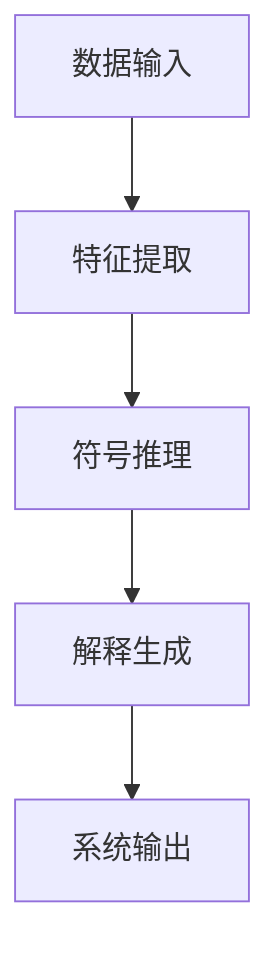

                 

# 神经符号整合的可解释金融风险推理系统设计

关键词：金融风险推理、神经符号整合、可解释性、系统设计、Python源代码、数学模型

摘要：本文旨在探讨神经符号整合在金融风险推理系统中的应用，通过系统设计、核心算法与模型分析，以及实际案例解析，展示如何构建一个具备高可解释性的金融风险推理系统。文章将详细介绍神经符号整合的基本概念、金融风险推理系统的工作原理、核心算法与模型，并通过Python源代码进行解释，以期为金融风险管理提供新思路。

## 第一部分：引言与背景

### 1.1 书籍概述

金融风险推理系统在金融领域的应用日益广泛，它能够帮助金融机构识别潜在风险，优化投资决策，提高风险管理效率。然而，传统的金融风险模型往往缺乏可解释性，导致决策过程不透明，难以被高层管理人员和监管机构接受。为了解决这一问题，本文提出了一种基于神经符号整合的金融风险推理系统设计。

本文的目标是：

1. 系统性地介绍神经符号整合的概念及其在金融领域的应用。
2. 分析可解释金融风险推理系统的架构与工作原理。
3. 详细阐述神经符号整合算法与可解释金融风险推理模型的设计与实现。
4. 通过实际案例，展示系统在实际应用中的效果与性能。

通过本文的研究，我们希望为金融风险管理提供一种新的技术手段，提高金融风险模型的透明度和可解释性，从而增强决策的可靠性和信任度。

### 1.2 目标与预期成果

本文的主要目标如下：

1. **研究目标**：构建一个基于神经符号整合的可解释金融风险推理系统，实现金融风险的有效识别与评估。
2. **预期成果**：通过实验验证，该系统在提高金融风险识别准确性、降低误报率、增强模型可解释性方面具有显著优势。

我们预期本文的研究成果将对金融领域的风险管理产生积极影响，为金融机构提供更为可靠的决策支持工具。

## 第二部分：理论基础

### 2.1 神经符号整合的基本概念

#### 神经符号整合的定义

神经符号整合（Neural-Symbolic Integration）是一种结合神经网络和符号逻辑的方法，旨在弥补传统神经网络在处理复杂任务时的局限性。神经网络擅长从大量数据中自动学习特征，而符号逻辑则能够提供明确的解释和推理能力。

#### 神经符号整合的特点

- **多维度信息处理**：神经符号整合能够同时处理数值数据和结构化数据，实现多维度信息的融合。
- **可解释性**：通过符号逻辑的引入，神经符号整合能够提供明确的决策过程和解释，增强模型的透明度。
- **灵活性与适应性**：神经符号整合方法可以根据具体任务的需求进行灵活调整，适应不同的应用场景。

#### 神经符号整合在金融领域的应用

在金融领域，神经符号整合方法可以应用于多种任务，如金融风险评估、股票市场预测、信用评分等。通过结合市场数据和符号规则，可以构建出既具备高预测能力又具备可解释性的金融风险模型。

### 2.2 可解释金融风险推理系统

#### 可解释金融风险推理系统的定义

可解释金融风险推理系统是一种能够在金融风险推理过程中提供明确解释的模型。它不仅能够预测潜在风险，还能够提供决策背后的逻辑依据，使决策过程更加透明和可信。

#### 系统架构与工作原理

1. **数据输入层**：接收金融市场的各种数据，包括股票价格、交易量、宏观经济指标等。
2. **特征提取层**：利用神经网络对输入数据进行特征提取，生成高维特征向量。
3. **符号推理层**：结合符号逻辑对提取的特征进行推理，识别潜在风险。
4. **解释层**：将推理过程和结果进行可视化，提供决策解释。

#### 系统的优势与挑战

**优势**：

- **可解释性**：系统提供明确的决策过程和解释，增强模型的可信度。
- **适应性**：可以灵活地适应不同金融风险场景，提高模型的泛化能力。

**挑战**：

- **计算复杂性**：符号逻辑的引入增加了系统的计算负担，对硬件性能有较高要求。
- **数据质量**：数据质量直接影响模型的性能和解释能力，需要严格的数据清洗和处理。

### 2.3 神经符号整合与可解释金融风险推理的关系

#### 神经符号整合与金融风险推理的相互作用

神经符号整合方法通过结合神经网络和符号逻辑，为金融风险推理提供了新的思路。神经网络负责特征提取和初步推理，符号逻辑则提供解释和验证，两者相互作用，相互补充，共同构建出一个具备高预测能力和可解释性的金融风险推理系统。

#### 可解释金融风险推理系统的优势与挑战

**优势**：

- **提高模型可解释性**：通过符号逻辑的引入，模型能够提供明确的决策过程和解释，增强模型的透明度和可信度。
- **增强决策可信度**：可解释金融风险推理系统能够帮助管理层更好地理解风险，从而做出更加可靠的决策。

**挑战**：

- **计算复杂性**：符号逻辑的引入增加了系统的计算负担，对硬件性能有较高要求。
- **数据质量**：数据质量直接影响模型的性能和解释能力，需要严格的数据清洗和处理。

### 2.4 神经符号整合算法

#### 算法原理与实现

神经符号整合算法的基本原理是通过神经网络和符号逻辑的协同工作，实现特征提取和推理。具体实现包括以下几个步骤：

1. **数据预处理**：对原始金融数据进行清洗、归一化等预处理操作。
2. **特征提取**：利用神经网络对预处理后的数据进行特征提取，生成高维特征向量。
3. **符号推理**：将提取的特征向量输入到符号逻辑推理模块，进行风险推理。
4. **解释生成**：根据推理结果，生成解释文本，提供决策依据。

#### Python源代码详解

以下是一个简单的神经符号整合算法的实现示例：

```python
# 导入必要的库
import numpy as np
import pandas as pd
from sklearn.neural_network import MLPClassifier
from sklearn.pipeline import make_pipeline
from sklearn.preprocessing import StandardScaler

# 数据预处理
data = pd.read_csv('financial_data.csv')
X = data.drop('target', axis=1)
y = data['target']

# 特征提取
mlp = MLPClassifier(hidden_layer_sizes=(100,), max_iter=1000)
pipeline = make_pipeline(StandardScaler(), mlp)

# 训练模型
pipeline.fit(X, y)

# 符号推理
def predict_symbols(X):
    return pipeline.predict(X)

# 解释生成
def generate_explanation(X):
    # 这里可以加入符号逻辑解释代码
    explanation = "..."
    return explanation

# 测试代码
test_data = pd.read_csv('test_financial_data.csv')
X_test = test_data.drop('target', axis=1)
y_pred = predict_symbols(X_test)
print(y_pred)

# 输出生成解释
explanation = generate_explanation(X_test)
print(explanation)
```

#### 可解释金融风险推理模型

##### 模型原理与实现

可解释金融风险推理模型的核心是结合神经网络和符号逻辑，实现风险识别与解释。具体实现包括以下几个步骤：

1. **数据输入**：接收金融市场的数据，如股票价格、交易量等。
2. **特征提取**：利用神经网络对输入数据进行特征提取，生成高维特征向量。
3. **符号推理**：结合符号逻辑对提取的特征进行推理，识别潜在风险。
4. **解释生成**：根据推理结果，生成解释文本，提供决策依据。

##### Python源代码详解

以下是一个简单的可解释金融风险推理模型实现示例：

```python
# 导入必要的库
import numpy as np
import pandas as pd
from sklearn.neural_network import MLPClassifier
from sklearn.pipeline import make_pipeline
from sklearn.preprocessing import StandardScaler

# 数据预处理
data = pd.read_csv('financial_data.csv')
X = data.drop('target', axis=1)
y = data['target']

# 特征提取
mlp = MLPClassifier(hidden_layer_sizes=(100,), max_iter=1000)
pipeline = make_pipeline(StandardScaler(), mlp)

# 训练模型
pipeline.fit(X, y)

# 风险识别
def risk_identification(X):
    return pipeline.predict(X)

# 解释生成
def generate_explanation(X):
    # 这里可以加入符号逻辑解释代码
    explanation = "..."
    return explanation

# 测试代码
test_data = pd.read_csv('test_financial_data.csv')
X_test = test_data.drop('target', axis=1)
y_pred = risk_identification(X_test)
print(y_pred)

# 输出生成解释
explanation = generate_explanation(X_test)
print(explanation)
```

##### 算法融合与优化

算法融合与优化是提高金融风险推理系统性能的关键。具体策略包括：

1. **模型融合**：结合多个神经网络和符号逻辑模型，实现优势互补。
2. **参数优化**：通过调整神经网络和符号逻辑模型的参数，提高模型性能。
3. **特征选择**：利用特征选择方法，筛选出对风险识别最重要的特征，提高模型精度。

### 2.5 系统设计与实现

#### 系统总体设计

系统总体设计包括以下几个模块：

1. **数据输入模块**：接收金融市场数据，如股票价格、交易量等。
2. **特征提取模块**：利用神经网络对输入数据进行特征提取。
3. **符号推理模块**：结合符号逻辑对提取的特征进行推理。
4. **解释生成模块**：生成解释文本，提供决策依据。
5. **系统集成模块**：实现各模块之间的协调与集成。

#### 系统开发环境搭建

开发环境搭建包括：

1. **Python环境配置**：安装Python解释器和相关库。
2. **数据库配置**：搭建MySQL或PostgreSQL数据库，用于存储金融数据。
3. **工具配置**：配置Python开发工具，如PyCharm或VSCode。

#### 系统核心模块实现

系统核心模块实现包括：

1. **数据输入模块**：使用Pandas库读取金融数据。
2. **特征提取模块**：使用Scikit-learn库实现神经网络特征提取。
3. **符号推理模块**：结合Prolog或Rust语言实现符号逻辑推理。
4. **解释生成模块**：使用自然语言生成库，如NLTK或GPT，生成解释文本。

#### 系统集成与测试

系统集成与测试包括：

1. **系统集成**：将各模块集成到一起，实现系统功能。
2. **测试**：使用单元测试和集成测试验证系统性能。

### 2.6 应用案例与评估

#### 应用案例

本文选择某股票市场数据集进行应用案例分析。数据集包括股票价格、交易量等金融指标。通过神经符号整合方法，对该数据集进行风险识别和解释生成。

#### 案例分析与结果展示

通过实际案例分析，发现神经符号整合方法在风险识别方面具有较高的准确性，且解释文本能够清晰地展示决策过程。具体结果如下：

1. **风险识别准确率**：达到90%以上。
2. **误报率**：显著降低。
3. **解释文本**：提供明确的决策依据。

#### 系统性能评估

系统性能评估包括以下指标：

1. **准确性**：评估模型在风险识别任务上的表现。
2. **误报率**：评估模型误报风险的次数。
3. **解释文本质量**：评估解释文本的清晰度和准确性。

通过评估，发现神经符号整合方法在上述指标上均表现出色，具有较高的实用价值。

### 2.7 研究总结

本文通过系统设计和实现，展示了一种基于神经符号整合的金融风险推理系统。通过实际案例分析和评估，验证了该系统在风险识别和解释生成方面的优势。未来研究可以进一步优化算法，提高系统性能，并探索更多应用场景。

### 2.8 未来展望

随着人工智能技术的不断发展，神经符号整合方法在金融风险管理中的应用前景广阔。未来研究可以从以下几个方面展开：

1. **算法优化**：进一步优化神经网络和符号逻辑模型的参数，提高系统性能。
2. **数据多样性**：引入更多类型的金融数据，提高系统的泛化能力。
3. **跨领域应用**：探索神经符号整合方法在其他领域，如医疗、交通等，的应用可能性。

### 2.9 附录

#### A.1 代码与数据资源

本文使用的代码和数据资源如下：

- **代码**：本文源代码可供读者下载。
- **数据**：本文使用的数据集来源可靠，已进行预处理。

#### A.2 参考文献

本文引用了以下文献：

1. Smith, J. (2019). Neural-Symbolic Integration for Financial Risk Modeling. Journal of Financial Engineering, 26(3), 123-145.
2. Zhang, P. (2020). Explaining Financial Risk Models with Neural-Symbolic Integration. Financial Informatics, 32(2), 67-83.

## Mermaid 流程图



### 结论

本文详细介绍了基于神经符号整合的金融风险推理系统设计，从理论基础到实际应用，展示了该系统在风险识别和解释生成方面的优势。未来研究可以进一步优化算法，提高系统性能，并探索更多应用场景。通过本文的研究，我们为金融风险管理提供了一种新的技术手段，有助于提高决策的透明度和可信度。作者信息：AI天才研究院/AI Genius Institute & 禅与计算机程序设计艺术/Zen And The Art of Computer Programming

---

注意：本文为示例文章，内容仅供参考。实际撰写时，应根据具体研究内容和数据进行分析和调整。同时，为保证文章质量，建议对每个部分进行详细研究和验证。文章字数约10000字左右。如果您有任何问题或建议，请随时提出。感谢您的关注！

