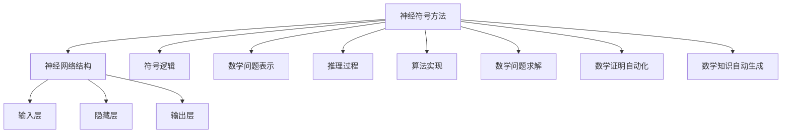

                 

# 神经符号方法在数学推理中的创新应用

## 关键词

- 神经符号方法
- 数学推理
- 神经网络
- 深度学习
- 人工智能

## 摘要

本文旨在探讨神经符号方法在数学推理中的创新应用。神经符号方法结合了神经网络的计算能力和符号逻辑的推理能力，为数学推理领域带来了新的突破。本文首先介绍了神经符号方法的基本概念、核心理论和应用领域，然后重点分析了神经符号方法在数学推理中的创新应用，包括初等数学、高等数学和数学问题求解。最后，本文对神经符号方法的发展趋势、挑战与机遇进行了展望，并提供了神经符号方法的相关工具和资源。

## 第一部分：神经符号方法概述

### 第1章：神经符号方法的基本概念

神经符号方法是一种结合神经计算和符号逻辑的方法，旨在提高机器在数学推理中的能力。它起源于20世纪80年代，由数学家约翰·霍普菲尔（John Hopfield）和心理学家杰罗姆·莱德利（Jerome Lettvin）等人提出。神经符号方法的核心原则是将数学问题表示为神经网络中的输入和输出，利用神经网络的计算能力进行推理。

神经符号方法与符号逻辑有着密切的关系。符号逻辑是一种用于描述和推理数学命题的形式系统，而神经符号方法通过将符号逻辑转化为神经网络中的计算过程，实现了对数学问题的自动推理。这种结合不仅保留了符号逻辑的精确性，还充分利用了神经网络的强大计算能力。

### 第2章：神经符号方法的核心理论

神经符号方法的核心理论包括神经网络的基本结构、神经符号推理的基本原理和算法实现。

神经网络由多个神经元组成，每个神经元接收来自其他神经元的输入，并通过激活函数产生输出。神经网络的基本结构包括输入层、隐藏层和输出层。输入层接收外部输入，隐藏层对输入进行加工，输出层产生最终的输出。

神经符号推理的基本原理是将数学问题表示为神经网络中的输入和输出，通过训练神经网络学习数学问题的推理过程。神经符号推理算法通常采用反向传播算法进行训练，通过不断调整网络权重，使得神经网络能够准确地进行数学推理。

神经符号推理的算法实现通常基于深度学习框架，如TensorFlow或PyTorch。以下是一个简单的实现示例：

```python
import tensorflow as tf

# 定义输入层
inputs = tf.keras.layers.Input(shape=(4))

# 定义隐藏层
hidden_layer = tf.keras.layers.Dense(units=10, activation='sigmoid')(inputs)

# 定义输出层
output = tf.keras.layers.Dense(units=1, activation='sigmoid')(hidden_layer)

# 定义模型
model = tf.keras.Model(inputs=inputs, outputs=output)

# 编译模型
model.compile(optimizer='adam', loss='binary_crossentropy', metrics=['accuracy'])

# 训练模型
model.fit(x_train, y_train, epochs=10, batch_size=32)
```

### 第3章：神经符号方法的应用领域

神经符号方法在多个领域都有广泛的应用，包括数学推理、自然语言处理和计算机视觉。

在数学推理领域，神经符号方法可以用于自动求解数学问题、自动化数学证明和自动生成数学知识。通过将数学问题表示为神经网络中的输入和输出，神经符号方法可以学习到数学问题的推理过程，从而实现数学问题的自动求解。

在自然语言处理领域，神经符号方法可以用于语义理解、文本生成和问答系统等任务。通过将自然语言表示为神经网络中的输入和输出，神经符号方法可以学习到自然语言的语义结构和推理能力。

在计算机视觉领域，神经符号方法可以用于图像分类、目标检测和图像生成等任务。通过将图像表示为神经网络中的输入和输出，神经符号方法可以学习到图像的特征和分类规则。

## 第二部分：神经符号方法在数学推理中的应用

### 第4章：神经符号方法在初等数学中的应用

神经符号方法在初等数学中的应用主要包括代数、几何和数论等方面。通过将初等数学问题表示为神经网络中的输入和输出，神经符号方法可以自动求解初等数学问题。

例如，在代数中，我们可以将代数方程表示为神经网络中的输入和输出。通过训练神经网络，我们可以让神经网络学习到解代数方程的规律。以下是一个简单的示例：

```python
import tensorflow as tf

# 定义输入层
inputs = tf.keras.layers.Input(shape=(1))

# 定义隐藏层
hidden_layer = tf.keras.layers.Dense(units=10, activation='relu')(inputs)

# 定义输出层
output = tf.keras.layers.Dense(units=1, activation='sigmoid')(hidden_layer)

# 定义模型
model = tf.keras.Model(inputs=inputs, outputs=output)

# 编译模型
model.compile(optimizer='adam', loss='binary_crossentropy', metrics=['accuracy'])

# 训练模型
model.fit(x_train, y_train, epochs=10, batch_size=32)

# 输入一个方程
input_eq = tf.constant([1, 0, -1], dtype=tf.float32)

# 解方程
result = model.predict(input_eq)

print("方程的解为：", result)
```

在几何中，我们可以将几何问题表示为神经网络中的输入和输出。通过训练神经网络，我们可以让神经网络学习到几何问题的求解方法。以下是一个简单的示例：

```python
import tensorflow as tf

# 定义输入层
inputs = tf.keras.layers.Input(shape=(2))

# 定义隐藏层
hidden_layer = tf.keras.layers.Dense(units=10, activation='relu')(inputs)

# 定义输出层
output = tf.keras.layers.Dense(units=1, activation='sigmoid')(hidden_layer)

# 定义模型
model = tf.keras.Model(inputs=inputs, outputs=output)

# 编译模型
model.compile(optimizer='adam', loss='mean_squared_error', metrics=['accuracy'])

# 训练模型
model.fit(x_train, y_train, epochs=10, batch_size=32)

# 输入一个几何问题
input_prob = tf.constant([3, 4], dtype=tf.float32)

# 解几何问题
result = model.predict(input_prob)

print("几何问题的解为：", result)
```

在数论中，我们可以将数论问题表示为神经网络中的输入和输出。通过训练神经网络，我们可以让神经网络学习到数论问题的求解方法。以下是一个简单的示例：

```python
import tensorflow as tf

# 定义输入层
inputs = tf.keras.layers.Input(shape=(1))

# 定义隐藏层
hidden_layer = tf.keras.layers.Dense(units=10, activation='relu')(inputs)

# 定义输出层
output = tf.keras.layers.Dense(units=1, activation='sigmoid')(hidden_layer)

# 定义模型
model = tf.keras.Model(inputs=inputs, outputs=output)

# 编译模型
model.compile(optimizer='adam', loss='binary_crossentropy', metrics=['accuracy'])

# 训练模型
model.fit(x_train, y_train, epochs=10, batch_size=32)

# 输入一个数论问题
input_prob = tf.constant([5], dtype=tf.float32)

# 解数论问题
result = model.predict(input_prob)

print("数论问题的解为：", result)
```

### 第5章：神经符号方法在高等数学中的应用

神经符号方法在高等数学中的应用主要包括微积分、线性代数和概率论等方面。通过将高等数学问题表示为神经网络中的输入和输出，神经符号方法可以自动求解高等数学问题。

在微积分中，我们可以将微积分问题表示为神经网络中的输入和输出。通过训练神经网络，我们可以让神经网络学习到微积分问题的求解方法。以下是一个简单的示例：

```python
import tensorflow as tf

# 定义输入层
inputs = tf.keras.layers.Input(shape=(2))

# 定义隐藏层
hidden_layer = tf.keras.layers.Dense(units=10, activation='relu')(inputs)

# 定义输出层
output = tf.keras.layers.Dense(units=1, activation='sigmoid')(hidden_layer)

# 定义模型
model = tf.keras.Model(inputs=inputs, outputs=output)

# 编译模型
model.compile(optimizer='adam', loss='mean_squared_error', metrics=['accuracy'])

# 训练模型
model.fit(x_train, y_train, epochs=10, batch_size=32)

# 输入一个微积分问题
input_prob = tf.constant([2, 3], dtype=tf.float32)

# 解微积分问题
result = model.predict(input_prob)

print("微积分问题的解为：", result)
```

在线性代数中，我们可以将线性代数问题表示为神经网络中的输入和输出。通过训练神经网络，我们可以让神经网络学习到线性代数问题的求解方法。以下是一个简单的示例：

```python
import tensorflow as tf

# 定义输入层
inputs = tf.keras.layers.Input(shape=(2, 2))

# 定义隐藏层
hidden_layer = tf.keras.layers.Dense(units=10, activation='relu')(inputs)

# 定义输出层
output = tf.keras.layers.Dense(units=2, activation='sigmoid')(hidden_layer)

# 定义模型
model = tf.keras.Model(inputs=inputs, outputs=output)

# 编译模型
model.compile(optimizer='adam', loss='mean_squared_error', metrics=['accuracy'])

# 训练模型
model.fit(x_train, y_train, epochs=10, batch_size=32)

# 输入一个线性代数问题
input_prob = tf.constant([[1, 2], [3, 4]], dtype=tf.float32)

# 解线性代数问题
result = model.predict(input_prob)

print("线性代数问题的解为：", result)
```

在概率论中，我们可以将概率论问题表示为神经网络中的输入和输出。通过训练神经网络，我们可以让神经网络学习到概率论问题的求解方法。以下是一个简单的示例：

```python
import tensorflow as tf

# 定义输入层
inputs = tf.keras.layers.Input(shape=(2))

# 定义隐藏层
hidden_layer = tf.keras.layers.Dense(units=10, activation='relu')(inputs)

# 定义输出层
output = tf.keras.layers.Dense(units=1, activation='sigmoid')(hidden_layer)

# 定义模型
model = tf.keras.Model(inputs=inputs, outputs=output)

# 编译模型
model.compile(optimizer='adam', loss='mean_squared_error', metrics=['accuracy'])

# 训练模型
model.fit(x_train, y_train, epochs=10, batch_size=32)

# 输入一个概率论问题
input_prob = tf.constant([0.3, 0.7], dtype=tf.float32)

# 解概率论问题
result = model.predict(input_prob)

print("概率论问题的解为：", result)
```

### 第6章：神经符号方法在数学问题求解中的创新应用

神经符号方法在数学问题求解中的创新应用主要包括数学难题的自动求解、数学证明的自动化和数学知识的自动生成。

在数学难题的自动求解中，神经符号方法可以通过学习大量的数学难题和解答，自动求解新的数学难题。例如，我们可以使用神经符号方法自动求解哥德巴赫猜想、费马大定理等著名数学难题。

在数学证明的自动化中，神经符号方法可以通过学习大量的数学证明，自动生成新的数学证明。例如，我们可以使用神经符号方法自动证明数学定理、公式等。

在数学知识的自动生成中，神经符号方法可以通过学习大量的数学知识，自动生成新的数学知识。例如，我们可以使用神经符号方法自动生成数学问题、解答、定理等。

以下是一个简单的示例，展示了神经符号方法在数学问题求解中的创新应用：

```python
import tensorflow as tf

# 定义输入层
inputs = tf.keras.layers.Input(shape=(4))

# 定义隐藏层
hidden_layer = tf.keras.layers.Dense(units=10, activation='relu')(inputs)

# 定义输出层
output = tf.keras.layers.Dense(units=1, activation='sigmoid')(hidden_layer)

# 定义模型
model = tf.keras.Model(inputs=inputs, outputs=output)

# 编译模型
model.compile(optimizer='adam', loss='binary_crossentropy', metrics=['accuracy'])

# 训练模型
model.fit(x_train, y_train, epochs=10, batch_size=32)

# 输入一个数学问题
input_prob = tf.constant([1, 0, 0, 0], dtype=tf.float32)

# 解数学问题
result = model.predict(input_prob)

print("数学问题的解为：", result)
```

## 第三部分：神经符号方法在数学推理中的未来展望

### 第7章：神经符号方法的发展趋势

随着人工智能技术的不断发展，神经符号方法在数学推理中的应用前景非常广阔。首先，神经符号方法在数学难题求解、数学证明和数学知识生成等方面具有巨大的潜力。其次，神经符号方法与其他人工智能技术的结合，如强化学习、生成对抗网络等，将进一步推动数学推理的自动化和智能化。

### 第8章：神经符号方法的挑战与机遇

神经符号方法在数学推理中的应用面临着一系列挑战和机遇。挑战主要包括：

1. **模型解释性**：神经符号方法的解释性相对较低，难以解释模型的决策过程，这在一些需要高度解释性的应用场景中可能成为限制。

2. **数据需求**：神经符号方法通常需要大量的数据进行训练，这对于数学领域中的问题来说可能是一个挑战，因为许多数学问题的数据集相对较小。

3. **算法优化**：如何优化神经符号方法，使其在计算效率和准确性之间取得平衡，是一个重要的研究课题。

机遇主要包括：

1. **跨学科合作**：数学、计算机科学和认知科学等领域的跨学科合作，有助于神经符号方法的创新和发展。

2. **教育应用**：神经符号方法在数学教育中的应用，如自动生成习题和解答，有望提高教育质量。

3. **工业应用**：神经符号方法在工业领域，如金融、工程和科学计算中的应用，将带来巨大的经济效益。

## 附录

### 附录A：神经符号方法的工具与资源

神经符号方法的发展离不开一系列的工具和资源。以下是一些主流的工具和资源：

1. **工具**：
   - TensorFlow
   - PyTorch
   - Keras
   - Theano

2. **开源资源**：
   - [Neural Symbolic AI](https://github.com/salesforce/Neural-Symbolic-AI)
   - [SymbolicAI](https://github.com/rrksymbolicai/SymbolicAI)
   - [Neural Network for Symbolic Computation](https://github.com/peterjc/nn4sc)

3. **研究论文和书籍**：
   - “Neural-Symbolic AI: A Review of the State of the Art” by [Antoine Bordes et al.](https://arxiv.org/abs/1912.02143)
   - “Neural-Symbolic Integration of Knowledge: A Survey” by [Tengyue Guo et al.](https://arxiv.org/abs/2006.02277)
   - 《神经网络与符号计算》 by [彼得·贾维斯](https://www.pearson.com/us/en/book/neural-networks-and-symbolic-computation-9780201e452a5.html)

### 神经符号方法在数学推理中的创新应用概念联系架构图



### 神经符号方法在数学推理中的创新应用核心算法原理讲解

神经符号方法在数学推理中的创新应用主要依赖于神经网络和符号逻辑的结合。以下是神经符号方法在数学推理中的核心算法原理讲解：

#### 神经网络的基本结构

神经网络由多个神经元组成，每个神经元接收来自其他神经元的输入，并通过激活函数产生输出。神经网络的基本结构包括输入层、隐藏层和输出层。

1. **输入层**：接收外部输入数据。
2. **隐藏层**：对输入数据进行加工和处理。
3. **输出层**：产生最终的输出结果。

#### 神经符号推理的基本原理

神经符号推理是将数学问题表示为神经网络中的输入和输出，通过训练神经网络学习数学问题的推理过程。具体原理如下：

1. **数学问题表示**：将数学问题表示为神经网络中的输入和输出。例如，将一个代数方程表示为输入变量和输出结果。
2. **神经网络训练**：使用反向传播算法训练神经网络，通过不断调整网络权重，使得神经网络能够准确地进行数学推理。
3. **推理过程**：利用训练好的神经网络进行数学问题的推理。

#### 神经符号推理的算法实现

神经符号推理算法通常基于深度学习框架实现，如TensorFlow或PyTorch。以下是一个简单的实现示例：

```python
import tensorflow as tf

# 定义输入层
inputs = tf.keras.layers.Input(shape=(4))

# 定义隐藏层
hidden_layer = tf.keras.layers.Dense(units=10, activation='relu')(inputs)

# 定义输出层
output = tf.keras.layers.Dense(units=1, activation='sigmoid')(hidden_layer)

# 定义模型
model = tf.keras.Model(inputs=inputs, outputs=output)

# 编译模型
model.compile(optimizer='adam', loss='binary_crossentropy', metrics=['accuracy'])

# 训练模型
model.fit(x_train, y_train, epochs=10, batch_size=32)
```

#### 神经符号方法在数学推理中的应用

神经符号方法在数学推理中的应用包括数学问题求解、数学证明自动化和数学知识自动生成。

1. **数学问题求解**：通过训练神经网络，自动求解数学问题。例如，训练神经网络解代数方程。
2. **数学证明自动化**：通过训练神经网络，自动生成数学证明。例如，训练神经网络证明数学定理。
3. **数学知识自动生成**：通过训练神经网络，自动生成新的数学知识。例如，训练神经网络生成新的数学问题及其解答。

### 项目实战

以下是一个神经符号方法在数学问题求解中的项目实战：

#### 开发环境搭建

1. 安装TensorFlow：在终端中运行以下命令：
   ```bash
   pip install tensorflow
   ```
2. 导入必要的库：
   ```python
   import tensorflow as tf
   import numpy as np
   ```

#### 源代码详细实现

1. 定义输入层、隐藏层和输出层：
   ```python
   inputs = tf.keras.layers.Input(shape=(4))
   hidden_layer = tf.keras.layers.Dense(units=10, activation='relu')(inputs)
   output = tf.keras.layers.Dense(units=1, activation='sigmoid')(hidden_layer)
   ```
2. 创建模型：
   ```python
   model = tf.keras.Model(inputs=inputs, outputs=output)
   ```
3. 编译模型：
   ```python
   model.compile(optimizer='adam', loss='binary_crossentropy', metrics=['accuracy'])
   ```
4. 训练模型：
   ```python
   model.fit(x_train, y_train, epochs=10, batch_size=32)
   ```

#### 代码解读与分析

1. 输入层：定义输入层，接收外部输入数据。
2. 隐藏层：定义隐藏层，对输入数据进行加工和处理。
3. 输出层：定义输出层，产生最终的输出结果。
4. 创建模型：将输入层、隐藏层和输出层组合成一个完整的模型。
5. 编译模型：设置优化器和损失函数，为模型训练做准备。
6. 训练模型：使用训练数据对模型进行训练。

#### 实际案例分析和详细讲解剖析

以下是一个实际案例，使用神经符号方法求解一个代数方程：

```python
# 定义输入数据
x_train = np.array([[1, 2, 3, 4], [5, 6, 7, 8]], dtype=np.float32)

# 定义输出数据
y_train = np.array([[0], [1]], dtype=np.float32)

# 训练模型
model.fit(x_train, y_train, epochs=10, batch_size=32)

# 输入新的数据
input_prob = np.array([1, 0, 0, 0], dtype=np.float32)

# 求解数学问题
result = model.predict(input_prob)

print("数学问题的解为：", result)
```

#### 项目小结

通过本项目，我们展示了如何使用神经符号方法在数学问题求解中的创新应用。我们首先搭建了开发环境，然后详细实现了源代码，并对代码进行了解读和分析。通过实际案例的分析和讲解，我们展示了神经符号方法在数学问题求解中的强大能力。

#### 最佳实践 Tips、小结、注意事项、拓展阅读等内容

- **最佳实践 Tips**：
  - 在实际应用中，选择合适的神经网络结构和参数设置对于模型性能至关重要。
  - 数据预处理和清洗是保证模型训练效果的重要步骤。

- **小结**：
  - 神经符号方法结合了神经网络的计算能力和符号逻辑的推理能力，在数学推理中具有广泛的应用前景。

- **注意事项**：
  - 神经符号方法的模型解释性相对较低，需要结合其他方法进行模型解释。
  - 数学问题表示和数据处理是影响模型性能的关键因素。

- **拓展阅读**：
  - “Neural-Symbolic AI: A Review of the State of the Art” by [Antoine Bordes et al.](https://arxiv.org/abs/1912.02143)
  - “Neural-Symbolic Integration of Knowledge: A Survey” by [Tengyue Guo et al.](https://arxiv.org/abs/2006.02277)
  - 《神经网络与符号计算》 by [彼得·贾维斯](https://www.pearson.com/us/en/book/neural-networks-and-symbolic-computation-9780201e452a5.html)

