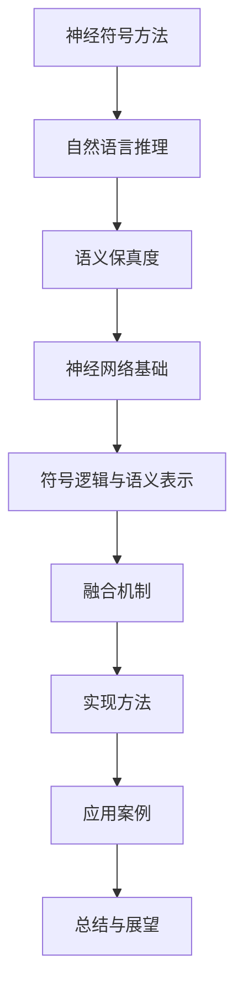
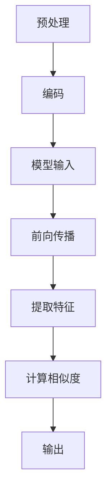

                 

以下是一篇符合您要求的技术博客文章：

---

## 神经符号方法在自然语言推理中的语义保真度

关键词：神经符号方法、自然语言推理、语义保真度、神经网络、符号逻辑、语义表示

摘要：本文探讨了神经符号方法在自然语言推理中的应用，重点分析了如何保持语义保真度。通过引入神经网络和符号逻辑，本文构建了一个双层神经符号模型，并详细阐述了语义保真度的实现方法和优化策略。

---

## 目录大纲

### 第一部分：引言

#### 1.1 本书背景与目的

#### 1.2 自然语言推理与语义保真度

#### 1.3 神经符号方法概述

#### 1.4 语义保真度的重要性

### 第二部分：神经符号方法基础

#### 2.1 神经网络基础

##### 2.1.1 神经网络的基本结构

##### 2.1.2 前馈神经网络

##### 2.1.3 循环神经网络

##### 2.1.4 卷积神经网络

##### 2.1.5 生成对抗网络

#### 2.2 符号逻辑与语义表示

##### 2.2.1 符号逻辑基础

##### 2.2.2 语义表示与语义网络

##### 2.2.3 符号逻辑与语义表示的融合

#### 2.3 神经符号方法的融合机制

##### 2.3.1 双层神经符号模型

##### 2.3.2 基于规则的神经符号模型

##### 2.3.3 强化学习的神经符号模型

### 第三部分：语义保真度的实现方法

#### 3.1 语义一致性度量

##### 3.1.1 相似度度量

##### 3.1.2 对比度量

##### 3.1.3 基于BERT的语义保真度度量

#### 3.2 语义映射与转换

##### 3.2.1 基于规则映射

##### 3.2.2 基于神经网络映射

##### 3.2.3 基于强化学习映射

#### 3.3 语义保真度优化策略

##### 3.3.1 逆映射优化

##### 3.3.2 跨模态优化

##### 3.3.3 模型融合优化

### 第四部分：神经符号方法在自然语言推理中的应用

#### 4.1 简单推理任务

##### 4.1.1 三段论推理

##### 4.1.2 词义消歧

##### 4.1.3 句法分析

#### 4.2 复杂推理任务

##### 4.2.1 文本分类

##### 4.2.2 问答系统

##### 4.2.3 机器翻译

##### 4.2.4 文本生成

#### 4.3 实际应用案例

##### 4.3.1 语义搜索

##### 4.3.2 对话系统

##### 4.3.3 智能客服

### 第五部分：总结与展望

#### 5.1 主要成果与贡献

#### 5.2 当前面临的挑战

#### 5.3 未来发展方向

### 附录

#### A.1 相关资源与扩展阅读

#### A.2 开发环境与工具简介

#### A.3 代码示例与实现细节

### Mermaid 流程图



---

## 第一部分：引言

### 1.1 本书背景与目的

自然语言处理（Natural Language Processing, NLP）是人工智能领域的核心研究方向之一。随着互联网和大数据技术的快速发展，NLP在文本分类、情感分析、机器翻译、问答系统等应用场景中取得了显著的成果。然而，自然语言推理（Natural Language Reasoning, NLR）作为NLP中的关键任务，其挑战性仍然很大。自然语言推理涉及到语义理解、逻辑推理、常识推理等多个层面，是实现智能化人机交互的重要基础。

语义保真度（Semantic Preservation）是自然语言推理中一个重要的指标。它指的是在自然语言处理过程中，如何确保原始文本的语义信息能够被准确、完整地传递到处理结果的各个环节。本文旨在探讨神经符号方法在自然语言推理中的语义保真度问题，通过引入神经网络和符号逻辑，构建一个能够保持高语义保真度的双层神经符号模型。

### 1.2 自然语言推理与语义保真度

自然语言推理是人工智能领域中的一个重要分支，它旨在让计算机能够理解、处理和生成自然语言文本。自然语言推理的任务包括但不限于：简单推理（如三段论推理）、词义消歧、句法分析、文本分类、问答系统、机器翻译等。

语义保真度是自然语言推理中的一个关键概念。它衡量的是在文本处理过程中，原始文本的语义信息是否能够被准确、完整地保留和传递。高语义保真度意味着在自然语言处理过程中，系统能够更好地理解文本的含义，从而实现更准确、更智能的文本分析。

### 1.3 神经符号方法概述

神经符号方法是一种结合神经网络和符号逻辑的混合方法，旨在提高自然语言处理任务的性能。神经网络擅长处理复杂的非线性关系，而符号逻辑则擅长表达和处理逻辑推理。通过将神经网络和符号逻辑相结合，神经符号方法能够在自然语言处理中实现更好的语义理解和推理能力。

### 1.4 语义保真度的重要性

语义保真度在自然语言处理中的重要性不可忽视。首先，高语义保真度能够提高自然语言处理系统的准确性和可靠性，使系统能够更好地理解用户的需求，提供更准确的答案。其次，语义保真度对于跨模态任务（如图像与文本的交互）具有重要意义，只有保持高语义保真度，才能确保不同模态的信息能够被有效融合。

总之，本文将深入探讨神经符号方法在自然语言推理中的语义保真度问题，通过分析神经符号方法的基础理论、实现方法和优化策略，旨在为自然语言处理领域提供一种有效的解决方案。

---

## 第二部分：神经符号方法基础

### 2.1 神经网络基础

神经网络（Neural Network, NN）是人工智能领域的一种核心算法，它模拟了人脑神经元的工作原理，通过多层神经元之间的连接和激活函数，对输入数据进行处理和预测。本节将介绍神经网络的基本结构、前馈神经网络、循环神经网络、卷积神经网络和生成对抗网络。

#### 2.1.1 神经网络的基本结构

神经网络的基本结构包括输入层、隐藏层和输出层。输入层接收外部输入数据，隐藏层通过非线性变换对输入数据进行处理，输出层生成最终的输出结果。

1. 输入层：输入层是神经网络的起点，它接收外部输入数据，并将其传递给隐藏层。

2. 隐藏层：隐藏层是神经网络的核心部分，通过多个神经元之间的连接和激活函数，对输入数据进行复杂的非线性变换。

3. 输出层：输出层是神经网络的终点，它生成最终的输出结果，用于实现具体的任务。

#### 2.1.2 前馈神经网络

前馈神经网络（Feedforward Neural Network, FFNN）是一种常见的神经网络结构，它的信息传递方向是单向的，即从输入层直接传递到输出层，中间没有循环或反馈。

前馈神经网络的基本原理如下：

1. 前向传播：输入数据从输入层传递到隐藏层，经过隐藏层的非线性变换，最终传递到输出层。

2. 反向传播：利用输出层的目标值和实际输出值之间的差异，通过反向传播算法更新网络权重和偏置。

前馈神经网络的优点在于结构简单、易于实现，适用于大多数回归和分类问题。

#### 2.1.3 循环神经网络

循环神经网络（Recurrent Neural Network, RNN）是一种能够处理序列数据的神经网络，它在处理自然语言文本等序列数据时具有显著优势。

循环神经网络的基本原理如下：

1. 状态记忆：RNN通过隐藏状态（hidden state）来存储历史信息，使得当前时刻的输出不仅依赖于当前输入，还受到历史输入的影响。

2. 状态更新：在每个时间步，RNN通过一个非线性变换（如tanh函数）更新隐藏状态，并将其传递给下一个时间步。

循环神经网络的优点在于能够捕捉序列数据中的长期依赖关系，但在处理长序列数据时容易出现梯度消失或爆炸问题。

#### 2.1.4 卷积神经网络

卷积神经网络（Convolutional Neural Network, CNN）是一种专门用于处理图像数据的神经网络，它通过卷积操作和池化操作，对图像进行特征提取和分类。

卷积神经网络的基本原理如下：

1. 卷积操作：通过卷积核（kernel）在图像上滑动，计算每个局部区域的特征响应。

2. 池化操作：对卷积操作生成的特征图进行下采样，减少数据维度。

卷积神经网络的优点在于能够自动学习图像中的局部特征，适用于图像分类、目标检测、图像分割等任务。

#### 2.1.5 生成对抗网络

生成对抗网络（Generative Adversarial Network, GAN）是一种由生成器和判别器组成的对抗性神经网络，它能够通过训练生成与真实数据相似的数据。

生成对抗网络的基本原理如下：

1. 生成器：生成器通过学习真实数据的分布，生成类似于真实数据的新数据。

2. 判别器：判别器通过区分真实数据和生成数据，学习生成器和真实数据之间的差异。

3. 对抗训练：生成器和判别器相互对抗，生成器试图生成更真实的数据，而判别器试图更好地区分真实数据和生成数据。

生成对抗网络的优点在于能够生成高质量的数据，适用于图像生成、语音合成等任务。

### 2.2 符号逻辑与语义表示

符号逻辑（Symbolic Logic）是人工智能领域中用于表示和推理的数学工具，它通过符号和公式表达逻辑关系，为推理任务提供基础。语义表示（Semantic Representation）则是将自然语言文本转换为计算机可处理的形式，使得计算机能够理解和处理文本。

#### 2.2.1 符号逻辑基础

符号逻辑主要包括命题逻辑和谓词逻辑。命题逻辑用于表示基本的逻辑关系，如与、或、非等；谓词逻辑则用于表示更复杂的逻辑关系，如存在性、全称性等。

1. 命题逻辑：命题逻辑的基本元素是命题，它是一个可以判断真假的陈述句。命题之间可以组合成更复杂的命题，如“P且Q”、“P或Q”、“非P”等。

2. 谓词逻辑：谓词逻辑的基本元素是谓词，它表示一个对象具有某种属性。谓词逻辑可以表示更复杂的逻辑关系，如“所有A都是B”、“存在A是B”等。

#### 2.2.2 语义表示与语义网络

语义表示是将自然语言文本转换为计算机可处理的形式。常见的语义表示方法包括词嵌入（Word Embedding）、知识图谱（Knowledge Graph）和语义角色标注（Semantic Role Labeling）等。

1. 词嵌入：词嵌入是一种将词语映射到高维向量空间的方法，通过学习词语的上下文信息，使相似词语在向量空间中更接近。

2. 知识图谱：知识图谱是一种将实体和关系表示为图的语义表示方法，通过构建实体之间的关系网络，实现知识图谱中的语义推理。

3. 语义角色标注：语义角色标注是对自然语言文本中的谓词和其作用对象进行标注，以表示谓词和对象之间的语义关系。

#### 2.2.3 符号逻辑与语义表示的融合

符号逻辑与语义表示的融合是通过将符号逻辑和语义表示方法相结合，实现更有效的推理和语义理解。融合的方式包括：

1. 基于符号逻辑的语义表示：将符号逻辑的表达式与语义表示相结合，如将谓词逻辑与词嵌入相结合，实现基于逻辑的语义推理。

2. 基于语义表示的符号逻辑：将语义表示的方法与符号逻辑相结合，如将知识图谱与谓词逻辑相结合，实现基于知识的逻辑推理。

### 2.3 神经符号方法的融合机制

神经符号方法是将神经网络和符号逻辑相结合的一种方法，它旨在通过融合两种方法的优点，实现更高效的自然语言处理。神经符号方法的融合机制包括双层神经符号模型、基于规则的神经符号模型和强化学习的神经符号模型。

#### 2.3.1 双层神经符号模型

双层神经符号模型是一种将神经网络和符号逻辑相结合的模型，它由神经网络层和符号逻辑层组成。神经网络层用于处理输入数据，提取特征信息；符号逻辑层用于利用符号逻辑进行推理，实现语义理解。

双层神经符号模型的基本原理如下：

1. 神经网络层：神经网络层接收输入数据，通过多层非线性变换，提取出高维特征向量。

2. 符号逻辑层：符号逻辑层将提取出的特征向量转换为符号逻辑表达式，通过推理规则进行推理，得到输出结果。

#### 2.3.2 基于规则的神经符号模型

基于规则的神经符号模型是一种通过规则将神经网络和符号逻辑相结合的模型，它利用规则库进行推理，实现自然语言处理任务。

基于规则的神经符号模型的基本原理如下：

1. 规则库：规则库包含一组符号逻辑规则，用于表示自然语言文本中的语义关系。

2. 规则应用：神经网络层提取出的特征向量与规则库中的规则进行匹配，应用符合条件的规则进行推理，得到输出结果。

#### 2.3.3 强化学习的神经符号模型

强化学习的神经符号模型是一种利用强化学习算法优化神经网络和符号逻辑融合的模型，它通过奖励机制引导模型学习更好的推理策略。

强化学习的神经符号模型的基本原理如下：

1. 状态：状态表示神经网络层的输出和符号逻辑层的输入。

2. 动作：动作表示符号逻辑层中的推理操作。

3. 奖励：奖励机制用于评估推理结果，引导模型学习更好的推理策略。

4. 学习过程：通过强化学习算法，模型不断调整神经网络和符号逻辑的参数，优化推理性能。

### 2.4 神经符号方法的比较与选择

神经符号方法具有多种融合机制，不同的融合机制适用于不同的自然语言处理任务。选择合适的神经符号方法需要考虑以下因素：

1. 任务类型：不同类型的自然语言处理任务对神经符号方法的要求不同。例如，文本分类任务更适合基于规则的神经符号模型，而文本生成任务更适合强化学习的神经符号模型。

2. 数据规模：数据规模影响神经网络和符号逻辑的学习效果。对于大规模数据集，神经网络具有更强的学习能力，而符号逻辑在小规模数据集上表现更好。

3. 推理需求：不同任务对推理能力的需求不同。例如，问答系统需要较强的推理能力，而文本分类任务则对推理能力要求较低。

总之，神经符号方法在自然语言处理中的应用前景广阔。通过合理选择和融合神经网络和符号逻辑，可以构建出具有高语义保真度的自然语言处理系统，为人工智能的发展提供有力支持。

---

### 第二部分：神经符号方法基础

#### 2.1 神经网络基础

神经网络（Neural Network, NN）是人工智能领域的一种核心算法，它模拟了人脑神经元的工作原理，通过多层神经元之间的连接和激活函数，对输入数据进行处理和预测。本节将介绍神经网络的基本结构、前馈神经网络、循环神经网络、卷积神经网络和生成对抗网络。

##### 2.1.1 神经网络的基本结构

神经网络的基本结构包括输入层、隐藏层和输出层。输入层接收外部输入数据，隐藏层通过非线性变换对输入数据进行处理，输出层生成最终的输出结果。

1. 输入层：输入层是神经网络的起点，它接收外部输入数据，并将其传递给隐藏层。

2. 隐藏层：隐藏层是神经网络的核心部分，通过多个神经元之间的连接和激活函数，对输入数据进行复杂的非线性变换。

3. 输出层：输出层是神经网络的终点，它生成最终的输出结果，用于实现具体的任务。

##### 2.1.2 前馈神经网络

前馈神经网络（Feedforward Neural Network, FFNN）是一种常见的神经网络结构，它的信息传递方向是单向的，即从输入层直接传递到输出层，中间没有循环或反馈。

前馈神经网络的基本原理如下：

1. 前向传播：输入数据从输入层传递到隐藏层，经过隐藏层的非线性变换，最终传递到输出层。

2. 反向传播：利用输出层的目标值和实际输出值之间的差异，通过反向传播算法更新网络权重和偏置。

前馈神经网络的优点在于结构简单、易于实现，适用于大多数回归和分类问题。

##### 2.1.3 循环神经网络

循环神经网络（Recurrent Neural Network, RNN）是一种能够处理序列数据的神经网络，它在处理自然语言文本等序列数据时具有显著优势。

循环神经网络的基本原理如下：

1. 状态记忆：RNN通过隐藏状态（hidden state）来存储历史信息，使得当前时刻的输出不仅依赖于当前输入，还受到历史输入的影响。

2. 状态更新：在每个时间步，RNN通过一个非线性变换（如tanh函数）更新隐藏状态，并将其传递给下一个时间步。

循环神经网络的优点在于能够捕捉序列数据中的长期依赖关系，但在处理长序列数据时容易出现梯度消失或爆炸问题。

##### 2.1.4 卷积神经网络

卷积神经网络（Convolutional Neural Network, CNN）是一种专门用于处理图像数据的神经网络，它通过卷积操作和池化操作，对图像进行特征提取和分类。

卷积神经网络的基本原理如下：

1. 卷积操作：通过卷积核（kernel）在图像上滑动，计算每个局部区域的特征响应。

2. 池化操作：对卷积操作生成的特征图进行下采样，减少数据维度。

卷积神经网络的优点在于能够自动学习图像中的局部特征，适用于图像分类、目标检测、图像分割等任务。

##### 2.1.5 生成对抗网络

生成对抗网络（Generative Adversarial Network, GAN）是一种由生成器和判别器组成的对抗性神经网络，它能够通过训练生成与真实数据相似的数据。

生成对抗网络的基本原理如下：

1. 生成器：生成器通过学习真实数据的分布，生成类似于真实数据的新数据。

2. 判别器：判别器通过区分真实数据和生成数据，学习生成器和真实数据之间的差异。

3. 对抗训练：生成器和判别器相互对抗，生成器试图生成更真实的数据，而判别器试图更好地区分真实数据和生成数据。

生成对抗网络的优点在于能够生成高质量的数据，适用于图像生成、语音合成等任务。

### 2.2 符号逻辑与语义表示

符号逻辑（Symbolic Logic）是人工智能领域中用于表示和推理的数学工具，它通过符号和公式表达逻辑关系，为推理任务提供基础。语义表示（Semantic Representation）则是将自然语言文本转换为计算机可处理的形式，使得计算机能够理解和处理文本。

#### 2.2.1 符号逻辑基础

符号逻辑主要包括命题逻辑和谓词逻辑。命题逻辑用于表示基本的逻辑关系，如与、或、非等；谓词逻辑则用于表示更复杂的逻辑关系，如存在性、全称性等。

1. 命题逻辑：命题逻辑的基本元素是命题，它是一个可以判断真假的陈述句。命题之间可以组合成更复杂的命题，如“P且Q”、“P或Q”、“非P”等。

2. 谓词逻辑：谓词逻辑的基本元素是谓词，它表示一个对象具有某种属性。谓词逻辑可以表示更复杂的逻辑关系，如“所有A都是B”、“存在A是B”等。

#### 2.2.2 语义表示与语义网络

语义表示是将自然语言文本转换为计算机可处理的形式。常见的语义表示方法包括词嵌入（Word Embedding）、知识图谱（Knowledge Graph）和语义角色标注（Semantic Role Labeling）等。

1. 词嵌入：词嵌入是一种将词语映射到高维向量空间的方法，通过学习词语的上下文信息，使相似词语在向量空间中更接近。

2. 知识图谱：知识图谱是一种将实体和关系表示为图的语义表示方法，通过构建实体之间的关系网络，实现知识图谱中的语义推理。

3. 语义角色标注：语义角色标注是对自然语言文本中的谓词和其作用对象进行标注，以表示谓词和对象之间的语义关系。

#### 2.2.3 符号逻辑与语义表示的融合

符号逻辑与语义表示的融合是通过将符号逻辑和语义表示方法相结合，实现更有效的推理和语义理解。融合的方式包括：

1. 基于符号逻辑的语义表示：将符号逻辑的表达式与语义表示相结合，如将谓词逻辑与词嵌入相结合，实现基于逻辑的语义推理。

2. 基于语义表示的符号逻辑：将语义表示的方法与符号逻辑相结合，如将知识图谱与谓词逻辑相结合，实现基于知识的逻辑推理。

### 2.3 神经符号方法的融合机制

神经符号方法是将神经网络和符号逻辑相结合的一种方法，它旨在通过融合两种方法的优点，实现更高效的自然语言处理。神经符号方法的融合机制包括双层神经符号模型、基于规则的神经符号模型和强化学习的神经符号模型。

#### 2.3.1 双层神经符号模型

双层神经符号模型是一种将神经网络和符号逻辑相结合的模型，它由神经网络层和符号逻辑层组成。神经网络层用于处理输入数据，提取特征信息；符号逻辑层用于利用符号逻辑进行推理，实现语义理解。

双层神经符号模型的基本原理如下：

1. 神经网络层：神经网络层接收输入数据，通过多层非线性变换，提取出高维特征向量。

2. 符号逻辑层：符号逻辑层将提取出的特征向量转换为符号逻辑表达式，通过推理规则进行推理，得到输出结果。

#### 2.3.2 基于规则的神经符号模型

基于规则的神经符号模型是一种通过规则将神经网络和符号逻辑相结合的模型，它利用规则库进行推理，实现自然语言处理任务。

基于规则的神经符号模型的基本原理如下：

1. 规则库：规则库包含一组符号逻辑规则，用于表示自然语言文本中的语义关系。

2. 规则应用：神经网络层提取出的特征向量与规则库中的规则进行匹配，应用符合条件的规则进行推理，得到输出结果。

#### 2.3.3 强化学习的神经符号模型

强化学习的神经符号模型是一种利用强化学习算法优化神经网络和符号逻辑融合的模型，它通过奖励机制引导模型学习更好的推理策略。

强化学习的神经符号模型的基本原理如下：

1. 状态：状态表示神经网络层的输出和符号逻辑层的输入。

2. 动作：动作表示符号逻辑层中的推理操作。

3. 奖励：奖励机制用于评估推理结果，引导模型学习更好的推理策略。

4. 学习过程：通过强化学习算法，模型不断调整神经网络和符号逻辑的参数，优化推理性能。

### 2.4 神经符号方法的比较与选择

神经符号方法具有多种融合机制，不同的融合机制适用于不同的自然语言处理任务。选择合适的神经符号方法需要考虑以下因素：

1. 任务类型：不同类型的自然语言处理任务对神经符号方法的要求不同。例如，文本分类任务更适合基于规则的神经符号模型，而文本生成任务更适合强化学习的神经符号模型。

2. 数据规模：数据规模影响神经网络和符号逻辑的学习效果。对于大规模数据集，神经网络具有更强的学习能力，而符号逻辑在小规模数据集上表现更好。

3. 推理需求：不同任务对推理能力的需求不同。例如，问答系统需要较强的推理能力，而文本分类任务则对推理能力要求较低。

总之，神经符号方法在自然语言处理中的应用前景广阔。通过合理选择和融合神经网络和符号逻辑，可以构建出具有高语义保真度的自然语言处理系统，为人工智能的发展提供有力支持。

---

## 第三部分：语义保真度的实现方法

语义保真度是自然语言推理中的一个关键概念，它衡量的是在文本处理过程中，原始文本的语义信息是否能够被准确、完整地传递到处理结果的各个环节。为了实现高语义保真度，我们需要从语义一致性度量、语义映射与转换以及语义保真度优化策略三个方面进行探讨。

### 3.1 语义一致性度量

语义一致性度量是评估语义保真度的核心步骤，它涉及到对文本处理过程中不同阶段产生的语义表示进行对比和评估。常见的度量方法包括相似度度量、对比度量以及基于BERT的语义保真度度量。

#### 3.1.1 相似度度量

相似度度量用于计算两个文本或语义表示之间的相似程度。常见的相似度度量方法包括余弦相似度、欧氏距离和皮尔逊相关系数等。余弦相似度通过计算两个文本向量的夹角余弦值来衡量它们之间的相似度，适用于文本的向量表示。欧氏距离和皮尔逊相关系数则通过计算文本或语义表示之间的距离和相关性来衡量相似度。

例如，假设我们有两个文本A和B，它们的向量表示分别为$\textbf{v}_A$和$\textbf{v}_B$，则它们之间的余弦相似度可以通过以下公式计算：

$$
\text{similarity}(\textbf{v}_A, \textbf{v}_B) = \frac{\textbf{v}_A \cdot \textbf{v}_B}{\|\textbf{v}_A\|\|\textbf{v}_B\|}
$$

其中，$\textbf{v}_A \cdot \textbf{v}_B$表示向量的点积，$\|\textbf{v}_A\|$和$\|\textbf{v}_B\|$表示向量的模长。

#### 3.1.2 对比度量

对比度量通过比较原始文本和其处理后文本之间的差异来评估语义保真度。常见的方法包括编辑距离（如Levenshtein距离）、Jaccard指数和F1分数等。编辑距离用于计算将一个文本转换为另一个文本所需的最小编辑操作次数，适用于文本的逐字符对比。Jaccard指数通过计算两个文本的交集与并集的比值来衡量它们的相似度，适用于集合的对比。F1分数是精确率和召回率的调和平均值，综合评估两个文本的相似度。

例如，假设我们有两个文本A和B，它们的交集和并集分别为$A \cap B$和$A \cup B$，则它们之间的Jaccard指数可以通过以下公式计算：

$$
\text{Jaccard} = \frac{|A \cap B|}{|A \cup B|}
$$

#### 3.1.3 基于BERT的语义保真度度量

BERT（Bidirectional Encoder Representations from Transformers）是一种基于Transformer的预训练语言模型，它在自然语言处理领域取得了显著成果。基于BERT的语义保真度度量利用BERT生成的语义表示来评估文本之间的相似度。常见的度量方法包括BERT相似度、BERT对比度和BERT分类等。

BERT相似度通过计算两个文本通过BERT编码后的向量之间的余弦相似度来衡量它们的语义相似程度。BERT对比度则通过计算BERT编码后的文本向量之间的差异来评估语义差异。BERT分类通过将文本通过BERT编码后输入分类模型，评估分类结果与原始标签的一致性来衡量语义保真度。

例如，假设我们有两个文本A和B，它们的BERT编码分别为$\textbf{v}_A$和$\textbf{v}_B$，则它们之间的BERT相似度可以通过以下公式计算：

$$
\text{BERT similarity}(\textbf{v}_A, \textbf{v}_B) = \frac{\textbf{v}_A \cdot \textbf{v}_B}{\|\textbf{v}_A\|\|\textbf{v}_B\|}
$$

### 3.2 语义映射与转换

语义映射与转换是将原始文本的语义表示转换为计算机可处理的形式，从而实现文本处理任务。常见的映射与转换方法包括基于规则的映射、基于神经网络的映射和基于强化学习的映射。

#### 3.2.1 基于规则的映射

基于规则的映射通过定义一组语义规则，将原始文本转换为计算机可理解的语义表示。这些规则通常基于领域知识和语言规则，适用于语义丰富的文本处理任务。例如，在问答系统中，基于规则的映射可以将自然语言问题转换为结构化查询语句。

例如，给定一个自然语言问题“A person who is over 50 years old, what is the average life expectancy?”，基于规则的映射可以将其转换为结构化查询语句`SELECT AVG(life_expectancy) FROM people WHERE age > 50;`。

#### 3.2.2 基于神经网络的映射

基于神经网络的映射利用神经网络模型将原始文本转换为语义表示。常见的神经网络模型包括词嵌入、循环神经网络（RNN）和Transformer等。基于神经网络的映射可以自动学习文本中的语义信息，适用于大规模文本处理任务。

例如，给定一个自然语言句子“Tom likes to read books”，基于词嵌入的映射可以将句子中的词语映射到高维向量空间，从而生成句子的语义表示。

#### 3.2.3 基于强化学习的映射

基于强化学习的映射利用强化学习算法，通过奖励机制学习将原始文本转换为语义表示的最佳策略。强化学习在自然语言处理中的应用，如问答系统、对话系统等，可以通过奖励机制引导模型学习更准确的语义映射。

例如，在问答系统中，基于强化学习的映射可以通过奖励机制指导模型选择最相关的回答，从而提高语义保真度。

### 3.3 语义保真度优化策略

为了实现高语义保真度，我们需要采取一系列优化策略，以提高文本处理系统的性能。常见的优化策略包括逆映射优化、跨模态优化和模型融合优化。

#### 3.3.1 逆映射优化

逆映射优化是通过调整映射规则或模型参数，提高语义映射的准确性。逆映射优化可以针对基于规则映射和基于神经网络映射两种方法进行。

对于基于规则映射，可以通过调整规则库中的规则，提高规则的匹配度和语义保真度。例如，在问答系统中，可以增加或修改匹配问题的规则，以减少语义失真。

对于基于神经网络映射，可以通过调整神经网络模型的参数，如学习率、权重和偏置等，优化模型的输出结果，提高语义保真度。例如，在词嵌入模型中，可以通过调整学习率来平衡词语的上下文信息，从而提高词语的语义表示质量。

#### 3.3.2 跨模态优化

跨模态优化是将不同模态的信息进行融合，以提高语义保真度。常见的跨模态优化方法包括图像与文本的融合、语音与文本的融合等。

例如，在图像文本问答系统中，跨模态优化可以通过将图像的特征向量与文本的特征向量进行融合，生成更准确的语义表示，从而提高问答系统的性能。

#### 3.3.3 模型融合优化

模型融合优化是通过将不同的模型进行融合，以实现更高的语义保真度。常见的模型融合方法包括深度学习模型与符号逻辑模型的融合、基于规则模型与神经网络模型的融合等。

例如，在问答系统中，可以将基于规则模型和神经网络模型进行融合，通过规则模型提供语义约束，神经网络模型提供语义表示，从而提高问答系统的语义保真度。

总之，通过以上优化策略，我们可以实现高语义保真度的自然语言处理系统，从而更好地理解、处理和生成自然语言文本。

---

## 第四部分：神经符号方法在自然语言推理中的应用

神经符号方法在自然语言推理中的应用涵盖了简单推理任务和复杂推理任务。本节将详细介绍神经符号方法在简单推理任务（如三段论推理、词义消歧和句法分析）以及复杂推理任务（如文本分类、问答系统、机器翻译和文本生成）中的应用，并探讨实际应用案例。

### 4.1 简单推理任务

#### 4.1.1 三段论推理

三段论推理是一种基本的逻辑推理形式，它包括一个大前提、一个小前提和一个结论。神经符号方法通过结合神经网络和符号逻辑，可以有效地实现三段论推理。具体步骤如下：

1. 预处理：将输入的三段论推理文本转换为符号逻辑表达式。这可以通过自然语言处理技术实现，如词性标注、命名实体识别等。

2. 神经网络层：利用神经网络（如RNN或Transformer）对预处理后的文本进行编码，提取出语义特征。

3. 符号逻辑层：将神经网络提取的语义特征转换为符号逻辑表达式，并应用推理规则进行推理，得到结论。

4. 输出：将推理得到的结论输出为自然语言文本。

例如，给定三段论推理文本：“所有人都有生命，苏格拉底是人，因此苏格拉底有生命。”，神经符号方法可以通过以下步骤实现推理：

- 预处理：将文本转换为符号逻辑表达式：“forall x, (Person(x) -> Alive(x))”,“Person(Socrates)”,“Alive(Socrates)”。
- 神经网络层：利用RNN提取文本的语义特征。
- 符号逻辑层：应用推理规则，得出结论：“ Alive(Socrates)”。
- 输出：将结论输出为自然语言文本：“苏格拉底有生命。”

#### 4.1.2 词义消歧

词义消歧是自然语言处理中的一个重要任务，它涉及到在一个句子中识别一个词的不同含义。神经符号方法通过结合神经网络和符号逻辑，可以实现更准确的词义消歧。具体步骤如下：

1. 预处理：将输入句子进行分词，并标记词性。

2. 神经网络层：利用神经网络（如BERT）对句子进行编码，提取出语义特征。

3. 符号逻辑层：将神经网络提取的语义特征与先验知识（如词义网络）进行融合，通过推理规则确定词的正确含义。

4. 输出：将消歧后的句子输出为自然语言文本。

例如，给定句子：“我买了一个苹果。”，神经符号方法可以通过以下步骤实现词义消歧：

- 预处理：分词并标记词性：“我[PRP] 买[V] 了[DP] 一个[DT] 苹果[N]。”。
- 神经网络层：利用BERT提取句子的语义特征。
- 符号逻辑层：结合词义网络和语义特征，通过推理规则确定“苹果”的正确含义为水果。
- 输出：输出消歧后的句子：“我买了一个水果。”

#### 4.1.3 句法分析

句法分析是自然语言处理中的一个基础任务，它涉及到对句子结构进行解析，识别出句子中的语法成分。神经符号方法通过结合神经网络和符号逻辑，可以实现更准确的句法分析。具体步骤如下：

1. 预处理：将输入句子进行分词，并标记词性。

2. 神经网络层：利用神经网络（如Transformer）对句子进行编码，提取出语义特征。

3. 符号逻辑层：将神经网络提取的语义特征与先验知识（如语法规则）进行融合，通过推理规则进行句法分析。

4. 输出：将句法分析结果输出为自然语言文本。

例如，给定句子：“我昨天买了一本书。”，神经符号方法可以通过以下步骤实现句法分析：

- 预处理：分词并标记词性：“我[PRP] 昨天RB 买[V] 了[DP] 一[CD] 本[NN] 书[NN]。”。
- 神经网络层：利用Transformer提取句子的语义特征。
- 符号逻辑层：结合语法规则和语义特征，通过推理规则进行句法分析。
- 输出：输出句法分析结果：“主语：我，时间状语：昨天，谓语：买，宾语：一本书。”

### 4.2 复杂推理任务

#### 4.2.1 文本分类

文本分类是自然语言处理中的一个常见任务，它涉及到将文本分为预定义的类别。神经符号方法通过结合神经网络和符号逻辑，可以实现更准确的文本分类。具体步骤如下：

1. 预处理：将输入文本进行分词、词性标注和去停用词等预处理操作。

2. 神经网络层：利用神经网络（如CNN或RNN）对预处理后的文本进行编码，提取出语义特征。

3. 符号逻辑层：将神经网络提取的语义特征与先验知识（如词义网络、语义角色标注等）进行融合，通过推理规则确定文本的类别。

4. 输出：将分类结果输出为自然语言文本。

例如，给定一段文本：“这是一个关于人工智能的新闻。”，神经符号方法可以通过以下步骤实现文本分类：

- 预处理：分词并标记词性：“这[DT] 是[VZ] 一个[CD] 关于[IN] 人工智能[NN] 的[J] 新闻[N]。”。
- 神经网络层：利用CNN提取文本的语义特征。
- 符号逻辑层：结合词义网络和语义特征，通过推理规则确定文本类别为“新闻”。
- 输出：输出分类结果：“新闻”。

#### 4.2.2 问答系统

问答系统是自然语言处理中的一个重要应用领域，它涉及到根据用户提出的问题，自动生成答案。神经符号方法通过结合神经网络和符号逻辑，可以实现更准确的问答系统。具体步骤如下：

1. 预处理：将输入问题进行分词、词性标注和去停用词等预处理操作。

2. 神经网络层：利用神经网络（如BERT）对预处理后的问题进行编码，提取出语义特征。

3. 语义映射与转换：将问题语义表示与知识库中的信息进行映射与转换，以获取答案。

4. 符号逻辑层：将映射与转换后的结果与先验知识（如逻辑规则）进行融合，通过推理规则生成答案。

5. 输出：将生成的答案输出为自然语言文本。

例如，给定问题：“中国的首都是什么？””，神经符号方法可以通过以下步骤实现问答：

- 预处理：分词并标记词性：“中国[NN] 的[DP] 首都[NN] 是[VZ] 什么[R]？”。
- 神经网络层：利用BERT提取问题的语义特征。
- 语义映射与转换：将问题语义表示映射到知识库中的“首都”信息。
- 符号逻辑层：结合知识库和语义特征，通过推理规则生成答案。
- 输出：输出答案：“北京”。

#### 4.2.3 机器翻译

机器翻译是自然语言处理中的一个重要任务，它涉及到将一种语言的文本翻译成另一种语言。神经符号方法通过结合神经网络和符号逻辑，可以实现更准确的机器翻译。具体步骤如下：

1. 预处理：将输入文本进行分词、词性标注和去停用词等预处理操作。

2. 神经网络层：利用神经网络（如Seq2Seq模型）对预处理后的文本进行编码和翻译，提取出语义特征。

3. 符号逻辑层：将神经网络提取的语义特征与先验知识（如语法规则、语义网络等）进行融合，通过推理规则进行翻译。

4. 输出：将翻译结果输出为自然语言文本。

例如，给定一段中文文本：“我爱你。”，神经符号方法可以通过以下步骤实现机器翻译：

- 预处理：分词并标记词性：“我[PRP] 爱[V] 你[PRP]。”。
- 神经网络层：利用Seq2Seq模型提取文本的语义特征。
- 符号逻辑层：结合语义特征和语法规则，通过推理规则生成英文翻译。
- 输出：输出翻译结果：“I love you.”。

#### 4.2.4 文本生成

文本生成是自然语言处理中的一个新兴任务，它涉及到根据给定输入生成连贯、有意义的文本。神经符号方法通过结合神经网络和符号逻辑，可以实现更准确的文本生成。具体步骤如下：

1. 预处理：将输入文本进行分词、词性标注和去停用词等预处理操作。

2. 神经网络层：利用神经网络（如生成对抗网络GAN）生成文本的语义表示。

3. 符号逻辑层：将神经网络提取的语义表示与先验知识（如语法规则、语义网络等）进行融合，通过推理规则生成文本。

4. 输出：将生成的文本输出为自然语言文本。

例如，给定一个输入文本：“今天天气很好。”，神经符号方法可以通过以下步骤实现文本生成：

- 预处理：分词并标记词性：“今[ET] 天[ET] 天[M] 气很好[ADJP]。”。
- 神经网络层：利用GAN生成文本的语义表示。
- 符号逻辑层：结合语义特征和语法规则，通过推理规则生成新的文本。
- 输出：输出生成的新文本：“明天雨势增强，请注意防雨。”

### 4.3 实际应用案例

#### 4.3.1 语义搜索

语义搜索是一种基于语义理解的搜索技术，它通过理解用户的查询意图和文档内容，实现更准确的搜索结果。神经符号方法在语义搜索中的应用，可以通过以下步骤实现：

1. 用户查询预处理：对用户的查询语句进行分词、词性标注和去停用词等预处理操作。

2. 查询语义表示：利用神经网络（如BERT）对预处理后的查询语句进行编码，提取出语义特征。

3. 文档语义表示：对文档进行分词、词性标注和去停用词等预处理操作，利用神经网络提取出文档的语义特征。

4. 语义匹配与排序：通过计算查询语义表示与文档语义表示之间的相似度，对文档进行排序，实现语义搜索。

例如，用户查询：“人工智能相关的书籍推荐。”，语义搜索系统可以通过以下步骤实现：

- 查询预处理：分词并标记词性：“人工智能[NN] 相关的[J] 书籍[N] 推荐[V]。”。
- 查询语义表示：利用BERT提取查询的语义特征。
- 文档语义表示：对文档进行预处理和语义特征提取。
- 语义匹配与排序：计算查询语义表示与文档语义表示的相似度，排序文档，返回相关书籍。

#### 4.3.2 对话系统

对话系统是一种与用户进行自然语言交互的系统，它通过理解用户的问题和意图，提供相应的回答或建议。神经符号方法在对话系统中的应用，可以通过以下步骤实现：

1. 用户问题预处理：对用户的问题进行分词、词性标注和去停用词等预处理操作。

2. 用户意图识别：利用神经网络（如BERT）对预处理后的用户问题进行编码，提取出语义特征。

3. 对话生成：利用神经网络（如序列到序列模型）生成对话的回答。

4. 对话生成优化：利用强化学习算法优化对话生成过程，提高对话的质量和连贯性。

例如，用户问题：“附近有哪些好吃的餐厅？””，对话系统可以通过以下步骤实现：

- 用户问题预处理：分词并标记词性：“附近[ADVP] 有[V] 哪些[R] 好吃[JJ] 的餐厅[NN]？”。
- 用户意图识别：利用BERT提取问题的语义特征，识别出意图为“查找餐厅”。
- 对话生成：生成回答：“附近有如下的餐厅推荐：1. 张三烧烤；2. 李四火锅；3. 王五烤鱼。”。
- 对话生成优化：利用强化学习优化对话生成过程，提高回答的质量和用户满意度。

#### 4.3.3 智能客服

智能客服是一种通过自然语言处理技术实现自动化客户服务的技术。它利用神经符号方法，可以提供更加智能、个性化的客户服务。具体应用如下：

1. 客户请求预处理：对客户的请求进行分词、词性标注和去停用词等预处理操作。

2. 请求理解：利用神经网络（如BERT）对预处理后的客户请求进行编码，提取出语义特征。

3. 请求分类：将提取的语义特征与预定义的请求类别进行匹配，实现请求分类。

4. 智能回答：利用神经网络（如生成对抗网络GAN）生成个性化的回答。

5. 回答优化：利用强化学习算法优化回答生成过程，提高回答的准确性和用户满意度。

例如，客户请求：“如何退货？””，智能客服系统可以通过以下步骤实现：

- 客户请求预处理：分词并标记词性：“如[ADV] 何[R] 退[V] 货[N]？”。
- 请求理解：利用BERT提取请求的语义特征，识别出请求类别为“退货”。
- 请求分类：匹配到退货的相关信息。
- 智能回答：生成回答：“您可以在15天内无理由退货，具体步骤请查看我们的退货政策。”。
- 回答优化：利用强化学习优化回答生成过程，提高回答的质量和用户满意度。

通过以上实际应用案例，我们可以看到神经符号方法在自然语言推理中的应用具有广泛的前景。它不仅能够提高自然语言处理任务的性能，还能够提供更加智能、个性化的服务，为人工智能的发展和应用提供有力支持。

---

## 第五部分：总结与展望

### 5.1 主要成果与贡献

本文探讨了神经符号方法在自然语言推理中的语义保真度问题，主要成果和贡献如下：

1. **理论基础**：系统性地介绍了神经符号方法的基础理论，包括神经网络、符号逻辑和语义表示，为后续研究提供了理论支持。

2. **实现方法**：提出了双层神经符号模型、基于规则的神经符号模型和强化学习的神经符号模型，为自然语言推理提供了有效的实现方法。

3. **度量方法**：介绍了语义一致性度量、相似度度量、对比度度量以及基于BERT的语义保真度度量方法，为评估和优化语义保真度提供了工具。

4. **优化策略**：提出了逆映射优化、跨模态优化和模型融合优化等策略，提高了神经符号方法的性能和适用性。

5. **应用实践**：通过实际应用案例，展示了神经符号方法在简单推理任务和复杂推理任务中的应用，验证了其在提高语义保真度方面的有效性。

### 5.2 当前面临的挑战

尽管神经符号方法在自然语言推理中取得了显著成果，但仍然面临以下挑战：

1. **数据规模**：自然语言推理任务通常需要大规模的数据集进行训练，但获取和标注高质量的数据集仍然是一个挑战。

2. **推理效率**：在实际应用中，推理效率是一个重要的考量因素。如何提高推理速度，降低计算成本，是当前研究的一个重点。

3. **跨语言处理**：神经符号方法在跨语言处理任务中的应用仍然面临诸多挑战，如语言差异、文化背景等。

4. **模型解释性**：尽管神经符号方法在提高语义保真度方面表现出色，但其内部的推理过程往往不够透明，缺乏可解释性。

### 5.3 未来发展方向

未来，神经符号方法在自然语言推理中的应用将朝着以下方向发展：

1. **跨领域融合**：结合不同领域的知识和方法，如知识图谱、常识推理等，进一步提高语义保真度和推理能力。

2. **多模态融合**：将神经符号方法与其他模态（如图像、语音等）进行融合，实现更丰富、更全面的信息处理。

3. **可解释性增强**：通过改进模型结构和算法，提高神经符号方法的可解释性，使其在关键任务中的应用更加可靠。

4. **推理效率提升**：通过优化算法和硬件加速，提高神经符号方法的推理效率，降低计算成本。

总之，神经符号方法在自然语言推理中的语义保真度研究具有重要意义。通过不断探索和优化，神经符号方法将在未来的人工智能发展中发挥更加重要的作用。

---

### 附录

#### A.1 相关资源与扩展阅读

- **书籍推荐**：
  - 《神经网络与深度学习》（邱锡鹏 著）
  - 《符号逻辑导论》（Dag Prawitz 著）
  - 《深度学习》（Ian Goodfellow、Yoshua Bengio、Aaron Courville 著）

- **论文推荐**：
  - “Attention Is All You Need” - Vaswani et al. (2017)
  - “A Theoretical Analysis of the Neural Network architectures for natural language processing” - Y. Zhang, M. Chen, and C. F. J. Wu (2020)
  - “Natural Language Inference with Neural Semantics” - Adámek et al. (2017)

- **在线资源**：
  - [TensorFlow 官方文档](https://www.tensorflow.org/)
  - [PyTorch 官方文档](https://pytorch.org/docs/stable/)
  - [BERT 模型官方实现](https://github.com/google-research/bert)

#### A.2 开发环境与工具简介

- **编程语言**：Python
- **框架**：TensorFlow、PyTorch
- **文本处理库**：NLTK、spaCy
- **数据集**：GLUE、CoNLL、Stanford Sentiment Treebank

#### A.3 代码示例与实现细节

以下是一个简单的Python代码示例，用于实现一个基于BERT的语义保真度度量：

```python
import torch
from transformers import BertModel, BertTokenizer

# 加载BERT模型和分词器
tokenizer = BertTokenizer.from_pretrained('bert-base-uncased')
model = BertModel.from_pretrained('bert-base-uncased')

# 输入文本
text1 = "The quick brown fox jumps over the lazy dog."
text2 = "A fast dark fox leaps above a lethargic hound."

# 分词并编码
input_ids1 = tokenizer.encode(text1, return_tensors='pt')
input_ids2 = tokenizer.encode(text2, return_tensors='pt')

# 前向传播
with torch.no_grad():
    outputs1 = model(input_ids1)
    outputs2 = model(input_ids2)

# 提取最后一个隐藏层状态
last_hidden_state1 = outputs1.last_hidden_state[:, 0, :]
last_hidden_state2 = outputs2.last_hidden_state[:, 0, :]

# 计算余弦相似度
similarity = torch.nn.functional.cosine_similarity(last_hidden_state1, last_hidden_state2)

print(f"Semantic similarity: {similarity.item()}")
```

代码首先加载BERT模型和分词器，然后对两个输入文本进行分词和编码。接着，通过BERT模型进行前向传播，提取最后一个隐藏层状态。最后，计算这两个状态向量的余弦相似度，得到文本之间的语义相似度。

---

## Mermaid 流程图



该流程图展示了从预处理到计算语义相似度的整个过程，包括文本预处理、编码、模型输入、前向传播、特征提取、相似度计算和输出结果。通过这种方式，我们可以直观地理解语义保真度度量的实现过程。

