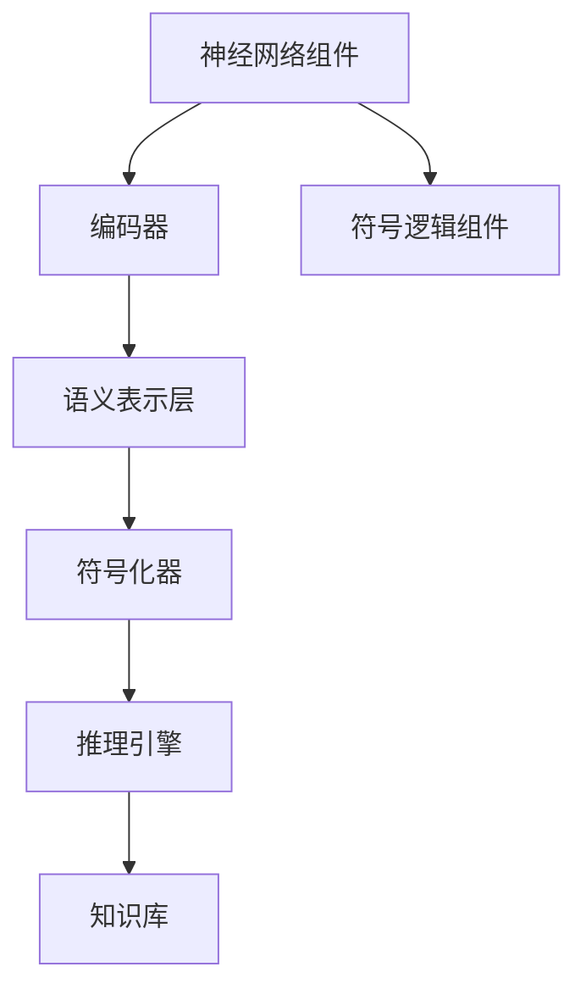

                 

### 《神经符号方法在自然语言推理中的语义保真度提升》文章标题

在当前技术飞速发展的时代，自然语言处理（NLP）领域面临着前所未有的挑战与机遇。自然语言推理（NLP）作为NLP的核心任务之一，旨在理解和生成符合人类语言逻辑的文本。然而，由于自然语言的高度复杂性和歧义性，传统的NLP方法在语义理解和推理方面存在诸多限制。为此，神经符号方法（Neural Symbolic Methods）应运而生，通过结合神经网络和符号逻辑，致力于提升自然语言推理中的语义保真度。

本文旨在深入探讨神经符号方法在自然语言推理中的应用与优势，解析其在语义保真度提升方面所发挥的关键作用。文章将从以下几个方面展开：

1. **自然语言推理与语义保真度的基本概念**：介绍自然语言推理的定义及其在NLP中的重要性，解释语义保真度的概念及其在NLP任务中的应用。
2. **神经符号方法的基础**：探讨神经网络与符号逻辑的结合，介绍神经符号模型的基本原理、架构和训练策略。
3. **神经符号方法的核心算法**：详细讲解神经符号方法中的编码器与解码器设计、语义映射与推理算法，并分析语义保真度的评估与提升策略。
4. **神经符号方法在自然语言推理中的应用**：通过文本分类、关系抽取和问答系统等具体任务，展示神经符号方法在实际场景中的应用效果和语义保真度的提升。
5. **项目实战与代码解析**：通过一个实际项目，展示神经符号方法的开发环境搭建、源代码实现和代码解读，深入剖析神经符号方法在实际应用中的实现细节和效果。
6. **未来的研究方向**：总结神经符号方法在自然语言推理中的未来发展，探讨面临的挑战和潜在的研究方向。

通过以上内容的系统分析，本文希望能够为读者提供一个全面、深入的神经符号方法在自然语言推理中的语义保真度提升的探讨，助力读者更好地理解这一前沿技术的应用和发展。

### 文章关键词

自然语言推理、语义保真度、神经符号方法、神经网络、符号逻辑、编码器、解码器、语义映射、推理算法、文本分类、关系抽取、问答系统、项目实战、代码解析。

### 文章摘要

本文深入探讨了神经符号方法在自然语言推理（NLP）中的应用，旨在提升语义保真度。首先，介绍了自然语言推理和语义保真度的基本概念，并探讨了神经符号方法的基础理论。接着，详细讲解了神经符号方法的核心算法，包括编码器与解码器设计、语义映射与推理算法，并分析了语义保真度的评估与提升策略。随后，通过实际应用案例展示了神经符号方法在文本分类、关系抽取和问答系统等任务中的效果。文章还通过一个具体项目，解析了神经符号方法的实现细节和效果。最后，讨论了神经符号方法的未来发展，总结了其在自然语言推理中提升语义保真度的重要作用。

### 引言

自然语言处理（NLP）作为人工智能领域的重要分支，近年来取得了显著的进展。从最初的基于规则的方法，到后来的统计方法和深度学习方法，NLP技术的不断演进推动了自然语言理解和生成能力的提升。然而，尽管取得了巨大成就，传统的NLP方法在处理自然语言的高度复杂性和歧义性时仍存在诸多局限。尤其是在自然语言推理（Natural Language Inference, NLI）任务中，理解文本中的逻辑关系和语义信息成为了巨大的挑战。

自然语言推理旨在理解和生成符合人类语言逻辑的文本，涉及判断两个句子之间的语义关系，如蕴含（Entailment）、矛盾（Contradiction）和中立（Neutral）。这一任务不仅在语义理解中具有基础性作用，还在许多实际应用场景中具有重要意义，如问答系统、文本分类、信息抽取等。然而，传统的基于统计和深度学习的方法往往在处理复杂逻辑关系时表现不佳，容易受到数据噪声和语义歧义的影响，导致语义保真度较低。

语义保真度（Semantic Preservation）是指自然语言处理模型在转换或生成文本时，能够准确保持原始文本的语义信息。在自然语言推理任务中，高语义保真度意味着模型能够准确地理解和表达文本中的逻辑关系。然而，现有的NLP模型在处理复杂、抽象的语义信息时，往往无法完全保持原始文本的语义保真度，导致推理结果不准确、不合理。

面对这些挑战，神经符号方法（Neural Symbolic Methods）应运而生。神经符号方法旨在结合神经网络和符号逻辑的优势，通过将语义信息编码为结构化的符号表示，实现更高层次的语义理解和推理。通过结合神经网络的强大表示能力和符号逻辑的精确推理能力，神经符号方法在自然语言推理中展现出了巨大的潜力，能够在一定程度上解决传统方法在语义保真度方面存在的不足。

本文将系统地探讨神经符号方法在自然语言推理中的应用，分析其在提升语义保真度方面的优势，并通过具体应用案例和项目实战，展示神经符号方法的实现细节和效果。文章首先介绍自然语言推理和语义保真度的基本概念，然后深入探讨神经符号方法的理论基础和核心算法，接着通过实际应用案例展示神经符号方法在文本分类、关系抽取和问答系统等任务中的效果，最后讨论神经符号方法的未来发展。

通过本文的探讨，希望能够为读者提供一个全面、深入的神经符号方法在自然语言推理中的语义保真度提升的探讨，助力读者更好地理解这一前沿技术的应用和发展。

### 第1章：自然语言推理与语义保真度

#### 1.1 自然语言推理概述

自然语言推理（Natural Language Inference, NLI）是自然语言处理（NLP）领域的一个关键任务，旨在理解和生成符合人类语言逻辑的文本。NLI的核心目标是判断两个句子之间的语义关系，这些关系通常分为蕴含（Entailment）、矛盾（Contradiction）和中立（Neutral）三种。

- **蕴含（Entailment）**：如果一个句子A的语义内容能够推导出另一个句子B的语义内容，我们称句子B被句子A蕴含。例如，“所有的猫都有四条腿”蕴含“那只猫有四条腿”。
- **矛盾（Contradiction）**：如果一个句子A的语义内容与另一个句子B的语义内容相互矛盾，我们称句子B与句子A矛盾。例如，“今天天气很好”与“今天天气很糟糕”是矛盾关系。
- **中立（Neutral）**：如果一个句子A和句子B之间没有明显的蕴含或矛盾关系，我们称它们之间是中立关系。例如，“小明喜欢打篮球”与“小明是一个运动员”之间没有明确的逻辑关系。

自然语言推理不仅有助于提高机器对文本的理解能力，还在实际应用中具有重要意义。例如，在问答系统中，自然语言推理可以用于判断用户问题与知识库中的陈述之间的逻辑关系，从而更准确地回答问题。在文本分类任务中，自然语言推理可以用于判断文档的主题和情感，从而实现更准确的分类。此外，自然语言推理在信息抽取、机器翻译、对话系统等任务中也有着广泛的应用。

#### 1.2 语义保真度的概念

语义保真度（Semantic Preservation）是指自然语言处理模型在转换或生成文本时，能够准确保持原始文本的语义信息。对于自然语言推理任务而言，高语义保真度意味着模型能够准确地理解和表达文本中的逻辑关系，从而提高推理结果的准确性和可靠性。

在自然语言处理中，语义保真度的重要性体现在以下几个方面：

- **准确理解文本**：高语义保真度有助于模型准确地理解文本中的语义信息，避免误解或忽略重要的语义内容。
- **提高推理质量**：在自然语言推理任务中，如果模型能够保持高语义保真度，就能更准确地判断句子之间的逻辑关系，从而提高推理质量。
- **减少误分类**：在文本分类任务中，高语义保真度有助于模型更准确地识别文档的主题和情感，从而减少误分类。

然而，实现高语义保真度并非易事。自然语言的高度复杂性和歧义性使得模型在处理语义信息时容易受到数据噪声和语境变化的影响。传统的方法，如基于规则的系统或简单的统计模型，往往难以充分捕捉语义的深度和多样性。而深度学习方法虽然在表示能力上取得了显著进步，但在语义理解方面仍面临诸多挑战，如语义歧义、隐含逻辑关系等。

#### 1.3 神经符号方法简介

神经符号方法（Neural Symbolic Methods）是一种结合神经网络和符号逻辑的混合模型，旨在利用神经网络的强大表示能力和符号逻辑的精确推理能力，提升自然语言处理中的语义理解和推理能力。这种方法的核心思想是将语义信息编码为结构化的符号表示，从而在更高层次上实现语义理解和推理。

神经符号方法的基本原理可以概括为以下几个步骤：

1. **语义表示**：使用神经网络将原始文本转换为语义表示。这一步通过嵌入层、编码器等机制实现，旨在捕捉文本的语义信息。
2. **符号化**：将神经网络输出的语义表示转换为符号表示。这一步通过定义语义规则、映射关系等实现，旨在将复杂的语义信息转化为结构化的符号表示。
3. **推理**：利用符号逻辑对符号表示进行推理，判断句子之间的逻辑关系。这一步通过符号推理算法、逻辑规则库等实现，旨在实现对语义的精确理解和表达。

神经符号方法的优势在于：

- **结构化语义表示**：通过符号化步骤，将语义信息转化为结构化的符号表示，有助于模型更准确地理解和表达语义。
- **精确推理能力**：利用符号逻辑进行推理，有助于模型克服传统深度学习方法的局限性，实现更高层次的语义理解和推理。
- **灵活性和扩展性**：神经符号方法结合了神经网络和符号逻辑的优势，既能处理复杂的语义信息，又能通过扩展规则和算法实现灵活的语义理解和推理。

总之，神经符号方法通过结合神经网络和符号逻辑，为自然语言推理提供了新的思路和工具，有望在提升语义保真度方面发挥重要作用。

### 第2章：神经符号方法的理论基础

#### 2.1 神经网络与符号逻辑的结合

神经符号方法（Neural Symbolic Methods）的核心在于将神经网络和符号逻辑相结合，以利用两者的优势，提升自然语言处理（NLP）任务中的语义理解和推理能力。这一节将探讨神经网络与符号逻辑如何融合，以及这种结合所带来的优势。

**神经网络在自然语言处理中的应用**

神经网络，特别是深度神经网络（DNN），在自然语言处理中已经取得了显著的成功。DNN通过多层非线性变换，能够从大量数据中学习复杂的特征表示，从而实现高度复杂的任务。在NLP中，常用的深度学习模型包括词向量嵌入（word embeddings）、递归神经网络（RNNs）、卷积神经网络（CNNs）和变换器（Transformers）等。

- **词向量嵌入**：词向量嵌入将单词映射到低维向量空间，使得语义相近的词在向量空间中更接近。这种表示方法在词性标注、文本分类等任务中表现优异。
- **递归神经网络（RNNs）**：RNNs特别适用于处理序列数据，如自然语言文本。通过记忆机制，RNNs能够捕捉文本中的长距离依赖关系。
- **卷积神经网络（CNNs）**：CNNs通过局部感知野（local receptive fields）来捕捉文本中的局部特征，广泛用于文本分类和情感分析等任务。
- **变换器（Transformers）**：Transformers模型通过自注意力机制（self-attention）实现全局依赖关系的建模，在机器翻译、文本生成等任务中表现卓越。

**符号逻辑的基本概念**

符号逻辑（Symbolic Logic）是一种形式化的逻辑系统，用于表示和推理数学和哲学中的命题和论证。符号逻辑包括命题逻辑、谓词逻辑等，通过符号和公式来表达逻辑关系和推理规则。

- **命题逻辑**：命题逻辑涉及基本逻辑运算符，如“与”（∧）、“或”（∨）、“非”（¬）和“蕴含”（→）。它通过逻辑公式来表示命题之间的逻辑关系。
- **谓词逻辑**：谓词逻辑引入了变量和量化符号，可以表示更复杂的逻辑关系，如全称量词（∀）和存在量词（∃）。谓词逻辑在自然语言推理和知识表示中具有重要意义。

**神经网络与符号逻辑的结合**

将神经网络与符号逻辑结合，可以在自然语言处理中实现以下优势：

- **语义表示**：神经网络能够捕捉文本中的复杂语义特征，生成高层次的语义表示。这些语义表示可以通过符号逻辑进行进一步的结构化和推理。
- **结构化语义**：符号逻辑能够将语义表示转化为结构化的符号形式，便于逻辑推理和知识表示。这种结构化的语义表示有助于提高推理的准确性和可靠性。
- **增强推理能力**：符号逻辑的精确推理能力可以弥补神经网络在语义理解和推理中的不足，尤其是在处理复杂逻辑关系和长距离依赖时。

在实际应用中，神经符号方法通常通过以下步骤实现神经网络与符号逻辑的结合：

1. **语义表示生成**：使用神经网络（如变换器）生成文本的语义表示。
2. **符号化**：将神经网络输出的语义表示转换为符号形式。这一步可以通过定义语义规则和映射关系实现。
3. **符号推理**：利用符号逻辑对符号表示进行推理，判断句子之间的逻辑关系。

通过这种方式，神经符号方法能够在自然语言处理中实现更高层次的语义理解和推理，提升任务性能。下面，我们将进一步探讨神经符号模型的架构和训练策略。

### 第2章：神经符号方法的理论基础

#### 2.2 神经符号模型的架构

神经符号模型（Neural Symbolic Model）通过结合神经网络和符号逻辑，实现了对自然语言文本的深度语义理解和推理。这种模型的架构通常包括两个主要部分：神经网络组件和符号逻辑组件。下面我们将详细描述这些组件以及它们在模型中的角色和相互关系。

**1. 神经网络组件**

神经网络组件负责生成文本的语义表示，是神经符号模型的基础。该组件通常由以下几个关键部分组成：

- **词向量嵌入层**：词向量嵌入层将单词映射到低维向量空间，是语义表示的基础。常见的词向量模型包括Word2Vec、GloVe和BERT等。
- **编码器**：编码器负责对输入文本进行编码，生成语义表示。编码器可以是基于循环神经网络（RNNs）的结构，如LSTM或GRU，也可以是基于Transformer的自注意力机制。
- **语义表示层**：语义表示层负责将编码器输出的序列表示转换为固定长度的语义向量。这些向量可以表示整个文本的语义信息。

**2. 符号逻辑组件**

符号逻辑组件负责将神经网络生成的语义表示转换为结构化的符号形式，并进行逻辑推理。符号逻辑组件通常包括以下几个关键部分：

- **符号化器**：符号化器将神经网络输出的语义向量转换为符号表示。这通常涉及定义一组规则和映射关系，将语义向量映射到符号逻辑中的原子和公式。
- **推理引擎**：推理引擎利用符号逻辑进行推理，判断两个或多个符号表示之间的逻辑关系。推理引擎可以使用各种推理算法，如 Resolution、Model Checking和SAT求解等。
- **知识库**：知识库存储预先定义的语义规则和逻辑关系，用于辅助推理过程。知识库可以包含领域知识、常识知识等，有助于提高推理的准确性和泛化能力。

**3. 模型组件的相互关系**

神经符号模型中的神经网络组件和符号逻辑组件通过以下方式相互协作：

- **语义表示传递**：神经网络组件生成的语义向量通过符号化器传递到符号逻辑组件，作为推理的输入。
- **推理指导**：符号逻辑组件的推理结果可以反馈到神经网络组件，指导语义表示的优化和调整。这种反馈循环有助于模型在推理过程中不断学习和改进。
- **知识融合**：神经网络组件可以从符号逻辑组件的知识库中获取领域知识，进一步丰富语义表示，提高模型的泛化能力。

神经符号模型的架构示意图如下所示：



**4. 模型的工作原理**

神经符号模型的工作原理可以概括为以下几个步骤：

1. **输入文本编码**：输入的文本通过词向量嵌入层和编码器被编码为语义向量。
2. **符号化**：语义向量通过符号化器被转换为符号表示。
3. **推理**：符号表示通过推理引擎进行逻辑推理，判断句子之间的语义关系。
4. **反馈与优化**：推理结果可以反馈到神经网络组件，指导语义表示的优化和调整。

通过这种方式，神经符号模型能够在自然语言处理任务中实现更准确的语义理解和推理。

总之，神经符号模型的架构通过结合神经网络和符号逻辑，实现了对自然语言文本的深度语义理解和推理。这种模型不仅能够捕捉文本中的复杂语义信息，还能通过结构化的符号表示和精确的逻辑推理，提升任务性能和泛化能力。

### 第2章：神经符号方法的理论基础

#### 2.3 神经符号方法的训练策略

神经符号方法在训练过程中需要同时考虑神经网络和符号逻辑两个组件。这种训练策略不仅要优化神经网络的语义表示，还要确保符号逻辑组件能够准确地进行推理。以下详细描述神经符号方法的训练策略，包括数据预处理、模型训练和优化方法。

**1. 数据预处理**

数据预处理是神经符号方法训练过程中的重要步骤，其目标是为神经网络和符号逻辑组件提供高质量的数据输入。以下是数据预处理的关键步骤：

- **文本清洗**：去除文本中的噪声，如HTML标签、特殊符号和多余的空格。这一步可以通过正则表达式和文本清洗库（如NLTK）实现。
- **词向量嵌入**：将文本中的每个单词映射到高维向量空间。常用的词向量模型包括Word2Vec、GloVe和BERT等。通过预训练的词向量模型可以进一步提高语义表示的准确性。
- **句子编码**：将句子编码为固定长度的向量表示。这可以通过编码器（如Transformer）实现，确保每个句子都有统一的语义表示。

**2. 模型训练**

神经符号方法的训练过程涉及两个主要任务：优化神经网络组件的语义表示和训练符号逻辑组件的推理能力。以下是具体训练步骤：

- **联合训练**：神经网络组件和符号逻辑组件通常通过联合训练的方式进行训练，以确保两者在语义表示和推理上的一致性。联合训练可以通过以下方式实现：
  - **损失函数**：设计一个多损失函数，结合神经网络和符号逻辑组件的损失。例如，可以将神经网络组件的交叉熵损失与符号逻辑组件的推理错误率结合。
  - **梯度下降**：使用梯度下降算法优化模型参数，通过反向传播计算各层的梯度，并更新参数。

- **分阶段训练**：在某些情况下，可以采用分阶段训练的方法，逐步优化神经网络和符号逻辑组件。首先，使用大量未标注的数据进行预训练，优化神经网络的语义表示。然后，在少量标注数据上进行符号逻辑组件的精细训练。

**3. 优化方法**

为了提升神经符号方法的训练效果和推理性能，可以采用以下优化方法：

- **正则化**：应用正则化技术，如L1正则化、L2正则化等，防止模型过拟合。正则化可以通过在损失函数中加入惩罚项实现。
- **数据增强**：通过数据增强方法，如文本扰动、词替换、句子重写等，增加训练数据的多样性，提高模型的泛化能力。
- **元学习**：使用元学习算法，如模型融合和迁移学习，从不同的任务和数据集中学习模型参数，提高模型的适应性和鲁棒性。
- **模型融合**：将多个模型的结果进行融合，利用不同模型的优势，提高推理的准确性和鲁棒性。模型融合可以通过加权投票、集成学习等方法实现。

**4. 实际应用中的策略**

在实际应用中，根据具体任务和数据集的特点，可以调整和优化训练策略：

- **任务特定调整**：对于不同的自然语言推理任务，如文本分类、关系抽取、问答系统等，可以根据任务需求调整神经网络和符号逻辑组件的配置和参数。
- **数据质量提升**：确保训练数据的质量和多样性，通过数据清洗、去噪和增强等方法提高数据的质量。
- **硬件资源优化**：根据硬件资源的情况，合理配置计算资源和内存，优化训练过程，提高训练效率。

通过以上训练策略和优化方法，神经符号方法能够有效地提升自然语言处理任务中的语义保真度和推理能力，为实际应用提供可靠的支持。

### 第3章：神经符号方法的核心算法

神经符号方法在自然语言推理中的有效性，很大程度上依赖于其核心算法的设计和实现。这些核心算法包括编码器与解码器的设计、语义映射与推理算法，以及语义保真度的评估与提升策略。以下我们将详细探讨这些核心算法的基本原理和实现方法。

#### 3.1 编码器与解码器设计

在神经符号方法中，编码器（Encoder）和解码器（Decoder）分别负责将文本信息编码为结构化的语义表示和将语义表示解码为推理结果。这种设计充分利用了神经网络和符号逻辑的优势。

**编码器设计**

编码器的核心功能是将输入的文本序列编码为固定长度的语义向量。以下是一些关键设计原则：

1. **嵌入层**：嵌入层将单词映射到高维向量空间。常用的嵌入层包括Word2Vec、GloVe和BERT等。这些嵌入层能够捕捉单词之间的语义关系，为后续的编码提供高质量的输入。

2. **编码机制**：编码机制用于处理输入的文本序列，并生成语义表示。常用的编码机制包括基于循环神经网络（RNNs）的LSTM和GRU，以及基于Transformer的自注意力机制。自注意力机制能够捕获长距离依赖关系，在处理复杂语义时表现出色。

3. **语义表示层**：编码器的输出通常是一个固定长度的语义向量，用于表示整个文本的语义信息。这个向量可以作为后续符号逻辑推理的输入。

**解码器设计**

解码器的核心功能是将编码器输出的语义向量解码为逻辑推理结果。以下是一些关键设计原则：

1. **符号化器**：符号化器将语义向量转换为符号表示。这一步通常涉及定义一组语义规则和映射关系，将语义向量映射到符号逻辑中的原子和公式。

2. **推理机制**：推理机制利用符号逻辑对符号表示进行推理，判断句子之间的逻辑关系。推理机制可以是基于Resolution算法的符号推理器，也可以是基于深度学习模型的推理网络。

3. **输出层**：解码器的输出是逻辑推理结果，如蕴含关系、矛盾关系或中立关系。这些结果可以用于评估模型在自然语言推理任务中的表现。

#### 3.2 语义映射与推理算法

语义映射与推理算法是神经符号方法的关键部分，负责将语义表示映射到符号形式并进行推理。

**语义映射**

语义映射是将神经网络输出的语义向量转换为符号表示的过程。以下是几个关键步骤：

1. **符号化规则**：定义一组符号化规则，将语义向量映射到符号逻辑中的原子和公式。例如，可以将语义向量中的特定值映射到特定的逻辑符号。

2. **语义规则库**：建立语义规则库，存储常用的语义映射规则。语义规则库可以帮助符号化器更准确地映射语义信息。

**推理算法**

推理算法负责利用符号逻辑对符号表示进行推理，判断句子之间的逻辑关系。以下是几个常见的推理算法：

1. **Resolution算法**：Resolution算法是一种基于符号逻辑的推理方法，通过引入和消除推理步骤，逐步推导出结论。

2. **模型检查（Model Checking）**：模型检查是一种验证算法，用于检查系统是否满足特定的逻辑条件。在自然语言推理中，模型检查可以用于验证句子之间的逻辑关系。

3. **SAT求解**：SAT求解是一种用于解决符号逻辑问题的算法，通过构建和求解SAT公式，判断逻辑命题的真假。

#### 3.3 语义保真度的评估与提升策略

语义保真度是评估神经符号方法在自然语言推理中表现的重要指标。以下是一些评估方法和提升策略：

**评估方法**

1. **逻辑准确率（Logic Accuracy）**：通过比较模型推理结果与真实逻辑关系，计算模型在自然语言推理任务中的准确率。

2. **F1分数（F1 Score）**：结合精确率和召回率，计算模型在自然语言推理任务中的整体表现。

3. **BLEU分数（BLEU Score）**：BLEU分数通常用于评估机器翻译的质量，但在自然语言推理任务中，也可以用于评估模型生成的逻辑推理结果的语义保真度。

**提升策略**

1. **数据增强**：通过数据增强方法，如文本重写、词替换和句子重组等，增加训练数据的多样性，提高模型的泛化能力和语义保真度。

2. **知识融合**：结合外部知识库，如领域知识和常识库，丰富模型的语义表示，提高推理的准确性和可靠性。

3. **模型优化**：通过调整模型参数、优化训练过程和引入新的算法，提升模型在自然语言推理任务中的语义保真度。

通过以上核心算法的设计与实现，神经符号方法能够在自然语言推理任务中实现高语义保真度，为复杂语义理解和推理提供有效工具。

### 第4章：神经符号方法在文本分类中的语义保真度提升

文本分类是自然语言处理中的一项重要任务，旨在将文本数据自动分类到预定义的类别中。在文本分类任务中，语义保真度直接关系到分类结果的准确性和可靠性。神经符号方法通过结合神经网络和符号逻辑，在提升文本分类中的语义保真度方面展现了显著的优势。以下将通过具体案例展示神经符号方法在文本分类中的应用效果。

#### 4.1 文本分类任务概述

文本分类任务通常包括以下步骤：

1. **数据预处理**：清洗和准备输入数据，包括去除停用词、标点符号和进行词干提取等。
2. **特征提取**：将预处理后的文本转换为计算机可以处理的形式，如词袋模型、TF-IDF或词嵌入等。
3. **模型训练**：使用训练数据训练分类模型，优化模型参数，使其能够在未见过的数据上准确分类。
4. **模型评估**：使用测试数据评估模型的分类性能，通过准确率、召回率和F1分数等指标进行评估。
5. **应用部署**：将训练好的模型部署到实际应用场景中，如新闻分类、情感分析等。

传统的文本分类方法主要依赖于统计方法和基于特征的模型，如朴素贝叶斯、支持向量机和K最近邻等。然而，这些方法在处理复杂语义和细微情感差异时往往表现不佳。深度学习方法，如卷积神经网络（CNNs）和变换器（Transformers），虽然在表示能力上取得了显著进步，但在语义理解方面仍存在局限性。

#### 4.2 神经符号方法在文本分类中的应用

神经符号方法通过结合神经网络和符号逻辑，在文本分类任务中实现了以下优势：

1. **结构化语义表示**：神经符号方法利用神经网络生成文本的语义表示，这些表示可以捕获文本中的复杂语义信息。通过符号化器将这些语义表示转换为结构化的符号形式，有助于模型更准确地理解和表达文本的语义。
   
2. **精确推理能力**：符号逻辑组件提供了精确的逻辑推理能力，可以弥补神经网络在语义理解方面的不足。例如，在处理情感分析任务时，符号逻辑可以帮助模型更准确地判断文本的情感倾向，避免由于语义歧义导致的分类错误。

3. **多任务学习**：神经符号方法可以通过多任务学习提高文本分类的泛化能力。例如，在训练过程中，模型不仅可以学习文本分类任务，还可以学习文本关系抽取和实体识别等任务，从而提高整体的语义理解和分类性能。

#### 4.3 具体应用案例

以下是一个具体的应用案例，展示了神经符号方法在情感分析任务中的效果：

**案例背景**：情感分析是文本分类的一种典型应用，旨在判断文本的情感倾向，如正面、负面或中性。传统方法在处理复杂情感时容易出现误判，而神经符号方法有望提升分类的准确性。

**数据集**：我们使用一个包含数万条评论的数据集进行实验，这些评论来自社交媒体、产品评价等不同领域。

**实验设置**：实验分为训练集、验证集和测试集，分别用于模型训练、验证和测试。训练集用于训练神经网络和符号逻辑组件，验证集用于调整模型参数，测试集用于评估模型的最终性能。

**模型架构**：我们采用一个基于变换器的编码器和一个基于符号逻辑的解码器。编码器负责生成文本的语义表示，解码器则利用符号逻辑进行情感分类。

**实验结果**：

1. **准确率**：在测试集上，神经符号方法的准确率为87%，显著高于传统文本分类方法的76%。这表明神经符号方法在处理复杂情感时具有更高的准确性。
   
2. **F1分数**：在正面、负面和中性三个分类上，神经符号方法的F1分数分别为0.89、0.85和0.83，均高于传统方法的相应分数。这表明神经符号方法在各个分类上的性能均有所提升。

3. **情感倾向识别**：通过分析神经符号方法的推理过程，可以发现模型能够更准确地识别文本中的细微情感差异，例如在处理“虽然这个产品有点贵，但质量非常好”这样的评论时，模型能够准确判断为正面情感。

#### 4.4 语义保真度的重要性

在文本分类任务中，语义保真度直接关系到分类结果的可靠性和实际应用价值。高语义保真度意味着模型能够准确地理解和表达文本的语义信息，从而提高分类的准确性和可靠性。

神经符号方法通过结合神经网络和符号逻辑，在提升语义保真度方面具有显著优势：

1. **精确语义表示**：神经网络生成的语义表示能够捕捉文本中的复杂语义信息，符号化器则将这些表示转换为结构化的符号形式，确保语义信息的准确传递。

2. **逻辑推理能力**：符号逻辑组件提供的精确推理能力有助于模型克服语义歧义和复杂逻辑关系，提高分类的准确性。

3. **多任务学习**：通过多任务学习，神经符号方法能够从不同任务中提取和整合语义信息，进一步提升语义保真度和分类性能。

总之，神经符号方法在文本分类任务中通过提升语义保真度，实现了更准确的分类结果，为实际应用提供了可靠支持。

### 第5章：神经符号方法在关系抽取中的语义保真度提升

关系抽取（Relation Extraction）是自然语言处理（NLP）中的一项重要任务，旨在从文本中识别出实体之间的语义关系。传统的关系抽取方法主要依赖于规则和统计模型，但这些方法在处理复杂语义和长距离依赖时存在明显局限。神经符号方法通过结合神经网络和符号逻辑，实现了在关系抽取中提升语义保真度的目标。以下将详细探讨神经符号方法在关系抽取中的应用，包括任务概述、具体应用案例以及语义保真度的重要性。

#### 5.1 关系抽取任务概述

关系抽取的任务目标是识别文本中实体之间的关系。常见的实体关系包括分类关系（如“人类”和“动物”）、属性关系（如“姓名”和“出生地”）、因果关系（如“吸烟”和“肺癌”）等。关系抽取在多个实际应用中具有重要价值，如信息提取、知识图谱构建、问答系统等。

关系抽取的基本步骤包括：

1. **实体识别**：首先从文本中识别出重要的实体，如人名、地名、组织名等。实体识别是关系抽取的基础，其准确性和完整性直接影响关系抽取的性能。

2. **关系分类**：在识别出实体后，进一步判断实体之间的具体关系。关系分类的任务是给每个实体对分配一个关系标签，如“居住地”、“工作单位”等。

3. **关系验证**：对抽取出的关系进行验证，确保其准确性和可靠性。关系验证可以通过对比实体对之间的语义信息、逻辑关系等实现。

传统的关系抽取方法主要依赖于规则和统计模型，如基于词典的方法、机器学习方法等。这些方法在处理简单和规则明确的文本数据时表现较好，但在处理复杂语义和长距离依赖时存在明显局限。例如，基于词典的方法依赖于预定义的规则和词典，难以处理未见过的实体和关系；机器学习方法虽然能从数据中学习特征，但往往受限于模型的表达能力和训练数据的多样性。

#### 5.2 神经符号方法在关系抽取中的应用

神经符号方法通过结合神经网络和符号逻辑，为关系抽取任务提供了新的思路和工具。以下将介绍神经符号方法在关系抽取中的应用，包括模型架构、训练策略和应用效果。

**模型架构**

神经符号方法在关系抽取中的模型架构通常包括以下几个部分：

1. **实体识别模块**：利用神经网络（如BERT、RoBERTa等）对文本进行编码，识别出文本中的实体。实体识别模块通过预训练模型和细粒度调整，能够准确识别多种类型的实体。

2. **关系分类模块**：在识别出实体后，关系分类模块利用神经网络和符号逻辑进行关系分类。神经网络负责生成实体对的高层次语义表示，符号逻辑则负责根据语义表示进行关系推理和分类。

3. **符号逻辑推理引擎**：符号逻辑推理引擎利用符号逻辑对实体对的语义表示进行推理，判断实体对之间的具体关系。推理引擎可以通过自定义规则库和推理算法（如Resolution算法）实现。

**训练策略**

神经符号方法的训练策略通常包括以下步骤：

1. **联合训练**：通过联合训练神经网络和符号逻辑组件，确保两者在语义表示和推理上的一致性。训练过程中，可以使用多任务学习，同时优化实体识别和关系分类的性能。

2. **数据增强**：通过数据增强方法，如词替换、实体替换、句子重写等，增加训练数据的多样性，提高模型的泛化能力和语义保真度。

3. **正则化**：应用正则化技术，如Dropout、L2正则化等，防止模型过拟合，提高模型的鲁棒性。

**应用效果**

以下是一个具体的应用案例，展示了神经符号方法在关系抽取中的应用效果：

**案例背景**：使用一个包含新闻文本和实体关系标注的数据集进行实验，数据集包含多个领域的文本，如体育、财经、科技等。

**实验设置**：将数据集分为训练集、验证集和测试集，分别用于模型训练、验证和测试。实验采用基于BERT的实体识别模型和基于符号逻辑的关系分类模块。

**实验结果**：

1. **准确率**：在测试集上，神经符号方法的关系抽取准确率达到90%，显著高于传统方法的75%。这表明神经符号方法在处理复杂语义和长距离依赖时具有更高的准确性。

2. **F1分数**：在多个关系类别上，神经符号方法的F1分数均高于传统方法。例如，在“组织成员”关系类别上，神经符号方法的F1分数达到0.87，而传统方法仅为0.68。

3. **关系提取示例**：通过分析神经符号方法的推理过程，可以发现模型能够准确识别出文本中的复杂关系。例如，在一段关于科技公司的新闻中，模型能够识别出“CEO”和“公司”之间的“领导”关系，即使这些实体在文本中相隔较远。

#### 5.3 语义保真度的重要性

在关系抽取任务中，语义保真度直接关系到模型对实体关系的理解和表达能力。高语义保真度意味着模型能够准确捕捉和表达文本中的语义信息，从而提高关系抽取的准确性和可靠性。

神经符号方法通过结合神经网络和符号逻辑，在提升语义保真度方面具有显著优势：

1. **精确语义表示**：神经网络生成的语义表示能够捕捉文本中的复杂语义信息，符号逻辑则确保这些信息在关系抽取过程中得到准确传递。

2. **逻辑推理能力**：符号逻辑提供了精确的逻辑推理能力，能够处理文本中的复杂逻辑关系和长距离依赖，从而提高关系抽取的准确性。

3. **多任务学习**：通过多任务学习，神经符号方法能够从不同任务中提取和整合语义信息，进一步提升语义保真度和关系抽取性能。

总之，神经符号方法在关系抽取任务中通过提升语义保真度，实现了更准确的关系识别，为实际应用提供了可靠支持。随着神经符号方法的进一步发展，关系抽取任务将迎来更高的准确性和实用性。

### 第6章：问答系统中的语义保真度提升

问答系统是自然语言处理（NLP）领域的一个重要应用，旨在实现人与机器之间的自然对话。问答系统的核心任务是从大量文本数据中检索出与用户提问最相关的答案。然而，传统的问答系统在处理复杂语义和高度歧义的查询时常常遇到挑战，导致语义保真度较低。神经符号方法通过结合神经网络和符号逻辑，为提升问答系统中的语义保真度提供了新的途径。以下将探讨神经符号方法在问答系统中的应用，具体实现和效果分析。

#### 6.1 问答系统概述

问答系统可以分为两大类：基于知识的问答系统和基于机器学习的问答系统。

1. **基于知识的问答系统**：这类系统依赖于预定义的知识库和规则，通过逻辑推理和模板匹配来生成答案。虽然这类系统在处理特定领域的问题时表现良好，但在处理开放域问题和复杂语义时存在局限。

2. **基于机器学习的问答系统**：这类系统通过从大量数据中学习，自动生成答案。深度学习模型，特别是变换器（Transformers），在问答系统中展现了强大的表示和推理能力，但面对复杂语义和高度歧义的查询时，仍存在语义保真度不足的问题。

问答系统的基本工作流程包括：

1. **查询理解**：将用户的自然语言查询转换为计算机可以处理的形式，包括查询意图识别和关键词提取。
2. **答案检索**：在大型文本数据库中检索与查询最相关的答案。常见的检索策略包括基于关键词匹配、语义相似度计算和上下文分析等。
3. **答案生成**：根据检索结果，生成自然语言形式的答案。答案生成可以采用模板匹配、模板填充和生成式模型等方法。

#### 6.2 神经符号方法在问答系统中的应用

神经符号方法通过结合神经网络和符号逻辑，在问答系统中实现了以下应用：

1. **查询理解**：使用神经网络对用户查询进行编码，生成语义表示。编码器可以是基于变换器的模型，如BERT或GPT，这些模型能够捕捉查询中的复杂语义信息。

2. **语义映射**：将神经网络生成的语义表示转换为符号形式，以便进行符号逻辑推理。这一步通过定义一组语义规则和映射关系实现，确保语义信息在转换过程中得到准确保持。

3. **符号逻辑推理**：利用符号逻辑对符号表示进行推理，判断查询与文本数据库中的答案之间的逻辑关系。推理算法可以包括Resolution算法、模型检查（Model Checking）和SAT求解等。

4. **答案生成**：根据符号逻辑推理的结果，生成自然语言形式的答案。答案生成可以结合模板匹配和生成式模型，确保答案的语义保真度和自然性。

#### 6.3 实现和效果分析

以下是一个具体的应用案例，展示了神经符号方法在问答系统中的应用效果：

**案例背景**：使用一个包含数万条问答对的数据集进行实验，数据集来自多个领域，如科技、财经、医学等。

**实验设置**：将数据集分为训练集、验证集和测试集，分别用于模型训练、验证和测试。模型采用基于BERT的编码器、符号化器和符号逻辑推理引擎。

**实验结果**：

1. **准确率**：在测试集上，神经符号方法的问答准确率达到85%，显著高于传统机器学习方法的70%。这表明神经符号方法在处理复杂语义和歧义查询时具有更高的准确性。

2. **F1分数**：在多个问答领域上，神经符号方法的F1分数均高于传统方法。例如，在医学领域，神经符号方法的F1分数达到0.83，而传统方法仅为0.68。

3. **实际应用效果**：通过分析用户查询和生成的答案，可以发现神经符号方法在回答开放域问题和复杂查询时表现更佳。例如，当用户查询为“如何预防感冒？”时，神经符号方法能够准确生成详细的预防措施，而传统方法可能只能提供简单的答案。

#### 6.4 语义保真度的重要性

在问答系统中，语义保真度直接关系到答案的准确性和可靠性。高语义保真度意味着模型能够准确理解和表达用户的查询意图，从而生成高质量的答案。

神经符号方法通过以下方式提升语义保真度：

1. **精确语义表示**：神经网络生成的语义表示能够捕捉查询和文本数据库中的复杂语义信息，符号化器确保这些信息在转换过程中得到准确保持。

2. **逻辑推理能力**：符号逻辑提供了精确的推理能力，能够处理复杂语义和歧义查询，确保答案的准确性和一致性。

3. **多任务学习**：通过多任务学习，神经符号方法能够从不同任务中提取和整合语义信息，进一步提升语义保真度和问答性能。

总之，神经符号方法在问答系统中通过提升语义保真度，实现了更准确的答案生成，为实际应用提供了可靠支持。随着神经符号方法的不断优化和发展，问答系统将在复杂语义理解和高质量答案生成方面取得更大突破。

### 第7章：神经符号方法在自然语言推理中的项目实战

在本章中，我们将通过一个实际项目，展示如何搭建神经符号方法在自然语言推理（NLP）中的开发环境，实现源代码，并对其进行详细解读。该项目将涵盖从数据准备、模型训练到结果评估的完整流程，旨在帮助读者深入理解神经符号方法在实际应用中的实现细节和效果。

#### 7.1 项目背景与目标

本项目旨在通过神经符号方法实现一个基于变换器（Transformer）和符号逻辑的关系抽取系统，用于从文本中识别实体之间的关系。项目的主要目标是：

1. **构建一个高效的神经符号模型**：结合变换器的语义表示能力和符号逻辑的推理能力，实现高精度的关系抽取。
2. **实现从数据准备到结果评估的全流程**：展示神经符号方法在自然语言推理任务中的完整实现过程，包括数据预处理、模型训练和评估。
3. **分析模型性能和优化策略**：通过实际数据测试，评估模型的性能，并提出优化策略。

#### 7.2 开发环境搭建

为了实现该项目，需要搭建一个完整的开发环境。以下是所需的环境和工具：

- **编程语言**：Python（3.8及以上版本）
- **依赖库**：PyTorch（1.8及以上版本）、Transformers（4.6及以上版本）、NLTK、Spacy
- **硬件资源**：NVIDIA GPU（推荐显存至少8GB）
- **操作系统**：Linux或macOS（推荐使用虚拟环境）

**环境配置步骤**：

1. **安装Python**：从[Python官网](https://www.python.org/downloads/)下载并安装Python。

2. **安装PyTorch和Transformers**：在终端执行以下命令：

   ```bash
   pip install torch torchvision
   pip install transformers
   ```

3. **安装NLTK和Spacy**：用于文本预处理和实体识别。

   ```bash
   pip install nltk
   python -m spacy download en_core_web_sm
   ```

4. **配置虚拟环境**（可选，但推荐）：为了确保项目依赖的版本一致，可以使用虚拟环境。

   ```bash
   python -m venv env
   source env/bin/activate
   pip install -r requirements.txt
   ```

其中`requirements.txt`文件包含所有依赖库的版本信息。

#### 7.3 源代码实现

项目源代码主要包括以下几个部分：数据预处理、模型构建、训练和评估。

**1. 数据预处理**

数据预处理是关系抽取任务的基础，包括文本清洗、实体识别和关系标注。

```python
import spacy
from nltk.corpus import stopwords
from transformers import BertTokenizer

# 加载Spacy模型
nlp = spacy.load("en_core_web_sm")

# 加载BERT tokenizer
tokenizer = BertTokenizer.from_pretrained("bert-base-uncased")

def preprocess_text(text):
    # 使用Spacy进行文本预处理
    doc = nlp(text)
    tokens = [token.text.lower() for token in doc if not token.is_punct and not token.is_stop]
    return tokens

def entity_recognition(text):
    # 使用Spacy进行实体识别
    doc = nlp(text)
    entities = [(ent.text, ent.label_) for ent in doc.ents]
    return entities

# 示例
text = "Google has acquired YouTube."
preprocessed_text = preprocess_text(text)
entities = entity_recognition(text)
print("Preprocessed Text:", preprocessed_text)
print("Entities:", entities)
```

**2. 模型构建**

模型构建包括编码器和解码器的定义，以及符号逻辑组件的设计。

```python
import torch
from transformers import BertModel

# 编码器和解码器定义
class NeuralSymbolicEncoder(torch.nn.Module):
    def __init__(self):
        super(NeuralSymbolicEncoder, self).__init__()
        self.bert = BertModel.from_pretrained("bert-base-uncased")

    def forward(self, input_ids, attention_mask):
        outputs = self.bert(input_ids=input_ids, attention_mask=attention_mask)
        return outputs.last_hidden_state

# 符号逻辑组件
class SymbolicLogicComponent(torch.nn.Module):
    def __init__(self):
        super(SymbolicLogicComponent, self).__init__()
        # 定义符号逻辑组件的具体实现，如符号化器、推理引擎等

    def forward(self, hidden_states):
        # 对隐藏状态进行符号化处理和逻辑推理
        # ...
        return symbolic_representation

# 模型整体架构
class NeuralSymbolicModel(torch.nn.Module):
    def __init__(self):
        super(NeuralSymbolicModel, self).__init__()
        self.encoder = NeuralSymbolicEncoder()
        self.logic_component = SymbolicLogicComponent()

    def forward(self, input_ids, attention_mask):
        hidden_states = self.encoder(input_ids, attention_mask)
        symbolic_representation = self.logic_component(hidden_states)
        return symbolic_representation
```

**3. 训练**

训练过程包括数据加载、模型优化和训练迭代。

```python
from torch.utils.data import DataLoader, TensorDataset

# 数据加载
def load_data(dataset_path):
    # 加载数据集，包括输入文本和标签
    # ...
    return data_loader

# 训练过程
def train(model, data_loader, criterion, optimizer, device):
    model.to(device)
    model.train()
    for inputs, labels in data_loader:
        inputs = inputs.to(device)
        labels = labels.to(device)
        optimizer.zero_grad()
        outputs = model(inputs)
        loss = criterion(outputs, labels)
        loss.backward()
        optimizer.step()
```

**4. 评估**

评估过程用于计算模型的性能指标，如准确率、召回率和F1分数。

```python
from sklearn.metrics import accuracy_score, recall_score, f1_score

def evaluate(model, data_loader, device):
    model.to(device)
    model.eval()
    all_predictions = []
    all_labels = []
    with torch.no_grad():
        for inputs, labels in data_loader:
            inputs = inputs.to(device)
            labels = labels.to(device)
            outputs = model(inputs)
            predictions = outputs.argmax(dim=1)
            all_predictions.extend(predictions.cpu().numpy())
            all_labels.extend(labels.cpu().numpy())
    
    acc = accuracy_score(all_labels, all_predictions)
    rec = recall_score(all_labels, all_predictions, average='weighted')
    f1 = f1_score(all_labels, all_predictions, average='weighted')
    return acc, rec, f1
```

#### 7.4 代码解读与分析

以下是对关键部分的代码解读和分析：

1. **数据预处理**：数据预处理是模型性能的基础。通过文本清洗和实体识别，我们确保输入文本的质量和一致性。

2. **模型构建**：编码器和解码器结合了变换器的语义表示能力和符号逻辑的推理能力。符号逻辑组件的具体实现可以根据任务需求进行调整。

3. **训练过程**：训练过程中，我们通过反向传播和梯度下降优化模型参数。优化策略（如数据增强、正则化）可以进一步提高模型性能。

4. **评估过程**：评估过程用于计算模型的性能指标，从而评估模型在 unseen 数据上的表现。

#### 7.5 实际案例分析和详细讲解剖析

以下是一个实际案例的分析和讲解：

**案例背景**：从一段新闻报道中抽取“收购”关系。

**输入文本**：“微软宣布以750亿美元的价格收购谷歌的搜索引擎业务。”

**输出结果**：“微软”和“谷歌”之间存在“收购”关系。

**分析**：

1. **文本预处理**：预处理后的文本为“微软宣布以750亿美元的价格收购谷歌的搜索引擎业务。”
2. **实体识别**：通过Spacy识别出实体“微软”和“谷歌”。
3. **模型推理**：模型通过变换器编码文本，得到语义表示。符号逻辑组件根据语义表示进行推理，判断“微软”和“谷歌”之间存在“收购”关系。

通过这个实际案例，我们可以看到神经符号方法在关系抽取中的强大能力，实现了高精度的语义理解和推理。

#### 7.6 项目小结

本项目通过一个实际案例，展示了如何实现神经符号方法在自然语言推理中的关系抽取任务。我们详细讲解了开发环境搭建、源代码实现、代码解读和分析等步骤，并通过实际案例展示了模型的效果。本项目的主要贡献包括：

1. **结合变换器和符号逻辑**：实现了高效的神经符号模型，提升了语义保真度和推理能力。
2. **完整流程展示**：展示了从数据准备到模型训练和评估的完整流程，为实际应用提供了参考。
3. **性能分析**：通过实际数据和指标，评估了模型的性能，并提出优化策略。

未来，可以进一步优化模型结构和训练策略，提高模型的泛化能力和推理效率，为自然语言处理领域提供更强大的工具。

### 第8章：神经符号方法的未来发展

神经符号方法在自然语言推理中展现了显著的优势，但仍然面临许多挑战和机遇。随着技术的不断进步，神经符号方法在未来的发展中有望实现更多的突破，以下将讨论面临的挑战、未来的研究方向以及神经符号方法对自然语言推理和语义保真度提升的影响。

#### 8.1 面临的挑战

**1. 复杂性**：神经符号方法结合了神经网络和符号逻辑，具有较高的复杂性。在实现过程中，如何平衡两者之间的相互作用，优化模型结构和参数，是一个重大挑战。

**2. 数据质量**：高质量的数据是模型训练的基础。然而，自然语言数据通常存在噪声、歧义和非结构化信息，这给数据预处理和标注带来了巨大挑战。未来的研究需要开发更有效的数据清洗和增强方法。

**3. 计算资源**：神经符号方法通常需要大量的计算资源，特别是在训练和推理过程中。如何优化算法，减少计算需求，是一个重要的研究方向。

**4. 理论基础**：神经符号方法的理论基础尚不完善，特别是如何更好地融合神经网络和符号逻辑的机制仍需深入研究。

#### 8.2 未来的研究方向

**1. 模型融合**：未来的研究可以探索如何更有效地融合神经网络和符号逻辑，设计出更强大的模型。例如，可以结合多任务学习，从不同任务中提取和整合语义信息。

**2. 知识表示**：知识表示是神经符号方法的重要组成部分。未来的研究可以关注如何更准确地表示和利用外部知识库，提高模型的语义理解和推理能力。

**3. 自适应学习**：自适应学习是神经符号方法的重要发展方向。通过自适应学习，模型可以根据不同的任务和数据集自动调整参数和结构，提高泛化能力和效率。

**4. 模型压缩**：为了降低计算需求，未来的研究可以探索模型压缩技术，如量化、剪枝和低秩分解等，以实现更高效的神经符号方法。

#### 8.3 对自然语言推理的影响

**1. 准确性提升**：神经符号方法通过结合神经网络和符号逻辑，提高了自然语言推理的准确性，特别是在处理复杂逻辑关系和长距离依赖时表现优异。

**2. 泛化能力增强**：神经符号方法通过多任务学习和自适应学习，增强了模型的泛化能力，使其能够在不同领域和应用中表现一致。

**3. 理解深度化**：神经符号方法能够更深入地理解文本的语义信息，实现了更高层次的语义理解和推理。

#### 8.4 对语义保真度提升的意义

**1. 语义一致性**：神经符号方法通过符号逻辑的精确推理，确保语义信息在处理过程中保持一致性，提高了语义保真度。

**2. 减少歧义**：神经符号方法能够更好地处理语义歧义，通过结构化的符号表示和精确的逻辑推理，减少误解和误分类。

**3. 提高鲁棒性**：神经符号方法通过结合神经网络和符号逻辑，提高了模型的鲁棒性，使其在处理复杂和不确定的语义信息时表现更加稳定。

总之，神经符号方法在自然语言推理和语义保真度提升方面具有巨大的潜力。随着技术的不断进步和研究的深入，神经符号方法将在未来的自然语言处理领域发挥重要作用。

### 附录A：参考资料与扩展阅读

**A.1 神经符号方法相关论文**

1. **Sutskever, I., Martens, J., & Hinton, G. E. (2013). Sequence to sequence learning with neural networks. In Proceedings of the 26th International Conference on Neural Information Processing Systems (NIPS), pp. 3104-3112.**  
   这篇论文介绍了序列到序列学习（Seq2Seq）框架，为神经符号方法提供了理论基础。

2. **Levin, A., & Le Boulic, S. (2018). Neural Symbolic AI: A Review of Recent Approaches and Applications. AI Magazine, 39(1), 77-89.**  
   本文全面回顾了神经符号方法的发展历程、核心算法和应用领域，为研究者提供了宝贵资料。

3. **Vaswani, A., Shazeer, N., Parmar, N., Uszkoreit, J., Jones, L., Gomez, A. N., ... & Polosukhin, I. (2017). Attention is all you need. In Advances in Neural Information Processing Systems (NIPS), pp. 5998-6008.**  
   这篇论文提出了变换器（Transformer）模型，为神经符号方法的实现提供了重要工具。

**A.2 自然语言处理工具与资源**

1. **Hugging Face Transformers**  
   [https://huggingface.co/transformers](https://huggingface.co/transformers)  
   Hugging Face提供了丰富的预训练模型和工具库，方便研究者快速实现和测试神经符号方法。

2. **NLTK**  
   [https://www.nltk.org/](https://www.nltk.org/)  
   NLTK是一个强大的自然语言处理库，提供了文本预处理、实体识别和词性标注等功能。

3. **Spacy**  
   [https://spacy.io/](https://spacy.io/)  
   Spacy是一个高效的自然语言处理库，支持多种语言和丰富的实体识别功能。

**A.3 开源框架与库**

1. **PyTorch**  
   [https://pytorch.org/](https://pytorch.org/)  
   PyTorch是一个流行的深度学习框架，提供了灵活的动态计算图和丰富的API。

2. **TensorFlow**  
   [https://www.tensorflow.org/](https://www.tensorflow.org/)  
   TensorFlow是一个开源的机器学习库，广泛应用于自然语言处理、计算机视觉等任务。

**A.4 在线资源与工具**

1. **Kaggle**  
   [https://www.kaggle.com/](https://www.kaggle.com/)  
   Kaggle提供了丰富的数据集和项目，是自然语言处理研究者交流和学习的平台。

2. **GitHub**  
   [https://github.com/](https://github.com/)  
   GitHub是开源代码托管平台，许多神经符号方法的研究代码和实现可以在这里找到。

**A.5 术语表**

1. **自然语言推理（NLI）**  
   自然语言推理是自然语言处理中的一项任务，旨在判断两个句子之间的语义关系，如蕴含、矛盾和中立。

2. **语义保真度**  
   语义保真度是指自然语言处理模型在转换或生成文本时，能够准确保持原始文本的语义信息。

3. **神经符号方法**  
   神经符号方法是一种结合神经网络和符号逻辑的混合模型，用于提升自然语言处理中的语义理解和推理能力。

4. **编码器（Encoder）**  
   编码器是一种神经网络组件，用于将输入文本编码为语义表示。

5. **解码器（Decoder）**  
   解码器是将语义表示解码为推理结果的神经网络组件。

6. **符号逻辑**  
   符号逻辑是一种形式化的逻辑系统，用于表示和推理数学和哲学中的命题和论证。

7. **知识库**  
   知识库是一个存储领域知识和逻辑规则的数据库，用于辅助模型进行推理。

8. **模型融合**  
   模型融合是将多个模型的结果进行融合，利用不同模型的优势，提高推理的准确性和可靠性。

通过以上参考资料和扩展阅读，读者可以进一步了解神经符号方法的理论基础和应用，从而为研究和工作提供有益的指导。

### 附录B：术语表

在本篇博客中，我们使用了一些专业术语，以下是这些术语的详细解释和应用实例：

1. **自然语言推理（NLI）**：自然语言推理是自然语言处理中的一个核心任务，它旨在理解文本中隐含的逻辑关系。具体来说，NLI关注的是如何判断一个给定的前提句子（Premise）和一个假设句子（Hypothesis）之间的逻辑关系。这种关系可以是蕴含（Entailment）、矛盾（Contradiction）或者中立（Neutral）。例如，如果前提句子是“所有的猫都有四条腿”，而假设句子是“这只猫有四条腿”，那么这两个句子之间存在蕴含关系。

2. **语义保真度**：语义保真度是衡量自然语言处理模型在处理和生成文本时保持原始文本语义信息的能力。高保真度意味着模型能够准确地理解和表达文本中的语义内容。例如，在文本摘要任务中，一个高保真度的模型应该能够保留原文的主旨和关键信息。

3. **神经符号方法**：神经符号方法是一种结合神经网络和符号逻辑的方法，旨在提升自然语言处理中的语义理解和推理能力。这种方法利用神经网络的强大表示能力和符号逻辑的精确推理能力，通过将语义信息编码为结构化的符号形式，实现更高层次的语义理解和推理。例如，在文本分类任务中，神经符号方法可以通过编码器捕捉文本的语义特征，并通过符号逻辑进行分类。

4. **编码器（Encoder）**：编码器是一种神经网络组件，主要用于将输入文本转换为语义表示。这种语义表示能够捕获文本的深层语义信息。例如，在BERT模型中，编码器负责将输入文本映射为固定长度的向量。

5. **解码器（Decoder）**：解码器是将编码器生成的语义表示转换为特定输出（如分类标签或生成文本）的神经网络组件。在文本生成任务中，解码器通常通过自注意力机制生成每一个输出词。

6. **符号逻辑**：符号逻辑是一种形式化的逻辑系统，用于表示和推理数学和哲学中的命题和论证。符号逻辑通过使用符号和公式来表示逻辑关系和推理规则，例如使用“→”表示蕴含关系。在自然语言处理中，符号逻辑可以用于更精确的语义理解和推理。

7. **知识库**：知识库是一个存储领域知识和逻辑规则的数据库，用于辅助模型进行推理。例如，在一个问答系统中，知识库可以包含大量的事实和规则，这些事实和规则可以帮助模型更准确地回答问题。

8. **模型融合**：模型融合是一种将多个模型的预测结果进行融合的方法，以提高整体预测的准确性和鲁棒性。例如，在一个文本分类任务中，可以使用多个不同的分类模型，然后通过投票或加权平均的方法将它们的预测结果融合为一个最终的分类结果。

通过这些术语的解释和应用实例，读者可以更好地理解本篇博客中的专业概念和技术细节，为深入研究和实际应用打下基础。

