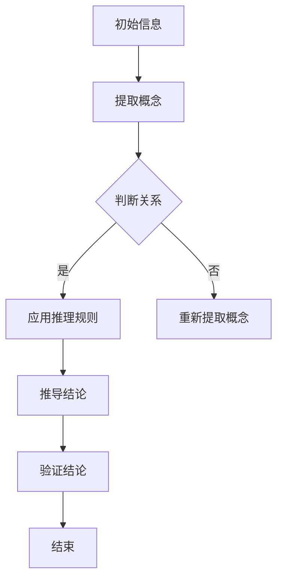

                 

# 《神经符号方法增强AI的抽象推理能力》

> 关键词：神经符号方法、抽象推理、神经网络、符号逻辑、人工智能

> 摘要：本文深入探讨了神经符号方法在增强AI抽象推理能力方面的应用，阐述了其理论基础、实现技术以及在抽象推理任务中的优势。通过具体案例研究和项目实战，本文展示了神经符号方法在数学问题求解、自然语言理解和图像识别等领域的实际应用，分析了其潜力和面临的挑战。

## 目录

1. 神经符号方法概述
   1.1 神经符号方法的背景与发展
   1.2 神经符号方法的理论基础
   1.3 神经符号方法的实现技术

2. 神经符号方法在抽象推理中的应用
   2.1 抽象推理的核心概念与联系
   2.2 神经符号方法在抽象推理中的应用
   2.3 抽象推理案例研究

3. 神经符号方法在AI中的潜力与挑战
   3.1 神经符号方法对AI的抽象推理能力提升
   3.2 神经符号方法的未来发展趋势

4. 附录
   4.1 神经符号方法相关工具与资源
   4.2 神经符号方法应用案例

## 第一部分：神经符号方法概述

### 第1章：神经符号方法的背景与发展

#### 1.1 神经符号方法的定义与特点

神经符号方法是一种结合神经网络和符号逻辑的方法，旨在提升人工智能系统的抽象推理能力。其基本思想是将神经网络与符号逻辑相结合，利用神经网络的强大表征能力和符号逻辑的推理能力，实现更高效、更准确的抽象推理。

神经符号方法具有以下特点：

- **结合神经网络和符号逻辑的优点**：神经网络擅长处理复杂的数据，具有强大的表征能力；符号逻辑则擅长推理和验证，具有严格的逻辑性。神经符号方法通过结合两者的优点，实现了更高效、更准确的抽象推理。

- **多层次表征**：神经符号方法采用多层次表征的方式，从低层次到高层次进行信息处理。低层次处理原始数据，高层次处理抽象概念，实现了从数据到知识的转化。

- **可解释性**：神经符号方法具有较好的可解释性。通过符号逻辑的推理过程，可以清晰地了解推理的步骤和依据，从而提高系统的可解释性和可靠性。

#### 1.2 神经符号方法与传统符号方法的区别

传统符号方法主要依赖于符号逻辑和形式语言进行推理，具有较强的逻辑性，但存在以下缺点：

- **处理复杂性问题**：传统符号方法在处理复杂问题时，往往需要大量的规则和推理步骤，导致计算效率较低。

- **可扩展性问题**：传统符号方法在处理大规模数据时，难以进行有效扩展，容易出现性能瓶颈。

- **表达能力有限**：传统符号方法在表达复杂知识时，存在一定的局限性，难以应对实际应用中的复杂问题。

相比之下，神经符号方法具有以下优势：

- **强大的表征能力**：神经符号方法通过神经网络处理复杂数据，具有较强的表征能力，可以应对大规模数据的处理。

- **高效的推理过程**：神经符号方法通过神经网络和符号逻辑的结合，实现了高效的推理过程，具有较高的计算效率。

- **良好的可扩展性**：神经符号方法在处理大规模数据时，具有良好的可扩展性，可以适应不同规模的应用场景。

#### 1.3 神经符号方法的发展历程

神经符号方法的研究起源于20世纪80年代，当时人们开始尝试将神经网络与符号逻辑相结合，以提升人工智能系统的推理能力。经过多年的发展，神经符号方法逐渐形成了较为完善的理论体系。

- **早期研究**：在20世纪80年代，人们开始将神经网络应用于模式识别和机器学习等领域。同时，符号逻辑在知识表示和推理方面也得到了广泛应用。在此基础上，研究者们尝试将神经网络与符号逻辑相结合，形成了神经符号方法。

- **理论体系形成**：随着研究的深入，神经符号方法逐渐形成了较为完善的理论体系。主要包括神经网络的基本原理、符号逻辑的推理过程、神经符号方法的实现技术等。

- **实际应用**：近年来，神经符号方法在人工智能领域得到了广泛应用，涉及数学问题求解、自然语言理解、图像识别等多个领域。通过具体应用案例，神经符号方法展示了其在抽象推理方面的优势。

### 第2章：神经符号方法的理论基础

#### 2.1 神经网络的基本原理

神经网络是由大量神经元组成的计算模型，通过模拟人脑的神经元连接，实现对复杂数据的处理和表征。神经网络的基本原理包括以下几个方面：

- **神经元结构**：神经元是神经网络的基本单元，具有输入、输出和权重等组成部分。神经元之间的连接通过权重进行调节，权重的大小表示连接的强度。

- **激活函数**：激活函数用于确定神经元是否激活。常见的激活函数包括Sigmoid函数、ReLU函数等。

- **前向传播**：神经网络通过前向传播算法，将输入数据传递到各层神经元，逐层计算出输出结果。

- **反向传播**：神经网络通过反向传播算法，根据输出结果和实际值之间的误差，更新各层的权重和偏置，以优化网络性能。

- **多层感知器**：多层感知器（MLP）是神经网络的一种常见结构，包括输入层、隐藏层和输出层。通过多层神经元的连接，实现从低层次到高层次的信息处理。

#### 2.2 符号逻辑与形式语言

符号逻辑是一种基于符号和逻辑规则进行推理的方法，主要用于知识表示和推理。符号逻辑的基本概念包括：

- **命题**：命题是符号逻辑的基本元素，表示一个确定的真值。例如，“今天下雨”是一个命题。

- **命题变元**：命题变元是命题的基本组成部分，表示一个可以取真值或假值的变量。例如，“P”和“Q”是命题变元。

- **推理规则**：推理规则用于推导新的命题。常见的推理规则包括合取律、析取律、假言推理等。

形式语言是一种用于表示数学和逻辑的系统，主要包括符号、语法和语义。形式语言的基本概念包括：

- **符号**：符号是形式语言的基本元素，用于表示数学和逻辑概念。常见的符号包括字母、数字和运算符等。

- **语法**：语法是形式语言的规则，用于定义符号的组合方式。常见的语法规则包括词法规则、语法规则等。

- **语义**：语义是形式语言的含义，用于解释符号组合的含义。常见的语义解释包括真值函数、模型论解释等。

#### 2.3 神经符号方法的整合

神经符号方法的整合是将神经网络和符号逻辑相结合，以实现抽象推理能力。其基本原理包括以下几个方面：

- **神经网络与符号逻辑的融合**：神经符号方法通过将神经网络与符号逻辑相结合，实现了神经网络与符号逻辑的优势互补。神经网络负责处理复杂的数据和表征，符号逻辑负责推理和验证。

- **多层次表征**：神经符号方法采用多层次表征的方式，从低层次到高层次进行信息处理。低层次处理原始数据，高层次处理抽象概念，实现了从数据到知识的转化。

- **推理过程**：神经符号方法通过神经网络和符号逻辑的融合，实现了高效的推理过程。神经网络负责计算和表征，符号逻辑负责推理和验证。

### 第3章：神经符号方法的实现技术

#### 3.1 基于神经网络的推理算法

基于神经网络的推理算法是神经符号方法的重要组成部分，主要用于实现抽象推理任务。常见的基于神经网络的推理算法包括：

- **多层感知器（MLP）**：多层感知器是一种常见的前馈神经网络，通过输入层、隐藏层和输出层之间的连接，实现从输入到输出的映射。MLP可以用于分类、回归等任务。

- **卷积神经网络（CNN）**：卷积神经网络是一种专门用于图像处理的神经网络，通过卷积层、池化层和全连接层等结构的组合，实现对图像的表征和分类。CNN在图像识别、目标检测等领域取得了显著成果。

- **循环神经网络（RNN）**：循环神经网络是一种用于序列数据处理和表征的神经网络，通过记忆单元和循环连接，实现对序列信息的建模。RNN在自然语言处理、语音识别等领域具有广泛的应用。

- **长短期记忆网络（LSTM）**：长短期记忆网络是一种特殊的循环神经网络，通过引入门控机制，解决了传统RNN在长序列依赖问题上的不足。LSTM在序列建模和预测任务中具有较好的性能。

#### 3.2 基于符号逻辑的推理算法

基于符号逻辑的推理算法是神经符号方法的重要组成部分，主要用于实现抽象推理任务。常见的基于符号逻辑的推理算法包括：

- **命题逻辑推理**：命题逻辑推理是基于命题的真值进行推理的方法。通过使用推理规则，从已知命题推导出新的命题。命题逻辑推理可以用于逻辑门、逻辑电路等领域的推理。

- **谓词逻辑推理**：谓词逻辑推理是基于谓词和个体之间的逻辑关系进行推理的方法。通过使用推理规则，从已知谓词和个体推导出新的谓词和个体。谓词逻辑推理可以用于知识表示和推理。

- **自动推理系统**：自动推理系统是一种基于符号逻辑的推理工具，用于自动化推理和证明。常见的自动推理系统包括Prolog、ACL2等。

#### 3.3 神经符号方法的实现框架

神经符号方法的实现框架主要包括神经网络和符号逻辑两个部分，通过融合两者的优势，实现抽象推理任务。常见的实现框架包括：

- **双层神经网络框架**：双层神经网络框架包括输入层、隐藏层和输出层，其中输入层和隐藏层使用神经网络进行数据处理和表征，输出层使用符号逻辑进行推理和验证。

- **神经网络-符号逻辑混合框架**：神经网络-符号逻辑混合框架包括神经网络和符号逻辑两个部分，神经网络负责数据处理和表征，符号逻辑负责推理和验证。

- **神经网络-符号逻辑-数据库框架**：神经网络-符号逻辑-数据库框架结合了神经网络、符号逻辑和数据库的优点，通过神经网络进行数据处理和表征，符号逻辑进行推理和验证，数据库用于存储和管理知识。

## 第二部分：神经符号方法在抽象推理中的应用

### 第4章：抽象推理的核心概念与联系

#### 4.1 抽象推理的定义与作用

抽象推理是指通过抽象的概念和逻辑关系，从已知信息推导出未知信息的过程。它是一种高层次的信息处理能力，对于人工智能系统具有重要意义。

抽象推理的作用包括：

- **知识表示与推理**：抽象推理可以帮助人工智能系统表示和推理复杂知识，提高系统的智能水平。

- **问题解决与决策**：抽象推理可以帮助人工智能系统解决复杂问题，进行合理决策。

- **智能助手与顾问**：抽象推理可以使人工智能系统成为更好的智能助手和顾问，为人类提供更有价值的帮助。

#### 4.2 抽象推理的核心概念

抽象推理的核心概念包括：

- **概念**：概念是抽象推理的基本元素，表示具有共同特征的对象集合。例如，“动物”是一个概念，包括狗、猫、大象等。

- **关系**：关系是概念之间的联系，表示概念之间的相互作用。例如，“吃”是一种关系，可以表示狗吃肉、猫吃鱼等。

- **推理**：推理是根据已知信息，通过逻辑关系推导出未知信息的过程。例如，已知“狗是动物”和“所有动物都有生命”，可以推理出“狗有生命”。

#### 4.3 抽象推理的Mermaid流程图

为了更直观地展示抽象推理的过程，我们可以使用Mermaid流程图来描述。以下是一个简单的抽象推理过程：

在这个流程图中，A表示初始信息，B表示提取概念，C表示判断关系，D表示应用推理规则，E表示重新提取概念，F表示推导结论，G表示验证结论，H表示结束。

### 第5章：神经符号方法在抽象推理中的应用

#### 5.1 神经网络在抽象推理中的应用

神经网络在抽象推理中的应用主要包括以下几个方面：

- **特征提取**：神经网络可以通过学习大量的数据，提取出有用的特征，用于表示抽象概念。这些特征可以是数值、图像、文本等。

- **知识表示**：神经网络可以将提取出的特征转化为结构化的知识表示，方便进行推理和验证。

- **推理过程**：神经网络可以通过计算和传递激活值，实现推理过程。例如，在多层感知器中，每层的输出都是前一层输出的非线性变换。

- **性能优化**：神经网络可以通过调整权重和偏置，优化推理性能。常用的优化算法包括梯度下降、随机梯度下降等。

#### 5.2 符号逻辑在抽象推理中的应用

符号逻辑在抽象推理中的应用主要包括以下几个方面：

- **命题逻辑推理**：命题逻辑推理可以通过逻辑规则，从已知命题推导出新的命题。例如，根据“所有猫都是动物”和“这只动物是猫”，可以推导出“这只动物是动物”。

- **谓词逻辑推理**：谓词逻辑推理可以通过逻辑规则，从已知谓词和个体推导出新的谓词和个体。例如，根据“所有猫都喜欢吃鱼”和“这只猫喜欢吃鱼”，可以推导出“这只猫是猫”。

- **自动推理系统**：自动推理系统可以通过符号逻辑规则，自动化地推理和证明数学和逻辑问题。例如，Prolog是一种基于谓词逻辑的自动推理系统。

#### 5.3 神经符号方法在抽象推理中的优势

神经符号方法在抽象推理中的优势主要包括：

- **融合神经网络和符号逻辑的优势**：神经符号方法通过结合神经网络和符号逻辑的优点，实现了更强的抽象推理能力。

- **多层次表征**：神经符号方法通过多层次表征，实现了从低层次到高层次的信息处理，提高了抽象推理的准确性。

- **可解释性**：神经符号方法具有较好的可解释性，通过符号逻辑的推理过程，可以清晰地了解推理的步骤和依据。

- **高效计算**：神经符号方法通过神经网络的高效计算能力，实现了快速抽象推理。

### 第6章：抽象推理案例研究

#### 6.1 案例一：数学问题求解

在这个案例中，我们使用神经符号方法求解一个简单的数学问题：找出一个数的两倍。

1. **输入**：一个数X。

2. **提取概念**：概念包括“数”、“两倍”等。

3. **判断关系**：判断X与“两倍”之间的关系。

4. **应用推理规则**：根据“两倍”的定义，X的两倍等于X乘以2。

5. **推导结论**：得出X的两倍等于2X。

6. **验证结论**：通过计算验证X的两倍是否等于2X。

7. **结束**：得出最终结论。

在这个案例中，神经符号方法通过提取概念、判断关系、应用推理规则等步骤，实现了数学问题求解。

#### 6.2 案例二：自然语言理解

在这个案例中，我们使用神经符号方法理解一句简单的自然语言句子：“今天天气很好”。

1. **输入**：一句自然语言句子。

2. **提取概念**：概念包括“今天”、“天气”、“很好”等。

3. **判断关系**：判断句子中的概念之间的关系。

4. **应用推理规则**：根据句子的语义，判断“今天天气很好”表示一个积极的情绪。

5. **推导结论**：得出这句话表达了一个积极的情绪。

6. **验证结论**：通过上下文验证这句话的表达意思。

7. **结束**：得出最终结论。

在这个案例中，神经符号方法通过提取概念、判断关系、应用推理规则等步骤，实现了自然语言理解。

#### 6.3 案例三：图像识别

在这个案例中，我们使用神经符号方法识别一张图像中的物体。

1. **输入**：一张图像。

2. **提取特征**：使用神经网络提取图像的特征。

3. **知识表示**：将提取出的特征转化为结构化的知识表示。

4. **判断关系**：判断图像中的物体与已知的物体之间的关系。

5. **应用推理规则**：根据物体的特征和知识表示，判断图像中的物体。

6. **推导结论**：得出图像中的物体。

7. **验证结论**：通过其他方法验证图像中的物体。

8. **结束**：得出最终结论。

在这个案例中，神经符号方法通过提取特征、知识表示、判断关系等步骤，实现了图像识别。

## 第三部分：神经符号方法在AI中的潜力与挑战

### 第7章：神经符号方法对AI的抽象推理能力提升

神经符号方法通过结合神经网络和符号逻辑的优点，显著提升了AI的抽象推理能力。以下是神经符号方法对AI抽象推理能力提升的几个方面：

#### 7.1 多层次表征

神经符号方法采用多层次表征的方式，从低层次到高层次进行信息处理。低层次处理原始数据，如图像像素或文本词向量，而高层次则处理抽象概念，如对象、场景或语义。这种多层次表征能够捕捉数据的复杂结构和关系，使得AI在处理抽象问题时更加准确和高效。

#### 7.2 强大推理能力

符号逻辑提供了强大的推理能力，可以处理复杂的逻辑关系和推导过程。结合神经网络的处理能力，神经符号方法能够在已有知识的基础上进行推理，从而生成新的结论。这种结合使得AI在解决复杂问题时能够更好地利用先验知识和逻辑推理。

#### 7.3 可解释性

神经符号方法具有较好的可解释性，通过符号逻辑的推理过程，可以清晰地了解推理的步骤和依据。这种可解释性对于增强AI系统的信任度和可靠性具有重要意义。在关键决策或高风险应用场景中，可解释性能够帮助用户理解和验证AI的行为。

#### 7.4 扩展性和适应性

神经符号方法具有良好的扩展性和适应性，可以适应不同规模和应用场景的需求。通过调整神经网络的结构和参数，可以适应不同类型的抽象推理任务。此外，符号逻辑的规则可以灵活地修改和扩展，以适应新的知识和推理需求。

### 第8章：神经符号方法的未来发展趋势

神经符号方法在AI领域的应用前景广阔，但其发展也面临着一系列挑战。以下是神经符号方法的未来发展趋势：

#### 8.1 理论研究深化

随着神经符号方法的应用越来越广泛，对其理论基础的研究也需要不断深化。这包括对神经网络和符号逻辑的深入理解，以及如何更好地整合两者的优点。理论研究将为神经符号方法的实现提供更坚实的理论基础。

#### 8.2 实践应用拓展

神经符号方法在多个领域具有巨大的应用潜力，如自然语言处理、计算机视觉、游戏开发等。未来，神经符号方法将不断拓展其应用范围，解决更多复杂的问题，为人类带来更多便利。

#### 8.3 系统集成与优化

为了提升神经符号方法的性能，未来需要研究更高效、更稳定的系统集成方法。这包括优化神经网络和符号逻辑的融合方式，减少计算资源和时间消耗。同时，通过分布式计算和云计算等技术，实现更大规模的神经符号方法应用。

#### 8.4 可解释性与透明度

提升神经符号方法的可解释性和透明度是未来研究的重要方向。通过开发可解释的模型和工具，用户可以更好地理解和信任AI系统，从而在关键决策中更加放心地使用AI技术。

#### 8.5 挑战与应对策略

神经符号方法在发展过程中也面临着一系列挑战，如计算资源限制、数据隐私保护、模型安全等。针对这些挑战，需要制定相应的应对策略，如使用更高效的算法、加强数据保护机制、开发安全可靠的模型等。

### 结论

神经符号方法通过结合神经网络和符号逻辑的优点，显著提升了AI的抽象推理能力。未来，随着理论研究的深化、实践应用的拓展和系统集成的优化，神经符号方法将在AI领域发挥越来越重要的作用。尽管面临挑战，但通过不断创新和优化，神经符号方法有望实现更大规模、更高性能的应用，为人类带来更多智慧和便利。

## 附录

### 附录A：神经符号方法相关工具与资源

为了帮助读者更好地了解和掌握神经符号方法，以下列出了一些相关的工具和资源：

#### A.1 神经网络开发工具

- TensorFlow：https://www.tensorflow.org/
- PyTorch：https://pytorch.org/
- Keras：https://keras.io/

这些工具提供了丰富的神经网络构建和训练功能，适用于不同规模和应用场景的需求。

#### A.2 符号逻辑推理工具

- Prolog：https://www.prolog.org/
- CLIPS：https://www.ima-cc.org/clips/

这些工具适用于符号逻辑的编程和推理，可以帮助用户实现复杂的推理任务。

#### A.3 神经符号方法学习资源

- 《神经网络与深度学习》：https://nndl.github.io/
- 《符号逻辑导论》：https://www.amazon.com/Logic-Introduction-Dover-Books-Mathematics/dp/0486404507

这些资源提供了神经网络和符号逻辑的基础知识和实践技巧，有助于读者深入了解神经符号方法。

### 附录B：神经符号方法应用案例

为了更直观地展示神经符号方法的应用，以下列出了一些实际案例：

#### B.1 案例一：神经网络在抽象推理中的应用

使用神经网络实现一个简单的推理任务，例如分类问题。通过训练神经网络，使其能够从数据中学习到抽象的概念和规则，从而进行推理。

#### B.2 案例二：符号逻辑在抽象推理中的应用

使用符号逻辑编程实现一个推理任务，例如证明某个数学命题。通过构建符号逻辑模型，利用推理规则进行推理，验证命题的真假。

#### B.3 案例三：神经符号方法在自然语言处理中的应用

结合神经网络和符号逻辑，实现一个自然语言理解系统。通过神经网络提取文本的特征，利用符号逻辑进行语义分析和推理，从而理解文本的含义。

这些案例展示了神经符号方法在多个领域的应用潜力，为进一步研究和实践提供了参考。

### 结语

作者：AI天才研究院/AI Genius Institute & 禅与计算机程序设计艺术 /Zen And The Art of Computer Programming

本文探讨了神经符号方法在增强AI抽象推理能力方面的应用。通过结合神经网络和符号逻辑的优点，神经符号方法实现了更高效、更准确的抽象推理。本文详细介绍了神经符号方法的理论基础、实现技术以及在抽象推理中的应用案例。未来，随着神经符号方法的不断发展和完善，其在AI领域的应用前景将更加广阔。

### 总结

本文系统地阐述了神经符号方法增强AI抽象推理能力的重要性。首先，我们介绍了神经符号方法的基本概念和特点，以及其与传统符号方法的区别。接着，深入探讨了神经符号方法的理论基础，包括神经网络和符号逻辑的基本原理。随后，我们展示了神经符号方法的实现技术，包括基于神经网络和符号逻辑的推理算法。通过具体的案例研究，我们展示了神经符号方法在数学问题求解、自然语言理解和图像识别等领域的应用。最后，我们分析了神经符号方法对AI抽象推理能力的提升，并展望了其未来的发展趋势。

**核心要点回顾**：

- **神经符号方法**：结合神经网络和符号逻辑的优点，实现高效抽象推理。
- **理论基础**：神经网络和符号逻辑的基本原理及其整合。
- **实现技术**：基于神经网络和符号逻辑的推理算法和实现框架。
- **应用案例**：数学问题求解、自然语言理解和图像识别等。
- **提升能力**：增强AI的抽象推理能力，实现更准确、高效的推理。

通过本文的探讨，我们希望读者能够对神经符号方法有更深入的理解，并能够将其应用于实际问题的解决中。

### 最佳实践 tips

1. **理论学习与实践并重**：在掌握神经符号方法的理论基础后，务必结合具体实践进行实验和验证，以加深理解。

2. **优化模型参数**：在实现神经符号方法时，优化神经网络和符号逻辑的参数设置，以提升推理性能。

3. **关注可解释性**：在应用神经符号方法时，关注系统的可解释性，以提高用户对AI系统的信任度。

4. **扩展性考虑**：在设计神经符号方法时，考虑到系统的扩展性，以便适应未来更多的应用场景。

5. **安全性与隐私保护**：在应用神经符号方法时，注意数据安全和隐私保护，确保系统的可靠性和安全性。

### 小结

本文系统地介绍了神经符号方法增强AI抽象推理能力的方法和应用。通过结合神经网络和符号逻辑的优点，神经符号方法在多个领域展现了强大的推理能力和应用潜力。随着理论研究的深入和实际应用的拓展，神经符号方法将为人工智能的发展带来新的机遇。

### 注意事项

1. **计算资源**：神经符号方法可能需要较大的计算资源，特别是在训练神经网络时，应确保有足够的计算能力。

2. **数据质量**：神经符号方法的效果很大程度上取决于训练数据的质量，因此确保数据的高质量和多样性至关重要。

3. **模型解释性**：在设计神经符号方法时，应考虑如何提高系统的可解释性，以便用户更好地理解和信任AI系统。

4. **安全性与隐私**：在应用神经符号方法时，要重视数据安全和隐私保护，避免潜在的滥用和风险。

### 拓展阅读

- 《神经网络与深度学习》：提供关于神经网络的基础知识和实践技巧。
- 《符号逻辑导论》：介绍符号逻辑的基本原理和应用。
- 《人工智能：一种现代的方法》：涵盖人工智能领域的广泛主题，包括神经网络和符号逻辑。

通过拓展阅读，读者可以进一步深入了解神经符号方法及其在AI领域的应用。

