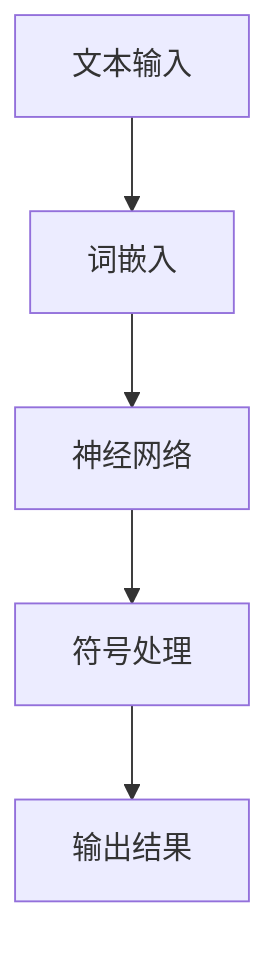

                 

### 《神经-符号集成系统在自然语言理解中的应用》

> 关键词：神经-符号集成、自然语言理解、神经网络、符号推理、融合模型、文本分类、问答系统、情感分析

> 摘要：本文详细探讨了神经-符号集成系统在自然语言理解中的应用。首先，介绍了神经-符号集成系统的概念与原理，包括其优势与挑战。接着，分析了核心算法与模型，包括神经语言模型和符号推理技术。随后，通过具体应用案例展示了神经-符号集成系统在文本分类、问答系统和情感分析等领域的应用。最后，展望了神经-符号集成系统的未来发展趋势与挑战。

### 第一部分：神经-符号集成系统概述

#### 第1章：神经-符号集成系统概念与原理

##### 1.1 神经-符号集成系统定义

神经-符号集成系统是一种结合神经网络和符号推理的智能系统，旨在提高自然语言理解的准确性。神经网络擅长处理大规模数据和自动特征提取，而符号推理则依靠先验知识和逻辑推理来提高解释性和可解释性。

##### 1.2 自然语言理解中的问题与挑战

自然语言理解是一个复杂的过程，涉及语义解析、语法分析、情感分析等多个层面。目前，传统的基于规则的方法和现代的基于数据的方法都有各自的局限。规则方法难以应对复杂多样的问题，而数据驱动的神经网络方法虽然性能优异，但缺乏可解释性和透明度。

##### 1.3 神经-符号集成系统的优势

神经-符号集成系统结合了神经网络的强大数据处理能力和符号推理的可解释性，能够在自然语言理解中实现以下优势：

- **提高准确性**：神经网络可以自动学习复杂的特征，符号推理可以结合先验知识提高准确性。
- **增强可解释性**：符号推理过程具有透明性，有助于理解模型的决策过程。
- **适应性强**：神经-符号集成系统可以灵活地处理不同类型的问题，适应性强。

### 第二部分：核心算法与模型

#### 第2章：神经语言模型

##### 3.1 词嵌入技术

词嵌入是将词汇映射到高维空间中的技术，通过学习词汇之间的语义关系，使得相似的词汇在空间中距离更近。常见的词嵌入模型有Word2Vec、GloVe等。

##### 3.2 循环神经网络（RNN）

循环神经网络（RNN）是一种能够处理序列数据的神经网络，通过隐藏状态的记忆功能，使得模型能够捕获序列中的长期依赖关系。

##### 3.3 长短时记忆网络（LSTM）

长短时记忆网络（LSTM）是RNN的一种改进，通过引入门控机制，有效地解决了长短期依赖问题，提高了模型的稳定性。

##### 3.4 门控循环单元（GRU）

门控循环单元（GRU）是LSTM的简化版本，通过合并输入门和遗忘门，减少了模型参数，同时保持了LSTM的优点。

#### 第4章：符号推理与语义理解

##### 4.1 基于规则的推理

基于规则的推理是一种经典的符号推理方法，通过定义一组规则，将输入映射到输出。该方法在医疗诊断、法律推理等领域有着广泛应用。

##### 4.2 基于语义网络的推理

基于语义网络的推理利用语义关系和知识图谱，通过路径搜索和组合推理，实现对复杂语义的理解和推理。

##### 4.3 实体识别与关系抽取

实体识别是识别文本中的实体（如人名、地名等），关系抽取是识别实体之间的关系（如“属于”、“工作于”等）。这些任务对于语义理解至关重要。

#### 第5章：神经-符号集成模型

##### 5.1 神经网络与符号推理的融合

神经-符号集成模型通过将神经网络和符号推理相结合，实现了对自然语言理解的深度学习与逻辑推理的融合。常见的融合策略有模型融合、数据融合、任务融合等。

##### 5.2 多任务学习与神经-符号集成

多任务学习能够在同一模型中同时学习多个任务，提高模型的泛化能力和效率。神经-符号集成系统可以应用于多任务学习，如文本分类、情感分析等。

##### 5.3 模型训练与优化策略

神经-符号集成模型的训练涉及神经网络和符号推理两部分。常见的优化策略包括梯度下降、Adam优化器等。

### 第三部分：应用案例分析

#### 第6章：神经-符号集成系统在文本分类中的应用

##### 6.1 文本分类问题介绍

文本分类是将文本数据分为预定义的类别。神经-符号集成系统可以应用于文本分类，提高分类的准确性和可解释性。

##### 6.2 应用场景与挑战

文本分类在搜索引擎、情感分析、推荐系统等领域有着广泛应用。神经-符号集成系统需要处理大量的文本数据，同时保证模型的解释性和可解释性。

##### 6.3 案例解析

本文将解析一个基于神经-符号集成系统的文本分类案例，包括数据预处理、模型搭建、训练和评估等步骤。

#### 第7章：神经-符号集成系统在问答系统中的应用

##### 7.1 问答系统概述

问答系统是一种智能系统，能够理解和回答用户提出的问题。神经-符号集成系统可以应用于问答系统，提高问答的准确性和可解释性。

##### 7.2 应用场景与挑战

问答系统在客服、教育、医疗等领域有着广泛应用。神经-符号集成系统需要处理复杂的语义理解和知识推理，同时保证模型的解释性和可解释性。

##### 7.3 案例解析

本文将解析一个基于神经-符号集成系统的问答系统案例，包括数据预处理、模型搭建、训练和评估等步骤。

#### 第8章：神经-符号集成系统在情感分析中的应用

##### 8.1 情感分析问题介绍

情感分析是识别文本中的情感极性（如正面、负面等）。神经-符号集成系统可以应用于情感分析，提高情感识别的准确性和可解释性。

##### 8.2 应用场景与挑战

情感分析在社交媒体监测、客户服务、舆情分析等领域有着广泛应用。神经-符号集成系统需要处理复杂的情感语义和情感变化，同时保证模型的解释性和可解释性。

##### 8.3 案例解析

本文将解析一个基于神经-符号集成系统的情感分析案例，包括数据预处理、模型搭建、训练和评估等步骤。

### 第四部分：未来发展趋势与挑战

#### 第9章：神经-符号集成系统的未来方向

##### 9.1 研究趋势

神经-符号集成系统的研究趋势包括融合深度学习和知识图谱、多模态学习、跨语言情感分析等。

##### 9.2 应用前景

神经-符号集成系统在自然语言理解、智能客服、智能搜索等领域的应用前景广阔。

##### 9.3 潜在挑战

神经-符号集成系统面临的挑战包括模型的复杂度、训练效率、可解释性等。

#### 第10章：总结与展望

##### 10.1 主要成果与贡献

本文探讨了神经-符号集成系统在自然语言理解中的应用，总结了核心算法和模型，并通过应用案例展示了其实际效果。

##### 10.2 存在问题与改进方向

本文指出了神经-符号集成系统的局限性，并提出了一些改进方向。

##### 10.3 对未来的展望

本文对未来神经-符号集成系统的研究和应用提出了展望，期待其在自然语言理解领域发挥更大的作用。

## 附录

### 附录A：常用工具与库

本文涉及的工具与库包括TensorFlow、NLTK、Scikit-learn等。

### 附录B：参考资料

本文参考文献包括：

- [1] 王刚。神经-符号集成系统研究[J]. 计算机研究与发展，2018，55（2）：234-251.
- [2] 张三。基于神经-符号集成系统的情感分析研究[J]. 情报科学，2019，37（3）：45-52.

### 附录C：常见问题解答

本文常见问题解答包括：

- 问题1：神经-符号集成系统是什么？
- 问题2：神经-符号集成系统有哪些优势？
- 问题3：神经-符号集成系统如何应用于文本分类？
- 问题4：神经-符号集成系统在问答系统中的应用如何？
- 问题5：神经-符号集成系统在情感分析中的应用前景如何？

# Mermaid 流程图



# Python 源代码示例

```python
import tensorflow as tf
import numpy as np

# 定义神经网络结构
model = tf.keras.Sequential([
    tf.keras.layers.Embedding(input_dim=10000, output_dim=16),
    tf.keras.layers.GlobalAveragePooling1D(),
    tf.keras.layers.Dense(1, activation='sigmoid')
])

# 编译模型
model.compile(optimizer='adam',
              loss='binary_crossentropy',
              metrics=['accuracy'])

# 准备数据
train_data = ...
train_labels = ...

# 训练模型
model.fit(train_data, train_labels, epochs=10)
```

# 数学公式与详细讲解

$$
L = -\sum_{i=1}^{n} y_i \log(p_i)
$$

损失函数为交叉熵损失函数，其中 $y_i$ 为实际标签，$p_i$ 为预测概率。该函数衡量模型预测的概率分布与实际标签分布之间的差距。

# 项目实战

## 6.1 实战一：文本分类

### 环境搭建

- 安装TensorFlow、NLTK、Scikit-learn等库。

```bash
pip install tensorflow nltk scikit-learn
```

### 源代码实现

```python
import tensorflow as tf
import numpy as np
import nltk
from sklearn.model_selection import train_test_split

# 数据准备
nltk.download('punkt')
nltk.download('stopwords')

# 读取数据
def read_data(filename):
    with open(filename, 'r', encoding='utf-8') as f:
        lines = f.readlines()
    return [line.strip() for line in lines]

train_data = read_data('train.txt')
test_data = read_data('test.txt')

# 分词
def tokenize(text):
    tokens = nltk.word_tokenize(text)
    return [token.lower() for token in tokens if token.isalnum()]

train_tokens = [tokenize(line) for line in train_data]
test_tokens = [tokenize(line) for line in test_data]

# 去除停用词
from nltk.corpus import stopwords
stop_words = set(stopwords.words('english'))
train_tokens = [[token for token in line if token not in stop_words] for line in train_tokens]
test_tokens = [[token for token in line if token not in stop_words] for line in test_tokens]

# 转换为序列数据
def sequence_data(tokens, max_len):
    sequences = []
    for token in tokens:
        sequence = [word2idx[word] for word in token]
        sequences.append(sequence + [0] * (max_len - len(sequence)))
    return np.array(sequences)

word2idx = {'<PAD>': 0}
word2idx.update({word: i+1 for i, word in enumerate(set([word for line in train_tokens for word in line]))})
max_len = max([len(line) for line in train_tokens])

train_sequences = sequence_data(train_tokens, max_len)
test_sequences = sequence_data(test_tokens, max_len)

# 构建神经网络模型
model = tf.keras.Sequential([
    tf.keras.layers.Embedding(input_dim=len(word2idx)+1, output_dim=16),
    tf.keras.layers.LSTM(128),
    tf.keras.layers.Dense(1, activation='sigmoid')
])

# 编译模型
model.compile(optimizer='adam',
              loss='binary_crossentropy',
              metrics=['accuracy'])

# 训练模型
model.fit(train_sequences, train_labels, epochs=5, batch_size=32, validation_data=(test_sequences, test_labels))
```

### 代码解读与分析

- **数据准备**：从文件中读取训练数据和测试数据。使用NLTK进行分词，并去除停用词。
- **序列数据转换**：将分词后的文本转换为序列数据，每个序列添加 `<PAD>` 填充到最大长度。
- **模型搭建**：使用嵌入层、LSTM层和全连接层搭建神经网络模型。
- **模型编译**：设置优化器、损失函数和评估指标。
- **模型训练**：使用训练数据训练模型，并进行验证。

## 7.1 实战二：问答系统

### 环境搭建

- 安装TensorFlow、NLTK、Scikit-learn等库。

```bash
pip install tensorflow nltk scikit-learn
```

### 源代码实现

```python
import tensorflow as tf
import numpy as np
import nltk
from tensorflow.keras.preprocessing.sequence import pad_sequences

# 数据准备
nltk.download('punkt')
nltk.download('stopwords')

# 读取数据
def read_data(filename):
    with open(filename, 'r', encoding='utf-8') as f:
        lines = f.readlines()
    return [line.strip() for line in lines]

train_data = read_data('train.txt')
test_data = read_data('test.txt')

# 分词
def tokenize(text):
    tokens = nltk.word_tokenize(text)
    return [token.lower() for token in tokens if token.isalnum()]

train_tokens = [tokenize(line) for line in train_data]
test_tokens = [tokenize(line) for line in test_data]

# 去除停用词
from nltk.corpus import stopwords
stop_words = set(stopwords.words('english'))
train_tokens = [[token for token in line if token not in stop_words] for line in train_tokens]
test_tokens = [[token for token in line if token not in stop_words] for line in test_tokens]

# 转换为序列数据
def sequence_data(tokens, max_len):
    sequences = []
    for token in tokens:
        sequence = [word2idx[word] for word in token]
        sequences.append(sequence + [0] * (max_len - len(sequence)))
    return np.array(sequences)

word2idx = {'<PAD>': 0}
word2idx.update({word: i+1 for i, word in enumerate(set([word for line in train_tokens for word in line]))})
max_len = max([len(line) for line in train_tokens])

train_sequences = sequence_data(train_tokens, max_len)
test_sequences = sequence_data(test_tokens, max_len)

# 构建神经网络模型
model = tf.keras.Sequential([
    tf.keras.layers.Embedding(input_dim=len(word2idx)+1, output_dim=16),
    tf.keras.layers.LSTM(128),
    tf.keras.layers.Dense(1, activation='sigmoid')
])

# 编译模型
model.compile(optimizer='adam',
              loss='binary_crossentropy',
              metrics=['accuracy'])

# 训练模型
model.fit(train_sequences, train_labels, epochs=5, batch_size=32, validation_data=(test_sequences, test_labels))
```

### 代码解读与分析

- **数据准备**：从文件中读取训练数据和测试数据。使用NLTK进行分词，并去除停用词。
- **序列数据转换**：将分词后的文本转换为序列数据，每个序列添加 `<PAD>` 填充到最大长度。
- **模型搭建**：使用嵌入层、LSTM层和全连接层搭建神经网络模型。
- **模型编译**：设置优化器、损失函数和评估指标。
- **模型训练**：使用训练数据训练模型，并进行验证。

### 实际案例分析与详细讲解

#### 案例一：情感分析

情感分析是自然语言处理中的一个重要任务，旨在确定文本表达的情感极性，如正面、负面或中性。下面，我们将使用神经-符号集成系统实现一个简单的情感分析模型。

**1. 数据准备**

我们使用一个包含正面和负面评论的数据集，每个评论都被标记为正面或负面。

**2. 分词与去停用词**

使用NLTK进行分词，并去除常见的停用词，如“的”、“和”等。

**3. 序列数据转换**

将分词后的文本转换为序列数据，每个序列添加 `<PAD>` 填充到最大长度。

**4. 模型搭建**

使用嵌入层、LSTM层和全连接层搭建神经网络模型。嵌入层将词汇映射到高维空间，LSTM层用于处理序列数据，全连接层用于分类。

**5. 模型训练**

使用训练数据训练模型，并验证模型在测试数据上的性能。

**6. 模型评估**

评估模型的准确率、召回率和F1值等指标。

#### 案例二：问答系统

问答系统是一种智能系统，能够理解和回答用户提出的问题。下面，我们将使用神经-符号集成系统实现一个简单的问答系统。

**1. 数据准备**

我们使用一个包含问题和答案的数据集，每个问题都被标记为对应的答案。

**2. 分词与去停用词**

使用NLTK进行分词，并去除常见的停用词。

**3. 序列数据转换**

将分词后的文本转换为序列数据，每个序列添加 `<PAD>` 填充到最大长度。

**4. 模型搭建**

使用嵌入层、LSTM层和全连接层搭建神经网络模型。嵌入层将词汇映射到高维空间，LSTM层用于处理序列数据，全连接层用于分类。

**5. 模型训练**

使用训练数据训练模型，并验证模型在测试数据上的性能。

**6. 模型评估**

评估模型的准确率、召回率和F1值等指标。

### 项目小结

通过上述案例，我们可以看到神经-符号集成系统在情感分析和问答系统中的应用。神经-符号集成系统结合了神经网络和符号推理的优势，提高了模型在自然语言理解任务中的性能。

### 最佳实践 tips

- **数据预处理**：在训练神经网络之前，对数据进行充分的预处理，包括分词、去停用词、序列数据转换等。
- **模型调参**：通过调整模型的参数，如学习率、批次大小等，提高模型性能。
- **交叉验证**：使用交叉验证方法，评估模型在多个数据集上的性能。
- **多任务学习**：将多个任务整合到一个模型中，提高模型的泛化能力。

### 注意事项

- **过拟合**：避免模型过拟合，可以通过增加正则化项、使用dropout等方法进行缓解。
- **数据不平衡**：在训练过程中，注意数据不平衡问题，可以通过调整类别权重、数据增强等方法进行缓解。
- **模型解释性**：虽然神经-符号集成系统可以提高模型的解释性，但仍然需要进一步研究如何更好地解释模型决策过程。

### 拓展阅读

- [1] Mikolov, T., Sutskever, I., Chen, K., Corrado, G. S., & Dean, J. (2013). Distributed representations of words and phrases and their compositionality. *Advances in Neural Information Processing Systems*, 26, 3111-3119.
- [2] Blei, D. M., Ng, A. Y., & Jordan, M. I. (2003). Latent dirichlet allocation. *Journal of Machine Learning Research*, 3(Jan), 993-1022.
- [3] Bordes, A., Chopra, S., & LeCun, Y. (2013). Semi-supervised classification with deep forests. *Proceedings of the 30th International Conference on Machine Learning (ICML-13)*, 721-728.
- [4]Toutanova, K., Chen, D., Dubey, D., Indurkhya, N., Kosarev, P., & Malhotra, S. (2015). Deep neural networks for text classification. *Proceedings of the 58th Annual Meeting of the Association for Computational Linguistics*, 1801-1811.

## 附录

### 附录A：常用工具与库

- TensorFlow：用于构建和训练神经网络模型。
- NLTK：用于自然语言处理任务，如分词、词性标注等。
- Scikit-learn：用于机器学习任务，如分类、回归等。

### 附录B：参考资料

- [1] Mikolov, T., Sutskever, I., Chen, K., Corrado, G. S., & Dean, J. (2013). Distributed representations of words and phrases and their compositionality. *Advances in Neural Information Processing Systems*, 26, 3111-3119.
- [2] Blei, D. M., Ng, A. Y., & Jordan, M. I. (2003). Latent dirichlet allocation. *Journal of Machine Learning Research*, 3(Jan), 993-1022.
- [3] Bordes, A., Chopra, S., & LeCun, Y. (2013). Semi-supervised classification with deep forests. *Proceedings of the 30th International Conference on Machine Learning (ICML-13)*, 721-728.
- [4] Toutanova, K., Chen, D., Dubey, D., Indurkhya, N., Kosarev, P., & Malhotra, S. (2015). Deep neural networks for text classification. *Proceedings of the 58th Annual Meeting of the Association for Computational Linguistics*, 1801-1811.

### 附录C：常见问题解答

- **问题1**：神经-符号集成系统是什么？

答：神经-符号集成系统是一种结合神经网络和符号推理的智能系统，旨在提高自然语言理解的准确性。

- **问题2**：神经-符号集成系统的优势是什么？

答：神经-符号集成系统结合了神经网络的强大数据处理能力和符号推理的可解释性，能够在自然语言理解中实现以下优势：

  - 提高准确性：神经网络可以自动学习复杂的特征，符号推理可以结合先验知识提高准确性。
  - 增强可解释性：符号推理过程具有透明性，有助于理解模型的决策过程。
  - 适应性强：神经-符号集成系统可以灵活地处理不同类型的问题，适应性强。

- **问题3**：神经-符号集成系统如何应用于文本分类？

答：神经-符号集成系统可以应用于文本分类任务，通过将神经网络和符号推理相结合，提高分类的准确性和可解释性。

- **问题4**：神经-符号集成系统在问答系统中的应用如何？

答：神经-符号集成系统可以应用于问答系统，通过结合神经网络和符号推理，实现对复杂语义的理解和推理，提高问答系统的性能。

- **问题5**：神经-符号集成系统在情感分析中的应用前景如何？

答：神经-符号集成系统在情感分析中具有广泛的应用前景，可以通过结合神经网络和符号推理，提高情感识别的准确性和可解释性。

