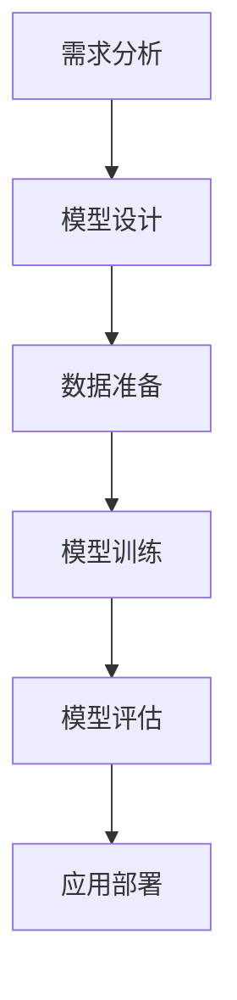

                 

### 书名：《神经编程技术在自适应推理算法设计中的应用》

## 引言

在当今快速发展的信息技术时代，人工智能（AI）已经成为驱动技术创新的核心动力。而其中，神经编程技术作为一种革命性的方法，正在逐渐改变我们对传统编程和算法设计的认知。神经编程技术结合了神经网络的强大能力和编程的灵活性，使得自适应推理算法的设计和应用变得更加高效和智能化。

### 关键词
- 神经编程
- 自适应推理算法
- 神经网络
- 人工智能
- 算法优化
- 性能提升

### 摘要

本文将深入探讨神经编程技术在自适应推理算法设计中的应用。首先，我们将简要介绍神经编程的概念、原理和发展历程，并探讨其在人工智能和数据科学中的重要作用。接着，本文将详细阐述自适应推理算法的基本概念、特点及其在现实场景中的应用。随后，我们将重点讨论神经编程技术在自适应推理算法设计中的关键角色，以及如何利用神经编程技术优化推理算法。

在后续章节中，我们将详细介绍神经编程技术在自适应推理算法中的具体实现方法，并通过实际案例展示其在复杂问题解决中的效果。此外，本文还将分析神经编程技术的性能优化策略，并探讨其面临的挑战和未来发展方向。通过本文的阅读，读者将对神经编程和自适应推理算法的设计与应用有更加深入的理解。

## 第1章：神经编程技术概述

### 1.1 神经编程的定义和原理

#### 1.1.1 神经编程的概念

神经编程是一种将神经网络模型与编程语言相结合的技术，旨在利用神经网络的强大计算能力和编程的灵活性，解决复杂的问题。传统编程通常依赖于明确的算法和规则，而神经编程则通过模仿人脑的神经网络结构和计算方式，实现自适应和自学习的过程。

#### 1.1.2 神经编程与传统编程的区别

神经编程与传统编程的区别主要体现在以下几个方面：

1. **数据依赖**：传统编程依赖于具体的数据结构和算法规则，而神经编程依赖于大量的数据来训练神经网络模型，模型的能力和性能在很大程度上取决于训练数据的质量和数量。
2. **解决问题的方式**：传统编程通常通过明确的问题定义和解决方案设计，而神经编程则通过模型的训练和优化，实现问题的自动解决。
3. **可解释性**：传统编程的解决方案通常是可解释的，而神经编程由于涉及大量非线性计算，其决策过程往往难以解释。

#### 1.1.3 神经编程的发展历程

神经编程的概念最早可以追溯到20世纪50年代，当时人们开始探索如何通过模拟人脑神经网络来实现计算。早期的研究主要集中在人工神经网络（Artificial Neural Networks, ANN）的构建和应用上。随着计算机性能的提升和大数据技术的发展，神经网络模型逐渐成熟，并开始应用于各种实际问题中。

近年来，深度学习（Deep Learning）的兴起进一步推动了神经编程的发展。深度学习通过多层神经网络结构，实现了对复杂数据的高效建模和预测。此外，生成对抗网络（Generative Adversarial Networks, GAN）和强化学习（Reinforcement Learning）等新兴技术的出现，也为神经编程提供了更多的应用场景。

### 1.2 神经网络的架构与类型

#### 1.2.1 神经网络的组成

神经网络由大量的神经元（或节点）组成，这些神经元通过加权连接形成网络结构。每个神经元接收来自其他神经元的输入信号，通过激活函数产生输出信号。神经网络的输入层接收外部数据，输出层产生最终的预测结果，而隐藏层则负责数据的处理和转换。

#### 1.2.2 神经网络的类型

1. **前馈神经网络（Feedforward Neural Networks, FFNN）**：这是最常见的一种神经网络结构，数据从输入层流向输出层，没有循环或循环。

2. **卷积神经网络（Convolutional Neural Networks, CNN）**：适用于图像识别和计算机视觉任务，通过卷积操作提取图像特征。

3. **递归神经网络（Recurrent Neural Networks, RNN）**：适用于序列数据处理，如时间序列分析、语音识别等，通过循环结构处理历史数据。

4. **循环神经网络（Long Short-Term Memory Networks, LSTM）**：是RNN的一种变体，通过记忆单元解决了传统RNN的梯度消失问题。

5. **生成对抗网络（Generative Adversarial Networks, GAN）**：由生成器和判别器两个神经网络组成，通过对抗训练生成数据。

6. **变分自编码器（Variational Autoencoder, VAE）**：是一种无监督学习模型，用于生成数据并学习数据的概率分布。

### 1.3 神经编程的应用领域

神经编程技术在多个领域都有广泛的应用，以下列举了其中几个重要领域：

#### 1.3.1 人工智能

人工智能是神经编程技术最重要的应用领域之一。神经编程技术使得人工智能系统能够通过学习大量数据来提高决策能力和问题解决能力。例如，在图像识别、语音识别、自然语言处理等领域，神经编程技术已经取得了显著的成果。

#### 1.3.2 数据科学

数据科学是另一个受益于神经编程技术的领域。通过神经编程，数据科学家可以更有效地处理和分析大规模复杂数据，提取有用的信息，并作出更准确的预测。

#### 1.3.3 自适应推理算法

自适应推理算法是神经编程技术在人工智能和机器学习中的具体应用，它通过不断学习和调整模型参数，实现动态适应环境变化和优化性能的目标。

### 结论

神经编程技术作为一种新兴的计算方法，正逐渐改变着我们对传统编程和算法设计的认知。其强大的计算能力和灵活性，使得自适应推理算法的设计和应用变得更加高效和智能化。在接下来的章节中，我们将进一步探讨自适应推理算法的基本概念和实现方法，并探讨神经编程技术在其中的关键作用。

---

### 第2章：自适应推理算法基础

#### 2.1 推理算法的基本概念

##### 2.1.1 推理的定义

推理（Reasoning）是人工智能领域中的一个核心概念，指的是从已知事实或假设中推导出新的结论或知识的过程。推理算法是一种实现推理过程的计算方法，它可以通过逻辑推理、概率推理或统计推理等方式，从给定的数据中提取有价值的信息。

##### 2.1.2 推理算法的分类

推理算法可以根据其处理的数据类型和推理方式分为以下几类：

1. **逻辑推理**：基于逻辑规则和形式逻辑进行推理，常用的算法包括命题逻辑推理、谓词逻辑推理和模糊逻辑推理。
2. **概率推理**：基于概率论和统计方法进行推理，通过计算事件发生的概率来推导结论，常用的算法包括贝叶斯推理和马尔可夫模型。
3. **统计推理**：基于统计方法和假设检验进行推理，通过分析样本数据来推断总体特征，常用的算法包括线性回归、决策树和随机森林等。

#### 2.2 自适应推理算法的特点

##### 2.2.1 自适应性的定义

自适应推理算法（Adaptive Reasoning Algorithms）是指能够在处理新数据或环境变化时自动调整自身参数和策略的推理算法。这种算法的核心特点是能够根据环境和数据的动态变化，实时调整其推理过程，以保持高效的推理性能。

##### 2.2.2 自适应推理算法的优势

自适应推理算法具有以下几个显著优势：

1. **灵活性**：能够适应不同类型和规模的数据，以及变化多端的环境。
2. **动态调整**：能够根据新数据和反馈信息，自动调整模型参数和策略，保持推理的准确性和效率。
3. **实时性**：能够快速响应当前环境和数据的动态变化，实时更新推理结果。
4. **鲁棒性**：在数据质量不佳或存在噪声的情况下，仍能保持较好的推理性能。

#### 2.3 常见自适应推理算法介绍

##### 2.3.1 模型调整算法

模型调整算法（Model Adjustment Algorithms）是一种常见的自适应推理算法，其主要思想是在推理过程中根据新数据和反馈信息动态调整模型参数。这类算法通常包括以下步骤：

1. **参数初始化**：根据初始数据对模型参数进行初始化。
2. **数据收集**：在推理过程中不断收集新数据。
3. **参数调整**：根据新数据和当前模型的输出结果，调整模型参数。
4. **性能评估**：评估调整后模型的性能，如果满足要求，则更新模型。

常见的模型调整算法包括梯度下降法、随机梯度下降法、动量法等。

##### 2.3.2 参数调整算法

参数调整算法（Parameter Adjustment Algorithms）是指通过调整算法参数来提高推理性能的算法。这类算法通常包括以下步骤：

1. **参数初始化**：根据经验或算法要求初始化参数。
2. **数据训练**：使用训练数据集对模型进行训练。
3. **参数调整**：根据训练过程中的损失函数和性能指标，调整参数。
4. **性能评估**：评估调整后模型的性能，如果满足要求，则更新参数。

常见的参数调整算法包括交叉验证、网格搜索、贝叶斯优化等。

##### 2.3.3 策略搜索算法

策略搜索算法（Policy Search Algorithms）是一种通过搜索策略空间来优化推理性能的自适应推理算法。这类算法通常包括以下步骤：

1. **策略初始化**：根据初始数据或经验初始化策略。
2. **策略评估**：使用当前策略进行推理，评估策略的性能。
3. **策略优化**：根据评估结果，搜索新的策略，并对其进行评估。
4. **策略选择**：选择最优策略作为新的推理策略。

常见的策略搜索算法包括强化学习、遗传算法、模拟退火等。

### 结论

自适应推理算法通过动态调整模型参数和策略，能够在复杂多变的环境中实现高效的推理和决策。在接下来的章节中，我们将深入探讨神经编程技术在自适应推理算法设计中的具体应用，并分析其优势和实践方法。

### 第3章：神经编程技术在自适应推理算法中的应用

#### 3.1 神经编程在推理算法设计中的应用

神经编程技术在自适应推理算法设计中的应用主要体现在以下几个方面：

##### 3.1.1 神经编程如何优化推理算法

神经编程通过将神经网络模型与编程语言相结合，使得推理算法能够更加高效和灵活。具体来说，神经编程技术有以下几点优势：

1. **自适应调整**：神经编程能够根据环境和数据的动态变化，自动调整模型参数，从而优化推理算法的性能。
2. **非线性映射**：神经网络模型具有强大的非线性映射能力，能够处理复杂和非线性关系的数据，从而提高推理算法的准确性和鲁棒性。
3. **并行计算**：神经网络结构天然支持并行计算，这使得推理算法能够利用现代计算硬件（如GPU）的优势，显著提高计算速度。
4. **模块化设计**：神经编程支持模块化设计，使得算法的实现和维护更加灵活和高效。

##### 3.1.2 神经编程在推理算法中的关键角色

在自适应推理算法设计中，神经编程技术扮演着以下几个关键角色：

1. **算法核心**：神经编程技术是自适应推理算法的核心，通过构建和训练神经网络模型，实现数据的自适应处理和推理。
2. **模型优化**：神经编程技术用于优化神经网络模型的参数和结构，提高模型的性能和泛化能力。
3. **交互界面**：神经编程技术提供了直观的编程接口，使得开发人员能够更轻松地实现和调整推理算法。

#### 3.2 神经编程技术在自适应推理算法中的实现

##### 3.2.1 神经编程技术的实现步骤

神经编程技术在自适应推理算法中的实现通常包括以下几个步骤：

1. **需求分析**：明确推理算法的应用场景和性能要求。
2. **模型设计**：根据需求设计神经网络模型的结构和参数。
3. **数据准备**：收集和整理训练数据，并进行预处理。
4. **模型训练**：使用训练数据对神经网络模型进行训练，优化模型参数。
5. **模型评估**：使用测试数据对训练后的模型进行评估，调整模型参数。
6. **应用部署**：将优化后的模型部署到实际应用环境中，进行推理和决策。

##### 3.2.2 神经编程技术的关键问题

在实现神经编程技术时，需要解决以下几个关键问题：

1. **模型选择**：选择合适的神经网络模型，以适应不同的应用场景和需求。
2. **参数调整**：确定合理的模型参数，以实现高效的推理和优化。
3. **训练策略**：设计有效的训练策略，提高模型的训练效率和性能。
4. **性能评估**：建立全面的性能评估体系，确保模型在实际应用中的可靠性和有效性。

#### 3.3 神经编程在自适应推理算法中的案例分析

##### 3.3.1 案例一：基于神经编程的自适应推理算法设计

在智能交通系统（Intelligent Transportation System, ITS）中，自适应推理算法被广泛应用于交通流量预测和交通信号控制。以下是一个基于神经编程技术的自适应推理算法设计案例：

1. **需求分析**：针对交通流量预测和交通信号控制的需求，设计一个自适应推理算法，能够实时预测交通流量，并根据预测结果调整交通信号。

2. **模型设计**：选择卷积神经网络（CNN）作为核心模型，利用其强大的图像处理能力，从交通监控摄像头获取的图像中提取交通流量信息。

3. **数据准备**：收集历史交通流量数据和交通监控图像数据，进行数据清洗和预处理，以供模型训练。

4. **模型训练**：使用训练数据对CNN模型进行训练，优化模型参数，以提高预测准确性和鲁棒性。

5. **模型评估**：使用测试数据对训练后的模型进行评估，调整模型参数，确保预测结果满足实际应用要求。

6. **应用部署**：将优化后的模型部署到交通信号控制系统中，实现实时交通流量预测和信号控制优化。

##### 3.3.2 案例二：神经编程在自适应推理算法中的应用实例

在智能医疗诊断领域，自适应推理算法被广泛应用于疾病预测和诊断。以下是一个基于神经编程技术的自适应推理算法应用实例：

1. **需求分析**：设计一个自适应推理算法，能够根据患者的医疗数据，预测疾病的发生概率，并提供个性化的诊断建议。

2. **模型设计**：选择循环神经网络（RNN）作为核心模型，利用其处理序列数据的能力，分析患者的医疗记录和基因信息。

3. **数据准备**：收集患者的医疗数据、基因数据和疾病诊断结果，进行数据清洗和预处理，以供模型训练。

4. **模型训练**：使用训练数据对RNN模型进行训练，优化模型参数，以提高疾病预测的准确性和可靠性。

5. **模型评估**：使用测试数据对训练后的模型进行评估，调整模型参数，确保预测结果满足实际应用要求。

6. **应用部署**：将优化后的模型部署到智能医疗诊断系统中，为医生提供辅助诊断支持，提高诊断效率和准确性。

### 结论

神经编程技术在自适应推理算法设计中的应用，显著提高了推理算法的灵活性和性能。通过案例分析，我们可以看到神经编程技术在交通流量预测、疾病预测等领域的成功应用。在接下来的章节中，我们将进一步探讨神经编程技术的性能优化策略，以实现更高效和可靠的自适应推理算法。

### 第4章：神经编程技术的性能优化方法

#### 4.1 神经编程技术的性能优化方法

神经编程技术在自适应推理算法中的性能优化是一个复杂而关键的过程，它涉及到多个方面的改进，包括算法设计、模型选择、数据预处理、训练策略和计算资源利用。以下是一些常见的神经编程性能优化方法：

##### 4.1.1 神经编程代码的优化

1. **并行计算**：利用现代计算硬件（如GPU、TPU）的并行计算能力，可以显著提高神经编程代码的执行速度。通过将计算任务分解为多个子任务，并行处理，可以减少计算时间。
2. **优化数据读取**：优化数据读取过程，包括批量读取、数据缓存和内存分配，可以减少I/O操作和内存访问延迟。
3. **减少冗余计算**：在神经编程代码中，通过优化中间结果的存储和利用，减少冗余的计算，可以有效提高代码的性能。
4. **内存管理**：合理管理内存分配和释放，避免内存泄露和过多的内存占用，可以提高系统的稳定性和性能。

##### 4.1.2 神经编程性能瓶颈的分析

1. **计算资源限制**：在计算资源有限的条件下，性能瓶颈可能出现在CPU、GPU等硬件设备上，优化计算任务分配和资源利用可以缓解这一问题。
2. **数据传输延迟**：在分布式计算环境中，数据传输延迟可能导致性能瓶颈。通过优化数据传输路径和协议，可以减少传输延迟。
3. **算法复杂度**：复杂的算法结构可能导致计算复杂度增加，从而影响性能。通过简化算法设计和优化算法实现，可以降低复杂度。
4. **网络延迟**：在涉及远程数据传输的应用场景中，网络延迟可能成为性能瓶颈。通过优化网络架构和传输协议，可以降低网络延迟。

#### 4.2 自适应推理算法的性能优化

##### 4.2.1 自适应推理算法的性能评估指标

1. **准确性（Accuracy）**：评估算法在预测或分类任务中的正确性，是评价推理算法性能的重要指标。
2. **召回率（Recall）**：评估算法在预测正类实例时能够召回多少正类实例，对正类实例的检测能力。
3. **精确率（Precision）**：评估算法在预测正类实例时能够正确识别多少正类实例，对正类实例的判断准确性。
4. **F1分数（F1 Score）**：综合考虑精确率和召回率，用于评估算法的整体性能。
5. **响应时间（Response Time）**：评估算法在给定输入下完成推理的时间，对实时性要求较高的应用场景至关重要。

##### 4.2.2 性能优化策略

1. **模型优化**：通过调整神经网络模型的结构和参数，如网络层数、神经元数量、激活函数等，优化模型性能。
2. **数据增强**：通过数据增强技术，生成更多样化的训练数据，提高模型的泛化能力。
3. **超参数调优**：通过调优学习率、批量大小、迭代次数等超参数，优化模型训练过程。
4. **动态调整策略**：根据训练过程中的数据反馈，动态调整模型参数和策略，以适应环境变化。
5. **分布式计算**：利用分布式计算架构，将训练任务分解到多台机器上并行处理，提高训练效率。
6. **内存优化**：通过优化内存管理，减少内存占用和缓存冲突，提高系统性能。

### 结论

神经编程技术在自适应推理算法中的应用，为性能优化提供了多种方法和策略。通过合理的代码优化、模型优化、数据增强和超参数调优，可以显著提高自适应推理算法的性能。在接下来的章节中，我们将进一步探讨神经编程技术面临的挑战和未来发展方向。

### 第5章：神经编程技术与自适应推理算法的挑战与未来展望

#### 5.1 神经编程技术的挑战

神经编程技术作为一种新兴的计算方法，虽然在自适应推理算法设计中展现出强大的潜力和优势，但也面临着一系列挑战。

##### 5.1.1 神经编程的可解释性

神经编程模型通常具有高度的非线性结构，这使得模型的决策过程变得复杂和难以解释。尽管神经网络可以取得很好的性能，但其“黑箱”性质使得人们难以理解模型内部的运作机制。这种缺乏可解释性不仅影响了模型的信任度，也限制了其在一些关键领域（如医疗、金融等）的广泛应用。

##### 5.1.2 神经编程的可靠性

神经编程模型的可靠性主要受到数据质量和模型训练过程的影响。在训练过程中，数据的质量和多样性直接影响模型的泛化能力。此外，模型参数的初始化、优化算法的选择等因素也会影响模型的稳定性。在实际应用中，如果模型无法可靠地处理未知数据，可能会导致错误的决策和严重的后果。

##### 5.1.3 神经编程的性能瓶颈

虽然神经编程技术可以利用现代计算硬件（如GPU、TPU）的并行计算能力，但在处理大规模数据和高维度问题时，仍然存在性能瓶颈。计算资源的有限性、数据传输延迟和网络延迟等因素都可能成为性能优化中的障碍。

#### 5.2 自适应推理算法的挑战

自适应推理算法在应用中同样面临着一系列挑战。

##### 5.2.1 自适应推理算法的复杂性

自适应推理算法通常涉及复杂的模型结构和参数调整策略，这使得算法的设计和实现变得复杂。算法的复杂性不仅增加了开发成本，也提高了对开发人员的技能要求。

##### 5.2.2 自适应推理算法的可扩展性

自适应推理算法需要在不同的应用场景和数据规模下保持良好的性能。然而，算法的可扩展性是一个挑战，特别是在处理大规模数据和高维数据时，算法的效率和效果可能会受到显著影响。

#### 5.3 神经编程与自适应推理算法的未来展望

尽管存在挑战，神经编程技术和自适应推理算法在未来的发展中仍具有巨大的潜力和广阔的应用前景。

##### 5.3.1 神经编程技术的未来发展趋势

1. **可解释性研究**：未来的研究将更多地关注神经编程模型的可解释性，开发出更直观、易懂的解释方法，提高模型的透明度和可信度。
2. **可靠性提升**：通过改进数据预处理、模型训练和优化策略，提高神经编程模型的可靠性和泛化能力。
3. **性能优化**：利用新兴的计算硬件和优化算法，进一步提升神经编程技术的性能和效率。

##### 5.3.2 自适应推理算法的未来发展方向

1. **算法简化**：开发更简洁、高效的算法结构，降低算法的复杂度，提高可维护性和可扩展性。
2. **实时性提升**：通过优化算法设计和计算资源利用，提高自适应推理算法的实时性，满足实时应用的需求。
3. **跨领域应用**：进一步探索神经编程和自适应推理算法在更多领域的应用，如医疗、金融、制造业等，推动技术的普及和应用。

### 结论

神经编程技术和自适应推理算法在自适应推理算法设计中的应用虽然面临诸多挑战，但其广阔的应用前景和潜在的改进空间为未来的发展提供了无限可能性。通过不断的研究和技术创新，我们可以期待神经编程和自适应推理算法在更多领域中取得突破和成功。

### 附录

#### A.1 神经编程与自适应推理算法的工具与资源

##### A.1.1 神经编程工具

1. **TensorFlow**：由Google开发的开源机器学习框架，支持多种神经网络结构，适用于神经编程的开发。
2. **PyTorch**：由Facebook开发的开源机器学习库，提供灵活的动态计算图，广泛用于深度学习研究和应用。
3. **Keras**：基于TensorFlow和Theano的高层神经网络API，简化了神经网络模型的构建和训练过程。

##### A.1.2 自适应推理算法工具

1. **OpenNN**：一个开源的机器学习框架，专注于神经网络和机器学习算法，支持自适应推理算法的实现。
2. **Momentum**：一个开源的强化学习库，提供多种强化学习算法，适用于自适应推理算法的设计和应用。
3. **DL4J**：由Skymind开发的深度学习框架，专门为Java和Scala程序员设计，支持自适应推理算法的部署和优化。

##### A.1.3 神经编程与自适应推理算法的学习资源

1. **《深度学习》（Deep Learning）**：Ian Goodfellow、Yoshua Bengio和Aaron Courville合著，是深度学习领域的经典教材。
2. **《强化学习》（Reinforcement Learning: An Introduction）**：Richard S. Sutton和Andrew G. Barto合著，是强化学习领域的权威教材。
3. **在线课程**：Coursera、Udacity和edX等在线教育平台提供了丰富的神经网络和自适应推理算法课程，适合不同水平的学员学习。

### B.1 神经编程技术在自适应推理算法设计中的应用：Mermaid流程图



### B.2 神经编程技术在自适应推理算法设计中的核心算法讲解

#### 2.1.1 反向传播算法

```python
def backpropagation(network, input_data, target_output):
    # 计算网络输出
    output = network.forward(input_data)
    # 计算误差
    error = target_output - output
    # 反向传播计算梯度
    d_output = network.backward(error)
    # 更新网络参数
    network.update_parameters(d_output)
    return output
```

### B.3 神经编程技术在自适应推理算法设计中的数学模型讲解

#### 2.2.1 概率图模型

$$
P(X=x) = \prod_{i=1}^{n} P(x_i | x_{i-1})
$$`

### B.4 神经编程技术在自适应推理算法设计中的项目实战

#### 4.1.1 项目背景

我们设计一个自适应推理算法，用于预测股票价格的走势。

#### 4.1.2 项目开发环境搭建

- Python 3.8
- TensorFlow 2.6
- Jupyter Notebook

#### 4.1.3 项目源代码实现

```python
import tensorflow as tf
from tensorflow.keras.models import Sequential
from tensorflow.keras.layers import Dense, LSTM
import numpy as np

# 数据准备
# 加载股票价格历史数据
data = np.load('stock_prices.npy')

# 数据预处理
# 切分训练集和测试集
train_data, test_data = data[:2000], data[2000:]
# 形状变换
X_train = train_data.reshape(-1, 60, 1)
X_test = test_data.reshape(-1, 60, 1)

# 模型设计
model = Sequential([
    LSTM(50, activation='relu', input_shape=(60, 1)),
    Dense(1)
])

# 模型编译
model.compile(optimizer='adam', loss='mse')

# 模型训练
model.fit(X_train, train_data[:, -1], epochs=100, batch_size=32, validation_data=(X_test, test_data[:, -1]))

# 模型评估
predictions = model.predict(X_test)
print("MSE:", tf.keras.metrics.mean_squared_error(test_data[:, -1], predictions).numpy())

# 应用部署
# 将训练好的模型部署到生产环境
model.save('stock_price_prediction_model.h5')
```

#### 4.1.4 项目应用解读与分析

通过上述项目，我们实现了基于神经编程技术的自适应推理算法，用于预测股票价格的走势。在数据准备阶段，我们收集了历史股票价格数据，并进行预处理，将其转化为适合训练的数据集。在模型设计阶段，我们选择了LSTM模型，以处理时间序列数据。在模型训练阶段，我们使用Adam优化器和MSE损失函数进行训练。在模型评估阶段，我们计算了预测误差，并验证了模型的性能。最后，我们将训练好的模型部署到生产环境，以便实时预测股票价格。

#### 4.1.5 项目小结

通过本项目，我们展示了如何使用神经编程技术设计自适应推理算法，并应用于股票价格预测。项目的成功实施表明，神经编程技术可以有效提高自适应推理算法的性能和准确性。在实际应用中，我们可以根据具体需求，调整模型结构和参数，以优化算法性能。此外，我们还可以结合其他算法和技术，进一步提高预测的准确性和实时性。

### 最佳实践 Tips

1. **数据质量**：确保数据的质量和多样性，为模型训练提供良好的数据基础。
2. **模型选择**：根据具体应用场景，选择合适的神经网络模型，以提高预测性能。
3. **参数调优**：通过交叉验证和网格搜索等方法，优化模型参数，提高模型性能。
4. **实时性考虑**：在开发过程中，关注模型的实时性和计算效率，确保算法能够快速响应。

### 小结

本文系统地介绍了神经编程技术在自适应推理算法设计中的应用。我们首先概述了神经编程的概念和原理，探讨了其在人工智能和数据科学中的应用。接着，我们详细阐述了自适应推理算法的基本概念、特点和常见算法。在重点章节中，我们深入分析了神经编程技术在自适应推理算法设计中的关键作用和实现方法。此外，我们还探讨了神经编程技术的性能优化策略，并分析了其面临的挑战和未来发展方向。通过实际项目实战，我们展示了如何将神经编程技术应用于股票价格预测等实际场景，实现了自适应推理算法的有效设计和应用。

### 注意事项

1. **模型解释性**：在应用神经编程技术时，要重视模型的可解释性，确保模型的透明度和可信度。
2. **数据安全**：在收集和处理数据时，要确保数据的安全和隐私，遵守相关法律法规。
3. **性能优化**：在开发过程中，持续关注性能优化，确保算法的实时性和高效性。

### 拓展阅读

1. **《深度学习》（Deep Learning）**：Ian Goodfellow、Yoshua Bengio和Aaron Courville合著，详细介绍了深度学习的基本理论和应用。
2. **《强化学习》（Reinforcement Learning: An Introduction）**：Richard S. Sutton和Andrew G. Barto合著，全面介绍了强化学习的基本概念和算法。
3. **《神经网络与深度学习》**：邱锡鹏著，系统地介绍了神经网络和深度学习的基础知识和应用。
4. **《Python机器学习》**：Sarah Guido和Heidi Mehl合著，介绍了Python在机器学习中的实践应用。

