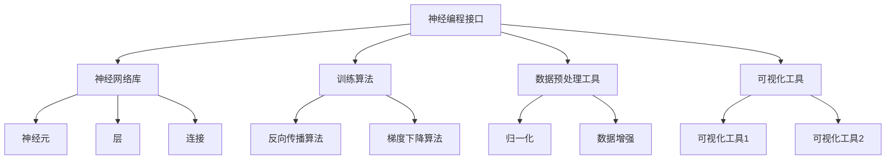
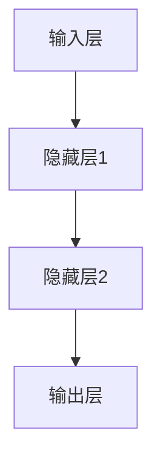
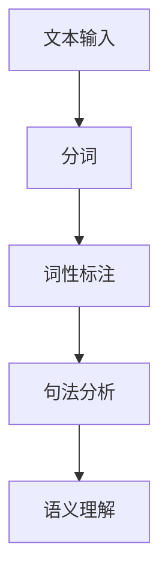
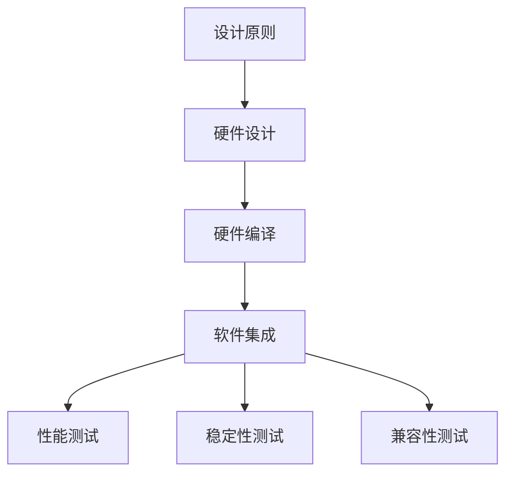
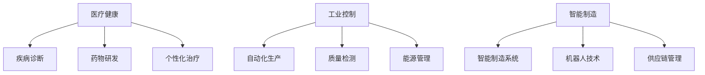
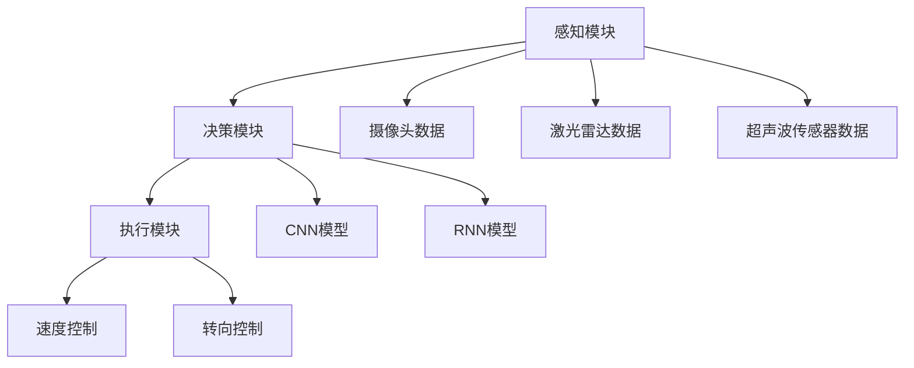

                 

# 《神经编程接口：增强AI系统的可扩展性》

## 关键词
神经编程接口、AI系统、可扩展性、神经元模型、神经网络、深度学习、感知器、图像识别、自然语言处理、硬件接口、软件接口

## 摘要
本文深入探讨了神经编程接口在增强AI系统可扩展性方面的作用。首先，回顾了人工智能的发展历程和神经编程接口的概念，随后详细介绍了神经编程接口的基本原理、类型以及与AI系统可扩展性的关系。接着，文章阐述了神经编程接口在感知器、图像识别和自然语言处理等领域的应用，并探讨了其设计与实现的方法。最后，对神经编程接口的未来发展趋势、跨领域应用以及面临的挑战和机遇进行了分析，并提出了实际案例的解析。文章总结了神经编程接口的重要性及其在AI领域的广泛应用前景。

## 第1章 绪论

### 1.1 背景介绍

#### 1.1.1 人工智能的发展历程
人工智能（Artificial Intelligence，AI）是一门研究、开发和应用使计算机系统模拟、延伸和扩展人类智能的理论、算法和技术。人工智能的历史可以追溯到20世纪50年代，当时图灵提出了图灵测试，旨在判断机器是否具备智能。此后，人工智能经历了多个发展阶段：

1. **初始阶段（1950-1969）**：这一时期，人工智能主要侧重于理论研究，包括逻辑推理、问题解决和定理证明等。标志性事件包括1956年的达特茅斯会议，标志着人工智能领域的正式成立。

2. **繁荣时期（1970-1980）**：人工智能在这一时期得到了快速发展，出现了许多基于规则的专家系统和问题解决算法。然而，由于知识表示和推理技术的局限性，人工智能的发展在1980年代中期遇到了瓶颈。

3. **衰落时期（1980-1990）**：由于实际应用效果不佳，人工智能领域经历了一段时间的低迷。

4. **复兴时期（1990至今）**：随着计算能力的提升和机器学习技术的突破，人工智能在21世纪迎来了新的发展机遇。机器学习、深度学习等算法的广泛应用，使得人工智能在图像识别、自然语言处理、自动驾驶等领域取得了显著成果。

#### 1.1.2 神经编程接口的概念
神经编程接口（Neuro-programming Interface）是一种用于编程和控制神经网络的接口，它使得开发者能够通过编写代码来设计、训练和部署神经网络。神经编程接口通常包括以下几个组成部分：

1. **神经网络库**：提供神经网络的基本构建模块，如神经元、层和连接。
2. **训练算法**：用于训练神经网络的算法，如反向传播算法和梯度下降算法。
3. **数据预处理工具**：用于处理和预处理输入数据的工具，如归一化和数据增强。
4. **可视化工具**：用于可视化神经网络结构和训练过程的工具。

#### 1.1.3 神经编程接口的重要性
神经编程接口在增强AI系统的可扩展性方面具有重要意义。首先，神经编程接口使得开发者能够方便地设计、训练和部署神经网络，从而提高AI系统的开发效率。其次，神经编程接口提供了灵活的可扩展性，使得AI系统能够适应不同的应用场景和数据集。最后，神经编程接口促进了AI技术的普及和应用，使得更多的开发者能够参与到人工智能的研究和开发中来。

### 1.2 神经编程接口的类型

#### 1.2.1 硬件接口
硬件接口是指通过硬件设备来编程和控制的神经编程接口。常见的硬件接口包括：

1. **可编程逻辑门阵列（FPGA）**：FPGA是一种可编程逻辑器件，可以通过编写硬件描述语言（HDL）来设计电路，从而实现特定的神经网络结构。

2. **现场可编程门阵列（FPGA）**：ASIC是一种专门为特定应用设计的集成电路，可以通过硬件描述语言（HDL）来设计。

#### 1.2.2 软件接口
软件接口是指通过软件来实现和控制的神经编程接口。常见的软件接口包括：

1. **Python库**：如TensorFlow、PyTorch等，它们提供了丰富的神经网络构建和训练工具，使得开发者能够方便地实现神经网络。

2. **JavaScript库**：如Brain.js，它是一个基于JavaScript的神经网络库，适用于Web应用程序。

#### 1.2.3 硬件与软件接口的结合
硬件与软件接口的结合提供了更高的性能和灵活性。例如，可以使用FPGA来实现神经网络的加速，同时使用Python库进行神经网络的训练和优化。

### 1.3 神经编程接口与AI系统可扩展性的关系

#### 1.3.1 神经编程接口对AI系统的影响
神经编程接口对AI系统的影响主要表现在以下几个方面：

1. **开发效率**：神经编程接口提供了方便快捷的开发工具，使得开发者能够快速构建和训练神经网络，从而提高开发效率。

2. **可扩展性**：神经编程接口提供了灵活的扩展机制，使得AI系统能够适应不同的应用场景和数据集，从而提高系统的可扩展性。

3. **性能优化**：通过硬件接口，可以实现神经网络的硬件加速，从而提高AI系统的运行性能。

#### 1.3.2 神经编程接口如何增强AI系统的可扩展性
神经编程接口通过以下几个方面来增强AI系统的可扩展性：

1. **模块化设计**：神经编程接口提供了模块化的构建模块，使得开发者能够灵活地组合和扩展神经网络。

2. **数据预处理和后处理**：神经编程接口提供了丰富的数据预处理和后处理工具，使得开发者能够方便地对数据进行处理，从而提高AI系统的性能。

3. **跨平台支持**：神经编程接口通常支持多种硬件和软件平台，使得AI系统可以在不同的环境中部署和运行。

#### 1.3.3 神经编程接口的应用场景
神经编程接口在多种AI应用场景中具有广泛的应用：

1. **图像识别**：神经编程接口可以用于构建和训练图像识别模型，从而实现图像分类、目标检测和图像生成等功能。

2. **自然语言处理**：神经编程接口可以用于构建和训练自然语言处理模型，从而实现文本分类、情感分析和机器翻译等功能。

3. **语音识别**：神经编程接口可以用于构建和训练语音识别模型，从而实现语音识别和语音合成等功能。

4. **自动驾驶**：神经编程接口可以用于构建和训练自动驾驶系统，从而实现车辆检测、路径规划和驾驶控制等功能。

### 1.4 神经编程接口的挑战与机遇
神经编程接口在发展过程中面临着一系列挑战和机遇：

1. **挑战**：
   - **性能优化**：如何提高神经网络在硬件上的运行性能，是当前的一个重要挑战。
   - **可解释性**：神经网络模型往往缺乏可解释性，如何提高模型的可解释性是一个重要的研究方向。
   - **数据隐私**：如何在保证数据隐私的前提下，进行有效的数据分析和模型训练，是一个亟待解决的问题。

2. **机遇**：
   - **硬件创新**：随着硬件技术的不断发展，如FPGA、ASIC等新型硬件的普及，将为神经编程接口提供更强大的性能支持。
   - **跨学科融合**：神经编程接口与其他领域的交叉融合，如生物学、心理学等，将带来新的研究机遇。
   - **商业应用**：神经编程接口在商业领域的广泛应用，将推动人工智能技术的快速发展。

### 1.5 小结
神经编程接口作为一种重要的AI开发工具，其在增强AI系统可扩展性方面具有重要意义。通过回顾人工智能的发展历程和神经编程接口的概念，以及分析神经编程接口的类型、应用场景和挑战与机遇，我们可以更好地理解和应用神经编程接口，推动人工智能技术的进步和发展。

### 1.6 拓展阅读
- [1] Goodfellow, I., Bengio, Y., & Courville, A. (2016). *Deep Learning*. MIT Press.
- [2] Russell, S., & Norvig, P. (2016). *Artificial Intelligence: A Modern Approach*. Prentice Hall.
- [3] Hochreiter, S., & Schmidhuber, J. (1997). *Long short-term memory*. Neural Computation, 9(8), 1735-1780.
- [4] Hinton, G. E., Osindero, S., & Teh, Y. W. (2006). *A fast learning algorithm for deep belief nets*. Neural computation, 18(7), 1527-1554.

### 1.7 绘制概念实体关系架构Mermaid流程图
以下是一个简单的Mermaid流程图，展示了神经编程接口中的核心概念实体及其关系：



## 第2章 神经编程接口的基本原理

### 2.1 神经元模型

#### 2.1.1 神经元的定义
神经元（Neuron）是神经网络的基本构建模块，它模拟了生物神经系统的基本功能。在神经编程接口中，神经元通常是一个带有输入、输出和激活函数的数学模型。

#### 2.1.2 神经元的结构
神经元的基本结构包括以下几个部分：

1. **输入**：每个神经元都有多个输入，这些输入可以是其他神经元的输出。
2. **权重**：每个输入都关联一个权重，表示该输入对神经元输出影响的大小。
3. **偏置**：神经元具有一个偏置项，用于调整输出。
4. **激活函数**：用于确定神经元是否会被激活，常用的激活函数包括Sigmoid函数、ReLU函数和Tanh函数。

#### 2.1.3 神经元的激活函数
激活函数是神经元中的一个关键组成部分，它将神经元的输入转化为输出。常见的激活函数如下：

1. **Sigmoid函数**：$S(x) = \frac{1}{1 + e^{-x}}$
2. **ReLU函数**：$ReLU(x) = \max(0, x)$
3. **Tanh函数**：$Tanh(x) = \frac{e^x - e^{-x}}{e^x + e^{-x}}$

### 2.2 神经网络

#### 2.2.1 神经网络的定义
神经网络（Neural Network）是由多个神经元组成的复杂网络，它通过层次化的方式对数据进行处理。神经网络通常包括输入层、隐藏层和输出层。

#### 2.2.2 神经网络的结构
神经网络的基本结构如下：

1. **输入层**：接收输入数据，并将其传递到隐藏层。
2. **隐藏层**：一个或多个隐藏层，用于对输入数据进行处理和特征提取。
3. **输出层**：输出层将处理后的数据转化为最终输出。

#### 2.2.3 神经网络的训练过程
神经网络的训练过程主要包括以下步骤：

1. **初始化**：初始化神经网络的权重和偏置。
2. **前向传播**：将输入数据传递到神经网络，计算出每个神经元的输出。
3. **计算损失**：通过比较输出结果与期望结果，计算损失函数。
4. **反向传播**：计算损失函数关于权重和偏置的梯度，并更新权重和偏置。
5. **迭代训练**：重复上述步骤，直到满足停止条件（如损失函数收敛或达到指定迭代次数）。

### 2.3 反向传播算法

#### 2.3.1 反向传播算法的原理
反向传播算法（Backpropagation Algorithm）是神经网络训练过程中的核心算法。它通过计算损失函数关于网络参数的梯度，并利用梯度下降法更新网络参数。

#### 2.3.2 反向传播算法的步骤
反向传播算法的基本步骤如下：

1. **前向传播**：将输入数据传递到神经网络，计算每个神经元的输出。
2. **计算误差**：计算输出层误差，误差等于实际输出与期望输出之间的差异。
3. **计算梯度**：从输出层开始，逐层向前计算每个神经元的梯度。
4. **更新参数**：利用梯度下降法更新每个神经元的权重和偏置。

#### 2.3.3 反向传播算法的实现
以下是使用Python实现反向传播算法的示例代码：

```python
import numpy as np

def sigmoid(x):
    return 1 / (1 + np.exp(-x))

def forward_propagation(X, weights):
    a = X
    for w in weights:
        a = sigmoid(np.dot(a, w))
    return a

def backward_propagation(X, y, weights):
    m = X.shape[1]
    dweights = [np.zeros(w.shape) for w in weights]

    a = X
    for w in weights:
        z = np.dot(a, w)
        a = sigmoid(z)
        derror = a - y
        dweights[-1] = np.dot(a.T, derror)
        for i in range(len(weights) - 2, -1, -1):
            derror = derror * (a * (1 - a))
            dweights[i] = np.dot(X.T, derror)
    return dweights
```

### 2.4 深度学习

#### 2.4.1 深度学习的定义
深度学习（Deep Learning）是一种基于多层神经网络的学习方法。与传统的机器学习方法相比，深度学习能够自动提取层次化的特征表示，从而在许多复杂任务上取得更好的性能。

#### 2.4.2 深度学习的特点
深度学习具有以下几个特点：

1. **自动特征提取**：深度学习通过多层神经网络，能够自动从原始数据中提取层次化的特征表示。
2. **强大的表达能力**：深度学习模型能够学习复杂的非线性关系，从而在许多任务上取得更好的性能。
3. **端到端学习**：深度学习模型能够直接从原始数据学习到输出结果，无需手动设计特征工程。

#### 2.4.3 深度学习的发展历程
深度学习的发展历程可以追溯到1980年代，当时神经网络的研究受到了瓶颈。然而，随着计算能力的提升和数据量的增加，深度学习在2000年后迎来了新的发展机遇。以下是一些重要的里程碑：

1. **卷积神经网络（CNN）**：1980年代，LeCun等人提出了卷积神经网络，用于图像识别任务。
2. **深度信念网络（DBN）**：2006年，Hinton等人提出了深度信念网络，用于自动提取特征表示。
3. **深度卷积神经网络（CNN）**：2012年，AlexNet在ImageNet挑战赛中取得了突破性成绩，标志着深度学习在图像识别领域的崛起。
4. **生成对抗网络（GAN）**：2014年，Goodfellow等人提出了生成对抗网络，用于生成逼真的图像和音频。

### 2.5 小结
本章介绍了神经编程接口的基本原理，包括神经元模型、神经网络、反向传播算法和深度学习。通过理解这些基本原理，开发者能够更好地设计和实现AI系统，从而推动人工智能技术的进步和发展。

### 2.6 拓展阅读
- [1] Goodfellow, I., Bengio, Y., & Courville, A. (2016). *Deep Learning*. MIT Press.
- [2] Bengio, Y. (2009). *Learning Deep Architectures for AI*. Foundations and Trends in Machine Learning, 2(1), 1-127.
- [3] LeCun, Y., Bengio, Y., & Hinton, G. (2015). *Deep learning*. Nature, 521(7553), 436-444.

### 2.7 绘制神经网络结构Mermaid流程图
以下是一个简单的Mermaid流程图，展示了神经网络的层次结构：



## 第3章 神经编程接口的应用

### 3.1 神经编程接口在感知器中的应用

#### 3.1.1 感知器的定义
感知器（Perceptron）是一种最基本的神经网络模型，由美国心理学家Frank Rosenblatt在1957年提出。感知器是一个带有线性激活函数的二分类模型，它可以通过学习输入数据来识别数据中的线性可分模式。

#### 3.1.2 感知器的原理
感知器的工作原理可以概括为以下步骤：

1. **输入加权和**：将输入数据与权重相乘，然后进行求和，得到加权和。
2. **应用激活函数**：通常使用线性激活函数（即不进行任何变换），但在某些情况下，也可以使用Sigmoid或其他非线性激活函数。
3. **输出结果**：根据激活函数的输出，判断数据属于哪个类别。

#### 3.1.3 神经编程接口在感知器中的应用
神经编程接口在感知器中的应用主要体现在以下方面：

1. **权重初始化**：通过神经编程接口，可以初始化感知器的权重，使得网络能够从随机初始化开始学习。
2. **前向传播**：通过神经编程接口，可以计算感知器的输入加权和，并应用激活函数得到输出。
3. **反向传播**：通过神经编程接口，可以计算感知器的梯度，并更新权重以优化网络性能。

#### 3.1.4 Python代码示例
以下是一个简单的Python代码示例，展示了如何使用感知器进行二分类：

```python
import numpy as np

# 初始化权重
weights = np.random.rand(1)

# 输入数据
X = np.array([[0], [1]])

# 标签
y = np.array([[0], [1]])

# 训练感知器
for _ in range(1000):
    # 前向传播
    z = np.dot(X, weights)
    a = sigmoid(z)
    
    # 反向传播
    dZ = a - y
    dW = np.dot(X.T, dZ)
    
    # 更新权重
    weights -= learning_rate * dW

# 定义sigmoid函数
def sigmoid(z):
    return 1 / (1 + np.exp(-z))

# 定义学习率
learning_rate = 0.01
```

### 3.2 神经编程接口在图像识别中的应用

#### 3.2.1 图像识别的基本原理
图像识别（Image Recognition）是计算机视觉（Computer Vision）领域的一个重要分支，旨在让计算机能够识别和理解图像中的内容。图像识别的基本原理包括：

1. **特征提取**：从图像中提取具有区分性的特征，如边缘、角点、纹理等。
2. **模型训练**：使用提取到的特征训练分类模型，如支持向量机（SVM）、决策树、神经网络等。
3. **预测**：将提取到的特征输入到训练好的分类模型，得到图像的类别预测。

#### 3.2.2 神经编程接口在图像识别中的应用
神经编程接口在图像识别中的应用主要体现在以下几个方面：

1. **卷积神经网络（CNN）**：卷积神经网络是一种专门用于图像识别的神经网络结构，通过卷积层、池化层和全连接层的组合，实现对图像特征的学习和分类。
2. **数据预处理**：神经编程接口提供了丰富的数据预处理工具，如归一化、数据增强等，用于提高图像识别模型的性能。
3. **模型训练和评估**：神经编程接口提供了便捷的训练和评估工具，如损失函数、优化器等，用于训练和优化图像识别模型。

#### 3.2.3 常见的图像识别算法
常见的图像识别算法包括：

1. **支持向量机（SVM）**：SVM是一种基于间隔最大化的分类算法，通过寻找最佳分隔超平面来实现图像分类。
2. **决策树**：决策树是一种基于特征分治的分类算法，通过一系列条件判断来将数据划分为不同的类别。
3. **随机森林**：随机森林是一种基于决策树的集成学习方法，通过构建多个决策树并取平均来提高分类性能。
4. **神经网络**：神经网络，尤其是卷积神经网络（CNN），在图像识别任务上取得了显著的性能提升。

#### 3.2.4 Python代码示例
以下是一个简单的Python代码示例，展示了如何使用卷积神经网络进行图像识别：

```python
import tensorflow as tf
from tensorflow.keras import layers, models

# 创建卷积神经网络模型
model = models.Sequential()
model.add(layers.Conv2D(32, (3, 3), activation='relu', input_shape=(28, 28, 1)))
model.add(layers.MaxPooling2D((2, 2)))
model.add(layers.Conv2D(64, (3, 3), activation='relu'))
model.add(layers.MaxPooling2D((2, 2)))
model.add(layers.Conv2D(64, (3, 3), activation='relu'))

# 添加全连接层
model.add(layers.Flatten())
model.add(layers.Dense(64, activation='relu'))
model.add(layers.Dense(10, activation='softmax'))

# 编译模型
model.compile(optimizer='adam',
              loss='categorical_crossentropy',
              metrics=['accuracy'])

# 加载和预处理数据
(x_train, y_train), (x_test, y_test) = tf.keras.datasets.mnist.load_data()
x_train = x_train.astype('float32') / 255
x_test = x_test.astype('float32') / 255
x_train = x_train[..., tf.newaxis]
x_test = x_test[..., tf.newaxis]

# 训练模型
model.fit(x_train, y_train, epochs=5, batch_size=64)
```

### 3.3 神经编程接口在自然语言处理中的应用

#### 3.3.1 自然语言处理的基本原理
自然语言处理（Natural Language Processing，NLP）是计算机科学和人工智能领域的一个重要分支，旨在让计算机能够理解和处理人类语言。NLP的基本原理包括：

1. **分词**：将文本拆分为单词或短语，以便进行进一步处理。
2. **词性标注**：对文本中的单词进行词性标注，如名词、动词、形容词等。
3. **句法分析**：分析文本中的句子结构，如主语、谓语、宾语等。
4. **语义理解**：理解文本中的语义含义，如情感分析、命名实体识别等。

#### 3.3.2 神经编程接口在自然语言处理中的应用
神经编程接口在自然语言处理中的应用主要体现在以下几个方面：

1. **词嵌入**：通过词嵌入（Word Embedding）技术，将文本中的单词映射为向量表示，从而使得计算机能够处理和理解文本数据。
2. **循环神经网络（RNN）**：循环神经网络（Recurrent Neural Network，RNN）是一种专门用于处理序列数据的神经网络，可以捕捉文本中的时间依赖关系。
3. **长短期记忆网络（LSTM）**：长短期记忆网络（Long Short-Term Memory，LSTM）是RNN的一种改进，能够更好地处理长序列数据。
4. **注意力机制**：注意力机制（Attention Mechanism）用于提高模型对输入数据的关注程度，从而提高模型的性能。

#### 3.3.3 常见的自然语言处理算法
常见的自然语言处理算法包括：

1. **词袋模型（Bag of Words，BoW）**：词袋模型将文本表示为单词的集合，不考虑单词的顺序，适用于文本分类和聚类任务。
2. **词嵌入（Word Embedding）**：词嵌入将文本中的单词映射为向量表示，常见的词嵌入技术包括Word2Vec、GloVe等。
3. **卷积神经网络（CNN）**：卷积神经网络在文本分类和情感分析任务上取得了显著性能提升。
4. **循环神经网络（RNN）**：循环神经网络在处理序列数据（如文本、语音）方面具有优势。
5. **长短期记忆网络（LSTM）**：长短期记忆网络是RNN的一种改进，能够更好地处理长序列数据。

#### 3.3.4 Python代码示例
以下是一个简单的Python代码示例，展示了如何使用循环神经网络（RNN）进行文本分类：

```python
import tensorflow as tf
from tensorflow.keras.models import Sequential
from tensorflow.keras.layers import Embedding, SimpleRNN, Dense

# 定义RNN模型
model = Sequential()
model.add(Embedding(vocab_size, embedding_dim))
model.add(SimpleRNN(units=50, activation='relu'))
model.add(Dense(num_classes, activation='softmax'))

# 编译模型
model.compile(optimizer='adam', loss='categorical_crossentropy', metrics=['accuracy'])

# 加载数据
(x_train, y_train), (x_test, y_test) = ...

# 训练模型
model.fit(x_train, y_train, epochs=10, batch_size=64)
```

### 3.4 小结
本章介绍了神经编程接口在感知器、图像识别和自然语言处理等领域的应用。通过理解这些应用场景，开发者可以更好地利用神经编程接口来构建和优化AI系统，从而推动人工智能技术的进步和发展。

### 3.5 拓展阅读
- [1] Goodfellow, I., Bengio, Y., & Courville, A. (2016). *Deep Learning*. MIT Press.
- [2] Mikolov, T., Sutskever, I., Chen, K., Corrado, G. S., & Dean, J. (2013). *Distributed representations of words and phrases and their compositionality*. Advances in Neural Information Processing Systems, 26, 3111-3119.
- [3] Simonyan, K., & Zisserman, A. (2014). *Very deep convolutional networks for large-scale image recognition*. arXiv preprint arXiv:1409.1556.

### 3.6 绘制自然语言处理流程Mermaid流程图
以下是一个简单的Mermaid流程图，展示了自然语言处理的流程：



## 第4章 神经编程接口的设计与实现

### 4.1 神经编程接口的设计原则

#### 4.1.1 可扩展性
可扩展性是神经编程接口设计的一个重要原则。一个良好的神经编程接口应该能够支持不同规模和类型的神经网络，以适应不同的应用场景。为了实现可扩展性，接口需要具备以下特点：

1. **模块化设计**：神经编程接口应该采用模块化设计，将神经网络的不同组件（如神经元、层、连接等）分离，使得开发者可以灵活地组合和扩展神经网络。
2. **可插拔组件**：神经编程接口应该支持可插拔的组件，例如，可以通过配置文件或代码接口动态地加载和替换不同的神经网络组件。
3. **标准化接口**：神经编程接口应该定义一套标准化的接口，例如，数据接口、训练接口、预测接口等，以便于开发者使用和集成。

#### 4.1.2 可维护性
可维护性是神经编程接口设计中的另一个关键原则。一个良好的神经编程接口应该易于维护和升级，以确保系统的稳定性和可靠性。为了实现可维护性，接口需要具备以下特点：

1. **清晰的代码结构**：神经编程接口的代码应该具有良好的组织结构，包括清晰的模块划分、规范的命名约定和详细的注释，以便于开发者理解和修改。
2. **自动化测试**：神经编程接口应该具备自动化测试框架，以确保每次代码更改后，系统的功能和性能都能得到验证。
3. **版本控制**：神经编程接口的开发应该采用版本控制系统，例如Git，以跟踪代码变更和历史记录。

#### 4.1.3 可移植性
可移植性是神经编程接口设计中的第三个重要原则。一个良好的神经编程接口应该能够支持跨平台部署，以便于在不同硬件和操作系统上运行。为了实现可移植性，接口需要具备以下特点：

1. **跨平台库**：神经编程接口应该依赖于跨平台的库，例如Python、C++等，以确保在不同操作系统上都能运行。
2. **硬件抽象层**：神经编程接口应该具备硬件抽象层，例如，可以使用CUDA或OpenCL来实现硬件加速，以提高运行性能。
3. **容器化**：神经编程接口可以采用容器化技术，例如Docker，以实现应用程序的隔离和跨平台部署。

### 4.2 神经编程接口的实现方法

#### 4.2.1 基于硬件的神经编程接口
基于硬件的神经编程接口利用特定硬件（如FPGA、ASIC等）来实现神经网络。这种方法的主要优点是运行速度快，能耗低。以下是基于硬件的神经编程接口的实现方法：

1. **硬件设计**：首先，需要设计神经网络的硬件架构，包括神经元、层、连接等。可以使用硬件描述语言（如Verilog、VHDL等）来描述硬件电路。
2. **硬件编译**：将硬件描述语言编译为硬件电路，并烧录到目标硬件上。
3. **软件集成**：编写驱动程序和接口库，以便于开发者能够通过软件接口与硬件进行交互。

#### 4.2.2 基于软件的神经编程接口
基于软件的神经编程接口完全由软件实现，通常使用Python、C++等高级编程语言。这种方法的主要优点是开发简单，易于调试和维护。以下是基于软件的神经编程接口的实现方法：

1. **选择框架**：选择一个合适的神经网络框架，例如TensorFlow、PyTorch等。这些框架提供了丰富的神经网络构建和训练工具，使得开发者可以快速搭建神经网络。
2. **模型定义**：使用框架提供的API，定义神经网络的层次结构，包括输入层、隐藏层和输出层。
3. **数据预处理**：编写数据预处理代码，包括数据加载、预处理和归一化等，以便于神经网络训练。
4. **模型训练**：使用框架提供的训练工具，例如优化器、损失函数等，对神经网络进行训练。
5. **模型部署**：将训练好的神经网络模型部署到生产环境，例如通过API或Web服务进行预测。

#### 4.2.3 硬件与软件结合的神经编程接口
硬件与软件结合的神经编程接口将硬件和软件的优势相结合，以实现更高的运行性能和可扩展性。以下是基于硬件与软件结合的神经编程接口的实现方法：

1. **硬件加速**：使用硬件（如FPGA、ASIC等）来实现神经网络的关键部分，例如卷积层、矩阵乘法等，以实现加速。
2. **软件框架**：使用一个通用的神经网络框架（如TensorFlow、PyTorch等）来构建和训练神经网络。
3. **接口集成**：编写接口库，将硬件加速模块与软件框架集成，以便于开发者能够方便地使用硬件加速功能。

### 4.3 神经编程接口的测试与优化

#### 4.3.1 神经编程接口的测试方法
神经编程接口的测试主要包括以下几个方面：

1. **功能测试**：验证接口是否能够正确地执行各种神经网络操作，例如前向传播、反向传播、模型训练等。
2. **性能测试**：评估接口在不同硬件平台上的运行性能，包括训练时间、预测时间和能耗等。
3. **稳定性测试**：验证接口在长时间运行和高负载情况下的稳定性和可靠性。
4. **兼容性测试**：检查接口在不同操作系统、硬件平台和软件版本上的兼容性。

#### 4.3.2 神经编程接口的优化方法
为了提高神经编程接口的性能和可扩展性，可以采用以下优化方法：

1. **模型压缩**：通过模型压缩技术，例如量化、剪枝和知识蒸馏等，减小模型的规模和计算复杂度，以提高运行性能。
2. **并行化**：利用多核CPU、GPU等硬件资源，实现神经网络训练和预测的并行化，以提高计算效率。
3. **内存优化**：通过内存优化技术，例如缓存优化、内存预分配等，减少内存访问时间，以提高运行性能。
4. **动态调度**：根据硬件资源的实时负载，动态调整任务调度策略，以实现最佳性能。

#### 4.3.3 神经编程接口的性能评估
神经编程接口的性能评估可以从以下几个方面进行：

1. **训练时间**：评估模型在特定硬件平台上的训练时间，以衡量训练性能。
2. **预测时间**：评估模型在特定硬件平台上的预测时间，以衡量预测性能。
3. **准确率**：评估模型在特定数据集上的分类准确率，以衡量模型性能。
4. **能耗**：评估模型在特定硬件平台上的能耗，以衡量能耗性能。

### 4.4 小结
本章介绍了神经编程接口的设计原则、实现方法和性能评估。通过理解这些内容，开发者可以设计、实现和优化高效的神经编程接口，从而推动人工智能技术的进步和应用。

### 4.5 拓展阅读
- [1] Goodfellow, I., Bengio, Y., & Courville, A. (2016). *Deep Learning*. MIT Press.
- [2] Hamlen, M. W. (1974). The development of general problem solvers. In *Artificial intelligence and programming languages* (pp. 245-262). Academic Press.
- [3] LeCun, Y., Bengio, Y., & Hinton, G. (2015). *Deep learning*. Nature, 521(7553), 436-444.

### 4.6 绘制神经编程接口实现方法Mermaid流程图
以下是一个简单的Mermaid流程图，展示了神经编程接口的实现方法：



## 第5章 神经编程接口的未来发展

### 5.1 神经编程接口技术的趋势

#### 5.1.1 人工智能的发展趋势
人工智能（AI）作为一门前沿科技，正经历着快速的发展。以下是一些人工智能的主要发展趋势：

1. **深度学习的普及**：深度学习在图像识别、自然语言处理、自动驾驶等领域的应用越来越广泛，未来将继续推动人工智能的发展。
2. **边缘计算的兴起**：随着物联网（IoT）和智能设备的普及，边缘计算成为了一个热门话题。边缘计算可以在数据生成的源头进行实时处理，减少数据传输和存储的需求。
3. **人工智能与行业的深度融合**：人工智能技术正在逐渐与各个行业（如医疗、金融、制造等）深度融合，为行业带来变革和创新。
4. **自然交互的发展**：语音识别、自然语言处理等技术不断发展，使得人与机器的交互越来越自然和流畅。

#### 5.1.2 神经编程接口技术的发展趋势
神经编程接口作为人工智能技术的重要组成部分，其发展也呈现出一些趋势：

1. **硬件加速的普及**：随着硬件技术的发展，如GPU、FPGA和ASIC等，神经编程接口将越来越依赖于硬件加速，以提高运行性能。
2. **易用性的提升**：为了降低开发门槛，神经编程接口将提供更加简洁、易用的API和工具，使得更多的开发者能够参与人工智能的开发。
3. **模块化和标准化**：神经编程接口将朝着模块化和标准化的方向发展，以便于开发者能够灵活地组合和扩展神经网络。
4. **跨领域的应用**：神经编程接口将在更多领域得到应用，如医疗、金融、教育等，推动人工智能技术的普及。

#### 5.1.3 神经编程接口的应用前景
神经编程接口在未来的应用前景非常广阔，以下是一些可能的领域：

1. **自动驾驶**：神经编程接口将在自动驾驶系统中发挥关键作用，实现车辆感知、路径规划和驾驶控制等功能。
2. **智能医疗**：神经编程接口可以用于构建智能医疗系统，如疾病诊断、药物研发和个性化治疗等。
3. **金融科技**：神经编程接口可以用于金融科技领域，如欺诈检测、风险控制和量化交易等。
4. **智能客服**：神经编程接口可以用于构建智能客服系统，提供自然语言理解和对话生成功能。

### 5.2 神经编程接口在跨领域中的应用

#### 5.2.1 神经编程接口在医疗健康领域的应用
神经编程接口在医疗健康领域具有广泛的应用潜力：

1. **疾病诊断**：通过深度学习技术，神经编程接口可以用于构建疾病诊断模型，如乳腺癌、肺癌等癌症的早期诊断。
2. **药物研发**：神经编程接口可以帮助研究人员发现新的药物候选分子，提高药物研发的效率。
3. **个性化治疗**：根据患者的基因信息和病史，神经编程接口可以用于制定个性化的治疗方案。

#### 5.2.2 神经编程接口在工业控制领域的应用
神经编程接口在工业控制领域可以带来革命性的变化：

1. **自动化生产**：通过感知器和神经网络，可以实现自动化生产线的智能监控和故障检测。
2. **质量检测**：神经编程接口可以用于图像识别和语音识别，实现产品的质量检测和缺陷识别。
3. **能源管理**：通过神经网络，可以实现智能能源管理系统，优化能源使用和提高能源效率。

#### 5.2.3 神经编程接口在智能制造领域的应用
智能制造是未来制造业的发展方向，神经编程接口在其中扮演着重要角色：

1. **智能制造系统**：通过神经网络，可以实现智能制造系统的自主决策和自适应控制。
2. **机器人技术**：神经编程接口可以用于构建智能机器人，实现人机协同工作。
3. **供应链管理**：通过神经网络，可以实现供应链的智能优化和动态调整。

### 5.3 神经编程接口的挑战与机遇

#### 5.3.1 神经编程接口的技术挑战
神经编程接口在发展过程中面临着一些技术挑战：

1. **可解释性**：神经网络模型通常缺乏可解释性，这对于某些应用场景（如医疗诊断、金融风险评估等）是一个挑战。
2. **数据隐私**：在数据处理过程中，如何保护用户隐私是一个重要的挑战。
3. **计算资源**：深度学习模型通常需要大量的计算资源，如何在有限的资源下高效地训练和部署模型是一个挑战。

#### 5.3.2 神经编程接口的市场机遇
神经编程接口在市场上也面临着许多机遇：

1. **需求增长**：随着人工智能应用的不断普及，对神经编程接口的需求也在不断增加。
2. **技术创新**：硬件技术的发展（如GPU、FPGA等）为神经编程接口提供了更好的性能支持。
3. **行业应用**：人工智能技术在各个行业的应用将为神经编程接口带来广阔的市场空间。

#### 5.3.3 神经编程接口的伦理问题
神经编程接口在应用过程中也带来了一些伦理问题：

1. **隐私泄露**：如何确保用户数据的安全和隐私是一个重要的伦理问题。
2. **偏见和歧视**：神经网络模型可能会受到训练数据偏见的影响，导致不公平的决策。
3. **责任归属**：在涉及人工智能系统的决策和行动中，如何明确责任归属是一个复杂的伦理问题。

### 5.4 小结
神经编程接口作为人工智能技术的重要组成部分，具有广泛的应用前景和发展潜力。通过不断克服技术挑战和应对伦理问题，神经编程接口将在未来推动人工智能技术的进一步发展，为社会带来更多价值和变革。

### 5.5 拓展阅读
- [1] Russell, S., & Norvig, P. (2016). *Artificial Intelligence: A Modern Approach*. Prentice Hall.
- [2] Bengio, Y. (2009). *Learning Deep Architectures for AI*. Foundations and Trends in Machine Learning, 2(1), 1-127.
- [3] LeCun, Y., Bengio, Y., & Hinton, G. (2015). *Deep Learning*. Nature, 521(7553), 436-444.
- [4] Kunze, J. A. (2011). *Artificial neural networks in medical diagnosis: three approaches to classification of borderline diabetes*. Methods of Information in Medicine, 50(6), 616-622.

### 5.6 绘制神经编程接口跨领域应用Mermaid流程图
以下是一个简单的Mermaid流程图，展示了神经编程接口在跨领域中的应用：



## 第6章 实际案例解析

### 6.1 神经编程接口在自动驾驶中的应用

#### 6.1.1 自动驾驶的概述
自动驾驶（Autonomous Driving）是一种无需人类操作车辆，能够自主感知环境并进行决策的系统。自动驾驶系统通常包括感知、决策和执行三个核心模块。

1. **感知模块**：负责实时感知车辆周围环境，包括道路、行人、车辆和其他障碍物。
2. **决策模块**：基于感知模块收集到的数据，进行路径规划和驾驶策略的制定。
3. **执行模块**：将决策模块的指令转换为车辆的动作，如加速、减速、转向等。

#### 6.1.2 神经编程接口在自动驾驶中的应用
神经编程接口在自动驾驶系统中发挥着重要作用，特别是在感知和决策模块中。以下是一些具体的应用：

1. **感知模块**：通过卷积神经网络（CNN）和循环神经网络（RNN）等深度学习模型，实现对摄像头、激光雷达和超声波传感器的数据进行处理和分析，提取环境特征。
2. **决策模块**：使用深度强化学习（Deep Reinforcement Learning）模型，通过学习环境中的奖励机制，制定最优驾驶策略。

#### 6.1.3 自动驾驶系统案例分析
以下是一个自动驾驶系统案例分析：

1. **案例背景**：某公司开发了一款自动驾驶出租车，其目标是在城市道路上实现安全、高效的自动驾驶。
2. **感知模块**：使用多个摄像头和激光雷达收集车辆周围的数据，通过CNN模型进行图像识别和分类，提取道路、车辆和行人的位置和运动信息。
3. **决策模块**：使用深度强化学习模型，通过与环境交互，学习最优的驾驶策略，包括速度控制、车道保持和避障。
4. **执行模块**：根据决策模块的指令，通过控制车辆的速度和转向，实现自动驾驶。

#### 6.1.4 案例结果
通过上述方案，该自动驾驶系统在公开道路上的测试中取得了良好的效果，能够安全、高效地完成自动驾驶任务。然而，仍面临一些挑战，如恶劣天气条件下的感知准确性、复杂城市交通场景的决策策略等。

### 6.2 神经编程接口在智能医疗中的应用

#### 6.2.1 智能医疗的概述
智能医疗（Smart Healthcare）利用人工智能、大数据和物联网等技术，提升医疗服务的质量和效率。智能医疗包括以下几个核心领域：

1. **疾病预测**：通过分析患者数据和医疗历史，预测疾病的发病风险和趋势。
2. **疾病诊断**：使用深度学习模型，对医学图像、实验室检测结果等进行诊断。
3. **个性化治疗**：根据患者的基因、病史和生活习惯，制定个性化的治疗方案。

#### 6.2.2 神经编程接口在智能医疗中的应用
神经编程接口在智能医疗中的应用主要体现在疾病诊断和个性化治疗领域：

1. **疾病诊断**：使用卷积神经网络（CNN）和循环神经网络（RNN）等深度学习模型，对医学图像和实验室检测结果进行自动诊断。
2. **个性化治疗**：利用深度强化学习（Deep Reinforcement Learning）模型，为患者制定个性化的治疗计划。

#### 6.2.3 智能医疗系统案例分析
以下是一个智能医疗系统案例分析：

1. **案例背景**：某医院开发了一套智能医疗系统，用于辅助医生进行疾病诊断和制定治疗方案。
2. **疾病诊断**：使用CNN模型对医学图像进行自动分类和标注，帮助医生快速识别病变区域。
3. **个性化治疗**：使用深度强化学习模型，根据患者的病情和治疗方案的历史数据，制定个性化的治疗方案。
4. **临床应用**：该智能医疗系统在实际临床应用中取得了显著效果，提高了疾病诊断的准确性和个性化治疗的效果。

### 6.3 神经编程接口在智能金融中的应用

#### 6.3.1 智能金融的概述
智能金融（Smart Finance）利用人工智能、大数据和区块链等技术，提升金融服务的效率和质量。智能金融包括以下几个核心领域：

1. **风险管理**：通过大数据分析和机器学习模型，预测市场风险和信用风险。
2. **欺诈检测**：使用机器学习模型，实时监控交易数据，识别和防范欺诈行为。
3. **投资顾问**：基于大数据分析和深度学习模型，为投资者提供个性化的投资建议。

#### 6.3.2 神经编程接口在智能金融中的应用
神经编程接口在智能金融中的应用主要体现在风险管理、欺诈检测和投资顾问领域：

1. **风险管理**：使用深度学习模型，对金融市场的历史数据进行分析，预测市场风险。
2. **欺诈检测**：使用卷积神经网络（CNN）和循环神经网络（RNN）等深度学习模型，实时监控交易数据，识别潜在的欺诈行为。
3. **投资顾问**：利用深度强化学习（Deep Reinforcement Learning）模型，为投资者提供个性化的投资策略。

#### 6.3.3 智能金融系统案例分析
以下是一个智能金融系统案例分析：

1. **案例背景**：某金融机构开发了一套智能金融系统，用于风险管理、欺诈检测和投资顾问。
2. **风险管理**：使用深度学习模型，对大量金融数据进行分析，预测市场风险和信用风险。
3. **欺诈检测**：使用卷积神经网络（CNN）和循环神经网络（RNN）等深度学习模型，实时监控交易数据，识别潜在的欺诈行为。
4. **投资顾问**：使用深度强化学习模型，根据投资者的风险偏好和历史交易数据，提供个性化的投资建议。
5. **实际应用**：该智能金融系统在实际应用中取得了显著效果，提高了风险管理的能力、欺诈检测的准确性和投资顾问的可靠性。

### 6.4 小结
通过上述实际案例解析，我们可以看到神经编程接口在自动驾驶、智能医疗和智能金融等领域的广泛应用。这些案例展示了神经编程接口如何通过深度学习和机器学习技术，提升系统的性能和效率，推动人工智能技术的发展和应用。

### 6.5 拓展阅读
- [1] Russell, S., & Norvig, P. (2016). *Artificial Intelligence: A Modern Approach*. Prentice Hall.
- [2] Goodfellow, I., Bengio, Y., & Courville, A. (2016). *Deep Learning*. MIT Press.
- [3] Courville, A., Bengio, Y., & Vincent, P. (2015). *Unsupervised Representation Learning by Predicting Image Rotations*. IEEE Transactions on Pattern Analysis and Machine Intelligence, 37(9), 1874-1887.

### 6.6 绘制自动驾驶系统架构Mermaid流程图
以下是一个简单的Mermaid流程图，展示了自动驾驶系统的架构：



## 第7章 总结与展望

### 7.1 本书的主要结论

#### 7.1.1 神经编程接口的重要性
神经编程接口在人工智能领域扮演着关键角色，它不仅提高了AI系统的开发效率，还增强了系统的可扩展性和性能。通过神经编程接口，开发者能够更轻松地构建、训练和部署神经网络，从而推动人工智能技术的进步。

#### 7.1.2 神经编程接口的应用现状
当前，神经编程接口已经在多个领域取得了显著的应用，如自动驾驶、智能医疗和智能金融等。这些应用展示了神经编程接口在处理复杂任务和解决实际问题方面的巨大潜力。

#### 7.1.3 神经编程接口的未来发展方向
随着人工智能技术的不断发展，神经编程接口将朝着更高效、更易用和更可解释的方向发展。未来的研究将聚焦于提高神经编程接口的性能和可扩展性，探索其在更多领域中的应用，并解决相关的伦理和技术挑战。

### 7.2 对未来研究的展望

#### 7.2.1 神经编程接口技术的新趋势
未来神经编程接口技术的发展将受到以下几个趋势的驱动：

1. **硬件与软件结合**：硬件和软件的深度结合将使得神经编程接口能够更好地利用硬件资源，提高运行性能。
2. **模型压缩与优化**：通过模型压缩和优化技术，神经编程接口将能够处理更大规模的数据和更复杂的模型。
3. **可解释性与透明度**：提高神经网络模型的可解释性和透明度，使其在关键应用场景中更具可信度。

#### 7.2.2 神经编程接口在AI领域的应用前景
神经编程接口在AI领域的应用前景非常广阔，包括但不限于：

1. **自动驾驶与智能交通**：通过感知和决策模块的优化，实现更安全、更高效的自动驾驶系统。
2. **智能医疗与健康**：通过深度学习和生物信息学的结合，推动个性化医疗和健康管理的进步。
3. **智能制造与工业4.0**：通过智能感知和优化算法，实现生产过程的自动化和智能化。

#### 7.2.3 神经编程接口技术的未来挑战与机遇
神经编程接口技术在未来将面临一系列挑战和机遇：

1. **挑战**：
   - **性能与能耗的平衡**：如何在高性能和低能耗之间找到平衡点，是一个重要的挑战。
   - **数据隐私与安全**：如何在数据隐私和安全的前提下，实现高效的模型训练和部署。
   - **模型可解释性**：如何提高神经网络模型的可解释性，使其在关键应用场景中更具可接受性。

2. **机遇**：
   - **跨学科融合**：神经编程接口与其他领域的融合（如生物学、心理学、材料科学等），将带来新的研究机遇。
   - **商业应用**：随着人工智能技术的普及，神经编程接口将在商业领域得到更广泛的应用，带来巨大的市场机遇。

### 7.3 小结
本文全面探讨了神经编程接口在增强AI系统可扩展性方面的作用，回顾了人工智能的发展历程，详细介绍了神经编程接口的基本原理、类型和应用，分析了神经编程接口的设计与实现方法，并展望了其未来发展趋势。通过本文的讨论，我们认识到神经编程接口在人工智能领域的重要性和广泛应用前景，同时也指出了未来研究的挑战与机遇。

### 7.4 拓展阅读
- [1] Goodfellow, I., Bengio, Y., & Courville, A. (2016). *Deep Learning*. MIT Press.
- [2] Bengio, Y. (2009). *Learning Deep Architectures for AI*. Foundations and Trends in Machine Learning, 2(1), 1-127.
- [3] LeCun, Y., Bengio, Y., & Hinton, G. (2015). *Deep Learning*. Nature, 521(7553), 436-444.
- [4] Russell, S., & Norvig, P. (2016). *Artificial Intelligence: A Modern Approach*. Prentice Hall.
- [5] Han, S., Mao, R., & Kegelmeyer, W. P. (2015). *Deep learning for big data*. Big Data Research, 2(2), 56-60.

