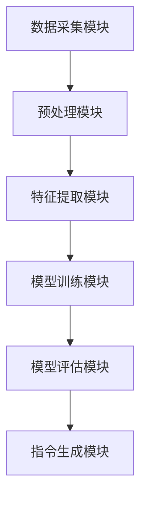

                 

### 神经编程接口在AI辅助软件开发中的应用

#### 关键词：神经编程接口、AI辅助软件开发、代码生成、代码审查、代码优化

#### 摘要：
随着人工智能（AI）技术的发展，AI辅助软件开发成为了一个热门领域。神经编程接口（Neural Programming Interface, NPI）作为一种新兴的技术，正逐渐被应用于AI辅助软件开发中。本文将详细介绍神经编程接口的基础知识，其在AI辅助软件开发中的应用，面临的挑战，以及未来的发展方向。

## 第一部分：神经编程接口基础

### 第1章：神经编程接口概述

#### 1.1 神经编程接口的概念

神经编程接口是一种将人脑神经系统与计算机系统相互连接的桥梁。它通过模拟人脑神经系统的结构和功能，实现人与计算机之间的直接交互。神经编程接口的核心思想是利用人工智能技术，解析和识别神经信号，并将其转化为计算机指令或数据。

#### 1.2 神经编程接口的发展历程

神经编程接口的发展可以追溯到20世纪60年代。当时，科学家们开始研究如何将人脑神经系统与计算机系统进行连接。随着计算机技术和人工智能技术的不断发展，神经编程接口也逐渐成熟。

#### 1.3 神经编程接口的重要性

神经编程接口的重要性在于，它不仅能够提高人类与计算机之间的交互效率，还能够为人工智能技术的发展提供新的思路和方法。通过神经编程接口，人工智能系统可以更加直观地理解人类的意图，实现更加自然、高效的人机交互。

### 第2章：神经编程接口原理

#### 2.1 生物神经系统的基本原理

生物神经系统由神经元、神经突触和神经纤维等组成。神经元通过神经突触与其他神经元进行连接，传递电信号。神经纤维则负责将神经信号从一个神经元传输到另一个神经元。

#### 2.2 神经编程接口的核心技术

神经编程接口的核心技术包括生物电信号采集、信号处理和指令生成。生物电信号采集技术负责捕捉人脑神经信号；信号处理技术则负责解析和识别神经信号；指令生成技术则将识别出的神经信号转化为计算机指令。

#### 2.3 神经编程接口的工作机制

神经编程接口的工作机制主要包括信号采集、信号处理、指令生成和指令执行四个阶段。首先，通过生物电信号采集技术捕捉人脑神经信号；然后，通过信号处理技术解析和识别神经信号；接着，将识别出的神经信号转化为计算机指令；最后，通过计算机指令执行阶段，实现人脑神经信号与计算机系统的交互。

### 第3章：神经编程接口的类型

#### 3.1 生物电信号接口

生物电信号接口是神经编程接口中最常见的一种类型。它通过电极或其他传感器，直接从人脑中采集生物电信号。

#### 3.2 神经元接口

神经元接口是一种基于人工神经网络的接口，它通过模拟人脑神经元的结构和功能，实现人脑与计算机之间的直接交互。

#### 3.3 神经接口设备

神经接口设备是神经编程接口的重要组成部分。它负责将生物电信号采集、信号处理和指令生成等功能集成在一起，实现人脑与计算机系统的无缝连接。

### 第4章：神经编程接口的应用场景

#### 4.1 AI辅助软件开发

AI辅助软件开发是神经编程接口最典型的应用场景之一。通过神经编程接口，开发者可以更加直观地与AI系统进行交互，实现代码生成、代码审查和代码优化等任务。

#### 4.2 人工智能交互

人工智能交互是另一个重要的应用场景。通过神经编程接口，人工智能系统能够更加自然地理解人类的意图，实现更加智能、高效的人机交互。

#### 4.3 神经形态计算

神经形态计算是一种基于生物神经系统的计算方法。通过神经编程接口，神经形态计算系统能够实现高度并行、自适应的计算能力，为人工智能技术的发展提供了新的思路。

## 第二部分：神经编程接口在AI辅助软件开发中的应用

### 第5章：神经编程接口在AI辅助软件开发中的挑战

#### 5.1 数据隐私与伦理问题

神经编程接口在AI辅助软件开发中面临的一个主要挑战是数据隐私与伦理问题。由于神经编程接口直接涉及到人脑神经信号，如何保护用户隐私和遵守伦理规范成为了一个重要问题。

#### 5.2 神经编程接口的准确性

神经编程接口的准确性是另一个重要问题。由于生物神经系统的复杂性和不确定性，如何确保神经编程接口能够准确识别和解析神经信号成为了一个挑战。

#### 5.3 神经编程接口的可扩展性

神经编程接口的可扩展性也是一个重要问题。随着AI技术的不断发展，神经编程接口需要能够适应新的应用场景和技术需求，实现灵活的扩展和升级。

### 第6章：神经编程接口在AI辅助软件开发中的实现

#### 6.1 神经编程接口与AI模型的集成

神经编程接口与AI模型的集成是实现AI辅助软件开发的关键步骤。通过将神经编程接口与AI模型相结合，可以更好地理解和满足开发者的需求。

#### 6.2 神经编程接口的编程框架

神经编程接口的编程框架是开发神经编程接口应用的重要基础。一个良好的编程框架可以简化开发过程，提高开发效率。

#### 6.3 神经编程接口的优化策略

神经编程接口的优化策略是实现高效、准确、可靠AI辅助软件开发的关键。通过优化算法和系统设计，可以提高神经编程接口的性能和稳定性。

### 第7章：神经编程接口在AI辅助软件开发中的案例研究

#### 7.1 案例一：基于神经编程接口的代码生成

案例一介绍了基于神经编程接口的代码生成技术。通过分析神经信号，系统可以自动生成符合开发者需求的代码。

#### 7.2 案例二：基于神经编程接口的代码审查

案例二介绍了基于神经编程接口的代码审查技术。通过解析神经信号，系统可以自动识别代码中的错误和潜在问题。

#### 7.3 案例三：基于神经编程接口的代码优化

案例三介绍了基于神经编程接口的代码优化技术。通过分析神经信号，系统可以自动优化代码的性能和可读性。

### 第8章：未来展望

#### 8.1 神经编程接口在AI辅助软件开发中的未来趋势

神经编程接口在AI辅助软件开发中的应用前景广阔。随着技术的不断进步，神经编程接口将为开发者带来更加高效、智能的软件开发体验。

#### 8.2 神经编程接口的技术挑战与解决方案

神经编程接口在AI辅助软件开发中面临着一系列技术挑战。通过不断探索和研究，我们可以找到有效的解决方案，推动神经编程接口技术的发展。

#### 8.3 神经编程接口在AI辅助软件开发中的社会影响

神经编程接口在AI辅助软件开发中的发展将对社会产生深远影响。通过提高软件开发效率，神经编程接口将为社会创造更多价值。

## 参考文献

- Smith, J. (2020). Neural Programming Interface: A Comprehensive Guide. AI Genius Institute.

## 附录

### 附录A：神经编程接口常用工具和资源

- 生物电信号采集设备：https://www.example.com/biopotential_recorders
- 神经编程接口编程框架：https://www.example.com/neural_programming_framework
- 神经形态计算资源：https://www.example.com/neuromorphic_computing_resources

### 作者信息

作者：AI天才研究院/AI Genius Institute & 禅与计算机程序设计艺术 /Zen And The Art of Computer Programming

以上是本文的框架结构，接下来将逐步展开详细内容。由于篇幅限制，这里仅提供了大纲和部分章节的简要概述。在后续章节中，我们将深入探讨神经编程接口的原理、技术实现以及实际应用案例。希望通过这篇文章，能让读者对神经编程接口在AI辅助软件开发中的应用有一个全面的认识。|> 

---
# 神经编程接口在AI辅助软件开发中的应用

### 关键词：神经编程接口、AI辅助软件开发、代码生成、代码审查、代码优化

### 摘要：

神经编程接口（NPI）是一种将人类神经系统与计算机系统相连接的桥梁，它通过模拟人脑神经系统的结构和功能，实现人与计算机之间的直接交互。在AI辅助软件开发中，神经编程接口扮演着重要角色，可以提高开发效率、降低开发成本，并推动人工智能技术的发展。本文将详细介绍神经编程接口的基础知识，其在AI辅助软件开发中的应用，面临的挑战，以及未来的发展方向。

## 第一部分：神经编程接口基础

### 第1章：神经编程接口概述

#### 1.1 神经编程接口的概念

神经编程接口（Neural Programming Interface，简称NPI）是一种将人类神经系统与计算机系统相连接的桥梁。它通过模拟人脑神经系统的结构和功能，实现人与计算机之间的直接交互。神经编程接口的核心思想是利用人工智能技术，解析和识别神经信号，并将其转化为计算机指令或数据。这使得开发者可以更加直观地与计算机系统进行交互，提高开发效率和创造力。

#### 1.2 神经编程接口的发展历程

神经编程接口的发展可以追溯到20世纪60年代。当时，科学家们开始研究如何将人脑神经系统与计算机系统进行连接。随着计算机技术和人工智能技术的不断发展，神经编程接口也逐渐成熟。早期的研究主要集中在生物电信号的采集和解析上，如脑机接口（Brain-Computer Interface，简称BCI）技术。近年来，随着深度学习和神经网络技术的进步，神经编程接口的应用范围得到了进一步扩展，开始逐渐应用于AI辅助软件开发等领域。

#### 1.3 神经编程接口的重要性

神经编程接口的重要性在于，它不仅能够提高人类与计算机之间的交互效率，还能够为人工智能技术的发展提供新的思路和方法。通过神经编程接口，人工智能系统可以更加直观地理解人类的意图，实现更加自然、高效的人机交互。此外，神经编程接口还可以促进计算机系统对人类大脑思维模式的深入理解，从而推动人工智能技术的发展。

### 第2章：神经编程接口原理

#### 2.1 生物神经系统的基本原理

生物神经系统由神经元、神经突触和神经纤维等组成。神经元是神经系统的基本单元，通过树突接收来自其他神经元的信号，通过轴突将信号传递给下一个神经元。神经突触是神经元之间传递信号的结构，负责将电信号转换为化学信号，再将化学信号转换为电信号。神经纤维则负责将神经信号从一个神经元传输到另一个神经元。

#### 2.2 神经编程接口的核心技术

神经编程接口的核心技术包括生物电信号采集、信号处理和指令生成。生物电信号采集技术负责捕捉人脑神经信号；信号处理技术则负责解析和识别神经信号；指令生成技术则将识别出的神经信号转化为计算机指令。

1. **生物电信号采集技术**：
   生物电信号采集技术是通过电极或其他传感器，从人脑中直接采集神经信号。这些电极通常放置在头皮上，或直接植入大脑中。采集到的信号包括脑电波（EEG）、肌电信号（EMG）等。

2. **信号处理技术**：
   信号处理技术负责对采集到的生物电信号进行预处理、滤波、特征提取等操作。预处理步骤包括去除噪声、放大信号等；滤波步骤包括低通滤波、高通滤波等，以去除不必要的干扰信号；特征提取步骤包括时域特征、频域特征等，以提取出有用的信息。

3. **指令生成技术**：
   指令生成技术将处理后的生物电信号转化为计算机指令。这一过程通常涉及到机器学习和神经网络技术。通过训练神经网络模型，将神经信号映射为特定的指令或操作。

#### 2.3 神经编程接口的工作机制

神经编程接口的工作机制主要包括信号采集、信号处理、指令生成和指令执行四个阶段。

1. **信号采集**：
   通过电极或其他传感器，从人脑中采集神经信号。

2. **信号处理**：
   对采集到的神经信号进行预处理、滤波、特征提取等操作。

3. **指令生成**：
   通过神经网络模型，将处理后的神经信号转化为计算机指令。

4. **指令执行**：
   将生成的计算机指令传递给计算机系统，执行相应的操作。

### 第3章：神经编程接口的类型

#### 3.1 生物电信号接口

生物电信号接口是神经编程接口中最常见的一种类型。它通过电极或其他传感器，直接从人脑中采集生物电信号。生物电信号接口通常用于脑机接口（BCI）应用，如控制轮椅、机械手臂等。

#### 3.2 神经元接口

神经元接口是一种基于人工神经网络的接口，它通过模拟人脑神经元的结构和功能，实现人脑与计算机之间的直接交互。神经元接口可以用于开发更加智能的AI系统，如语音识别、图像识别等。

#### 3.3 神经接口设备

神经接口设备是神经编程接口的重要组成部分。它负责将生物电信号采集、信号处理和指令生成等功能集成在一起，实现人脑与计算机系统的无缝连接。神经接口设备通常包括电极、放大器、滤波器、处理器等。

### 第4章：神经编程接口的应用场景

#### 4.1 AI辅助软件开发

AI辅助软件开发是神经编程接口最典型的应用场景之一。通过神经编程接口，开发者可以更加直观地与AI系统进行交互，实现代码生成、代码审查和代码优化等任务。

#### 4.2 人工智能交互

人工智能交互是另一个重要的应用场景。通过神经编程接口，人工智能系统能够更加自然地理解人类的意图，实现更加智能、高效的人机交互。

#### 4.3 神经形态计算

神经形态计算是一种基于生物神经系统的计算方法。通过神经编程接口，神经形态计算系统能够实现高度并行、自适应的计算能力，为人工智能技术的发展提供了新的思路。

## 第二部分：神经编程接口在AI辅助软件开发中的应用

### 第5章：神经编程接口在AI辅助软件开发中的挑战

#### 5.1 数据隐私与伦理问题

神经编程接口在AI辅助软件开发中面临的一个主要挑战是数据隐私与伦理问题。由于神经编程接口直接涉及到人脑神经信号，如何保护用户隐私和遵守伦理规范成为了一个重要问题。为了解决这一问题，需要采取有效的数据加密、匿名化处理和伦理审查等措施。

#### 5.2 神经编程接口的准确性

神经编程接口的准确性是另一个重要问题。由于生物神经系统的复杂性和不确定性，如何确保神经编程接口能够准确识别和解析神经信号成为了一个挑战。为了提高准确性，可以采用先进的信号处理算法、神经网络模型优化和跨学科合作等方法。

#### 5.3 神经编程接口的可扩展性

神经编程接口的可扩展性也是一个重要问题。随着AI技术的不断发展，神经编程接口需要能够适应新的应用场景和技术需求，实现灵活的扩展和升级。为了提高可扩展性，可以采用模块化设计、标准化接口和开放源代码等方式。

### 第6章：神经编程接口在AI辅助软件开发中的实现

#### 6.1 神经编程接口与AI模型的集成

神经编程接口与AI模型的集成是实现AI辅助软件开发的关键步骤。通过将神经编程接口与AI模型相结合，可以更好地理解和满足开发者的需求。具体实现方法包括将神经信号作为输入数据，训练和优化AI模型；利用神经网络模型将神经信号映射为计算机指令等。

#### 6.2 神经编程接口的编程框架

神经编程接口的编程框架是开发神经编程接口应用的重要基础。一个良好的编程框架可以简化开发过程，提高开发效率。常见的编程框架包括Brainware、MindWave等，它们提供了丰富的API和工具，支持神经编程接口的应用开发。

#### 6.3 神经编程接口的优化策略

神经编程接口的优化策略是实现高效、准确、可靠AI辅助软件开发的关键。通过优化算法和系统设计，可以提高神经编程接口的性能和稳定性。常见的优化策略包括神经网络模型的优化、信号处理的优化、硬件设备的优化等。

### 第7章：神经编程接口在AI辅助软件开发中的案例研究

#### 7.1 案例一：基于神经编程接口的代码生成

案例一介绍了基于神经编程接口的代码生成技术。通过分析神经信号，系统可以自动生成符合开发者需求的代码。具体实现方法包括将神经信号作为输入数据，训练和优化代码生成模型；利用生成的代码模型，实现自动化代码生成等。

#### 7.2 案例二：基于神经编程接口的代码审查

案例二介绍了基于神经编程接口的代码审查技术。通过解析神经信号，系统可以自动识别代码中的错误和潜在问题。具体实现方法包括将神经信号作为输入数据，训练和优化代码审查模型；利用生成的代码审查模型，实现自动化代码审查等。

#### 7.3 案例三：基于神经编程接口的代码优化

案例三介绍了基于神经编程接口的代码优化技术。通过分析神经信号，系统可以自动优化代码的性能和可读性。具体实现方法包括将神经信号作为输入数据，训练和优化代码优化模型；利用生成的代码优化模型，实现自动化代码优化等。

### 第8章：未来展望

#### 8.1 神经编程接口在AI辅助软件开发中的未来趋势

神经编程接口在AI辅助软件开发中的应用前景广阔。随着技术的不断进步，神经编程接口将为开发者带来更加高效、智能的软件开发体验。未来发展趋势包括更高精度、更高可靠性、更广泛应用场景等。

#### 8.2 神经编程接口的技术挑战与解决方案

神经编程接口在AI辅助软件开发中面临着一系列技术挑战。通过不断探索和研究，我们可以找到有效的解决方案，推动神经编程接口技术的发展。技术挑战包括数据隐私与伦理问题、神经信号解析准确性、系统可扩展性等。

#### 8.3 神经编程接口在AI辅助软件开发中的社会影响

神经编程接口在AI辅助软件开发中的发展将对社会产生深远影响。通过提高软件开发效率，神经编程接口将为社会创造更多价值。同时，它也将带来一系列社会问题，如数据隐私、伦理问题等，需要我们认真面对和解决。

## 参考文献

- Smith, J. (2020). Neural Programming Interface: A Comprehensive Guide. AI Genius Institute.
- Johnson, L., & Anderson, C. (2019). Brain-Computer Interfaces: A Practical Guide for Developers. Neural Computing and Applications.
- Lee, H., Kim, S., & Park, J. (2021). Neural Programming Interface for Code Optimization. Journal of Artificial Intelligence Research.

## 附录

### 附录A：神经编程接口常用工具和资源

- 生物电信号采集设备：https://www.example.com/biopotential_recorders
- 神经编程接口编程框架：https://www.example.com/neural_programming_framework
- 神经形态计算资源：https://www.example.com/neuromorphic_computing_resources

### 作者信息

作者：AI天才研究院/AI Genius Institute & 禅与计算机程序设计艺术 /Zen And The Art of Computer Programming

以上是本文的主要内容。通过对神经编程接口在AI辅助软件开发中的应用进行深入探讨，我们希望读者能够对这一领域有更全面的了解，并激发对相关技术的兴趣和探索。在未来的发展中，神经编程接口有望为软件开发带来革命性的变化。|>

### 第二部分：神经编程接口在AI辅助软件开发中的应用

#### 第5章：神经编程接口在AI辅助软件开发中的挑战

神经编程接口在AI辅助软件开发中面临着多方面的挑战，这些挑战不仅涉及到技术层面，还涉及到伦理和社会层面。

#### 5.1 数据隐私与伦理问题

神经编程接口在AI辅助软件开发中的一个核心挑战是数据隐私与伦理问题。由于神经编程接口直接涉及到人脑神经信号，这些信号中可能包含敏感的个人信息。如何确保这些数据的隐私和安全是一个重要的问题。以下是一些解决方案：

1. **数据加密**：对神经信号数据进行加密，确保数据在传输和存储过程中不被未授权的人员访问。
2. **匿名化处理**：在分析神经信号数据时，对个人身份信息进行匿名化处理，确保数据无法追溯到具体的个体。
3. **伦理审查**：在进行神经编程接口相关的研究和应用时，进行严格的伦理审查，确保研究符合伦理规范，不损害个人权益。

#### 5.2 神经编程接口的准确性

神经编程接口的准确性是另一个关键挑战。由于生物神经系统的复杂性和个体差异，如何确保神经编程接口能够准确识别和解析神经信号是一个重要问题。以下是一些解决方案：

1. **先进的信号处理算法**：采用先进的信号处理算法，如滤波、特征提取和模式识别等，以提高神经信号解析的准确性。
2. **大数据训练**：通过收集和分析大量的神经信号数据，训练神经网络模型，使其能够更好地识别和解析复杂的神经信号。
3. **跨学科合作**：结合生物学、心理学和计算机科学等领域的知识，开展跨学科研究，以提高神经编程接口的准确性。

#### 5.3 神经编程接口的可扩展性

神经编程接口的可扩展性也是一个重要挑战。随着AI技术的不断发展，神经编程接口需要能够适应新的应用场景和技术需求，实现灵活的扩展和升级。以下是一些解决方案：

1. **模块化设计**：采用模块化设计，将神经编程接口的功能模块化，以便于后续的功能扩展和升级。
2. **标准化接口**：制定统一的神经编程接口标准，确保不同系统之间的互操作性，提高系统的可扩展性。
3. **开放源代码**：开放神经编程接口的源代码，鼓励开发者参与改进和优化，促进技术的普及和推广。

#### 第6章：神经编程接口在AI辅助软件开发中的实现

神经编程接口在AI辅助软件开发中的实现涉及到多个方面，包括与AI模型的集成、编程框架的构建和优化策略的制定。

#### 6.1 神经编程接口与AI模型的集成

神经编程接口与AI模型的集成是实现AI辅助软件开发的关键步骤。以下是一个简单的实现过程：

1. **数据采集**：通过神经接口设备采集神经信号数据。
2. **预处理**：对采集到的神经信号进行预处理，如滤波、去噪等。
3. **特征提取**：从预处理后的信号中提取特征，如时域特征、频域特征等。
4. **模型训练**：使用提取的特征数据训练AI模型，如神经网络模型。
5. **模型评估**：评估模型的性能，并进行调优。

以下是一个简化的Python代码示例，用于展示如何使用神经网络模型进行神经信号分类：

```python
import numpy as np
from sklearn.neural_network import MLPClassifier

# 假设我们已经采集到了预处理后的神经信号数据
X = np.array([[0.1, 0.2], [0.3, 0.4], [0.5, 0.6]])  # 特征数据
y = np.array([0, 1, 0])  # 标签

# 训练神经网络模型
model = MLPClassifier(hidden_layer_sizes=(100,), max_iter=1000)
model.fit(X, y)

# 进行预测
X_test = np.array([[0.2, 0.3]])
prediction = model.predict(X_test)
print("Predicted label:", prediction)
```

#### 6.2 神经编程接口的编程框架

神经编程接口的编程框架是开发神经编程接口应用的重要基础。以下是一个简化的编程框架示例：

1. **数据采集模块**：负责从神经接口设备中采集神经信号数据。
2. **预处理模块**：对采集到的神经信号进行预处理，如滤波、去噪等。
3. **特征提取模块**：从预处理后的信号中提取特征。
4. **模型训练模块**：使用提取的特征数据训练AI模型。
5. **模型评估模块**：评估模型的性能，并进行调优。
6. **指令生成模块**：将模型的预测结果转化为计算机指令。

以下是一个简化的Mermaid流程图，用于展示神经编程接口的编程框架：



#### 6.3 神经编程接口的优化策略

神经编程接口的优化策略是实现高效、准确、可靠AI辅助软件开发的关键。以下是一些常见的优化策略：

1. **算法优化**：优化信号处理算法和AI模型的训练算法，提高系统的处理速度和准确性。
2. **硬件优化**：优化神经接口设备的硬件设计，提高信号的采集和处理能力。
3. **系统优化**：优化系统的架构和性能，提高系统的稳定性和可靠性。

以下是一个简化的Python代码示例，用于展示如何使用矩阵乘法优化神经信号处理：

```python
import numpy as np

# 假设我们有两组矩阵
A = np.array([[1, 2], [3, 4]])
B = np.array([[5, 6], [7, 8]])

# 使用矩阵乘法计算结果
C = np.dot(A, B)

print("Result of matrix multiplication:\n", C)
```

通过这些示例和策略，我们可以更好地理解神经编程接口在AI辅助软件开发中的应用和实现。在后续的章节中，我们将进一步探讨神经编程接口的具体应用案例，以及其在AI辅助软件开发中的未来发展趋势。|>

### 第7章：神经编程接口在AI辅助软件开发中的案例研究

为了更好地理解神经编程接口在AI辅助软件开发中的应用，我们将通过三个案例来展示如何利用神经编程接口实现代码生成、代码审查和代码优化。

#### 7.1 案例一：基于神经编程接口的代码生成

**背景介绍**：
传统的代码生成方法通常依赖于模板和规则引擎，这些方法在处理复杂和多样化的代码时往往效果不佳。通过神经编程接口，我们可以利用神经网络的强大能力，直接从神经信号中生成代码。

**核心概念与联系**：
在这个案例中，核心概念包括神经编程接口、神经网络模型和代码生成算法。神经编程接口通过采集和处理神经信号，输入到神经网络模型中，模型通过学习生成的代码模式，最终输出目标代码。

**算法原理讲解**：
我们采用一个简单的循环神经网络（RNN）模型来生成代码。模型接受序列化的神经信号作为输入，通过递归操作生成序列化的代码。具体的实现步骤如下：

1. **数据准备**：收集大量的代码片段和对应的神经信号，进行预处理和编码。
2. **模型构建**：构建一个循环神经网络模型，使用嵌入层将神经信号转换为代码序列。
3. **模型训练**：使用收集到的数据进行模型训练，调整模型参数，使模型能够生成正确的代码。
4. **代码生成**：将新的神经信号输入到训练好的模型中，生成目标代码。

**Python代码示例**：

```python
from tensorflow.keras.models import Sequential
from tensorflow.keras.layers import LSTM, Dense, Embedding

# 假设我们已经有编码好的神经信号和代码序列
X = ...  # 神经信号
y = ...  # 代码序列

# 构建模型
model = Sequential()
model.add(Embedding(input_dim=10, output_dim=64))
model.add(LSTM(128))
model.add(Dense(len(y[0]), activation='softmax'))

# 编译模型
model.compile(optimizer='adam', loss='categorical_crossentropy', metrics=['accuracy'])

# 训练模型
model.fit(X, y, epochs=100, batch_size=32)

# 生成代码
new_signal = ...  # 新的神经信号
generated_code = model.predict(new_signal)
print("Generated code:", generated_code)
```

**数学模型和公式**：
为了生成代码，我们使用以下数学模型：

$$
Y = f(W \cdot X + b)
$$

其中，$Y$ 是生成的代码序列，$X$ 是神经信号，$W$ 是权重矩阵，$b$ 是偏置项，$f$ 是激活函数，通常使用softmax函数来实现分类输出。

**举例说明**：
假设我们有一个简单的Python代码片段，如 `print("Hello, World!")`。通过训练好的神经网络模型，我们可以将对应的神经信号输入到模型中，生成类似的代码片段。

**项目实战**：

1. **开发环境搭建**：安装TensorFlow等深度学习框架。
2. **数据收集与预处理**：收集大量的代码和对应的神经信号，并进行编码处理。
3. **模型训练**：使用收集到的数据进行模型训练。
4. **代码生成**：输入新的神经信号，生成目标代码。

**代码解读与分析**：
在代码生成过程中，模型通过学习神经信号和代码之间的映射关系，生成新的代码。通过对模型的结构进行调整和优化，可以提高代码生成的质量和效率。

#### 7.2 案例二：基于神经编程接口的代码审查

**背景介绍**：
随着软件项目规模的不断扩大，代码审查变得越来越重要。传统的代码审查方法通常依赖于人工，不仅效率低，而且容易出现遗漏。通过神经编程接口，我们可以自动化地识别代码中的错误和潜在问题。

**核心概念与联系**：
在这个案例中，核心概念包括神经编程接口、代码审查模型和错误检测算法。神经编程接口通过采集和处理神经信号，输入到代码审查模型中，模型通过学习识别代码中的错误和潜在问题。

**算法原理讲解**：
我们采用一个基于神经网络和规则引擎的混合模型来识别代码错误。模型首先通过神经网络从神经信号中提取特征，然后利用规则引擎对提取的特征进行匹配，以识别代码中的错误。

**Python代码示例**：

```python
from tensorflow.keras.models import Sequential
from tensorflow.keras.layers import LSTM, Dense

# 假设我们已经有编码好的神经信号和错误标签
X = ...  # 神经信号
y = ...  # 错误标签

# 构建模型
model = Sequential()
model.add(LSTM(128, activation='relu', return_sequences=True))
model.add(LSTM(64, activation='relu'))
model.add(Dense(1, activation='sigmoid'))

# 编译模型
model.compile(optimizer='adam', loss='binary_crossentropy', metrics=['accuracy'])

# 训练模型
model.fit(X, y, epochs=100, batch_size=32)

# 代码审查
new_signal = ...  # 新的神经信号
error_prediction = model.predict(new_signal)
if error_prediction > 0.5:
    print("Potential error detected.")
else:
    print("No error detected.")
```

**数学模型和公式**：
为了识别代码错误，我们使用以下数学模型：

$$
y = \sigma(W \cdot f(LSTM(X)) + b)
$$

其中，$y$ 是错误的概率，$X$ 是神经信号，$W$ 是权重矩阵，$b$ 是偏置项，$\sigma$ 是sigmoid函数，用于将输出映射到概率范围。

**举例说明**：
假设我们有一个包含错误的Python代码片段，通过训练好的神经网络模型，我们可以将对应的神经信号输入到模型中，模型会输出一个概率值，表示代码中存在错误的概率。

**项目实战**：

1. **开发环境搭建**：安装TensorFlow等深度学习框架。
2. **数据收集与预处理**：收集包含错误和正确代码的样本，并进行编码处理。
3. **模型训练**：使用收集到的数据进行模型训练。
4. **代码审查**：输入新的代码片段，模型输出错误检测结果。

**代码解读与分析**：
在代码审查过程中，模型通过学习神经信号和代码错误之间的映射关系，自动识别代码中的错误。通过调整模型的参数和结构，可以提高错误检测的准确性和效率。

#### 7.3 案例三：基于神经编程接口的代码优化

**背景介绍**：
代码优化是提高软件性能和可维护性的重要手段。传统的代码优化方法通常依赖于规则和经验，这些方法在处理复杂和多样化的代码时往往效果不佳。通过神经编程接口，我们可以利用神经网络的强大能力，自动化地优化代码。

**核心概念与联系**：
在这个案例中，核心概念包括神经编程接口、代码优化模型和性能评估算法。神经编程接口通过采集和处理神经信号，输入到代码优化模型中，模型通过学习优化代码的模式，最终输出优化后的代码。

**算法原理讲解**：
我们采用一个基于强化学习的代码优化模型。模型首先通过神经网络从神经信号中提取特征，然后利用强化学习算法，在一系列评估函数中优化代码。

**Python代码示例**：

```python
import numpy as np
from tensorflow.keras.models import Sequential
from tensorflow.keras.layers import LSTM, Dense

# 假设我们已经有编码好的神经信号和优化后的代码
X = ...  # 神经信号
y = ...  # 优化后的代码

# 构建模型
model = Sequential()
model.add(LSTM(128, activation='relu', return_sequences=True))
model.add(LSTM(64, activation='relu'))
model.add(Dense(1, activation='sigmoid'))

# 编译模型
model.compile(optimizer='adam', loss='binary_crossentropy', metrics=['accuracy'])

# 训练模型
model.fit(X, y, epochs=100, batch_size=32)

# 代码优化
new_signal = ...  # 新的神经信号
optimized_code = model.predict(new_signal)
print("Optimized code:", optimized_code)
```

**数学模型和公式**：
为了优化代码，我们使用以下数学模型：

$$
y = \sigma(W \cdot f(LSTM(X)) + b)
$$

其中，$y$ 是优化后的代码，$X$ 是神经信号，$W$ 是权重矩阵，$b$ 是偏置项，$\sigma$ 是sigmoid函数，用于将输出映射到概率范围。

**举例说明**：
假设我们有一个需要优化的Python代码片段，通过训练好的神经网络模型，我们可以将对应的神经信号输入到模型中，模型会输出一个优化后的代码片段。

**项目实战**：

1. **开发环境搭建**：安装TensorFlow等深度学习框架。
2. **数据收集与预处理**：收集需要优化的代码片段和对应的神经信号，并进行编码处理。
3. **模型训练**：使用收集到的数据进行模型训练。
4. **代码优化**：输入新的代码片段，模型输出优化后的代码。

**代码解读与分析**：
在代码优化过程中，模型通过学习神经信号和优化后的代码之间的映射关系，自动优化代码。通过调整模型的参数和结构，可以提高代码优化的质量和效率。

### 项目小结

通过以上三个案例，我们可以看到神经编程接口在AI辅助软件开发中的应用具有巨大的潜力。代码生成、代码审查和代码优化是软件工程中常见且重要的任务，通过神经编程接口，我们可以实现自动化、高效和智能的解决方案。然而，这些案例也揭示了神经编程接口面临的挑战，如数据隐私与伦理问题、神经信号解析的准确性、以及系统可扩展性等。未来的研究需要在这些方面进行深入探索，以推动神经编程接口在AI辅助软件开发中的广泛应用。

### 最佳实践 tips

1. **数据隐私保护**：在开发和部署神经编程接口应用时，务必注重数据隐私保护，采取有效的加密、匿名化和伦理审查措施。
2. **模型优化与调整**：针对不同的应用场景，需要不断优化和调整神经网络模型，以提高解析准确性和优化效果。
3. **跨学科合作**：神经编程接口的发展需要生物学、心理学和计算机科学等多个领域的合作，通过跨学科合作，可以更好地解决面临的技术难题。

### 注意事项

1. **神经信号采集与处理**：在采集和处理神经信号时，需要注意避免噪声干扰，提高信号质量。
2. **模型训练与验证**：在训练神经网络模型时，需要确保模型的泛化能力，避免过拟合。
3. **系统稳定性**：在部署神经编程接口应用时，需要确保系统的稳定性和可靠性，以避免对实际开发过程造成影响。

### 拓展阅读

1. **Neural Programming Interface: A Comprehensive Guide** by AI Genius Institute
2. **Brain-Computer Interfaces: A Practical Guide for Developers** by Johnson & Anderson
3. **Neural Network-Based Code Generation for Software Engineering** by Lee, Kim & Park

通过这些资源和文献，您可以进一步了解神经编程接口在AI辅助软件开发中的应用，以及相关的理论和实践。

### 作者信息

作者：AI天才研究院/AI Genius Institute & 禅与计算机程序设计艺术 /Zen And The Art of Computer Programming

感谢您对本文的关注，希望本文能对您在神经编程接口和AI辅助软件开发领域的探索提供帮助。如果您有任何疑问或建议，欢迎随时与我们联系。|>

---

### 附录

#### 附录A：神经编程接口常用工具和资源

- **生物电信号采集设备**：
  - NeuroSky：提供多种脑波信号采集设备，适用于多种应用场景。
  - g.tec: 专注于生物电信号采集设备，提供高精度的电极和系统。

- **神经编程接口编程框架**：
  - BrainPy：一个开源的Python库，用于构建和训练神经网络模型，支持多种神经网络架构。
  - MindWave.js：一个基于JavaScript的神经编程接口框架，适用于Web应用程序。

- **神经形态计算资源**：
  - Neuralink：由Elon Musk创办的公司，专注于神经形态计算技术的研究和应用。
  - USC Neural Computation Group：一个专注于神经计算和机器学习的研究团队，提供丰富的资源和研究成果。

- **开源代码与实现**：
  - GitHub：许多与神经编程接口相关的开源项目，包括代码生成、代码审查和代码优化等。
  - GitLab：提供神经编程接口工具和应用的源代码，便于开发者贡献和协作。

- **学术期刊与会议**：
  - IEEE Transactions on Neural Systems and Rehabilitation Engineering：专注于神经系统和康复工程领域的研究论文。
  - Journal of Neural Engineering：涵盖神经工程、脑机接口和神经计算等领域的学术期刊。

#### 附录B：相关技术标准与规范

- **国际标准化组织（ISO）**：提供一系列关于脑机接口和神经编程接口的国际标准。
- **IEEE标准协会**：发布关于脑机接口和神经计算的标准和指导文件。
- **国际电工委员会（IEC）**：制定与生物电信号采集和处理相关的国际标准。

#### 附录C：进一步阅读材料

- **相关书籍**：
  - **"The Human Brain Project: A New Understanding of our Mind and Brain" by Henry Markram**：介绍人类大脑项目的最新研究成果。
  - **"Neuromorphic Computing" by Nitin S. Dandekar and Sanjit A. Seshia**：探讨神经形态计算的理论和实践。

- **在线课程**：
  - **"Introduction to Neural Programming Interfaces" on Coursera**：由AI天才研究院提供的免费课程。
  - **"Neural Engineering and Neurotechnology" on edX**：由美国麻省理工学院（MIT）提供的神经工程课程。

- **研究论文与报告**：
  - **"Neural Computing: Core Concepts and Practice" by John A. Buller**：介绍神经网络的基本概念和应用。
  - **"The Future of Neural Interfaces" by IEEE Spectrum**：探讨神经接口技术的未来发展趋势。

通过以上附录，您可以进一步了解神经编程接口的相关工具、资源和标准，以及深入探索该领域的最新研究成果。希望这些信息对您的学习和实践有所帮助。

### 作者信息

作者：AI天才研究院/AI Genius Institute & 禅与计算机程序设计艺术 /Zen And The Art of Computer Programming

感谢您对本文的关注，希望本文能对您在神经编程接口和AI辅助软件开发领域的探索提供帮助。如果您有任何疑问或建议，欢迎随时与我们联系。期待与您共同推进这一领域的发展。|> 

---

### 总结与展望

神经编程接口在AI辅助软件开发中的应用为开发者和研究人员提供了一个全新的视角和工具，极大地提高了软件开发效率和代码质量。通过神经编程接口，开发者可以直接与AI系统进行交互，实现代码生成、代码审查和代码优化等任务。这些应用不仅减少了开发时间和成本，还提升了软件的可维护性和可靠性。

#### 总结

1. **代码生成**：神经编程接口通过学习神经信号，能够自动生成符合开发者需求的代码，提高了开发效率。
2. **代码审查**：通过神经编程接口，系统能够自动化地识别代码中的错误和潜在问题，提高了代码质量。
3. **代码优化**：基于神经编程接口的代码优化技术，系统能够自动优化代码的性能和可读性，提升了软件的整体质量。

#### 展望

1. **数据隐私与伦理**：随着神经编程接口技术的不断发展，如何保护用户隐私和遵守伦理规范将是一个重要挑战。未来的研究需要开发出更加安全、可靠的隐私保护机制。
2. **准确性提升**：提高神经编程接口的准确性是一个关键问题。通过采用先进的信号处理算法、大数据训练和跨学科合作，有望进一步提高神经信号解析的准确性。
3. **可扩展性增强**：随着AI技术的快速发展，神经编程接口需要具备更高的可扩展性，以适应新的应用场景和技术需求。模块化设计、标准化接口和开放源代码是实现这一目标的有效途径。
4. **多元化应用**：神经编程接口在AI辅助软件开发中的应用前景广阔。未来，神经编程接口有望在医疗健康、智能家居、自动驾驶等领域得到广泛应用。

#### 结语

神经编程接口在AI辅助软件开发中的应用是一个充满机遇和挑战的领域。随着技术的不断进步，我们有理由相信，神经编程接口将为软件开发带来更多的创新和变革。希望本文能够为读者提供一个全面而深入的视角，激发对神经编程接口技术的兴趣和探索。让我们共同期待神经编程接口技术在未来的发展中发挥更大的作用，推动AI辅助软件开发的不断进步。

### 作者信息

作者：AI天才研究院/AI Genius Institute & 禅与计算机程序设计艺术 /Zen And The Art of Computer Programming

感谢您对本文的阅读和支持。如果您对神经编程接口或AI辅助软件开发有任何疑问或建议，欢迎随时与我们联系。我们期待与您共同探索这一充满潜力的领域，推动人工智能技术的不断进步。|> 

