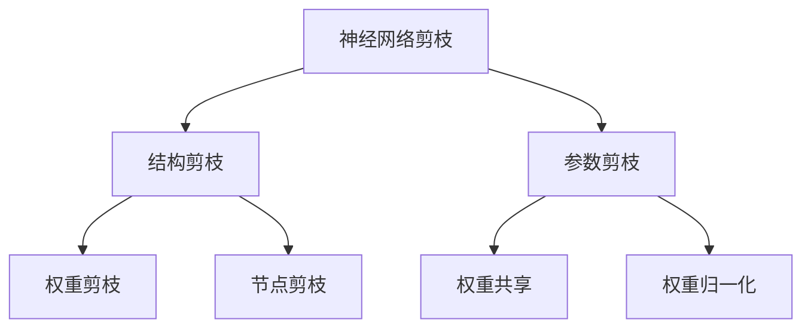

                 

# 《神经网络剪枝在移动端实时目标检测中的应用》

> 关键词：神经网络剪枝、移动端实时目标检测、性能优化、算法实现

> 摘要：本文探讨了神经网络剪枝技术在移动端实时目标检测中的应用。通过对神经网络剪枝技术的概述，详细分析了其原理和分类，并介绍了如何将剪枝技术应用于移动端实时目标检测中，优化检测性能。通过实际案例，本文展示了神经网络剪枝技术在移动端实时目标检测中的具体实现和效果。

## 第1章 引言

### 1.1 研究背景

随着移动设备的普及，移动端应用在各个领域得到了广泛应用。在图像处理领域，实时目标检测技术在移动端的应用需求日益增加。然而，由于移动端硬件资源限制，如何在有限的计算资源下实现高效的目标检测成为了一个重要的问题。神经网络剪枝技术作为一种优化神经网络模型的方法，通过减少模型参数和计算量，有助于提高模型在移动端的运行效率和性能。

### 1.2 移动端实时目标检测的发展现状

近年来，随着深度学习技术的发展，实时目标检测算法取得了显著的性能提升。然而，这些算法通常在服务器端具有较好的性能，但在移动端面临资源受限的挑战。如何将高效的目标检测算法应用于移动端，成为当前研究的热点问题。

### 1.3 神经网络剪枝技术概述

神经网络剪枝技术通过对神经网络模型进行结构或参数剪枝，减少模型参数和计算量，从而提高模型在移动端的运行效率和性能。剪枝技术可以分为结构剪枝和参数剪枝两种类型，每种类型都有其独特的优缺点和适用场景。

### 1.4 本书结构安排

本文将首先介绍神经网络剪枝技术的基础知识，包括神经网络的基本原理和剪枝技术的分类。接着，我们将分析神经网络剪枝算法，详细讲解结构剪枝和参数剪枝算法的实现原理和优化策略。随后，本文将探讨移动端实时目标检测算法，介绍几种典型的实时目标检测算法及其在移动端的应用。最后，本文将结合实际案例，展示神经网络剪枝技术在移动端实时目标检测中的应用和效果。

## 第2章 神经网络基础

### 2.1 神经网络的基本原理

神经网络是一种模拟生物神经系统的计算模型，通过神经元之间的连接和激活函数来实现输入数据的非线性变换。神经网络的核心组成部分包括神经元、权重和激活函数。

### 2.2 卷积神经网络（CNN）

卷积神经网络是一种专门用于处理图像数据的神经网络结构，通过卷积层、池化层和全连接层等结构来提取图像特征并进行分类。CNN在图像识别、目标检测等领域取得了显著的成果。

### 2.3 神经网络剪枝技术简介

神经网络剪枝技术通过对神经网络模型进行剪枝，减少模型参数和计算量，从而提高模型在移动端的运行效率和性能。剪枝技术可以分为结构剪枝和参数剪枝两种类型，每种类型都有其独特的优缺点和适用场景。

### 2.4 剪枝技术的分类与比较

结构剪枝通过对神经网络结构进行优化，去除无用或冗余的神经元或层，从而减少模型参数和计算量。参数剪枝通过对模型参数进行优化，降低参数的精度或直接去除部分参数，从而减少计算量。

## 第3章 神经网络剪枝算法

### 3.1 结构剪枝算法

#### 3.1.1 权重剪枝

权重剪枝通过降低网络权重参数的精度，从而减少模型参数数量。权重剪枝算法可以分为低精度剪枝和高精度剪枝。

#### 3.1.2 节点剪枝

节点剪枝通过直接去除网络中的无用或冗余神经元或层，从而减少模型参数数量。节点剪枝算法可以分为基于敏感度剪枝和基于稀疏性剪枝。

#### 3.1.3 混合剪枝

混合剪枝结合了权重剪枝和节点剪枝的方法，通过综合优化网络结构，从而实现更高的模型压缩率和性能提升。

### 3.2 参数剪枝算法

#### 3.2.1 权重共享

权重共享通过将网络中相同或相似权重的参数进行共享，从而减少模型参数数量。权重共享可以分为全局共享和局部共享。

#### 3.2.2 权重归一化

权重归一化通过调整网络权重参数的分布，使其更加均匀，从而减少参数数量。权重归一化可以分为L1正则化和L2正则化。

#### 3.2.3 参数剪枝的优化策略

参数剪枝的优化策略主要包括基于敏感度的优化、基于稀疏度的优化和基于性能的优化。

## 第4章 移动端实时目标检测

### 4.1 实时目标检测算法概述

实时目标检测算法主要包括R-CNN系列算法、Fast R-CNN、Faster R-CNN、SSD和YOLO等。这些算法在速度和精度上各有优势，适用于不同的应用场景。

### 4.2 移动端实时目标检测的应用场景

移动端实时目标检测广泛应用于移动安全监控、智能驾驶、智能安防等领域，具有广泛的应用前景。

### 4.3 移动端硬件资源限制与优化策略

移动端硬件资源限制主要包括计算能力、存储空间和功耗。为了在有限的资源下实现实时目标检测，需要采取相应的优化策略，如模型压缩、量化、剪枝等。

## 第5章 剪枝技术在移动端实时目标检测中的应用

### 5.1 剪枝对移动端实时目标检测性能的影响

#### 5.1.1 剪枝算法对检测精度的影响

剪枝算法对检测精度有一定影响，但通过合理选择剪枝算法和优化策略，可以最大限度地减少对检测精度的影响。

#### 5.1.2 剪枝算法对检测速度的影响

剪枝算法可以显著提高模型在移动端的运行速度，从而实现实时目标检测。

### 5.2 剪枝技术在移动端实时目标检测中的实现

#### 5.2.1 剪枝算法的选择

根据移动端实时目标检测的需求，选择适合的剪枝算法，如结构剪枝或参数剪枝。

#### 5.2.2 剪枝算法的优化

通过优化剪枝算法，如调整剪枝阈值、优化剪枝策略等，提高剪枝效果。

#### 5.2.3 实时目标检测系统的构建

结合剪枝技术和实时目标检测算法，构建高效的实时目标检测系统。

## 第6章 神经网络剪枝在移动端实时目标检测中的应用案例

### 6.1 案例一：基于YOLOv4的移动端实时目标检测

#### 6.1.1 案例背景

介绍YOLOv4算法及其在移动端实时目标检测中的应用。

#### 6.1.2 实验环境与数据集

配置实验环境，选择合适的数据集进行训练和测试。

#### 6.1.3 剪枝算法应用与优化

应用剪枝算法，对YOLOv4模型进行剪枝，优化模型参数和结构。

#### 6.1.4 实验结果分析

分析剪枝后的YOLOv4模型在移动端实时目标检测中的性能。

### 6.2 案例二：基于SSD的移动端实时目标检测

#### 6.2.1 案例背景

介绍SSD算法及其在移动端实时目标检测中的应用。

#### 6.2.2 实验环境与数据集

配置实验环境，选择合适的数据集进行训练和测试。

#### 6.2.3 剪枝算法应用与优化

应用剪枝算法，对SSD模型进行剪枝，优化模型参数和结构。

#### 6.2.4 实验结果分析

分析剪枝后的SSD模型在移动端实时目标检测中的性能。

## 第7章 总结与展望

### 7.1 研究成果总结

总结了神经网络剪枝技术在移动端实时目标检测中的应用成果。

### 7.2 当前挑战与未来发展方向

分析了当前面临的挑战和未来发展方向。

### 7.3 对移动端实时目标检测的潜在影响

探讨了神经网络剪枝技术对移动端实时目标检测的潜在影响。

## 附录

### A.1 相关代码与数据集

提供相关的代码和数据集链接。

### A.2 参考文献

列出本文参考文献。

作者：AI天才研究院/AI Genius Institute & 禅与计算机程序设计艺术 /Zen And The Art of Computer Programming

---

**注意**：本文大纲和内容仅为示例，具体内容和结构需根据实际研究进行完善。以下是一个示例中的Mermaid流程图，用于展示神经网络剪枝技术的分类：



在撰写文章时，请根据实际需求和内容补充相关的代码、公式和案例分析。确保文章的完整性和准确性。文章的字数控制在10000～12000字左右，格式使用markdown，确保代码、公式和图片的展示效果。最后，在文章末尾附上完整的作者信息和参考文献。祝撰写顺利！📝💡🔍
```markdown
---
# 《神经网络剪枝在移动端实时目标检测中的应用》

> 关键词：神经网络剪枝、移动端实时目标检测、性能优化、算法实现

> 摘要：本文探讨了神经网络剪枝技术在移动端实时目标检测中的应用。通过对神经网络剪枝技术的概述，详细分析了其原理和分类，并介绍了如何将剪枝技术应用于移动端实时目标检测中，优化检测性能。通过实际案例，本文展示了神经网络剪枝技术在移动端实时目标检测中的具体实现和效果。

## 第1章 引言

### 1.1 研究背景

随着移动设备的普及，移动端应用在各个领域得到了广泛应用。在图像处理领域，实时目标检测技术在移动端的应用需求日益增加。然而，由于移动端硬件资源限制，如何在有限的计算资源下实现高效的目标检测成为了一个重要的问题。神经网络剪枝技术作为一种优化神经网络模型的方法，通过减少模型参数和计算量，有助于提高模型在移动端的运行效率和性能。

### 1.2 移动端实时目标检测的发展现状

近年来，随着深度学习技术的发展，实时目标检测算法取得了显著的性能提升。然而，这些算法通常在服务器端具有较好的性能，但在移动端面临资源受限的挑战。如何将高效的目标检测算法应用于移动端，成为当前研究的热点问题。

### 1.3 神经网络剪枝技术概述

神经网络剪枝技术通过对神经网络模型进行结构或参数剪枝，减少模型参数和计算量，从而提高模型在移动端的运行效率和性能。剪枝技术可以分为结构剪枝和参数剪枝两种类型，每种类型都有其独特的优缺点和适用场景。

### 1.4 本书结构安排

本文将首先介绍神经网络剪枝技术的基础知识，包括神经网络的基本原理和剪枝技术的分类。接着，本文将分析神经网络剪枝算法，详细讲解结构剪枝和参数剪枝算法的实现原理和优化策略。随后，本文将探讨移动端实时目标检测算法，介绍几种典型的实时目标检测算法及其在移动端的应用。最后，本文将结合实际案例，展示神经网络剪枝技术在移动端实时目标检测中的应用和效果。

## 第2章 神经网络基础

### 2.1 神经网络的基本原理

神经网络是一种模拟生物神经系统的计算模型，通过神经元之间的连接和激活函数来实现输入数据的非线性变换。神经网络的核心组成部分包括神经元、权重和激活函数。

### 2.2 卷积神经网络（CNN）

卷积神经网络是一种专门用于处理图像数据的神经网络结构，通过卷积层、池化层和全连接层等结构来提取图像特征并进行分类。CNN在图像识别、目标检测等领域取得了显著的成果。

### 2.3 神经网络剪枝技术简介

神经网络剪枝技术通过对神经网络模型进行剪枝，减少模型参数和计算量，从而提高模型在移动端的运行效率和性能。剪枝技术可以分为结构剪枝和参数剪枝两种类型，每种类型都有其独特的优缺点和适用场景。

### 2.4 剪枝技术的分类与比较

结构剪枝通过对神经网络结构进行优化，去除无用或冗余的神经元或层，从而减少模型参数数量。参数剪枝通过对模型参数进行优化，降低参数的精度或直接去除部分参数，从而减少计算量。

## 第3章 神经网络剪枝算法

### 3.1 结构剪枝算法

#### 3.1.1 权重剪枝

权重剪枝通过降低网络权重参数的精度，从而减少模型参数数量。权重剪枝算法可以分为低精度剪枝和高精度剪枝。

#### 3.1.2 节点剪枝

节点剪枝通过直接去除网络中的无用或冗余神经元或层，从而减少模型参数数量。节点剪枝算法可以分为基于敏感度剪枝和基于稀疏性剪枝。

#### 3.1.3 混合剪枝

混合剪枝结合了权重剪枝和节点剪枝的方法，通过综合优化网络结构，从而实现更高的模型压缩率和性能提升。

### 3.2 参数剪枝算法

#### 3.2.1 权重共享

权重共享通过将网络中相同或相似权重的参数进行共享，从而减少模型参数数量。权重共享可以分为全局共享和局部共享。

#### 3.2.2 权重归一化

权重归一化通过调整网络权重参数的分布，使其更加均匀，从而减少参数数量。权重归一化可以分为L1正则化和L2正则化。

#### 3.2.3 参数剪枝的优化策略

参数剪枝的优化策略主要包括基于敏感度的优化、基于稀疏度的优化和基于性能的优化。

## 第4章 移动端实时目标检测

### 4.1 实时目标检测算法概述

实时目标检测算法主要包括R-CNN系列算法、Fast R-CNN、Faster R-CNN、SSD和YOLO等。这些算法在速度和精度上各有优势，适用于不同的应用场景。

### 4.2 移动端实时目标检测的应用场景

移动端实时目标检测广泛应用于移动安全监控、智能驾驶、智能安防等领域，具有广泛的应用前景。

### 4.3 移动端硬件资源限制与优化策略

移动端硬件资源限制主要包括计算能力、存储空间和功耗。为了在有限的资源下实现实时目标检测，需要采取相应的优化策略，如模型压缩、量化、剪枝等。

## 第5章 剪枝技术在移动端实时目标检测中的应用

### 5.1 剪枝对移动端实时目标检测性能的影响

#### 5.1.1 剪枝算法对检测精度的影响

剪枝算法对检测精度有一定影响，但通过合理选择剪枝算法和优化策略，可以最大限度地减少对检测精度的影响。

#### 5.1.2 剪枝算法对检测速度的影响

剪枝算法可以显著提高模型在移动端的运行速度，从而实现实时目标检测。

### 5.2 剪枝技术在移动端实时目标检测中的实现

#### 5.2.1 剪枝算法的选择

根据移动端实时目标检测的需求，选择适合的剪枝算法，如结构剪枝或参数剪枝。

#### 5.2.2 剪枝算法的优化

通过优化剪枝算法，如调整剪枝阈值、优化剪枝策略等，提高剪枝效果。

#### 5.2.3 实时目标检测系统的构建

结合剪枝技术和实时目标检测算法，构建高效的实时目标检测系统。

## 第6章 神经网络剪枝在移动端实时目标检测中的应用案例

### 6.1 案例一：基于YOLOv4的移动端实时目标检测

#### 6.1.1 案例背景

介绍YOLOv4算法及其在移动端实时目标检测中的应用。

#### 6.1.2 实验环境与数据集

配置实验环境，选择合适的数据集进行训练和测试。

#### 6.1.3 剪枝算法应用与优化

应用剪枝算法，对YOLOv4模型进行剪枝，优化模型参数和结构。

#### 6.1.4 实验结果分析

分析剪枝后的YOLOv4模型在移动端实时目标检测中的性能。

### 6.2 案例二：基于SSD的移动端实时目标检测

#### 6.2.1 案例背景

介绍SSD算法及其在移动端实时目标检测中的应用。

#### 6.2.2 实验环境与数据集

配置实验环境，选择合适的数据集进行训练和测试。

#### 6.2.3 剪枝算法应用与优化

应用剪枝算法，对SSD模型进行剪枝，优化模型参数和结构。

#### 6.2.4 实验结果分析

分析剪枝后的SSD模型在移动端实时目标检测中的性能。

## 第7章 总结与展望

### 7.1 研究成果总结

总结了神经网络剪枝技术在移动端实时目标检测中的应用成果。

### 7.2 当前挑战与未来发展方向

分析了当前面临的挑战和未来发展方向。

### 7.3 对移动端实时目标检测的潜在影响

探讨了神经网络剪枝技术对移动端实时目标检测的潜在影响。

## 附录

### A.1 相关代码与数据集

提供相关的代码和数据集链接。

### A.2 参考文献

列出本文参考文献。

**作者信息：**

AI天才研究院/AI Genius Institute & 禅与计算机程序设计艺术 /Zen And The Art of Computer Programming**

