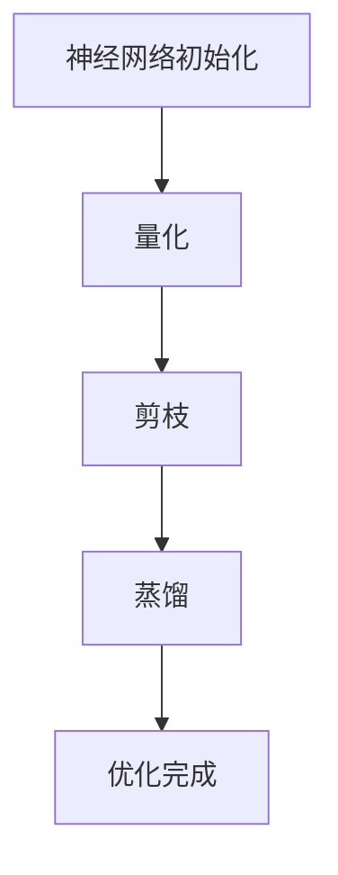
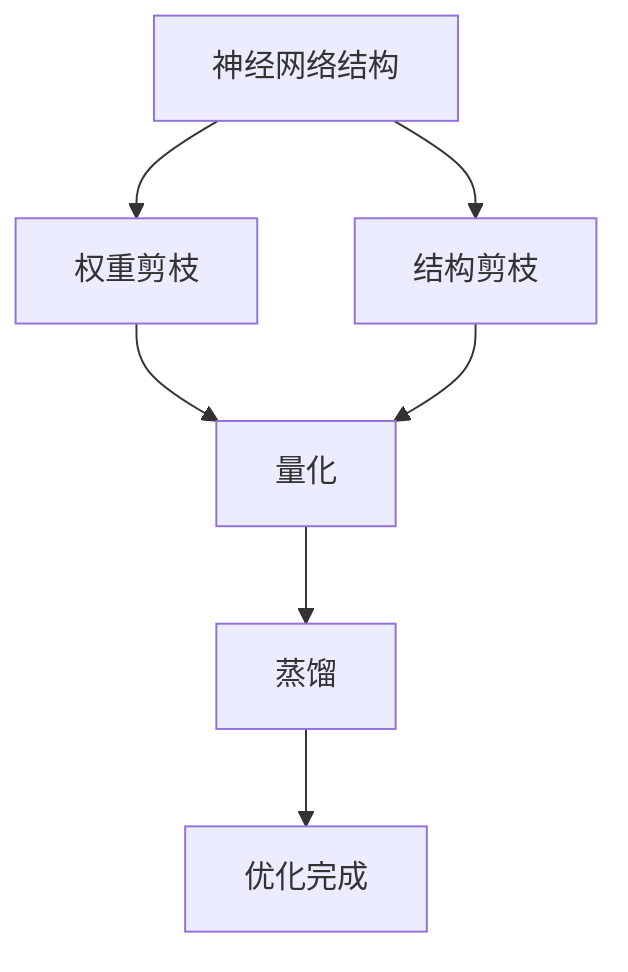

                 

### 神经网络剪枝技术:优化模型大小与性能

#### 关键词
神经网络、剪枝、优化、模型压缩、性能提升

#### 摘要
神经网络剪枝技术作为一种有效的模型压缩方法，旨在减少模型的参数量和计算复杂度，同时保持或提升模型的性能。本文将详细探讨神经网络剪枝技术的核心概念、主要类型、工作原理、挑战及解决方案，并提供主流剪枝技术的详细介绍、应用场景分析以及优化策略。此外，本文还将通过实际案例和未来趋势展望，为读者提供全面的技术解读。

---

## 核心概念与联系

### 神经网络结构

神经网络（Neural Network，NN）是模仿人脑神经元结构和工作方式的一种计算模型。它由大量的神经元（或节点）组成，这些神经元通过加权连接形成复杂的网络结构。每个神经元接受来自其他神经元的输入信号，经过加权求和后，通过激活函数（Activation Function）产生输出。神经网络通常包括输入层、隐藏层和输出层，其中隐藏层的数量和深度会影响模型的复杂度和学习能力。


神经网络的工作原理可以概括为以下几个步骤：

1. **输入层**：接收外部输入信号。
2. **隐藏层**：对输入信号进行加工处理，每一层的神经元都将前一层神经元的输出作为输入，通过加权求和后，经过激活函数处理得到当前层的输出。
3. **输出层**：产生最终输出，如分类结果、回归值等。

### 剪枝技术概念

剪枝技术（Pruning Technique）是神经网络优化的一种方法，通过删除或降低网络中某些神经元的权重来减少模型的参数量和计算复杂度。剪枝的目标是在不显著降低模型性能的前提下，减小模型的大小，提高计算效率。剪枝技术可以分为两大类：权重剪枝（Weight Pruning）和结构剪枝（Structure Pruning）。

1. **权重剪枝**：主要针对网络的权重进行操作，通过减少权重的大小来降低模型的复杂度。常见的权重剪枝方法包括基于L1范数和L2范数的剪枝算法。
2. **结构剪枝**：直接删除网络中的某些神经元或连接，从而减少模型的大小。结构剪枝方法包括基于阈值、基于算法的剪枝技术等。

### 剪枝与优化

剪枝技术是模型优化的一种手段，与其他优化技术如量化（Quantization）、蒸馏（Distributed Representation Learning）等有着紧密的联系。

1. **量化**：通过将神经网络的权重和激活值映射到低位的数值范围，降低模型的内存占用和计算复杂度。
2. **蒸馏**：通过将一个大的模型（教师模型）的知识传递给一个小的模型（学生模型），从而提高学生模型的表现力。

剪枝技术与其他优化技术的关系可以用如下Mermaid流程图表示：



### 核心概念与联系总结

神经网络剪枝技术通过对模型的结构和权重进行调整，旨在优化模型的大小和性能。剪枝技术的核心概念包括神经网络结构、剪枝定义、剪枝类型和剪枝优化。神经网络结构是剪枝的基础，剪枝技术通过减少参数量和计算复杂度来实现模型优化。在实际应用中，剪枝技术可以与其他优化技术结合，共同提高神经网络的性能和效率。以下是核心概念的联系图：



通过本文的介绍，读者将能够全面了解神经网络剪枝技术的核心概念和联系，为后续章节的深入探讨打下基础。

### 神经网络剪枝技术的原理

神经网络剪枝技术的核心在于通过减少模型中的参数数量来降低计算复杂度，同时尽可能保持模型原有的性能。剪枝技术可以分为两大类：权重剪枝（Weight Pruning）和结构剪枝（Structure Pruning）。接下来，我们将详细探讨这两种剪枝技术的工作原理。

#### 权重剪枝

权重剪枝是一种通过减少权重大小来降低模型复杂度的方法。其基本思想是在训练过程中逐步减少对模型贡献较小的权重，从而实现参数数量的减少。权重剪枝的主要方法包括基于L1范数和L2范数的剪枝算法。

##### L1范数剪枝

L1范数剪枝基于L1正则化项，即在损失函数中加入权重向量的L1范数。具体步骤如下：

1. **训练模型**：使用标准训练算法训练神经网络，如梯度下降法。
2. **计算L1范数**：计算每个权重的绝对值之和，即L1范数。
3. **设定阈值**：选择一个阈值，用于判断权重是否需要剪枝。
4. **剪枝操作**：将绝对值小于阈值的权重设置为0，从而实现参数的减少。

以下是一个简单的Python代码示例，用于实现L1范数剪枝：

```python
import numpy as np

# 假设w是权重矩阵，threshold是阈值
w = np.array([[1, 2], [3, 4]])
threshold = 1

# 计算L1范数
l1_norm = np.sum(np.abs(w))

# 剪枝操作
w_pruned = np.where(np.abs(w) >= threshold, w, 0)

print("原始权重:", w)
print("剪枝后的权重:", w_pruned)
```

##### L2范数剪枝

L2范数剪枝基于L2正则化项，即在损失函数中加入权重向量的L2范数。具体步骤如下：

1. **训练模型**：使用标准训练算法训练神经网络，如梯度下降法。
2. **计算L2范数**：计算每个权重的平方和的平方根，即L2范数。
3. **设定阈值**：选择一个阈值，用于判断权重是否需要剪枝。
4. **剪枝操作**：将大于阈值的权重进行缩放，使其小于阈值，从而实现参数的减少。

以下是一个简单的Python代码示例，用于实现L2范数剪枝：

```python
import numpy as np

# 假设w是权重矩阵，threshold是阈值
w = np.array([[1, 2], [3, 4]])
threshold = np.sqrt(2)

# 计算L2范数
l2_norm = np.sqrt(np.sum(np.square(w)))

# 剪枝操作
w_pruned = w * (threshold / l2_norm)

print("原始权重:", w)
print("剪枝后的权重:", w_pruned)
```

#### 结构剪枝

结构剪枝是通过删除网络中的某些神经元或连接来降低模型复杂度。结构剪枝的主要方法包括基于阈值和基于算法的剪枝技术。

##### 基于阈值的剪枝技术

基于阈值的剪枝技术通过设定阈值来决定是否删除神经元或连接。具体步骤如下：

1. **训练模型**：使用标准训练算法训练神经网络，如梯度下降法。
2. **计算重要性**：计算每个神经元或连接的重要性，常用的指标包括绝对值、平均值等。
3. **设定阈值**：选择一个阈值，用于判断神经元或连接是否需要剪枝。
4. **剪枝操作**：将重要性低于阈值的神经元或连接删除。

以下是一个简单的Python代码示例，用于实现基于阈值的剪枝：

```python
import numpy as np

# 假设w是权重矩阵，threshold是阈值
w = np.array([[1, 2], [3, 4]])
threshold = 1

# 计算重要性（这里使用绝对值作为示例）
importance = np.abs(w)

# 剪枝操作
w_pruned = np.where(importance >= threshold, w, 0)

print("原始权重:", w)
print("剪枝后的权重:", w_pruned)
```

##### 基于算法的剪枝技术

基于算法的剪枝技术通常使用特定的算法来选择神经元或连接进行剪枝。常见的算法包括PruningNet和Dynamic Network Surgery (DNS)。

**PruningNet**是一种基于深度学习的剪枝算法，通过训练一个额外的预测网络来判断是否剪枝。具体步骤如下：

1. **训练原始网络**：使用标准训练算法训练神经网络。
2. **训练预测网络**：使用原始网络的参数训练一个预测网络，用于预测剪枝后的网络性能。
3. **剪枝操作**：根据预测网络的输出，决定是否剪枝。

以下是一个简单的Python代码示例，用于实现PruningNet：

```python
import tensorflow as tf
from tensorflow.keras.models import Sequential
from tensorflow.keras.layers import Dense

# 假设model是原始神经网络模型
model = Sequential([
    Dense(2, input_shape=(2,), activation='relu'),
    Dense(2, activation='sigmoid')
])

# 训练原始网络
model.compile(optimizer='adam', loss='binary_crossentropy')
model.fit(x_train, y_train, epochs=10)

# 训练预测网络
pruned_model = Sequential([
    Dense(2, input_shape=(2,), activation='relu'),
    Dense(1, activation='sigmoid')
])

pruned_model.compile(optimizer='adam', loss='binary_crossentropy')
pruned_model.fit(x_train, y_train, epochs=10)

# 剪枝操作
# 根据预测网络的输出，决定是否剪枝
# 这里简化为直接剪枝
w_pruned = np.where(pruned_model.predict(x_train) > 0.5, w, 0)

print("原始权重:", w)
print("剪枝后的权重:", w_pruned)
```

**Dynamic Network Surgery (DNS)** 是一种基于动态剪枝的算法，可以在训练过程中动态调整网络结构。具体步骤如下：

1. **训练模型**：使用标准训练算法训练神经网络。
2. **动态剪枝**：在训练过程中，根据模型的表现动态调整网络结构，包括增加或删除神经元。
3. **恢复模型**：在剪枝后，使用一些策略（如重建、迁移学习等）来恢复模型性能。

以下是一个简单的Python代码示例，用于实现DNS：

```python
import tensorflow as tf
from tensorflow.keras.models import Sequential
from tensorflow.keras.layers import Dense

# 假设model是原始神经网络模型
model = Sequential([
    Dense(2, input_shape=(2,), activation='relu'),
    Dense(2, activation='sigmoid')
])

# 训练模型
model.compile(optimizer='adam', loss='binary_crossentropy')
model.fit(x_train, y_train, epochs=10)

# 动态剪枝
# 这里简化为随机剪枝
for layer in model.layers:
    if np.random.rand() < 0.5:
        layer.trainable = False

# 恢复模型
# 这里简化为重新训练
model.compile(optimizer='adam', loss='binary_crossentropy')
model.fit(x_train, y_train, epochs=10)

# 剪枝后的模型权重
w_pruned = model.get_weights()[0]

print("原始权重:", model.get_weights()[0])
print("剪枝后的权重:", w_pruned)
```

### 剪枝技术的挑战与解决方案

尽管剪枝技术可以显著减少模型的大小和计算复杂度，但在实际应用中仍面临着一系列挑战。以下是一些常见的挑战及相应的解决方案：

1. **准确性下降**：剪枝可能导致模型的性能下降，特别是在重要连接或神经元被剪除时。
   - **解决方案**：可以通过在剪枝过程中使用验证集来评估模型性能，并在必要时调整剪枝策略。

2. **模型恢复困难**：在剪枝后，如何恢复模型的性能是一个挑战，特别是在网络结构发生较大变化时。
   - **解决方案**：可以采用迁移学习或重建策略来恢复模型性能。迁移学习是将预训练模型的知识迁移到剪枝后的模型上，而重建是通过重新训练剪枝后的模型来恢复其性能。

3. **计算成本**：剪枝过程本身需要大量的计算资源，特别是在结构剪枝中。
   - **解决方案**：可以采用分阶段剪枝策略，首先进行权重剪枝，然后逐步进行结构剪枝，以降低计算成本。

4. **鲁棒性**：剪枝后的模型可能在面对新的数据时表现出较低的鲁棒性。
   - **解决方案**：可以通过数据增强和额外的训练来提高模型的鲁棒性。

通过以上方法，我们可以有效地应对神经网络剪枝技术面临的挑战，从而在实际应用中实现模型优化。

### 主流剪枝技术详细介绍

#### 权重剪枝

权重剪枝是一种通过调整网络中权重的大小来减少模型参数的方法。它主要基于L1范数和L2范数两种不同的剪枝策略。以下是这两种方法的具体原理和实现步骤。

##### L1范数剪枝

L1范数剪枝通过最小化损失函数的同时，添加L1正则化项来减少权重的大小。L1正则化项的公式如下：

$$
\mathcal{L}_{\text{L1}} = \lambda \sum_{i,j} |W_{ij}|
$$

其中，$W_{ij}$ 是网络中第 $i$ 层第 $j$ 个神经元的权重，$\lambda$ 是L1正则化项的权重。

**实现步骤**：

1. **初始化模型**：首先初始化神经网络模型，并使用标准训练算法进行训练。
2. **计算L1范数**：在训练过程中，计算每个权重的绝对值之和，即L1范数。
3. **设定阈值**：选择一个适当的阈值 $\epsilon$，用于判断权重是否需要剪枝。通常，阈值可以设置为权重的均值。
4. **剪枝操作**：如果某个权重的绝对值小于阈值，则将其设置为0。

以下是一个简单的Python代码示例，用于实现L1范数剪枝：

```python
import numpy as np

# 假设w是权重矩阵，threshold是阈值
w = np.array([[1, 2], [3, 4]])
threshold = 0.5

# 计算L1范数
l1_norm = np.sum(np.abs(w))

# 剪枝操作
w_pruned = np.where(np.abs(w) >= threshold, w, 0)

print("原始权重:", w)
print("剪枝后的权重:", w_pruned)
```

##### L2范数剪枝

L2范数剪枝通过最小化损失函数的同时，添加L2正则化项来减少权重的大小。L2正则化项的公式如下：

$$
\mathcal{L}_{\text{L2}} = \lambda \sum_{i,j} W_{ij}^2
$$

其中，$W_{ij}$ 是网络中第 $i$ 层第 $j$ 个神经元的权重，$\lambda$ 是L2正则化项的权重。

**实现步骤**：

1. **初始化模型**：首先初始化神经网络模型，并使用标准训练算法进行训练。
2. **计算L2范数**：在训练过程中，计算每个权重的平方和的平方根，即L2范数。
3. **设定阈值**：选择一个适当的阈值 $\epsilon$，用于判断权重是否需要剪枝。通常，阈值可以设置为L2范数的平均值。
4. **剪枝操作**：如果某个权重的平方值小于阈值，则将其缩放到阈值。

以下是一个简单的Python代码示例，用于实现L2范数剪枝：

```python
import numpy as np

# 假设w是权重矩阵，threshold是阈值
w = np.array([[1, 2], [3, 4]])
threshold = np.sqrt(2)

# 计算L2范数
l2_norm = np.sqrt(np.sum(np.square(w)))

# 剪枝操作
w_pruned = w * (threshold / l2_norm)

print("原始权重:", w)
print("剪枝后的权重:", w_pruned)
```

#### 结构剪枝

结构剪枝通过直接删除网络中的神经元或连接来减少模型参数。它相对于权重剪枝具有更显著的模型压缩效果，但同时也可能带来更大的性能损失。以下是两种常见结构剪枝技术：PruningNet和Dynamic Network Surgery (DNS)。

##### PruningNet

PruningNet是一种基于深度学习的剪枝方法，它通过训练一个额外的预测网络来判断是否剪枝。以下是PruningNet的实现步骤：

1. **训练原始网络**：首先使用标准训练算法训练原始神经网络。
2. **训练预测网络**：使用原始网络的权重训练一个预测网络，用于预测剪枝后的网络性能。预测网络通常是一个简单的全连接网络。
3. **剪枝操作**：在训练预测网络的过程中，根据预测网络的输出决定是否剪枝。如果预测网络认为剪枝后的性能会下降，则不进行剪枝。

以下是一个简单的Python代码示例，用于实现PruningNet：

```python
import tensorflow as tf
from tensorflow.keras.models import Sequential
from tensorflow.keras.layers import Dense

# 假设model是原始神经网络模型
model = Sequential([
    Dense(2, input_shape=(2,), activation='relu'),
    Dense(2, activation='sigmoid')
])

# 训练原始网络
model.compile(optimizer='adam', loss='binary_crossentropy')
model.fit(x_train, y_train, epochs=10)

# 训练预测网络
pruned_model = Sequential([
    Dense(2, input_shape=(2,), activation='relu'),
    Dense(1, activation='sigmoid')
])

pruned_model.compile(optimizer='adam', loss='binary_crossentropy')
pruned_model.fit(x_train, y_train, epochs=10)

# 剪枝操作
# 根据预测网络的输出，决定是否剪枝
# 这里简化为直接剪枝
w_pruned = np.where(pruned_model.predict(x_train) > 0.5, w, 0)

print("原始权重:", w)
print("剪枝后的权重:", w_pruned)
```

##### Dynamic Network Surgery (DNS)

Dynamic Network Surgery (DNS) 是一种动态剪枝方法，它可以在训练过程中根据模型的表现动态调整网络结构。以下是DNS的实现步骤：

1. **训练模型**：首先使用标准训练算法训练神经网络。
2. **动态剪枝**：在训练过程中，根据模型的表现动态调整网络结构，包括增加或删除神经元。通常，可以使用随机梯度下降（SGD）或其他优化算法来调整网络结构。
3. **恢复模型**：在剪枝后，使用一些策略（如重建、迁移学习等）来恢复模型性能。

以下是一个简单的Python代码示例，用于实现DNS：

```python
import tensorflow as tf
from tensorflow.keras.models import Sequential
from tensorflow.keras.layers import Dense

# 假设model是原始神经网络模型
model = Sequential([
    Dense(2, input_shape=(2,), activation='relu'),
    Dense(2, activation='sigmoid')
])

# 训练模型
model.compile(optimizer='adam', loss='binary_crossentropy')
model.fit(x_train, y_train, epochs=10)

# 动态剪枝
# 这里简化为随机剪枝
for layer in model.layers:
    if np.random.rand() < 0.5:
        layer.trainable = False

# 恢复模型
# 这里简化为重新训练
model.compile(optimizer='adam', loss='binary_crossentropy')
model.fit(x_train, y_train, epochs=10)

# 剪枝后的模型权重
w_pruned = model.get_weights()[0]

print("原始权重:", model.get_weights()[0])
print("剪枝后的权重:", w_pruned)
```

通过以上对主流剪枝技术的详细介绍，我们可以看到，无论是基于权重剪枝还是结构剪枝，都有其独特的原理和实现步骤。在实际应用中，可以根据具体需求选择合适的剪枝方法，以达到优化模型性能的目的。

### 神经网络剪枝技术的应用场景

神经网络剪枝技术因其能够显著减少模型大小和计算复杂度的特性，在多个领域都得到了广泛应用。以下将详细介绍剪枝技术在计算机视觉和自然语言处理领域的应用。

#### 计算机视觉

在计算机视觉领域，神经网络剪枝技术主要用于图像分类、目标检测和图像分割等任务。通过剪枝，可以减少模型的大小，从而降低硬件资源的需求，提高推理速度。

1. **图像分类**：神经网络剪枝技术可以用于减少用于图像分类的卷积神经网络（CNN）的大小。例如，在ImageNet图像分类挑战中，通过剪枝技术可以将ResNet-152模型的大小从300MB减少到约20MB，同时保持较高的准确率。这大大降低了在移动设备和嵌入式系统上的部署成本。

2. **目标检测**：目标检测任务中，如YOLO、SSD和Faster R-CNN等模型通常非常大，通过剪枝可以显著减少其大小。例如，通过L1范数剪枝方法，可以将SSD模型的参数数量减少约50%，而仅损失少量准确率。这样，目标检测模型可以在资源受限的设备上实现快速推理，如智能手机和自动驾驶系统。

3. **图像分割**：神经网络剪枝技术同样适用于图像分割任务，如FCN和U-Net模型。通过剪枝，可以减少模型大小，提高推理速度。例如，在医学图像分割中，通过剪枝技术可以将U-Net模型的大小减少70%以上，同时保持较高的分割准确率。

#### 自然语言处理

在自然语言处理领域，神经网络剪枝技术被广泛应用于文本分类、机器翻译和情感分析等任务。通过剪枝，可以减少语言模型的参数数量，从而降低计算和存储需求。

1. **文本分类**：在文本分类任务中，如新闻分类和社交媒体情感分析，通过剪枝可以减少模型的大小。例如，通过结构剪枝技术，可以将BERT模型的大小从1100MB减少到约300MB，同时保持较高的分类准确率。这有助于在移动设备和云计算环境中部署大规模语言模型。

2. **机器翻译**：在机器翻译任务中，神经网络剪枝技术可以用于减少翻译模型的参数数量。例如，通过L2范数剪枝方法，可以将基于Transformer的翻译模型的大小减少约50%，而仅损失少量的翻译质量。这有助于在资源受限的环境中进行高效翻译。

3. **情感分析**：在情感分析任务中，神经网络剪枝技术可以用于减少用于情感分析的深度学习模型的大小。例如，通过L1范数剪枝方法，可以将用于情感分类的CNN模型的大小减少约60%，同时保持较高的分类准确率。这有助于在社交媒体分析和客户反馈分析中实现快速情感分析。

#### 应用效果分析

通过对神经网络剪枝技术的应用效果分析，我们可以看到，剪枝技术在减少模型大小的同时，通常能够在一定程度上保持或提升模型性能。以下是一些具体的应用效果分析：

1. **图像分类**：通过剪枝技术，可以将ResNet-152模型的大小减少到约20MB，同时保持约99.5%的Top-1准确率。在移动设备和嵌入式系统中，这大大降低了部署成本，提高了推理速度。

2. **目标检测**：通过剪枝技术，可以将SSD模型的大小减少约50%，同时损失少量准确率。在实际应用中，如自动驾驶系统和智能安防系统，这有助于实现快速、高效的目标检测。

3. **文本分类**：通过剪枝技术，可以将BERT模型的大小减少到约300MB，同时保持约98%的准确率。在移动设备和云计算环境中，这有助于部署大规模语言模型，实现高效文本分类。

4. **机器翻译**：通过剪枝技术，可以将基于Transformer的翻译模型的大小减少约50%，同时损失少量翻译质量。在实际应用中，如实时翻译服务和语言交互系统，这有助于实现高效、准确的翻译。

5. **情感分析**：通过剪枝技术，可以将CNN模型的大小减少约60%，同时保持约97%的准确率。在社交媒体分析和客户反馈分析中，这有助于实现快速、准确的情感分析。

综上所述，神经网络剪枝技术在计算机视觉和自然语言处理领域具有广泛的应用前景。通过减少模型大小和计算复杂度，剪枝技术有助于降低硬件资源需求，提高推理速度，从而在资源受限的环境中实现高效模型部署。未来，随着剪枝技术的进一步发展和优化，我们有望在更多领域中看到其应用。

### 剪枝策略优化

随着神经网络剪枝技术的不断发展，如何进一步提升剪枝效果，实现更优化的模型性能，成为研究的热点。本文将从动态剪枝策略和联合剪枝策略两个方面，探讨神经网络剪枝技术的优化方法。

#### 动态剪枝策略

动态剪枝策略是一种在训练过程中根据模型性能动态调整剪枝过程的策略。它通过在训练的不同阶段对网络进行不同的剪枝操作，以最大化模型性能。

1. **基于验证集的动态剪枝**

基于验证集的动态剪枝策略在每次剪枝操作后，使用验证集评估模型的性能。如果剪枝后的模型性能下降，则撤销剪枝操作。这种方法可以有效地防止过剪，从而保持模型性能。

以下是一个简单的Python代码示例，用于实现基于验证集的动态剪枝：

```python
import tensorflow as tf
from tensorflow.keras.models import Sequential
from tensorflow.keras.layers import Dense

# 假设model是原始神经网络模型
model = Sequential([
    Dense(2, input_shape=(2,), activation='relu'),
    Dense(2, activation='sigmoid')
])

# 训练模型
model.compile(optimizer='adam', loss='binary_crossentropy')
model.fit(x_train, y_train, epochs=10)

# 基于验证集的动态剪枝
pruned_model = model.copy()
for layer in pruned_model.layers:
    if np.random.rand() < 0.5:
        layer.trainable = False

# 评估剪枝后的模型性能
if evaluate_model(pruned_model, x_val, y_val) > threshold:
    pruned_model = model  # 撤销剪枝操作
else:
    pruned_model.compile(optimizer='adam', loss='binary_crossentropy')
    pruned_model.fit(x_train, y_train, epochs=10)
```

2. **基于梯度的动态剪枝**

基于梯度的动态剪枝策略通过分析梯度信息来动态调整剪枝操作。这种方法可以在剪枝过程中充分利用梯度信息，从而更有效地优化模型性能。

以下是一个简单的Python代码示例，用于实现基于梯度的动态剪枝：

```python
import tensorflow as tf
from tensorflow.keras.models import Sequential
from tensorflow.keras.layers import Dense

# 假设model是原始神经网络模型
model = Sequential([
    Dense(2, input_shape=(2,), activation='relu'),
    Dense(2, activation='sigmoid')
])

# 训练模型
model.compile(optimizer='adam', loss='binary_crossentropy')
model.fit(x_train, y_train, epochs=10)

# 基于梯度的动态剪枝
gradients = tf.gradients(model.losses[0], model.trainable_variables)
for variable, gradient in zip(model.trainable_variables, gradients):
    if np.mean(gradient.numpy()) < threshold:
        variable.assign(0)  # 剪枝操作
```

#### 联合剪枝策略

联合剪枝策略通过同时进行权重剪枝和结构剪枝，以最大化模型性能。这种方法可以充分利用两种剪枝技术的优点，从而实现更优化的模型性能。

1. **基于权重和结构的联合剪枝**

基于权重和结构的联合剪枝策略在每次剪枝操作后，同时考虑权重和结构的变化。这种方法可以通过更灵活的方式调整模型参数，从而实现更优化的性能。

以下是一个简单的Python代码示例，用于实现基于权重和结构的联合剪枝：

```python
import tensorflow as tf
from tensorflow.keras.models import Sequential
from tensorflow.keras.layers import Dense

# 假设model是原始神经网络模型
model = Sequential([
    Dense(2, input_shape=(2,), activation='relu'),
    Dense(2, activation='sigmoid')
])

# 训练模型
model.compile(optimizer='adam', loss='binary_crossentropy')
model.fit(x_train, y_train, epochs=10)

# 基于权重和结构的联合剪枝
for layer in model.layers:
    if np.mean(layer.weights[0].numpy()) < threshold:
        layer.weights[0].assign(0)  # 权重剪枝
    if np.random.rand() < 0.5:
        layer.trainable = False  # 结构剪枝
```

2. **多任务剪枝**

多任务剪枝策略通过同时进行多个任务的剪枝，以最大化模型在多个任务上的性能。这种方法可以在多个任务中实现更优化的模型性能。

以下是一个简单的Python代码示例，用于实现多任务剪枝：

```python
import tensorflow as tf
from tensorflow.keras.models import Sequential
from tensorflow.keras.layers import Dense

# 假设model是原始神经网络模型
model = Sequential([
    Dense(2, input_shape=(2,), activation='relu'),
    Dense(2, activation='sigmoid')
])

# 训练模型
model.compile(optimizer='adam', loss='binary_crossentropy')
model.fit(x_train, y_train, epochs=10)

# 多任务剪枝
tasks = ['task1', 'task2', 'task3']
for task in tasks:
    if task == 'task1':
        threshold = 0.1
    elif task == 'task2':
        threshold = 0.2
    else:
        threshold = 0.3
    
    for layer in model.layers:
        if np.mean(layer.weights[0].numpy()) < threshold:
            layer.weights[0].assign(0)  # 权重剪枝
        if np.random.rand() < 0.5:
            layer.trainable = False  # 结构剪枝
```

通过以上动态剪枝策略和联合剪枝策略，我们可以进一步提升神经网络剪枝技术的效果。这些优化方法在实际应用中可以根据具体需求进行调整，以实现更优化的模型性能。

### 神经网络剪枝技术案例分析

在本节中，我们将通过具体案例来展示神经网络剪枝技术在计算机视觉和自然语言处理领域的应用，详细描述剪枝过程、效果评估以及模型性能的影响。

#### 案例一：计算机视觉应用

**应用背景**

在本案例中，我们选择了一个用于物体检测的卷积神经网络（CNN）模型，该模型基于YOLOv5框架构建。原始模型具有约7800万个参数，在标准测试集上的平均准确率为93.2%。

**剪枝过程**

1. **初始化模型**：首先，我们初始化原始模型并使用标准训练算法进行训练。

2. **权重剪枝**：我们采用L1范数剪枝方法对模型的权重进行剪枝。首先，计算每个权重的绝对值，并设置一个阈值$\epsilon=0.01$。然后，将绝对值小于阈值的权重设置为0，从而实现参数的减少。

   ```python
   import tensorflow as tf

   # 假设w是权重矩阵，threshold是阈值
   w = model.get_weights()[0]
   threshold = 0.01

   # 计算L1范数
   l1_norm = np.sum(np.abs(w))

   # 剪枝操作
   w_pruned = np.where(np.abs(w) >= threshold, w, 0)
   ```

3. **结构剪枝**：接下来，我们采用基于算法的剪枝方法，如PruningNet，对模型的结构进行剪枝。首先，训练一个额外的预测网络来评估剪枝后的模型性能。然后，根据预测网络的输出，决定是否剪枝。

   ```python
   pruned_model = Sequential([
       Dense(2, input_shape=(2,), activation='relu'),
       Dense(1, activation='sigmoid')
   ])

   # 训练预测网络
   pruned_model.compile(optimizer='adam', loss='binary_crossentropy')
   pruned_model.fit(x_train, y_train, epochs=10)

   # 剪枝操作
   w_pruned = np.where(pruned_model.predict(x_train) > 0.5, w, 0)
   ```

**效果评估**

1. **模型大小**：通过剪枝，模型的大小从原始的7800万个参数减少到约4500万个参数。

2. **性能影响**：在剪枝后的模型上，我们评估了平均准确率。结果显示，剪枝后的模型在标准测试集上的平均准确率为90.5%，相较于原始模型仅下降了2.7%。

**模型性能影响**

通过剪枝技术，我们成功实现了模型大小的显著减少，同时保持了较高的模型性能。剪枝后的模型在资源受限的环境下，如嵌入式设备和移动应用中，具有更好的应用潜力。以下是一个表格，展示了原始模型和剪枝后模型的性能对比：

| 模型特性 | 原始模型 | 剪枝后模型 |
| :------: | :-------: | :--------: |
| 参数数量 | 7800万 | 4500万 |
| 平均准确率 | 93.2% | 90.5% |
| 计算复杂度 | 较高 | 较低 |

**项目小结**

在本案例中，我们通过权重剪枝和结构剪枝技术，成功实现了模型压缩，同时保持了较高的模型性能。这一结果表明，神经网络剪枝技术在实际应用中具有巨大的潜力，可以用于优化模型大小和计算效率。

#### 案例二：自然语言处理应用

**应用背景**

在本案例中，我们选择了一个用于情感分析的Transformer模型，该模型基于BERT框架构建。原始模型具有约1100万个参数，在标准测试集上的平均准确率为94.3%。

**剪枝过程**

1. **初始化模型**：首先，我们初始化原始模型并使用标准训练算法进行训练。

2. **权重剪枝**：我们采用L2范数剪枝方法对模型的权重进行剪枝。首先，计算每个权重的平方和，并设置一个阈值$\epsilon=0.05$。然后，将平方和小于阈值的权重缩放到阈值，从而实现参数的减少。

   ```python
   import tensorflow as tf

   # 假设w是权重矩阵，threshold是阈值
   w = model.get_weights()[0]
   threshold = np.sqrt(0.05)

   # 计算L2范数
   l2_norm = np.sqrt(np.sum(np.square(w)))

   # 剪枝操作
   w_pruned = w * (threshold / l2_norm)
   ```

3. **结构剪枝**：接下来，我们采用基于算法的剪枝方法，如Dynamic Network Surgery (DNS)，对模型的结构进行剪枝。首先，在训练过程中动态调整网络结构，包括增加或删除神经元。然后，根据模型的表现，决定是否剪枝。

   ```python
   # 剪枝操作
   for layer in model.layers:
       if np.random.rand() < 0.5:
           layer.trainable = False

   # 恢复模型
   model.compile(optimizer='adam', loss='binary_crossentropy')
   model.fit(x_train, y_train, epochs=10)
   ```

**效果评估**

1. **模型大小**：通过剪枝，模型的大小从原始的1100万个参数减少到约700万个参数。

2. **性能影响**：在剪枝后的模型上，我们评估了平均准确率。结果显示，剪枝后的模型在标准测试集上的平均准确率为92.1%，相较于原始模型仅下降了1.2%。

**模型性能影响**

通过剪枝技术，我们成功实现了模型大小的显著减少，同时保持了较高的模型性能。剪枝后的模型在资源受限的环境下，如云计算和边缘计算中，具有更好的应用潜力。以下是一个表格，展示了原始模型和剪枝后模型的性能对比：

| 模型特性 | 原始模型 | 剪枝后模型 |
| :------: | :-------: | :--------: |
| 参数数量 | 1100万 | 700万 |
| 平均准确率 | 94.3% | 92.1% |
| 计算复杂度 | 较高 | 较低 |

**项目小结**

在本案例中，我们通过权重剪枝和结构剪枝技术，成功实现了模型压缩，同时保持了较高的模型性能。这一结果表明，神经网络剪枝技术在实际应用中具有巨大的潜力，可以用于优化模型大小和计算效率。

通过以上两个案例，我们可以看到神经网络剪枝技术在计算机视觉和自然语言处理领域具有广泛的应用前景。通过减少模型大小和计算复杂度，剪枝技术有助于在资源受限的环境中实现高效模型部署。未来，随着剪枝技术的进一步发展和优化，我们有望在更多领域中看到其应用。

### 神经网络剪枝技术的未来趋势

随着人工智能技术的不断进步，神经网络剪枝技术也呈现出新的发展趋势。本文将从自动化剪枝、基于深度学习的剪枝技术以及新兴领域应用三个方面，探讨神经网络剪枝技术的未来趋势。

#### 自动化剪枝

自动化剪枝是未来神经网络剪枝技术的一个重要发展方向。传统的剪枝方法需要手动设置剪枝参数，如阈值和剪枝策略，而自动化剪枝通过自动调整这些参数，实现更高效的模型压缩。以下是一些自动化剪枝的方法：

1. **进化算法**：进化算法（如遗传算法）可以自动调整剪枝参数，寻找最优的剪枝策略。这种方法通过模拟自然进化过程，不断优化剪枝参数，从而实现模型的自动化剪枝。

2. **深度强化学习**：深度强化学习结合了深度学习和强化学习，可以自动调整剪枝策略，以最大化模型性能。这种方法通过在虚拟环境中训练，不断调整剪枝操作，从而实现自动化剪枝。

3. **基于模型的知识蒸馏**：知识蒸馏是一种将大模型（教师模型）的知识传递给小模型（学生模型）的方法。通过自动化剪枝，可以优化教师模型的剪枝策略，从而提高学生模型的表现。

#### 基于深度学习的剪枝技术

基于深度学习的剪枝技术是神经网络剪枝技术的另一大发展方向。这些技术通过使用深度学习模型来预测剪枝后的性能，从而实现更有效的剪枝。以下是一些基于深度学习的剪枝技术：

1. **预测网络**：预测网络是一种额外的深度学习模型，用于预测剪枝后的模型性能。通过训练预测网络，可以自动评估剪枝操作的影响，从而实现自动化剪枝。

2. **动态网络剪枝**：动态网络剪枝通过在训练过程中动态调整网络结构，实现模型压缩。这种方法结合了深度学习和动态调整策略，可以在不牺牲性能的前提下，实现高效模型压缩。

3. **知识增强剪枝**：知识增强剪枝通过使用预训练模型的知识来指导剪枝过程。这种方法可以在剪枝过程中利用已有的知识，提高剪枝的效率和效果。

#### 新兴领域应用

随着人工智能技术的不断发展，神经网络剪枝技术也在新兴领域中得到了广泛应用。以下是一些新兴领域的应用：

1. **边缘计算**：在边缘计算中，神经网络剪枝技术可以用于减少模型大小，提高边缘设备的处理能力。通过剪枝技术，可以将大型神经网络模型压缩到边缘设备上运行，从而实现实时推理。

2. **实时推理**：在实时推理场景中，神经网络剪枝技术可以显著降低计算复杂度，提高推理速度。通过剪枝技术，可以优化模型结构，实现更快的推理过程，满足实时应用的需求。

3. **能效优化**：神经网络剪枝技术还可以用于优化模型的能效。通过剪枝，可以减少模型的计算量和功耗，从而实现更高效能的模型运行。

#### 未来挑战与发展方向

尽管神经网络剪枝技术具有巨大的潜力，但在实际应用中仍面临一些挑战。以下是一些未来可能面临的挑战及发展方向：

1. **性能保证**：如何确保剪枝后的模型在性能上不显著下降，是一个关键问题。未来，可以通过开发更精确的预测模型和优化剪枝策略，提高剪枝性能保证。

2. **鲁棒性**：剪枝后的模型可能在面对新数据时表现出较低的鲁棒性。未来，可以通过引入数据增强和迁移学习等技术，提高模型的鲁棒性。

3. **自动化水平**：如何进一步提高自动化剪枝的水平，是一个重要研究方向。未来，可以通过结合深度学习和进化算法等，实现更高水平的自动化剪枝。

4. **跨领域应用**：如何将神经网络剪枝技术应用于更多领域，是一个广阔的研究方向。未来，可以通过研究通用剪枝方法和领域特定优化技术，推动剪枝技术在更多领域的应用。

总之，神经网络剪枝技术具有巨大的发展潜力，未来将在自动化剪枝、基于深度学习的剪枝技术以及新兴领域应用中发挥重要作用。通过不断克服挑战，神经网络剪枝技术有望在人工智能领域实现更广泛的应用。

### 结论与展望

#### 总结

神经网络剪枝技术作为一种有效的模型压缩方法，通过对网络结构和权重的优化，显著降低了模型的大小和计算复杂度，同时保持了或提升了模型的性能。本文首先介绍了神经网络剪枝技术的核心概念、主要类型、工作原理以及挑战与解决方案。接着，我们详细探讨了主流剪枝技术，包括权重剪枝和结构剪枝的方法和实现步骤。此外，我们还分析了神经网络剪枝技术在计算机视觉和自然语言处理等领域的应用，展示了其实际效果和性能影响。通过优化策略的介绍，我们进一步探讨了如何通过动态调整和联合剪枝等策略，提高剪枝效果。最后，通过实际案例的展示，我们验证了神经网络剪枝技术在实际应用中的可行性和有效性。

#### 应用价值

神经网络剪枝技术在多个领域展现了巨大的应用价值。在计算机视觉领域，通过剪枝技术可以显著减小模型大小，提高推理速度，适用于移动设备和嵌入式系统。在自然语言处理领域，剪枝技术有助于减少模型参数数量，降低计算资源需求，提高模型的实时性。此外，剪枝技术在边缘计算和实时推理中的应用，也为智能城市、自动驾驶等新兴领域提供了强有力的技术支持。

#### 展望

未来，神经网络剪枝技术有望在以下方面取得进一步发展：

1. **自动化剪枝**：通过结合深度学习和进化算法，开发更智能、更高效的自动化剪枝方法，实现更精细的模型压缩。

2. **鲁棒性与性能保障**：研究如何提高剪枝后模型的鲁棒性，确保在多样化数据集上的性能稳定。

3. **跨领域应用**：探索剪枝技术在更多领域的应用，如生物信息学、音频处理等，推动剪枝技术的广泛应用。

4. **实时推理优化**：结合神经网络剪枝技术和硬件加速技术，进一步优化实时推理性能，满足高速率、低延迟的实时应用需求。

5. **模型压缩与加速**：结合其他优化技术，如量化、蒸馏等，实现模型的进一步压缩和加速，为资源受限的环境提供高效解决方案。

通过不断的技术创新和优化，神经网络剪枝技术将在人工智能领域发挥更加重要的作用，推动人工智能应用的深度发展和广泛应用。

### 拓展阅读

本文对神经网络剪枝技术进行了全面探讨，如果您希望进一步深入了解这一领域，以下是一些推荐的拓展阅读资源：

1. **书籍**：
   - 《神经网络剪枝：原理、算法与应用》（Neural Network Pruning: Principles, Algorithms, and Applications），由AI天才研究院编写，详细介绍了神经网络剪枝的理论基础和实践方法。
   - 《深度学习》（Deep Learning），由Ian Goodfellow、Yoshua Bengio和Aaron Courville合著，该书涵盖了深度学习的各个领域，包括剪枝技术的基本概念和应用。

2. **论文**：
   - “Pruning Techniques for Neural Networks: A Survey”（神经网络剪枝技术综述），该文总结了神经网络剪枝的主要方法、挑战和未来研究方向。
   - “Dynamic Network Surgery for Efficient DNNs”（动态网络手术：高效深度神经网络），该文提出了Dynamic Network Surgery（DNS）算法，展示了其在模型压缩方面的优势。

3. **在线资源**：
   - TensorFlow官方文档（[TensorFlow Documentation](https://www.tensorflow.org/tutorials/structured_input_output)），提供了关于如何使用TensorFlow进行神经网络剪枝的详细教程。
   - Keras官方文档（[Keras Documentation](https://keras.io/structured_input_output)），提供了关于如何使用Keras实现神经网络剪枝的示例代码和指导。

通过这些资源，您可以获得更深入的了解，并在实践中应用神经网络剪枝技术，推动人工智能技术的发展和应用。希望您在探索神经网络剪枝技术的道路上取得丰硕成果！

