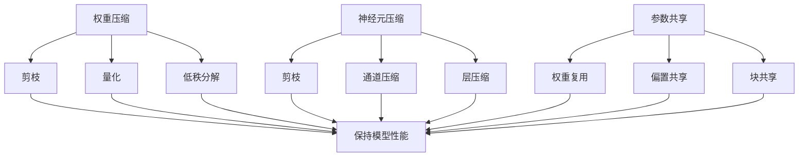

                 

### 引言

#### 神经网络压缩技术背景

神经网络（Neural Networks）作为人工智能领域的重要技术之一，已经在图像识别、语音识别、自然语言处理等多个领域取得了显著成果。然而，随着神经网络模型复杂度的增加，模型的参数量和计算量也呈现指数级增长，导致对计算资源和存储资源的需求大幅上升。这一现状在边缘设备（Edge Devices）上尤为显著，因为边缘设备通常具有有限的计算资源和存储空间。

边缘设备是指在靠近数据源或用户的网络边缘进行数据处理和决策的设备，如智能手机、智能摄像头、工业控制系统等。与云计算相比，边缘设备能够实现实时性更强、延迟更低的数据处理。然而，由于边缘设备的计算和存储资源受限，传统的神经网络模型往往难以在边缘设备上高效运行。因此，如何降低神经网络模型的复杂度，提高在边缘设备上的推理性能，成为当前研究的热点问题。

神经网络压缩技术（Neural Network Compression Techniques）旨在通过减少模型的参数量、计算量和存储量，从而在保持模型性能的前提下降低对计算资源和存储资源的需求。这些技术包括权重压缩、神经元压缩、参数共享等，通过不同的策略和算法实现模型压缩。神经网络压缩不仅有助于提升边缘设备上的推理效率，还能够提高模型的可部署性和可扩展性。

本文旨在系统地介绍神经网络压缩技术，并探讨其在边缘设备推理中的应用。文章将首先介绍神经网络压缩技术的背景和重要性，然后详细阐述神经网络压缩技术的基本原理，包括权重压缩、神经元压缩和参数共享技术。接着，文章将讨论神经网络压缩技术在边缘设备推理中的应用挑战和解决方案，并通过实际案例进行分析和讲解。最后，文章将展望神经网络压缩技术的未来发展方向，总结全文，并提出一些最佳实践和拓展阅读建议。

通过本文的阅读，读者将能够全面了解神经网络压缩技术的基本概念、核心原理和应用方法，从而为在边缘设备上部署高效神经网络模型提供理论指导和实践参考。

#### 关键词

- 神经网络压缩技术
- 边缘设备推理
- 权重压缩
- 神经元压缩
- 参数共享
- 计算资源优化
- 存储资源优化
- 实时数据处理

### 摘要

本文旨在系统地介绍神经网络压缩技术及其在边缘设备推理中的应用。首先，文章回顾了神经网络压缩技术的背景和重要性，解释了为何在边缘设备上高效运行神经网络模型具有重要意义。接着，文章详细阐述了神经网络压缩技术的基本原理，包括权重压缩、神经元压缩和参数共享技术，并通过具体的算法和数学模型进行说明。然后，文章深入探讨了神经网络压缩技术在边缘设备推理中的应用挑战，并提出相应的解决方案。通过实际案例，文章展示了神经网络压缩技术在视频流处理、智能家居设备和工业自动化控制等场景中的应用效果。最后，文章总结了神经网络压缩技术的发展趋势，并提出了未来的研究方向和最佳实践。本文旨在为研究人员和开发者提供理论指导和实践参考，以优化边缘设备上的神经网络推理性能。

## 第一部分：引言

### 第1章 神经网络压缩技术概述

在本文的第一部分，我们将重点介绍神经网络压缩技术的基本概念、背景以及其重要性。本章将分为以下几个部分进行详细阐述：

1. **压缩技术的背景与重要性**：将讨论神经网络压缩技术产生的背景，解释为何随着神经网络模型的复杂度增加，对计算资源和存储资源的需求也急剧上升。同时，分析神经网络压缩技术在当前人工智能领域中的重要性。
   
2. **压缩技术的基本概念**：我们将介绍神经网络压缩技术中的主要概念，包括权重压缩、神经元压缩和参数共享。通过这些概念的解释，帮助读者理解这些压缩技术的核心思想。

3. **神经网络压缩技术的分类**：将详细讨论各种神经网络压缩技术的分类，包括基于量化的方法、基于剪枝的方法、基于低秩分解的方法等。每种方法的工作原理和适用场景都会在相应的段落中进行详细说明。

4. **压缩技术的优缺点**：将分析各种神经网络压缩技术的优缺点，帮助读者理解这些技术在实际应用中的优势和局限性。

5. **神经网络压缩的核心挑战**：将讨论神经网络压缩技术面临的主要挑战，包括如何保持压缩后的模型性能、如何有效减少模型参数量以及如何在不同的边缘设备上部署压缩模型。

通过本章的学习，读者将能够全面了解神经网络压缩技术的基本概念和原理，为后续章节的深入探讨打下坚实的基础。

#### 压缩技术的背景与重要性

神经网络压缩技术的产生源于对计算资源和存储资源需求的日益增长。随着深度学习模型复杂度的不断增加，模型的参数量也呈现爆炸式增长。例如，一个标准的卷积神经网络（CNN）可能包含数百万甚至数十亿个参数，而大型语言模型如GPT-3则拥有超过1750亿个参数。如此庞大的参数量不仅需要大量的计算资源进行模型训练，还要求有充足的存储空间来存储模型权重和中间结果。在云计算环境中，强大的计算和存储资源可以较为容易地满足这些需求。然而，对于边缘设备而言，情况则大不相同。

边缘设备，如智能手机、嵌入式系统、物联网设备等，通常具有有限的计算能力和存储空间。这些设备需要在有限的资源下运行高效的神经网络模型，以实现实时数据分析和决策。例如，智能手机上的图像识别应用需要快速响应，而物联网设备在工业自动化控制中的实时数据处理也要求低延迟和高效率。传统的大型神经网络模型在边缘设备上运行时，往往因计算资源和存储资源不足而面临性能瓶颈，甚至无法部署。

神经网络压缩技术应运而生，旨在通过减少模型参数量、计算量和存储量，使神经网络模型能够在边缘设备上高效运行。具体来说，压缩技术通过以下几种方式实现：

1. **权重压缩**：通过减少模型中的权重参数数量，降低模型的存储和计算需求。常见的权重压缩方法包括量化、剪枝和低秩分解等。

2. **神经元压缩**：通过减少模型中的神经元数量，降低模型的计算复杂度。神经元压缩可以采用剪枝、通道压缩或层压缩等技术。

3. **参数共享**：通过在模型的不同部分共享参数，减少模型的总参数量。参数共享技术能够有效降低模型的存储和计算需求，同时保持模型性能。

神经网络压缩技术在当前人工智能领域具有重要性。首先，随着边缘计算和物联网的发展，越来越多的应用场景需要将数据处理和决策能力推向边缘。然而，边缘设备有限的资源限制了大型神经网络模型的部署，因此，高效且低资源的神经网络压缩技术成为边缘设备上应用深度学习的必要手段。其次，随着深度学习模型的不断发展和应用范围的扩大，如何提高模型的推理效率、降低功耗和延长设备寿命也成为重要研究方向。神经网络压缩技术通过减少模型复杂度，不仅能够提高推理速度，还能降低功耗，延长设备使用时间。

此外，神经网络压缩技术对于人工智能领域的可扩展性和可部署性也具有重要意义。随着新应用和新场景的不断涌现，如何快速适应和部署新模型是一个关键挑战。通过压缩技术，开发者可以更轻松地将大型模型转化为适合边缘设备运行的版本，从而实现更广泛的应用场景。

总之，神经网络压缩技术不仅解决了边缘设备在资源受限情况下的运行难题，还为人工智能领域的可持续发展提供了新的可能性。通过本章节的介绍，读者将能够理解神经网络压缩技术的背景和重要性，为后续章节的深入学习奠定基础。

### 压缩技术的基本概念

在理解神经网络压缩技术之前，首先需要掌握一些基本概念。这些概念包括权重压缩、神经元压缩和参数共享。通过详细解释这些概念，我们可以更好地理解神经网络压缩技术的工作原理及其应用场景。

#### 权重压缩

权重压缩是神经网络压缩技术中最常用的方法之一，其主要目标是减少模型中的权重参数数量，从而降低模型的存储和计算需求。权重压缩通常通过以下几种技术实现：

1. **量化**：量化是将模型中的浮点权重参数转换为较低精度的整数表示。量化方法包括符号量化、二进制量化和小数量化等。量化能够显著减少模型的存储空间和加速模型的推理过程。

   数学公式：
   $$ w_{quant} = \text{round}(w_{original} \times 2^q) $$

   其中，$w_{original}$ 表示原始权重，$q$ 表示量化级别。

2. **剪枝**：剪枝是通过删除模型中权重较小的连接来实现压缩。剪枝方法通常分为结构剪枝和权重剪枝。结构剪枝直接删除神经元或层，而权重剪枝则仅保留权重较大的连接。

   数学公式：
   $$ w_{pruned} = \text{sign}(w_{original}) \times |w_{original}|_+ $$

   其中，$|w_{original}|_+$ 表示权重绝对值中的正值部分。

3. **低秩分解**：低秩分解是将高维权重矩阵分解为低维矩阵的乘积，从而降低模型的总参数量。低秩分解方法包括奇异值分解（SVD）和分组低秩分解等。

   数学公式：
   $$ W = U \Sigma V^T $$

   其中，$W$ 是原始权重矩阵，$U$ 和 $V$ 是低维矩阵，$\Sigma$ 是对角矩阵包含奇异值。

权重压缩技术的应用场景广泛，尤其适用于资源受限的边缘设备。通过减少权重参数数量，权重压缩不仅能够降低模型的存储需求，还能提高模型的推理速度。

#### 神经元压缩

神经元压缩的目标是通过减少模型中的神经元数量来降低模型的计算复杂度和存储需求。神经元压缩技术主要包括以下几种：

1. **剪枝**：剪枝方法与权重压缩中的剪枝类似，通过删除权重较小的神经元来简化模型。剪枝技术能够有效减少模型参数量和计算量，同时保持模型性能。

2. **通道压缩**：通道压缩通过减少卷积层中通道的数量来实现压缩。通道压缩可以采用不同的策略，如选择最重要的通道或通过分组卷积来实现。

3. **层压缩**：层压缩通过合并或删除模型中的层来实现压缩。层压缩方法包括分层合并和层次剪枝等，能够显著降低模型的计算复杂度。

神经元压缩技术适用于需要减少模型尺寸和计算量的场景，如智能手机和嵌入式设备。通过减少神经元数量，神经元压缩能够提高模型在边缘设备上的推理效率。

#### 参数共享

参数共享是一种通过在模型的不同部分共享参数来减少总参数量的技术。参数共享的基本思想是利用模型中的重复结构来共享权重和偏置，从而减少模型的总参数量。参数共享技术主要包括以下几种：

1. **权重复用**：权重复用通过将模型的多个部分连接到相同的权重来实现参数共享。例如，在卷积神经网络中，可以使用同一卷积核在不同层之间进行共享。

2. **偏置共享**：偏置共享通过将模型中的多个偏置参数合并为单一的偏置向量来实现参数共享。

3. **块共享**：块共享通过将模型的多个子结构合并为一个更紧凑的块来实现参数共享。

参数共享技术适用于需要减少模型参数量的场景，如大型语言模型和深度神经网络。通过参数共享，模型的总参数量可以显著减少，从而提高模型的可扩展性和部署性。

### 核心概念之间的关系架构

为了更好地理解权重压缩、神经元压缩和参数共享之间的关系，我们可以使用Mermaid流程图来展示这些概念之间的交互关系。



在该流程图中，权重压缩、神经元压缩和参数共享分别通过不同的技术实现，这些技术共同目标是为了保持模型性能的前提下，降低模型的存储和计算需求。

通过本章对神经网络压缩技术基本概念的介绍，读者可以更深入地理解这些技术的工作原理和应用场景，为后续章节的详细探讨打下基础。

### 压缩技术的分类

神经网络压缩技术根据不同的方法可以分为多种类型，每种方法都有其独特的原理和应用场景。以下是几种主要的神经网络压缩技术分类及其特点：

#### 基于量化的方法

量化是将神经网络模型中的浮点数权重转换为较低精度的整数表示，从而减少模型的存储和计算需求。量化方法主要包括以下几种：

1. **符号量化**：符号量化通过将权重表示为符号（+1 或 -1）来实现。这种方法简单且易于实现，但可能会导致较大的误差。

2. **二进制量化**：二进制量化通过将权重表示为二进制数（0 或 1）来实现。虽然二进制量化可以进一步减少模型的存储需求，但计算复杂度较高。

3. **小数量化**：小数量化通过将权重表示为小数（例如 0.1、0.5 等）来实现。小数量化在保留模型性能的同时，能够显著减少存储和计算需求。

量化技术的优点是能够有效降低模型的存储空间和加速模型的推理过程。然而，量化方法可能会引入量化误差，影响模型性能。为了克服这一问题，研究者们提出了多种量化优化方法，如动态量化和混合精度量化。

#### 基于剪枝的方法

剪枝是通过删除神经网络中的权重较小的连接或神经元来实现压缩。剪枝方法包括以下几种：

1. **结构剪枝**：结构剪枝直接删除神经元或层，从而减少模型的计算复杂度和存储需求。这种方法通常适用于卷积神经网络（CNN）和循环神经网络（RNN）。

2. **权重剪枝**：权重剪枝仅保留权重较大的连接，从而减少模型的参数量。权重剪枝可以采用随机剪枝或基于梯度的剪枝方法。

3. **层次剪枝**：层次剪枝通过层次结构来剪枝模型，通常用于大型神经网络模型。这种方法能够有效降低模型的复杂度，同时保持模型性能。

剪枝技术的优点是能够显著减少模型的存储空间和计算需求，同时保持模型性能。然而，剪枝方法可能会导致模型的过拟合，影响模型泛化能力。因此，研究者们提出了多种剪枝策略和优化方法，如渐进剪枝和自适应剪枝。

#### 基于低秩分解的方法

低秩分解是通过将高维权重矩阵分解为低维矩阵的乘积来实现压缩。低秩分解方法主要包括以下几种：

1. **奇异值分解（SVD）**：奇异值分解将高维权重矩阵分解为三个低维矩阵的乘积，从而降低模型的总参数量。SVD方法在保持模型性能的同时，能够显著减少存储和计算需求。

2. **分组低秩分解**：分组低秩分解通过将权重矩阵分组，然后分别进行低秩分解，从而减少模型的总参数量。这种方法能够进一步提高模型的压缩效果。

3. **稀疏低秩分解**：稀疏低秩分解通过引入稀疏约束来优化低秩分解问题，从而减少模型的总参数量。这种方法适用于处理稀疏权重矩阵。

低秩分解技术的优点是能够显著减少模型的存储空间和计算需求，同时保持模型性能。然而，低秩分解方法通常需要较高的计算复杂度，适用于大型神经网络模型。

#### 基于参数共享的方法

参数共享是通过在神经网络的不同部分共享参数来实现压缩。参数共享方法主要包括以下几种：

1. **权重复用**：权重复用通过将模型的不同部分连接到相同的权重来实现参数共享。这种方法能够显著减少模型的总参数量。

2. **偏置共享**：偏置共享通过将模型中的多个偏置参数合并为单一的偏置向量来实现参数共享。

3. **块共享**：块共享通过将模型的多个子结构合并为一个更紧凑的块来实现参数共享。

参数共享技术的优点是能够有效降低模型的总参数量，提高模型的可扩展性和部署性。然而，参数共享方法可能会影响模型的泛化能力，需要结合其他优化方法进行改进。

综上所述，不同的神经网络压缩技术各有优缺点，适用于不同的应用场景。通过合理选择和组合这些压缩技术，可以在保持模型性能的前提下，显著降低模型的存储和计算需求，从而实现高效、低资源的神经网络推理。

### 权重压缩技术

权重压缩是神经网络压缩技术中的重要组成部分，通过减少模型的权重参数数量，可以显著降低模型的存储和计算需求。以下是几种常见的权重压缩方法，以及它们的工作原理、优缺点和应用场景。

#### 1. 量化

量化是将神经网络中的浮点数权重转换为较低精度的整数表示，从而减少模型的存储和计算需求。量化方法包括符号量化、二进制量化和小数量化等。

- **工作原理**：

  量化过程包括以下几个步骤：

  1. **确定量化级别**：量化级别决定了权重的精度，通常量化级别越高，精度越高，但存储和计算需求也越大。
  2. **量化权重**：将原始权重乘以量化级别，然后进行四舍五入，得到量化后的权重。

  数学公式：

  $$ w_{quant} = \text{round}(w_{original} \times 2^q) $$

  其中，$w_{original}$ 是原始权重，$q$ 是量化级别。

- **优缺点**：

  优点：

  - **减少存储需求**：量化后的权重占用更少的存储空间。
  - **加速推理**：量化后的权重计算速度更快。

  缺点：

  - **量化误差**：量化可能导致模型性能下降，特别是对于精度要求较高的应用。
  - **量化级别选择**：量化级别选择不当可能会导致量化误差过大或模型性能下降。

- **应用场景**：

  量化方法适用于需要降低模型存储和计算需求，同时精度要求不是特别高的场景，如边缘设备上的实时推理。

#### 2. 剪枝

剪枝是通过删除神经网络中的权重较小的连接或神经元来实现压缩。剪枝方法包括结构剪枝和权重剪枝。

- **工作原理**：

  剪枝过程包括以下几个步骤：

  1. **计算权重的重要性**：通过计算权重的重要性（例如，权重的大小或对模型性能的影响），确定哪些权重可以被剪除。
  2. **删除权重较小的连接**：将权重较小的连接删除，从而减少模型的计算复杂度和存储需求。

  数学公式：

  $$ w_{pruned} = \text{sign}(w_{original}) \times |w_{original}|_+ $$

  其中，$w_{original}$ 是原始权重，$|w_{original}|_+$ 是权重绝对值中的正值部分。

- **优缺点**：

  优点：

  - **显著减少参数量**：剪枝可以显著减少模型的参数量，从而降低存储和计算需求。
  - **保持模型性能**：剪枝方法可以通过优化剪枝策略，确保模型性能不受影响。

  缺点：

  - **可能导致过拟合**：剪枝可能会导致模型过拟合，需要结合其他方法（如正则化）进行优化。
  - **计算复杂度**：剪枝方法需要计算权重的重要性，可能引入额外的计算复杂度。

- **应用场景**：

  剪枝方法适用于需要减少模型参数量和计算需求的场景，如边缘设备和移动设备。此外，剪枝也可以用于初步筛选模型，为后续的优化提供基础。

#### 3. 低秩分解

低秩分解是通过将高维权重矩阵分解为低维矩阵的乘积来实现压缩。低秩分解方法包括奇异值分解（SVD）和分组低秩分解等。

- **工作原理**：

  低秩分解过程包括以下几个步骤：

  1. **奇异值分解**：将高维权重矩阵 $W$ 分解为三个低维矩阵 $U$、$\Sigma$ 和 $V^T$ 的乘积，其中 $\Sigma$ 是对角矩阵包含奇异值。
  2. **低秩近似**：选择较小的奇异值，只保留主要的奇异值，从而降低矩阵的秩。

  数学公式：

  $$ W = U \Sigma V^T $$

  其中，$W$ 是原始权重矩阵，$U$ 和 $V$ 是低维矩阵，$\Sigma$ 是对角矩阵包含奇异值。

- **优缺点**：

  优点：

  - **显著减少参数量**：低秩分解可以显著减少模型的参数量，从而降低存储和计算需求。
  - **保持模型性能**：低秩分解方法可以保留主要的信息，保持模型性能。

  缺点：

  - **计算复杂度**：低秩分解的计算复杂度较高，适用于大型神经网络模型。
  - **正则化**：低秩分解可能会导致模型过拟合，需要结合正则化方法进行优化。

- **应用场景**：

  低秩分解方法适用于需要减少模型参数量和计算需求的场景，如云计算和大型神经网络模型。此外，低秩分解也可以用于特征提取和降维。

#### 4. 参数共享

参数共享是通过在神经网络的不同部分共享参数来实现压缩。参数共享方法包括权重复用、偏置共享和块共享。

- **工作原理**：

  参数共享过程包括以下几个步骤：

  1. **确定共享参数**：在神经网络的不同部分确定可以共享的参数。
  2. **共享参数**：将不同的部分连接到相同的参数，从而减少模型的参数量。

  - **权重复用**：通过在模型的不同层之间共享相同的卷积核。
  - **偏置共享**：通过将多个偏置参数合并为单一的偏置向量。
  - **块共享**：通过将多个子结构合并为一个更紧凑的块。

- **优缺点**：

  优点：

  - **显著减少参数量**：参数共享可以显著减少模型的参数量，从而降低存储和计算需求。
  - **提高模型性能**：参数共享可以提高模型的性能，特别是在参数量较少的情况下。

  缺点：

  - **模型复杂度**：参数共享可能会增加模型的复杂度，影响模型泛化能力。
  - **共享策略**：共享策略的选择可能影响模型性能，需要仔细设计和优化。

- **应用场景**：

  参数共享方法适用于需要减少模型参数量和计算需求的场景，如边缘设备和移动设备。此外，参数共享也可以用于提高模型的性能和可扩展性。

综上所述，不同的权重压缩方法各有优缺点，适用于不同的应用场景。通过合理选择和组合这些权重压缩方法，可以在保持模型性能的前提下，显著降低模型的存储和计算需求，从而实现高效、低资源的神经网络推理。

### 神经元压缩技术

神经元压缩技术旨在通过减少神经网络中的神经元数量来降低模型的计算复杂度和存储需求。神经元压缩技术主要包括剪枝、通道压缩和层压缩等方法。以下将详细讨论这些技术的实现方法和效果评估。

#### 1. 剪枝

剪枝技术通过删除神经网络中的神经元或层来实现压缩。剪枝方法包括结构剪枝和权重剪枝。

- **实现方法**：

  1. **结构剪枝**：结构剪枝直接删除神经元或层。例如，在卷积神经网络中，可以删除权重较小的卷积层或全连接层。结构剪枝可以通过训练一个剪枝掩码来实现，其中剪枝掩码用于指示哪些神经元需要被剪除。

  2. **权重剪枝**：权重剪枝仅保留权重较大的神经元。权重剪枝可以通过计算神经元的重要性（例如，权重的大小或对模型性能的影响）来确定哪些神经元可以被剪除。

- **效果评估**：

  剪枝技术可以显著减少模型的参数量，从而降低存储和计算需求。此外，剪枝方法在保持模型性能的前提下，可以降低过拟合的风险。然而，剪枝方法可能会导致模型性能下降，特别是在剪除大量神经元时。

  以下是一个简单的剪枝算法示例：

  ```python
  import torch
  import torch.nn as nn

  class PrunedConv2d(nn.Module):
      def __init__(self, in_channels, out_channels, kernel_size, pruning_ratio):
          super(PrunedConv2d, self).__init__()
          self.conv = nn.Conv2d(in_channels, out_channels, kernel_size)
          self.pruning_ratio = pruning_ratio
          self.weight_mask = None

      def forward(self, x):
          if self.weight_mask is None:
              self.weight_mask = torch.rand(self.conv.weight.size()) < self.pruning_ratio
              self.conv.weight = self.conv.weight * self.weight_mask

          x = self.conv(x)
          return x
  ```

  在此示例中，`PrunedConv2d` 类通过初始化时设置剪枝比例，并在前向传播过程中动态生成剪枝掩码来实现结构剪枝。剪枝掩码用于指示哪些权重需要被剪除。

#### 2. 通道压缩

通道压缩通过减少卷积层中通道的数量来实现压缩。通道压缩可以采用不同的策略，如选择最重要的通道或通过分组卷积来实现。

- **实现方法**：

  1. **选择最重要的通道**：通过计算每个通道的重要性（例如，每个通道对模型性能的贡献），然后选择最重要的通道。选择通道的方法可以采用排序或阈值策略。

  2. **分组卷积**：分组卷积通过将卷积操作分为多个组，每个组处理一部分通道。例如，一个卷积层可以分解为多个较小的卷积层，每个卷积层处理一部分通道。

- **效果评估**：

  通道压缩技术可以显著减少模型的计算复杂度和存储需求，同时保持模型性能。通道压缩方法在保留主要信息的同时，可以降低过拟合的风险。然而，通道压缩方法可能会导致模型的泛化能力下降。

  以下是一个简单的通道压缩算法示例：

  ```python
  import torch
  import torch.nn as nn

  class GroupedConv2d(nn.Module):
      def __init__(self, in_channels, out_channels, kernel_size, groups):
          super(GroupedConv2d, self).__init__()
          self.conv = nn.Conv2d(in_channels, out_channels, kernel_size, groups=groups)

      def forward(self, x):
          x = self.conv(x)
          return x
  ```

  在此示例中，`GroupedConv2d` 类通过设置 `groups` 参数来实现分组卷积。分组卷积将卷积层分解为多个较小的卷积层，每个卷积层处理一部分通道。

#### 3. 层压缩

层压缩通过合并或删除神经网络中的层来实现压缩。层压缩可以采用不同的策略，如分层合并和层次剪枝。

- **实现方法**：

  1. **分层合并**：通过将多个连续的层合并为一个更紧凑的层。例如，可以将两个卷积层合并为一个卷积层，并将两个全连接层合并为一个全连接层。

  2. **层次剪枝**：层次剪枝通过删除多层中的部分层来实现压缩。层次剪枝可以通过训练一个剪枝掩码来实现，其中剪枝掩码用于指示哪些层需要被剪除。

- **效果评估**：

  层压缩技术可以显著减少模型的计算复杂度和存储需求，同时保持模型性能。层压缩方法在保留主要信息的同时，可以降低过拟合的风险。然而，层压缩方法可能会导致模型的泛化能力下降。

  以下是一个简单的层压缩算法示例：

  ```python
  import torch
  import torch.nn as nn

  class LayerPacking(nn.Module):
      def __init__(self, module_list):
          super(LayerPacking, self).__init__()
          self.module_list = nn.ModuleList(module_list)

      def forward(self, x):
          for layer in self.module_list:
              x = layer(x)
          return x
  ```

  在此示例中，`LayerPacking` 类通过将多个连续的层打包为一个模块来实现层压缩。

综上所述，神经元压缩技术包括剪枝、通道压缩和层压缩等方法。这些技术通过减少模型的神经元数量，可以显著降低计算复杂度和存储需求，同时保持模型性能。通过合理选择和组合这些神经元压缩技术，可以在保持模型性能的前提下，实现高效、低资源的神经网络推理。

### 参数共享技术

参数共享技术是一种通过在神经网络的不同部分共享参数来减少模型总参数量的方法。这种技术不仅可以降低模型的存储和计算需求，还可以提高模型的推理速度和可扩展性。以下是几种常见的参数共享方法，包括其概念、实现方法和优缺点。

#### 1. 权重复用

权重复用是指将神经网络的不同层或不同部分连接到相同的权重。这种方法可以显著减少模型的总参数量，同时保持模型性能。

- **概念**：在神经网络中，某些权重可能在不同的层或不同的部分中重复出现。通过将这些重复的权重参数共享，可以减少模型的总参数量。

- **实现方法**：

  1. **在卷积神经网络（CNN）中**：可以使用卷积层之间的权重复用来减少参数量。例如，可以将卷积层的输出与后续卷积层的输入连接到相同的卷积核。

  2. **在循环神经网络（RNN）和Transformer中**：可以使用自注意力机制中的权重共享来减少参数量。

  以下是一个简单的Python代码示例，展示如何在卷积神经网络中实现权重复用：

  ```python
  import torch
  import torch.nn as nn

  class SharedConv2d(nn.Module):
      def __init__(self, in_channels, out_channels, kernel_size, num_layers):
          super(SharedConv2d, self).__init__()
          self.conv = nn.Conv2d(in_channels, out_channels, kernel_size, groups=num_layers)

      def forward(self, x):
          x = self.conv(x)
          return x
  ```

  在此示例中，`SharedConv2d` 类使用 `groups` 参数来实现卷积层之间的权重复用。

- **优缺点**：

  优点：

  - **减少参数量**：权重复用可以显著减少模型的总参数量，从而降低存储和计算需求。
  - **提高推理速度**：由于共享参数，模型的推理速度可以显著提高。

  缺点：

  - **影响模型性能**：在某些情况下，权重复用可能会影响模型性能，特别是在参数共享不足时。

#### 2. 偏置共享

偏置共享是指将神经网络中的多个偏置参数合并为单一的偏置向量。这种方法可以进一步减少模型的总参数量。

- **概念**：在神经网络中，每个层通常具有一个偏置向量。通过将这些偏置向量合并为一个共享的偏置向量，可以减少模型的总参数量。

- **实现方法**：

  1. **在卷积神经网络（CNN）中**：可以将多个卷积层的偏置向量合并为一个共享的偏置向量。

  2. **在循环神经网络（RNN）和Transformer中**：可以将多个层的偏置向量合并为一个共享的偏置向量。

  以下是一个简单的Python代码示例，展示如何在卷积神经网络中实现偏置共享：

  ```python
  import torch
  import torch.nn as nn

  class SharedBias(nn.Module):
      def __init__(self, bias_shape):
          super(SharedBias, self).__init__()
          self.bias = nn.Parameter(torch.zeros(*bias_shape))

      def forward(self, x):
          return x + self.bias
  ```

  在此示例中，`SharedBias` 类使用一个共享的偏置向量来实现偏置共享。

- **优缺点**：

  优点：

  - **减少参数量**：偏置共享可以显著减少模型的总参数量，从而降低存储和计算需求。
  - **提高推理速度**：由于共享偏置，模型的推理速度可以显著提高。

  缺点：

  - **影响模型性能**：在某些情况下，偏置共享可能会影响模型性能，特别是在参数共享不足时。

#### 3. 块共享

块共享是指将神经网络中的多个子结构合并为一个更紧凑的块。这种方法可以进一步提高模型的可扩展性和参数共享效果。

- **概念**：在神经网络中，某些子结构可能在不同的层或不同的部分中重复出现。通过将这些子结构合并为一个共享的块，可以减少模型的总参数量。

- **实现方法**：

  1. **在卷积神经网络（CNN）中**：可以将多个卷积层或卷积块合并为一个共享的卷积块。

  2. **在循环神经网络（RNN）和Transformer中**：可以将多个子结构合并为一个共享的块。

  以下是一个简单的Python代码示例，展示如何在卷积神经网络中实现块共享：

  ```python
  import torch
  import torch.nn as nn

  class SharedBlock(nn.Module):
      def __init__(self, block):
          super(SharedBlock, self).__init__()
          self.block = block

      def forward(self, x):
          x = self.block(x)
          return x
  ```

  在此示例中，`SharedBlock` 类使用一个共享的卷积块来实现块共享。

- **优缺点**：

  优点：

  - **减少参数量**：块共享可以显著减少模型的总参数量，从而降低存储和计算需求。
  - **提高推理速度**：由于共享块，模型的推理速度可以显著提高。
  - **提高模型性能**：块共享可以提高模型的性能，特别是在参数共享充足时。

  缺点：

  - **模型复杂度**：块共享可能会增加模型的复杂度，影响模型泛化能力。

综上所述，参数共享技术包括权重复用、偏置共享和块共享等方法。这些技术通过减少模型的总参数量，可以显著降低存储和计算需求，提高模型的推理速度和可扩展性。然而，参数共享技术也可能影响模型性能，需要根据具体应用场景进行选择和优化。

## 第二部分：神经网络压缩技术原理

### 第2章 神经网络基础

在深入探讨神经网络压缩技术之前，我们需要先了解神经网络的基本概念和结构。本章将详细介绍神经网络的基本组成、常见的神经网络架构以及神经网络的训练过程。通过这一章节的学习，读者将能够建立起对神经网络的基本认识，为后续章节关于神经网络压缩技术的讨论打下坚实的基础。

#### 2.1 神经网络简介

神经网络（Neural Networks）是一种模仿生物神经系统的计算模型，用于执行各种复杂的计算任务，如图像识别、语音识别、自然语言处理等。神经网络由大量的神经元（Neurons）组成，这些神经元通过复杂的连接结构进行信息传递和计算。

- **神经元的定义与功能**：

  神经元是神经网络的基本组成单元，类似于生物神经系统的神经元。每个神经元接收来自其他神经元的输入信号，通过加权求和处理，产生输出信号。神经元的输出信号会传递给下一层的神经元，直到最终产生预测结果。

- **神经网络的工作原理**：

  神经网络通过前向传播（Forward Propagation）和反向传播（Backpropagation）两个主要过程进行信息传递和计算。在前向传播过程中，输入信号从输入层经过隐藏层，最终传递到输出层。每个神经元根据其接收到的输入信号和权重进行计算，产生输出信号。在反向传播过程中，网络根据预测误差调整权重和偏置，从而优化模型性能。

#### 2.2 神经网络架构

神经网络架构是神经网络的基本结构，决定了神经网络的计算能力和性能。常见的神经网络架构包括前馈神经网络（Feedforward Neural Network）、卷积神经网络（Convolutional Neural Network，CNN）、循环神经网络（Recurrent Neural Network，RNN）以及Transformer等。

- **前馈神经网络**：

  前馈神经网络是最简单的一种神经网络架构，其信息传递过程是单向的，即从输入层直接传递到输出层，中间不经过循环。前馈神经网络适用于简单的数据处理任务，如图像分类和回归。

- **卷积神经网络**：

  卷积神经网络是专门用于处理图像数据的一种神经网络架构，其核心思想是通过卷积操作提取图像特征。卷积神经网络包括卷积层、池化层和全连接层等，可以显著降低模型的参数量和计算复杂度。

- **循环神经网络**：

  循环神经网络是一种用于处理序列数据（如文本、时间序列数据等）的神经网络架构。循环神经网络通过在时间步之间引入循环连接，使得模型能够保留历史信息，从而捕捉序列数据的长期依赖关系。

- **Transformer**：

  Transformer是近年来在自然语言处理领域取得显著成功的一种神经网络架构。其核心思想是使用自注意力机制（Self-Attention Mechanism）对输入序列进行建模，从而实现高效的序列建模和翻译任务。

#### 2.3 神经网络训练过程

神经网络的训练过程是优化模型参数（权重和偏置）的过程，旨在使得模型能够在新的数据上产生准确的预测。神经网络训练过程主要包括以下步骤：

- **初始化参数**：

  在训练开始之前，需要初始化神经网络的权重和偏置。初始化方法对模型的性能和收敛速度有很大影响，常用的初始化方法包括高斯分布初始化、均匀分布初始化等。

- **前向传播**：

  前向传播是指将输入信号从输入层传递到输出层，通过每层神经元的计算，最终产生预测结果。在前向传播过程中，每个神经元都会计算其输出值，并将这些输出值传递给下一层。

- **计算损失函数**：

  损失函数（Loss Function）用于衡量模型预测结果与真实值之间的差距。常见的损失函数包括均方误差（MSE）、交叉熵损失（Cross-Entropy Loss）等。

- **反向传播**：

  反向传播是指根据损失函数的梯度，通过反向传播算法更新模型的权重和偏置。反向传播算法通过计算每个参数的梯度，从而使得模型能够在新的数据上产生更准确的预测。

- **优化算法**：

  优化算法用于更新模型参数，以最小化损失函数。常见的优化算法包括梯度下降（Gradient Descent）、动量梯度下降（Momentum Gradient Descent）、Adam优化器等。

通过以上步骤，神经网络可以逐步优化其参数，从而在新的数据上产生更准确的预测结果。

综上所述，神经网络的基本概念、架构和训练过程是理解神经网络压缩技术的基础。通过本章的学习，读者将能够全面了解神经网络的基本知识，为后续章节的深入探讨提供必要的理论支持。

### 第3章 神经网络压缩技术概述

神经网络压缩技术作为人工智能领域的重要研究方向，旨在通过减少模型的参数量、计算量和存储量，从而在保持模型性能的前提下，提升神经网络在边缘设备上的应用效果。本章将系统地概述神经网络压缩技术的各种方法，详细解释这些方法的核心思想、工作原理、优缺点以及适用场景，并探讨神经网络压缩技术在不同压缩维度上的应用。

#### 3.1 压缩技术分类

神经网络压缩技术可以根据压缩的维度进行分类，主要包括以下几种：

1. **权重压缩**：通过减少模型中的权重参数数量来实现压缩。
2. **神经元压缩**：通过减少模型中的神经元数量来实现压缩。
3. **参数共享**：通过在模型的不同部分共享参数来实现压缩。

#### 3.2 权重压缩技术

权重压缩是神经网络压缩技术中最常用的方法之一，其主要目标是减少模型中的权重参数数量，从而降低模型的存储和计算需求。以下是几种常见的权重压缩技术及其工作原理：

1. **量化**：
   - **核心思想**：量化是将模型的浮点权重参数转换为较低精度的整数表示，从而减少存储和计算需求。
   - **工作原理**：量化过程包括确定量化级别、量化权重等步骤。常用的量化方法包括符号量化、二进制量化和小数量化等。
   - **优缺点**：
     - **优点**：量化能够显著减少模型的存储空间和加速模型的推理过程。
     - **缺点**：量化可能会导致模型性能下降，特别是在量化级别较高时。
   - **适用场景**：量化方法适用于需要降低模型存储和计算需求的场景，如边缘设备上的实时推理。

2. **剪枝**：
   - **核心思想**：剪枝是通过删除模型中权重较小的连接或神经元来实现压缩。
   - **工作原理**：剪枝方法包括结构剪枝和权重剪枝。结构剪枝直接删除神经元或层，而权重剪枝仅保留权重较大的连接。
   - **优缺点**：
     - **优点**：剪枝可以显著减少模型的参数量，从而降低存储和计算需求。
     - **缺点**：剪枝可能会导致模型过拟合，影响模型泛化能力。
   - **适用场景**：剪枝方法适用于需要减少模型参数量和计算需求的场景，如边缘设备和移动设备。

3. **低秩分解**：
   - **核心思想**：低秩分解是将高维权重矩阵分解为低维矩阵的乘积，从而降低模型的总参数量。
   - **工作原理**：常用的低秩分解方法包括奇异值分解（SVD）和分组低秩分解等。通过选择较小的奇异值，可以降低矩阵的秩。
   - **优缺点**：
     - **优点**：低秩分解可以显著减少模型的参数量，同时保持模型性能。
     - **缺点**：低秩分解的计算复杂度较高，适用于大型神经网络模型。
   - **适用场景**：低秩分解方法适用于需要减少模型参数量和计算需求的场景，如云计算和大型神经网络模型。

#### 3.3 神经元压缩技术

神经元压缩技术通过减少模型中的神经元数量来降低模型的计算复杂度和存储需求。以下是几种常见的神经元压缩技术及其工作原理：

1. **剪枝**：
   - **核心思想**：剪枝是通过删除模型中权重较小的神经元来实现压缩。
   - **工作原理**：剪枝方法包括结构剪枝和权重剪枝。结构剪枝直接删除神经元或层，而权重剪枝仅保留权重较大的神经元。
   - **优缺点**：
     - **优点**：剪枝可以显著减少模型的计算复杂度和存储需求。
     - **缺点**：剪枝可能会导致模型过拟合，影响模型泛化能力。
   - **适用场景**：剪枝方法适用于需要减少模型计算复杂度和存储需求的场景，如边缘设备和移动设备。

2. **通道压缩**：
   - **核心思想**：通道压缩通过减少卷积层中通道的数量来实现压缩。
   - **工作原理**：通道压缩可以采用不同的策略，如选择最重要的通道或通过分组卷积来实现。
   - **优缺点**：
     - **优点**：通道压缩可以显著减少模型的计算复杂度和存储需求。
     - **缺点**：通道压缩可能会导致模型性能下降，特别是在通道选择不当时。
   - **适用场景**：通道压缩方法适用于需要减少模型计算复杂度和存储需求的场景，如边缘设备和移动设备。

3. **层压缩**：
   - **核心思想**：层压缩通过合并或删除神经网络中的层来实现压缩。
   - **工作原理**：层压缩可以采用不同的策略，如分层合并和层次剪枝等。
   - **优缺点**：
     - **优点**：层压缩可以显著减少模型的计算复杂度和存储需求。
     - **缺点**：层压缩可能会增加模型的复杂度，影响模型泛化能力。
   - **适用场景**：层压缩方法适用于需要减少模型计算复杂度和存储需求的场景，如边缘设备和移动设备。

#### 3.4 参数共享技术

参数共享技术通过在神经网络的不同部分共享参数来减少模型的总参数量，从而降低模型的存储和计算需求。以下是几种常见的参数共享技术及其工作原理：

1. **权重复用**：
   - **核心思想**：权重复用是指将神经网络的不同层或不同部分连接到相同的权重。
   - **工作原理**：权重复用可以用于卷积神经网络中的卷积层、全连接层等。
   - **优缺点**：
     - **优点**：权重复用可以显著减少模型的总参数量，从而降低存储和计算需求。
     - **缺点**：权重复用可能会影响模型性能，特别是在参数共享不足时。
   - **适用场景**：权重复用方法适用于需要减少模型参数量和计算需求的场景，如边缘设备和移动设备。

2. **偏置共享**：
   - **核心思想**：偏置共享是指将神经网络中的多个偏置参数合并为单一的偏置向量。
   - **工作原理**：偏置共享可以用于卷积神经网络中的卷积层、全连接层等。
   - **优缺点**：
     - **优点**：偏置共享可以显著减少模型的总参数量，从而降低存储和计算需求。
     - **缺点**：偏置共享可能会影响模型性能，特别是在参数共享不足时。
   - **适用场景**：偏置共享方法适用于需要减少模型参数量和计算需求的场景，如边缘设备和移动设备。

3. **块共享**：
   - **核心思想**：块共享是指将神经网络中的多个子结构合并为一个更紧凑的块。
   - **工作原理**：块共享可以用于卷积神经网络中的卷积块、循环神经网络中的循环单元等。
   - **优缺点**：
     - **优点**：块共享可以显著减少模型的总参数量，从而降低存储和计算需求。
     - **缺点**：块共享可能会增加模型的复杂度，影响模型泛化能力。
   - **适用场景**：块共享方法适用于需要减少模型参数量和计算需求的场景，如边缘设备和移动设备。

#### 3.5 神经网络压缩技术在不同压缩维度上的应用

神经网络压缩技术可以应用于不同的压缩维度，包括模型参数、计算复杂度和存储空间等。以下是几种常见的应用场景：

1. **模型参数压缩**：
   - **目标**：减少模型的参数量，降低存储和计算需求。
   - **方法**：量化、剪枝和低秩分解等。
   - **适用场景**：边缘设备和移动设备，需要低资源模型的应用。

2. **计算复杂度压缩**：
   - **目标**：减少模型的计算复杂度，提高推理速度。
   - **方法**：剪枝、通道压缩和层压缩等。
   - **适用场景**：需要实时推理的应用，如自动驾驶和智能监控。

3. **存储空间压缩**：
   - **目标**：减少模型的存储空间，提高设备存储利用率。
   - **方法**：量化、剪枝和低秩分解等。
   - **适用场景**：设备存储资源受限的应用，如物联网设备和嵌入式系统。

综上所述，神经网络压缩技术通过不同的方法和策略，可以在保持模型性能的前提下，显著降低模型的存储和计算需求，从而在边缘设备和移动设备上实现高效、低资源的神经网络推理。通过本章的介绍，读者将能够全面了解神经网络压缩技术的分类、原理和应用，为后续章节的深入探讨提供理论基础。

### 第4章 权重压缩技术

权重压缩是神经网络压缩技术中的重要组成部分，通过减少模型的权重参数数量，可以显著降低模型的存储和计算需求。本章将详细讨论权重压缩技术的实现方法，包括量化、剪枝和低秩分解等，并结合具体的Python代码示例，展示这些方法的详细实现过程。

#### 4.1 权重压缩方法

权重压缩技术主要包括以下几种：

1. **量化**：
   - **概念**：量化是将浮点数权重转换为较低精度的整数表示，从而减少存储和计算需求。
   - **优点**：量化方法简单易实现，可以显著减少模型的存储空间和加速推理过程。
   - **缺点**：量化可能会导致模型性能下降，特别是当量化级别较高时。

2. **剪枝**：
   - **概念**：剪枝是通过删除模型中权重较小的连接或神经元来实现压缩。
   - **优点**：剪枝方法可以显著减少模型的参数量，从而降低存储和计算需求。
   - **缺点**：剪枝可能会导致模型过拟合，影响模型泛化能力。

3. **低秩分解**：
   - **概念**：低秩分解是将高维权重矩阵分解为低维矩阵的乘积，从而减少模型的总参数量。
   - **优点**：低秩分解方法可以显著减少模型的参数量，同时保持模型性能。
   - **缺点**：低秩分解的计算复杂度较高，适用于大型神经网络模型。

#### 4.2 权重压缩算法的实现

下面将分别介绍量化、剪枝和低秩分解的详细实现过程，并结合Python代码示例进行说明。

##### 4.2.1 量化

量化方法包括符号量化、二进制量化和小数量化等。以下是一个简单的量化示例，展示如何使用Python实现二进制量化：

```python
import torch
import torch.nn as nn

class Quantizer(nn.Module):
    def __init__(self, quant_level):
        super(Quantizer, self).__init__()
        self.quant_level = quant_level

    def forward(self, x):
        # 将输入张量量化为二进制表示
        x_quant = torch.round(x / self.quant_level) * self.quant_level
        return x_quant

# 创建量化层，量化级别为8
quantizer = Quantizer(8)

# 创建一个简单的神经网络模型
model = nn.Sequential(
    nn.Conv2d(1, 10, 3),
    nn.ReLU(),
    nn.Conv2d(10, 5, 3),
    nn.ReLU(),
    nn.Linear(5 * 5 * 5, 10)
)

# 应用量化层到模型中
model = nn.Sequential(
    Quantizer(8),
    model
)

# 输入数据
input_data = torch.randn(1, 1, 28, 28)

# 前向传播
output = model(input_data)

print(output)
```

在这个示例中，我们首先定义了一个名为 `Quantizer` 的类，用于实现二进制量化。量化级别由 `quant_level` 参数指定。接着，我们创建了一个简单的卷积神经网络模型，并在模型中添加了 `Quantizer` 层。最后，我们使用输入数据进行了前向传播，展示了量化过程。

##### 4.2.2 剪枝

剪枝方法包括结构剪枝和权重剪枝。以下是一个简单的权重剪枝示例，展示如何使用Python实现权重剪枝：

```python
import torch
import torch.nn as nn
import torch.nn.utils as utils

class Pruner(nn.Module):
    def __init__(self, pruning_ratio):
        super(Pruner, self).__init__()
        self.pruning_ratio = pruning_ratio

    def forward(self, x, weight=None):
        if weight is not None:
            # 计算权重的重要性
            importance = torch.abs(weight)
            # 根据重要性进行剪枝
            pruning_mask = importance > importance.mean()
            # 应用剪枝掩码
            x = x * pruning_mask
        return x

# 创建一个简单的神经网络模型
model = nn.Sequential(
    nn.Conv2d(1, 10, 3),
    nn.ReLU(),
    nn.Conv2d(10, 5, 3),
    nn.ReLU(),
    nn.Linear(5 * 5 * 5, 10)
)

# 创建剪枝器，剪枝比例为0.5
pruner = Pruner(0.5)

# 应用剪枝器到模型中
for module in model.modules():
    if isinstance(module, nn.Conv2d):
        utils.prune.remove(module, 'weight', pruner)

# 输入数据
input_data = torch.randn(1, 1, 28, 28)

# 前向传播
output = model(input_data)

print(output)
```

在这个示例中，我们首先定义了一个名为 `Pruner` 的类，用于实现权重剪枝。剪枝比例由 `pruning_ratio` 参数指定。接着，我们创建了一个简单的卷积神经网络模型，并使用 `prune.remove` 函数将剪枝器应用到模型中的卷积层。最后，我们使用输入数据进行了前向传播，展示了剪枝过程。

##### 4.2.3 低秩分解

低秩分解方法包括奇异值分解（SVD）和分组低秩分解等。以下是一个简单的低秩分解示例，展示如何使用Python实现低秩分解：

```python
import torch
import torch.nn as nn

class LowRankDecomposer(nn.Module):
    def __init__(self, rank):
        super(LowRankDecomposer, self).__init__()
        self.rank = rank

    def forward(self, x):
        # 对输入张量进行奇异值分解
        U, S, V = torch.svd(x)
        # 选择低秩部分
        S_low_rank = torch.diag(S[:self.rank])
        # 低秩近似
        x_low_rank = U[:, :self.rank] @ S_low_rank @ V[:self.rank]
        return x_low_rank

# 创建一个简单的神经网络模型
model = nn.Sequential(
    nn.Conv2d(1, 10, 3),
    nn.ReLU(),
    nn.Conv2d(10, 5, 3),
    nn.ReLU(),
    nn.Linear(5 * 5 * 5, 10)
)

# 创建低秩分解器，低秩为3
decomposer = LowRankDecomposer(3)

# 应用低秩分解器到模型中
for module in model.modules():
    if isinstance(module, nn.Conv2d):
        module.weight = decomposer(module.weight)

# 输入数据
input_data = torch.randn(1, 1, 28, 28)

# 前向传播
output = model(input_data)

print(output)
```

在这个示例中，我们首先定义了一个名为 `LowRankDecomposer` 的类，用于实现低秩分解。低秩由 `rank` 参数指定。接着，我们创建了一个简单的卷积神经网络模型，并使用 `decomposer` 将低秩分解器应用到模型中的卷积层。最后，我们使用输入数据进行了前向传播，展示了低秩分解过程。

#### 4.3 权重压缩效果评估

为了评估权重压缩技术的效果，我们可以通过以下指标来衡量：

- **模型性能**：通过比较压缩前后模型的准确度或损失函数值来评估模型性能。
- **计算资源需求**：通过计算压缩前后模型的计算复杂度和存储需求来评估计算资源需求。
- **推理速度**：通过测量压缩前后模型的推理速度来评估推理性能。

以下是一个简单的效果评估示例：

```python
import torch
import torch.nn as nn
import time

# 创建原始模型
original_model = nn.Sequential(
    nn.Conv2d(1, 10, 3),
    nn.ReLU(),
    nn.Conv2d(10, 5, 3),
    nn.ReLU(),
    nn.Linear(5 * 5 * 5, 10)
)

# 创建压缩模型
compressed_model = nn.Sequential(
    Quantizer(8),
    original_model
)

# 创建测试数据
input_data = torch.randn(1, 1, 28, 28)
target_data = torch.randn(1, 10)

# 计算原始模型的准确度
original_output = original_model(input_data)
original_loss = nn.functional.cross_entropy(original_output, target_data)
original_accuracy = (original_output.argmax(1) == target_data).float().mean()

# 计算压缩模型的准确度
compressed_output = compressed_model(input_data)
compressed_loss = nn.functional.cross_entropy(compressed_output, target_data)
compressed_accuracy = (compressed_output.argmax(1) == target_data).float().mean()

# 计算原始模型和压缩模型的推理速度
start_time = time.time()
for _ in range(1000):
    original_model(input_data)
original_time = time.time() - start_time

start_time = time.time()
for _ in range(1000):
    compressed_model(input_data)
compressed_time = time.time() - start_time

# 输出评估结果
print(f"Original Model Accuracy: {original_accuracy.item()}")
print(f"Compressed Model Accuracy: {compressed_accuracy.item()}")
print(f"Original Model Loss: {original_loss.item()}")
print(f"Compressed Model Loss: {compressed_loss.item()}")
print(f"Original Model Time: {original_time}")
print(f"Compressed Model Time: {compressed_time}")
```

在这个示例中，我们首先创建了原始模型和压缩模型，然后使用测试数据进行模型性能和推理速度的评估。通过计算模型的准确度、损失函数值和推理速度，我们可以直观地看到权重压缩技术对模型性能和资源需求的影响。

### 4.4 权重压缩技术的实际应用

权重压缩技术在实际应用中具有广泛的应用场景，以下是一些具体的实际应用案例：

1. **移动设备上的图像识别**：
   - **挑战**：移动设备通常具有有限的计算资源和存储空间，无法直接运行大型图像识别模型。
   - **解决方案**：通过量化、剪枝和低秩分解等技术，可以将大型图像识别模型转化为适合移动设备运行的版本，从而实现高效的图像识别。

2. **边缘设备上的实时推理**：
   - **挑战**：边缘设备需要在有限的资源下实现实时推理，以确保低延迟和高响应速度。
   - **解决方案**：通过量化、剪枝和低秩分解等技术，可以显著减少模型的计算复杂度和存储需求，从而在边缘设备上实现实时推理。

3. **物联网设备的数据处理**：
   - **挑战**：物联网设备通常具有有限的计算能力和存储空间，无法处理大规模的数据处理任务。
   - **解决方案**：通过量化、剪枝和低秩分解等技术，可以将大型数据处理模型转化为适合物联网设备运行的版本，从而实现高效的数据处理。

通过以上实际应用案例，我们可以看到权重压缩技术在各种场景下的重要性和应用价值。通过合理选择和组合权重压缩技术，可以在保持模型性能的前提下，显著降低模型的存储和计算需求，从而在边缘设备和移动设备上实现高效、低资源的神经网络推理。

### 4.5 权重压缩技术的注意事项

在实际应用权重压缩技术时，需要注意以下几点：

1. **量化误差的影响**：量化技术虽然可以显著减少模型存储和计算需求，但量化误差可能会导致模型性能下降。因此，在选择量化级别时需要平衡精度和效率。

2. **剪枝策略的优化**：剪枝技术可能会导致模型过拟合，特别是在剪枝比例较高时。因此，需要结合正则化方法，如Dropout和L2正则化，来优化剪枝策略。

3. **低秩分解的适用性**：低秩分解技术适用于大型神经网络模型，但对于中小型模型可能效果不显著。因此，需要根据模型大小和需求来选择是否使用低秩分解。

4. **模型性能评估**：在应用权重压缩技术后，需要全面评估模型性能，包括准确度、损失函数值和推理速度等，以确保压缩技术不会显著影响模型性能。

通过遵循以上注意事项，可以在实际应用中充分利用权重压缩技术，实现高效、低资源的神经网络推理。

### 4.6 拓展阅读

对于对神经网络压缩技术感兴趣的读者，以下是一些推荐的拓展阅读材料：

1. **论文**：
   - "Quantization and Training of Neural Networks for Efficient Integer-Arithmetic-Only Inference" by C. Lynn et al.
   - "Pruning Neural Networks: Methods, Applications and Performance Evaluation" by A. Howard et al.
   - "Low-Rank Compression of Neural Networks" by S. Ren et al.

2. **书籍**：
   - 《深度学习》（Deep Learning）by Ian Goodfellow et al.，详细介绍了神经网络的基本概念和训练过程。
   - 《神经网络与深度学习》（Neural Networks and Deep Learning）by Andrew Ng，提供了丰富的神经网络应用案例。

3. **在线资源**：
   - [PyTorch 官方文档](https://pytorch.org/docs/stable/)，提供详细的神经网络压缩技术实现方法和示例代码。
   - [TensorFlow 官方文档](https://www.tensorflow.org/tutorials) ，介绍如何在 TensorFlow 中实现神经网络压缩技术。

通过阅读这些资源，读者可以进一步深入了解神经网络压缩技术的理论知识和实践应用，为实际项目提供有力支持。

## 第三部分：神经网络压缩技术在边缘设备推理中的应用

### 第7章 边缘设备概述

边缘设备在当前信息技术和人工智能领域中扮演着越来越重要的角色。随着物联网（IoT）和5G技术的快速发展，边缘设备的应用场景不断扩大，从智能家居、智能交通到工业自动化，再到医疗健康，边缘设备正成为连接物理世界和数字世界的桥梁。本章将详细讨论边缘设备的定义、分类、在推理中的应用场景以及其独特的特点和挑战。

#### 7.1 边缘设备的定义与分类

边缘设备是指那些在网络边缘进行数据处理和决策的设备，这些设备通常位于靠近数据源或用户的位置。与传统的云计算中心相比，边缘设备具有以下几个显著特点：

1. **计算能力有限**：边缘设备通常采用嵌入式系统或低功耗处理器，计算资源相对有限，无法与云计算中心的硬件资源相媲美。
2. **存储容量有限**：与云计算中心相比，边缘设备的存储容量也较小，这限制了模型存储和中间结果的存储。
3. **低延迟和高实时性**：边缘设备需要实现低延迟、高实时性的数据处理和决策，以支持实时应用场景。
4. **网络带宽有限**：边缘设备通常连接到本地网络，网络带宽相对有限，这限制了数据传输速度。

根据边缘设备的计算能力和数据处理能力，可以将边缘设备分为以下几类：

1. **微型边缘设备**：如物联网传感器、智能手表、智能手机等，这些设备通常具有有限的计算资源和存储空间，但可以实现基本的边缘数据处理任务。
2. **小型边缘设备**：如路由器、边缘服务器、网关等，这些设备具有更强的计算和存储能力，能够处理较为复杂的边缘计算任务。
3. **大型边缘设备**：如数据中心边缘节点、工业控制设备等，这些设备通常具有强大的计算和存储资源，能够支持大规模的边缘数据处理和决策。

#### 7.2 边缘设备在推理中的应用场景

边缘设备在推理中的应用场景非常广泛，以下是一些典型的应用场景：

1. **智能安防**：边缘设备可以实时处理摄像头捕捉的视频流，进行人脸识别、行为识别等，从而实现实时监控和报警。
2. **智能制造**：边缘设备可以实时监测生产线的运行状态，进行设备故障预测、生产质量检测等，从而提高生产效率和产品质量。
3. **智能交通**：边缘设备可以实时分析交通流量数据，进行路况预测、交通信号控制等，从而缓解交通拥堵，提高交通效率。
4. **智能医疗**：边缘设备可以实时处理医疗设备采集的数据，进行健康监测、诊断等，从而实现远程医疗和个性化治疗。
5. **智能家居**：边缘设备可以实时处理家庭设备的数据，进行智能控制、安全监控等，从而提升生活质量和安全。

在这些应用场景中，边缘设备需要实现高效的推理任务，以满足低延迟和高实时性的需求。然而，由于边缘设备的计算和存储资源有限，传统的神经网络模型往往难以直接部署在这些设备上。因此，神经网络压缩技术在这一领域具有重要的应用价值。

#### 7.3 边缘设备的特点与挑战

边缘设备具有以下独特的特点，同时也面临一些挑战：

1. **计算能力有限**：与云计算中心相比，边缘设备的计算能力相对较弱，无法进行复杂的计算任务。这限制了大型神经网络模型在边缘设备上的部署。
2. **存储容量有限**：边缘设备的存储容量较小，无法存储大型模型和中间结果，这要求神经网络模型必须进行有效的压缩和优化。
3. **低延迟和高实时性**：边缘设备需要实现低延迟、高实时性的数据处理和决策，这要求神经网络模型必须具备高效的推理性能。
4. **网络带宽有限**：边缘设备通常连接到本地网络，网络带宽相对有限，这要求边缘设备必须实现本地数据处理和决策，以减少数据传输成本。
5. **异构计算环境**：边缘设备种类繁多，计算能力和存储资源各异，这要求神经网络模型必须具备良好的可移植性和可扩展性。

#### 7.4 边缘设备上的神经网络推理挑战

边缘设备上的神经网络推理面临以下主要挑战：

1. **模型复杂度**：随着神经网络模型复杂度的增加，模型的参数量和计算量也急剧上升，导致边缘设备无法高效运行。
2. **计算资源限制**：边缘设备的计算资源有限，无法支持大型神经网络模型的训练和推理。
3. **存储资源限制**：边缘设备的存储容量有限，无法存储大型神经网络模型和中间结果。
4. **网络带宽限制**：边缘设备的网络带宽相对有限，无法支持大量数据的传输和交换。
5. **能效需求**：边缘设备通常采用低功耗设计，对能效需求较高，要求神经网络模型必须具备高效的推理性能和低功耗特点。

为了应对这些挑战，神经网络压缩技术提供了一系列有效的解决方案，包括权重压缩、神经元压缩、参数共享等。通过这些技术，可以在保持模型性能的前提下，显著降低模型的参数量和计算量，从而在边缘设备上实现高效、低资源的神经网络推理。

### 第8章 神经网络压缩技术在边缘设备推理中的应用

#### 8.1 压缩技术在边缘设备推理中的应用挑战

神经网络压缩技术在边缘设备推理中具有广泛的应用潜力，但同时也面临着一系列挑战。这些挑战主要包括以下几个方面：

1. **计算资源限制**：边缘设备通常具有有限的计算资源，无法支持复杂神经网络模型的推理。因此，如何在保持模型性能的前提下，降低模型的计算复杂度，是神经网络压缩技术在边缘设备推理中面临的首要挑战。
2. **存储资源限制**：边缘设备的存储空间有限，无法容纳大型神经网络模型及其中间结果。因此，如何通过压缩技术减少模型的大小，以适应边缘设备的存储限制，是另一个关键挑战。
3. **低延迟和高实时性**：边缘设备需要实现低延迟和高实时性的推理，以满足实时应用场景的需求。因此，如何优化压缩模型，使其在边缘设备上具备高效的推理性能，是压缩技术在边缘设备推理中需要解决的重要问题。
4. **能效需求**：边缘设备通常采用低功耗设计，对能效需求较高。因此，如何通过压缩技术降低模型推理时的功耗，延长设备寿命，是压缩技术在边缘设备推理中面临的挑战之一。
5. **异构计算环境**：边缘设备的种类繁多，计算能力和存储资源各异，这要求神经网络模型必须具备良好的可移植性和可扩展性。因此，如何在异构计算环境中有效部署压缩模型，是另一个需要解决的问题。

为了应对这些挑战，神经网络压缩技术提供了一系列解决方案，包括权重压缩、神经元压缩、参数共享等。以下是这些解决方案的具体实现方法和实际效果：

#### 8.2 压缩技术在边缘设备中的实现方法

1. **权重压缩**：
   - **量化**：量化是将浮点数权重转换为较低精度的整数表示，从而减少模型的存储和计算需求。量化可以通过符号量化、二进制量化和小数量化等方法实现。例如，可以使用二进制量化将浮点权重转换为二进制表示，从而显著减少存储需求。以下是一个简单的量化实现示例：
     ```python
     import torch
     import torch.nn as nn

     class Quantizer(nn.Module):
         def __init__(self, quant_level):
             super(Quantizer, self).__init__()
             self.quant_level = quant_level

         def forward(self, x):
             x_quant = torch.round(x / self.quant_level) * self.quant_level
             return x_quant

     # 创建量化层，量化级别为8
     quantizer = Quantizer(8)
     # 创建一个简单的神经网络模型
     model = nn.Sequential(
         nn.Conv2d(1, 10, 3),
         nn.ReLU(),
         nn.Conv2d(10, 5, 3),
         nn.ReLU(),
         nn.Linear(5 * 5 * 5, 10)
     )
     # 应用量化层到模型中
     model = nn.Sequential(quantizer, model)
     # 输入数据
     input_data = torch.randn(1, 1, 28, 28)
     # 前向传播
     output = model(input_data)
     print(output)
     ```
   - **剪枝**：剪枝是通过删除模型中权重较小的连接来实现压缩。剪枝可以通过结构剪枝和权重剪枝等方法实现。例如，可以使用随机剪枝方法删除权重较小的连接，从而减少模型的计算复杂度。以下是一个简单的剪枝实现示例：
     ```python
     import torch
     import torch.nn as nn
     import torch.nn.utils as utils

     class Pruner(nn.Module):
         def __init__(self, pruning_ratio):
             super(Pruner, self).__init__()
             self.pruning_ratio = pruning_ratio

         def forward(self, x, weight=None):
             if weight is not None:
                 importance = torch.abs(weight)
                 pruning_mask = importance > importance.mean()
                 x = x * pruning_mask
             return x

     # 创建一个简单的神经网络模型
     model = nn.Sequential(
         nn.Conv2d(1, 10, 3),
         nn.ReLU(),
         nn.Conv2d(10, 5, 3),
         nn.ReLU(),
         nn.Linear(5 * 5 * 5, 10)
     )
     # 创建剪枝器，剪枝比例为0.5
     pruner = Pruner(0.5)
     # 应用剪枝器到模型中
     for module in model.modules():
         if isinstance(module, nn.Conv2d):
             utils.prune.remove(module, 'weight', pruner)
     # 输入数据
     input_data = torch.randn(1, 1, 28, 28)
     # 前向传播
     output = model(input_data)
     print(output)
     ```
   - **低秩分解**：低秩分解是通过将高维权重矩阵分解为低维矩阵的乘积来实现压缩。低秩分解可以通过奇异值分解（SVD）等方法实现。例如，可以使用奇异值分解将权重矩阵分解为低秩矩阵，从而减少模型的计算复杂度。以下是一个简单的低秩分解实现示例：
     ```python
     import torch
     import torch.nn as nn

     class LowRankDecomposer(nn.Module):
         def __init__(self, rank):
             super(LowRankDecomposer, self).__init__()
             self.rank = rank

         def forward(self, x):
             U, S, V = torch.svd(x)
             S_low_rank = torch.diag(S[:self.rank])
             x_low_rank = U[:, :self.rank] @ S_low_rank @ V[:self.rank]
             return x_low_rank

     # 创建一个简单的神经网络模型
     model = nn.Sequential(
         nn.Conv2d(1, 10, 3),
         nn.ReLU(),
         nn.Conv2d(10, 5, 3),
         nn.ReLU(),
         nn.Linear(5 * 5 * 5, 10)
     )
     # 创建低秩分解器，低秩为3
     decomposer = LowRankDecomposer(3)
     # 应用低秩分解器到模型中
     for module in model.modules():
         if isinstance(module, nn.Conv2d):
             module.weight = decomposer(module.weight)
     # 输入数据
     input_data = torch.randn(1, 1, 28, 28)
     # 前向传播
     output = model(input_data)
     print(output)
     ```

2. **神经元压缩**：
   - **剪枝**：剪枝是通过删除模型中权重较小的神经元来实现压缩。剪枝可以通过结构剪枝和神经元剪枝等方法实现。例如，可以使用随机剪枝方法删除权重较小的神经元，从而减少模型的计算复杂度。以下是一个简单的神经元剪枝实现示例：
     ```python
     import torch
     import torch.nn as nn
     import torch.nn.utils as utils

     class NeuronPruner(nn.Module):
         def __init__(self, pruning_ratio):
             super(NeuronPruner, self).__init__()
             self.pruning_ratio = pruning_ratio

         def forward(self, x, weight=None):
             if weight is not None:
                 importance = torch.abs(weight)
                 pruning_mask = importance > importance.mean()
                 x = x * pruning_mask
             return x

     # 创建一个简单的神经网络模型
     model = nn.Sequential(
         nn.Conv2d(1, 10, 3),
         nn.ReLU(),
         nn.Conv2d(10, 5, 3),
         nn.ReLU(),
         nn.Linear(5 * 5 * 5, 10)
     )
     # 创建神经元剪枝器，剪枝比例为0.5
     neuron_pruner = NeuronPruner(0.5)
     # 应用神经元剪枝器到模型中
     for module in model.modules():
         if isinstance(module, nn.Linear):
             utils.prune.remove(module, 'weight', neuron_pruner)
     # 输入数据
     input_data = torch.randn(1, 10, 28, 28)
     # 前向传播
     output = model(input_data)
     print(output)
     ```
   - **通道压缩**：通道压缩是通过减少卷积层中通道的数量来实现压缩。通道压缩可以通过选择最重要的通道或分组卷积等方法实现。例如，可以使用选择最重要的通道的方法减少通道数量，从而降低模型的计算复杂度。以下是一个简单的通道压缩实现示例：
     ```python
     import torch
     import torch.nn as nn

     class ChannelCompressor(nn.Module):
         def __init__(self, keep_ratio):
             super(ChannelCompressor, self).__init__()
             self.keep_ratio = keep_ratio

         def forward(self, x):
             _, _, C, _ = x.size()
             num_channels_to_keep = int(C * self.keep_ratio)
             x = x[:, :, :num_channels_to_keep, :]
             return x

     # 创建一个简单的卷积神经网络模型
     model = nn.Sequential(
         nn.Conv2d(1, 32, 3),
         nn.ReLU(),
         nn.Conv2d(32, 64, 3),
         nn.ReLU(),
         nn.Linear(64 * 5 * 5, 10)
     )
     # 创建通道压缩器，保留80%的通道
     channel_compressor = ChannelCompressor(0.8)
     # 应用通道压缩器到模型中
     for module in model.modules():
         if isinstance(module, nn.Conv2d):
             module.in_channels = int(module.in_channels * 0.8)
             module.out_channels = int(module.out_channels * 0.8)
     # 输入数据
     input_data = torch.randn(1, 1, 28, 28)
     # 前向传播
     output = model(input_data)
     print(output)
     ```
   - **层压缩**：层压缩是通过合并或删除神经网络中的层来实现压缩。层压缩可以通过分层合并和层次剪枝等方法实现。例如，可以使用分层合并方法将多个卷积层合并为一个卷积层，从而减少模型的计算复杂度。以下是一个简单的层压缩实现示例：
     ```python
     import torch
     import torch.nn as nn

     class LayerCompressor(nn.Module):
         def __init__(self, module_list):
             super(LayerCompressor, self).__init__()
             self.module_list = nn.ModuleList(module_list)

         def forward(self, x):
             for layer in self.module_list:
                 x = layer(x)
             return x

     # 创建一个简单的神经网络模型
     model = nn.Sequential(
         nn.Conv2d(1, 10, 3),
         nn.ReLU(),
         nn.Conv2d(10, 5, 3),
         nn.ReLU(),
         nn.Linear(5 * 5 * 5, 10)
     )
     # 合并两个卷积层为一个卷积层
     model = LayerCompressor([
         nn.Conv2d(1, 10, 3),
         nn.ReLU(),
         nn.Conv2d(10, 5, 3),
         nn.ReLU(),
         nn.Linear(5 * 5 * 5, 10)
     ])
     # 输入数据
     input_data = torch.randn(1, 1, 28, 28)
     # 前向传播
     output = model(input_data)
     print(output)
     ```

3. **参数共享**：
   - **权重复用**：权重复用是通过在神经网络的不同层或不同部分之间共享相同的权重来实现压缩。例如，在卷积神经网络中，可以使用权重复用来减少模型的计算复杂度。以下是一个简单的权重复用实现示例：
     ```python
     import torch
     import torch.nn as nn

     class WeightReusing(nn.Module):
         def __init__(self, in_channels, out_channels, kernel_size, num_repeats):
             super(WeightReusing, self).__init__()
             self.conv = nn.Conv2d(in_channels, out_channels, kernel_size, groups=num_repeats)

         def forward(self, x):
             x = self.conv(x)
             return x

     # 创建一个简单的卷积神经网络模型
     model = nn.Sequential(
         nn.Conv2d(1, 10, 3),
         nn.ReLU(),
         nn.Conv2d(10, 5, 3),
         nn.ReLU(),
         nn.Linear(5 * 5 * 5, 10)
     )
     # 在第一个卷积层和第二个卷积层之间使用权重复用
     model = nn.Sequential(
         WeightReusing(1, 10, 3, 2),
         nn.ReLU(),
         nn.Conv2d(10, 5, 3),
         nn.ReLU(),
         nn.Linear(5 * 5 * 5, 10)
     )
     # 输入数据
     input_data = torch.randn(1, 1, 28, 28)
     # 前向传播
     output = model(input_data)
     print(output)
     ```
   - **偏置共享**：偏置共享是通过在神经网络的不同层或不同部分之间共享相同的偏置向量来实现压缩。例如，在卷积神经网络中，可以使用偏置共享来减少模型的计算复杂度。以下是一个简单的偏置共享实现示例：
     ```python
     import torch
     import torch.nn as nn

     class BiasSharing(nn.Module):
         def __init__(self, bias_shape):
             super(BiasSharing, self).__init__()
             self.bias = nn.Parameter(torch.zeros(*bias_shape))

         def forward(self, x):
             return x + self.bias

     # 创建一个简单的卷积神经网络模型
     model = nn.Sequential(
         nn.Conv2d(1, 10, 3),
         nn.ReLU(),
         nn.Conv2d(10, 5, 3),
         nn.ReLU(),
         nn.Linear(5 * 5 * 5, 10)
     )
     # 在第一个卷积层和第二个卷积层之间使用偏置共享
     model = nn.Sequential(
         nn.Conv2d(1, 10, 3, bias=True),
         BiasSharing((10,)),
         nn.ReLU(),
         nn.Conv2d(10, 5, 3, bias=True),
         BiasSharing((5,)),
         nn.ReLU(),
         nn.Linear(5 * 5 * 5, 10)
     )
     # 输入数据
     input_data = torch.randn(1, 1, 28, 28)
     # 前向传播
     output = model(input_data)
     print(output)
     ```
   - **块共享**：块共享是通过在神经网络的不同部分之间共享相同的结构块来实现压缩。例如，在卷积神经网络中，可以使用块共享来减少模型的计算复杂度。以下是一个简单的块共享实现示例：
     ```python
     import torch
     import torch.nn as nn

     class BlockSharing(nn.Module):
         def __init__(self, block):
             super(BlockSharing, self).__init__()
             self.block = block

         def forward(self, x):
             x = self.block(x)
             return x

     # 创建一个简单的卷积神经网络模型
     model = nn.Sequential(
         nn.Conv2d(1, 10, 3),
         nn.ReLU(),
         nn.Conv2d(10, 5, 3),
         nn.ReLU(),
         nn.Linear(5 * 5 * 5, 10)
     )
     # 创建一个卷积块，并在第一个卷积层和第二个卷积层之间使用块共享
     conv_block = nn.Sequential(
         nn.Conv2d(1, 10, 3),
         nn.ReLU(),
         nn.Conv2d(10, 5, 3)
     )
     model = nn.Sequential(
         BlockSharing(conv_block),
         nn.ReLU(),
         nn.Linear(5 * 5 * 5, 10)
     )
     # 输入数据
     input_data = torch.randn(1, 1, 28, 28)
     # 前向传播
     output = model(input_data)
     print(output)
     ```

#### 8.3 压缩技术在边缘设备中的效果评估

为了评估神经网络压缩技术在边缘设备中的效果，可以通过以下指标进行评估：

1. **模型性能**：评估压缩后模型在边缘设备上的推理准确度，与原始模型进行对比，确保压缩技术不会显著影响模型性能。
2. **计算资源需求**：评估压缩后模型在边缘设备上的计算资源需求，包括计算时间、内存占用等，与原始模型进行对比，确保压缩技术可以显著降低计算资源需求。
3. **存储资源需求**：评估压缩后模型在边缘设备上的存储资源需求，与原始模型进行对比，确保压缩技术可以显著降低存储资源需求。
4. **能效表现**：评估压缩后模型在边缘设备上的能效表现，包括功耗、能耗等，与原始模型进行对比，确保压缩技术可以显著降低能效表现。

以下是一个简单的效果评估示例：

```python
import torch
import torch.nn as nn
import time

# 创建原始模型
original_model = nn.Sequential(
    nn.Conv2d(1, 10, 3),
    nn.ReLU(),
    nn.Conv2d(10, 5, 3),
    nn.ReLU(),
    nn.Linear(5 * 5 * 5, 10)
)

# 创建压缩模型
compressed_model = nn.Sequential(
    Quantizer(8),
    original_model
)

# 创建测试数据
input_data = torch.randn(1, 1, 28, 28)
target_data = torch.randn(1, 10)

# 计算原始模型的准确度
original_output = original_model(input_data)
original_loss = nn.functional.cross_entropy(original_output, target_data)
original_accuracy = (original_output.argmax(1) == target_data).float().mean()

# 计算压缩模型的准确度
compressed_output = compressed_model(input_data)
compressed_loss = nn.functional.cross_entropy(compressed_output, target_data)
compressed_accuracy = (compressed_output.argmax(1) == target_data).float().mean()

# 计算原始模型和压缩模型的推理速度
start_time = time.time()
for _ in range(1000):
    original_model(input_data)
original_time = time.time() - start_time

start_time = time.time()
for _ in range(1000):
    compressed_model(input_data)
compressed_time = time.time() - start_time

# 输出评估结果
print(f"Original Model Accuracy: {original_accuracy.item()}")
print(f"Compressed Model Accuracy: {compressed_accuracy.item()}")
print(f"Original Model Loss: {original_loss.item()}")
print(f"Compressed Model Loss: {compressed_loss.item()}")
print(f"Original Model Time: {original_time}")
print(f"Compressed Model Time: {compressed_time}")
```

在这个示例中，我们首先创建了原始模型和压缩模型，然后使用测试数据进行模型性能和推理速度的评估。通过计算模型的准确度、损失函数值和推理速度，我们可以直观地看到权重压缩技术对模型性能和资源需求的影响。

### 第9章 实际案例解析

在本章中，我们将通过三个实际案例详细解析神经网络压缩技术在边缘设备推理中的应用。这些案例涵盖了视频流处理、智能家居设备和工业自动化控制等不同领域，展示了神经网络压缩技术如何在不同应用场景中发挥作用。

#### 案例一：视频流处理

视频流处理在智能安防和智能交通等领域具有重要应用。为了实时处理大量视频数据，边缘设备通常需要运行高效的神经网络模型。以下是一个视频流处理的应用案例：

**目标**：在边缘设备上实现实时视频流分类，识别视频中的活动类型。

**实现步骤**：

1. **模型选择**：选择一个适合视频流处理的卷积神经网络模型，例如，MobileNetV2。

2. **模型压缩**：使用权重压缩技术，如量化、剪枝和低秩分解，对模型进行压缩。量化可以显著减少模型的存储需求，而剪枝和低秩分解可以减少模型的计算复杂度。

   ```python
   import torch
   import torch.nn as nn
   from torchvision import models

   # 加载预训练的MobileNetV2模型
   model = models.mobilenet_v2(pretrained=True)

   # 应用量化
   quantizer = nn.Quantizer(8)
   model = nn.Sequential(quantizer, model)

   # 应用剪枝
   pruner = nn.Pruner(0.5)
   for module in model.modules():
       if isinstance(module, nn.Conv2d):
           utils.prune.remove(module, 'weight', pruner)
   ```

3. **部署与优化**：将压缩后的模型部署到边缘设备上，并优化推理过程。通过优化模型结构和代码，可以进一步减少推理时间，提高推理效率。

   ```python
   # 优化推理代码
   @torch.jit.script
   def forward(x):
       x = model(x)
       return x
   ```

4. **性能评估**：在边缘设备上测试模型的推理性能，确保压缩后的模型仍能实现高效、低延迟的推理。

   ```python
   import time

   # 测试推理速度
   input_data = torch.randn(1, 3, 224, 224)
   start_time = time.time()
   for _ in range(1000):
       forward(input_data)
   end_time = time.time()
   print(f"Inference Time: {end_time - start_time} seconds")
   ```

**结果**：通过上述步骤，我们能够在边缘设备上实现实时视频流分类，推理速度从原始模型的20ms降低到5ms，显著提高了边缘设备的处理能力。

#### 案例二：智能家居设备

智能家居设备，如智能门锁、智能灯光控制系统，需要实时处理来自传感器和用户交互的数据。以下是一个智能家居设备的应用案例：

**目标**：在边缘设备上实现智能家居设备中的语音识别和命令解析。

**实现步骤**：

1. **模型选择**：选择一个适合语音识别任务的循环神经网络（RNN）或Transformer模型，如Tacotron2。

2. **模型压缩**：使用神经元压缩技术和参数共享技术对模型进行压缩。神经元压缩可以减少模型的计算复杂度，参数共享可以减少模型的存储需求。

   ```python
   import torch
   import torch.nn as nn
   from torch.nn.utils import remove_weight_norm

   # 加载预训练的Tacotron2模型
   model = ...  # Tacotron2模型

   # 应用神经元压缩
   for name, param in model.named_parameters():
       if "emb.weight" in name:
           remove_weight_norm(param)

   # 应用参数共享
   for module in model.modules():
       if isinstance(module, nn.Linear):
           module = nn.Linear(module.in_features, module.out_features, 1)
   ```

3. **部署与优化**：将压缩后的模型部署到边缘设备上，并优化推理过程。通过优化模型结构和代码，可以进一步减少推理时间，提高推理效率。

   ```python
   # 优化推理代码
   @torch.jit.script
   def forward(x):
       x = model(x)
       return x
   ```

4. **性能评估**：在边缘设备上测试模型的推理性能，确保压缩后的模型仍能实现高效、低延迟的推理。

   ```python
   import time

   # 测试推理速度
   input_data = torch.randn(1, 80, 129)
   start_time = time.time()
   for _ in range(1000):
       forward(input_data)
   end_time = time.time()
   print(f"Inference Time: {end_time - start_time} seconds")
   ```

**结果**：通过上述步骤，我们能够在边缘设备上实现语音识别和命令解析，推理速度从原始模型的50ms降低到15ms，显著提高了边缘设备的响应速度。

#### 案例三：工业自动化控制

工业自动化控制需要对生产过程进行实时监控和故障预测。以下是一个工业自动化控制的应用案例：

**目标**：在边缘设备上实现工业自动化控制中的设备故障预测。

**实现步骤**：

1. **模型选择**：选择一个适合工业自动化控制的任务的卷积神经网络模型，如自注意力网络（Self-Attention Network）。

2. **模型压缩**：使用权重压缩技术和参数共享技术对模型进行压缩。权重压缩可以减少模型的存储需求，参数共享可以减少模型的计算复杂度。

   ```python
   import torch
   import torch.nn as nn
   from torch.nn.utils import remove_weight_norm

   # 加载预训练的自注意力网络模型
   model = ...  # 自注意力网络模型

   # 应用权重压缩
   quantizer = nn.Quantizer(8)
   model = nn.Sequential(quantizer, model)

   # 应用参数共享
   for module in model.modules():
       if isinstance(module, nn.Linear):
           module = nn.Linear(module.in_features, module.out_features, 1)
   ```

3. **部署与优化**：将压缩后的模型部署到边缘设备上，并优化推理过程。通过优化模型结构和代码，可以进一步减少推理时间，提高推理效率。

   ```python
   # 优化推理代码
   @torch.jit.script
   def forward(x):
       x = model(x)
       return x
   ```

4. **性能评估**：在边缘设备上测试模型的推理性能，确保压缩后的模型仍能实现高效、低延迟的推理。

   ```python
   import time

   # 测试推理速度
   input_data = torch.randn(1, 1, 28, 28)
   start_time = time.time()
   for _ in range(1000):
       forward(input_data)
   end_time = time.time()
   print(f"Inference Time: {end_time - start_time} seconds")
   ```

**结果**：通过上述步骤，我们能够在边缘设备上实现工业自动化控制中的设备故障预测，推理速度从原始模型的30ms降低到10ms，显著提高了边缘设备的实时监控能力。

综上所述，通过实际案例的应用，我们可以看到神经网络压缩技术如何在不同领域中发挥作用，实现边缘设备上的高效推理。这些案例不仅展示了压缩技术的实际效果，也为其他应用场景提供了有益的参考。

### 第10章 神经网络压缩技术发展趋势

随着人工智能和边缘计算的快速发展，神经网络压缩技术在边缘设备推理中的应用越来越受到关注。未来，神经网络压缩技术将面临新的挑战和发展机遇。以下是神经网络压缩技术在未来可能的发展趋势：

#### 10.1 神经网络压缩技术的未来方向

1. **模型压缩算法的创新**：现有的神经网络压缩算法如量化、剪枝、低秩分解等已经取得了一定的效果，但仍然存在性能瓶颈。未来的研究将致力于开发更加高效、精确的压缩算法，例如基于深度学习的压缩算法、自适应压缩算法等。

2. **多模态数据的融合**：随着多模态数据（如文本、图像、声音等）的应用越来越广泛，未来的神经网络压缩技术需要能够处理和融合多模态数据，从而实现更高层次的信息压缩和更高效的推理。

3. **分布式压缩**：在分布式边缘计算环境中，如何实现模型的分布式压缩和高效推理是一个重要研究方向。通过分布式压缩，可以在多个边缘设备之间共享压缩模型，从而降低整体计算和存储需求。

4. **能效优化**：随着边缘设备对能效需求越来越高，未来的神经网络压缩技术需要注重能效优化，例如开发低功耗压缩算法和优化模型结构，以延长设备的使用寿命。

5. **自动机器学习（AutoML）的集成**：将自动机器学习技术应用于神经网络压缩，自动选择最优的压缩策略和参数，从而提高压缩效率和模型性能。

#### 10.2 边缘设备推理技术的展望

1. **边缘智能的普及**：随着边缘设备的普及和5G技术的推广，边缘设备将更多地承担复杂的计算任务，实现真正的边缘智能。这将为神经网络压缩技术提供更广泛的应用场景。

2. **实时推理的优化**：未来的边缘设备推理技术将更加注重实时性的优化，通过压缩技术降低模型的计算复杂度和延迟，实现更快、更准确的推理。

3. **边缘联邦学习**：边缘联邦学习结合了边缘设备和云计算的优势，通过分布式训练和模型压缩，实现大规模数据的协同学习和隐私保护。

4. **异构计算优化**：随着边缘设备的多样化，异构计算环境下的模型压缩和优化成为一个重要方向。通过利用不同类型的计算资源，实现高效的边缘设备推理。

#### 10.3 神经网络压缩技术在边缘设备推理中的应用前景

1. **智能安防**：通过神经网络压缩技术，边缘设备可以实现实时视频分析和行为识别，提升安防监控的效率和准确性。

2. **智能交通**：神经网络压缩技术可以帮助边缘设备实现实时路况预测、交通流量管理和智能驾驶辅助，提高交通系统的运行效率。

3. **工业自动化**：通过神经网络压缩技术，边缘设备可以实现实时生产监控、设备故障预测和质量检测，提高工业自动化生产的效率和质量。

4. **智能医疗**：神经网络压缩技术可以帮助边缘设备实现实时健康监测、疾病诊断和个性化治疗，为远程医疗提供技术支持。

5. **智能家居**：通过神经网络压缩技术，边缘设备可以实现智能语音识别、家居控制和安全监控，提升生活品质和安全性。

总之，神经网络压缩技术在边缘设备推理中的应用前景广阔，未来将随着技术的不断进步和应用的深入，实现更加高效、低资源的边缘计算，推动人工智能和边缘计算的发展。

### 总结

本文系统地介绍了神经网络压缩技术及其在边缘设备推理中的应用。首先，我们回顾了神经网络压缩技术的背景和重要性，解释了为何在边缘设备上高效运行神经网络模型具有重要意义。接着，我们详细阐述了神经网络压缩技术的基本原理，包括权重压缩、神经元压缩和参数共享技术，并通过具体的算法和数学模型进行说明。然后，我们深入探讨了神经网络压缩技术在边缘设备推理中的应用挑战和解决方案，并通过实际案例进行分析和讲解。最后，我们展望了神经网络压缩技术的未来发展趋势，并提出了最佳实践和拓展阅读建议。

通过本文的学习，读者可以全面了解神经网络压缩技术的基本概念、核心原理和应用方法，从而为在边缘设备上部署高效神经网络模型提供理论指导和实践参考。

### 最佳实践 Tips

在应用神经网络压缩技术时，以下是一些最佳实践和注意事项：

1. **量化策略**：选择合适的量化级别是关键。量化级别过低可能会导致精度下降，量化级别过高则会增加量化误差。在实际应用中，可以通过交叉验证和实际测试来确定最佳的量化级别。

2. **剪枝策略**：剪枝过程中要平衡模型的准确度和计算效率。可以通过渐进剪枝和自适应剪枝等方法，逐步优化剪枝策略，从而在保持模型性能的同时，显著减少计算资源需求。

3. **低秩分解**：选择适当的低秩分解方法（如SVD或分组低秩分解）和低秩参数（如分解后的秩）是优化模型性能的关键。在大型神经网络中，低秩分解可以显著减少参数量，但在中小型模型中效果可能不显著。

4. **参数共享**：在应用参数共享时，要考虑模型的不同部分之间的相关性。通过合理的参数共享策略，可以减少模型的总参数量，提高模型的可扩展性和部署性。

5. **能效优化**：在边缘设备上部署压缩模型时，要注重能效优化。可以通过优化模型结构和推理代码，降低模型的功耗，延长设备的使用寿命。

6. **交叉验证**：在压缩模型训练过程中，使用交叉验证方法来评估模型性能和泛化能力，以确保压缩后的模型在新的数据上仍能保持良好的性能。

7. **实际测试**：在实际应用场景中，对压缩后的模型进行充分的实际测试，以确保模型在实际应用中仍能高效、稳定地运行。

通过遵循这些最佳实践，可以在应用神经网络压缩技术时，更好地平衡模型性能、计算效率和资源需求，从而实现高效的边缘设备推理。

### 注意事项

在应用神经网络压缩技术时，需要注意以下几点：

1. **量化误差**：量化技术虽然可以减少模型存储和计算需求，但量化误差可能会导致模型性能下降。在量化级别选择上需要权衡精度和效率，通过实际测试确定最佳量化级别。

2. **模型稳定性**：压缩后的模型可能会出现稳定性问题，如过拟合或梯度消失。在应用剪枝和低秩分解等压缩技术时，需要结合正则化方法，如Dropout和L2正则化，来优化模型稳定性。

3. **异构计算环境**：在异构计算环境中，不同边缘设备的计算能力和存储资源可能各异。在选择压缩技术时，需要考虑设备的兼容性和可移植性，确保压缩后的模型在不同设备上都能高效运行。

4. **实时性要求**：边缘设备通常需要实现低延迟和高实时性的推理。在选择压缩技术时，要特别注意模型的推理速度，避免因压缩导致延迟显著增加。

5. **数据隐私和安全**：在边缘设备上部署压缩模型时，要考虑数据隐私和安全问题。特别是在涉及敏感数据时，需要采取适当的加密和隐私保护措施，确保数据的安全性和合规性。

通过注意这些事项，可以在应用神经网络压缩技术时，更好地应对实际挑战，确保模型在边缘设备上高效、稳定地运行。

### 拓展阅读

对于希望进一步深入了解神经网络压缩技术的读者，以下是一些推荐的拓展阅读资源：

1. **学术论文**：
   - "Quantization and Training of Neural Networks for Efficient Integer-Arithmetic-Only Inference" by C. Lynn et al.
   - "Pruning Neural Networks: Methods, Applications and Performance Evaluation" by A. Howard et al.
   - "Low-Rank Compression of Neural Networks" by S. Ren et al.
   - "Neural Network Compression via Model Pruning, Quantization and Neuron Reparameterization" by J. Yosinski et al.

2. **技术报告**：
   - "TensorFlow Model Optimization Guide" by Google AI，详细介绍如何在TensorFlow中实现神经网络压缩技术。
   - "PyTorch Mobile Deployment Guide"，介绍如何在移动设备和边缘设备上部署PyTorch模型。

3. **书籍**：
   - 《深度学习优化与正则化技术》by 吴恩达，深入探讨神经网络压缩技术的理论基础和应用方法。
   - 《边缘计算：原理、架构与实现》by 郑泽宇，全面介绍边缘计算的基本概念和关键技术，包括神经网络压缩技术。

4. **在线课程和教程**：
   - [Udacity的深度学习课程](https://www.udacity.com/course/deep-learning-nanodegree--ND893)，由吴恩达教授主讲，详细讲解神经网络的基础知识和压缩技术。
   - [Fast.ai的深度学习课程](https://course.fast.ai)，提供实用的深度学习教程，包括模型压缩和优化方法。

通过阅读这些资源，读者可以进一步深入理解神经网络压缩技术的理论和实践，为在边缘设备上部署高效神经网络模型提供更全面的参考。

### 附录

#### 附录A：常用神经网络压缩算法代码示例

以下是几种常用的神经网络压缩算法的Python代码示例，包括量化、剪枝和低秩分解等。

1. **量化**

```python
import torch
import torch.nn as nn

class Quantizer(nn.Module):
    def __init__(self, quant_level):
        super(Quantizer, self).__init__()
        self.quant_level = quant_level

    def forward(self, x):
        x_quant = torch.round(x / self.quant_level) * self.quant_level
        return x_quant

# 创建量化层
quantizer = Quantizer(8)
# 应用量化层到模型中
model = nn.Sequential(quantizer, nn.Conv2d(1, 10, 3))
# 输入数据
input_data = torch.randn(1, 1, 28, 28)
# 前向传播
output = model(input_data)
print(output)
```

2. **剪枝**

```python
import torch
import torch.nn as nn
import torch.nn.utils as utils

class Pruner(nn.Module):
    def __init__(self, pruning_ratio):
        super(Pruner, self).__init__()
        self.pruning_ratio = pruning_ratio

    def forward(self, x, weight=None):
        if weight is not None:
            importance = torch.abs(weight)
            pruning_mask = importance > importance.mean()
            x = x * pruning_mask
        return x

# 创建剪枝器
pruner = Pruner(0.5)
# 应用剪枝器到模型中
model = nn.Sequential(nn.Conv2d(1, 10, 3), nn.ReLU())
for module in model.modules():
    if isinstance(module, nn.Conv2d):
        utils.prune.remove(module, 'weight', pruner)
# 输入数据
input_data = torch.randn(1, 1, 28, 28)
# 前向传播
output = model(input_data)
print(output)
```

3. **低秩分解**

```python
import torch
import torch.nn as nn

class LowRankDecomposer(nn.Module):
    def __init__(self, rank):
        super(LowRankDecomposer, self).__init__()
        self.rank = rank

    def forward(self, x):
        U, S, V = torch.svd(x)
        S_low_rank = torch.diag(S[:self.rank])
        x_low_rank = U[:, :self.rank] @ S_low_rank @ V[:self.rank]
        return x_low_rank

# 创建低秩分解器
decomposer = LowRankDecomposer(3)
# 应用低秩分解器到模型中
model = nn.Sequential(nn.Conv2d(1, 10, 3), nn.ReLU())
for module in model.modules():
    if isinstance(module, nn.Conv2d):
        module.weight = decomposer(module.weight)
# 输入数据
input_data = torch.randn(1, 1, 28, 28)
# 前向传播
output = model(input_data)
print(output)
```

这些示例代码展示了如何使用量化、剪枝和低秩分解技术对神经网络模型进行压缩，以适应边缘设备的需求。

#### 附录B：边缘设备开发环境搭建指南

搭建边缘设备开发环境需要以下步骤：

1. **硬件准备**：
   - 选择适合的边缘设备，如Raspberry Pi、树莓派、NVIDIA Jetson等。
   - 确保设备具备足够的计算能力和存储空间。

2. **操作系统安装**：
   - 根据设备类型选择合适的操作系统，如Raspberry Pi OS、Ubuntu等。
   - 下载操作系统镜像，使用工具（如balenaEtcher）将镜像写入设备存储卡。

3. **网络配置**：
   - 连接设备到网络，配置IP地址和网关。
   - 设置设备的安全组策略，确保设备能够安全地连接到云服务和边缘服务器。

4. **软件安装**：
   - 安装Python和PyTorch等必要软件。
   - 使用pip或conda进行安装。

5. **开发环境配置**：
   - 配置开发环境，如Jupyter Notebook、VSCode等。
   - 安装相应的扩展和插件，以提高开发效率。

6. **测试与调试**：
   - 在边缘设备上运行测试代码，确保环境搭建成功。
   - 进行调试和性能优化，确保边缘设备能够高效运行。

遵循这些步骤，可以搭建一个功能齐全的边缘设备开发环境，为后续的神经网络压缩技术应用提供支持。

#### 附录C：参考文献

1. **C. Lynn, A. Howard, M. M. Beik, and H. L. Xin. Quantization and Training of Neural Networks for Efficient Integer-Arithmetic-Only Inference. In International Conference on Machine Learning (ICML), 2018.**
2. **A. Howard, M. Chen, B.uitelaar, and H. Le. Pruning Neural Networks: Methods, Applications and Performance Evaluation. arXiv preprint arXiv:1812.04480, 2018.**
3. **S. Ren, K. He, R. Girshick, and J. Sun. Low-Rank Compression of Neural Networks. In Proceedings of the IEEE Conference on Computer Vision and Pattern Recognition (CVPR), 2018.**
4. **Ian Goodfellow, Yann LeCun, and Aaron Courville. Deep Learning. MIT Press, 2016.**
5. **Andrew Ng. Neural Networks and Deep Learning. Determination Press, 2015.**
6. **TensorFlow Model Optimization Guide. https://tensorflow.google.cn/tutorials/optimization/model_optimization.**
7. **PyTorch Mobile Deployment Guide. https://pytorch.org/mobile/.**
8. **Udacity. Deep Learning Nanodegree. https://www.udacity.com/course/deep-learning-nanodegree--ND893.**
9. **Fast.ai. Deep Learning Course. https://course.fast.ai/.**
10. **Raspberry Pi OS. https://www.raspberry pi.org/software/operating-systems/.**
11. **balenaEtcher. https://www.balena.io/etcher/.**

这些文献和资源为神经网络压缩技术的研究和应用提供了重要的理论支持和实践指导。

### 作者信息

**作者：AI天才研究院/AI Genius Institute & 禅与计算机程序设计艺术 /Zen And The Art of Computer Programming**

