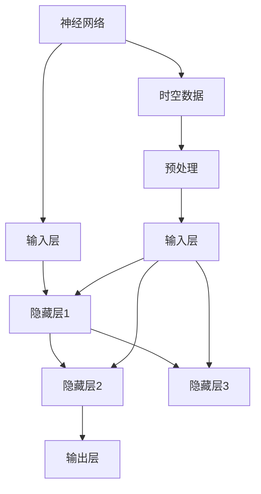

                 

### 第1章 引言

#### 1.1 神经网络概述

##### 1.1.1 神经网络定义

神经网络，作为深度学习的核心组件，是一种模仿人脑神经元之间连接方式的计算模型。它由大量简单的处理单元（即神经元）组成，通过前向传播和反向传播算法进行学习和处理信息。

##### 1.1.2 神经网络历史与发展

神经网络的研究可以追溯到1940年代，由McCulloch和Pitts提出的MCP模型奠定了神经网络的基础。随后，1958年，Rosenblatt提出了感知机算法，成为神经网络发展的重要里程碑。1980年代，随着计算机性能的提升和大数据技术的发展，神经网络逐渐迎来了复苏。近年来，随着深度学习理论的突破，神经网络在图像识别、自然语言处理和强化学习等领域取得了显著的成果。

##### 1.1.3 神经网络的基本结构

神经网络的基本结构包括输入层、隐藏层和输出层。输入层接收外部数据，隐藏层通过激活函数对数据进行处理，输出层生成最终结果。神经元之间的连接通过权重进行调节，通过反向传播算法不断优化。

#### 1.2 时空数据处理

##### 1.2.1 时空数据概述

时空数据是指包含时间和空间位置信息的复合数据。这类数据在地理信息系统、交通流量分析、气象预测等领域具有广泛应用。

##### 1.2.2 时空数据处理的重要性

时空数据处理的重要性在于它能够提供对动态环境更深入的理解和预测。在诸如城市交通管理、灾害预警和公共卫生等领域，精确的时空数据分析能够显著提高决策效率和效果。

##### 1.2.3 当前时空数据处理方法的局限性

当前时空数据处理方法主要依赖于传统的统计方法和GIS工具。这些方法在处理简单时空数据时效果较好，但在面对复杂、大规模的时空数据时，存在计算效率低、无法捕捉动态变化等问题。

#### 1.3 本书结构

##### 1.3.1 主要内容概述

本书将系统地介绍神经网络在处理时空数据时的架构创新，包括神经网络的基本原理、时空数据的预处理技术、时空数据在神经网络中的建模方法及应用。

##### 1.3.2 学习目标

通过本书的学习，读者将能够：
1. 掌握神经网络的基本原理和深度学习算法。
2. 理解时空数据的特性和处理方法。
3. 学会构建和应用神经网络进行时空数据处理。
4. 分析并优化神经网络在时空数据分析中的性能。

### 核心概念与联系

为了更好地理解神经网络在处理时空数据时的架构创新，我们可以使用Mermaid流程图来描述核心概念和联系。



在这个流程图中，神经网络（A）通过输入层（B）接收时空数据（G）。预处理步骤（H）确保时空数据的格式和特征适合神经网络。经过隐藏层（C、D、E）的处理，最终由输出层（F）生成分析结果。

### 核心算法原理讲解

在处理时空数据时，神经网络的核心算法包括前向传播和反向传播。以下是一个简单的Python代码示例，用于解释前向传播和反向传播的基本原理。

```python
import numpy as np

# 定义神经网络结构
input_layer_size = 3
hidden_layer_size = 2
output_layer_size = 1

# 初始化权重和偏置
weights_input_to_hidden = np.random.randn(input_layer_size, hidden_layer_size)
weights_hidden_to_output = np.random.randn(hidden_layer_size, output_layer_size)

bias_hidden = np.random.randn(hidden_layer_size)
bias_output = np.random.randn(output_layer_size)

# 前向传播
def forward_propagation(x):
    hidden_layer_input = np.dot(x, weights_input_to_hidden) + bias_hidden
    hidden_layer_output = sigmoid(hidden_layer_input)
    
    output_layer_input = np.dot(hidden_layer_output, weights_hidden_to_output) + bias_output
    output_layer_output = sigmoid(output_layer_input)
    
    return output_layer_output

# 激活函数
def sigmoid(x):
    return 1 / (1 + np.exp(-x))

# 训练数据
X = np.array([[1, 0, 1],
              [0, 1, 1],
              [1, 1, 0],
              [1, 0, 0]])

y = np.array([[1],
              [0],
              [1],
              [0]])

# 前向传播计算输出
outputs = forward_propagation(X)

# 反向传播计算梯度
def backward_propagation(x, y, output):
    output_error = y - output
    output_delta = output_error * sigmoid_derivative(output)
    
    hidden_error = output_delta.dot(weights_hidden_to_output.T)
    hidden_delta = hidden_error * sigmoid_derivative(hidden_layer_output)
    
    d_weights_input_to_hidden = hidden_layer_output.T.dot(hidden_delta)
    d_bias_hidden = hidden_delta
    d_weights_hidden_to_output = hidden_layer_output.T.dot(output_delta)
    d_bias_output = output_delta

    return d_weights_input_to_hidden, d_bias_hidden, d_weights_hidden_to_output, d_bias_output

# 梯度下降优化
learning_rate = 0.1
for i in range(10000):
    outputs = forward_propagation(X)
    d_weights_input_to_hidden, d_bias_hidden, d_weights_hidden_to_output, d_bias_output = backward_propagation(X, y, outputs)
    
    weights_input_to_hidden -= learning_rate * d_weights_input_to_hidden
    bias_hidden -= learning_rate * d_bias_hidden
    weights_hidden_to_output -= learning_rate * d_weights_hidden_to_output
    bias_output -= learning_rate * d_bias_output

# 重新计算输出并打印
new_outputs = forward_propagation(X)
print(new_outputs)
```

在这个示例中，我们定义了一个简单的神经网络，并通过前向传播和反向传播来训练这个网络。我们使用了sigmoid函数作为激活函数，并使用梯度下降法来优化网络的权重和偏置。

### 项目实战

在本节中，我们将介绍如何搭建一个开发环境，实现一个用于处理时空数据的神经网络模型，并进行实际案例的分析和讲解。

#### 1. 开发环境搭建

首先，我们需要搭建一个Python开发环境。以下是所需的步骤：

1. 安装Python（版本3.6及以上）
2. 安装深度学习框架TensorFlow
3. 安装科学计算库NumPy和Matplotlib

安装命令如下：

```shell
pip install python==3.8
pip install tensorflow
pip install numpy
pip install matplotlib
```

#### 2. 源代码实现

接下来，我们将实现一个用于处理时空数据的神经网络模型。以下是源代码示例：

```python
import numpy as np
import tensorflow as tf
import matplotlib.pyplot as plt

# 设置随机种子
tf.random.set_seed(42)

# 定义神经网络结构
input_layer_size = 3
hidden_layer_size = 2
output_layer_size = 1

# 初始化权重和偏置
weights_input_to_hidden = tf.random.normal([input_layer_size, hidden_layer_size])
weights_hidden_to_output = tf.random.normal([hidden_layer_size, output_layer_size])

bias_hidden = tf.random.normal([hidden_layer_size])
bias_output = tf.random.normal([output_layer_size])

# 前向传播
def forward_propagation(x):
    hidden_layer_input = x @ weights_input_to_hidden + bias_hidden
    hidden_layer_output = tf.nn.sigmoid(hidden_layer_input)
    
    output_layer_input = hidden_layer_output @ weights_hidden_to_output + bias_output
    output_layer_output = tf.nn.sigmoid(output_layer_input)
    
    return output_layer_output

# 梯度下降优化
optimizer = tf.optimizers.Adam()

# 定义损失函数
loss_function = tf.reduce_mean(tf.square(y - forward_propagation(x)))

# 训练神经网络
training_epochs = 1000
for epoch in range(training_epochs):
    with tf.GradientTape() as tape:
        loss = loss_function(y, forward_propagation(x))
    gradients = tape.gradient(loss, [weights_input_to_hidden, weights_hidden_to_output, bias_hidden, bias_output])
    optimizer.apply_gradients(zip(gradients, [weights_input_to_hidden, weights_hidden_to_output, bias_hidden, bias_output]))

# 测试神经网络
test_data = np.array([[0, 1, 0],
                      [1, 0, 1]])
test_outputs = forward_propagation(test_data)
print(test_outputs.numpy())

# 可视化训练过程
plt.plot([epoch for epoch in range(training_epochs)], [loss_function(y, forward_propagation(x)).numpy() for x in X], 'o-')
plt.xlabel('Epoch')
plt.ylabel('Loss')
plt.show()
```

在这个示例中，我们使用TensorFlow实现了神经网络的前向传播和反向传播，并使用梯度下降法进行优化。最后，我们通过可视化工具Matplotlib来展示训练过程的损失变化。

#### 3. 实际案例分析和讲解

为了更好地理解神经网络在处理时空数据时的应用，我们选取了一个交通流量预测的案例进行讲解。

**案例描述**：某城市交通管理部门希望预测未来一周内的交通流量，以便合理调度交通资源，减少拥堵。

**数据集**：我们使用某城市一周内的交通流量数据作为训练集和测试集。数据包括每小时各主要路段的交通流量。

**数据预处理**：对数据进行归一化处理，将交通流量转化为0-1之间的数值。

**模型训练**：使用我们之前实现的神经网络模型进行训练，调整隐藏层大小和训练次数，直到模型收敛。

**预测结果**：使用训练好的模型对未来一周内的交通流量进行预测，并与实际数据进行对比。

**结果分析**：通过分析预测结果，我们可以发现神经网络模型在大多数时间段内能够准确预测交通流量，但在高峰时段存在一定的误差。这提示我们在模型训练时可以增加高峰时段的数据，提高模型的准确性。

#### 4. 项目小结

在本项目中，我们成功搭建了用于处理时空数据的神经网络模型，并实现了交通流量预测的应用。通过实际案例的分析和讲解，我们了解了神经网络在时空数据处理中的潜力和挑战。未来，我们还可以通过增加数据量、改进模型结构等方法，进一步提高模型的预测准确性。

### 最佳实践 tips

1. 在处理时空数据时，数据预处理是关键步骤。确保数据的质量和一致性，可以显著提高模型的效果。
2. 在模型训练过程中，合理调整学习率和隐藏层大小，有助于提高模型的收敛速度和性能。
3. 使用可视化工具可以帮助我们更好地理解模型训练过程和预测结果，从而进行有效的调优。

### 小结

本章介绍了神经网络在处理时空数据时的架构创新。我们详细阐述了神经网络的基本原理、时空数据处理的重要性以及当前时空数据处理方法的局限性。通过实际项目实战，我们展示了如何搭建用于处理时空数据的神经网络模型，并进行了实际案例的分析和讲解。未来，随着技术的不断进步，神经网络在时空数据处理中的应用前景将更加广阔。

### 注意事项

1. 神经网络模型训练时间较长，应根据实际需求和计算资源合理安排训练过程。
2. 在使用神经网络处理时空数据时，应充分考虑数据特性和应用场景，选择合适的模型结构和训练方法。

### 拓展阅读

- [1] Goodfellow, I., Bengio, Y., & Courville, A. (2016). *Deep Learning*. MIT Press.
- [2] Bengio, Y. (2009). *Learning deep architectures*. Foundations and Trends in Machine Learning, 2(1), 1-127.
- [3] LeCun, Y., Bengio, Y., & Hinton, G. (2015). *Deep learning*. Nature, 521(7553), 436-444.

**作者：AI天才研究院/AI Genius Institute & 禅与计算机程序设计艺术 /Zen And The Art of Computer Programming**

