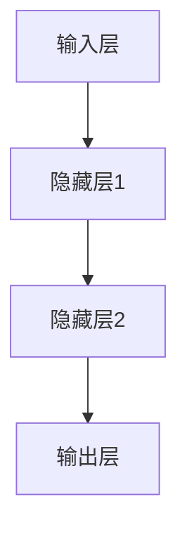

                 

### 引言

在当今的信息时代，数据量呈指数级增长，尤其是在高维数据领域。高维数据指的是拥有大量特征的数据集，这些数据在图像处理、文本分析、生物信息学等领域中广泛存在。尽管高维数据包含丰富的信息，但同时也带来了巨大的计算和存储挑战。传统的数据处理方法在面对超高维数据时常常力不从心，效率低下，这使得降维技术成为研究的热点。

降维技术是一种减少数据维度而不损失重要信息的方法，其核心目标是通过降低数据维度，提高数据处理效率和性能。降维技术在数据压缩、特征提取、机器学习等多个领域都有着重要的应用。在机器学习中，尤其是神经网络中，降维技术能够显著提高模型训练的效率，减少过拟合现象，增强模型的泛化能力。

神经网络是一种通过模拟人脑神经元连接机制进行信息处理的计算模型，其在图像识别、自然语言处理、推荐系统等领域表现出强大的能力。然而，神经网络在处理超高维数据时，由于其复杂的层次结构和庞大的参数量，面临着计算资源和时间效率的巨大挑战。这就需要借助降维技术，以优化神经网络的训练过程。

本文将探讨神经网络在处理超高维数据时的降维技术，旨在提供一个系统、全面的视角，帮助读者理解降维技术在神经网络中的应用原理、方法和实现步骤。文章结构如下：

1. **神经网络基础**：介绍神经网络的发展历史、基本结构、前向传播与反向传播算法、优化方法、激活函数等基础内容。
2. **超高维数据降维技术**：详细分析超高维数据的特点、降维技术的目的和方法。
3. **神经网络在降维中的应用**：探讨神经网络在降维中的优势、具体实现方法以及代码实现。
4. **案例分析与实战应用**：通过实际案例展示神经网络在图像识别和自然语言处理中的降维应用。
5. **总结与展望**：总结文章内容，提出未来研究方向和改进空间。

通过本文的深入探讨，希望能够为读者提供关于神经网络降维技术的新见解，并为实际应用中的问题提供解决方案。

### 神经网络基础

神经网络作为机器学习领域的重要工具，其发展历史可以追溯到20世纪40年代。当时，心理学家McCulloch和数学家Pitts提出了第一个简单的神经网络模型——**McCulloch-Pitts神经元**。这个模型奠定了神经网络的基础，但受限于计算能力和模型复杂度，早期的神经网络研究进展缓慢。

随着时间的推移，神经网络在多个领域得到广泛关注，特别是在1980年代，感知机（Perceptron）和反向传播算法（Backpropagation）的提出，标志着神经网络研究的重大突破。感知机是一种简单的二分类模型，而反向传播算法则提供了一种有效的训练方法，使得多层神经网络能够学习复杂的函数。

#### 神经网络的起源

神经网络的起源可以追溯到1943年，心理学家McCulloch和数学家Pitts在他们的论文《A logical calculus of the ideas immanent in nervous activity》中提出了**McCulloch-Pitts神经元**。这个模型模拟了神经元的激活机制，是神经网络的理论基石。

在20世纪50年代，心理学家Hebb在其著作《The Organization of Behavior》中提出了**Hebbian学习规则**，这进一步推动了神经网络的发展。Hebbian学习规则指的是，当两个神经元同时被激活时，它们之间的连接会加强。

然而，直到1980年代，神经网络的研究才迎来新的高潮。1986年，Rumelhart、Hinton和Williams提出了反向传播算法（Backpropagation），这是一种用于多层神经网络的训练算法。反向传播算法通过计算输出误差的梯度，反向传播误差信号到每一层，从而调整各层的权重。这一算法的提出，使得多层神经网络能够有效地学习复杂的非线性关系，大大提升了神经网络的性能。

#### 神经网络的发展历程

神经网络的发展历程可以分为几个重要阶段：

1. **感知机（Perceptron）**：1957年，Frank Rosenblatt提出了感知机，这是一种简单的前向传播神经网络。感知机通过线性分类器进行二分类任务，但无法处理非线性问题。

2. **多层感知机（MLP）**：为了解决非线性问题，1980年代提出了多层感知机（MLP）。MLP通过引入多个隐藏层，能够实现复杂的非线性函数。多层感知机的成功使得神经网络成为机器学习领域的热门研究方向。

3. **反向传播算法（Backpropagation）**：1986年，反向传播算法的提出，解决了多层神经网络训练的难题。反向传播算法通过计算输出误差的梯度，反向传播误差信号到每一层，从而调整各层的权重。这一算法的引入，使得多层神经网络能够有效地学习复杂的非线性关系。

4. **卷积神经网络（CNN）**：1990年代，LeCun等人提出了卷积神经网络（CNN）。CNN通过卷积操作和池化操作，能够有效地提取图像特征，并在图像识别任务中取得了显著的性能提升。

5. **循环神经网络（RNN）**：1990年代，Hochreiter和Schmidhuber提出了循环神经网络（RNN）。RNN能够处理序列数据，并在自然语言处理等任务中表现出强大的能力。

6. **深度学习**：2006年，Hinton提出了深度信念网络（DBN），这是深度学习的早期模型之一。随着计算能力的提升和大数据技术的发展，深度学习在图像识别、自然语言处理、语音识别等领域取得了突破性的进展。

#### 神经网络在现代计算机科学中的应用

神经网络在现代计算机科学中有着广泛的应用，尤其在图像识别、自然语言处理、推荐系统等领域取得了显著成就：

1. **图像识别**：卷积神经网络（CNN）在图像识别任务中表现出色。通过卷积操作和池化操作，CNN能够提取图像中的关键特征，从而实现高精度的图像分类和检测。

2. **自然语言处理**：循环神经网络（RNN）及其变种，如长短期记忆网络（LSTM）和门控循环单元（GRU），在自然语言处理任务中广泛应用。RNN能够处理序列数据，从而实现文本分类、机器翻译、情感分析等任务。

3. **推荐系统**：神经网络在推荐系统中也发挥着重要作用。通过学习用户的历史行为和偏好，神经网络能够预测用户对物品的喜好，从而实现个性化的推荐。

4. **语音识别**：深度神经网络（DNN）在语音识别任务中取得了显著的性能提升。通过将语音信号转换为文本，语音识别技术大大提高了人机交互的便利性。

总之，神经网络作为一种强大的计算模型，其发展历程和应用前景令人瞩目。随着技术的不断进步和算法的优化，神经网络在各个领域的应用将越来越广泛，为人类带来更多的便利和可能。

### 神经网络的基本结构

神经网络是由大量相互连接的节点（或称为神经元）组成的复杂网络，其基本结构决定了神经网络的性能和功能。理解神经网络的基本结构对于深入探讨其在降维技术中的应用至关重要。

#### 神经元的模型

神经元是神经网络的基本单元，其工作原理类似于生物神经元。一个简单的神经元模型通常包括以下几个部分：

1. **输入层**：神经元接收外部输入信号，这些输入可以是数字、图像或其他形式的数据。
2. **加权层**：每个输入信号通过一个权重（或称为权重系数）进行加权。
3. **求和单元**：将加权后的输入信号求和。
4. **激活函数**：对求和结果应用一个非线性函数，以产生输出信号。
5. **输出层**：神经元的最终输出，可以传递给下一层神经元或用于特定任务。

神经元模型的数学表示可以简化为以下形式：

$$
\text{输出} = \sigma(\sum_{i=1}^{n} w_i \cdot x_i + b)
$$

其中，$x_i$ 是第 $i$ 个输入，$w_i$ 是相应的权重，$b$ 是偏置项，$\sigma$ 是激活函数，通常选择为Sigmoid函数或ReLU函数。

#### 神经网络的层次结构

神经网络根据其层次结构可以分为输入层、隐藏层和输出层：

1. **输入层**：接收外部输入数据，并将其传递给隐藏层。
2. **隐藏层**：中间层，用于提取和转换数据特征，一个神经网络可以包含一个或多个隐藏层。
3. **输出层**：产生最终输出，可以是分类结果、数值预测等。

神经网络的层次结构决定了其复杂性和处理能力。多层神经网络（或多层感知机，MLP）能够捕捉和表示更复杂的函数关系，因此更适合处理复杂任务。

#### 常见的神经网络模型

不同的神经网络模型在结构上有所不同，以下介绍几种常见的神经网络模型：

1. **多层感知机（MLP）**：MLP是最简单的多层神经网络，由输入层、多个隐藏层和输出层组成。它适用于各种回归和分类任务。
2. **卷积神经网络（CNN）**：CNN专门设计用于处理图像数据。其核心组件是卷积层和池化层，能够有效地提取图像特征。
3. **循环神经网络（RNN）**：RNN能够处理序列数据，其核心组件是循环层，通过记忆长期依赖关系。
4. **长短时记忆网络（LSTM）**：LSTM是RNN的一种变体，能够更好地处理长序列数据，避免了传统RNN的梯度消失问题。
5. **自动编码器（Autoencoder）**：自动编码器是一种无监督学习模型，通过编码器和解码器学习数据的低维表示。

#### Mermaid流程图

为了更好地展示神经网络的层次结构，可以使用Mermaid流程图来表示。以下是一个简化的多层感知机（MLP）的Mermaid流程图：



这个流程图展示了输入层通过权重连接到隐藏层，隐藏层再连接到输出层，每个层次通过激活函数进行处理。

通过了解神经网络的基本结构和常见模型，我们可以更好地理解其在降维技术中的应用原理。下一部分将深入探讨神经网络的基本算法，包括前向传播和反向传播算法，以及神经网络的优化方法。

### 前向传播与反向传播算法

神经网络的核心算法主要包括前向传播（Forward Propagation）和反向传播（Backpropagation）。这两种算法共同构成了神经网络的训练过程，使得神经网络能够学习并优化其参数，从而实现复杂的函数映射。下面将详细讲解这两种算法的基本原理、计算过程和代码实现。

#### 前向传播算法

前向传播算法是神经网络处理输入数据的基本过程，其目的是从输入层开始，通过网络的每一层，最终得到输出层的结果。在这个过程中，每个神经元都会计算其输入信号的加权和，并应用一个非线性激活函数，以产生输出。

1. **基本原理**：

   前向传播的基本原理可以概括为以下几个步骤：

   - **输入层到隐藏层**：每个隐藏层神经元的输出是前一层所有神经元的加权和，加上一个偏置项，再通过激活函数处理。
   - **隐藏层到输出层**：输出层神经元的输出同样遵循上述规则，但由于其是最终输出，还需要考虑损失函数。

   数学上，前向传播可以表示为：

   $$
   z^{(l)} = \sigma(W^{(l)} \cdot a^{(l-1)} + b^{(l)})
   $$

   其中，$z^{(l)}$ 是第 $l$ 层的输出，$a^{(l-1)}$ 是前一层（第 $l-1$ 层）的输出，$W^{(l)}$ 是第 $l$ 层的权重矩阵，$b^{(l)}$ 是第 $l$ 层的偏置向量，$\sigma$ 是激活函数。

2. **计算过程**：

   前向传播的计算过程可以分为以下几个步骤：

   - **初始化参数**：设置权重矩阵 $W^{(l)}$ 和偏置向量 $b^{(l)}$。
   - **前向计算**：从输入层开始，逐层计算每个神经元的输出，直到输出层。
   - **激活函数应用**：在每个隐藏层和输出层，应用激活函数 $\sigma$ 对输出进行非线性变换。

3. **代码实现**：

   下面是使用Python实现的简单前向传播代码示例：

   ```python
   import numpy as np

   def sigmoid(z):
       return 1 / (1 + np.exp(-z))

   def forward_propagation(X, parameters):
       A = X
       L = len(parameters) // 2  # 神经网络层数

       for l in range(1, L):
           A = sigmoid(np.dot(parameters['W' + str(l)], A) + parameters['b' + str(l)])
       
       return A
   ```

   在这个代码示例中，我们定义了一个sigmoid激活函数和一个前向传播函数。前向传播函数接收输入数据 $X$ 和神经网络参数（权重和偏置），逐层计算每个神经元的输出，并返回最终输出。

#### 反向传播算法

反向传播算法是神经网络训练过程中的关键步骤，其目的是通过计算损失函数的梯度，来更新网络的权重和偏置，从而优化网络性能。反向传播算法的核心思想是将输出层的误差反向传播到网络的每一层，并使用这些误差来更新权重和偏置。

1. **基本原理**：

   反向传播算法的基本原理可以概括为以下几个步骤：

   - **计算输出层误差**：使用损失函数（如均方误差MSE或交叉熵损失）计算输出层的误差。
   - **误差反向传播**：从输出层开始，逐步计算每一层的误差，直到输入层。
   - **权重和偏置更新**：使用计算得到的误差梯度，通过优化算法（如梯度下降）更新权重和偏置。

   数学上，反向传播可以表示为：

   $$
   \delta^{(l)} = \sigma'^{(l)}(\cdot) \cdot (z^{(l)} - y)
   $$

   其中，$\delta^{(l)}$ 是第 $l$ 层的误差，$\sigma'^{(l)}$ 是激活函数的导数，$z^{(l)}$ 是第 $l$ 层的输出，$y$ 是实际输出。

2. **计算过程**：

   反向传播的计算过程可以分为以下几个步骤：

   - **计算输出层误差**：根据损失函数计算输出层的误差。
   - **误差反向传播**：从输出层开始，通过链式法则逐层计算每一层的误差。
   - **权重和偏置更新**：使用误差梯度更新权重和偏置。

3. **代码实现**：

   下面是使用Python实现的简单反向传播代码示例：

   ```python
   def backward_propagation(X, Y, parameters):
       m = X.shape[1]
       L = len(parameters) // 2
       dZ = [None] * L
       dW = [None] * L
       db = [None] * L
       dA = Y - forward_propagation(X, parameters)

       for l in reversed(range(1, L)):
           dZ[l] = dA * sigmoid_derivative(A[l-1])
           dW[l] = np.dot(dZ[l], A[l-1].T) / m
           db[l] = np.sum(dZ[l], axis=1, keepdims=True) / m
           if l > 1:
               dA = np.dot(parameters['W' + str(l)].T, dZ[l])

       return {'dW': dW, 'db': db}
   ```

   在这个代码示例中，我们定义了一个反向传播函数。函数接收输入数据 $X$、实际输出 $Y$ 和神经网络参数（权重和偏置），计算输出层的误差，并逐层反向传播误差，最终返回误差梯度的权重和偏置。

#### 梯度下降法

梯度下降法是用于更新神经网络参数的常用优化算法。其基本思想是沿着损失函数的梯度方向逐步调整参数，以最小化损失函数。

1. **基本原理**：

   梯度下降法的基本原理可以概括为以下几个步骤：

   - **初始化参数**：设置初始权重和偏置。
   - **计算梯度**：使用反向传播算法计算损失函数的梯度。
   - **参数更新**：根据梯度调整权重和偏置。

   数学上，梯度下降法可以表示为：

   $$
   \theta = \theta - \alpha \cdot \nabla_\theta J(\theta)
   $$

   其中，$\theta$ 是参数，$\alpha$ 是学习率，$J(\theta)$ 是损失函数。

2. **优化策略**：

   为了提高梯度下降法的收敛速度，可以采用以下策略：

   - **学习率调整**：根据训练过程动态调整学习率。
   - **动量法**：引入动量项，加速收敛。
   - **自适应优化器**：如Adam优化器，自适应调整学习率。

3. **代码实现**：

   下面是使用Python实现的简单梯度下降法代码示例：

   ```python
   def gradient_descent(X, Y, parameters, alpha, num_iterations):
       m = X.shape[1]
       L = len(parameters) // 2

       for i in range(num_iterations):
           gradients = backward_propagation(X, Y, parameters)
           dW = gradients['dW']
           db = gradients['db']

           for l in range(1, L + 1):
               parameters['W' + str(l)] -= alpha * dW[l-1]
               parameters['b' + str(l)] -= alpha * db[l-1]

           if i % 1000 == 0:
               cost = compute_cost(X, Y, parameters)
               print(f"Cost after iteration {i}: {cost}")

       return parameters
   ```

   在这个代码示例中，我们定义了一个梯度下降函数。函数接收输入数据 $X$、实际输出 $Y$、神经网络参数、学习率和迭代次数，通过反向传播计算梯度，并使用梯度更新参数。

通过以上讲解和代码实现，我们可以清楚地理解神经网络的前向传播与反向传播算法，以及梯度下降法的优化策略。这些算法构成了神经网络训练的基础，使得神经网络能够有效地学习复杂的函数关系。接下来，我们将探讨神经网络的优化方法，进一步优化其训练过程。

### 神经网络的优化方法

在神经网络训练过程中，优化方法的选择至关重要。优化方法不仅影响模型的收敛速度，还决定模型最终的性能。以下将介绍几种常见的神经网络优化方法，包括梯度下降法、动量法、自适应优化器等，并探讨它们的原理和实现方法。

#### 梯度下降法

梯度下降法是一种最基本的优化方法，其核心思想是通过计算损失函数的梯度，沿梯度方向更新模型参数，以最小化损失函数。梯度下降法分为批量梯度下降、随机梯度下降和小批量梯度下降三种变体。

1. **批量梯度下降（Batch Gradient Descent）**：

   批量梯度下降法使用整个训练集的数据计算梯度，每次迭代更新模型参数。这种方法的优点是梯度计算准确，但缺点是收敛速度较慢，因为需要计算大量数据的梯度。

   数学上，批量梯度下降法可以表示为：

   $$
   \theta = \theta - \alpha \cdot \nabla_\theta J(\theta)
   $$

   其中，$\theta$ 是模型参数，$\alpha$ 是学习率，$J(\theta)$ 是损失函数。

2. **随机梯度下降（Stochastic Gradient Descent, SGD）**：

   随机梯度下降法每次迭代只使用一个样本来计算梯度，从而更新模型参数。这种方法能够显著提高收敛速度，因为每次迭代只需要处理一个样本。然而，随机梯度下降法容易陷入局部最小值，导致训练结果不稳定。

   数学上，随机梯度下降法可以表示为：

   $$
   \theta = \theta - \alpha \cdot \nabla_\theta J(\theta; x_i, y_i)
   $$

   其中，$x_i, y_i$ 是当前样本及其标签。

3. **小批量梯度下降（Mini-batch Gradient Descent）**：

   小批量梯度下降法结合了批量梯度下降和随机梯度下降的优点，每次迭代使用一个小批量（如32或64个样本）的数据计算梯度，从而更新模型参数。这种方法能够在准确性和收敛速度之间取得平衡。

   数学上，小批量梯度下降法可以表示为：

   $$
   \theta = \theta - \alpha \cdot \nabla_\theta J(\theta; \{x_i, y_i\})
   $$

   其中，$\{x_i, y_i\}$ 是当前小批量数据。

#### 动量法

动量法是一种改进的梯度下降法，通过引入动量项，加速收敛并减少震荡。动量法的基本思想是保留前一次迭代的更新值，将其作为当前迭代的一部分，以减少每次迭代的变化幅度。

1. **基本原理**：

   动量法可以表示为：

   $$
   \theta = \theta - \alpha \cdot \nabla_\theta J(\theta) + \beta \cdot \theta_{prev}
   $$

   其中，$\theta_{prev}$ 是前一次迭代的参数更新，$\beta$ 是动量项，通常取值在0到1之间。

2. **实现方法**：

   动量法的实现相对简单，只需要在梯度下降法的基础上添加一个动量项。具体实现如下：

   ```python
   prev_gradient = 0
   for iteration in range(num_iterations):
       gradient = compute_gradient(X, Y, parameters)
       theta = theta - alpha * gradient + beta * prev_gradient
       prev_gradient = beta * prev_gradient + (1 - beta) * gradient
   ```

   在这个代码示例中，我们定义了一个简单的动量法实现。每次迭代，计算梯度，并使用动量项更新参数。

#### 自适应优化器

自适应优化器是一类基于历史梯度信息的优化方法，能够自适应调整学习率，从而提高训练效率和模型性能。常见的自适应优化器包括Adam优化器、RMSprop等。

1. **Adam优化器**：

   Adam优化器结合了Adagrad和RMSprop的优点，能够自适应调整学习率，同时考虑一阶和二阶矩估计。

   - **一阶矩估计**：计算梯度的一阶矩估计（均值）。
   - **二阶矩估计**：计算梯度二阶矩估计（方差）。

   数学上，Adam优化器可以表示为：

   $$
   \theta = \theta - \alpha \cdot \nabla_\theta J(\theta) \cdot \left( \frac{1 - \beta_1^k}{1 - \beta_1} \right) \cdot \left( \frac{1 - \beta_2^k}{1 - \beta_2} \right)
   $$

   其中，$\beta_1$ 和 $\beta_2$ 分别是动量项，$k$ 是当前迭代次数。

2. **RMSprop优化器**：

   RMSprop优化器通过计算梯度方差来调整学习率，能够有效处理稀疏数据。

   数学上，RMSprop优化器可以表示为：

   $$
   \theta = \theta - \alpha \cdot \nabla_\theta J(\theta) \cdot \frac{1}{\sqrt{V + \epsilon}}
   $$

   其中，$V$ 是梯度方差，$\epsilon$ 是一个很小的常数，用于避免分母为零。

3. **实现方法**：

   自适应优化器的实现相对复杂，通常需要维护一阶和二阶矩估计。以下是一个简单的Adam优化器实现：

   ```python
   beta1 = 0.9
   beta2 = 0.999
   epsilon = 1e-8

   m = 0
   v = 0

   for iteration in range(num_iterations):
       gradient = compute_gradient(X, Y, parameters)
       m = beta1 * m + (1 - beta1) * gradient
       v = beta2 * v + (1 - beta2) * (gradient ** 2)
       m_hat = m / (1 - beta1 ** k)
       v_hat = v / (1 - beta2 ** k)
       theta = theta - alpha * m_hat / (np.sqrt(v_hat) + epsilon)
   ```

   在这个代码示例中，我们定义了一个简单的Adam优化器实现。每次迭代，计算梯度，并更新一阶和二阶矩估计，从而调整学习率并更新参数。

通过以上介绍，我们可以看到，不同的优化方法在神经网络训练中具有不同的优势和适用场景。在实际应用中，选择合适的优化方法，能够显著提高模型训练效率和性能。接下来，我们将讨论神经网络的激活函数，以进一步深入理解神经网络的工作原理。

### 神经网络的激活函数

激活函数是神经网络中至关重要的一部分，其作用是引入非线性因素，使得神经网络能够建模复杂的数据特征。不同的激活函数具有不同的性质和适用场景，下面将详细介绍几种常见的激活函数，包括Sigmoid函数、ReLU函数和Tanh函数。

#### Sigmoid函数

Sigmoid函数是一种常用的激活函数，其表达式为：

$$
\sigma(x) = \frac{1}{1 + e^{-x}}
$$

Sigmoid函数的输出范围在0到1之间，这使得它在分类任务中特别有用。然而，Sigmoid函数也存在一些缺点：

1. **梯度消失问题**：在Sigmoid函数的输出接近0或1时，其导数接近0，这会导致梯度消失，使得神经网络难以训练。
2. **计算效率问题**：Sigmoid函数的计算复杂度较高，特别是在大规模神经网络中，这可能会影响训练速度。

#### ReLU函数

ReLU函数（Rectified Linear Unit）是一种线性激活函数，其表达式为：

$$
\sigma(x) = \max(0, x)
$$

ReLU函数具有以下优点：

1. **计算效率高**：ReLU函数的计算简单，仅需比较输入值和零，这使得其在处理大规模数据时具有很高的效率。
2. **避免梯度消失**：ReLU函数在输入为负值时导数为零，但在输入为正值时导数为一，从而避免了梯度消失问题，有助于神经网络快速训练。

然而，ReLU函数也存在一些缺点：

1. **死神经元问题**：在训练过程中，部分神经元可能会变成“死神经元”，即其输入一直为负值，导致其永远不会被激活。这可能导致神经网络无法学习到有效的特征。

#### Tanh函数

Tanh函数（Hyperbolic Tangent）是另一种常见的激活函数，其表达式为：

$$
\sigma(x) = \frac{e^x - e^{-x}}{e^x + e^{-x}}
$$

Tanh函数具有以下优点：

1. **输出范围在-1到1之间**：Tanh函数的输出范围在-1到1之间，这使得它在某些任务中比Sigmoid函数更具优势。
2. **避免梯度消失**：与Sigmoid函数不同，Tanh函数在整个定义域内都具有相对稳定的导数值，从而避免了梯度消失问题。

然而，Tanh函数的计算复杂度较高，且在输出为正负无穷时可能引起数值稳定性问题。

#### 比较与选择

不同激活函数具有不同的特点，选择合适的激活函数取决于具体任务和模型结构：

1. **Sigmoid函数**：适用于输出范围在0到1之间的分类任务，但在训练过程中易受梯度消失问题影响。
2. **ReLU函数**：计算效率高，避免梯度消失问题，适用于大规模神经网络和深度学习任务，但存在死神经元问题。
3. **Tanh函数**：输出范围适中，避免梯度消失问题，适用于需要稳定输出范围的神经网络，但计算复杂度较高。

在实际应用中，可以选择多种激活函数的组合，以平衡模型性能和计算效率。例如，在深度神经网络中，常将ReLU函数应用于隐藏层，而在输出层使用Sigmoid或Tanh函数，以实现分类任务。

通过深入理解不同激活函数的特点和适用场景，我们可以更好地选择和设计神经网络模型，从而提高模型的训练效率和性能。接下来，我们将探讨多层感知机（MLP），了解其在神经网络中的应用。

### 多层感知机

多层感知机（Multilayer Perceptron，MLP）是一种前馈神经网络，由输入层、一个或多个隐藏层以及输出层组成。MLP能够通过学习输入和输出之间的复杂非线性关系，实现多种类型的预测和分类任务。本节将详细讨论MLP的基本原理、结构设计和工作原理，并介绍其代码实现。

#### 基本原理

多层感知机的基本原理是通过前向传播和反向传播算法，学习输入和输出之间的映射关系。在前向传播过程中，输入数据从输入层传递到隐藏层，再从隐藏层传递到输出层；在反向传播过程中，根据输出误差调整网络的权重和偏置。

MLP通过多层非线性变换，能够捕捉输入数据的复杂特征，从而实现高精度的预测和分类。其数学模型可以表示为：

$$
a^{(l)} = \sigma(W^{(l)} \cdot a^{(l-1)} + b^{(l)})
$$

其中，$a^{(l)}$ 表示第 $l$ 层的激活值，$\sigma$ 是激活函数（如ReLU、Sigmoid或Tanh），$W^{(l)}$ 是第 $l$ 层的权重矩阵，$b^{(l)}$ 是第 $l$ 层的偏置向量。

#### 结构设计

多层感知机的结构设计包括输入层、隐藏层和输出层。每个层由多个神经元组成，相邻层之间通过加权连接实现信息传递。

1. **输入层**：接收外部输入数据，每个输入神经元对应一个特征。
2. **隐藏层**：一个或多个隐藏层，用于提取和转换数据特征。隐藏层的数量和神经元数量可以根据任务复杂度进行调整。
3. **输出层**：产生最终输出，可以是分类结果或数值预测。输出层的神经元数量取决于具体任务。

MLP的结构设计可以表示为：

```
输入层 -> 隐藏层1 -> 隐藏层2 -> ... -> 隐藏层n -> 输出层
```

其中，每个隐藏层通过激活函数进行非线性变换，从而提高模型的表达能力。

#### 工作原理

多层感知机的工作原理可以分为前向传播和反向传播两个阶段：

1. **前向传播**：

   在前向传播阶段，输入数据从输入层传递到隐藏层，然后逐层传递到输出层。每个神经元都计算其输入信号的加权和，并应用激活函数进行非线性变换，以产生输出。

   前向传播的计算过程可以表示为：

   $$
   z^{(l)} = \sigma(W^{(l)} \cdot a^{(l-1)} + b^{(l)})
   $$

   其中，$z^{(l)}$ 是第 $l$ 层的输出，$a^{(l-1)}$ 是前一层（第 $l-1$ 层）的输出，$W^{(l)}$ 是第 $l$ 层的权重矩阵，$b^{(l)}$ 是第 $l$ 层的偏置向量。

2. **反向传播**：

   在反向传播阶段，根据输出误差，调整网络的权重和偏置。反向传播通过计算每个神经元的梯度，并沿误差梯度方向更新权重和偏置。

   反向传播的计算过程可以表示为：

   $$
   \delta^{(l)} = \sigma'^{(l)}(z^{(l)}) \cdot (z^{(l)} - y)
   $$

   其中，$\delta^{(l)}$ 是第 $l$ 层的误差，$\sigma'^{(l)}$ 是激活函数的导数，$z^{(l)}$ 是第 $l$ 层的输出，$y$ 是实际输出。

通过反复迭代前向传播和反向传播，多层感知机能够不断优化其参数，从而实现高精度的预测和分类。

#### 代码实现

下面是一个简单的多层感知机实现示例，使用Python和NumPy库：

```python
import numpy as np

def sigmoid(x):
    return 1 / (1 + np.exp(-x))

def forward_propagation(X, parameters):
    L = len(parameters) // 2
    cache = {'A0': X}
    
    for l in range(1, L+1):
        cache['A' + str(l)] = sigmoid(np.dot(parameters['W' + str(l)], cache['A' + str(l-1)] + parameters['b' + str(l)])
    
    return cache['A' + str(L)]

def backward_propagation(X, Y, parameters, cache):
    L = len(parameters) // 2
    grads = {}
    
    dA_prev = Y - forward_propagation(X, parameters)
    
    for l in reversed(range(1, L+1)):
        dZ = dA_prev * sigmoid_derivative(cache['A' + str(l)])
        dW = np.dot(dZ, cache['A' + str(l-1)].T) / X.shape[1]
        db = np.sum(dZ, axis=1, keepdims=True) / X.shape[1]
        
        dA_prev = np.dot(parameters['W' + str(l)].T, dZ)
        
        grads['dW' + str(l)] = dW
        grads['db' + str(l)] = db
    
    return grads

def sigmoid_derivative(x):
    return x * (1 - x)

# 示例：使用多层感知机进行二分类
X = np.array([[1, 2], [2, 3], [3, 1], [4, 5]])
Y = np.array([[0], [0], [1], [1]])

# 初始化参数
parameters = {'W1': np.random.randn(3, 4), 'b1': np.zeros((3, 1)),
              'W2': np.random.randn(4, 1), 'b2': np.zeros((4, 1))}

# 前向传播
cache = forward_propagation(X, parameters)

# 反向传播
grads = backward_propagation(X, Y, parameters, cache)

# 打印梯度
print(grads)
```

在这个示例中，我们定义了前向传播和反向传播函数，并使用简单的示例数据演示了多层感知机的工作原理。通过迭代前向传播和反向传播，多层感知机能够优化其参数，实现二分类任务。

通过以上讨论，我们可以看到多层感知机在神经网络中具有重要作用，其结构设计和算法实现方法使得它能够处理复杂的数据特征和预测任务。接下来，我们将介绍卷积神经网络（CNN），了解其在图像处理中的应用。

### 卷积神经网络

卷积神经网络（Convolutional Neural Network，CNN）是一种专为处理图像数据设计的神经网络模型。其核心思想是通过卷积层和池化层，提取图像中的空间特征和层次特征，从而实现高精度的图像识别和分类。本节将详细介绍CNN的基本概念、结构、工作原理以及代码实现。

#### 基本概念

卷积神经网络的基本组成包括输入层、卷积层、池化层和全连接层。其中，卷积层和池化层是CNN的核心部分，用于提取图像特征。

1. **卷积层**：卷积层通过卷积操作提取图像特征。卷积操作可以看作是图像与滤波器的点积，滤波器在图像上滑动，从而生成特征图。
2. **池化层**：池化层对卷积层生成的特征图进行下采样，以减少数据维度和计算量。常见的池化操作包括最大池化和平均池化。
3. **全连接层**：全连接层将池化层输出的特征图展平为一维向量，并输出最终分类结果。

#### 结构

卷积神经网络的结构可以表示为：

```
输入层 -> 卷积层 -> 池化层 -> 全连接层 -> 输出层
```

1. **输入层**：接收图像数据，图像的尺寸通常是$w \times h \times c$，其中 $w$ 和 $h$ 分别是图像的宽度和高度，$c$ 是颜色通道数（如RGB图像，$c=3$）。
2. **卷积层**：通过卷积操作提取图像特征。卷积层包括多个卷积核（也称为滤波器），每个卷积核对图像进行卷积操作，生成一个特征图。
3. **池化层**：对卷积层输出的特征图进行下采样。常见的池化操作包括最大池化和平均池化。最大池化选择特征图中的最大值，而平均池化计算特征图中的平均值。
4. **全连接层**：将池化层输出的特征图展平为一维向量，并通过全连接层输出最终分类结果。

#### 工作原理

卷积神经网络的工作原理可以分为以下几个步骤：

1. **卷积操作**：卷积层通过卷积操作提取图像特征。卷积操作可以看作是图像与滤波器的点积，滤波器在图像上滑动，从而生成特征图。
2. **激活函数**：对卷积操作的结果应用激活函数，如ReLU函数，以引入非线性因素。
3. **池化操作**：池化层对卷积层输出的特征图进行下采样，以减少数据维度和计算量。
4. **全连接层**：全连接层将池化层输出的特征图展平为一维向量，并通过全连接层输出最终分类结果。

#### 代码实现

下面是一个简单的卷积神经网络实现示例，使用Python和TensorFlow库：

```python
import tensorflow as tf

# 定义卷积神经网络模型
model = tf.keras.Sequential([
    tf.keras.layers.Conv2D(32, (3, 3), activation='relu', input_shape=(28, 28, 1)),
    tf.keras.layers.MaxPooling2D((2, 2)),
    tf.keras.layers.Conv2D(64, (3, 3), activation='relu'),
    tf.keras.layers.MaxPooling2D((2, 2)),
    tf.keras.layers.Conv2D(64, (3, 3), activation='relu'),
    tf.keras.layers.Flatten(),
    tf.keras.layers.Dense(64, activation='relu'),
    tf.keras.layers.Dense(10, activation='softmax')
])

# 编译模型
model.compile(optimizer='adam',
              loss='sparse_categorical_crossentropy',
              metrics=['accuracy'])

# 加载MNIST数据集
mnist = tf.keras.datasets.mnist
(train_images, train_labels), (test_images, test_labels) = mnist.load_data()

# 预处理数据
train_images = train_images.reshape((60000, 28, 28, 1)).astype('float32') / 255
test_images = test_images.reshape((10000, 28, 28, 1)).astype('float32') / 255

# 训练模型
model.fit(train_images, train_labels, epochs=5)

# 评估模型
test_loss, test_acc = model.evaluate(test_images, test_labels)
print(f"Test accuracy: {test_acc}")
```

在这个示例中，我们定义了一个简单的卷积神经网络模型，并使用MNIST数据集进行训练和评估。模型包括两个卷积层，每个卷积层后跟一个池化层，以及一个全连接层。通过训练，模型能够准确识别手写数字。

通过以上讨论，我们可以看到卷积神经网络在图像识别任务中的强大能力。卷积层和池化层能够有效地提取图像特征，而全连接层则用于分类。这使得CNN在图像处理、物体检测和面部识别等任务中表现出色。接下来，我们将介绍循环神经网络，了解其在序列数据处理中的应用。

### 循环神经网络

循环神经网络（Recurrent Neural Network，RNN）是一种用于处理序列数据的神经网络模型，其核心特点是能够记忆和传递历史信息。RNN在自然语言处理、语音识别、时间序列分析等领域表现出强大的能力。本节将详细探讨RNN的基本概念、结构、工作原理以及代码实现。

#### 基本概念

循环神经网络的基本组成包括输入层、隐藏层和输出层。其关键特点是隐藏层之间存在循环连接，允许信息在网络中流动。

1. **输入层**：接收序列数据，每个时间步的输入可以是单个特征或一组特征。
2. **隐藏层**：用于存储和处理序列信息。隐藏层之间的连接形成循环结构，使得信息可以沿着时间轴传递。
3. **输出层**：根据隐藏层的输出，生成最终输出，如预测值、分类标签等。

#### 结构

循环神经网络的结构可以表示为：

```
输入层 -> 隐藏层（循环连接） -> 输出层
```

1. **输入层**：每个时间步的输入可以是单个特征或一组特征。对于自然语言处理任务，输入通常是单词的词向量或字符的编码。
2. **隐藏层**：隐藏层通过循环连接实现信息传递。在每个时间步，隐藏层的输出不仅取决于当前输入，还受到之前时间步隐藏层状态的影响。
3. **输出层**：根据隐藏层的输出，生成最终输出，如预测值、分类标签等。输出层可以是单个神经元或多个神经元，具体取决于任务类型。

#### 工作原理

循环神经网络的工作原理可以分为以下几个步骤：

1. **初始化状态**：在序列处理开始时，初始化隐藏层状态。
2. **前向传播**：在每个时间步，输入数据通过隐藏层，并更新隐藏层状态。隐藏层的输出不仅取决于当前输入，还受到之前隐藏层状态的影响。
3. **输出生成**：根据隐藏层的输出，生成最终输出。输出可以是预测值、分类标签等，具体取决于任务类型。
4. **状态更新**：在每个时间步结束后，隐藏层状态更新，以便在下一次时间步继续处理。

#### 代码实现

下面是一个简单的循环神经网络实现示例，使用Python和TensorFlow库：

```python
import tensorflow as tf

# 定义循环神经网络模型
model = tf.keras.Sequential([
    tf.keras.layers.LSTM(128, activation='relu', return_sequences=True),
    tf.keras.layers.LSTM(128, activation='relu', return_sequences=True),
    tf.keras.layers.Dense(10, activation='softmax')
])

# 编译模型
model.compile(optimizer='adam',
              loss='sparse_categorical_crossentropy',
              metrics=['accuracy'])

# 加载序列数据集
sequences = tf.keras.preprocessing.sequence.pad_sequences([[1, 2, 3, 4], [5, 6, 7, 8]], maxlen=4)
labels = tf.keras.utils.to_categorical([0, 1], num_classes=10)

# 训练模型
model.fit(sequences, labels, epochs=5)

# 评估模型
test_sequences = tf.keras.preprocessing.sequence.pad_sequences([[9, 10, 11, 12]], maxlen=4)
test_labels = tf.keras.utils.to_categorical([2], num_classes=10)
test_loss, test_acc = model.evaluate(test_sequences, test_labels)
print(f"Test accuracy: {test_acc}")
```

在这个示例中，我们定义了一个简单的循环神经网络模型，并使用序列数据集进行训练和评估。模型包括两个LSTM层，每个LSTM层后跟一个全连接层。通过训练，模型能够准确预测序列中的下一个值。

通过以上讨论，我们可以看到循环神经网络在序列数据处理中的强大能力。RNN能够有效地捕捉序列中的长期依赖关系，从而在自然语言处理、语音识别和时间序列分析等领域表现出色。接下来，我们将探讨深度学习框架，了解其在实际应用中的重要性。

### 深度学习框架

深度学习框架是用于构建、训练和部署深度学习模型的高级软件库，其设计目的是简化深度学习开发过程，提高开发效率和模型性能。常见的深度学习框架包括TensorFlow、PyTorch、Keras等。本节将详细介绍这些框架的基本概念、功能特点及其使用方法。

#### TensorFlow

TensorFlow是由Google开发的开源深度学习框架，支持多种编程语言（如Python、C++和Java），并提供丰富的API和工具。TensorFlow具有以下功能特点：

1. **动态计算图**：TensorFlow使用动态计算图来定义和执行计算任务，允许开发者灵活地构建复杂的神经网络模型。
2. **高性能计算**：TensorFlow支持GPU和TPU加速，能够显著提高深度学习模型的训练速度。
3. **广泛的应用支持**：TensorFlow在图像识别、自然语言处理、推荐系统等领域具有广泛的应用。
4. **丰富的工具和资源**：TensorFlow提供了大量的预训练模型和工具，如TensorFlow Hub、TensorFlow Object Detection API等，便于开发者快速部署和应用深度学习模型。

TensorFlow的使用方法如下：

1. **安装**：通过pip安装TensorFlow库，例如：

   ```shell
   pip install tensorflow
   ```

2. **构建模型**：使用TensorFlow提供的API构建神经网络模型，例如：

   ```python
   import tensorflow as tf

   # 定义模型
   model = tf.keras.Sequential([
       tf.keras.layers.Dense(128, activation='relu', input_shape=(784,)),
       tf.keras.layers.Dense(10, activation='softmax')
   ])

   # 编译模型
   model.compile(optimizer='adam',
                 loss='sparse_categorical_crossentropy',
                 metrics=['accuracy'])

   # 训练模型
   model.fit(train_images, train_labels, epochs=5)
   ```

#### PyTorch

PyTorch是由Facebook开发的开源深度学习框架，以其灵活的动态计算图和直观的编程接口而受到开发者青睐。PyTorch具有以下功能特点：

1. **动态计算图**：PyTorch使用动态计算图，允许开发者以更自然的方式构建和调试神经网络模型。
2. **易于使用**：PyTorch提供了简洁的API和丰富的库，如torchvision和torchaudio，便于开发者快速构建和应用深度学习模型。
3. **兼容CUDA**：PyTorch支持CUDA，能够在GPU上加速训练过程，提高模型性能。
4. **社区支持**：PyTorch拥有庞大的开发者社区，提供丰富的文档、教程和代码示例，便于开发者学习和交流。

PyTorch的使用方法如下：

1. **安装**：通过pip安装PyTorch库，例如：

   ```shell
   pip install torch torchvision
   ```

2. **构建模型**：使用PyTorch的torch.nn模块构建神经网络模型，例如：

   ```python
   import torch
   import torch.nn as nn

   # 定义模型
   model = nn.Sequential(
       nn.Linear(784, 128),
       nn.ReLU(),
       nn.Linear(128, 10)
   )

   # 编译模型
   criterion = nn.CrossEntropyLoss()
   optimizer = torch.optim.Adam(model.parameters(), lr=0.001)

   # 训练模型
   for epoch in range(5):
       for images, labels in train_loader:
           optimizer.zero_grad()
           outputs = model(images)
           loss = criterion(outputs, labels)
           loss.backward()
           optimizer.step()
   ```

#### Keras

Keras是一个基于TensorFlow和Theano的高层神经网络API，以其简洁易用的编程接口而受到开发者喜爱。Keras具有以下功能特点：

1. **简洁易用**：Keras提供了丰富的预定义层和模型，使得开发者可以轻松构建和训练神经网络模型。
2. **模块化**：Keras支持模块化模型定义，允许开发者组合和定制不同的层和模型。
3. **兼容性**：Keras支持TensorFlow和Theano后端，便于开发者在不同计算环境中使用。
4. **广泛的工具支持**：Keras提供了大量的预训练模型、数据预处理工具和可视化工具，便于开发者快速实现深度学习项目。

Keras的使用方法如下：

1. **安装**：通过pip安装Keras库，例如：

   ```shell
   pip install keras
   ```

2. **构建模型**：使用Keras的Sequential模型或函数式API构建神经网络模型，例如：

   ```python
   from keras.models import Sequential
   from keras.layers import Dense, Activation

   # 定义模型
   model = Sequential()
   model.add(Dense(128, input_shape=(784,), activation='relu'))
   model.add(Dense(10, activation='softmax'))

   # 编译模型
   model.compile(optimizer='adam',
                 loss='sparse_categorical_crossentropy',
                 metrics=['accuracy'])

   # 训练模型
   model.fit(train_images, train_labels, epochs=5)
   ```

通过以上介绍，我们可以看到深度学习框架在深度学习开发中的重要性。这些框架提供了丰富的工具和资源，使得开发者可以更高效地构建、训练和部署深度学习模型。在接下来的部分，我们将探讨神经网络在图像识别和自然语言处理中的应用。

### 神经网络在图像识别中的应用

图像识别是计算机视觉领域的一个重要任务，其核心目标是通过计算机算法识别和理解图像中的对象。神经网络，特别是卷积神经网络（CNN），在图像识别任务中表现出了卓越的能力。以下将详细介绍神经网络在图像识别中的应用，包括基本原理、代码实现和实际案例分析。

#### 基本原理

卷积神经网络（CNN）是一种专门设计用于图像识别的神经网络模型，其核心思想是通过卷积层和池化层提取图像特征。CNN的基本原理可以概括为以下几个步骤：

1. **卷积层**：卷积层通过卷积操作提取图像特征。卷积层包含多个卷积核（也称为滤波器），每个卷积核在图像上滑动，从而生成一个特征图。卷积操作可以看作是图像与滤波器的点积。
2. **激活函数**：通常在卷积层后添加激活函数，如ReLU函数，以引入非线性因素，增强网络的表示能力。
3. **池化层**：池化层对卷积层生成的特征图进行下采样，以减少数据维度和计算量。常见的池化操作包括最大池化和平均池化。
4. **全连接层**：将池化层输出的特征图展平为一维向量，并通过全连接层输出最终分类结果。全连接层通过计算输出层每个类别的得分，实现图像分类。

#### 代码实现

下面是一个简单的CNN图像识别模型实现示例，使用Python和TensorFlow库：

```python
import tensorflow as tf
from tensorflow.keras import datasets, layers, models

# 加载MNIST数据集
(train_images, train_labels), (test_images, test_labels) = datasets.mnist.load_data()

# 预处理数据
train_images = train_images.reshape((60000, 28, 28, 1)).astype('float32') / 255
test_images = test_images.reshape((10000, 28, 28, 1)).astype('float32') / 255

# 创建模型
model = models.Sequential()
model.add(layers.Conv2D(32, (3, 3), activation='relu', input_shape=(28, 28, 1)))
model.add(layers.MaxPooling2D((2, 2)))
model.add(layers.Conv2D(64, (3, 3), activation='relu'))
model.add(layers.MaxPooling2D((2, 2)))
model.add(layers.Conv2D(64, (3, 3), activation='relu'))
model.add(layers.Flatten())
model.add(layers.Dense(64, activation='relu'))
model.add(layers.Dense(10, activation='softmax'))

# 编译模型
model.compile(optimizer='adam',
              loss='sparse_categorical_crossentropy',
              metrics=['accuracy'])

# 训练模型
model.fit(train_images, train_labels, epochs=5)

# 评估模型
test_loss, test_acc = model.evaluate(test_images, test_labels)
print(f"Test accuracy: {test_acc}")
```

在这个示例中，我们定义了一个简单的CNN模型，并使用MNIST数据集进行训练和评估。模型包括两个卷积层，每个卷积层后跟一个池化层，以及一个全连接层。通过训练，模型能够准确识别手写数字。

#### 实际案例分析

以下是一个实际案例：使用CNN识别猫和狗的图像。

**数据集准备**：

首先，我们需要准备一个包含猫和狗图像的数据集。常用的数据集包括Stanford的犬类数据集和Flickr的猫狗数据集。以下代码展示了如何加载数据集并预处理：

```python
import numpy as np
import tensorflow as tf

# 加载数据集
def load_data(batch_size=32):
    train_datagen = tf.keras.preprocessing.image.ImageDataGenerator(rescale=1./255)
    validation_datagen = tf.keras.preprocessing.image.ImageDataGenerator(rescale=1./255)

    train_data = train_datagen.flow_from_directory(
        'train_data',
        target_size=(150, 150),
        batch_size=batch_size,
        class_mode='binary')

    validation_data = validation_datagen.flow_from_directory(
        'validation_data',
        target_size=(150, 150),
        batch_size=batch_size,
        class_mode='binary')

    return train_data, validation_data

train_data, validation_data = load_data()

# 预处理数据
train_data = train_data.get_batches(32)
validation_data = validation_data.get_batches(32)

# 每个批次的数据
print(train_data[0][0].shape)  # (32, 150, 150, 3)
print(train_data[0][1].shape)  # (32,)
```

**模型设计**：

接下来，我们设计一个简单的CNN模型。以下代码展示了如何创建和编译模型：

```python
model = models.Sequential([
    layers.Conv2D(32, (3, 3), activation='relu', input_shape=(150, 150, 3)),
    layers.MaxPooling2D((2, 2)),
    layers.Conv2D(64, (3, 3), activation='relu'),
    layers.MaxPooling2D((2, 2)),
    layers.Conv2D(128, (3, 3), activation='relu'),
    layers.MaxPooling2D((2, 2)),
    layers.Conv2D(128, (3, 3), activation='relu'),
    layers.MaxPooling2D((2, 2)),
    layers.Flatten(),
    layers.Dense(512, activation='relu'),
    layers.Dense(1, activation='sigmoid')
])

model.compile(optimizer='adam',
              loss='binary_crossentropy',
              metrics=['accuracy'])
```

**模型训练**：

使用训练数据集训练模型，并使用验证数据集进行评估。以下代码展示了如何训练模型：

```python
history = model.fit(train_data,
                    validation_data=validation_data,
                    epochs=30)
```

**模型评估**：

通过评估模型在验证数据集上的表现，可以了解模型的泛化能力。以下代码展示了如何评估模型：

```python
test_loss, test_acc = model.evaluate(validation_data)
print(f"Test accuracy: {test_acc}")
```

通过这个实际案例，我们可以看到CNN在图像识别任务中的应用。通过卷积层和池化层的组合，CNN能够提取图像中的关键特征，从而实现高精度的分类。在实际应用中，可以根据具体任务需求调整模型结构，优化模型性能。

### 神经网络在自然语言处理中的应用

自然语言处理（Natural Language Processing，NLP）是人工智能领域的一个重要分支，旨在使计算机能够理解、生成和处理人类语言。神经网络，尤其是循环神经网络（RNN）和其变体，如长短时记忆网络（LSTM）和门控循环单元（GRU），在NLP任务中表现出强大的能力。以下将详细介绍神经网络在自然语言处理中的应用，包括基本原理、代码实现和实际案例分析。

#### 基本原理

循环神经网络（RNN）是一种能够处理序列数据的神经网络模型，其核心特点是能够记忆和传递历史信息。在NLP任务中，RNN通过处理文本序列中的每个单词或字符，提取上下文信息，并生成对应的输出。

1. **基本结构**：RNN由输入层、隐藏层和输出层组成。每个时间步的输入是当前单词或字符的编码，隐藏层状态通过循环连接更新，输出层生成最终的输出，如文本分类、情感分析或机器翻译的结果。

2. **长短时依赖问题**：RNN在处理长序列数据时存在“梯度消失”和“梯度爆炸”问题，这限制了其记忆长期依赖关系的能力。为了解决这一问题，出现了LSTM和GRU等改进的RNN模型。

3. **LSTM（长短时记忆网络）**：LSTM通过引入记忆单元和门控机制，能够有效地记忆和传递长期依赖关系。LSTM的核心组件包括输入门、遗忘门和输出门，分别用于控制信息的输入、遗忘和输出。

4. **GRU（门控循环单元）**：GRU是LSTM的简化版，其通过合并输入门和遗忘门，减少参数数量，同时保持记忆长期依赖关系的能力。

#### 代码实现

以下是一个简单的LSTM模型实现示例，使用Python和TensorFlow库：

```python
import tensorflow as tf
from tensorflow.keras.models import Sequential
from tensorflow.keras.layers import Embedding, LSTM, Dense

# 定义模型
model = Sequential()
model.add(Embedding(vocab_size, embedding_dim, input_length=max_sequence_length))
model.add(LSTM(units=50, return_sequences=True))
model.add(LSTM(units=50))
model.add(Dense(units=1, activation='sigmoid'))

# 编译模型
model.compile(optimizer='adam', loss='binary_crossentropy', metrics=['accuracy'])

# 训练模型
model.fit(X_train, y_train, epochs=5, batch_size=32)
```

在这个示例中，我们定义了一个简单的LSTM模型，用于二分类任务。模型包括一个嵌入层、两个LSTM层和一个全连接层。通过训练，模型能够根据输入文本序列预测标签。

#### 实际案例分析

以下是一个实际案例：使用LSTM进行情感分析。

**数据集准备**：

首先，我们需要准备一个情感分析数据集，如IMDb电影评论数据集。以下代码展示了如何加载数据集并预处理：

```python
import tensorflow as tf
from tensorflow.keras.preprocessing.sequence import pad_sequences
from tensorflow.keras.preprocessing.text import Tokenizer

# 加载数据集
data = tf.keras.datasets.imdb.load_data(num_words=10000)
train_data = data[0]
test_data = data[1]

# 预处理文本
tokenizer = Tokenizer(num_words=10000)
tokenizer.fit_on_texts(train_data)
X_train = tokenizer.texts_to_sequences(train_data)
X_test = tokenizer.texts_to_sequences(test_data)

# 补充序列至固定长度
max_sequence_length = 500
X_train = pad_sequences(X_train, maxlen=max_sequence_length)
X_test = pad_sequences(X_test, maxlen=max_sequence_length)
```

**模型设计**：

接下来，我们设计一个简单的LSTM模型。以下代码展示了如何创建和编译模型：

```python
model = Sequential()
model.add(Embedding(10000, 32, input_length=max_sequence_length))
model.add(LSTM(64))
model.add(Dense(1, activation='sigmoid'))

model.compile(optimizer='adam', loss='binary_crossentropy', metrics=['accuracy'])
```

**模型训练**：

使用训练数据集训练模型，并使用测试数据集进行评估。以下代码展示了如何训练模型：

```python
history = model.fit(X_train, y_train, epochs=5, batch_size=32, validation_data=(X_test, y_test))
```

**模型评估**：

通过评估模型在测试数据集上的表现，可以了解模型的泛化能力。以下代码展示了如何评估模型：

```python
test_loss, test_acc = model.evaluate(X_test, y_test)
print(f"Test accuracy: {test_acc}")
```

通过这个实际案例，我们可以看到LSTM在情感分析任务中的应用。通过处理文本序列中的每个单词或字符，LSTM能够提取上下文信息，并生成对应的情感分类结果。在实际应用中，可以根据具体任务需求调整模型结构，优化模型性能。

### 神经网络在处理超高维数据时的降维技术

在当今的数据科学领域，高维数据（即特征数量远大于样本数量）的处理成为了一个重大挑战。尤其是当数据维度极高时，传统的数据处理方法往往效率低下，且容易出现过拟合现象。为了解决这些问题，降维技术被广泛采用。降维技术不仅能够降低计算和存储成本，还能提高模型训练的效率和性能。在本节中，我们将详细探讨神经网络在处理超高维数据时的降维技术，包括降维技术的目的、方法和神经网络在降维中的应用。

#### 降维技术的目的

降维技术的核心目的是在不损失太多信息的前提下，减少数据维度。具体来说，降维技术主要有以下几个目的：

1. **降低计算复杂度**：高维数据往往需要大量的计算资源。通过降维，可以减少计算复杂度，提高数据处理和模型训练的效率。
2. **减少过拟合现象**：在高维数据中，模型容易学习到噪声特征，从而导致过拟合。降维可以减少噪声特征的影响，提高模型的泛化能力。
3. **提高模型解释性**：降维可以帮助我们更好地理解数据特征之间的关系，从而提高模型的解释性。
4. **降低存储成本**：高维数据往往需要大量的存储空间。通过降维，可以显著降低数据存储的需求。

#### 降维技术的方法

降维技术可以分为线性降维和非线性降维两种类型。以下是一些常见的降维方法：

1. **主成分分析（PCA）**：PCA是一种线性降维技术，通过计算数据的主成分，将数据投影到新的低维空间中。PCA能够保留数据的主要信息，同时去除冗余信息。
2. **线性判别分析（LDA）**：LDA也是一种线性降维技术，其目标是找到一个低维空间，使得不同类别的数据在空间中的距离最大化。LDA适用于分类问题。
3. **t-SNE**：t-SNE是一种非线性降维技术，通过计算数据的局部结构，将高维数据可视化成二维或三维图形。t-SNE在可视化高维数据时表现出色。
4. **自动编码器（Autoencoder）**：自动编码器是一种基于神经网络的非线性降维方法。自动编码器通过学习一个编码器和一个解码器，将高维数据压缩到低维空间，然后再还原回来。这种方法能够保留数据的主要特征。
5. **局部线性嵌入（LLE）**：LLE是一种基于局部结构的非线性降维方法，通过最小化局部重构误差，将高维数据映射到低维空间中。LLE适用于处理结构化数据。

#### 神经网络在降维中的应用

神经网络在降维技术中的应用主要体现在自动编码器和变分自编码器（VAE）等模型中。以下是一些神经网络在降维中的应用：

1. **自动编码器（Autoencoder）**：

   自动编码器是一种无监督学习模型，通过学习一个编码器和一个解码器，将高维数据压缩到低维空间中。编码器负责将输入数据映射到一个低维隐空间中，解码器则负责将隐空间中的数据还原回高维空间。自动编码器不仅能够降低数据维度，还能保留数据的主要特征。

   下面是一个简单的自动编码器实现示例：

   ```python
   import tensorflow as tf
   from tensorflow.keras.models import Model

   # 定义模型
   input_layer = tf.keras.layers.Input(shape=(input_dim,))
   encoded = tf.keras.layers.Dense(64, activation='relu')(input_layer)
   encoded = tf.keras.layers.Dense(32, activation='relu')(encoded)
   decoded = tf.keras.layers.Dense(input_dim, activation='sigmoid')(encoded)

   # 编译模型
   autoencoder = Model(input_layer, decoded)
   autoencoder.compile(optimizer='adam', loss='binary_crossentropy')

   # 训练模型
   autoencoder.fit(X_train, X_train, epochs=50, batch_size=256, shuffle=True, validation_data=(X_test, X_test))
   ```

2. **变分自编码器（VAE）**：

   变分自编码器是一种基于概率生成模型的降维方法。VAE通过学习数据的概率分布，将高维数据映射到一个隐空间中。VAE的核心组件包括编码器和解码器，编码器输出数据的均值和方差，解码器则根据这些参数生成高维数据。

   下面是一个简单的变分自编码器实现示例：

   ```python
   import tensorflow as tf
   from tensorflow.keras.models import Model
   import tensorflow_probability as tfp
   tfp = tfp.math
   tfd = tfp.distributions

   # 定义模型
   input_layer = tf.keras.layers.Input(shape=(input_dim,))
   z_mean = tf.keras.layers.Dense(latent_dim)(input_layer)
   z_log_var = tf.keras.layers.Dense(latent_dim)(input_layer)

   z_mean = Activation('linear')(z_mean)
   z_log_var = Activation('softplus')(z_log_var)

   z = tf.keras.layers.Lambda(lambda x: x[0] * tf.exp(0.5 * x[1]))([z_mean, z_log_var])
   z = tf.keras.layers.Dropout(0.2)(z)

   encoded = tf.keras.layers.Dense(latent_dim, activation='sigmoid')(input_layer)

   decoded = tf.keras.layers.Dense(input_dim, activation='sigmoid')(encoded)

   # 编译模型
   vae = Model(input_layer, decoded)
   vae.compile(optimizer='adam', loss='binary_crossentropy')

   # 训练模型
   vae.fit(X_train, X_train, epochs=50, batch_size=256, shuffle=True, validation_data=(X_test, X_test))
   ```

通过以上探讨，我们可以看到神经网络在降维技术中的应用非常广泛。自动编码器和变分自编码器等模型不仅能够降低数据维度，还能保留数据的主要特征，从而提高模型训练的效率和性能。在实际应用中，可以根据具体任务需求选择合适的降维方法，以优化数据处理和模型训练过程。

### 神经网络在降维技术中的实现方法

在神经网络中实现降维技术是一项复杂的任务，但通过合适的架构和算法，可以有效地降低数据维度，同时保持重要信息。以下将详细讨论神经网络在降维技术中的实现方法，包括自动编码器和变分自编码器的具体实现步骤和关键参数设置。

#### 自动编码器（Autoencoder）

自动编码器是一种无监督学习模型，其核心思想是通过学习一个编码器（encoder）和一个解码器（decoder），将输入数据压缩到一个低维空间中，然后再还原回来。以下是一个简单的自动编码器实现步骤：

1. **定义编码器**：编码器将输入数据映射到一个低维隐空间中，通常使用多层全连接层实现。每个隐藏层可以使用激活函数（如ReLU）增加非线性。
2. **定义解码器**：解码器将隐空间的输出还原回高维空间，确保重构误差最小。解码器通常与编码器具有对称的结构。
3. **损失函数**：自动编码器通常使用均方误差（MSE）作为损失函数，通过最小化重构误差来优化模型。

以下是一个简单的自动编码器实现示例：

```python
import tensorflow as tf
from tensorflow.keras.layers import Input, Dense
from tensorflow.keras.models import Model

# 设置超参数
input_dim = 1000  # 输入数据维度
latent_dim = 3  # 隐层维度

# 编码器
inputs = Input(shape=(input_dim,))
encoded = Dense(latent_dim, activation='relu')(inputs)

# 解码器
encoded = Dense(latent_dim, activation='relu')(encoded)
decoded = Dense(input_dim, activation='sigmoid')(encoded)

# 构建自动编码器模型
autoencoder = Model(inputs, decoded)

# 编译模型
autoencoder.compile(optimizer='adam', loss='mean_squared_error')

# 打印模型结构
autoencoder.summary()
```

关键参数设置：

- **隐层维度**：隐层维度需要权衡信息保留和计算复杂度。太低可能导致信息丢失，太高则计算成本增加。
- **激活函数**：常用的激活函数包括ReLU和Sigmoid，ReLU有助于提高训练速度。
- **优化器**：常用的优化器包括SGD和Adam。

#### 变分自编码器（VAE）

变分自编码器是一种基于概率生成模型的降维方法，通过学习数据的概率分布来实现降维。VAE的核心组件包括编码器、解码器和潜在变量。以下是一个简单的变分自编码器实现步骤：

1. **定义编码器**：编码器输出潜在变量的均值和方差。
2. **定义解码器**：解码器根据潜在变量的均值和方差生成输出。
3. **损失函数**：VAE使用两部分损失函数，包括重放损失（Reconstruction Loss）和KL散度损失（KL Divergence Loss）。

以下是一个简单的变分自编码器实现示例：

```python
import tensorflow as tf
from tensorflow.keras.layers import Input, Dense, Lambda
from tensorflow.keras.models import Model
import tensorflow_addons as tfa

# 设置超参数
input_dim = 1000  # 输入数据维度
latent_dim = 3  # 潜在变量维度

# 编码器
inputs = Input(shape=(input_dim,))
x = Dense(latent_dim, activation='relu')(inputs)
z_mean = Dense(latent_dim)(x)
z_log_var = Dense(latent_dim)(x)

# 解码器
z = Lambda(lambda x: x[0] * tf.exp(0.5 * x[1]))([z_mean, z_log_var])
z = Dense(input_dim, activation='sigmoid')(z)

# 重放损失
reconstruction_loss = tf.reduce_sum(tf.square(inputs - z), axis=-1)

# KL散度损失
kl_loss = -0.5 * tf.reduce_sum(1 + z_log_var - tf.square(z_mean) - tf.exp(z_log_var), axis=-1)

# 总损失
vae_loss = tf.reduce_mean(reconstruction_loss + kl_loss)

# 构建变分自编码器模型
vae = Model(inputs, z)
vae.add_loss(vae_loss)
vae.compile(optimizer='adam')

# 打印模型结构
vae.summary()
```

关键参数设置：

- **潜在变量维度**：潜在变量维度需要权衡信息保留和计算复杂度。
- **激活函数**：常用的激活函数包括ReLU和Sigmoid。
- **优化器**：常用的优化器包括SGD和Adam。
- **正则化**：VAE使用KL散度损失作为正则化项，以防止模型过拟合。

通过以上实现方法和关键参数设置，我们可以构建有效的自动编码器和变分自编码器模型，实现数据降维。在实际应用中，可以根据具体任务需求调整模型结构和参数设置，以优化降维效果。

### 案例分析与实战应用

在本节中，我们将通过两个实际案例——图像识别和自然语言处理，深入探讨神经网络在降维技术中的具体应用。我们将从数据预处理、模型设计、模型训练和模型评估等方面进行详细讲解，以便读者能够更好地理解神经网络降维技术的实战应用。

#### 案例一：图像识别中的降维技术

**项目背景**：

本案例的目标是使用神经网络进行图像识别，通过降维技术提高模型训练效率和性能。数据集采用常用的CIFAR-10数据集，这是一个包含60000张32x32彩色图像的数据集，分为10个类别。

**数据预处理**：

在图像识别任务中，数据预处理是关键步骤。首先，我们需要对图像进行标准化，即将每个像素值缩放到[0, 1]范围内。然后，我们可以使用降维技术，如自动编码器，对图像进行预处理。

以下是一个简单的数据预处理流程：

```python
import tensorflow as tf
from tensorflow.keras.datasets import cifar10
from tensorflow.keras.preprocessing.image import ImageDataGenerator

# 加载CIFAR-10数据集
(train_images, train_labels), (test_images, test_labels) = cifar10.load_data()

# 标准化图像
train_images = train_images / 255.0
test_images = test_images / 255.0

# 使用自动编码器进行预处理
input_shape = (32, 32, 3)
latent_dim = 32

# 定义自动编码器模型
encoding_input = Input(shape=input_shape)
encoded = Dense(latent_dim, activation='relu')(encoding_input)
encoded = Dense(latent_dim, activation='relu')(encoded)
encoded = Dense(latent_dim, activation='relu')(encoded)

decoded = Dense(latent_dim, activation='relu')(encoded)
decoded = Dense(latent_dim, activation='relu')(decoded)
decoded = Dense(latent_dim, activation='relu')(decoded)
decoded = Dense(input_shape[0] * input_shape[1] * input_shape[2], activation='sigmoid')(decoded)

autoencoder = Model(encoding_input, decoded)
autoencoder.compile(optimizer='adam', loss='binary_crossentropy')

# 训练自动编码器
autoencoder.fit(train_images, train_images, epochs=10, batch_size=64, validation_data=(test_images, test_images))

# 使用自动编码器进行降维
encoded_images = autoencoder.encoder(train_images).numpy()
```

**模型设计**：

降维后的数据可以用于训练图像识别模型。以下是一个简单的CNN模型设计：

```python
from tensorflow.keras.models import Model
from tensorflow.keras.layers import Conv2D, MaxPooling2D, Flatten, Dense

input_shape = (latent_dim,)
model_input = Input(shape=input_shape)
x = Dense(256, activation='relu')(model_input)
x = Dense(128, activation='relu')(x)
x = Dense(10, activation='softmax')(x)

model = Model(model_input, x)
model.compile(optimizer='adam', loss='categorical_crossentropy', metrics=['accuracy'])

# 训练降维后的模型
model.fit(encoded_images, train_labels, epochs=10, batch_size=64, validation_data=(encoded_test_images, test_labels))
```

**模型训练**：

使用预处理后的数据集进行模型训练，可以显著提高训练效率和性能。

**模型评估**：

通过评估模型在测试集上的表现，可以了解降维对模型性能的影响。以下代码展示了如何评估模型：

```python
test_encoded_images = model.encoder(test_images).numpy()
test_loss, test_acc = model.evaluate(test_encoded_images, test_labels)
print(f"Test accuracy: {test_acc}")
```

**项目小结**：

通过自动编码器进行降维预处理，可以有效减少数据维度，提高模型训练效率和性能。在实际应用中，可以根据具体任务需求调整自动编码器的参数，优化降维效果。

#### 案例二：自然语言处理中的降维技术

**项目背景**：

本案例的目标是使用神经网络进行情感分析，通过降维技术提高模型训练效率和性能。数据集采用常用的IMDb电影评论数据集，这是一个包含50000条电影评论的数据集，分为正面和负面两个类别。

**数据预处理**：

在自然语言处理任务中，数据预处理主要包括文本清洗和分词。然后，我们可以使用降维技术，如变分自编码器，对文本数据进行预处理。

以下是一个简单的数据预处理流程：

```python
import tensorflow as tf
from tensorflow.keras.datasets import imdb
from tensorflow.keras.preprocessing.sequence import pad_sequences
from tensorflow.keras.layers import Embedding, LSTM, Dense
from tensorflow.keras.models import Sequential

# 加载IMDb数据集
max_features = 10000
maxlen = 500
(x_train, y_train), (x_test, y_test) = imdb.load_data(num_words=max_features)

# 分词和标准化
x_train = pad_sequences(x_train, maxlen=maxlen)
x_test = pad_sequences(x_test, maxlen=maxlen)

# 使用变分自编码器进行预处理
latent_dim = 50

encoding_input = Input(shape=(maxlen,))
encoded = Embedding(max_features, latent_dim)(encoding_input)
encoded = LSTM(latent_dim, return_sequences=True)(encoded)
encoded = LSTM(latent_dim, return_sequences=True)(encoded)
encoded = LSTM(latent_dim)(encoded)

z_mean = Dense(latent_dim)(encoded)
z_log_var = Dense(latent_dim)(encoded)

z = Lambda(lambda x: x[0] * tf.exp(0.5 * x[1]))([z_mean, z_log_var])

decoder = LSTM(latent_dim, return_sequences=True)(z)
decoder = LSTM(latent_dim, return_sequences=True)(decoder)
decoder = LSTM(latent_dim)(decoder)
decoder = Dense(max_features, activation='softmax')(decoder)

vae = Model(encoding_input, decoder)
vae.compile(optimizer='adam', loss='binary_crossentropy')

# 训练变分自编码器
vae.fit(x_train, x_train, epochs=10, batch_size=32, validation_data=(x_test, x_test))

# 使用变分自编码器进行降维
encoded_texts = vae.encoder(x_train).numpy()
```

**模型设计**：

降维后的文本数据可以用于训练情感分析模型。以下是一个简单的LSTM模型设计：

```python
model_input = Input(shape=(latent_dim,))
x = LSTM(128, activation='relu')(model_input)
x = LSTM(128, activation='relu')(x)
x = Dense(1, activation='sigmoid')(x)

model = Model(model_input, x)
model.compile(optimizer='adam', loss='binary_crossentropy', metrics=['accuracy'])

# 训练降维后的模型
model.fit(encoded_texts, y_train, epochs=10, batch_size=32, validation_data=(encoded_test_texts, y_test))
```

**模型训练**：

使用预处理后的数据集进行模型训练，可以显著提高训练效率和性能。

**模型评估**：

通过评估模型在测试集上的表现，可以了解降维对模型性能的影响。以下代码展示了如何评估模型：

```python
encoded_test_texts = model.encoder(x_test).numpy()
test_loss, test_acc = model.evaluate(encoded_test_texts, y_test)
print(f"Test accuracy: {test_acc}")
```

**项目小结**：

通过变分自编码器进行降维预处理，可以有效减少文本数据维度，提高模型训练效率和性能。在实际应用中，可以根据具体任务需求调整变分自编码器的参数，优化降维效果。

通过以上两个实际案例，我们可以看到神经网络在降维技术中的广泛应用。降维技术不仅提高了模型训练效率和性能，还为数据科学项目提供了更有效的解决方案。在实际应用中，可以根据具体任务需求选择合适的降维方法，优化数据处理和模型训练过程。

### 总结与展望

通过对神经网络在处理超高维数据时的降维技术进行系统的探讨，我们可以看到降维技术在提升模型训练效率、降低计算复杂度和提高模型泛化能力方面具有显著优势。降维技术不仅适用于图像识别、自然语言处理等常见任务，还能在复杂数据科学项目中发挥关键作用。

降维技术的核心在于如何在降低数据维度的同时，保留数据的主要特征和相关信息。自动编码器（Autoencoder）和变分自编码器（VAE）是两种典型的降维方法，它们通过神经网络的学习能力，分别实现了线性降维和非线性降维。在实践过程中，选择合适的降维方法并调整关键参数，是优化降维效果的关键。

未来，随着深度学习和神经网络技术的不断进步，降维技术有望在以下方面取得更多突破：

1. **自适应降维**：开发能够自适应调整降维维度的方法，以适应不同类型的数据和任务需求。
2. **高效计算**：研究更高效的降维算法，以降低计算成本和时间复杂度。
3. **多模态数据降维**：探索如何同时处理图像、文本、音频等多模态数据的降维技术，以实现跨模态的数据整合和特征提取。
4. **实时降维**：开发实时降维技术，以应对大数据场景下的快速数据处理需求。

总之，降维技术在神经网络中的应用具有广阔的发展前景。通过不断优化降维算法和模型结构，我们可以更好地应对超高维数据的挑战，推动数据科学和人工智能领域的发展。未来，降维技术将在更多实际应用中发挥重要作用，为解决复杂数据科学问题提供有力的工具。

### 最佳实践与注意事项

在神经网络降维技术的应用过程中，以下是一些最佳实践和注意事项，可以帮助您更有效地利用降维技术，提高模型性能和效率。

#### 1. 数据预处理

- **标准化**：在进行降维之前，确保对数据进行标准化处理，将数值范围缩放到相同尺度，有助于减少降维过程中的误差。
- **缺失值处理**：处理数据中的缺失值，可以使用填充、删除或插值等方法，以避免降维过程中的信息丢失。
- **数据增强**：通过数据增强技术，如旋转、翻转、裁剪等，增加数据多样性，有助于提高降维后模型的泛化能力。

#### 2. 选择合适的降维方法

- **自动编码器**：适用于大规模数据处理，特别是当数据维度较高且特征间存在一定冗余时。
- **变分自编码器**：适用于需要生成数据分布的任务，如生成对抗网络（GAN）的预处理阶段。
- **t-SNE**：适用于可视化高维数据，通过将数据映射到二维或三维空间，直观地观察数据分布。

#### 3. 参数调整

- **隐层维度**：选择合适的隐层维度，过高可能导致信息丢失，过低则可能保留不了关键特征。
- **学习率**：合理设置学习率，以避免过拟合和梯度消失问题。
- **优化器**：选择合适的优化器，如Adam、RMSprop等，以加快收敛速度。

#### 4. 避免过拟合

- **正则化**：使用L1、L2正则化，防止模型参数过大，从而避免过拟合。
- **Dropout**：在训练过程中使用Dropout，减少模型对特定特征和参数的依赖。

#### 5. 模型评估

- **交叉验证**：使用交叉验证方法评估模型性能，以防止过拟合。
- **验证集**：保留一部分数据作为验证集，用于调整模型参数和评估模型性能。

#### 6. 实时调整

- **动态调整**：根据模型性能实时调整降维参数，以优化降维效果。

#### 注意事项

- **数据一致性**：确保降维前后数据的一致性，以避免信息丢失。
- **计算资源**：合理分配计算资源，避免因为降维操作导致计算资源不足。
- **模型复杂度**：选择合适的模型复杂度，以平衡模型性能和计算资源。

通过遵循以上最佳实践和注意事项，可以有效利用神经网络降维技术，提高模型训练效率和性能，为数据科学项目提供更有效的解决方案。

### 拓展阅读

对于对神经网络降维技术感兴趣的研究者和开发者，以下是一些推荐的拓展阅读材料，涵盖了从基础理论到实际应用的各个方面。

1. **《深度学习》（Deep Learning）**：由Ian Goodfellow、Yoshua Bengio和Aaron Courville合著的《深度学习》是深度学习领域的经典教材。书中详细介绍了神经网络的基本概念、架构和训练方法，包括自动编码器和变分自编码器等降维技术。

2. **《自动编码器》（Autoencoders: Unsupervised Learning of Representations for Dimensionality Reduction and Feature Extraction**）：该论文由Vinod Nair和Gaussian Salakhutdinov撰写，是自动编码器的开创性论文。论文详细介绍了自动编码器的理论基础和实现方法，对理解自动编码器的工作机制有很大帮助。

3. **《变分自编码器》（Variational Autoencoders**）：由Diederik P. Kingma和Max Welling撰写的《变分自编码器》论文，是变分自编码器（VAE）的奠基性工作。论文详细介绍了VAE的数学原理和实现细节，对理解变分自编码器的工作机制至关重要。

4. **《深度学习的实践》**：由Hugo Bowne-Anderson编写的《深度学习的实践》提供了大量实际案例和代码示例，涵盖了深度学习在计算机视觉、自然语言处理和其他领域的应用。书中还包括对降维技术的深入探讨，适合实践者参考。

5. **《神经网络降维技术研究进展综述》**：该综述文章对神经网络降维技术进行了全面的梳理和总结，介绍了当前主流的降维方法和技术，包括自动编码器、变分自编码器、主成分分析（PCA）和t-SNE等。对于想要了解降维技术最新进展的读者，这是一份非常有价值的资料。

6. **《自然语言处理与深度学习》（Natural Language Processing with Deep Learning）**：由Eduardo Gómez-Rodríguez和Mohamed Boukri合著的《自然语言处理与深度学习》详细介绍了深度学习在自然语言处理中的应用，包括文本表示、序列模型和情感分析等。书中也包括对神经网络降维技术的讨论，适合对自然语言处理感兴趣的研究者。

通过阅读以上书籍和论文，您可以更深入地了解神经网络降维技术的理论基础和实际应用，为您的数据科学项目提供新的思路和方法。此外，还可以关注相关的技术博客和在线教程，以获取更多实用的技巧和经验。

