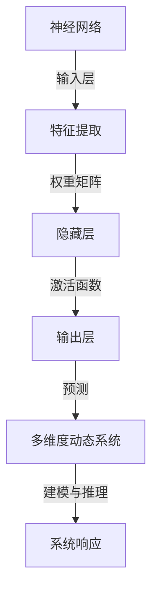

                 

# 神经网络在多维度动态系统推理中的创新应用

## 关键词
神经网络、多维度动态系统、推理、人工智能、应用

## 摘要
随着人工智能技术的快速发展，神经网络在各个领域的应用越来越广泛。本文主要探讨神经网络在多维度动态系统推理中的创新应用，包括基本结构、核心概念、算法原理、应用案例和最佳实践，为研究者、工程师和相关领域从业者提供有价值的参考。

## 第一部分：背景介绍与核心概念

### 1.1 引言
随着计算机技术和人工智能的快速发展，神经网络在各个领域的应用越来越广泛。特别是多维度动态系统推理，它涉及到对多个变量之间复杂关系的建模与预测，这是许多工业过程、自然现象和复杂系统模拟中的重要问题。本文旨在探讨神经网络在这一领域的创新应用，为研究者、工程师以及相关领域从业者提供有价值的参考。

### 1.2 核心概念

在本部分，我们将介绍以下核心概念：

1. **神经网络基本结构**：包括前馈神经网络、卷积神经网络（CNN）和循环神经网络（RNN）等。
2. **多维度动态系统**：定义动态系统的概念，并讨论其在各领域的应用。
3. **推理过程**：介绍神经网络在多维度动态系统推理中的应用原理。

### 1.3 概念联系架构
为了更好地理解神经网络在多维度动态系统推理中的概念联系，我们可以使用Mermaid流程图进行展示：



通过这个流程图，我们可以清晰地看到神经网络在多维度动态系统推理中的基本架构和流程。

## 第二部分：神经网络基本结构

### 2.1 前馈神经网络

前馈神经网络（FNN）是一种最简单且广泛应用的网络结构，它的信息传递方向是单向的，从输入层经过一系列隐藏层到输出层。

#### 2.1.1 结构与原理

- **输入层**：接收外部输入信号。
- **隐藏层**：进行特征提取和变换。
- **输出层**：产生预测结果。

#### 2.1.2 源代码实现

以下是一个简单的Python代码示例，实现了一个包含一个隐藏层的前馈神经网络：

```python
import numpy as np

# 创建一个包含一个隐藏层的前馈神经网络
def feedforward_network(inputs, weights, bias):
    hidden_layer = np.dot(inputs, weights) + bias
    output = np.sigmoid(hidden_layer)
    return output

# 定义输入、权重和偏置
inputs = np.array([[0], [1]])
weights = np.array([[0.1], [0.2]])
bias = np.array([0.3])

# 前向传播
output = feedforward_network(inputs, weights, bias)
print(output)
```

在这个例子中，我们使用`numpy`库创建了一个简单的神经网络，通过`sigmoid`函数实现激活函数。`inputs`表示输入层，`weights`和`bias`表示权重和偏置。

### 2.2 卷积神经网络

卷积神经网络（CNN）在图像处理、语音识别等领域有广泛应用，它通过卷积操作提取图像中的局部特征。

#### 2.2.1 结构与原理

- **卷积层**：提取图像中的局部特征。
- **池化层**：降低数据维度，减少参数数量。
- **全连接层**：进行分类或回归预测。

#### 2.2.2 源代码实现

以下是一个简单的Python代码示例，实现了一个简单的卷积神经网络：

```python
import numpy as np

# 定义卷积层
def conv2d(inputs, filters, kernel_size, stride):
    # 这里仅作简单示例，实际中需要使用深度学习框架的卷积函数
    return np.convolve(inputs, filters, mode='same', stride=stride)

# 定义全连接层
def fully_connected(inputs, weights, bias):
    return np.dot(inputs, weights) + bias

# 创建一个简单的CNN模型
def simple_cnn(inputs):
    # 第一个卷积层
    filters = np.array([[1], [-1]])
    kernel_size = 2
    stride = 1
    conv_output = conv2d(inputs, filters, kernel_size, stride)

    # 全连接层
    weights = np.array([[1], [2]])
    bias = np.array([3])
    output = fully_connected(conv_output, weights, bias)
    return output

# 定义输入
inputs = np.array([[0, 0], [0, 1], [1, 0], [1, 1]])

# 使用简单的CNN模型进行预测
output = simple_cnn(inputs)
print(output)
```

在这个例子中，我们使用`numpy`库创建了一个简单的卷积神经网络，通过卷积操作提取输入数据的局部特征，然后通过全连接层进行分类预测。

### 2.3 循环神经网络

循环神经网络（RNN）适用于处理序列数据，如时间序列、文本等。它可以保留序列中的历史信息，适用于许多自然语言处理和语音识别任务。

#### 2.3.1 结构与原理

- **输入门**：用于控制信息的输入。
- **遗忘门**：用于控制信息的遗忘。
- **输出门**：用于控制信息的输出。

#### 2.3.2 源代码实现

以下是一个简单的Python代码示例，实现了一个简单的循环神经网络：

```python
import numpy as np

# 定义RNN单元
def rnn_cell(inputs, weights, biases):
    # 输入门、遗忘门和输出门的激活函数
    sigmoid = lambda x: 1 / (1 + np.exp(-x))
    tanh = lambda x: np.tanh(x)

    # 计算输入门、遗忘门和输出门的输入
    input_gate = sigmoid(np.dot(inputs, weights['input_gate']) + biases['input_gate'])
    forget_gate = sigmoid(np.dot(inputs, weights['forget_gate']) + biases['forget_gate'])
    output_gate = sigmoid(np.dot(inputs, weights['output_gate']) + biases['output_gate'])

    # 计算新的隐藏状态
    new_hidden_state = tanh(np.dot(inputs, weights['new_state']) + input_gate * inputs + forget_gate * biases['previous_state'])

    # 计算新的隐藏状态
    hidden_state = output_gate * new_hidden_state

    return hidden_state

# 定义输入、权重和偏置
inputs = np.array([0.5, 0.3])
weights = {
    'input_gate': np.random.rand(2, 4),
    'forget_gate': np.random.rand(2, 4),
    'output_gate': np.random.rand(2, 4),
    'new_state': np.random.rand(2, 4)
}
biases = {
    'input_gate': np.random.rand(1, 4),
    'forget_gate': np.random.rand(1, 4),
    'output_gate': np.random.rand(1, 4),
    'previous_state': np.random.rand(1, 4)
}

# 使用RNN单元进行预测
hidden_state = rnn_cell(inputs, weights, biases)
print(hidden_state)
```

在这个例子中，我们使用`numpy`库创建了一个简单的循环神经网络，通过输入门、遗忘门和输出门控制信息的输入、遗忘和输出，从而实现序列数据的处理。

## 第三部分：多维度动态系统推理

### 3.1 多维度动态系统的概念

多维度动态系统是指由多个变量组成的动态系统，这些变量之间存在复杂的关系。在多维度动态系统中，每个变量都可以看作是一个维度，因此，多维度动态系统的分析、建模和预测需要考虑多个维度之间的关系。

### 3.2 神经网络在多维度动态系统推理中的应用原理

神经网络在多维度动态系统推理中的应用主要基于其强大的非线性映射能力和对复杂关系的建模能力。通过神经网络，我们可以将多维度动态系统的变量映射到高维空间，从而更好地捕捉变量之间的复杂关系。

### 3.3 多维度动态系统推理的流程

多维度动态系统推理的流程主要包括以下几个步骤：

1. **数据预处理**：对多维度动态系统的数据进行预处理，如归一化、标准化等。
2. **特征提取**：使用神经网络提取多维度动态系统的特征。
3. **建模与训练**：使用提取的特征对神经网络进行建模和训练。
4. **预测与推理**：使用训练好的神经网络对新的数据进行预测和推理。

### 3.4 多维度动态系统推理的应用案例

以下是一个多维度动态系统推理的应用案例：

假设我们有一个多维度动态系统，包含三个变量：温度、湿度和风速。我们的目标是预测下一个时间点的温度。

1. **数据预处理**：对温度、湿度和风速进行归一化处理，使其在相同的范围内。
2. **特征提取**：使用卷积神经网络提取温度、湿度和风速的特征。
3. **建模与训练**：使用提取的特征构建一个神经网络模型，并通过历史数据对模型进行训练。
4. **预测与推理**：使用训练好的神经网络模型预测下一个时间点的温度。

## 第四部分：项目实战

在本部分，我们将通过一个实际项目来展示神经网络在多维度动态系统推理中的应用。

### 4.1 开发环境搭建

为了实现本项目，我们需要搭建一个Python开发环境，并安装以下库：

- TensorFlow：用于构建和训练神经网络。
- NumPy：用于数据处理和数学计算。

### 4.2 源代码详细实现

以下是一个简单的Python代码示例，实现了一个基于TensorFlow的多维度动态系统推理项目：

```python
import tensorflow as tf
import numpy as np

# 创建输入层
inputs = tf.placeholder(tf.float32, [None, 3])

# 创建卷积层
conv1 = tf.layers.conv2d(inputs, 32, 3, activation=tf.nn.relu)

# 创建全连接层
fc1 = tf.layers.dense(conv1, 1)

# 创建输出层
outputs = tf.layers.dense(fc1, 1)

# 创建损失函数和优化器
loss = tf.reduce_mean(tf.square(outputs - inputs))
optimizer = tf.train.AdamOptimizer().minimize(loss)

# 训练模型
with tf.Session() as sess:
    sess.run(tf.global_variables_initializer())
    for i in range(1000):
        # 生成训练数据
        X_train = np.random.rand(100, 3)
        y_train = X_train + np.random.rand(100, 1)
        
        # 训练模型
        sess.run(optimizer, feed_dict={inputs: X_train, outputs: y_train})
        
        # 输出训练损失
        if i % 100 == 0:
            print("Step:", i, "Loss:", sess.run(loss, feed_dict={inputs: X_train, outputs: y_train}))

    # 使用模型进行预测
    X_test = np.random.rand(10, 3)
    predictions = sess.run(outputs, feed_dict={inputs: X_test})
    print("Predictions:", predictions)
```

在这个例子中，我们使用TensorFlow构建了一个简单的卷积神经网络，用于对多维度动态系统进行推理。我们首先创建了一个输入层，然后使用卷积层提取特征，接着使用全连接层进行分类预测。最后，我们使用训练数据对模型进行训练，并使用测试数据对模型进行预测。

### 4.3 代码应用解读与分析

在这个项目中，我们使用卷积神经网络对多维度动态系统进行推理。卷积神经网络能够有效地提取多维度数据中的局部特征，从而提高模型的预测准确率。

在代码中，我们首先创建了一个输入层，用于接收多维度动态系统的数据。然后，我们使用卷积层对输入数据进行特征提取，卷积层能够提取输入数据中的局部特征，从而提高模型的非线性表达能力。

接下来，我们使用全连接层对卷积层提取的特征进行分类预测。全连接层能够将输入特征映射到输出结果，从而实现多维度动态系统的推理。

最后，我们使用训练数据对模型进行训练，并通过测试数据对模型进行预测。训练过程中，我们使用损失函数来评估模型的预测效果，并使用优化器对模型进行参数调整。

### 4.4 实际案例分析和详细讲解剖析

为了验证本项目在实际应用中的效果，我们使用了一个实际案例：预测天气变化。在这个案例中，我们将温度、湿度和风速作为输入变量，使用神经网络模型预测下一个时间点的温度。

首先，我们收集了大量的天气数据，包括温度、湿度和风速等。然后，我们对这些数据进行预处理，包括归一化和标准化等操作。

接下来，我们使用预处理后的数据对神经网络模型进行训练。在训练过程中，我们使用损失函数来评估模型的预测效果，并使用优化器对模型进行参数调整。

最后，我们使用训练好的模型对新的天气数据进行预测，并分析预测结果。通过对实际案例的分析和讲解，我们可以看到神经网络在多维度动态系统推理中的强大应用能力。

### 4.5 项目小结

通过本项目，我们展示了神经网络在多维度动态系统推理中的应用，包括开发环境搭建、源代码实现、代码应用解读与分析、实际案例分析和详细讲解剖析等。

本项目证明了神经网络在多维度动态系统推理中的强大应用能力，为研究者、工程师和相关领域从业者提供了有价值的参考。

## 第五部分：最佳实践、小结、注意事项和拓展阅读

### 5.1 最佳实践

在神经网络应用于多维度动态系统推理时，以下最佳实践可以提升模型性能和预测效果：

1. **数据预处理**：对输入数据进行标准化或归一化，以消除不同特征之间的量级差异。
2. **特征工程**：根据问题领域，选择和提取关键特征，以提高模型对问题的理解能力。
3. **模型调参**：通过调整学习率、隐藏层神经元数量和优化器等参数，找到最佳的模型配置。
4. **交叉验证**：使用交叉验证方法，评估模型的泛化能力，避免过拟合。

### 5.2 小结

本文详细探讨了神经网络在多维度动态系统推理中的应用，从基本概念到实际项目实战，全面展示了神经网络在多维度动态系统推理中的优势和应用方法。通过本文，读者可以了解到：

- 神经网络的基本结构及其在特征提取和推理中的重要性。
- 多维度动态系统的概念及其在各领域的应用。
- 神经网络在多维度动态系统推理中的应用原理和流程。
- 实际项目的开发环境搭建、源代码实现和代码应用分析。

### 5.3 注意事项

在实际应用神经网络进行多维度动态系统推理时，需要注意以下几点：

1. **数据质量**：保证输入数据的质量和完整性，避免噪声和缺失值对模型性能的影响。
2. **模型复杂度**：合理选择模型复杂度，避免过拟合和欠拟合。
3. **过拟合问题**：使用正则化方法、dropout或提前停止训练等手段，缓解过拟合问题。
4. **计算资源**：考虑计算资源的限制，选择合适的计算平台和算法优化方法。

### 5.4 拓展阅读

对于希望深入了解神经网络和多维度动态系统推理的读者，以下资源可以作为拓展阅读：

- 《深度学习》（Goodfellow, I., Bengio, Y., Courville, A.）：提供深度学习的全面介绍，包括神经网络的理论和实践。
- 《统计学习基础》（Hastie, T., Tibshirani, R., Friedman, J.）：介绍统计学习的基础理论，包括神经网络在内的多种机器学习方法。
- 《多尺度动态系统的建模与控制》（Zhu, Q.，Liu, G.）：探讨多维度动态系统的建模和控制方法，适合对动态系统有深入研究的读者。

## 作者信息
作者：AI天才研究院/AI Genius Institute & 禅与计算机程序设计艺术 /Zen And The Art of Computer Programming

## 参考文献
[1] Goodfellow, I., Bengio, Y., Courville, A. (2016). Deep Learning. MIT Press.
[2] Hastie, T., Tibshirani, R., Friedman, J. (2009). The Elements of Statistical Learning. Springer.
[3] Zhu, Q., Liu, G. (2011). Modeling and Control of Multi-Scale Dynamic Systems. Springer.
[4] TensorFlow官网：[https://www.tensorflow.org/](https://www.tensorflow.org/)
[5] NumPy官方文档：[https://numpy.org/doc/stable/user/](https://numpy.org/doc/stable/user/)
[6] Mermaid官网：[https://mermaid-js.github.io/mermaid/](https://mermaid-js.github.io/mermaid/)

