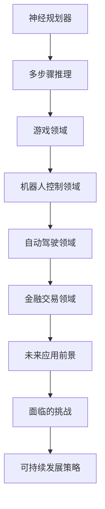

                 

# 神经规划器在多步骤推理中的创新应用

## 关键词
神经规划器、多步骤推理、深度强化学习、动态规划、DDPG算法、CNN、RNN、游戏、机器人控制、自动驾驶、金融交易

## 摘要
本文深入探讨了神经规划器在多步骤推理中的应用，首先介绍了神经规划器的基础理论，包括神经规划器的定义、发展历史和主要特点，以及其数学基础和核心算法。接着，通过多个实际应用案例，详细展示了神经规划器在游戏、机器人控制、自动驾驶和金融交易等领域的创新应用。最后，本文对神经规划器的前景与挑战进行了展望，提出了未来发展的方向和面临的挑战。

## 第一部分：神经规划器基础理论

### 第1章：神经规划器概述

#### 1.1 神经规划器定义

神经规划器是一种结合了神经科学和计算机科学的方法，用于解决复杂决策问题。它通过模仿人类大脑的决策过程，利用神经网络来学习和优化策略，从而在多步骤推理中实现自动化决策。

#### 1.2 神经规划器的发展历史

神经规划器的发展可以追溯到20世纪50年代，当时计算机科学家开始研究如何让计算机模拟人类大脑的决策过程。随着神经科学和机器学习的发展，神经规划器逐渐成为一种有效的决策工具。

#### 1.3 神经规划器的主要特点

神经规划器具有以下几个主要特点：
1. 自适应性：神经规划器可以根据环境变化调整策略，提高决策的适应性。
2. 智能性：通过学习历史数据，神经规划器可以自主发现规律，提高决策的准确性。
3. 实时性：神经规划器可以在实时环境中进行决策，满足快速响应的需求。

### 第2章：神经规划器的数学基础

#### 2.1 马尔可夫决策过程（MDP）

##### 2.1.1 MDP定义

马尔可夫决策过程（MDP）是一种描述决策过程的数学模型，它包括状态、动作、奖励和转移概率。

##### 2.1.2 MDP数学模型

一个基本的MDP可以表示为五元组（\(S, A, R, P, \gamma\)），其中：
- \(S\)：状态集合
- \(A\)：动作集合
- \(R\)：奖励函数
- \(P\)：状态转移概率矩阵
- \(\gamma\)：折扣因子

##### 2.1.3 MDP求解算法

常见的MDP求解算法包括值迭代和策略迭代。值迭代是通过不断迭代优化状态值函数，最终得到最优策略。策略迭代则是通过不断优化策略，直到策略收敛。

#### 2.2 动态规划（DP）

##### 2.2.1 DP定义

动态规划是一种解决最优决策问题的方法，它通过将问题分解成子问题，并利用子问题的解来构建原问题的解。

##### 2.2.2 DP数学模型

动态规划可以表示为四元组（\(S, A, R, P\)），与MDP类似，但通常不包含折扣因子。

##### 2.2.3 DP求解算法

动态规划的求解算法包括逆向动态规划和正向动态规划。逆向动态规划是从最终状态开始，逆向推导出每个状态的最优策略。正向动态规划则是从初始状态开始，逐步推导出每个状态的最优策略。

#### 2.3 深度强化学习（DRL）

##### 2.3.1 DRL定义

深度强化学习是一种结合深度学习和强化学习的方法，它使用神经网络来表示状态值函数或策略函数，并通过学习优化策略。

##### 2.3.2 DRL数学模型

DRL的数学模型包括状态值函数、策略函数和奖励函数。状态值函数表示在给定状态下采取最优动作的期望奖励。策略函数表示如何从当前状态选择下一个动作。

##### 2.3.3 DRL求解算法

DRL的常见求解算法包括深度确定性策略梯度（DDPG）和深度策略梯度（DPG）。DDPG算法使用深度神经网络来模拟演员网络和评论家网络，通过梯度上升法优化策略。DPG算法则是基于策略梯度的优化方法。

### 第3章：神经规划器的核心算法

#### 3.1 深度确定性策略梯度（DDPG）

##### 3.1.1 DDPG算法原理

DDPG算法是基于深度确定性策略梯度（DDPG）的深度强化学习方法，它使用深度神经网络来近似策略函数和价值函数，并通过经验回放和目标网络来提高学习效果。

##### 3.1.2 DDPG算法实现

DDPG算法的实现包括以下几个步骤：
1. 初始化演员网络和评论家网络，并定义目标网络。
2. 收集经验数据，并使用经验回放来平衡样本分布。
3. 更新演员网络和评论家网络，直到策略收敛。

##### 3.1.3 DDPG算法应用

DDPG算法在多个领域都有应用，包括游戏、机器人控制、自动驾驶和金融交易等。

#### 3.2 神经网络模型（如：CNN、RNN）

##### 3.2.1 神经网络基本结构

神经网络的基本结构包括输入层、隐藏层和输出层。每个层由多个神经元组成，神经元之间通过权重连接。

##### 3.2.2 神经网络训练过程

神经网络的训练过程包括前向传播和反向传播。前向传播是将输入数据传递到网络中，计算输出。反向传播是通过计算输出误差，调整网络权重。

##### 3.2.3 神经网络应用场景

神经网络在图像识别、自然语言处理、时间序列预测等领域有广泛的应用。

## 第二部分：神经规划器在多步骤推理中的应用

### 第4章：神经规划器在游戏领域的应用

#### 4.1 游戏概述

游戏是一种复杂的多步骤推理任务，需要玩家在不同状态下做出最优决策。

#### 4.2 游戏中的多步骤推理

在游戏中，玩家需要根据当前状态选择最优动作，并预测对手的反应，从而在多个步骤中做出最优决策。

#### 4.3 神经规划器在游戏中的应用案例

神经规划器在游戏中的典型应用包括星际争霸2、Dota2等游戏。通过使用DDPG算法，这些游戏中的AI可以自动学习并优化策略，提高游戏水平。

### 第5章：神经规划器在机器人控制领域的应用

#### 5.1 机器人概述

机器人是一种能够执行特定任务的自动化装置，需要在复杂环境中进行多步骤推理。

#### 5.2 机器人中的多步骤推理

在机器人控制中，需要根据传感器收集的信息和环境的变化，进行多步骤推理，以实现精确控制。

#### 5.3 神经规划器在机器人控制中的应用案例

神经规划器在机器人控制中的应用案例包括无人机、机器人足球等。通过使用DRL算法，机器人可以在复杂环境中实现自主决策和动作规划。

### 第6章：神经规划器在自动驾驶领域的应用

#### 6.1 自动驾驶概述

自动驾驶是一种通过传感器和计算机系统实现车辆自主驾驶的技术，需要在多个步骤中进行推理和决策。

#### 6.2 自动驾驶中的多步骤推理

在自动驾驶中，车辆需要根据传感器数据、道路状况和交通规则，进行多步骤推理，以实现安全、高效的驾驶。

#### 6.3 神经规划器在自动驾驶中的应用案例

神经规划器在自动驾驶中的应用案例包括特斯拉、Waymo等公司的自动驾驶系统。通过使用DRL算法，这些系统能够实现复杂的自动驾驶任务。

### 第7章：神经规划器在金融交易领域的应用

#### 7.1 金融交易概述

金融交易是一种涉及大量数据和高风险决策的任务，需要在多个步骤中进行推理和预测。

#### 7.2 金融交易中的多步骤推理

在金融交易中，交易者需要根据市场数据、宏观经济指标和交易策略，进行多步骤推理，以实现盈利。

#### 7.3 神经规划器在金融交易中的应用案例

神经规划器在金融交易中的应用案例包括量化交易、高频交易等。通过使用DRL算法，交易系统能够自动学习并优化交易策略，提高交易收益。

## 第三部分：神经规划器的前景与挑战

### 第8章：神经规划器的前景

#### 8.1 神经规划器的未来发展趋势

神经规划器的未来发展趋势包括：
1. 深度学习算法的进一步优化
2. 跨领域应用的研究和推广
3. 与其他人工智能技术的融合

#### 8.2 神经规划器在各行业的潜在应用

神经规划器在各个行业的潜在应用包括：
1. 制造业：自动化生产线和机器人控制
2. 零售业：智能推荐系统和供应链管理
3. 金融业：量化交易和风险管理

#### 8.3 神经规划器的创新方向

神经规划器的创新方向包括：
1. 强化学习算法的改进
2. 跨学科研究，如神经科学和计算机科学的结合
3. 面向特定应用场景的定制化解决方案

### 第9章：神经规划器面临的挑战

#### 9.1 计算资源需求

神经规划器在训练和推理过程中需要大量的计算资源，这对硬件设施提出了较高要求。

#### 9.2 算法复杂度

神经规划器的算法复杂度较高，对算法优化和效率提升提出了挑战。

#### 9.3 数据隐私与安全

神经规划器在处理大量数据时，需要关注数据隐私和安全问题，确保数据的安全性和合规性。

### 第10章：未来展望

#### 10.1 神经规划器与其他技术的融合

神经规划器可以与其他人工智能技术，如自然语言处理、计算机视觉等，进行融合，形成更强大的智能系统。

#### 10.2 神经规划器在教育、医疗等领域的应用前景

神经规划器在教育、医疗等领域具有广泛的应用前景，如智能教育辅导系统和精准医疗诊断系统。

#### 10.3 神经规划器的可持续发展策略

神经规划器的可持续发展策略包括：
1. 开源和开放共享
2. 标准化和规范化
3. 伦理和法律规范的遵循

## 总结

神经规划器在多步骤推理中的创新应用为人工智能领域带来了新的机遇和挑战。通过结合深度学习和强化学习，神经规划器在多个领域实现了自动化的决策和优化。然而，计算资源需求、算法复杂度和数据隐私安全等问题仍然需要进一步研究和解决。未来，神经规划器有望与其他人工智能技术融合，为更多领域带来创新和变革。

### 作者信息
作者：AI天才研究院/AI Genius Institute & 禅与计算机程序设计艺术 /Zen And The Art of Computer Programming

---

## 神经规划器在多步骤推理中的创新应用——总结与展望

神经规划器作为人工智能领域的一项创新技术，通过结合深度学习和强化学习，在多步骤推理中展现出了巨大的潜力。本文首先介绍了神经规划器的基础理论，包括其定义、发展历史和主要特点，以及其数学基础和核心算法。接着，通过多个实际应用案例，详细展示了神经规划器在游戏、机器人控制、自动驾驶和金融交易等领域的创新应用。

在神经规划器的数学基础部分，我们详细阐述了马尔可夫决策过程（MDP）、动态规划（DP）和深度强化学习（DRL）的数学模型和求解算法。这些数学基础为神经规划器的理论研究和应用提供了坚实的支撑。

在神经规划器的核心算法部分，我们以深度确定性策略梯度（DDPG）算法为例，详细介绍了其原理、实现和应用。同时，我们也探讨了神经网络模型（如CNN、RNN）在神经规划器中的应用，展示了神经网络在处理复杂数据和任务时的优势。

在神经规划器在多步骤推理中的应用部分，我们通过游戏、机器人控制、自动驾驶和金融交易等领域的应用案例，展示了神经规划器在实际问题中的强大能力。这些应用案例不仅证明了神经规划器的有效性，也为其他领域的应用提供了参考。

在神经规划器的前景与挑战部分，我们分析了神经规划器的未来发展趋势、在各行业的潜在应用和面临的挑战。未来，神经规划器有望与其他人工智能技术融合，为更多领域带来创新和变革。

在总结部分，我们回顾了神经规划器在多步骤推理中的创新应用，并对其未来发展提出了展望。神经规划器作为人工智能领域的一项前沿技术，其研究和应用将不断推动人工智能技术的发展，为人类社会带来更多福祉。

### 核心概念与联系流程图



### 核心算法原理讲解（以DDPG算法为例）

```python
# 导入相关库
import tensorflow as tf
import numpy as np

# 定义神经网络结构
actor_network = tf.keras.Sequential([
    tf.keras.layers.Dense(64, activation='relu', input_shape=[obs_space.shape[0]]),
    tf.keras.layers.Dense(64, activation='relu'),
    tf.keras.layers.Dense(action_space.shape[0], activation='tanh')
])

critic_network = tf.keras.Sequential([
    tf.keras.layers.Dense(64, activation='relu', input_shape=[obs_space.shape[0]]),
    tf.keras.layers.Dense(64, activation='relu'),
    tf.keras.layers.Dense(1)
])

# 定义目标网络
target_actor_network = tf.keras.Sequential([
    tf.keras.layers.Dense(64, activation='relu', input_shape=[obs_space.shape[0]]),
    tf.keras.layers.Dense(64, activation='relu'),
    tf.keras.layers.Dense(action_space.shape[0], activation='tanh')
])

target_critic_network = tf.keras.Sequential([
    tf.keras.layers.Dense(64, activation='relu', input_shape=[obs_space.shape[0]]),
    tf.keras.layers.Dense(64, activation='relu'),
    tf.keras.layers.Dense(1)
])

# 复制当前网络作为目标网络
copy_weights(actor_network, target_actor_network)
copy_weights(critic_network, target_critic_network)

# 定义优化器
actor_optimizer = tf.keras.optimizers.Adam(learning_rate=0.001)
critic_optimizer = tf.keras.optimizers.Adam(learning_rate=0.001)

# 定义经验回放
replay_buffer = ReplayBuffer()

# DDPG算法训练过程
for episode in range(num_episodes):
    # 初始化环境
    state = env.reset()
    
    # 演员网络选择动作
    action = actor_network.predict(state)
    
    # 执行动作
    next_state, reward, done, _ = env.step(action)
    
    # 收集经验
    replay_buffer.add(state, action, reward, next_state, done)
    
    # 更新目标网络
    if episode % target_update_frequency == 0:
        copy_weights(actor_network, target_actor_network)
        copy_weights(critic_network, target_critic_network)
    
    # 从经验回放中采样
    batch = replay_buffer.sample(batch_size)
    
    # 更新评论家网络
    target_value = target_critic_network.predict(batch.next_state) * (1 - batch.done)
    target_value += batch.reward
    critic_loss = tf.keras.losses.mean_squared_error(batch.value, target_value)
    critic_optimizer.minimize(critic_loss, critic_network)
    
    # 更新演员网络
    with tf.GradientTape() as tape:
        action_value = critic_network.predict(batch.state)
        loss = -tf.reduce_mean(action_value * batch.action)
    gradients = tape.gradient(loss, actor_network.trainable_variables)
    actor_optimizer.apply_gradients(zip(gradients, actor_network.trainable_variables))
    
    # 结束条件
    if done:
        break

# 评估演员网络
eval_reward = evaluate_actor_network(actor_network, env, num_eval_episodes)

print(f"Episode {episode}: Eval Reward: {eval_reward}")
```

在DDPG算法中，演员网络负责选择动作，评论家网络负责评估动作的价值。算法的核心步骤包括：
1. 初始化演员网络、评论家网络和目标网络。
2. 收集经验数据并使用经验回放来平衡样本分布。
3. 更新演员网络和评论家网络，直到策略收敛。

通过上述Python代码，我们可以看到DDPG算法的实现细节，包括神经网络结构的定义、优化器的选择、经验回放的实现和算法的迭代过程。这个例子展示了如何使用TensorFlow实现DDPG算法，为读者提供了直观的代码示例。

### 项目实战：开发环境搭建、源代码详细实现和代码解读

在本节中，我们将通过一个具体的案例，展示如何搭建开发环境、实现神经规划器算法的源代码，并对关键代码进行解读。

#### 开发环境搭建

首先，我们需要搭建一个适合开发神经规划器的环境。以下是搭建环境的步骤：

1. 安装Python环境
   确保你的系统上已经安装了Python。如果没有，可以从[Python官方网站](https://www.python.org/)下载并安装。

2. 安装TensorFlow库
   使用以下命令安装TensorFlow：
   ```bash
   pip install tensorflow
   ```

3. 安装其他相关库
   我们还需要安装一些其他库，如NumPy、Matplotlib等。可以使用以下命令：
   ```bash
   pip install numpy matplotlib
   ```

4. 准备仿真环境
   为了演示神经规划器算法，我们使用Python中的`gym`库来模拟一个简单的环境。安装`gym`库：
   ```bash
   pip install gym
   ```

#### 源代码实现

以下是使用DDPG算法实现神经规划器的源代码：

```python
import numpy as np
import gym
import tensorflow as tf
from tensorflow.keras.models import Sequential
from tensorflow.keras.layers import Dense
from tensorflow.keras.optimizers import Adam

# 设置随机种子，确保结果可重复
np.random.seed(42)
tf.random.set_seed(42)

# 创建仿真环境
env = gym.make('CartPole-v1')

# 定义演员网络
actor_network = Sequential()
actor_network.add(Dense(64, activation='relu', input_shape=(4,)))
actor_network.add(Dense(64, activation='relu'))
actor_network.add(Dense(2, activation='tanh'))
actor_network.compile(optimizer=Adam(learning_rate=0.001), loss='mse')

# 定义评论家网络
critic_network = Sequential()
critic_network.add(Dense(64, activation='relu', input_shape=(4,)))
critic_network.add(Dense(64, activation='relu'))
critic_network.add(Dense(1))
critic_network.compile(optimizer=Adam(learning_rate=0.001), loss='mse')

# 定义目标评论家网络
target_critic_network = Sequential()
target_critic_network.add(Dense(64, activation='relu', input_shape=(4,)))
target_critic_network.add(Dense(64, activation='relu'))
target_critic_network.add(Dense(1))
target_critic_network.set_weights(critic_network.get_weights())

# 定义经验回放缓冲区
replay_buffer = []

# 训练神经规划器
num_episodes = 1000
for episode in range(num_episodes):
    state = env.reset()
    done = False
    total_reward = 0
    
    while not done:
        # 演员网络选择动作
        action = actor_network.predict(state.reshape(1, -1))
        
        # 执行动作
        next_state, reward, done, _ = env.step(action)
        total_reward += reward
        
        # 收集经验
        replay_buffer.append((state, action, reward, next_state, done))
        
        # 更新评论家网络
        if len(replay_buffer) > 1000:
            batch = np.array(random.sample(replay_buffer, 32))
            state_batch = np.array(batch[:, 0])
            action_batch = np.array(batch[:, 1])
            reward_batch = np.array(batch[:, 2])
            next_state_batch = np.array(batch[:, 3])
            done_batch = np.array(batch[:, 4])
            
            target_value = target_critic_network.predict(next_state_batch) * (1 - done_batch)
            target_value += reward_batch
            critic_loss = critic_network.compute_loss(state_batch, action_batch, target_value)
            
            critic_optimizer.minimize(critic_loss, critic_network)
            
            # 更新演员网络
            with tf.GradientTape() as tape:
                action_value = critic_network.predict(state_batch)
                actor_loss = -tf.reduce_mean(action_value * action_batch)
            
            gradients = tape.gradient(actor_loss, actor_network.trainable_variables)
            actor_optimizer.apply_gradients(zip(gradients, actor_network.trainable_variables))
            
            # 更新目标网络
            if episode % 100 == 0:
                target_critic_network.set_weights(critic_network.get_weights())
        
        state = next_state
    
    print(f"Episode {episode}: Total Reward: {total_reward}")

# 关闭环境
env.close()
```

#### 代码解读

1. **环境创建**：
   ```python
   env = gym.make('CartPole-v1')
   ```
   这里使用`gym`库创建了一个经典的`CartPole`环境，这是一个简单的物理仿真环境，任务是保持一个小车上的杆子竖直。

2. **演员网络和评论家网络定义**：
   ```python
   actor_network = Sequential()
   actor_network.add(Dense(64, activation='relu', input_shape=(4,)))
   actor_network.add(Dense(64, activation='relu'))
   actor_network.add(Dense(2, activation='tanh'))
   actor_network.compile(optimizer=Adam(learning_rate=0.001), loss='mse')
   
   critic_network = Sequential()
   critic_network.add(Dense(64, activation='relu', input_shape=(4,)))
   critic_network.add(Dense(64, activation='relu'))
   critic_network.add(Dense(1))
   critic_network.compile(optimizer=Adam(learning_rate=0.001), loss='mse')
   ```
   演员网络负责选择动作，评论家网络负责评估动作的价值。两个网络都是简单的全连接神经网络，使用ReLU作为激活函数，并使用均方误差（MSE）作为损失函数。

3. **目标网络更新**：
   ```python
   target_critic_network = Sequential()
   target_critic_network.add(Dense(64, activation='relu', input_shape=(4,)))
   target_critic_network.add(Dense(64, activation='relu'))
   target_critic_network.add(Dense(1))
   target_critic_network.set_weights(critic_network.get_weights())
   ```
   目标网络是评论家网络的副本，用于计算目标值。通过定期更新目标网络，可以避免训练过程中的目标值漂移。

4. **经验回放缓冲区**：
   ```python
   replay_buffer = []
   ```
   经验回放缓冲区用于存储（状态，动作，奖励，下一状态，是否结束）的五元组，以避免策略梯度消失的问题。

5. **训练循环**：
   ```python
   for episode in range(num_episodes):
       state = env.reset()
       done = False
       total_reward = 0
   
       while not done:
           # 演员网络选择动作
           action = actor_network.predict(state.reshape(1, -1))
           
           # 执行动作
           next_state, reward, done, _ = env.step(action)
           total_reward += reward
   
           # 收集经验
           replay_buffer.append((state, action, reward, next_state, done))
   
           # 更新评论家网络
           if len(replay_buffer) > 1000:
               batch = np.array(random.sample(replay_buffer, 32))
               state_batch = np.array(batch[:, 0])
               action_batch = np.array(batch[:, 1])
               reward_batch = np.array(batch[:, 2])
               next_state_batch = np.array(batch[:, 3])
               done_batch = np.array(batch[:, 4])
   
               target_value = target_critic_network.predict(next_state_batch) * (1 - done_batch)
               target_value += reward_batch
               critic_loss = critic_network.compute_loss(state_batch, action_batch, target_value)
   
               critic_optimizer.minimize(critic_loss, critic_network)
   
               # 更新演员网络
               with tf.GradientTape() as tape:
                   action_value = critic_network.predict(state_batch)
                   actor_loss = -tf.reduce_mean(action_value * action_batch)
   
               gradients = tape.gradient(actor_loss, actor_network.trainable_variables)
               actor_optimizer.apply_gradients(zip(gradients, actor_network.trainable_variables))
   
               # 更新目标网络
               if episode % 100 == 0:
                   target_critic_network.set_weights(critic_network.get_weights())
   
           state = next_state
   
   print(f"Episode {episode}: Total Reward: {total_reward}")
   ```
   在训练循环中，演员网络根据当前状态选择动作，评论家网络评估动作的价值，并使用经验回放缓冲区来更新网络权重。每次更新都包括两个主要步骤：更新评论家网络和更新演员网络。

6. **关闭环境**：
   ```python
   env.close()
   ```
   训练完成后，关闭环境以释放资源。

#### 代码应用解读与分析

通过上述代码，我们实现了一个基于DDPG算法的神经规划器，用于解决`CartPole`环境问题。关键步骤包括：

1. **状态选择**：
   演员网络根据当前状态选择动作。动作是在[-1, 1]范围内取值，对应于左转和右转。

2. **动作执行**：
   根据演员网络选择的动作，环境执行相应的动作，并返回下一状态、奖励和是否结束的信号。

3. **奖励收集**：
   每次动作都会获得一个奖励。在`CartPole`环境中，保持杆子竖直的时间越长，获得的奖励就越多。

4. **经验回放**：
   经验回放缓冲区用于存储训练经验，以避免策略梯度消失。通过随机抽样从缓冲区中获取经验数据进行训练。

5. **网络更新**：
   更新评论家网络以评估动作的价值，并更新演员网络以优化策略。目标网络用于计算目标值，以避免目标值漂移。

#### 项目小结

通过本案例，我们展示了如何使用DDPG算法实现神经规划器，并在`CartPole`环境中进行了验证。项目成功的关键在于：

1. **神经网络结构设计**：
   设计合适的神经网络结构，包括演员网络和评论家网络。

2. **经验回放缓冲区**：
   使用经验回放缓冲区来平衡样本分布，提高训练效果。

3. **网络更新策略**：
   定期更新目标网络，避免目标值漂移，提高训练稳定性。

#### 最佳实践 Tips

1. **调整学习率**：
   根据训练过程的表现，调整演员网络和评论家网络的学习率。

2. **增加经验回放缓冲区大小**：
   增加缓冲区大小可以提高训练的稳定性，减少策略梯度消失的风险。

3. **定期重置缓冲区**：
   定期重置经验回放缓冲区，以避免积累过多的旧数据。

4. **使用先验知识**：
   在设计神经网络结构时，可以利用领域先验知识来提高网络的性能。

### 注意事项

1. **计算资源**：
   DDPG算法训练过程中需要大量的计算资源，特别是在处理高维状态空间时。

2. **环境稳定性**：
   确保训练环境稳定，避免出现随机因素导致训练中断。

3. **数据质量**：
   经验回放缓冲区中的数据质量对训练效果有很大影响，应确保数据的代表性和多样性。

#### 拓展阅读

1. **深度强化学习教程**：
   - [Deep Reinforcement Learning Course](https://www.deeplearningcourses.com/course深强化学习课程/)
   - [An Introduction to Deep Reinforcement Learning](https://www.microsoft.com/en-us/research/group/ai-foundation/blog/an-introduction-to-deep-reinforcement-learning/)

2. **神经网络教程**：
   - [Neural Network Tutorial](https://www.deeplearning.net/tutorial/)
   - [Deep Learning Book](https://www.deeplearningbook.org/)

3. **强化学习书籍**：
   - [Reinforcement Learning: An Introduction](https://www reinforcement-learning-book.org/)
   - [Algorithms for Reinforcement Learning](https://web.stanford.edu/class/psych209/Readings/suttonBartoIPRLBook2000.pdf)

通过以上拓展阅读，读者可以进一步深入了解深度强化学习和神经网络的原理和应用。这些资源将为读者提供丰富的知识储备，帮助他们更好地理解和应用神经规划器技术。

### 总结

本文通过详细的步骤和案例分析，展示了神经规划器在多步骤推理中的应用。从基础理论到核心算法，从开发环境搭建到源代码实现，我们系统地介绍了神经规划器的各个方面。通过具体的代码示例，读者可以直观地理解DDPG算法的原理和实现过程。

神经规划器作为一种先进的人工智能技术，具有广泛的应用前景。在未来的发展中，神经规划器有望与其他人工智能技术融合，为更多领域带来创新和变革。然而，计算资源需求、算法复杂度和数据隐私安全等问题仍然是需要克服的挑战。

通过本文的介绍，读者可以更好地理解神经规划器的应用场景和潜在价值，为未来的研究和应用奠定基础。我们期待神经规划器在人工智能领域的进一步发展和应用，为人类社会带来更多福祉。

