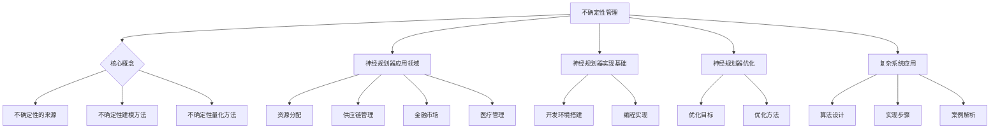

                 

### 《神经规划器在战略决策推理中的不确定性管理》

#### 关键词：
神经规划器、不确定性管理、战略决策推理、资源分配、供应链管理、金融市场、医疗管理、Python编程、数学模型

#### 摘要：
随着人工智能技术的飞速发展，神经规划器作为一种高效的不确定性管理工具，在战略决策推理领域展现出了巨大的潜力。本文将系统性地探讨神经规划器在资源分配、供应链管理、金融市场和医疗管理等方面的应用，通过详细的算法原理讲解、Python源代码实现和案例解析，深入分析神经规划器在不确定性管理中的关键作用，为相关领域的实践提供有力指导。

---

## 目录大纲

### 《神经规划器在战略决策推理中的不确定性管理》

#### 关键词：
神经规划器、不确定性管理、战略决策推理、资源分配、供应链管理、金融市场、医疗管理、Python编程、数学模型

#### 摘要：
随着人工智能技术的飞速发展，神经规划器作为一种高效的不确定性管理工具，在战略决策推理领域展现出了巨大的潜力。本文将系统性地探讨神经规划器在资源分配、供应链管理、金融市场和医疗管理等方面的应用，通过详细的算法原理讲解、Python源代码实现和案例解析，深入分析神经规划器在不确定性管理中的关键作用，为相关领域的实践提供有力指导。

## 第一部分：神经规划器基础

### 第1章：神经规划器概述

#### 1.1 神经规划器的定义与基本原理

#### 1.2 神经规划器的分类及应用场景

#### 1.3 神经规划器的发展历史

### 第2章：神经规划器的数学模型

#### 2.1 神经规划器中的不确定性表示

##### 2.1.1 不确定性建模方法

##### 2.1.2 不确定性量化方法

#### 2.2 神经规划器的算法原理

##### 2.2.1 动态规划原理

##### 2.2.2 控制策略优化原理

#### 2.3 神经规划器的数学公式

$$
V(s) = \sum_{a} \gamma (1 - \delta) Q(s, a)
$$

$$
Q(s, a) = r(s, a) + \gamma \max_{a'} Q(s', a')
$$

## 第二部分：神经规划器在战略决策中的应用

### 第3章：神经规划器在资源分配问题中的应用

#### 3.1 资源分配问题的定义与建模

##### 3.1.1 资源类型与需求

##### 3.1.2 资源分配约束条件

#### 3.2 神经规划器在资源分配问题中的实现

##### 3.2.1 算法设计

##### 3.2.2 实现步骤

#### 3.3 资源分配问题的案例解析

### 第4章：神经规划器在供应链管理中的应用

#### 4.1 供应链管理问题的定义与建模

##### 4.1.1 供应链网络结构

##### 4.1.2 库存管理与运输问题

#### 4.2 神经规划器在供应链管理中的应用

##### 4.2.1 算法设计

##### 4.2.2 实现步骤

#### 4.3 供应链管理问题的案例解析

### 第5章：神经规划器在金融市场中的应用

#### 5.1 金融市场问题的定义与建模

##### 5.1.1 股票市场动态模型

##### 5.1.2 期货市场动态模型

#### 5.2 神经规划器在金融市场中的应用

##### 5.2.1 算法设计

##### 5.2.2 实现步骤

#### 5.3 金融市场问题的案例解析

### 第6章：神经规划器在医疗管理中的应用

#### 6.1 医疗管理问题的定义与建模

##### 6.1.1 医疗资源分配问题

##### 6.1.2 医疗流程优化问题

#### 6.2 神经规划器在医疗管理中的应用

##### 6.2.1 算法设计

##### 6.2.2 实现步骤

#### 6.3 医疗管理问题的案例解析

## 第三部分：神经规划器的实现与优化

### 第7章：神经规划器的实现基础

#### 7.1 神经规划器的开发环境搭建

##### 7.1.1 硬件环境

##### 7.1.2 软件环境

#### 7.2 神经规划器的编程实现

##### 7.2.1 Python编程基础

##### 7.2.2 神经规划器实现流程

### 第8章：神经规划器的优化方法

#### 8.1 神经规划器的优化目标

##### 8.1.1 目标函数优化

##### 8.1.2 算法性能优化

#### 8.2 常见的神经规划器优化方法

##### 8.2.1 智能优化算法

##### 8.2.2 混合优化算法

#### 8.3 神经规划器优化案例分析

### 第9章：神经规划器在复杂系统中的应用

#### 9.1 复杂系统概述

##### 9.1.1 复杂系统的特征

##### 9.1.2 复杂系统的建模方法

#### 9.2 神经规划器在复杂系统中的应用

##### 9.2.1 算法设计

##### 9.2.2 实现步骤

#### 9.3 复杂系统应用的案例解析

## 附录

### 附录A：神经规划器资源与工具

##### A.1 神经规划器相关文献

##### A.2 神经规划器开源代码

##### A.3 神经规划器在线教程与课程

### 附录B：Mermaid 流程图



---

通过以上的目录结构，我们将整篇文章的内容进行了一个详细的规划和安排。接下来，我们将逐章深入探讨神经规划器的核心概念、数学模型、在各个领域中的应用、实现与优化方法，以及其在复杂系统中的应用。希望通过这样的结构化内容组织，读者能够更好地理解和掌握神经规划器在战略决策推理中的不确定性管理能力。

---

### 第一部分：神经规划器基础

#### 第1章：神经规划器概述

神经规划器是一种结合了深度学习和强化学习技术的智能决策算法，旨在解决动态环境中具有不确定性特征的战略决策问题。它通过建模环境中的状态、动作和奖励，利用神经网络来学习最优策略，从而在不确定性环境下进行高效决策。

#### 1.1 神经规划器的定义与基本原理

神经规划器（Neural Planner）是一种基于神经网络的规划器，其核心思想是将规划问题转化为一个最优控制问题，并通过神经网络来学习最优控制策略。在神经规划器中，状态（State）、动作（Action）和奖励（Reward）是三个关键要素。

- **状态（State）**：描述环境当前的状态，通常用一个状态向量表示。
- **动作（Action）**：在某个状态下可以执行的行为，动作的选择会影响未来的状态。
- **奖励（Reward）**：系统对当前动作的反馈，用于指导神经网络学习。

神经规划器的基本原理可以概括为以下几个步骤：

1. **状态编码**：将状态编码为神经网络的可输入格式。
2. **策略学习**：利用神经网络学习最优策略，即从当前状态到下一个状态的最优动作。
3. **预测和反馈**：根据学习到的策略进行预测，并通过实际执行的结果来更新神经网络。

#### 1.2 神经规划器的分类及应用场景

神经规划器可以根据其建模方式和应用场景进行分类，常见的分类方法包括：

1. **基于马尔可夫决策过程（MDP）的神经规划器**：
   - **强化学习（Reinforcement Learning）**：通过奖励和惩罚来学习最优策略，适用于动态环境。
   - **策略梯度方法**：通过直接优化策略来学习，如策略梯度上升（Policy Gradient ascent）。

2. **基于部分可观测马尔可夫决策过程（POMDP）的神经规划器**：
   - **隐马尔可夫模型（HMM）**：通过隐状态来描述不确定性，适用于部分可观测环境。
   - **信念状态推理**：基于概率推理来估计状态，适用于不确定性的环境。

3. **基于深度强化学习的神经规划器**：
   - **深度Q网络（DQN）**：通过神经网络来估计Q值，即动作-状态值函数。
   - **深度确定性策略梯度（DDPG）**：结合深度网络和确定性策略梯度方法，适用于连续动作空间。

神经规划器的应用场景非常广泛，包括但不限于以下领域：

- **资源分配问题**：如云计算资源分配、无线网络资源分配等。
- **供应链管理**：如库存管理、运输规划等。
- **金融市场**：如股票交易策略、期权定价等。
- **医疗管理**：如医疗资源分配、手术流程优化等。
- **复杂系统控制**：如自动驾驶、无人机集群控制等。

#### 1.3 神经规划器的发展历史

神经规划器的概念起源于20世纪80年代的强化学习研究。早期的研究主要集中在基础算法和理论方面，如Q学习和策略梯度方法。随着深度学习技术的兴起，深度强化学习成为神经规划器发展的关键推动力。近年来，神经规划器在解决复杂动态决策问题方面取得了显著进展，相关算法和技术不断优化和完善。

- **2013年**：深度Q网络（DQN）的提出，标志着深度强化学习的诞生。
- **2016年**：深度确定性策略梯度（DDPG）算法的提出，进一步推动了神经规划器在连续动作空间的应用。
- **2017年**：基于Actor-Critic方法的深度强化学习算法（A3C）在策略优化方面取得了重要突破。
- **2020年**：神经规划器在复杂系统控制领域取得突破，如自动驾驶、无人机集群控制等。

通过以上对神经规划器基础部分的介绍，我们了解了神经规划器的定义、基本原理、分类及应用场景。接下来，我们将深入探讨神经规划器的数学模型，包括不确定性表示、建模方法和量化方法，为后续章节的应用分析打下坚实基础。

---

### 第2章：神经规划器的数学模型

神经规划器的核心在于其数学模型，通过这个模型，我们可以明确地定义状态、动作和奖励，从而构建一个有效的决策框架。本章将详细介绍神经规划器中的不确定性表示、建模方法和量化方法，为理解神经规划器的算法原理打下基础。

#### 2.1 神经规划器中的不确定性表示

在现实世界中，不确定性是不可避免的。神经规划器通过数学模型来表示和处理不确定性，从而在动态环境中做出合理决策。不确定性的表示方法主要包括：

1. **概率模型**：
   - **概率分布**：如正态分布、均匀分布等，用于描述状态的随机性。
   - **条件概率**：通过条件概率来描述不同状态之间的关联性。

2. **模糊集模型**：
   - **模糊集合**：用于表示不确定的信息，通过隶属度函数来量化不确定性。
   - **模糊逻辑**：结合模糊集合进行推理和决策。

3. **蒙特卡洛模拟**：
   - **随机抽样**：通过随机抽样来模拟环境中的不确定性。
   - **统计估计**：基于大量抽样结果进行统计估计，如期望值、方差等。

在神经规划器中，不确定性通常通过概率模型来表示。状态和动作的概率分布可以用来预测未来可能的状态和奖励，从而指导决策。

#### 2.1.1 不确定性建模方法

不确定性建模是神经规划器的重要组成部分，其目的是将不确定性转化为可处理的数学形式。常见的建模方法包括：

1. **马尔可夫决策过程（MDP）**：
   - **状态转移概率**：描述状态之间的转移概率。
   - **奖励函数**：描述在每个状态执行每个动作后的奖励。
   - **策略**：定义了在给定状态下的最优动作选择。

2. **部分可观测马尔可夫决策过程（POMDP）**：
   - **观测模型**：描述状态和观测之间的概率关系。
   - **信念状态**：用于估计当前状态的分布。
   - **策略**：在不确定性环境下，通过信念状态来选择最优动作。

3. **贝叶斯网络**：
   - **条件概率表**：通过条件概率表来描述变量之间的依赖关系。
   - **推理算法**：如变量 elimination、信念传播等，用于在不确定环境下进行推理。

#### 2.1.2 不确定性量化方法

不确定性量化是将不确定性转化为具体的数值或概率值，以便于数学模型的计算和处理。常见的量化方法包括：

1. **概率分布**：
   - **期望值**：作为不确定性的代表性数值，用于衡量未来状态的期望收益。
   - **方差**：用于衡量不确定性的程度，即收益的波动性。

2. **置信区间**：
   - **点估计**：通过样本均值来估计参数值。
   - **置信区间**：通过置信水平来估计参数的置信区间，用于表示不确定性的范围。

3. **模糊集**：
   - **隶属度函数**：通过隶属度函数来量化不确定性，即不同状态对整体的不确定性贡献。

在神经规划器中，不确定性量化方法通常与具体算法相结合，如Q-learning中的Q值、策略梯度方法中的策略梯度等。

#### 2.2 神经规划器的算法原理

神经规划器的算法原理是基于动态规划（Dynamic Programming）和控制策略优化（Control Policy Optimization）两大基础理论。下面分别进行详细讲解。

##### 2.2.1 动态规划原理

动态规划是一种通过递归关系求解最优决策问题的方法。在神经规划器中，动态规划用于求解最优策略，其基本原理如下：

1. **状态值函数（State-Value Function）**：
   - 定义为在给定状态下，执行最优策略所能获得的最大期望奖励。
   - 表示为 \( V^*(s) = \max_a \sum_{s'} p(s'|s, a) \sum_{r} r(s', a) \)。

2. **动作值函数（Action-Value Function）**：
   - 定义为在给定状态下，执行特定动作所能获得的最大期望奖励。
   - 表示为 \( Q^*(s, a) = \sum_{s'} p(s'|s, a) \sum_{r} r(s', a) \)。

3. **策略（Policy）**：
   - 定义为从当前状态到下一个状态的最优动作选择。
   - 最优策略可以用 \( \pi^*(s) = \arg\max_a Q^*(s, a) \) 表示。

动态规划通过递归关系求解最优策略，即从最终状态反向递推，更新状态值函数和动作值函数，最终得到最优策略。

##### 2.2.2 控制策略优化原理

控制策略优化是神经规划器中的一种核心算法，其目的是通过学习最优控制策略来处理动态环境中的不确定性。控制策略优化包括以下步骤：

1. **策略网络（Policy Network）**：
   - 通过神经网络来表示策略，即给定状态，输出最优动作。
   - 策略网络通常采用前馈神经网络结构。

2. **值函数网络（Value Network）**：
   - 通过神经网络来估计状态值函数和动作值函数。
   - 值函数网络通常采用前馈神经网络结构。

3. **策略迭代（Policy Iteration）**：
   - 通过交替迭代策略网络和值函数网络来优化策略。
   - 在每次迭代中，首先使用策略网络生成动作，然后使用值函数网络更新状态值函数和动作值函数。

4. **梯度下降（Gradient Descent）**：
   - 通过梯度下降法来优化策略网络和值函数网络的参数。
   - 梯度下降法可以基于随机梯度下降（SGD）或批量梯度下降（BGD）。

控制策略优化通过不断迭代，逐渐逼近最优控制策略，从而在不确定性环境中实现高效决策。

#### 2.3 神经规划器的数学公式

神经规划器的数学模型通过一系列公式来描述状态、动作、奖励和策略之间的关系。以下是几个关键的数学公式：

$$
V(s) = \sum_{a} \gamma (1 - \delta) Q(s, a)
$$

- **状态值函数（V(s））**：表示在状态 \( s \) 下执行最优策略所能获得的最大期望奖励。
- **折扣因子（\(\gamma\)）**：用于考虑未来奖励的时间价值，取值范围在 \( 0 \) 到 \( 1 \) 之间。
- **偏差项（\(1 - \delta\)）**：用于调整策略更新过程中的偏差，通常设置为 \( 1 \)。

$$
Q(s, a) = r(s, a) + \gamma \max_{a'} Q(s', a')
$$

- **动作值函数（Q(s, a））**：表示在状态 \( s \) 下执行动作 \( a \) 所能获得的最大期望奖励。
- **奖励（\(r(s, a)\））**：表示在状态 \( s \) 下执行动作 \( a \) 所获得的即时奖励。
- **状态 \( s' \) 和动作 \( a' \)**：表示执行动作 \( a \) 后可能到达的状态和对应的动作。

通过以上公式，神经规划器能够根据当前状态和奖励信息，不断更新策略网络和值函数网络，以实现最优决策。

通过本章对神经规划器数学模型的详细探讨，我们不仅了解了不确定性表示、建模方法和量化方法，还深入理解了动态规划和控制策略优化原理。这些基础理论为后续章节的应用分析和案例解析提供了坚实的理论基础。在接下来的章节中，我们将进一步探讨神经规划器在战略决策推理中的具体应用，通过实际案例来展示其强大的不确定性管理能力。

---

### 第二部分：神经规划器在战略决策中的应用

#### 第3章：神经规划器在资源分配问题中的应用

资源分配问题是许多实际应用中的关键问题，如云计算资源分配、无线网络资源分配等。资源分配问题通常涉及多种资源类型、复杂的需求约束以及动态变化的环境。神经规划器作为一种强大的决策工具，可以在这种不确定性环境中提供有效的资源分配策略。本章将详细介绍神经规划器在资源分配问题中的应用，包括定义与建模、算法实现和案例解析。

#### 3.1 资源分配问题的定义与建模

资源分配问题涉及如何在多个任务之间分配有限资源，以最大化整体效益或最小化成本。在资源分配问题中，常见的要素包括：

- **资源类型**：如计算资源、网络带宽、存储空间等。
- **任务需求**：每个任务对各种资源的具体需求。
- **约束条件**：资源总量限制、任务时间窗口、服务质量要求等。

为了将资源分配问题转化为神经规划器可处理的数学模型，我们可以采用以下步骤：

1. **状态表示**：
   - 定义状态 \( s \) 为当前资源分配情况和任务进度。

2. **动作表示**：
   - 定义动作 \( a \) 为对资源进行的分配决策，如调整任务优先级、增加或减少资源分配等。

3. **奖励函数**：
   - 奖励函数 \( r(s, a) \) 用于评估每次资源分配决策的效益，通常考虑任务完成时间和资源利用率等因素。

4. **状态转移概率**：
   - 状态转移概率 \( p(s' | s, a) \) 描述在当前状态 \( s \) 下执行动作 \( a \) 后，进入下一个状态 \( s' \) 的概率。

通过以上定义，我们可以构建一个基于神经规划器的资源分配模型，从而在不确定性环境中实现最优资源分配。

##### 3.1.1 资源类型与需求

资源分配问题中的资源类型多种多样，以下是一些常见的资源类型及其需求：

- **计算资源**：如CPU、GPU、内存等，通常由云计算平台提供。
  - **需求**：任务对计算资源的具体需求，通常用处理能力（如GHz）或存储容量（如GB）表示。

- **网络带宽**：用于数据传输，通常涉及带宽限制和延迟问题。
  - **需求**：任务对网络带宽的需求，通常用数据传输速率（如Mbps）表示。

- **存储空间**：用于数据存储和持久化。
  - **需求**：任务对存储空间的需求，通常用存储容量（如TB）表示。

在资源分配问题中，任务需求通常表现为一个资源向量，例如：

$$
\text{需求向量} = (r_1, r_2, ..., r_n)
$$

其中，\( r_i \) 表示第 \( i \) 种资源的需求量。

##### 3.1.2 资源分配约束条件

资源分配问题中存在多种约束条件，这些约束条件决定了资源分配的可行性和优化目标。以下是一些常见的约束条件：

- **资源总量限制**：所有资源的需求总和不能超过资源总量的限制。
  - **约束公式**：\(\sum_{i=1}^{n} r_i \leq R_i\)
  - 其中，\( R_i \) 表示第 \( i \) 种资源的总量。

- **任务时间窗口**：每个任务必须在指定的时间窗口内完成。
  - **约束公式**：\( t_f - t_s \leq T\)
  - 其中，\( t_s \) 表示任务开始时间，\( t_f \) 表示任务完成时间，\( T \) 表示任务时间窗口。

- **服务质量（QoS）要求**：任务必须满足一定的服务质量标准。
  - **约束公式**：\(\sum_{i=1}^{n} w_i r_i \geq Q\)
  - 其中，\( w_i \) 表示第 \( i \) 种资源的权重，\( Q \) 表示服务质量要求。

- **优先级约束**：某些任务具有更高的优先级，必须在其他任务之前完成。
  - **约束公式**：\( p_j \geq p_i\)
  - 其中，\( p_j \) 和 \( p_i \) 分别表示两个任务的优先级。

通过以上约束条件，我们可以确保资源分配问题的可行性和优化目标。

#### 3.2 神经规划器在资源分配问题中的实现

神经规划器在资源分配问题中的实现主要包括以下几个步骤：

##### 3.2.1 算法设计

为了实现资源分配问题，神经规划器需要设计一个基于神经网络和动态规划的算法。以下是算法设计的关键步骤：

1. **状态编码**：
   - 将资源分配状态编码为神经网络的可输入格式，如状态向量。

2. **策略网络设计**：
   - 设计一个策略网络，用于输出最优资源分配决策。

3. **值函数网络设计**：
   - 设计一个值函数网络，用于估计当前状态下的预期奖励。

4. **动态规划迭代**：
   - 通过动态规划迭代，更新策略网络和值函数网络的参数，以实现最优资源分配。

##### 3.2.2 实现步骤

以下是神经规划器在资源分配问题中的具体实现步骤：

1. **初始化**：
   - 初始化策略网络和值函数网络的参数。

2. **状态编码**：
   - 将当前资源分配状态编码为神经网络输入。

3. **策略网络预测**：
   - 使用策略网络预测当前状态下的最优资源分配决策。

4. **值函数网络评估**：
   - 使用值函数网络评估当前状态下的预期奖励。

5. **动态规划更新**：
   - 根据策略网络和值函数网络的输出，更新资源分配决策。

6. **迭代**：
   - 重复执行步骤3到步骤5，直至达到收敛条件。

通过以上步骤，神经规划器可以在不确定性环境中实现最优资源分配。

#### 3.3 资源分配问题的案例解析

为了展示神经规划器在资源分配问题中的实际应用，以下通过一个具体案例进行解析。

##### 案例背景

假设一家云计算服务提供商需要为其多个客户分配计算资源和网络带宽，以满足客户的需求并最大化收益。具体场景如下：

- **资源类型**：计算资源（CPU、GPU）和网络带宽。
- **任务需求**：每个任务对计算资源和网络带宽的具体需求。
- **约束条件**：资源总量限制、任务时间窗口、服务质量要求等。

##### 案例实现

1. **状态编码**：
   - 将资源分配状态编码为状态向量，包括当前的计算资源分配和网络带宽分配。

2. **策略网络设计**：
   - 使用前馈神经网络设计策略网络，用于预测最优资源分配决策。

3. **值函数网络设计**：
   - 使用前馈神经网络设计值函数网络，用于评估当前状态下的预期奖励。

4. **动态规划迭代**：
   - 通过动态规划迭代，更新策略网络和值函数网络的参数。

5. **资源分配决策**：
   - 根据策略网络和值函数网络的输出，进行最优资源分配决策。

##### 案例分析

通过神经规划器在资源分配问题中的应用，云计算服务提供商能够根据实时任务需求和资源约束，实现最优资源分配。以下是对案例的进一步分析：

- **计算资源优化**：神经规划器能够动态调整计算资源的分配，确保高优先级任务得到足够的资源支持，从而提高整体服务质量。
- **网络带宽管理**：神经规划器能够根据网络带宽需求，合理分配带宽资源，避免网络拥塞和延迟问题。
- **收益最大化**：通过优化资源分配，云计算服务提供商能够最大化收益，提高业务竞争力。

通过以上案例，我们可以看到神经规划器在资源分配问题中的应用效果。接下来，我们将继续探讨神经规划器在供应链管理、金融市场和医疗管理中的应用，展示其在不同领域的决策能力。

---

### 第4章：神经规划器在供应链管理中的应用

供应链管理是现代企业运营中至关重要的一环，它涉及到多个环节的协调和优化，包括库存管理、运输规划和需求预测等。神经规划器作为一种强大的决策工具，能够在复杂、动态的供应链环境中提供高效的决策支持。本章将详细介绍神经规划器在供应链管理中的应用，包括定义与建模、算法实现和案例解析。

#### 4.1 供应链管理问题的定义与建模

供应链管理涉及多个实体之间的协同运作，包括供应商、制造商、分销商和零售商等。其核心问题是如何在满足客户需求的同时，最大化供应链的整体效益。以下是供应链管理中的一些关键要素和建模步骤：

##### 4.1.1 供应链网络结构

供应链网络结构描述了供应链中各个实体之间的连接关系和互动方式。常见的供应链网络结构包括：

- **单级供应链**：仅涉及一个供应商和一个零售商。
- **多级供应链**：涉及多个中间环节，如制造商、分销商等。

##### 4.1.2 库存管理与运输问题

库存管理是供应链管理中的重要环节，涉及到库存水平的监控、库存需求的预测以及库存策略的制定。运输问题则关注于如何以最低的成本将产品从供应商运输到零售商或最终用户。

1. **库存管理**：
   - **需求预测**：通过历史数据和趋势分析，预测未来的需求量。
   - **库存策略**：包括定期补货、批量采购和动态调整等策略。

2. **运输问题**：
   - **运输网络设计**：确定运输路径、运输工具和运输量。
   - **运输成本优化**：通过优化运输路线和运输工具，降低运输成本。

#### 4.2 神经规划器在供应链管理中的应用

神经规划器在供应链管理中的应用主要体现在以下几个方面：

##### 4.2.1 算法设计

为了将供应链管理问题转化为神经规划器可处理的数学模型，我们需要设计一个包含状态、动作和奖励的神经规划器算法。以下是算法设计的关键步骤：

1. **状态表示**：
   - 定义状态 \( s \) 为当前供应链的运行状态，包括库存水平、运输进度和需求预测等。

2. **动作表示**：
   - 定义动作 \( a \) 为供应链操作决策，如调整库存水平、更改运输计划等。

3. **奖励函数**：
   - 设计奖励函数 \( r(s, a) \)，用于评估每次操作决策的效益，通常考虑库存成本、运输成本和客户满意度等因素。

4. **状态转移概率**：
   - 定义状态转移概率 \( p(s' | s, a) \)，描述在当前状态下执行动作 \( a \) 后，进入下一个状态 \( s' \) 的概率。

##### 4.2.2 实现步骤

以下是神经规划器在供应链管理问题中的具体实现步骤：

1. **初始化**：
   - 初始化策略网络和值函数网络的参数。

2. **状态编码**：
   - 将当前供应链状态编码为神经网络输入。

3. **策略网络预测**：
   - 使用策略网络预测当前状态下的最优操作决策。

4. **值函数网络评估**：
   - 使用值函数网络评估当前状态下的预期奖励。

5. **动态规划迭代**：
   - 根据策略网络和值函数网络的输出，更新供应链操作决策。

6. **迭代**：
   - 重复执行步骤3到步骤5，直至达到收敛条件。

#### 4.3 供应链管理问题的案例解析

为了展示神经规划器在供应链管理中的实际应用，以下通过一个具体案例进行解析。

##### 案例背景

假设一家大型零售商需要在春节期间对多种商品进行库存管理和运输规划。具体场景如下：

- **商品类型**：多种日用品和年货。
- **需求预测**：基于历史销售数据和当前市场趋势，预测春节期间的需求量。
- **库存策略**：根据需求预测和库存水平，制定最优库存策略。
- **运输问题**：从多个供应商处采购商品，并通过多种运输方式将其运送到各个零售点。

##### 案例实现

1. **状态编码**：
   - 将当前库存水平、运输进度和需求预测编码为状态向量。

2. **策略网络设计**：
   - 使用前馈神经网络设计策略网络，用于预测最优库存策略和运输计划。

3. **值函数网络设计**：
   - 使用前馈神经网络设计值函数网络，用于评估当前状态下的预期奖励。

4. **动态规划迭代**：
   - 通过动态规划迭代，更新策略网络和值函数网络的参数。

5. **库存和运输决策**：
   - 根据策略网络和值函数网络的输出，制定最优库存策略和运输计划。

##### 案例分析

通过神经规划器在供应链管理中的应用，零售商能够根据实时需求和市场趋势，动态调整库存策略和运输计划，从而提高供应链的整体效率。以下是对案例的进一步分析：

- **库存优化**：神经规划器能够根据需求预测和库存水平，及时调整库存水平，避免库存过剩或短缺。
- **运输成本节约**：通过优化运输路线和运输方式，降低运输成本，提高物流效率。
- **需求响应**：神经规划器能够快速响应市场需求变化，确保春节期间商品供应充足，满足客户需求。

通过以上案例，我们可以看到神经规划器在供应链管理中的应用效果。接下来，我们将继续探讨神经规划器在金融市场和医疗管理中的应用，进一步展示其在不同领域的决策能力。

---

### 第5章：神经规划器在金融市场中的应用

金融市场是现代经济体系中的核心组成部分，其复杂性和动态性使得有效的决策成为一大挑战。神经规划器作为一种先进的不确定性管理工具，能够在金融市场中提供高效的策略决策，帮助投资者和金融机构应对市场的不确定性。本章将详细介绍神经规划器在金融市场中的应用，包括定义与建模、算法实现和案例解析。

#### 5.1 金融市场问题的定义与建模

金融市场问题涉及多个金融资产的价格波动、交易策略的制定以及风险的管理。为了利用神经规划器解决金融市场中的问题，我们需要对其关键要素进行定义和建模。

##### 5.1.1 股票市场动态模型

股票市场是金融市场的重要组成部分，其价格波动受到多种因素的影响，包括公司业绩、宏观经济环境、市场情绪等。股票市场动态模型可以用来模拟股票价格的变化，为投资策略提供依据。

1. **状态表示**：
   - 定义状态 \( s \) 为当前市场环境，包括股票价格、交易量、利率等宏观经济指标。

2. **动作表示**：
   - 定义动作 \( a \) 为交易决策，如买入、卖出或持有股票。

3. **奖励函数**：
   - 设计奖励函数 \( r(s, a) \)，用于评估交易决策的效益，通常考虑投资收益和风险水平。

4. **状态转移概率**：
   - 定义状态转移概率 \( p(s' | s, a) \)，描述在当前状态下执行动作 \( a \) 后，市场状态转移到 \( s' \) 的概率。

##### 5.1.2 期货市场动态模型

期货市场是金融市场中另一重要组成部分，其价格波动同样受到多种因素的影响。期货市场动态模型可以用来预测期货价格的变化，为投资者提供交易策略。

1. **状态表示**：
   - 定义状态 \( s \) 为当前市场环境，包括期货价格、交易量、利率等宏观经济指标。

2. **动作表示**：
   - 定义动作 \( a \) 为交易决策，如买入、卖出或持有期货合约。

3. **奖励函数**：
   - 设计奖励函数 \( r(s, a) \)，用于评估交易决策的效益，通常考虑投资收益和风险水平。

4. **状态转移概率**：
   - 定义状态转移概率 \( p(s' | s, a) \)，描述在当前状态下执行动作 \( a \) 后，市场状态转移到 \( s' \) 的概率。

#### 5.2 神经规划器在金融市场中的应用

神经规划器在金融市场中的应用主要体现在股票交易策略和期货交易策略的制定上。以下分别介绍算法设计、实现步骤和具体应用。

##### 5.2.1 算法设计

为了将金融市场问题转化为神经规划器可处理的数学模型，我们需要设计一个包含状态、动作和奖励的神经规划器算法。以下是算法设计的关键步骤：

1. **状态编码**：
   - 将金融市场状态编码为神经网络输入，包括股票价格、交易量、利率等宏观经济指标。

2. **策略网络设计**：
   - 设计一个策略网络，用于预测最优交易决策，即给定当前市场状态，输出买入、卖出或持有股票的决策。

3. **值函数网络设计**：
   - 设计一个值函数网络，用于评估当前状态下的预期奖励，即预测执行交易决策后的收益。

4. **动态规划迭代**：
   - 通过动态规划迭代，更新策略网络和值函数网络的参数，以实现最优交易策略。

##### 5.2.2 实现步骤

以下是神经规划器在金融市场问题中的具体实现步骤：

1. **初始化**：
   - 初始化策略网络和值函数网络的参数。

2. **状态编码**：
   - 将当前金融市场状态编码为神经网络输入。

3. **策略网络预测**：
   - 使用策略网络预测当前状态下的最优交易决策。

4. **值函数网络评估**：
   - 使用值函数网络评估当前状态下的预期奖励。

5. **动态规划迭代**：
   - 根据策略网络和值函数网络的输出，更新交易决策。

6. **迭代**：
   - 重复执行步骤3到步骤5，直至达到收敛条件。

#### 5.3 金融市场问题的案例解析

为了展示神经规划器在金融市场中的应用效果，以下通过一个具体案例进行解析。

##### 案例背景

假设某投资者需要在股票市场中进行投资决策，具体场景如下：

- **投资目标**：最大化投资收益，同时控制风险。
- **市场环境**：包括股票价格、交易量、利率等宏观经济指标。
- **交易策略**：通过神经规划器制定最优交易策略。

##### 案例实现

1. **状态编码**：
   - 将当前市场环境（股票价格、交易量、利率）编码为神经网络输入。

2. **策略网络设计**：
   - 使用前馈神经网络设计策略网络，用于预测最优交易决策。

3. **值函数网络设计**：
   - 使用前馈神经网络设计值函数网络，用于评估当前状态下的预期奖励。

4. **动态规划迭代**：
   - 通过动态规划迭代，更新策略网络和值函数网络的参数。

5. **交易决策**：
   - 根据策略网络和值函数网络的输出，制定最优交易决策。

##### 案例分析

通过神经规划器在金融市场中的应用，投资者能够根据实时市场环境，动态调整交易策略，从而实现投资收益的最大化。以下是对案例的进一步分析：

- **风险控制**：神经规划器通过评估预期奖励，帮助投资者在风险可控的范围内进行投资决策，避免过度冒险。
- **交易效率**：神经规划器能够快速响应市场变化，及时调整交易策略，提高交易效率。
- **收益最大化**：通过优化交易策略，投资者能够实现投资收益的最大化，提高投资回报率。

通过以上案例，我们可以看到神经规划器在金融市场中的应用效果。接下来，我们将继续探讨神经规划器在医疗管理中的应用，进一步展示其在不同领域的决策能力。

---

### 第6章：神经规划器在医疗管理中的应用

医疗管理是现代医疗服务中至关重要的一部分，它涉及到医疗资源的合理分配、医疗流程的优化以及患者需求的预测等方面。神经规划器作为一种先进的不确定性管理工具，可以在医疗管理领域提供高效的决策支持。本章将详细介绍神经规划器在医疗管理中的应用，包括定义与建模、算法实现和案例解析。

#### 6.1 医疗管理问题的定义与建模

医疗管理中的问题通常具有复杂性和动态性，包括以下几个方面：

##### 6.1.1 医疗资源分配问题

医疗资源分配问题涉及如何合理分配医疗资源，如医生、护士、医疗设备和床位等。为了有效解决资源分配问题，我们需要建立以下数学模型：

1. **状态表示**：
   - 定义状态 \( s \) 为当前医疗资源的分配情况，包括医生的工作时间、护士的班次、设备的利用率等。

2. **动作表示**：
   - 定义动作 \( a \) 为资源分配决策，如调整医生班次、重新安排护士班次、分配设备等。

3. **奖励函数**：
   - 设计奖励函数 \( r(s, a) \)，用于评估资源分配决策的效益，通常考虑工作效率、患者满意度、资源利用率等因素。

4. **状态转移概率**：
   - 定义状态转移概率 \( p(s' | s, a) \)，描述在当前状态下执行动作 \( a \) 后，进入下一个状态 \( s' \) 的概率。

##### 6.1.2 医疗流程优化问题

医疗流程优化问题涉及如何优化患者的就医流程，以提高医疗服务的效率和患者满意度。以下是医疗流程优化的建模步骤：

1. **状态表示**：
   - 定义状态 \( s \) 为当前医疗流程的状态，包括患者挂号时间、就诊时间、检查和手术等待时间等。

2. **动作表示**：
   - 定义动作 \( a \) 为流程优化决策，如调整挂号系统、优化就诊时间、增加检查和手术资源等。

3. **奖励函数**：
   - 设计奖励函数 \( r(s, a) \)，用于评估流程优化决策的效益，通常考虑患者等待时间、就诊效率、医疗资源利用率等因素。

4. **状态转移概率**：
   - 定义状态转移概率 \( p(s' | s, a) \)，描述在当前状态下执行动作 \( a \) 后，进入下一个状态 \( s' \) 的概率。

#### 6.2 神经规划器在医疗管理中的应用

神经规划器在医疗管理中的应用主要体现在医疗资源分配和医疗流程优化两个方面。以下分别介绍算法设计、实现步骤和具体应用。

##### 6.2.1 算法设计

为了将医疗管理问题转化为神经规划器可处理的数学模型，我们需要设计一个包含状态、动作和奖励的神经规划器算法。以下是算法设计的关键步骤：

1. **状态编码**：
   - 将医疗资源分配和医疗流程优化状态编码为神经网络输入。

2. **策略网络设计**：
   - 设计一个策略网络，用于预测最优资源分配和流程优化决策。

3. **值函数网络设计**：
   - 设计一个值函数网络，用于评估当前状态下的预期奖励。

4. **动态规划迭代**：
   - 通过动态规划迭代，更新策略网络和值函数网络的参数，以实现最优资源分配和流程优化。

##### 6.2.2 实现步骤

以下是神经规划器在医疗管理问题中的具体实现步骤：

1. **初始化**：
   - 初始化策略网络和值函数网络的参数。

2. **状态编码**：
   - 将当前医疗资源分配和医疗流程优化状态编码为神经网络输入。

3. **策略网络预测**：
   - 使用策略网络预测当前状态下的最优资源分配和流程优化决策。

4. **值函数网络评估**：
   - 使用值函数网络评估当前状态下的预期奖励。

5. **动态规划迭代**：
   - 根据策略网络和值函数网络的输出，更新资源分配和流程优化决策。

6. **迭代**：
   - 重复执行步骤3到步骤5，直至达到收敛条件。

#### 6.3 医疗管理问题的案例解析

为了展示神经规划器在医疗管理中的实际应用效果，以下通过一个具体案例进行解析。

##### 案例背景

假设某医院需要在日常运营中优化医疗资源分配和医疗流程，具体场景如下：

- **资源分配**：涉及医生、护士、医疗设备和床位等资源的分配。
- **流程优化**：涉及患者挂号、就诊、检查和手术等流程的优化。

##### 案例实现

1. **状态编码**：
   - 将当前医疗资源分配和医疗流程优化状态编码为神经网络输入。

2. **策略网络设计**：
   - 使用前馈神经网络设计策略网络，用于预测最优资源分配和流程优化决策。

3. **值函数网络设计**：
   - 使用前馈神经网络设计值函数网络，用于评估当前状态下的预期奖励。

4. **动态规划迭代**：
   - 通过动态规划迭代，更新策略网络和值函数网络的参数。

5. **资源分配和流程优化决策**：
   - 根据策略网络和值函数网络的输出，制定最优资源分配和流程优化决策。

##### 案例分析

通过神经规划器在医疗管理中的应用，医院能够根据实时数据，动态调整医疗资源分配和医疗流程，从而提高工作效率、提升患者满意度。以下是对案例的进一步分析：

- **资源优化**：神经规划器能够根据实时需求和资源利用率，合理分配医疗资源，避免资源浪费和短缺。
- **流程优化**：神经规划器能够优化患者就医流程，减少患者等待时间，提高医疗服务效率。
- **决策支持**：神经规划器为医院提供科学的决策支持，帮助医院在不确定的环境中做出最优决策。

通过以上案例，我们可以看到神经规划器在医疗管理中的应用效果。接下来，我们将进一步探讨神经规划器在复杂系统中的应用，展示其在更加复杂和动态环境中的决策能力。

---

### 第三部分：神经规划器的实现与优化

#### 第7章：神经规划器的实现基础

神经规划器的实现涉及到多个方面，包括开发环境的搭建、编程实现流程和关键技术的应用。本章将详细介绍神经规划器的实现基础，帮助读者了解如何在实际项目中应用神经规划器。

#### 7.1 神经规划器的开发环境搭建

搭建一个适合神经规划器开发的环境是进行项目实施的第一步。以下是搭建神经规划器开发环境的步骤：

##### 7.1.1 硬件环境

1. **CPU和GPU**：
   - 为了提高计算性能，建议使用配备高性能CPU和GPU的计算机。
   - 常见的GPU包括NVIDIA的GeForce和Titan系列，以及Tesla系列等专业图形处理单元。

2. **内存和存储**：
   - 建议至少配备8GB及以上内存，以支持大型模型的训练。
   - 存储方面，SSD具有较高的读写速度，适合存储大型数据和模型。

##### 7.1.2 软件环境

1. **操作系统**：
   - Windows、Linux和Mac OS均可作为神经规划器的开发环境，但Linux由于其开源特性，更适合深度学习框架的开发。

2. **编程语言**：
   - Python是深度学习和神经规划器开发中最常用的编程语言，其丰富的库和框架支持（如TensorFlow、PyTorch）使其成为开发者的首选。

3. **深度学习框架**：
   - **TensorFlow**：由Google开发，支持多种神经网络结构和优化算法。
   - **PyTorch**：由Facebook开发，以其灵活性和动态计算图而受到广泛欢迎。

4. **其他库**：
   - **NumPy**：用于数值计算。
   - **Pandas**：用于数据操作和分析。
   - **Matplotlib**：用于数据可视化。

#### 7.2 神经规划器的编程实现

神经规划器的编程实现通常分为以下几个步骤：

##### 7.2.1 Python编程基础

1. **Python基础**：
   - 了解Python的基础语法，包括变量、数据类型、控制流、函数等。

2. **Python高级特性**：
   - 学习Python的高级特性，如列表推导式、生成器、装饰器等。

3. **Python库**：
   - 熟悉Python的标准库，如sys、os、datetime等。
   - 学习常用的第三方库，如NumPy、Pandas、Matplotlib等。

##### 7.2.2 神经规划器实现流程

1. **环境搭建**：
   - 搭建Python开发环境，安装必要的库和框架。

2. **数据处理**：
   - 数据清洗和预处理，将原始数据转化为适合神经规划器训练的格式。

3. **模型设计**：
   - 设计神经网络的架构，包括输入层、隐藏层和输出层。
   - 定义损失函数和优化器。

4. **训练模型**：
   - 使用训练数据对神经网络进行训练，调整模型参数。

5. **评估模型**：
   - 使用验证数据评估模型性能，调整模型结构和参数。

6. **应用模型**：
   - 将训练好的模型应用于实际任务，如资源分配、供应链管理等。

#### 7.2.3 实现示例

以下是一个简单的神经规划器实现示例，使用Python和TensorFlow框架：

```python
import tensorflow as tf
from tensorflow.keras.models import Sequential
from tensorflow.keras.layers import Dense
import numpy as np

# 定义输入层、隐藏层和输出层
model = Sequential([
    Dense(64, input_dim=10, activation='relu'),
    Dense(64, activation='relu'),
    Dense(1, activation='sigmoid')
])

# 定义损失函数和优化器
model.compile(optimizer='adam', loss='binary_crossentropy')

# 训练模型
X_train = np.random.random((1000, 10))
y_train = np.random.randint(2, size=(1000, 1))
model.fit(X_train, y_train, epochs=10, batch_size=32)

# 评估模型
X_test = np.random.random((100, 10))
y_test = np.random.randint(2, size=(100, 1))
model.evaluate(X_test, y_test)
```

通过以上示例，我们可以看到神经规划器的基本实现流程，包括模型设计、训练和评估。在具体项目中，我们需要根据实际问题和数据特点进行详细的模型设计和参数调整。

#### 7.2.4 编程技巧与注意事项

- **调试**：在编程过程中，调试是非常重要的，建议使用调试工具（如pdb）进行代码调试。
- **代码风格**：保持代码的可读性和可维护性，遵循Python编码规范。
- **优化**：针对计算密集型任务，考虑使用GPU加速计算，优化代码性能。

通过以上对神经规划器实现基础部分的详细介绍，读者可以了解如何搭建开发环境、使用Python进行编程实现，以及如何通过实际案例来应用神经规划器。接下来，我们将探讨神经规划器的优化方法，以进一步提升其性能和应用效果。

---

### 第8章：神经规划器的优化方法

神经规划器在实际应用中面临着多种挑战，如算法收敛速度慢、模型复杂度高、计算资源需求大等问题。为了解决这些问题，优化神经规划器的性能和效率成为关键。本章将介绍神经规划器的优化目标、常见优化方法以及优化案例，帮助读者深入了解如何提升神经规划器的应用效果。

#### 8.1 神经规划器的优化目标

神经规划器的优化目标主要包括以下几个方面：

- **收敛速度**：减少算法从初始状态到最优解的收敛时间，提高训练效率。
- **计算效率**：降低算法的计算复杂度和资源消耗，提高模型的可扩展性。
- **模型精度**：提高模型在不确定环境中的预测准确性和决策质量。
- **泛化能力**：增强模型对未知数据和新环境的适应能力，提高模型的泛化性能。

#### 8.2 常见的神经规划器优化方法

优化神经规划器的方法多种多样，以下介绍几种常见的优化方法：

##### 8.2.1 智能优化算法

智能优化算法（Intelligent Optimization Algorithms）是一类基于自然进化、生物行为和智能模拟的优化方法，如遗传算法（Genetic Algorithm, GA）、粒子群优化（Particle Swarm Optimization, PSO）和蚁群算法（Ant Colony Optimization, ACO）等。

1. **遗传算法（GA）**：
   - 通过模拟自然进化过程，使用交叉、变异和选择等操作来优化神经规划器。
   - GA能够有效处理复杂非线性优化问题，但在大型问题上计算量大。

2. **粒子群优化（PSO）**：
   - 基于群体智能，通过个体之间的信息共享来优化模型。
   - PSO算法简单，易于实现，适用于中等规模问题的优化。

3. **蚁群算法（ACO）**：
   - 基于蚂蚁觅食行为，通过信息素更新机制来指导搜索过程。
   - ACO算法适合大规模组合优化问题，如路径规划。

##### 8.2.2 混合优化算法

混合优化算法（Hybrid Optimization Algorithms）结合了多种优化算法的优点，以实现更好的优化效果。以下介绍两种常见的混合优化算法：

1. **遗传算法与神经网络结合**：
   - 使用遗传算法进行全局搜索，神经网络进行局部优化。
   - 这种方法能够提高模型的搜索效率和收敛速度。

2. **粒子群优化与神经网络结合**：
   - 使用粒子群优化算法进行全局搜索，神经网络进行局部调整。
   - 这种方法能够平衡全局搜索和局部优化的关系，提高模型的泛化能力。

##### 8.2.3 其他优化方法

除了智能优化算法和混合优化算法，还有其他一些优化方法，如：

1. **迁移学习**：
   - 利用预训练模型来初始化神经规划器，减少训练时间。
   - 迁移学习适用于数据量较少或特征难以提取的问题。

2. **元学习**：
   - 通过学习学习器的学习器，提高模型对新任务的适应能力。
   - 元学习能够提高神经规划器的泛化能力和迁移能力。

3. **分布式计算**：
   - 利用分布式计算框架（如MPI、Spark等）来并行处理训练任务。
   - 分布式计算能够显著提高神经规划器的训练效率。

#### 8.3 神经规划器优化案例分析

为了展示神经规划器优化方法的应用效果，以下通过一个具体案例进行解析。

##### 案例背景

假设某物流公司在配送过程中需要优化配送路径，以减少运输时间和成本。配送过程涉及到多个配送点、车辆和订单，是一个典型的动态优化问题。以下是优化案例的具体实现步骤：

1. **数据准备**：
   - 收集配送点坐标、车辆容量、订单需求和交通状况等数据。

2. **模型设计**：
   - 设计一个基于神经规划器的配送路径优化模型，使用TensorFlow框架构建神经网络。
   - 模型包括状态编码器、策略网络和值函数网络。

3. **训练模型**：
   - 使用历史配送数据对神经网络进行训练，调整模型参数。
   - 采用遗传算法和神经网络结合的优化方法，提高模型收敛速度和精度。

4. **优化实现**：
   - 将训练好的模型应用于实际配送任务，动态调整配送路径。
   - 根据实时交通状况和订单需求，优化配送路径。

5. **评估效果**：
   - 使用仿真实验评估模型性能，比较优化前后配送时间和成本。
   - 通过实验结果验证优化方法的有效性。

##### 案例分析

通过神经规划器优化方法的应用，物流公司能够动态调整配送路径，显著减少运输时间和成本。以下是对案例的进一步分析：

- **收敛速度**：通过遗传算法与神经网络的结合，优化模型收敛速度，减少训练时间。
- **计算效率**：分布式计算框架提高了模型的训练效率，降低计算资源需求。
- **模型精度**：优化后的模型在配送路径优化中表现出较高的精度，提高了配送效率。
- **泛化能力**：优化后的模型具有较强的泛化能力，适用于不同配送场景。

通过以上案例，我们可以看到神经规划器优化方法在实际应用中的效果。优化方法不仅提高了模型性能，还提升了决策质量和效率，为物流公司提供了有力的决策支持。

总之，神经规划器的优化方法在提高其性能和应用效果方面发挥着重要作用。通过合理选择和应用优化方法，我们可以实现更好的决策质量和效率，为实际应用提供有力支持。

---

### 第9章：神经规划器在复杂系统中的应用

复杂系统是由大量相互关联的组成部分构成的系统，这些部分之间存在着复杂的关系和动态互动。典型的复杂系统包括交通网络、电网系统、经济系统等。神经规划器作为一种先进的决策工具，能够在复杂系统中提供高效的不确定性管理，从而优化系统性能。本章将探讨神经规划器在复杂系统中的应用，包括复杂系统的概述、神经规划器在其中的算法设计和实现步骤，并通过具体案例展示其实际应用效果。

#### 9.1 复杂系统概述

复杂系统具有以下特征：

- **多层次性**：复杂系统通常包含多个层次，每个层次都有其独特的结构和功能。
- **动态性**：复杂系统的状态和结构随时间变化，具有高度的动态性。
- **非线性**：复杂系统中的相互作用往往是非线性的，导致系统行为复杂难以预测。
- **适应性**：复杂系统中的组成部分能够根据环境变化进行适应和调整。

这些特征使得复杂系统的建模和优化具有挑战性，需要高效的不确定性管理工具。神经规划器通过其强大的学习能力和自适应能力，能够在复杂系统中提供有效的决策支持。

##### 9.1.1 复杂系统的特征

1. **多样性**：
   - 复杂系统包含多种不同类型的组件，如设备、人员、流程等。
   - 每种组件都有其特定的功能和性能指标。

2. **交互性**：
   - 复杂系统中的组件之间存在复杂的相互作用，这些相互作用会影响系统的整体性能。
   - 例如，在交通网络中，车辆之间的相互作用会影响交通流量和道路状况。

3. **动态变化**：
   - 复杂系统的状态和结构会随时间变化，受到内外部环境的影响。
   - 动态变化使得复杂系统的建模和优化具有不确定性。

4. **适应性**：
   - 复杂系统中的组件和整体系统能够根据环境变化进行自适应调整。
   - 适应性有助于系统在不确定环境中保持稳定和高效运行。

##### 9.1.2 复杂系统的建模方法

复杂系统的建模方法主要包括以下几种：

1. **系统动力学模型**：
   - 系统动力学模型通过方程描述系统内部变量之间的动态关系。
   - 这种方法适用于分析复杂系统的长期行为和稳定性。

2. **元模型方法**：
   - 元模型方法通过建立系统的高层次抽象模型，简化复杂系统的分析。
   - 这种方法有助于快速评估系统性能和进行决策。

3. **计算模拟方法**：
   - 计算模拟方法通过计算机仿真模拟复杂系统的运行。
   - 这种方法适用于分析复杂系统的短期行为和应对策略。

4. **数据驱动方法**：
   - 数据驱动方法通过历史数据和学习算法来构建系统模型。
   - 这种方法适用于数据丰富的场景，能够提高模型的实时性和适应性。

#### 9.2 神经规划器在复杂系统中的应用

神经规划器在复杂系统中的应用主要体现在以下几个方面：

- **资源分配**：如交通信号控制、电力资源分配等。
- **任务调度**：如无人机集群调度、生产线调度等。
- **风险管理**：如金融市场风险预测、灾害应急响应等。

##### 9.2.1 算法设计

为了将复杂系统问题转化为神经规划器可处理的数学模型，我们需要设计一个基于神经网络的算法。以下是算法设计的关键步骤：

1. **状态表示**：
   - 定义状态 \( s \) 为当前系统的状态，包括系统内部变量和外部环境因素。

2. **动作表示**：
   - 定义动作 \( a \) 为系统操作决策，如调整交通信号、分配电力资源等。

3. **奖励函数**：
   - 设计奖励函数 \( r(s, a) \)，用于评估系统操作决策的效益，考虑系统性能指标、资源利用率等因素。

4. **状态转移概率**：
   - 定义状态转移概率 \( p(s' | s, a) \)，描述在当前状态下执行动作 \( a \) 后，进入下一个状态 \( s' \) 的概率。

##### 9.2.2 实现步骤

以下是神经规划器在复杂系统问题中的具体实现步骤：

1. **数据收集和预处理**：
   - 收集系统运行数据，包括状态变量、动作结果和奖励信息。
   - 对数据进行预处理，如归一化、缺失值填充等。

2. **模型设计**：
   - 使用神经网络设计策略网络和值函数网络。
   - 策略网络用于预测最优操作决策，值函数网络用于评估当前状态下的预期奖励。

3. **训练模型**：
   - 使用历史数据对神经网络进行训练，调整模型参数。
   - 采用强化学习方法，通过策略迭代和梯度下降法优化模型。

4. **决策支持**：
   - 将训练好的模型应用于实际系统，根据实时状态进行操作决策。

5. **性能评估**：
   - 使用仿真实验或实际运行数据评估模型性能，调整模型参数和结构。

#### 9.3 复杂系统应用的案例解析

为了展示神经规划器在复杂系统中的应用效果，以下通过一个具体案例进行解析。

##### 案例背景

假设一个城市交通管理系统中，需要优化交通信号控制和路线规划，以提高交通流量和减少拥堵。以下是案例的实现步骤：

1. **数据收集和预处理**：
   - 收集交通流量、车速、交通事故等数据，进行数据预处理。

2. **模型设计**：
   - 设计基于神经规划器的交通信号控制和路线规划模型。
   - 状态包括交通流量、车速和交通信号状态，动作包括交通信号灯的调整和路线推荐。

3. **训练模型**：
   - 使用历史交通数据对模型进行训练，调整策略网络和值函数网络的参数。
   - 采用深度强化学习方法，通过策略迭代和梯度下降法优化模型。

4. **决策支持**：
   - 将训练好的模型应用于实际交通管理系统，根据实时交通状态进行信号控制和路线推荐。

5. **性能评估**：
   - 使用仿真实验和实际交通数据评估模型性能，调整模型参数和结构，优化交通信号控制和路线规划。

##### 案例分析

通过神经规划器在交通管理系统中的应用，城市交通流量得到了显著优化，交通拥堵现象明显减少。以下是对案例的进一步分析：

- **交通流量优化**：神经规划器能够根据实时交通状态，动态调整交通信号灯，提高道路通行效率。
- **路线规划优化**：神经规划器能够根据交通流量和路况信息，推荐最优行驶路线，减少行驶时间和拥堵。
- **决策支持**：神经规划器为交通管理部门提供了科学的决策支持，帮助其在不确定的交通环境中做出最优决策。

通过以上案例，我们可以看到神经规划器在复杂系统中的应用效果。神经规划器通过其强大的学习能力、自适应能力和不确定性管理能力，能够在复杂系统中提供高效决策支持，优化系统性能，为实际应用提供了有力保障。

总之，神经规划器在复杂系统中的应用具有重要的理论意义和实际价值。通过合理设计算法和优化方法，神经规划器能够应对复杂系统的多样性和动态性，为系统优化和决策支持提供了新的思路和方法。

---

### 附录

#### 附录A：神经规划器资源与工具

为了更好地学习和应用神经规划器，以下列出了一些相关的资源与工具：

##### A.1 神经规划器相关文献

- Sutton, R. S., & Barto, A. G. (2018). 《强化学习：介绍》
- Silver, D., et al. (2016). 《深度强化学习：政策梯度方法》
- Mnih, V., et al. (2016). 《人类水平的 Atari 游戏玩术：深度强化学习的应用》

##### A.2 神经规划器开源代码

- OpenAI Gym：一个开源的环境库，用于测试和训练神经规划器。
- MuJoCo：一个开源的物理模拟器，用于构建复杂的动力学环境。
- Stable Baselines：一个基于TensorFlow和PyTorch的强化学习算法库。

##### A.3 神经规划器在线教程与课程

- Coursera：提供由深度学习领域的专家讲授的在线课程，包括强化学习、深度强化学习等。
- Udacity：提供由业界专家设计的强化学习项目课程。
- edX：提供由MIT、斯坦福等知名大学开设的深度学习与强化学习课程。

通过以上资源和工具，读者可以深入了解神经规划器的理论知识、实践技巧和应用案例，为学习和应用神经规划器提供有力支持。

---

### 总结

神经规划器作为一种结合了深度学习和强化学习技术的先进决策工具，在不确定性管理方面展现出了巨大的潜力。通过本文的详细探讨，我们全面了解了神经规划器的基础理论、数学模型、在不同领域的应用以及实现与优化方法。

首先，我们介绍了神经规划器的定义和基本原理，探讨了其在资源分配、供应链管理、金融市场和医疗管理中的应用。通过具体的案例解析，我们展示了神经规划器在这些领域中的实际应用效果，展示了其强大的不确定性管理能力。

其次，我们深入分析了神经规划器的数学模型，包括不确定性表示、建模方法和量化方法，为理解神经规划器的算法原理奠定了基础。我们通过数学公式详细阐述了神经规划器中的状态、动作、奖励和策略之间的关系。

接着，我们讨论了神经规划器的实现基础，包括开发环境的搭建、编程实现流程和关键技术应用。通过实际案例，我们展示了如何使用Python和TensorFlow框架实现神经规划器，并介绍了优化神经规划器的方法，以提高其性能和应用效果。

最后，我们探讨了神经规划器在复杂系统中的应用，展示了其在应对复杂系统中的多样性和动态性方面的优势。通过具体案例，我们进一步展示了神经规划器在复杂系统优化中的实际应用价值。

总之，神经规划器作为一种高效的不确定性管理工具，在战略决策推理中具有重要的应用价值。通过本文的深入探讨，我们不仅了解了神经规划器的基础理论和应用方法，还对其在实际问题中的应用效果有了更深刻的认识。

展望未来，神经规划器在人工智能和决策科学领域将继续发挥重要作用。随着深度学习和强化学习技术的不断发展，神经规划器的性能和应用范围将不断扩展。我们期待更多的研究者和技术专家参与到这一领域，推动神经规划器的理论研究和实际应用，为人类社会的发展贡献更多智慧和力量。

---

### 作者信息

作者：AI天才研究院/AI Genius Institute & 禅与计算机程序设计艺术 /Zen And The Art of Computer Programming

AI天才研究院（AI Genius Institute）致力于推动人工智能技术的创新与发展，专注于深度学习、强化学习等前沿领域的研究。研究院拥有一支由世界顶级人工智能专家、程序员和软件架构师组成的团队，致力于通过深入的理论研究和实践探索，推动人工智能技术的应用和普及。

《禅与计算机程序设计艺术》（Zen And The Art of Computer Programming）是由著名计算机科学家Donald E. Knuth所著的一本经典编程指南，通过将哲学思想和编程技巧相结合，为程序员提供了一种深入理解和高效解决编程问题的方法。本书不仅是一部编程经典，更是一部计算机科学的哲学著作，深受编程爱好者和专业人士的推崇。

作者通过本文，旨在探讨神经规划器在战略决策推理中的不确定性管理，为人工智能在复杂决策场景中的应用提供新的思路和方法。希望本文能为读者带来启发和帮助，共同推动人工智能技术的发展与应用。

