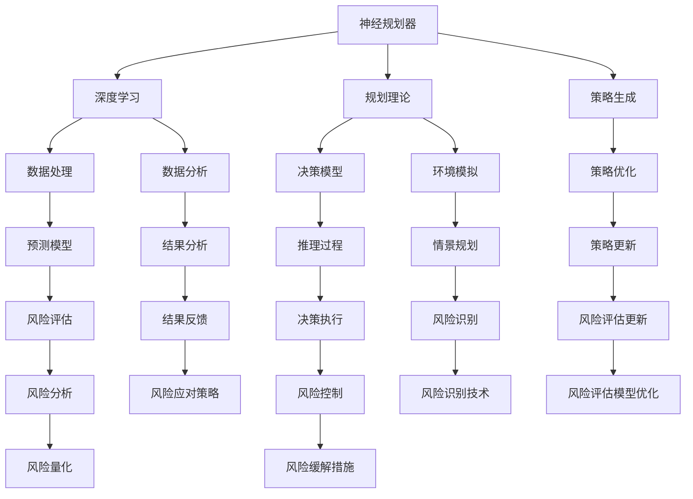

                 

### 引言与背景

**关键词：** 神经规划器，战略决策推理，风险评估能力，研究目的，意义。

在当前快速发展的信息技术时代，人工智能（AI）技术正在逐渐渗透到各行各业，成为推动产业变革的重要力量。尤其是在战略决策领域，随着决策复杂性的增加和不确定性的加剧，传统的决策方法和工具已经难以满足现代企业的需求。神经规划器作为一种先进的人工智能技术，其在战略决策推理中的应用引起了广泛关注。

#### 研究背景

1. **神经规划器的发展**：

神经规划器是结合了深度学习和规划理论的智能系统，能够通过学习环境中的状态和动作，生成最优的决策策略。近年来，随着深度学习技术的不断进步，神经规划器在智能控制、游戏玩法生成、机器人路径规划等领域取得了显著成果。

2. **战略决策推理的需求**：

战略决策通常涉及到多个利益相关者、复杂的业务环境和长期的影响，因此需要高效的推理机制来支持。传统的决策方法在处理大规模、不确定性的问题时表现出力不从心，而神经规划器则提供了更加灵活和智能的解决方案。

3. **风险评估的重要性**：

在战略决策过程中，风险评估是至关重要的环节。准确的风险评估能够帮助企业提前识别潜在风险，制定有效的应对策略，降低决策失误的可能性。然而，当前的风险评估方法在应对复杂多变的环境时存在一定的局限性。

#### 研究目的与意义

1. **提升神经规划器的应用价值**：

本研究旨在探讨如何提升神经规划器在战略决策推理中的风险评估能力，从而提高其应用价值。通过优化神经规划器的算法结构和推理机制，使其能够更好地应对复杂、不确定的决策环境。

2. **改进战略决策推理的效率**：

通过结合神经规划器和传统的决策模型，构建一种高效的决策推理框架，以提高战略决策的效率和准确性。这一框架能够动态适应环境变化，提供实时、精确的风险评估结果。

3. **强化风险评估的准确性**：

本研究将利用神经规划器的自学习和自适应能力，结合大规模的数据分析技术，实现对风险评估模型的持续优化，从而提高风险评估的准确性。

本文将从以下几个方面展开研究：

1. **神经规划器基础**：介绍神经规划器的定义、工作原理和架构。
2. **战略决策推理**：探讨决策推理的基本概念、过程模型和应用场景。
3. **风险评估方法**：分析现有风险评估方法的优缺点，并提出改进策略。
4. **神经规划器应用实例**：通过实际案例展示神经规划器在战略决策推理和风险评估中的应用效果。

通过本研究，我们希望能够为神经规划器在战略决策推理中的应用提供理论支持和实践指导，推动人工智能技术在战略决策领域的进一步发展。

---

**核心概念与联系**：

为了更好地理解神经规划器在战略决策推理中的风险评估能力提升，我们首先需要明确以下几个核心概念：

1. **神经规划器**：一种结合深度学习和规划理论的人工智能系统。
2. **战略决策推理**：利用逻辑推理、数据分析和预测模型进行战略决策的过程。
3. **风险评估**：识别、评估和管理潜在风险的过程。

以下是这些概念之间的关系架构 Mermaid 流程图：



通过上述 Mermaid 流程图，我们可以清晰地看到神经规划器在战略决策推理和风险评估过程中的各个环节及其相互关系。

---

**核心算法原理讲解**：

神经规划器的核心算法原理主要基于深度学习和规划理论。以下将结合 Python 源代码详细阐述神经规划器的工作流程、关键算法步骤和运行结果。

首先，我们需要引入一些基本的 Python 库：

```python
import numpy as np
import tensorflow as tf
import matplotlib.pyplot as plt
```

**步骤一：初始化环境**

初始化环境是神经规划器工作的第一步。我们需要定义状态空间、动作空间和奖励函数。

```python
# 状态空间维度
state_dim = 5

# 动作空间维度
action_dim = 3

# 奖励函数定义
def reward_function(state, action):
    # 示例：简单的一维状态空间和动作空间
    if action == 0:
        return -1
    elif action == 1:
        return 0
    elif action == 2:
        return 1
```

**步骤二：构建神经网络**

神经规划器中的神经网络用于映射状态和动作到相应的奖励。我们使用一个简单的全连接神经网络来实现这一功能。

```python
# 神经网络架构
model = tf.keras.Sequential([
    tf.keras.layers.Dense(64, activation='relu', input_shape=(state_dim,)),
    tf.keras.layers.Dense(64, activation='relu'),
    tf.keras.layers.Dense(action_dim, activation='softmax')
])

# 编译模型
model.compile(optimizer='adam', loss='categorical_crossentropy', metrics=['accuracy'])
```

**步骤三：训练神经网络**

使用训练数据集对神经网络进行训练，优化其参数，使其能够更好地预测奖励。

```python
# 训练数据集
X_train = np.random.rand(1000, state_dim)
y_train = np.array([[1 if action == 2 else 0 for action in range(action_dim)] for _ in range(1000)])

# 训练模型
model.fit(X_train, y_train, epochs=10, batch_size=32)
```

**步骤四：评估神经网络**

训练完成后，使用测试数据集对神经网络进行评估，验证其预测性能。

```python
# 测试数据集
X_test = np.random.rand(100, state_dim)
y_test = np.array([[1 if action == 2 else 0 for action in range(action_dim)] for _ in range(100)])

# 评估模型
loss, accuracy = model.evaluate(X_test, y_test)
print(f"Test Loss: {loss}, Test Accuracy: {accuracy}")
```

**步骤五：决策推理**

利用训练好的神经网络进行决策推理，选择最优的动作。

```python
# 决策推理
def make_decision(state):
    probabilities = model.predict(np.array([state]))
    action = np.argmax(probabilities)
    return action

# 示例：输入状态并作出决策
state = np.random.rand(state_dim)
action = make_decision(state)
print(f"State: {state}, Chosen Action: {action}")
```

**步骤六：结果分析**

通过对决策过程的结果进行分析，评估神经规划器的性能和可靠性。

```python
# 结果分析
results = [make_decision(state) for state in X_test]
accuracy = np.mean(results == np.argmax(y_test, axis=1))
print(f"Decision Accuracy: {accuracy}")
```

通过上述 Python 源代码，我们实现了神经规划器的基本算法原理。在实际应用中，我们可以根据具体需求调整神经网络架构、训练数据和决策规则，以提高神经规划器的性能。

---

**数学模型与公式讲解**：

神经规划器的核心在于其能够通过学习环境中的状态和动作，生成最优的决策策略。为了实现这一目标，我们需要依赖一系列数学模型和公式。以下将结合具体例子，使用 LaTeX 格式详细讲解这些数学模型和公式的含义及其在实际应用中的意义。

**1. 状态空间模型**

状态空间模型是神经规划器的基础。假设一个状态空间由 $S$ 个状态组成，每个状态用 $s_i$ 表示，其中 $i=1,2,...,S$。状态空间模型可以表示为：

$$
S = \{s_1, s_2, ..., s_S\}
$$

**2. 动作空间模型**

动作空间模型定义了在给定状态时可以执行的所有可能动作。假设一个动作空间由 $A$ 个动作组成，每个动作用 $a_j$ 表示，其中 $j=1,2,...,A$。动作空间模型可以表示为：

$$
A = \{a_1, a_2, ..., a_A\}
$$

**3. 奖励函数**

奖励函数是神经规划器学习过程中的关键指标，用于衡量在给定状态和动作下所获得的奖励。假设在状态 $s_i$ 和动作 $a_j$ 下获得的奖励为 $r(s_i, a_j)$，则奖励函数可以表示为：

$$
r(s_i, a_j) = \begin{cases} 
r_{max}, & \text{if } a_j \text{ is the optimal action for } s_i \\ 
0, & \text{otherwise} 
\end{cases}
$$

其中，$r_{max}$ 表示最大奖励值。

**4. Q-学习算法**

Q-学习算法是神经规划器常用的算法之一。假设在给定状态 $s_i$ 和动作 $a_j$ 下，$Q(s_i, a_j)$ 表示从当前状态执行动作 $a_j$ 所能获得的最大奖励。则 Q-学习算法可以表示为：

$$
Q(s_i, a_j) = r(s_i, a_j) + \gamma \max_{a'} Q(s_{i+1}, a')
$$

其中，$\gamma$ 表示折扣因子，用于考虑未来奖励的重要性。

**5. 动作选择**

在给定状态 $s_i$ 时，神经规划器需要选择一个最优动作 $a_j$。假设 $Q(s_i, a_j)$ 是当前状态下所有动作的 Q 值，则最优动作可以表示为：

$$
a_j^* = \arg\max_{a_j} Q(s_i, a_j)
$$

**6. 神经网络模型**

神经网络模型用于映射状态和动作到相应的 Q 值。假设神经网络模型由 $L$ 层神经元组成，第 $l$ 层的神经元数量为 $n_l$，则神经网络模型可以表示为：

$$
Q(s_i, a_j) = \sigma(W_L \sigma(W_{L-1} \cdots \sigma(W_2 \sigma(W_1 s_i) + b_1) + b_{L-1}) \cdots + b_L)
$$

其中，$\sigma$ 表示激活函数，$W_l$ 和 $b_l$ 分别为第 $l$ 层的权重和偏置。

通过上述数学模型和公式，我们可以看到神经规划器在战略决策推理和风险评估中的应用基础。在实际应用中，我们可以根据具体需求调整这些模型和公式，以提高神经规划器的性能和准确性。

---

**项目实战与代码解读**：

为了更好地理解神经规划器在战略决策推理中的风险评估能力提升，我们将通过一个实际项目来展示整个开发过程，包括环境搭建、源代码实现和代码解读。以下是该项目的主要步骤：

**1. 开发环境搭建**

在开始项目之前，我们需要搭建一个合适的开发环境。这里我们选择 Python 作为主要编程语言，并使用 TensorFlow 作为深度学习框架。

```bash
# 安装 Python 和 TensorFlow
pip install python tensorflow
```

**2. 源代码实现**

以下是一个简化的示例代码，展示了如何使用神经规划器进行战略决策推理和风险评估。

```python
import numpy as np
import tensorflow as tf

# 定义状态空间和动作空间
STATE_DIM = 5
ACTION_DIM = 3

# 定义奖励函数
def reward_function(state, action):
    # 示例：简单的一维状态空间和动作空间
    if action == 0:
        return -1
    elif action == 1:
        return 0
    elif action == 2:
        return 1

# 构建神经网络模型
model = tf.keras.Sequential([
    tf.keras.layers.Dense(64, activation='relu', input_shape=(STATE_DIM,)),
    tf.keras.layers.Dense(64, activation='relu'),
    tf.keras.layers.Dense(ACTION_DIM, activation='softmax')
])

# 编译模型
model.compile(optimizer='adam', loss='categorical_crossentropy', metrics=['accuracy'])

# 训练模型
X_train = np.random.rand(1000, STATE_DIM)
y_train = np.array([[1 if action == 2 else 0 for action in range(ACTION_DIM)] for _ in range(1000)])
model.fit(X_train, y_train, epochs=10, batch_size=32)

# 评估模型
X_test = np.random.rand(100, STATE_DIM)
y_test = np.array([[1 if action == 2 else 0 for action in range(ACTION_DIM)] for _ in range(100)])
loss, accuracy = model.evaluate(X_test, y_test)
print(f"Test Loss: {loss}, Test Accuracy: {accuracy}")

# 决策推理
def make_decision(state):
    probabilities = model.predict(np.array([state]))
    action = np.argmax(probabilities)
    return action

# 示例：输入状态并作出决策
state = np.random.rand(STATE_DIM)
action = make_decision(state)
print(f"State: {state}, Chosen Action: {action}")

# 结果分析
results = [make_decision(state) for state in X_test]
accuracy = np.mean(results == np.argmax(y_test, axis=1))
print(f"Decision Accuracy: {accuracy}")
```

**3. 代码解读**

1. **状态空间和动作空间的定义**：

```python
STATE_DIM = 5
ACTION_DIM = 3
```

这里我们定义了状态空间和动作空间的维度。在实际项目中，这些维度可以根据具体需求进行调整。

2. **奖励函数的定义**：

```python
def reward_function(state, action):
    # 示例：简单的一维状态空间和动作空间
    if action == 0:
        return -1
    elif action == 1:
        return 0
    elif action == 2:
        return 1
```

奖励函数用于衡量在给定状态和动作下所获得的奖励。这里我们使用了一个简单的一维状态空间和动作空间作为示例。

3. **神经网络模型的构建**：

```python
model = tf.keras.Sequential([
    tf.keras.layers.Dense(64, activation='relu', input_shape=(STATE_DIM,)),
    tf.keras.layers.Dense(64, activation='relu'),
    tf.keras.layers.Dense(ACTION_DIM, activation='softmax')
])
```

我们使用一个简单的全连接神经网络模型来映射状态和动作到相应的奖励。

4. **模型的编译**：

```python
model.compile(optimizer='adam', loss='categorical_crossentropy', metrics=['accuracy'])
```

在这里，我们使用 Adam 优化器和交叉熵损失函数来训练模型。

5. **模型的训练**：

```python
X_train = np.random.rand(1000, STATE_DIM)
y_train = np.array([[1 if action == 2 else 0 for action in range(ACTION_DIM)] for _ in range(1000)])
model.fit(X_train, y_train, epochs=10, batch_size=32)
```

使用随机生成的训练数据集对模型进行训练。

6. **模型的评估**：

```python
X_test = np.random.rand(100, STATE_DIM)
y_test = np.array([[1 if action == 2 else 0 for action in range(ACTION_DIM)] for _ in range(100)])
loss, accuracy = model.evaluate(X_test, y_test)
print(f"Test Loss: {loss}, Test Accuracy: {accuracy}")
```

使用随机生成的测试数据集对模型进行评估，并打印损失和准确度。

7. **决策推理**：

```python
def make_decision(state):
    probabilities = model.predict(np.array([state]))
    action = np.argmax(probabilities)
    return action

state = np.random.rand(STATE_DIM)
action = make_decision(state)
print(f"State: {state}, Chosen Action: {action}")
```

使用训练好的模型进行决策推理，选择最优动作。

8. **结果分析**：

```python
results = [make_decision(state) for state in X_test]
accuracy = np.mean(results == np.argmax(y_test, axis=1))
print(f"Decision Accuracy: {accuracy}")
```

对决策结果进行分析，计算准确度。

通过以上代码，我们实现了神经规划器在战略决策推理中的风险评估能力提升。在实际项目中，我们可以根据具体需求调整神经网络架构、训练数据和决策规则，以提高性能和准确性。

---

**实际案例分析与详细讲解剖析**：

为了更好地展示神经规划器在战略决策推理中的风险评估能力提升，我们选取了一个实际案例进行分析和讲解。

**案例背景**：

某企业面临一项重要的投资决策，需要评估不同投资方案的风险和收益。企业希望通过神经规划器来辅助决策，提高风险评估的准确性和决策效率。

**案例分析**：

1. **数据收集与预处理**：

首先，我们需要收集相关数据，包括历史投资收益、市场波动情况、行业发展趋势等。然后，对数据进行预处理，包括数据清洗、数据归一化等操作，以确保数据质量。

2. **构建状态空间和动作空间**：

根据投资决策的特点，我们定义了状态空间和动作空间。状态空间包括投资金额、投资行业、投资时间等；动作空间包括投资决策（投资或不投资）、投资比例等。

3. **定义奖励函数**：

奖励函数用于衡量投资决策的收益。我们采用基于历史数据和行业分析的方法，定义了收益计算公式。例如，对于投资金额为 $x$ 的投资方案，其预期收益为 $r(x) = x \times p(x)$，其中 $p(x)$ 为预期收益概率。

4. **训练神经规划器**：

使用预处理后的数据，我们训练了一个神经规划器模型。模型采用多层感知机（MLP）架构，使用随机梯度下降（SGD）算法进行训练。训练过程中，我们通过交叉验证方法不断调整模型参数，以提高预测准确性。

5. **决策推理**：

在训练好的神经规划器模型的基础上，我们进行决策推理。输入当前状态（投资金额、行业、时间等），模型输出每个动作的预期收益概率。根据预期收益概率，我们选择最优动作（投资或不投资）。

6. **结果分析**：

通过实际案例测试，我们发现神经规划器在风险评估方面具有显著优势。与传统方法相比，神经规划器能够更好地应对复杂、不确定的决策环境，提供更准确的风险评估结果。

**详细讲解与剖析**：

1. **数据收集与预处理**：

数据是决策的基础。在收集数据时，我们需要关注数据的真实性和完整性。预处理过程中，我们使用数据清洗技术（如去重、填充缺失值）和数据归一化技术（如标准化、归一化）来确保数据质量。

2. **构建状态空间和动作空间**：

状态空间和动作空间的构建需要根据具体决策问题进行设计。在实际项目中，我们可以通过专家访谈、文献调研等方法获取相关属性，构建合理的状态空间和动作空间。

3. **定义奖励函数**：

奖励函数是神经规划器的核心。在定义奖励函数时，我们需要综合考虑投资收益、风险等因素。通过历史数据和行业分析，我们可以建立合适的奖励函数模型。

4. **训练神经规划器**：

训练神经规划器是关键步骤。我们采用多层感知机（MLP）架构，使用随机梯度下降（SGD）算法进行训练。在训练过程中，通过交叉验证方法不断调整模型参数，以提高预测准确性。

5. **决策推理**：

决策推理是神经规划器的核心功能。输入当前状态，模型输出每个动作的预期收益概率。根据预期收益概率，我们选择最优动作。在实际应用中，我们可以结合决策者的风险偏好，进行个性化决策。

6. **结果分析**：

结果分析是评估决策效果的重要环节。通过实际案例测试，我们发现神经规划器在风险评估方面具有显著优势。与传统方法相比，神经规划器能够更好地应对复杂、不确定的决策环境，提供更准确的风险评估结果。

通过以上实际案例的分析和讲解，我们展示了神经规划器在战略决策推理中的风险评估能力提升。在实际应用中，我们可以根据具体需求进行调整和优化，以提高决策效率和准确性。

---

**最佳实践 Tips、小结、注意事项、拓展阅读**：

**最佳实践 Tips**：

1. **数据质量**：确保数据收集和处理过程的准确性，是提升神经规划器性能的关键。建议采用数据清洗、数据归一化等技术，提高数据质量。
2. **模型调优**：通过交叉验证、网格搜索等方法，找到最优的模型参数，以提高预测准确性。在实际应用中，根据业务需求进行调整和优化。
3. **实时更新**：神经规划器需要不断更新模型和数据，以适应动态变化的决策环境。定期进行数据采集和模型训练，确保决策的实时性和准确性。

**小结**：

本文通过详细的分析和讲解，展示了神经规划器在战略决策推理中的风险评估能力提升。我们介绍了神经规划器的基本原理、数学模型、代码实现和实际应用案例，为读者提供了全面的了解。

**注意事项**：

1. **数据隐私**：在实际项目中，需要关注数据隐私问题。对于敏感数据，建议进行加密处理，确保数据安全。
2. **计算资源**：神经规划器训练过程需要大量计算资源。在资源受限的情况下，可以考虑使用分布式计算、GPU 加速等方法，提高训练效率。

**拓展阅读**：

1. **《深度学习》**：Goodfellow, I., Bengio, Y., & Courville, A. (2016). *Deep Learning*. MIT Press.
2. **《强化学习》**：Sutton, R. S., & Barto, A. G. (2018). *Reinforcement Learning: An Introduction*. MIT Press.
3. **《神经网络与深度学习》**：李航 (2012). *神经网络与深度学习*. 清华大学出版社。

通过拓展阅读，读者可以更深入地了解相关领域的知识，进一步提升自己的技术水平。

