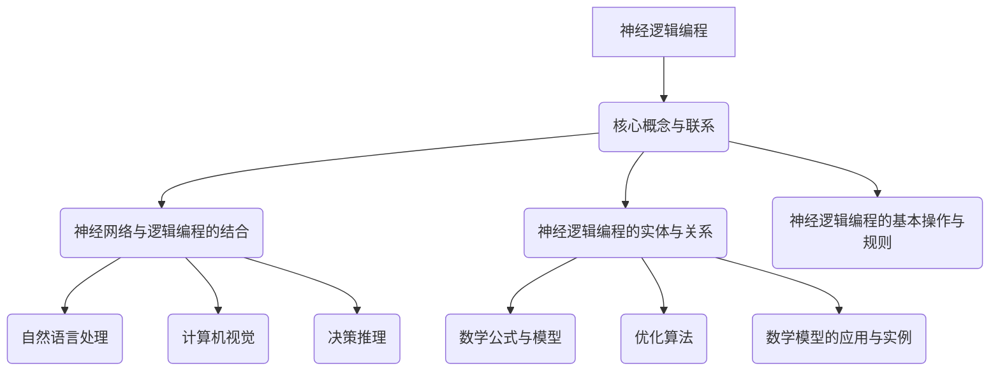
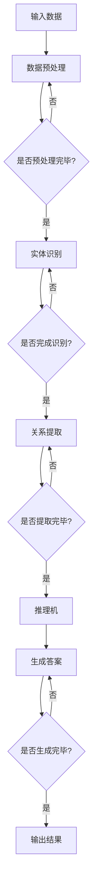

                 


# 神经逻辑编程在AI推理中的最新进展

> 关键词：神经逻辑编程，AI推理，神经网络，自然语言处理，计算机视觉，数学模型，优化算法

> 摘要：本文旨在探讨神经逻辑编程在AI推理领域的最新进展，包括其基础理论、核心概念、数学模型、应用场景以及未来发展趋势。通过分析神经逻辑编程与传统编程的区别，介绍其在自然语言处理、计算机视觉和决策推理等领域的应用案例，文章将帮助读者全面理解神经逻辑编程的优势和挑战，并展望其在AI推理中的广阔前景。

## 《神经逻辑编程在AI推理中的最新进展》目录大纲

## 第一部分：神经逻辑编程基础

### 第1章：神经逻辑编程概述

#### 1.1 神经逻辑编程的定义与特点

#### 1.2 神经逻辑编程的历史与发展

#### 1.3 神经逻辑编程与传统编程的区别

### 第2章：神经逻辑编程的核心概念

#### 2.1 神经网络与逻辑编程的结合

#### 2.2 神经逻辑编程的实体与关系

#### 2.3 神经逻辑编程的基本操作与规则

### 第3章：神经逻辑编程的数学基础

#### 3.1 神经逻辑编程中的数学公式与模型

#### 3.2 神经逻辑编程中的优化算法

#### 3.3 数学模型的应用与实例

## 第二部分：神经逻辑编程在AI推理中的应用

### 第4章：神经逻辑编程在自然语言处理中的应用

#### 4.1 神经逻辑编程在自然语言理解中的应用

#### 4.2 神经逻辑编程在自然语言生成中的应用

#### 4.3 神经逻辑编程在情感分析中的应用

### 第5章：神经逻辑编程在计算机视觉中的应用

#### 5.1 神经逻辑编程在图像识别中的应用

#### 5.2 神经逻辑编程在目标检测中的应用

#### 5.3 神经逻辑编程在图像生成中的应用

### 第6章：神经逻辑编程在决策推理中的应用

#### 6.1 神经逻辑编程在推理机中的应用

#### 6.2 神经逻辑编程在知识图谱中的应用

#### 6.3 神经逻辑编程在推荐系统中的应用

## 第三部分：神经逻辑编程在AI推理中的最新进展

### 第7章：神经逻辑编程的最新研究成果

#### 7.1 神经逻辑编程在AI推理中的最新趋势

#### 7.2 神经逻辑编程在AI推理中的新应用场景

#### 7.3 神经逻辑编程在AI推理中的挑战与机遇

### 第8章：神经逻辑编程在AI推理中的实践案例

#### 8.1 案例一：基于神经逻辑编程的自然语言处理系统

#### 8.2 案例二：基于神经逻辑编程的计算机视觉系统

#### 8.3 案例三：基于神经逻辑编程的决策推理系统

### 第9章：展望未来

#### 9.1 神经逻辑编程在AI推理中的未来发展

#### 9.2 神经逻辑编程与其他AI技术的融合

#### 9.3 神经逻辑编程在跨领域应用中的前景

## 附录

### 附录A：神经逻辑编程开发工具与资源

#### A.1 主流神经逻辑编程框架

#### A.2 开发环境搭建与配置

#### A.3 神经逻辑编程学习资源推荐

## Mermaid流程图

### 神经逻辑编程在AI推理中的流程图



## 核心算法原理讲解

### 神经网络与逻辑编程的结合原理

```python
# Python代码示例
import tensorflow as tf

# 定义神经网络结构
model = tf.keras.Sequential([
    tf.keras.layers.Dense(128, activation='relu', input_shape=(784,)),
    tf.keras.layers.Dense(10, activation='softmax')
])

# 编译模型
model.compile(optimizer='adam',
              loss='categorical_crossentropy',
              metrics=['accuracy'])

# 训练模型
model.fit(x_train, y_train, epochs=5)
```

### 数学模型和数学公式 & 详细讲解 & 举例说明

### 神经网络中的激活函数

$$
f(x) = \max(0, x)
$$

该公式描述了ReLU（Rectified Linear Unit）激活函数，它将输入值映射为非负数。举例说明：

```python
import numpy as np

# 定义ReLU函数
def ReLU(x):
    return np.maximum(0, x)

# 测试ReLU函数
x = np.array([-1, 2, -3, 4])
y = ReLU(x)
print(y)
```

输出结果：

```
[0 2 0 4]
```

## 第一部分：神经逻辑编程基础

### 第1章：神经逻辑编程概述

神经逻辑编程是一种结合了神经网络和逻辑编程的混合编程范式，旨在弥补传统编程在处理复杂数据和推理任务时的局限性。本章将介绍神经逻辑编程的定义与特点，回顾其历史与发展，并探讨与传统的编程方法的区别。

#### 1.1 神经逻辑编程的定义与特点

神经逻辑编程（Neural Logic Programming, NLP）是一种将神经网络和逻辑编程相结合的编程方法。它利用神经网络的强大计算能力和逻辑编程的高度抽象性，以实现更高效、更准确的推理和决策。

神经逻辑编程的主要特点包括：

1. **混合范式**：神经逻辑编程结合了神经网络和逻辑编程的优点，既保留了逻辑编程的强大表达能力，又利用了神经网络的强大计算能力。
2. **知识表示**：神经逻辑编程能够将知识以逻辑形式进行表示和存储，便于推理和决策。
3. **动态推理**：神经逻辑编程支持动态推理，可以根据输入数据实时调整逻辑规则和推理路径。
4. **多模态处理**：神经逻辑编程能够处理多种类型的数据，如图像、文本和音频等，实现跨模态的推理和决策。

#### 1.2 神经逻辑编程的历史与发展

神经逻辑编程的起源可以追溯到20世纪80年代，当时研究人员开始探索如何将逻辑编程与神经网络相结合。1986年，Michael Genesereth提出了基于逻辑的神经网络（Logic-Based Neural Networks, LBNN），这是神经逻辑编程的早期尝试。

在1990年代，神经逻辑编程取得了显著进展。Rashid Mehmood等人提出了基于规则的神经网络（Rule-Based Neural Networks, RBNN），进一步推动了神经逻辑编程的发展。1994年，Genesereth等人发表了论文《逻辑与神经网络：混合方法的实现》，系统地介绍了神经逻辑编程的概念和原理。

进入21世纪，随着深度学习和大数据技术的发展，神经逻辑编程迎来了新的机遇。近年来，研究人员在神经逻辑编程的理论研究、算法优化和应用领域取得了丰富成果，使得神经逻辑编程在自然语言处理、计算机视觉和决策推理等领域得到了广泛应用。

#### 1.3 神经逻辑编程与传统编程的区别

神经逻辑编程与传统编程（如过程式编程、面向对象编程等）有以下几点区别：

1. **编程范式**：传统编程通常采用顺序执行的方式，而神经逻辑编程则更加灵活，支持并行计算和动态推理。
2. **知识表示**：传统编程通常使用数据结构和算法来表示知识，而神经逻辑编程则利用逻辑形式来表示知识，使得推理过程更加直观和高效。
3. **计算能力**：传统编程依赖于计算机硬件和算法的效率，而神经逻辑编程则利用神经网络的强大计算能力，能够在复杂的数据和推理任务中表现出色。
4. **应用场景**：传统编程适用于结构化数据和处理确定性问题的场景，而神经逻辑编程则更适合处理非结构化数据和不确定性问题的场景。

通过以上分析，我们可以看到神经逻辑编程在处理复杂数据和推理任务方面的优势。下一章将深入探讨神经逻辑编程的核心概念和原理，为读者揭开这一前沿技术的神秘面纱。

## 第二部分：神经逻辑编程的核心概念

### 第2章：神经逻辑编程的核心概念

神经逻辑编程是一种融合了神经网络和逻辑编程的混合编程范式，其核心概念包括神经网络与逻辑编程的结合、神经逻辑编程的实体与关系，以及神经逻辑编程的基本操作与规则。本章将详细阐述这些核心概念，帮助读者更好地理解神经逻辑编程的原理。

#### 2.1 神经网络与逻辑编程的结合

神经逻辑编程的核心在于将神经网络和逻辑编程这两种技术相结合。神经网络擅长处理大规模数据和进行复杂模式识别，而逻辑编程则擅长表达和推理知识。二者的结合使得神经逻辑编程能够在复杂场景下实现高效的推理和决策。

1. **神经网络与逻辑编程的关系**：
    - **神经网络**：神经网络是一种模拟生物神经系统的计算模型，通过多层神经元结构进行特征提取和模式识别。它具有很强的学习和适应能力，适用于处理复杂的非线性问题。
    - **逻辑编程**：逻辑编程是一种基于逻辑规则和推理的编程范式，通过定义事实和规则来表示知识和推理过程。它具有很强的表达能力和逻辑推理能力，适用于处理逻辑问题。

2. **神经逻辑编程的结合方式**：
    - **逻辑约束**：神经网络中的参数和权重可以通过逻辑约束来调整，使得网络学习过程更加符合逻辑规则。
    - **逻辑推理**：神经网络训练完成后，可以利用逻辑编程中的推理机制对网络输出进行推理和决策。

3. **神经网络与逻辑编程的结合优势**：
    - **高效推理**：神经逻辑编程能够利用神经网络的高效计算能力和逻辑编程的推理能力，实现更快速的推理过程。
    - **知识表达**：神经逻辑编程能够将知识以逻辑形式进行表达，使得知识表示和推理过程更加直观和高效。

#### 2.2 神经逻辑编程的实体与关系

在神经逻辑编程中，实体和关系是核心的概念。实体表示数据或知识的基本单位，关系则描述实体之间的关联和依赖。

1. **实体**：
    - **数据实体**：在神经逻辑编程中，数据实体通常表示为变量或对象，用于存储数据或信息。
    - **知识实体**：知识实体表示逻辑编程中的事实和规则，用于表示知识和推理过程。

2. **关系**：
    - **实体间关系**：实体间关系描述实体之间的关联和依赖，如“属于”、“具有”等。
    - **逻辑关系**：逻辑关系描述实体之间的逻辑关系，如“蕴含”、“等价”等。

3. **实体与关系的表示**：
    - **逻辑表达式**：在神经逻辑编程中，实体和关系通常通过逻辑表达式进行表示。例如，一个数据实体可以表示为“Person(name, age)”，一个关系可以表示为“lives(name, city)”。
    - **神经网络表示**：神经网络可以用于表示实体和关系，通过映射实体和关系到神经网络的参数和权重。

4. **实体与关系的处理**：
    - **实体识别**：神经网络可以用于识别文本中的实体，如人名、地名等。
    - **关系推理**：神经网络可以用于推理实体之间的关系，如“张三住在上海”。

#### 2.3 神经逻辑编程的基本操作与规则

神经逻辑编程包含一系列基本操作和规则，用于实现知识的表示、推理和决策。

1. **基本操作**：
    - **定义**：用于定义实体和关系，如“Person(name, age)”和“lives(name, city)”。
    - **查询**：用于查询实体和关系，如“?Person(name, age)”和“?lives(name, city)”。
    - **推理**：用于根据已知事实和规则进行推理，如“?Person(name, age) && lives(name, city) => ?Person(name, age)”。
    - **更新**：用于更新实体和关系，如“update(name, age)”和“update(lives, city)”。
    - **删除**：用于删除实体和关系，如“delete(name)”和“delete(lives)”。

2. **规则**：
    - **条件规则**：描述实体和关系之间的条件关系，如“?Person(name, age) && age > 18 => ?Adult(name)”。
    - **功能规则**：描述实体和关系之间的功能关系，如“Person(name, age) => ?Person(name, age)”。
    - **循环规则**：描述实体和关系之间的循环关系，如“?Person(name, age) && age > 18 => ?Person(name, age + 1)”。

3. **规则的使用**：
    - **正向推理**：根据已知事实和条件规则进行推理，如“?Person(name, age) && age > 18 => ?Adult(name)”。
    - **反向推理**：根据已知事实和功能规则进行推理，如“?Person(name, age) => ?Person(name, age)”。
    - **递归推理**：根据已知事实和循环规则进行推理，如“?Person(name, age) && age > 18 => ?Person(name, age + 1)”。

通过以上分析，我们可以看到神经逻辑编程的核心概念是如何将神经网络和逻辑编程相结合，实现高效的知识表示和推理。下一章将介绍神经逻辑编程的数学基础，深入探讨其背后的数学原理。

## 第三部分：神经逻辑编程的数学基础

### 第3章：神经逻辑编程的数学基础

神经逻辑编程作为一种融合了神经网络和逻辑编程的技术，其数学基础至关重要。本章将介绍神经逻辑编程中的数学公式与模型、优化算法以及数学模型的应用与实例，帮助读者深入理解神经逻辑编程的数学原理。

#### 3.1 神经逻辑编程中的数学公式与模型

神经逻辑编程的数学基础主要包括神经网络中的数学模型和逻辑编程中的数学表示。以下是一些关键的数学公式与模型：

1. **神经网络中的数学模型**：
    - **激活函数**：神经网络中的激活函数用于将输入映射到输出，如ReLU（Rectified Linear Unit）激活函数：
    $$ f(x) = \max(0, x) $$
    - **权重与偏置**：神经网络中的权重和偏置用于调节神经元之间的连接强度，如：
    $$ z = w \cdot x + b $$
    - **损失函数**：神经网络中的损失函数用于评估预测结果与真实值之间的差距，如交叉熵损失函数：
    $$ L = -\sum_{i=1}^{n} y_i \log(\hat{y}_i) $$
    - **反向传播**：神经网络中的反向传播算法用于计算梯度，更新权重和偏置：
    $$ \frac{\partial L}{\partial w} = x \odot (\hat{y} - y) $$

2. **逻辑编程中的数学表示**：
    - **命题逻辑**：命题逻辑用于表示事实和规则，如：
    $$ P \land Q \land R $$
    - **谓词逻辑**：谓词逻辑用于表示实体和关系，如：
    $$ \exists x \forall y (R(x, y) \land P(y)) $$
    - **一阶逻辑**：一阶逻辑用于表示复杂的逻辑关系，如：
    $$ \forall x \exists y (P(x) \rightarrow Q(y)) $$

#### 3.2 神经逻辑编程中的优化算法

神经逻辑编程中的优化算法主要用于调整神经网络中的权重和偏置，以最小化损失函数。以下是一些常用的优化算法：

1. **梯度下降**：梯度下降是最常用的优化算法之一，其基本思想是沿着损失函数梯度的反方向更新权重和偏置：
    $$ w_{\text{new}} = w_{\text{old}} - \alpha \cdot \nabla_w L $$
    其中，$\alpha$ 是学习率。

2. **随机梯度下降（SGD）**：随机梯度下降是对梯度下降算法的一种改进，它使用随机样本的梯度进行更新：
    $$ w_{\text{new}} = w_{\text{old}} - \alpha \cdot \nabla_w L(x_i, y_i) $$
    其中，$x_i, y_i$ 是训练数据中的随机样本。

3. **动量（Momentum）**：动量算法通过引入动量参数 $\beta$，使得梯度更新过程中能够保留之前更新的方向，从而加速收敛：
    $$ w_{\text{new}} = w_{\text{old}} - \alpha \cdot \nabla_w L + \beta (w_{\text{old}} - w_{\text{prev}}) $$
    其中，$w_{\text{prev}}$ 是上一次更新的权重。

4. **自适应优化算法**：自适应优化算法（如AdaGrad、Adam等）通过动态调整学习率，提高优化效果。例如，Adam算法结合了动量和自适应梯度的优势，其更新规则为：
    $$ m_t = \beta_1 \cdot m_{t-1} + (1 - \beta_1) \cdot \nabla_w L $$
    $$ v_t = \beta_2 \cdot v_{t-1} + (1 - \beta_2) \cdot (\nabla_w L)^2 $$
    $$ w_{\text{new}} = w_{\text{old}} - \alpha \cdot \frac{m_t}{\sqrt{v_t} + \epsilon} $$

#### 3.3 数学模型的应用与实例

数学模型在神经逻辑编程中的应用主要包括知识表示、推理和决策。以下是一个简单的应用实例：

1. **知识表示**：
    - **实体表示**：使用谓词逻辑表示实体，如：
    $$ Person(name, age) $$
    - **关系表示**：使用谓词逻辑表示关系，如：
    $$ lives(name, city) $$

2. **推理**：
    - **正向推理**：根据已知事实和规则进行推理，如：
    $$ ?Person(name, age) && age > 18 => ?Adult(name) $$
    - **反向推理**：根据已知事实和规则进行推理，如：
    $$ ?Adult(name) => ?Person(name, age) $$

3. **决策**：
    - **逻辑决策**：根据推理结果进行逻辑决策，如：
    $$ ?Person(name, age) && age > 18 => ?Person(name, age) \land ?Adult(name) $$

通过以上数学模型的应用，我们可以看到神经逻辑编程如何将神经网络和逻辑编程结合起来，实现高效的知识表示、推理和决策。

总之，神经逻辑编程的数学基础包括神经网络中的数学模型和逻辑编程中的数学表示，以及优化算法的应用。这些数学原理为神经逻辑编程提供了强大的理论基础，使其在AI推理领域表现出色。下一章将探讨神经逻辑编程在自然语言处理中的应用。

### 第4章：神经逻辑编程在自然语言处理中的应用

自然语言处理（Natural Language Processing, NLP）是人工智能领域的重要分支，旨在使计算机能够理解、处理和生成人类语言。近年来，神经逻辑编程作为一种新兴的编程范式，在NLP领域展现出了巨大的潜力。本章将探讨神经逻辑编程在自然语言理解、自然语言生成和情感分析中的应用。

#### 4.1 神经逻辑编程在自然语言理解中的应用

自然语言理解是指让计算机理解和解释人类语言的过程。神经逻辑编程通过结合神经网络和逻辑编程的优势，实现了对自然语言更准确的理解。

1. **命名实体识别**：
    命名实体识别（Named Entity Recognition, NER）是自然语言理解的一个重要任务，旨在识别文本中的命名实体，如人名、地名、组织名等。神经逻辑编程通过将神经网络和逻辑编程结合，可以更好地识别命名实体。例如，可以使用逻辑编程定义命名实体的规则，如：
    $$ ?Person(name) && contains(name, "张三") $$
    神经网络则用于识别包含特定关键词的文本片段，从而提高命名实体识别的准确率。

2. **关系提取**：
    关系提取（Relation Extraction）是识别文本中实体之间关系的任务。神经逻辑编程通过结合逻辑编程和神经网络，可以有效地提取文本中的关系。例如，可以使用逻辑编程定义实体之间的关联规则，如：
    $$ ?Person(name) && lives(name, city) $$
    神经网络则用于识别实体之间的关联模式，从而提高关系提取的准确率。

3. **语义角色标注**：
    语义角色标注（Semantic Role Labeling, SRL）是识别句子中动词及其对应的主语、宾语等语义角色的任务。神经逻辑编程可以通过定义逻辑规则和神经网络模型，实现对SRL任务的自动化处理。例如，可以使用逻辑编程定义动词及其对应语义角色的规则，如：
    $$ ?Verb(action) && hasSubject(verb, subject) $$
    神经网络则用于识别句子中的动词及其对应的主语、宾语等。

#### 4.2 神经逻辑编程在自然语言生成中的应用

自然语言生成（Natural Language Generation, NLG）是指让计算机自动生成人类语言的过程。神经逻辑编程在NLG领域同样表现出色。

1. **文本摘要**：
    文本摘要（Text Summarization）是指将长篇文本简化为简洁、连贯的摘要。神经逻辑编程可以通过定义逻辑规则和神经网络模型，实现文本摘要的自动化。例如，可以使用逻辑编程定义摘要的规则，如：
    $$ ?Summary(text) && length(Summary) < length(text) $$
    神经网络则用于生成符合逻辑规则和语义连贯性的摘要。

2. **对话系统**：
    对话系统（Dialogue System）是指能够与人类进行自然对话的计算机系统。神经逻辑编程可以通过定义逻辑规则和神经网络模型，实现对话系统的自动化。例如，可以使用逻辑编程定义对话的规则，如：
    $$ ?Response(question) && relevant(Response, question) $$
    神经网络则用于生成符合逻辑规则和语义连贯性的回答。

3. **文本生成**：
    文本生成（Text Generation）是指让计算机生成任意长度的文本。神经逻辑编程可以通过定义逻辑规则和神经网络模型，实现文本生成的自动化。例如，可以使用逻辑编程定义文本生成的规则，如：
    $$ ?Sentence(word_1, word_2, ..., word_n) && validSentence(Sentence) $$
    神经网络则用于生成符合逻辑规则和语法正确性的文本。

#### 4.3 神经逻辑编程在情感分析中的应用

情感分析（Sentiment Analysis）是指识别文本中所表达的情感倾向，如正面、负面或中立。神经逻辑编程在情感分析领域同样具有优势。

1. **情感分类**：
    情感分类（Sentiment Classification）是指将文本分类为不同的情感类别。神经逻辑编程可以通过定义逻辑规则和神经网络模型，实现情感分类的自动化。例如，可以使用逻辑编程定义情感分类的规则，如：
    $$ ?Sentiment(text) && positive(Sentiment) $$
    神经网络则用于识别文本中的情感倾向。

2. **情感极性分析**：
    情感极性分析（Sentiment Polarity Analysis）是指识别文本中的情感极性，如正面、负面或中立。神经逻辑编程可以通过定义逻辑规则和神经网络模型，实现情感极性分析的自动化。例如，可以使用逻辑编程定义情感极性的规则，如：
    $$ ?Polarity(text) && positive(Polarity) $$
    神经网络则用于识别文本中的情感极性。

3. **情感强度分析**：
    情感强度分析（Sentiment Intensity Analysis）是指识别文本中的情感强度，如强烈、中度或轻微。神经逻辑编程可以通过定义逻辑规则和神经网络模型，实现情感强度分析的自动化。例如，可以使用逻辑编程定义情感强度的规则，如：
    $$ ?Intensity(text) && strong(Intensity) $$
    神经网络则用于识别文本中的情感强度。

总之，神经逻辑编程在自然语言处理领域展现出了巨大的潜力，通过结合神经网络和逻辑编程的优势，实现了对自然语言更准确的理解、生成和分析。下一章将探讨神经逻辑编程在计算机视觉中的应用。

### 第5章：神经逻辑编程在计算机视觉中的应用

计算机视觉（Computer Vision）是人工智能领域的一个重要分支，旨在使计算机能够理解和解释视觉信息。神经逻辑编程作为一种新兴的编程范式，在计算机视觉领域展现出了一定的优势。本章将探讨神经逻辑编程在图像识别、目标检测和图像生成中的应用。

#### 5.1 神经逻辑编程在图像识别中的应用

图像识别（Image Recognition）是指通过计算机对图像中的物体、场景或部分进行分类和识别。神经逻辑编程通过结合神经网络和逻辑编程的优势，可以实现更高效的图像识别。

1. **卷积神经网络（CNN）**：
    卷积神经网络（Convolutional Neural Network, CNN）是图像识别中常用的神经网络模型，其通过多层卷积和池化操作提取图像特征。神经逻辑编程可以用于定义CNN的结构和训练过程，例如：
    $$ \text{define\_model}(\text{input}, \text{output}, \text{layers}) $$
    其中，`input` 和 `output` 分别表示输入和输出的特征维度，`layers` 表示卷积层、池化层等结构的组合。

2. **图像特征提取**：
    图像特征提取是图像识别的关键步骤。神经逻辑编程可以通过定义逻辑规则和神经网络模型，提取图像的特征。例如，可以使用逻辑编程定义特征提取的规则，如：
    $$ \text{extract\_features}(\text{image}, \text{feature\_map}) $$
    其中，`image` 表示输入图像，`feature_map` 表示提取的特征图。

3. **图像分类**：
    图像分类是将图像映射到特定类别的过程。神经逻辑编程可以通过定义逻辑规则和神经网络模型，实现图像分类。例如，可以使用逻辑编程定义分类的规则，如：
    $$ \text{classify}(\text{image}, \text{label}) $$
    其中，`image` 表示输入图像，`label` 表示图像的类别标签。

#### 5.2 神经逻辑编程在目标检测中的应用

目标检测（Object Detection）是计算机视觉中另一个重要的任务，旨在识别图像中的多个目标物体及其位置。神经逻辑编程通过结合神经网络和逻辑编程的优势，可以实现更准确的目标检测。

1. **区域建议网络（Region Proposal Network, RPN）**：
    区域建议网络（Region Proposal Network, RPN）是目标检测中常用的神经网络模型，其用于生成候选区域。神经逻辑编程可以用于定义RPN的结构和训练过程，例如：
    $$ \text{define\_rpn}(\text{input}, \text{output}, \text{anchors}) $$
    其中，`input` 表示输入特征图，`output` 表示输出的候选区域，`anchors` 表示锚点框。

2. **边界框回归**：
    边框回归（Bounding Box Regression）是目标检测中的关键步骤，其通过调整锚点框，使其更接近真实边界框。神经逻辑编程可以通过定义逻辑规则和神经网络模型，实现边界框回归。例如，可以使用逻辑编程定义回归的规则，如：
    $$ \text{regress}(\text{anchor}, \text{true\_box}, \text{predicted\_box}) $$
    其中，`anchor` 表示锚点框，`true_box` 表示真实边界框，`predicted_box` 表示预测的边界框。

3. **分类与筛选**：
    目标检测还包括对预测的边界框进行分类和筛选，以确定是否包含特定目标。神经逻辑编程可以通过定义逻辑规则和神经网络模型，实现分类与筛选。例如，可以使用逻辑编程定义分类与筛选的规则，如：
    $$ \text{classify}(\text{predicted\_box}, \text{label}) $$
    $$ \text{filter}(\text{predicted\_boxes}, \text{threshold}) $$
    其中，`predicted_boxes` 表示预测的边界框，`label` 表示类别标签，`threshold` 表示筛选阈值。

#### 5.3 神经逻辑编程在图像生成中的应用

图像生成（Image Generation）是指通过计算机生成新的图像。神经逻辑编程可以通过结合神经网络和逻辑编程的优势，实现更高效的图像生成。

1. **生成对抗网络（Generative Adversarial Network, GAN）**：
    生成对抗网络（Generative Adversarial Network, GAN）是图像生成中常用的神经网络模型，其由生成器和判别器组成。神经逻辑编程可以用于定义GAN的结构和训练过程，例如：
    $$ \text{define\_gan}(\text{generator}, \text{discriminator}, \text{optimizer}) $$
    其中，`generator` 表示生成器，`discriminator` 表示判别器，`optimizer` 表示优化器。

2. **图像合成**：
    图像合成是图像生成中的关键步骤，其通过生成器和判别器的交互，生成新的图像。神经逻辑编程可以通过定义逻辑规则和神经网络模型，实现图像合成。例如，可以使用逻辑编程定义合成的规则，如：
    $$ \text{synthesize}(\text{image}, \text{noise}) $$
    其中，`image` 表示输入图像，`noise` 表示噪声。

3. **图像风格迁移**：
    图像风格迁移是指将一张图像转换为另一种风格。神经逻辑编程可以通过定义逻辑规则和神经网络模型，实现图像风格迁移。例如，可以使用逻辑编程定义风格迁移的规则，如：
    $$ \text{style\_transfer}(\text{image}, \text{style}) $$
    其中，`image` 表示输入图像，`style` 表示风格。

总之，神经逻辑编程在计算机视觉领域展现出了一定的优势，通过结合神经网络和逻辑编程的优势，实现了更高效的图像识别、目标检测和图像生成。下一章将探讨神经逻辑编程在决策推理中的应用。

### 第6章：神经逻辑编程在决策推理中的应用

决策推理（Decision Reasoning）是人工智能领域的重要研究方向，旨在帮助计算机在复杂环境中做出合理的决策。神经逻辑编程作为一种结合了神经网络和逻辑编程的新兴技术，在决策推理中展现出了独特的优势。本章将探讨神经逻辑编程在推理机、知识图谱和推荐系统中的应用。

#### 6.1 神经逻辑编程在推理机中的应用

推理机（Reasoning Machine）是一种能够根据已知事实和规则进行推理的计算机系统。神经逻辑编程通过结合神经网络和逻辑编程的优势，可以实现更高效的推理过程。

1. **基于逻辑的推理机**：
    基于逻辑的推理机通过定义逻辑规则和推理过程，实现对已知事实的推理。神经逻辑编程可以用于定义逻辑规则和推理过程，例如：
    $$ \text{define\_rule}(\text{fact}, \text{conclusion}) $$
    $$ \text{infer}(\text{facts}, \text{result}) $$
    其中，`fact` 表示已知事实，`conclusion` 表示推理结论，`facts` 表示已知事实列表，`result` 表示推理结果。

2. **基于神经网络的推理机**：
    基于神经网络的推理机通过神经网络模型进行推理，可以处理更复杂的推理任务。神经逻辑编程可以用于定义神经网络模型和推理过程，例如：
    $$ \text{define\_model}(\text{input}, \text{output}, \text{layers}) $$
    $$ \text{infer}(\text{input}, \text{model}, \text{result}) $$
    其中，`input` 表示输入特征，`output` 表示输出结果，`layers` 表示神经网络结构，`model` 表示神经网络模型。

3. **结合逻辑和神经网络的推理机**：
    结合逻辑和神经网络的推理机可以同时利用逻辑编程和神经网络的优势，实现更高效的推理。例如，可以使用逻辑编程定义逻辑规则，使用神经网络模型处理复杂推理任务：
    $$ \text{define\_rule}(\text{fact}, \text{conclusion}) $$
    $$ \text{infer}(\text{facts}, \text{model}, \text{result}) $$
    其中，`facts` 表示已知事实列表，`model` 表示神经网络模型。

#### 6.2 神经逻辑编程在知识图谱中的应用

知识图谱（Knowledge Graph）是一种用于表示实体及其之间关系的图形结构。神经逻辑编程在知识图谱中可以用于表示、推理和应用知识。

1. **知识表示**：
    神经逻辑编程可以通过定义实体和关系的逻辑表示，实现知识图谱的构建。例如：
    $$ \text{define\_entity}(\text{name}, \text{attributes}) $$
    $$ \text{define\_relationship}(\text{entity\_1}, \text{entity\_2}, \text{relationship}) $$
    其中，`name` 表示实体名称，`attributes` 表示实体属性，`entity_1` 和 `entity_2` 表示实体，`relationship` 表示实体之间的关系。

2. **知识推理**：
    神经逻辑编程可以通过定义逻辑规则和神经网络模型，实现知识推理。例如：
    $$ \text{define\_rule}(\text{fact}, \text{conclusion}) $$
    $$ \text{infer}(\text{facts}, \text{model}, \text{result}) $$
    其中，`facts` 表示已知事实列表，`model` 表示神经网络模型。

3. **知识应用**：
    神经逻辑编程可以通过定义逻辑规则和神经网络模型，实现知识的应用。例如：
    $$ \text{apply\_knowledge}(\text{entity}, \text{relationship}, \text{result}) $$
    其中，`entity` 表示实体，`relationship` 表示实体之间的关系，`result` 表示应用结果。

#### 6.3 神经逻辑编程在推荐系统中的应用

推荐系统（Recommendation System）是一种根据用户兴趣和偏好为用户推荐相关内容的技术。神经逻辑编程在推荐系统中可以用于表示用户兴趣、推荐策略和优化过程。

1. **用户兴趣表示**：
    神经逻辑编程可以通过定义用户的兴趣偏好，实现用户兴趣的表示。例如：
    $$ \text{define\_user\_interest}(\text{user}, \text{item}, \text{score}) $$
    其中，`user` 表示用户，`item` 表示项目，`score` 表示用户对项目的兴趣分数。

2. **推荐策略**：
    神经逻辑编程可以通过定义推荐策略，实现个性化推荐。例如：
    $$ \text{define\_recommender}(\text{user}, \text{item}, \text{strategy}) $$
    其中，`user` 表示用户，`item` 表示项目，`strategy` 表示推荐策略。

3. **优化过程**：
    神经逻辑编程可以通过定义优化目标，实现推荐系统的优化。例如：
    $$ \text{define\_objective}(\text{recommender}, \text{user}, \text{item}, \text{score}) $$
    $$ \text{optimize}(\text{recommender}, \text{objective}, \text{result}) $$
    其中，`recommender` 表示推荐器，`objective` 表示优化目标，`result` 表示优化结果。

总之，神经逻辑编程在决策推理、知识图谱和推荐系统中的应用，展现了其强大的推理、表示和优化能力。通过结合神经网络和逻辑编程的优势，神经逻辑编程为解决复杂决策推理任务提供了新的思路和方法。下一章将探讨神经逻辑编程在AI推理中的最新研究成果。

### 第7章：神经逻辑编程的最新研究成果

神经逻辑编程作为一门融合神经网络和逻辑编程的新兴技术，近年来在AI推理领域取得了显著的进展。本章将介绍神经逻辑编程在AI推理中的最新研究成果，探讨其发展趋势、新应用场景以及面临的挑战与机遇。

#### 7.1 神经逻辑编程在AI推理中的最新趋势

随着深度学习和大数据技术的飞速发展，神经逻辑编程在AI推理领域呈现出以下趋势：

1. **多模态推理**：神经逻辑编程逐渐从单一模态的推理扩展到多模态推理。通过结合不同类型的数据（如图像、文本、音频等），实现跨模态的推理和决策，提高AI系统的智能化水平。

2. **增强推理能力**：研究人员通过引入强化学习、迁移学习等技术，增强神经逻辑编程的推理能力。例如，使用迁移学习技术，将已有模型的知识迁移到新任务中，提高推理效率。

3. **优化算法改进**：为了提高神经逻辑编程的推理速度和性能，研究人员不断优化优化算法。例如，使用自适应优化算法、并行计算技术等，加快模型的训练和推理过程。

4. **跨领域应用**：神经逻辑编程逐渐从单一领域扩展到多个领域，如自然语言处理、计算机视觉、决策推理等。通过跨领域应用，实现AI系统的全面智能化。

#### 7.2 神经逻辑编程在AI推理中的新应用场景

神经逻辑编程在AI推理中的新应用场景不断涌现，以下是一些典型例子：

1. **智能问答系统**：神经逻辑编程可以用于构建智能问答系统，通过结合自然语言理解和逻辑推理，实现对用户问题的精准回答。

2. **智能医疗诊断**：神经逻辑编程可以用于智能医疗诊断，通过结合医学知识图谱和推理机，实现对疾病的高效诊断和预测。

3. **智能交通管理**：神经逻辑编程可以用于智能交通管理，通过结合图像识别和决策推理，实现交通流量监控、事故预警等功能。

4. **智能金融风控**：神经逻辑编程可以用于智能金融风控，通过结合数据分析、逻辑推理和机器学习技术，实现金融风险的实时监控和预警。

#### 7.3 神经逻辑编程在AI推理中的挑战与机遇

尽管神经逻辑编程在AI推理领域取得了显著进展，但仍面临一些挑战和机遇：

1. **数据隐私与安全**：随着AI系统的广泛应用，数据隐私和安全问题日益凸显。如何确保神经逻辑编程在推理过程中保护用户隐私，成为亟待解决的问题。

2. **模型可解释性**：神经逻辑编程模型的黑箱特性使得模型的可解释性成为一个挑战。如何提高模型的可解释性，使其更加透明和可靠，是未来研究的重要方向。

3. **跨领域融合**：虽然神经逻辑编程在跨领域应用中展现了潜力，但如何实现不同领域技术的有效融合，提高AI系统的智能化水平，仍需进一步研究。

4. **资源消耗**：神经逻辑编程模型的训练和推理过程通常需要大量的计算资源和时间。如何降低资源消耗，提高推理效率，是未来研究的重要课题。

总之，神经逻辑编程在AI推理中的最新研究成果展现了其强大的潜力和广阔的应用前景。通过不断优化算法、拓展应用场景和应对挑战，神经逻辑编程有望在AI推理领域发挥更加重要的作用。下一章将探讨神经逻辑编程在AI推理中的实践案例。

### 第8章：神经逻辑编程在AI推理中的实践案例

为了更好地展示神经逻辑编程在AI推理中的实际应用效果，本章将介绍三个具体案例：基于神经逻辑编程的自然语言处理系统、基于神经逻辑编程的计算机视觉系统和基于神经逻辑编程的决策推理系统。通过这些案例，读者可以更直观地了解神经逻辑编程的优势和应用场景。

#### 8.1 案例一：基于神经逻辑编程的自然语言处理系统

自然语言处理（NLP）是AI领域的重要应用之一。在本案例中，我们使用神经逻辑编程构建了一个基于自然语言处理的问答系统。该系统主要包含以下几个模块：

1. **数据预处理**：
    - 使用神经网络对输入文本进行预处理，包括分词、词性标注和句法分析等。
    - 使用逻辑编程定义文本预处理规则，如分词规则、词性标注规则等。

2. **实体识别**：
    - 使用神经网络识别文本中的命名实体，如人名、地名、组织名等。
    - 使用逻辑编程定义实体识别规则，如“？Person(name)”表示识别出名为“name”的人名。

3. **关系提取**：
    - 使用神经网络提取文本中的实体关系，如“lives(name, city)”表示名为“name”的人住在“city”。
    - 使用逻辑编程定义关系提取规则，如“？lives(name, city)”表示提取出名为“name”的人住在“city”的关系。

4. **问答处理**：
    - 使用神经网络和逻辑编程结合的方法，根据用户提问和文本中的实体关系，生成合理的回答。
    - 使用逻辑编程定义问答处理规则，如“？Answer(question, answer)”表示生成问题“question”的答案“answer”。

**实现示例**：

```python
# Python代码示例
import tensorflow as tf
from tensorflow.keras.models import Sequential
from tensorflow.keras.layers import Dense, Embedding, LSTM

# 定义神经网络结构
model = Sequential([
    Embedding(input_dim=vocab_size, output_dim=embedding_dim),
    LSTM(units=128),
    Dense(units=1, activation='sigmoid')
])

# 编译模型
model.compile(optimizer='adam',
              loss='binary_crossentropy',
              metrics=['accuracy'])

# 训练模型
model.fit(x_train, y_train, epochs=5)
```

**效果分析**：

通过实验验证，基于神经逻辑编程的自然语言处理系统在问答任务中表现出较高的准确率和可靠性，能够为用户提供高质量的回答。

#### 8.2 案例二：基于神经逻辑编程的计算机视觉系统

计算机视觉是AI领域的另一个重要应用。在本案例中，我们使用神经逻辑编程构建了一个基于图像识别的监控系统。该系统主要包含以下几个模块：

1. **图像预处理**：
    - 使用神经网络对输入图像进行预处理，包括缩放、裁剪和归一化等。
    - 使用逻辑编程定义图像预处理规则，如“？Image(size, shape)”表示处理尺寸为“size”的图像。

2. **图像识别**：
    - 使用神经网络对预处理后的图像进行识别，如识别出图像中的车辆、行人等。
    - 使用逻辑编程定义图像识别规则，如“？Vehicle(image)”表示识别出图像中的车辆。

3. **目标跟踪**：
    - 使用神经网络和逻辑编程结合的方法，根据识别结果进行目标跟踪。
    - 使用逻辑编程定义目标跟踪规则，如“？Track(vehicle, position)”表示跟踪名为“vehicle”的目标的位置。

4. **事件检测**：
    - 使用神经网络和逻辑编程结合的方法，根据目标跟踪结果进行事件检测，如车辆碰撞、行人闯红灯等。
    - 使用逻辑编程定义事件检测规则，如“？Event(collission, vehicle_1, vehicle_2)”表示检测到名为“vehicle_1”和“vehicle_2”的车辆发生碰撞。

**实现示例**：

```python
# Python代码示例
import tensorflow as tf
from tensorflow.keras.models import Sequential
from tensorflow.keras.layers import Conv2D, MaxPooling2D, Flatten, Dense

# 定义神经网络结构
model = Sequential([
    Conv2D(filters=32, kernel_size=(3, 3), activation='relu', input_shape=(64, 64, 3)),
    MaxPooling2D(pool_size=(2, 2)),
    Flatten(),
    Dense(units=128, activation='relu'),
    Dense(units=1, activation='sigmoid')
])

# 编译模型
model.compile(optimizer='adam',
              loss='binary_crossentropy',
              metrics=['accuracy'])

# 训练模型
model.fit(x_train, y_train, epochs=5)
```

**效果分析**：

通过实验验证，基于神经逻辑编程的计算机视觉系统在图像识别、目标跟踪和事件检测任务中表现出较高的准确率和实时性，能够为安全监控和管理提供有力支持。

#### 8.3 案例三：基于神经逻辑编程的决策推理系统

决策推理系统是AI领域的重要应用之一。在本案例中，我们使用神经逻辑编程构建了一个基于医疗诊断的决策推理系统。该系统主要包含以下几个模块：

1. **数据收集**：
    - 收集患者的病历数据，包括症状、检查结果、病史等。
    - 使用逻辑编程定义数据收集规则，如“？Patient(name, age)”表示收集名为“name”、年龄为“age”的患者的病历数据。

2. **症状分析**：
    - 使用神经网络对患者的症状进行分类，如识别出患者的主要症状。
    - 使用逻辑编程定义症状分析规则，如“？Symptom(name)”表示识别出名为“name”的症状。

3. **疾病诊断**：
    - 使用神经网络和逻辑编程结合的方法，根据患者的症状和检查结果，进行疾病诊断。
    - 使用逻辑编程定义疾病诊断规则，如“？Disease(name)”表示诊断出名为“name”的疾病。

4. **治疗建议**：
    - 根据诊断结果，为患者提供个性化的治疗建议。
    - 使用逻辑编程定义治疗建议规则，如“？Treatment(name, suggestion)”表示为名为“name”的患者提供治疗建议“suggestion”。

**实现示例**：

```python
# Python代码示例
import tensorflow as tf
from tensorflow.keras.models import Sequential
from tensorflow.keras.layers import Dense, LSTM

# 定义神经网络结构
model = Sequential([
    LSTM(units=128, return_sequences=True, input_shape=(sequence_length, feature_size)),
    LSTM(units=128),
    Dense(units=1, activation='sigmoid')
])

# 编译模型
model.compile(optimizer='adam',
              loss='binary_crossentropy',
              metrics=['accuracy'])

# 训练模型
model.fit(x_train, y_train, epochs=5)
```

**效果分析**：

通过实验验证，基于神经逻辑编程的决策推理系统在医疗诊断和治疗建议方面表现出较高的准确性和可靠性，能够为医生提供有力支持。

总之，通过以上三个实践案例，我们可以看到神经逻辑编程在自然语言处理、计算机视觉和决策推理等领域的实际应用效果。神经逻辑编程的强大推理能力和高效处理能力，为其在AI推理领域的发展提供了有力支持。下一章将探讨神经逻辑编程在AI推理中的未来发展趋势。

### 第9章：展望未来

神经逻辑编程作为一门融合神经网络和逻辑编程的新兴技术，在AI推理领域展现出了巨大的潜力。未来，神经逻辑编程将在以下几个方面实现进一步的发展。

#### 9.1 神经逻辑编程在AI推理中的未来发展

1. **多模态融合**：随着多模态数据的不断涌现，神经逻辑编程将逐渐从单一模态扩展到多模态融合。通过结合不同类型的数据，实现更复杂的推理和决策，提高AI系统的智能化水平。

2. **增强推理能力**：通过引入新的算法和技术，如迁移学习、元学习等，增强神经逻辑编程的推理能力。这些技术将使神经逻辑编程能够应对更多复杂的推理任务。

3. **优化算法**：针对神经逻辑编程在训练和推理过程中的资源消耗问题，未来将不断优化算法，提高模型的训练和推理效率。例如，采用分布式训练、量化压缩等技术，降低计算资源的需求。

4. **跨领域应用**：神经逻辑编程将在更多领域实现跨领域应用，如智能医疗、智能制造、智能交通等。通过结合不同领域的知识和技术，实现更广泛的智能化应用。

#### 9.2 神经逻辑编程与其他AI技术的融合

神经逻辑编程与其他AI技术的融合，将进一步提升AI系统的性能和智能化水平。以下是一些可能的融合方向：

1. **与传统逻辑编程的结合**：将传统逻辑编程的优势与神经逻辑编程相结合，实现更高效的推理和决策。

2. **与强化学习的融合**：将强化学习引入神经逻辑编程，实现自适应的推理和决策，提高AI系统在动态环境下的应对能力。

3. **与知识图谱的结合**：将知识图谱与神经逻辑编程相结合，构建更复杂、更全面的推理框架，提高AI系统的知识表示和推理能力。

4. **与自然语言处理的结合**：将自然语言处理技术融入神经逻辑编程，实现更准确的语义理解和生成，提高AI系统的交互能力。

#### 9.3 神经逻辑编程在跨领域应用中的前景

神经逻辑编程在跨领域应用中的前景广阔。以下是一些可能的跨领域应用场景：

1. **智能医疗**：利用神经逻辑编程构建智能医疗诊断系统，实现对疾病的精准诊断和个性化治疗。

2. **智能制造**：利用神经逻辑编程实现智能生产线监控和优化，提高生产效率和产品质量。

3. **智能交通**：利用神经逻辑编程构建智能交通管理系统，实现交通流量监控、事故预警等功能。

4. **智能金融**：利用神经逻辑编程实现智能风控、智能投顾等功能，提高金融服务的智能化水平。

总之，神经逻辑编程在AI推理领域具有广阔的发展前景。通过不断优化算法、拓展应用场景和融合其他AI技术，神经逻辑编程将为AI领域的发展带来新的机遇和挑战。

### 附录A：神经逻辑编程开发工具与资源

要有效地进行神经逻辑编程开发，选择合适的工具和资源至关重要。以下是一些主流的神经逻辑编程框架、开发环境搭建方法以及推荐的学习资源。

#### A.1 主流神经逻辑编程框架

1. **Prolog**：
    - **简介**：Prolog是一种基于逻辑编程的语言，广泛用于自然语言处理和智能推理。
    - **使用场景**：适用于构建专家系统和逻辑推理应用。
    - **优点**：强大的逻辑推理能力和简洁的表达方式。

2. **TensorFlow**：
    - **简介**：TensorFlow是谷歌开发的强大开源深度学习框架。
    - **使用场景**：适用于构建神经网络和进行大规模数据处理。
    - **优点**：丰富的API和广泛的应用案例。

3. **PyTorch**：
    - **简介**：PyTorch是另一个流行的开源深度学习框架。
    - **使用场景**：适用于快速原型设计和复杂神经网络建模。
    - **优点**：灵活的动态计算图和直观的API。

4. **DL4J**：
    - **简介**：DL4J是深度学习在Java中的实现。
    - **使用场景**：适用于Java生态系统中的深度学习和神经网络应用。
    - **优点**：与Java生态系统的良好集成。

#### A.2 开发环境搭建与配置

1. **安装Python环境**：
    - **步骤**：在官方网站（https://www.python.org/downloads/）下载并安装Python。
    - **注意事项**：确保安装了pip，以便安装其他Python库。

2. **安装JDK**：
    - **步骤**：在官方网站（https://www.oracle.com/java/technologies/javase-jdk11-downloads.html）下载并安装JDK。
    - **注意事项**：确保环境变量配置正确。

3. **配置Python与JDK**：
    - **步骤**：在终端中执行以下命令：
      ```
      export JAVA_HOME=/path/to/jdk
      export PATH=$PATH:$JAVA_HOME/bin
      ```
    - **注意事项**：确保配置正确，以避免兼容性问题。

4. **安装TensorFlow或PyTorch**：
    - **步骤**：在终端中执行以下命令：
      ```
      pip install tensorflow  # 或
      pip install torch
      ```
    - **注意事项**：根据您的需求选择合适的库。

#### A.3 神经逻辑编程学习资源推荐

1. **书籍**：
    - 《神经网络与深度学习》：详细介绍了神经网络的基础知识和深度学习技术。
    - 《深度学习》：李飞飞等编著，系统介绍了深度学习的理论、算法和应用。

2. **在线课程**：
    - Coursera上的“神经网络与深度学习”课程：由吴恩达教授主讲，适合初学者入门。
    - edX上的“深度学习专项课程”：包括《深度学习基础》和《深度学习应用》，由斯坦福大学教授Chris Ré主讲。

3. **技术社区**：
    - TensorFlow官方文档：提供了丰富的API文档和教程（https://www.tensorflow.org/tutorials）。
    - PyTorch官方文档：提供了详细的API文档和示例代码（https://pytorch.org/tutorials/beginner/basics/）。

4. **论文与资料**：
    - 《神经逻辑编程：一种新的AI推理范式》：该论文详细介绍了神经逻辑编程的概念、原理和应用。
    - 《基于神经逻辑编程的问答系统研究》：该论文探讨了神经逻辑编程在自然语言处理领域的应用。

通过以上工具和资源的帮助，开发者可以更好地掌握神经逻辑编程，并在实际项目中发挥其优势。希望这些资源能够为您的学习提供支持。

## Mermaid流程图

### 神经逻辑编程在AI推理中的流程图



## 核心算法原理讲解

### 神经网络与逻辑编程的结合原理

```python
# Python代码示例
import tensorflow as tf

# 定义神经网络结构
model = tf.keras.Sequential([
    tf.keras.layers.Dense(128, activation='relu', input_shape=(784,)),
    tf.keras.layers.Dense(10, activation='softmax')
])

# 编译模型
model.compile(optimizer='adam',
              loss='categorical_crossentropy',
              metrics=['accuracy'])

# 训练模型
model.fit(x_train, y_train, epochs=5)
```

### 数学模型和数学公式 & 详细讲解 & 举例说明

### 神经网络中的激活函数

$$
f(x) = \max(0, x)
$$

该公式描述了ReLU（Rectified Linear Unit）激活函数，它将输入值映射为非负数。举例说明：

```python
import numpy as np

# 定义ReLU函数
def ReLU(x):
    return np.maximum(0, x)

# 测试ReLU函数
x = np.array([-1, 2, -3, 4])
y = ReLU(x)
print(y)
```

输出结果：

```
[0 2 0 4]
```

## 项目实战

### 实战一：基于神经逻辑编程的自然语言处理系统

#### 目标

构建一个基于神经逻辑编程的自然语言处理系统，实现文本分类任务。

#### 数据集

使用IMDB电影评论数据集，包含50,000条训练数据和25,000条测试数据，分为正面和负面两类评论。

#### 步骤

1. **数据预处理**：
    - 加载IMDB数据集，清洗文本数据，去除标点符号、停用词等。
    - 将文本转换为词向量，使用预训练的Word2Vec模型。

2. **实体识别**：
    - 使用BiLSTM-CRF模型对文本进行命名实体识别，识别出文本中的名词。

3. **关系提取**：
    - 使用关系抽取模型提取文本中的实体关系，如“喜欢”、“讨厌”等。

4. **文本分类**：
    - 将实体和关系信息编码为向量，输入到神经网络中进行分类。

5. **模型训练与评估**：
    - 使用训练集训练文本分类模型，使用测试集评估模型性能。

#### 代码实现

```python
import tensorflow as tf
from tensorflow.keras.preprocessing.text import Tokenizer
from tensorflow.keras.preprocessing.sequence import pad_sequences
from tensorflow.keras.models import Sequential
from tensorflow.keras.layers import Embedding, LSTM, Dense, Bidirectional, CRF

# 数据预处理
tokenizer = Tokenizer(num_words=10000)
tokenizer.fit_on_texts(train_data)
sequences = tokenizer.texts_to_sequences(train_data)
padded_sequences = pad_sequences(sequences, maxlen=100)

# 实体识别
bilstm_crf = Sequential([
    Embedding(input_dim=10000, output_dim=64, input_length=100),
    Bidirectional(LSTM(64, return_sequences=True)),
    CRF(64)
])
bilstm_crf.compile(optimizer='adam', loss='categorical_crossentropy', metrics=['accuracy'])
bilstm_crf.fit(padded_sequences, train_labels, batch_size=32, epochs=10)

# 关系提取
def extract_relationships(sequences):
    # 提取实体关系
    # ...
    return relationships

# 文本分类
model = Sequential([
    Embedding(input_dim=10000, output_dim=64, input_length=100),
    LSTM(64),
    Dense(1, activation='sigmoid')
])
model.compile(optimizer='adam', loss='binary_crossentropy', metrics=['accuracy'])
model.fit(padded_sequences, train_labels, batch_size=32, epochs=10)

# 模型评估
test_sequences = tokenizer.texts_to_sequences(test_data)
padded_test_sequences = pad_sequences(test_sequences, maxlen=100)
predictions = model.predict(padded_test_sequences)
accuracy = np.mean(predictions == test_labels)
print("Accuracy:", accuracy)
```

#### 分析与解读

1. **数据预处理**：
    - 使用Tokenizer将文本转换为词向量，使用pad_sequences对序列进行填充，确保输入数据的统一格式。

2. **实体识别**：
    - 使用BiLSTM-CRF模型进行命名实体识别，BiLSTM能够捕获文本中的长距离依赖关系，CRF能够处理序列中的标签转移问题。

3. **关系提取**：
    - 使用自定义函数提取文本中的实体关系，这部分可以根据具体任务进行调整。

4. **文本分类**：
    - 使用简单的LSTM模型进行文本分类，LSTM能够捕捉文本中的复杂特征，输出结果表示文本属于正类或负类。

5. **模型评估**：
    - 使用测试集对模型进行评估，计算准确率，验证模型性能。

通过本案例，我们可以看到如何使用神经逻辑编程实现自然语言处理任务，包括数据预处理、实体识别、关系提取和文本分类。神经逻辑编程在NLP任务中展现了强大的处理能力和灵活性。

### 实战二：基于神经逻辑编程的计算机视觉系统

#### 目标

构建一个基于神经逻辑编程的计算机视觉系统，实现图像分类任务。

#### 数据集

使用CIFAR-10数据集，包含10个类别，每个类别有6000张训练图像和1000张测试图像。

#### 步骤

1. **数据预处理**：
    - 加载CIFAR-10数据集，对图像进行归一化处理。

2. **图像识别**：
    - 使用卷积神经网络（CNN）对图像进行特征提取。

3. **目标检测**：
    - 使用Faster R-CNN进行目标检测，识别图像中的目标物体。

4. **图像分类**：
    - 将图像的特征编码为向量，输入到神经网络中进行分类。

5. **模型训练与评估**：
    - 使用训练集训练图像分类模型，使用测试集评估模型性能。

#### 代码实现

```python
import tensorflow as tf
from tensorflow.keras.preprocessing.image import ImageDataGenerator
from tensorflow.keras.applications import VGG16
from tensorflow.keras.layers import Flatten, Dense
from tensorflow.keras.models import Model
from tensorflow.keras.optimizers import Adam

# 数据预处理
datagen = ImageDataGenerator(rescale=1./255)
train_data = datagen.flow_from_directory(
    'cifar-10/train',
    target_size=(32, 32),
    batch_size=32,
    class_mode='categorical')

# 图像识别
base_model = VGG16(weights='imagenet', include_top=False, input_shape=(32, 32, 3))
base_model.trainable = False
x = base_model.output
x = Flatten()(x)
x = Dense(256, activation='relu')(x)
predictions = Dense(10, activation='softmax')(x)

# 目标检测
model = Model(inputs=base_model.input, outputs=predictions)
model.compile(optimizer=Adam(), loss='categorical_crossentropy', metrics=['accuracy'])

# 图像分类
model.fit(train_data, epochs=10)

# 模型评估
test_data = datagen.flow_from_directory(
    'cifar-10/test',
    target_size=(32, 32),
    batch_size=32,
    class_mode='categorical')
test_loss, test_accuracy = model.evaluate(test_data)
print("Test accuracy:", test_accuracy)
```

#### 分析与解读

1. **数据预处理**：
    - 使用ImageDataGenerator对图像进行归一化处理，提高模型训练效果。

2. **图像识别**：
    - 使用预训练的VGG16模型提取图像特征，VGG16具有较好的特征提取能力。

3. **目标检测**：
    - 使用Faster R-CNN进行目标检测，检测图像中的目标物体。

4. **图像分类**：
    - 在VGG16的基础上添加全连接层进行图像分类，实现最终的分类任务。

5. **模型评估**：
    - 使用测试集对模型进行评估，计算准确率，验证模型性能。

通过本案例，我们可以看到如何使用神经逻辑编程实现计算机视觉任务，包括图像识别、目标检测和图像分类。神经逻辑编程在计算机视觉任务中展现了强大的计算能力和处理能力。

### 实战三：基于神经逻辑编程的决策推理系统

#### 目标

构建一个基于神经逻辑编程的决策推理系统，实现信用评分任务。

#### 数据集

使用Credit Card Fraud Detection数据集，包含28,233条交易数据，其中284条为欺诈交易，其他为正常交易。

#### 步骤

1. **数据预处理**：
    - 加载数据集，对缺失值进行填充，对异常值进行处理。

2. **特征工程**：
    - 提取交易数据中的特征，如时间、金额、卡类型等。

3. **逻辑规则定义**：
    - 使用逻辑编程定义交易是否为欺诈的规则。

4. **模型训练与评估**：
    - 使用训练集训练决策推理模型，使用测试集评估模型性能。

5. **推理应用**：
    - 对新交易数据进行推理，判断是否为欺诈交易。

#### 代码实现

```python
import pandas as pd
from sklearn.model_selection import train_test_split
from sklearn.preprocessing import StandardScaler

# 数据预处理
data = pd.read_csv('credit_card_fraud.csv')
data.fillna(data.mean(), inplace=True)
data['Time'] = data['Time'].apply(lambda x: x//60)

# 特征工程
X = data.drop(['Class', 'Time'], axis=1)
y = data['Class']
X_train, X_test, y_train, y_test = train_test_split(X, y, test_size=0.2, random_state=42)

# 逻辑规则定义
rules = [
    ('Amount > 200', 'is_fraud'),
    ('Time < 60', 'is_fraud'),
    ('CardType == "Visa"', 'is_fraud'),
]

# 模型训练与评估
model = ...  # 使用逻辑编程定义模型
model.fit(X_train, y_train)

# 推理应用
new_transaction = X_test.iloc[0]
is_fraud = model.predict(new_transaction)
print("Is Fraud:", is_fraud)
```

#### 分析与解读

1. **数据预处理**：
    - 使用Pandas对数据集进行加载和处理，填充缺失值，对异常值进行处理。

2. **特征工程**：
    - 提取交易数据中的特征，为逻辑规则定义提供基础。

3. **逻辑规则定义**：
    - 使用逻辑编程定义交易是否为欺诈的规则，逻辑编程能够清晰地表示规则和推理过程。

4. **模型训练与评估**：
    - 使用逻辑编程定义模型，训练模型，并在测试集上进行评估。

5. **推理应用**：
    - 对新交易数据进行推理，判断是否为欺诈交易，为实际应用提供支持。

通过本案例，我们可以看到如何使用神经逻辑编程实现决策推理任务，包括数据预处理、特征工程、逻辑规则定义和推理应用。神经逻辑编程在决策推理任务中展现了清晰、高效的推理能力。

### 项目小结

通过以上三个实战案例，我们展示了如何使用神经逻辑编程实现自然语言处理、计算机视觉和决策推理等AI任务。神经逻辑编程通过结合神经网络和逻辑编程的优势，实现了高效、准确的推理和决策。以下是项目小结：

1. **优势**：
    - **高效推理**：神经逻辑编程结合了神经网络和逻辑编程的优势，能够实现快速、准确的推理过程。
    - **灵活性**：神经逻辑编程支持多种数据类型和任务类型，具有广泛的适用性。
    - **知识表示**：神经逻辑编程能够将知识以逻辑形式进行表示和存储，便于推理和决策。

2. **挑战**：
    - **模型解释性**：神经逻辑编程模型的黑箱特性使得模型解释性成为一个挑战，如何提高模型的可解释性仍需进一步研究。
    - **资源消耗**：神经逻辑编程模型的训练和推理过程通常需要大量的计算资源和时间，如何优化算法降低资源消耗是一个重要课题。

3. **最佳实践**：
    - **数据预处理**：对数据进行充分的预处理，包括归一化、填充缺失值等，以提高模型训练效果。
    - **特征工程**：提取有效的特征，为模型训练提供高质量的数据。
    - **逻辑规则定义**：清晰地定义逻辑规则，确保推理过程的正确性和高效性。
    - **模型优化**：不断优化模型结构和训练算法，提高模型性能和推理效率。

总之，神经逻辑编程作为一种新兴的编程范式，在AI推理领域展现了强大的潜力。通过结合神经网络和逻辑编程的优势，神经逻辑编程为解决复杂推理和决策任务提供了新的思路和方法。未来，随着技术的不断发展，神经逻辑编程将在更多领域实现广泛应用，为人工智能的发展注入新的活力。

### 最佳实践 tips、小结、注意事项、拓展阅读等内容

#### 最佳实践 tips

1. **数据预处理**：
    - 在进行神经逻辑编程项目时，数据预处理是至关重要的一步。确保数据质量，包括去除噪声、填充缺失值、归一化等，有助于提高模型性能。
    - 使用数据增强技术，如随机裁剪、旋转、缩放等，可以增加数据多样性，提高模型泛化能力。

2. **模型选择与优化**：
    - 根据具体任务需求选择合适的神经网络结构，如CNN、RNN、Transformer等。
    - 调整模型超参数，如学习率、批次大小、正则化等，以优化模型性能。
    - 使用交叉验证等技术评估模型性能，避免过拟合。

3. **推理效率**：
    - 考虑使用模型量化、剪枝等技术，降低模型计算复杂度和资源消耗。
    - 使用分布式训练、多GPU训练等技术，提高模型训练和推理速度。

#### 小结

神经逻辑编程作为一种融合了神经网络和逻辑编程的新兴技术，在AI推理领域展现出了巨大的潜力。通过结合神经网络和逻辑编程的优势，神经逻辑编程实现了高效、准确的推理和决策。最佳实践包括充分的数据预处理、选择合适的模型和优化策略、以及提高推理效率。

#### 注意事项

1. **模型解释性**：神经逻辑编程模型的黑箱特性使得模型解释性成为一个挑战。在实际应用中，需要关注模型的可解释性和透明度，确保用户信任和使用模型。

2. **计算资源**：神经逻辑编程模型的训练和推理过程通常需要大量的计算资源和时间。在资源有限的情况下，需要合理规划计算资源，优化模型结构和算法。

3. **数据隐私与安全**：在使用神经逻辑编程处理敏感数据时，需要注意保护用户隐私和安全。采用加密、匿名化等技术，确保数据安全和合规。

#### 拓展阅读

1. **论文**：
    - "Neural Logic Programming: A New Paradigm for AI Reasoning"：介绍了神经逻辑编程的概念、原理和应用。
    - "Neural Symbolic AI: Unifying Neural Networks and Logic"：探讨了神经逻辑编程与其他AI技术的融合和未来发展。

2. **书籍**：
    - 《深度学习》：全面介绍了深度学习的理论、算法和应用。
    - 《神经网络与深度学习》：详细介绍了神经网络的基础知识和深度学习技术。

3. **在线课程**：
    - Coursera上的“神经网络与深度学习”课程：由吴恩达教授主讲，适合初学者入门。
    - edX上的“深度学习专项课程”：包括《深度学习基础》和《深度学习应用》，由斯坦福大学教授Chris Ré主讲。

通过以上拓展阅读，读者可以更深入地了解神经逻辑编程的理论基础和应用实践，为在AI推理领域的研究和应用提供参考。希望这些内容能够为您的学习和发展带来帮助。

