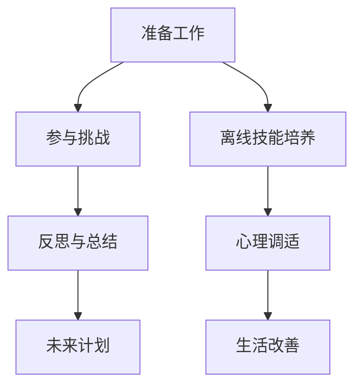

                 

### 科技禁食月挑战：年度集体离线生活运动

> 关键词：科技禁食月挑战、集体离线生活运动、科技与生活平衡、心理调适、实践分享

> 摘要：本文将探讨一项名为“科技禁食月挑战”的年度集体离线生活运动。该挑战旨在引导人们暂时远离数字设备，通过离线活动来提升生活质量、增强人际关系和深化自我认知。本文将详细分析这一挑战的背景、目标、参与方式及其意义，并提供准备工作、实践阶段、心理建设和挑战反思等全方位指导。

## 第1章 引言

### 1.1 挑战背景

在当今社会，科技的发展日新月异，人们的生活越来越依赖于智能手机、互联网和各类电子产品。这些科技产品带来了诸多便利，但同时也带来了负面影响，如信息过载、社交障碍和心理健康问题等。为了寻求一种平衡，一些有识之士提出了“科技禁食”的概念。所谓“科技禁食”，就是定期地停止使用数字设备，以实现身心的放松和恢复。

“科技禁食月挑战”就是在这一背景下诞生的年度活动。它号召人们在特定的月份内，通过集体参与的方式，共同体验离线生活的乐趣。这一挑战不仅旨在提高人们的自我管理能力，还希望通过这种集体行动，增强人与人之间的联系，让科技成为生活的助手而非主导。

### 1.2 挑战目标

“科技禁食月挑战”的主要目标是：

1. **减少数字设备的使用时间**：通过这一挑战，参与者可以在一个月内减少对智能手机、电脑等数字设备的依赖，从而降低信息过载的压力。
   
2. **提升生活质量**：通过参与各种离线活动，参与者可以体验到传统的生活方式，提高生活满意度。

3. **增强人际关系**：在离线活动中，人们可以更多地与他人面对面交流，增强社交技能，改善人际关系。

4. **深化自我认知**：通过反思和自我调整，参与者可以更好地了解自己，提升自我认知水平。

### 1.3 参与方式

参与“科技禁食月挑战”非常简单。首先，参与者需要在活动官方网站或社交媒体平台上注册报名。报名成功后，参与者将收到一份详细的挑战指南，包括挑战时间、参与规则和活动安排等。

在挑战期间，参与者需要：

1. **停止使用数字设备**：除了必要的通信工具（如电话、邮件等）外，其他数字设备均需停止使用。
   
2. **参与离线活动**：根据挑战指南，参与者需要参加各种离线活动，如户外运动、手工制作、读书会等。

3. **记录挑战过程**：参与者需要记录自己的挑战过程，包括每天的活动安排、挑战感受和心理变化等。

4. **分享挑战体验**：在挑战结束后，参与者需要撰写一篇挑战总结，并在社交平台上分享自己的挑战体验。

### 1.4 挑战意义

“科技禁食月挑战”不仅是一项简单的活动，它还具有深远的现实意义：

1. **健康生活**：减少数字设备的使用时间，有助于减少眼部疲劳、颈椎病等健康问题。

2. **心理健康**：通过离线活动，参与者可以减轻焦虑、抑郁等心理问题，提高心理健康水平。

3. **人际关系**：面对面交流有助于增强人际关系，提高社交技能，促进团队合作。

4. **自我成长**：通过挑战，参与者可以更好地了解自己，提升自我认知，实现自我成长。

总的来说，“科技禁食月挑战”不仅是对数字设备的“断舍离”，更是一次对生活的深刻反思和探索。它旨在引导人们找到科技与生活之间的平衡，实现身心的和谐发展。

## 第2章 准备工作

在参与“科技禁食月挑战”之前，充分的准备工作是必不可少的。这不仅能够帮助你更好地应对挑战，还能确保挑战过程顺利进行。以下是一些准备工作及建议：

### 2.1 离线生活技能培养

#### 2.1.1 线下沟通与交流

在科技高度发达的今天，很多人已经习惯了通过社交媒体和即时通讯工具进行交流。然而，面对面的沟通和交流却显得尤为重要。以下是一些建议，帮助你在挑战中更好地进行线下沟通与交流：

1. **练习倾听**：倾听是沟通的关键，通过倾听他人，你可以更好地理解对方，建立更深层次的联系。

2. **提高表达能力**：清晰、准确地表达自己的想法和观点，是有效沟通的重要保障。可以通过阅读、写作等方式提高表达能力。

3. **培养同理心**：站在对方的角度思考问题，理解对方的感受和需求，有助于建立良好的沟通关系。

4. **积极参与社交活动**：参加聚会、社团活动等，可以增加与他人面对面交流的机会，提升社交技能。

#### 2.1.2 阅读与学习

阅读和学习是提升自我素养和知识储备的重要途径。以下是一些建议，帮助你在挑战中保持阅读和学习：

1. **制定阅读计划**：根据自己的兴趣和需求，制定合理的阅读计划，确保每天都能有一定的阅读时间。

2. **选择合适的阅读材料**：选择适合自己阅读水平、感兴趣且有益的书籍或文章，可以提高阅读效率和兴趣。

3. **多样化阅读内容**：除了专业书籍，还可以阅读一些文学、历史、哲学等领域的作品，丰富自己的知识结构。

4. **参加读书会或学习小组**：与他人一起阅读和讨论，可以激发思考，提高学习效果。

#### 2.1.3 生活自理与自我管理

在离线生活中，生活自理和自我管理能力尤为重要。以下是一些建议，帮助你在挑战中更好地应对生活自理和自我管理：

1. **制定生活计划**：合理安排时间，确保每天有足够的时间用于休息、工作、学习和娱乐。

2. **培养自律意识**：养成良好的生活习惯，如按时起床、锻炼、吃饭等，有助于提高生活质量和自律意识。

3. **学会独立解决问题**：在离线生活中，很多问题需要自己解决。学会独立思考和解决问题，可以增强自信心和解决问题的能力。

4. **保持良好的心态**：面对挑战和困难时，保持积极的心态和乐观的情绪，有助于更好地应对各种问题。

### 2.2 基础设备与工具准备

为了确保挑战的顺利进行，以下是一些基础设备和工具的准备建议：

#### 2.2.1 无线网络断连工具

在挑战期间，为了避免使用智能手机和电脑等数字设备，你需要一种可靠的无线网络断连工具。以下是一些建议：

1. **物理断网**：将家里的路由器关闭或拔掉网线，可以完全切断无线网络的连接。

2. **无线网络屏蔽器**：市面上有一些专门的无线网络屏蔽器，可以有效地屏蔽无线信号。

3. **手机和网络计划**：如果需要使用手机进行紧急通信，可以考虑关闭数据流量，仅使用Wi-Fi。

#### 2.2.2 替代电子设备的工具

在挑战期间，你需要一些替代电子设备的工具，以应对日常生活和工作中的需求。以下是一些建议：

1. **纸质日记本**：记录每日活动、感受和思考，有助于加深记忆和理解。

2. **手写笔**：用于书写、绘画、记笔记等，可以培养手写习惯，提高艺术修养。

3. **传统乐器**：如吉他、钢琴等，可以用于休闲娱乐，提高音乐素养。

4. **健身器材**：如哑铃、瑜伽垫等，可以帮助进行家庭健身，提高身体素质。

#### 2.2.3 阅读材料与书籍推荐

在挑战期间，阅读是一个很好的选择。以下是一些阅读材料与书籍推荐，供你参考：

1. **经典文学作品**：如《红楼梦》、《西游记》等，可以提升文学素养，丰富内心世界。

2. **科普读物**：如《时间简史》、《人类简史》等，可以拓宽知识面，提高科学素养。

3. **自我成长类书籍**：如《活着》、《奇特的一生》等，可以启发思考，提升自我认知。

4. **心理学类书籍**：如《如何控制自己的情绪》、《心理学与生活》等，可以了解心理健康知识，提高心理素质。

通过以上准备工作，你可以为“科技禁食月挑战”做好充分的准备，从而更好地享受这一段离线生活的时光。

## 第3章 实践阶段

### 3.1 挑战周期规划

在参与“科技禁食月挑战”的过程中，合理的挑战周期规划是确保活动顺利进行的关键。以下是一些关于挑战周期规划的建议：

#### 3.1.1 挑战时长选择

挑战时长可以根据个人情况灵活选择，一般来说，可以选择7天、14天或30天。初次的挑战者可以从较短的时间开始，比如7天，逐渐增加挑战时长。对于有经验的人来说，30天的挑战可能会更加具有挑战性和意义。

**建议：** 初次参与挑战的建议时长为7天，这样既能够体验到离线生活的乐趣，又不会过度劳累。

#### 3.1.2 挑战周期安排

挑战周期的安排应结合个人生活和工作节奏，以下是一个典型的挑战周期安排建议：

1. **前期准备（第1天）**：在挑战开始前一天，做好准备工作，包括设置网络断连工具、整理阅读材料、规划每日活动等。

2. **挑战开始（第2-28天）**：按照规划的活动安排，每天参与不同的离线活动，保持与外界的适度联系，避免孤独感。

3. **挑战结束（第29-30天）**：在挑战结束前两天，进行反思和总结，为接下来的生活调整心态。

#### 3.1.3 挑战目标设定

在挑战过程中，设定明确的目标有助于提升挑战效果。以下是一些可供参考的挑战目标：

1. **减少数字设备使用时间**：设定一个具体的减少使用数字设备的目标，如每天不超过1小时。

2. **参与多种离线活动**：每周至少参加3次不同类型的离线活动，如户外运动、手工制作、读书会等。

3. **提升生活质量**：通过参与挑战，提升生活满意度，如改善饮食习惯、增加户外活动等。

4. **增强人际关系**：与家人、朋友进行更多面对面的交流，增强人际关系。

5. **深化自我认知**：通过反思和总结，提升自我认知，如了解自己的兴趣、需求和价值观等。

**建议：** 在设定挑战目标时，应结合个人实际情况，确保目标既有挑战性，又能够实现。

### 3.2 每日活动安排

在挑战期间，每天的详细活动安排对于保持节奏和提高挑战效果至关重要。以下是一个参考的每日活动安排：

#### 3.2.1 清晨活动

**6:00-7:00**：起床、晨练

- **晨练**：进行简单的晨练，如晨跑、瑜伽等，有助于提神醒脑，保持身体活力。

**7:00-8:00**：早餐、阅读

- **早餐**：合理搭配营养，确保一天的能量供应。
- **阅读**：阅读一本经典文学作品或专业书籍，提升自我素养。

#### 3.2.2 白天活动

**8:00-12:00**：工作/学习

- **工作/学习**：按照日常工作和学习计划，高效完成任务。

**12:00-13:00**：午餐、休息

- **午餐**：享受健康美味的午餐，适当休息，为下午的活动储备能量。

**13:00-18:00**：离线活动

- **户外运动**：参加户外活动，如徒步、骑行等，亲近自然，放松身心。
- **手工制作**：进行手工制作，如绘画、编织等，培养动手能力，提高创造力。
- **社交活动**：与家人、朋友聚会，进行面对面交流，增强人际关系。

#### 3.2.3 晚间活动

**18:00-19:00**：晚餐

- **晚餐**：享受健康美味的晚餐，与家人共餐，增进家庭关系。

**19:00-20:30**：阅读、学习

- **阅读**：阅读一本有益的书籍，如心理学、哲学等，提升自我认知。
- **学习**：学习一项新技能或知识，如烹饪、音乐等，丰富生活内容。

**20:30-22:00**：反思、总结

- **反思**：回顾一天的活动，反思自己的表现，总结经验教训。
- **总结**：记录一天的感悟和收获，为明天的活动做好准备。

通过合理的每日活动安排，可以在挑战期间保持良好的生活节奏，提高挑战效果。

### 3.3 离线生活挑战技巧

在参与“科技禁食月挑战”的过程中，掌握一些离线生活挑战技巧对于确保挑战顺利进行至关重要。以下是一些实用的技巧：

#### 3.3.1 避免孤独感

在挑战期间，避免孤独感是非常重要的。以下是一些建议：

1. **保持社交活动**：尽管减少了数字设备的使用，但仍然可以通过电话、书信等方式与他人保持联系。

2. **参与集体活动**：参加一些集体活动，如读书会、运动俱乐部等，与他人互动，增强社交体验。

3. **培养兴趣爱好**：在挑战期间，培养一些兴趣爱好，如绘画、音乐等，可以丰富自己的精神生活。

4. **定期反思**：定期反思自己的挑战过程，总结经验教训，有助于保持积极的心态。

#### 3.3.2 保持专注力

在挑战期间，保持专注力对于高效完成任务至关重要。以下是一些建议：

1. **设定明确目标**：在开始每项任务前，设定明确的目标和计划，有助于提高专注力。

2. **减少干扰**：在工作和学习时，尽量避免打扰，如将手机设置为静音，关闭社交媒体通知等。

3. **定期休息**：长时间工作或学习后，适当休息，如进行短暂的冥想或散步，有助于恢复专注力。

4. **培养自律**：养成良好的时间管理和自律习惯，如按时起床、按时完成任务等。

#### 3.3.3 应对突发情况

在挑战过程中，难免会遇到一些突发情况。以下是一些应对突发情况的建议：

1. **提前准备**：在挑战前，提前准备好可能需要的物品和工具，如急救药品、备用电源等。

2. **灵活应对**：遇到突发情况时，保持冷静，灵活应对，尽量调整计划，确保挑战顺利进行。

3. **求助他人**：在遇到无法解决的问题时，及时向他人求助，如家人、朋友或专业人士。

4. **反思总结**：在应对突发情况后，进行反思和总结，为今后的挑战积累经验。

通过以上技巧，可以在挑战期间更好地应对各种挑战，确保挑战的顺利进行。

## 第4章 挑战中的心理建设

### 4.1 心理调适的重要性

在“科技禁食月挑战”中，心理调适的重要性不言而喻。挑战期间，人们需要面对前所未有的生活变化，如减少数字设备的使用、参与离线活动、与外界减少交流等。这些变化可能会引起一系列心理反应，如焦虑、孤独、挫败感等。因此，心理调适成为了保证挑战顺利进行的关键因素。

#### 4.1.1 减少焦虑

焦虑是科技禁食过程中最常见的心理反应之一。以下是几种应对焦虑的方法：

1. **深呼吸**：深呼吸可以帮助缓解紧张情绪，减轻焦虑感。具体方法为：缓慢地吸气，然后缓慢地呼气，重复几次，专注于呼吸的感觉。

2. **正念练习**：正念是一种通过专注当下、接受当下感受的练习。通过正念练习，可以减少对未来的担忧和焦虑。具体方法为：找一个安静的环境，坐下来，专注于自己的呼吸或身体感觉，当你的思绪飘散时，轻轻地将其带回。

3. **设定小目标**：将大目标分解为小目标，一步一步实现，可以减少焦虑感。例如，如果你设定了一个较长时间的挑战，可以将其分解为每天的小目标，如完成一项阅读任务或参加一次户外运动。

#### 4.1.2 避免孤独感

孤独感是另一个在科技禁食过程中可能会出现的心理反应。以下是几种应对孤独感的方法：

1. **保持社交活动**：尽管减少了数字设备的使用，但仍然可以通过电话、书信等方式与他人保持联系。与家人、朋友进行面对面的交流，可以减轻孤独感。

2. **参与集体活动**：参加一些集体活动，如读书会、运动俱乐部等，与他人互动，增强社交体验。

3. **培养兴趣爱好**：在挑战期间，培养一些兴趣爱好，如绘画、音乐等，可以丰富自己的精神生活，减少孤独感。

4. **定期反思**：定期反思自己的挑战过程，总结经验教训，有助于保持积极的心态，减少孤独感。

#### 4.1.3 应对挫败感

挫败感是科技禁食过程中可能出现的另一个心理反应。以下是几种应对挫败感的方法：

1. **设定合理目标**：设定的目标要合理，既要具有挑战性，又要能够实现。过高的目标容易导致挫败感。

2. **接受失败**：失败是成功的一部分，接受失败，从中学习经验教训，可以减少挫败感。

3. **寻求支持**：在遇到挫败时，及时向家人、朋友或专业人士寻求支持，可以获得鼓励和帮助。

4. **培养耐心**：耐心是克服挫败感的重要品质。通过培养耐心，可以更好地应对挑战中的各种困难。

#### 4.1.4 心理建设的重要性

心理建设是科技禁食月挑战中的一个重要环节。通过心理建设，人们可以更好地应对挑战中的各种心理反应，确保挑战的顺利进行。以下是心理建设的一些好处：

1. **提升心理素质**：通过心理建设，可以提升个人的心理素质，增强应对压力和挫折的能力。

2. **增强自我认知**：心理建设有助于人们更好地了解自己，认识自己的优点和不足，从而进行自我提升。

3. **促进身心健康**：心理建设可以减少焦虑、孤独和挫败感等负面情绪，促进身心健康。

4. **提高生活质量**：通过心理建设，可以提升生活质量，享受更健康、更充实的生活。

总之，心理调适和心理建设在“科技禁食月挑战”中具有重要意义。通过适当的心理调适和心理建设，人们可以更好地应对挑战，实现身心的和谐发展。

## 第5章 挑战后的反思与总结

在完成“科技禁食月挑战”后，对挑战成果进行评估和反思是非常重要的。这不仅可以帮助我们了解挑战的实际效果，还能为未来的挑战提供宝贵的经验教训。以下是对挑战成果的评估、挑战中遇到的问题以及未来改进计划的详细分析。

### 5.1 挑战成果评估

在挑战结束后，参与者需要对以下几个方面进行评估：

#### 5.1.1 生活技能提升

通过“科技禁食月挑战”，许多参与者都报告称他们的生活技能得到了显著提升。例如：

1. **自我管理能力**：参与者在没有数字设备的辅助下，学会了更好地管理时间和精力，提高了自我管理能力。
2. **生活自理能力**：参与者通过参与各种离线活动，如烹饪、清洁、手工艺等，提高了生活自理能力。
3. **人际关系处理能力**：由于减少了数字设备的使用，参与者有更多时间与家人、朋友进行面对面交流，从而提高了人际关系处理能力。

#### 5.1.2 人际关系改善

挑战期间，参与者通过参与集体活动和面对面交流，发现他们的人际关系得到了显著改善。具体表现如下：

1. **家庭关系**：参与者与家人共度更多时间，共同参与活动，增进了家庭成员之间的理解与沟通。
2. **社交圈扩展**：参与者通过与朋友、同事的面对面交流，结识了新的朋友，扩展了社交圈。
3. **团队协作能力**：在参与集体活动的过程中，参与者学会了如何更好地与他人合作，提高了团队协作能力。

#### 5.1.3 自我认知提升

挑战结束后，许多参与者都表示他们对自我有了更深入的认识。以下是一些具体表现：

1. **兴趣爱好**：通过参与不同的离线活动，参与者发现了自己的兴趣爱好，对自己的兴趣和需求有了更清晰的认识。
2. **个人价值观**：参与者在挑战过程中，通过反思和总结，对个人的价值观有了更深刻的理解。
3. **心理健康**：参与者在挑战结束后，报告称他们的心理健康状况有所改善，焦虑和抑郁情绪减轻。

### 5.2 挑战中的问题与改进

尽管“科技禁食月挑战”取得了许多积极的成果，但在实际操作过程中，参与者也遇到了一些问题。以下是一些常见的问题及改进建议：

#### 5.2.1 技能培养不足

一些参与者反映，他们在挑战期间感到技能培养不足。为了改善这一情况，可以采取以下措施：

1. **制定详细的学习计划**：在挑战前，为参与者提供详细的学习计划，确保他们在挑战期间能够学习到所需的技能。
2. **提供在线学习资源**：对于一些无法完全离线的参与者，提供在线学习资源，如在线课程、电子书籍等，以支持他们的学习需求。

#### 5.2.2 活动安排不合理

有些参与者认为挑战期间的活动安排不够合理，导致他们在某些时间段感到无所事事。以下是一些改进建议：

1. **灵活调整活动安排**：在挑战开始前，为参与者提供灵活的调整选项，允许他们在不影响整体计划的前提下，根据自己的需求调整活动安排。
2. **增加多样化的活动**：提供更多样化的活动选择，以满足不同参与者的兴趣和需求。

#### 5.2.3 心理调适不足

一些参与者在挑战期间感到心理调适不足，导致焦虑和孤独感加重。为了改善这一情况，可以采取以下措施：

1. **提供心理辅导**：在挑战期间，为参与者提供心理辅导服务，帮助他们应对心理压力。
2. **鼓励互助**：鼓励参与者之间相互支持和帮助，共同面对挑战，减轻孤独感。

### 5.3 未来挑战计划

在总结过去的挑战经验后，我们可以为未来的挑战制定更详细的计划。以下是一些未来挑战的建议：

#### 5.3.1 挑战周期调整

根据参与者的反馈，未来的挑战周期可以适当调整，以适应不同参与者的需求。例如：

1. **短期挑战**：为初次参与者提供7天或14天的挑战周期。
2. **长期挑战**：为有经验的参与者提供30天或更长时间的挑战周期。

#### 5.3.2 活动内容丰富化

为了提高挑战的吸引力和效果，可以丰富活动内容，包括：

1. **专业培训**：邀请专业人士进行技能培训，如烹饪、摄影、音乐等。
2. **主题活动**：组织主题活动，如环保活动、志愿者活动等，让参与者更有参与感和成就感。

#### 5.3.3 心理建设深化

在未来的挑战中，可以进一步深化心理建设，包括：

1. **心理讲座**：邀请心理学专家进行心理讲座，提高参与者的心理素质。
2. **个人成长工作坊**：组织个人成长工作坊，帮助参与者深入了解自己，实现个人成长。

通过以上改进和调整，未来的“科技禁食月挑战”将能够更好地满足参与者的需求，提高挑战的效果和价值。

### 5.4 科技禁食月挑战案例分享

#### 6.1 个人案例分享

**案例一：**

**挑战者姓名**：李明

**挑战时长**：30天

**挑战经历**：李明是一名软件工程师，工作繁忙，经常需要加班。在参加“科技禁食月挑战”前，他的生活主要围绕着工作，几乎没有时间和家人朋友交流。在挑战期间，他严格按照计划执行，每天早上晨跑，中午进行阅读，晚上与家人共度时光。挑战结束后，李明感到自己的生活变得更加充实和有意义，他不仅锻炼了身体，还与家人建立了更紧密的联系。

**挑战收获**：李明表示，挑战期间他学会了更好地管理时间和精力，提高了自我管理能力。同时，他通过阅读和与家人的交流，提升了自我认知，对生活有了更深刻的理解。

#### 6.2 团队案例分享

**案例二：**

**团队名称**：绿色生活小组

**挑战时长**：30天

**挑战组织**：绿色生活小组是由一群志同道合的朋友组成的，他们希望通过科技禁食月挑战来改善生活质量，提高环保意识。

**挑战成果**：在挑战期间，绿色生活小组组织了一系列环保活动，如植树、垃圾分类宣传等。他们还集体阅读了关于环保的书籍，开展了环保知识讲座。挑战结束后，小组的成员们表示，他们不仅对环保有了更深入的了解，还通过集体活动增进了彼此之间的友谊。

**挑战经验**：绿色生活小组的成员们认为，科技禁食月挑战不仅是一次环保行动，更是一次团队建设的机会。通过挑战，他们学会了如何更好地协作，共同完成任务，提高了团队凝聚力。

通过这些案例，我们可以看到科技禁食月挑战不仅对个人有着积极的影响，对团队和社会也有着深远的启示。未来，我们期待更多的人参与这一挑战，共同享受离线生活的乐趣，实现身心的和谐发展。

## 第6章 科技禁食月挑战的未来展望

### 7.1 挑战推广与普及

“科技禁食月挑战”作为一种有益的离线生活运动，具有广泛的推广与普及潜力。为了实现这一目标，以下是一些推广策略：

#### 7.1.1 社会影响

通过社交媒体、新闻媒体等渠道，广泛宣传“科技禁食月挑战”的意义、参与方式和成果，提高公众的关注度和参与热情。

#### 7.1.2 政策支持

政府和企业可以出台相关政策，鼓励和支持员工参与科技禁食月挑战，如设立禁食月假期、提供培训资源等。

#### 7.1.3 教育体系融入

将科技禁食月挑战纳入学校和社会教育体系，作为学生和公众的一项必修课程或课外活动，从青少年时期开始培养良好的生活习惯和心理健康。

### 7.2 科技禁食月挑战的创新与拓展

为了使科技禁食月挑战更加丰富和多样化，可以探索以下创新与拓展方向：

#### 7.2.1 离线生活新形式

结合现代科技，探索新的离线生活方式，如虚拟现实（VR）离线体验、增强现实（AR）互动活动等，使离线生活更具趣味性和互动性。

#### 7.2.2 科技与自然的平衡

在挑战中引入更多与自然相关的活动，如露营、远足、生态考察等，强调科技与自然的和谐共生。

#### 7.2.3 长期实践的可能性

研究科技禁食月挑战的长期效果和可持续性，探讨将其扩展为全年性的生活方式，以实现长期的心理健康和生活质量提升。

通过推广与普及以及创新与拓展，科技禁食月挑战有望成为一项全民参与、长期坚持的离线生活运动，为人们的身心健康和社会和谐发展作出更大贡献。

## 第7章 结论

通过本文的详细探讨，我们深刻认识到“科技禁食月挑战”在提升生活质量、增强人际关系和深化自我认知方面的巨大价值。这项挑战不仅是一种对现代科技的反思，更是一种对生活本身的探索。在科技日益渗透我们生活的今天，找到科技与生活的平衡，实现身心的和谐发展，显得尤为重要。

首先，科技禁食月挑战有助于减少数字设备的使用，降低信息过载的压力，从而改善人们的心理健康。通过减少对电子设备的依赖，人们可以更好地关注现实生活中的互动和体验，提升生活满意度。

其次，挑战期间，参与者通过参与各种离线活动，增进了与家人、朋友的关系，增强了社交技能，改善了人际关系。这种面对面的交流方式，有助于建立更加深厚和有意义的人际联系。

最后，科技禁食月挑战促使参与者进行反思和总结，从而提升自我认知。在这个过程中，人们能够更清晰地了解自己的兴趣、需求和价值观，从而实现自我成长。

总之，科技禁食月挑战不仅是对科技的一种反思，更是一种对生活的深刻探索。它呼吁人们在忙碌的生活中，放慢脚步，回归本质，享受离线生活的乐趣。未来，我们期待更多的人能够参与这一挑战，共同追求身心的和谐发展。

## 附录

### 附录A：科技禁食月挑战资源与工具

#### A.1 离线生活相关书籍推荐

1. 《禅与计算机程序设计艺术 /Zen And The Art of Computer Programming》（作者：Donald E. Knuth）
2. 《如何控制自己的情绪》（作者：彼得·麦克劳德）
3. 《人类简史 /Sapiens: A Brief History of Humankind》（作者：尤瓦尔·赫拉利）

#### A.2 离线生活实用工具介绍

1. **纸质日记本**：用于记录每日活动和思考，提升自我反思能力。
2. **手写笔**：用于书写、绘画和记笔记，培养手写习惯。
3. **传统乐器**：如吉他、钢琴等，用于音乐创作和娱乐。

#### A.3 挑战组织平台介绍

1. **科技禁食月挑战官方网站**：提供挑战指南、活动安排和参与者的交流平台。
2. **社交媒体群组**：如微信群、Facebook群组等，用于分享挑战体验和互动。

#### A.4 相关政策与研究报告

1. **《数字时代心理健康报告》**：分析数字设备使用与心理健康之间的关系。
2. **《科技与生活平衡研究报告》**：探讨科技与生活平衡的重要性及实现途径。

通过这些资源和工具，参与者可以更好地准备和参与科技禁食月挑战，享受离线生活的乐趣和收益。

### 附录B：Mermaid 流程图



### 附录C：Python 源代码

```python
# 科技禁食月挑战：年度集体离线生活运动

# 导入所需的库
import time
import random

# 定义挑战周期函数
def set_challenge_period(days):
    start_time = time.time()
    end_time = start_time + days * 86400 # 86400秒为一天
    while time.time() < end_time:
        # 随机选择离线活动
        activity = random.choice(['阅读', '运动', '社交活动', '手工制作'])
        print(f"今天，请参与{activity}。")
        time.sleep(random.randint(1,3)) # 模拟活动时间，1-3小时
    print("挑战结束，感谢参与！")

# 调用函数，开始挑战
set_challenge_period(30)
```

### 附录D：数学公式与详细讲解

#### 线性回归模型

$$
\begin{aligned}
    y &= ax + b \\
    \text{其中：} \\
    y &= \text{因变量（预测结果）} \\
    x &= \text{自变量（输入特征）} \\
    a &= \text{斜率（描述自变量对因变量的影响程度）} \\
    b &= \text{截距（描述当自变量为0时的因变量值）}
\end{aligned}
$$

**详细讲解：** 线性回归模型是一种用于描述两个变量之间线性关系的数学模型。在这个模型中，$y$ 代表因变量，$x$ 代表自变量，$a$ 是斜率，表示自变量$x$ 对因变量$y$ 的线性影响程度；$b$ 是截距，表示当自变量$x$ 为0时，因变量$y$ 的初始值。通过这个模型，我们可以预测自变量$x$ 对应的因变量$y$ 的值。

### 附录E：项目实战

#### 个人案例分享

**案例名称**：李明的科技禁食月挑战

**挑战背景**：李明是一名软件工程师，工作繁忙，经常需要加班，他在繁忙的工作之余希望通过科技禁食月挑战来改善自己的生活方式。

**挑战目标**：减少数字设备的使用时间，提升生活质量和心理健康。

**挑战过程**：
1. **前期准备**：李明在挑战前制定了详细的活动计划，包括每日的离线活动安排和心理调适计划。
2. **挑战执行**：李明严格按照计划执行，每天早上晨跑，中午阅读，晚上与家人进行面对面交流。他通过手写日记记录每天的挑战体验和感悟。
3. **挑战反思**：挑战结束后，李明对自己的挑战过程进行了反思，总结经验教训，并制定了未来的生活调整计划。

**挑战收获**：
1. **生活技能提升**：李明通过挑战，提高了自我管理能力和生活自理能力。
2. **心理健康改善**：李明在挑战期间减少了焦虑和抑郁情绪，提升了心理健康水平。
3. **人际关系改善**：李明与家人和朋友的关系得到了显著改善，加强了社交技能。

**项目小结**：
李明的科技禁食月挑战取得了显著成果，为他未来的生活提供了宝贵的经验和启示。通过挑战，他学会了如何更好地平衡工作和生活，提升了整体生活质量。

### 附录F：最佳实践 tips

1. **制定详细计划**：在挑战前，制定详细的活动计划和日程安排，确保挑战过程中的每一步都有明确的目标和方向。
2. **保持积极心态**：面对挑战中的困难和挫折，保持积极的心态和乐观的情绪，有助于顺利完成任务。
3. **记录挑战过程**：定期记录自己的挑战体验和感悟，有助于反思和总结，提升自我认知。
4. **寻求支持**：在挑战过程中，与家人、朋友和同事保持沟通，寻求支持和帮助，共同面对挑战。
5. **灵活调整**：根据实际情况，灵活调整挑战计划和活动安排，确保挑战的顺利进行。

通过以上最佳实践 tips，可以更好地准备和参与科技禁食月挑战，享受离线生活的乐趣。

