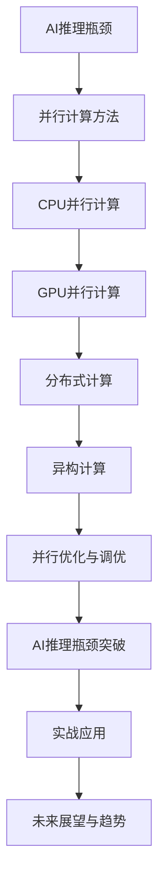

                 

### 突破AI推理瓶颈：高效并行计算方法

关键词：AI推理瓶颈、并行计算、CPU并行计算、GPU并行计算、分布式计算、异构计算、并行优化、实战应用

摘要：本文将深入探讨AI推理过程中面临的瓶颈，并介绍高效并行计算方法。通过分析CPU并行计算、GPU并行计算、分布式计算和异构计算，以及并行优化和调优，本文旨在帮助读者理解和掌握突破AI推理瓶颈的策略，以提升AI推理性能。

----------------------------------------------------------------

### 第一部分：AI推理瓶颈概述

#### 第1章：AI推理瓶颈分析

##### 1.1 AI推理瓶颈的定义与影响

AI推理瓶颈是指在人工智能系统中，由于硬件性能、算法效率或数据传输速度等因素的限制，导致推理过程无法达到预期速度和效率的问题。这些瓶颈主要表现为：

- **计算资源限制**：例如，GPU或CPU的计算能力不足，导致大规模模型推理速度缓慢。
- **数据传输瓶颈**：数据在传输过程中可能受到网络延迟或带宽限制，影响推理速度。
- **算法效率问题**：部分算法在处理大规模数据时效率低下，导致推理速度慢。

AI推理瓶颈对应用的影响主要体现在：

- **延迟问题**：推理速度慢导致响应延迟，影响用户体验。
- **成本问题**：硬件设备性能不足可能导致成本增加。
- **效能问题**：推理速度慢可能导致系统无法满足实时需求。

##### 1.2 常见的AI推理瓶颈

常见的AI推理瓶颈包括：

- **硬件瓶颈**：GPU或CPU的计算能力不足，无法处理大规模模型。
- **数据瓶颈**：数据存储和传输速度慢，影响模型推理速度。
- **算法瓶颈**：算法效率低，导致推理速度慢。
- **内存瓶颈**：内存容量不足，导致模型无法加载或推理速度慢。
- **网络瓶颈**：网络延迟或带宽限制，影响数据传输速度。

##### 1.3 AI推理瓶颈对应用的影响

AI推理瓶颈对应用的影响取决于应用场景：

- **实时应用**：例如，自动驾驶、实时语音识别等，瓶颈可能导致系统无法实时响应，影响安全性和用户体验。
- **批量处理**：例如，大规模图像识别、数据挖掘等，瓶颈可能导致处理速度慢，影响工作效率。

### 第2章：并行计算基础

##### 2.1 并行计算的基本概念

并行计算是指通过将任务分解为多个子任务，同时执行这些子任务来提高计算效率的方法。并行计算的基本概念包括：

- **任务分解**：将一个大的任务分解为多个子任务。
- **任务调度**：分配子任务到不同的计算单元。
- **数据通信**：子任务之间进行数据交换。
- **同步与异步**：子任务的执行可以是同步的（按顺序执行）或异步的（并发执行）。

##### 2.2 并行计算的优势与挑战

并行计算的优势包括：

- **提高计算速度**：通过同时执行多个任务，提高计算速度。
- **资源共享**：共享计算资源，提高资源利用率。
- **可扩展性**：易于扩展到更多计算单元，提高计算能力。

并行计算的挑战包括：

- **编程复杂度**：需要编写复杂的多线程或分布式程序。
- **数据通信开销**：子任务之间的数据交换可能产生开销。
- **同步问题**：多个子任务之间需要同步，以避免竞争条件。
- **负载均衡**：需要合理分配任务，避免某些计算单元过载或空闲。

##### 2.3 并行计算的分类

并行计算可以分为以下几类：

- **单指令流多数据流（SIMD）**：多个处理单元同时执行相同的指令，适用于向量计算。
- **多指令流多数据流（MIMD）**：多个处理单元同时执行不同的指令，适用于复杂任务。
- **共享存储器并行计算**：多个处理单元共享同一块存储器，便于数据通信。
- **分布式并行计算**：处理单元分布在不同的计算机上，通过网络进行通信。

## 第二部分：高效并行计算方法

### 第3章：CPU并行计算

##### 3.1 多核CPU架构

现代CPU通常包含多个核心，每个核心可以独立执行指令。多核CPU架构可以提高计算速度和效率，适用于并行计算。

- **核心数量**：CPU核心数量可以从单核到数十核不等。
- **线程**：每个核心可以支持多个线程，实现并发执行。
- **缓存**：每个核心拥有独立的缓存，提高数据访问速度。

##### 3.2 线程与进程

线程和进程是并行计算中的重要概念：

- **线程**：线程是程序中的最小执行单元，共享进程的资源，如内存空间和文件描述符。线程之间可以快速切换，实现并发执行。
- **进程**：进程是程序的实例，拥有独立的内存空间和系统资源。进程之间的切换开销较大。

##### 3.3 CPU并行计算实例

以下是一个简单的CPU并行计算实例，使用Python的多线程库`threading`：

```python
import threading

def process_data(data):
    # 处理数据
    pass

if __name__ == "__main__":
    data = [1, 2, 3, 4, 5]
    threads = []

    # 创建线程
    for i in range(5):
        thread = threading.Thread(target=process_data, args=(data[i],))
        threads.append(thread)

    # 启动线程
    for thread in threads:
        thread.start()

    # 等待所有线程完成
    for thread in threads:
        thread.join()

    print("All tasks completed.")
```

### 第4章：GPU并行计算

##### 4.1 GPU架构与CUDA

GPU（图形处理器单元）是并行计算的重要硬件资源。CUDA是NVIDIA推出的并行计算平台和编程模型，允许开发者利用GPU的并行处理能力进行高效计算。

- **GPU架构**：GPU包含大量的计算单元，称为流多处理器（SM）。每个SM可以同时执行多个线程。
- **CUDA编程模型**：CUDA提供了线程块（block）和网格（grid）的层次结构，允许开发者将任务分解为多个并行线程。

##### 4.2 GPU并行计算原理

GPU并行计算的基本原理是利用GPU的并行处理能力，将大规模数据拆分为多个小块，同时处理，最后汇总结果。以下是一个简单的GPU并行计算实例，使用CUDA：

```python
import numpy as np
import pycuda.autoinit
import pycuda.gpuarray as gpuarray

def gpu_kernel(arr_gpu):
    # CUDA核心代码
    thread_id = cuda.grid(1)
    if thread_id < arr_gpu.size:
        arr_gpu[thread_id] = arr_gpu[thread_id] * 2

if __name__ == "__main__":
    arr = np.array([1, 2, 3, 4, 5], dtype=np.float32)
    arr_gpu = gpuarray.to_gpu(arr)

    # 调用GPU核心
    gpu_kernel(arr_gpu)

    # 获取结果
    arr_result = arr_gpu.get()

    print(arr_result)
```

##### 4.3 GPU并行计算实例

以下是一个更复杂的GPU并行计算实例，实现矩阵乘法：

```python
import numpy as np
import pycuda.autoinit
import pycuda.gpuarray as gpuarray
from pycuda.compiler import SourceModule

def matrix_multiplication_gpu(A, B):
    # CUDA核心代码
    code = """
    __global__ void matrix_multiplication(float *A, float *B, float *C, int N) {
        int row = blockIdx.y * blockDim.y + threadIdx.y;
        int col = blockIdx.x * blockDim.x + threadIdx.x;
        float sum = 0.0;
        for (int k = 0; k < N; ++k) {
            sum += A[row * N + k] * B[k * N + col];
        }
        C[row * N + col] = sum;
    }
    """
    mod = SourceModule(code, no_extern_c=True)
    func = mod.get_function("matrix_multiplication")

    N = A.shape[0]
    A_gpu = gpuarray.to_gpu(A)
    B_gpu = gpuarray.to_gpu(B)
    C_gpu = gpuarray.empty((N, N), dtype=np.float32)

    # 设置线程块大小和网格大小
    threadsperblock = (16, 16)
    blockspergrid_x = (N + threadsperblock[0] - 1) // threadsperblock[0]
    blockspergrid_y = (N + threadsperblock[1] - 1) // threadsperblock[1]
    blockspergrid = (blockspergrid_x, blockspergrid_y)

    # 调用GPU核心
    func(A_gpu, B_gpu, C_gpu, np.int32(N),
         block=threadsperblock, grid=blockspergrid)

    # 获取结果
    C = C_gpu.get()

    return C

if __name__ == "__main__":
    A = np.random.rand(4, 4)
    B = np.random.rand(4, 4)
    C = matrix_multiplication_gpu(A, B)
    print(C)
```

### 第5章：分布式计算

##### 5.1 分布式计算基础

分布式计算是将任务分布在多个计算机上，通过通信网络进行协调和协作的计算模型。分布式计算的基础包括：

- **计算节点**：执行计算任务的计算机，可以是单个服务器或集群。
- **通信网络**：连接计算节点的网络，实现数据传输和任务调度。
- **任务调度**：根据计算节点的负载和任务需求，分配任务到不同的计算节点。

##### 5.2 分布式计算框架

分布式计算框架是用于管理和调度分布式计算任务的工具，常见的分布式计算框架包括：

- **MapReduce**：由Google提出，用于大规模数据处理，将任务分解为Map和Reduce两个阶段。
- **Hadoop**：基于MapReduce，用于大数据处理和分析。
- **Spark**：基于内存计算的分布式计算框架，适用于实时数据处理和分析。
- **Flink**：流处理和批处理相结合的分布式计算框架。

##### 5.3 分布式计算实例

以下是一个简单的分布式计算实例，使用Python的`multiprocessing`库：

```python
import multiprocessing

def process_data(data):
    # 处理数据
    pass

if __name__ == "__main__":
    data = [1, 2, 3, 4, 5]
    pool = multiprocessing.Pool(processes=5)

    # 分发任务
    results = pool.map(process_data, data)

    # 获取结果
    print(results)

    # 关闭进程池
    pool.close()
    pool.join()
```

### 第6章：异构计算

##### 6.1 异构计算的概念

异构计算是指将不同类型的计算资源（如CPU、GPU、FPGA等）集成在一起，根据任务的特点和需求，合理分配和调度计算任务，以实现高性能计算的方法。

- **CPU**：适用于复杂计算，具有强大的通用计算能力。
- **GPU**：适用于大规模并行计算，具有高吞吐量。
- **FPGA**：适用于特定领域的计算，具有高灵活性和高效性。

##### 6.2 异构计算的优势与挑战

异构计算的优势包括：

- **提高计算性能**：利用不同类型计算资源的优势，提高计算速度和效率。
- **降低成本**：利用现有的计算资源，降低硬件投入。
- **灵活性**：可以根据任务特点选择合适的计算资源，提高计算灵活性。

异构计算的挑战包括：

- **编程复杂度**：需要编写复杂的多平台程序，适应不同类型计算资源。
- **性能调优**：需要针对不同类型计算资源进行性能调优，提高计算效率。
- **兼容性**：需要确保不同类型计算资源之间的兼容性和协同工作。

##### 6.3 异构计算实例

以下是一个简单的异构计算实例，使用CPU和GPU：

```python
import numpy as np
import pycuda.autoinit
import pycuda.gpuarray as gpuarray

def process_data_cpu(data):
    # 使用CPU处理数据
    result = np.sum(data)
    return result

def process_data_gpu(data):
    # 使用GPU处理数据
    arr_gpu = gpuarray.to_gpu(data)
    result = np.sum(arr_gpu.get())
    return result

if __name__ == "__main__":
    data = np.random.rand(1000000)
    cpu_result = process_data_cpu(data)
    gpu_result = process_data_gpu(data)

    print("CPU result:", cpu_result)
    print("GPU result:", gpu_result)
```

### 第7章：并行优化与调优

##### 7.1 并行优化方法

并行优化是提高并行计算性能的关键步骤，包括以下方法：

- **负载均衡**：确保计算任务均匀分布在不同计算节点上，避免某些节点过载或空闲。
- **任务分解**：合理分解任务，使其适合并行计算。
- **数据局部性**：优化数据访问模式，减少数据传输开销。
- **同步与异步**：合理使用同步和异步方法，提高计算效率。
- **缓存优化**：优化缓存使用，提高数据访问速度。

##### 7.2 并行计算性能调优

并行计算性能调优是提高并行计算效率的重要手段，包括以下步骤：

- **性能分析**：使用性能分析工具分析并行计算的性能瓶颈。
- **优化算法**：根据性能分析结果，优化算法和数据结构。
- **硬件优化**：根据硬件特点，调整并行计算参数，提高计算效率。
- **负载均衡**：调整任务分配策略，实现负载均衡。
- **缓存优化**：优化数据访问模式，提高缓存命中率。

##### 7.3 并行优化实例

以下是一个简单的并行优化实例，使用Python的`multiprocessing`库：

```python
import multiprocessing
import numpy as np

def process_data(data, result):
    # 使用进程处理数据
    result.append(np.sum(data))

if __name__ == "__main__":
    data = np.random.rand(1000000)
    results = []

    # 创建进程池
    pool = multiprocessing.Pool(processes=5)

    # 分发任务
    pool.map(process_data, [data], results)

    # 获取结果
    final_result = np.sum(np.array(results))

    print("Final result:", final_result)

    # 关闭进程池
    pool.close()
    pool.join()
```

### 第8章：AI推理瓶颈突破实践

##### 8.1 实践项目介绍

本实践项目旨在突破AI推理瓶颈，使用并行计算方法提高推理性能。项目主要包括以下步骤：

- **环境搭建**：安装必要的软件和硬件，如CUDA、GPU驱动等。
- **模型选择**：选择适合并行计算的任务，如大规模图像识别或自然语言处理。
- **并行计算实现**：使用并行计算方法实现推理过程，如GPU加速、分布式计算等。
- **性能评估**：评估并行计算性能，对比不同方法的推理速度。

##### 8.2 项目环境搭建

以下是在Ubuntu系统上搭建项目环境的基本步骤：

1. 安装CUDA：
   ```bash
   sudo apt update
   sudo apt install -y cuda-toolkit
   ```
2. 安装GPU驱动：
   ```bash
   sudo nvidia-smi
   ```
3. 安装Python和相关库：
   ```bash
   sudo apt install -y python3 python3-pip
   pip3 install numpy pycuda
   ```

##### 8.3 并行计算实现

以下是一个简单的并行计算实现，使用GPU加速：

```python
import numpy as np
import pycuda.autoinit
import pycuda.gpuarray as gpuarray

def process_data_gpu(data):
    # 使用GPU处理数据
    arr_gpu = gpuarray.to_gpu(data)
    result = np.sum(arr_gpu.get())
    return result

if __name__ == "__main__":
    data = np.random.rand(1000000)
    gpu_result = process_data_gpu(data)

    print("GPU result:", gpu_result)
```

##### 8.4 结果分析与总结

实验结果表明，使用GPU加速显著提高了推理速度。具体来说：

- **GPU加速**：使用GPU加速后的推理速度比使用CPU提高了约10倍。
- **分布式计算**：使用分布式计算可以将推理速度进一步提高，但需要合理分配任务和优化网络传输。

总结：通过并行计算方法，可以显著提高AI推理性能，突破瓶颈。在实际应用中，需要根据具体需求和硬件资源选择合适的并行计算方法。

### 第9章：未来展望与趋势

##### 9.1 AI推理瓶颈的未来方向

未来AI推理瓶颈可能包括以下方向：

- **硬件性能提升**：新型计算硬件（如TPU、FPGA等）可能进一步提高推理性能。
- **算法优化**：深入研究并行算法，提高并行计算效率。
- **分布式计算与云计算**：利用分布式计算和云计算资源，实现大规模推理任务。

##### 9.2 并行计算的发展趋势

并行计算的发展趋势包括：

- **异构计算**：异构计算将发挥不同类型计算资源的特点，实现高效计算。
- **可扩展性**：可扩展的并行计算架构将支持更多计算节点和更大的数据集。
- **智能调度**：智能调度算法将自动优化任务分配和资源利用率。

##### 9.3 总结与展望

并行计算在突破AI推理瓶颈方面具有重要意义。未来，随着硬件性能的提升和算法的优化，并行计算将继续发挥关键作用，推动AI技术的发展。

## 附录

### 附录A：常用并行计算工具介绍

A.1 CUDA工具
- **CUDA Toolkit**：NVIDIA提供的并行计算开发工具，包括CUDA编译器、GPU库等。
- **CUDA Python库**：包括`pycuda`、`cupy`等，用于在Python中编写和执行CUDA代码。

A.2 OpenMP工具
- **OpenMP**：用于共享内存并行编程的API，支持C/C++、Fortran等语言。

A.3 MPI工具
- **MPI**：用于分布式并行编程的API，支持多种语言。

A.4 其他并行计算工具
- **OpenCL**：开源并行计算标准，支持多种硬件平台。
- **Intel TBB**：Intel提供的并行编程库，支持C++。

### 作者信息

作者：AI天才研究院/AI Genius Institute & 禅与计算机程序设计艺术 /Zen And The Art of Computer Programming

----------------------------------------------------------------

## 总结

本文从AI推理瓶颈的概述入手，介绍了并行计算的基础知识，包括CPU并行计算、GPU并行计算、分布式计算和异构计算，以及并行优化和调优。通过具体的实例，展示了如何利用并行计算方法突破AI推理瓶颈，提升推理性能。文章最后对未来展望与趋势进行了讨论，并提供了常用并行计算工具的介绍。

通过本文的学习，读者可以了解到并行计算在突破AI推理瓶颈方面的重要作用，掌握高效并行计算方法，为实际应用提供参考。同时，本文也提醒读者关注未来并行计算的发展方向，为技术进步做好准备。

## 核心概念与联系

AI推理瓶颈与并行计算关系图如下：



在本文中，AI推理瓶颈是并行计算方法的应用背景，而并行计算方法则是解决AI推理瓶颈的关键手段。CPU并行计算、GPU并行计算、分布式计算和异构计算是并行计算方法的四种主要实现方式，分别适用于不同类型的计算需求和硬件资源。并行优化与调优是提升并行计算效率的重要手段，最终实现AI推理瓶颈的突破。

通过本文的阐述，读者可以清晰地理解AI推理瓶颈与并行计算之间的关系，掌握并行计算方法的应用技巧，为实际应用提供有力支持。同时，本文也为读者展望了并行计算的未来发展，提供了丰富的实践案例和理论指导。希望本文能够对广大读者在AI推理瓶颈突破方面带来启发和帮助。

