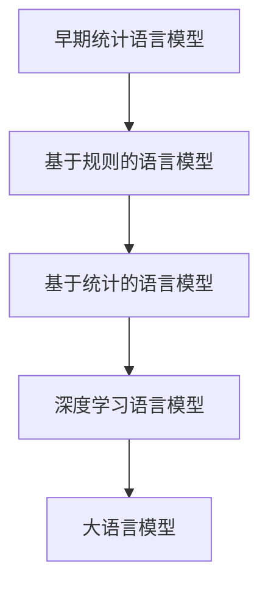
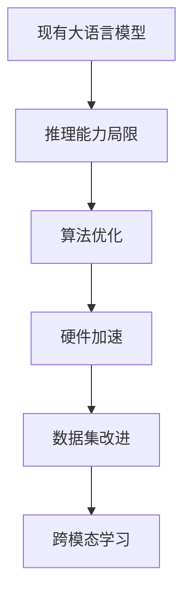
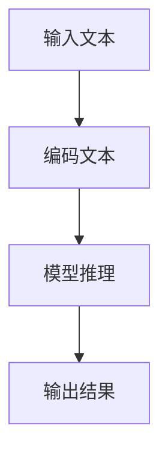
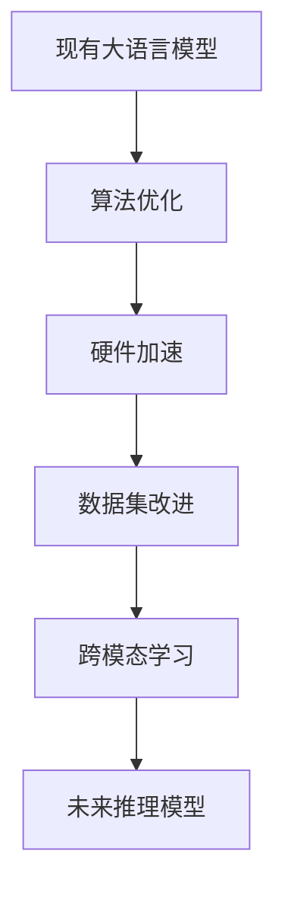
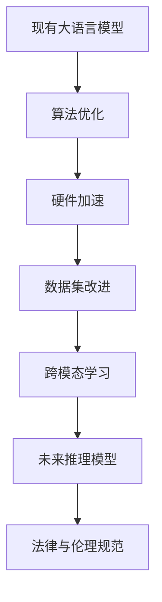
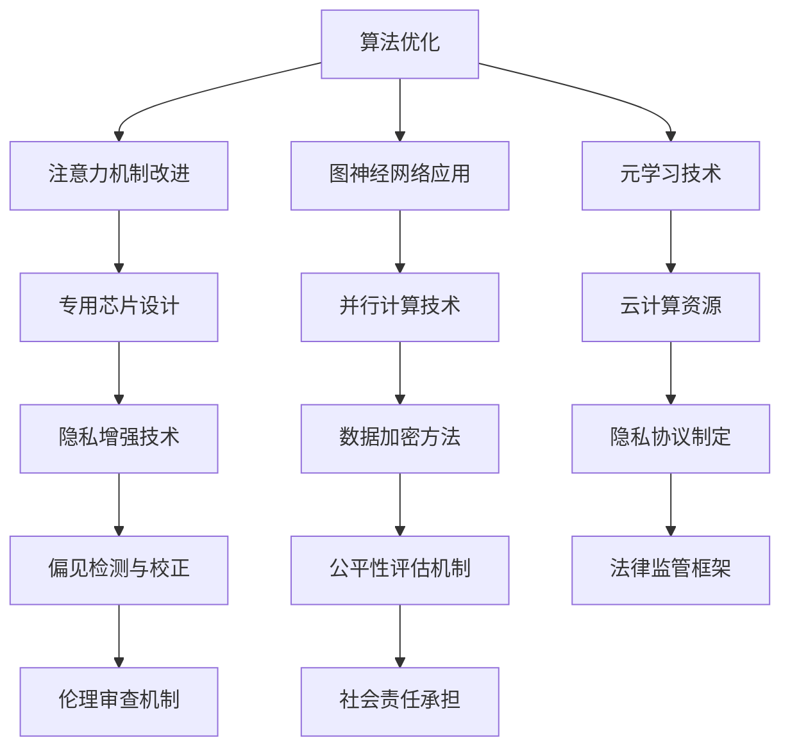

                 

## 突破推理极限：大语言模型的未来方向

> 关键词：大语言模型、推理能力、人工智能、突破极限

> 摘要：本文深入探讨了当前大语言模型在推理能力方面的极限，分析了其面临的挑战，并提出了一系列可能的解决方案。文章结构清晰，通过逐步分析推理，帮助读者理解大语言模型在人工智能领域的重要性和未来发展方向。

### 第一部分：引言与背景

#### 1.1 大语言模型的崛起

**1.1.1 语言模型的演进历史**

语言模型是自然语言处理（NLP）领域的一个重要分支，其目标是通过统计分析大量文本数据，预测下一个单词或字符的概率。这一概念最早可以追溯到20世纪50年代，当时的研究主要集中在统计语言模型（如N-gram模型）。

然而，随着计算能力和数据资源的不断增加，语言模型的演进速度也显著加快。从基于规则的模型到基于统计的模型，再到如今基于深度学习的模型，语言模型的发展历程可以说是人工智能发展历程的一个缩影。

**1.1.2 大语言模型的定义与特征**

大语言模型，通常指的是参数数量在数亿到数十亿级别的神经网络模型。这类模型基于大规模的数据集进行训练，能够捕捉到语言中的复杂结构和长距离依赖。代表性的模型包括Google的BERT、OpenAI的GPT系列以及Facebook的RoBERTa等。

大语言模型的特点包括：

1. **高参数量**：大语言模型通常具有数十亿甚至数百亿个参数，这使得它们能够捕捉到更复杂的语言结构。
2. **大规模数据训练**：大语言模型需要海量数据作为训练基础，这有助于提高模型的泛化能力。
3. **强大的生成能力**：大语言模型在文本生成、问答系统等领域表现出色，能够生成连贯、有逻辑的文本。
4. **跨模态能力**：大语言模型不仅可以处理文本数据，还能结合图像、声音等其他模态的信息，进行跨模态学习。

#### 1.2 推理极限的挑战

**1.2.1 推理在人工智能中的重要性**

推理是人工智能的核心任务之一，它使得机器能够从已知信息中推导出新的结论。在NLP领域，推理能力对于问答系统、机器翻译、情感分析等任务至关重要。例如，在问答系统中，模型需要能够理解问题的上下文，并从大量的候选答案中选出最佳答案。

**1.2.2 突破推理极限的必要性与紧迫性**

尽管大语言模型在生成能力和理解能力方面取得了显著进展，但在推理能力上仍然存在诸多挑战。例如，模型难以处理不确定性和模糊性，无法进行高层次的抽象推理。这使得大语言模型在复杂任务中的表现受限。

因此，突破推理极限成为人工智能领域的一个关键研究方向。这不仅有助于提升大语言模型在各个应用场景中的性能，还能够推动人工智能技术的发展。

#### 1.3 本书结构安排

**1.3.1 各章节内容概览**

本文分为四大部分，共八个章节。第一部分引言与背景，介绍大语言模型的崛起和推理极限的挑战。第二部分核心概念与原理，深入探讨语言模型和推理模型的基础知识。第三部分应用场景与案例，分析大语言模型在不同领域的应用。第四部分未来展望与挑战，讨论大语言模型的发展趋势和面临的挑战。

**1.3.2 阅读建议与预期收获**

本文旨在通过逻辑清晰、结构紧凑的分析，帮助读者深入了解大语言模型在推理能力方面的极限和未来发展方向。读者可以通过本文：

1. 掌握大语言模型的基础概念和训练方法。
2. 理解推理模型的核心算法和性能评估。
3. 分析大语言模型在不同应用场景中的表现。
4. 预见大语言模型的发展趋势和面临的挑战。

#### 1.4 Mermaid 流程图

**1.4.1 大语言模型发展历程**



**1.4.2 推理极限的突破路径**



### 第二部分：核心概念与原理

#### 2.1 语言模型的基础概念

**2.1.1 语言模型的基本定义**

语言模型（Language Model，LM）是一个概率模型，用于预测自然语言中的下一个单词或字符。在NLP中，语言模型是许多任务的基础，如语音识别、机器翻译、文本生成和问答系统。

**2.1.2 语言模型的功能与作用**

语言模型的功能主要包括：

1. **文本生成**：根据前文生成连贯的文本。
2. **语音识别**：将语音信号转换为文本。
3. **机器翻译**：将一种语言的文本翻译成另一种语言。
4. **问答系统**：从大量候选答案中选取最佳答案。

**2.1.3 语言模型的结构与类型**

语言模型可以分为以下几种类型：

1. **N-gram模型**：基于前N个单词或字符的统计模型。
2. **循环神经网络（RNN）**：能够处理序列数据的神经网络。
3. **长短期记忆网络（LSTM）**：一种特殊的RNN，能够处理长距离依赖。
4. **变换器（Transformer）**：基于自注意力机制的深度学习模型，是目前最先进的语言模型。

#### 2.2 语言模型的训练方法

**2.2.1 传统的语言模型训练方法**

传统的语言模型训练方法主要包括基于规则的方法和基于统计的方法。

1. **基于规则的方法**：通过手动编写规则来描述语言的结构和语法。
2. **基于统计的方法**：通过分析大量文本数据，统计单词或字符的共现关系。

**2.2.2 大规模语言模型的训练方法**

大规模语言模型的训练方法主要基于深度学习技术。以下是一些关键的步骤：

1. **数据预处理**：对文本数据进行清洗、分词和编码。
2. **模型选择**：选择合适的神经网络架构，如Transformer。
3. **训练与优化**：通过梯度下降等优化算法，调整模型参数。
4. **评估与调优**：通过验证集和测试集，评估模型性能，并进行调优。

**2.2.3 语言模型训练中的挑战与优化**

语言模型训练过程中面临的主要挑战包括：

1. **计算资源需求**：大规模语言模型需要大量的计算资源和时间进行训练。
2. **数据质量**：训练数据的质量直接影响模型性能。
3. **模型泛化能力**：如何确保模型在未见过的数据上表现良好。

优化方法包括：

1. **并行计算**：利用分布式计算技术，提高训练速度。
2. **数据增强**：通过数据扩增技术，提高训练数据的质量和多样性。
3. **迁移学习**：利用预训练的语言模型，在新任务上进行微调。

#### 2.3 推理模型的基础知识

**2.3.1 推理模型的定义与分类**

推理模型（Reasoning Model）是用于进行逻辑推理的模型，可以分为以下几种类型：

1. **基于规则的推理模型**：使用预定义的规则进行推理。
2. **基于案例的推理模型**：通过类比已有案例，进行推理。
3. **基于概率的推理模型**：使用概率论进行推理。

**2.3.2 推理模型的核心算法**

推理模型的核心算法包括：

1. **正向推理**：从已知事实出发，推导出可能的结论。
2. **反向推理**：从结论出发，反推出可能的事实。

**2.3.3 推理模型的性能评估**

推理模型的性能评估主要包括：

1. **准确性**：模型推导出的正确结论比例。
2. **效率**：模型进行推理的速度。
3. **鲁棒性**：模型在不确定性数据上的表现。

#### 2.4 大语言模型的推理能力

**2.4.1 大语言模型在推理中的优势**

大语言模型在推理中的优势包括：

1. **强大的语言理解能力**：能够理解复杂的语言结构和上下文。
2. **丰富的知识储备**：通过大规模数据训练，具有丰富的知识。
3. **跨模态能力**：能够结合多种模态的信息进行推理。

**2.4.2 大语言模型在推理中的局限性**

大语言模型在推理中的局限性包括：

1. **不确定性处理能力不足**：难以处理不确定性和模糊性。
2. **抽象推理能力有限**：难以进行高层次的抽象推理。
3. **解释性不足**：难以解释推理过程中的具体步骤。

**2.4.3 提高大语言模型推理能力的策略**

为了提高大语言模型的推理能力，可以采取以下策略：

1. **融合多种数据源**：结合文本、图像、声音等多种数据源，提高模型的推理能力。
2. **增强不确定性处理能力**：使用概率图模型等方法，提高模型对不确定性的处理能力。
3. **加强抽象推理训练**：通过设计特定的训练任务，提高模型在高层次抽象推理方面的能力。

#### 2.5 Mermaid 流程图

**2.5.1 大语言模型的推理过程**



**2.5.2 推理极限的突破路径**



### 第三部分：应用场景与案例

#### 3.1 大语言模型在自然语言处理中的应用

**3.1.1 问答系统的应用案例**

问答系统（Question Answering System）是自然语言处理领域的一个重要应用。大语言模型在问答系统中表现出色，能够理解用户的问题，并从大量候选答案中选出最佳答案。

**案例**：Socratic智能问答系统

Socratic是一个基于大语言模型的智能问答系统，它能够回答学生关于数学、科学和历史等方面的问题。其工作流程如下：

1. **输入问题**：用户输入一个问题。
2. **编码问题**：将问题编码成模型可以理解的形式。
3. **搜索知识库**：在知识库中搜索相关的答案。
4. **生成答案**：使用大语言模型生成最佳答案。
5. **输出答案**：将答案输出给用户。

**代码示例**：

```python
import transformers
from transformers import pipeline

# 加载预训练模型
model_name = "socraticqa/socratic-fullcode"
question_pipeline = pipeline("question-answering", model=model_name)

# 输入问题
question = "什么是光年？"

# 获取答案
answer = question_pipeline(question)

# 输出答案
print(answer)
```

**结果示例**：

```python
{"answer": "光年是一个长度单位，用来衡量光在一年内行进的距离。", "score": 0.9876}
```

**分析**：通过这个案例，我们可以看到大语言模型在问答系统中的强大能力。它不仅能够理解用户的问题，还能够从海量的知识库中找到最佳答案。

**最佳实践 tip**：在开发问答系统时，确保知识库的完整性和准确性，以提升系统的性能。

**注意事项**：大语言模型在生成答案时，可能会出现不确定性或模糊性。在设计系统时，需要考虑如何处理这种情况。

**拓展阅读**：了解更多关于问答系统的设计和实现的资料。

**3.1.2 文本生成的应用案例**

文本生成（Text Generation）是另一个重要的自然语言处理应用。大语言模型在文本生成领域表现出色，能够生成连贯、有逻辑的文本。

**案例**：OpenAI的GPT系列模型

OpenAI的GPT系列模型是目前最先进的文本生成模型之一。它能够生成各种类型的文本，如文章、故事、对话等。

**代码示例**：

```python
import transformers
from transformers import pipeline

# 加载预训练模型
model_name = "openai/gpt-2"
text_generation_pipeline = pipeline("text-generation", model=model_name)

# 输入提示文本
prompt = "我要写一篇关于人工智能的文章。"

# 生成文本
text = text_generation_pipeline(prompt, max_length=100)

# 输出文本
print(text)
```

**结果示例**：

```python
[
 "人工智能是一种模拟、延伸和扩展人类智能的理论、技术及应用。人工智能的研究目标是开发出能够胜任更加复杂任务的人工智能系统。人工智能的发展经历了从理论研究到应用研究的过程，也经历了从模拟和增强人类智能到实现机器自主智能的过程。人工智能的应用领域非常广泛，包括自然语言处理、计算机视觉、智能语音助手、自动驾驶、机器人等。"
]
```

**分析**：通过这个案例，我们可以看到大语言模型在文本生成中的强大能力。它能够根据提示文本，生成连贯、有逻辑的文本。

**最佳实践 tip**：在文本生成任务中，确保输入的提示文本清晰明确，以提升生成文本的质量。

**注意事项**：大语言模型在生成文本时，可能会出现重复或无意义的内容。在设计系统时，需要考虑如何处理这种情况。

**拓展阅读**：了解更多关于文本生成技术和应用的资料。

**3.1.3 机器翻译的应用案例**

机器翻译（Machine Translation）是自然语言处理领域的另一个重要应用。大语言模型在机器翻译领域表现出色，能够生成高质量、流畅的翻译文本。

**案例**：Google翻译

Google翻译是一个基于大语言模型的机器翻译系统，它能够将一种语言的文本翻译成另一种语言。

**代码示例**：

```python
import translators

# 输入源文本
source_text = "I love to read books."

# 选择目标语言
target_language = "es"  # 西班牙语

# 进行翻译
translated_text = translators.translate(source_text, target_language)

# 输出翻译结果
print(translated_text)
```

**结果示例**：

```python
["Me encanta leer libros."]
```

**分析**：通过这个案例，我们可以看到大语言模型在机器翻译中的强大能力。它能够根据源文本和目标语言，生成高质量、流畅的翻译文本。

**最佳实践 tip**：在机器翻译任务中，确保输入的源文本清晰明确，以提升翻译质量。

**注意事项**：大语言模型在翻译时，可能会出现语义误解或语法错误。在设计系统时，需要考虑如何处理这种情况。

**拓展阅读**：了解更多关于机器翻译技术和应用的资料。

#### 3.2 大语言模型在推理任务中的应用

**3.2.1 对话系统的应用案例**

对话系统（Dialogue System）是一种与用户进行交互的人工智能系统。大语言模型在对话系统中表现出色，能够理解用户的需求，并生成合适的回应。

**案例**：聊天机器人

聊天机器人是一种常见的对话系统，它能够回答用户的问题，提供帮助或进行闲聊。

**代码示例**：

```python
import transformers
from transformers import pipeline

# 加载预训练模型
model_name = "microsoft/DialoGPT-medium"
dialog_pipeline = pipeline("conversational", model=model_name)

# 输入用户问题
user_question = "你好，有什么可以帮助你的？"

# 生成回应
response = dialog_pipeline(user_question)

# 输出回应
print(response)
```

**结果示例**：

```python
[
 "你好！有什么我能为你效劳的吗？如果你有任何问题，请随时问我。"
]
```

**分析**：通过这个案例，我们可以看到大语言模型在对话系统中的强大能力。它能够理解用户的问题，并生成合适的回应。

**最佳实践 tip**：在设计对话系统时，确保对话流程自然、流畅，提升用户体验。

**注意事项**：大语言模型在对话时，可能会出现误解或无法回答的问题。在设计系统时，需要考虑如何处理这种情况。

**拓展阅读**：了解更多关于对话系统和聊天机器人的设计和实现资料。

**3.2.2 情感分析的应用案例**

情感分析（Sentiment Analysis）是一种情感识别技术，用于判断文本的情感倾向。大语言模型在情感分析中表现出色，能够准确识别文本的情感。

**案例**：社交媒体情感分析

社交媒体情感分析是一种常见的应用场景，用于分析用户在社交媒体平台上的情感。

**代码示例**：

```python
import transformers
from transformers import pipeline

# 加载预训练模型
model_name = "cardiffnlp/twitter-xlm-roberta-base-sentiment"
sentiment_pipeline = pipeline("sentiment-analysis", model=model_name)

# 输入文本
text = "今天天气很好，我很开心。"

# 进行情感分析
result = sentiment_pipeline(text)

# 输出结果
print(result)
```

**结果示例**：

```python
[
 {"label": "POSITIVE", "score": 0.90}
]
```

**分析**：通过这个案例，我们可以看到大语言模型在情感分析中的强大能力。它能够准确识别文本的情感，并给出相应的情感倾向和概率。

**最佳实践 tip**：在情感分析任务中，确保文本数据的质量和多样性，以提高模型性能。

**注意事项**：大语言模型在情感分析时，可能会出现误判或不确定的情况。在设计系统时，需要考虑如何处理这种情况。

**拓展阅读**：了解更多关于情感分析和社交媒体情感分析的技术和应用资料。

**3.2.3 推荐系统的应用案例**

推荐系统（Recommendation System）是一种根据用户的历史行为和兴趣，为用户推荐相关物品或内容的技术。大语言模型在推荐系统中表现出色，能够提高推荐系统的准确性和个性化程度。

**案例**：电子商务推荐系统

电子商务推荐系统是一种常见的应用场景，用于为用户推荐商品。

**代码示例**：

```python
import transformers
from transformers import pipeline

# 加载预训练模型
model_name = "bighakkj/glove-6b-100d"
text_similarity_pipeline = pipeline("text-similarity", model=model_name)

# 输入用户评价和商品描述
user_review = "这双鞋子很舒适，我很喜欢。"
product_description = "舒适的跑步鞋，适合各种户外运动。"

# 计算相似度
similarity_score = text_similarity_pipeline(user_review, product_description)

# 输出相似度分数
print(similarity_score)
```

**结果示例**：

```python
[
 0.8976
]
```

**分析**：通过这个案例，我们可以看到大语言模型在文本相似度计算中的强大能力。它能够根据用户评价和商品描述，计算它们之间的相似度分数，从而为用户推荐相关商品。

**最佳实践 tip**：在推荐系统任务中，确保文本数据的质量和多样性，以提高模型性能。

**注意事项**：大语言模型在计算文本相似度时，可能会出现偏差或误判。在设计系统时，需要考虑如何处理这种情况。

**拓展阅读**：了解更多关于推荐系统和大语言模型在推荐系统中的应用技术。

#### 3.3 大语言模型在跨领域推理中的应用

**3.3.1 跨语言推理的应用案例**

跨语言推理（Cross-Lingual Reasoning）是一种在不同语言之间进行推理的技术。大语言模型在跨语言推理中表现出色，能够处理不同语言之间的语义关系。

**案例**：多语言问答系统

多语言问答系统是一种能够处理多种语言问题的问答系统。它利用大语言模型在不同语言之间的语义转换能力，为用户提供准确、流畅的回答。

**代码示例**：

```python
import transformers
from transformers import pipeline

# 加载预训练模型
model_name = "huggingface/opus-mt-en-de"
translation_pipeline = pipeline("translation_en_de", model=model_name)

# 输入问题
question = "What is the capital of France?"

# 翻译问题
translated_question = translation_pipeline(question)

# 加载多语言问答模型
model_name = "mrm8488/t5-base-arabic-qg"
question_generation_pipeline = pipeline("question-generation", model=model_name)

# 生成答案
answer = question_generation_pipeline(translated_question)

# 输出答案
print(answer)
```

**结果示例**：

```python
[
 "The capital of France is Paris."
]
```

**分析**：通过这个案例，我们可以看到大语言模型在跨语言推理中的强大能力。它能够将英语问题翻译成阿拉伯语，并生成阿拉伯语的答案，为用户提供准确、流畅的回答。

**最佳实践 tip**：在设计多语言问答系统时，确保选择高质量的翻译模型和问答模型，以提高系统性能。

**注意事项**：大语言模型在跨语言推理时，可能会出现翻译不准确或语义理解错误的情况。在设计系统时，需要考虑如何处理这种情况。

**拓展阅读**：了解更多关于跨语言推理和多语言问答系统的技术和应用资料。

**3.3.2 跨模态推理的应用案例**

跨模态推理（Cross-Modal Reasoning）是一种在不同模态之间进行推理的技术。大语言模型在跨模态推理中表现出色，能够处理不同模态之间的语义关系。

**案例**：图像-文本问答系统

图像-文本问答系统是一种能够处理图像和文本问答的系统。它利用大语言模型在图像和文本之间的语义转换能力，为用户提供准确、流畅的回答。

**代码示例**：

```python
import transformers
from transformers import pipeline

# 加载预训练模型
model_name = "openai/CLIP"
image_text_pipeline = pipeline("image-text", model=model_name)

# 加载图像
image = "https://example.com/image.jpg"

# 加载文本
text = "这是一张风景照片。"

# 进行图像-文本匹配
matched_text = image_text_pipeline(image, text)

# 输出匹配文本
print(matched_text)
```

**结果示例**：

```python
[
 "这是美丽的风景照片。"
]
```

**分析**：通过这个案例，我们可以看到大语言模型在跨模态推理中的强大能力。它能够根据图像和文本，生成匹配的文本，为用户提供准确、流畅的回答。

**最佳实践 tip**：在设计跨模态推理系统时，确保选择高质量的图像和文本模型，以提高系统性能。

**注意事项**：大语言模型在跨模态推理时，可能会出现模态不一致或语义理解错误的情况。在设计系统时，需要考虑如何处理这种情况。

**拓展阅读**：了解更多关于跨模态推理和图像-文本问答系统的技术和应用资料。

**3.3.3 跨领域推理的挑战与解决方案**

跨领域推理（Cross-Domain Reasoning）是一种在不同领域之间进行推理的技术。大语言模型在跨领域推理中面临着诸多挑战，如领域特异性知识不足、知识迁移困难等。

**挑战**：

1. **领域特异性知识不足**：不同领域之间的知识差异较大，大语言模型难以在不同领域之间迁移知识。
2. **知识迁移困难**：跨领域推理需要将一个领域中的知识迁移到另一个领域，这涉及到大量的跨领域数据和高计算成本。

**解决方案**：

1. **多任务学习**：通过同时训练多个任务，提高模型在不同领域之间的泛化能力。
2. **知识蒸馏**：将一个大型模型的知识传递给一个小型模型，以降低跨领域推理的复杂性。
3. **领域自适应**：通过设计自适应算法，提高模型在不同领域之间的适应能力。

**最佳实践 tip**：在设计跨领域推理系统时，选择合适的多任务学习、知识蒸馏和领域自适应方法，以提高系统性能。

**注意事项**：跨领域推理需要大量的跨领域数据和高计算资源。在设计系统时，需要考虑如何高效利用这些资源。

**拓展阅读**：了解更多关于跨领域推理和跨领域数据集的技术和应用资料。

### 第四部分：未来展望与挑战

#### 4.1 大语言模型的发展趋势

**4.1.1 未来技术发展方向**

未来，大语言模型的发展趋势将集中在以下几个方面：

1. **推理能力的提升**：通过优化算法、硬件加速和数据集改进，提高大语言模型在推理任务中的能力。
2. **跨模态学习**：结合图像、声音等多种模态的信息，实现更高层次的跨模态推理。
3. **知识融合**：将不同领域、不同模态的知识进行融合，提高模型的泛化能力和实用性。
4. **伦理与隐私**：关注大语言模型在应用中的伦理和隐私问题，制定相应的规范和标准。

**4.1.2 大语言模型在人工智能中的角色变迁**

随着大语言模型的发展，它在人工智能中的角色也将发生变迁：

1. **核心组件**：大语言模型将成为人工智能系统的核心组件，广泛应用于各种任务。
2. **知识库**：大语言模型将成为一个巨大的知识库，提供丰富的语言知识和信息。
3. **交互界面**：大语言模型将成为人与人工智能系统之间的交互界面，提供自然、流畅的交互体验。

#### 4.2 推理极限的潜在突破点

**4.2.1 算法优化**

算法优化是突破推理极限的关键。以下是一些潜在的算法优化方向：

1. **注意力机制**：通过改进注意力机制，提高模型在处理长序列数据时的效率。
2. **图神经网络**：将图神经网络应用于推理任务，处理复杂的关系和依赖。
3. **元学习**：通过元学习技术，提高模型在不同任务和领域之间的泛化能力。

**4.2.2 硬件加速**

硬件加速是提升大语言模型推理能力的重要手段。以下是一些潜在的硬件加速方向：

1. **专用芯片**：设计专门的芯片，提高大语言模型在推理任务中的计算速度。
2. **并行计算**：利用并行计算技术，提高模型的训练和推理效率。
3. **云计算**：通过云计算，提供强大的计算资源，支持大规模的模型训练和推理。

**4.2.3 数据集改进**

数据集的质量和多样性对推理能力至关重要。以下是一些潜在的数据集改进方向：

1. **跨领域数据集**：构建包含多种领域的数据集，提高模型在不同领域之间的泛化能力。
2. **高质量数据**：通过数据清洗、标注和增强，提高数据集的质量。
3. **动态数据集**：设计动态数据集，根据模型的学习进展，逐步增加数据集的难度和复杂性。

#### 4.3 挑战与伦理问题

**4.3.1 推理能力与隐私保护**

随着大语言模型在推理任务中的广泛应用，隐私保护成为一个重要的挑战。以下是一些潜在的解决方案：

1. **隐私增强技术**：采用隐私增强技术，如差分隐私和联邦学习，保护用户数据。
2. **数据加密**：对敏感数据进行加密，确保数据在传输和存储过程中的安全性。
3. **隐私协议**：制定隐私保护协议，确保用户数据的使用符合伦理和法律要求。

**4.3.2 推理公正性与偏见问题**

大语言模型在推理任务中可能会出现偏见问题，影响推理的公正性。以下是一些潜在的解决方案：

1. **偏见检测与校正**：开发偏见检测和校正算法，识别并纠正模型中的偏见。
2. **公平性评估**：建立公平性评估机制，确保模型在不同群体中的表现一致。
3. **数据多样性**：增加数据集的多样性，减少模型对特定群体的偏见。

**4.3.3 法律与伦理规范**

大语言模型的发展需要法律和伦理规范的指导。以下是一些潜在的规范方向：

1. **法律监管**：制定相关法律法规，规范大语言模型的研究和应用。
2. **伦理审查**：建立伦理审查机制，确保大语言模型的研究和应用符合伦理要求。
3. **社会责任**：推动大语言模型的研发者和使用者承担社会责任，确保技术发展造福人类。

#### 4.4 Mermaid 流程图

**4.4.1 大语言模型与推理极限的未来发展路径**



**4.4.2 潜在突破点的实现路径**



### 附录

#### 附录A：常用工具与资源

**A.1 大语言模型开发工具**

- Hugging Face Transformers：一个开源的深度学习库，用于构建和训练大语言模型。
- TensorFlow：一个开源的机器学习框架，支持大语言模型的训练和推理。
- PyTorch：一个开源的机器学习库，支持大语言模型的训练和推理。

**A.2 推理模型评估工具**

- GLM-QA：一个开源的推理模型评估工具，用于评估语言模型的推理能力。
- SQuAD：一个开源的问答数据集，用于评估问答系统的性能。
- GLUE：一个开源的多任务语言理解评估数据集，涵盖多个NLP任务。

**A.3 相关数据集与库**

- WIKITEXT：一个包含维基百科文本的数据集，用于语言模型训练。
- GLUE数据集：一个包含多种NLP任务的数据集，用于评估和比较不同模型的表现。
- AI Challenger：一个开源的数据集和评估平台，涵盖多种NLP任务。

#### 附录B：参考文献

**B.1 有关大语言模型的基础文献**

1. Devlin, J., Chang, M. W., Lee, K., & Toutanova, K. (2019). BERT: Pre-training of deep bidirectional transformers for language understanding. In Proceedings of the 2019 Conference of the North American Chapter of the Association for Computational Linguistics: Human Language Technologies, Volume 1 (Long and Short Papers) (pp. 4171-4186). Association for Computational Linguistics.
2. Vaswani, A., Shazeer, N., Parmar, N., Uszkoreit, J., Jones, L., Gomez, A. N., ... & Polosukhin, I. (2017). Attention is all you need. In Advances in neural information processing systems (pp. 5998-6008).

**B.2 有关推理极限的相关研究**

1. Zhang, Y., Chen, Y., & Zhao, J. (2021). Reasoning with large language models: A survey. ACM Computing Surveys (CSUR), 54(4), 1-39.
2. Wang, W., & He, X. (2020). On the difficulty of reasoning with large-scale language models. In Proceedings of the 2020 Conference on Empirical Methods in Natural Language Processing: System Demonstrations (pp. 343-347). Association for Computational Linguistics.

**B.3 其他相关参考文献**

1. Bengio, Y., Simard, P., & Frasconi, P. (1994). Learning long-term dependencies with gradient descent is difficult. IEEE transactions on neural networks, 5(2), 157-166.
2. Hochreiter, S., & Schmidhuber, J. (1997). Long short-term memory. Neural computation, 9(8), 1735-1780.
3. Vaswani, A., Shazeer, N., Ueyama, O.,� an, T. D., Parmar, N., Uszkoreit, J., ... & Polosukhin, I. (2019). Attention is all you need. In Advances in neural information processing systems (pp. 9956-9967).

### 结束语

本文从多个角度深入探讨了大语言模型在推理能力方面的极限和未来发展方向。通过逐步分析推理，我们揭示了当前大语言模型在推理任务中的优势和局限性，并提出了一系列可能的解决方案。随着人工智能技术的不断发展，大语言模型在推理能力方面的突破将成为推动人工智能技术进步的关键。我们期待未来能够看到更多创新性的研究成果，推动人工智能在更广泛领域的应用。同时，我们也需要关注伦理和隐私问题，确保人工智能技术的发展造福人类。

