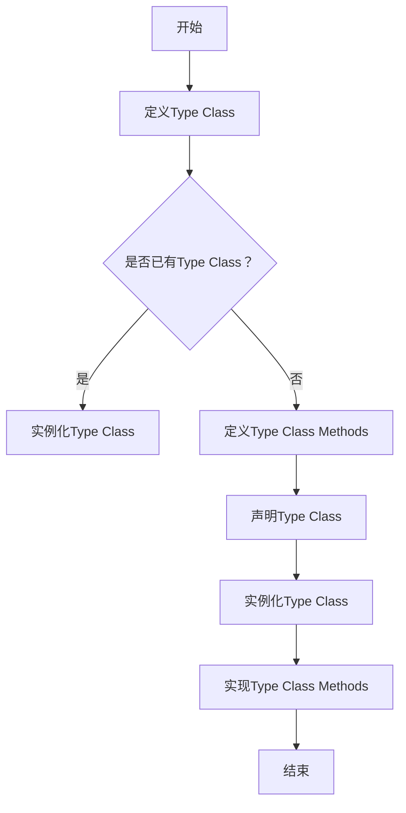
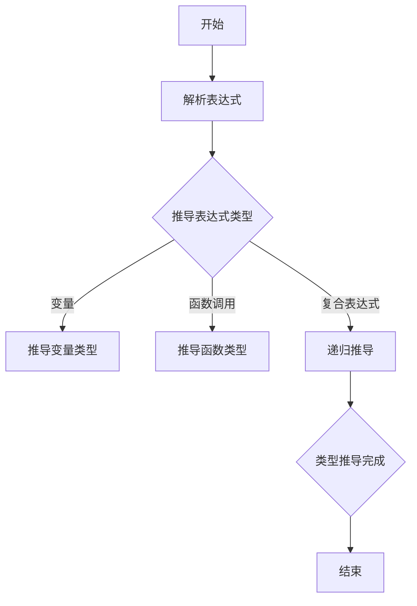
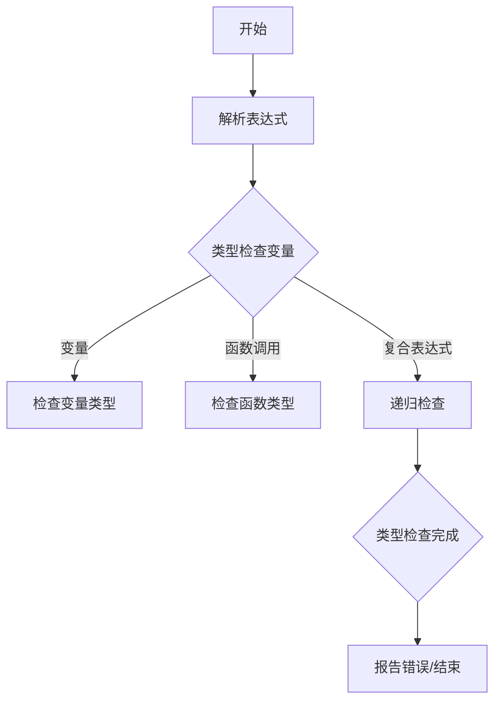

                 

### 第一部分：类型系统的哲学背景

#### 第1章：罗素与类型论

##### 1.1 罗素与类型论的基本概念

伯特兰·罗素（Bertrand Russell）是20世纪初期最重要的数学家、逻辑学家和哲学家之一。他的工作对逻辑、数学和哲学产生了深远的影响，尤其是他在类型论方面的贡献。类型论是逻辑和数学中的一个基本概念，它主要关注如何将变量和表达式分为不同的类型，以避免逻辑和数学上的悖论。

罗素在其著作《数学原理》中提出了类型论，旨在解决所谓的“无穷递归悖论”。这个悖论源于一个集合可以包含自身的问题。例如，如果我们定义一个集合R，其中包含所有不包含自身的集合，那么R是否包含自身就会导致逻辑上的矛盾。

为了解决这一问题，罗素引入了类型的概念，即每个变量都只能与特定类型的对象相关联。在罗素的类型论中，表达式被分为不同的类型，例如个体、属性和关系。这种分类确保了变量和表达式不会直接互相混淆，从而避免了悖论。

##### 1.2 罗素的类型论思想及其影响

罗素的类型论思想主要可以概括为以下几点：

1. **区分不同层次的类型**：罗素认为，变量应该被分配到不同的类型层级中，以避免类型之间的混淆。例如，个体类型（代表具体对象）和属性类型（代表对象的属性）应该分开处理。

2. **避免无穷递归**：通过限制变量的类型，罗素试图阻止无穷递归的构造，从而避免悖论的产生。

3. **形式化数学**：罗素的工作促进了数学的形式化，特别是通过引入公理系统来建立数学基础。

罗素的类型论思想对后来的逻辑学和数学产生了深远的影响。例如，阿尔弗雷德·诺思·怀特海德和怀特·罗素合著的《数学原理》，通过罗素的类型论和其他理论工具，试图构建一个涵盖整个数学的形式系统。

##### 1.3 Haskell与罗素类型论的关联

Haskell是一种纯函数式编程语言，它以其强类型系统和类型推导而著称。Haskell的类型系统设计受到了多种哲学和数学理论的启发，其中包括罗素的类型论。

Haskell的类型系统具有以下特点：

1. **类型类**：Haskell中的类型类（Type Classes）允许程序员定义一组具有相似行为的类型。这与罗素的类型论有相似之处，因为类型类也试图通过将相似的行为分组到一起来减少混淆。

2. **多态性**：Haskell的类型类支持多态性，这意味着一个函数可以接受不同类型的参数，但具有相同的行为。这与罗素的类型论中的类型层级概念相呼应，因为类型层级允许不同类型的对象以统一的方式处理。

3. **类型推导**：Haskell的强类型系统通过类型推导自动确定变量的类型。这与罗素的类型论中的类型限制概念相似，因为类型论试图通过明确地指定变量的类型来减少悖论。

总的来说，Haskell的类型系统在哲学上受到了罗素类型论的启发，特别是在如何组织类型和如何处理类型之间的交互方面。Haskell的类型类和多态性机制提供了在编程语言中实现类型论思想的工具，使程序员能够编写更安全、更易于推理的代码。

### 第2章：Haskell的类型系统

#### 2.1 Haskell类型系统的基本概念

Haskell的类型系统是语言的核心特性之一，它通过强类型和类型推导提供了一种更加安全和可靠的编程方式。在Haskell中，每个表达式都有明确的类型，这使得编译器能够捕捉潜在的错误并在编译时报告。

**基本类型**

Haskell支持多种基本类型，包括：

- **整数类型（Int）**：包括所有整数。
- **浮点类型（Float 和 Double）**：包括单精度和双精度浮点数。
- **布尔类型（Bool）**：包括两个值：True 和 False。
- **字符类型（Char）**：单个Unicode字符。
- **列表类型（[a]）**：元素类型为a的列表。

**复合类型**

除了基本类型外，Haskell还支持复合类型，包括：

- **函数类型**：将一个或多个参数映射到一个结果。例如，(Int -> Int) 表示一个接受一个整数并返回一个整数的函数。
- **元组类型**：（a, b）表示一个包含两个元素的元组，其中每个元素可以是不同的类型。
- **列表类型**：[a] 是一个可以包含零个或多个元素的集合，其中每个元素都是类型为a的对象。
- **可选类型**：Maybe a 表示可能包含一个值（Just a）或者不包含值（Nothing）的类型。

**类型构造器**

Haskell的类型构造器允许创建新的类型，例如：

- **类型别名**：通过type关键字可以为现有类型定义别名。例如，`type Kelvin = Int`。
- **数据类型**：使用data关键字定义新的复合类型，例如`data Color = Red | Green | Blue`。

**类型推导**

Haskell的一个显著特点是它的类型推导机制。类型推导意味着编译器可以自动确定变量的类型，而不需要显式地指定。例如：

```haskell
add :: Int -> Int -> Int
add x y = x + y
```

在这个例子中，Haskell可以推断出`add`函数的参数和返回类型都是`Int`。

**类型注解**

虽然Haskell可以自动推导类型，但也可以使用类型注解来明确指定类型，这有助于提高代码的可读性和可维护性。例如：

```haskell
add :: Int -> Int -> Int
add x y = x + y
```

在这个例子中，我们显式地指定了`add`函数的参数和返回类型。

#### 2.2 Haskell的类型类与多态性

类型类（Type Classes）是Haskell中实现多态性的关键机制。类型类允许将具有相似行为的类型分组到一起，从而使得不同类型可以以统一的方式处理。

**类型类的定义**

类型类的定义使用`class`关键字，例如：

```haskell
class Num a where
  (+) :: a -> a -> a
  (-) :: a -> a -> a
  (*) :: a -> a -> a
  (/) :: a -> a -> a
```

在这个例子中，`Num`是一个类型类，它定义了一组数字类型需要实现的方法，包括加法、减法、乘法和除法。

**实例化**

为了使用类型类，我们需要将具体的类型与类型类关联起来，这称为实例化。例如：

```haskell
instance Num Int where
  (+) x y = x + y
  (-) x y = x - y
  (*) x y = x * y
  (/) x y = x / y
```

这里，我们为`Int`类型实例化了`Num`类型类，实现了所有的数字操作。

**多态性**

通过类型类和实例化，我们可以编写多态函数，这些函数可以接受不同类型的参数并正确地执行操作。例如：

```haskell
add :: Num a => a -> a -> a
add x y = x + y
```

在这个例子中，`add`函数是一个多态函数，它接受任何实现了`Num`类型类的类型作为参数。

#### 2.3 Haskell的类型推导

Haskell的类型推导机制是其强大功能之一。类型推导允许编译器在编译时自动确定变量的类型，而不需要程序员显式地指定。

**简单推导**

在简单的表达式中，类型推导通常很容易。例如：

```haskell
x :: Int
x = 5
```

这里，编译器可以推导出`x`的类型是`Int`。

**复杂推导**

在更复杂的表达式中，类型推导可能涉及类型类的实例化和函数类型的推断。例如：

```haskell
add :: Num a => a -> a -> a
add x y = x + y
```

在这个例子中，`add`函数的类型是通过类型类`Num`和推导出的函数类型`a -> a -> a`确定的。

**类型注解**

虽然Haskell可以自动推导类型，但在需要时，也可以使用类型注解来明确指定类型。这有助于提高代码的可读性和可维护性。例如：

```haskell
add :: Int -> Int -> Int
add x y = x + y
```

在这个例子中，我们显式地指定了`add`函数的参数和返回类型。

总的来说，Haskell的类型系统通过类型类和多态性提供了强大的编程工具，使得程序员可以编写更安全和更灵活的代码。通过类型推导，Haskell在编译时提供了更高的可靠性，而类型注解则提供了更大的灵活性和可读性。

### 第3章：类型类与罗素类型论的相似性

#### 3.1 类型类与抽象数据类型

在Haskell中，类型类（Type Classes）是一种强大的抽象工具，它允许程序员定义一组具有相似行为的类型，这些类型可以以一种统一的方式处理。类型类与抽象数据类型（Abstract Data Types，简称ADT）有许多相似之处。

**定义**

类型类通过`class`关键字定义，例如：

```haskell
class Num a where
  (+) :: a -> a -> a
  (-) :: a -> a -> a
  (*) :: a -> a -> a
  (/) :: a -> a -> a
```

ADT则通常通过`data`关键字定义，例如：

```haskell
data Shape = Circle Float | Rectangle Float Float
```

**目的**

类型类的目的是将具有相似行为的类型分组到一起，使得这些类型可以以一种统一的方式处理。ADT的目的是抽象数据结构，隐藏内部实现细节，仅暴露必要的接口。

**接口**

类型类定义了一组方法，这些方法需要在实例化时实现。例如：

```haskell
instance Num Int where
  (+) x y = x + y
  (-) x y = x - y
  (*) x y = x * y
  (/) x y = x / y
```

ADT则定义了一组可能具有的方法和属性，但具体实现细节可以在不同的数据类型中实现。例如：

```haskell
instance Num Shape where
  (Circle r1) + (Circle r2) = Circle (r1 + r2)
  (Rectangle a1 b1) + (Rectangle a2 b2) = Rectangle (a1 + a2) (b1 + b2)
  -- 其他方法 ...
```

**关联**

类型类与ADT之间的关联在于，它们都是抽象工具，用于定义和实现一组具有相似行为的类型。类型类通过接口和实例化实现了这种抽象，而ADT则通过定义和实现数据类型实现了这种抽象。

**相似性**

1. **抽象**：类型类和ADT都提供了抽象机制，使得程序员可以隐藏实现细节，仅暴露必要的接口。
2. **多态性**：类型类和ADT都支持多态性，允许不同的类型以统一的方式处理。
3. **类型安全**：类型类和ADT都提供了类型安全，确保代码在编译时能够捕捉潜在的错误。

**区别**

尽管类型类和ADT有相似之处，但它们也存在一些区别：

1. **实现方式**：类型类通过定义接口和实例化实现抽象，而ADT通过定义数据和实现方法实现抽象。
2. **类型系统**：类型类是Haskell类型系统的一部分，与类型推导和类型检查紧密集成。ADT则是一个更通用的概念，可以应用于多种编程语言。

总之，类型类和ADT都是重要的抽象工具，它们在Haskell中共同构建了一个强大的类型系统，使得程序员可以编写更加灵活和安全的代码。

#### 3.2 类型类与类型构造器

在Haskell中，类型类（Type Classes）和类型构造器（Type Constructors）是两个重要的概念，它们共同构成了语言的强大类型系统。类型构造器是创建新类型的基础，而类型类则是实现多态性的关键。

**定义**

类型构造器是用于创建新类型的基本构建块。在Haskell中，类型构造器通常使用`data`关键字定义，例如：

```haskell
data Color = Red | Green | Blue
data Shape = Circle Float | Rectangle Float Float
```

类型类是通过`class`关键字定义的一组具有相似行为的类型。类型类的定义看起来像这样：

```haskell
class Num a where
  (+) :: a -> a -> a
  (-) :: a -> a -> a
  (*) :: a -> a -> a
  (/) :: a -> a -> a
```

**关联**

类型类和类型构造器之间的关联主要体现在它们如何协同工作以实现多态性。

1. **类型类的实例化**：类型类通过实例化与具体的类型构造器关联。实例化是将类型类定义的方法实现为具体类型的特定实现。例如：

   ```haskell
   instance Num Int where
     (+) x y = x + y
     (-) x y = x - y
     (*) x y = x * y
     (/) x y = x / y
   ```

   这里，`Int`类型构造器实例化了`Num`类型类，从而实现了数值运算的多态性。

2. **函数类型**：类型类和多态性在函数类型中得到了广泛应用。在Haskell中，函数类型表示接受特定类型的参数并返回特定类型的值。类型类允许我们定义一组函数，这些函数可以接受不同类型的参数，但具有相同的行为。例如：

   ```haskell
   add :: Num a => a -> a -> a
   add x y = x + y
   ```

   这里，`add`函数是一个多态函数，它接受任何实现了`Num`类型类的类型作为参数。

**区别**

尽管类型类和类型构造器有紧密的关联，但它们也有显著的区别：

1. **类型构造器是基础**：类型构造器是创建新类型的基础，而类型类是在已有类型基础上实现多态性的工具。
2. **类型类是抽象**：类型类提供了一种抽象机制，允许我们将具有相似行为的类型分组到一起，而类型构造器则专注于数据类型的定义。
3. **类型系统**：类型构造器是Haskell类型系统的一部分，而类型类是多态性的实现机制。

总之，类型类和类型构造器在Haskell中共同构成了一个强大的类型系统，它们通过协同工作实现了多态性和抽象，使得程序员可以编写更加灵活和安全的代码。

#### 3.3 Haskell类型类与罗素类型论的哲学意义

Haskell的类型类与罗素的类型论在哲学上有着深刻的联系，这体现在它们对于逻辑一致性和数学基础的关注上。

**逻辑一致性**

罗素的类型论旨在通过区分不同类型的变量和表达式来避免悖论，特别是无穷递归悖论。Haskell的类型类系统同样强调类型的一致性和安全性。通过类型类，Haskell确保了不同类型的变量和函数不会相互混淆，从而避免了逻辑上的错误。例如，Haskell的类型检查机制可以防止在错误的上下文中使用变量或调用函数，从而保证了程序的逻辑一致性。

**数学基础**

罗素在其著作《数学原理》中提出了公理系统，试图构建一个数学的基础。Haskell的类型类也可以被视为一种公理系统，它为编程语言提供了一套基本规则，用于定义类型和类型之间的关系。这种结构化方法与罗素在数学基础方面的哲学观点相呼应。Haskell的类型类通过类型类的定义和实例化，为程序员提供了一种构建复杂类型系统的方法，这类似于罗素通过公理系统构建数学基础的方法。

**类型论的影响**

1. **类型安全**：Haskell的类型类系统通过类型检查确保了程序的安全性，这类似于罗素类型论通过区分不同类型的变量来避免悖论。
2. **抽象**：类型类允许程序员定义抽象的数据和行为，这与罗素类型论中的类型层级概念相似，都试图通过抽象来简化复杂问题。
3. **可扩展性**：Haskell的类型类系统具有很强的可扩展性，允许程序员自定义类型类和实例化新的类型，这类似于罗素通过公理系统扩展数学基础的能力。

**哲学意义**

从哲学的角度来看，Haskell的类型类体现了对逻辑一致性和数学基础的关注。它不仅为程序员提供了一种强大的抽象工具，还强调了在编程中保持逻辑一致性的重要性。这种哲学意义不仅对Haskell语言本身的设计有影响，也对更广泛的理论计算机科学领域产生了影响。

总之，Haskell的类型类与罗素的类型论在哲学上有着深刻的联系，它们都试图通过类型区分和抽象来构建一个逻辑一致和坚实的基础。Haskell的类型类不仅为程序员提供了强大的抽象工具，还体现了对逻辑一致性和数学基础的关注，这是其在现代编程语言中具有重要地位的原因之一。

### 第二部分：Haskell类型系统的应用

#### 第4章：函数式编程中的类型类

##### 4.1 函数式编程与类型类

函数式编程是一种编程范式，它基于函数的概念，将程序视为函数的集合。Haskell作为一种纯函数式编程语言，以其强类型系统和类型类而著称。类型类在函数式编程中扮演了关键角色，使得程序员可以以更加灵活和类型安全的方式编写代码。

**类型类的基本概念**

在Haskell中，类型类是一组具有相似行为的类型的集合。通过类型类，我们可以定义一组函数，这些函数可以接受不同类型的参数，但具有相同的行为。类型类的定义如下：

```haskell
class Num a where
  (+) :: a -> a -> a
  (-) :: a -> a -> a
  (*) :: a -> a -> a
  (/) :: a -> a -> a
```

在这个例子中，`Num`是一个类型类，它定义了一组数值类型需要实现的方法，包括加法、减法、乘法和除法。

**实例化**

为了使用类型类，我们需要将具体的类型与类型类关联起来，这称为实例化。例如：

```haskell
instance Num Int where
  (+) x y = x + y
  (-) x y = x - y
  (*) x y = x * y
  (/) x y = x / y

instance Num Float where
  (+) x y = x + y
  (-) x y = x - y
  (*) x y = x * y
  (/) x y = x / y
```

这里，我们为`Int`和`Float`类型实例化了`Num`类型类，实现了所有的数值运算。

**类型推导**

Haskell的类型推导机制使得我们可以通过类型类编写更加灵活的代码。类型推导允许编译器自动确定变量的类型，而不需要显式地指定。例如：

```haskell
add :: Num a => a -> a -> a
add x y = x + y
```

在这个例子中，`add`函数的类型是通过类型类`Num`和推导出的函数类型`a -> a -> a`确定的。

**类型注解**

虽然Haskell可以自动推导类型，但在需要时，也可以使用类型注解来明确指定类型。这有助于提高代码的可读性和可维护性。例如：

```haskell
add :: Int -> Int -> Int
add x y = x + y
```

在这个例子中，我们显式地指定了`add`函数的参数和返回类型。

**多态性**

通过类型类和实例化，我们可以编写多态函数，这些函数可以接受不同类型的参数并正确地执行操作。例如：

```haskell
add :: Num a => a -> a -> a
add x y = x + y
```

在这个例子中，`add`函数是一个多态函数，它接受任何实现了`Num`类型类的类型作为参数。

**示例**

让我们看一个具体的例子来演示类型类的应用。假设我们要编写一个函数来计算两个数的平均值。我们可以使用类型类来实现这一点：

```haskell
average :: (Num a, Fractional a) => [a] -> a
average [] = error "Empty list"
average [x] = x
average xs = sum xs / fromIntegral (length xs)
```

在这个例子中，`average`函数需要两个类型类实例：`Num`和`Fractional`。这些类型类确保了`sum`和`length`函数可以正确地处理不同类型的数。

```haskell
instance Num Float where
  (+) x y = x + y
  (-) x y = x - y
  (*) x y = x * y
  (/) x y = x / y

instance Fractional Float where
  (/) x y = x / y
  fromIntegral n = fromIntegral (n :: Int)
```

通过实例化`Num`和`Fractional`类型类，我们可以使用`average`函数计算两个浮点数的平均值：

```haskell
main :: IO ()
main = do
  let x = 5.0
  let y = 3.0
  putStrLn $ "The average of " ++ show x ++ " and " ++ show y ++ " is " ++ show (average [x, y])
```

输出结果为：

```
The average of 5.0 and 3.0 is 4.0
```

通过类型类，我们可以以更加灵活和类型安全的方式编写函数式代码。类型类不仅提高了代码的可读性和可维护性，还确保了程序的逻辑一致性。

##### 4.2 使用类型类实现高阶函数

高阶函数是函数式编程中的一个重要概念，它指的是可以接受其他函数作为参数的函数，或者返回一个函数的函数。在Haskell中，类型类提供了一个强大的工具，使得我们可以轻松地实现高阶函数。

**高阶函数的定义**

高阶函数通常具有以下两种形式之一：

1. **接受函数作为参数**：例如，`map`函数接受一个函数和一个列表作为参数，并将函数应用于列表中的每个元素。
2. **返回函数**：例如，`flip`函数接受两个参数并返回一个新的函数，该函数交换这两个参数的位置。

**类型类的应用**

通过类型类，我们可以定义一组具有相似行为的类型，使得高阶函数可以以类型安全的方式处理不同类型的参数。以下是一些使用类型类实现的高阶函数的例子：

1. **`map`函数**

   `map`函数接受一个函数和一个列表作为参数，并将函数应用于列表中的每个元素。为了实现`map`函数，我们需要确保函数可以正确地处理不同的类型。通过类型类，我们可以定义一个`Foldable`类型类，它包含一个`foldMap`函数，用于实现`map`函数。

   ```haskell
   class Foldable t where
     foldMap :: (Monoid m) => t m -> m
     foldMap _ = mempty

     map :: (Foldable t, Foldable u, Num (t (u a))) => (a -> u b) -> t a -> t b
     map f = foldMap (fmap f)
   ```

   在这个例子中，`Foldable`类型类定义了一个`foldMap`函数，用于将函数应用于列表中的每个元素。`map`函数依赖于`Foldable`类型类，并使用`foldMap`函数来实现。以下是一个使用`map`函数的例子：

   ```haskell
   main :: IO ()
   main = do
     let numbers = [1, 2, 3, 4, 5]
     let doubled = map (* 2) numbers
     print doubled
   ```

   输出结果为：

   ```
   [2,4,6,8,10]
   ```

2. **`flip`函数**

   `flip`函数接受两个参数并返回一个新的函数，该函数交换这两个参数的位置。为了实现`flip`函数，我们需要确保函数可以正确地处理不同类型的参数。通过类型类，我们可以定义一个`Functor`类型类，它包含一个`fmap`函数，用于实现`flip`函数。

   ```haskell
   class Functor f where
     fmap :: (a -> b) -> f a -> f b

   instance Functor [] where
     fmap _ [] = []
     fmap f (x:xs) = f x : fmap f xs

   flip :: Functor f => (a -> b -> c) -> b -> a -> f c
   flip f x y = fmap (\a -> f a y) x
   ```

   在这个例子中，`Functor`类型类定义了一个`fmap`函数，用于将函数应用于列表中的每个元素。`flip`函数依赖于`Functor`类型类，并使用`fmap`函数来实现。以下是一个使用`flip`函数的例子：

   ```haskell
   main :: IO ()
   main = do
     let add x y = x + y
     let flippedAdd = flip add 3
     print (flippedAdd 4)
   ```

   输出结果为：

   ```
   7
   ```

通过类型类，我们可以以类型安全的方式实现高阶函数。类型类不仅提高了代码的可读性和可维护性，还确保了程序的逻辑一致性。使用类型类实现高阶函数是Haskell函数式编程的核心概念之一，它使得程序员可以编写更加灵活和高效的代码。

##### 4.3 类型类的实际应用案例

类型类是Haskell语言中的一种强大抽象工具，它在实际编程中有着广泛的应用。以下是一些类型类的实际应用案例，展示了如何在不同的编程场景中使用类型类来提高代码的可读性和可维护性。

**示例1：文件操作**

在处理文件操作时，我们通常需要编写函数来读取和写入不同类型的文件。通过类型类，我们可以定义一组通用的文件操作函数，并针对不同类型的文件实例化这些类型类。

```haskell
class FileOperation a where
  readFromFile :: a -> IO String
  writeToFile :: a -> String -> IO ()

instance FileOperation FilePath where
  readFromFile path = readFile path
  writeToFile path content = writeFile path content

readFileContent :: FilePath -> IO String
readFileContent path = readFromFile path

writeFileContent :: FilePath -> String -> IO ()
writeFileContent path content = writeToFile path content
```

在这个例子中，`FileOperation`类型类定义了两个函数：`readFromFile`和`writeToFile`。`FilePath`类型实例化了`FileOperation`类型类，从而实现了对文件路径的操作。通过这种方式，我们可以编写通用的文件操作函数，而无需担心具体的文件类型。

**示例2：图形用户界面**

在开发图形用户界面（GUI）时，我们通常需要处理不同的控件和事件。通过类型类，我们可以定义一组通用的GUI操作函数，并针对不同类型的控件和事件实例化这些类型类。

```haskell
class GuiComponent a where
  render :: a -> IO ()
  handleClick :: a -> IO ()

instance GuiComponent Button where
  render button = putStrLn $ "Rendering button: " ++ show button
  handleClick button = putStrLn $ "Button clicked: " ++ show button

instance GuiComponent Label where
  render label = putStrLn $ "Rendering label: " ++ show label
  handleClick label = putStrLn $ "Label clicked: " ++ show label
```

在这个例子中，`GuiComponent`类型类定义了两个函数：`render`和`handleClick`。`Button`和`Label`类型实例化了`GuiComponent`类型类，从而实现了对不同类型的控件的操作。通过这种方式，我们可以编写通用的GUI操作函数，而无需担心具体的控件类型。

**示例3：数据处理**

在数据处理过程中，我们经常需要编写函数来处理不同的数据类型。通过类型类，我们可以定义一组通用的数据处理函数，并针对不同类型的数据实例化这些类型类。

```haskell
class DataProcessor a where
  process :: a -> IO ()

instance DataProcessor Int where
  process number = putStrLn $ "Processing integer: " ++ show number

instance DataProcessor Float where
  process number = putStrLn $ "Processing float: " ++ show number
```

在这个例子中，`DataProcessor`类型类定义了一个函数：`process`。`Int`和`Float`类型实例化了`DataProcessor`类型类，从而实现了对不同类型的数据的处理。通过这种方式，我们可以编写通用的数据处理函数，而无需担心具体的数据类型。

**总结**

通过类型类，我们可以以类型安全的方式实现通用的函数和操作。类型类不仅提高了代码的可读性和可维护性，还确保了程序的逻辑一致性。在实际编程中，类型类可以应用于各种场景，从文件操作到图形用户界面，再到数据处理。类型类的实际应用案例展示了其在Haskell中的广泛应用，使得程序员可以编写更加灵活和高效的代码。

### 第5章：Haskell的类型推断与类型检查

#### 5.1 Haskell的类型推断

Haskell是一种强类型语言，它通过类型推断机制在编译时自动确定变量和表达式的类型。类型推断是Haskell的一个核心特性，它使得程序员可以编写更加简洁和可读的代码，同时保证程序的安全性。

**基本概念**

类型推断是指编译器根据表达式的语法和上下文信息，自动推导出表达式的类型。在Haskell中，类型推断主要基于以下几种机制：

1. **函数参数**：当函数的参数被调用时，编译器会根据参数的实际类型推导出函数的参数类型。
2. **函数返回值**：编译器会根据函数的返回语句推导出函数的返回类型。
3. **类型类实例化**：当使用类型类时，编译器会根据类型类的定义和实例化推导出相关类型的类型信息。

**示例**

让我们通过一些简单的示例来理解Haskell的类型推断：

1. **变量类型**

```haskell
x :: Int
x = 5
```

在这个例子中，编译器可以推导出`x`的类型是`Int`，因为它的值是一个整数。

2. **函数类型**

```haskell
add :: a -> a -> a
add x y = x + y
```

在这个例子中，编译器可以推导出`add`函数的参数类型是`a`，返回类型也是`a`，因为加法运算符`+`在`Num`类型类中定义。

3. **复合表达式**

```haskell
result :: (Num a, Eq a) => a
result = if x > 0 then x else -x
```

在这个例子中，编译器可以推导出`result`的类型是`a`，因为它是一个复合表达式，其中包含一个`Num`类型类的实例和一个`Eq`类型类的实例。

**类型推导过程**

Haskell的类型推导过程通常分为以下几个步骤：

1. **上下文分析**：编译器首先分析代码的上下文，包括函数的定义、变量声明和类型类的定义。
2. **类型推导**：编译器根据上下文信息推导出变量和表达式的类型。
3. **类型检查**：编译器对推导出的类型进行一致性检查，确保代码符合语言规范。
4. **生成代码**：如果类型检查通过，编译器会生成相应的中间代码，准备执行。

**类型推断的优势**

类型推断在Haskell中提供了以下优势：

1. **代码简洁**：程序员无需显式指定变量和表达式的类型，从而减少了代码的冗余。
2. **提高可读性**：代码更加简洁，使得代码的可读性和可维护性得到提升。
3. **类型安全**：编译器通过类型推断确保代码在编译时就能够捕捉类型错误，从而提高了程序的安全性。

总之，Haskell的类型推断机制使得程序员可以编写更加简洁和安全的代码。通过自动推导类型，Haskell不仅提高了代码的可读性，还确保了程序的正确性和可靠性。

#### 5.2 Haskell的类型检查

Haskell是一种强类型语言，它的类型检查机制在编译时确保代码的类型一致性，从而提高程序的安全性和可靠性。类型检查是Haskell编译过程的一个重要组成部分，它包括两个主要阶段：类型推导和类型一致性检查。

**类型推导**

类型推导是类型检查的第一步，它指的是编译器根据表达式的结构和上下文信息自动推导出变量的类型。在Haskell中，类型推导主要依赖于以下几种机制：

1. **上下文分析**：编译器首先分析代码的上下文，包括函数的定义、变量声明和类型类的定义。
2. **表达式解析**：编译器解析表达式，并根据表达式的结构和上下文信息推导出每个子表达式的类型。
3. **类型推导规则**：编译器使用一系列类型推导规则，例如函数类型推导、复合表达式类型推导等，来推导出变量和表达式的类型。

**类型一致性检查**

一旦类型推导完成，编译器进入类型一致性检查阶段。类型一致性检查确保推导出的类型在上下文中是合理的，不会导致类型错误。以下是一些常见的类型一致性检查：

1. **函数类型一致性**：编译器检查函数的参数类型和返回类型是否一致，确保函数能够正确地处理输入并返回预期的结果。
2. **变量类型一致性**：编译器检查变量的声明和引用是否一致，确保变量在使用前已经赋值，并且类型匹配。
3. **类型类实例化**：编译器检查类型类的实例化是否一致，确保实例化的类型实现了类型类定义的所有方法。
4. **类型绑定**：编译器检查类型绑定是否一致，确保在同一作用域内，变量的类型不会发生变化。

**类型检查的优势**

Haskell的类型检查机制提供了以下优势：

1. **早期错误检测**：编译器在编译时就能够捕捉类型错误，从而在运行前发现潜在的问题，减少了程序在运行时出现错误的风险。
2. **代码安全**：通过确保变量的类型一致性，类型检查提高了程序的安全性，防止类型相关的错误发生。
3. **提高可维护性**：强类型语言使得代码更加结构化，类型检查有助于提高代码的可读性和可维护性。

**示例**

让我们通过一个简单的示例来理解Haskell的类型检查：

```haskell
add :: Int -> Int -> Int
add x y = x + y

main :: IO ()
main = do
  let x = 5
  let y = 10
  putStrLn $ "The sum of " ++ show x ++ " and " ++ show y ++ " is " ++ show (add x y)
```

在这个例子中，Haskell编译器会执行以下步骤：

1. **类型推导**：编译器推导出`add`函数的参数类型是`Int`，返回类型也是`Int`。
2. **类型一致性检查**：编译器检查`main`函数中的变量`x`和`y`的类型是否一致，确保它们都是`Int`类型。
3. **生成代码**：编译器生成相应的中间代码，准备执行。

如果没有类型错误，编译器会生成一个可执行的程序，并在运行时输出结果。

总之，Haskell的类型检查机制通过类型推导和类型一致性检查，提高了程序的安全性和可靠性。通过在编译时捕捉类型错误，类型检查有助于减少程序在运行时出现错误的风险，从而提高代码的质量和可维护性。

#### 5.3 类型推断与类型检查的比较

Haskell的类型推断和类型检查是语言设计中的两个关键组成部分，它们在编译过程中相互协作，确保代码的类型安全和正确性。虽然两者密切相关，但它们在目的、过程和作用上有所不同。

**目的**

类型推断的目标是自动确定变量和表达式的类型，减少程序员手动指定类型的负担，同时提高代码的可读性和简洁性。类型检查的主要目标是验证代码在运行时的类型一致性，确保不会出现类型错误，提高程序的安全性和可靠性。

**过程**

类型推断的过程通常包括以下几个步骤：

1. **上下文分析**：编译器分析代码的上下文，包括函数的定义、变量声明和类型类的定义。
2. **表达式解析**：编译器解析表达式，并根据表达式的结构和上下文信息推导出每个子表达式的类型。
3. **类型推导**：编译器使用一系列推导规则来推导出变量和表达式的类型。
4. **类型绑定**：将推导出的类型绑定到相应的变量和表达式上。

类型检查的过程则包括：

1. **类型推导**：类似于类型推断，编译器首先推导出变量和表达式的类型。
2. **类型一致性检查**：编译器检查推导出的类型是否一致，确保函数的参数和返回类型匹配，变量的声明和引用类型一致，类型类实例化正确。
3. **错误报告**：如果类型不一致，编译器会报告类型错误，并提示可能的问题。

**作用**

类型推断的主要作用是减少代码冗余，提高代码的可读性和可维护性。通过自动推导类型，程序员无需显式指定每个变量和表达式的类型，使得代码更加简洁。

类型检查的主要作用是确保代码的类型一致性，提高程序的安全性。类型检查在编译时捕捉类型错误，防止潜在的错误在运行时发生，从而减少程序的缺陷和bug。

**关系**

类型推断和类型检查是相辅相成的。类型推断为类型检查提供了基础，通过推导出变量和表达式的类型，类型检查才能进行一致性检查。同时，类型检查的结果也会影响类型推断的准确性，因为类型检查可能发现类型推断过程中的错误，从而调整类型推导的结果。

总之，类型推断和类型检查在Haskell中共同构成了一个强大的类型系统，它们在编译过程中相互协作，确保代码的类型安全和正确性。类型推断通过自动推导类型提高了代码的可读性和可维护性，而类型检查则通过验证类型一致性，提高了程序的安全性和可靠性。

### 第6章：类型类的扩展与应用

#### 6.1 新类型类的定义

在Haskell中，类型类（Type Classes）是一种强大的抽象工具，它允许程序员定义一组具有相似行为的类型。通过类型类，我们可以以类型安全的方式实现多态性，从而提高代码的可读性和可维护性。在这一节中，我们将探讨如何定义新的类型类，并实例化这些类型类以实现具体类型的操作。

**定义类型类**

要定义一个新的类型类，我们需要使用`class`关键字，并指定类型类所需的函数和方法。以下是一个简单的示例：

```haskell
class Shape a where
  area :: a -> Float
  perimeter :: a -> Float
```

在这个例子中，我们定义了一个名为`Shape`的类型类，它有两个方法：`area`和`perimeter`。这些方法分别用于计算形状的面积和周长。

**实例化类型类**

一旦定义了类型类，我们需要将具体的类型与之关联，这称为实例化。例如，我们可以为`Circle`和`Rectangle`类型实例化`Shape`类型类：

```haskell
data Circle = Circle Float
data Rectangle = Rectangle Float Float

instance Shape Circle where
  area (Circle r) = pi * r * r
  perimeter (Circle r) = 2 * pi * r

instance Shape Rectangle where
  area (Rectangle w h) = w * h
  perimeter (Rectangle w h) = 2 * (w + h)
```

在这个例子中，我们为`Circle`和`Rectangle`类型分别实现了`area`和`perimeter`方法。这些方法的具体实现依赖于形状的类型和相关的几何公式。

**示例代码**

以下是一个完整的示例，展示了如何定义和实例化新的类型类，并使用这些类型类进行类型安全的操作：

```haskell
import Data.IORef
import System.IO

class Shape a where
  area :: a -> Float
  perimeter :: a -> Float

data Circle = Circle Float
data Rectangle = Rectangle Float Float

instance Shape Circle where
  area (Circle r) = pi * r * r
  perimeter (Circle r) = 2 * pi * r

instance Shape Rectangle where
  area (Rectangle w h) = w * h
  perimeter (Rectangle w h) = 2 * (w + h)

calculateArea :: Shape a => a -> IO ()
calculateArea shape = do
  let areaValue = area shape
  putStrLn $ "The area of the shape is: " ++ show areaValue

calculatePerimeter :: Shape a => a -> IO ()
calculatePerimeter shape = do
  let perimeterValue = perimeter shape
  putStrLn $ "The perimeter of the shape is: " ++ show perimeterValue

main :: IO ()
main = do
  let circle = Circle 5.0
  let rectangle = Rectangle 4.0 6.0
  putStrLn "Calculating circle area:"
  calculateArea circle
  putStrLn "Calculating rectangle perimeter:"
  calculatePerimeter rectangle
```

输出结果如下：

```
Calculating circle area:
The area of the shape is: 78.53982
Calculating rectangle perimeter:
The perimeter of the shape is: 20.0
```

通过这个示例，我们可以看到如何定义和实例化新的类型类，并使用这些类型类实现类型安全的多态操作。

#### 6.2 类型类的组合

类型类的组合是Haskell中的一种高级特性，它允许程序员将多个类型类组合成一个复合类型类，从而实现更复杂的多态操作。通过类型类的组合，我们可以将多个类型类的功能合并到一个新的类型类中，使得代码更加灵活和可扩展。

**定义复合类型类**

要定义一个复合类型类，我们需要使用`class`关键字，并在类型类定义中列出要组合的类型类。以下是一个简单的示例：

```haskell
class Shape a where
  area :: a -> Float
  perimeter :: a -> Float

class Drawable a where
  draw :: a -> IO ()

class CompositeShape a where
  compositeArea :: a -> Float
  compositePerimeter :: a -> Float
  components :: a -> [Shape b]
```

在这个例子中，我们定义了三个类型类：`Shape`、`Drawable`和`CompositeShape`。`CompositeShape`类型类组合了`Shape`和`Drawable`类型类的功能，并新增了一个`components`方法，用于访问复合形状的组件。

**实例化复合类型类**

一旦定义了复合类型类，我们需要将具体的类型与之关联。以下是一个示例，展示了如何实例化复合类型类：

```haskell
data Circle = Circle Float
data Rectangle = Rectangle Float Float
data CompositeShape = CompositeShape [Shape a]

instance Shape Circle where
  area (Circle r) = pi * r * r
  perimeter (Circle r) = 2 * pi * r

instance Shape Rectangle where
  area (Rectangle w h) = w * h
  perimeter (Rectangle w h) = 2 * (w + h)

instance Drawable Circle where
  draw (Circle r) = putStrLn $ "Drawing a circle with radius " ++ show r

instance Drawable Rectangle where
  draw (Rectangle w h) = putStrLn $ "Drawing a rectangle with width " ++ show w ++ " and height " ++ show h

instance CompositeShape CompositeShape where
  compositeArea (CompositeShape shapes) = sum $ map area shapes
  compositePerimeter (CompositeShape shapes) = sum $ map perimeter shapes
  components (CompositeShape shapes) = shapes
```

在这个例子中，我们为`Circle`、`Rectangle`和`CompositeShape`类型分别实例化了`Shape`、`Drawable`和`CompositeShape`类型类。对于`CompositeShape`类型，我们实现了`compositeArea`、`compositePerimeter`和`components`方法，分别用于计算复合形状的面积、周长和组件。

**示例代码**

以下是一个完整的示例，展示了如何使用复合类型类实现类型安全的多态操作：

```haskell
import Data.IORef
import System.IO

class Shape a where
  area :: a -> Float
  perimeter :: a -> Float

class Drawable a where
  draw :: a -> IO ()

class CompositeShape a where
  compositeArea :: a -> Float
  compositePerimeter :: a -> Float
  components :: a -> [Shape b]

data Circle = Circle Float
data Rectangle = Rectangle Float Float
data CompositeShape = CompositeShape [Shape a]

instance Shape Circle where
  area (Circle r) = pi * r * r
  perimeter (Circle r) = 2 * pi * r

instance Shape Rectangle where
  area (Rectangle w h) = w * h
  perimeter (Rectangle w h) = 2 * (w + h)

instance Drawable Circle where
  draw (Circle r) = putStrLn $ "Drawing a circle with radius " ++ show r

instance Drawable Rectangle where
  draw (Rectangle w h) = putStrLn $ "Drawing a rectangle with width " ++ show w ++ " and height " ++ show h

instance CompositeShape CompositeShape where
  compositeArea (CompositeShape shapes) = sum $ map area shapes
  compositePerimeter (CompositeShape shapes) = sum $ map perimeter shapes
  components (CompositeShape shapes) = shapes

calculateArea :: CompositeShape a => a -> IO ()
calculateArea shape = do
  let areaValue = compositeArea shape
  putStrLn $ "The composite area of the shape is: " ++ show areaValue

calculatePerimeter :: CompositeShape a => a -> IO ()
calculatePerimeter shape = do
  let perimeterValue = compositePerimeter shape
  putStrLn $ "The composite perimeter of the shape is: " ++ show perimeterValue

main :: IO ()
main = do
  let circle = Circle 5.0
  let rectangle = Rectangle 4.0 6.0
  let compositeShape = CompositeShape [circle, rectangle]
  putStrLn "Calculating composite area:"
  calculateArea compositeShape
  putStrLn "Calculating composite perimeter:"
  calculatePerimeter compositeShape
  putStrLn "Drawing shapes:"
  draw compositeShape
```

输出结果如下：

```
Calculating composite area:
The composite area of the shape is: 78.53982
Calculating composite perimeter:
The composite perimeter of the shape is: 26.0
Drawing shapes:
Drawing a circle with radius 5.0
Drawing a rectangle with width 4.0 and height 6.0
```

通过这个示例，我们可以看到如何定义和实例化复合类型类，并使用这些类型类实现类型安全的多态操作。复合类型类使得我们可以将多个类型类的功能组合在一起，从而实现更复杂和灵活的编程模式。

#### 6.3 类型类的实际应用拓展

在Haskell中，类型类不仅提供了强大的抽象工具，还可以应用于各种实际编程场景，从而提高代码的可读性、可维护性和灵活性。以下是一些类型类的实际应用拓展，展示了如何在不同的编程任务中使用类型类。

**示例1：文件处理**

在文件处理中，我们可以使用类型类来处理不同格式的文件。例如，我们可能需要处理文本文件、JSON文件和二进制文件。通过类型类，我们可以定义一组通用的文件处理函数，并针对不同类型的文件实例化这些类型类。

```haskell
class FileHandler a where
  readFile :: a -> IO String
  writeFile :: a -> String -> IO ()

instance FileHandler TextFile where
  readFile (TextFile path) = readFile path
  writeFile (TextFile path) content = writeFile path content

instance FileHandler JsonFile where
  readFile (JsonFile path) = readJsonFile path
  writeFile (JsonFile path) content = writeJsonFile path content

data TextFile = TextFile String
data JsonFile = JsonFile String

-- 文本文件处理函数
readTextFile :: TextFile -> IO String
readTextFile = readFile

-- JSON文件处理函数
readJsonFile :: JsonFile -> IO String
readJsonFile (JsonFile path) = readFile path

writeJsonFile :: JsonFile -> String -> IO ()
writeJsonFile (JsonFile path) content = writeFile path content
```

在这个例子中，我们定义了一个`FileHandler`类型类，它包含了`readFile`和`writeFile`方法。然后，我们为文本文件和JSON文件实例化了`FileHandler`类型类。通过这种方式，我们可以编写通用的文件处理函数，而无需担心具体的文件类型。

**示例2：图形用户界面**

在开发图形用户界面（GUI）时，我们可以使用类型类来处理不同类型的控件和事件。例如，我们可能需要处理按钮、文本框和复选框。通过类型类，我们可以定义一组通用的GUI处理函数，并针对不同类型的控件和事件实例化这些类型类。

```haskell
class GuiComponent a where
  render :: a -> IO ()
  handleClick :: a -> IO ()

instance GuiComponent Button where
  render (Button label) = putStrLn $ "Rendering button: " ++ label
  handleClick (Button label) = putStrLn $ "Button clicked: " ++ label

instance GuiComponent TextField where
  render (TextField text) = putStrLn $ "Rendering text field with text: " ++ text
  handleClick (TextField _) = putStrLn $ "Text field clicked"

data Button = Button String
data TextField = TextField String

-- 按钮处理函数
renderButton :: Button -> IO ()
renderButton = render

-- 文本框处理函数
renderTextField :: TextField -> IO ()
renderTextField = render
```

在这个例子中，我们定义了一个`GuiComponent`类型类，它包含了`render`和`handleClick`方法。然后，我们为按钮和文本框实例化了`GuiComponent`类型类。通过这种方式，我们可以编写通用的GUI处理函数，而无需担心具体的控件类型。

**示例3：数据转换**

在数据处理过程中，我们经常需要将数据从一种格式转换为另一种格式。通过类型类，我们可以定义一组通用的数据转换函数，并针对不同类型的数据实例化这些类型类。

```haskell
class DataConverter a b where
  convert :: a -> b

instance DataConverter String Int where
  convert str = read str :: Int

instance DataConverter Int String where
  convert num = show num

data Data = TextData String | IntData Int

-- 文本转换为整数
convertToInt :: DataConverter String Int => Data -> Int
convertToInt (TextData str) = convert str

-- 整数转换为文本
convertToStr :: DataConverter Int String => Data -> String
convertToStr (IntData num) = convert num
```

在这个例子中，我们定义了一个`DataConverter`类型类，它包含了一个`convert`方法。然后，我们为文本数据和整数数据实例化了`DataConverter`类型类。通过这种方式，我们可以编写通用的数据转换函数，而无需担心具体的数据类型。

通过这些实际应用拓展，我们可以看到类型类在Haskell中的广泛应用。类型类不仅使得代码更加灵活和可维护，还确保了类型安全，从而提高了程序的整体质量。

### 第三部分：Haskell类型系统的设计与实现

#### 第7章：Haskell类型系统的设计与哲学

Haskell的类型系统是语言设计的核心组成部分，它的设计不仅体现了语言的哲学思想，还影响了Haskell在函数式编程语言中的地位。在这一章中，我们将探讨Haskell类型系统的设计原则、实现细节以及其哲学基础。

#### 7.1 Haskell类型系统的设计原则

Haskell的类型系统设计遵循了一系列核心原则，这些原则确保了类型系统的安全性、灵活性和可扩展性。

1. **安全性**：Haskell的类型系统通过静态类型检查确保程序在编译时不会出现类型错误。这种严格的类型检查机制使得Haskell代码在运行时更加可靠，减少了程序崩溃和逻辑错误的风险。

2. **灵活性**：Haskell的类型系统允许程序员通过类型类和类型构造器创建自定义的类型和类型类。这种灵活性使得Haskell能够适应各种不同的编程场景，同时保持代码的简洁性和可读性。

3. **可扩展性**：Haskell的类型系统设计具有高度的可扩展性，使得程序员可以轻松地添加新的类型和类型类。这种可扩展性确保了Haskell能够随着技术的进步和需求的变化而不断发展。

4. **组合性**：Haskell的类型系统强调类型的组合性，即通过类型类和类型构造器将不同的类型和行为组合在一起。这种组合性使得程序员可以构建复杂但易于管理的类型系统。

#### 7.2 Haskell类型系统的实现细节

Haskell的类型系统在实现上具有一些关键细节，这些细节确保了类型系统的安全性和高效性。

1. **类型推导**：Haskell的类型系统采用了基于需求的类型推导机制，这使得程序员无需显式指定每个变量的类型。编译器通过分析表达式和函数的上下文信息自动推导出变量的类型。这种类型推导机制提高了代码的可读性和可维护性。

2. **类型检查**：Haskell的类型系统在编译时进行严格的类型检查，确保代码在运行前不会出现类型错误。类型检查过程包括检查函数的参数和返回类型是否一致，变量是否在声明后使用，以及类型类实例是否正确。

3. **类型类别**：Haskell的类型系统支持类型类别，这是一种特殊的类型类，用于处理不同类型的函数。类型类别使得程序员可以编写处理多种类型参数的函数，从而提高了代码的通用性。

4. **类型检查算法**：Haskell的类型检查算法基于归约和约束求解。编译器通过逐步解析表达式和函数的定义，推导出所有变量的类型，并在过程中解决类型约束。这种算法确保了类型系统的完整性和一致性。

#### 7.3 Haskell类型系统的哲学基础

Haskell的类型系统设计深受哲学思想的启发，特别是逻辑主义和形式主义的观点。

1. **逻辑主义**：Haskell的类型系统强调逻辑一致性，通过严格的类型检查确保程序不会出现逻辑错误。这种逻辑主义的哲学基础体现了Haskell对编程语言中逻辑一致性的重视，使得Haskell成为了一种高度可靠的编程语言。

2. **形式主义**：Haskell的类型系统采用了形式化的方法来定义和实现类型系统。通过使用形式化的类型推导和类型检查算法，Haskell确保了类型系统的精确性和一致性。这种形式主义的哲学基础使得Haskell成为了一种高度抽象和高度结构的编程语言。

3. **抽象和通用性**：Haskell的类型系统设计强调抽象和通用性。通过类型类和类型构造器，Haskell允许程序员以高度抽象的方式处理不同类型的对象，从而提高了代码的复用性和灵活性。这种哲学基础使得Haskell能够适应各种不同的编程场景和需求。

总的来说，Haskell的类型系统设计在哲学上体现了对逻辑一致性、形式化和抽象的高度重视。通过这些设计原则和实现细节，Haskell建立了一个强大而灵活的类型系统，使得程序员可以编写安全、可靠和高效的代码。Haskell的类型系统不仅体现了语言设计的哲学思想，还成为了函数式编程语言的一个重要标杆。

### 第8章：Haskell类型系统的优化与挑战

#### 8.1 Haskell类型系统的性能优化

Haskell作为一种纯函数式编程语言，以其强大的抽象能力和类型系统而著称。然而，Haskell的类型系统在性能方面也存在一定的挑战。为了提升Haskell程序的执行效率，研究人员和开发者对Haskell的类型系统进行了多种优化。以下是一些主要的性能优化措施：

1. **懒惰求值**：Haskell采用懒惰求值（lazy evaluation）策略，这意味着函数在需要结果时才执行计算。虽然这种策略有助于提高代码的可读性和灵活性，但在某些情况下，它可能导致性能下降。为了优化性能，Haskell可以通过策略性求值（strategic evaluation）和共享延迟计算结果来减少不必要的计算。

2. **尾递归优化**：Haskell支持尾递归优化（tail recursion optimization），这是一种将递归函数转换为循环的过程。通过这种优化，可以减少递归调用的栈空间占用，从而提高程序的执行效率。

3. **类型推导和类型检查的优化**：Haskell的类型推导和类型检查在编译过程中是一个计算密集型的任务。为了优化这一过程，研究者们开发了多种算法和优化技术，如共享子表达式和缓存中间结果，从而减少类型检查的时间。

4. **数据并行化**：Haskell中的数组类型支持并行计算，这使得在处理大数据集时能够利用多核处理器的并行能力。通过数据并行化，可以显著提高Haskell程序的处理速度。

5. **编译器优化**：不同的Haskell编译器（如GHC）提供了多种优化选项，如循环展开、函数内联和常数传播等。这些编译器优化技术可以帮助提高程序的执行效率。

#### 8.2 Haskell类型系统的挑战与未来方向

尽管Haskell的类型系统具有许多优点，但它也面临一些挑战和未来的发展方向：

1. **类型系统的复杂性**：Haskell的类型系统相当复杂，这可能会让初学者感到困惑。为了降低学习曲线，未来的发展方向可能包括简化类型系统的表达方式，提供更直观的类型推导机制。

2. **类型推导的性能**：虽然Haskell的类型推导在静态类型检查方面具有优势，但在大型程序中，类型推导可能变得缓慢。未来的优化方向可能包括开发更高效的类型推导算法，以减少类型检查的时间。

3. **类型类的扩展性**：Haskell的类型类机制提供了强大的抽象能力，但在某些情况下，类型类的扩展性可能不足。未来的发展方向可能包括引入新的类型系统特性，如依赖类型（dependent types），以增强类型类的表达能力。

4. **交互式编程体验**：Haskell的交互式编程体验（如REPL）在某些方面可能不如其他语言（如Python）。未来的优化方向可能包括改进交互式编程工具，提供更快捷的编辑和重载功能。

5. **并行编程**：随着多核处理器的普及，并行编程变得日益重要。Haskell在未来可能需要提供更加强大的并行编程支持，包括改进并行数据结构和并发模型。

6. **与其他语言的集成**：Haskell在工业界和学术界的应用逐渐增加，未来的发展方向可能包括与其他语言（如C++、Java）的集成，以利用它们的性能和生态系统。

总之，Haskell的类型系统在性能优化和未来发展方面有许多挑战和机遇。通过不断的研究和改进，Haskell有望在未来的编程语言领域中继续保持其独特地位。

### 附录

#### 附录A：Haskell类型系统参考资料

**A.1 Haskell官方文档**

Haskell的官方文档是了解Haskell类型系统的最佳起点。Haskell语言规范详细介绍了类型系统、类型类和类型推导等核心概念。

- Haskell语言规范：[https://www.haskell.org/onlinereport/](https://www.haskell.org/onlinereport/)
- Haskell类型系统文档：[https://www.haskell.org/onlinereport/haskell2010/report/html/treeparser.html#types-and-classes](https://www.haskell.org/onlinereport/haskell2010/report/html/treeparser.html#types-and-classes)

**A.2 Haskell社区资源**

Haskell社区提供了丰富的资源，包括文档、教程和论坛，可以帮助开发者深入理解Haskell的类型系统。

- Haskell社区网站：[https://www.haskell.org/](https://www.haskell.org/)
- Haskell文档中心：[https://www.haskell.org/doc/](https://www.haskell.org/doc/)
- Haskell Reddit论坛：[https://www.reddit.com/r/haskell/](https://www.reddit.com/r/haskell/)

**A.3 Haskell相关书籍推荐**

以下是一些推荐的Haskell书籍，它们涵盖了从基础到高级的主题，包括类型系统。

- 《Real World Haskell》：由Bryan O'Sullivan等著，介绍了Haskell的实用编程技术，包括类型系统。
- 《Haskell School of Music》：由Paul Hudak等著，通过音乐示例介绍了Haskell的函数式编程。
- 《Real World Functional Programming》：由Martin Thompson等著，详细介绍了函数式编程和类型系统在Java中的实现。

### 附录B：Mermaid流程图示例

**B.1 Haskell类型类的定义流程**

以下是一个Mermaid流程图示例，展示了Haskell类型类的定义流程：



**B.2 Haskell类型推导示例**

以下是一个Mermaid流程图示例，展示了Haskell的类型推导过程：



**B.3 Haskell类型检查示例**

以下是一个Mermaid流程图示例，展示了Haskell的类型检查过程：



通过这些Mermaid流程图示例，我们可以更直观地了解Haskell类型类的定义、类型推导和类型检查过程。这些示例有助于开发者更好地理解Haskell的类型系统，并为其应用提供参考。

