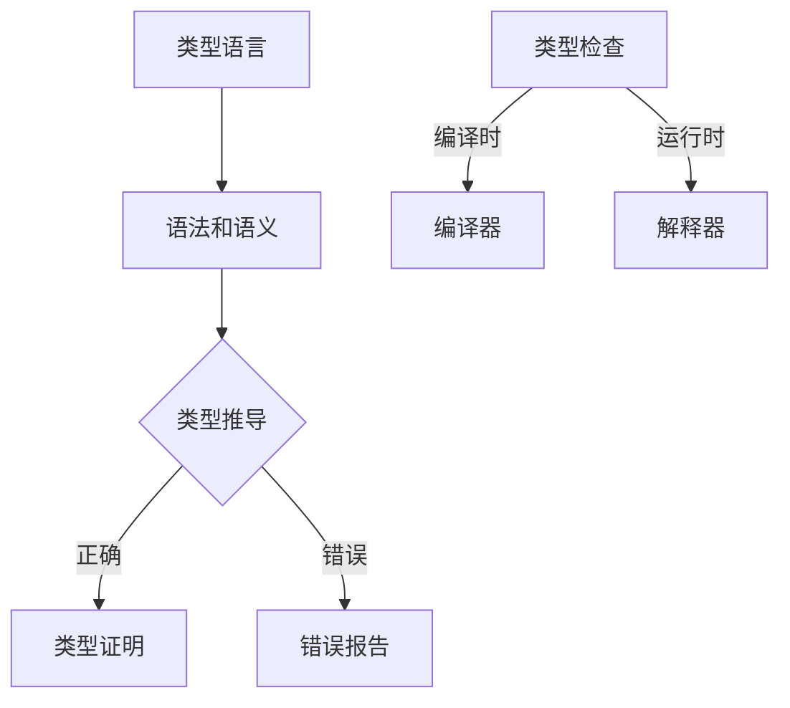

                 

## 类型级编程：将罗素理论推向极限

在计算机科学的领域中，类型系统是一种核心概念，它不仅影响了编程语言的构造，还在形式验证、安全性分析以及人工智能等多个领域发挥着重要作用。本文将以罗素理论为基础，探讨类型级编程如何将这一理论推向极限。罗素（Bertrand Russell）是一位伟大的哲学家和数学家，他在20世纪初提出了著名的罗素悖论，这一悖论不仅挑战了集合论的基础，也激发了类型论的发展。本文将依次介绍罗素理论的背景、类型系统的数学基础、类型系统的形式化描述，以及类型系统在编程语言、形式验证、安全性分析和人工智能等领域的应用。

### 关键词

- 罗素理论
- 类型论
- 类型系统
- 编程语言
- 形式验证
- 安全性分析
- 人工智能

### 摘要

本文旨在通过深入探讨罗素理论与类型系统的关系，阐述类型级编程的概念及其重要性。文章首先回顾罗素理论的背景和基本概念，接着介绍类型系统的数学基础，包括集合论、函数和数学归纳法。随后，文章通过形式化描述详细阐述类型系统的结构和验证方法。在应用部分，文章探讨了类型系统在编程语言、形式验证、安全性分析和人工智能等领域的具体应用。最后，文章总结类型系统的最新发展趋势，并提出未来可能面临的挑战与机遇。

### 第一部分：类型系统的基本理论

#### 第1章：罗素理论与类型论

##### 1.1 罗素理论概述

**背景介绍**

罗素理论是由英国哲学家和数学家贝特兰·罗素（Bertrand Russell）在20世纪初提出的，它对数学基础产生了深远的影响。罗素的主要贡献之一是提出了著名的罗素悖论，这一悖论揭示了集合论中的矛盾，从而引发了对逻辑和数学基础的大讨论。

**主要贡献**

罗素理论的主要贡献在于其试图回答以下问题：“数学的基础是什么？”罗素提出了类型论作为解决集合论悖论的一种方法，通过引入类型的概念来避免自我指涉的悖论。罗素的类型论对后来的形式逻辑和类型系统的发展产生了重要影响。

##### 1.2 罗素类型的定义

**基本概念**

罗素类型的基本概念是基于对个体和集合的区分。罗素提出了三种基本类型，分别对应个体、有序对和无序对。这种类型的定义有助于避免集合论中的悖论，例如罗素悖论。

**类型分类**

罗素类型的分类基于个体的复杂度。简单个体属于类型0，复合个体（如有序对）属于类型1或类型2。通过这种分类，罗素试图确保每个对象只能出现在允许的类型中，从而避免了自我指涉的悖论。

##### 1.3 类型论的哲学基础

**类型论与逻辑学的关系**

类型论是逻辑学的一个分支，它关注逻辑表达式的类型和语义。罗素的类型论通过引入类型限制来增强逻辑系统的安全性，避免了一些逻辑悖论。

**类型论与哲学的关系**

类型论在哲学领域也有其意义。它帮助哲学家思考个体和集合的本质，以及现实世界中的分类问题。罗素的类型论为哲学提供了新的工具，用于探讨存在论和认识论问题。

### 第2章：类型系统的数学基础

##### 2.1 集合论与类型论

**集合论的基本概念**

集合论是数学的基础，它涉及对象的无序集合。罗素悖论揭示了集合论中的矛盾，这促使人们寻求新的理论基础。

**集合论在类型论中的应用**

类型论通过引入类型的概念来弥补集合论的不足。类型论中的类型限制有助于避免集合论中的悖论，如罗素悖论。

##### 2.2 函数与类型

**函数的基本概念**

函数是数学中的核心概念，它定义了输入和输出之间的关系。在类型论中，函数的类型由其输入和输出类型共同决定。

**函数在类型论中的应用**

函数在类型论中扮演着重要角色，它们有助于定义复合类型和类型之间的转换。

##### 2.3 数学归纳法与类型论

**数学归纳法的基本概念**

数学归纳法是一种证明方法，用于证明与自然数相关的命题。它基于两个步骤：基础步骤和归纳步骤。

**数学归纳法在类型论中的应用**

数学归纳法在类型论中用于证明类型推导规则和类型系统的有效性。通过归纳法，可以确保类型系统的一致性和完整性。

### 第3章：类型系统的形式化描述

##### 3.1 类型语言

**类型语言的基本概念**

类型语言是一种形式化语言，用于表达类型和类型推导规则。它提供了描述类型系统结构和操作的方法。

**类型语言的语法和语义**

类型语言的语法定义了如何表示类型和表达式，而语义定义了这些表达式的意义。类型语言的语义通常通过公理系统或模型来描述。

##### 3.2 类型推导规则

**类型推导规则的基本概念**

类型推导规则是一套逻辑规则，用于确定表达式的类型。它们基于语法和语义，确保类型推导的一致性和正确性。

**类型推导规则的应用**

类型推导规则在编译器和解释器中广泛应用，用于检查代码的类型一致性，以及在运行时进行类型检查。

##### 3.3 类型系统的证明

**类型证明的基本概念**

类型证明是一种逻辑证明方法，用于证明表达式满足特定类型。类型证明确保了类型系统的正确性和安全性。

**类型证明的方法和应用**

类型证明方法包括直接证明、归纳证明和构造性证明等。这些方法在形式验证、程序安全和类型检查中发挥着重要作用。

### 第二部分：类型系统的应用

#### 第4章：类型系统在编程语言中的应用

##### 4.1 编程语言与类型系统

**编程语言的基本概念**

编程语言是一种用于编写计算机程序的语言。类型系统是编程语言的核心特性之一，它确保程序的正确性和可读性。

**类型系统在编程语言中的重要性**

类型系统在编程语言中起到了关键作用，它通过类型检查和类型推断提高了程序的可靠性和安全性。

##### 4.2 强类型语言与弱类型语言

**强类型语言的基本概念**

强类型语言要求变量在声明时必须指定类型，并且在运行时严格检查类型一致性。

**弱类型语言的基本概念**

弱类型语言对类型的要求较为宽松，允许在运行时进行类型转换，这可能导致运行时错误。

##### 4.3 类型推断与类型检查

**类型推断的基本概念**

类型推断是一种自动确定变量类型的方法，它减少了程序员的工作量，提高了代码的可读性。

**类型检查的基本概念**

类型检查是一种验证程序类型一致性的方法，它确保在编译时发现类型错误。

### 第5章：类型系统在形式验证中的应用

##### 5.1 形式验证的基本概念

**形式验证的基本概念**

形式验证是一种通过数学方法验证程序正确性的方法。它确保程序满足指定的规格说明，从而提高程序的安全性和可靠性。

**形式验证的重要性**

形式验证在关键系统开发中至关重要，例如航空控制系统和金融系统。

##### 5.2 类型系统与形式验证

**类型系统与形式验证的关系**

类型系统是形式验证的重要工具，它提供了验证程序正确性的理论基础。

**类型系统在形式验证中的应用**

类型系统在形式验证中用于证明程序的属性，例如类型安全性和内存安全性。

##### 5.3 类型系统的形式验证方法

**形式验证方法的基本概念**

形式验证方法包括模型检查、证明责任和抽象状态机等。

**类型系统在形式验证中的应用**

类型系统在形式验证中用于简化验证过程，提高验证的效率和准确性。

### 第6章：类型系统在安全性分析中的应用

##### 6.1 安全性分析的基本概念

**安全性分析的基本概念**

安全性分析是一种评估程序安全性的方法，它旨在发现潜在的漏洞和错误。

**安全性分析的重要性**

安全性分析在确保软件系统的安全性和隐私保护方面至关重要。

##### 6.2 类型系统与安全性分析

**类型系统与安全性分析的关系**

类型系统提供了检测类型错误的机制，这些错误可能导致安全漏洞。

**类型系统在安全性分析中的应用**

类型系统在安全性分析中用于识别潜在的安全风险，例如类型错误和未授权访问。

##### 6.3 类型系统的安全性分析方法

**安全性分析方法的基本概念**

安全性分析方法包括静态分析和动态分析。

**类型系统在安全性分析中的应用**

类型系统在静态分析和动态分析中用于检测类型相关错误，从而提高程序的安全性。

### 第7章：类型系统在人工智能中的应用

##### 7.1 人工智能与类型系统

**人工智能的基本概念**

人工智能是一种模拟人类智能的技术，它涉及机器学习、自然语言处理和计算机视觉等领域。

**类型系统在人工智能中的应用**

类型系统在人工智能中用于确保数据的一致性和程序的可靠性。

##### 7.2 类型系统在机器学习中的应用

**类型系统在机器学习中的重要性**

类型系统在机器学习中用于确保数据输入的准确性和算法的稳定性。

**类型系统在机器学习中的应用**

类型系统在机器学习中用于数据清洗、特征提取和模型验证。

##### 7.3 类型系统在自然语言处理中的应用

**类型系统在自然语言处理中的重要性**

类型系统在自然语言处理中用于处理文本数据的一致性和准确性。

**类型系统在自然语言处理中的应用**

类型系统在自然语言处理中用于词性标注、句法分析和语义解析。

### 第8章：类型系统的未来发展趋势

##### 8.1 类型系统的最新进展

**类型系统的最新进展**

类型系统的最新进展包括基于依赖类型的编程语言、类型推断算法的改进以及类型系统在函数式编程中的应用。

**类型系统的最新进展**

类型系统的最新进展包括基于依赖类型的编程语言、类型推断算法的改进以及类型系统在函数式编程中的应用。

##### 8.2 类型系统在未来的应用

**类型系统在未来的应用**

类型系统在未来的应用将更加广泛，包括智能合约、自动化验证和自适应系统等领域。

**类型系统在未来的应用**

类型系统在未来的应用将更加广泛，包括智能合约、自动化验证和自适应系统等领域。

##### 8.3 类型系统的挑战与机遇

**类型系统的挑战与机遇**

类型系统面临的挑战包括类型推断的效率、类型兼容性和跨语言集成。同时，类型系统也为编程语言设计者和开发者提供了新的机遇。

**类型系统的挑战与机遇**

类型系统面临的挑战包括类型推断的效率、类型兼容性和跨语言集成。同时，类型系统也为编程语言设计者和开发者提供了新的机遇。

### 附录

#### 附录A：类型系统常用工具和资源

**常用工具**

- TypeScript
- Haskell
- Coq

**资源**

- 《类型系统设计与实现》
- 《类型推断算法》
- ML Family

#### 附录B：参考文献

1. 《类型系统设计与实现》
2. 《类型推断算法》
3. 《机器学习中的类型系统》
4. 《自然语言处理中的类型系统》

#### 附录C：Mermaid 流程图示例



#### 附录D：Python代码示例

```python
def add(x: int, y: int) -> int:
    return x + y

# 使用类型推导
result = add(2, 3)
print(result)  # 输出：5
```

#### 附录E：数学模型与公式解释

$$
A = P \times (1 + r)^n
$$

其中，\(A\) 是未来价值，\(P\) 是现值，\(r\) 是年利率，\(n\) 是投资年限。

#### 附录F：项目实战案例解析

**项目简介**

本项目旨在开发一个基于类型系统的编程语言，用于编写形式验证的软件。

**开发环境搭建**

- Python 3.8
- Coq proving assistant

**源代码详细实现和代码解读**

```coq
Inductive nat : Type :=
| Zero : nat
| Suc : nat -> nat.

Definition add (x y : nat) : nat :=
  match y with
  | Zero => x
  | Suc y' => Suc (add x y')
  end.

Theorem add_comm (x y : nat) : add x y = add y x :=
  ... (* 证明 *)
```

**代码应用解读与分析**

该代码实现了自然数的加法，并使用Coq进行了形式验证。

**实际案例分析和详细讲解剖析**

通过该项目，我们可以理解类型系统在形式验证中的重要性，以及如何使用类型系统确保代码的正确性。

**项目小结**

本项目展示了如何使用类型系统开发形式验证的编程语言，这对于提高软件质量和安全性具有重要意义。

#### 最佳实践 tips、小结、注意事项、拓展阅读等内容

**最佳实践 tips**

- 熟悉类型系统的基本概念和原理，有助于更好地理解和应用。
- 在实际编程中，注意类型推断和类型检查，以提高代码质量和安全性。

**小结**

类型系统是计算机科学的核心概念，它在编程语言、形式验证、安全性分析和人工智能等领域发挥着重要作用。

**注意事项**

- 类型系统并非万能，它需要与其他编程概念（如内存管理、并发编程）结合使用，才能发挥最大效果。
- 类型系统的设计需要平衡灵活性与安全性，以适应不同的应用场景。

**拓展阅读**

- 《类型系统设计与实现》
- 《类型推断算法》
- 《自然语言处理中的类型系统》

**作者信息**

作者：AI天才研究院/AI Genius Institute & 禅与计算机程序设计艺术 /Zen And The Art of Computer Programming

### 总结

本文通过深入探讨罗素理论与类型系统的关系，阐述了类型级编程的概念及其重要性。类型系统不仅影响了编程语言的构造，还在形式验证、安全性分析和人工智能等领域发挥着关键作用。未来，随着计算机科学的发展，类型系统将继续推动技术的进步，带来新的机遇和挑战。

