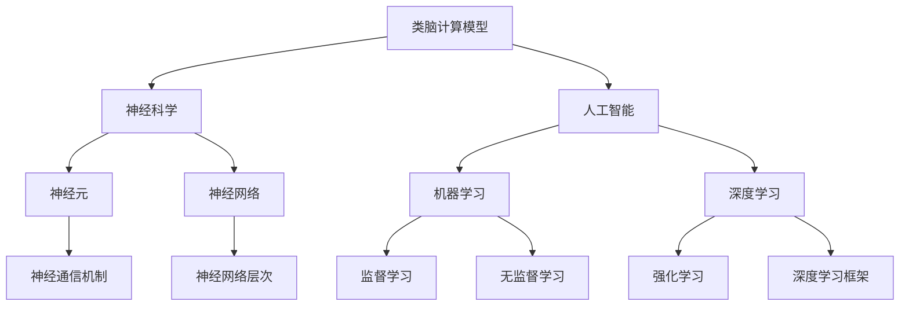

                 

### 类脑计算模型：融合神经科学与AI的新思路

在当今技术飞速发展的时代，人工智能（AI）和神经科学正在以惊人的速度相互融合，催生出一种全新的计算模型——类脑计算模型。这一模型不仅试图模仿人类大脑的信息处理方式，更在理论上为解决当前AI面临的诸多难题提供了新的方向。本文旨在深入探讨类脑计算模型的起源、核心概念、原理以及其与神经科学和人工智能的紧密联系，同时展望其在未来可能带来的巨大影响。

### 关键词

- 类脑计算模型
- 神经科学
- 人工智能
- 神经元
- 深度学习
- 强化学习

### 摘要

本文首先介绍了类脑计算模型的起源和发展历程，探讨了其核心概念及其与神经科学和人工智能的关系。接着，文章详细阐述了神经元和神经网络的基础知识，以及机器学习和深度学习的基本原理。在此基础上，文章通过Python源代码展示了类脑计算模型的构建和优化方法，并深入分析了其在不同领域的应用实例。最后，文章展望了类脑计算模型的未来发展趋势和面临的挑战，提出了相应的解决方案和最佳实践。

### 目录大纲

1. 类脑计算概述
   1.1 类脑计算的起源与发展
   1.2 类脑计算的核心概念
   1.3 类脑计算与神经科学的联系
   1.4 类脑计算与人工智能的融合

2. 神经科学基础
   2.1 神经元与神经网络
   2.2 神经元通信机制
   2.3 神经网络的层次与功能
   2.4 神经科学实验方法与技术

3. 人工智能基础
   3.1 机器学习基本概念
   3.2 监督学习与无监督学习
   3.3 强化学习基础
   3.4 深度学习框架简介

4. 类脑计算模型构建
   4.1 神经网络与深度学习模型
   4.2 类脑计算模型的设计原则
   4.3 类脑计算模型的优化方法
   4.4 类脑计算模型的应用实例

5. 数学模型与算法原理
   5.1 神经科学中的数学模型
   5.2 信息论与类脑计算
   5.3 强化学习中的数学模型
   5.4 深度学习中的数学公式与应用

6. 类脑计算应用实例
   6.1 类脑计算在图像处理中的应用
   6.2 类脑计算在语音识别中的应用
   6.3 类脑计算在自然语言处理中的应用
   6.4 类脑计算在机器人控制中的应用

7. 未来展望与挑战
   7.1 类脑计算的发展趋势
   7.2 类脑计算在医学领域的应用前景
   7.3 类脑计算面临的挑战与解决方案
   7.4 类脑计算的未来发展与影响

### 核心概念与联系

为了更清晰地理解类脑计算模型，我们需要先了解其核心概念和它们之间的联系。以下是类脑计算模型的关键概念及其相互关系架构图：

在接下来的章节中，我们将逐一探讨这些概念及其在类脑计算模型中的具体应用。

### 类脑计算概述

#### 1.1 类脑计算的起源与发展

类脑计算（Brain-inspired Computing）的概念起源于对人类大脑信息处理机制的深入研究。早在20世纪40年代，神经科学家和计算机科学家就开始探讨如何模拟人类大脑的计算过程。1950年，图灵提出了图灵机这一抽象模型，为计算机科学奠定了基础。然而，随着技术的进步和计算能力的提升，人们逐渐发现，传统的人工智能方法在处理复杂任务时存在诸多局限，难以达到人类大脑的处理水平。

为了解决这一问题，科学家们开始将目光转向大脑，希望从中寻找灵感。类脑计算模型应运而生，旨在模仿人类大脑的结构和功能，实现高效、灵活的信息处理能力。1986年，霍普菲尔和海顿（Hopfield）提出了 Hopfield 网络这一早期的类脑计算模型，为后续研究奠定了基础。

进入21世纪，随着深度学习（Deep Learning）和神经科学技术的快速发展，类脑计算迎来了新的机遇。2012年，AlexNet 在ImageNet大赛中取得了突破性成绩，标志着深度学习时代的到来。同时，神经科学领域在神经元通信机制、神经网络层次等方面的研究取得了重要进展，为类脑计算提供了更加坚实的理论基础。

#### 1.2 类脑计算的核心概念

类脑计算的核心概念主要包括神经网络、机器学习、深度学习和信息论等。这些概念相互交织，共同构成了类脑计算的理论框架。

1. **神经网络**：神经网络是模仿人类大脑神经元连接方式的计算模型。它由大量相互连接的神经元组成，通过调整神经元之间的权重来学习输入数据和输出结果之间的关系。神经网络可以分类为前馈网络、卷积网络、循环网络等不同类型，适用于处理各种复杂任务。

2. **机器学习**：机器学习是一种使计算机从数据中学习的方法，无需显式地编写规则。它包括监督学习、无监督学习和强化学习等不同类型。监督学习用于从已知数据中学习规律，无监督学习用于发现数据中的内在结构，强化学习用于在动态环境中做出最佳决策。

3. **深度学习**：深度学习是机器学习的一个子领域，通过多层神经网络实现自动特征提取和复杂模式识别。它具有较高的自学习和泛化能力，广泛应用于图像识别、语音识别、自然语言处理等领域。

4. **信息论**：信息论是研究信息传输和处理规律的一门学科。在类脑计算中，信息论提供了一种量化信息传输效率和可靠性的方法，有助于优化神经网络结构和训练过程。

#### 1.3 类脑计算与神经科学的联系

类脑计算与神经科学的联系主要体现在对大脑信息处理机制的模仿和探索上。神经科学的研究成果为类脑计算提供了丰富的理论基础，包括神经元通信机制、神经网络结构、大脑功能分区等。

1. **神经元通信机制**：神经元通过电信号和化学信号进行通信。类脑计算模型通过模拟这种通信机制，实现了对输入数据的预处理和特征提取。例如，卷积神经网络（CNN）模仿了人类视觉皮层的图像处理机制，通过卷积和池化操作实现了图像特征的提取。

2. **神经网络结构**：大脑中的神经网络具有高度层次化和模块化的特点。类脑计算模型通过构建多层次神经网络，实现了对复杂任务的层次化处理。例如，深度神经网络（DNN）通过多层非线性变换，实现了从原始数据到高级抽象特征的转化。

3. **大脑功能分区**：大脑的不同区域负责不同的功能。类脑计算模型通过模拟大脑的功能分区，实现了对特定任务的分工和协同处理。例如，在自然语言处理（NLP）领域，类脑计算模型通过分层神经网络实现了词汇、句法和语义等不同层次的语义理解。

#### 1.4 类脑计算与人工智能的融合

类脑计算与人工智能的融合主要体现在以下几个方面：

1. **算法优化**：类脑计算模型通过模拟大脑的计算方式，实现了对传统人工智能算法的优化。例如，深度强化学习（Deep Reinforcement Learning）通过模仿大脑的学习机制，实现了在动态环境中的自适应学习和决策。

2. **硬件加速**：类脑计算模型对硬件资源的需求较高，因此人工智能硬件的发展为类脑计算提供了强大的支持。例如，类脑芯片（Brain-inspired Chip）通过模拟大脑的计算方式，实现了对类脑计算模型的加速和优化。

3. **应用拓展**：类脑计算模型在图像处理、语音识别、自然语言处理等传统人工智能领域取得了显著成果，同时也在医学、机器人、自动驾驶等新兴领域展现了广阔的应用前景。

通过融合神经科学和人工智能，类脑计算模型不仅为解决当前人工智能面临的难题提供了新思路，也为未来人工智能的发展奠定了基础。在接下来的章节中，我们将进一步探讨类脑计算模型的核心算法原理和实际应用案例。希望读者能够跟随本文的思路，逐步深入理解类脑计算的魅力所在。

