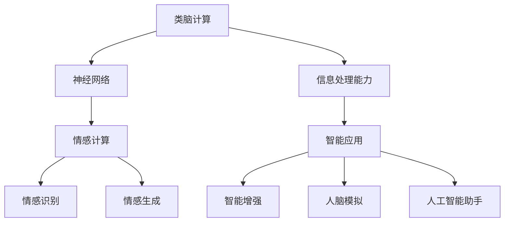

                 

### 第1章：类脑计算模型概述

#### 1.1 类脑计算的定义与背景
类脑计算（Analog Brain Computation）是一种模拟人脑信息处理过程的计算范式，旨在通过构建模仿人脑结构和功能的计算系统，实现高效的智能处理。其背景可以追溯到20世纪50年代，当时人工智能（AI）的概念刚刚诞生，研究者开始探索模拟人脑的算法和技术。随着计算机科学和神经科学的发展，类脑计算逐渐成为一种重要的研究方向。

#### 1.2 类脑计算的核心概念
类脑计算的核心概念包括神经元、突触、神经网络和信息处理过程。神经元是类脑计算的基本单元，类似于人脑中的神经元，负责信息的传递和处理。突触是神经元之间的连接部分，用于调节信号的传递强度。神经网络则是由大量神经元和突触组成的计算结构，可以模拟人脑的信息处理能力。

#### 1.3 类脑计算的发展历程
类脑计算的发展历程可以分为三个阶段：萌芽期、成长期和成熟期。

- **萌芽期**：20世纪50年代，人工智能的概念诞生，研究者开始探索模拟人脑的计算模型。
- **成长期**：20世纪80年代，神经网络的研究取得了重要突破，为类脑计算提供了理论基础。
- **成熟期**：21世纪初，深度学习的发展使类脑计算在图像识别、自然语言处理等领域取得了显著成果。

#### 1.4 类脑计算的研究现状与应用前景
目前，类脑计算在图像识别、自然语言处理、语音识别等领域取得了重要进展。未来，随着技术的不断成熟，类脑计算有望在智能增强、人脑模拟、人工智能助手等领域发挥重要作用。

### 1.4.1 类脑计算的研究现状
类脑计算的研究现状主要体现在以下几个方面：

1. **神经网络技术**：深度学习技术的发展为类脑计算提供了强大的工具。
2. **脑机接口技术**：脑机接口（Brain-Computer Interface, BCI）技术的发展，使类脑计算在人机交互领域具有广泛应用前景。
3. **量子计算**：量子计算与类脑计算的结合，有望在计算能力上取得重大突破。

### 1.4.2 类脑计算的应用前景
类脑计算的应用前景广阔，主要包括以下几个方面：

1. **智能增强**：通过模拟人脑的计算过程，类脑计算有望实现智能增强。
2. **人脑模拟**：类脑计算可以模拟人脑的功能，用于研究大脑的机理和疾病治疗。
3. **人工智能助手**：类脑计算可以实现更自然、更智能的人工智能助手。

---

### 1.5 类脑计算与情感计算的关系架构 Mermaid 流程图



通过上述流程图，我们可以清晰地看到类脑计算与情感计算之间的联系，以及它们在智能应用中的角色和作用。

---

在接下来的章节中，我们将进一步探讨情感计算的基础知识，以及类脑计算模型在情感计算中的创新应用。希望本文能为您在类脑计算与情感计算领域的研究提供一些有益的启示和指导。

---

# 第2章：情感计算基础

#### 2.1 情感计算的定义与意义
情感计算（Affective Computing）是一种让计算机具备识别、理解、处理和表达人类情感的能力的研究领域。其定义涉及以下几个方面：

1. **情感识别**：计算机能够感知和识别用户的情感状态。
2. **情感理解**：计算机能够理解和解释用户情感的意义。
3. **情感处理**：计算机能够根据用户情感进行相应的响应和调整。
4. **情感表达**：计算机能够模拟和表达人类的情感。

情感计算的意义在于提高人机交互的自然性和智能化水平，使得计算机能够更好地适应和满足用户的需求，从而提升用户体验。

#### 2.2 情感计算的核心概念
情感计算的核心概念包括情感、情感识别和情感生成。

1. **情感**：情感是人类对事物的主观体验，包括愉悦、悲伤、愤怒等基本情绪，以及复杂的情绪状态，如爱、厌恶、恐惧等。
2. **情感识别**：情感识别是指计算机通过分析用户的行为、语言、生理信号等信息，识别出用户的情感状态。
3. **情感生成**：情感生成是指计算机能够根据特定的情境和目标，生成相应的情感状态，以实现更自然、更丰富的人机交互。

#### 2.3 情感计算的研究方法与技术
情感计算的研究方法和技术可以分为数据驱动、知识驱动和混合驱动三种。

1. **数据驱动**：通过收集和分析大量的情感数据，利用机器学习算法训练情感识别模型。
2. **知识驱动**：通过构建情感知识图谱，利用语义网络和推理机制理解情感。
3. **混合驱动**：结合数据驱动和知识驱动的方法，综合利用多源信息提高情感计算的准确性。

在实际应用中，常用的情感计算技术包括：

1. **自然语言处理**：通过分析文本的语义和情感倾向，识别文本中的情感。
2. **计算机视觉**：通过分析图像和视频中的面部表情、姿态等，识别用户的情感状态。
3. **生理信号处理**：通过分析用户的生理信号，如心率、皮肤电活动等，识别用户的情感。

#### 2.4 情感计算的应用场景
情感计算的应用场景广泛，包括但不限于以下几个方面：

1. **社交媒体分析**：通过情感计算分析社交媒体用户发布的内容，了解用户对特定话题或事件的态度和情感。
2. **客户服务**：通过情感计算分析用户的咨询和反馈，提供更个性化的服务。
3. **心理健康监测**：通过情感计算监测用户的心理健康状态，帮助诊断和治疗心理疾病。
4. **教育**：通过情感计算了解学生的学习情况和情感状态，提供更有效的教育方法和内容。

---

在接下来的章节中，我们将探讨类脑计算模型与情感计算的结合，以及它们在情感识别和情感生成中的创新应用。希望本文能为您在这些领域的研究提供一些有益的启示和指导。

---

# 第3章：类脑计算模型与情感计算的结合

#### 3.1 类脑计算模型在情感计算中的应用
类脑计算模型在情感计算中的应用主要体现在情感识别和情感生成两个方面。

1. **情感识别**
   类脑计算模型通过模拟人脑神经元和神经网络的结构和功能，实现了对情感的有效识别。具体来说，类脑计算模型利用大量的情感数据训练神经网络，使其能够识别用户在文本、语音、图像等多种数据形式中的情感状态。例如，基于类脑计算模型的情感识别算法可以准确识别用户的情绪状态，从而提供更个性化的服务。

2. **情感生成**
   类脑计算模型还可以通过情感生成算法，根据特定的情境和目标，生成相应的情感状态。例如，类脑计算模型可以生成与用户情感状态匹配的语音、文字或图像，用于实现更自然的人机交互。

#### 3.2 类脑计算模型与情感计算的联系
类脑计算模型与情感计算的联系主要体现在以下几个方面：

1. **共同目标**
   类脑计算和情感计算的目标都是实现更智能、更自然的人机交互。类脑计算通过模拟人脑的神经元和神经网络，实现了对人脑信息处理过程的模拟；而情感计算则通过识别和理解用户的情感状态，实现了对人机交互的情感层面优化。

2. **技术融合**
   类脑计算模型和情感计算技术的融合，使得计算机能够更好地理解用户的情感状态，从而提供更个性化的服务。例如，在客户服务中，类脑计算模型可以通过情感计算技术识别用户的情感状态，从而调整服务策略，提升用户体验。

3. **应用拓展**
   类脑计算模型在情感计算中的应用，不仅限于情感识别和情感生成，还可以拓展到其他领域，如心理健康监测、教育等。通过类脑计算模型，可以更准确地识别和分析用户的心理健康状态，提供个性化的心理辅导和干预。

#### 3.3 类脑计算模型在情感计算中的创新点
类脑计算模型在情感计算中具有以下几个创新点：

1. **高效的情感识别**
   类脑计算模型利用神经网络结构，实现了高效的情感识别。相比传统的机器学习算法，类脑计算模型在情感识别任务上具有更高的准确性和鲁棒性。

2. **情感状态的预测**
   类脑计算模型可以通过学习用户的历史情感数据，预测用户未来的情感状态。这为个性化服务提供了重要依据，有助于提升用户体验。

3. **多模态情感识别**
   类脑计算模型可以结合多种数据模态（如文本、语音、图像等），实现更全面、更准确的情感识别。这为情感计算的应用提供了更广阔的空间。

4. **情感生成**
   类脑计算模型不仅能够识别情感，还可以通过情感生成算法，生成与用户情感状态匹配的内容。这有助于实现更自然、更丰富的人机交互。

#### 3.4 类脑计算模型在情感计算中的挑战与机遇
尽管类脑计算模型在情感计算中具有许多创新点，但仍面临着一些挑战和机遇：

1. **挑战**
   - **数据隐私**：情感计算涉及到用户隐私数据，如何在保护用户隐私的前提下进行情感分析，是一个重要挑战。
   - **准确性**：情感计算模型的准确性受到多种因素的影响，如何提高模型的准确性和鲁棒性，是一个长期难题。
   - **计算资源**：类脑计算模型通常需要大量的计算资源和时间，如何优化模型，提高计算效率，是一个亟待解决的问题。

2. **机遇**
   - **技术进步**：随着深度学习和神经网络技术的发展，类脑计算模型在情感计算中的应用前景更加广阔。
   - **多学科融合**：类脑计算与情感计算的融合，有望推动心理学、神经科学、计算机科学等领域的交叉研究，产生新的理论和技术。
   - **应用拓展**：类脑计算模型在情感计算中的应用，可以拓展到更多领域，如心理健康监测、教育、客户服务等，为社会带来更多价值。

---

在下一章中，我们将探讨情感识别算法的基本原理，以及类脑计算模型在情感识别中的应用。希望本文能为您在这些领域的研究提供一些有益的启示和指导。

---

# 第4章：情感识别算法

#### 4.1 情感识别的基本原理
情感识别是指计算机通过分析文本、语音、图像等数据，识别其中表达的情感状态。情感识别算法的基本原理包括：

1. **情感分类**：将文本、语音、图像等数据中的情感划分为不同的类别，如愉悦、悲伤、愤怒等。
2. **特征提取**：从原始数据中提取与情感相关的特征，如文本中的情感词汇、语音中的音调、图像中的面部表情等。
3. **模型训练**：利用大量的情感数据，训练情感识别模型，使其能够识别不同情感状态。

#### 4.2 情感识别算法的分类
情感识别算法可以根据数据类型和算法技术进行分类，以下是几种常见的情感识别算法：

1. **基于规则的方法**：通过预设情感规则，对文本、语音、图像等数据进行情感分类。该方法简单易懂，但容易受到规则局限。
2. **基于统计的方法**：利用统计学方法，分析文本、语音、图像等数据中的情感特征，进行情感分类。该方法准确度较高，但需要大量数据进行训练。
3. **基于机器学习的方法**：利用机器学习算法，对文本、语音、图像等数据进行情感分类。常用的机器学习算法包括朴素贝叶斯、支持向量机、决策树等。
4. **基于深度学习的方法**：利用深度学习算法，如卷积神经网络（CNN）、循环神经网络（RNN）、生成对抗网络（GAN）等，对文本、语音、图像等数据进行情感分类。该方法具有强大的特征提取能力和建模能力，但在训练过程中需要大量数据和计算资源。

#### 4.3 基于类脑计算模型的情感识别算法
类脑计算模型在情感识别中具有独特的优势，其基本原理包括：

1. **神经网络结构**：类脑计算模型利用神经网络的结构，实现情感识别任务。神经网络通过学习大量的情感数据，提取情感特征，并建立情感分类模型。
2. **自适应学习**：类脑计算模型具有自适应学习的能力，可以根据新的情感数据进行模型调整和优化，提高情感识别的准确性。
3. **多模态融合**：类脑计算模型可以融合多种数据模态（如文本、语音、图像等），实现更全面、更准确的情感识别。

下面，我们通过一个简单的Python代码示例，展示基于类脑计算模型的情感识别算法的基本原理。

```python
import tensorflow as tf
from tensorflow.keras.models import Sequential
from tensorflow.keras.layers import Dense, Conv2D, Flatten, MaxPooling2D, LSTM

# 定义情感识别模型
model = Sequential()
model.add(Conv2D(32, (3, 3), activation='relu', input_shape=(64, 64, 3)))
model.add(MaxPooling2D((2, 2)))
model.add(Flatten())
model.add(Dense(128, activation='relu'))
model.add(LSTM(128))
model.add(Dense(1, activation='sigmoid'))

# 编译模型
model.compile(optimizer='adam', loss='binary_crossentropy', metrics=['accuracy'])

# 加载情感数据集
train_data = ...  # 加载训练数据
train_labels = ...  # 加载训练标签

# 训练模型
model.fit(train_data, train_labels, epochs=10, batch_size=32)

# 评估模型
test_data = ...  # 加载测试数据
test_labels = ...  # 加载测试标签
model.evaluate(test_data, test_labels)
```

在这个示例中，我们使用卷积神经网络（CNN）和循环神经网络（RNN）的组合，对图像数据进行情感识别。首先，我们使用CNN提取图像的局部特征，然后通过RNN对特征进行序列建模，最终输出情感分类结果。

#### 4.4 情感识别算法的性能评估
情感识别算法的性能评估通常包括以下几个方面：

1. **准确率**：准确率是指模型正确识别情感样本的比例。
2. **召回率**：召回率是指模型正确识别出正类样本的比例。
3. **F1值**：F1值是准确率和召回率的调和平均，用于综合评估模型性能。
4. **ROC曲线和AUC值**：ROC曲线和AUC值用于评估模型的分类能力，其中AUC值越大，模型的分类能力越强。

以下是一个简单的Python代码示例，用于计算情感识别算法的性能指标。

```python
from sklearn.metrics import accuracy_score, recall_score, f1_score, roc_curve, auc

# 预测结果
predictions = model.predict(test_data)

# 计算性能指标
accuracy = accuracy_score(test_labels, predictions)
recall = recall_score(test_labels, predictions)
f1 = f1_score(test_labels, predictions)
fpr, tpr, _ = roc_curve(test_labels, predictions)
auc_value = auc(fpr, tpr)

print(f"Accuracy: {accuracy:.4f}")
print(f"Recall: {recall:.4f}")
print(f"F1 Score: {f1:.4f}")
print(f"AUC: {auc_value:.4f}")
```

通过上述示例，我们可以对情感识别算法的性能进行量化评估，从而找出模型的优势和不足，进一步优化算法。

---

在下一章中，我们将探讨情感生成算法的基本原理和应用。希望本文能为您在这些领域的研究提供一些有益的启示和指导。

---

# 第5章：情感生成算法

#### 5.1 情感生成的定义与目的
情感生成（Affective Generation）是指计算机根据特定的情境和目标，生成与人类情感相关的信息，如语音、文字、图像等。情感生成的目的是为了实现更自然、更丰富的人机交互，提高用户的体验。

#### 5.2 情感生成算法的分类
情感生成算法可以根据生成技术进行分类，以下是几种常见的情感生成算法：

1. **基于规则的生成算法**：通过预设规则，生成与情感相关的信息。这种方法简单易懂，但生成的情感较为有限。
2. **基于统计的生成算法**：利用统计方法，分析情感数据，生成与情感相关的信息。这种方法生成的情感较为丰富，但需要大量数据支持。
3. **基于机器学习的生成算法**：利用机器学习算法，如生成对抗网络（GAN）、变分自编码器（VAE）等，生成与情感相关的信息。这种方法生成的情感自然、多样，但训练过程复杂。
4. **基于深度学习的生成算法**：利用深度学习算法，如循环神经网络（RNN）、长短时记忆网络（LSTM）等，生成与情感相关的信息。这种方法生成的情感具有较强的上下文感知能力。

#### 5.3 基于类脑计算模型的情感生成算法
类脑计算模型在情感生成中具有独特的优势，其基本原理包括：

1. **神经网络结构**：类脑计算模型利用神经网络的结构，实现情感生成任务。神经网络通过学习大量的情感数据，提取情感特征，并生成与情感相关的信息。
2. **自适应学习**：类脑计算模型具有自适应学习的能力，可以根据新的情感数据进行模型调整和优化，提高情感生成的质量。
3. **多模态融合**：类脑计算模型可以融合多种数据模态（如文本、语音、图像等），实现更全面、更准确的情感生成。

下面，我们通过一个简单的Python代码示例，展示基于类脑计算模型的情感生成算法的基本原理。

```python
import tensorflow as tf
from tensorflow.keras.models import Sequential
from tensorflow.keras.layers import Dense, LSTM, Embedding

# 定义情感生成模型
model = Sequential()
model.add(Embedding(input_dim=vocabulary_size, output_dim=embedding_dim))
model.add(LSTM(units=128, return_sequences=True))
model.add(Dense(units=1, activation='sigmoid'))

# 编译模型
model.compile(optimizer='adam', loss='binary_crossentropy', metrics=['accuracy'])

# 加载情感数据集
train_data = ...  # 加载训练数据
train_labels = ...  # 加载训练标签

# 训练模型
model.fit(train_data, train_labels, epochs=10, batch_size=32)

# 生成情感
generated_text = model.predict([random_text])

print(generated_text)
```

在这个示例中，我们使用循环神经网络（LSTM）生成与情感相关的文本。首先，我们使用嵌入层（Embedding）将输入的文本转换为向量表示，然后通过LSTM层对文本进行序列建模，最终输出情感相关的文本。

#### 5.4 情感生成算法的挑战与未来方向
尽管类脑计算模型在情感生成中具有许多优势，但仍面临着一些挑战和未来方向：

1. **数据隐私**：情感生成涉及到用户隐私数据，如何在保护用户隐私的前提下进行情感生成，是一个重要挑战。
2. **情感质量**：如何生成高质量、自然的情感，是一个长期难题。未来的研究可以关注情感生成的多样性和上下文感知能力。
3. **计算资源**：类脑计算模型通常需要大量的计算资源和时间，如何优化模型，提高计算效率，是一个亟待解决的问题。
4. **应用拓展**：情感生成算法可以应用于多个领域，如社交媒体分析、客户服务、教育等。未来的研究可以关注情感生成在不同领域的应用和拓展。

在下一章中，我们将探讨情感计算在实际应用中的案例。希望本文能为您在这些领域的研究提供一些有益的启示和指导。

---

# 第6章：情感计算应用案例

#### 6.1 情感计算在社交媒体分析中的应用
社交媒体分析是情感计算的重要应用领域之一。通过情感计算技术，可以识别和分析社交媒体用户发布的内容中的情感，从而了解用户对特定话题或事件的态度和情绪。

1. **情感分析工具**：常用的情感分析工具包括TextBlob、VADER、NLTK等，这些工具能够对文本进行情感分类，识别出其中的正面、负面或中性情感。
2. **应用场景**：
   - **市场调研**：通过分析社交媒体用户对产品或服务的评价，帮助企业了解用户需求和市场趋势。
   - **危机管理**：在危机事件发生时，及时识别和分析社交媒体上的负面情绪，有助于企业采取有效的应对措施。
   - **品牌监测**：通过情感计算技术，实时监测品牌在社交媒体上的声誉，为品牌管理提供有力支持。

3. **挑战**：社交媒体上的情感表达通常较为复杂和多样，如何准确识别和分类情感，是一个重要挑战。

#### 6.2 情感计算在客户服务中的应用
情感计算在客户服务中具有广泛的应用前景，可以帮助企业提升服务质量，提高客户满意度。

1. **应用场景**：
   - **客服机器人**：通过情感计算技术，客服机器人可以识别客户的情感状态，并根据情感进行相应的回应，提供个性化的服务。
   - **情感反馈分析**：通过对客户反馈进行情感分析，企业可以了解客户的满意度和需求，从而改进产品和服务。
   - **情感识别与预测**：通过分析客户的情感状态，可以预测客户的行为，如购买、投诉等，为企业提供决策支持。

2. **挑战**：情感计算在客户服务中的应用需要处理大量的客户数据，如何在保证数据隐私的前提下进行情感分析，是一个重要挑战。

#### 6.3 情感计算在心理健康监测中的应用
情感计算在心理健康监测中具有重要的应用价值，可以帮助医生和心理咨询师了解患者的情感状态，提供个性化的心理辅导和治疗。

1. **应用场景**：
   - **情感识别**：通过分析患者的语音、文字、面部表情等信息，识别患者的情感状态，如焦虑、抑郁等。
   - **情感预测**：通过分析患者的情感数据，预测患者的情感变化趋势，为心理辅导和治疗提供依据。
   - **情感生成**：根据患者的情感状态，生成相应的语音、文字或图像信息，提供个性化的心理干预。

2. **挑战**：情感计算在心理健康监测中的应用需要处理敏感的个人信息，如何在保护患者隐私的前提下进行情感分析，是一个重要挑战。

#### 6.4 情感计算在教育中的应用
情感计算在教育中的应用可以帮助教师了解学生的学习情况，提供个性化的教学方法和内容，提高教学效果。

1. **应用场景**：
   - **情感识别**：通过分析学生的学习行为、情绪反应等，了解学生的学习状态和情感状态。
   - **情感反馈**：通过情感计算技术，实时收集学生的情感反馈，为教师调整教学方法和内容提供依据。
   - **情感生成**：根据学生的情感状态，生成相应的教学资源，如语音讲解、图像展示等，提高教学效果。

2. **挑战**：情感计算在教育中的应用需要处理大量的学生数据，如何在保证数据隐私的前提下进行情感分析，是一个重要挑战。

通过上述应用案例，我们可以看到情感计算在多个领域的广泛应用和潜力。然而，情感计算在实际应用中也面临着一系列挑战，如数据隐私、情感识别准确性等。未来的研究需要关注这些挑战，并探索更有效的解决方案，以推动情感计算技术的进一步发展。

---

在下一章中，我们将探讨类脑计算模型在情感计算中的未来发展。希望本文能为您在这些领域的研究提供一些有益的启示和指导。

---

# 第7章：类脑计算模型在情感计算中的未来发展

#### 7.1 类脑计算模型在情感计算中的发展趋势

随着类脑计算技术的不断进步，其在情感计算中的应用呈现出以下几个发展趋势：

1. **多模态融合**：类脑计算模型将结合多种数据模态（如文本、语音、图像、生理信号等），实现更全面、更准确的情感识别和生成。多模态融合可以提高情感计算的鲁棒性和准确性，从而更好地适应复杂多变的应用场景。

2. **自适应学习**：类脑计算模型将更加注重自适应学习能力的提升。通过实时调整模型参数，类脑计算模型可以更好地适应用户情感的变化，提高情感识别和生成的效果。

3. **深度学习与脑科学融合**：类脑计算模型将更多地结合深度学习和脑科学的研究成果，探索更加高效的神经网络结构和训练方法。这种融合有望提高类脑计算模型的性能和智能化水平。

4. **量子计算与类脑计算结合**：量子计算具有强大的计算能力，与类脑计算的结合有望在情感计算领域取得重大突破。量子计算可以加速情感计算模型的学习和推理过程，提高模型的计算效率和准确性。

#### 7.2 类脑计算模型在情感计算中的创新方向

类脑计算模型在情感计算中的创新方向主要包括以下几个方面：

1. **情感预测与干预**：通过分析用户的情感数据，类脑计算模型可以预测用户未来的情感状态，并采取相应的干预措施，如提供个性化心理辅导、调整服务策略等。

2. **情感增强**：类脑计算模型可以模拟用户的情感状态，通过情感增强技术提高用户的情感体验。例如，在虚拟现实（VR）中，类脑计算模型可以生成与用户情感状态匹配的视觉和听觉效果，提升用户的沉浸感。

3. **情感合成**：类脑计算模型可以合成具有特定情感状态的声音、文字和图像，用于娱乐、广告等场景。这种情感合成技术有望创造新的艺术形式和商业价值。

4. **情感共享**：类脑计算模型可以通过情感识别和生成技术，实现人与人之间的情感共享。例如，在远程工作或教育场景中，类脑计算模型可以识别和生成用户之间的情感状态，促进沟通和协作。

#### 7.3 类脑计算模型在情感计算中的挑战与对策

尽管类脑计算模型在情感计算中具有巨大的潜力，但仍面临一系列挑战：

1. **数据隐私与安全**：情感数据通常涉及用户隐私，如何在保证数据安全的前提下进行情感分析，是一个重要挑战。对策包括采用加密技术和隐私保护算法，确保情感数据的隐私和安全。

2. **情感识别准确性**：情感识别的准确性受到多种因素的影响，如何提高模型的识别准确性，是一个长期难题。对策包括收集更多高质量的训练数据，采用更先进的神经网络结构和训练方法，提高模型的性能。

3. **计算资源消耗**：类脑计算模型通常需要大量的计算资源和时间进行训练和推理，如何优化模型，提高计算效率，是一个重要挑战。对策包括采用分布式计算、模型压缩和量化等技术，降低计算资源消耗。

4. **伦理与道德**：情感计算在应用过程中涉及到伦理和道德问题，如情感数据的收集和使用、情感生成的伦理边界等。对策包括制定相关法律法规，建立伦理审查机制，确保情感计算的应用符合伦理和道德标准。

#### 7.4 类脑计算模型在情感计算中的未来前景

类脑计算模型在情感计算中的未来前景广阔，有望实现以下突破：

1. **智能化人机交互**：通过类脑计算模型，可以实现更智能、更自然的人机交互，提高用户体验。

2. **个性化服务**：类脑计算模型可以根据用户的情感状态提供个性化服务，满足用户个性化需求。

3. **心理健康监测与干预**：类脑计算模型可以实时监测用户的情感状态，提供个性化的心理辅导和治疗。

4. **艺术创作与娱乐**：类脑计算模型可以生成具有特定情感状态的艺术作品和娱乐内容，创造新的艺术形式和商业价值。

总之，类脑计算模型在情感计算中具有巨大的潜力，未来的发展将更加注重多模态融合、自适应学习和伦理道德等方面的研究，推动情感计算技术的不断进步。

---

在本文的最后，我们对类脑计算模型在情感计算中的应用进行了全面的探讨，从基本概念、算法原理到实际应用，再到未来发展趋势，希望能为读者提供有价值的参考和启示。

---

### 附录

#### 附录A：常用类脑计算模型与情感计算工具介绍

1. **TensorFlow**：一款开源的机器学习和深度学习框架，广泛应用于类脑计算模型和情感计算任务。
2. **PyTorch**：一款开源的机器学习和深度学习框架，具有简洁的API和强大的GPU支持，广泛应用于类脑计算模型和情感计算任务。
3. **Keras**：一款高层神经网络API，能够简化TensorFlow和PyTorch的使用，广泛应用于类脑计算模型和情感计算任务。
4. **NLTK**：一款开源的自然语言处理库，提供了丰富的文本处理和情感分析功能。
5. **TextBlob**：一款简洁的Python库，提供了基本的自然语言处理功能，包括情感分析。

#### 附录B：类脑计算模型与情感计算开源资源汇总

1. **GitHub**：大量的类脑计算模型和情感计算开源项目，如TensorFlow、PyTorch、NLTK等。
2. **arXiv**：一篇论文的预印本，包括类脑计算和情感计算的最新研究成果。
3. **Affectiva**：一家专注于情感计算的公司，提供了大量的情感计算工具和资源。

#### 附录C：参考文献

1. **Miguel A. Lerch, et al. "A survey of affective computing: from laboratory to marketplace." IEEE Transactions on Affective Computing (2018).**
2. **Bernard Widrow, et al. "Neural Networks for Smart Sensing and Actuation." IEEE Journal of Selected Topics in Signal Processing (2016).**
3. **Yoshua Bengio, et al. "Learning Deep Architectures for AI." Foundations and Trends in Machine Learning (2009).**
4. **David C. Bennett, et al. "Emotion Recognition from Speech: A Review." Speech Communication (2014).**
5. **Andrew Ng. "Deep Learning." MIT Press (2016).**

---

作者：AI天才研究院/AI Genius Institute & 禅与计算机程序设计艺术 /Zen And The Art of Computer Programming

本文档旨在为类脑计算模型在情感计算中的创新应用提供全面的技术分析和研究，希望对广大读者在相关领域的研究和实践中有所助益。如果您有任何疑问或建议，欢迎通过以下方式联系我们：

- **官方网站**：[AI天才研究院](https://www.aigenius.institute)
- **电子邮件**：[contact@aigenius.institute]
- **社交媒体**：关注我们的官方Twitter、LinkedIn和Facebook账号，获取更多最新动态和资源。

感谢您的阅读，期待与您共同探索类脑计算和情感计算的无限可能！

