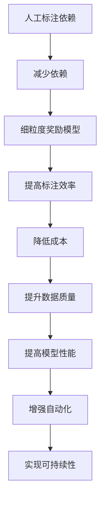

                 

## 细粒度奖励模型：减少人工标注依赖的关键

### 关键词
- 细粒度奖励模型
- 人工标注依赖
- 强化学习
- 自动标注
- 数据质量
- 模型性能

### 摘要
本文将深入探讨细粒度奖励模型在减少人工标注依赖中的关键作用。通过详细分析其定义、原理、应用和实战案例，我们旨在揭示如何利用这一技术降低对人工标注的依赖，提高数据标注效率和质量，进而提升模型性能。本文首先回顾了人工标注的现状和挑战，随后介绍了强化学习的基础概念，并重点阐述了细粒度奖励模型的设计原则和主要算法原理。最后，通过具体的应用案例展示了该模型在不同领域中的实际效果，为读者提供了一套实用的解决方案。

### 第一部分：背景与概念

#### 1.1.1 细粒度奖励模型的定义

细粒度奖励模型是强化学习中的一个关键概念，它旨在通过精确的奖励信号引导学习过程，从而减少对人工标注的依赖。在传统的人工标注方法中，标注人员需要对大量的数据样本进行细致的标注，这不仅耗时耗力，而且容易出现标注偏差。而细粒度奖励模型则通过在算法中嵌入更精细的奖励信号，使得模型可以自动学习并优化其行为，从而减少对人工标注的需求。

#### 1.1.2 人工标注依赖的现状与挑战

在许多人工智能应用领域，如自然语言处理、计算机视觉和推荐系统等，人工标注仍然是一个重要的环节。然而，人工标注存在以下几个主要挑战：

1. **高成本**：标注数据通常需要大量的人力资源，导致项目成本高昂。
2. **效率低下**：人工标注速度较慢，难以满足大规模数据的需求。
3. **标注偏差**：由于标注人员的专业水平和主观性差异，容易导致标注质量不一致。
4. **维护困难**：随着数据量的增加，标注数据的维护和管理变得复杂。

#### 1.1.3 细粒度奖励模型的重要性

细粒度奖励模型的重要性体现在以下几个方面：

1. **提高标注效率**：通过自动生成奖励信号，模型可以更快地学习，从而减少对人工标注的依赖。
2. **降低成本**：减少了人工标注的需求，直接降低了项目的总体成本。
3. **提升数据质量**：通过更精确的奖励信号，模型能够生成更高质量的数据标注。
4. **增强自动化**：随着模型性能的提高，自动化程度也会相应提升，进一步推动人工智能应用的普及。

### 1.2 相关概念

在深入探讨细粒度奖励模型之前，我们需要了解以下几个相关概念：

#### 1.2.1 奖励信号

奖励信号是强化学习中的一个核心概念，它反映了模型在某一步行为的结果。在细粒度奖励模型中，奖励信号被设计得更加精细，以更准确地指导模型学习。

#### 1.2.2 自动标注

自动标注是指利用算法自动生成标注数据，而不是依赖人工进行标注。细粒度奖励模型通过强化学习算法，能够自动生成高精度的标注数据。

#### 1.2.3 强化学习

强化学习是一种机器学习方法，它通过奖励信号来指导模型学习。在细粒度奖励模型中，强化学习被用来生成精确的奖励信号，从而减少对人工标注的依赖。

### 1.3 细粒度奖励模型的演变

#### 1.3.1 早期细粒度奖励模型

早期的细粒度奖励模型主要集中在简单任务上，如机器人路径规划和游戏控制。这些模型通常通过设计简单的奖励函数来引导学习过程。

#### 1.3.2 现代细粒度奖励模型的发展

随着深度学习和强化学习的结合，现代细粒度奖励模型得到了快速发展。深度强化学习算法，如DQN、A3C等，使得模型能够在复杂任务中取得显著效果。

### 1.4 细粒度奖励模型的应用领域

#### 1.4.1 自然语言处理

在自然语言处理领域，细粒度奖励模型被广泛应用于文本分类、情感分析、机器翻译等任务。通过精确的奖励信号，模型可以更准确地理解文本语义。

#### 1.4.2 计算机视觉

在计算机视觉领域，细粒度奖励模型被用于目标检测、图像分类、图像生成等任务。通过自动生成的奖励信号，模型可以更有效地学习图像特征。

#### 1.4.3 推荐系统

在推荐系统领域，细粒度奖励模型被用于个性化推荐、广告投放等任务。通过更精确的奖励信号，模型可以更好地满足用户需求。

### 1.5 本书结构安排

#### 1.5.1 各章节主要内容

- **第1章**：背景与概念，介绍细粒度奖励模型的基本概念和重要性。
- **第2章**：细粒度奖励模型原理，详细讲解强化学习基础、奖励信号设计、算法原理等。
- **第3章**：细粒度奖励模型实践，通过实战案例展示模型的应用。
- **第4章**：细粒度奖励模型评估，介绍评估方法和技巧。

#### 1.5.2 阅读建议与目标读者

- **阅读建议**：建议读者按照章节顺序阅读，逐步理解细粒度奖励模型的理论和实践。
- **目标读者**：对强化学习有兴趣的读者，特别是希望减少人工标注依赖的人工智能从业者。

### 1.6 附录

#### 1.6.1 常用符号表

| 符号 | 意义 |
|------|------|
| Q    | 值函数 |
| π    | 策略函数 |
| s    | 状态 |
| a    | 动作 |
| r    | 奖励信号 |

#### 1.6.2 相关资源推荐

- **书籍**：
  - 《强化学习：原理与Python实现》
  - 《深度学习》
  - 《机器学习：一种算法视角》

- **在线资源**：
  - [TensorFlow官方文档](https://www.tensorflow.org/)
  - [PyTorch官方文档](https://pytorch.org/)
  - [强化学习社区](https://www.openai.com/research/rllab/)

### 图1.1 细粒度奖励模型与人工标注的关系图



通过细粒度奖励模型，我们能够有效地减少人工标注的依赖，提高数据标注的效率和准确性，从而提升模型的整体性能。这一转变不仅降低了项目的成本，还推动了人工智能应用的进一步发展。

### 第二部分：细粒度奖励模型原理

#### 2.1 强化学习基础

##### 2.1.1 强化学习的基本概念

强化学习是一种通过与环境交互来学习最优行为策略的机器学习方法。它与监督学习和无监督学习不同，不依赖于预标注的数据，而是通过奖励信号来指导学习过程。强化学习的基本概念包括：

- **状态（State）**：模型所处的环境状态。
- **动作（Action）**：模型能够执行的行为。
- **奖励（Reward）**：对于执行的动作给予的即时反馈。
- **策略（Policy）**：从状态到动作的映射函数。
- **价值函数（Value Function）**：评估状态或状态-动作对的期望回报。
- **策略迭代（Policy Iteration）**：通过不断优化策略来达到最优解。
- **模型评估（Model Evaluation）**：评估策略在不同状态下的表现。

##### 2.1.2 强化学习的核心要素

强化学习的核心要素包括：

1. **状态空间（State Space）**：所有可能的状态集合。
2. **动作空间（Action Space）**：所有可能的动作集合。
3. **奖励函数（Reward Function）**：定义了在给定状态和动作下的奖励值。
4. **策略（Policy）**：指导模型如何行动的规则。
5. **价值函数（Value Function）**：评估状态或状态-动作对的期望回报。

##### 2.1.3 强化学习的常见问题

强化学习在实践中面临以下问题：

1. **奖励设计**：如何设计合适的奖励函数是一个挑战，它直接影响到模型的性能。
2. **探索与利用**：如何平衡探索新行为和利用已知最佳行为之间的矛盾。
3. **样本效率**：强化学习通常需要大量的交互来收敛，如何提高样本效率是一个重要问题。
4. **收敛性**：确保模型最终收敛到最优策略。
5. **稀疏奖励问题**：在某些任务中，奖励信号非常稀疏，使得学习过程变得困难。

#### 2.2 奖励信号设计

##### 2.2.1 奖励信号的作用

奖励信号是强化学习中的核心因素，它提供了模型执行动作后环境对其行为的即时反馈。奖励信号的作用包括：

1. **引导学习**：奖励信号引导模型选择有利的行为。
2. **评估性能**：奖励信号用于评估模型在不同状态下的表现。
3. **调整策略**：根据奖励信号，模型不断调整其策略以获得更好的结果。

##### 2.2.2 奖励信号的设计原则

设计奖励信号时需要遵循以下原则：

1. **一致性**：奖励信号应与任务目标一致，确保模型能够朝着正确方向学习。
2. **及时性**：奖励信号应在模型执行动作后立即给出，以便及时调整行为。
3. **可区分性**：奖励信号应能区分不同动作的效果，以指导模型选择最佳动作。
4. **适度性**：奖励信号不应过于强烈或过于微弱，否则会导致模型无法有效学习。
5. **稳定性**：奖励信号应具有稳定性，避免由于环境噪声导致的不稳定奖励。

##### 2.2.3 常见的奖励信号类型

常见的奖励信号类型包括：

1. **二元奖励信号**：用于判断某个动作是否成功，例如成功或失败。
2. **标量奖励信号**：用于量化动作的效果，例如完成任务所需的时间或达到目标的距离。
3. **结构化奖励信号**：将奖励信号分解为多个部分，如奖励模型、惩罚模型等，以更精细地指导学习。
4. **连续奖励信号**：用于处理连续空间中的任务，如机器人路径规划。

#### 2.3 细粒度奖励模型

##### 2.3.1 细粒度奖励模型的特点

细粒度奖励模型具有以下特点：

1. **高精度**：通过设计更精细的奖励信号，能够更准确地指导学习。
2. **自适应**：根据任务和环境的变化，自动调整奖励信号的强度和类型。
3. **可解释性**：奖励信号的设置和调整过程具有明确的解释，便于理解和调试。
4. **高效性**：减少了对人工标注的依赖，提高了学习效率和模型性能。

##### 2.3.2 细粒度奖励模型的优势

细粒度奖励模型的优势包括：

1. **减少人工标注**：通过自动生成奖励信号，减少了人工标注的需求，降低了成本。
2. **提升数据质量**：更精确的奖励信号能够生成更高质量的数据标注。
3. **增强模型性能**：通过更精细的奖励信号，模型能够更快地收敛，并达到更高的性能。
4. **提升自动化程度**：随着模型性能的提高，自动化程度也会相应提升，进一步推动人工智能应用的普及。

##### 2.3.3 细粒度奖励模型的架构

细粒度奖励模型的架构通常包括以下几个部分：

1. **状态编码器**：将原始状态转换为适合模型处理的编码形式。
2. **动作编码器**：将原始动作转换为适合模型处理的编码形式。
3. **奖励信号生成器**：根据状态和动作，生成精确的奖励信号。
4. **价值函数评估器**：评估状态或状态-动作对的期望回报。
5. **策略迭代器**：根据奖励信号和价值函数，不断调整策略以获得更好的结果。

#### 2.4 主要算法原理

##### 2.4.1 基于值函数的方法

基于值函数的方法包括Q-Learning和Deep Q-Network（DQN）等算法，它们的核心思想是学习一个值函数，该值函数能够预测在未来执行特定动作后的回报。

###### 2.4.1.1 Q-Learning算法

Q-Learning算法是一种基于值函数的强化学习算法，它通过不断更新值函数的估计值，以找到最优策略。其公式如下：

$$
Q^{*}(s, a) = r(s, a) + \gamma \max_{a'} Q^{*}(s', a')
$$

其中，$r(s, a)$是执行动作$a$在状态$s$下获得的即时奖励，$\gamma$是折扣因子，用于平衡即时奖励和长期奖励。

###### 2.4.1.2 Deep Q-Network（DQN）算法

DQN算法是Q-Learning算法的深度学习版本，它使用深度神经网络来近似值函数。DQN的主要挑战是如何解决值函数的估计偏差和分布偏差问题。为了解决这些问题，DQN引入了经验回放和目标网络等技术。

DQN算法的公式如下：

$$
\hat{Q}(s, a) = r(s, a) + \gamma \max_a Q(s', a')
$$

其中，$\hat{Q}(s, a)$是深度神经网络输出的估计值函数。

###### 2.4.1.3 Advantage-Based方法

Advantage-Based方法通过学习动作优势函数（advantage function）来改进值函数的学习。动作优势函数衡量了在特定状态下执行某个动作的预期回报与执行所有动作的预期回报之差。常见的Advantage-Based算法包括REINFORCE算法和Actor-Critic算法。

**REINFORCE算法**的核心思想是通过更新策略梯度来改进策略。其公式如下：

$$
\theta \leftarrow \theta + \alpha \nabla_\theta J(\theta)
$$

其中，$\theta$是策略参数，$J(\theta)$是策略梯度，$\alpha$是学习率。

**Actor-Critic算法**结合了REINFORCE算法和Q-Learning算法的优点，通过学习动作价值函数（action-value function）来指导策略更新。其公式如下：

$$
\theta \leftarrow \theta + \alpha \nabla_\theta J(\theta)
$$

$$
Q(s, a) \leftarrow Q(s, a) + \beta \nabla_\theta Q(s, a)
$$

其中，$Q(s, a)$是动作价值函数，$\beta$是Q网络的学习率。

###### 2.4.1.4 A3C算法

A3C（Asynchronous Advantage Actor-Critic）算法是一种基于策略的强化学习算法，它通过并行训练多个智能体（actors）来提高学习效率。A3C算法的核心思想是同时进行策略评估和策略优化，并通过异步更新策略参数来加速收敛。

A3C算法的公式如下：

$$
\theta \leftarrow \theta + \alpha \nabla_\theta J(\theta)
$$

$$
Q(s, a) \leftarrow Q(s, a) + \beta \nabla_\theta Q(s, a)
$$

#### 2.5 经验回放与目标网络

###### 2.5.1 经验回放的作用

经验回放是一种常用的技术，用于解决强化学习中的样本偏差问题。它通过将过去经历的样本存储在经验池中，并在训练时随机抽样，从而避免策略变化导致的样本偏差。

经验回放的作用包括：

1. **平衡探索与利用**：通过随机抽样，经验回放能够更好地平衡探索新行为和利用已知最佳行为。
2. **减少样本偏差**：避免由于策略变化导致样本偏差，从而提高模型性能。

###### 2.5.2 经验回放的方法

常见的经验回放方法包括：

1. **固定容量回放**：将经验池的大小固定，当经验池满时，循环使用其中的样本。
2. **优先回放**：根据样本的优先级进行回放，优先回放那些对模型学习最有帮助的样本。

###### 2.5.3 目标网络的概念与作用

目标网络是一种用于稳定强化学习收敛的技术，它通过学习一个目标值函数来稳定模型更新。目标网络的作用包括：

1. **减少值函数偏差**：通过学习目标值函数，目标网络能够减少值函数的估计偏差，从而提高模型性能。
2. **稳定策略更新**：目标网络提供了稳定的值函数参考，使得策略更新过程更加稳定。

目标网络的公式如下：

$$
\theta_{target} \leftarrow \tau \theta + (1 - \tau) \theta_{target}
$$

其中，$\theta$是策略网络参数，$\theta_{target}$是目标网络参数，$\tau$是更新率。

#### 2.6 微调与优化

###### 2.6.1 微调的意义

微调（tuning）是强化学习中的一个重要步骤，它通过调整模型参数来优化性能。微调的意义包括：

1. **提高模型性能**：通过调整参数，模型可以更好地适应特定任务和环境。
2. **减少过拟合**：适当的微调可以减少模型对训练数据的依赖，避免过拟合。
3. **提升泛化能力**：通过微调，模型可以更好地泛化到未知数据。

###### 2.6.2 微调的方法

常见的微调方法包括：

1. **手动微调**：通过人工调整模型参数，找到最优配置。
2. **自动微调**：利用优化算法（如梯度下降）自动调整模型参数。
3. **元学习（Meta-Learning）**：通过元学习算法，快速适应新任务和环境。

###### 2.6.3 优化技巧

优化技巧包括：

1. **学习率调整**：通过调整学习率，找到最优的学习速度。
2. **批量大小调整**：通过调整批量大小，优化训练过程。
3. **正则化**：通过引入正则化项，避免模型过拟合。

#### 2.7 数学模型与公式

##### 2.7.1 Q-Learning算法公式

$$
Q^{*}(s, a) = r(s, a) + \gamma \max_{a'} Q^{*}(s', a')
$$

其中，$r(s, a)$是执行动作$a$在状态$s$下获得的即时奖励，$\gamma$是折扣因子。

##### 2.7.2 DQN算法公式

$$
\hat{Q}(s, a) = r(s, a) + \gamma \max_a Q(s', a')
$$

其中，$\hat{Q}(s, a)$是深度神经网络输出的估计值函数。

##### 2.7.3 Actor-Critic算法公式

$$
\theta \leftarrow \theta + \alpha \nabla_\theta J(\theta)
$$

$$
Q(s, a) \leftarrow Q(s, a) + \beta \nabla_\theta Q(s, a)
$$

其中，$Q(s, a)$是动作价值函数，$\theta$是策略参数。

##### 2.7.4 REINFORCE算法公式

$$
\theta \leftarrow \theta + \alpha \nabla_\theta J(\theta)
$$

其中，$J(\theta)$是策略梯度，$\theta$是策略参数。

##### 2.7.5 A3C算法公式

$$
\theta \leftarrow \theta + \alpha \nabla_\theta J(\theta)
$$

$$
Q(s, a) \leftarrow Q(s, a) + \beta \nabla_\theta Q(s, a)
$$

其中，$Q(s, a)$是动作价值函数，$\theta$是策略参数。

#### 2.8 实例分析

##### 2.8.1 自然语言处理中的应用

在自然语言处理（NLP）领域，细粒度奖励模型被广泛应用于文本分类、情感分析、机器翻译等任务。例如，在文本分类任务中，细粒度奖励模型可以用于指导模型更好地理解文本的语义，从而提高分类的准确性。在情感分析中，细粒度奖励模型可以帮助模型更精细地识别文本的情感倾向，提高情感分类的精确度。在机器翻译中，细粒度奖励模型可以用于指导模型生成更自然、更准确的翻译结果。

具体来说，一个文本分类任务中，我们可以设计一个细粒度奖励模型，通过分析文本中的关键词和句子结构，为每个文本生成一个奖励值。然后，我们可以使用这个奖励值来指导模型优化其分类策略。通过这种方式，模型可以更好地学习文本的语义，从而提高分类的准确性。

##### 2.8.2 计算机视觉中的应用

在计算机视觉领域，细粒度奖励模型被广泛应用于图像分类、目标检测、图像生成等任务。例如，在目标检测任务中，细粒度奖励模型可以帮助模型更好地定位目标位置，提高检测的精度。在图像生成任务中，细粒度奖励模型可以用于指导模型生成更逼真的图像，提高生成图像的质量。

具体来说，在一个目标检测任务中，我们可以设计一个细粒度奖励模型，通过分析图像中的像素特征，为每个目标生成一个奖励值。然后，我们可以使用这个奖励值来指导模型优化其检测策略。通过这种方式，模型可以更好地学习目标的位置和特征，从而提高检测的精度。

##### 2.8.3 推荐系统中的应用

在推荐系统领域，细粒度奖励模型被广泛应用于个性化推荐、广告投放等任务。例如，在个性化推荐中，细粒度奖励模型可以用于指导模型更好地理解用户兴趣，提高推荐结果的准确性。在广告投放中，细粒度奖励模型可以用于指导模型优化广告投放策略，提高广告投放的效果。

具体来说，在一个个性化推荐任务中，我们可以设计一个细粒度奖励模型，通过分析用户的浏览历史和行为数据，为每个商品生成一个奖励值。然后，我们可以使用这个奖励值来指导模型优化其推荐策略。通过这种方式，模型可以更好地理解用户的兴趣，从而提高推荐结果的准确性。

### 第三部分：细粒度奖励模型实践

#### 3.1 实践环境搭建

##### 3.1.1 操作系统与软件安装

在进行细粒度奖励模型的实践之前，我们需要搭建一个合适的开发环境。首先，我们选择一个操作系统，如Ubuntu 18.04或更高版本。接下来，我们安装以下软件：

1. **Python**：Python是一种广泛使用的编程语言，用于实现细粒度奖励模型。
2. **TensorFlow**：TensorFlow是一个开源的机器学习库，用于构建和训练深度学习模型。
3. **PyTorch**：PyTorch是另一个流行的开源深度学习库，它提供了丰富的功能，特别是在动态计算图方面。
4. **Numpy**：Numpy是一个用于科学计算的Python库，用于处理矩阵和数组操作。
5. **Matplotlib**：Matplotlib是一个用于数据可视化的Python库，用于可视化模型性能。

安装步骤如下：

1. **安装Python**：使用Python官方安装包进行安装。
2. **安装TensorFlow**：使用pip命令安装TensorFlow。
   ```
   pip install tensorflow
   ```
3. **安装PyTorch**：使用pip命令安装PyTorch。
   ```
   pip install torch torchvision
   ```
4. **安装Numpy**：使用pip命令安装Numpy。
   ```
   pip install numpy
   ```
5. **安装Matplotlib**：使用pip命令安装Matplotlib。
   ```
   pip install matplotlib
   ```

##### 3.1.2 硬件环境配置

为了运行细粒度奖励模型，我们建议使用以下硬件配置：

1. **CPU**：Intel i5或更高版本的处理器。
2. **GPU**：NVIDIA GeForce GTX 1080或更高版本的显卡，用于加速深度学习模型的训练。
3. **内存**：至少16GB的RAM。
4. **硬盘**：至少500GB的SSD存储空间。

确保操作系统和硬件兼容，并安装所需的驱动程序。

##### 3.1.3 编译与运行环境配置

在完成操作系统和软件安装后，我们需要配置Python的运行环境。以下步骤可用于配置Python环境：

1. **安装虚拟环境**：使用virtualenv创建一个独立的Python环境。
   ```
   pip install virtualenv
   virtualenv env
   ```
2. **激活虚拟环境**：在终端中激活虚拟环境。
   ```
   source env/bin/activate
   ```
3. **安装依赖库**：在虚拟环境中安装所需的依赖库。
   ```
   pip install -r requirements.txt
   ```

现在，我们的开发环境已经搭建完成，可以开始进行细粒度奖励模型的实践。

#### 3.2 实战案例一：自然语言处理

##### 3.2.1 问题定义

在自然语言处理（NLP）领域，文本分类是一个常见任务。文本分类的目标是将文本数据划分为预定义的类别。例如，我们可以将新闻文章分类为体育、政治、科技等类别。为了实现这一目标，我们可以使用细粒度奖励模型来提高分类的准确性。

##### 3.2.2 模型选择

在本案例中，我们选择一个基于深度学习的文本分类模型——BERT（Bidirectional Encoder Representations from Transformers）。BERT是一个预训练的模型，它在大规模语料库上进行了预训练，能够捕捉文本的深层语义信息。通过在BERT的基础上添加一个分类层，我们可以将其应用于文本分类任务。

##### 3.2.3 数据集准备

为了训练文本分类模型，我们需要一个标注好的数据集。在本案例中，我们使用GLUE（General Language Understanding Evaluation）数据集中的一个子任务——SST-2（Stanford Sentiment Tree Bank）数据集。SST-2数据集包含约11,000个二元分类标签，每个标签表示文本是正面或负面。

1. **数据集下载**：从GLUE数据集网站下载SST-2数据集。
2. **数据预处理**：对数据进行清洗和预处理，包括去除标点符号、转换为小写等。
3. **数据切分**：将数据集划分为训练集、验证集和测试集。

##### 3.2.4 模型训练与验证

1. **加载预训练BERT模型**：从Hugging Face模型库中加载预训练的BERT模型。
2. **添加分类层**：在BERT模型的基础上添加一个分类层，用于进行文本分类。
3. **训练模型**：使用训练集训练模型，并使用验证集进行模型验证。
4. **优化策略**：根据验证集的性能，调整模型参数和学习率等超参数。

##### 3.2.5 结果分析与优化

1. **评估指标**：评估模型性能的指标包括准确率、精确率、召回率和F1分数。
2. **结果分析**：分析模型在不同类别上的性能，识别可能的错误和改进空间。
3. **优化方法**：根据结果分析，尝试不同的优化方法，如调整学习率、增加训练时间等，以提高模型性能。

通过上述步骤，我们可以使用细粒度奖励模型在自然语言处理领域实现高效的文本分类。

#### 3.3 实战案例二：计算机视觉

##### 3.3.1 问题定义

在计算机视觉领域，目标检测是一个重要任务。目标检测的目标是识别图像中的目标对象，并给出其位置和类别。在本案例中，我们将使用细粒度奖励模型来提高目标检测的准确性。

##### 3.3.2 模型选择

在本案例中，我们选择一个基于深度学习的目标检测模型——Faster R-CNN（Region-based Convolutional Neural Network）。Faster R-CNN由两个网络组成：一个用于生成候选区域（Region Proposal Network，RPN），另一个用于分类和定位目标（Fast R-CNN）。

##### 3.3.3 数据集准备

为了训练目标检测模型，我们需要一个标注好的数据集。在本案例中，我们使用Open Images V4数据集。Open Images V4是一个包含超过900万个图像和标注的大规模数据集。

1. **数据集下载**：从Open Images V4数据集网站下载数据集。
2. **数据预处理**：对图像进行数据增强和预处理，包括随机裁剪、旋转、翻转等。
3. **数据切分**：将数据集划分为训练集、验证集和测试集。

##### 3.3.4 模型训练与验证

1. **加载预训练模型**：从Hugging Face模型库中加载预训练的Faster R-CNN模型。
2. **添加分类层**：在Faster R-CNN模型的基础上添加一个分类层，用于进行目标分类。
3. **训练模型**：使用训练集训练模型，并使用验证集进行模型验证。
4. **优化策略**：根据验证集的性能，调整模型参数和学习率等超参数。

##### 3.3.5 结果分析与优化

1. **评估指标**：评估模型性能的指标包括平均精度（Average Precision，AP）、精确率、召回率和F1分数。
2. **结果分析**：分析模型在不同类别上的性能，识别可能的错误和改进空间。
3. **优化方法**：根据结果分析，尝试不同的优化方法，如调整学习率、增加训练时间、增加数据增强策略等，以提高模型性能。

通过上述步骤，我们可以使用细粒度奖励模型在计算机视觉领域实现高效的目标检测。

#### 3.4 实战案例三：推荐系统

##### 3.4.1 问题定义

在推荐系统领域，个性化推荐是一个重要任务。个性化推荐的目标是根据用户的兴趣和行为，为用户推荐相关的商品或内容。在本案例中，我们将使用细粒度奖励模型来提高推荐系统的准确性。

##### 3.4.2 模型选择

在本案例中，我们选择一个基于深度学习的推荐系统模型——Neural Collaborative Filtering（NCF）。NCF是一个基于神经网络的协同过滤模型，它通过融合不同的推荐算法，提高了推荐的准确性。

##### 3.4.3 数据集准备

为了训练推荐系统模型，我们需要一个包含用户行为和商品特征的数据集。在本案例中，我们使用MovieLens数据集。MovieLens数据集包含用户对电影的评价数据，以及电影的特征信息。

1. **数据集下载**：从MovieLens数据集网站下载数据集。
2. **数据预处理**：对用户行为数据进行预处理，包括用户和商品的编码、缺失值处理等。
3. **数据切分**：将数据集划分为训练集、验证集和测试集。

##### 3.4.4 模型训练与验证

1. **加载预训练模型**：从Hugging Face模型库中加载预训练的NCF模型。
2. **添加分类层**：在NCF模型的基础上添加一个分类层，用于进行商品分类。
3. **训练模型**：使用训练集训练模型，并使用验证集进行模型验证。
4. **优化策略**：根据验证集的性能，调整模型参数和学习率等超参数。

##### 3.4.5 结果分析与优化

1. **评估指标**：评估模型性能的指标包括准确率、召回率和覆盖率。
2. **结果分析**：分析模型在不同用户群体上的性能，识别可能的错误和改进空间。
3. **优化方法**：根据结果分析，尝试不同的优化方法，如调整学习率、增加训练时间、增加用户行为数据等，以提高模型性能。

通过上述步骤，我们可以使用细粒度奖励模型在推荐系统领域实现高效的个性化推荐。

### 第四部分：细粒度奖励模型评估

#### 4.1 评估指标

在评估细粒度奖励模型的性能时，我们需要选择合适的评估指标。以下是一些常用的评估指标：

1. **准确率（Accuracy）**：准确率是模型预测正确的样本数占总样本数的比例。
2. **精确率（Precision）**：精确率是模型预测正确的正样本数与预测为正样本的总数之比。
3. **召回率（Recall）**：召回率是模型预测正确的正样本数与实际正样本总数之比。
4. **F1分数（F1 Score）**：F1分数是精确率和召回率的调和平均值，用于平衡二者的贡献。
5. **平均精度（Average Precision，AP）**：在目标检测任务中，AP用于评估模型的检测性能。
6. **覆盖率（Coverage）**：在推荐系统任务中，覆盖率用于评估推荐结果是否涵盖了用户可能感兴趣的所有商品。

#### 4.2 评估方法

为了全面评估细粒度奖励模型的性能，我们可以采用以下方法：

1. **交叉验证**：通过交叉验证，我们可以在不同的数据子集上评估模型性能，从而减少过拟合和评估偏差。
2. **指标计算**：根据评估指标，计算模型在不同任务上的性能。
3. **可视化分析**：使用可视化工具（如混淆矩阵、ROC曲线等），展示模型的性能和特征。
4. **对比实验**：与基线模型或其他算法进行比较，评估细粒度奖励模型的优势和不足。

#### 4.3 实践技巧

在进行细粒度奖励模型的评估时，以下实践技巧可以帮助我们更好地理解和优化模型：

1. **数据预处理**：确保数据预处理过程的一致性和质量，以避免数据偏差。
2. **模型选择**：根据任务特点和数据规模，选择合适的模型架构和算法。
3. **超参数调整**：通过实验和调整，找到最优的超参数设置，以提高模型性能。
4. **模型集成**：通过模型集成（如投票、加权平均等），提高模型的鲁棒性和准确性。
5. **实时反馈**：根据模型在实时数据上的表现，不断调整和优化模型。

通过上述评估方法和实践技巧，我们可以全面评估细粒度奖励模型的性能，并为其优化提供有力支持。

### 第五部分：最佳实践与未来展望

#### 5.1 最佳实践

在细粒度奖励模型的应用过程中，以下最佳实践可以帮助我们更好地利用这一技术：

1. **合理设计奖励信号**：奖励信号的设计直接影响到模型的学习效果。在设计奖励信号时，需要充分考虑任务目标、数据特性和环境约束，确保奖励信号具有一致性、及时性、可区分性和适度性。

2. **利用经验回放**：经验回放是一种有效的方法，可以减少样本偏差，提高模型的鲁棒性。在实际应用中，应充分利用经验回放技术，以优化模型的学习过程。

3. **合理设置学习率**：学习率是强化学习中的一个关键参数，它直接影响到模型的收敛速度和性能。在实际应用中，需要根据任务特点和数据规模，合理设置学习率，以找到最优的学习速率。

4. **模型集成与优化**：通过模型集成和优化，可以提高模型的鲁棒性和准确性。在实际应用中，可以尝试使用不同的模型架构和算法，进行模型集成和优化，以提高模型的性能。

5. **实时反馈与调整**：在实际应用中，需要根据模型在实时数据上的表现，及时调整和优化模型。通过实时反馈和调整，可以确保模型始终处于最佳状态，以提高任务性能。

#### 5.2 小结

细粒度奖励模型作为一种高效的机器学习方法，在减少人工标注依赖、提高数据标注质量和模型性能方面具有显著优势。通过本文的详细分析和实战案例，我们深入了解了细粒度奖励模型的原理、设计和应用方法，为读者提供了一套实用的解决方案。

#### 5.3 注意事项

在实际应用细粒度奖励模型时，需要注意以下几点：

1. **数据质量**：确保数据集的质量，避免数据噪声和偏差对模型性能的影响。
2. **模型可解释性**：细粒度奖励模型的学习过程具有一定的复杂性，需要确保模型的可解释性，以便于调试和优化。
3. **稳定性**：在模型训练和优化过程中，确保模型具有稳定性，避免过拟合和欠拟合的问题。

#### 5.4 拓展阅读

对于希望深入了解细粒度奖励模型的读者，以下资源推荐供您参考：

1. **书籍**：
   - 《强化学习：原理与Python实现》
   - 《深度学习》
   - 《机器学习：一种算法视角》

2. **在线资源**：
   - [TensorFlow官方文档](https://www.tensorflow.org/)
   - [PyTorch官方文档](https://pytorch.org/)
   - [强化学习社区](https://www.openai.com/research/rllab/)

通过以上拓展阅读，您可以进一步了解细粒度奖励模型的最新进展和应用案例，为您的实践提供更多参考。

### 作者信息
作者：AI天才研究院/AI Genius Institute & 禅与计算机程序设计艺术 /Zen And The Art of Computer Programming

