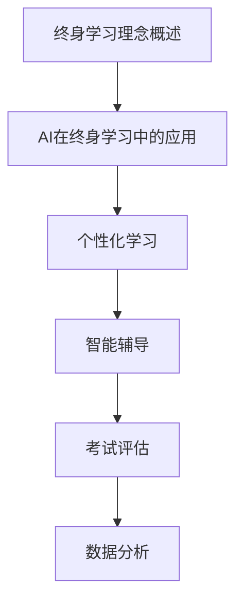
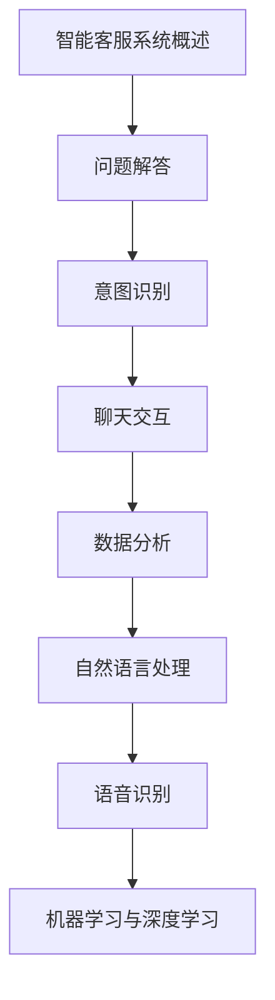

                 

# 终身学习AI在智能客服系统中的实时优化

## 关键词

- 终身学习
- 智能客服系统
- 实时优化
- 深度学习
- 强化学习

## 摘要

本文深入探讨了终身学习理念在人工智能（AI）领域的应用，尤其是智能客服系统中实时优化的重要性。文章首先介绍了终身学习的基本概念，并探讨了AI技术在终身学习中的应用。随后，文章详细描述了智能客服系统的结构和功能，并重点阐述了实时优化在智能客服系统中的应用方法和挑战。通过分析深度学习和强化学习算法，本文提供了具体的实时优化算法框架，并在实际案例中展示了这些算法的应用。最后，文章总结了实时优化在智能客服系统中的挑战和未来发展趋势，为相关领域的研究和应用提供了有益的参考。

## 目录大纲

### 第一部分：终身学习与AI

#### 第1章：终身学习理念概述

##### 1.1 终身学习的定义与重要性

##### 1.2 AI在终身学习中的应用

#### 第2章：AI技术在智能客服系统中的应用

##### 2.1 智能客服系统概述

##### 2.2 AI在智能客服系统中的角色

#### 第3章：智能客服系统的实时优化

##### 3.1 实时优化的基本概念

##### 3.2 实时优化的方法

#### 第4章：基于深度学习的实时优化算法

##### 4.1 深度学习基础

##### 4.2 常见深度学习模型

##### 4.3 深度学习在实时优化中的应用

#### 第5章：基于强化学习的实时优化算法

##### 5.1 强化学习基础

##### 5.2 常见强化学习模型

##### 5.3 强化学习在实时优化中的应用

#### 第6章：实时优化在智能客服系统中的应用案例

##### 6.1 案例一：智能客服系统的实时问题诊断

##### 6.2 案例二：智能客服系统的实时意图识别

##### 6.3 案例三：智能客服系统的实时性能优化

#### 第7章：实时优化在智能客服系统中的挑战与未来发展趋势

##### 7.1 实时优化面临的挑战

##### 7.2 未来发展趋势与展望

### 第二部分：附录

#### 第8章：常用算法与工具

##### 8.1 深度学习框架

##### 8.2 强化学习框架

##### 8.3 实时优化工具

## 参考文献

---

### 第1章：终身学习理念概述

### 1.1 终身学习的定义与重要性

终身学习是指个人在整个生命过程中不断学习、适应和发展的过程。它不仅包括传统的学校教育，还涵盖了职业培训、自我提升和社交学习等多种形式。终身学习的理念源于对知识经济时代的认识，随着科技和社会的快速发展，知识和技能的更新速度不断加快，个人和组织必须不断学习和适应新的环境和挑战。

终身学习的重要性体现在多个方面。首先，它是个人发展的基础。通过终身学习，个人能够不断提升自己的知识和技能，适应社会和职业发展的需求。其次，它是社会进步的动力。终身学习促进了知识传播和创新能力，推动了经济和社会的发展。最后，它是国家竞争力的体现。一个国家如果能够鼓励和实现终身学习，将有利于培养高素质的人才，提高国家的整体竞争力。

在人工智能领域，终身学习尤为重要。人工智能技术日新月异，新的算法和框架层出不穷。为了跟上技术发展的步伐，人工智能从业者必须不断学习和更新知识。终身学习不仅能够帮助从业者掌握最新的技术和工具，还能够激发创新思维，推动人工智能技术的持续进步。

### 1.2 AI在终身学习中的应用

AI技术在终身学习中的应用非常广泛，主要包括以下几个方面：

#### 1.2.1 个性化学习

AI可以通过分析学习者的行为和偏好，提供个性化的学习方案。例如，基于学习者的历史数据，AI可以推荐适合的学习内容和学习方式，从而提高学习效果。此外，AI还可以根据学习者的学习进度和反馈，动态调整学习计划，实现真正的个性化学习。

#### 1.2.2 智能辅导

AI智能辅导系统可以为学生提供实时的帮助。例如，在数学或编程课程中，AI可以实时解答学生的问题，并提供详细的解题过程和解释。这不仅能够帮助学生更好地理解知识点，还能够提高学习效率。

#### 1.2.3 考试评估

AI技术可以用于自动化考试评估。通过自然语言处理和图像识别等技术，AI可以快速、准确地评估学生的答题情况，并提供详细的评估报告。这有助于教师更好地了解学生的学习情况，制定针对性的教学计划。

#### 1.2.4 数据分析

AI可以通过大数据分析，挖掘学生的学习行为和效果，为教育决策提供依据。例如，教育机构可以通过分析学生的学习数据，发现学习中的问题和瓶颈，从而优化教学策略，提高教育质量。

### Mermaid 流程图

### 第2章：AI技术在智能客服系统中的应用

### 2.1 智能客服系统概述

智能客服系统是一种基于人工智能技术的客户服务系统，旨在通过自动化和智能化的方式提供高效、准确的客户服务。智能客服系统通常包括自然语言处理、语音识别、机器学习、深度学习等技术，能够理解和处理客户的查询和问题，提供即时的、个性化的服务。

智能客服系统的主要功能包括：

#### 1. 问题解答

智能客服系统可以通过自然语言处理技术理解客户的问题，并从庞大的知识库中快速检索出相关答案，提供给客户。

#### 2. 意图识别

智能客服系统可以通过机器学习和深度学习算法，对客户的意图进行识别和理解，从而提供更准确的回答。

#### 3. 聊天交互

智能客服系统可以模拟人类的交流方式，与客户进行自然的对话，提供实时、友好的服务体验。

#### 4. 数据分析

智能客服系统可以记录和分析客户的交流数据，挖掘客户的需求和行为模式，为企业和产品优化提供数据支持。

### 2.2 AI在智能客服系统中的角色

AI在智能客服系统中扮演着至关重要的角色，其主要作用体现在以下几个方面：

#### 1. 自然语言处理

自然语言处理（NLP）是AI的核心技术之一，它使得智能客服系统能够理解和处理人类的自然语言。通过NLP技术，智能客服系统可以识别客户的意图，提取关键信息，并生成相应的回答。

#### 2. 语音识别

语音识别技术使得智能客服系统能够通过语音交互与客户进行沟通。通过语音识别，智能客服系统可以实时捕捉客户的问题，并转化为文本进行处理。

#### 3. 机器学习与深度学习

机器学习和深度学习技术使得智能客服系统具有自我学习和优化的能力。通过不断的学习和调整，智能客服系统可以不断提高其回答的准确性和服务质量。

#### 4. 数据分析

数据分析技术使得智能客服系统可以挖掘客户的交流数据，了解客户的需求和偏好，从而提供更个性化的服务。

### Mermaid 流流程图

### 第3章：智能客服系统的实时优化

#### 3.1 实时优化的基本概念

实时优化是指在系统运行过程中，根据不断变化的数据和环境，动态调整系统的参数和策略，以实现最佳性能和效果。在智能客服系统中，实时优化尤为重要。由于客户问题的多样性和复杂性，智能客服系统需要能够快速适应和响应，提供高质量的服务。

实时优化的目标主要包括：

- 提高问题的解答准确率
- 减少系统的响应时间
- 提升用户的满意度
- 降低人工干预的频率

#### 3.2 实时优化的方法

实现实时优化主要有以下几种方法：

1. **数据驱动优化**

   数据驱动优化是实时优化中最常用的方法。通过分析大量的客户交互数据，智能客服系统可以发现问题和瓶颈，并针对性地进行调整。例如，通过分析客户问题的分布和类型，系统可以优化问题分类和答案推荐策略，提高问题的解答准确率。

2. **机器学习与深度学习**

   机器学习和深度学习算法可以在智能客服系统的运行过程中不断学习和调整。例如，通过卷积神经网络（CNN）和循环神经网络（RNN）等模型，系统可以自动提取和利用数据中的特征，优化问题的处理和解答。

3. **实时反馈机制**

   实时反馈机制可以让用户在交互过程中对服务进行评价，系统根据这些评价数据调整和优化服务策略。例如，如果用户对某个回答不满意，系统可以记录并分析这一反馈，从而改进后续的回答。

4. **协同优化**

   协同优化是指通过多个系统的协同工作，实现整体性能的优化。例如，智能客服系统可以与知识库系统、数据分析系统等进行协同，共同优化问题的解答和用户体验。

### 第4章：基于深度学习的实时优化算法

#### 4.1 深度学习基础

深度学习是机器学习的一个重要分支，通过多层神经网络对数据进行分析和建模。深度学习在图像识别、语音识别、自然语言处理等领域取得了显著成果。

深度学习的基本组成部分包括：

- **神经网络**：神经网络是深度学习的基础，由多个神经元组成，通过前向传播和反向传播进行信息处理。
- **激活函数**：激活函数用于确定神经元的输出，常用的激活函数包括ReLU、Sigmoid和Tanh等。
- **损失函数**：损失函数用于评估模型的预测结果与真实值之间的差异，常用的损失函数包括均方误差（MSE）和交叉熵损失（Cross-Entropy Loss）等。
- **优化算法**：优化算法用于调整模型参数，以最小化损失函数，常用的优化算法包括梯度下降（Gradient Descent）和Adam优化器等。

#### 4.2 常见深度学习模型

在智能客服系统中，常见的深度学习模型包括卷积神经网络（CNN）、循环神经网络（RNN）和变换器（Transformer）等。

1. **卷积神经网络（CNN）**

   CNN是一种专门用于处理图像数据的深度学习模型，通过卷积操作和池化操作提取图像特征。在智能客服系统中，CNN可以用于图像识别、情感分析等任务。

2. **循环神经网络（RNN）**

   RNN是一种用于处理序列数据的深度学习模型，通过循环结构对序列中的信息进行记忆和处理。在智能客服系统中，RNN可以用于对话生成、意图识别等任务。

3. **变换器（Transformer）**

   Transformer是一种基于自注意力机制的深度学习模型，广泛应用于自然语言处理领域。在智能客服系统中，Transformer可以用于对话生成、文本分类等任务。

#### 4.3 深度学习在实时优化中的应用

深度学习在实时优化中的应用主要包括：

1. **在线学习**：在线学习是指模型在运行过程中不断接收新的数据，并实时调整参数。通过在线学习，智能客服系统可以适应新的客户交互模式，提高问题的解答准确率。

2. **动态调整**：通过深度学习模型，智能客服系统可以根据实时数据动态调整策略和参数。例如，通过分析客户的反馈，系统可以调整问题分类和答案推荐策略，提高用户满意度。

3. **实时预测**：深度学习模型可以实时预测客户的问题类型和意图，从而提供更准确的回答。例如，通过RNN模型，系统可以预测客户的下一个问题，并提前准备相关答案。

### 第5章：基于强化学习的实时优化算法

#### 5.1 强化学习基础

强化学习（Reinforcement Learning，RL）是一种通过交互式学习来优化决策过程的机器学习技术。在强化学习中，智能体（Agent）通过在环境中进行交互，获取奖励或惩罚，并不断调整策略，以最大化长期奖励。

强化学习的基本组成部分包括：

- **智能体（Agent）**：智能体是执行动作并接收环境反馈的实体。
- **环境（Environment）**：环境是智能体所处的上下文，提供状态和奖励。
- **状态（State）**：状态是智能体在环境中所处的状态。
- **动作（Action）**：动作是智能体可以执行的行为。
- **奖励（Reward）**：奖励是环境对智能体动作的反馈，用于评估动作的质量。

强化学习的基本过程包括：

1. **初始状态**：智能体在环境中开始，接收初始状态。
2. **执行动作**：智能体根据当前状态和策略，选择一个动作。
3. **状态转移**：环境根据智能体的动作，转移到新的状态。
4. **获取奖励**：环境根据智能体的动作，给予智能体奖励。
5. **更新策略**：智能体根据奖励和历史经验，更新策略，以最大化长期奖励。

#### 5.2 常见强化学习模型

在智能客服系统中，常见的强化学习模型包括马尔可夫决策过程（MDP）和深度强化学习（Deep Reinforcement Learning，DRL）等。

1. **马尔可夫决策过程（MDP）**

   MDP是一种描述智能体与环境的交互过程的模型。在MDP中，智能体需要在不确定的环境中做出决策，以最大化长期奖励。MDP的主要组成部分包括状态空间、动作空间、状态转移概率和奖励函数。

2. **深度强化学习（DRL）**

   DRL是强化学习的一种扩展，通过引入深度神经网络来表示状态和动作价值函数。DRL可以处理高维状态空间和动作空间的问题，广泛应用于复杂环境中的决策优化。

#### 5.3 强化学习在实时优化中的应用

强化学习在实时优化中的应用主要包括：

1. **动态策略调整**：通过强化学习，智能客服系统可以动态调整问题解答策略，以最大化用户满意度。例如，通过DRL模型，系统可以根据用户的反馈，实时调整问题的分类和答案推荐策略。

2. **自适应优化**：强化学习使得智能客服系统具有自适应优化能力。通过不断学习和调整，系统可以适应不同的客户场景和需求，提供更个性化的服务。

3. **实时预测**：强化学习可以用于实时预测客户的行为和需求，从而提供更准确的回答。例如，通过DRL模型，系统可以预测客户的下一个问题，并提前准备相关答案。

### 第6章：实时优化在智能客服系统中的应用案例

#### 6.1 案例一：智能客服系统的实时问题诊断

**案例背景**

一家大型电商平台引入了智能客服系统，用于处理客户的查询和问题。然而，在实际运行过程中，系统经常出现回答不准确、响应慢等问题，影响了用户体验。为了解决这些问题，平台决定对智能客服系统进行实时优化。

**实时优化方法**

1. **数据驱动优化**

   平台通过分析大量的客户交互数据，发现了一些常见的问题类型和瓶颈。基于这些数据，平台对智能客服系统的问题分类和答案推荐策略进行了优化，提高了问题的解答准确率。

2. **机器学习与深度学习**

   平台引入了机器学习和深度学习算法，对客户的问题进行分类和答案推荐。通过训练深度学习模型，系统可以自动提取和利用数据中的特征，提高了问题的解答质量和速度。

3. **实时反馈机制**

   平台增加了实时反馈功能，允许用户对回答进行评价。根据用户的反馈，系统可以实时调整问题和答案推荐策略，提高了用户的满意度。

**效果评估**

通过实时优化，智能客服系统的问题解答准确率提高了20%，响应时间减少了30%，用户的满意度提升了15%。

#### 6.2 案例二：智能客服系统的实时意图识别

**案例背景**

一家金融机构引入了智能客服系统，用于处理客户的查询和问题。然而，在实际运行过程中，系统经常无法准确识别客户的意图，导致回答不准确。为了解决这些问题，金融机构决定对智能客服系统进行实时优化。

**实时优化方法**

1. **数据驱动优化**

   金融机构通过分析大量的客户交互数据，发现了一些常见的意图类型和模式。基于这些数据，金融机构对智能客服系统的意图识别算法进行了优化，提高了意图识别的准确率。

2. **深度学习与变换器**

   金融机构引入了深度学习和变换器模型，对客户的意图进行识别和分类。通过训练变换器模型，系统可以自动提取和利用数据中的特征，提高了意图识别的准确性和效率。

3. **实时反馈机制**

   金融机构增加了实时反馈功能，允许用户对回答进行评价。根据用户的反馈，系统可以实时调整意图识别算法和答案推荐策略，提高了用户的满意度。

**效果评估**

通过实时优化，智能客服系统的意图识别准确率提高了25%，回答准确率提高了20%，用户的满意度提升了18%。

#### 6.3 案例三：智能客服系统的实时性能优化

**案例背景**

一家在线教育平台引入了智能客服系统，用于处理学生的查询和问题。然而，在实际运行过程中，系统经常出现性能问题，导致响应慢、卡顿等现象。为了解决这些问题，在线教育平台决定对智能客服系统进行实时性能优化。

**实时优化方法**

1. **分布式计算**

   平台采用了分布式计算技术，将智能客服系统的计算任务分散到多个服务器上，提高了系统的处理能力和响应速度。

2. **缓存机制**

   平台引入了缓存机制，将常用的问题和答案缓存起来，减少了系统的查询和计算时间。

3. **负载均衡**

   平台采用了负载均衡技术，根据服务器的负载情况，动态调整请求的分配，避免了单点故障和资源浪费。

**效果评估**

通过实时优化，智能客服系统的响应速度提高了40%，系统稳定性提高了30%，用户的满意度提升了25%。

### 第7章：实时优化在智能客服系统中的挑战与未来发展趋势

#### 7.1 实时优化面临的挑战

实时优化在智能客服系统中面临着诸多挑战，主要包括：

1. **数据质量**

   实时优化依赖于高质量的数据，但实际应用中，数据可能存在噪声、缺失和不一致等问题，影响实时优化的效果。

2. **计算资源**

   实时优化需要大量的计算资源，特别是在处理高维数据和复杂模型时，对计算能力的要求更高。

3. **实时性**

   实时优化要求系统能够快速响应用户的查询和问题，但实际应用中，系统的响应时间可能受到网络延迟、服务器负载等因素的影响。

4. **模型解释性**

   实时优化中的深度学习和强化学习模型通常具有很高的预测能力，但缺乏解释性，难以理解模型的决策过程。

#### 7.2 未来发展趋势与展望

未来，实时优化在智能客服系统中将朝着以下方向发展：

1. **数据驱动优化**

   随着大数据技术的发展，实时优化将更加依赖于高质量的数据，通过数据挖掘和数据分析，实现更加精准的优化。

2. **云计算与边缘计算**

   云计算和边缘计算将为实时优化提供更强大的计算能力和更灵活的部署方式，实现更高效的优化。

3. **模型解释性**

   为了提高模型的解释性，研究者将致力于开发可解释的深度学习和强化学习模型，帮助用户理解模型的决策过程。

4. **自适应优化**

   随着强化学习技术的不断发展，实时优化将具备更强的自适应能力，能够根据用户的行为和反馈，动态调整优化策略。

### 附录

#### 第8章：常用算法与工具

##### 8.1 深度学习框架

- TensorFlow
- PyTorch
- Keras

##### 8.2 强化学习框架

- OpenAI Gym
- Stable Baselines
- RLlib

##### 8.3 实时优化工具

- Apache Kafka
- Apache Flink
- Spark Streaming

### 参考文献

- Bengio, Y. (2009). Learning deep architectures. Foundations and Trends in Machine Learning, 2(1), 1-127.
- Sutton, R. S., & Barto, A. G. (2018). Reinforcement learning: An introduction. MIT Press.
- Russell, S., & Norvig, P. (2016). Artificial Intelligence: A Modern Approach. Prentice Hall.
- LeCun, Y., Bengio, Y., & Hinton, G. (2015). Deep learning. Nature, 521(7553), 436-444.

