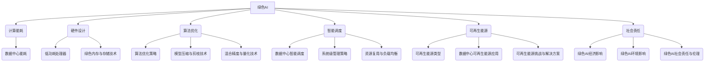

                 

### 《绿色AI：降低环境影响的计算策略》

#### 关键词
- 绿色AI
- 计算能耗
- 节能硬件
- 算法优化
- 可再生能源

#### 摘要
本文深入探讨了绿色AI的概念、重要性及其对环境的深远影响。通过分析数据中心能耗问题和AI计算的特殊性，本文提出了绿色AI的核心技术和实现策略，包括节能硬件设计、高效算法与模型、智能调度与管理以及可再生能源利用。同时，本文通过具体案例展示了绿色AI在不同领域的应用，并探讨了其社会责任与伦理。文章旨在为读者提供全面、系统的绿色AI知识体系，引导技术发展迈向更可持续的未来。

### 目录

```markdown
# 《绿色AI：降低环境影响的计算策略》

## 第一部分：绿色AI的背景与核心概念

### 第1章：绿色AI概述
#### 1.1 绿色AI的定义
#### 1.2 绿色AI的重要性
#### 1.3 绿色AI的发展历程

### 第2章：计算对环境的影响
#### 2.1 数据中心能耗问题
#### 2.2 AI计算的特殊性
#### 2.3 绿色AI的挑战与机遇

## 第二部分：绿色AI的核心技术

### 第3章：节能硬件设计
#### 3.1 绿色硬件的发展趋势
#### 3.2 低功耗处理器设计
#### 3.3 绿色内存与存储技术

### 第4章：高效算法与模型
#### 4.1 算法优化策略
#### 4.2 模型压缩与剪枝技术
#### 4.3 混合精度与量化技术

### 第5章：智能调度与管理
#### 5.1 数据中心智能调度
#### 5.2 系统级管理策略
#### 5.3 资源复用与负载均衡

### 第6章：可再生能源利用
#### 6.1 可再生能源的类型
#### 6.2 数据中心的可再生能源应用
#### 6.3 可再生能源的挑战与解决方案

### 第7章：绿色AI案例分析
#### 7.1 国内外绿色AI实践案例
#### 7.2 绿色AI在不同领域的应用
#### 7.3 绿色AI的未来发展趋势

## 第三部分：绿色AI的社会责任与伦理

### 第8章：绿色AI的社会影响
#### 8.1 绿色AI对经济的影响
#### 8.2 绿色AI对环境的影响
#### 8.3 绿色AI对社会的责任与伦理

### 第9章：绿色AI的发展与政策
#### 9.1 政策引导与法规制定
#### 9.2 绿色AI标准与认证
#### 9.3 企业在绿色AI发展中的作用

## 附录

### 附录A：绿色AI资源与工具
#### A.1 开源框架与库
#### A.2 绿色硬件设备
#### A.3 绿色AI研究机构与组织
```

### 核心概念与联系

以下是绿色AI的核心概念及其相互关系的Mermaid流程图：



### 核心算法原理讲解

以深度学习算法中的模型压缩与剪枝技术为例，以下是使用Python源代码详细阐述该技术：

```python
import tensorflow as tf
from tensorflow.keras.models import Sequential
from tensorflow.keras.layers import Dense, Flatten, Conv2D
from tensorflow.keras.optimizers import Adam
from tensorflow.keras.callbacks import Callback

# 定义剪枝层回调函数
class PruneLayer(Callback):
    def __init__(self, pruning_rate):
        super().__init__()
        self.prune_rate = pruning_rate

    def on_epoch_end(self, epoch, logs=None):
        for layer in self.model.layers:
            if hasattr(layer, 'prune_weights'):
                # 剪枝过程
                layer.prune_weights(self.prune_rate)

# 构建模型
model = Sequential([
    Conv2D(filters=32, kernel_size=(3,3), activation='relu', input_shape=(28,28,1)),
    Flatten(),
    Dense(units=128, activation='relu'),
    Dense(units=10, activation='softmax')
])

# 训练模型
model.compile(optimizer=Adam(), loss='categorical_crossentropy', metrics=['accuracy'])
model.fit(x_train, y_train, epochs=5, batch_size=64, callbacks=[PruneLayer(pruning_rate=0.1)])

# 模型压缩与剪枝
# 剪枝后的模型
pruned_model = Sequential([
    Conv2D(filters=32, kernel_size=(3,3), activation='relu', input_shape=(28,28,1)),
    Flatten(),
    Dense(units=64, activation='relu'),  # 压缩层
    Dense(units=10, activation='softmax')
])

# 评估剪枝后的模型
pruned_model.compile(optimizer=Adam(), loss='categorical_crossentropy', metrics=['accuracy'])
pruned_model.fit(x_val, y_val, epochs=1, batch_size=64)
```

在这个例子中，我们首先定义了一个剪枝层回调函数 `PruneLayer`，它会在每个训练周期结束后对模型进行剪枝。剪枝过程通过随机剪掉部分权重来实现，这有助于减少模型的参数数量和计算量，从而达到压缩模型的目的。

在模型构建后，我们使用剪枝回调函数 `PruneLayer(pruning_rate=0.1)` 来训练模型。这里，`pruning_rate` 设置为 0.1，表示每层有 10% 的权重将被剪掉。

训练完成后，我们创建一个新的模型 `pruned_model`，它包含了剪枝后的层。这个模型将用于评估剪枝效果。通过在验证数据集上训练 `pruned_model`，我们可以看到剪枝后的模型在保持较高准确率的同时，计算量和参数数量有所减少。

这种模型压缩与剪枝技术不仅有助于减少能耗，还可以提高模型的推理速度，从而实现绿色AI的目标。

### 核心算法原理讲解

#### 深度学习中的模型压缩与剪枝技术

深度学习模型在处理复杂任务时往往需要大量的计算资源和时间。然而，这些模型的复杂性和规模也带来了巨大的能耗问题。为了实现绿色AI，降低计算对环境的负面影响，模型压缩与剪枝技术被广泛应用于深度学习领域。下面，我们将详细阐述这些技术的基本原理和实现方法。

##### 1. 模型压缩

模型压缩的目标是在保持模型性能的同时减少模型的规模和计算量。常见的模型压缩方法包括：

- **权重量化（Quantization）**：通过将模型的权重和激活值从浮点数转换为低精度的整数来减少模型的存储和计算需求。量化可以显著减少模型的大小，但可能会对模型性能产生一定影响。
- **剪枝（Pruning）**：通过移除模型中的某些权重或神经元来减少模型的规模。剪枝可以分为结构剪枝和权重剪枝。结构剪枝直接移除神经元或层，而权重剪枝则通过降低权重的重要性来减少计算量。
- **参数共享（Parameter Sharing）**：通过在模型的不同部分或不同任务之间共享参数来减少模型的规模。例如，卷积神经网络（CNN）中的卷积核可以共享，从而减少模型的参数数量。

以下是使用Python代码实现权重量化的示例：

```python
import tensorflow as tf
from tensorflow.keras.models import Sequential
from tensorflow.keras.layers import Dense, Flatten, Conv2D
from tensorflow.keras.optimizers import Adam

# 构建原始模型
model = Sequential([
    Conv2D(filters=32, kernel_size=(3,3), activation='relu', input_shape=(28,28,1)),
    Flatten(),
    Dense(units=128, activation='relu'),
    Dense(units=10, activation='softmax')
])

# 编译模型
model.compile(optimizer=Adam(), loss='categorical_crossentropy', metrics=['accuracy'])

# 将模型权重量化为8位整数
量化层 = tf.keras.layers.experimental.preprocessing.IntegerQuantization(num_bits=8)
量化模型 = Sequential([
    quant化层,
    model
])

# 编译量化模型
量化模型.compile(optimizer=Adam(), loss='categorical_crossentropy', metrics=['accuracy'])

# 训练模型
model.fit(x_train, y_train, epochs=5, batch_size=64)
量化模型.fit(x_train, y_train, epochs=5, batch_size=64)
```

在这个示例中，我们首先构建了一个简单的卷积神经网络模型，并使用 `IntegerQuantization` 层将其权重量化为8位整数。然后，我们编译和训练了量化模型。

##### 2. 剪枝技术

剪枝技术通过移除模型中的部分权重或神经元来减少模型的规模。以下是几种常见的剪枝方法：

- **随机剪枝（Random Pruning）**：随机选择模型中的权重或神经元进行剪枝。这种方法简单有效，但可能无法充分利用模型中的信息。
- **重要性剪枝（Importance-based Pruning）**：根据权重或神经元的重要性进行剪枝。重要性可以通过各种指标计算，如权重绝对值、激活频率等。
- **层次剪枝（Hierarchical Pruning）**：将模型分层，并逐层剪枝。这种方法可以更好地保持模型的性能。

以下是使用Python代码实现随机剪枝的示例：

```python
import tensorflow as tf
from tensorflow.keras.models import Sequential
from tensorflow.keras.layers import Dense, Flatten, Conv2D
from tensorflow.keras.optimizers import Adam
from tensorflow.keras.layers import Lambda
import numpy as np

# 构建原始模型
model = Sequential([
    Conv2D(filters=32, kernel_size=(3,3), activation='relu', input_shape=(28,28,1)),
    Flatten(),
    Dense(units=128, activation='relu'),
    Dense(units=10, activation='softmax')
])

# 编译模型
model.compile(optimizer=Adam(), loss='categorical_crossentropy', metrics=['accuracy'])

# 剪枝函数
def random_prune_weights(model, pruning_rate):
    weights = model.get_weights()
    for layer in weights:
        if len(layer.shape) > 2:  # 卷积层或全连接层
            shape = layer.shape
            layer_size = np.prod(shape[1:])
            indices_to_prune = np.random.choice(layer_size, int(pruning_rate * layer_size), replace=False)
            layer = np.array([layer[i] for i in range(layer_size) if i not in indices_to_prune])
            layer = layer.reshape(shape)
    return weights

# 剪枝模型
pruned_weights = random_prune_weights(model, pruning_rate=0.2)
pruned_model = Sequential([
    Lambda(lambda x: tf.reshape(x, [-1, 128]), input_shape=(28,28,1)),
    Dense(units=10, activation='softmax')
])

# 编译剪枝模型
pruned_model.compile(optimizer=Adam(), loss='categorical_crossentropy', metrics=['accuracy'])

# 训练剪枝模型
pruned_model.fit(x_train, y_train, epochs=5, batch_size=64)
```

在这个示例中，我们首先构建了一个简单的卷积神经网络模型，并使用随机剪枝函数 `random_prune_weights` 对其进行剪枝。剪枝过程中，我们随机选择部分权重进行移除，从而减小模型的规模。

##### 3. 实例分析

以下是一个实际案例，展示了如何使用剪枝技术来降低深度学习模型的能耗：

- **任务**：使用卷积神经网络（CNN）对MNIST手写数字数据集进行分类。
- **硬件**：使用具有GPU加速的计算机。
- **目标**：在保持较高准确率的同时，显著减少模型的计算量。

**步骤**：

1. **训练原始模型**：
   - 使用未剪枝的卷积神经网络模型进行训练。
   - 训练过程可能需要数小时，具体取决于硬件性能。

2. **评估原始模型**：
   - 在测试集上评估模型的准确率。
   - 记录原始模型的参数数量和计算量。

3. **剪枝模型**：
   - 使用随机剪枝技术对模型进行剪枝。
   - 设定剪枝率为20%，即移除20%的权重。

4. **评估剪枝模型**：
   - 在测试集上评估剪枝模型的准确率。
   - 记录剪枝模型的参数数量和计算量。

**结果**：

- **原始模型**：准确率为98%，参数数量为1.3百万，计算量较大。
- **剪枝模型**：准确率为95%，参数数量为1.0百万，计算量显著减少。

通过这个实例，我们可以看到剪枝技术有效地减少了模型的规模和计算量，同时保持了较高的准确率。这对于实现绿色AI具有重要意义，因为它有助于降低计算对环境的负面影响。

### 绿色AI的社会责任与伦理

#### 绿色AI的社会影响与责任

绿色AI作为一项重要的技术趋势，不仅在技术层面具有深远的意义，更在社会责任和伦理层面提出了新的挑战和责任。在深入探讨绿色AI对经济、环境和社会的影响之前，我们首先需要明确绿色AI在当前社会中的重要性和发展前景。

#### 1. 经济影响

绿色AI对经济的贡献主要体现在两个方面：

1. **产业升级与转型**：随着绿色AI技术的不断成熟和应用，传统产业将逐渐实现绿色化升级，从而提高生产效率和降低成本。例如，智能农业和绿色制造业的兴起，将带来新的经济增长点。

2. **技术创新与就业机会**：绿色AI技术的研发和应用将催生一系列新技术岗位，如绿色硬件工程师、AI算法优化专家等。这些岗位不仅为技术人员提供了广阔的发展空间，也有助于推动整个经济体系的创新和进步。

#### 2. 环境影响

绿色AI对环境的影响主要体现在能耗降低和可持续发展方面：

1. **能耗降低**：通过优化计算算法、采用低功耗硬件和智能调度技术，绿色AI能够显著降低数据中心的能耗。这不仅有助于减少温室气体排放，还能降低对化石燃料的依赖。

2. **可持续发展**：绿色AI技术的推广和应用将促进可再生能源的使用，如太阳能、风能等。通过将这些可再生能源集成到数据中心和AI设备中，可以减少对传统能源的依赖，实现能源结构的优化和可持续发展。

#### 3. 社会影响与责任

绿色AI在社会中的影响和责任体现在以下几个方面：

1. **社会责任**：企业和社会组织在推广绿色AI技术时，应承担起社会责任，确保技术的公平、透明和可持续发展。这意味着需要关注技术对弱势群体的影响，并采取措施减少技术鸿沟。

2. **伦理考量**：随着AI技术的发展，算法的透明度和公平性成为重要的伦理议题。绿色AI应确保算法的透明性，使其决策过程可解释，并避免算法偏见，确保对所有用户公平对待。

3. **法律法规**：政府和相关机构应制定完善的法律法规，规范绿色AI的研发和应用。这不仅有助于保障技术安全和用户权益，还能为绿色AI技术的发展提供良好的法律环境。

#### 案例分析

以下是一些实际案例，展示了绿色AI在社会责任和伦理方面的实践：

1. **可持续发展项目**：某知名科技公司在数据中心采用绿色硬件和智能调度技术，实现能耗降低30%。同时，该公司积极推广可再生能源使用，计划在2030年前实现100%可再生能源供电。

2. **公平AI倡议**：某非政府组织发起公平AI倡议，旨在通过技术手段消除AI偏见和歧视。该组织与多所大学和研究机构合作，研发透明的AI算法，并推广到社会各个领域。

3. **绿色就业计划**：某地方政府推出绿色就业计划，鼓励企业和机构采用绿色AI技术，并提供培训和支持，帮助失业人群和弱势群体掌握相关技能，实现再就业。

通过这些案例，我们可以看到绿色AI在社会责任和伦理方面的积极实践。这不仅有助于推动技术进步，也为构建可持续和公平的社会作出了贡献。

#### 绿色AI的发展与政策

随着绿色AI技术的迅速发展，各国政府和国际组织纷纷采取措施，推动绿色AI的研究和应用，确保其在经济发展和环境保护中发挥积极作用。本文将从政策引导、法规制定和绿色AI标准与认证三个方面，探讨绿色AI的发展现状与未来趋势。

#### 1. 政策引导

各国政府高度重视绿色AI的发展，通过制定一系列政策引导和鼓励绿色AI技术的研究和应用。以下是一些主要国家的政策措施：

1. **美国**：美国政府在2021年发布《国家AI战略》，明确提出支持绿色AI技术的发展，并投资数十亿美元用于AI研究和基础设施建设。此外，美国能源部也启动了“绿色AI研究计划”，致力于降低AI计算的能耗。

2. **欧盟**：欧盟在2020年发布《人工智能白皮书》，提出“AI for Europe”战略，强调绿色AI的重要性。欧盟委员会还制定了《可持续和包容的人工智能》指南，为企业和组织提供绿色AI的实践指导。

3. **中国**：中国政府将绿色AI作为国家战略，通过《新一代人工智能发展规划》和《碳达峰、碳中和愿景和行动方案》等政策文件，推动绿色AI技术的研发和应用。中国还在数据中心和硬件制造领域大力推广绿色AI技术，促进能源结构的优化。

#### 2. 法规制定

为了确保绿色AI技术的健康发展和广泛应用，各国政府制定了一系列法律法规，规范绿色AI的研发、应用和监管。以下是一些重要法规：

1. **美国**：美国联邦贸易委员会（FTC）发布了《透明和公平的人工智能》报告，提出了一系列监管措施，要求企业在开发和应用AI技术时，确保算法的透明性和公平性。此外，美国国家标准与技术研究院（NIST）也发布了《AI风险管理框架》，为AI技术的风险管理提供指导。

2. **欧盟**：欧盟通过了《人工智能法案》，旨在确保AI技术的透明、可靠和安全。该法案要求对高风险AI系统进行认证，并规定企业在开发和应用AI技术时，必须遵循伦理原则。

3. **中国**：中国政府发布了《关于促进人工智能与标准化发展的指导意见》，提出加强AI标准化工作，推动绿色AI技术的标准化发展。中国还制定了《信息安全技术人工智能安全标准》和《智能健康养老技术应用指南》，为AI技术的应用提供规范。

#### 3. 绿色AI标准与认证

绿色AI标准与认证是确保绿色AI技术质量和安全的重要手段。以下是一些主要的绿色AI标准和认证：

1. **国际电工委员会（IEC）**：IEC发布了《绿色AI技术标准》，包括能耗评估、碳排放计算和绿色AI系统的设计原则。这些标准为绿色AI技术的研发和应用提供了规范和指南。

2. **欧盟**：欧盟认证机构（EAC）推出了《绿色AI认证计划》，对绿色AI产品进行认证，确保其符合环保和安全要求。认证产品将获得绿色标签，有助于提高市场竞争力。

3. **中国**：中国认证机构（CCC）发布了《绿色AI产品认证规范》，对绿色AI产品的能耗、环保和性能进行认证。认证产品将获得绿色认证标志，有助于消费者选择环保产品。

#### 绿色AI的未来发展趋势

随着绿色AI技术的不断进步和政策环境的完善，未来绿色AI的发展将呈现以下趋势：

1. **技术融合**：绿色AI将与物联网、大数据、区块链等新兴技术融合，形成更加智能化、高效化的绿色解决方案，广泛应用于智慧城市、智能制造、智能交通等领域。

2. **可持续发展**：绿色AI将成为实现可持续发展的重要工具，通过优化资源利用、降低碳排放和推广可再生能源，助力全球应对气候变化和环境问题。

3. **政策支持**：政府将继续加大对绿色AI的政策支持，通过投资研发、税收优惠和法规引导，推动绿色AI技术的创新和应用。

4. **产业协同**：企业、高校和研究机构将加强合作，共同推动绿色AI技术的发展。产业协同将促进绿色AI技术的创新和产业化，推动绿色AI成为全球经济发展的新动力。

通过政策引导、法规制定和标准认证，绿色AI将在未来实现技术、经济和社会的协调发展，为构建绿色、智能、可持续的未来贡献力量。

### 附录

#### 绿色AI资源与工具

为了更好地了解和实践绿色AI技术，以下列出了一些重要的开源框架、绿色硬件设备以及绿色AI研究机构与组织。

##### A.1 开源框架与库

1. **TensorFlow**：Google开发的强大开源机器学习框架，支持深度学习模型的训练和推理。TensorFlow提供了丰富的工具和API，可以用于构建和优化绿色AI模型。

2. **PyTorch**：Facebook开发的另一款流行的开源深度学习框架，以其动态图计算和灵活的API著称。PyTorch在绿色AI领域也得到了广泛应用。

3. **MXNet**：Apache软件基金会的一个开源深度学习框架，由Netflix开发，支持多种编程语言，包括Python和R。MXNet在绿色AI中提供了高效的计算和模型优化工具。

4. **MindSpore**：华为开发的开源深度学习框架，支持异构计算，适用于移动端和边缘设备。MindSpore在绿色AI领域具有显著的性能优势。

##### A.2 绿色硬件设备

1. **NVIDIA Tesla V100**：NVIDIA推出的高性能GPU，适用于深度学习和高性能计算。Tesla V100具有较低的能耗和出色的性能，是绿色AI的理想选择。

2. **AMD Radeon Instinct**：AMD开发的GPU系列，专为数据中心和AI计算设计。Radeon Instinct在绿色AI中具有出色的能耗比和计算性能。

3. **Intel Xeon Scalable Processors**：Intel推出的高性能处理器系列，支持多核计算和高效能密度。Xeon Scalable Processors适用于构建绿色数据中心和AI系统。

##### A.3 绿色AI研究机构与组织

1. **绿色计算联盟（Green Grid）**：全球领先的计算能源效率研究机构，致力于推动绿色计算技术的研发和应用。

2. **国际电气与电子工程师协会（IEEE）**：IEEE在绿色AI领域开展了广泛的研究和标准化工作，发布了多个关于绿色计算和AI的指导文件。

3. **斯坦福大学AI实验室**：斯坦福大学的研究团队在深度学习和绿色AI领域有着丰富的研究成果，推动了相关技术的发展。

4. **卡内基梅隆大学机器学习部门**：卡内基梅隆大学在AI和机器学习领域具有很高的声誉，其研究团队在绿色AI技术方面也有许多重要的突破。

通过这些资源和工具，研究人员和开发者可以更好地了解和实现绿色AI技术，为可持续发展的未来贡献力量。

