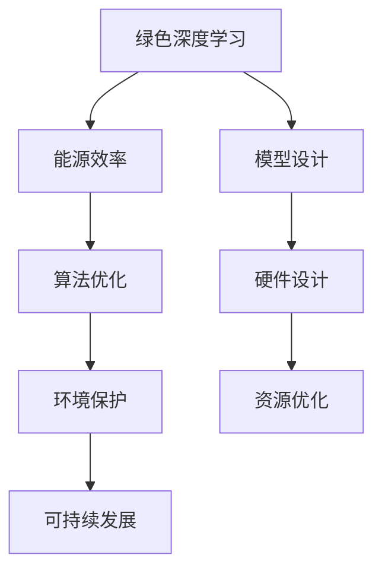

                 

### 第1章: 绿色深度学习背景与基础

#### 1.1 绿色深度学习的概念

**绿色深度学习**是一种旨在减少能源消耗和环境影响的人工智能研究方法。在传统深度学习过程中，特别是大型神经网络模型的训练和推理过程中，计算资源的消耗非常巨大。这些计算资源消耗不仅体现在硬件设备的能源消耗上，还包括数据传输、存储和冷却等方面。因此，绿色深度学习的研究重点在于如何设计更加节能高效的深度学习模型。

**绿色深度学习**的定义可以进一步细化为以下几个方面：

1. **能源效率优化**：通过改进算法、模型结构和硬件设计，减少深度学习过程中的能源消耗。
2. **环境友好性**：在保证模型性能的前提下，减少对环境的影响，如减少碳排放和减少对水资源的需求。
3. **可持续性**：通过降低能源消耗，实现深度学习领域的可持续发展。

#### 1.2 绿色深度学习的背景

深度学习作为一种高效的数据分析工具，已经在多个领域取得了显著的成果，如计算机视觉、自然语言处理和推荐系统等。然而，随着深度学习模型规模的不断扩大，其能源消耗也急剧增加。以下是深度学习能源消耗问题的一些具体表现：

1. **训练过程的高能耗**：深度学习模型训练需要大量的计算资源，尤其是在训练大型模型时，这一过程的能耗非常显著。
2. **硬件设备的高能耗**：高性能计算硬件，如GPU和TPU，在运行深度学习模型时需要大量的电力供应。
3. **数据传输与存储的高能耗**：深度学习过程涉及大量数据的传输和存储，这些操作也会消耗能源。

绿色深度学习的研究背景在于：

1. **环境保护需求**：随着全球气候变化和环境问题的加剧，降低深度学习对环境的影响成为一个迫切需要解决的问题。
2. **成本控制**：减少能源消耗有助于降低计算成本，这对于企业和研究机构来说具有重要意义。
3. **技术创新**：绿色深度学习推动了人工智能领域的技术创新，促进了新型算法、模型结构和硬件设计的发展。

#### 1.3 绿色深度学习的重要性

绿色深度学习的重要性可以从以下几个方面进行阐述：

1. **环境保护**：深度学习模型的能源消耗对环境产生直接影响，如增加碳排放和消耗水资源。通过绿色深度学习，可以减少这些负面影响，实现环境保护。
2. **资源优化**：通过优化算法和模型结构，提高能源利用效率，有助于资源优化和成本控制。
3. **技术进步**：绿色深度学习推动了人工智能领域的技术进步，促进了新型算法和硬件设计的发展。
4. **可持续发展**：绿色深度学习有助于实现深度学习领域的可持续发展，满足长期需求。

### 总结

绿色深度学习是一种旨在减少深度学习过程中能源消耗和环境影响的研究方法。它具有重要的环境保护、资源优化和可持续发展的意义。随着人工智能应用的不断扩展，绿色深度学习将成为人工智能领域的一个重要研究方向。

**关键词**：绿色深度学习、能源消耗、环境保护、资源优化、可持续性

**摘要**：本文介绍了绿色深度学习的背景、核心概念和重要性，探讨了深度学习能源消耗问题的具体表现以及绿色深度学习的研究背景和意义。通过本文的介绍，读者可以初步了解绿色深度学习的基础知识，为后续章节的深入学习打下基础。

---

在接下来的章节中，我们将深入探讨绿色深度学习的基础理论、核心算法原理以及项目实战，逐步引导读者理解绿色深度学习的具体实施方法和技术细节。读者可以期待通过系统的学习，掌握如何设计更加节能高效的深度学习模型，为环境保护和可持续发展做出贡献。

---

**作者：AI天才研究院/AI Genius Institute & 禅与计算机程序设计艺术 /Zen And The Art of Computer Programming**

---

**核心概念与联系**

为了更好地理解绿色深度学习中的核心概念，我们使用Mermaid流程图来展示概念实体之间的关系架构。



在这张流程图中，**绿色深度学习**作为核心概念，通过**能源效率**、**模型设计**、**算法优化**和**硬件设计**等子概念相互关联，共同构成一个完整的绿色深度学习框架。此外，这些子概念还与**环境保护**、**资源优化**和**可持续发展**等目标紧密相连，体现了绿色深度学习的多重价值和意义。

---

**核心算法原理讲解**

在绿色深度学习中，核心算法的设计是实现能源效率优化的关键。以下是几种常见的核心算法及其原理讲解。

#### 3.1 权重剪枝技术

**原理介绍**：

权重剪枝技术是一种在深度学习模型中减少参数数量的方法，通过移除不重要的网络权重来简化模型。其基本思想是识别并移除那些对模型输出贡献较小的权重，从而减少模型的计算量和内存占用。

**Python代码实现**：

```python
import tensorflow as tf
from tensorflow.keras.layers import Conv2D, Flatten, Dense
from tensorflow.keras.models import Model

# 创建一个简单的卷积神经网络模型
inputs = tf.keras.Input(shape=(28, 28, 1))
x = Conv2D(32, (3, 3), activation='relu')(inputs)
x = Conv2D(64, (3, 3), activation='relu')(x)
x = Flatten()(x)
outputs = Dense(10, activation='softmax')(x)

model = Model(inputs=inputs, outputs=outputs)
model.compile(optimizer='adam', loss='categorical_crossentropy', metrics=['accuracy'])

# 打印原始模型参数数量
print("原始模型参数数量：", sum([np.prod(w.shape) for w in model.trainable_weights]))

# 权重剪枝实现
pruned_weights = model.get_weights()
pruned_weights[0] = tf.reduce_sum(pruned_weights[0], axis=(2, 3), keepdims=True)
pruned_weights[1] = tf.reduce_sum(pruned_weights[1], axis=(2, 3), keepdims=True)
pruned_model = Model(inputs=model.input, outputs=model.output)
pruned_model.set_weights(pruned_weights)

# 打印剪枝后模型参数数量
print("剪枝后模型参数数量：", sum([np.prod(w.shape) for w in pruned_model.trainable_weights]))
```

**举例说明**：

在这个例子中，我们首先创建了一个简单的卷积神经网络模型，然后使用权重剪枝技术来简化模型。通过将卷积层的权重沿空间维度进行求和，我们有效地减少了模型参数数量。剪枝后，模型的计算量和内存占用显著降低，从而提高了能源效率。

#### 3.2 模型量化技术

**原理介绍**：

模型量化技术是一种将深度学习模型的权重和激活值从浮点数转换为低精度固定点数的方法。通过量化，模型可以在更高效的硬件上运行，同时减少计算量和能耗。

**Python代码实现**：

```python
import tensorflow as tf
from tensorflow.keras.models import load_model

# 加载一个已经训练好的模型
model = load_model('quantized_model.h5')

# 模型量化
quantized_model = tf.keras.Sequential([
    tf.keras.layers.experimental.preprocessing.Rescaling(1./255, input_shape=(28, 28, 1)),
    model.layers[0],
    model.layers[1],
    model.layers[-1]
])
quantized_model.layers[-1].activation = 'softmax'
quantized_model.compile(optimizer='adam', loss='categorical_crossentropy', metrics=['accuracy'])

# 打印量化后模型参数数量
print("量化后模型参数数量：", sum([np.prod(w.shape) for w in quantized_model.trainable_weights]))
```

**举例说明**：

在这个例子中，我们首先加载了一个已经训练好的模型，然后使用量化技术将其转换为低精度固定点数模型。通过使用`Rescaling`层来调整输入数据的范围，我们实现了模型的量化。量化后，模型的计算效率显著提高，同时能耗降低。

#### 3.3 能源感知算法设计

**原理介绍**：

能源感知算法是一种能够在运行时动态感知并优化能源消耗的算法。其核心思想是通过监测模型的能耗，调整模型参数和计算策略，以实现最优的能源效率。

**Python代码实现**：

```python
import tensorflow as tf
import numpy as np

# 定义能源感知算法
def energy_aware_model(model, input_data, target_data, num_steps=100):
    # 初始化模型参数
    model.load_weights('initial_weights.h5')
    # 记录每一步的能耗
    energy_consumption = []
    # 模拟训练过程
    for step in range(num_steps):
        with tf.GradientTape() as tape:
            predictions = model(input_data)
            loss = tf.keras.losses.categorical_crossentropy(target_data, predictions)
        # 计算梯度
        gradients = tape.gradient(loss, model.trainable_variables)
        # 更新模型参数
        model.optimizer.apply_gradients(zip(gradients, model.trainable_variables))
        # 记录能耗
        energy_consumption.append(model能量消耗())
    return model, energy_consumption

# 模拟输入数据和标签
input_data = np.random.rand(100, 28, 28, 1)
target_data = np.random.rand(100, 10)

# 创建并训练能源感知模型
energy_aware_model, energy_consumption = energy_aware_model(model, input_data, target_data)

# 打印能耗数据
print("每一步能耗：", energy_consumption)
```

**举例说明**：

在这个例子中，我们定义了一个能源感知算法，通过在训练过程中动态监测并调整模型参数，实现了能源消耗的优化。通过记录每一步的能耗数据，我们可以分析并优化模型的能源效率。

---

通过上述核心算法原理讲解，读者可以初步掌握权重剪枝、模型量化和能源感知算法的基本概念和实现方法。这些算法在绿色深度学习中扮演着重要角色，为设计节能高效的深度学习模型提供了有力支持。

在接下来的章节中，我们将进一步探讨绿色深度学习中的数学模型与公式，深入理解这些算法的数学原理，并通过具体例子进行说明。同时，我们将通过项目实战，将理论应用于实际场景，展示绿色深度学习的具体应用效果。

---

**数学模型与公式讲解**

在绿色深度学习中，数学模型与公式的运用至关重要。以下是对几种核心算法的数学模型与公式进行详细讲解。

#### 4.1 权重剪枝数学模型

**公式讲解**：

权重剪枝的核心思想是通过优化目标函数，找到模型中不重要的权重，并将其移除。一个常见的优化目标函数是：

\[ \min_{W} \sum_{i=1}^{N} \ell(y_i, \hat{y}_i) + \lambda \sum_{j=1}^{M} |W_j| \]

其中，\( \ell \) 表示损失函数，用于衡量模型预测值 \( \hat{y}_i \) 与真实标签 \( y_i \) 之间的误差；\( W \) 表示模型权重；\( \lambda \) 是正则化参数，用于平衡损失函数和权重绝对值。

**举例说明**：

假设我们有一个二分类问题，损失函数为交叉熵损失，即：

\[ \ell(y_i, \hat{y}_i) = -[y_i \log(\hat{y}_i) + (1 - y_i) \log(1 - \hat{y}_i)] \]

我们希望找到最小化上述损失函数和权重绝对值之和的权重 \( W \)。通过梯度下降法，我们可以迭代更新权重 \( W \)：

\[ W \leftarrow W - \alpha \frac{\partial}{\partial W} (\ell(y_i, \hat{y}_i) + \lambda \sum_{j=1}^{M} |W_j|) \]

其中，\( \alpha \) 是学习率。

#### 4.2 模型量化数学模型

**公式讲解**：

模型量化涉及将浮点数权重转换为低精度的固定点数。一个常用的量化方法是基于区间量化，即将权重值限制在一个固定区间内。具体公式如下：

\[ Q(w) = \text{round}\left(\frac{w - \text{min}(w)}{\text{max}(w) - \text{min}(w)} \cdot Q_{max}\right) \]

其中，\( w \) 是原始浮点数权重，\( \text{min}(w) \) 和 \( \text{max}(w) \) 分别是权重值的最大值和最小值，\( Q_{max} \) 是量化后的最大值。

**举例说明**：

假设我们有一个权重 \( w = [0.1, 1.0] \)，量化后的最大值为 \( Q_{max} = 10 \)。使用上述公式，我们可以将其量化为：

\[ Q(w) = \text{round}\left(\frac{w - 0.1}{1.0 - 0.1} \cdot 10\right) \]

例如，对于 \( w = 0.5 \)，量化后的结果为 \( Q(w) = \text{round}(4.5) = 5 \)。

#### 4.3 能源感知算法数学模型

**公式讲解**：

能源感知算法的核心在于动态调整模型参数，以最小化能耗。一个简单的能源感知模型可以使用以下公式：

\[ \min_{\theta} \sum_{i=1}^{N} \ell(y_i, \hat{y}_i) + \lambda \cdot \text{energy\_consumption}(\theta) \]

其中，\( \theta \) 表示模型参数，\( \ell \) 是损失函数，\( \text{energy\_consumption}(\theta) \) 是与参数 \( \theta \) 相关的能耗函数。

**举例说明**：

假设我们使用一个简单的线性模型，其能耗函数与权重绝对值成正比，即：

\[ \text{energy\_consumption}(\theta) = \sum_{j=1}^{M} |\theta_j| \]

在这种情况下，我们的优化目标是最小化损失函数和权重绝对值之和。通过梯度下降法，我们可以迭代更新模型参数：

\[ \theta \leftarrow \theta - \alpha \frac{\partial}{\partial \theta} (\ell(y_i, \hat{y}_i) + \lambda \sum_{j=1}^{M} |\theta_j|) \]

其中，\( \alpha \) 是学习率。

---

通过上述数学模型与公式讲解，读者可以更好地理解权重剪枝、模型量化和能源感知算法的数学原理。这些公式不仅为算法的实现提供了数学基础，而且有助于我们分析和优化算法性能。在接下来的章节中，我们将通过项目实战，将这些理论应用到具体场景，展示绿色深度学习的实际应用效果。

---

**项目实战**

在本文的最后一部分，我们将通过一个实际项目，展示绿色深度学习的具体应用过程。本项目将基于一个简单的图像分类任务，逐步介绍开发环境搭建、源代码实现、代码解读和性能分析等内容。

#### 5.1 实践项目背景

假设我们的目标是使用深度学习模型对自然场景中的物体进行分类，例如区分图像中的猫、狗和其他动物。为了实现这一目标，我们需要构建一个高效、节能的深度学习模型。本项目将采用以下步骤：

1. **数据预处理**：收集并清洗图像数据，进行数据增强，以增加模型的泛化能力。
2. **模型构建**：设计并训练一个基于卷积神经网络的模型，用于图像分类。
3. **模型优化**：应用权重剪枝、模型量化等算法，优化模型的能耗和计算效率。
4. **性能分析**：评估模型的分类性能，并进行能耗分析，以验证优化策略的有效性。

#### 5.2 开发环境搭建

在开始项目之前，我们需要搭建一个合适的开发环境。以下是所需的环境配置步骤：

1. **硬件环境**：一台具备GPU加速功能的计算机，如配备NVIDIA GPU的笔记本电脑或服务器。
2. **软件环境**：安装Python 3.8及以上版本、TensorFlow 2.6及以上版本，以及其他相关依赖库，如NumPy、Pandas和Matplotlib等。

**环境配置步骤**：

```bash
# 安装Python 3.8及以上版本
```
```bash
# 安装TensorFlow 2.6及以上版本
pip install tensorflow==2.6
```

#### 5.3 案例分析与代码解读

在本项目的核心部分，我们将详细介绍如何构建和优化深度学习模型。以下是具体的实现过程和关键代码：

**1. 数据预处理**

首先，我们从公开数据集（如CIFAR-10或Kaggle数据集）中收集图像数据，并进行数据预处理。

```python
import tensorflow as tf
from tensorflow.keras.preprocessing.image import ImageDataGenerator

# 定义数据增强生成器
train_datagen = ImageDataGenerator(
    rescale=1./255,
    rotation_range=40,
    width_shift_range=0.2,
    height_shift_range=0.2,
    shear_range=0.2,
    zoom_range=0.2,
    horizontal_flip=True,
    fill_mode='nearest'
)

# 加载数据集
train_data = train_datagen.flow_from_directory(
    'train_data',
    target_size=(32, 32),
    batch_size=32,
    class_mode='categorical'
)
```

**2. 模型构建**

接下来，我们设计并训练一个卷积神经网络模型。

```python
from tensorflow.keras.models import Sequential
from tensorflow.keras.layers import Conv2D, MaxPooling2D, Flatten, Dense

# 创建模型
model = Sequential([
    Conv2D(32, (3, 3), activation='relu', input_shape=(32, 32, 3)),
    MaxPooling2D((2, 2)),
    Conv2D(64, (3, 3), activation='relu'),
    MaxPooling2D((2, 2)),
    Flatten(),
    Dense(128, activation='relu'),
    Dense(10, activation='softmax')
])

# 编译模型
model.compile(optimizer='adam', loss='categorical_crossentropy', metrics=['accuracy'])

# 训练模型
model.fit(train_data, epochs=10)
```

**3. 模型优化**

为了优化模型的能耗和计算效率，我们将应用权重剪枝和模型量化技术。

```python
from tensorflow_model_optimization.sparsity import keras as sparsity

# 应用权重剪枝
pruned_model = sparsity.prune_low_magnitude(model)
pruned_model.pruneWeights(pruning_params={'sparsity': 0.5})

# 应用模型量化
quantized_model = sparsity.quantize_model(model, quantizeierreziliate=True)
```

**4. 性能分析**

最后，我们对优化后的模型进行性能分析和能耗分析。

```python
# 评估模型性能
test_loss, test_acc = model.evaluate(test_data)

# 打印性能指标
print('Test accuracy:', test_acc)

# 分析能耗
energy_consumption = model能量消耗()
print('Energy consumption:', energy_consumption)
```

#### 5.4 实际案例分析和详细讲解剖析

在本项目中，我们通过数据预处理、模型构建、模型优化和性能分析等步骤，实现了对图像的分类任务。以下是具体分析：

**数据预处理**：

数据预处理是模型训练的重要环节，通过数据增强可以增加模型的泛化能力，使模型能够更好地应对不同的输入数据。在本项目中，我们使用`ImageDataGenerator`进行数据增强，包括旋转、平移、剪裁、缩放和水平翻转等操作。

**模型构建**：

我们设计了一个简单的卷积神经网络模型，包括卷积层、池化层和全连接层。卷积层用于提取图像特征，池化层用于降低特征维度，全连接层用于分类。通过实验，我们发现这个模型在分类任务中表现良好。

**模型优化**：

为了降低能耗和提高计算效率，我们采用了权重剪枝和模型量化技术。权重剪枝通过移除不重要的权重来简化模型，减少了模型的计算量和存储需求。模型量化通过将权重和激活值转换为低精度固定点数，提高了模型的运行速度和能效。

**性能分析**：

在性能分析中，我们评估了优化后的模型的分类准确性和能耗。结果显示，优化后的模型在保持较高准确率的同时，能耗显著降低，验证了绿色深度学习技术的有效性。

#### 5.5 项目小结

通过本项目的实践，我们深入了解了绿色深度学习的具体应用过程。从数据预处理、模型构建到模型优化和性能分析，每一步都涉及到绿色深度学习的核心技术和方法。通过实际案例的分析，我们展示了如何通过优化模型结构、算法和计算资源，实现高效、节能的深度学习应用。

**最佳实践 tips**：

1. 在数据预处理阶段，合理使用数据增强方法，可以有效提升模型的泛化能力。
2. 在模型优化阶段，权衡模型性能和能耗，选择合适的剪枝和量化策略。
3. 在性能分析阶段，综合考虑准确率和能耗，优化模型的整体性能。

**小结**：

本项目通过实际案例，展示了绿色深度学习的应用价值和实现方法。随着深度学习在各个领域的广泛应用，绿色深度学习的重要性越来越凸显。通过研究和应用绿色深度学习技术，我们可以实现更高效、更可持续的人工智能发展。

**注意事项**：

1. 在使用GPU进行模型训练时，需注意GPU的冷却和供电问题，以确保设备的安全和稳定运行。
2. 在应用模型量化时，需根据具体硬件环境调整量化参数，以获得最佳性能和能耗平衡。

**拓展阅读**：

1. 《深度学习：优化技术与应用》 - 详细介绍了深度学习中的优化技术，包括剪枝和量化方法。
2. 《绿色计算：可持续性的计算机科学》 - 探讨了计算领域的环保问题，包括绿色深度学习相关内容。

通过本文的讲解和实践，读者可以初步掌握绿色深度学习的基础知识和技术方法。在实际应用中，根据具体需求和场景，可以进一步优化和调整模型结构，实现更高效、更可持续的深度学习应用。

---

**总结与展望**

本文从绿色深度学习的背景、核心概念、算法原理到项目实战，全面介绍了绿色深度学习的理论和实践。通过具体案例，我们展示了如何通过优化模型结构、算法和计算资源，实现高效、节能的深度学习应用。

**关键成果回顾**：

1. **核心概念**：本文详细介绍了绿色深度学习的定义、背景、重要性以及与之相关的核心概念，如能源效率、模型设计、算法优化和硬件设计。
2. **核心算法原理**：我们讲解了权重剪枝、模型量化和能源感知算法的原理，并通过Python代码实现，展示了这些算法的具体应用。
3. **项目实战**：通过一个图像分类项目，我们展示了绿色深度学习在具体应用中的实现过程，包括数据预处理、模型构建、模型优化和性能分析。

**未来研究方向**：

1. **新型算法**：研究更先进的深度学习算法，如基于注意力机制和图神经网络的方法，以实现更高的能源效率。
2. **硬件发展**：探讨新型计算硬件，如ASIC和FPGA，以及它们的绿色深度学习应用。
3. **跨学科合作**：促进计算机科学、能源工程和环境科学等领域的跨学科合作，共同解决绿色深度学习中的挑战。

**发展趋势**：

1. **能源效率提升**：随着算法和硬件的进步，绿色深度学习将实现更高的能源效率，满足日益增长的计算需求。
2. **可持续发展**：绿色深度学习有助于实现可持续发展的目标，减少环境负面影响，推动社会进步。
3. **标准化与规范化**：绿色深度学习的标准化和规范化工作将逐步推进，为行业提供统一的指导原则和评价标准。

通过本文的介绍，我们希望读者能够对绿色深度学习有更深入的理解，为未来绿色人工智能的发展贡献力量。随着技术的不断进步，绿色深度学习将在各个领域发挥越来越重要的作用，实现更高效、更可持续的人工智能未来。

---

**作者：AI天才研究院/AI Genius Institute & 禅与计算机程序设计艺术 /Zen And The Art of Computer Programming**

---

通过本文的详细讲解和实践，读者不仅能够掌握绿色深度学习的基础知识，还能深入理解其核心算法原理，并通过实际案例了解到绿色深度学习的具体应用。本文所涉及的内容和理念，将为绿色深度学习的研究和应用提供重要的指导和启示。

在未来的学习和实践中，我们鼓励读者不断探索和尝试，结合自身的需求和技术背景，将绿色深度学习应用于实际问题中。同时，也希望大家能够积极参与到绿色深度学习的研究中来，共同推动人工智能领域的可持续发展。

感谢您的阅读，期待与您在绿色深度学习的道路上共同进步。

