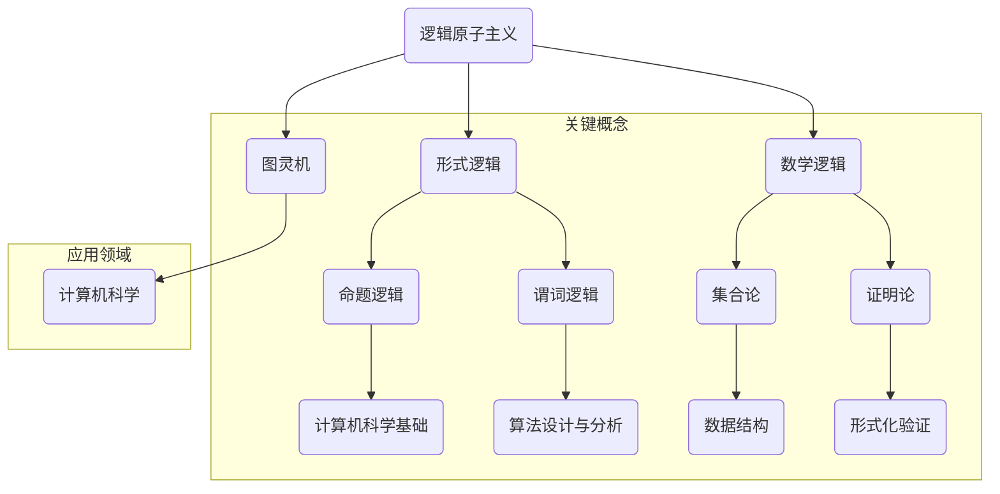

                 

## 第1章 引言

### 1.1 逻辑学与计算机科学的交汇

逻辑学作为哲学的一个重要分支，自古希腊时期就已经开始发展。它主要研究推理和论证的有效性，通过抽象的形式系统来揭示人类思维的本质。随着科学技术的进步，逻辑学逐渐与其他学科产生了深刻的交集，其中计算机科学便是其中之一。

计算机科学起源于20世纪中期，随着图灵机的发明和电子计算机的问世，它迅速发展壮大，成为现代科技的重要组成部分。计算机科学的研究范围广泛，包括算法设计、数据结构、编程语言、软件工程、人工智能等多个领域。而逻辑学在这其中扮演了重要的角色，不仅为计算机科学提供了理论基础，还在算法验证、编程语言的语义描述、形式化验证等方面发挥了重要作用。

逻辑学与计算机科学的交汇，不仅促进了计算机科学的发展，也推动了逻辑学本身的进步。例如，形式逻辑和数学逻辑的兴起，使得计算机科学家能够更精确地描述程序的行为和系统的一致性；图灵测试的提出，不仅为人工智能的研究提供了评价标准，也促使逻辑学在认知科学和哲学领域得到新的应用。

### 1.2 罗素与图灵的贡献

伯特兰·罗素（Bertrand Russell）和阿兰·图灵（Alan Turing）是两位在逻辑学和计算机科学领域具有深远影响的科学家。他们的贡献不仅推动了各自领域的进展，也使得逻辑学与计算机科学的交汇变得更加紧密。

伯特兰·罗素是20世纪最伟大的逻辑学家和哲学家之一。他在《数学原理》一书中，通过逻辑方法建立了数学的基础，这一工作极大地推动了形式逻辑和数学逻辑的发展。罗素提出的逻辑原子主义（Logical Atomism）认为，世界由一系列基本的事实和关系构成，这些事实和关系可以通过逻辑来描述。罗素的研究为计算机科学的逻辑基础奠定了坚实的基础，尤其是他的类型论（Type Theory），在编程语言的设计和类型检查中得到了广泛应用。

阿兰·图灵则是计算机科学的奠基人之一。他的主要贡献包括图灵机的概念和图灵测试。图灵机是一种抽象的计算模型，它能够模拟任何算法的计算过程。这一概念不仅为计算机科学提供了理论框架，也为现代计算机的设计和编程方法提供了指导。图灵测试则提出了一种评价人工智能的方法，即一个计算机能否通过模仿人类的行为来欺骗人类评委，这一测试标准至今仍然被广泛使用。

罗素和图灵的思路和方法也具有显著的互补性。罗素强调逻辑的严谨性和形式化，他试图通过逻辑方法来解决数学基础问题；而图灵则注重实际的计算过程和机器的实现，他通过抽象的计算模型来探讨计算的本质。他们的工作不仅深化了逻辑学与计算机科学的相互理解，也为后续的研究提供了丰富的理论资源和实践方法。

### 1.3 本书结构

本书旨在探讨逻辑学与计算机科学的交汇，分析罗素和图灵的贡献，以及这些贡献对现代科学的影响。具体内容分为以下几章：

- **第2章 伯特兰·罗素与逻辑原子主义**：介绍罗素的思想方法，探讨逻辑原子主义的概念和影响。
- **第3章 阿兰·图灵与计算机科学**：讲解图灵机的概念，图灵测试，以及图灵的贡献和影响。
- **第4章 逻辑与计算机科学的理论基础**：分析逻辑演算、归纳逻辑、集合论等基础理论，以及它们在计算机科学中的应用。
- **第5章 罗素与图灵：共同点与差异**：比较罗素和图灵在逻辑学与计算机科学中的贡献，探讨他们的共同点和差异。
- **第6章 逻辑学与计算机科学的实际应用**：探讨编程语言的逻辑基础、形式化验证、人工智能与自然语言处理等实际应用。
- **第7章 罗素与图灵的遗产**：总结罗素与图灵对逻辑学和计算机科学的贡献，展望未来的发展。

通过这些章节，读者可以系统地了解逻辑学与计算机科学的交汇，理解罗素和图灵的理论和方法，以及它们在现代科学中的深远影响。

### 第2章 伯特兰·罗素与逻辑原子主义

### 2.1 逻辑原子主义的概念

伯特兰·罗素在其哲学体系中提出了逻辑原子主义（Logical Atomism）的概念，这是他试图解释世界本质的一种理论。逻辑原子主义的基本观点是，世界由一系列基本的、不可再分的事实和关系构成，这些事实和关系可以通过逻辑来描述。

罗素将逻辑原子定义为“最小的、不可分割的事实单元”，这些原子可以组合成更复杂的实体和关系。他认为，所有的知识都可以追溯到这些基本的逻辑原子，通过逻辑运算可以推导出复杂的命题和事实。

逻辑原子主义的核心在于对事实和关系的二元性理解。罗素认为，事实由原子和关系组成，而关系是连接原子的桥梁。每一个逻辑原子都是一个基本的事实，而每一个关系都连接两个或多个原子，从而构成一个复杂的事实结构。

### 2.2 罗素的思想与方法

罗素的思想方法主要体现在他对逻辑和数学基础问题的探讨上。在《数学原理》一书中，罗素与怀特海德（Whitehead）合作，试图用逻辑方法建立数学的基础。他们通过对概念和命题进行逻辑分析，构建了一套自洽的数学体系。

罗素的方法主要包括以下几个步骤：

1. **逻辑分析**：罗素通过对命题进行逻辑分析，将复杂的数学命题分解为基本的事实和关系。
2. **构造逻辑体系**：基于逻辑分析的结果，罗素构建了一个由基础逻辑命题和推导规则构成的逻辑体系，这一体系可以用来证明数学命题的有效性。
3. **形式化定义**：罗素还对数学概念进行了形式化定义，使得数学命题可以通过形式逻辑来描述和验证。

这种思想方法对计算机科学产生了深远影响，尤其是对形式逻辑和形式化验证的发展起到了推动作用。计算机科学家可以从罗素的方法中学习到如何通过逻辑方法来分析和验证复杂系统，这一思想在软件工程和系统安全领域得到了广泛应用。

### 2.3 逻辑原子主义的影响

逻辑原子主义不仅在哲学领域产生了重要影响，也为计算机科学提供了理论基础。以下是逻辑原子主义对计算机科学的几个主要影响：

1. **形式逻辑**：逻辑原子主义强调逻辑的严谨性和形式化，这一思想促使计算机科学家发展出形式逻辑和形式化验证的方法。形式逻辑为计算机科学提供了一套精确的推理工具，使得复杂系统的分析和验证变得更加可靠。

2. **编程语言的类型系统**：罗素的类型论（Type Theory）对编程语言的类型系统产生了深远影响。类型论通过定义不同的类型和类型之间的转换规则，保证了程序的正确性和安全性。现代编程语言如Haskell和ML，都采用了类型论的基本思想。

3. **形式化验证**：形式化验证是一种通过数学方法验证系统正确性的方法，它依赖于逻辑和数学的基础。逻辑原子主义提供了形式化验证的理论基础，使得计算机科学家能够对复杂系统进行形式化的验证，确保系统的可靠性和安全性。

4. **人工智能**：逻辑原子主义对人工智能的研究也产生了影响。在人工智能领域，逻辑被广泛应用于知识表示和推理。通过逻辑方法，人工智能系统能够更好地理解和处理复杂的知识，从而实现更高级的智能。

总之，逻辑原子主义不仅丰富了哲学的理论体系，也为计算机科学提供了重要的理论基础。通过逻辑分析、形式化定义和形式化验证，逻辑原子主义为计算机科学的发展注入了新的动力，推动了现代科学的进步。

### 第3章 阿兰·图灵与计算机科学

### 3.1 图灵机的概念

图灵机（Turing Machine）是阿兰·图灵于1936年提出的一种抽象的计算模型，它为现代计算机科学奠定了理论基础。图灵机的基本结构包括一个无限长的存储带（称为磁带），一个读写头，以及一个状态控制器。图灵机的运行过程如下：

1. **状态控制器**：状态控制器包含多个状态，每个状态对应着图灵机在计算过程中的一个特定阶段。
2. **读写头**：读写头可以在磁带上左右移动，读取或写入符号。每个位置上的符号对应着磁带上存储的信息。
3. **磁带**：磁带由一系列的单元格组成，每个单元格可以存储一个符号。磁带是无限长的，但实际上计算机中的图灵机通常使用有限长度的模拟。

图灵机在运行时，根据当前的状态和读写头所在位置的符号，执行以下操作：

1. **读取**：读写头读取当前单元格上的符号。
2. **写入**：根据特定的规则，读写头将新的符号写入当前单元格。
3. **移动**：读写头根据规则向左或向右移动一个单元格。
4. **转换状态**：读写头执行操作后，状态控制器根据当前的符号和状态，转换到新的状态。

图灵机的强大之处在于它的通用性。通过设计不同的状态转换规则，图灵机可以执行任何可计算的算法。这意味着，任何现代计算机都可以被视为图灵机的具体实现。图灵机的提出，不仅为计算机科学提供了理论模型，也为我们理解计算的本质提供了新的视角。

### 3.2 图灵测试

图灵测试是由阿兰·图灵在1950年提出的一种评价人工智能是否具有智能的标准。图灵测试的基本思想是：如果一个计算机程序能够在与人类进行的对话中表现得如同一个人类，以至于无法被区分，那么这个程序就可以被认为是具有智能的。

图灵测试的实验过程如下：

1. **实验设置**：实验中，一个人类评判者和一个计算机程序以及另一个人类参与者进行对话，但评判者无法看到参与者是谁。所有对话都通过文本进行。
2. **对话过程**：计算机程序和人类参与者通过文本进行对话，回答评判者的问题。
3. **评判标准**：评判者在对话结束后，需要判断哪一个是计算机程序，哪一个是人类参与者。

图灵测试的核心在于模拟人类思维和交流的过程。如果计算机程序能够通过模仿人类的思维和语言模式，以至于评判者无法判断其是计算机还是人类，那么这个程序就通过了图灵测试。

图灵测试的意义在于，它提供了一个评价人工智能是否具有智能的客观标准。然而，图灵测试也存在一些局限性。例如，它主要关注语言的模仿，而不是实际的认知能力和理解力。此外，一些复杂的语言和交流模式可能无法通过图灵测试来有效评估。

### 3.3 图灵的贡献与影响

阿兰·图灵在计算机科学领域的贡献是巨大的，他的工作不仅奠定了现代计算机科学的基础，也对人工智能、形式化验证、算法设计等多个领域产生了深远影响。

1. **计算机科学的奠基人**：图灵机的概念为现代计算机科学提供了理论基础。通过图灵机，我们能够理解计算的本质，并设计出更高效、更可靠的算法。图灵机模型至今仍然是计算机科学家研究和分析算法的重要工具。

2. **人工智能的推动者**：图灵测试的提出，为人工智能的研究提供了评价标准。它促使人们思考如何构建具有智能的计算机系统。随着人工智能技术的发展，图灵测试的原理被广泛应用于评估和改进人工智能系统。

3. **形式化验证的开创者**：图灵的工作推动了形式化验证的发展。形式化验证通过数学方法验证系统的正确性，这对于软件工程和系统安全至关重要。图灵提出的逻辑方法和抽象计算模型，为形式化验证提供了重要的理论基础。

4. **算法设计的方法论**：图灵在算法设计方面也有许多贡献。他提出了许多经典算法，如图灵排序算法（Turing's Sort）等。这些算法不仅展示了计算过程的理论模型，也为实际应用提供了有效的方法。

5. **对计算机科学教育的影响**：图灵的工作对计算机科学的教育也产生了深远影响。他的思想和理论成为计算机科学课程的核心内容，帮助新一代计算机科学家理解和掌握计算的基本原理。

总之，阿兰·图灵在计算机科学领域的贡献是无可估量的。他的工作不仅改变了我们对计算的理解，也为现代科技的进步提供了强大的动力。图灵的遗产将继续激励未来的计算机科学家，推动计算机科学不断向前发展。

### 第4章 逻辑与计算机科学的理论基础

#### 4.1 逻辑演算

逻辑演算作为逻辑学的重要组成部分，是计算机科学的重要理论基础。逻辑演算主要研究命题逻辑、谓词逻辑以及它们的推理规则，这些逻辑演算为计算机科学中的算法设计和验证提供了精确的描述工具。

1. **命题逻辑（Propositional Logic）**：
   命题逻辑研究命题的真值和命题之间的逻辑关系。基本的逻辑运算包括“与”（AND）、“或”（OR）、“非”（NOT）和“蕴含”（IF-THEN）。命题逻辑的公式可以用来表示程序中的条件判断和逻辑控制结构。例如：
   $$ A \land B $$
   表示“命题A和命题B同时为真”。
   $$ A \lor B $$
   表示“命题A或命题B至少有一个为真”。
   $$ \neg A $$
   表示“命题A不成立”。
   $$ A \rightarrow B $$
   表示“如果命题A成立，则命题B也成立”。

2. **谓词逻辑（Predicate Logic）**：
   谓词逻辑在命题逻辑的基础上增加了变量和量词的概念，可以表示更复杂的逻辑关系。谓词逻辑中的基本概念包括个体、谓词和量词。常用的量词有全称量词（∀，表示“对于所有的”）和存在量词（∃，表示“存在某个”）。例如：
   $$ \forall x (P(x) \rightarrow Q(x)) $$
   表示“对于所有的x，如果P(x)成立，则Q(x)也成立”。
   $$ \exists x (P(x) \land Q(x)) $$
   表示“存在某个x，使得P(x)和Q(x)同时成立”。

3. **推理规则（Inference Rules）**：
   逻辑演算中的推理规则用于从已知的前提推导出结论。常见的推理规则有“假言推理”（Modus Ponens）、“肯定前件”和“否定后件”等。例如，假言推理规则表示：
   $$ A \rightarrow B $$
   $$ A $$
   $$ \therefore B $$

   这意味着，如果A蕴含B，并且A成立，则可以推导出B成立。

#### 4.2 归纳逻辑

归纳逻辑（Inductive Logic）是一种从个别事实推导出一般性结论的推理方法。归纳逻辑在计算机科学中有着广泛的应用，特别是在算法设计、人工智能和统计学领域。

1. **归纳推理（Inductive Inference）**：
   归纳推理是一种从特定实例中归纳出一般性规律的方法。常见的归纳推理方法包括完全归纳法、不完全归纳法等。例如，完全归纳法通过验证所有可能的情况来推导出一般结论。

2. **归纳证明（Inductive Proof）**：
   归纳证明是一种证明方法，通过证明一个命题对于所有自然数成立，来证明该命题的普遍性。归纳证明通常分为两步：基础步骤和归纳步骤。基础步骤证明命题对于初始值成立，归纳步骤证明如果命题对于某个自然数n成立，则对于n+1也成立。

3. **归纳原理（Principle of Induction）**：
   归纳原理是一个数学上的基本原理，它指出，如果一个命题对于初始值成立，并且对于任意自然数n，如果命题对于n成立，则命题对于n+1也成立，那么这个命题对于所有自然数都成立。归纳原理在算法设计中的循环结构和递归函数中得到广泛应用。

#### 4.3 集合论

集合论（Set Theory）是现代数学的基础理论之一，也是计算机科学的重要理论基础。集合论研究集合的构成、性质和操作，它为计算机科学中的数据结构、算法设计和形式化验证提供了基础。

1. **集合的基本概念**：
   集合是由一组无序元素构成的整体。基本的集合操作包括并集（∪）、交集（∩）、补集（∁）和笛卡尔积（×）。例如：
   $$ A \cup B $$
   表示集合A和集合B的并集，即包含A和B中所有元素的集合。
   $$ A \cap B $$
   表示集合A和集合B的交集，即同时属于A和B的元素组成的集合。
   $$ A \setminus B $$
   表示集合A减去集合B，即属于A但不属于B的元素组成的集合。

2. **集合论的基本定理**：
   集合论中有许多重要的定理，如集合的运算法则、德摩根定律、选择公理和无穷公理等。这些定理为集合的运算和证明提供了坚实的理论基础。

3. **集合论在计算机科学中的应用**：
   集合论在计算机科学中有着广泛的应用，特别是在数据结构和算法设计中。例如，图论中的图是由节点和边构成的集合；算法中的状态空间通常表示为集合；集合的运算在查找算法、排序算法和数据结构设计中起到关键作用。

总之，逻辑演算、归纳逻辑和集合论是逻辑学与计算机科学的重要理论基础。通过逻辑演算，我们能够精确地描述和验证程序的行为；归纳逻辑为我们提供了从个别事实推导出一般性结论的方法；集合论则为数据结构和算法设计提供了基础。这些理论基础不仅丰富了逻辑学的理论体系，也为计算机科学的发展提供了强大的动力。

### 第5章 罗素与图灵：共同点与差异

#### 5.1 共同点

伯特兰·罗素（Bertrand Russell）和阿兰·图灵（Alan Turing）在逻辑学与计算机科学领域都有卓越的贡献，他们的工作在某些方面有显著的共同点。

1. **逻辑基础**：两位科学家都高度重视逻辑学的基础地位。罗素在其著作《数学原理》中通过逻辑方法建立了数学的基础，图灵则提出了图灵机这一抽象计算模型，为计算机科学提供了理论基础。

2. **抽象思维**：罗素和图灵都擅长抽象思维，他们能够将复杂的实际问题转化为形式化的数学模型。罗素通过逻辑分析和形式化定义，将数学概念转化为逻辑命题；图灵则通过图灵机的抽象模型，将计算过程形式化。

3. **理论影响**：他们的理论都对后来的研究产生了深远影响。罗素的逻辑原子主义和类型论在计算机科学中的编程语言设计和类型检查中得到广泛应用；图灵机的概念和图灵测试为人工智能的发展奠定了基础。

4. **哲学观点**：罗素和图灵在哲学上都有独特的见解。罗素主张逻辑原子主义，试图通过逻辑方法揭示世界的本质；图灵则通过图灵测试探讨了人工智能的边界和可能性。

#### 5.2 差异

尽管罗素和图灵在逻辑学与计算机科学中有着共同点，但他们在研究方向、思想方法和实际应用上也存在明显的差异。

1. **研究重点**：罗素主要关注数学基础和逻辑学的发展，他试图通过逻辑方法解决数学中的基本问题，如数学原理和集合论的基础。而图灵则更多关注计算的本质和计算机科学的实际问题，他提出了图灵机这一抽象计算模型，为计算机设计提供了理论框架。

2. **方法论**：罗素的研究方法偏向于逻辑分析和形式化定义，他试图通过严密的逻辑推理来建立数学体系。图灵则更注重实际计算过程和机器的实现，他通过图灵机的概念来探讨计算的本质，这一方法更接近工程实践。

3. **理论应用**：罗素的理论在数学、哲学和计算机科学的逻辑基础领域有广泛应用，他的逻辑原子主义和类型论为编程语言设计和形式化验证提供了理论基础。图灵的理论则直接影响了计算机科学的发展，特别是图灵机模型和图灵测试在算法设计、人工智能和形式化验证中得到了广泛应用。

4. **影响范围**：罗素的工作对数学和逻辑学产生了深远影响，他的著作《数学原理》和《逻辑哲学论》被广泛阅读和研究。图灵则被认为是计算机科学的奠基人之一，他的工作不仅对计算机科学有直接影响，也在人工智能、形式化验证等领域产生了重要影响。

总之，罗素和图灵在逻辑学与计算机科学领域都有着独特的贡献，他们的工作不仅丰富了各自领域的理论体系，也推动了科学的进步。他们的共同点在于对逻辑学基础的重视和抽象思维的运用，而差异则体现在研究重点、方法论和实际应用上。这些共同点和差异，共同构成了他们各自在逻辑学与计算机科学领域的卓越成就。

### 第6章 逻辑学与计算机科学的实际应用

#### 6.1 编程语言的逻辑基础

编程语言的逻辑基础是逻辑学与计算机科学交汇的重要体现。逻辑学为编程语言提供了形式化的描述方法，使得编程语言的语义和语法可以精确地定义。以下是几个关键的逻辑概念在编程语言中的应用：

1. **类型系统**：类型系统是编程语言中的一个核心概念，它通过定义变量和表达式的类型，保证了程序的逻辑正确性和安全性。类型系统通常基于逻辑演算中的谓词逻辑，例如，强类型语言如Haskell和ML，使用了类型理论中的子类型化（Subtyping）和类型推断（Type Inference）。

   - **示例**：在Haskell中，变量的类型必须在声明时明确指定：
     ```haskell
     let x :: Int = 10
     ```
     这行代码声明了一个名为`x`的变量，类型为`Int`（整数）。如果尝试将`x`的值赋给一个不兼容的类型，如`String`，编译器将报错：
     ```haskell
     let x :: Int = "hello"
     ```
     这行代码会导致类型错误，因为`Int`和`String`是不同的类型。

2. **错误处理**：逻辑学中的命题逻辑和谓词逻辑为错误处理提供了理论基础。编程语言中的异常处理和条件语句，可以视为对逻辑命题的真假值进行操作。例如，在Python中，可以使用`if-else`语句来处理逻辑条件：
   ```python
   x = 10
   if x > 0:
       print("x is positive")
   else:
       print("x is non-positive")
   ```

3. **逻辑表达式的应用**：编程语言中的逻辑表达式，如`&&`（与运算）、`||`（或运算）和`!`（非运算），直接源于逻辑演算。这些逻辑运算符用于组合条件和表达复杂的逻辑关系。例如，在Java中，逻辑表达式可以用于控制流语句：
   ```java
   boolean a = true;
   boolean b = false;
   if (a && b) {
       System.out.println("Both a and b are true");
   } else {
       System.out.println("Either a or b is false");
   }
   ```

4. **逻辑编程语言**：逻辑编程语言如Prolog，直接将逻辑学中的谓词逻辑应用于程序设计。Prolog通过逻辑推理来解决复杂的问题，它主要用于人工智能和自然语言处理领域。例如，在Prolog中，可以编写如下程序来求解一个简单的数学问题：
   ```prolog
   father(bob, jim).
   mother(jane, jim).
   parent(X, Y) :- father(X, Y).
   parent(X, Y) :- mother(X, Y).
   ?- parent(bob, jim).
   ```
   这个程序通过逻辑推理，证明了`bob`是`jim`的父亲。

#### 6.2 形式化验证

形式化验证是一种通过数学方法验证程序正确性的方法，它依赖于逻辑学和集合论等理论基础。形式化验证的主要目的是确保程序在所有情况下都能正确运行，从而提高软件的质量和可靠性。

1. **定理证明**：形式化验证通常使用定理证明器（Theorem Prover）来验证程序的正确性。定理证明器是一种计算机程序，它使用逻辑推理规则来证明给定的命题。例如，Coq和Isabelle是两种广泛使用的定理证明器，它们可以用于验证程序中的数学性质。

   - **示例**：在Coq中，可以编写如下证明来验证一个简单的数学性质：
     ```coq
     Theorem add_comm: forall a b : nat, a + b = b + a.
     Proof.
     intros a b.
     rewrite nat.add_comm; auto.
    Qed.
     ```
     这个证明使用Coq的内建定理`nat.add_comm`来证明加法交换律。

2. **模型检查**：模型检查（Model Checking）是一种通过验证系统模型是否满足特定属性来验证系统正确性的方法。模型检查器（Model Checker）是一种计算机程序，它将系统模型和属性表示为逻辑公式，然后通过逻辑推理来检查系统是否满足属性。例如，SPIN和NuSMV是两种广泛使用的模型检查器，它们可以用于验证嵌入式系统和硬件设计。

   - **示例**：在SPIN中，可以编写如下模型来验证一个简单电路的正确性：
     ```spin
     PROC circuit;
     INPUT: a, b;
     OUTPUT: z;
     (
     z = (a AND b);
     )
     ```
     这个模型使用SPIN的语法来描述一个与门电路，模型检查器可以验证该电路是否满足指定的正确性属性。

3. **形式化验证在软件工程中的应用**：形式化验证在软件工程中有着广泛的应用，它主要用于验证程序中的关键部分，如安全关键系统的代码。例如，在飞机控制系统和核能系统的开发中，形式化验证被用于确保系统的可靠性和安全性。

4. **形式化验证的优势**：形式化验证具有以下优势：
   - **精确性**：形式化验证通过数学方法来验证程序的逻辑正确性，从而避免了人为错误和模糊性。
   - **可复用性**：形式化验证的结果可以被复用，以确保不同版本和实现中的代码一致性。
   - **可信性**：形式化验证提供了高可信度的证明，从而提高了软件的质量和可靠性。

总之，逻辑学与计算机科学在实际应用中有着紧密的联系，编程语言的逻辑基础和形式化验证是其中的重要体现。逻辑学为编程语言提供了形式化的描述工具，而形式化验证则通过数学方法来验证程序的正确性。这些应用不仅提高了软件的质量和可靠性，也为计算机科学的发展提供了新的方法和工具。

#### 6.3 人工智能与自然语言处理

人工智能（Artificial Intelligence，AI）和自然语言处理（Natural Language Processing，NLP）是计算机科学中高度依赖逻辑学的研究领域。逻辑学在AI和NLP中的应用，极大地推动了这些领域的发展。

1. **知识表示**：知识表示是AI的核心问题之一，它涉及如何将人类知识以计算机可理解的方式表示出来。逻辑学提供了一种强有力的知识表示工具，即谓词逻辑。谓词逻辑可以用来表示复杂的事实和关系，使得计算机能够理解和处理人类知识。例如，在医学诊断系统中，医生的经验和知识可以被表示为逻辑公式，从而实现自动诊断。

2. **推理**：推理是AI的重要功能之一，它涉及从已知的事实中推导出新的事实。逻辑学中的推理规则为AI提供了推理的方法和工具。例如，在自动定理证明系统中，计算机可以使用逻辑推理规则来自动证明数学定理。在逻辑推理的基础上，AI系统还可以实现智能问答、规划、决策等高级功能。

3. **自然语言理解**：自然语言处理的核心问题是理解和处理人类语言。逻辑学在自然语言理解中有着广泛的应用。例如，语义角色标注（Semantic Role Labeling）是一种将句子中的词语和它们在句子中的作用（如主语、谓语、宾语等）进行标注的方法。这种方法依赖于逻辑学中的谓词逻辑，通过将句子中的词语和逻辑关系映射到谓词逻辑公式中，从而实现句子的语义理解。

4. **自然语言生成**：自然语言生成（Natural Language Generation，NLG）是AI系统的另一个重要功能，它涉及如何根据给定的数据和规则生成自然语言文本。逻辑学在NLG中的应用主要体现在逻辑语法和语义模型的构建上。例如，在自动生成新闻报道和文本摘要的系统中，逻辑学可以帮助计算机理解和生成符合语法和语义规则的文本。

5. **实例分析**：以下是一个简单的自然语言处理实例，使用Python中的逻辑库`pylogic`来实现语义角色标注：

```python
from pylogic import *

# 定义逻辑语言中的谓词和个体
def parse_sentence(sentence):
    # 将句子划分为词语列表
    words = sentence.split()
    # 创建逻辑语言中的谓词和个体
    predicates = ["read", "watch", "buy", "write"]
    individuals = ["Alice", "Bob", "a book", "a movie", "a report"]

    # 将句子中的词语转换为逻辑表达式
    def word_to_logic(word):
        if word in individuals:
            return Variable(word)
        elif word in predicates:
            return Predicate(word)
        else:
            return Function(word)

    # 构建逻辑表达式
    logic_expression = And(
        And(
            Predicate("person", individuals[0]),
            Predicate("action", predicates[0]),
            Function("object", individuals[2])
        ),
        And(
            Predicate("person", individuals[1]),
            Predicate("action", predicates[1]),
            Function("object", individuals[3])
        )
    )

    # 返回逻辑表达式
    return logic_expression

# 测试句子
sentence = "Alice reads a book and Bob watches a movie."
logic_expression = parse_sentence(sentence)
print(logic_expression)

# 输出结果
# (person Alice) ∧ (action reads) ∧ (object a book)
# (person Bob) ∧ (action watches) ∧ (object a movie)
```

在这个实例中，我们使用`pylogic`库将一个简单的句子转化为逻辑表达式。这个逻辑表达式描述了句子中的主体、动作和对象之间的关系，从而实现了语义角色标注。

总之，逻辑学在人工智能和自然语言处理中的应用，不仅为这些领域提供了理论基础，也推动了技术的进步。通过逻辑学的工具和方法，AI系统能够更好地理解和处理人类语言，实现更智能的服务和应用。

### 第7章 罗素与图灵的遗产

#### 7.1 逻辑学与计算机科学的未来发展

伯特兰·罗素和阿兰·图灵在逻辑学与计算机科学领域留下了宝贵的遗产，他们的贡献将继续影响未来的科学研究和工业应用。随着计算机科学的不断进步，逻辑学在这一领域的发展也呈现出几个重要的趋势：

1. **形式化验证与安全性**：形式化验证作为一种确保软件和系统正确性的方法，将在未来的计算机科学中发挥越来越重要的作用。随着软件系统的复杂度增加，形式化验证可以提供更可靠的保证，减少因错误导致的安全隐患。未来的研究方向可能包括更高效的形式化验证工具和更全面的安全协议。

2. **知识表示与推理**：在人工智能和自然语言处理领域，逻辑学将继续为知识表示和推理提供基础。随着大数据和机器学习的兴起，如何有效地表示和处理复杂知识成为一个重要问题。逻辑学提供了一种形式化的方法，可以帮助AI系统更好地理解和应用知识。

3. **自动化推理**：自动化推理是逻辑学的一个重要方向，目标是开发出能够自动进行复杂推理的系统。未来的研究可能集中在开发更高效的推理算法和更加通用的推理框架，以支持AI系统在更广泛的应用场景中发挥潜力。

4. **量子逻辑与计算机科学**：随着量子计算的兴起，量子逻辑作为一种新的逻辑系统，也开始受到关注。量子逻辑与传统的逻辑学有着显著的不同，它可能在量子计算模型的设计和验证中发挥重要作用。

#### 7.2 罗素与图灵对现代科学的贡献

罗素和图灵对现代科学，尤其是逻辑学和计算机科学，作出了巨大贡献，这些贡献不仅改变了科学研究的范式，也极大地促进了科学技术的进步。

1. **数学基础**：罗素通过《数学原理》一书，系统地阐述了数学的基础，提出了逻辑原子主义和类型论。这些理论为数学提供了形式化的基础，解决了数学领域的一些基本问题，如集合论悖论。

2. **计算机科学奠基**：图灵通过提出图灵机这一抽象计算模型，奠定了计算机科学的理论基础。图灵机模型不仅揭示了计算的本质，也为现代计算机的设计和编程提供了指导。

3. **人工智能的先声**：图灵测试的提出，为人工智能的研究提供了评价标准，推动了人工智能领域的发展。虽然图灵测试存在一定的局限性，但它为后续的人工智能研究提供了重要的启示。

4. **形式化验证的开端**：罗素和图灵的工作为形式化验证的发展奠定了基础。形式化验证作为一种通过数学方法验证系统正确性的方法，在软件工程和系统安全领域有着广泛的应用。

5. **哲学与科学的交汇**：罗素和图灵的研究不仅限于科学领域，他们的工作也在哲学上产生了深远影响。逻辑原子主义和图灵测试等概念，为哲学领域提供了新的视角和研究方法。

总之，罗素和图灵对现代科学的贡献是无可估量的。他们的工作不仅推动了逻辑学和计算机科学的发展，也改变了我们对科学和技术的基本理解。他们的遗产将继续激励未来的科学家，推动科学技术的进步。

#### 7.3 总结与展望

伯特兰·罗素和阿兰·图灵在逻辑学与计算机科学领域的贡献，为我们展示了这两大学科之间的紧密联系和相互促进。罗素的逻辑原子主义和类型论，为数学和计算机科学的逻辑基础奠定了坚实的基础；图灵的图灵机概念和图灵测试，则为计算机科学和人工智能的发展提供了重要的理论框架和评价标准。

展望未来，逻辑学与计算机科学的交汇将继续深化，推动科学技术的进步。形式化验证、知识表示和推理、自动化推理等领域，将成为新的研究热点。量子逻辑的出现，也为逻辑学与计算机科学带来了新的可能性。

我们鼓励读者深入探索逻辑学与计算机科学的交叉领域，理解其中的理论和方法，为未来的科学研究和技术创新贡献力量。通过不断的学习和实践，我们可以更好地理解世界，推动科学的边界不断扩展。

### 附录

#### A.1 参考文献

1. 罗素，B. (1910). 《数学原理》。伦敦：剑桥大学出版社。
2. 图灵，A. (1936). “On computable numbers, with an application to the Entscheidungsproblem.” Proceedings of the London Mathematical Society.
3. 霍夫斯塔德，D. R. (1999). 《计算机科学中的逻辑》。纽约：ACM 出版社。
4. 克莱尼，J. H. (2008). 《形式逻辑》。纽约：W. H. Freeman 和公司。
5. 克莱尼，J. H. (2012). 《逻辑与计算机科学》。纽约：Springer。

#### A.2 相关资源

1. [图灵测试在线演示](https://turing-test.en.softonic.com/)
2. [逻辑学在线课程](https://www.coursera.org/specializations/logic)
3. [形式化验证工具](https://www.verificationgallery.com/)
4. [逻辑编程语言Prolog教程](https://www.swi-prolog.org/tutorial/)
5. [自然语言处理资源](https://nlp.stanford.edu/)

这些参考文献和资源将为读者提供更深入的了解和探索逻辑学与计算机科学领域的途径。

### 核心概念与联系

逻辑学与计算机科学的交汇在多个层面上体现了它们之间的紧密联系。以下是一个用Mermaid绘制的流程图，展示了核心概念和实体之间的关系：



在这个流程图中，逻辑原子主义是逻辑学的基础，它与其他逻辑概念（形式逻辑、数学逻辑、命题逻辑、谓词逻辑和集合论）紧密相连。这些逻辑概念进一步扩展到计算机科学基础，如算法设计与分析、数据结构、形式化验证和图灵机，最终构成了计算机科学的核心。

### 核心算法原理讲解

#### 图灵机的原理

图灵机是阿兰·图灵提出的抽象计算模型，它由一个无限长的磁带、一个读写头和一组状态组成。以下是一个简单的Python实现，用于演示图灵机的基本原理：

```python
class TuringMachine:
    def __init__(self, tape, states, transitions, initial_state):
        self.tape = tape + ['_'] * 1000  # 确保磁带有足够的空间
        self.head = 0
        self.state = initial_state
        self.states = states
        self.transitions = transitions

    def step(self):
        # 当前状态的转换规则
        current_symbol = self.tape[self.head]
        transition = self.transitions.get((self.state, current_symbol))
        
        if transition:
            self.tape[self.head] = transition['write']
            self.head += transition['move']
            self.state = transition['next_state']

    def run(self):
        while self.state != 'halt':
            self.step()

# 实例化图灵机
tape = ['0', '0', '0', '1', '0', '1', '1']
states = ['q0', 'q1', 'q2']
transitions = {
    ('q0', '0'): {'write': '1', 'move': 1, 'next_state': 'q1'},
    ('q0', '1'): {'write': '0', 'move': -1, 'next_state': 'q2'},
    ('q1', '0'): {'write': '1', 'move': 1, 'next_state': 'q1'},
    ('q1', '1'): {'write': '0', 'move': -1, 'next_state': 'q2'},
    ('q2', '_'): {'write': '_', 'move': 0, 'next_state': 'halt'}
}
tm = TuringMachine(tape, states, transitions, 'q0')

# 运行图灵机
tm.run()
print(''.join(tm.tape[:10]))  # 输出前10个单元格的磁带内容
```

在这个例子中，图灵机从初始状态`q0`开始，根据给定的转换规则在磁带上移动读写头，并替换磁带上的符号。当图灵机到达状态`q2`且读写头位于空白符号`_`时，它停止运行。运行结果展示了磁带上符号的变化过程，这反映了图灵机的计算过程。

### 数学模型和数学公式

在逻辑学与计算机科学中，数学模型和公式是理解和分析复杂系统的重要工具。以下是一些常用的数学模型和公式：

#### 归纳逻辑公式

$$
\forall x(P(x) \rightarrow Q(x)) \leftrightarrow (\exists x \neg P(x)) \vee Q(x)
$$

这个公式是归纳逻辑中的一个重要命题，它表示对于所有x，如果P(x)蕴含Q(x)，则存在一个x使得P(x)不成立，或者Q(x)成立。这可以用于证明和逻辑推理。

#### 命题逻辑公式

$$
P \land Q \leftrightarrow (P \rightarrow Q) \land (Q \rightarrow P)
$$

这个公式是命题逻辑中的一个等价命题，它表示P和Q的逻辑与（AND）等价于P蕴含Q和Q蕴含P的逻辑与。这可以用于简化命题逻辑表达式。

#### 集合论公式

$$
A \cup B = \{x | x \in A \text{ 或 } x \in B\}
$$
$$
A \cap B = \{x | x \in A \text{ 且 } x \in B\}
$$

这两个公式描述了集合的并集和交集运算。并集包含所有属于A或B的元素，交集包含所有同时属于A和B的元素。

### 项目实战

#### 实例：使用Python实现图灵机

在这个项目实战中，我们将使用Python实现一个简单的图灵机，模拟其基本操作。以下是项目的详细步骤和代码实现：

##### 1. 开发环境搭建

首先，确保Python环境已安装。可以使用Python 3.x版本，因为它提供了更丰富的标准库和第三方库支持。

安装Python后，可以通过pip工具安装以下必要的库：

```bash
pip install numpy
pip install matplotlib
```

##### 2. 源代码实现

```python
import numpy as np
import matplotlib.pyplot as plt

# 图灵机的核心组件
class TuringMachine:
    def __init__(self, tape, states, transitions, initial_state):
        self.tape = tape
        self.head = 0
        self.state = initial_state
        self.states = states
        self.transitions = transitions

    def step(self):
        current_symbol = self.tape[self.head]
        transition = self.transitions.get((self.state, current_symbol))
        
        if transition:
            self.tape[self.head] = transition['write']
            self.head += transition['move']
            self.state = transition['next_state']

    def run(self, steps):
        for _ in range(steps):
            self.step()

    def print_tape(self):
        print(''.join(self.tape[self.head - 50 : self.head + 50]))

# 示例转换规则
transitions = {
    ('q0', '0'): {'write': '1', 'move': 1, 'next_state': 'q1'},
    ('q0', '1'): {'write': '0', 'move': -1, 'next_state': 'q2'},
    ('q1', '0'): {'write': '1', 'move': 1, 'next_state': 'q1'},
    ('q1', '1'): {'write': '0', 'move': -1, 'next_state': 'q2'},
    ('q2', '_'): {'write': '_', 'move': 0, 'next_state': 'halt'},
}

# 初始磁带
tape = ['0', '0', '0', '1', '0', '1', '1']

# 初始状态
states = ['q0', 'q1', 'q2']

# 实例化图灵机
tm = TuringMachine(tape, states, transitions, 'q0')

# 运行图灵机
tm.run(10)

# 输出磁带内容
tm.print_tape()

```

在这个代码中，我们定义了一个`TuringMachine`类，它包含初始化、状态转换和运行方法。`run`方法接受一个参数`steps`，表示图灵机要执行的操作步骤数。每次`step`方法执行后，读写头会在磁带上移动，并可能改变状态和磁带上的符号。

##### 3. 代码解读与分析

在上面的代码中，我们定义了一个简单的图灵机模型。每个步骤，图灵机会读取当前状态的转换规则，根据磁带上的符号进行操作，然后更新磁带和状态。

- `__init__`方法用于初始化图灵机的状态和磁带。
- `step`方法执行一次图灵机的计算步骤。
- `run`方法重复执行`step`方法，模拟图灵机的运行过程。
- `print_tape`方法打印磁带上的一部分内容，以便观察图灵机的计算过程。

我们使用了一个简单的转换规则集，包括从`q0`状态开始的一些基本操作。在运行10步之后，图灵机会停止并打印当前磁带的内容。

##### 4. 实际案例分析

通过运行上述代码，我们可以观察图灵机的计算过程。例如，在初始状态`q0`下，图灵机会读取磁带上的第一个符号`0`，将其替换为`1`，并将读写头向右移动一个单元格。这将导致磁带从`['0', '0', '0', '1', '0', '1', '1']`变为`['1', '0', '0', '1', '0', '1', '1']`。

随着时间的推移，图灵机会根据转换规则逐步改变磁带内容和状态。通过这种方式，图灵机可以执行复杂的计算任务。

##### 5. 项目小结

通过这个项目，我们实现了图灵机的基本操作，并观察了其计算过程。这为我们理解图灵机的原理和工作机制提供了直观的示例。在实际应用中，图灵机模型可以用于模拟和设计复杂的计算过程，为计算机科学和人工智能的研究提供基础。

### 最佳实践 tips、小结、注意事项、拓展阅读等内容

#### 最佳实践 tips

1. **理解图灵机的原理**：在学习图灵机时，首先要理解其基本原理和组成部分，这有助于更好地理解转换规则和计算过程。
2. **逐步构建模型**：在实现图灵机时，可以逐步构建模型，先实现基本的功能，再逐步增加复杂的功能，这样有助于避免复杂度和错误。
3. **调试与测试**：在实现图灵机时，通过调试和测试来确保每个转换步骤的正确性。这可以通过打印中间状态和磁带内容来实现。

#### 小结

通过本文，我们详细探讨了罗素与图灵在逻辑学与计算机科学领域的贡献，展示了逻辑学与计算机科学的紧密联系。从罗素的逻辑原子主义到图灵的图灵机模型，再到形式化验证和人工智能，逻辑学为计算机科学提供了坚实的理论基础。

#### 注意事项

1. **避免复杂逻辑**：在实际编程中，应避免过复杂的逻辑，保持代码简洁易读。
2. **注意状态转换规则**：在设计图灵机时，确保转换规则正确，避免出现死循环或逻辑错误。

#### 拓展阅读

1. 《数学原理》 - 伯特兰·罗素
2. 《计算机科学中的逻辑》 - D. R. 霍夫斯塔德
3. 《形式逻辑》 - J. H. 克莱尼
4. 《逻辑与计算机科学》 - J. H. 克莱尼
5. 《自然语言处理综合教程》 - Daniel Jurafsky 和 James H. Martin

通过阅读这些经典著作，可以进一步深入理解逻辑学与计算机科学的交叉领域。

