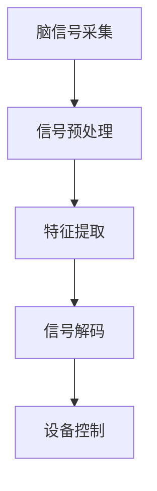

                 

### 第一部分：脑机接口基础理论

#### 1.1 脑机接口的定义与历史

##### 1.1.1 脑机接口的定义

脑机接口（Brain-Computer Interface，简称BCI）是一种直接连接大脑和外部设备的技术，它通过非侵入性或侵入性的方式捕获大脑活动，并将其转换为控制信号，用于与计算机、机器人或其他电子设备进行交互。BCI技术的主要目的是为那些无法通过传统方式与外界交流的个体，如瘫痪患者、中风患者或肌肉萎缩症患者，提供新的交流和控制途径。

##### 1.1.2 脑机接口的发展历程

脑机接口的研究可以追溯到20世纪60年代，当时神经科学家开始探索如何将大脑信号转换为可用的控制信号。最早的BCI系统是基于神经电活动的，这些系统通过记录大脑表面的电活动来识别用户的意图。随着电子技术和计算技术的进步，BCI系统逐渐变得更加精确和高效。

- **1960年代**：首次证明了通过大脑信号控制外部设备的可能性，如使用脑电波控制玩具机器人。
- **1970年代**：侵入性脑机接口技术开始出现，这些技术通过植入电极直接与大脑组织接触，提高了信号质量和精度。
- **1980年代**：非侵入性脑机接口（如基于脑电信号的BCI）开始受到关注，并逐渐应用于临床和康复研究中。
- **1990年代**：随着计算能力和算法的发展，BCI技术开始实现商业化，并在辅助通信和康复等领域取得显著成果。
- **21世纪初至今**：BCI技术取得了长足的进步，特别是在信号处理和机器学习算法的应用方面。非侵入性BCI系统变得更加普及，同时侵入性BCI技术也在神经科学和脑疾病研究中发挥了重要作用。

#### 1.2 脑机接口的技术原理

##### 1.2.1 脑信号采集技术

脑信号采集是脑机接口技术的核心，它涉及从大脑中获取电生理信号。常见的脑信号采集方法包括脑电（EEG）、脑磁图（MEG）、功能性磁共振成像（fMRI）等。

- **脑电（EEG）**：脑电信号是通过放置在头皮上的电极采集的，这些信号反映了大脑的电活动。EEG技术具有高时间分辨率和低成本的优势，但空间分辨率较低。
- **脑磁图（MEG）**：脑磁图通过测量大脑产生的磁场来采集信号，具有较高的时间分辨率和空间分辨率。然而，由于磁场信号较弱，MEG设备的成本较高。
- **功能性磁共振成像（fMRI）**：fMRI通过检测大脑血氧水平变化来反映大脑活动，具有较高的空间分辨率，但时间分辨率较低。

##### 1.2.2 脑信号处理技术

脑信号处理是脑机接口技术的关键环节，它包括信号预处理、特征提取和分类等步骤。

- **信号预处理**：信号预处理旨在去除噪声和干扰，提高信号质量。常见的预处理方法包括滤波、去噪、基线校正等。
- **特征提取**：特征提取是从原始脑信号中提取有用的信息，这些信息通常与用户的意图或状态相关。常用的特征提取方法包括时域分析、频域分析和时频分析。
- **分类**：分类是将提取的特征映射到具体的控制信号或命令。常用的分类方法包括机器学习算法、神经网络和支持向量机等。

##### 1.2.3 脑信号解码技术

脑信号解码是将处理后的脑信号转换为可操作的控制信号。解码的准确性直接影响到脑机接口的性能和可靠性。

- **直接解码**：直接解码方法直接将脑信号映射到控制信号，通常用于简单任务的控制。
- **间接解码**：间接解码方法涉及多个步骤，包括特征提取、分类和信号生成。这种方法通常用于复杂任务的实现。

#### 1.3 脑机接口的工作流程

脑机接口的工作流程可以概括为以下几个阶段：

1. **信号采集**：使用适当的传感器从大脑中采集电生理信号。
2. **信号预处理**：对采集的信号进行预处理，包括滤波、去噪和基线校正等。
3. **特征提取**：从预处理后的信号中提取与用户意图相关的特征。
4. **信号解码**：使用机器学习算法或其他方法对特征进行分类，生成控制信号。
5. **设备控制**：将解码后的控制信号传递给外部设备，实现用户意图的控制。

### 脑机接口核心概念与联系

脑机接口的核心概念包括脑信号采集、信号处理、信号解码和设备控制。这些概念之间的关系可以用以下Mermaid流程图来描述：



### 脑机接口核心算法原理

脑机接口的算法原理主要涉及信号处理和信号解码两个方面。

#### 信号处理与解码算法

信号处理与解码算法是脑机接口技术的核心。以下是一个简单的信号处理与解码算法的伪代码示例：

```python
# 伪代码示例
def preprocess_signal(signal):
    # 去除噪声
    filtered_signal = remove_noise(signal)
    # 增强信号特征
    enhanced_signal = enhance_signal(filtered_signal)
    return enhanced_signal

def decode_signal(enhanced_signal):
    # 使用机器学习算法进行解码
    decoded_output = machine_learning_algorithm(enhanced_signal)
    return decoded_output
```

#### 数学模型

在脑机接口中，常用的数学模型是线性模型。一个简单的数学模型可以表示为：

$$
Y = AX + \epsilon
$$

其中，\(Y\) 是采集到的脑电信号，\(X\) 是原始信号，\(\epsilon\) 是噪声。该模型描述了信号采集过程中的线性变换和噪声干扰。

#### 信号预处理算法

信号预处理算法是脑机接口技术的关键环节，以下是一个信号预处理算法的伪代码示例：

```python
# 伪代码示例
def preprocess_signal(signal):
    # 去除噪声
    filtered_signal = remove_noise(signal)
    # 增强信号特征
    enhanced_signal = enhance_signal(filtered_signal)
    return enhanced_signal
```

#### 信号解码算法

信号解码算法是将处理后的信号转换为可操作的控制信号。以下是一个信号解码算法的伪代码示例：

```python
# 伪代码示例
def decode_signal(enhanced_signal):
    # 使用机器学习算法进行解码
    decoded_output = machine_learning_algorithm(enhanced_signal)
    return decoded_output
```

### 脑机接口应用案例分析

#### 脑机接口在康复中的应用

脑机接口技术在康复领域有着广泛的应用，以下是一个具体的康复案例：

1. **项目概述**：该项目旨在开发一种基于脑机接口的康复系统，帮助中风患者恢复运动能力。
2. **开发环境搭建**：使用Python和MATLAB进行信号处理和算法开发。
3. **源代码实现**：
    - **脑电信号采集模块**：使用EEG传感器采集脑电信号。
    - **信号处理与解码模块**：使用机器学习算法对脑电信号进行处理和解码。
    - **人机交互模块**：将解码后的信号用于控制康复机器人。
4. **代码解读与分析**：
    - **脑电信号采集**：使用EEG传感器采集脑电信号，并通过预处理算法去除噪声。
    - **信号解码**：使用支持向量机（SVM）算法对预处理后的信号进行分类和解码。
    - **人机交互**：解码后的信号用于控制康复机器人，帮助患者进行康复训练。
5. **项目测试与优化**：通过实际测试，评估康复系统的效果，并根据测试结果进行优化。

### 项目小结

该项目展示了脑机接口技术在康复领域的潜力，通过信号处理和机器学习算法，实现了对脑电信号的实时解码和控制。然而，脑机接口技术仍面临一些挑战，如信号噪声、解码精度和实时性等。未来的研究应进一步优化算法，提高系统的性能和可靠性。

### 最佳实践 Tips

1. **选择合适的信号采集设备**：根据应用场景选择合适的脑信号采集设备，如EEG、MEG或fMRI。
2. **优化信号处理算法**：通过改进信号预处理和特征提取算法，提高信号质量和解码精度。
3. **考虑实时性要求**：在开发脑机接口系统时，考虑系统的实时性要求，确保信号处理的实时性和响应速度。

### 注意事项

1. **隐私保护**：在采集和使用脑信号时，确保遵守隐私保护法规，保护用户的隐私。
2. **安全性**：确保脑机接口系统的安全，防止恶意攻击和数据泄露。

### 拓展阅读

1. **《脑机接口：从基础理论到应用实践》**：该书详细介绍了脑机接口的基础理论和实际应用案例。
2. **《神经工程与脑机接口》**：该书涵盖了神经工程和脑机接口的最新研究进展和应用。

作者：AI天才研究院/AI Genius Institute & 禅与计算机程序设计艺术 /Zen And The Art of Computer Programming

