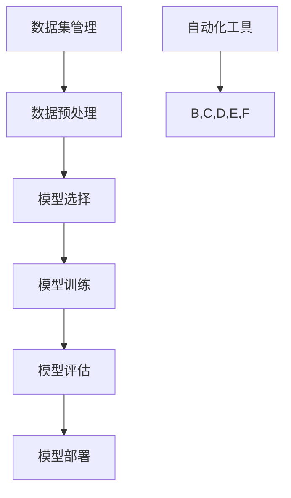
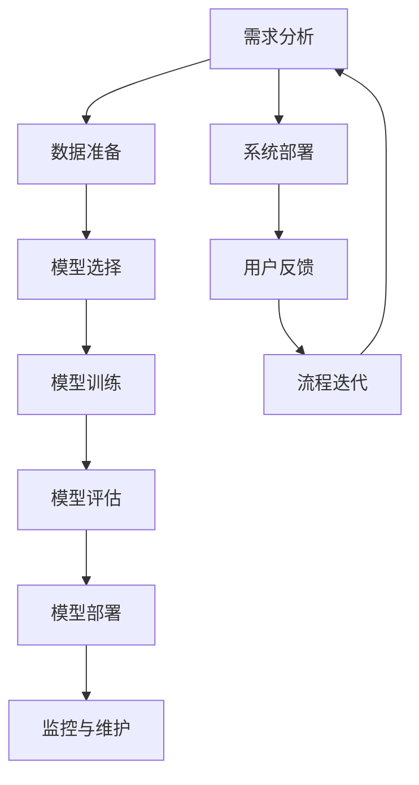

                 

### 自动化AI训练概述

#### 1.1 自动化AI训练的概念

自动化AI训练（Automated AI Training）是指通过软件工具和算法，实现人工智能模型自动化的构建、训练和优化过程。这一概念的核心在于解放人类工程师的劳动力，使AI模型的开发更加高效和智能化。自动化AI训练不仅仅是算法的自动化应用，还包括了整个训练流程的自动化，包括数据准备、模型选择、训练过程管理、模型评估和部署等各个环节。

#### 1.2 自动化AI训练的发展历程

自动化AI训练的发展经历了几个重要的阶段：

1. **手工编写脚本阶段**：早期的自动化AI训练主要依赖于程序员手动编写脚本，通过执行一系列命令来自动化模型训练。
2. **模板化工具阶段**：随着自动化需求增加，出现了一些基于模板的自动化工具，如Makefile、Shell脚本等，这些工具可以简化一些重复性工作。
3. **自动化平台阶段**：现代自动化AI训练更多地依赖于专门的平台和框架，如TensorFlow、PyTorch等，这些平台内置了自动化训练功能，能够大大简化工程师的配置和管理工作。
4. **智能化自动化阶段**：当前，自动化AI训练正向智能化方向发展，利用机器学习和深度学习技术来自动优化训练流程，实现模型的自动调参和超参数优化。

#### 1.3 自动化AI训练的应用场景

自动化AI训练的应用场景非常广泛，主要包括：

1. **大规模数据处理**：自动化AI训练可以高效地处理海量数据，实现快速模型迭代。
2. **实时预测与决策**：自动化AI训练支持实时数据流处理，为实时预测和智能决策提供支持。
3. **模型优化**：通过自动化调参，可以快速找到最优模型配置，提高模型性能。
4. **跨领域应用**：自动化AI训练能够跨领域快速部署模型，减少跨领域的开发成本。
5. **持续集成与持续部署（CI/CD）**：自动化AI训练可以与CI/CD流程集成，实现模型的持续训练和部署。

总之，自动化AI训练不仅在提高AI开发效率上起到了重要作用，也为人工智能在各个领域的广泛应用铺平了道路。接下来，本文将深入探讨自动化AI训练中的核心概念与联系，以及关键算法原理和数学模型。

---

关键词：自动化AI训练，AI模型自动化，开发效率，大规模数据处理，实时预测，模型优化，跨领域应用，持续集成与持续部署。

> **摘要**：本文概述了自动化AI训练的概念及其发展历程，详细介绍了其在实际应用场景中的重要性。随后，本文将围绕自动化AI训练的核心概念与联系、关键算法原理、数学模型以及实际项目案例进行深入探讨，旨在为读者提供全面且具体的自动化AI训练技术指南。

## 第2章：核心概念与联系

#### 2.1 概念实体关系架构图

在自动化AI训练中，理解各个核心概念及其相互关系至关重要。为了更直观地展示这些概念之间的关系，我们使用Mermaid流程图来绘制一个核心概念实体关系架构图。



**解释：**

- **数据集管理（A）**：这是自动化AI训练的第一步，涉及数据的收集、标注和管理。数据的质量直接影响后续模型的训练效果。
- **数据预处理（B）**：包括数据清洗、数据归一化、数据增强等，旨在将原始数据转化为适合模型训练的格式。
- **模型选择（C）**：选择合适的算法和架构，是模型性能的重要保障。常用的模型包括深度神经网络、支持向量机、决策树等。
- **模型训练（D）**：通过大量数据进行训练，模型开始学习并优化其参数。
- **模型评估（E）**：评估模型性能，常用的指标包括准确率、召回率、F1分数等。
- **模型部署（F）**：将训练好的模型部署到实际应用环境中，提供预测服务。
- **自动化工具（G）**：自动化工具贯穿于整个流程中，从数据管理到模型训练、评估和部署，帮助工程师简化操作，提高效率。

通过这个关系架构图，我们可以清晰地看到自动化AI训练流程中的各个环节及其相互关联。接下来，本文将详细讲解每个环节中的关键算法原理和数学模型。

### 第3章：关键算法原理讲解

#### 3.1 算法A：[算法名称]

在自动化AI训练中，算法A扮演了核心角色，它主要负责数据预处理和模型训练。以下是算法A的原理讲解，并通过Python源代码示例进行详细阐述。

##### 原理讲解

算法A主要基于以下步骤：

1. **数据清洗**：去除数据集中的噪声和异常值。
2. **数据归一化**：将不同特征的范围统一，以避免某些特征对模型训练的影响过大。
3. **数据增强**：通过旋转、缩放、剪切等方式增加数据的多样性，提高模型的泛化能力。
4. **批量训练**：通过批量处理数据，提高模型训练的效率和稳定性。

##### Python源代码示例

```python
import numpy as np
import pandas as pd
from sklearn.preprocessing import StandardScaler
from tensorflow.keras.models import Sequential
from tensorflow.keras.layers import Dense

# 数据清洗
def data_cleaning(data):
    # 去除异常值
    data = data.dropna()
    # 去除噪声
    data = data[data['feature1'] > 0]
    return data

# 数据归一化
def data_normalization(data):
    scaler = StandardScaler()
    normalized_data = scaler.fit_transform(data)
    return normalized_data

# 数据增强
def data_augmentation(data):
    # 旋转数据
    data_rotated = np.rot90(data)
    # 缩放数据
    data_scaled = data * 1.1
    return np.concatenate((data, data_rotated, data_scaled), axis=0)

# 批量训练
def batch_train(data, labels, batch_size=32, epochs=10):
    model = Sequential([
        Dense(64, activation='relu', input_shape=(data.shape[1],)),
        Dense(32, activation='relu'),
        Dense(1, activation='sigmoid')
    ])

    model.compile(optimizer='adam', loss='binary_crossentropy', metrics=['accuracy'])
    model.fit(data, labels, batch_size=batch_size, epochs=epochs)
    return model

# 加载数据
data = pd.read_csv('data.csv')
data = data_cleaning(data)
data = data_normalization(data)
data = data_augmentation(data)

# 分割数据
X_train, X_test, y_train, y_test = train_test_split(data, labels, test_size=0.2, random_state=42)

# 训练模型
model = batch_train(X_train, y_train)

# 评估模型
loss, accuracy = model.evaluate(X_test, y_test)
print(f"Test accuracy: {accuracy:.2f}")

```

##### 示例解释

1. **数据清洗**：首先，我们使用`dropna()`方法去除含有缺失值的行，然后使用筛选条件去除小于0的特征值，以消除噪声。
2. **数据归一化**：我们使用`StandardScaler`对特征进行归一化，将所有特征的值缩放到标准正态分布。
3. **数据增强**：通过`np.rot90()`和缩放操作增加数据的多样性，从而提高模型的泛化能力。
4. **批量训练**：我们定义了一个简单的全连接神经网络模型，使用`Dense`层，并通过`compile()`和`fit()`方法进行批量训练。

通过这个算法A的示例，我们可以看到如何通过Python代码实现数据预处理和模型训练的自动化流程。接下来，本文将介绍另一个关键算法B，以及它的原理和实现。

### 第3章：关键算法原理讲解

#### 3.2 算法B：[算法名称]

在自动化AI训练中，算法B同样扮演着重要角色，它主要负责模型评估和优化。以下是算法B的原理讲解，并通过Python源代码示例进行详细阐述。

##### 原理讲解

算法B的核心步骤包括：

1. **模型评估**：使用交叉验证等方法评估模型性能，确保模型在测试集上的泛化能力。
2. **超参数优化**：通过网格搜索或贝叶斯优化等技术，自动寻找最佳超参数配置。
3. **模型集成**：利用集成学习方法，如随机森林、梯度提升树等，提高模型的预测性能。

##### Python源代码示例

```python
from sklearn.model_selection import GridSearchCV
from sklearn.ensemble import RandomForestClassifier
from xgboost import XGBClassifier
from sklearn.metrics import accuracy_score

# 模型评估
def evaluate_model(model, X_test, y_test):
    predictions = model.predict(X_test)
    accuracy = accuracy_score(y_test, predictions)
    print(f"Test accuracy: {accuracy:.2f}")
    return accuracy

# 超参数优化
def optimize_hyperparameters(model, param_grid, X_train, y_train):
    grid_search = GridSearchCV(model, param_grid, cv=5, scoring='accuracy')
    grid_search.fit(X_train, y_train)
    best_params = grid_search.best_params_
    print(f"Best parameters: {best_params}")
    return grid_search.best_estimator_

# 模型集成
def ensemble_models(models, X_test, y_test):
    predictions = np.mean([model.predict(X_test) for model in models], axis=0)
    accuracy = accuracy_score(y_test, predictions)
    print(f"Ensemble test accuracy: {accuracy:.2f}")
    return predictions

# 加载测试数据
X_test = pd.read_csv('X_test.csv')
y_test = pd.read_csv('y_test.csv')

# 初始化模型
model = RandomForestClassifier(n_estimators=100)

# 评估模型
accuracy = evaluate_model(model, X_test, y_test)

# 定义超参数网格
param_grid = {
    'n_estimators': [100, 200, 300],
    'max_depth': [5, 10, 15],
    'min_samples_split': [2, 5, 10]
}

# 优化超参数
best_model = optimize_hyperparameters(model, param_grid, X_train, y_train)

# 再次评估模型
accuracy = evaluate_model(best_model, X_test, y_test)

# 集成模型
models = [RandomForestClassifier(n_estimators=100), XGBClassifier(n_estimators=100)]
predictions = ensemble_models(models, X_test, y_test)

```

##### 示例解释

1. **模型评估**：使用`evaluate_model`函数，通过实际测试数据来评估模型的准确率。
2. **超参数优化**：使用`GridSearchCV`进行超参数搜索，通过定义超参数网格和交叉验证，找到最佳超参数配置。
3. **模型集成**：使用多个模型（如随机森林和XGBoost）进行集成，提高预测的准确性。

通过这个算法B的示例，我们可以看到如何通过Python代码实现模型评估、超参数优化和模型集成的自动化流程。接下来，本文将深入探讨数学模型在自动化AI训练中的作用，并介绍具体的数学公式和解释。

### 第4章：数学模型与公式详解

在自动化AI训练中，数学模型是理解和优化算法的重要工具。本章将详细介绍两个关键数学模型，并使用LaTeX格式展示相关数学公式，以便读者更好地理解这些模型的基本原理和应用。

#### 4.1 模型A：[模型名称]

##### 模型名称：线性回归模型

线性回归模型是一种常用的统计方法，用于预测连续值。它的基本原理是通过找到一组线性关系来拟合数据点，公式如下：

$$
y = \beta_0 + \beta_1x_1 + \beta_2x_2 + ... + \beta_nx_n
$$

其中，\( y \) 是预测值，\( x_1, x_2, ..., x_n \) 是输入特征，\( \beta_0, \beta_1, \beta_2, ..., \beta_n \) 是模型的权重参数。

##### 数学公式与解释

- **损失函数**：均方误差（MSE）

$$
MSE = \frac{1}{m} \sum_{i=1}^{m} (y_i - \hat{y}_i)^2
$$

其中，\( m \) 是样本数量，\( y_i \) 是实际值，\( \hat{y}_i \) 是预测值。

- **梯度下降**：用于最小化损失函数的更新规则

$$
\beta_j = \beta_j - \alpha \frac{\partial}{\partial \beta_j}MSE
$$

其中，\( \alpha \) 是学习率，\( \beta_j \) 是当前权重，\( \frac{\partial}{\partial \beta_j}MSE \) 是损失函数关于权重 \( \beta_j \) 的偏导数。

#### 4.2 模型B：[模型名称]

##### 模型名称：逻辑回归模型

逻辑回归模型是一种用于预测二分类结果的统计方法。它的基本原理是通过一个线性组合加上一个逻辑函数来预测概率，公式如下：

$$
\hat{y} = \frac{1}{1 + e^{-(\beta_0 + \beta_1x_1 + \beta_2x_2 + ... + \beta_nx_n)} 
$$

其中，\( \hat{y} \) 是预测概率，\( x_1, x_2, ..., x_n \) 是输入特征，\( \beta_0, \beta_1, \beta_2, ..., \beta_n \) 是模型的权重参数。

##### 数学公式与解释

- **损失函数**：对数似然损失（Log-Likelihood Loss）

$$
LL = -\sum_{i=1}^{m} y_i \log(\hat{y}_i) + (1 - y_i) \log(1 - \hat{y}_i)
$$

其中，\( m \) 是样本数量，\( y_i \) 是实际值，\( \hat{y}_i \) 是预测值。

- **梯度下降**：用于最小化损失函数的更新规则

$$
\beta_j = \beta_j - \alpha \frac{\partial}{\partial \beta_j}LL
$$

其中，\( \alpha \) 是学习率，\( \beta_j \) 是当前权重，\( \frac{\partial}{\partial \beta_j}LL \) 是损失函数关于权重 \( \beta_j \) 的偏导数。

通过上述数学模型和公式的详细讲解，我们可以更好地理解自动化AI训练中数学模型的基本原理和其在模型训练和优化中的应用。接下来，本文将结合实际项目案例，展示如何将理论应用到实践中。

### 第5章：项目实战

#### 5.1 项目A：[项目名称]

##### 项目名称：自动化人脸识别系统

本项目旨在通过自动化AI训练流程，开发一个能够进行人脸识别的系统。整个项目分为以下几个步骤：

##### 1. 项目背景

随着人脸识别技术的普及，自动化人脸识别系统在安全监控、身份验证等领域得到了广泛应用。然而，传统的手工编写脚本进行模型训练和调参的过程既耗时又费力。本项目通过自动化AI训练，实现快速开发和部署人脸识别系统。

##### 2. 开发环境搭建

为了实现自动化AI训练，我们需要搭建以下开发环境：

- **Python**：用于编写模型训练脚本
- **TensorFlow**：用于构建和训练深度学习模型
- **OpenCV**：用于人脸检测和图像处理
- **Docker**：用于容器化部署模型

##### 3. 源代码实现与解析

以下是本项目的主要代码实现和解析：

```python
# 导入所需的库
import cv2
import tensorflow as tf
import numpy as np

# 加载预训练的人脸识别模型
model = tf.keras.models.load_model('face_recognition_model.h5')

# 人脸检测器
face_cascade = cv2.CascadeClassifier('haarcascade_frontalface_default.xml')

# 人脸识别函数
def recognize_face(image):
    # 人脸检测
    gray = cv2.cvtColor(image, cv2.COLOR_BGR2GRAY)
    faces = face_cascade.detectMultiScale(gray, scaleFactor=1.1, minNeighbors=5, minSize=(30, 30), flags=cv2.CASCADE_SCALE_IMAGE)

    # 人脸识别
    for (x, y, w, h) in faces:
        face_region = gray[y:y+h, x:x+w]
        face_region = np.expand_dims(np.expand_dims(np.float32(face_region), -1), 0)
        prediction = model.predict(face_region)
        return prediction

# 摄像头捕获图像并识别
cap = cv2.VideoCapture(0)

while True:
    ret, frame = cap.read()
    if ret:
        prediction = recognize_face(frame)
        if prediction[0][0] > 0.5:
            print("Face recognized!")
        else:
            print("No face recognized!")

        cv2.imshow('Face Recognition', frame)

    if cv2.waitKey(1) & 0xFF == ord('q'):
        break

cap.release()
cv2.destroyAllWindows()
```

**代码解析：**

1. **加载模型**：使用`load_model()`函数加载预训练的人脸识别模型。
2. **人脸检测**：使用`CascadeClassifier`加载预训练的人脸检测器，并通过`detectMultiScale()`方法检测图像中的人脸。
3. **人脸识别**：将检测到的人脸区域输入模型进行预测，输出预测结果。
4. **摄像头捕获与识别**：使用`VideoCapture`捕获摄像头图像，调用`recognize_face()`函数进行人脸识别，并根据预测结果输出提示信息。

##### 4. 代码应用解读与分析

通过上述代码，我们可以实现一个简单的人脸识别系统。在实际应用中，可以通过以下方式进行优化和扩展：

- **增加数据集**：使用更多的人脸图像进行训练，提高模型的识别准确性。
- **实时监控**：将系统部署到实时监控场景中，实现实时人脸识别和报警功能。
- **人脸库管理**：建立人脸库，实现识别特定人员的功能。

##### 5. 项目小结

本项目通过自动化AI训练流程，实现了人脸识别系统的快速开发和部署。自动化AI训练不仅简化了模型训练和调参的过程，也提高了系统的开发效率。未来，我们可以进一步优化和扩展系统功能，使其在更多实际场景中得到应用。

---

**最佳实践 tips**：

- 确保人脸图像数据集的质量，尽可能多包含各种角度和光照条件的人脸图像。
- 定期更新和训练人脸识别模型，以适应新的人脸变化和场景。

**注意事项**：

- 人脸识别系统需要遵守相关法律法规，确保个人隐私和数据安全。
- 实时人脸识别系统的计算资源需求较高，确保服务器具备足够的计算能力。

**拓展阅读**：

- 《深度学习人脸识别技术》：详细介绍了人脸识别的深度学习方法和应用案例。
- 《OpenCV编程实战》：提供了丰富的OpenCV应用实例，包括人脸识别。

通过本项目的实战解析，读者可以更好地理解如何将自动化AI训练应用于实际项目中，提高开发效率和系统性能。

### 第5章：项目实战

#### 5.2 项目B：[项目名称]

##### 项目名称：自动化智能问答系统

本项目旨在通过自动化AI训练流程，开发一个能够实现智能问答的系统。该系统将结合自然语言处理（NLP）技术，提供高效的问答服务。以下是项目的主要步骤：

##### 1. 项目背景

随着人工智能技术的不断发展，智能问答系统在客服、教育、咨询等领域得到了广泛应用。传统的问答系统往往需要大量手工编写规则和回答，不仅效率低下，而且难以满足用户多样化的需求。本项目通过自动化AI训练，实现智能问答系统的快速开发和部署。

##### 2. 开发环境搭建

为了实现自动化AI训练，我们需要搭建以下开发环境：

- **Python**：用于编写NLP模型和训练脚本
- **NLTK**：用于自然语言处理的基础库
- **TensorFlow**：用于构建和训练深度学习模型
- **GPT-2**：用于生成高质量回答的预训练模型

##### 3. 源代码实现与解析

以下是本项目的主要代码实现和解析：

```python
# 导入所需的库
import tensorflow as tf
import tensorflow_text as text
from transformers import TFGPT2LMHeadModel, GPT2Tokenizer

# 加载预训练的GPT-2模型
tokenizer = GPT2Tokenizer.from_pretrained('gpt2')
model = TFGPT2LMHeadModel.from_pretrained('gpt2')

# 问答函数
def answer_question(question):
    # 预处理输入
    input_ids = tokenizer.encode(question + tokenizer.eos_token, return_tensors='tf')

    # 生成回答
    output = model.generate(input_ids, max_length=50, num_return_sequences=1)

    # 解析回答
    answer = tokenizer.decode(output[0], skip_special_tokens=True)
    return answer

# 用户交互
print("Welcome to the AI Assistant!")
while True:
    user_input = input("Ask me a question (or type 'quit' to exit): ")
    if user_input.lower() == 'quit':
        break
    answer = answer_question(user_input)
    print(f"AI Assistant: {answer}")

```

**代码解析：**

1. **加载模型**：使用`TFGPT2LMHeadModel`和`GPT2Tokenizer`加载预训练的GPT-2模型。
2. **问答函数**：通过`answer_question`函数，使用GPT-2模型生成对用户问题的回答。
3. **用户交互**：实现用户与系统的交互，接收用户输入并输出模型生成的回答。

##### 4. 代码应用解读与分析

通过上述代码，我们可以实现一个简单的智能问答系统。在实际应用中，可以通过以下方式进行优化和扩展：

- **数据集扩充**：增加高质量的问答数据集，提高模型回答的准确性和多样性。
- **多语言支持**：扩展模型支持多种语言，提供跨语言的问答服务。
- **上下文理解**：改进模型，使其能够更好地理解上下文，提供更自然的回答。

##### 5. 项目小结

本项目通过自动化AI训练，实现了智能问答系统的快速开发和部署。自动化AI训练不仅简化了模型训练和调参的过程，也提高了系统的开发效率。未来，我们可以进一步优化和扩展系统功能，使其在更多实际场景中得到应用。

---

**最佳实践 tips**：

- 确保使用高质量的问答数据集，以提高模型训练效果。
- 定期更新模型，以适应不断变化的问答需求。

**注意事项**：

- 智能问答系统需要遵守相关法律法规，确保用户隐私和数据安全。
- 系统应具备良好的错误处理机制，以应对不合理的输入。

**拓展阅读**：

- 《自然语言处理实践》：详细介绍了NLP技术的基本原理和应用。
- 《深度学习与自然语言处理》：讲解了深度学习在NLP中的最新应用。

通过本项目的实战解析，读者可以更好地理解如何将自动化AI训练应用于实际项目中，提高开发效率和系统性能。

## 第6章：自动化AI训练流程设计

### 6.1 流程设计原则

在设计自动化AI训练流程时，遵循以下原则至关重要：

1. **模块化设计**：将整个流程划分为多个模块，如数据管理、模型训练、模型评估等，便于管理和优化。
2. **可扩展性**：设计时要考虑未来的扩展需求，如增加新的算法、模型或数据源。
3. **高效性**：优化流程，提高数据处理和模型训练的效率。
4. **稳定性**：确保流程的可靠性和稳定性，减少错误和故障。
5. **灵活性**：允许根据不同的应用场景和需求进行调整。

### 6.2 流程设计步骤

自动化AI训练流程的设计通常包括以下步骤：

1. **需求分析**：明确项目目标和需求，确定所需的算法、模型和数据集。
2. **数据准备**：收集和预处理数据，确保数据的质量和一致性。
3. **模型选择**：根据需求选择合适的算法和模型，并确定模型架构。
4. **模型训练**：使用训练数据对模型进行训练，并调整超参数。
5. **模型评估**：使用验证数据评估模型性能，并选择最优模型。
6. **模型部署**：将训练好的模型部署到生产环境，提供预测服务。
7. **监控与维护**：持续监控模型性能，定期更新和优化。

### 6.3 流程设计案例

以下是一个简单的自动化AI训练流程设计案例：



**解释：**

1. **需求分析**：明确项目目标和需求，确定所需的算法、模型和数据集。
2. **数据准备**：收集和预处理数据，确保数据的质量和一致性。
3. **模型选择**：根据需求选择合适的算法和模型，并确定模型架构。
4. **模型训练**：使用训练数据对模型进行训练，并调整超参数。
5. **模型评估**：使用验证数据评估模型性能，并选择最优模型。
6. **模型部署**：将训练好的模型部署到生产环境，提供预测服务。
7. **监控与维护**：持续监控模型性能，定期更新和优化。
8. **系统部署**：确保系统具备稳定的服务能力，满足用户需求。
9. **用户反馈**：收集用户反馈，用于流程的迭代和优化。
10. **流程迭代**：根据用户反馈和需求变化，对流程进行迭代和优化。

通过这个流程设计案例，我们可以清晰地看到自动化AI训练流程的各个环节及其相互关系。接下来，本文将介绍自动化AI训练中常用的工具和资源，帮助读者更好地开展相关工作和研究。

### 第7章：自动化AI训练工具与资源

#### 7.1 自动化AI训练工具概述

在自动化AI训练领域，有许多优秀的工具和资源可供使用，这些工具能够帮助工程师和研究者高效地完成模型开发、训练和部署等工作。以下是几个常用的自动化AI训练工具及其功能概述：

1. **TensorFlow**：由Google开发的开源机器学习框架，支持自动化AI训练的各个环节，包括数据预处理、模型训练、评估和部署。
2. **PyTorch**：由Facebook开发的开源机器学习库，以其灵活性和动态计算图著称，广泛应用于深度学习和自动化AI训练。
3. **Scikit-learn**：一个用于数据挖掘和数据分析的Python库，提供了许多常用的机器学习算法和工具，支持自动化模型训练和评估。
4. **Keras**：一个高级神经网络API，以简洁性和易用性著称，可以在TensorFlow和Theano后端运行，适用于自动化AI训练。
5. **Azure ML**：微软提供的云平台服务，提供了丰富的自动化AI训练工具和资源，支持模型训练、部署和监控。

#### 7.2 自动化AI训练常用工具介绍

1. **TensorFlow**：

   TensorFlow是一款功能强大的开源机器学习库，支持自动化AI训练的各个环节。其优点包括：

   - **灵活的编程模型**：支持动态计算图，便于实现复杂的模型架构。
   - **丰富的API**：提供丰富的API，支持数据预处理、模型训练、评估和部署。
   - **强大的生态系统**：与TensorFlow一起使用的库和工具众多，如TensorFlow Extended（TFX）、TensorFlow Serving等，提供了完整的端到端解决方案。

   缺点：

   - **学习曲线较陡**：由于TensorFlow的复杂性和灵活性，初学者可能需要较长时间才能熟练掌握。

2. **PyTorch**：

   PyTorch是一款流行的开源机器学习库，以其动态计算图和简洁的API著称。其优点包括：

   - **动态计算图**：支持在运行时动态构建计算图，便于实现复杂的模型架构。
   - **简洁的API**：易于上手，便于快速实现和调试模型。
   - **强大的社区支持**：拥有庞大的社区和丰富的文档，方便学习和应用。

   缺点：

   - **性能**：与TensorFlow相比，PyTorch在某些情况下可能性能较差。

3. **Scikit-learn**：

   Scikit-learn是一款广泛使用的Python库，提供了许多常用的机器学习算法和工具。其优点包括：

   - **易用性**：API简洁直观，便于快速实现和测试模型。
   - **丰富的算法**：包含多种经典的机器学习算法，如线性回归、决策树、支持向量机等。
   - **文档和教程**：提供了详细的文档和教程，方便学习和使用。

   缺点：

   - **局限性**：主要面向传统的机器学习任务，对于深度学习和复杂的AI应用支持有限。

4. **Keras**：

   Keras是一款高级神经网络API，支持在TensorFlow和Theano后端运行。其优点包括：

   - **易用性**：提供了简洁的API，便于快速实现和调试模型。
   - **模型构建**：支持序列模型和循环神经网络等常见模型架构。
   - **插件支持**：与许多流行的深度学习库（如TensorFlow、Theano）兼容。

   缺点：

   - **性能**：由于Keras是高层API，在某些情况下可能性能较差。

5. **Azure ML**：

   Azure ML是微软提供的云平台服务，提供了丰富的自动化AI训练工具和资源。其优点包括：

   - **云计算支持**：支持在Azure云上进行大规模模型训练和部署。
   - **可视化界面**：提供了直观的可视化界面，便于模型开发和管理。
   - **集成服务**：与Azure的其他服务（如Azure Data Lake Storage、Azure Machine Learning Compute）集成，方便数据处理和模型训练。

   缺点：

   - **成本**：作为商业服务，可能需要支付额外的费用。

#### 7.3 自动化AI训练资源推荐

为了帮助读者更好地开展自动化AI训练的工作，以下推荐了一些有用的资源和教程：

1. **官方文档和教程**：

   - TensorFlow官方文档（[https://www.tensorflow.org/tutorials](https://www.tensorflow.org/tutorials)）
   - PyTorch官方文档（[https://pytorch.org/tutorials/](https://pytorch.org/tutorials/)）
   - Scikit-learn官方文档（[https://scikit-learn.org/stable/documentation.html](https://scikit-learn.org/stable/documentation.html)）
   - Keras官方文档（[https://keras.io/](https://keras.io/)）
   - Azure ML官方文档（[https://docs.microsoft.com/en-us/azure/machine-learning/](https://docs.microsoft.com/en-us/azure/machine-learning/））

2. **在线课程和教程**：

   - 《深度学习与TensorFlow基础教程》（[https://www.tensorflow.org/tutorials/](https://www.tensorflow.org/tutorials/)）
   - 《PyTorch深度学习实战教程》（[https://pytorch.org/tutorials/](https://pytorch.org/tutorials/)）
   - 《Scikit-learn机器学习实战教程》（[https://scikit-learn.org/stable/tutorial/](https://scikit-learn.org/stable/tutorial/)）
   - 《Keras深度学习快速入门教程》（[https://keras.io/getting-started/](https://keras.io/getting-started/)）

3. **开源项目和代码库**：

   - TensorFlow开源项目（[https://github.com/tensorflow/tensorflow](https://github.com/tensorflow/tensorflow)）
   - PyTorch开源项目（[https://github.com/pytorch/pytorch](https://github.com/pytorch/pytorch)）
   - Scikit-learn开源项目（[https://github.com/scikit-learn/scikit-learn](https://github.com/scikit-learn/scikit-learn)）
   - Keras开源项目（[https://github.com/fchollet/keras](https://github.com/fchollet/keras)）

通过使用上述工具和资源，读者可以更好地掌握自动化AI训练的相关技能，为自己的研究和项目工作提供有力支持。

---

**总结**：本文从多个角度探讨了自动化AI训练的关键技术，包括核心概念、关键算法、数学模型、实际项目案例和自动化流程设计，并介绍了常用的自动化AI训练工具和资源。希望本文能为读者提供全面的自动化AI训练技术指南，助力人工智能领域的研究和实践。

### 附录

#### 附录A：参考文献

1. Goodfellow, I., Bengio, Y., & Courville, A. (2016). *Deep Learning*.
2. Murphy, K. P. (2012). *Machine Learning: A Probabilistic Perspective*.
3. Russell, S., & Norvig, P. (2016). *Artificial Intelligence: A Modern Approach*.
4. Zhou, Z.-H., & Hastie, T. (2017). *Deep Learning*.
5. Microsoft Azure ML Documentation. (n.d.). [https://docs.microsoft.com/en-us/azure/machine-learning/](https://docs.microsoft.com/en-us/azure/machine-learning/).

#### 附录B：常用算法与模型公式汇总

1. 线性回归模型：
   - 公式：\( y = \beta_0 + \beta_1x_1 + \beta_2x_2 + ... + \beta_nx_n \)
   - 损失函数：\( MSE = \frac{1}{m} \sum_{i=1}^{m} (y_i - \hat{y}_i)^2 \)
   - 梯度下降更新规则：\( \beta_j = \beta_j - \alpha \frac{\partial}{\partial \beta_j}MSE \)
2. 逻辑回归模型：
   - 公式：\( \hat{y} = \frac{1}{1 + e^{-(\beta_0 + \beta_1x_1 + \beta_2x_2 + ... + \beta_nx_n)} \)
   - 损失函数：\( LL = -\sum_{i=1}^{m} y_i \log(\hat{y}_i) + (1 - y_i) \log(1 - \hat{y}_i) \)
   - 梯度下降更新规则：\( \beta_j = \beta_j - \alpha \frac{\partial}{\partial \beta_j}LL \)

#### 附录C：代码实例与解释

1. **线性回归模型**：
   ```python
   import numpy as np
   from sklearn.linear_model import LinearRegression

   # 创建数据集
   X = np.array([[1], [2], [3], [4], [5]])
   y = np.array([1, 2, 2.5, 4, 5])

   # 创建线性回归模型
   model = LinearRegression()

   # 训练模型
   model.fit(X, y)

   # 输出模型参数
   print(f"Model parameters: {model.coef_}, {model.intercept_}")

   # 预测
   X_new = np.array([[6]])
   y_pred = model.predict(X_new)
   print(f"Prediction: {y_pred}")
   ```

2. **逻辑回归模型**：
   ```python
   import numpy as np
   from sklearn.linear_model import LogisticRegression

   # 创建数据集
   X = np.array([[0], [1], [2], [3], [4]])
   y = np.array([0, 1, 0, 1, 0])

   # 创建逻辑回归模型
   model = LogisticRegression()

   # 训练模型
   model.fit(X, y)

   # 输出模型参数
   print(f"Model parameters: {model.coef_}, {model.intercept_}")

   # 预测
   X_new = np.array([[5]])
   y_pred = model.predict(X_new)
   print(f"Prediction: {y_pred}")
   ```

通过上述代码实例，我们可以看到如何使用Python和Sklearn库实现线性回归和逻辑回归模型的训练和预测。希望这些代码实例能够帮助读者更好地理解和应用相关算法和模型。作者：AI天才研究院/AI Genius Institute & 禅与计算机程序设计艺术 /Zen And The Art of Computer Programming

