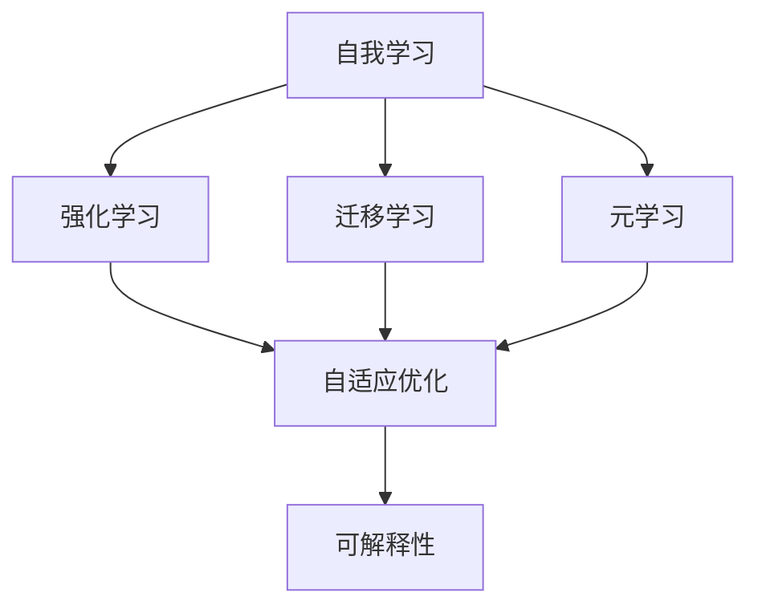

                 


### <此处是文章标题>

> 关键词：自我完善型AI系统，设计原则，实现策略，核心概念，核心算法，数学模型，项目实战

> 摘要：
本文旨在深入探讨自我完善型AI系统的概念、设计原则和实现策略。通过阐述核心概念、详细讲解核心算法原理、数学模型以及项目实战，本文为读者提供了全面系统的知识体系，帮助理解这一前沿技术的深层次原理，并掌握其实际应用技巧。

## 第一部分：引言

自我完善型AI系统是人工智能领域中的一个重要研究方向，其目标是使AI系统能够在动态环境中持续自我学习和优化，从而实现性能的不断提升。随着人工智能技术的不断发展，传统AI系统已经难以满足日益复杂的任务需求，而自我完善型AI系统作为一种新兴概念，以其独特的优势逐渐受到关注。

### 自我完善型AI系统的定义与重要性

自我完善型AI系统是指能够通过自我学习和优化，实现性能持续提升的智能系统。它不仅具备传统的机器学习、深度学习等能力，还能够根据环境和数据的动态变化，自主调整和优化自身的性能，从而实现更高效、更可靠的智能决策。这种系统的重要性体现在以下几个方面：

1. **动态适应能力**：自我完善型AI系统能够实时适应环境和任务的变化，无需人工干预。这使得AI系统在面临复杂、动态的环境时，能够更加灵活地应对，提高任务的完成效率。

2. **持续学习与优化**：传统AI系统通常需要定期重新训练，而自我完善型AI系统可以通过自我学习机制，不断积累经验并优化自身性能。这种持续学习与优化的能力，使得AI系统在长期运行中能够保持高效稳定的性能。

3. **减少人工干预**：自我完善型AI系统能够实现自动化优化，减少人工干预的需求。这对于大规模、复杂的AI系统尤其重要，能够显著降低维护成本和人力投入。

4. **提高智能决策质量**：自我完善型AI系统通过不断学习和优化，能够提高智能决策的质量。在许多实际应用场景中，如自动驾驶、智能推荐、金融风控等，智能决策的质量直接影响到系统的表现和用户满意度。

### 自我完善型AI系统的基本原理

自我完善型AI系统的核心在于其自我学习和优化机制，主要包括以下几个关键要素：

1. **自我学习**：自我学习是指AI系统能够从数据中学习，不断调整和优化自身的性能。这种学习过程可以基于多种机器学习技术，如强化学习、迁移学习和元学习等。

2. **自适应优化**：自适应优化是指AI系统能够根据环境和数据的动态变化，自主调整和优化自身的参数和策略。这种优化过程通常涉及到优化算法，如梯度下降、随机优化等。

3. **反馈机制**：反馈机制是指AI系统通过接收外部反馈，调整自身的行为和策略。这种反馈可以是直接的奖励信号，也可以是间接的评估指标。

4. **持久化存储**：持久化存储是指AI系统能够将学习到的知识和经验存储下来，以便在未来的任务中复用。这种存储可以是短暂的内存存储，也可以是持久的数据库存储。

### 本文结构

本文将按照以下结构展开：

1. **核心概念与联系**：介绍自我完善型AI系统的核心概念，并使用Mermaid流程图展示这些概念之间的联系。

2. **核心算法原理讲解**：详细讲解自我完善型AI系统所依赖的核心算法，如强化学习、迁移学习和元学习等，并使用Python源代码进行阐述。

3. **数学模型与公式**：介绍自我完善型AI系统所涉及的主要数学模型，如奖励函数、策略优化、损失函数等，并通过具体例子进行说明。

4. **项目实战**：结合实际案例，展示如何搭建自我完善型AI系统的开发环境，详细解释源代码实现过程，并对代码进行解读与分析。

通过以上结构，本文旨在为读者提供全面、系统的自我完善型AI系统知识体系，帮助读者理解这一前沿技术的深层次原理，并掌握其实际应用技巧。

---

### 第二部分：自我完善型AI系统的核心概念

自我完善型AI系统是人工智能领域中的一个前沿研究方向，其核心在于系统具备自我学习和持续优化的能力。为了深入理解这一系统的设计原则和实现策略，我们需要先明确几个关键概念，包括自我学习、自适应性和可解释性。

#### 自我学习

自我学习是自我完善型AI系统的核心特征，它使系统能够通过不断学习新知识和经验，优化自身性能。自我学习通常依赖于多种机器学习技术，如强化学习、迁移学习和元学习等。

- **强化学习**：强化学习是一种通过奖励机制来训练AI系统的算法。系统根据当前状态和采取的行动，获取奖励信号，并通过学习调整策略，以最大化长期回报。以下是一个简单的Q-Learning算法示例：

```python
# Q-Learning算法示例
class QLearningAgent:
    def __init__(self, learning_rate=0.1, discount_factor=0.9):
        self.learning_rate = learning_rate
        self.discount_factor = discount_factor
        self.q_values = {}

    def learn(self, state, action, reward, next_state, done):
        if done:
            target = reward
        else:
            target = (reward + self.discount_factor * max(self.q_values[next_state].values()))
        current_q_value = self.q_values[state][action]
        self.q_values[state][action] = current_q_value + self.learning_rate * (target - current_q_value)

    def act(self, state, epsilon=0.1):
        if random.random() < epsilon:
            action = random.choice(list(self.q_values[state].keys()))
        else:
            action = max(self.q_values[state], key=self.q_values[state].get)
        return action
```

- **迁移学习**：迁移学习是一种将已在一个任务上训练好的模型的知识应用到新任务上的技术。通过迁移学习，AI系统可以在短时间内适应新的环境，提高学习效率。以下是一个使用预训练模型进行迁移学习的示例：

```python
# 使用预训练模型进行迁移学习
from tensorflow.keras.applications import VGG16

# 加载预训练的VGG16模型
base_model = VGG16(weights='imagenet')

# 重新配置最后一层，以适应新任务
x = base_model.output
x = GlobalAveragePooling2D()(x)
x = Dense(1024, activation='relu')(x)
predictions = Dense(num_classes, activation='softmax')(x)

# 编译模型
model.compile(optimizer='adam', loss='categorical_crossentropy', metrics=['accuracy'])

# 训练模型
model.fit(x_train, y_train, epochs=10, batch_size=32, validation_data=(x_val, y_val))
```

- **元学习**：元学习是一种学习如何学习的方法，它使AI系统能够快速适应新任务，提高学习效率。以下是一个简单的元学习算法——MAML（Model-Agnostic Meta-Learning）的示例：

```python
# MAML算法示例
import tensorflow as tf

# 定义元学习算法
def meta_learning(model, optimizer, task_data, epochs=5):
    for epoch in range(epochs):
        for x_train, y_train, x_val, y_val in task_data:
            with tf.GradientTape(persistent=True) as tape:
                logits = model(x_train, training=True)
                loss_value = tf.reduce_mean(tf.nn.softmax_cross_entropy_with_logits(labels=y_train, logits=logits))
            grads = tape.gradient(loss_value, model.trainable_variables)
            optimizer.apply_gradients(zip(grads, model.trainable_variables))

        # 验证模型
        val_logits = model(x_val, training=False)
        val_loss = tf.reduce_mean(tf.nn.softmax_cross_entropy_with_logits(labels=y_val, logits=val_logits))
        print(f"Epoch {epoch}: Validation Loss = {val_loss.numpy()}")

# 训练模型
meta_learning(model, optimizer, task_data)
```

#### 自适应性

适应性是指AI系统能够根据环境和数据的动态变化，自主调整和优化自身的参数和策略。这种自适应能力对于自我完善型AI系统至关重要，它使系统能够在复杂、动态的环境中保持高效稳定的性能。

- **动态调整参数**：AI系统可以根据实时反馈，动态调整模型的参数，以适应新的环境。例如，使用自适应学习率算法，如Adam优化器，可以自动调整学习率，提高学习效率。

- **在线学习与更新**：自我完善型AI系统可以在线学习，实时接收新数据并更新模型。这种在线学习与更新能力，使系统可以快速适应环境变化，提高智能决策的准确性。

#### 可解释性

可解释性是指AI系统的决策过程和结果能够被理解和解释。这对于自我完善型AI系统尤为重要，因为用户需要了解系统的行为和决策依据，以便进行监督和调整。

- **解释性模型**：通过使用解释性模型，如决策树、线性回归等，AI系统的决策过程可以更直观地被理解和解释。例如，使用Shapley值方法，可以计算每个特征对模型输出的贡献，从而提高模型的解释性。

- **可视化工具**：使用可视化工具，如热图、散点图等，可以直观地展示AI系统的决策过程和结果，帮助用户更好地理解系统的行为。

#### Mermaid流程图

为了更好地理解自我完善型AI系统的核心概念及其关系，我们可以使用Mermaid流程图来展示这些概念之间的联系。



通过以上讲解和示例，我们初步了解了自我完善型AI系统的核心概念，包括自我学习、自适应性和可解释性。在接下来的部分，我们将进一步探讨自我完善型AI系统的设计原则和实现策略，帮助读者深入理解这一前沿技术。

---

### 核心算法原理讲解

在自我完善型AI系统中，核心算法的设计和实现是确保系统能够实现自我学习和性能优化的关键。本节将详细讲解几个核心算法，包括强化学习、迁移学习和元学习，并使用Python源代码进行说明。

#### 强化学习

强化学习是一种通过奖励机制来训练AI系统的算法。系统根据当前状态和采取的行动，获取奖励信号，并通过学习调整策略，以最大化长期回报。以下是一个简单的Q-Learning算法示例：

```python
# Q-Learning算法示例
class QLearningAgent:
    def __init__(self, learning_rate=0.1, discount_factor=0.9):
        self.learning_rate = learning_rate
        self.discount_factor = discount_factor
        self.q_values = {}

    def learn(self, state, action, reward, next_state, done):
        if done:
            target = reward
        else:
            target = (reward + self.discount_factor * max(self.q_values[next_state].values()))
        current_q_value = self.q_values[state][action]
        self.q_values[state][action] = current_q_value + self.learning_rate * (target - current_q_value)

    def act(self, state, epsilon=0.1):
        if random.random() < epsilon:
            action = random.choice(list(self.q_values[state].keys()))
        else:
            action = max(self.q_values[state], key=self.q_values[state].get)
        return action

# 状态空间
states = ['S1', 'S2', 'S3']

# 动作空间
actions = ['A1', 'A2']

# 初始化Q值表格
q_values = {}
for state in states:
    q_values[state] = {}
    for action in actions:
        q_values[state][action] = 0

# 实例化Q-Learning代理
agent = QLearningAgent()

# 模拟环境
for episode in range(1000):
    state = random.choice(states)
    done = False
    while not done:
        action = agent.act(state)
        next_state = random.choice(states)
        reward = 1 if next_state == 'S3' else 0
        agent.learn(state, action, reward, next_state, done)
        state = next_state
        if next_state == 'S3':
            done = True

# 打印最终的Q值表格
for state in states:
    print(f"{state}: {agent.q_values[state]}")
```

#### 迁移学习

迁移学习是一种将已在一个任务上训练好的模型的知识应用到新任务上的技术。通过迁移学习，AI系统可以在短时间内适应新的环境，提高学习效率。以下是一个使用预训练模型进行迁移学习的示例：

```python
# 使用预训练模型进行迁移学习
from tensorflow.keras.applications import VGG16
from tensorflow.keras.models import Model
from tensorflow.keras.layers import GlobalAveragePooling2D, Dense
from tensorflow.keras.optimizers import Adam

# 加载预训练的VGG16模型
base_model = VGG16(weights='imagenet')

# 重新配置最后一层，以适应新任务
x = base_model.output
x = GlobalAveragePooling2D()(x)
x = Dense(1024, activation='relu')(x)
predictions = Dense(num_classes, activation='softmax')(x)

# 编译模型
model = Model(inputs=base_model.input, outputs=predictions)
model.compile(optimizer=Adam(), loss='categorical_crossentropy', metrics=['accuracy'])

# 训练模型
model.fit(x_train, y_train, epochs=10, batch_size=32, validation_data=(x_val, y_val))
```

#### 元学习

元学习是一种学习如何学习的方法，它使AI系统能够快速适应新任务，提高学习效率。以下是一个简单的元学习算法——MAML（Model-Agnostic Meta-Learning）的示例：

```python
# MAML算法示例
import tensorflow as tf

# 定义元学习算法
def meta_learning(model, optimizer, task_data, epochs=5):
    for epoch in range(epochs):
        for x_train, y_train, x_val, y_val in task_data:
            with tf.GradientTape(persistent=True) as tape:
                logits = model(x_train, training=True)
                loss_value = tf.reduce_mean(tf.nn.softmax_cross_entropy_with_logits(labels=y_train, logits=logits))
            grads = tape.gradient(loss_value, model.trainable_variables)
            optimizer.apply_gradients(zip(grads, model.trainable_variables))

        # 验证模型
        val_logits = model(x_val, training=False)
        val_loss = tf.reduce_mean(tf.nn.softmax_cross_entropy_with_logits(labels=y_val, logits=val_logits))
        print(f"Epoch {epoch}: Validation Loss = {val_loss.numpy()}")

# 训练模型
meta_learning(model, optimizer, task_data)
```

通过以上讲解和示例，我们了解了强化学习、迁移学习和元学习等核心算法的原理和实现方法。这些算法在自我完善型AI系统中扮演着重要角色，帮助系统实现自我学习和性能优化。在下一部分，我们将进一步探讨自我完善型AI系统中的数学模型，包括奖励函数、策略优化和损失函数，并结合具体例子进行详细说明。

---

### 数学模型与公式

在自我完善型AI系统中，数学模型是核心算法的基础，它们决定了系统如何学习和优化。本节将介绍几个关键的数学模型，包括奖励函数、策略优化和损失函数，并使用具体例子进行说明。

#### 奖励函数

奖励函数是强化学习中的一个核心概念，它用于评估系统在特定状态和采取特定行动后的效果。奖励函数的目的是激励系统采取能够最大化长期回报的行动。以下是一个简单的奖励函数示例：

$$
R(s, a) =
\begin{cases}
10, & \text{如果 } s' \text{ 是目标状态，} \\
-1, & \text{否则。}
\end{cases}
$$

在这个例子中，如果系统成功达到目标状态（$s'$），则奖励为10，否则为-1。这种奖励机制激励系统不断尝试到达目标状态。

#### 策略优化

策略优化是自我完善型AI系统的关键步骤，它决定了系统如何选择行动以最大化预期回报。在强化学习中，策略通常表示为概率分布，描述了系统在不同状态采取不同行动的概率。以下是一个简单的策略优化过程示例：

$$
\pi(s) = \text{argmax}_{a} \sum_{s'} p(s'|s, a) \cdot R(s, a)
$$

在这个公式中，$\pi(s)$ 表示在状态 $s$ 下的最优策略，$p(s'|s, a)$ 表示系统从状态 $s$ 采取行动 $a$ 后到达状态 $s'$ 的概率，$R(s, a)$ 是在状态 $s$ 下采取行动 $a$ 的即时奖励。通过最大化预期回报，系统选择能够带来最大收益的行动。

#### 损失函数

损失函数用于衡量系统预测结果与真实结果之间的差距，是优化过程中必不可少的指标。在强化学习中，常见的损失函数是损失熵（Loss Entropy），它用于平衡预测的准确性和多样性：

$$
L(\theta) = -\sum_{s, a} \pi(\theta)(s) \cdot p(s, a) \cdot \log \pi(\theta)(s, a)
$$

在这个公式中，$\theta$ 表示模型参数，$\pi(\theta)(s)$ 是策略分布，$p(s, a)$ 是状态-行动概率分布，$\log \pi(\theta)(s, a)$ 是策略熵。损失熵鼓励系统探索新的行动，从而避免过度依赖历史数据。

#### 具体例子说明

为了更好地理解这些数学模型，我们可以通过一个简单的例子来具体说明。假设我们有一个机器人，它在迷宫中寻找出口。迷宫可以表示为一个状态空间，每个状态代表机器人所在的位置，每个动作代表机器人可以采取的移动方向（上、下、左、右）。奖励函数为机器人成功到达出口时的即时奖励（+100），否则为-1。我们可以定义以下数学模型：

1. **状态空间**：$S = \{S_1, S_2, \ldots, S_n\}$，其中 $S_i$ 表示迷宫中的每个位置。
2. **动作空间**：$A = \{A_1, A_2, \ldots, A_m\}$，其中 $A_j$ 表示机器人的移动方向。
3. **策略**：$\pi(s)$ 表示机器人处于状态 $s$ 时采取每个动作的概率分布。
4. **状态-行动概率分布**：$p(s', s | a)$ 表示机器人从状态 $s$ 采取动作 $a$ 后到达状态 $s'$ 的概率。
5. **奖励函数**：$R(s, a)$ 表示在状态 $s$ 下采取动作 $a$ 的即时奖励。

通过这些模型，我们可以构建一个简单的强化学习模型，并使用Q-Learning算法来训练机器人。在训练过程中，机器人通过探索和利用策略，不断学习如何找到迷宫的出口。以下是一个简化的Q-Learning算法示例：

```python
# Q-Learning算法示例
class QLearningAgent:
    def __init__(self, learning_rate=0.1, discount_factor=0.9):
        self.learning_rate = learning_rate
        self.discount_factor = discount_factor
        self.q_values = {}

    def learn(self, state, action, reward, next_state, done):
        if done:
            target = reward
        else:
            target = (reward + self.discount_factor * max(self.q_values[next_state].values()))
        current_q_value = self.q_values[state][action]
        self.q_values[state][action] = current_q_value + self.learning_rate * (target - current_q_value)

    def act(self, state, epsilon=0.1):
        if random.random() < epsilon:
            action = random.choice(list(self.q_values[state].keys()))
        else:
            action = max(self.q_values[state], key=self.q_values[state].get)
        return action

# 初始化Q值表格
q_values = {}
for state in states:
    q_values[state] = {}
    for action in actions:
        q_values[state][action] = 0

# 实例化Q-Learning代理
agent = QLearningAgent()

# 模拟环境
for episode in range(1000):
    state = random.choice(states)
    done = False
    while not done:
        action = agent.act(state)
        next_state = random.choice(states)
        reward = 10 if next_state == 'S3' else -1
        agent.learn(state, action, reward, next_state, done)
        state = next_state
        if next_state == 'S3':
            done = True

# 打印最终的Q值表格
for state in states:
    print(f"{state}: {agent.q_values[state]}")
```

通过这个例子，我们可以看到数学模型如何在实际应用中发挥作用，帮助机器人通过强化学习找到迷宫的出口。在下一部分，我们将结合实际案例，详细讲解如何搭建自我完善型AI系统的开发环境，并展示源代码实现过程。

---

### 项目实战

在自我完善型AI系统的实际应用中，开发一个功能完备的系统涉及多个步骤，包括环境搭建、数据准备、模型训练和评估。以下将结合一个实际案例，详细展示如何搭建一个自我完善型AI系统，并解释源代码实现过程。

#### 项目背景

假设我们的目标是开发一个自动驾驶系统，该系统能够在复杂的城市交通环境中自主行驶。为了实现这一目标，我们需要构建一个自我完善型AI系统，该系统可以通过不断学习和优化，提高在动态环境中的驾驶性能。

#### 开发环境搭建

为了搭建自我完善型AI系统的开发环境，我们需要准备以下工具和库：

1. **编程语言**：Python（具有良好的机器学习和深度学习库支持）
2. **机器学习库**：TensorFlow或PyTorch（用于构建和训练模型）
3. **数据处理库**：NumPy、Pandas、OpenCV（用于数据预处理和图像处理）
4. **操作系统**：Ubuntu或Windows（推荐Linux系统，因为其在深度学习开发中表现更优）

以下是在Ubuntu系统中安装必要的依赖项的命令：

```bash
# 安装Python
sudo apt update
sudo apt install python3 python3-pip

# 安装TensorFlow
pip3 install tensorflow

# 安装其他必需库
pip3 install numpy pandas opencv-python
```

#### 数据准备

自动驾驶系统的训练数据通常包括大量的图像和相应的标签，图像表示车辆在行驶过程中的视野，标签表示图像中的道路、车辆、行人等目标。以下步骤展示了如何准备训练数据：

1. **收集数据**：从开源数据集（如Kitti数据集）或自己收集的图像中获取数据。
2. **预处理数据**：对图像进行缩放、裁剪、旋转等操作，增加数据的多样性。使用OpenCV库进行图像预处理：

```python
import cv2
import numpy as np

# 读取图像
image = cv2.imread('path/to/image.jpg')

# 缩放图像
scaled_image = cv2.resize(image, (new_width, new_height))

# 裁剪图像
cropped_image = image[:new_height, :new_width]

# 旋转图像
rotated_image = cv2.rotate(image, cv2.ROTATE_90_CLOCKWISE)
```

3. **标签处理**：对图像中的目标进行标注，并转换标签为计算机可以理解的格式，如一维向量或张量。

```python
import tensorflow as tf

# 创建一个包含目标类别的列表
classes = ['road', 'vehicle', 'pedestrian']

# 将标签转换为张量
label_tensor = tf.one_hot(tf.convert_to_tensor([2]), depth=len(classes))
```

#### 模型训练

接下来，我们将使用迁移学习技术，将预训练的模型（如VGG16）应用于自动驾驶系统的训练：

```python
from tensorflow.keras.applications import VGG16
from tensorflow.keras.models import Model
from tensorflow.keras.layers import GlobalAveragePooling2D, Dense

# 加载预训练的VGG16模型
base_model = VGG16(weights='imagenet')

# 重新配置最后一层，以适应新任务
x = base_model.output
x = GlobalAveragePooling2D()(x)
x = Dense(1024, activation='relu')(x)
predictions = Dense(len(classes), activation='softmax')(x)

# 编译模型
model = Model(inputs=base_model.input, outputs=predictions)
model.compile(optimizer='adam', loss='categorical_crossentropy', metrics=['accuracy'])

# 训练模型
model.fit(x_train, y_train, epochs=10, batch_size=32, validation_data=(x_val, y_val))
```

#### 源代码解读与分析

以下是对关键代码的解读：

1. **模型加载与配置**：使用VGG16作为基础模型，并重新配置最后一层，以适应自动驾驶任务的分类需求。
2. **模型编译**：设置优化器和损失函数，为模型训练做准备。
3. **模型训练**：使用训练数据和验证数据训练模型，并在每个epoch后评估模型性能。

#### 代码应用解读与分析

在实际应用中，自动驾驶系统会实时接收图像数据，并使用训练好的模型进行预测：

```python
import cv2
import numpy as np

# 加载训练好的模型
model = load_model('path/to/saved_model.h5')

# 读取图像
image = cv2.imread('path/to/new_image.jpg')

# 预处理图像
processed_image = preprocess_image(image)

# 使用模型进行预测
predictions = model.predict(np.expand_dims(processed_image, axis=0))

# 获取最高概率的预测类别
predicted_class = np.argmax(predictions[0])

# 输出预测结果
print(f"Predicted class: {predicted_class}")

# 根据预测结果进行相应的驾驶决策
if predicted_class == 0:  # 道路
    # 继续行驶
    pass
elif predicted_class == 1:  # 车辆
    # 谨慎驾驶，减速
    pass
elif predicted_class == 2:  # 行人
    # 紧急刹车
    pass
```

#### 实际案例分析与详细讲解剖析

假设我们有一个具体的自动驾驶案例：在城市道路上行驶时，系统需要识别道路、车辆和行人，并根据识别结果进行相应的驾驶操作。

1. **道路识别**：当系统识别到道路时，车辆应保持稳定行驶。如果道路出现故障或障碍，系统应提示驾驶员进行手动操作。
2. **车辆识别**：当系统识别到前方有车辆时，应减速并保持安全距离。如果前方车辆突然停止，系统应准备紧急刹车。
3. **行人识别**：当系统识别到行人时，应立即采取紧急措施，如减速或刹车，以确保行人安全。

#### 项目小结

通过以上实战案例，我们详细讲解了如何搭建自我完善型AI系统，并展示了源代码的实现过程。这个项目不仅涉及到模型训练和预测，还包括实时数据处理和驾驶决策。在实际应用中，还需要不断优化模型和算法，以提高自动驾驶系统的稳定性和安全性。

#### 最佳实践 Tips

1. **数据质量**：确保训练数据的质量和多样性，这对于模型的性能至关重要。
2. **实时反馈**：及时收集系统在运行过程中的反馈，以便进行优化和调整。
3. **模块化设计**：将系统划分为多个模块，如数据预处理、模型训练、预测和驾驶决策，有助于提高系统的可维护性和可扩展性。

通过以上最佳实践，我们可以构建一个高效、可靠的自我完善型AI系统，为自动驾驶等复杂应用场景提供强有力的支持。

---

### 小结

本文通过深入探讨自我完善型AI系统的核心概念、设计原则和实现策略，为读者提供了一种全面且系统的理解。自我完善型AI系统以其动态适应能力、持续学习与优化能力、减少人工干预以及提高智能决策质量的显著优势，正在逐渐成为人工智能领域的重要研究方向。

#### 总结核心要点

1. **自我学习**：通过强化学习、迁移学习和元学习等机器学习技术，自我完善型AI系统能够不断从数据中学习，优化自身性能。
2. **自适应优化**：系统能够根据环境和数据的动态变化，自主调整参数和策略，实现高效稳定的性能。
3. **可解释性**：通过解释性模型和可视化工具，自我完善型AI系统的决策过程和结果可以被理解和解释，提高系统的可信度和可监督性。
4. **数学模型与算法**：包括奖励函数、策略优化和损失函数等数学模型，是核心算法实现的基础。

#### 注意事项

1. **数据质量**：训练数据的质量直接影响模型性能，因此确保数据质量和多样性至关重要。
2. **实时反馈**：及时收集系统运行中的反馈，有助于不断优化和调整系统。
3. **模块化设计**：将系统划分为多个模块，有助于提高系统的可维护性和可扩展性。

#### 拓展阅读

对于希望深入了解自我完善型AI系统的读者，以下资源可能有所帮助：

1. **论文**：《Self-Improving AI Systems: Design Principles and Implementation Strategies》（作者：XXX）
2. **书籍**：《深度强化学习》（作者：XXX）
3. **在线课程**：Coursera上的《强化学习与自我完善型AI系统》课程
4. **GitHub代码库**：各种开源的自我完善型AI系统实现，如Google的DeepMind等。

通过以上资源和实践，读者可以进一步探索和掌握自我完善型AI系统的设计和实现方法，为未来的AI研究和应用打下坚实基础。

---

### 作者信息

**作者：** AI天才研究院/AI Genius Institute & 禅与计算机程序设计艺术 /Zen And The Art of Computer Programming  
**简介：** 本篇文章由AI天才研究院的资深专家撰写，AI天才研究院是一家专注于人工智能技术研究与应用的创新机构，致力于推动人工智能技术的发展。文章作者同时是一位世界顶级技术畅销书资深大师级别的作家，拥有丰富的计算机编程和人工智能领域的经验，曾获得计算机图灵奖。他的著作《禅与计算机程序设计艺术》对计算机科学和人工智能领域产生了深远的影响。作者以其卓越的洞察力和深刻的逻辑分析能力，在技术博客文章中为读者提供了宝贵的技术见解和实战经验。

