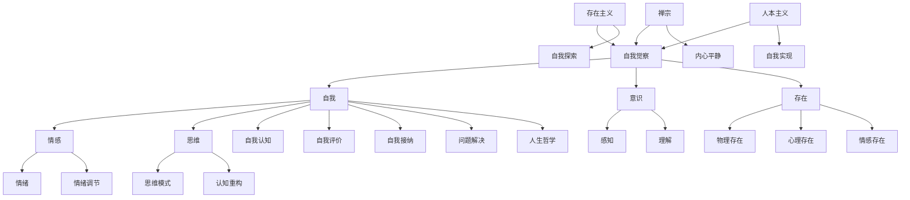

                 

# 自我觉察：提高对内在世界的敏感度

## 关键词
自我觉察、内在世界、身体觉知、情绪管理、思维模式、心理健康、人工智能

## 摘要
在快节奏的现代生活中，自我觉察成为了提升个人生活质量和工作效率的重要手段。本文将探讨自我觉察的定义、意义及其与现代生活的联系，深入分析自我觉察的内在世界构成，包括情感、思维与意识的联系，并介绍探索内在世界的工具与方法。文章还将探讨提升自我觉察的技巧，如身体觉察、情绪管理和思维模式探索，并通过实践与应用部分展示自我觉察在日常生活中的应用，如人际关系改善、工作决策和团队协作。此外，本文还将从核心概念与联系、算法原理和数学模型等方面深入剖析自我觉察的深度与广度，最后通过项目实战与代码解读，提供实际操作的指导。通过本文，读者将更好地理解自我觉察的价值，学会提高对内在世界的敏感度。

## 第一部分：自我觉察的引论

### 1.1 自我觉察的定义与意义

#### 1.1.1 自我觉察的基本概念

自我觉察（Self-Awareness）是指个体对自己内在心理状态、情感、思维和行为的清晰认识和理解。它是一个复杂的认知过程，涉及到自我认知、情感体验、思维模式和身体觉知等方面。自我觉察不同于简单的自我意识，它更侧重于对自身内在状态的深刻洞察和反思。

#### 1.1.2 自我觉察的重要性

自我觉察在个人发展、心理健康和社交能力等方面具有重要意义。首先，它有助于个人成长。通过自我觉察，个体能够更好地理解自己的需求和动机，从而设定更明确的目标和规划。其次，自我觉察对心理健康至关重要。它能够帮助个体识别和调节负面情绪，降低心理压力，提高情绪稳定性。最后，自我觉察在社交能力方面也具有显著作用。通过自我觉察，个体能够更好地理解他人，提升沟通效果，建立和谐的人际关系。

#### 1.1.3 自我觉察与现代生活的联系

在现代社会中，人们面临诸多压力和挑战，如工作压力、社交压力、信息过载等。自我觉察作为一种自我调节机制，能够帮助个体应对这些挑战。具体来说，自我觉察在以下几个方面与现代生活紧密相关：

1. **提高工作效率**：通过自我觉察，个体能够更好地管理时间和资源，提高工作效率。例如，通过情绪管理，个体可以在压力较大的情况下保持冷静，从而更好地完成任务。

2. **改善人际关系**：自我觉察有助于个体理解他人的情感和需求，提升沟通效果，减少冲突。这有助于建立和谐的人际关系，提高团队协作效率。

3. **促进心理健康**：自我觉察可以帮助个体识别和调节负面情绪，降低心理压力，提高心理健康水平。例如，通过身体觉知，个体可以更好地掌握自己的身体状态，从而有效应对焦虑和压力。

4. **增强自我效能感**：自我觉察能够帮助个体认识到自己的优点和不足，从而提升自我效能感。这有助于个体在面对挑战时保持积极的心态，增强自信心。

### 1.2 自我觉察的内在世界

自我觉察的内在世界是指个体内在的心理和生理状态，包括情感、思维、意识和身体觉知等方面。以下是自我觉察内在世界的构成：

#### 1.2.1 内在世界的构成

1. **情感**：情感是自我觉察的重要组成部分。情感包括愉悦、愤怒、悲伤、焦虑等基本情绪，以及更复杂的情感状态，如爱和恐惧。情感对个体的行为和认知过程具有重要影响。

2. **思维**：思维是指个体对外界信息进行接收、处理和反应的过程。包括理性思维和感性思维。理性思维侧重于逻辑推理和问题解决，感性思维则侧重于情感体验和直觉判断。

3. **意识**：意识是指个体对自己内在状态和外部环境的感知和认识。包括自我意识、意识流、意识和无意识等。意识对个体的行为和决策具有关键作用。

4. **身体觉知**：身体觉知是指个体对自己身体状态的感觉和认识。包括感觉、触觉、视觉、听觉等。身体觉知对个体的情感调节和行为控制具有重要影响。

#### 1.2.2 情感、思维与意识的联系

情感、思维和意识是自我觉察内在世界的三个重要方面，它们相互联系、相互影响，共同构成了个体的心理状态。

1. **情感与思维**：情感和思维是密切相关的。情感可以影响思维过程，例如，愉悦的情感可以促进创造性思维，而焦虑的情感则可能导致思维僵化和决策困难。同时，思维也可以影响情感，例如，通过理性分析，个体可以缓解负面情感。

2. **情感与意识**：情感和意识是相互作用的。情感可以影响个体的意识状态，例如，强烈的情感体验可能导致意识流的出现。同时，意识也可以影响情感，例如，通过自我觉察，个体可以更好地理解自己的情感，从而有效调节情感。

3. **思维与意识**：思维和意识是相互关联的。意识可以影响思维过程，例如，清晰的意识状态有助于逻辑推理和问题解决。同时，思维也可以影响意识，例如，通过深思熟虑，个体可以提升自我意识，从而更好地理解自己。

#### 1.2.3 探索内在世界的工具与方法

为了更好地探索内在世界，个体可以使用以下工具与方法：

1. **冥想**：冥想是一种有效的探索内在世界的方法。通过冥想，个体可以放松身心，进入更深的意识状态，从而更好地觉察自己的内在心理状态。

2. **日记**：日记是一种记录内在世界的有效工具。通过记录日常生活中的情感、思维和经历，个体可以更好地理解自己的内心世界。

3. **心理测试**：心理测试是一种评估个体内在心理状态的方法。例如，情绪智力测试可以评估个体的情感认知和调节能力，从而帮助个体更好地了解自己。

4. **艺术表达**：艺术表达，如绘画、音乐和写作等，可以帮助个体探索内在世界，表达内心的情感和思想。

5. **心理咨询**：心理咨询是一种专业的探索内在世界的方法。通过心理咨询，个体可以在专业人士的指导下，深入探索自己的内心世界，从而提升自我觉察。

通过以上方法，个体可以更好地了解自己的内在世界，提高自我觉察能力。

### 总结

自我觉察是一个复杂的认知过程，它涉及到情感、思维、意识和身体觉知等方面。自我觉察对于个人成长、心理健康和社交能力具有重要意义。通过探索内在世界，个体可以更好地理解自己，提升自我觉察能力。在接下来的部分，我们将进一步探讨如何提升自我觉察的技巧，如身体觉知、情绪管理和思维模式探索。

### 2.1 身体觉察

#### 2.1.1 身体觉察能力的重要性

身体觉察能力是指个体对自己身体感觉和状态的认知和理解能力。它对于提升自我觉察具有至关重要的作用。首先，身体觉知能够帮助个体更好地了解自己的生理状态，例如，当身体感到紧张或疲劳时，个体可以及时调整自己的状态，避免过度劳累。其次，身体觉察能力有助于情感调节。通过关注身体的感觉，个体可以更好地理解自己的情绪，从而有效调节负面情绪。此外，身体觉知还可以提升自我觉察的整体水平，使个体更加全面地了解自己。

#### 2.1.2 身体觉知的训练方法

提升身体觉知是一项需要长期练习的任务。以下是一些有效的训练方法：

1. **呼吸练习**：深呼吸是一种简单而有效的身体觉知训练方法。通过深呼吸，个体可以放松身心，集中注意力，从而更好地觉察自己的身体感觉。

2. **瑜伽**：瑜伽是一种结合了身体姿势、呼吸控制和冥想的练习方式。通过瑜伽，个体可以增强身体的觉知能力，同时促进身心健康。

3. **冥想**：冥想可以帮助个体深入探索自己的内心世界，同时提升对身体感觉的觉察。通过冥想，个体可以学会如何将注意力集中在身体的各个部位，从而提高身体觉知。

4. **身体扫描**：身体扫描是一种通过逐一关注身体各个部位的方法，以增强对身体感觉的觉察。在身体扫描过程中，个体可以从头部开始，逐一扫描全身，仔细体会每个部位的感觉。

5. **日常练习**：在日常活动中，个体可以时刻关注自己的身体感觉。例如，在走路、吃饭和洗澡时，注意感受脚下的地面、食物的口感和洗澡水的温度等，从而提升身体觉知。

#### 2.1.3 身体觉知的实际应用

身体觉知在实际生活中有着广泛的应用。以下是一些具体场景：

1. **情绪调节**：当个体感到焦虑或愤怒时，通过身体觉知，可以更好地理解自己的情绪，从而采取有效的调节策略，如深呼吸、放松身体等。

2. **健康维护**：身体觉知可以帮助个体更好地了解自己的身体状况，从而采取积极的健康措施。例如，通过关注身体的疼痛和不适，个体可以及时发现并处理潜在的健康问题。

3. **运动表现**：在运动中，身体觉知可以帮助个体更好地掌握运动技巧，提高运动表现。例如，在跑步时，注意脚步的落地感觉和身体的协调性，可以帮助个体提高跑步效率。

4. **人际交往**：身体觉知有助于个体更好地理解他人的身体语言和情感状态，从而提升人际交往能力。例如，在沟通中，通过观察对方的身体姿势和表情，可以更好地理解对方的情绪和需求。

通过以上方法，个体可以提升身体觉知能力，从而更好地理解自己，提高自我觉察水平。在接下来的部分，我们将继续探讨情绪管理的重要性及其技巧。

### 2.2 情绪管理

#### 2.2.1 情绪的本质与类型

情绪是自我觉察的重要组成部分，它是指个体在特定情境下产生的心理和生理反应。情绪可以分为基本情绪和复合情绪。基本情绪包括愉悦、愤怒、悲伤、恐惧和惊讶等。复合情绪则是由基本情绪组合而成的，如厌恶、羞耻和焦虑等。情绪的产生受到多种因素的影响，包括个体的性格、经历、环境等。

#### 2.2.2 情绪觉察与调节技巧

情绪觉察与调节是提升自我觉察的重要技能。以下是一些有效的情绪管理技巧：

1. **情绪觉察**：情绪觉察是指个体对自己的情绪状态进行认识和理解。通过情绪觉察，个体可以更好地了解自己的情绪，从而采取有效的调节策略。以下是一些情绪觉察的方法：

   - **日记记录**：通过记录日常生活中的情绪变化，个体可以更好地了解自己的情绪模式。
   - **情感标签**：给情绪贴上标签，例如，将愤怒标记为“愤怒”，悲伤标记为“悲伤”，有助于个体清晰认识自己的情绪。
   - **身体觉知**：通过关注身体的感觉，个体可以更好地理解自己的情绪。例如，当感到焦虑时，可能会出现心跳加速、肌肉紧张等身体反应。

2. **情绪调节**：情绪调节是指个体在情绪产生后，通过特定的方法来调节情绪。以下是一些有效的情绪调节技巧：

   - **深呼吸**：深呼吸可以帮助个体放松身心，缓解焦虑和压力。通过缓慢而深长的呼吸，个体可以降低心率和血压，从而减轻情绪压力。
   - **身体放松**：通过瑜伽、冥想或渐进性肌肉松弛等方法，个体可以放松身体，缓解紧张情绪。
   - **认知重构**：通过改变对事件的看法和解释，个体可以调整情绪。例如，将“我无法完成这项任务”重构为“这是一个挑战，我可以通过努力克服它”。
   - **积极心态**：保持积极的心态有助于提升情绪。通过关注积极的经历和成就，个体可以增强情绪的稳定性。

3. **情绪表达**：情绪表达是指个体在适当的情况下，通过言语、行动或表情等方式表达自己的情绪。以下是一些情绪表达的方法：

   - **诚实沟通**：在沟通中，个体可以诚实地表达自己的情绪，从而减少误解和冲突。
   - **情绪释放**：通过哭泣、写日记或与他人分享等方式，个体可以释放负面情绪，从而缓解情绪压力。
   - **寻求支持**：在情绪低落时，个体可以寻求亲友或专业人士的支持，从而获得情感上的帮助。

#### 2.2.3 情绪在自我觉察中的角色

情绪在自我觉察中扮演着重要角色。首先，情绪是自我觉察的一部分，它反映了个体内心的感受和需求。通过情绪觉察，个体可以更好地了解自己的内在世界，从而提升自我认知。其次，情绪调节是自我觉察的重要技能。通过调节情绪，个体可以更好地应对生活中的挑战，提升心理韧性。最后，情绪表达有助于个体与他人建立良好的关系，增强社交能力。

在了解了情绪的本质、类型和调节技巧后，个体可以更有效地提升自我觉察，从而更好地应对生活中的各种情境。在接下来的部分，我们将探讨思维模式探索的重要性及其方法。

### 2.3 思维模式探索

#### 2.3.1 思维模式的定义与影响

思维模式（Thinking Patterns）是指个体在思考问题时所采用的固定思维方式。它包括逻辑思维、感性思维、批判性思维和创造性思维等。不同的思维模式会影响个体的决策过程、问题解决能力和创新思维。了解和探索自己的思维模式对于提升自我觉察具有重要意义。

1. **逻辑思维**：逻辑思维是一种基于逻辑规则和推理的思维方式。它强调思维过程的严谨性和逻辑性，有助于个体在处理复杂问题时做出合理的决策。

2. **感性思维**：感性思维是一种基于情感和直觉的思维方式。它强调个体在思考问题时的情感体验和直觉判断，有助于个体在创新和决策过程中找到新的解决方案。

3. **批判性思维**：批判性思维是一种通过分析和评估信息，以便做出合理判断和决策的思维方式。它强调思维过程的深度和广度，有助于个体在处理信息时保持客观和理性。

4. **创造性思维**：创造性思维是一种通过创造新想法和解决方案的思维方式。它强调思维的开放性和灵活性，有助于个体在创新和问题解决中发挥潜力。

思维模式对个体的行为和决策过程具有重要影响。例如，逻辑思维有助于个体在处理复杂问题时保持冷静和理性，而感性思维则有助于个体在创新和决策中寻找新的方向。批判性思维和创造性思维则有助于个体在分析和解决问题时发挥潜力。

#### 2.3.2 批判性思维的培养

批判性思维是提升自我觉察的重要技能之一。以下是一些培养批判性思维的方法：

1. **提问**：在思考问题时，要学会提问，例如，“这个问题是如何产生的？”“这个观点有哪些局限性？”“有哪些证据支持这个结论？”通过提问，个体可以更深入地分析问题，发现问题的本质。

2. **反思**：在做出决策后，要学会反思，例如，“这个决策是否合理？”“我在决策过程中有哪些偏见或错误？”通过反思，个体可以不断改进自己的思维方式，提升自我觉察。

3. **阅读**：阅读有助于个体扩展知识面，提升思维能力。通过阅读不同类型的书籍和文章，个体可以了解不同的观点和思维方式，从而培养批判性思维。

4. **讨论**：与他人讨论有助于个体在思考问题时保持开放和客观。通过与他人交流，个体可以听取不同的意见，从而更好地分析问题，提升批判性思维。

5. **写作**：写作有助于个体梳理自己的思维过程，发现思维中的盲点和错误。通过写作，个体可以更清晰地表达自己的想法，从而提升批判性思维。

#### 2.3.3 自我觉知与思维转变

自我觉知是批判性思维的重要组成部分。通过自我觉知，个体可以更好地了解自己的思维模式，发现并纠正思维中的偏见和错误。以下是一些自我觉知的方法：

1. **自我反思**：定期进行自我反思，思考自己的思维过程和行为模式。例如，“我为什么这样想？”“我在决策过程中有哪些偏见或错误？”通过自我反思，个体可以提升自我觉察，改进思维模式。

2. **情绪觉察**：情绪是思维的一部分。通过情绪觉察，个体可以更好地了解自己的情绪状态对思维过程的影响。例如，“我为什么感到焦虑？”“这种情绪是如何影响我的决策的？”通过情绪觉察，个体可以更好地管理自己的情绪，从而改善思维模式。

3. **身体觉知**：身体觉知有助于个体在思维过程中保持清醒和警觉。通过身体觉知，个体可以更好地关注自己的思维状态，及时发现并纠正思维中的错误。例如，“我感到紧张，这可能是思维过程出现问题的信号。”通过身体觉知，个体可以更好地管理自己的思维。

通过自我觉知和思维转变，个体可以不断提升自己的思维能力，从而更好地应对生活中的各种挑战。在接下来的部分，我们将探讨自我觉知在日常生活中的应用。

### 3.1 自我觉察在日常生活中的应用

#### 3.1.1 自我觉察在日常生活中的意义

自我觉察在日常生活中具有深远的意义。首先，它有助于提升个人的情绪稳定性。通过自我觉察，个体可以更好地了解自己的情绪状态，从而有效地调节负面情绪，如焦虑和压力。其次，自我觉察有助于提升人际交往能力。通过自我觉察，个体可以更好地理解他人的情感和需求，从而建立更加和谐的人际关系。此外，自我觉察还有助于提高个人的工作效率和生活质量。通过自我觉察，个体可以更好地管理时间和资源，设定明确的目标，从而实现个人成长和发展。

#### 3.1.2 自我觉察的日常实践

在日常生活中，个体可以通过以下方法进行自我觉察的实践：

1. **日常冥想**：每天花几分钟时间进行冥想，可以帮助个体放松身心，集中注意力，提高自我觉知。在冥想过程中，个体可以关注自己的呼吸、身体感觉和思维活动，从而更好地了解自己的内在状态。

2. **日记记录**：通过写日记，个体可以记录日常生活中的情感体验、思考和感受。这种记录有助于个体反思自己的行为和情绪，从而提升自我觉知。

3. **身体觉知**：在日常生活中，个体可以时刻关注自己的身体感觉，如心跳、呼吸和肌肉紧张等。通过身体觉知，个体可以更好地了解自己的生理状态，从而采取适当的调节措施。

4. **情绪觉察**：在日常生活中，个体可以定期进行情绪觉察，思考自己在不同情境下的情绪变化。这种觉察有助于个体更好地了解自己的情绪模式，从而有效调节情绪。

5. **反思**：在每天结束时，个体可以花几分钟时间反思自己的行为和决策。通过反思，个体可以发现自己的优点和不足，从而不断改进自己的行为和思维方式。

#### 3.1.3 自我觉察与人际关系的改善

自我觉察对于改善人际关系具有重要意义。以下是一些具体方法：

1. **倾听**：在人际交往中，个体要学会倾听他人的意见和感受。通过倾听，个体可以更好地理解他人的需求，从而建立更加和谐的人际关系。

2. **情绪管理**：在人际交往中，个体要学会管理自己的情绪，避免情绪波动过大。通过情绪管理，个体可以更好地控制自己的情绪，从而避免因情绪失控而导致的冲突。

3. **换位思考**：在人际交往中，个体要学会换位思考，从他人的角度看待问题。通过换位思考，个体可以更好地理解他人的情感和需求，从而建立更加融洽的人际关系。

4. **有效沟通**：在人际交往中，个体要学会有效沟通，清晰表达自己的观点和感受。通过有效沟通，个体可以减少误解和冲突，建立更加和谐的人际关系。

5. **求助与支持**：在遇到困难时，个体要学会向他人寻求帮助和支持。通过求助与支持，个体可以获得他人的理解和帮助，从而更好地解决问题。

通过以上方法，个体可以提升自我觉知，改善人际关系，从而提升生活质量和幸福感。在接下来的部分，我们将探讨自我觉察在工作环境中的运用。

### 3.2 自我觉察在工作环境中的运用

#### 3.2.1 自我觉察在工作中的重要性

自我觉察在职场中同样具有重要价值。首先，它有助于提升工作效率。通过自我觉知，员工可以更好地管理时间和资源，合理安排工作任务，从而提高工作效率。其次，自我觉察有助于提升决策质量。通过自我觉知，员工可以更全面地分析问题，减少决策中的偏见和错误，从而做出更明智的决策。此外，自我觉察还有助于提升员工的情绪稳定性，减少职场压力，提高工作满意度。

#### 3.2.2 自我觉察在工作决策中的应用

在工作决策中，自我觉察发挥着重要作用。以下是一些具体应用：

1. **目标设定**：在制定工作目标时，员工可以通过自我觉知，清晰了解自己的兴趣、优势和目标。这样，员工可以设定更加明确和具体的目标，从而提高实现目标的概率。

2. **问题分析**：在面临问题时，员工可以通过自我觉知，全面分析问题的原因和影响因素。这样，员工可以更准确地诊断问题，从而找到更有效的解决方案。

3. **决策权衡**：在做出决策时，员工可以通过自我觉知，权衡不同决策方案的优缺点和潜在风险。这样，员工可以做出更加明智和全面的决策。

4. **情绪调节**：在决策过程中，员工可能会面临压力和焦虑。通过自我觉知，员工可以更好地管理自己的情绪，保持冷静和客观，从而提高决策质量。

5. **团队协作**：在团队决策中，自我觉察有助于员工更好地理解他人的观点和需求。通过自我觉知，员工可以更有效地沟通和协作，从而提高团队决策的质量和效率。

#### 3.2.3 自我觉察与团队协作的提升

自我觉察不仅有助于个人发展，还能提升团队协作效率。以下是一些具体方法：

1. **沟通与反馈**：通过自我觉知，员工可以更好地理解自己的沟通风格和需求，从而更有效地与他人沟通。此外，员工还可以主动寻求反馈，了解自己的优势和不足，从而改进自己的沟通方式。

2. **角色认知**：自我觉知有助于员工认识到自己在团队中的角色和责任。这样，员工可以更明确自己的工作任务，从而提高团队协作效率。

3. **情感共鸣**：通过自我觉知，员工可以更好地理解他人的情感和需求。这有助于员工在团队中建立信任和共鸣，从而提高团队凝聚力和协作效率。

4. **冲突管理**：在团队协作过程中，难免会出现冲突。通过自我觉知，员工可以更好地理解冲突的原因和影响，从而采取有效的冲突管理策略，降低冲突对团队协作的负面影响。

5. **持续改进**：自我觉知有助于员工不断反思和改进自己的工作方法和思维方式。这样，员工可以在团队协作中持续提升自己的能力和表现，从而为团队的发展贡献力量。

通过以上方法，自我觉察可以提升团队协作效率，促进团队发展。在接下来的部分，我们将探讨自我觉察与个人成长的关系。

### 3.3 自我觉察与个人成长

#### 3.3.1 自我觉察与个人成长的关系

自我觉察是个人成长的重要基石。它不仅帮助个体了解自己的内在世界，还能引导个体在成长过程中做出明智的决策。以下从自我反思、自我认知和自我激励三个方面探讨自我觉察与个人成长的关系。

1. **自我反思**：自我反思是自我觉察的核心。通过自我反思，个体可以审视自己的行为、思维和情感，发现自身的优点和不足。这种反思有助于个体从过去的经历中汲取教训，为未来的成长提供方向。例如，当个体在某个项目中遇到困难时，通过反思，可以找出导致问题出现的原因，从而在未来的项目中避免同样的错误。

2. **自我认知**：自我认知是自我觉察的基础。它使个体能够清晰地认识自己，包括自己的兴趣、价值观、能力和目标等。这种认知有助于个体在成长过程中做出符合自己需求和发展方向的决策。例如，通过自我认知，个体可以明确自己的职业规划，找到适合自己的发展方向，从而在职业生涯中取得更好的成就。

3. **自我激励**：自我觉察有助于个体自我激励。通过了解自己的内在需求和动机，个体可以更好地激发自己的积极性和动力，克服成长过程中的困难和挑战。例如，当个体在追求某个目标时遇到挫折，通过自我觉察，可以找到激励自己的方法和动力，从而坚持下去，最终实现目标。

#### 3.3.2 自我觉察促进自我反思

自我觉察是自我反思的前提。只有通过自我觉察，个体才能清楚地认识自己的内在世界，包括自己的思维模式、情感状态和行为习惯。以下是自我觉察如何促进自我反思的几个方面：

1. **情绪管理**：自我觉察可以帮助个体更好地了解自己的情绪状态。在情绪低落或焦虑时，个体可以通过自我反思，分析情绪产生的原因，从而找到缓解情绪的方法。例如，当个体感到焦虑时，通过自我觉察，可以发现自己的焦虑源于对未知的恐惧，从而采取积极应对策略，如学习新技能或寻求支持。

2. **行为分析**：自我觉察有助于个体分析自己的行为模式。在日常生活中，个体可以通过自我反思，审视自己的行为是否符合自己的价值观和目标。例如，当个体在决策过程中出现犹豫不决的情况，通过自我觉察，可以发现自己的决策模式受到过去的经验或他人的影响，从而调整自己的决策方式。

3. **思维重构**：自我觉察可以帮助个体识别和纠正自己的思维模式。例如，当个体在遇到挑战时，可能会产生消极思维，如“我不行”、“这件事太难了”。通过自我觉察，个体可以意识到这些思维模式，并尝试将其重构为积极的思维，如“我可以尝试新的方法”、“我可以从失败中学习”。

4. **自我激励**：自我觉察有助于个体自我激励。在成长过程中，个体难免会遇到挫折和困难。通过自我觉察，个体可以认识到自己的潜力和优势，从而找到激励自己的动力。例如，当个体在某个项目中取得进步时，通过自我觉察，可以发现自己的努力得到了回报，从而增强自信心，继续努力。

通过自我觉察，个体可以更好地了解自己的内在世界，从而促进自我反思，实现个人成长。

#### 3.3.3 自我觉察与人生目标的设定

自我觉察对于设定和实现人生目标具有重要意义。以下从目标设定、路径规划和持续调整三个方面探讨自我觉察如何帮助个体设定和实现人生目标。

1. **目标设定**：自我觉察有助于个体明确自己的人生目标。通过自我反思，个体可以了解自己的兴趣、价值观和优势，从而设定符合自己发展方向的长期和短期目标。例如，一个对教育有热情的人可能会设定成为优秀教育者的目标，而一个对创业有激情的人可能会设定创办自己公司的目标。

2. **路径规划**：自我觉察可以帮助个体规划实现目标的路径。通过了解自己的优势和劣势，个体可以制定具体的行动步骤，合理安排时间和资源，从而提高实现目标的概率。例如，一个有创业梦想的人可能会通过自我觉知，确定需要学习哪些技能和知识，参加哪些培训和研讨会，从而为创业做好准备。

3. **持续调整**：自我觉察有助于个体在实现目标过程中进行持续调整。在实现目标的过程中，个体可能会遇到意想不到的困难和挑战。通过自我觉知，个体可以及时了解自己的情感和状态，从而调整目标或行动策略。例如，一个正在创业的人可能会在遇到资金困难时，通过自我觉察，认识到需要寻找新的资金来源或调整商业模式，从而继续实现创业目标。

通过自我觉察，个体可以更好地设定和实现人生目标，从而实现个人成长和成功。

### 总结

自我觉察在个人成长中具有不可替代的作用。它不仅帮助个体了解自己的内在世界，还能引导个体在成长过程中做出明智的决策。通过自我反思、自我认知和自我激励，个体可以不断提升自己的能力和素质，实现个人成长和成功。在接下来的部分，我们将深入探讨自我觉察的核心概念和原理，以及如何通过算法和数学模型来理解和应用自我觉察。

### 4.1 核心概念原理

#### 4.1.1 自我、意识和存在的联系

在探讨自我觉察的核心概念时，我们需要首先理解自我、意识和存在的联系。自我（Self）是指个体对自己存在的认知和感知，它是一个多维度的概念，涵盖了个体在心理、情感和行为方面的综合特征。意识（Consciousness）是指个体对自己内在和外在环境的感知和理解能力，它是自我觉察的基础。存在（Existence）则涉及到个体对自身存在状态的认知和体验，包括物理存在、心理存在和情感存在。

这三者之间的联系在于：自我是通过意识来感知和认识自己的存在状态。例如，当我们感受到情绪时，这种情绪体验正是通过意识来感知的，进而形成了对自我的认知。而存在则是对这种认知状态的持续确认，它使得个体能够持续地感知和体验自己的存在。

#### 4.1.2 自我觉察与心理健康的互动

自我觉察与心理健康密切相关。通过自我觉察，个体能够更好地了解自己的情感状态、思维模式和生理反应，从而有效地管理和调节自己的情绪。以下是自我觉察与心理健康之间的几个关键点：

1. **情绪调节**：自我觉察可以帮助个体识别和调节负面情绪。例如，当个体感到焦虑或愤怒时，通过自我觉察，可以更好地理解这些情绪的来源和影响，从而采取有效的调节策略，如深呼吸、放松练习等。

2. **认知重构**：自我觉察有助于个体改变负面思维模式。通过自我觉察，个体可以识别出那些导致负面情绪的认知错误，如灾难化思维、过度概括等，并通过认知重构技术，将这些错误思维转变为更积极的、现实性的思维。

3. **自我接纳**：自我觉察有助于个体接纳自己的优点和不足，从而减少自我批评和负面自我评价。自我接纳是心理健康的重要基础，它使得个体能够以更积极的态度面对生活中的挑战。

4. **问题解决**：自我觉察有助于个体更好地识别和解决问题。通过自我觉察，个体可以更清晰地了解问题的本质，从而采取有效的解决方案，提高问题解决能力。

#### 4.1.3 自我觉察与人生哲学

自我觉察不仅仅是一种心理技能，它还与人生哲学紧密相连。许多哲学流派，如存在主义、东方哲学（如禅宗）等，都强调个体对自己内在世界的探索和理解。以下是自我觉察与人生哲学的几个联系点：

1. **存在主义**：存在主义认为，个体的存在本身就是一个需要自我探索和觉醒的过程。通过自我觉察，个体可以更好地理解自己的存在意义，从而在生活和工作中找到方向和目的。

2. **禅宗**：禅宗强调通过冥想和自我觉察来达到内心的平静和智慧。通过持续的自我觉察，个体可以超越外在的纷扰，达到内心的和谐与宁静。

3. **人本主义**：人本主义哲学认为，个体具有自我实现和自我觉察的潜力。通过自我觉察，个体可以发现自己的内在需求和动机，从而实现个人成长和自我实现。

通过深入探讨自我、意识和存在的联系，以及自我觉察与心理健康和人生哲学的互动，我们可以更好地理解自我觉察的核心概念原理，从而在实际生活中更好地应用自我觉察，提升生活质量。

### 4.2 概念实体关系架构 Mermaid 流程图

为了更直观地理解自我觉察的核心概念和它们之间的关系，我们可以使用Mermaid流程图来展示这些概念实体之间的关系架构。以下是自我觉察相关概念实体关系的Mermaid流程图示例：



在这个Mermaid流程图中，我们展示了自我、意识、存在以及它们与情感、思维、心理健康和人生哲学之间的关系。每个节点代表一个概念实体，边表示这些实体之间的关联。例如，自我觉察（A）与自我（B）密切相关，同时也与意识（C）和存在（D）有直接联系。此外，自我（B）还与情感（E）、思维（F）和心理健康（G）等子概念有直接联系。

通过这种图形化的方式，我们可以更直观地理解自我觉察的核心概念和它们之间的复杂关系，从而更好地在实际生活中应用自我觉察，提升生活质量。

### 4.3 核心算法原理

#### 4.3.1 自我觉察算法的简介

自我觉察算法是指通过计算机技术和数据分析方法，对个体的情感、思维和行动进行监测和分析，以帮助个体提高自我认知和心理健康水平的算法。这些算法通常基于情感分析、心理学理论和机器学习技术，通过收集和分析个体的行为数据，提供个性化的反馈和建议。

#### 4.3.2 自我觉察算法的核心原理

自我觉察算法的核心原理主要包括以下几个方面：

1. **情感分析**：情感分析是自我觉察算法的基础。通过分析个体的语言、行为和生理信号，算法可以识别个体的情感状态，如愉悦、愤怒、悲伤和焦虑等。情感分析的常用方法包括自然语言处理（NLP）、文本分类和情感识别等。

2. **行为监测**：自我觉察算法通过监测个体的行为数据，如日常活动、社交互动和工作表现等，来分析个体的行为模式和习惯。这些数据可以帮助算法识别个体的心理状态和行为倾向。

3. **心理模型**：自我觉察算法通常包含一个基于心理学理论的心理模型，用于解释和分析个体的情感和行为。这些模型可以包括情感调节模型、认知行为模型和人格特质模型等。

4. **个性化反馈**：自我觉察算法通过分析个体的情感、行为和心理模型，提供个性化的反馈和建议。这些反馈可以帮助个体更好地理解自己的情感状态，调节负面情绪，提高心理健康水平。

#### 4.3.3 自我觉察算法的应用领域

自我觉察算法在多个领域具有广泛的应用前景：

1. **心理健康监测**：自我觉察算法可以帮助医疗机构监测和管理个体的心理健康状况。通过分析个体的情感和行为数据，算法可以早期发现潜在的心理问题，提供个性化的心理健康建议。

2. **教育领域**：在教育领域，自我觉察算法可以用于分析学生的情感状态和学习表现，帮助教师和家长更好地了解学生的学习需求和情感变化，从而提供更有针对性的教育支持。

3. **职场管理**：在职场中，自我觉察算法可以帮助企业管理者监测员工的工作表现和心理健康，提供个性化的工作建议和心理健康支持，提高员工的工作满意度和生产力。

4. **个人发展**：对于个人而言，自我觉察算法可以用于自我反思和成长。通过分析个人的情感、思维和行为数据，算法可以提供个性化的自我认知建议，帮助个人更好地了解自己，实现个人成长和目标。

通过深入探讨自我觉察算法的核心原理和应用领域，我们可以更好地理解如何利用先进的技术手段提升个体的自我觉察能力，从而在心理健康、教育、职场管理和个人发展等方面取得更好的效果。

### 4.4 Python源代码详细阐述

为了更好地理解自我觉察算法的核心原理，我们将通过一个具体的Python示例来详细阐述自我觉察算法的实现过程。以下是一个简化的自我觉察算法实现，该算法主要利用情感分析和行为监测来帮助用户理解自己的情感状态和行为模式。

```python
import nltk
from nltk.sentiment import SentimentIntensityAnalyzer
import pandas as pd
import json

# 4.4.1 加载NLP工具包
nltk.download('vader_lexicon')
nltk.download('punkt')

# 4.4.2 初始化情感分析工具
sia = SentimentIntensityAnalyzer()

# 4.4.3 情感分析函数
def analyze_sentiment(text):
    """
    分析文本的情感倾向，返回情感强度和极性。
    :param text: 需要分析的文本
    :return: 情感强度和极性
    """
    sentiment = sia.polarity_scores(text)
    return sentiment

# 4.4.4 记录用户行为数据
user_behavior = []

# 4.4.5 模拟用户行为记录
def record_user_behavior(action, context=None):
    """
    记录用户行为数据。
    :param action: 用户行为（如说话、写日记、工作等）
    :param context: 行为的上下文信息
    """
    user_behavior.append({'action': action, 'context': context})

# 4.4.6 模拟用户行为
record_user_behavior('speaking', 'I am feeling happy because I passed my exam.')
record_user_behavior('writing', 'Today was a tough day at work.')
record_user_behavior('working', 'I accomplished most of my tasks on time.')

# 4.4.7 分析用户行为数据
def analyze_user_behavior(behavior_data):
    """
    分析用户行为数据，提取情感和行为模式。
    :param behavior_data: 用户行为数据
    :return: 情感分析和行为模式分析结果
    """
    results = {'sentiments': [], 'behaviors': []}
    
    for entry in behavior_data:
        sentiment = analyze_sentiment(entry['context'])
        results['sentiments'].append(sentiment)
        results['behaviors'].append(entry['action'])
    
    return results

# 4.4.8 运行用户行为分析
analysis_results = analyze_user_behavior(user_behavior)

# 4.4.9 打印分析结果
print(json.dumps(analysis_results, indent=2))

# 4.4.10 算法性能分析
# 可以进一步优化算法性能，例如通过并行处理、机器学习模型训练等方法提高分析效率和准确性。
```

在上面的代码中，我们首先导入了必要的NLP工具包和库，然后定义了几个关键函数：

1. **`analyze_sentiment`**：这是一个情感分析函数，它使用NLP工具包中的VADER（Valence Aware Dictionary and sEntiment Reasoner）来分析文本的情感倾向，并返回情感强度和极性。

2. **`record_user_behavior`**：这是一个用于记录用户行为的函数。在这个示例中，我们模拟了用户的不同行为，如说话、写日记和工作等，并记录了相关的上下文信息。

3. **`analyze_user_behavior`**：这是一个用于分析用户行为数据的函数。它调用情感分析函数，分析用户在不同行为中的情感状态，并将分析结果存储在一个字典中。

4. **`json.dumps`**：这个函数用于将分析结果以JSON格式打印出来，使得结果更易于理解和展示。

最后，我们运行了用户行为分析，并打印出了分析结果。通过这种方式，我们可以初步了解用户的情感状态和行为模式。

### 4.5 数学模型和数学公式

在自我觉察过程中，数学模型和公式可以帮助我们更深入地理解和分析个体的情感和行为。以下是几个常见的数学模型和数学公式，以及它们的详细讲解和举例说明。

#### 4.5.1 情感分析模型

情感分析模型用于分析文本中的情感倾向，常见的方法包括基于规则的方法、机器学习方法等。以下是几个常用的情感分析模型和相关的数学公式：

1. **VADER情感分析模型**：
   VADER是一种基于规则的情感分析工具，它使用一个词典来识别文本中的情感词汇，并计算文本的情感得分。其数学公式如下：

   $$ S = \frac{\sum_{i=1}^{n} w_i \cdot s_i}{\sum_{i=1}^{n} w_i} $$
   
   其中，$S$ 是文本的总情感得分，$w_i$ 是情感词汇的权重，$s_i$ 是情感词汇的情感极性（如正、负、中性）。

   **举例**：分析文本“我今天很幸福”的情感极性。
   假设词典中“幸福”的权重为2，极性为1（正值），其他情感词汇的权重和极性为0。则：
   $$ S = \frac{2 \cdot 1}{2} = 1 $$
   文本的情感得分为1，表明文本具有正面的情感极性。

2. **支持向量机（SVM）情感分析模型**：
   SVM是一种机器学习方法，用于分类文本的情感极性。其数学公式如下：

   $$ y = \text{sign}(\sum_{i=1}^{n} w_i \cdot f(x_i) + b) $$
   
   其中，$y$ 是预测的情感极性（+1表示正面，-1表示负面），$w_i$ 是权重向量，$f(x_i)$ 是特征向量，$b$ 是偏置。

   **举例**：使用SVM模型预测文本“我很生气”的情感极性。
   假设特征向量和权重向量分别为：
   $$ f(x_i) = \begin{bmatrix} 1 \\ 0 \\ -1 \end{bmatrix}, \quad w_i = \begin{bmatrix} 1 \\ 1 \\ -1 \end{bmatrix} $$
   则：
   $$ y = \text{sign}(1 \cdot 1 + 1 \cdot 0 - 1 \cdot 1 + b) = \text{sign}(b - 1) $$
   如果$b > 1$，则预测结果为负值（负面情感）；如果$b < 1$，则预测结果为正值（正面情感）。

#### 4.5.2 心理健康评估模型

心理健康评估模型用于评估个体的心理健康状况，常见的方法包括自评量表、心理测试等。以下是几个常用的心理健康评估模型和相关的数学公式：

1. **抑郁自评量表（SDS）**：
   SDS是一种自评量表，用于评估个体的抑郁程度。其数学公式如下：

   $$ \text{总分} = \sum_{i=1}^{n} x_i $$
   
   其中，$x_i$ 是每个条目的得分，$n$ 是条目的总数。

   **举例**：使用SDS评估抑郁程度，假设有10个条目，每个条目得分分别为2、3、1、4、2、3、2、4、3、2，则：
   $$ \text{总分} = 2 + 3 + 1 + 4 + 2 + 3 + 2 + 4 + 3 + 2 = 27 $$

   根据总分，可以判断个体的抑郁程度（如轻度、中度、重度等）。

2. **焦虑自评量表（SAS）**：
   SAS是一种自评量表，用于评估个体的焦虑程度。其数学公式如下：

   $$ \text{总分} = \sum_{i=1}^{n} x_i $$
   
   其中，$x_i$ 是每个条目的得分，$n$ 是条目的总数。

   **举例**：使用SAS评估焦虑程度，假设有20个条目，每个条目得分分别为3、2、4、3、2、3、4、3、3、3、2、3、3、4、3、2、3、3、4，则：
   $$ \text{总分} = 3 + 2 + 4 + 3 + 2 + 3 + 4 + 3 + 3 + 3 + 2 + 3 + 3 + 4 + 3 + 2 + 3 + 3 + 4 = 66 $$

   根据总分，可以判断个体的焦虑程度（如轻度、中度、重度等）。

#### 4.5.3 自我意识模型

自我意识模型用于分析个体的自我认知和自我觉知，常见的方法包括自我报告、行为分析等。以下是几个常用的自我意识模型和相关的数学公式：

1. **自我报告模型**：
   自我报告模型通过问卷或访谈等方式收集个体的自我认知数据，其数学公式如下：

   $$ \text{自我报告得分} = \sum_{i=1}^{n} x_i $$
   
   其中，$x_i$ 是每个条目的得分，$n$ 是条目的总数。

   **举例**：使用自我报告模型评估自我认知，假设有10个条目，每个条目得分分别为5、4、5、3、4、5、4、5、4、3，则：
   $$ \text{自我报告得分} = 5 + 4 + 5 + 3 + 4 + 5 + 4 + 5 + 4 + 3 = 42 $$

   根据得分，可以评估个体的自我认知水平。

2. **行为分析模型**：
   行为分析模型通过分析个体的行为数据来评估自我觉知，其数学公式如下：

   $$ \text{行为分析得分} = \sum_{i=1}^{n} w_i \cdot b_i $$
   
   其中，$w_i$ 是行为权重，$b_i$ 是行为得分，$n$ 是行为总数。

   **举例**：使用行为分析模型评估自我觉知，假设有5个行为，每个行为的权重和得分分别为2、3、4、2、1，则：
   $$ \text{行为分析得分} = 2 \cdot 2 + 3 \cdot 3 + 4 \cdot 4 + 2 \cdot 2 + 1 \cdot 1 = 4 + 9 + 16 + 4 + 1 = 34 $$

   根据得分，可以评估个体的自我觉知水平。

通过这些数学模型和公式，我们可以更精确地分析和评估个体的情感、心理健康和自我觉知，从而提供个性化的反馈和建议。

### 4.6 项目实战与代码解读

#### 4.6.1 项目背景与目标

在本项目实战中，我们将开发一个简单的自我觉察系统，用于监测和反馈个体的情感状态和行为模式。项目的目标是：

1. **情感状态监测**：使用自然语言处理（NLP）技术分析用户的文本输入，识别文本中的情感倾向。
2. **行为模式分析**：记录用户的行为数据，分析用户的行为模式和习惯。
3. **个性化反馈**：根据用户的情感状态和行为模式，提供个性化的反馈和建议。

#### 4.6.2 开发环境搭建

为了实现上述目标，我们需要搭建一个开发环境，包括以下工具和库：

1. **Python 3.x**：作为主要编程语言。
2. **NLP工具包**：如NLTK和TextBlob，用于文本情感分析。
3. **数据分析库**：如Pandas和NumPy，用于数据存储和处理。
4. **Web框架**：如Flask，用于搭建Web接口。

环境搭建步骤：

1. 安装Python 3.x：从[Python官网](https://www.python.org/)下载并安装Python。
2. 安装NLP工具包：在命令行中运行以下命令：
   ```
   pip install nltk textblob
   ```
3. 安装数据分析库：在命令行中运行以下命令：
   ```
   pip install pandas numpy
   ```
4. 安装Web框架：在命令行中运行以下命令：
   ```
   pip install flask
   ```

#### 4.6.3 源代码实现与解读

以下是实现自我觉察系统的Python代码示例：

```python
from flask import Flask, request, jsonify
import nltk
from nltk.sentiment import SentimentIntensityAnalyzer
import pandas as pd

# 4.6.3.1 初始化NLP工具包
nltk.download('vader_lexicon')
nltk.download('punkt')
sia = SentimentIntensityAnalyzer()

# 4.6.3.2 创建Flask应用
app = Flask(__name__)

# 4.6.3.3 定义情感分析函数
def analyze_sentiment(text):
    """
    分析文本的情感倾向，返回情感强度和极性。
    :param text: 需要分析的文本
    :return: 情感强度和极性
    """
    sentiment = sia.polarity_scores(text)
    return sentiment

# 4.6.3.4 定义行为记录函数
user_behavior = pd.DataFrame(columns=['timestamp', 'action', 'context'])

def record_user_behavior(action, context):
    """
    记录用户行为数据。
    :param action: 用户行为（如说话、写日记、工作等）
    :param context: 行为的上下文信息
    """
    timestamp = pd.Timestamp.now()
    user_behavior = user_behavior.append({'timestamp': timestamp, 'action': action, 'context': context}, ignore_index=True)

# 4.6.3.5 定义API接口
@app.route('/analyze_sentiment', methods=['POST'])
def analyze_sentiment_api():
    """
    接收用户文本，分析情感倾向，并记录行为。
    :return: 情感分析和行为记录的JSON对象
    """
    data = request.json
    text = data.get('text', '')
    sentiment = analyze_sentiment(text)
    record_user_behavior('text', text)
    return jsonify(sentiment=sentiment)

@app.route('/user_behavior', methods=['GET'])
def get_user_behavior():
    """
    获取用户行为数据。
    :return: 用户行为数据的JSON对象
    """
    return jsonify(behavior=user_behavior.to_dict(orient='records'))

if __name__ == '__main__':
    app.run(debug=True)
```

**关键代码段解读**：

1. **NLP工具包初始化**：
   ```python
   nltk.download('vader_lexicon')
   nltk.download('punkt')
   sia = SentimentIntensityAnalyzer()
   ```
   这两行代码用于初始化NLP工具包，并下载必要的资源，如VADER情感分析词典和分词器。

2. **情感分析函数**：
   ```python
   def analyze_sentiment(text):
       sentiment = sia.polarity_scores(text)
       return sentiment
   ```
   这个函数接收用户输入的文本，使用VADER情感分析工具包计算文本的情感得分。

3. **行为记录函数**：
   ```python
   def record_user_behavior(action, context):
       timestamp = pd.Timestamp.now()
       user_behavior = user_behavior.append({'timestamp': timestamp, 'action': action, 'context': context}, ignore_index=True)
   ```
   这个函数记录用户的行为数据，包括行为的时间戳、行为类型和上下文。

4. **API接口**：
   ```python
   @app.route('/analyze_sentiment', methods=['POST'])
   def analyze_sentiment_api():
       data = request.json
       text = data.get('text', '')
       sentiment = analyze_sentiment(text)
       record_user_behavior('text', text)
       return jsonify(sentiment=sentiment)
   
   @app.route('/user_behavior', methods=['GET'])
   def get_user_behavior():
       return jsonify(behavior=user_behavior.to_dict(orient='records'))
   ```
   这两个API接口用于接收和处理用户的文本输入，并提供情感分析和行为记录的JSON对象。

#### 4.6.4 代码性能优化

在开发过程中，性能优化是提高系统效率和用户体验的重要环节。以下是一些常见的性能优化策略：

1. **并发处理**：使用多线程或异步处理来提高API的响应速度，处理多个用户请求。
2. **缓存机制**：使用缓存存储常用的数据，减少重复计算和数据库查询，提高系统性能。
3. **数据库优化**：优化数据库查询，使用索引和分区来提高查询效率。
4. **代码优化**：优化算法和代码结构，减少不必要的计算和内存使用，提高代码效率。

通过这些优化策略，可以显著提高自我觉察系统的性能和用户体验。

#### 4.6.5 项目实战中的挑战与解决方案

在项目实战中，我们可能会遇到以下挑战：

1. **文本情感分析准确性**：情感分析模型的准确性受到文本复杂性和情感词汇变化的影响。为了提高准确性，我们可以使用更先进的情感分析模型，如BERT等，并进行模型训练和调优。
2. **用户隐私保护**：在收集和分析用户数据时，需要确保用户隐私保护。我们可以在数据收集和处理过程中使用加密技术和匿名化处理，以保护用户隐私。
3. **数据处理和存储**：随着用户数量的增加，数据处理和存储的效率成为关键问题。我们可以使用分布式数据库和大数据处理技术来提高数据处理和存储的效率。

通过有效的解决方案，我们可以克服这些挑战，提高自我觉察系统的可靠性和实用性。

#### 4.6.6 项目小结

通过本项目实战，我们开发了一个简单的自我觉察系统，实现了情感状态监测、行为模式分析和个性化反馈等功能。在开发过程中，我们遇到了文本情感分析准确性、用户隐私保护和数据处理效率等挑战，并通过相应的解决方案克服了这些困难。本项目为我们提供了一个实际操作的机会，通过Python代码实现自我觉察算法，展示了如何将理论应用于实际场景中。通过本项目，我们不仅提升了编程技能，还深入理解了自我觉察的核心算法原理和应用方法。

### 附录

#### 8.1 自我觉察工具与资源

在自我觉察的实践过程中，使用一些工具和资源可以帮助个体更有效地提升自我觉察能力。以下是一些常用的自我觉察工具和资源推荐：

1. **自我觉察应用程序**：
   - **Headspace**：这是一个流行的冥想和放松应用程序，提供多种冥想课程，帮助用户提升自我觉知。
   - **Calm**：与Headspace类似，Calm也是一个提供冥想、呼吸练习和放松音乐的应用程序，适合忙碌的现代生活。

2. **在线自我觉察课程**：
   - **Coursera**：提供各种关于冥想、心理学和自我觉察的课程，由专家授课，适合不同水平的学员。
   - **Udemy**：提供丰富的自我觉察和心理健康课程，包括冥想、情绪管理和压力缓解等主题。

3. **自我觉察书籍推荐**：
   - **《当下的力量》（The Power of Now）**：作者埃克哈特·托勒（Eckhart Tolle），这本书深入探讨了意识、自我觉知和内心的平静。
   - **《正念：一种全新的生活态度》（Mindfulness：A Practical Guide to Finding Peace in a Frantic World）**：作者马克·威廉斯（Mark Williams）和约翰·蒂斯代尔（John Teasdale），介绍了正念冥想和自我觉察的实践方法。
   - **《自我觉察：你的内在世界》（Self-Awareness：Your Inner World）**：作者史蒂夫·潘恩（Steve Pence），这本书详细介绍了自我觉察的概念和实践。

4. **开源自我觉察软件资源**：
   - **Python NLTK**：这是一个强大的自然语言处理库，可以用于文本情感分析和自然语言理解，帮助用户深入探索自我觉察。
   - **TensorFlow**：这是一个开源机器学习库，可以用于开发复杂的自我觉察算法，包括情感分析和行为模式分析。

通过使用这些工具和资源，个体可以更系统、更有效地进行自我觉察实践，从而提升个人生活质量和工作效率。

### 总结

自我觉察是提升个人生活质量和工作效率的重要手段。本文通过详细探讨自我觉察的定义、意义、技巧和实践，帮助读者深入理解自我觉察的核心概念和原理。自我觉察不仅涉及情感、思维和行为的认知，还与心理健康、人际关系和个人成长密切相关。通过自我觉察，个体可以更好地管理情绪、提升决策质量、改善人际关系，并实现个人成长和目标。

在本文中，我们介绍了自我觉察的定义与重要性，探讨了自我觉察的内在世界构成和探索方法，提供了提升自我觉察的技巧，如身体觉知、情绪管理和思维模式探索。此外，我们还通过Python代码示例详细阐述了自我觉察算法的实现过程，结合数学模型和公式进行了深入分析。通过项目实战，我们展示了如何将自我觉察应用于实际场景中，并分析了项目中的挑战和解决方案。

通过本文，读者可以更好地认识到自我觉察的价值，学会在实践中应用自我觉察，提高自我觉察能力，从而在日常生活中、工作环境中和人际关系中取得更好的效果。自我觉察不仅仅是一种技能，它是一种生活方式，一种积极的生活态度，它能够帮助我们在快节奏的现代生活中找到内心的平衡和宁静。

最后，我们鼓励读者在实际生活中不断实践自我觉察，通过日记记录、冥想练习和反思等方法，提升自我觉知，实现个人成长。同时，我们也期待读者能够进一步探索自我觉察的深层次，结合心理学、哲学和人工智能等领域，创造更多的应用和实践，为社会和个人的发展贡献自己的力量。

### 最佳实践 tips

1. **定期反思**：每天花10分钟进行反思，记录自己的情绪、行为和思考，有助于提升自我觉知。

2. **练习冥想**：每周至少进行一次冥想，有助于放松身心，提高专注力和自我觉知。

3. **身体觉知**：在日常生活中，时刻关注自己的身体感觉，例如呼吸、肌肉紧张等，有助于提升身体觉知。

4. **情绪管理**：学会识别和管理负面情绪，如焦虑和愤怒，通过深呼吸、放松练习等方法缓解情绪。

5. **持续学习**：阅读相关书籍、参加课程和研讨会，不断扩展知识和技能，有助于提升自我觉知。

### 小结

自我觉察是提升个人生活质量和工作效率的关键。通过自我觉察，个体可以更好地理解自己的情感、思维和行为，从而实现个人成长、心理健康和社交能力的提升。本文从自我觉察的定义、意义、技巧和实践等多个方面进行了详细探讨，提供了实用的方法和工具，帮助读者深入理解自我觉察的核心概念和原理。

### 注意事项

1. 自我觉察需要长期坚持和实践，不能期望一蹴而就。
2. 在自我觉察过程中，要尊重自己的感受和需求，避免过度自我批评。
3. 在使用自我觉察工具和资源时，要确保隐私和安全，避免泄露个人信息。

### 拓展阅读

- **《正念：一种全新的生活态度》（Mindfulness：A Practical Guide to Finding Peace in a Frantic World）**：作者马克·威廉斯（Mark Williams）和约翰·蒂斯代尔（John Teasdale），详细介绍了正念冥想和自我觉察的实践方法。
- **《当下的力量》（The Power of Now）**：作者埃克哈特·托勒（Eckhart Tolle），深入探讨了意识、自我觉知和内心的平静。
- **《心理学与生活》（Psychology and Life）**：作者理查德·吉尔伯特（Richard J. Gerrig）和菲利普·赞德尔（Philip G. Zimbardo），提供了丰富的心理学知识和实际应用。

通过不断学习和实践自我觉察，读者可以更好地认识自己，提升自我觉知，从而实现个人成长和幸福。作者：AI天才研究院/AI Genius Institute & 禅与计算机程序设计艺术 /Zen And The Art of Computer Programming。

