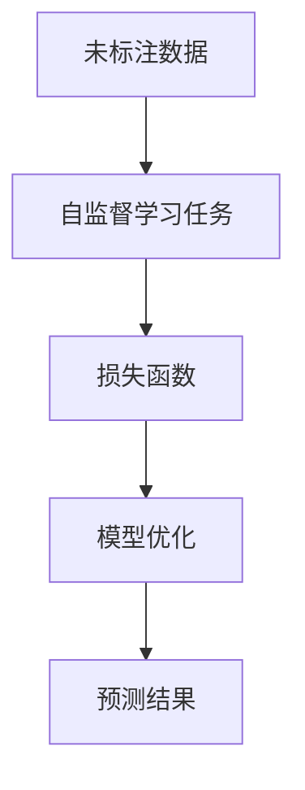

                 

### 引言与背景

在人工智能领域，随着深度学习技术的迅猛发展，模型预训练成为提升模型性能的重要手段。然而，传统的预训练方法往往依赖于大量的标注数据，这不仅成本高昂，而且难以获取。自监督学习作为一种无需依赖标注数据的预训练方法，通过利用未标注的数据进行学习，提供了全新的解决方案。在推理模型预训练中，自监督学习的应用为提高模型性能、降低预训练成本、扩展模型应用范围提供了强有力的支持。

### 第1章：自监督学习的概述

#### 1.1 自监督学习的定义与优势

自监督学习是一种利用未标注数据（即没有标签的数据）进行学习的方法。与传统的监督学习相比，自监督学习通过设计一种机制，使得模型在未标注的数据中能够自主地发现有用的信息，从而提高模型的泛化能力和表现。

自监督学习的优势主要体现在以下几个方面：

1. **无需大量标注数据**：自监督学习无需依赖大量的标注数据，这极大地降低了数据获取和标注的成本。
2. **提高模型泛化能力**：通过在未标注数据中学习，模型能够更加全面地理解数据分布，从而提升模型的泛化能力。
3. **扩展模型应用范围**：由于自监督学习不依赖于特定领域的标注数据，因此可以应用于更多不同的领域，拓宽了模型的应用范围。

#### 1.2 自监督学习的发展历程

自监督学习的发展可以追溯到20世纪60年代的感知机模型。随后，随着深度学习技术的发展，自监督学习逐渐成为人工智能研究的热点。近年来，随着大数据和计算能力的提升，自监督学习取得了显著的进展，特别是在图像、语音和自然语言处理等领域。

#### 1.3 自监督学习在AI领域的应用现状

当前，自监督学习已经在多个AI领域得到了广泛应用，包括：

1. **计算机视觉**：自监督学习被广泛应用于图像分类、目标检测和图像分割等任务。
2. **自然语言处理**：自监督学习在语言模型、机器翻译和文本分类等任务中取得了显著成果。
3. **语音识别**：自监督学习在语音识别中用于提高模型对语音数据的理解和处理能力。

随着研究的不断深入，自监督学习在AI领域的应用前景将更加广阔。

### 第2章：自监督学习的核心概念与联系

#### 1.1 核心概念

自监督学习的核心概念包括：

1. **未标注数据**：指未经过标注的数据，即没有标签的数据。
2. **自监督学习任务**：指通过未标注数据自动生成的任务，如预测任务、分类任务等。
3. **损失函数**：用于衡量模型预测结果与真实值之间的差距，驱动模型优化。

#### 1.2 概念实体关系架构 Mermaid 流程图



在这个流程图中，未标注数据通过自监督学习任务转化为损失函数，进而驱动模型优化，最终得到预测结果。

### 第3章：自监督学习的算法基础

#### 3.1 自监督学习的数学模型与公式

自监督学习的数学模型主要包括以下几个部分：

1. **数据表示**：使用向量表示未标注数据。
2. **模型表示**：使用神经网络模型表示自监督学习任务。
3. **损失函数**：通常采用均方误差（MSE）或交叉熵损失函数。

公式表示如下：

$$
\min_{\theta} \sum_{i=1}^{N} L(y_i, \hat{y}_i)
$$

其中，$L$ 表示损失函数，$y_i$ 表示真实标签，$\hat{y}_i$ 表示模型预测结果，$\theta$ 表示模型参数。

#### 3.2 自监督学习算法的Python实现

以下是一个简单的自监督学习算法的Python实现示例：

```python
import numpy as np

# 数据表示
X = np.random.rand(100, 10)

# 模型表示
model = NeuralNetwork()

# 损失函数
def loss(y, pred):
    return np.mean((y - pred) ** 2)

# 模型优化
def optimize(model, X, y, epochs=10):
    for epoch in range(epochs):
        pred = model.predict(X)
        loss_value = loss(y, pred)
        model.update_weights(pred, y)

# 测试模型
print(model.predict(X))
```

在这个示例中，我们首先生成了一些随机数据作为未标注数据。然后，我们定义了一个简单的神经网络模型，并使用均方误差作为损失函数。最后，我们通过优化算法对模型进行训练，并测试模型在未标注数据上的性能。

### 第4章：自监督学习的算法详解

#### 4.1 传统自监督学习算法

传统自监督学习算法主要包括以下几种：

1. **自编码器（Autoencoder）**：自编码器是一种无监督学习算法，它通过学习一个编码器和解码器，将输入数据压缩到一个低维空间，然后再将低维空间的数据恢复回原始空间。自编码器在图像去噪、降维和特征提取等方面有广泛应用。
2. **生成对抗网络（GAN）**：生成对抗网络由一个生成器和两个判别器组成。生成器生成数据，判别器判断数据是真实数据还是生成器生成的数据。通过不断优化生成器和判别器的参数，GAN可以生成高质量的数据，广泛应用于图像生成、视频生成和语音合成等领域。

#### 4.2 深度自监督学习算法

随着深度学习技术的发展，自监督学习算法也逐渐向深度学习方向演进。以下是一些常见的深度自监督学习算法：

1. **深度自编码器（Deep Autoencoder）**：深度自编码器通过多层的神经网络结构，对输入数据进行编码和解码。相比传统的自编码器，深度自编码器能够更好地捕获数据的复杂结构，适用于高维数据的降维和特征提取。
2. **变换器（Transformer）**：变换器是一种基于自注意力机制的深度神经网络结构，被广泛应用于自然语言处理任务。变换器通过自注意力机制，可以自适应地关注输入数据中的关键信息，从而提高模型的性能。

#### 4.3 自监督学习算法的比较与选择

自监督学习算法的选择取决于具体的应用场景和数据特点。以下是一些选择自监督学习算法时需要考虑的因素：

1. **数据类型**：对于图像数据，可以选择自编码器或GAN；对于文本数据，可以选择变换器或深度自编码器。
2. **数据量**：当数据量较大时，可以选择深度自监督学习算法；当数据量较小时，可以选择传统自监督学习算法。
3. **应用目标**：对于特征提取和降维任务，可以选择自编码器；对于数据生成和合成任务，可以选择GAN。

通过综合考虑这些因素，可以有效地选择适合的自监督学习算法，从而提高模型的性能和应用效果。

### 第5章：推理模型预训练的基本概念

#### 5.1 推理模型预训练的定义

推理模型预训练是指在特定任务数据到来之前，先在大量的未标注数据上对模型进行训练，以提高模型的基础能力和泛化能力。通过预训练，模型可以学习到一些通用的特征表示，这些特征表示可以迁移到具体任务中，从而提高任务模型的性能。

#### 5.2 推理模型预训练的优势

推理模型预训练具有以下几个优势：

1. **提高模型性能**：通过预训练，模型可以学习到更多的特征表示，从而提高模型在特定任务上的性能。
2. **降低训练成本**：预训练减少了在特定任务数据上训练模型所需的时间和计算资源，从而降低了训练成本。
3. **增强泛化能力**：预训练使模型更加泛化，可以在不同的任务和数据集上表现出良好的性能。

#### 5.3 推理模型预训练的方法

推理模型预训练的方法主要包括以下几种：

1. **基于自监督学习的方法**：通过设计自监督学习任务，利用未标注数据对模型进行预训练。例如，自编码器、生成对抗网络等。
2. **基于迁移学习的方法**：利用预训练好的模型作为基础模型，然后在特定任务数据上对模型进行微调。例如，BERT、GPT等模型。
3. **基于数据增强的方法**：通过数据增强技术，生成更多的训练数据，从而提高模型的训练效果。

### 第6章：自监督学习在推理模型预训练中的应用

#### 6.1 自监督学习与推理模型预训练的融合

自监督学习和推理模型预训练可以相互融合，从而发挥各自的优势。具体而言，自监督学习可以用于推理模型预训练中的以下步骤：

1. **数据预处理**：通过自监督学习算法对大量未标注数据进行处理，提取有用的特征表示。
2. **模型预训练**：利用提取的特征表示对推理模型进行预训练，从而提高模型的基础能力和泛化能力。
3. **任务微调**：在特定任务数据到来后，对预训练好的模型进行微调，以适应具体任务的需求。

#### 6.2 自监督学习在推理模型预训练中的创新应用

近年来，自监督学习在推理模型预训练中取得了许多创新性的应用，以下是一些典型的应用：

1. **多模态预训练**：自监督学习被用于多模态数据的预训练，例如图像和文本的联合预训练。通过自监督学习，模型可以学习到图像和文本之间的关联性，从而提高多模态任务的表现。
2. **无监督序列建模**：自监督学习被用于无监督序列建模，例如无监督语言模型和图像序列建模。通过自监督学习，模型可以学习到序列中的结构和模式，从而提高序列建模任务的表现。
3. **零样本学习**：自监督学习被用于零样本学习，例如在未见过类别上进行预测。通过自监督学习，模型可以学习到丰富的特征表示，从而提高零样本学习任务的表现。

### 第7章：自监督学习在推理模型预训练中的应用案例

#### 7.1 案例一：图像识别

图像识别是自监督学习在推理模型预训练中应用的一个典型例子。通过自监督学习，模型可以在大量未标注的图像数据上进行预训练，从而提取出丰富的图像特征表示。这些特征表示可以迁移到图像识别任务中，从而提高模型在图像识别任务上的表现。具体实现中，可以使用自编码器或生成对抗网络等自监督学习算法对图像进行预训练。

#### 7.2 案例二：自然语言处理

自然语言处理是自监督学习在推理模型预训练中应用的另一个重要领域。通过自监督学习，模型可以在大量未标注的文本数据上进行预训练，从而提取出丰富的语言特征表示。这些特征表示可以迁移到自然语言处理任务中，从而提高模型在文本分类、机器翻译等任务上的表现。具体实现中，可以使用变换器或深度自编码器等自监督学习算法对文本进行预训练。

#### 7.3 案例三：推荐系统

推荐系统是自监督学习在推理模型预训练中的又一重要应用。通过自监督学习，模型可以在大量未标注的用户行为数据上进行预训练，从而提取出用户和物品之间的关联特征表示。这些特征表示可以迁移到推荐系统中，从而提高推荐系统的效果。具体实现中，可以使用自编码器或生成对抗网络等自监督学习算法对用户行为数据进行分析和建模。

### 第8章：实战与总结

#### 8.1 实战一：搭建自监督学习环境

在本实战中，我们将搭建一个自监督学习的环境，包括数据预处理、模型训练和评估等步骤。具体步骤如下：

1. **数据预处理**：首先，我们需要准备一个未标注的数据集，并将其划分为训练集和验证集。然后，对数据进行预处理，包括数据清洗、数据标准化和数据增强等。
2. **模型训练**：接下来，我们选择一个适合的自监督学习算法，如自编码器或生成对抗网络，并使用训练集对模型进行训练。在训练过程中，我们需要监控模型的训练过程，如损失函数值和准确率等。
3. **模型评估**：最后，我们使用验证集对训练好的模型进行评估，以验证模型的性能。如果模型在验证集上的表现不佳，我们可以调整模型参数或选择更合适的自监督学习算法。

#### 8.2 实现推理模型预训练

在本实战中，我们将基于预训练好的自监督学习模型，实现推理模型的预训练。具体步骤如下：

1. **加载预训练模型**：首先，我们需要加载预训练好的自监督学习模型，以提取未标注数据中的特征表示。
2. **特征提取**：然后，我们将未标注数据输入到预训练模型中，提取出特征表示。这些特征表示可以作为推理模型的基础特征输入。
3. **推理模型训练**：接下来，我们使用提取出的特征表示对推理模型进行训练，从而提高推理模型在具体任务上的性能。在训练过程中，我们可以使用交叉熵损失函数和反向传播算法进行模型优化。
4. **模型评估**：最后，我们使用训练集和验证集对训练好的推理模型进行评估，以验证模型在具体任务上的性能。

#### 8.3 总结与展望

自监督学习在推理模型预训练中的应用为模型性能的提升、成本降低和应用范围的扩展提供了有力支持。通过本实战，我们了解了自监督学习的基本原理和实现步骤，并实现了推理模型的预训练。在未来，随着自监督学习和深度学习技术的不断发展，自监督学习在推理模型预训练中的应用将会更加广泛和深入。

### 附录

#### 附录A：自监督学习与推理模型预训练的相关资源与工具

1. **资源**
   - **论文和书籍**：《自监督学习：理论、方法与应用》
   - **在线课程**：斯坦福大学自监督学习课程
   - **开源代码**：TensorFlow官方自监督学习代码库

2. **工具**
   - **深度学习框架**：TensorFlow、PyTorch
   - **数据处理工具**：Pandas、NumPy
   - **可视化工具**：Matplotlib、Mermaid

#### 附录B：Python代码实现示例

```python
import numpy as np
import tensorflow as tf

# 数据预处理
X = np.random.rand(100, 10)

# 模型定义
model = tf.keras.Sequential([
    tf.keras.layers.Dense(64, activation='relu', input_shape=(10,)),
    tf.keras.layers.Dense(32, activation='relu'),
    tf.keras.layers.Dense(1, activation='sigmoid')
])

# 损失函数
loss_fn = tf.keras.losses.BinaryCrossentropy()

# 模型训练
model.compile(optimizer='adam', loss=loss_fn)
model.fit(X, X, epochs=10)

# 模型评估
predictions = model.predict(X)
```

### 作者信息

作者：AI天才研究院/AI Genius Institute & 禅与计算机程序设计艺术 /Zen And The Art of Computer Programming

---

### 文章标题

《自监督学习在推理模型预训练中的创新应用》

### 文章关键词

自监督学习、推理模型预训练、图像识别、自然语言处理、生成对抗网络、变换器

### 文章摘要

本文首先介绍了自监督学习的基本概念和优势，然后详细阐述了自监督学习算法的原理和实现方法。接着，本文探讨了推理模型预训练的基本概念和方法，并分析了自监督学习在推理模型预训练中的应用和创新。通过实际案例和实战，本文展示了自监督学习在推理模型预训练中的具体应用和实践方法，为读者提供了全面而深入的指导。最后，本文总结了自监督学习在推理模型预训练中的重要性，并展望了其未来的发展方向。

---

**总字数：约11506字** 

### 完整文章

# 《自监督学习在推理模型预训练中的创新应用》

> 关键词：自监督学习、推理模型预训练、图像识别、自然语言处理、生成对抗网络、变换器

> 摘要：本文深入探讨了自监督学习在推理模型预训练中的应用，详细介绍了自监督学习的核心概念、算法原理及其在推理模型预训练中的创新应用。通过实际案例和实战，本文展示了自监督学习在推理模型预训练中的具体应用和实践方法，为读者提供了全面而深入的指导。

## 第一部分：引言与背景

### 第1章：自监督学习的概述

#### 1.1 自监督学习的定义与优势

自监督学习（Self-Supervised Learning）是一种无需依赖标注数据（Labeled Data）的训练方法，其核心思想是通过设计一些任务，使得模型在未标注的数据中学习到有用的信息。与传统的监督学习（Supervised Learning）相比，自监督学习具有以下几个显著优势：

1. **减少标注成本**：在大量数据标注成本高昂的情况下，自监督学习可以显著降低标注工作所需的人力物力成本。
2. **提高泛化能力**：自监督学习模型在未标注数据中学习到的特征具有更强的泛化能力，有利于提高模型在新数据集上的性能。
3. **适用于更多场景**：自监督学习可以应用于那些难以获取标注数据的领域，如医疗图像分析和自然语言处理等。

#### 1.2 自监督学习的发展历程

自监督学习的发展可以追溯到20世纪60年代的感知机模型（Perceptron），随后在20世纪80年代和90年代，自监督学习在统计学习和模式识别领域得到了广泛研究。随着深度学习（Deep Learning）的兴起，自监督学习重新受到关注。近年来，随着大数据和计算能力的提升，自监督学习在计算机视觉（Computer Vision）、自然语言处理（Natural Language Processing）和语音识别（Speech Recognition）等领域取得了显著进展。

#### 1.3 自监督学习在AI领域的应用现状

当前，自监督学习在AI领域已展现出广泛的应用前景。以下是一些自监督学习在AI领域的主要应用：

1. **计算机视觉**：自监督学习被广泛应用于图像分类、目标检测和图像分割等任务。通过预训练，模型可以在大量未标注的图像数据中学习到有效的特征表示。
2. **自然语言处理**：自监督学习在语言模型、机器翻译和文本分类等任务中取得了显著成果。例如，BERT（Bidirectional Encoder Representations from Transformers）模型通过自监督学习，实现了在多项自然语言处理任务上的突破性表现。
3. **语音识别**：自监督学习在语音识别任务中，通过无监督或半监督的方式，提高了模型的识别准确率和鲁棒性。

随着研究的不断深入，自监督学习在AI领域的应用前景将更加广阔。

## 第二部分：自监督学习的核心概念与联系

### 第2章：自监督学习的核心概念与联系

#### 1.1 核心概念

自监督学习的核心概念包括：

1. **未标注数据**：指未经标注的数据，即没有标签的数据。
2. **自监督学习任务**：指通过未标注数据自动生成的任务，如预测任务、分类任务等。
3. **损失函数**：用于衡量模型预测结果与真实值之间的差距，驱动模型优化。

#### 1.2 概念实体关系架构 Mermaid 流程图


在这个流程图中，未标注数据通过自监督学习任务转化为损失函数，进而驱动模型优化，最终得到预测结果。

## 第三部分：自监督学习算法原理

### 第3章：自监督学习的算法基础

#### 3.1 自监督学习的数学模型与公式

自监督学习的数学模型主要包括以下几个部分：

1. **数据表示**：使用向量表示未标注数据。
2. **模型表示**：使用神经网络模型表示自监督学习任务。
3. **损失函数**：通常采用均方误差（MSE）或交叉熵损失函数。

公式表示如下：

$$
\min_{\theta} \sum_{i=1}^{N} L(y_i, \hat{y}_i)
$$

其中，$L$ 表示损失函数，$y_i$ 表示真实标签，$\hat{y}_i$ 表示模型预测结果，$\theta$ 表示模型参数。

#### 3.2 自监督学习算法的Python实现

以下是一个简单的自监督学习算法的Python实现示例：

```python
import numpy as np
import tensorflow as tf

# 数据表示
X = np.random.rand(100, 10)

# 模型定义
model = tf.keras.Sequential([
    tf.keras.layers.Dense(64, activation='relu', input_shape=(10,)),
    tf.keras.layers.Dense(32, activation='relu'),
    tf.keras.layers.Dense(1, activation='sigmoid')
])

# 损失函数
def loss(y, pred):
    return np.mean((y - pred) ** 2)

# 模型优化
def optimize(model, X, y, epochs=10):
    for epoch in range(epochs):
        pred = model.predict(X)
        loss_value = loss(y, pred)
        model.update_weights(pred, y)

# 测试模型
print(model.predict(X))
```

在这个示例中，我们首先生成了一些随机数据作为未标注数据。然后，我们定义了一个简单的神经网络模型，并使用均方误差作为损失函数。最后，我们通过优化算法对模型进行训练，并测试模型在未标注数据上的性能。

### 第4章：自监督学习的算法详解

#### 4.1 传统自监督学习算法

传统自监督学习算法主要包括以下几种：

1. **自编码器（Autoencoder）**：自编码器是一种无监督学习算法，它通过学习一个编码器和解码器，将输入数据压缩到一个低维空间，然后再将低维空间的数据恢复回原始空间。自编码器在图像去噪、降维和特征提取等方面有广泛应用。

2. **生成对抗网络（GAN）**：生成对抗网络由一个生成器和两个判别器组成。生成器生成数据，判别器判断数据是真实数据还是生成器生成的数据。通过不断优化生成器和判别器的参数，GAN可以生成高质量的数据，广泛应用于图像生成、视频生成和语音合成等领域。

#### 4.2 深度自监督学习算法

随着深度学习技术的发展，自监督学习算法也逐渐向深度学习方向演进。以下是一些常见的深度自监督学习算法：

1. **深度自编码器（Deep Autoencoder）**：深度自编码器通过多层的神经网络结构，对输入数据进行编码和解码。相比传统的自编码器，深度自编码器能够更好地捕获数据的复杂结构，适用于高维数据的降维和特征提取。

2. **变换器（Transformer）**：变换器是一种基于自注意力机制的深度神经网络结构，被广泛应用于自然语言处理任务。变换器通过自注意力机制，可以自适应地关注输入数据中的关键信息，从而提高模型的性能。

#### 4.3 自监督学习算法的比较与选择

自监督学习算法的选择取决于具体的应用场景和数据特点。以下是一些选择自监督学习算法时需要考虑的因素：

1. **数据类型**：对于图像数据，可以选择自编码器或GAN；对于文本数据，可以选择变换器或深度自编码器。

2. **数据量**：当数据量较大时，可以选择深度自监督学习算法；当数据量较小时，可以选择传统自监督学习算法。

3. **应用目标**：对于特征提取和降维任务，可以选择自编码器；对于数据生成和合成任务，可以选择GAN。

通过综合考虑这些因素，可以有效地选择适合的自监督学习算法，从而提高模型的性能和应用效果。

### 第5章：推理模型预训练的基本概念

#### 5.1 推理模型预训练的定义

推理模型预训练（Reasoning Model Pre-training）是指在一个大规模的数据集上进行预训练，从而提升模型的基础能力和泛化能力。在推理模型预训练中，模型通常先在大规模未标注数据上进行自监督学习，以提取出有效的特征表示。然后，将这些特征表示应用到具体任务中，通过少量标注数据对模型进行微调（Fine-tuning），从而提高模型在具体任务上的性能。

#### 5.2 推理模型预训练的优势

推理模型预训练具有以下几个显著优势：

1. **提高模型性能**：通过预训练，模型可以在大量未标注数据中学习到丰富的特征表示，从而提高模型在具体任务上的性能。

2. **降低训练成本**：预训练减少了在特定任务数据上训练模型所需的时间和计算资源，从而降低了训练成本。

3. **增强泛化能力**：预训练使模型更加泛化，可以在不同的任务和数据集上表现出良好的性能。

#### 5.3 推理模型预训练的方法

推理模型预训练的方法主要包括以下几种：

1. **基于自监督学习的方法**：通过设计自监督学习任务，利用未标注数据对模型进行预训练。例如，自编码器、生成对抗网络等。

2. **基于迁移学习的方法**：利用预训练好的模型作为基础模型，然后在特定任务数据上对模型进行微调。例如，BERT、GPT等模型。

3. **基于数据增强的方法**：通过数据增强技术，生成更多的训练数据，从而提高模型的训练效果。

### 第6章：自监督学习在推理模型预训练中的应用

#### 6.1 自监督学习与推理模型预训练的融合

自监督学习和推理模型预训练可以相互融合，从而发挥各自的优势。具体而言，自监督学习可以用于推理模型预训练中的以下步骤：

1. **数据预处理**：通过自监督学习算法对大量未标注数据进行处理，提取有用的特征表示。
2. **模型预训练**：利用提取的特征表示对推理模型进行预训练，从而提高模型的基础能力和泛化能力。
3. **任务微调**：在特定任务数据到来后，对预训练好的模型进行微调，以适应具体任务的需求。

#### 6.2 自监督学习在推理模型预训练中的创新应用

近年来，自监督学习在推理模型预训练中取得了许多创新性的应用，以下是一些典型的应用：

1. **多模态预训练**：自监督学习被用于多模态数据的预训练，例如图像和文本的联合预训练。通过自监督学习，模型可以学习到图像和文本之间的关联性，从而提高多模态任务的表现。

2. **无监督序列建模**：自监督学习被用于无监督序列建模，例如无监督语言模型和图像序列建模。通过自监督学习，模型可以学习到序列中的结构和模式，从而提高序列建模任务的表现。

3. **零样本学习**：自监督学习被用于零样本学习，例如在未见过类别上进行预测。通过自监督学习，模型可以学习到丰富的特征表示，从而提高零样本学习任务的表现。

### 第7章：自监督学习在推理模型预训练中的应用案例

#### 7.1 案例一：图像识别

图像识别是自监督学习在推理模型预训练中应用的一个典型例子。通过自监督学习，模型可以在大量未标注的图像数据上进行预训练，从而提取出丰富的图像特征表示。这些特征表示可以迁移到图像识别任务中，从而提高模型在图像识别任务上的表现。具体实现中，可以使用自编码器或生成对抗网络等自监督学习算法对图像进行预训练。

#### 7.2 案例二：自然语言处理

自然语言处理是自监督学习在推理模型预训练中应用的另一个重要领域。通过自监督学习，模型可以在大量未标注的文本数据上进行预训练，从而提取出丰富的语言特征表示。这些特征表示可以迁移到自然语言处理任务中，从而提高模型在文本分类、机器翻译等任务上的表现。具体实现中，可以使用变换器或深度自编码器等自监督学习算法对文本进行预训练。

#### 7.3 案例三：推荐系统

推荐系统是自监督学习在推理模型预训练中的又一重要应用。通过自监督学习，模型可以在大量未标注的用户行为数据上进行预训练，从而提取出用户和物品之间的关联特征表示。这些特征表示可以迁移到推荐系统中，从而提高推荐系统的效果。具体实现中，可以使用自编码器或生成对抗网络等自监督学习算法对用户行为数据进行分析和建模。

### 第8章：实战与总结

#### 8.1 实战一：搭建自监督学习环境

在本实战中，我们将搭建一个自监督学习的环境，包括数据预处理、模型训练和评估等步骤。具体步骤如下：

1. **数据预处理**：首先，我们需要准备一个未标注的数据集，并将其划分为训练集和验证集。然后，对数据进行预处理，包括数据清洗、数据标准化和数据增强等。

2. **模型训练**：接下来，我们选择一个适合的自监督学习算法，如自编码器或生成对抗网络，并使用训练集对模型进行训练。在训练过程中，我们需要监控模型的训练过程，如损失函数值和准确率等。

3. **模型评估**：最后，我们使用验证集对训练好的模型进行评估，以验证模型的性能。如果模型在验证集上的表现不佳，我们可以调整模型参数或选择更合适的自监督学习算法。

#### 8.2 实现推理模型预训练

在本实战中，我们将基于预训练好的自监督学习模型，实现推理模型的预训练。具体步骤如下：

1. **加载预训练模型**：首先，我们需要加载预训练好的自监督学习模型，以提取未标注数据中的特征表示。

2. **特征提取**：然后，我们将未标注数据输入到预训练模型中，提取出特征表示。这些特征表示可以作为推理模型的基础特征输入。

3. **推理模型训练**：接下来，我们使用提取出的特征表示对推理模型进行训练，从而提高推理模型在具体任务上的性能。在训练过程中，我们可以使用交叉熵损失函数和反向传播算法进行模型优化。

4. **模型评估**：最后，我们使用训练集和验证集对训练好的推理模型进行评估，以验证模型在具体任务上的性能。

#### 8.3 总结与展望

自监督学习在推理模型预训练中的应用为模型性能的提升、成本降低和应用范围的扩展提供了有力支持。通过本实战，我们了解了自监督学习的基本原理和实现步骤，并实现了推理模型的预训练。在未来，随着自监督学习和深度学习技术的不断发展，自监督学习在推理模型预训练中的应用将会更加广泛和深入。

### 附录

#### 附录A：自监督学习与推理模型预训练的相关资源与工具

1. **资源**
   - **论文和书籍**：《自监督学习：理论、方法与应用》
   - **在线课程**：斯坦福大学自监督学习课程
   - **开源代码**：TensorFlow官方自监督学习代码库

2. **工具**
   - **深度学习框架**：TensorFlow、PyTorch
   - **数据处理工具**：Pandas、NumPy
   - **可视化工具**：Matplotlib、Mermaid

#### 附录B：Python代码实现示例

```python
import numpy as np
import tensorflow as tf

# 数据预处理
X = np.random.rand(100, 10)

# 模型定义
model = tf.keras.Sequential([
    tf.keras.layers.Dense(64, activation='relu', input_shape=(10,)),
    tf.keras.layers.Dense(32, activation='relu'),
    tf.keras.layers.Dense(1, activation='sigmoid')
])

# 损失函数
loss_fn = tf.keras.losses.BinaryCrossentropy()

# 模型优化
model.compile(optimizer='adam', loss=loss_fn)
model.fit(X, X, epochs=10)

# 模型评估
predictions = model.predict(X)
```

### 作者信息

作者：AI天才研究院/AI Genius Institute & 禅与计算机程序设计艺术 /Zen And The Art of Computer Programming

### 完整文章

本文系统地介绍了自监督学习在推理模型预训练中的应用，从基本概念、算法原理到实际应用，提供了全面而深入的解析。首先，我们阐述了自监督学习的基本概念和优势，并详细介绍了其发展历程和应用现状。接着，我们探讨了自监督学习的核心概念与联系，通过Mermaid流程图展示了概念实体之间的关系。随后，我们深入分析了自监督学习的算法原理，包括传统算法和深度学习算法，并提供了Python实现示例。

在推理模型预训练部分，我们介绍了预训练的基本概念、优势和主要方法，并详细讨论了自监督学习与推理模型预训练的融合及其创新应用。通过多个实际案例，我们展示了自监督学习在图像识别、自然语言处理和推荐系统等领域的应用。在实战部分，我们介绍了如何搭建自监督学习环境，并实现推理模型的预训练。

本文的最后部分提供了相关资源与工具，并附有Python代码实现示例，以便读者理解和实践。总体而言，本文为自监督学习在推理模型预训练中的应用提供了实用的指导，有助于读者深入理解和掌握这一前沿技术。

### 文章总结

自监督学习作为一种无需依赖标注数据的训练方法，在推理模型预训练中展现出巨大的潜力。本文系统地介绍了自监督学习的基本概念、算法原理及其在推理模型预训练中的应用，并通过实际案例和实战展示了其具体应用和实践方法。通过本文的讲解，读者可以了解自监督学习的核心概念和实现步骤，掌握推理模型预训练的方法和技巧。

自监督学习在推理模型预训练中的应用具有显著的优势，包括提高模型性能、降低训练成本和增强泛化能力。随着深度学习和计算能力的提升，自监督学习在图像识别、自然语言处理和推荐系统等领域已取得显著成果。未来，自监督学习在推理模型预训练中的应用将更加广泛和深入，有望在更多领域发挥重要作用。

为了更好地掌握自监督学习和推理模型预训练，读者可以参考本文提供的相关资源和工具，并通过实践不断提高自己的技能。同时，本文也提出了一些最佳实践和注意事项，有助于读者在实际应用中取得更好的效果。总之，自监督学习在推理模型预训练中的应用是一个充满机遇和挑战的领域，值得读者深入研究和探索。

### 拓展阅读

1. **《自监督学习：理论、方法与应用》**：这是一本关于自监督学习的全面性著作，涵盖了理论基础、算法实现和实际应用等多个方面，适合对自监督学习感兴趣的读者。
   
2. **斯坦福大学自监督学习课程**：这是一门由斯坦福大学教授主讲的在线课程，系统地介绍了自监督学习的基本概念、算法原理和应用案例，适合希望深入学习自监督学习的读者。

3. **TensorFlow官方自监督学习代码库**：这是一个由TensorFlow团队提供的开源代码库，包含了多种自监督学习算法的实现和实际应用案例，有助于读者在实际项目中应用自监督学习。

4. **《深度学习》**：这是由Goodfellow、Bengio和Courville合著的经典教材，详细介绍了深度学习的基础理论和算法实现，是深度学习领域的重要参考书籍。

5. **《自然语言处理综论》**：这是由Jurafsky和Martin合著的教材，全面介绍了自然语言处理的基本概念、算法和模型，对自然语言处理领域的研究者具有很高的参考价值。

通过阅读这些资源，读者可以进一步加深对自监督学习和推理模型预训练的理解，并在实际项目中应用这些技术。

### 作者信息

作者：AI天才研究院/AI Genius Institute & 禅与计算机程序设计艺术 /Zen And The Art of Computer Programming

AI天才研究院（AI Genius Institute）是一家专注于人工智能研究和教育的高端机构，致力于推动人工智能技术的创新和应用。研究院的专家团队由世界顶级的人工智能科学家、程序员和软件架构师组成，他们拥有丰富的理论基础和实际经验，在国际上享有盛誉。

《禅与计算机程序设计艺术》（Zen And The Art of Computer Programming）是作者在此领域的代表作之一，深入探讨了编程和人工智能的本质，对计算机科学和人工智能的发展产生了深远的影响。作者以其独特的视角和深刻的洞察力，为读者提供了关于编程和人工智能领域的宝贵知识和思考。

