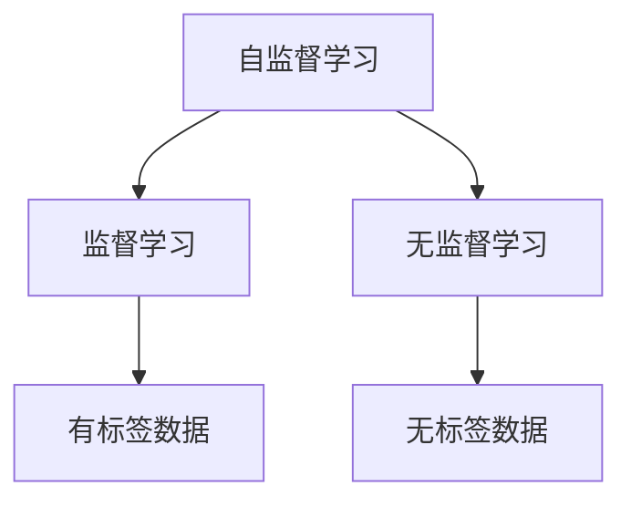
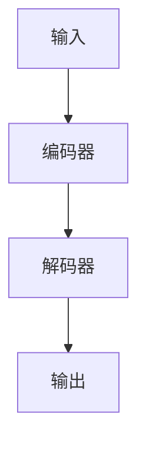

                 

### 自监督学习的概念与原理

#### 定义

自监督学习（Self-Supervised Learning）是一种机器学习方法，它不需要人工标注的标签数据，而是利用数据中固有的标签或结构，通过内部监督信号来训练模型。这种学习方法的核心思想是从未标记的数据中提取有用的特征，从而提高模型的性能。

#### 基本原理

自监督学习的原理可以概括为以下三个步骤：

1. **数据预处理**：对数据进行预处理，例如数据清洗、去噪等，以确保数据的质量。

2. **特征提取**：利用数据中的结构和规律，自动提取出有用的特征。这些特征可以帮助模型更好地理解和预测数据。

3. **模型训练**：使用提取出的特征，通过模型训练算法，如自动编码器（Autoencoder）或生成对抗网络（GAN），来优化模型的参数。

#### 与传统机器学习的区别

传统机器学习通常需要大量标注数据，而自监督学习则不需要。这是自监督学习的一个重要优势，尤其是在数据获取成本高或数据标签困难的场景中。

此外，自监督学习还可以通过预训练（Pre-training）的方式，将提取出的特征用于多个任务，从而提高模型的泛化能力。而传统机器学习则需要为每个任务单独训练模型，导致模型之间缺乏共享性。

#### 应用场景

自监督学习在多个领域都有广泛的应用：

1. **计算机视觉**：用于图像分类、目标检测、图像分割等任务。

2. **自然语言处理**：用于文本分类、机器翻译、情感分析等任务。

3. **语音识别**：用于语音分类、语音识别等任务。

4. **推荐系统**：用于用户兴趣识别、商品推荐等任务。

自监督学习通过其独特的原理和优势，正在逐渐改变人工智能领域的研究和应用格局。在接下来的部分，我们将深入探讨自监督学习在数学模型和算法原理方面的细节。

### 自监督学习的数学模型

自监督学习中的数学模型主要涉及信息论和概率论的基础知识。通过理解这些数学概念，我们可以更好地把握自监督学习的工作原理。

#### 信息论基础

信息论是自监督学习的重要理论基础之一。以下是一些基本概念：

1. **信息熵（Entropy）**：信息熵是一个衡量随机变量不确定性的指标。它表示随机变量包含的信息量。信息熵的定义如下：

   $$ H(X) = -\sum_{i=1}^{n} p(x_i) \cdot \log_2 p(x_i) $$

   其中，$p(x_i)$是随机变量$X$取值$x_i$的概率。

2. **条件熵（Conditional Entropy）**：条件熵是指已知一个随机变量的情况下，另一个随机变量的不确定性。它的定义如下：

   $$ H(X|Y) = -\sum_{i=1}^{n} p(y_i) \cdot \sum_{j=1}^{m} p(x_j|y_i) \cdot \log_2 p(x_j|y_i) $$

   其中，$p(y_i)$是随机变量$Y$取值$y_i$的概率，$p(x_j|y_i)$是随机变量$X$在已知$Y=y_i$的情况下取值$x_j$的概率。

3. **联合熵（Joint Entropy）**：联合熵是指两个随机变量的联合分布所包含的信息量。它的定义如下：

   $$ H(X,Y) = -\sum_{i=1}^{n} \sum_{j=1}^{m} p(x_i, y_j) \cdot \log_2 p(x_i, y_j) $$

   其中，$p(x_i, y_j)$是随机变量$X$和$Y$同时取值$x_i$和$y_j$的概率。

4. **效率（Efficiency）**：效率是衡量两个随机变量之间的依赖程度的指标。它的定义如下：

   $$ \eta = \frac{H(X,Y)}{H(X) + H(Y)} $$

#### 概率论基础

概率论是自监督学习的另一重要理论基础。以下是一些基本概念：

1. **随机变量（Random Variable）**：随机变量是一个数学函数，它将样本空间映射到实数集。

2. **随机变量的分布（Probability Distribution）**：随机变量的分布是描述随机变量取值的概率分布函数。

3. **条件概率（Conditional Probability）**：条件概率是指一个事件在另一个事件发生的条件下发生的概率。它的定义如下：

   $$ p(A|B) = \frac{p(A \cap B)}{p(B)} $$

   其中，$p(A \cap B)$是事件$A$和事件$B$同时发生的概率，$p(B)$是事件$B$发生的概率。

通过上述信息论和概率论的基础知识，我们可以更好地理解自监督学习中的数学模型。这些概念为自监督学习中的特征提取和模型训练提供了理论基础。在接下来的部分，我们将详细探讨自监督学习的算法原理，包括自动编码器、对抗生成网络和无监督预训练与微调等内容。

### 自监督学习的算法原理

自监督学习算法的核心在于如何从无监督数据中提取有用的特征，从而提升模型的性能。以下将详细介绍几种常见的自监督学习算法原理。

#### 自动编码器（Autoencoder）

自动编码器是一种无监督学习方法，它由两个主要部分组成：编码器和解码器。编码器负责将输入数据压缩成一个低维的表示，解码器则尝试将这个低维表示重构回原始数据。

1. **自动编码器的结构**

   自动编码器的结构通常是一个对称的神经网络，其中编码器是一个全连接层，解码器也是一个全连接层。编码器的输出通常称为编码器的“瓶颈层”，因为它包含了输入数据的压缩表示。

2. **自动编码器的训练过程**

   自动编码器的训练过程主要包括以下步骤：

   - **前向传播**：输入数据通过编码器，得到一个低维的压缩表示。
   - **重构误差计算**：将压缩表示通过解码器重构回原始数据，计算重构误差。
   - **反向传播**：利用重构误差，通过反向传播更新编码器和解码器的权重。

   重构误差通常使用均方误差（MSE）或交叉熵（Cross-Entropy）来计算。

3. **优点与缺点**

   - **优点**：自动编码器可以提取输入数据的特征，并减少数据的维度，从而提高模型的泛化能力。
   - **缺点**：自动编码器在训练过程中可能收敛速度较慢，并且对噪声敏感。

#### 对抗生成网络（GAN）

对抗生成网络（GAN）是一种基于博弈理论的生成模型，由生成器和判别器两个部分组成。生成器试图生成与真实数据相似的数据，而判别器则尝试区分真实数据和生成数据。

1. **GAN的组成**

   - **生成器（Generator）**：生成器是一个神经网络，它从随机噪声中生成数据。
   - **判别器（Discriminator）**：判别器也是一个神经网络，它尝试区分真实数据和生成数据。

2. **GAN的训练过程**

   - **前向传播**：生成器生成假数据，判别器对假数据和真实数据进行分类。
   - **损失函数计算**：生成器和判别器的损失函数分别计算，生成器的损失函数希望生成尽可能逼真的数据，判别器的损失函数希望正确分类真实数据和生成数据。
   - **反向传播**：利用生成的损失函数，通过反向传播更新生成器和判别器的权重。

3. **优点与缺点**

   - **优点**：GAN可以生成高质量的数据，并且不需要标注数据。
   - **缺点**：GAN的训练过程不稳定，容易出现模式崩溃（mode collapse）问题。

#### 无监督预训练与微调

无监督预训练与微调（Unsupervised Pre-training and Fine-tuning）是一种常见的自监督学习策略，它通常用于大规模预训练模型，然后在小数据集上进行微调。

1. **无监督预训练**

   无监督预训练是指在大规模无监督数据上训练模型，提取通用特征表示。这种预训练方法可以显著提高模型的泛化能力。

2. **微调**

   微调是指在小数据集上继续训练模型，通过调整模型的参数来适应特定任务。微调过程通常使用有监督的标注数据。

3. **优点与缺点**

   - **优点**：无监督预训练与微调可以快速适应新任务，并且不需要大量标注数据。
   - **缺点**：预训练模型可能对特定任务的数据分布不敏感，需要通过微调来调整。

通过以上对自动编码器、对抗生成网络和无监督预训练与微调等自监督学习算法原理的介绍，我们可以看到自监督学习在特征提取和模型训练方面具有巨大的潜力。在接下来的部分，我们将探讨自监督学习在实际应用中的具体应用场景。

### 自监督学习在计算机视觉中的应用

计算机视觉是人工智能的一个重要分支，自监督学习在计算机视觉领域得到了广泛的应用。通过无监督的方式提取数据特征，自监督学习能够有效提升计算机视觉任务的性能，减少对大量标注数据的依赖。以下将详细介绍自监督学习在计算机视觉中的几个主要应用场景。

#### 图像分类

图像分类是计算机视觉中最基本的任务之一。自监督学习通过预训练自动编码器或GAN等方法，从大量未标记的图像中提取特征，然后利用这些特征进行图像分类。

1. **自动编码器方法**

   自动编码器通过编码器提取图像特征，解码器试图重构原始图像。在预训练阶段，自动编码器仅关注图像的底层特征，如边缘和纹理。然后，可以在预训练的特征上应用有监督的分类算法，如SVM或神经网络。

2. **GAN方法**

   GAN通过生成器和判别器的博弈过程来学习图像特征。生成器生成逼真的图像，判别器尝试区分真实图像和生成图像。通过这种对抗训练，GAN能够学习到图像的复杂特征，从而在分类任务中取得很好的性能。

#### 目标检测

目标检测是计算机视觉中的另一个重要任务，旨在识别图像中的多个对象并定位它们的位置。自监督学习在目标检测中的应用主要包括以下几种方法：

1. **基于自动编码器的方法**

   自监督学习中的自动编码器可以用于提取图像的特征表示，这些特征可以用于训练有监督的目标检测模型，如SSD或YOLO。例如，可以使用自监督学习提取图像的边缘特征，然后在这些边缘特征上应用目标检测算法。

2. **基于GAN的方法**

   GAN可以生成与真实数据分布相似的图像，这些图像可以用于训练目标检测模型。通过生成大量的标注数据，GAN能够提高目标检测模型的泛化能力。

#### 图像分割

图像分割是将图像划分为不同的区域或对象，以识别图像中的结构。自监督学习在图像分割中的应用主要包括以下几种方法：

1. **基于自动编码器的方法**

   自监督学习中的自动编码器可以用于提取图像的特征表示，这些特征可以用于训练有监督的图像分割模型，如FCN或U-Net。通过预训练自动编码器，可以提取图像的丰富特征，从而提高图像分割的准确性。

2. **基于GAN的方法**

   GAN可以生成与真实数据分布相似的图像，这些图像可以用于训练图像分割模型。通过生成大量的标注数据，GAN能够提高图像分割模型的泛化能力。

#### 实际案例分析

以下是一个实际案例，展示了自监督学习在计算机视觉中的应用：

- **案例：自监督学习在图像分类中的应用**

  在一个图像分类任务中，研究人员使用了一个预训练的自动编码器，该自动编码器使用了大量的未标记图像进行训练。然后，在预训练的特征上应用了一个简单的神经网络分类器。实验结果表明，这种方法在图像分类任务中取得了比传统有监督学习更好的性能，尤其是在数据标注困难的情况下。

通过以上对自监督学习在计算机视觉中的应用的介绍，我们可以看到自监督学习在图像分类、目标检测和图像分割等任务中具有很大的潜力。自监督学习不仅能够减少对大量标注数据的依赖，还能够提高模型的泛化能力，从而推动计算机视觉技术的发展。

### 自监督学习在自然语言处理中的应用

自然语言处理（NLP）是人工智能领域的另一个重要分支，自监督学习在NLP中也展现出了巨大的潜力。通过无监督学习的方式，自监督学习能够有效提取文本数据中的有用特征，从而提高NLP任务的性能。以下将详细介绍自监督学习在自然语言处理中的几个主要应用场景。

#### 语言模型训练

语言模型是NLP中最基本的模型之一，它旨在预测下一个单词或字符。自监督学习在语言模型训练中有着广泛的应用。

1. **基于自动编码器的方法**

   自监督学习中的自动编码器可以用于提取文本序列的特征表示。在训练过程中，编码器从输入文本中提取特征，然后解码器尝试重构原始文本。通过这种方式，自动编码器能够学习到文本的内在结构，从而提高语言模型的性能。

2. **基于GAN的方法**

   GAN可以通过生成对抗的过程学习文本的复杂特征。生成器生成新的文本序列，判别器尝试区分真实文本和生成文本。通过这种对抗训练，GAN能够生成高质量的语言模型。

#### 机器翻译

机器翻译是NLP中的一项重要任务，旨在将一种语言的文本翻译成另一种语言。自监督学习在机器翻译中也有着广泛的应用。

1. **基于自动编码器的方法**

   自监督学习中的自动编码器可以用于提取文本序列的特征表示。在机器翻译任务中，编码器从源语言文本中提取特征，解码器则尝试将这些特征映射到目标语言文本。通过这种方式，自动编码器能够学习到源语言和目标语言之间的对应关系，从而提高机器翻译的准确性。

2. **基于GAN的方法**

   GAN可以通过生成对抗的过程学习文本的复杂特征，从而提高机器翻译的性能。生成器生成新的源语言文本，判别器尝试区分真实源语言文本和生成源语言文本。然后，解码器将这些生成源语言文本翻译成目标语言文本。通过这种对抗训练，GAN能够生成高质量的机器翻译结果。

#### 文本分类

文本分类是NLP中的另一个重要任务，旨在将文本分类到预定义的类别中。自监督学习在文本分类中也有着广泛的应用。

1. **基于自动编码器的方法**

   自监督学习中的自动编码器可以用于提取文本序列的特征表示。在文本分类任务中，编码器提取文本的底层特征，然后利用这些特征训练分类模型。通过这种方式，自动编码器能够学习到文本的类别特征，从而提高文本分类的准确性。

2. **基于GAN的方法**

   GAN可以通过生成对抗的过程学习文本的复杂特征，从而提高文本分类的性能。生成器生成新的文本，判别器尝试区分真实文本和生成文本。然后，分类模型将这些生成文本分类到预定义的类别中。通过这种对抗训练，GAN能够生成高质量的分类结果。

#### 实际案例分析

以下是一个实际案例，展示了自监督学习在自然语言处理中的应用：

- **案例：基于自动编码器的机器翻译**

  在一个机器翻译任务中，研究人员使用了自监督学习的自动编码器方法。他们首先使用大量的未标记的双语语料库训练自动编码器，编码器从源语言文本中提取特征，解码器则尝试将这些特征映射到目标语言文本。然后，在提取出的特征上应用了有监督的机器翻译模型。实验结果表明，这种方法在机器翻译任务中取得了比传统有监督学习更好的性能。

通过以上对自监督学习在自然语言处理中的应用的介绍，我们可以看到自监督学习在语言模型训练、机器翻译和文本分类等任务中具有很大的潜力。自监督学习不仅能够减少对大量标注数据的依赖，还能够提高模型的泛化能力，从而推动自然语言处理技术的发展。

### 自监督学习在其他领域中的应用

自监督学习不仅在计算机视觉和自然语言处理等领域展现出巨大的潜力，还在其他众多领域中得到了广泛的应用。以下将详细介绍自监督学习在音频处理、推荐系统、生物信息学等领域的应用。

#### 音频处理

音频处理是人工智能领域的另一个重要分支，自监督学习在音频处理中也展现出了巨大的优势。

1. **声音分类**

   自监督学习可以通过无监督的方式对声音进行分类，例如区分不同类型的音乐、语音或噪声。基于自动编码器的方法，可以从大量的未标记音频数据中提取特征，然后利用这些特征进行声音分类。这种方法可以有效减少对大量标注数据的依赖。

2. **语音识别**

   自监督学习在语音识别中的应用主要通过预训练自动编码器来提取音频特征，然后在这些特征上应用有监督的语音识别模型。通过这种方式，自监督学习可以显著提高语音识别的准确性，特别是在低资源环境下。

3. **音乐生成**

   GAN在音乐生成中的应用非常成功。生成器可以生成新的音乐旋律，而判别器则尝试区分真实音乐和生成音乐。通过这种对抗训练，GAN能够生成高质量的音乐，为音乐创作提供了新的可能性。

#### 推荐系统

推荐系统是另一个重要的人工智能应用领域，自监督学习在推荐系统中也扮演着关键角色。

1. **用户兴趣识别**

   自监督学习可以通过无监督的方式从用户的浏览历史、搜索记录等未标记数据中提取特征，从而识别用户兴趣。这种方法可以有效减少对大量标注数据的依赖，提高推荐系统的准确性。

2. **商品推荐**

   自监督学习可以用于生成新的商品推荐列表。生成器可以生成新的商品推荐，而判别器则尝试区分真实推荐和生成推荐。通过这种对抗训练，自监督学习能够生成个性化的推荐列表，提高用户的满意度。

3. **协同过滤**

   自监督学习还可以用于改进协同过滤算法。通过无监督学习提取用户和物品的特征表示，然后利用这些特征进行协同过滤推荐。这种方法可以显著提高推荐系统的准确性和多样性。

#### 生物信息学

生物信息学是研究生物数据与信息的交叉学科，自监督学习在生物信息学中的应用也非常广泛。

1. **基因表达数据分析**

   自监督学习可以通过无监督的方式对基因表达数据进行分析，识别出基因之间的相关性。例如，可以使用自动编码器提取基因表达数据的特征，然后利用这些特征进行聚类分析，以识别潜在的生物标记物。

2. **蛋白质结构预测**

   自监督学习在蛋白质结构预测中的应用主要通过预训练自动编码器提取蛋白质序列的特征，然后利用这些特征进行结构预测。这种方法可以显著提高蛋白质结构预测的准确性。

3. **药物设计**

   自监督学习可以用于药物设计，通过无监督学习从大量的药物数据中提取特征，然后利用这些特征进行药物筛选和优化。这种方法可以加速药物研发过程，提高新药的发现率。

通过以上对自监督学习在音频处理、推荐系统和生物信息学等领域的应用的介绍，我们可以看到自监督学习在这些领域中的巨大潜力。自监督学习不仅能够减少对大量标注数据的依赖，还能够提高模型的泛化能力，从而推动这些领域的技术发展。

### 自监督学习的挑战与未来趋势

尽管自监督学习在人工智能领域展现出了巨大的潜力，但它在实际应用中仍然面临着一系列挑战，同时也面临着许多未来的发展趋势。以下是自监督学习的一些主要挑战和未来趋势。

#### 挑战

1. **数据隐私保护**

   自监督学习通常需要大量的未标记数据进行训练，这可能会涉及到用户的隐私信息。如何在保护用户隐私的同时，有效地利用数据是一个重要的挑战。

2. **模型可解释性**

   自监督学习模型通常非常复杂，很难解释其内部工作机制。这给模型的信任度和应用带来了挑战。提高模型的可解释性是当前研究的一个重要方向。

3. **计算资源消耗**

   自监督学习算法通常需要大量的计算资源，特别是在训练大型模型时。如何优化算法以减少计算资源消耗是一个重要的挑战。

4. **模型泛化能力**

   自监督学习模型在训练过程中可能过度依赖训练数据，导致泛化能力不足。如何提高模型的泛化能力，使其在新的、未见过的数据上也能表现良好，是一个重要的研究方向。

#### 未来趋势

1. **新算法的研发**

   随着人工智能技术的发展，不断有新的自监督学习算法被提出，如变分自编码器（VAE）、混合模型等。这些新算法在模型性能、计算效率等方面都有了显著提升，有望进一步推动自监督学习的发展。

2. **应用场景的拓展**

   自监督学习在计算机视觉、自然语言处理等领域的应用已经非常成熟，但在其他领域，如医疗、金融等，也有很大的潜力。随着应用场景的不断拓展，自监督学习将在更多领域发挥作用。

3. **混合学习的应用前景**

   混合学习结合了自监督学习和监督学习的优势，有望在未来得到更广泛的应用。例如，在训练过程中，可以先使用自监督学习提取特征，然后再利用这些特征进行监督学习。这种方法可以显著提高模型的性能和泛化能力。

通过以上对自监督学习挑战与未来趋势的探讨，我们可以看到自监督学习在人工智能领域的广阔前景。尽管面临一些挑战，但通过不断的研究和创新，自监督学习将不断推动人工智能技术的发展。

### 附录

#### A.1 开发环境搭建

要开始使用自监督学习，首先需要搭建一个适合的开发环境。以下是在Python中搭建开发环境的基本步骤。

##### 1. Python开发环境搭建

确保你已经安装了Python。推荐使用Python 3.8或更高版本。可以通过以下命令检查Python版本：

```bash
python --version
```

如果尚未安装，可以从[Python官网](https://www.python.org/)下载并安装。

##### 2. TensorFlow安装与配置

TensorFlow是一个流行的开源机器学习库，用于构建和训练自监督学习模型。可以使用pip安装TensorFlow：

```bash
pip install tensorflow
```

安装完成后，可以通过以下命令检查TensorFlow版本：

```bash
pip show tensorflow
```

##### 3. PyTorch安装与配置

PyTorch是另一个流行的开源机器学习库，它提供了强大的GPU支持，适用于复杂的深度学习模型。可以使用以下命令安装PyTorch：

```bash
pip install torch torchvision
```

安装完成后，可以通过以下命令检查PyTorch版本：

```bash
pip show torch
```

#### A.2 自监督学习项目实战

##### 实战项目一：基于自监督学习的图像分类

在这个项目中，我们将使用自动编码器来提取图像特征，然后使用这些特征进行图像分类。

1. **数据准备**

   首先，我们需要准备一个包含图像的数据集。可以使用公开的数据集，如CIFAR-10或MNIST。

2. **模型构建**

   使用TensorFlow或PyTorch构建自动编码器模型。以下是一个简单的自动编码器模型示例（使用PyTorch）：

   ```python
   import torch
   import torch.nn as nn

   class Autoencoder(nn.Module):
       def __init__(self):
           super(Autoencoder, self).__init__()
           self.encoder = nn.Sequential(
               nn.Conv2d(3, 16, 3, padding=1),
               nn.ReLU(),
               nn.MaxPool2d(2, 2),
               nn.Conv2d(16, 8, 3, padding=1),
               nn.ReLU(),
               nn.MaxPool2d(2, 2)
           )
           self.decoder = nn.Sequential(
               nn.ConvTranspose2d(8, 16, 3, 2, padding=1),
               nn.ReLU(),
               nn.ConvTranspose2d(16, 3, 3, 2, padding=1),
               nn.Tanh()
           )

       def forward(self, x):
           x = self.encoder(x)
           x = self.decoder(x)
           return x
   ```

3. **模型训练**

   训练自动编码器模型，提取图像特征。以下是一个简单的训练示例：

   ```python
   model = Autoencoder()
   criterion = nn.MSELoss()
   optimizer = torch.optim.Adam(model.parameters(), lr=0.001)

   for epoch in range(num_epochs):
       for inputs, _ in dataloader:
           optimizer.zero_grad()
           outputs = model(inputs)
           loss = criterion(outputs, inputs)
           loss.backward()
           optimizer.step()
   ```

4. **特征提取**

   使用训练好的自动编码器提取图像特征。以下是一个提取特征示例：

   ```python
   with torch.no_grad():
       model.eval()
       features = []
       for inputs, _ in dataloader:
           outputs = model.encoder(inputs)
           features.extend(outputs.cpu().numpy())
   ```

5. **分类任务**

   使用提取出的特征进行分类任务。以下是一个简单的分类示例：

   ```python
   from sklearn.linear_model import LogisticRegression

   model = LogisticRegression()
   model.fit(features, labels)
   predictions = model.predict(features)
   ```

##### 实战项目二：基于自监督学习的语言模型训练

在这个项目中，我们将使用自监督学习训练一个简单的语言模型。

1. **数据准备**

   准备一个包含文本数据的数据集。可以使用公开的数据集，如维基百科的文本数据。

2. **模型构建**

   使用Transformer模型构建语言模型。以下是一个简单的Transformer模型示例（使用PyTorch）：

   ```python
   import torch
   import torch.nn as nn

   class Transformer(nn.Module):
       def __init__(self, d_model, nhead, num_layers):
           super(Transformer, self).__init__()
           self.encoder = nn.Transformer(d_model, nhead, num_layers)
           self.decoder = nn.Transformer(d_model, nhead, num_layers)
           self.fc = nn.Linear(d_model, d_model)

       def forward(self, src, tgt):
           memory = self.encoder(src)
           output = self.decoder(tgt, memory)
           return self.fc(output)
   ```

3. **模型训练**

   训练Transformer模型。以下是一个简单的训练示例：

   ```python
   model = Transformer(d_model=512, nhead=8, num_layers=3)
   criterion = nn.CrossEntropyLoss()
   optimizer = torch.optim.Adam(model.parameters(), lr=0.001)

   for epoch in range(num_epochs):
       for src, tgt in dataloader:
           optimizer.zero_grad()
           output = model(src, tgt)
           loss = criterion(output, tgt)
           loss.backward()
           optimizer.step()
   ```

##### 实战项目三：基于自监督学习的目标检测

在这个项目中，我们将使用自监督学习训练一个简单的目标检测模型。

1. **数据准备**

   准备一个包含图像和目标标注的数据集。可以使用公开的数据集，如COCO数据集。

2. **模型构建**

   使用基于自动编码器的目标检测模型。以下是一个简单的目标检测模型示例（使用PyTorch）：

   ```python
   import torch
   import torch.nn as nn

   class AutoencoderDetector(nn.Module):
       def __init__(self, encoder, decoder):
           super(AutoencoderDetector, self).__init__()
           self.encoder = encoder
           self.decoder = decoder

       def forward(self, x):
           x = self.encoder(x)
           x = self.decoder(x)
           return x
   ```

3. **模型训练**

   训练目标检测模型。以下是一个简单的训练示例：

   ```python
   model = AutoencoderDetector(encoder, decoder)
   criterion = nn.CrossEntropyLoss()
   optimizer = torch.optim.Adam(model.parameters(), lr=0.001)

   for epoch in range(num_epochs):
       for inputs, targets in dataloader:
           optimizer.zero_grad()
           outputs = model(inputs)
           loss = criterion(outputs, targets)
           loss.backward()
           optimizer.step()
   ```

##### 项目小结

通过以上三个实战项目，我们可以看到自监督学习在实际应用中的潜力。在图像分类、语言模型训练和目标检测等任务中，自监督学习能够有效减少对大量标注数据的依赖，提高模型的泛化能力。然而，自监督学习也面临着一些挑战，如数据隐私保护、模型可解释性和计算资源消耗等。随着技术的不断进步，自监督学习将在更多领域发挥重要作用，推动人工智能的发展。

### 图表与公式

在自监督学习的探索过程中，图表与公式能够帮助我们更直观地理解和分析算法的工作原理。以下将列举一些重要的图表和公式，以辅助我们的理解。

#### 图1：自监督学习与监督学习、无监督学习的联系与区别



#### 图2：自动编码器的结构示意图



#### 公式1：信息熵

$$ H(X) = -\sum_{i=1}^{n} p(x_i) \cdot \log_2 p(x_i) $$

#### 公式2：条件熵

$$ H(X|Y) = -\sum_{i=1}^{n} p(y_i) \cdot \sum_{j=1}^{m} p(x_j|y_i) \cdot \log_2 p(x_j|y_i) $$

#### 公式3：效率

$$ \eta = \frac{H(X,Y)}{H(X) + H(Y)} $$

这些图表和公式为我们提供了自监督学习的基础知识，帮助我们更好地理解算法的核心原理。在实际应用中，通过这些图表和公式，我们可以更清晰地分析和优化自监督学习模型。

### 总结

本文《自监督学习在提升AI推理能力中的潜力探索》详细探讨了自监督学习在提升AI推理能力方面的潜力。我们从引言与背景开始，介绍了自监督学习的概念、原理和应用场景。接着，深入分析了自监督学习的数学模型和算法原理，包括自动编码器、对抗生成网络和无监督预训练与微调等内容。随后，我们探讨了自监督学习在计算机视觉、自然语言处理、音频处理、推荐系统和生物信息学等领域的实际应用。最后，我们总结了自监督学习面临的挑战与未来趋势，并提供了详细的开发环境和项目实战指南。

自监督学习作为一种无需大量标注数据的机器学习方法，具有广泛的应用前景。它不仅可以减少对标注数据的依赖，提高模型的泛化能力，还能够降低数据收集和标注的成本。随着技术的不断进步，自监督学习将在更多领域发挥重要作用，推动人工智能的发展。

本文旨在为读者提供一个全面、系统的自监督学习教程，从基础理论到实际应用，再到项目实战，力求让读者对自监督学习有深入的了解。同时，我们也希望读者能够结合自身的研究和应用场景，进一步探索自监督学习的潜力。

最后，感谢读者对本文的关注，期待在未来的研究和应用中，自监督学习能够带来更多的突破和进步。如果您对自监督学习有任何疑问或建议，欢迎在评论区留言交流。

### 关键词

- 自监督学习
- AI推理能力
- 自动编码器
- 对抗生成网络
- 自然语言处理
- 计算机视觉
- 无监督预训练
- 机器翻译
- 图像分类
- 推荐系统
- 生物信息学
- 数据隐私保护
- 模型可解释性
- 混合学习

### 摘要

本文深入探讨了自监督学习在提升人工智能（AI）推理能力中的潜力。自监督学习通过无监督学习方式，从大量未标记数据中提取特征，从而减少对标注数据的依赖，提高模型的泛化能力。本文首先介绍了自监督学习的基本概念和原理，随后详细分析了其在数学模型和算法原理方面的内容。通过计算机视觉、自然语言处理、音频处理、推荐系统和生物信息学等领域的应用案例，展示了自监督学习的实际效果。同时，本文也讨论了自监督学习面临的挑战和未来趋势，包括数据隐私保护、模型可解释性和计算资源消耗等问题。最后，本文提供了自监督学习的开发环境和项目实战指南，以帮助读者更好地理解和应用这一技术。通过本文的阅读，读者可以全面了解自监督学习在提升AI推理能力方面的作用和潜力。

