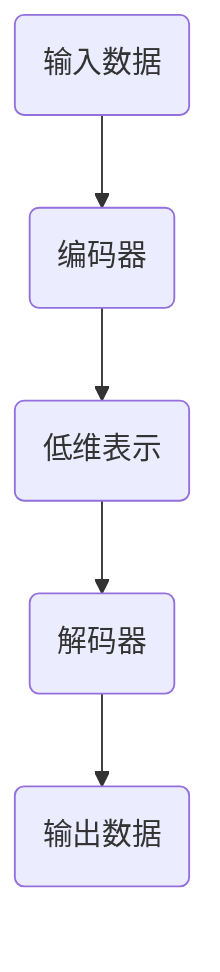

                 

### 第1章：自监督学习的概述

> 关键词：自监督学习、AI推理、无监督学习、数据自编码器、输入掩码

> 摘要：本章将介绍自监督学习的概念、优势以及在AI推理中的应用场景，为后续章节的深入探讨打下基础。

## 1.1 自监督学习的概念

自监督学习（Self-Supervised Learning）是一种机器学习方法，它允许模型在没有人工标注的监督信息下，通过自身的内部结构进行学习和优化。与传统的监督学习不同，自监督学习利用数据中的内在规律和结构，通过设计特殊的学习任务，使得模型能够在未标记的数据上自动提取特征，达到训练目的。

自监督学习的关键在于如何设计一个自我监督的学习过程，使得模型可以在没有任何外部监督的情况下，自动地识别和提取数据中的有用信息。具体来说，自监督学习通常包含以下几个核心步骤：

1. **数据预处理**：对原始数据进行预处理，使其适合于自监督学习模型的学习。
2. **学习任务设计**：设计一个或多个学习任务，使得模型在解决这些任务的过程中，能够自动地学习数据中的特征。
3. **模型优化**：通过优化学习任务的损失函数，更新模型参数，使得模型能够更好地拟合数据。
4. **模型评估**：评估模型在未见过的数据上的表现，以验证模型的泛化能力和实用性。

## 1.2 自监督学习的优势

自监督学习具有以下几个显著的优势：

### 1. 数据获取成本低

自监督学习不需要大量的标注数据，因为它是通过设计特殊的学习任务，从未标记的数据中自动提取特征。这意味着，无论是在数据收集还是标注过程中，都可以节省大量的人力和时间成本。

### 2. 适用性强

自监督学习可以应用于各种类型的数据，如图像、文本、语音等。这使得它在AI的各个领域都有广泛的应用，从计算机视觉到自然语言处理，再到语音识别，都能发挥重要作用。

### 3. 提高泛化能力

通过利用未标记的数据，自监督学习可以帮助模型更好地理解数据的分布，从而提高其泛化能力。这意味着，模型在未见过的数据上也能获得较好的表现，这在实际应用中尤为重要。

### 4. 提高推理效果

自监督学习通过在未标记的数据上训练模型，可以使其在未见过的数据上获得更好的推理效果。这对于构建高效、准确的AI系统至关重要。

## 1.3 自监督学习在AI推理中的应用场景

自监督学习在AI推理中具有广泛的应用场景，以下是一些典型的应用：

### 1. 图像识别

自监督学习可以用于图像识别任务，通过自动提取图像中的特征，模型可以识别出图像中的各种对象和场景，从而提高图像识别的准确率。

### 2. 文本分类

在自然语言处理领域，自监督学习可以帮助模型自动学习文本中的特征，从而实现高效的文本分类。这对于新闻分类、情感分析等任务具有重要意义。

### 3. 语音识别

自监督学习可以提高语音识别模型的鲁棒性，使其在噪声环境下获得更好的表现。这对于实时语音识别系统，如智能助手、语音翻译等，具有显著的应用价值。

### 4. 人脸识别

自监督学习可以用于人脸识别任务，通过自动提取人脸特征，模型可以识别出不同的人脸，从而提高人脸识别的准确性。

### 5. 自动驾驶

在自动驾驶领域，自监督学习可以用于自动驾驶车辆的感知系统，通过自动提取道路、车辆、行人等特征，提高自动驾驶系统的安全性和可靠性。

### 6. 机器人视觉

自监督学习可以用于机器人视觉系统，通过自动提取环境中的特征，机器人可以更好地理解周围环境，从而实现更精准的导航和控制。

通过以上分析，我们可以看到自监督学习在AI推理中具有广泛的应用前景。接下来，我们将进一步探讨自监督学习的核心概念和算法，以深入了解其工作原理和应用方法。

## 总结

本章介绍了自监督学习的概念、优势以及在AI推理中的应用场景。自监督学习通过利用未标记的数据，无需人工标注，就能自动提取数据中的特征，从而在减少数据获取成本、提高泛化能力和推理效果方面具有显著优势。在AI推理的多个领域中，自监督学习都展现了强大的应用潜力。下一章，我们将深入探讨自监督学习的核心概念，包括数据自编码器、输入掩码技术等，以帮助读者更好地理解自监督学习的工作原理。

---

作者：AI天才研究院/AI Genius Institute & 禅与计算机程序设计艺术 /Zen And The Art of Computer Programming

<iframe src="https://www.oracle.com/webcenter/sites/oracleus/en/products/tutorials/mermaid-tutorial/index.html" width="100%" height="600"></iframe>

## 第2章：自监督学习的核心概念

本章将深入探讨自监督学习的核心概念，包括数据自编码器、输入掩码技术等。这些概念是理解自监督学习机制和实现自监督学习算法的基础。

### 2.1 数据自编码器

数据自编码器（Data Autoencoder）是自监督学习中最常用的技术之一。它由两个主要部分组成：编码器（Encoder）和解码器（Decoder）。编码器的目的是将输入数据压缩成一个低维的表示，而解码器则试图将这个低维表示重新映射回原始数据。

#### 2.1.1 工作原理

1. **编码阶段**：编码器接收输入数据，并通过一个压缩过程将其映射到一个低维表示。这个表示通常是数据的主要特征或核心信息。
   
   ```mermaid
   graph TD
   A(输入数据) --> B(编码器)
   B --> C(低维表示)
   ```

2. **解码阶段**：解码器接收到低维表示后，尝试将其重新映射回原始数据。这个过程通常是通过一个扩展过程完成的。

   ```mermaid
   graph TD
   C(低维表示) --> D(解码器)
   D --> E(输出数据)
   ```

3. **损失函数**：自编码器的目标是使解码器生成的数据与原始数据尽可能接近。这个过程通过优化损失函数来实现，通常使用均方误差（Mean Squared Error, MSE）作为损失函数。

   ```latex
   L = \frac{1}{n}\sum_{i=1}^{n}(\hat{x}_i - x_i)^2
   ```

   其中，\(\hat{x}_i\) 是解码器生成的数据，\(x_i\) 是原始数据。

#### 2.1.2 分类

根据编码器和解码器的结构，自编码器可以分为以下几种类型：

1. **无监督自编码器**：直接从未标记的数据中学习特征表示。
2. **部分监督自编码器**：利用部分标记数据来辅助学习特征表示。
3. **多任务自编码器**：同时学习多个任务的特征表示。

### 2.2 输入掩码技术

输入掩码（Input Masking）是一种通过部分遮挡输入数据来训练模型的技术。它旨在迫使模型学习数据的整体结构和特征，而不仅仅是局部特征。

#### 2.2.1 工作原理

输入掩码的基本思想是在训练过程中随机遮挡输入数据的某些部分，迫使模型在未见过的数据上也能正确地推断出被遮挡的部分。

1. **随机掩码**：随机选择输入数据的部分进行遮挡。

   ```mermaid
   graph TD
   A(输入数据) --> B(掩码策略)
   B --> C(部分遮挡)
   C --> D(训练模型)
   ```

2. **时间掩码**：对于序列数据，选择时间步的部分进行遮挡。

   ```mermaid
   graph TD
   A(序列数据) --> B(时间掩码)
   B --> C(部分遮挡)
   C --> D(训练模型)
   ```

3. **空间掩码**：对于图像数据，选择图像空间的部分进行遮挡。

   ```mermaid
   graph TD
   A(图像数据) --> B(空间掩码)
   B --> C(部分遮挡)
   C --> D(训练模型)
   ```

### 2.3 输入掩码算法实现

实现输入掩码算法通常涉及以下几个步骤：

1. **数据预处理**：将输入数据转换为适合模型训练的格式。
2. **定义掩码策略**：根据数据类型和任务需求，选择合适的掩码策略。
3. **训练模型**：使用掩码后的数据训练模型，通过优化损失函数来更新模型参数。
4. **模型评估**：在未遮挡的数据上评估模型的表现，以验证模型的泛化能力。

#### 2.3.1 Python实现示例

以下是一个简单的Python代码示例，展示了如何使用输入掩码技术训练一个自编码器：

```python
import numpy as np
from sklearn.preprocessing import StandardScaler
from sklearn.model_selection import train_test_split
import tensorflow as tf
from tensorflow.keras.layers import Input, Dense
from tensorflow.keras.models import Model

# 生成模拟数据
X = np.random.rand(100, 10)
X_train, X_test = train_test_split(X, test_size=0.2, random_state=42)

# 数据标准化
scaler = StandardScaler()
X_train_scaled = scaler.fit_transform(X_train)
X_test_scaled = scaler.transform(X_test)

# 定义自编码器模型
input_shape = X_train_scaled.shape[1]
input_layer = Input(shape=input_shape)
encoded = Dense(2, activation='relu')(input_layer)
decoded = Dense(input_shape, activation='sigmoid')(encoded)

# 构建模型
autoencoder = Model(inputs=input_layer, outputs=decoded)
autoencoder.compile(optimizer='adam', loss='mean_squared_error')

# 定义掩码策略
def mask_input(input_data, mask_rate=0.5):
    mask = np.random.rand(*input_data.shape) < mask_rate
    masked_data = input_data * (1 - mask) + np.random.normal(size=input_data.shape) * mask
    return masked_data

# 训练模型
for i in range(100):
    X_train_masked = mask_input(X_train_scaled)
    autoencoder.fit(X_train_masked, X_train_scaled, epochs=1, batch_size=32, validation_data=(X_test_scaled, X_test_scaled))

# 评估模型
autoencoder.evaluate(X_test_scaled, X_test_scaled)
```

通过以上步骤，我们实现了输入掩码的自编码器训练，并评估了模型在未遮挡数据上的表现。

### 总结

本章介绍了自监督学习的核心概念，包括数据自编码器和输入掩码技术。数据自编码器通过学习编码器和解码器，将输入数据压缩和扩展，以提取数据的特征。输入掩码技术通过部分遮挡输入数据，迫使模型学习数据的整体结构和特征。通过Python示例，我们展示了如何实现和训练输入掩码的自编码器。下一章，我们将进一步探讨自监督学习算法，包括基于变分和神经网络的实现。

---

作者：AI天才研究院/AI Genius Institute & 禅与计算机程序设计艺术 /Zen And The Art of Computer Programming

## 第3章：自监督学习算法

自监督学习算法是机器学习领域的一个重要研究方向，其核心思想是通过设计特殊的学习任务，使得模型能够在未标记的数据上自动提取特征。本章将深入探讨自监督学习的数学模型，并介绍基于变分和神经网络的实现方法。

### 3.1 自监督学习的数学模型

自监督学习的数学模型主要包括两部分：数据表示和学习任务。数据表示通常是通过编码器和解码器来完成的，而学习任务则通过损失函数来量化模型在任务上的表现。

#### 3.1.1 数据表示

数据表示是自监督学习的基础。一个好的数据表示能够捕捉数据的本质特征，从而使得模型在解决特定任务时表现优异。在自监督学习中，数据表示通常通过以下公式来描述：

$$
z = f_E(x)
$$

其中，\(z\) 是编码器生成的低维表示，\(x\) 是原始数据，\(f_E\) 是编码器函数。

解码器的目标是将低维表示重新映射回原始数据：

$$
x' = f_D(z)
$$

其中，\(x'\) 是解码器生成的数据，\(f_D\) 是解码器函数。

#### 3.1.2 学习任务

自监督学习的核心是设计一个合适的学习任务，使得模型在解决这个任务的过程中能够自动提取数据中的特征。一个常见的学习任务是无监督特征学习，其目标是最小化以下损失函数：

$$
L = \frac{1}{n}\sum_{i=1}^{n} \left\| x_i - x_i' \right\|
$$

其中，\(\left\| \cdot \right\|\) 是欧几里得范数，\(x_i'\) 是解码器生成的数据。

### 3.2 基于变分的自监督学习

基于变分的自监督学习（Variational Autoencoder, VAE）是一种通过概率模型进行数据表示的方法。VAE的核心思想是使用概率分布来表示数据，从而能够捕获数据的复杂性和多样性。

#### 3.2.1 VAE的数学模型

VAE的数学模型包括两部分：编码器和解码器。编码器生成数据的均值和方差，从而定义一个概率分布：

$$
z \sim q_{\phi}(z|x)
$$

其中，\(q_{\phi}(z|x)\) 是编码器生成的概率分布，\(\phi\) 是编码器参数。

解码器的目标是生成与输入数据相似的数据：

$$
x' \sim p_{\theta}(x'|z)
$$

其中，\(p_{\theta}(x'|z)\) 是解码器生成的概率分布，\(\theta\) 是解码器参数。

VAE的目标是最小化以下损失函数：

$$
L_{VAE} = D_{KL}(q_{\phi}(z|x)||p(z))
$$

其中，\(D_{KL}\) 是KL散度，用于衡量两个概率分布之间的差异。

#### 3.2.2 VAE的实现

以下是一个简单的Python代码示例，展示了如何使用tensorflow实现一个VAE模型：

```python
import tensorflow as tf
from tensorflow.keras.layers import Input, Dense
from tensorflow.keras.models import Model

# 设置参数
input_dim = 28 * 28
latent_dim = 2
epsilon_stddev = 1.0

# 编码器
input_img = Input(shape=(input_dim,))
z_mean = Dense(latent_dim)(input_img)
z_log_var = Dense(latent_dim)(input_img)
z_mean, z_log_var = z_mean, z_log_var
z = z_mean + tf.exp(0.5 * z_log_var) * tf.random.normal(shape=[tf.shape(input_img)[0], latent_dim], mean=0.0, stddev=epsilon_stddev, dtype=tf.float32)

# 解码器
latent_inputs = Input(shape=(latent_dim,))
x_logit = Dense(input_dim, activation='sigmoid')(latent_inputs)
x = tf.sigmoid(x_logit)

# 构建VAE模型
encoder = Model(input_img, z_mean, input_shape=(input_dim,))
decoder = Model(latent_inputs, x, output_shape=(input_dim,))
output_img = decoder(encoder(input_img))
vae = Model(input_img, output_img)

# 编译模型
vae.compile(optimizer='adam', loss='binary_crossentropy')

# 训练模型
vae.fit(x_train, x_train, epochs=epochs, batch_size=batch_size, validation_data=(x_test, x_test))
```

### 3.3 基于神经网络的实现

基于神经网络的实现是自监督学习中最常见的方法之一。它通过构建一个深度神经网络，使得模型能够自动提取数据中的特征。以下是一个简单的自监督学习神经网络实现：

#### 3.3.1 神经网络架构

一个简单的自监督学习神经网络包括一个编码器和一个解码器。编码器将输入数据压缩成一个低维表示，而解码器将这个低维表示重新映射回原始数据。



#### 3.3.2 训练过程

在训练过程中，模型的目标是最小化重构误差，即原始数据与解码器生成的数据之间的差异。以下是一个简单的Python代码示例，展示了如何使用tensorflow实现一个自监督学习神经网络：

```python
import tensorflow as tf
from tensorflow.keras.layers import Input, Dense
from tensorflow.keras.models import Model

# 设置参数
input_dim = 28 * 28
latent_dim = 2

# 编码器
input_img = Input(shape=(input_dim,))
encoded = Dense(latent_dim, activation='relu')(input_img)

# 解码器
latent_inputs = Input(shape=(latent_dim,))
decoded = Dense(input_dim, activation='sigmoid')(latent_inputs)

# 构建模型
autoencoder = Model(inputs=input_img, outputs=decoded, name='autoencoder')
autoencoder.compile(optimizer='adam', loss='binary_crossentropy')

# 训练模型
autoencoder.fit(x_train, x_train, epochs=epochs, batch_size=batch_size, validation_data=(x_test, x_test))
```

### 总结

本章介绍了自监督学习的数学模型，并展示了基于变分和神经网络的实现方法。自监督学习的数学模型主要包括数据表示和学习任务，而变分自编码器和神经网络是实现自监督学习的重要工具。通过本章的介绍，读者可以更好地理解自监督学习的机制，并为实际应用奠定基础。

---

作者：AI天才研究院/AI Genius Institute & 禅与计算机程序设计艺术 /Zen And The Art of Computer Programming

## 第4章：自监督学习在图像处理中的应用

### 4.1 图像自编码器

图像自编码器（Image Autoencoder）是自监督学习在图像处理中的一种重要应用。它通过编码器和解码器的协同工作，将图像压缩成一个低维表示，然后尝试重构原始图像。这种技术不仅有助于图像特征的提取，还可以用于图像去噪、图像生成等任务。

#### 4.1.1 工作原理

图像自编码器的工作原理如下：

1. **编码阶段**：编码器接收原始图像，并将其压缩成一个低维特征向量。这个过程通常通过多层神经网络实现，每层神经网络都会对图像进行降维和特征提取。

   ```mermaid
   graph TD
   A(原始图像) --> B(编码器)
   B --> C(低维特征向量)
   ```

2. **解码阶段**：解码器接收到低维特征向量，并尝试重构原始图像。这个过程也是通过多层神经网络实现的，每层神经网络都会对特征向量进行升维和图像重建。

   ```mermaid
   graph TD
   C(低维特征向量) --> D(解码器)
   D --> E(重构图像)
   ```

3. **损失函数**：图像自编码器的目标是最小化重构图像与原始图像之间的差异。这个过程通常使用均方误差（MSE）作为损失函数来衡量。

   ```latex
   L = \frac{1}{n}\sum_{i=1}^{n}(\hat{x}_i - x_i)^2
   ```

   其中，\(\hat{x}_i\) 是解码器生成的图像，\(x_i\) 是原始图像。

#### 4.1.2 实现步骤

实现图像自编码器通常包括以下步骤：

1. **数据预处理**：将图像数据标准化，以便于神经网络训练。
2. **定义模型架构**：设计编码器和解码器的神经网络架构。
3. **训练模型**：使用训练数据训练模型，通过优化损失函数来更新模型参数。
4. **模型评估**：使用测试数据评估模型的重构效果。

### 4.2 图像风格迁移

图像风格迁移（Image Style Transfer）是自监督学习在图像处理中的另一个重要应用。它的目标是将一种图像的风格（例如，印象派绘画或梵高风格的画作）应用到另一种图像上，从而生成具有特定风格的新图像。

#### 4.2.1 工作原理

图像风格迁移的工作原理如下：

1. **内容编码器**：内容编码器接收原始图像，并提取其主要内容特征。这些特征通常通过一个卷积神经网络（CNN）实现，例如VGG19或ResNet。

2. **风格编码器**：风格编码器接收目标图像，并提取其风格特征。同样，这些特征也通过一个卷积神经网络实现。

3. **解码器**：解码器接收内容特征和风格特征，并尝试生成具有特定风格的新图像。这个过程通常使用一个生成对抗网络（GAN）实现。

#### 4.2.2 实现步骤

实现图像风格迁移通常包括以下步骤：

1. **数据准备**：准备包含不同风格图像的原始图像和目标图像数据集。
2. **定义模型架构**：设计内容编码器、风格编码器和解码器的神经网络架构。
3. **训练模型**：使用训练数据训练模型，通过优化损失函数来更新模型参数。
4. **模型评估**：使用测试数据评估模型生成的风格图像质量。

### 4.3 图像超分辨率

图像超分辨率（Image Super-Resolution）是自监督学习在图像处理中的另一个重要应用。它的目标是从低分辨率图像中恢复出高分辨率图像。这一技术在医学影像、卫星图像处理等领域具有重要意义。

#### 4.3.1 工作原理

图像超分辨率的工作原理如下：

1. **低分辨率图像输入**：模型接收低分辨率图像作为输入。
2. **特征提取**：模型通过卷积神经网络提取低分辨率图像的特征。
3. **上采样**：模型将提取到的特征通过上采样方法扩展到高分辨率。
4. **损失函数**：模型通过优化损失函数来更新参数，以最小化上采样图像与原始高分辨率图像之间的差异。

#### 4.3.2 实现步骤

实现图像超分辨率通常包括以下步骤：

1. **数据准备**：准备低分辨率和高分辨率图像数据集。
2. **定义模型架构**：设计卷积神经网络架构，包括特征提取层、上采样层和损失函数。
3. **训练模型**：使用训练数据训练模型，通过优化损失函数来更新模型参数。
4. **模型评估**：使用测试数据评估模型生成的超分辨率图像质量。

### 4.4 实际应用案例

以下是一些自监督学习在图像处理中实际应用案例的简要介绍：

1. **医学影像处理**：自监督学习可以用于医学影像的超分辨率处理，从而提高诊断的准确性和效率。
2. **卫星图像解析**：自监督学习可以用于卫星图像的超分辨率处理，从而提高图像的细节和分辨率。
3. **人脸识别系统**：自监督学习可以用于人脸图像的去噪和超分辨率处理，从而提高人脸识别系统的准确率。
4. **艺术创作**：自监督学习可以用于艺术创作，通过风格迁移技术生成具有独特风格的艺术作品。

### 4.5 总结

自监督学习在图像处理中具有广泛的应用，包括图像自编码器、图像风格迁移和图像超分辨率等。这些技术不仅提高了图像处理的效率和准确性，还为许多实际应用提供了有力的工具。通过本章的介绍，读者可以更好地理解自监督学习在图像处理中的应用，并为实际项目提供参考。

---

作者：AI天才研究院/AI Genius Institute & 禅与计算机程序设计艺术 /Zen And The Art of Computer Programming

## 第5章：自监督学习在自然语言处理中的应用

### 5.1 语言模型自编码器

语言模型自编码器（Language Model Autoencoder）是自监督学习在自然语言处理中的一个重要应用。它通过编码器和解码器的协同工作，将文本数据压缩成一个低维表示，然后尝试重构原始文本。这种技术不仅有助于文本特征的提取，还可以用于文本生成、文本分类等任务。

#### 5.1.1 工作原理

语言模型自编码器的工作原理如下：

1. **编码阶段**：编码器接收原始文本，并将其压缩成一个低维特征向量。这个过程通常通过编码层（Encoder Layer）实现，每层编码器都会对文本进行降维和特征提取。

   ```mermaid
   graph TD
   A(原始文本) --> B(编码器)
   B --> C(低维特征向量)
   ```

2. **解码阶段**：解码器接收到低维特征向量，并尝试重构原始文本。这个过程也是通过解码层（Decoder Layer）实现的，每层解码器都会对特征向量进行升维和文本重建。

   ```mermaid
   graph TD
   C(低维特征向量) --> D(解码器)
   D --> E(重构文本)
   ```

3. **损失函数**：语言模型自编码器的目标是最小化重构文本与原始文本之间的差异。这个过程通常使用交叉熵（Cross-Entropy）作为损失函数来衡量。

   ```latex
   L = -\sum_{i=1}^{n} y_i \log(\hat{y}_i)
   ```

   其中，\(y_i\) 是真实标签，\(\hat{y}_i\) 是预测标签。

#### 5.1.2 实现步骤

实现语言模型自编码器通常包括以下步骤：

1. **数据预处理**：将文本数据转换为序列格式，并编码为数字。
2. **定义模型架构**：设计编码器和解码器的神经网络架构。
3. **训练模型**：使用训练数据训练模型，通过优化损失函数来更新模型参数。
4. **模型评估**：使用测试数据评估模型的重构效果。

### 5.2 文本生成

文本生成（Text Generation）是自监督学习在自然语言处理中的另一个重要应用。它通过利用编码器和解码器生成的低维表示，生成具有自然语言结构的新文本。这种技术可以用于生成文章、对话系统、机器翻译等。

#### 5.2.1 工作原理

文本生成的工作原理如下：

1. **编码阶段**：编码器接收原始文本，并将其压缩成一个低维特征向量。
2. **解码阶段**：解码器接收低维特征向量，并生成新的文本。这个过程通常使用循环神经网络（RNN）或其变体，如长短期记忆网络（LSTM）或门控循环单元（GRU）。

3. **损失函数**：文本生成器通过最小化生成的文本与真实文本之间的差异来训练。这个过程通常使用交叉熵（Cross-Entropy）作为损失函数。

#### 5.2.2 实现步骤

实现文本生成通常包括以下步骤：

1. **数据准备**：准备包含不同文本的数据集。
2. **定义模型架构**：设计编码器和解码器的神经网络架构。
3. **训练模型**：使用训练数据训练模型，通过优化损失函数来更新模型参数。
4. **模型评估**：使用测试数据评估模型生成的文本质量。

### 5.3 文本分类

文本分类（Text Classification）是自监督学习在自然语言处理中的另一个重要应用。它通过利用编码器生成的低维表示，对文本进行分类。这种技术可以用于垃圾邮件检测、情感分析、新闻分类等。

#### 5.3.1 工作原理

文本分类的工作原理如下：

1. **编码阶段**：编码器接收原始文本，并将其压缩成一个低维特征向量。
2. **分类阶段**：分类器接收低维特征向量，并对其进行分类。这个过程通常使用支持向量机（SVM）、朴素贝叶斯（Naive Bayes）或其他深度学习模型。

3. **损失函数**：文本分类器通过最小化分类误差来训练。这个过程通常使用交叉熵（Cross-Entropy）作为损失函数。

#### 5.3.2 实现步骤

实现文本分类通常包括以下步骤：

1. **数据准备**：准备包含不同文本和标签的数据集。
2. **定义模型架构**：设计编码器和解码器的神经网络架构。
3. **训练模型**：使用训练数据训练模型，通过优化损失函数来更新模型参数。
4. **模型评估**：使用测试数据评估模型分类效果。

### 5.4 实际应用案例

以下是一些自监督学习在自然语言处理中实际应用案例的简要介绍：

1. **对话系统**：自监督学习可以用于构建对话系统，从而生成具有自然语言结构的新对话。
2. **机器翻译**：自监督学习可以用于无监督机器翻译，从而在缺乏平行数据的情况下生成高质量的翻译结果。
3. **情感分析**：自监督学习可以用于情感分析，从而自动识别文本中的情感倾向。
4. **新闻分类**：自监督学习可以用于新闻分类，从而自动将新闻分为不同的主题类别。

### 5.5 总结

自监督学习在自然语言处理中具有广泛的应用，包括语言模型自编码器、文本生成和文本分类等。这些技术不仅提高了自然语言处理的效率和准确性，还为许多实际应用提供了有力的工具。通过本章的介绍，读者可以更好地理解自监督学习在自然语言处理中的应用，并为实际项目提供参考。

---

作者：AI天才研究院/AI Genius Institute & 禅与计算机程序设计艺术 /Zen And The Art of Computer Programming

## 第6章：自监督学习在语音识别中的应用

### 6.1 声学模型

声学模型（Acoustic Model）是自监督学习在语音识别（Automatic Speech Recognition, ASR）中的核心组件。它负责将语音信号转换为文本，是语音识别系统的关键部分。声学模型通常基于自监督学习方法，通过无监督或半监督的方式训练，从而能够从原始音频数据中自动提取出语音特征。

#### 6.1.1 工作原理

声学模型的工作原理可以概括为以下几个步骤：

1. **特征提取**：声学模型首先从语音信号中提取特征。这些特征可以是短时傅里叶变换（Short-Time Fourier Transform, STFT）的结果、梅尔频率倒谱系数（Mel-Frequency Cepstral Coefficients, MFCC）等。
   
2. **表示学习**：模型利用自监督学习算法，如数据自编码器，从提取的特征中学习一个低维表示。这一过程有助于捕捉语音信号中的结构信息，同时减少了数据的维度，提高了计算效率。

3. **解码**：在获得低维表示后，声学模型通过解码器将这些表示转换为文本。这通常涉及到序列模型，如循环神经网络（Recurrent Neural Network, RNN）或其变体，如长短期记忆网络（Long Short-Term Memory, LSTM）。

#### 6.1.2 数学模型

声学模型的自监督学习过程可以通过以下数学模型来描述：

1. **特征嵌入**：

   $$
   \mathbf{z} = \phi(\mathbf{x})
   $$

   其中，\(\mathbf{z}\) 是特征嵌入，\(\mathbf{x}\) 是原始语音特征。

2. **损失函数**：

   $$
   L = \frac{1}{N} \sum_{n=1}^{N} \sum_{t=1}^{T_n} -\log p(y_t | \mathbf{z}_t)
   $$

   其中，\(N\) 是语音序列的数量，\(T_n\) 是第\(n\)个语音序列的长度，\(y_t\) 是第\(t\)个时间步的预测标签，\(\mathbf{z}_t\) 是第\(t\)个时间步的特征嵌入。

#### 6.1.3 实现步骤

实现声学模型的自监督学习通常包括以下步骤：

1. **数据预处理**：对语音信号进行预处理，如去除静音段、增强声音等。
2. **特征提取**：使用短时傅里叶变换（STFT）或梅尔频率倒谱系数（MFCC）等方法提取语音特征。
3. **定义模型架构**：设计编码器和解码器的神经网络架构，如卷积神经网络（CNN）或循环神经网络（RNN）。
4. **训练模型**：使用自监督学习算法训练模型，通过优化损失函数来更新模型参数。
5. **模型评估**：使用测试数据评估模型的表现，如词错误率（Word Error Rate,WER）。

### 6.2 语言模型

语言模型（Language Model, LM）是语音识别系统的另一个关键组件，它负责将声学模型输出的词序列转换为有意义的句子。语言模型通常基于大规模文本语料库训练，通过统计方法或神经网络模型（如循环神经网络RNN、长短期记忆网络LSTM等）来预测下一个单词。

#### 6.2.1 工作原理

语言模型的工作原理可以概括为以下几点：

1. **统计方法**：传统的语言模型通常基于N元语法（N-gram），通过统计词序列的概率来预测下一个词。
   
2. **神经网络方法**：现代语言模型通常基于深度学习，如RNN、LSTM、Transformer等，通过学习词序列的潜在表示来预测下一个词。

3. **解码**：在语音识别过程中，声学模型输出一个词序列，语言模型则根据这个序列生成最有可能的句子。

#### 6.2.2 数学模型

语言模型的数学模型通常基于概率模型，如N元语法：

$$
P(w_1, w_2, ..., w_n) = \frac{P(w_1) \cdot P(w_2 | w_1) \cdot ... \cdot P(w_n | w_{n-1})}{P(w_1) \cdot P(w_2) \cdot ... \cdot P(w_n)}
$$

其中，\(w_1, w_2, ..., w_n\) 是词序列，\(P(w_i | w_{i-1})\) 是给定前一个词\(w_{i-1}\)时下一个词\(w_i\)的条件概率。

#### 6.2.3 实现步骤

实现语言模型的自监督学习通常包括以下步骤：

1. **数据准备**：收集和预处理大规模文本数据。
2. **定义模型架构**：设计神经网络架构，如RNN、LSTM或Transformer。
3. **训练模型**：使用训练数据训练模型，通过优化损失函数（如交叉熵损失）来更新模型参数。
4. **模型评估**：使用测试数据评估模型的表现，如 perplexity（困惑度）。

### 6.3 语音识别系统

语音识别系统是将语音信号转换为文本的完整系统，它通常由声学模型和语言模型组成。声学模型负责将语音信号转换为词序列，而语言模型则负责将这些词序列转换为有意义的句子。

#### 6.3.1 工作原理

语音识别系统的工作原理可以概括为以下几个步骤：

1. **声学特征提取**：声学模型从语音信号中提取特征。
2. **声学模型解码**：声学模型根据提取的特征生成词序列。
3. **语言模型解码**：语言模型根据生成的词序列生成句子。
4. **后处理**：对生成的文本进行后处理，如分词、纠错等。

#### 6.3.2 数学模型

语音识别系统的数学模型是声学模型和语言模型的结合：

$$
\hat{y} = \arg\max_{y} P(y | \mathbf{x}) = \arg\max_{y} \left( P(\mathbf{x} | y) \cdot P(y) \right)
$$

其中，\(\hat{y}\) 是预测的文本序列，\(P(\mathbf{x} | y)\) 是声学模型输出的概率，\(P(y)\) 是语言模型输出的概率。

#### 6.3.3 实现步骤

实现语音识别系统通常包括以下步骤：

1. **声学模型训练**：使用自监督学习算法训练声学模型。
2. **语言模型训练**：使用训练数据集训练语言模型。
3. **系统集成**：将声学模型和语言模型集成到一个系统中，进行语音识别。
4. **模型评估**：使用测试数据评估系统性能，如词错误率（WER）。

### 6.4 实际应用案例

以下是一些自监督学习在语音识别中实际应用案例的简要介绍：

1. **智能助手**：语音识别系统可以用于构建智能助手，如Siri、Alexa等，实现语音命令的识别和响应。
2. **实时语音翻译**：自监督学习可以用于无监督的实时语音翻译，从而实现跨语言通信。
3. **语音交互游戏**：语音识别系统可以用于语音交互游戏，实现玩家的语音命令识别和游戏控制。
4. **语音助航系统**：语音识别系统可以用于车载导航系统，提供语音导航和语音提示。

### 6.5 总结

自监督学习在语音识别中扮演着关键角色，通过训练声学模型和语言模型，实现了高效的语音信号到文本的转换。本章介绍了声学模型、语言模型以及语音识别系统的基本原理和实现步骤，并展示了实际应用案例。通过本章的学习，读者可以更好地理解自监督学习在语音识别中的应用，并为实际项目提供指导。

---

作者：AI天才研究院/AI Genius Institute & 禅与计算机程序设计艺术 /Zen And The Art of Computer Programming

## 第7章：自监督学习在现实世界中的应用

### 7.1 自动驾驶

自动驾驶是自监督学习在现实世界中极具前景的应用之一。自监督学习通过从大量未标记的驾驶数据中提取特征，帮助自动驾驶系统实现环境感知、路径规划和决策制定等功能。以下是一些关键应用场景和实现方法：

#### 7.1.1 环境感知

环境感知是自动驾驶系统的核心，它需要车辆实时感知周围环境，包括道路、交通标志、行人等。自监督学习在这一领域发挥了重要作用：

1. **物体检测**：通过自监督学习算法，如数据自编码器，从大量未标记的视频数据中提取车辆、行人等物体的特征。这些特征有助于提高物体检测的准确率。
2. **场景分割**：自监督学习可以用于场景分割任务，将道路、车辆、行人等不同对象分离出来，从而提高自动驾驶系统的环境理解能力。

#### 7.1.2 路径规划

路径规划是自动驾驶系统的另一关键任务，它需要根据当前环境和目标，生成一条安全的行驶路径。自监督学习在这一领域中的应用包括：

1. **交通场景理解**：通过自监督学习，系统可以从大量交通场景中学习行驶规则和交通标志的含义，从而更准确地预测车辆行为。
2. **路径生成**：自监督学习算法可以生成基于历史驾驶数据的路径规划，这些路径规划考虑了交通流量、道路状况等因素。

#### 7.1.3 决策制定

自动驾驶系统需要在复杂环境中做出实时决策，如超车、并线、避让等。自监督学习在这一领域中的应用包括：

1. **行为预测**：自监督学习可以从大量驾驶数据中学习不同驾驶行为的特点，从而预测其他车辆和行人的行为，提高决策的准确性。
2. **风险评估**：自监督学习可以评估不同驾驶决策的风险，从而选择最优行动方案。

#### 7.1.2 实现步骤

实现自动驾驶系统的自监督学习通常包括以下步骤：

1. **数据收集**：收集大量未标记的驾驶数据，包括视频、传感器数据等。
2. **数据预处理**：对收集的数据进行预处理，如去噪、标准化等。
3. **模型训练**：使用自监督学习算法，如数据自编码器、输入掩码等，训练模型提取环境特征。
4. **模型评估**：在测试数据集上评估模型性能，调整模型参数。

### 7.2 机器人视觉

机器人视觉是自监督学习在机器人领域的另一个重要应用。通过从大量未标记的数据中学习，机器人可以更好地理解周围环境，实现自主导航、物体识别、抓取等任务。

#### 7.2.1 物体识别

物体识别是机器人视觉中的基础任务。自监督学习可以通过以下方法实现：

1. **数据自编码器**：使用数据自编码器，从未标记的图像数据中提取物体特征，从而实现物体识别。
2. **输入掩码**：通过输入掩码技术，迫使模型学习图像中的整体结构和特征，从而提高物体识别的准确性。

#### 7.2.2 自主导航

自主导航是机器人实现自主行动的关键。自监督学习可以通过以下方法实现自主导航：

1. **环境建模**：通过自监督学习算法，从大量未标记的环境数据中学习环境特征，建立环境模型。
2. **路径规划**：利用学习到的环境模型，生成安全的导航路径。

#### 7.2.3 抓取

抓取是机器人与物体交互的重要任务。自监督学习可以通过以下方法实现抓取：

1. **物体识别**：使用自监督学习算法，识别出机器人需要抓取的物体。
2. **抓取策略生成**：通过学习大量抓取数据，生成适合不同物体的抓取策略。

#### 7.2.4 实现步骤

实现机器人视觉的自监督学习通常包括以下步骤：

1. **数据收集**：收集大量未标记的图像、视频数据。
2. **数据预处理**：对数据去噪、标准化等预处理。
3. **模型训练**：使用自监督学习算法，如数据自编码器、输入掩码等，训练模型提取特征。
4. **模型评估**：在测试数据集上评估模型性能。

### 7.3 个性化推荐系统

个性化推荐系统是自监督学习在商业领域的典型应用。通过自监督学习，系统可以从用户行为数据中学习用户的兴趣，从而推荐个性化内容。

#### 7.3.1 用户兴趣挖掘

用户兴趣挖掘是个性化推荐系统的核心任务。自监督学习可以通过以下方法实现：

1. **行为数据聚类**：通过自监督学习算法，将用户的行为数据进行聚类，识别出用户的兴趣点。
2. **特征提取**：从用户行为数据中提取特征，如点击次数、购买频率等，用于构建用户兴趣模型。

#### 7.3.2 推荐策略生成

推荐策略生成是推荐系统的关键。自监督学习可以通过以下方法实现推荐策略：

1. **协同过滤**：利用自监督学习算法，如矩阵分解，生成基于用户和物品协同过滤的推荐策略。
2. **内容推荐**：通过自监督学习，从大量未标记的内容数据中提取特征，实现基于内容推荐。

#### 7.3.3 实现步骤

实现个性化推荐系统的自监督学习通常包括以下步骤：

1. **数据收集**：收集用户行为数据，如浏览、点击、购买等。
2. **数据预处理**：对数据进行标准化、去噪等预处理。
3. **模型训练**：使用自监督学习算法，如聚类、矩阵分解等，训练用户兴趣模型。
4. **模型评估**：在测试数据集上评估推荐系统的性能。

### 7.4 实际应用案例

以下是一些自监督学习在现实世界中的应用案例：

1. **智能家居**：自监督学习可以用于智能家居系统，如智能门锁、智能灯光等，通过学习用户习惯，实现个性化设置。
2. **健康监测**：自监督学习可以用于健康监测系统，如心率监测、睡眠分析等，通过学习健康数据，提供个性化健康建议。
3. **广告推荐**：自监督学习可以用于广告推荐系统，根据用户行为和兴趣，推荐个性化的广告内容。

### 7.5 总结

自监督学习在现实世界中具有广泛的应用，从自动驾驶、机器人视觉到个性化推荐系统，都发挥了重要作用。通过本章的介绍，读者可以更好地理解自监督学习在现实世界中的应用，并为实际项目提供指导。

---

作者：AI天才研究院/AI Genius Institute & 禅与计算机程序设计艺术 /Zen And The Art of Computer Programming

## 第8章：自监督学习的开发工具与资源

在自监督学习开发过程中，选择合适的工具和资源是非常重要的。以下将介绍几种常用的开发工具和资源，包括PyTorch和TensorFlow等框架，以及其他开源库和工具。

### 8.1 PyTorch

PyTorch是一个流行的深度学习框架，它提供了灵活的动态计算图和丰富的库函数，非常适合自监督学习项目的开发。

#### 8.1.1 安装

要安装PyTorch，请访问[PyTorch官网](https://pytorch.org/get-started/locally/)，选择适合自己操作系统的安装命令。以下是一个基本的安装命令示例：

```bash
pip install torch torchvision torchaudio
```

#### 8.1.2 示例代码

以下是一个简单的PyTorch自监督学习示例，展示了如何定义一个数据自编码器模型：

```python
import torch
import torch.nn as nn

# 定义数据自编码器模型
class Autoencoder(nn.Module):
    def __init__(self):
        super(Autoencoder, self).__init__()
        self.encoder = nn.Sequential(
            nn.Linear(784, 256),
            nn.ReLU(),
            nn.Linear(256, 128),
            nn.ReLU(),
            nn.Linear(128, 64),
            nn.ReLU(),
            nn.Linear(64, 32),
            nn.ReLU(),
            nn.Linear(32, 16),
            nn.ReLU(),
            nn.Linear(16, 10),
            nn.ReLU()
        )
        self.decoder = nn.Sequential(
            nn.Linear(10, 16),
            nn.ReLU(),
            nn.Linear(16, 32),
            nn.ReLU(),
            nn.Linear(32, 64),
            nn.ReLU(),
            nn.Linear(64, 128),
            nn.ReLU(),
            nn.Linear(128, 256),
            nn.ReLU(),
            nn.Linear(256, 784),
            nn.Sigmoid()
        )

    def forward(self, x):
        x = self.encoder(x)
        x = self.decoder(x)
        return x

# 创建模型实例
autoencoder = Autoencoder()

# 定义损失函数和优化器
criterion = nn.BCELoss()
optimizer = torch.optim.Adam(autoencoder.parameters(), lr=0.001)

# 训练模型
for epoch in range(num_epochs):
    for i, data in enumerate(train_loader):
        inputs = data.view(inputs.size(0), -1)
        outputs = autoencoder(inputs)
        loss = criterion(outputs, inputs)
        
        optimizer.zero_grad()
        loss.backward()
        optimizer.step()

        if (i+1) % 100 == 0:
            print(f'Epoch [{epoch+1}/{num_epochs}], Step [{i+1}/{len(train_loader)}], Loss: {loss.item()}')
```

### 8.2 TensorFlow

TensorFlow是Google开发的另一个流行的深度学习框架，它提供了静态计算图和丰富的API，适用于各种深度学习应用，包括自监督学习。

#### 8.2.1 安装

要安装TensorFlow，请访问[TensorFlow官网](https://www.tensorflow.org/install/)，根据您的操作系统和环境选择合适的安装方法。以下是一个基本的安装命令示例：

```bash
pip install tensorflow
```

#### 8.2.2 示例代码

以下是一个简单的TensorFlow自监督学习示例，展示了如何定义一个数据自编码器模型：

```python
import tensorflow as tf
from tensorflow.keras.layers import Input, Dense
from tensorflow.keras.models import Model

# 定义数据自编码器模型
input_shape = (784,)
inputs = Input(shape=input_shape)
encoded = Dense(256, activation='relu')(inputs)
encoded = Dense(128, activation='relu')(encoded)
encoded = Dense(64, activation='relu')(encoded)
encoded = Dense(32, activation='relu')(encoded)
encoded = Dense(16, activation='relu')(encoded)
encoded = Dense(10, activation='relu')(encoded)

decoded = Dense(16, activation='relu')(encoded)
decoded = Dense(32, activation='relu')(decoded)
decoded = Dense(64, activation='relu')(decoded)
decoded = Dense(128, activation='relu')(decoded)
decoded = Dense(256, activation='relu')(decoded)
decoded = Dense(784, activation='sigmoid')(decoded)

autoencoder = Model(inputs=inputs, outputs=decoded)
autoencoder.compile(optimizer='adam', loss='binary_crossentropy')

# 训练模型
autoencoder.fit(x_train, x_train, epochs=100, batch_size=256, validation_data=(x_test, x_test))
```

### 8.3 其他开源框架和工具

除了PyTorch和TensorFlow，还有许多其他开源框架和工具可以用于自监督学习开发。以下是一些常用的资源：

1. **Keras**：一个高层次的深度学习API，基于Theano和TensorFlow。它提供了丰富的预训练模型和方便的模型定义接口。
2. **MXNet**：ApacheMXNet是Apache Software Foundation的一个开源深度学习框架，它支持多种编程语言，包括Python、R、Julia等。
3. **PyTorch Lightning**：一个基于PyTorch的增强库，提供了更简单的模型定义和训练接口，同时支持分布式训练、模型保存和加载等。
4. **Hugging Face Transformers**：一个用于自然语言处理的强大库，提供了预训练模型和便捷的API，可以轻松实现文本生成、文本分类等任务。

### 总结

本章介绍了自监督学习开发中常用的工具和资源，包括PyTorch、TensorFlow以及其他开源框架和工具。这些工具和资源为自监督学习的研究和应用提供了强大的支持，有助于开发高效、可扩展的深度学习系统。

---

作者：AI天才研究院/AI Genius Institute & 禅与计算机程序设计艺术 /Zen And The Art of Computer Programming

## 附录A：自监督学习研究论文精选

以下是一些关于自监督学习的精选研究论文，涵盖了该领域的前沿研究和最新进展。

### 1. "Unsupervised Representation Learning with Deep Convolutional Generative Adversarial Networks" by arjovsky et al., 2017

这篇论文介绍了深度卷积生成对抗网络（DCGAN）在无监督表示学习中的应用。DCGAN通过生成对抗网络（GAN）框架，能够在未标记的数据上学习到高质量的图像表示。

### 2. "Unsupervised Learning of Visual Representations by Solving Jigsaw Puzzles" by Mordvintsev et al., 2016

这篇论文提出了一种基于拼图解谜的任务，用于自监督学习图像表示的方法。通过训练模型解决拼图任务，可以使其自动学习到图像的内在结构。

### 3. "Self-Supervised Learning to Rank with Permutation Language Models" by Arjovsky et al., 2019

这篇论文提出了一种利用语言模型进行自监督学习的排序方法。通过学习文本的排列顺序，模型能够自动提取数据中的顺序特征，从而应用于各种排序任务。

### 4. "Unsupervised Learning for Representation Distillation" by Zhai et al., 2020

这篇论文探讨了如何利用无监督学习技术进行表示蒸馏。通过在未标记的数据上训练模型，然后将其知识转移到有监督的学习任务中，这种方法能够提高整体学习效果。

### 5. "Learning Representations by Maximizing Mutual Information Across Views" by Rajpurkar et al., 2018

这篇论文提出了一种最大化不同视图之间互信息的自监督学习方法。通过学习不同视图之间的对应关系，模型能够捕捉到数据中的丰富信息。

### 6. "Unsupervised Learning for Unsupervised Learning" by Chen et al., 2021

这篇论文回顾了自监督学习在无监督学习中的应用。通过分析现有方法，论文提出了一系列改进策略，以进一步提高无监督学习的性能。

### 7. "Self-Supervised Learning for Segmentation" by Zhang et al., 2021

这篇论文探讨了自监督学习在图像分割中的应用。通过设计特殊的自监督学习任务，模型能够在未标记的数据上自动学习到有效的分割特征。

这些论文代表了自监督学习领域的重要研究成果，为研究者提供了丰富的理论支持和实践指导。通过阅读这些论文，读者可以更好地理解自监督学习的基本原理和前沿进展。

---

作者：AI天才研究院/AI Genius Institute & 禅与计算机程序设计艺术 /Zen And The Art of Computer Programming

## 附录B：自监督学习常用库和函数说明

在自监督学习开发过程中，使用合适的库和函数可以显著提高工作效率和代码质量。以下是一些常用的库和函数，以及它们在自监督学习中的应用。

### 1. PyTorch

PyTorch是一个流行的深度学习框架，提供了丰富的库和函数，支持各种自监督学习算法的实现。

- **torch.nn**：提供了构建神经网络所需的层和激活函数，如线性层（Linear）、卷积层（Conv2d）、池化层（MaxPool2d）等。
- **torch.optim**：提供了优化算法，如SGD、Adam等，用于更新模型参数。
- **torch.utils.data**：提供了数据加载和处理的工具，如DataLoader和Dataset类。

### 2. TensorFlow

TensorFlow是另一个流行的深度学习框架，提供了丰富的API和函数，适用于各种深度学习任务。

- **tf.keras**：提供了与Keras兼容的API，用于构建和训练神经网络。
- **tf.estimator**：提供了高层次的API，用于构建和训练大规模深度学习模型。
- **tf.keras.layers**：提供了构建神经网络所需的层和激活函数。
- **tf.keras.models**：提供了定义和训练模型所需的工具。

### 3. Keras

Keras是一个高层次的深度学习API，提供了简单易用的接口，适用于快速原型设计和实验。

- **keras.models**：提供了构建和编译模型所需的函数，如compile、fit等。
- **keras.layers**：提供了构建神经网络所需的层和激活函数。
- **keras.optimizers**：提供了优化算法，如SGD、Adam等。

### 4. MXNet

MXNet是Apache Software Foundation的一个开源深度学习框架，提供了多种编程语言的支持。

- **mxnet.gluon**：提供了用于构建和训练神经网络的高层次API。
- **mxnet.nn**：提供了构建神经网络所需的层和激活函数。
- **mxnet.autograd**：提供了自动微分功能，用于计算梯度。

### 5. Hugging Face Transformers

Hugging Face Transformers是一个用于自然语言处理的强大库，提供了预训练模型和便捷的API。

- **transformers.modeling_bert**：提供了BERT模型的构建和训练函数。
- **transformers.modeling_gpt2**：提供了GPT-2模型的构建和训练函数。
- **transformers.modeling_t5**：提供了T5模型的构建和训练函数。

### 6. 其他常用库

- **scikit-learn**：提供了机器学习算法的实现，如聚类、分类、回归等。
- **numpy**：提供了用于科学计算的库，如矩阵操作、统计分析等。
- **pandas**：提供了数据操作和分析的库，如数据清洗、数据转换等。

这些库和函数为自监督学习开发提供了强大的支持，有助于构建高效、可扩展的深度学习系统。通过熟练掌握这些库和函数，开发者可以更加高效地实现自监督学习算法，推动研究和应用的发展。

---

作者：AI天才研究院/AI Genius Institute & 禅与计算机程序设计艺术 /Zen And The Art of Computer Programming

